##### Copyright 2018 The TensorFlow Authors.


```python
#@title Licensed under the Apache License, Version 2.0 (the "License");
# you may not use this file except in compliance with the License.
# You may obtain a copy of the License at
#
# https://www.apache.org/licenses/LICENSE-2.0
#
# Unless required by applicable law or agreed to in writing, software
# distributed under the License is distributed on an "AS IS" BASIS,
# WITHOUT WARRANTIES OR CONDITIONS OF ANY KIND, either express or implied.
# See the License for the specific language governing permissions and
# limitations under the License.
```


```python
#@title MIT License
#
# Copyright (c) 2017 François Chollet
#
# Permission is hereby granted, free of charge, to any person obtaining a
# copy of this software and associated documentation files (the "Software"),
# to deal in the Software without restriction, including without limitation
# the rights to use, copy, modify, merge, publish, distribute, sublicense,
# and/or sell copies of the Software, and to permit persons to whom the
# Software is furnished to do so, subject to the following conditions:
#
# The above copyright notice and this permission notice shall be included in
# all copies or substantial portions of the Software.
#
# THE SOFTWARE IS PROVIDED "AS IS", WITHOUT WARRANTY OF ANY KIND, EXPRESS OR
# IMPLIED, INCLUDING BUT NOT LIMITED TO THE WARRANTIES OF MERCHANTABILITY,
# FITNESS FOR A PARTICULAR PURPOSE AND NONINFRINGEMENT. IN NO EVENT SHALL
# THE AUTHORS OR COPYRIGHT HOLDERS BE LIABLE FOR ANY CLAIM, DAMAGES OR OTHER
# LIABILITY, WHETHER IN AN ACTION OF CONTRACT, TORT OR OTHERWISE, ARISING
# FROM, OUT OF OR IN CONNECTION WITH THE SOFTWARE OR THE USE OR OTHER
# DEALINGS IN THE SOFTWARE.
```

# Basic regression: Predict fuel efficiency

<table class="tfo-notebook-buttons" align="left">
  <td>
    <a target="_blank" href="https://www.tensorflow.org/tutorials/keras/regression">View on TensorFlow.org</a>
  </td>
  <td>
    <a target="_blank" href="https://colab.research.google.com/github/tensorflow/docs/blob/master/site/en/tutorials/keras/regression.ipynb">Run in Google Colab</a>
  </td>
  <td>
    <a target="_blank" href="https://github.com/tensorflow/docs/blob/master/site/en/tutorials/keras/regression.ipynb">View source on GitHub</a>
  </td>
  <td>
    <a href="https://storage.googleapis.com/tensorflow_docs/docs/site/en/tutorials/keras/regression.ipynb">Download notebook</a>
  </td>
</table>

In a *regression* problem, the aim is to predict the output of a continuous value, like a price or a probability. Contrast this with a *classification* problem, where the aim is to select a class from a list of classes (for example, where a picture contains an apple or an orange, recognizing which fruit is in the picture).

This tutorial uses the classic [Auto MPG](https://archive.ics.uci.edu/ml/datasets/auto+mpg) dataset and demonstrates how to build models to predict the fuel efficiency of the late-1970s and early 1980s automobiles. To do this, you will provide the models with a description of many automobiles from that time period. This description includes attributes like cylinders, displacement, horsepower, and weight.

This example uses the Keras API. (Visit the Keras [tutorials](https://www.tensorflow.org/tutorials/keras) and [guides](https://www.tensorflow.org/guide/keras) to learn more.)


```python
import matplotlib.pyplot as plt
import numpy as np
import pandas as pd
import seaborn as sns

# Make NumPy printouts easier to read.
np.set_printoptions(precision=3, suppress=True)
```


```python
import tensorflow as tf

from tensorflow import keras
from tensorflow.keras import layers

print(tf.__version__)
```

    2.10.0


```python
def plot_loss(history):
  plt.plot(history.history['loss'], label='loss')
  plt.plot(history.history['val_loss'], label='val_loss')
  plt.ylim([0, 10])
  plt.xlabel('Epoch')
  plt.ylabel('Error [Solv E]')
  plt.legend()
  plt.grid(True)
```

## The Auto MPG dataset

The dataset is available from the [UCI Machine Learning Repository](https://archive.ics.uci.edu/ml/).


### Get the data
First download and import the dataset using pandas:


```python
# Import main data and get list of SMILES
raw_dataset = pd.read_csv('datasets/final_project_data_22/freesolv_rdkit_descriptors.csv', index_col = 0)  # Load the freesolv dataset using pandas.
                                                                                                        # Replace path with your own.
solvE = pd.read_csv('datasets/final_project_data_22/freesolv.csv') #replace path with your own.
solvE = solvE.expt

raw_dataset['solvE'] = solvE
```


```python
dataset = raw_dataset.copy()
dataset.tail()
```


<div>
<style scoped>
    .dataframe tbody tr th:only-of-type {
        vertical-align: middle;
    }

    .dataframe tbody tr th {
        vertical-align: top;
    }

    .dataframe thead th {
        text-align: right;
    }
</style>
<table border="1" class="dataframe">
  <thead>
    <tr style="text-align: right;">
      <th></th>
      <th>smiles</th>
      <th>MaxEStateIndex</th>
      <th>MinEStateIndex</th>
      <th>MaxAbsEStateIndex</th>
      <th>MinAbsEStateIndex</th>
      <th>qed</th>
      <th>MolWt</th>
      <th>HeavyAtomMolWt</th>
      <th>ExactMolWt</th>
      <th>NumValenceElectrons</th>
      <th>...</th>
      <th>fr_sulfonamd</th>
      <th>fr_sulfone</th>
      <th>fr_term_acetylene</th>
      <th>fr_tetrazole</th>
      <th>fr_thiazole</th>
      <th>fr_thiocyan</th>
      <th>fr_thiophene</th>
      <th>fr_unbrch_alkane</th>
      <th>fr_urea</th>
      <th>solvE</th>
    </tr>
  </thead>
  <tbody>
    <tr>
      <th>637</th>
      <td>CCCCCCCC(=O)OC</td>
      <td>10.622272</td>
      <td>-0.081946</td>
      <td>10.622272</td>
      <td>0.081946</td>
      <td>0.438315</td>
      <td>158.241</td>
      <td>140.097</td>
      <td>158.130680</td>
      <td>66</td>
      <td>...</td>
      <td>0</td>
      <td>0</td>
      <td>0</td>
      <td>0</td>
      <td>0</td>
      <td>0</td>
      <td>0</td>
      <td>3</td>
      <td>0</td>
      <td>-2.04</td>
    </tr>
    <tr>
      <th>638</th>
      <td>C1CCNC1</td>
      <td>3.222222</td>
      <td>1.250000</td>
      <td>3.222222</td>
      <td>1.250000</td>
      <td>0.434794</td>
      <td>71.123</td>
      <td>62.051</td>
      <td>71.073499</td>
      <td>30</td>
      <td>...</td>
      <td>0</td>
      <td>0</td>
      <td>0</td>
      <td>0</td>
      <td>0</td>
      <td>0</td>
      <td>0</td>
      <td>0</td>
      <td>0</td>
      <td>-5.48</td>
    </tr>
    <tr>
      <th>639</th>
      <td>c1cc(ccc1C=O)O</td>
      <td>10.036149</td>
      <td>0.181111</td>
      <td>10.036149</td>
      <td>0.181111</td>
      <td>0.568137</td>
      <td>122.123</td>
      <td>116.075</td>
      <td>122.036779</td>
      <td>46</td>
      <td>...</td>
      <td>0</td>
      <td>0</td>
      <td>0</td>
      <td>0</td>
      <td>0</td>
      <td>0</td>
      <td>0</td>
      <td>0</td>
      <td>0</td>
      <td>-8.83</td>
    </tr>
    <tr>
      <th>640</th>
      <td>CCCCCCCCl</td>
      <td>5.480456</td>
      <td>0.837018</td>
      <td>5.480456</td>
      <td>0.837018</td>
      <td>0.400312</td>
      <td>134.650</td>
      <td>119.530</td>
      <td>134.086228</td>
      <td>50</td>
      <td>...</td>
      <td>0</td>
      <td>0</td>
      <td>0</td>
      <td>0</td>
      <td>0</td>
      <td>0</td>
      <td>0</td>
      <td>3</td>
      <td>0</td>
      <td>0.29</td>
    </tr>
    <tr>
      <th>641</th>
      <td>C1COCCO1</td>
      <td>4.944444</td>
      <td>0.777778</td>
      <td>4.944444</td>
      <td>0.777778</td>
      <td>0.415749</td>
      <td>88.106</td>
      <td>80.042</td>
      <td>88.052429</td>
      <td>36</td>
      <td>...</td>
      <td>0</td>
      <td>0</td>
      <td>0</td>
      <td>0</td>
      <td>0</td>
      <td>0</td>
      <td>0</td>
      <td>0</td>
      <td>0</td>
      <td>-5.06</td>
    </tr>
  </tbody>
</table>
<p>5 rows × 210 columns</p>
</div>


### Clean the data

The dataset contains a few unknown values:


```python
dataset.isna().sum()
```


    smiles               0
    MaxEStateIndex       0
    MinEStateIndex       0
    MaxAbsEStateIndex    0
    MinAbsEStateIndex    0
                        ..
    fr_thiocyan          0
    fr_thiophene         0
    fr_unbrch_alkane     0
    fr_urea              0
    solvE                0
    Length: 210, dtype: int64


Drop those rows to keep this initial tutorial simple:


```python
dataset = dataset.dropna()
```


```python
dataset = dataset.loc[:, (dataset != 0).any(axis=0)] #drops all empty columns
```

All columns are numeric values except for the smiles, so remove that.


```python
smiles = dataset.iloc[:,0]
dataset = dataset.iloc[:,1:]
```


```python
dataset.tail()
```


<div>
<style scoped>
    .dataframe tbody tr th:only-of-type {
        vertical-align: middle;
    }

    .dataframe tbody tr th {
        vertical-align: top;
    }

    .dataframe thead th {
        text-align: right;
    }
</style>
<table border="1" class="dataframe">
  <thead>
    <tr style="text-align: right;">
      <th></th>
      <th>MaxEStateIndex</th>
      <th>MinEStateIndex</th>
      <th>MaxAbsEStateIndex</th>
      <th>MinAbsEStateIndex</th>
      <th>qed</th>
      <th>MolWt</th>
      <th>HeavyAtomMolWt</th>
      <th>ExactMolWt</th>
      <th>NumValenceElectrons</th>
      <th>MaxPartialCharge</th>
      <th>...</th>
      <th>fr_piperzine</th>
      <th>fr_priamide</th>
      <th>fr_pyridine</th>
      <th>fr_sulfide</th>
      <th>fr_sulfone</th>
      <th>fr_term_acetylene</th>
      <th>fr_thiophene</th>
      <th>fr_unbrch_alkane</th>
      <th>fr_urea</th>
      <th>solvE</th>
    </tr>
  </thead>
  <tbody>
    <tr>
      <th>637</th>
      <td>10.622272</td>
      <td>-0.081946</td>
      <td>10.622272</td>
      <td>0.081946</td>
      <td>0.438315</td>
      <td>158.241</td>
      <td>140.097</td>
      <td>158.130680</td>
      <td>66</td>
      <td>0.305002</td>
      <td>...</td>
      <td>0</td>
      <td>0</td>
      <td>0</td>
      <td>0</td>
      <td>0</td>
      <td>0</td>
      <td>0</td>
      <td>3</td>
      <td>0</td>
      <td>-2.04</td>
    </tr>
    <tr>
      <th>638</th>
      <td>3.222222</td>
      <td>1.250000</td>
      <td>3.222222</td>
      <td>1.250000</td>
      <td>0.434794</td>
      <td>71.123</td>
      <td>62.051</td>
      <td>71.073499</td>
      <td>30</td>
      <td>-0.004845</td>
      <td>...</td>
      <td>0</td>
      <td>0</td>
      <td>0</td>
      <td>0</td>
      <td>0</td>
      <td>0</td>
      <td>0</td>
      <td>0</td>
      <td>0</td>
      <td>-5.48</td>
    </tr>
    <tr>
      <th>639</th>
      <td>10.036149</td>
      <td>0.181111</td>
      <td>10.036149</td>
      <td>0.181111</td>
      <td>0.568137</td>
      <td>122.123</td>
      <td>116.075</td>
      <td>122.036779</td>
      <td>46</td>
      <td>0.149553</td>
      <td>...</td>
      <td>0</td>
      <td>0</td>
      <td>0</td>
      <td>0</td>
      <td>0</td>
      <td>0</td>
      <td>0</td>
      <td>0</td>
      <td>0</td>
      <td>-8.83</td>
    </tr>
    <tr>
      <th>640</th>
      <td>5.480456</td>
      <td>0.837018</td>
      <td>5.480456</td>
      <td>0.837018</td>
      <td>0.400312</td>
      <td>134.650</td>
      <td>119.530</td>
      <td>134.086228</td>
      <td>50</td>
      <td>0.022296</td>
      <td>...</td>
      <td>0</td>
      <td>0</td>
      <td>0</td>
      <td>0</td>
      <td>0</td>
      <td>0</td>
      <td>0</td>
      <td>3</td>
      <td>0</td>
      <td>0.29</td>
    </tr>
    <tr>
      <th>641</th>
      <td>4.944444</td>
      <td>0.777778</td>
      <td>4.944444</td>
      <td>0.777778</td>
      <td>0.415749</td>
      <td>88.106</td>
      <td>80.042</td>
      <td>88.052429</td>
      <td>36</td>
      <td>0.070114</td>
      <td>...</td>
      <td>0</td>
      <td>0</td>
      <td>0</td>
      <td>0</td>
      <td>0</td>
      <td>0</td>
      <td>0</td>
      <td>0</td>
      <td>0</td>
      <td>-5.06</td>
    </tr>
  </tbody>
</table>
<p>5 rows × 178 columns</p>
</div>


```python
for x in range(178):
    print(dataset.columns[x])
```

    MaxEStateIndex
    MinEStateIndex
    MaxAbsEStateIndex
    MinAbsEStateIndex
    qed
    MolWt
    HeavyAtomMolWt
    ExactMolWt
    NumValenceElectrons
    MaxPartialCharge
    MinPartialCharge
    MaxAbsPartialCharge
    MinAbsPartialCharge
    FpDensityMorgan1
    FpDensityMorgan2
    FpDensityMorgan3
    BCUT2D_MWHI
    BCUT2D_MWLOW
    BCUT2D_CHGHI
    BCUT2D_CHGLO
    BCUT2D_LOGPHI
    BCUT2D_LOGPLOW
    BCUT2D_MRHI
    BCUT2D_MRLOW
    BalabanJ
    BertzCT
    Chi0
    Chi0n
    Chi0v
    Chi1
    Chi1n
    Chi1v
    Chi2n
    Chi2v
    Chi3n
    Chi3v
    Chi4n
    Chi4v
    HallKierAlpha
    Ipc
    Kappa1
    Kappa2
    Kappa3
    LabuteASA
    PEOE_VSA1
    PEOE_VSA10
    PEOE_VSA11
    PEOE_VSA12
    PEOE_VSA13
    PEOE_VSA14
    PEOE_VSA2
    PEOE_VSA3
    PEOE_VSA4
    PEOE_VSA5
    PEOE_VSA6
    PEOE_VSA7
    PEOE_VSA8
    PEOE_VSA9
    SMR_VSA1
    SMR_VSA10
    SMR_VSA2
    SMR_VSA3
    SMR_VSA4
    SMR_VSA5
    SMR_VSA6
    SMR_VSA7
    SMR_VSA9
    SlogP_VSA1
    SlogP_VSA10
    SlogP_VSA11
    SlogP_VSA12
    SlogP_VSA2
    SlogP_VSA3
    SlogP_VSA4
    SlogP_VSA5
    SlogP_VSA6
    SlogP_VSA7
    SlogP_VSA8
    TPSA
    EState_VSA1
    EState_VSA10
    EState_VSA2
    EState_VSA3
    EState_VSA4
    EState_VSA5
    EState_VSA6
    EState_VSA7
    EState_VSA8
    EState_VSA9
    VSA_EState1
    VSA_EState10
    VSA_EState2
    VSA_EState3
    VSA_EState4
    VSA_EState5
    VSA_EState6
    VSA_EState7
    VSA_EState8
    VSA_EState9
    FractionCSP3
    HeavyAtomCount
    NHOHCount
    NOCount
    NumAliphaticCarbocycles
    NumAliphaticHeterocycles
    NumAliphaticRings
    NumAromaticCarbocycles
    NumAromaticHeterocycles
    NumAromaticRings
    NumHAcceptors
    NumHDonors
    NumHeteroatoms
    NumRotatableBonds
    NumSaturatedCarbocycles
    NumSaturatedHeterocycles
    NumSaturatedRings
    RingCount
    MolLogP
    MolMR
    fr_Al_COO
    fr_Al_OH
    fr_Al_OH_noTert
    fr_ArN
    fr_Ar_COO
    fr_Ar_N
    fr_Ar_NH
    fr_Ar_OH
    fr_COO
    fr_COO2
    fr_C_O
    fr_C_O_noCOO
    fr_NH0
    fr_NH1
    fr_NH2
    fr_Ndealkylation1
    fr_Ndealkylation2
    fr_Nhpyrrole
    fr_SH
    fr_aldehyde
    fr_alkyl_halide
    fr_allylic_oxid
    fr_amide
    fr_aniline
    fr_aryl_methyl
    fr_benzene
    fr_bicyclic
    fr_epoxide
    fr_ester
    fr_ether
    fr_halogen
    fr_hdrzine
    fr_imidazole
    fr_imide
    fr_ketone
    fr_ketone_Topliss
    fr_methoxy
    fr_morpholine
    fr_nitrile
    fr_nitro
    fr_nitro_arom
    fr_nitro_arom_nonortho
    fr_oxime
    fr_para_hydroxylation
    fr_phenol
    fr_phenol_noOrthoHbond
    fr_phos_acid
    fr_phos_ester
    fr_piperdine
    fr_piperzine
    fr_priamide
    fr_pyridine
    fr_sulfide
    fr_sulfone
    fr_term_acetylene
    fr_thiophene
    fr_unbrch_alkane
    fr_urea
    solvE


### Now, split the dataset into a training set and a test set. You will use the test set in the final evaluation of your models.


```python
train_dataset = dataset.sample(frac=0.8, random_state=0)
test_dataset = dataset.drop(train_dataset.index)
```


```python
train_dataset.shape
```


    (514, 178)


### Inspect the data

Review the joint distribution of a few pairs of columns from the training set.

The top row suggests that the fuel efficiency (MPG) is a function of all the other parameters. The other rows indicate they are functions of each other.


```python
sns.pairplot(train_dataset[['solvE','MaxEStateIndex', 'MinEStateIndex', 'MaxAbsEStateIndex', 'MinAbsEStateIndex', 'qed']], diag_kind='kde')
```


    <seaborn.axisgrid.PairGrid at 0x293d85d30>


    
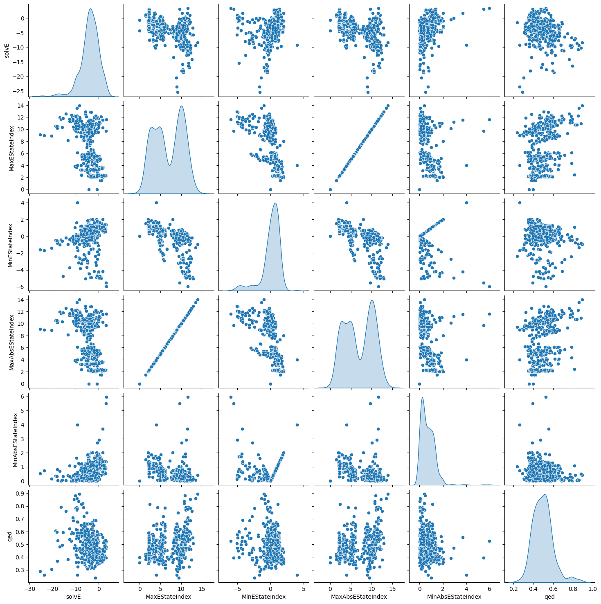
    


Let's also check the overall statistics. Note how each feature covers a very different range:


```python
train_dataset.describe().transpose()
```


<div>
<style scoped>
    .dataframe tbody tr th:only-of-type {
        vertical-align: middle;
    }

    .dataframe tbody tr th {
        vertical-align: top;
    }

    .dataframe thead th {
        text-align: right;
    }
</style>
<table border="1" class="dataframe">
  <thead>
    <tr style="text-align: right;">
      <th></th>
      <th>count</th>
      <th>mean</th>
      <th>std</th>
      <th>min</th>
      <th>25%</th>
      <th>50%</th>
      <th>75%</th>
      <th>max</th>
    </tr>
  </thead>
  <tbody>
    <tr>
      <th>MaxEStateIndex</th>
      <td>514.0</td>
      <td>6.942028</td>
      <td>3.405940</td>
      <td>0.000000</td>
      <td>3.830417</td>
      <td>6.165705</td>
      <td>10.098161</td>
      <td>13.966636</td>
    </tr>
    <tr>
      <th>MinEStateIndex</th>
      <td>514.0</td>
      <td>0.103372</td>
      <td>1.384829</td>
      <td>-5.968750</td>
      <td>-0.313387</td>
      <td>0.367020</td>
      <td>0.991528</td>
      <td>4.000000</td>
    </tr>
    <tr>
      <th>MaxAbsEStateIndex</th>
      <td>514.0</td>
      <td>6.942028</td>
      <td>3.405940</td>
      <td>0.000000</td>
      <td>3.830417</td>
      <td>6.165705</td>
      <td>10.098161</td>
      <td>13.966636</td>
    </tr>
    <tr>
      <th>MinAbsEStateIndex</th>
      <td>514.0</td>
      <td>0.694173</td>
      <td>0.627657</td>
      <td>0.000000</td>
      <td>0.222801</td>
      <td>0.604938</td>
      <td>1.072593</td>
      <td>5.968750</td>
    </tr>
    <tr>
      <th>qed</th>
      <td>514.0</td>
      <td>0.495016</td>
      <td>0.100407</td>
      <td>0.236106</td>
      <td>0.426415</td>
      <td>0.491036</td>
      <td>0.548168</td>
      <td>0.893750</td>
    </tr>
    <tr>
      <th>...</th>
      <td>...</td>
      <td>...</td>
      <td>...</td>
      <td>...</td>
      <td>...</td>
      <td>...</td>
      <td>...</td>
      <td>...</td>
    </tr>
    <tr>
      <th>fr_term_acetylene</th>
      <td>514.0</td>
      <td>0.011673</td>
      <td>0.107515</td>
      <td>0.000000</td>
      <td>0.000000</td>
      <td>0.000000</td>
      <td>0.000000</td>
      <td>1.000000</td>
    </tr>
    <tr>
      <th>fr_thiophene</th>
      <td>514.0</td>
      <td>0.003891</td>
      <td>0.062317</td>
      <td>0.000000</td>
      <td>0.000000</td>
      <td>0.000000</td>
      <td>0.000000</td>
      <td>1.000000</td>
    </tr>
    <tr>
      <th>fr_unbrch_alkane</th>
      <td>514.0</td>
      <td>0.287938</td>
      <td>0.868986</td>
      <td>0.000000</td>
      <td>0.000000</td>
      <td>0.000000</td>
      <td>0.000000</td>
      <td>6.000000</td>
    </tr>
    <tr>
      <th>fr_urea</th>
      <td>514.0</td>
      <td>0.001946</td>
      <td>0.044108</td>
      <td>0.000000</td>
      <td>0.000000</td>
      <td>0.000000</td>
      <td>0.000000</td>
      <td>1.000000</td>
    </tr>
    <tr>
      <th>solvE</th>
      <td>514.0</td>
      <td>-3.852821</td>
      <td>3.967431</td>
      <td>-25.470000</td>
      <td>-5.717500</td>
      <td>-3.530000</td>
      <td>-1.217500</td>
      <td>3.430000</td>
    </tr>
  </tbody>
</table>
<p>178 rows × 8 columns</p>
</div>


### Split features from labels

Separate the target value—the "label"—from the features. This label is the value that you will train the model to predict.


```python
train_features = train_dataset.copy()
test_features = test_dataset.copy()

train_labels = train_features.pop('solvE')
test_labels = test_features.pop('solvE')

all_features = dataset.copy()
all_labels = all_features.pop('solvE')
```

## Normalization

In the table of statistics it's easy to see how different the ranges of each feature are:


```python
train_dataset.describe().transpose()[['mean', 'std']]
```


<div>
<style scoped>
    .dataframe tbody tr th:only-of-type {
        vertical-align: middle;
    }

    .dataframe tbody tr th {
        vertical-align: top;
    }

    .dataframe thead th {
        text-align: right;
    }
</style>
<table border="1" class="dataframe">
  <thead>
    <tr style="text-align: right;">
      <th></th>
      <th>mean</th>
      <th>std</th>
    </tr>
  </thead>
  <tbody>
    <tr>
      <th>MaxEStateIndex</th>
      <td>6.942028</td>
      <td>3.405940</td>
    </tr>
    <tr>
      <th>MinEStateIndex</th>
      <td>0.103372</td>
      <td>1.384829</td>
    </tr>
    <tr>
      <th>MaxAbsEStateIndex</th>
      <td>6.942028</td>
      <td>3.405940</td>
    </tr>
    <tr>
      <th>MinAbsEStateIndex</th>
      <td>0.694173</td>
      <td>0.627657</td>
    </tr>
    <tr>
      <th>qed</th>
      <td>0.495016</td>
      <td>0.100407</td>
    </tr>
    <tr>
      <th>...</th>
      <td>...</td>
      <td>...</td>
    </tr>
    <tr>
      <th>fr_term_acetylene</th>
      <td>0.011673</td>
      <td>0.107515</td>
    </tr>
    <tr>
      <th>fr_thiophene</th>
      <td>0.003891</td>
      <td>0.062317</td>
    </tr>
    <tr>
      <th>fr_unbrch_alkane</th>
      <td>0.287938</td>
      <td>0.868986</td>
    </tr>
    <tr>
      <th>fr_urea</th>
      <td>0.001946</td>
      <td>0.044108</td>
    </tr>
    <tr>
      <th>solvE</th>
      <td>-3.852821</td>
      <td>3.967431</td>
    </tr>
  </tbody>
</table>
<p>178 rows × 2 columns</p>
</div>


It is good practice to normalize features that use different scales and ranges.

One reason this is important is because the features are multiplied by the model weights. So, the scale of the outputs and the scale of the gradients are affected by the scale of the inputs.

Although a model *might* converge without feature normalization, normalization makes training much more stable.

Note: There is no advantage to normalizing the one-hot features—it is done here for simplicity. For more details on how to use the preprocessing layers, refer to the [Working with preprocessing layers](https://www.tensorflow.org/guide/keras/preprocessing_layers) guide and the [Classify structured data using Keras preprocessing layers](../structured_data/preprocessing_layers.ipynb) tutorial.

### The Normalization layer

The `tf.keras.layers.Normalization` is a clean and simple way to add feature normalization into your model.

The first step is to create the layer:


```python
normalizer = tf.keras.layers.Normalization(axis=-1)
```

Then, fit the state of the preprocessing layer to the data by calling `Normalization.adapt`:


```python
normalizer.adapt(np.array(train_features))
```

    Metal device set to: Apple M1 Pro


    2023-01-07 16:42:51.767004: I tensorflow/core/common_runtime/pluggable_device/pluggable_device_factory.cc:306] Could not identify NUMA node of platform GPU ID 0, defaulting to 0. Your kernel may not have been built with NUMA support.
    2023-01-07 16:42:51.767459: I tensorflow/core/common_runtime/pluggable_device/pluggable_device_factory.cc:272] Created TensorFlow device (/job:localhost/replica:0/task:0/device:GPU:0 with 0 MB memory) -> physical PluggableDevice (device: 0, name: METAL, pci bus id: <undefined>)
    2023-01-07 16:42:51.813541: W tensorflow/core/platform/profile_utils/cpu_utils.cc:128] Failed to get CPU frequency: 0 Hz
    2023-01-07 16:42:51.866720: I tensorflow/core/grappler/optimizers/custom_graph_optimizer_registry.cc:114] Plugin optimizer for device_type GPU is enabled.
    2023-01-07 16:42:51.879975: I tensorflow/core/grappler/optimizers/custom_graph_optimizer_registry.cc:114] Plugin optimizer for device_type GPU is enabled.


Calculate the mean and variance, and store them in the layer:


```python
print(normalizer.mean.numpy())
```

    [[   6.942    0.103    6.942    0.694    0.495  137.471  127.986  137.137
        48.63     0.126   -0.279    0.289    0.131    1.217    1.679    1.947
        24.918   10.451    1.894   -1.911    1.998   -1.859    5.868    0.571
         2.759  150.755    6.662    5.252    5.791    4.09     2.838    3.239
         1.923    2.386    1.109    1.428    0.644    0.848   -0.486 1916.121
         7.001    3.366   27.841   55.855    3.505    1.745    0.912    0.421
         0.674    1.317    2.261    0.445    1.132    1.601   19.143   12.247
         6.113    3.508    5.092    9.976    0.102    1.011    0.986   14.842
         4.89    16.574    1.55     1.233    1.421    0.974    6.925    9.588
         3.096    2.792   14.576   12.556    1.105    0.758   20.547    2.549
         3.154    3.113    4.073    5.377    7.771    5.399    6.913    9.435
         7.24     3.828    2.694    4.51     2.853    0.665    0.118    3.146
         1.46     2.296    0.315    0.564    8.656    0.399    1.411    0.088
         0.049    0.136    0.428    0.088    0.516    1.313    0.34     2.181
         1.646    0.043    0.033    0.076    0.652    1.877   36.32     0.016
         0.093    0.088    0.039    0.002    0.13     0.039    0.076    0.018
         0.018    0.265    0.247    0.245    0.078    0.064    0.01     0.004
         0.039    0.01     0.037    0.37     0.13     0.047    0.064    0.152
         0.428    0.125    0.       0.076    0.251    0.652    0.002    0.008
         0.006    0.078    0.049    0.111    0.004    0.019    0.056    0.045
         0.019    0.002    0.086    0.076    0.074    0.004    0.004    0.004
         0.006    0.004    0.037    0.021    0.004    0.012    0.004    0.288
         0.002]]


When the layer is called, it returns the input data, with each feature independently normalized:


```python
first = np.array(train_features[:1])

with np.printoptions(precision=2, suppress=True):
  print('First example:', first)
  print()
  print('Normalized:', normalizer(first).numpy())
```

    First example: [[ 2.75  1.88  2.75  1.88  0.4  45.09 38.03 45.06 20.   -0.02 -0.32  0.32
       0.02  1.33  1.33  1.33 14.74 11.28  1.25 -1.59  0.98 -1.89  3.91  1.02
       1.63  2.75  2.71  2.5   2.5   1.41  1.    1.    0.5   0.5   0.    0.
       0.    0.   -0.04  2.75  2.96  1.96  1.96 20.65  5.32  0.    0.    0.
       0.    0.    0.    0.    0.    0.    0.   14.1   0.    0.    0.    0.
       0.    5.32  0.    0.   14.1   0.    0.    5.32  0.    0.    0.   14.1
       0.    0.    0.    0.    0.    0.   12.03  0.    0.    0.    0.    0.
       0.    0.   14.1   5.32  0.    0.    0.    0.    2.75  0.    0.    0.
       0.    0.    3.75  1.    3.    1.    1.    0.    0.    0.    0.    0.
       0.    1.    1.    1.    0.    0.    0.    0.    0.   -0.16 14.98  0.
       0.    0.    0.    0.    0.    0.    0.    0.    0.    0.    0.    0.
       1.    0.    0.    0.    0.    0.    0.    0.    0.    0.    0.    0.
       0.    0.    0.    0.    0.    0.    0.    0.    0.    0.    0.    0.
       0.    0.    0.    0.    0.    0.    0.    0.    0.    0.    0.    0.
       0.    0.    0.    0.    0.    0.    0.    0.    0.  ]]
    
    Normalized: [[-1.23  1.28 -1.23  1.88 -0.96 -1.35 -1.33 -1.36 -1.37 -1.01 -0.29  0.22
      -1.    0.32 -0.79 -1.22 -0.49  0.77 -2.01  1.27 -3.13 -0.1  -1.13  0.57
      -1.92 -0.92 -1.36 -1.24 -1.31 -1.38 -1.38 -1.35 -1.31 -1.13 -1.38 -1.
      -1.1  -0.72  0.6  -0.2  -1.3  -0.62 -0.06 -1.41  0.42 -0.51 -0.28 -0.24
      -0.32 -0.43 -0.56 -0.26 -0.3  -0.29 -1.08  0.18 -0.81 -0.56 -0.8  -0.67
      -0.14  1.58 -0.33 -1.01  1.26 -0.88 -0.4   1.41 -0.32 -0.31 -0.47  0.45
      -0.56 -0.55 -1.   -0.83 -0.24 -0.24 -0.37 -0.41 -0.58 -0.52 -0.61 -0.76
      -0.73 -0.6   0.66 -0.33 -0.51 -0.4  -0.39 -0.64 -0.02 -0.38 -0.09 -0.67
      -0.51 -0.88  3.22  1.07 -1.39  0.78 -0.25 -0.27 -0.23 -0.34 -0.65 -0.3
      -0.75 -0.21  1.02 -0.56 -0.82 -0.2  -0.18 -0.27 -0.84 -1.48 -1.33 -0.13
      -0.2  -0.19 -0.19 -0.04 -0.27 -0.14 -0.29 -0.13 -0.13 -0.53 -0.5  -0.41
       2.72 -0.25 -0.08 -0.06 -0.14 -0.1  -0.2  -0.34 -0.23 -0.19 -0.24 -0.32
      -0.65 -0.23  0.   -0.25 -0.42 -0.46 -0.04 -0.09 -0.08 -0.25 -0.23 -0.24
      -0.06 -0.14 -0.21 -0.18 -0.14 -0.04 -0.23 -0.29 -0.28 -0.06 -0.06 -0.06
      -0.08 -0.06 -0.2  -0.15 -0.06 -0.11 -0.06 -0.33 -0.04]]


## Linear regression

Before building a deep neural network model, start with linear regression using one and several variables.

### Linear regression with one variable

Begin with a single-variable linear regression to predict `'MPG'` from `'Horsepower'`.

Training a model with `tf.keras` typically starts by defining the model architecture. Use a `tf.keras.Sequential` model, which [represents a sequence of steps](https://www.tensorflow.org/guide/keras/sequential_model).

There are two steps in your single-variable linear regression model:

- Normalize the `'Horsepower'` input features using the `tf.keras.layers.Normalization` preprocessing layer.
- Apply a linear transformation ($y = mx+b$) to produce 1 output using a linear layer (`tf.keras.layers.Dense`).

The number of _inputs_ can either be set by the `input_shape` argument, or automatically when the model is run for the first time.

First, create a NumPy array made of the `'Horsepower'` features. Then, instantiate the `tf.keras.layers.Normalization` and fit its state to the `horsepower` data:


```python
tpsa = np.array(train_features['TPSA'])

tpsa_normalizer = layers.Normalization(input_shape=[1,], axis=None)
tpsa_normalizer.adapt(tpsa)
```

    2023-01-07 16:43:36.354416: I tensorflow/core/grappler/optimizers/custom_graph_optimizer_registry.cc:114] Plugin optimizer for device_type GPU is enabled.
    2023-01-07 16:43:36.368169: I tensorflow/core/grappler/optimizers/custom_graph_optimizer_registry.cc:114] Plugin optimizer for device_type GPU is enabled.


Build the Keras Sequential model:


```python
tpsa_model = tf.keras.Sequential([
    tpsa_normalizer,
    layers.Dense(units=1)
])

tpsa_model.summary()
```

    Model: "sequential"
    _________________________________________________________________
     Layer (type)                Output Shape              Param #   
    =================================================================
     normalization_1 (Normalizat  (None, 1)                3         
     ion)                                                            
                                                                     
     dense (Dense)               (None, 1)                 2         
                                                                     
    =================================================================
    Total params: 5
    Trainable params: 2
    Non-trainable params: 3
    _________________________________________________________________


This model will predict `'MPG'` from `'Horsepower'`.

Run the untrained model on the first 10 'Horsepower' values. The output won't be good, but notice that it has the expected shape of `(10, 1)`:


```python
tpsa_model.predict(tpsa[:10])
```

    1/1 [==============================] - 0s 69ms/step


    2023-01-06 23:18:14.713602: I tensorflow/core/grappler/optimizers/custom_graph_optimizer_registry.cc:114] Plugin optimizer for device_type GPU is enabled.


    array([[ 0.344],
           [-0.232],
           [ 0.457],
           [-0.131],
           [ 0.83 ],
           [ 0.83 ],
           [ 0.344],
           [ 0.83 ],
           [ 0.457],
           [ 0.084]], dtype=float32)


Once the model is built, configure the training procedure using the Keras `Model.compile` method. The most important arguments to compile are the `loss` and the `optimizer`, since these define what will be optimized (`mean_absolute_error`) and how (using the `tf.keras.optimizers.Adam`).


```python
tpsa_model.compile(
    optimizer=tf.keras.optimizers.Adam(learning_rate=0.1),
    loss='mean_absolute_error')
```

Use Keras `Model.fit` to execute the training for 100 epochs:


```python
%%time
history = tpsa_model.fit(
    train_features['TPSA'],
    train_labels,
    epochs=100,
    # Suppress logging.
    verbose=0,
    # Calculate validation results on 20% of the training data.
    validation_split = 0.2)
```

    /Users/ansoncherk/mambaforge/envs/my_tf_env_3/lib/python3.9/site-packages/keras/engine/data_adapter.py:1699: FutureWarning: The behavior of `series[i:j]` with an integer-dtype index is deprecated. In a future version, this will be treated as *label-based* indexing, consistent with e.g. `series[i]` lookups. To retain the old behavior, use `series.iloc[i:j]`. To get the future behavior, use `series.loc[i:j]`.
      return t[start:end]
    2023-01-06 23:18:19.962057: I tensorflow/core/grappler/optimizers/custom_graph_optimizer_registry.cc:114] Plugin optimizer for device_type GPU is enabled.
    2023-01-06 23:18:20.151464: I tensorflow/core/grappler/optimizers/custom_graph_optimizer_registry.cc:114] Plugin optimizer for device_type GPU is enabled.


    CPU times: user 4.89 s, sys: 2.87 s, total: 7.76 s
    Wall time: 6.09 s


Visualize the model's training progress using the stats stored in the `history` object:


```python
hist = pd.DataFrame(history.history)
hist['epoch'] = history.epoch
hist.tail()
```


<div>
<style scoped>
    .dataframe tbody tr th:only-of-type {
        vertical-align: middle;
    }

    .dataframe tbody tr th {
        vertical-align: top;
    }

    .dataframe thead th {
        text-align: right;
    }
</style>
<table border="1" class="dataframe">
  <thead>
    <tr style="text-align: right;">
      <th></th>
      <th>loss</th>
      <th>val_loss</th>
      <th>epoch</th>
    </tr>
  </thead>
  <tbody>
    <tr>
      <th>95</th>
      <td>1.814270</td>
      <td>2.230307</td>
      <td>95</td>
    </tr>
    <tr>
      <th>96</th>
      <td>1.815024</td>
      <td>2.217665</td>
      <td>96</td>
    </tr>
    <tr>
      <th>97</th>
      <td>1.811345</td>
      <td>2.215517</td>
      <td>97</td>
    </tr>
    <tr>
      <th>98</th>
      <td>1.819407</td>
      <td>2.241472</td>
      <td>98</td>
    </tr>
    <tr>
      <th>99</th>
      <td>1.811596</td>
      <td>2.225083</td>
      <td>99</td>
    </tr>
  </tbody>
</table>
</div>


```python
plot_loss(history)
```


    
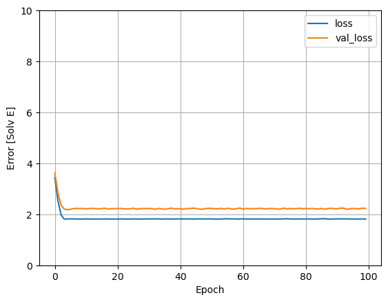
    


Collect the results on the test set for later:


```python
test_results = {}

test_results['tpsa_model'] = tpsa_model.evaluate(
    test_features['TPSA'],
    test_labels, verbose=0)
```

Since this is a single variable regression, it's easy to view the model's predictions as a function of the input:


```python
x = tf.linspace(0.0, 250, 251)
y = tpsa_model.predict(x)
```

    8/8 [==============================] - 0s 3ms/step


    2023-01-06 23:18:50.600718: I tensorflow/core/grappler/optimizers/custom_graph_optimizer_registry.cc:114] Plugin optimizer for device_type GPU is enabled.


```python
def plot_tpsa(x, y):
  plt.scatter(train_features['TPSA'], train_labels, label='Data')
  plt.plot(x, y, color='k', label='Predictions')
  plt.xlabel('TPSA')
  plt.ylabel('Solv E')
  plt.legend()
```


```python
plot_tpsa(x, y)
```


    
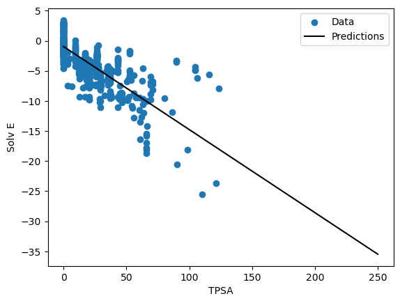
    


### Linear regression with multiple inputs

You can use an almost identical setup to make predictions based on multiple inputs. This model still does the same $y = mx+b$ except that $m$ is a matrix and $b$ is a vector.

Create a two-step Keras Sequential model again with the first layer being `normalizer` (`tf.keras.layers.Normalization(axis=-1)`) you defined earlier and adapted to the whole dataset:


```python
linear_model = tf.keras.Sequential([
    normalizer,
    layers.Dense(units=1)
])
```

When you call `Model.predict` on a batch of inputs, it produces `units=1` outputs for each example:


```python
linear_model.predict(train_features[:10])
```

    1/1 [==============================] - 0s 136ms/step


    2023-01-05 14:54:56.045460: I tensorflow/core/grappler/optimizers/custom_graph_optimizer_registry.cc:114] Plugin optimizer for device_type GPU is enabled.


    array([[-0.268],
           [ 0.03 ],
           [ 0.323],
           [ 0.571],
           [ 0.174],
           [-0.47 ],
           [-0.155],
           [-1.629],
           [ 0.55 ],
           [ 1.153]], dtype=float32)


When you call the model, its weight matrices will be built—check that the `kernel` weights (the $m$ in $y=mx+b$) have a shape of `(9, 1)`:


```python
linear_model.layers[1].kernel
```


    <tf.Variable 'dense_1/kernel:0' shape=(177, 1) dtype=float32, numpy=
    array([[-0.032],
           [-0.166],
           [ 0.063],
           [-0.035],
           [ 0.046],
           [-0.012],
           [ 0.065],
           [ 0.092],
           [-0.128],
           [-0.022],
           [ 0.173],
           [ 0.105],
           [ 0.164],
           [ 0.003],
           [-0.144],
           [ 0.021],
           [-0.042],
           [ 0.143],
           [ 0.083],
           [ 0.036],
           [-0.048],
           [-0.112],
           [ 0.122],
           [-0.162],
           [-0.048],
           [-0.093],
           [-0.136],
           [ 0.156],
           [-0.046],
           [-0.145],
           [ 0.119],
           [-0.142],
           [-0.119],
           [ 0.144],
           [-0.038],
           [-0.174],
           [-0.059],
           [ 0.182],
           [-0.102],
           [ 0.003],
           [-0.085],
           [ 0.079],
           [ 0.144],
           [ 0.096],
           [-0.046],
           [-0.159],
           [-0.044],
           [-0.024],
           [ 0.083],
           [-0.163],
           [-0.027],
           [ 0.122],
           [ 0.142],
           [-0.118],
           [ 0.052],
           [-0.023],
           [ 0.151],
           [ 0.03 ],
           [-0.147],
           [-0.134],
           [ 0.152],
           [-0.149],
           [ 0.118],
           [-0.178],
           [-0.017],
           [ 0.181],
           [-0.021],
           [-0.101],
           [ 0.03 ],
           [-0.133],
           [ 0.009],
           [ 0.181],
           [ 0.087],
           [-0.057],
           [ 0.103],
           [-0.065],
           [ 0.179],
           [ 0.106],
           [-0.083],
           [ 0.123],
           [ 0.001],
           [ 0.157],
           [-0.026],
           [ 0.041],
           [ 0.003],
           [-0.156],
           [ 0.058],
           [ 0.022],
           [-0.1  ],
           [ 0.084],
           [ 0.175],
           [ 0.128],
           [ 0.158],
           [-0.111],
           [ 0.108],
           [-0.134],
           [-0.033],
           [ 0.095],
           [ 0.133],
           [-0.023],
           [ 0.052],
           [ 0.093],
           [-0.162],
           [-0.001],
           [-0.115],
           [ 0.046],
           [ 0.064],
           [-0.003],
           [ 0.131],
           [-0.141],
           [ 0.039],
           [ 0.068],
           [ 0.085],
           [-0.14 ],
           [ 0.147],
           [ 0.171],
           [-0.171],
           [-0.053],
           [ 0.097],
           [-0.164],
           [ 0.169],
           [ 0.02 ],
           [-0.107],
           [-0.127],
           [-0.145],
           [-0.144],
           [ 0.182],
           [ 0.151],
           [ 0.096],
           [-0.116],
           [-0.054],
           [ 0.146],
           [-0.061],
           [ 0.162],
           [-0.095],
           [ 0.014],
           [ 0.181],
           [ 0.166],
           [-0.183],
           [-0.001],
           [ 0.091],
           [-0.1  ],
           [ 0.163],
           [-0.151],
           [ 0.102],
           [-0.1  ],
           [-0.164],
           [-0.072],
           [ 0.147],
           [-0.089],
           [-0.15 ],
           [ 0.046],
           [-0.14 ],
           [ 0.183],
           [ 0.084],
           [-0.177],
           [-0.113],
           [-0.004],
           [-0.162],
           [-0.1  ],
           [-0.169],
           [ 0.123],
           [ 0.084],
           [ 0.026],
           [-0.079],
           [ 0.078],
           [ 0.007],
           [-0.169],
           [ 0.047],
           [-0.155],
           [ 0.062],
           [ 0.026],
           [ 0.015],
           [-0.067],
           [-0.121],
           [-0.149],
           [ 0.037]], dtype=float32)>


Configure the model with Keras `Model.compile` and train with `Model.fit` for 100 epochs:


```python
linear_model.compile(
    optimizer=tf.keras.optimizers.Adam(learning_rate=0.1),
    loss='mean_absolute_error')
```


```python
%%time
history = linear_model.fit(
    train_features,
    train_labels,
    epochs=100,
    # Suppress logging.
    verbose=0,
    # Calculate validation results on 20% of the training data.
    validation_split = 0.2)
```

    /Users/ansoncherk/mambaforge/envs/my_tf_env_3/lib/python3.9/site-packages/keras/engine/data_adapter.py:1699: FutureWarning: The behavior of `series[i:j]` with an integer-dtype index is deprecated. In a future version, this will be treated as *label-based* indexing, consistent with e.g. `series[i]` lookups. To retain the old behavior, use `series.iloc[i:j]`. To get the future behavior, use `series.loc[i:j]`.
      return t[start:end]
    2023-01-05 14:55:11.716537: I tensorflow/core/grappler/optimizers/custom_graph_optimizer_registry.cc:114] Plugin optimizer for device_type GPU is enabled.
    2023-01-05 14:55:11.899951: I tensorflow/core/grappler/optimizers/custom_graph_optimizer_registry.cc:114] Plugin optimizer for device_type GPU is enabled.


    CPU times: user 4.62 s, sys: 2.52 s, total: 7.14 s
    Wall time: 5.79 s


Using all the inputs in this regression model achieves a much lower training and validation error than the `horsepower_model`, which had one input:


```python
plot_loss(history)
```


    
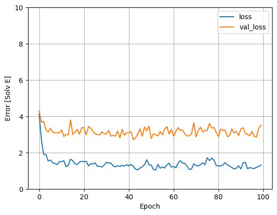
    


Collect the results on the test set for later:


```python
test_results['linear_model'] = linear_model.evaluate(
    test_features, test_labels, verbose=0)
```

## Regression with a deep neural network (DNN)

In the previous section, you implemented two linear models for single and multiple inputs.

Here, you will implement single-input and multiple-input DNN models.

The code is basically the same except the model is expanded to include some "hidden" non-linear layers. The name "hidden" here just means not directly connected to the inputs or outputs.

These models will contain a few more layers than the linear model:

* The normalization layer, as before (with `horsepower_normalizer` for a single-input model and `normalizer` for a multiple-input model).
* Two hidden, non-linear, `Dense` layers with the ReLU (`relu`) activation function nonlinearity.
* A linear `Dense` single-output layer.

Both models will use the same training procedure, so the `compile` method is included in the `build_and_compile_model` function below.


```python
def build_and_compile_model(norm):
  model = keras.Sequential([
      norm,
      layers.Dense(120, activation='selu', kernel_initializer='lecun_normal', use_bias=True),
      #layers.Dense(150, activation='selu', kernel_initializer='lecun_normal'),
      layers.Dense(1, activation='linear')
  ])

  model.compile(loss='huber_loss',
                optimizer=tf.keras.optimizers.Adam(0.01))
  return model
```

### K-Folds Cross Validation


```python
from sklearn.model_selection import KFold
import numpy as np
```

Ref: https://github.com/christianversloot/machine-learning-articles/blob/main/how-to-use-k-fold-cross-validation-with-keras.md


```python
num_folds = 10
```


```python
#Turn into np array
train_k_features = np.array(all_features)
train_k_labels = np.array(all_labels)
```


```python
#normalisation
normalizer = tf.keras.layers.Normalization(axis=-1)
```


```python
normalizer.adapt(train_k_features)
```

    Metal device set to: Apple M1 Pro


    2023-01-08 21:09:55.230464: I tensorflow/core/common_runtime/pluggable_device/pluggable_device_factory.cc:306] Could not identify NUMA node of platform GPU ID 0, defaulting to 0. Your kernel may not have been built with NUMA support.
    2023-01-08 21:09:55.231125: I tensorflow/core/common_runtime/pluggable_device/pluggable_device_factory.cc:272] Created TensorFlow device (/job:localhost/replica:0/task:0/device:GPU:0 with 0 MB memory) -> physical PluggableDevice (device: 0, name: METAL, pci bus id: <undefined>)
    2023-01-08 21:09:55.284032: W tensorflow/core/platform/profile_utils/cpu_utils.cc:128] Failed to get CPU frequency: 0 Hz
    2023-01-08 21:09:55.340921: I tensorflow/core/grappler/optimizers/custom_graph_optimizer_registry.cc:114] Plugin optimizer for device_type GPU is enabled.
    2023-01-08 21:09:55.354277: I tensorflow/core/grappler/optimizers/custom_graph_optimizer_registry.cc:114] Plugin optimizer for device_type GPU is enabled.


```python
# Define the K-fold Cross Validator
kfold = KFold(n_splits=num_folds, shuffle=True)
```


```python
def dnn_default_model(norm):
  model = keras.Sequential([
      norm,
      layers.Dense(128, activation='selu', kernel_initializer='lecun_normal', use_bias=True),
      layers.Dense(1, activation='linear')
  ])
  return model

def dnn_2hidden_179_model(norm):
  model = keras.Sequential([
      norm,
      layers.Dense(179, activation='selu', kernel_initializer='lecun_normal', use_bias=True),
      layers.Dense(128, activation='selu', kernel_initializer='lecun_normal', use_bias=True),
      layers.Dense(1, activation='linear')
  ])
  return model

def dnn_relu_model(norm):
  model = keras.Sequential([
      norm,
      layers.Dense(128, activation='relu', use_bias=True),
      layers.Dense(1, activation='linear')
  ])
  return model

def dnn_179_model(norm):
  model = keras.Sequential([
      norm,
      layers.Dense(179, activation='selu', kernel_initializer='lecun_normal', use_bias=True),
      layers.Dense(1, activation='linear')
  ])
  return model

def dnn_tanh_model(norm):
  model = keras.Sequential([
      norm,
      layers.Dense(128, activation='tanh', use_bias=True),
      layers.Dense(1, activation='linear')
  ])
  return model
```


```python
model_names = {'dnn_default': dnn_default_model(normalizer), 
               'dnn_2hidden_179': dnn_2hidden_179_model(normalizer), 
               'dnn_relu': dnn_relu_model(normalizer), 
               'dnn_179': dnn_179_model(normalizer), 
               'dnn_tanh': dnn_tanh_model(normalizer)}
```


```python
for x, y in model_names.items():
    print(x, y)
```

    dnn_default <keras.engine.sequential.Sequential object at 0x16983e9a0>
    dnn_2hidden_179 <keras.engine.sequential.Sequential object at 0x155ef7a00>
    dnn_relu <keras.engine.sequential.Sequential object at 0x169e2e3d0>
    dnn_179 <keras.engine.sequential.Sequential object at 0x169e403a0>
    dnn_tanh <keras.engine.sequential.Sequential object at 0x155a10c40>


```python
model_scores = pd.DataFrame()
```


```python
for x, y in model_names.items():
    # Define per-fold score containers
    loss_per_fold = []

    # Huber Loss - K-fold Cross Validation model evaluation
    fold_no = 1

    for train, test in kfold.split(train_k_features, train_k_labels):
        # Define the model architecture
        model = y

        # Compile the model
        model.compile(loss='huber_loss',
                      optimizer=tf.keras.optimizers.Adam(0.01))

        # Generate a print
        print('------------------------------------------------------------------------')
        print(f'Training for fold {fold_no} ...')

        # Fit data to model
        history = model.fit(train_k_features[train], train_k_labels[train],
                            validation_split=0.2,
                            verbose=0, 
                            epochs=100)

        # Generate generalization metrics
        scores = model.evaluate(train_k_features[test], train_k_labels[test], verbose=0)
        print(f'Score for fold {fold_no}: {model.metrics_names[0]} of {scores}')
        loss_per_fold.append(scores)

        # Increase fold number
        fold_no = fold_no + 1

    # == Provide average scores ==
    print('------------------------------------------------------------------------')
    print('Score per fold')
    for i in range(0, len(loss_per_fold)):
        print('------------------------------------------------------------------------')
        print(f'> Fold {i+1} - Loss: {loss_per_fold[i]}')
    print('------------------------------------------------------------------------')
    print('Average scores for all folds:')
    print(f'> Loss: {np.mean(loss_per_fold)}')
    print('------------------------------------------------------------------------')

    #save to dataFrame
    model_scores[x] = loss_per_fold
```

    ------------------------------------------------------------------------
    Training for fold 1 ...


    2023-01-08 20:41:41.733511: I tensorflow/core/grappler/optimizers/custom_graph_optimizer_registry.cc:114] Plugin optimizer for device_type GPU is enabled.
    2023-01-08 20:41:42.353960: I tensorflow/core/grappler/optimizers/custom_graph_optimizer_registry.cc:114] Plugin optimizer for device_type GPU is enabled.


    Score for fold 1: loss of 0.8064390420913696
    ------------------------------------------------------------------------
    Training for fold 2 ...


    2023-01-08 20:41:53.229675: I tensorflow/core/grappler/optimizers/custom_graph_optimizer_registry.cc:114] Plugin optimizer for device_type GPU is enabled.
    2023-01-08 20:41:53.448721: I tensorflow/core/grappler/optimizers/custom_graph_optimizer_registry.cc:114] Plugin optimizer for device_type GPU is enabled.


    Score for fold 2: loss of 0.23177671432495117
    ------------------------------------------------------------------------
    Training for fold 3 ...


    2023-01-08 20:42:04.241252: I tensorflow/core/grappler/optimizers/custom_graph_optimizer_registry.cc:114] Plugin optimizer for device_type GPU is enabled.
    2023-01-08 20:42:04.581552: I tensorflow/core/grappler/optimizers/custom_graph_optimizer_registry.cc:114] Plugin optimizer for device_type GPU is enabled.


    Score for fold 3: loss of 0.43954747915267944
    ------------------------------------------------------------------------
    Training for fold 4 ...


    2023-01-08 20:42:15.820755: I tensorflow/core/grappler/optimizers/custom_graph_optimizer_registry.cc:114] Plugin optimizer for device_type GPU is enabled.
    2023-01-08 20:42:16.048463: I tensorflow/core/grappler/optimizers/custom_graph_optimizer_registry.cc:114] Plugin optimizer for device_type GPU is enabled.


    Score for fold 4: loss of 0.1854863166809082
    ------------------------------------------------------------------------
    Training for fold 5 ...


    2023-01-08 20:42:26.955031: I tensorflow/core/grappler/optimizers/custom_graph_optimizer_registry.cc:114] Plugin optimizer for device_type GPU is enabled.
    2023-01-08 20:42:27.181843: I tensorflow/core/grappler/optimizers/custom_graph_optimizer_registry.cc:114] Plugin optimizer for device_type GPU is enabled.


    Score for fold 5: loss of 0.14767824113368988
    ------------------------------------------------------------------------
    Training for fold 6 ...


    2023-01-08 20:42:39.651327: I tensorflow/core/grappler/optimizers/custom_graph_optimizer_registry.cc:114] Plugin optimizer for device_type GPU is enabled.
    2023-01-08 20:42:39.882947: I tensorflow/core/grappler/optimizers/custom_graph_optimizer_registry.cc:114] Plugin optimizer for device_type GPU is enabled.


    Score for fold 6: loss of 0.14739260077476501
    ------------------------------------------------------------------------
    Training for fold 7 ...


    2023-01-08 20:42:51.480885: I tensorflow/core/grappler/optimizers/custom_graph_optimizer_registry.cc:114] Plugin optimizer for device_type GPU is enabled.
    2023-01-08 20:42:51.705505: I tensorflow/core/grappler/optimizers/custom_graph_optimizer_registry.cc:114] Plugin optimizer for device_type GPU is enabled.


    Score for fold 7: loss of 0.09759721904993057
    ------------------------------------------------------------------------
    Training for fold 8 ...


    2023-01-08 20:43:02.706646: I tensorflow/core/grappler/optimizers/custom_graph_optimizer_registry.cc:114] Plugin optimizer for device_type GPU is enabled.
    2023-01-08 20:43:02.943486: I tensorflow/core/grappler/optimizers/custom_graph_optimizer_registry.cc:114] Plugin optimizer for device_type GPU is enabled.


    Score for fold 8: loss of 0.09997028112411499
    ------------------------------------------------------------------------
    Training for fold 9 ...


    2023-01-08 20:43:14.255426: I tensorflow/core/grappler/optimizers/custom_graph_optimizer_registry.cc:114] Plugin optimizer for device_type GPU is enabled.
    2023-01-08 20:43:14.515075: I tensorflow/core/grappler/optimizers/custom_graph_optimizer_registry.cc:114] Plugin optimizer for device_type GPU is enabled.


    Score for fold 9: loss of 0.08643718808889389
    ------------------------------------------------------------------------
    Training for fold 10 ...


    2023-01-08 20:43:25.239068: I tensorflow/core/grappler/optimizers/custom_graph_optimizer_registry.cc:114] Plugin optimizer for device_type GPU is enabled.
    2023-01-08 20:43:25.459841: I tensorflow/core/grappler/optimizers/custom_graph_optimizer_registry.cc:114] Plugin optimizer for device_type GPU is enabled.


    Score for fold 10: loss of 0.07478686422109604
    ------------------------------------------------------------------------
    Score per fold
    ------------------------------------------------------------------------
    > Fold 1 - Loss: 0.8064390420913696
    ------------------------------------------------------------------------
    > Fold 2 - Loss: 0.23177671432495117
    ------------------------------------------------------------------------
    > Fold 3 - Loss: 0.43954747915267944
    ------------------------------------------------------------------------
    > Fold 4 - Loss: 0.1854863166809082
    ------------------------------------------------------------------------
    > Fold 5 - Loss: 0.14767824113368988
    ------------------------------------------------------------------------
    > Fold 6 - Loss: 0.14739260077476501
    ------------------------------------------------------------------------
    > Fold 7 - Loss: 0.09759721904993057
    ------------------------------------------------------------------------
    > Fold 8 - Loss: 0.09997028112411499
    ------------------------------------------------------------------------
    > Fold 9 - Loss: 0.08643718808889389
    ------------------------------------------------------------------------
    > Fold 10 - Loss: 0.07478686422109604
    ------------------------------------------------------------------------
    Average scores for all folds:
    > Loss: 0.2317111946642399
    ------------------------------------------------------------------------
    ------------------------------------------------------------------------
    Training for fold 1 ...


    2023-01-08 20:43:36.807217: I tensorflow/core/grappler/optimizers/custom_graph_optimizer_registry.cc:114] Plugin optimizer for device_type GPU is enabled.
    2023-01-08 20:43:37.164076: I tensorflow/core/grappler/optimizers/custom_graph_optimizer_registry.cc:114] Plugin optimizer for device_type GPU is enabled.


    Score for fold 1: loss of 0.5653460025787354
    ------------------------------------------------------------------------
    Training for fold 2 ...


    2023-01-08 20:43:52.980057: I tensorflow/core/grappler/optimizers/custom_graph_optimizer_registry.cc:114] Plugin optimizer for device_type GPU is enabled.
    2023-01-08 20:43:53.300994: I tensorflow/core/grappler/optimizers/custom_graph_optimizer_registry.cc:114] Plugin optimizer for device_type GPU is enabled.


    Score for fold 2: loss of 0.21952959895133972
    ------------------------------------------------------------------------
    Training for fold 3 ...


    2023-01-08 20:44:08.179134: I tensorflow/core/grappler/optimizers/custom_graph_optimizer_registry.cc:114] Plugin optimizer for device_type GPU is enabled.
    2023-01-08 20:44:08.511039: I tensorflow/core/grappler/optimizers/custom_graph_optimizer_registry.cc:114] Plugin optimizer for device_type GPU is enabled.


    Score for fold 3: loss of 0.16969168186187744
    ------------------------------------------------------------------------
    Training for fold 4 ...


    2023-01-08 20:44:23.334029: I tensorflow/core/grappler/optimizers/custom_graph_optimizer_registry.cc:114] Plugin optimizer for device_type GPU is enabled.
    2023-01-08 20:44:23.654832: I tensorflow/core/grappler/optimizers/custom_graph_optimizer_registry.cc:114] Plugin optimizer for device_type GPU is enabled.


    Score for fold 4: loss of 2.2519683837890625
    ------------------------------------------------------------------------
    Training for fold 5 ...


    2023-01-08 20:44:37.987222: I tensorflow/core/grappler/optimizers/custom_graph_optimizer_registry.cc:114] Plugin optimizer for device_type GPU is enabled.
    2023-01-08 20:44:38.278214: I tensorflow/core/grappler/optimizers/custom_graph_optimizer_registry.cc:114] Plugin optimizer for device_type GPU is enabled.


    Score for fold 5: loss of 0.09615465998649597
    ------------------------------------------------------------------------
    Training for fold 6 ...


    2023-01-08 20:44:52.575618: I tensorflow/core/grappler/optimizers/custom_graph_optimizer_registry.cc:114] Plugin optimizer for device_type GPU is enabled.
    2023-01-08 20:44:52.867754: I tensorflow/core/grappler/optimizers/custom_graph_optimizer_registry.cc:114] Plugin optimizer for device_type GPU is enabled.


    Score for fold 6: loss of 1.14065420627594
    ------------------------------------------------------------------------
    Training for fold 7 ...


    2023-01-08 20:45:08.033615: I tensorflow/core/grappler/optimizers/custom_graph_optimizer_registry.cc:114] Plugin optimizer for device_type GPU is enabled.
    2023-01-08 20:45:08.378747: I tensorflow/core/grappler/optimizers/custom_graph_optimizer_registry.cc:114] Plugin optimizer for device_type GPU is enabled.


    Score for fold 7: loss of 0.312457799911499
    ------------------------------------------------------------------------
    Training for fold 8 ...


    2023-01-08 20:45:24.335162: I tensorflow/core/grappler/optimizers/custom_graph_optimizer_registry.cc:114] Plugin optimizer for device_type GPU is enabled.
    2023-01-08 20:45:24.675066: I tensorflow/core/grappler/optimizers/custom_graph_optimizer_registry.cc:114] Plugin optimizer for device_type GPU is enabled.


    Score for fold 8: loss of 0.13958729803562164
    ------------------------------------------------------------------------
    Training for fold 9 ...


    2023-01-08 20:45:39.287786: I tensorflow/core/grappler/optimizers/custom_graph_optimizer_registry.cc:114] Plugin optimizer for device_type GPU is enabled.
    2023-01-08 20:45:39.643675: I tensorflow/core/grappler/optimizers/custom_graph_optimizer_registry.cc:114] Plugin optimizer for device_type GPU is enabled.


    Score for fold 9: loss of 0.2276785969734192
    ------------------------------------------------------------------------
    Training for fold 10 ...


    2023-01-08 20:45:54.329450: I tensorflow/core/grappler/optimizers/custom_graph_optimizer_registry.cc:114] Plugin optimizer for device_type GPU is enabled.
    2023-01-08 20:45:54.652355: I tensorflow/core/grappler/optimizers/custom_graph_optimizer_registry.cc:114] Plugin optimizer for device_type GPU is enabled.


    Score for fold 10: loss of 1.748969316482544
    ------------------------------------------------------------------------
    Score per fold
    ------------------------------------------------------------------------
    > Fold 1 - Loss: 0.5653460025787354
    ------------------------------------------------------------------------
    > Fold 2 - Loss: 0.21952959895133972
    ------------------------------------------------------------------------
    > Fold 3 - Loss: 0.16969168186187744
    ------------------------------------------------------------------------
    > Fold 4 - Loss: 2.2519683837890625
    ------------------------------------------------------------------------
    > Fold 5 - Loss: 0.09615465998649597
    ------------------------------------------------------------------------
    > Fold 6 - Loss: 1.14065420627594
    ------------------------------------------------------------------------
    > Fold 7 - Loss: 0.312457799911499
    ------------------------------------------------------------------------
    > Fold 8 - Loss: 0.13958729803562164
    ------------------------------------------------------------------------
    > Fold 9 - Loss: 0.2276785969734192
    ------------------------------------------------------------------------
    > Fold 10 - Loss: 1.748969316482544
    ------------------------------------------------------------------------
    Average scores for all folds:
    > Loss: 0.6872037544846534
    ------------------------------------------------------------------------
    ------------------------------------------------------------------------
    Training for fold 1 ...


    2023-01-08 20:46:09.261045: I tensorflow/core/grappler/optimizers/custom_graph_optimizer_registry.cc:114] Plugin optimizer for device_type GPU is enabled.
    2023-01-08 20:46:09.530688: I tensorflow/core/grappler/optimizers/custom_graph_optimizer_registry.cc:114] Plugin optimizer for device_type GPU is enabled.


    Score for fold 1: loss of 0.5004034638404846
    ------------------------------------------------------------------------
    Training for fold 2 ...


    2023-01-08 20:46:18.133185: I tensorflow/core/grappler/optimizers/custom_graph_optimizer_registry.cc:114] Plugin optimizer for device_type GPU is enabled.
    2023-01-08 20:46:18.372224: I tensorflow/core/grappler/optimizers/custom_graph_optimizer_registry.cc:114] Plugin optimizer for device_type GPU is enabled.


    Score for fold 2: loss of 0.16535085439682007
    ------------------------------------------------------------------------
    Training for fold 3 ...


    2023-01-08 20:46:26.798498: I tensorflow/core/grappler/optimizers/custom_graph_optimizer_registry.cc:114] Plugin optimizer for device_type GPU is enabled.
    2023-01-08 20:46:27.053139: I tensorflow/core/grappler/optimizers/custom_graph_optimizer_registry.cc:114] Plugin optimizer for device_type GPU is enabled.


    Score for fold 3: loss of 0.12453947216272354
    ------------------------------------------------------------------------
    Training for fold 4 ...


    2023-01-08 20:46:35.491192: I tensorflow/core/grappler/optimizers/custom_graph_optimizer_registry.cc:114] Plugin optimizer for device_type GPU is enabled.
    2023-01-08 20:46:35.734247: I tensorflow/core/grappler/optimizers/custom_graph_optimizer_registry.cc:114] Plugin optimizer for device_type GPU is enabled.


    Score for fold 4: loss of 0.43046116828918457
    ------------------------------------------------------------------------
    Training for fold 5 ...


    2023-01-08 20:46:44.198926: I tensorflow/core/grappler/optimizers/custom_graph_optimizer_registry.cc:114] Plugin optimizer for device_type GPU is enabled.
    2023-01-08 20:46:44.482868: I tensorflow/core/grappler/optimizers/custom_graph_optimizer_registry.cc:114] Plugin optimizer for device_type GPU is enabled.


    Score for fold 5: loss of 0.06540589034557343
    ------------------------------------------------------------------------
    Training for fold 6 ...


    2023-01-08 20:46:53.233103: I tensorflow/core/grappler/optimizers/custom_graph_optimizer_registry.cc:114] Plugin optimizer for device_type GPU is enabled.
    2023-01-08 20:46:53.502510: I tensorflow/core/grappler/optimizers/custom_graph_optimizer_registry.cc:114] Plugin optimizer for device_type GPU is enabled.


    Score for fold 6: loss of 0.09904982894659042
    ------------------------------------------------------------------------
    Training for fold 7 ...


    2023-01-08 20:47:02.193962: I tensorflow/core/grappler/optimizers/custom_graph_optimizer_registry.cc:114] Plugin optimizer for device_type GPU is enabled.
    2023-01-08 20:47:02.490778: I tensorflow/core/grappler/optimizers/custom_graph_optimizer_registry.cc:114] Plugin optimizer for device_type GPU is enabled.


    Score for fold 7: loss of 0.16179271042346954
    ------------------------------------------------------------------------
    Training for fold 8 ...


    2023-01-08 20:47:11.145047: I tensorflow/core/grappler/optimizers/custom_graph_optimizer_registry.cc:114] Plugin optimizer for device_type GPU is enabled.
    2023-01-08 20:47:11.442643: I tensorflow/core/grappler/optimizers/custom_graph_optimizer_registry.cc:114] Plugin optimizer for device_type GPU is enabled.


    Score for fold 8: loss of 0.08877626061439514
    ------------------------------------------------------------------------
    Training for fold 9 ...


    2023-01-08 20:47:19.818106: I tensorflow/core/grappler/optimizers/custom_graph_optimizer_registry.cc:114] Plugin optimizer for device_type GPU is enabled.
    2023-01-08 20:47:20.146597: I tensorflow/core/grappler/optimizers/custom_graph_optimizer_registry.cc:114] Plugin optimizer for device_type GPU is enabled.


    Score for fold 9: loss of 0.17348703742027283
    ------------------------------------------------------------------------
    Training for fold 10 ...


    2023-01-08 20:47:28.650192: I tensorflow/core/grappler/optimizers/custom_graph_optimizer_registry.cc:114] Plugin optimizer for device_type GPU is enabled.
    2023-01-08 20:47:28.958799: I tensorflow/core/grappler/optimizers/custom_graph_optimizer_registry.cc:114] Plugin optimizer for device_type GPU is enabled.


    Score for fold 10: loss of 0.035332292318344116
    ------------------------------------------------------------------------
    Score per fold
    ------------------------------------------------------------------------
    > Fold 1 - Loss: 0.5004034638404846
    ------------------------------------------------------------------------
    > Fold 2 - Loss: 0.16535085439682007
    ------------------------------------------------------------------------
    > Fold 3 - Loss: 0.12453947216272354
    ------------------------------------------------------------------------
    > Fold 4 - Loss: 0.43046116828918457
    ------------------------------------------------------------------------
    > Fold 5 - Loss: 0.06540589034557343
    ------------------------------------------------------------------------
    > Fold 6 - Loss: 0.09904982894659042
    ------------------------------------------------------------------------
    > Fold 7 - Loss: 0.16179271042346954
    ------------------------------------------------------------------------
    > Fold 8 - Loss: 0.08877626061439514
    ------------------------------------------------------------------------
    > Fold 9 - Loss: 0.17348703742027283
    ------------------------------------------------------------------------
    > Fold 10 - Loss: 0.035332292318344116
    ------------------------------------------------------------------------
    Average scores for all folds:
    > Loss: 0.18445989787578582
    ------------------------------------------------------------------------
    ------------------------------------------------------------------------
    Training for fold 1 ...


    2023-01-08 20:47:37.687240: I tensorflow/core/grappler/optimizers/custom_graph_optimizer_registry.cc:114] Plugin optimizer for device_type GPU is enabled.
    2023-01-08 20:47:38.002373: I tensorflow/core/grappler/optimizers/custom_graph_optimizer_registry.cc:114] Plugin optimizer for device_type GPU is enabled.


    Score for fold 1: loss of 0.35549718141555786
    ------------------------------------------------------------------------
    Training for fold 2 ...


    2023-01-08 20:47:49.686259: I tensorflow/core/grappler/optimizers/custom_graph_optimizer_registry.cc:114] Plugin optimizer for device_type GPU is enabled.
    2023-01-08 20:47:50.033954: I tensorflow/core/grappler/optimizers/custom_graph_optimizer_registry.cc:114] Plugin optimizer for device_type GPU is enabled.


    Score for fold 2: loss of 0.22882424294948578
    ------------------------------------------------------------------------
    Training for fold 3 ...


    2023-01-08 20:48:01.482775: I tensorflow/core/grappler/optimizers/custom_graph_optimizer_registry.cc:114] Plugin optimizer for device_type GPU is enabled.
    2023-01-08 20:48:01.871873: I tensorflow/core/grappler/optimizers/custom_graph_optimizer_registry.cc:114] Plugin optimizer for device_type GPU is enabled.


    Score for fold 3: loss of 0.20900624990463257
    ------------------------------------------------------------------------
    Training for fold 4 ...


    2023-01-08 20:48:13.237841: I tensorflow/core/grappler/optimizers/custom_graph_optimizer_registry.cc:114] Plugin optimizer for device_type GPU is enabled.
    2023-01-08 20:48:13.577924: I tensorflow/core/grappler/optimizers/custom_graph_optimizer_registry.cc:114] Plugin optimizer for device_type GPU is enabled.


    Score for fold 4: loss of 0.16478760540485382
    ------------------------------------------------------------------------
    Training for fold 5 ...


    2023-01-08 20:48:24.857962: I tensorflow/core/grappler/optimizers/custom_graph_optimizer_registry.cc:114] Plugin optimizer for device_type GPU is enabled.
    2023-01-08 20:48:25.192822: I tensorflow/core/grappler/optimizers/custom_graph_optimizer_registry.cc:114] Plugin optimizer for device_type GPU is enabled.


    Score for fold 5: loss of 0.10785919427871704
    ------------------------------------------------------------------------
    Training for fold 6 ...


    2023-01-08 20:48:36.390168: I tensorflow/core/grappler/optimizers/custom_graph_optimizer_registry.cc:114] Plugin optimizer for device_type GPU is enabled.
    2023-01-08 20:48:36.755394: I tensorflow/core/grappler/optimizers/custom_graph_optimizer_registry.cc:114] Plugin optimizer for device_type GPU is enabled.


    Score for fold 6: loss of 0.5246612429618835
    ------------------------------------------------------------------------
    Training for fold 7 ...


    2023-01-08 20:48:48.015953: I tensorflow/core/grappler/optimizers/custom_graph_optimizer_registry.cc:114] Plugin optimizer for device_type GPU is enabled.
    2023-01-08 20:48:48.369392: I tensorflow/core/grappler/optimizers/custom_graph_optimizer_registry.cc:114] Plugin optimizer for device_type GPU is enabled.


    Score for fold 7: loss of 0.12827230989933014
    ------------------------------------------------------------------------
    Training for fold 8 ...


    2023-01-08 20:48:59.341512: I tensorflow/core/grappler/optimizers/custom_graph_optimizer_registry.cc:114] Plugin optimizer for device_type GPU is enabled.
    2023-01-08 20:48:59.696055: I tensorflow/core/grappler/optimizers/custom_graph_optimizer_registry.cc:114] Plugin optimizer for device_type GPU is enabled.


    Score for fold 8: loss of 0.07873590290546417
    ------------------------------------------------------------------------
    Training for fold 9 ...


    2023-01-08 20:49:10.902869: I tensorflow/core/grappler/optimizers/custom_graph_optimizer_registry.cc:114] Plugin optimizer for device_type GPU is enabled.
    2023-01-08 20:49:11.279325: I tensorflow/core/grappler/optimizers/custom_graph_optimizer_registry.cc:114] Plugin optimizer for device_type GPU is enabled.


    Score for fold 9: loss of 0.07434681802988052
    ------------------------------------------------------------------------
    Training for fold 10 ...


    2023-01-08 20:49:22.555839: I tensorflow/core/grappler/optimizers/custom_graph_optimizer_registry.cc:114] Plugin optimizer for device_type GPU is enabled.
    2023-01-08 20:49:22.922109: I tensorflow/core/grappler/optimizers/custom_graph_optimizer_registry.cc:114] Plugin optimizer for device_type GPU is enabled.


    Score for fold 10: loss of 0.08324212580919266
    ------------------------------------------------------------------------
    Score per fold
    ------------------------------------------------------------------------
    > Fold 1 - Loss: 0.35549718141555786
    ------------------------------------------------------------------------
    > Fold 2 - Loss: 0.22882424294948578
    ------------------------------------------------------------------------
    > Fold 3 - Loss: 0.20900624990463257
    ------------------------------------------------------------------------
    > Fold 4 - Loss: 0.16478760540485382
    ------------------------------------------------------------------------
    > Fold 5 - Loss: 0.10785919427871704
    ------------------------------------------------------------------------
    > Fold 6 - Loss: 0.5246612429618835
    ------------------------------------------------------------------------
    > Fold 7 - Loss: 0.12827230989933014
    ------------------------------------------------------------------------
    > Fold 8 - Loss: 0.07873590290546417
    ------------------------------------------------------------------------
    > Fold 9 - Loss: 0.07434681802988052
    ------------------------------------------------------------------------
    > Fold 10 - Loss: 0.08324212580919266
    ------------------------------------------------------------------------
    Average scores for all folds:
    > Loss: 0.1955232873558998
    ------------------------------------------------------------------------
    ------------------------------------------------------------------------
    Training for fold 1 ...


    2023-01-08 20:49:34.098539: I tensorflow/core/grappler/optimizers/custom_graph_optimizer_registry.cc:114] Plugin optimizer for device_type GPU is enabled.
    2023-01-08 20:49:34.506276: I tensorflow/core/grappler/optimizers/custom_graph_optimizer_registry.cc:114] Plugin optimizer for device_type GPU is enabled.


    Score for fold 1: loss of 1.2251713275909424
    ------------------------------------------------------------------------
    Training for fold 2 ...


    2023-01-08 20:49:42.997366: I tensorflow/core/grappler/optimizers/custom_graph_optimizer_registry.cc:114] Plugin optimizer for device_type GPU is enabled.
    2023-01-08 20:49:43.349566: I tensorflow/core/grappler/optimizers/custom_graph_optimizer_registry.cc:114] Plugin optimizer for device_type GPU is enabled.


    Score for fold 2: loss of 0.37175068259239197
    ------------------------------------------------------------------------
    Training for fold 3 ...


    2023-01-08 20:49:51.819959: I tensorflow/core/grappler/optimizers/custom_graph_optimizer_registry.cc:114] Plugin optimizer for device_type GPU is enabled.
    2023-01-08 20:49:52.168138: I tensorflow/core/grappler/optimizers/custom_graph_optimizer_registry.cc:114] Plugin optimizer for device_type GPU is enabled.


    Score for fold 3: loss of 0.31353676319122314
    ------------------------------------------------------------------------
    Training for fold 4 ...


    2023-01-08 20:50:00.439608: I tensorflow/core/grappler/optimizers/custom_graph_optimizer_registry.cc:114] Plugin optimizer for device_type GPU is enabled.
    2023-01-08 20:50:00.789403: I tensorflow/core/grappler/optimizers/custom_graph_optimizer_registry.cc:114] Plugin optimizer for device_type GPU is enabled.


    Score for fold 4: loss of 0.3119991719722748
    ------------------------------------------------------------------------
    Training for fold 5 ...


    2023-01-08 20:50:09.212993: I tensorflow/core/grappler/optimizers/custom_graph_optimizer_registry.cc:114] Plugin optimizer for device_type GPU is enabled.
    2023-01-08 20:50:09.541601: I tensorflow/core/grappler/optimizers/custom_graph_optimizer_registry.cc:114] Plugin optimizer for device_type GPU is enabled.


    Score for fold 5: loss of 0.2568288743495941
    ------------------------------------------------------------------------
    Training for fold 6 ...


    2023-01-08 20:50:17.928853: I tensorflow/core/grappler/optimizers/custom_graph_optimizer_registry.cc:114] Plugin optimizer for device_type GPU is enabled.
    2023-01-08 20:50:18.263791: I tensorflow/core/grappler/optimizers/custom_graph_optimizer_registry.cc:114] Plugin optimizer for device_type GPU is enabled.


    Score for fold 6: loss of 0.2141367644071579
    ------------------------------------------------------------------------
    Training for fold 7 ...


    2023-01-08 20:50:26.968079: I tensorflow/core/grappler/optimizers/custom_graph_optimizer_registry.cc:114] Plugin optimizer for device_type GPU is enabled.
    2023-01-08 20:50:27.314670: I tensorflow/core/grappler/optimizers/custom_graph_optimizer_registry.cc:114] Plugin optimizer for device_type GPU is enabled.


    Score for fold 7: loss of 0.19776837527751923
    ------------------------------------------------------------------------
    Training for fold 8 ...


    2023-01-08 20:50:35.816901: I tensorflow/core/grappler/optimizers/custom_graph_optimizer_registry.cc:114] Plugin optimizer for device_type GPU is enabled.
    2023-01-08 20:50:36.142943: I tensorflow/core/grappler/optimizers/custom_graph_optimizer_registry.cc:114] Plugin optimizer for device_type GPU is enabled.


    Score for fold 8: loss of 0.17244133353233337
    ------------------------------------------------------------------------
    Training for fold 9 ...


    2023-01-08 20:50:44.445172: I tensorflow/core/grappler/optimizers/custom_graph_optimizer_registry.cc:114] Plugin optimizer for device_type GPU is enabled.
    2023-01-08 20:50:44.770391: I tensorflow/core/grappler/optimizers/custom_graph_optimizer_registry.cc:114] Plugin optimizer for device_type GPU is enabled.


    Score for fold 9: loss of 0.18318545818328857
    ------------------------------------------------------------------------
    Training for fold 10 ...


    2023-01-08 20:50:53.125164: I tensorflow/core/grappler/optimizers/custom_graph_optimizer_registry.cc:114] Plugin optimizer for device_type GPU is enabled.
    2023-01-08 20:50:53.446822: I tensorflow/core/grappler/optimizers/custom_graph_optimizer_registry.cc:114] Plugin optimizer for device_type GPU is enabled.


    Score for fold 10: loss of 0.1703282743692398
    ------------------------------------------------------------------------
    Score per fold
    ------------------------------------------------------------------------
    > Fold 1 - Loss: 1.2251713275909424
    ------------------------------------------------------------------------
    > Fold 2 - Loss: 0.37175068259239197
    ------------------------------------------------------------------------
    > Fold 3 - Loss: 0.31353676319122314
    ------------------------------------------------------------------------
    > Fold 4 - Loss: 0.3119991719722748
    ------------------------------------------------------------------------
    > Fold 5 - Loss: 0.2568288743495941
    ------------------------------------------------------------------------
    > Fold 6 - Loss: 0.2141367644071579
    ------------------------------------------------------------------------
    > Fold 7 - Loss: 0.19776837527751923
    ------------------------------------------------------------------------
    > Fold 8 - Loss: 0.17244133353233337
    ------------------------------------------------------------------------
    > Fold 9 - Loss: 0.18318545818328857
    ------------------------------------------------------------------------
    > Fold 10 - Loss: 0.1703282743692398
    ------------------------------------------------------------------------
    Average scores for all folds:
    > Loss: 0.3417147025465965
    ------------------------------------------------------------------------


```python
model_scores.loc['avg'] = model_scores.mean()
model_scores
```


<div>
<style scoped>
    .dataframe tbody tr th:only-of-type {
        vertical-align: middle;
    }

    .dataframe tbody tr th {
        vertical-align: top;
    }

    .dataframe thead th {
        text-align: right;
    }
</style>
<table border="1" class="dataframe">
  <thead>
    <tr style="text-align: right;">
      <th></th>
      <th>dnn_default</th>
      <th>dnn_2hidden_179</th>
      <th>dnn_relu</th>
      <th>dnn_179</th>
      <th>dnn_tanh</th>
    </tr>
  </thead>
  <tbody>
    <tr>
      <th>0</th>
      <td>0.806439</td>
      <td>0.565346</td>
      <td>0.500403</td>
      <td>0.355497</td>
      <td>1.225171</td>
    </tr>
    <tr>
      <th>1</th>
      <td>0.231777</td>
      <td>0.219530</td>
      <td>0.165351</td>
      <td>0.228824</td>
      <td>0.371751</td>
    </tr>
    <tr>
      <th>2</th>
      <td>0.439547</td>
      <td>0.169692</td>
      <td>0.124539</td>
      <td>0.209006</td>
      <td>0.313537</td>
    </tr>
    <tr>
      <th>3</th>
      <td>0.185486</td>
      <td>2.251968</td>
      <td>0.430461</td>
      <td>0.164788</td>
      <td>0.311999</td>
    </tr>
    <tr>
      <th>4</th>
      <td>0.147678</td>
      <td>0.096155</td>
      <td>0.065406</td>
      <td>0.107859</td>
      <td>0.256829</td>
    </tr>
    <tr>
      <th>5</th>
      <td>0.147393</td>
      <td>1.140654</td>
      <td>0.099050</td>
      <td>0.524661</td>
      <td>0.214137</td>
    </tr>
    <tr>
      <th>6</th>
      <td>0.097597</td>
      <td>0.312458</td>
      <td>0.161793</td>
      <td>0.128272</td>
      <td>0.197768</td>
    </tr>
    <tr>
      <th>7</th>
      <td>0.099970</td>
      <td>0.139587</td>
      <td>0.088776</td>
      <td>0.078736</td>
      <td>0.172441</td>
    </tr>
    <tr>
      <th>8</th>
      <td>0.086437</td>
      <td>0.227679</td>
      <td>0.173487</td>
      <td>0.074347</td>
      <td>0.183185</td>
    </tr>
    <tr>
      <th>9</th>
      <td>0.074787</td>
      <td>1.748969</td>
      <td>0.035332</td>
      <td>0.083242</td>
      <td>0.170328</td>
    </tr>
    <tr>
      <th>avg</th>
      <td>0.231711</td>
      <td>0.687204</td>
      <td>0.184460</td>
      <td>0.195523</td>
      <td>0.341715</td>
    </tr>
  </tbody>
</table>
</div>


best model is dnn_relu and dnn_179

### Regression using a DNN and a single input

Create a DNN model with only `'Horsepower'` as input and `horsepower_normalizer` (defined earlier) as the normalization layer:


```python
dnn_tpsa_model = build_and_compile_model(tpsa_normalizer)
```

This model has quite a few more trainable parameters than the linear models:


```python
dnn_tpsa_model.summary()
```

    Model: "sequential_39"
    _________________________________________________________________
     Layer (type)                Output Shape              Param #   
    =================================================================
     normalization_1 (Normalizat  (None, 1)                3         
     ion)                                                            
                                                                     
     dense_153 (Dense)           (None, 150)               300       
                                                                     
     dense_154 (Dense)           (None, 1)                 151       
                                                                     
    =================================================================
    Total params: 454
    Trainable params: 451
    Non-trainable params: 3
    _________________________________________________________________


Train the model with Keras `Model.fit`:


```python
%%time
history = dnn_tpsa_model.fit(
    train_features['TPSA'],
    train_labels,
    validation_split=0.2,
    verbose=0, epochs=100)
```

    /Users/ansoncherk/mambaforge/envs/my_tf_env_3/lib/python3.9/site-packages/keras/engine/data_adapter.py:1699: FutureWarning: The behavior of `series[i:j]` with an integer-dtype index is deprecated. In a future version, this will be treated as *label-based* indexing, consistent with e.g. `series[i]` lookups. To retain the old behavior, use `series.iloc[i:j]`. To get the future behavior, use `series.loc[i:j]`.
      return t[start:end]
    2023-01-07 15:40:33.887054: I tensorflow/core/grappler/optimizers/custom_graph_optimizer_registry.cc:114] Plugin optimizer for device_type GPU is enabled.
    2023-01-07 15:40:34.316014: I tensorflow/core/grappler/optimizers/custom_graph_optimizer_registry.cc:114] Plugin optimizer for device_type GPU is enabled.


    CPU times: user 7.21 s, sys: 4.27 s, total: 11.5 s
    Wall time: 10.3 s


This model does slightly better than the linear single-input `horsepower_model`:


```python
plot_loss(history)
```


    
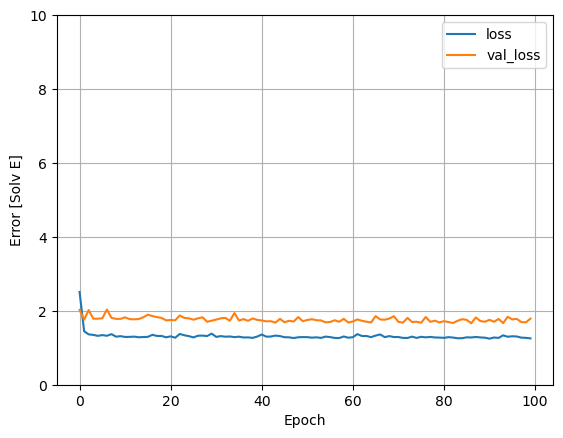
    


If you plot the predictions as a function of `'Horsepower'`, you should notice how this model takes advantage of the nonlinearity provided by the hidden layers:


```python
x = tf.linspace(0.0, 150, 151)
y = dnn_tpsa_model.predict(x)
```

    5/5 [==============================] - 0s 6ms/step


    2023-01-07 15:40:52.703748: I tensorflow/core/grappler/optimizers/custom_graph_optimizer_registry.cc:114] Plugin optimizer for device_type GPU is enabled.


```python
plot_tpsa(x, y)
```


    
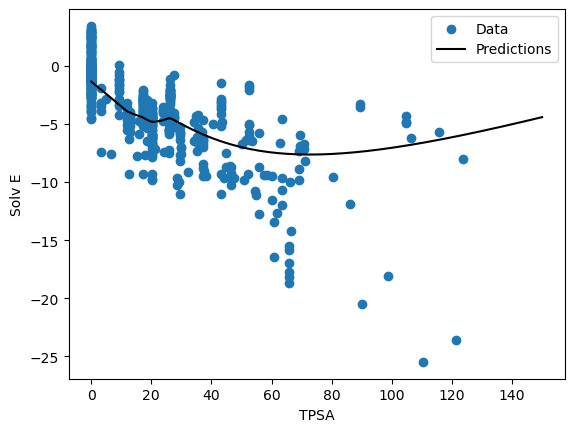
    


Collect the results on the test set for later:


```python
test_results['dnn_tpsa_model'] = dnn_tpsa_model.evaluate(
    test_features['TPSA'], test_labels,
    verbose=0)
```

### Regression using a DNN and multiple inputs

Repeat the previous process using all the inputs. The model's performance slightly improves on the validation dataset.


```python
def dnn_178_model(norm):
  model = keras.Sequential([
      norm,
      layers.Dense(178, activation='relu', use_bias=True),
      layers.Dense(1, activation='linear')
  ])
  return model
```


```python
normalizer_all = tf.keras.layers.Normalization(axis=-1)
normalizer_all.adapt(np.array(all_features))
```

    2023-01-08 21:10:07.584021: I tensorflow/core/grappler/optimizers/custom_graph_optimizer_registry.cc:114] Plugin optimizer for device_type GPU is enabled.
    2023-01-08 21:10:07.597352: I tensorflow/core/grappler/optimizers/custom_graph_optimizer_registry.cc:114] Plugin optimizer for device_type GPU is enabled.


```python
dnn_model = dnn_178_model(normalizer_all)

dnn_model.compile(loss='mean_squared_error', optimizer=tf.keras.optimizers.Adam(0.0001))
dnn_model.summary()
```

    Model: "sequential"
    _________________________________________________________________
     Layer (type)                Output Shape              Param #   
    =================================================================
     normalization_1 (Normalizat  (None, 177)              355       
     ion)                                                            
                                                                     
     dense (Dense)               (None, 178)               31684     
                                                                     
     dense_1 (Dense)             (None, 1)                 179       
                                                                     
    =================================================================
    Total params: 32,218
    Trainable params: 31,863
    Non-trainable params: 355
    _________________________________________________________________


```python
%%time
history = dnn_model.fit(
    x=all_features,
    y=all_labels,
    validation_split=0.2,
    verbose=0, epochs=120)
```

    2023-01-08 21:10:15.858024: I tensorflow/core/grappler/optimizers/custom_graph_optimizer_registry.cc:114] Plugin optimizer for device_type GPU is enabled.
    2023-01-08 21:10:16.209594: I tensorflow/core/grappler/optimizers/custom_graph_optimizer_registry.cc:114] Plugin optimizer for device_type GPU is enabled.


    CPU times: user 9.04 s, sys: 5.03 s, total: 14.1 s
    Wall time: 10.7 s


```python
plot_loss(history)
```


    
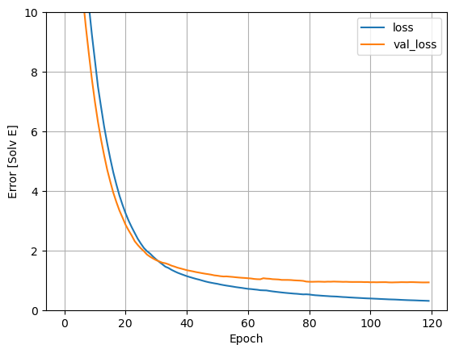
    


Collect the results on the test set:


```python
#test_results['dnn_model'] = dnn_model.evaluate(test_features, test_labels, verbose=0)
```

## Performance

Since all models have been trained, you can review their test set performance:


```python
pd.DataFrame(test_results, index=['Mean absolute error [Solv E]']).T
```


<div>
<style scoped>
    .dataframe tbody tr th:only-of-type {
        vertical-align: middle;
    }

    .dataframe tbody tr th {
        vertical-align: top;
    }

    .dataframe thead th {
        text-align: right;
    }
</style>
<table border="1" class="dataframe">
  <thead>
    <tr style="text-align: right;">
      <th></th>
      <th>Mean absolute error [Solv E]</th>
    </tr>
  </thead>
  <tbody>
    <tr>
      <th>tpsa_model</th>
      <td>1.738172</td>
    </tr>
    <tr>
      <th>dnn_model</th>
      <td>5521.587402</td>
    </tr>
    <tr>
      <th>dnn_tpsa_model</th>
      <td>1.469133</td>
    </tr>
  </tbody>
</table>
</div>


These results match the validation error observed during training.

### Make predictions

You can now make predictions with the `dnn_model` on the test set using Keras `Model.predict` and review the loss:


```python
test_predictions = dnn_model.predict(test_features).flatten()

a = plt.axes(aspect='equal')
plt.scatter(test_labels, test_predictions)
plt.xlabel('True Values [Solv E]')
plt.ylabel('Predictions [Solv E]')
lims = [-16, 5]
plt.xlim(lims)
plt.ylim(lims)
_ = plt.plot(lims, lims)

```

    4/4 [==============================] - 0s 3ms/step


    2023-01-08 21:04:34.123737: I tensorflow/core/grappler/optimizers/custom_graph_optimizer_registry.cc:114] Plugin optimizer for device_type GPU is enabled.


    
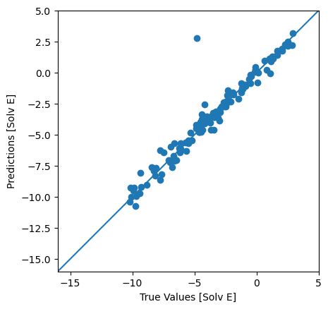
    


It appears that the model predicts reasonably well.

Now, check the error distribution:


```python
error = test_predictions - test_labels
plt.hist(error, bins=25)
plt.xlabel('Prediction Error [Solv E]')
_ = plt.ylabel('Count')
```


    
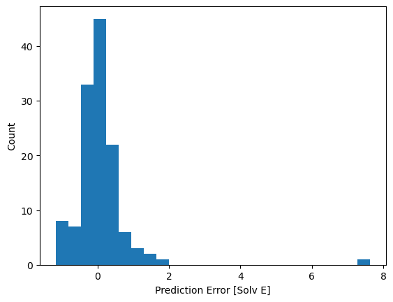
    


```python
history.history.keys()
```


    dict_keys(['loss', 'val_loss'])


```python
pd.DataFrame(history.history).plot(
    figsize = (10, 6), 
    #xlim = [0, 29], 
    #ylim = [0, 1], 
    grid = True, 
    xlabel = 'Epoch',
    style = ['r--', 'r--.', 'b-', 'b-*'])
plt.legend(loc = 'lower left')
plt.show()
```


    
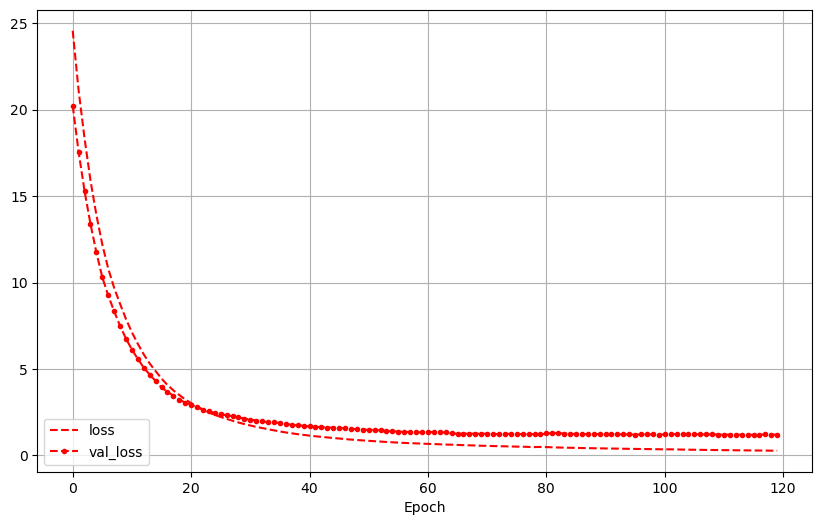
    


If you're happy with the model, save it for later use with `Model.save`:


```python
dnn_model.save('dnn_model_178_relu_rdk')
```

    INFO:tensorflow:Assets written to: dnn_model_178_relu_rdk/assets


If you reload the model, it gives identical output:


```python
reloaded = tf.keras.models.load_model('dnn_model_178_relu_rdk')

test_results['reloaded'] = reloaded.evaluate(
    test_features, test_labels, verbose=0)
```

    2023-01-05 14:17:21.841215: I tensorflow/core/grappler/optimizers/custom_graph_optimizer_registry.cc:114] Plugin optimizer for device_type GPU is enabled.


```python
pd.DataFrame(test_results, index=['Mean absolute error [MPG]']).T
```


<div>
<style scoped>
    .dataframe tbody tr th:only-of-type {
        vertical-align: middle;
    }

    .dataframe tbody tr th {
        vertical-align: top;
    }

    .dataframe thead th {
        text-align: right;
    }
</style>
<table border="1" class="dataframe">
  <thead>
    <tr style="text-align: right;">
      <th></th>
      <th>Mean absolute error [MPG]</th>
    </tr>
  </thead>
  <tbody>
    <tr>
      <th>horsepower_model</th>
      <td>3.659247</td>
    </tr>
    <tr>
      <th>linear_model</th>
      <td>2.563840</td>
    </tr>
    <tr>
      <th>dnn_horsepower_model</th>
      <td>2.896281</td>
    </tr>
    <tr>
      <th>dnn_model</th>
      <td>1.797729</td>
    </tr>
    <tr>
      <th>reloaded</th>
      <td>1.797729</td>
    </tr>
  </tbody>
</table>
</div>


### SHAP Explainers
https://shap-lrjball.readthedocs.io/en/latest/generated/shap.KernelExplainer.html

https://shap-lrjball.readthedocs.io/en/latest/example_notebooks/kernel_explainer/Census%20income%20classification%20with%20Keras.html

https://shap.readthedocs.io/en/latest/example_notebooks/overviews/Be%20careful%20when%20interpreting%20predictive%20models%20in%20search%20of%20causal%C2%A0insights.html


```python
import sklearn
import shap
from sklearn.model_selection import train_test_split

K = 200
reloaded = tf.keras.models.load_model('dnn_model_178_relu_rdk')

# print the JS visualization code to the notebook
shap.initjs()

# use Kernel SHAP to explain test set predictions
explainer = shap.KernelExplainer(reloaded.predict, 
                                 shap.sample(all_features, K), 
                                 link="identity")  #Using 514 background data samples
                                                   #could cause slower run times. Consider 
                                                   #using shap.sample(data, K) or 
                                                   #shap.kmeans(data, K) to summarize the 
                                                   #background as K samples.
shap_values = explainer.shap_values(test_features)
```


<div align='center'></div><script charset='utf-8'>!function(t){function e(r){if(n[r])return n[r].exports;var i=n[r]={i:r,l:!1,exports:{}};return t[r].call(i.exports,i,i.exports,e),i.l=!0,i.exports}var n={};return e.m=t,e.c=n,e.i=function(t){return t},e.d=function(t,n,r){e.o(t,n)||Object.defineProperty(t,n,{configurable:!1,enumerable:!0,get:r})},e.n=function(t){var n=t&&t.__esModule?function(){return t.default}:function(){return t};return e.d(n,"a",n),n},e.o=function(t,e){return Object.prototype.hasOwnProperty.call(t,e)},e.p="",e(e.s=410)}([function(t,e,n){"use strict";function r(t,e,n,r,o,a,u,c){if(i(e),!t){var s;if(void 0===e)s=new Error("Minified exception occurred; use the non-minified dev environment for the full error message and additional helpful warnings.");else{var l=[n,r,o,a,u,c],f=0;s=new Error(e.replace(/%s/g,function(){return l[f++]})),s.name="Invariant Violation"}throw s.framesToPop=1,s}}var i=function(t){};t.exports=r},function(t,e,n){"use strict";var r=n(8),i=r;t.exports=i},function(t,e,n){"use strict";function r(t){for(var e=arguments.length-1,n="Minified React error #"+t+"; visit http://facebook.github.io/react/docs/error-decoder.html?invariant="+t,r=0;r<e;r++)n+="&args[]="+encodeURIComponent(arguments[r+1]);n+=" for the full message or use the non-minified dev environment for full errors and additional helpful warnings.";var i=new Error(n);throw i.name="Invariant Violation",i.framesToPop=1,i}t.exports=r},function(t,e,n){"use strict";function r(t){if(null===t||void 0===t)throw new TypeError("Object.assign cannot be called with null or undefined");return Object(t)}function i(){try{if(!Object.assign)return!1;var t=new String("abc");if(t[5]="de","5"===Object.getOwnPropertyNames(t)[0])return!1;for(var e={},n=0;n<10;n++)e["_"+String.fromCharCode(n)]=n;var r=Object.getOwnPropertyNames(e).map(function(t){return e[t]});if("0123456789"!==r.join(""))return!1;var i={};return"abcdefghijklmnopqrst".split("").forEach(function(t){i[t]=t}),"abcdefghijklmnopqrst"===Object.keys(Object.assign({},i)).join("")}catch(t){return!1}}/*
object-assign
(c) Sindre Sorhus
@license MIT
*/
var o=Object.getOwnPropertySymbols,a=Object.prototype.hasOwnProperty,u=Object.prototype.propertyIsEnumerable;t.exports=i()?Object.assign:function(t,e){for(var n,i,c=r(t),s=1;s<arguments.length;s++){n=Object(arguments[s]);for(var l in n)a.call(n,l)&&(c[l]=n[l]);if(o){i=o(n);for(var f=0;f<i.length;f++)u.call(n,i[f])&&(c[i[f]]=n[i[f]])}}return c}},function(t,e,n){"use strict";function r(t,e){return 1===t.nodeType&&t.getAttribute(d)===String(e)||8===t.nodeType&&t.nodeValue===" react-text: "+e+" "||8===t.nodeType&&t.nodeValue===" react-empty: "+e+" "}function i(t){for(var e;e=t._renderedComponent;)t=e;return t}function o(t,e){var n=i(t);n._hostNode=e,e[g]=n}function a(t){var e=t._hostNode;e&&(delete e[g],t._hostNode=null)}function u(t,e){if(!(t._flags&v.hasCachedChildNodes)){var n=t._renderedChildren,a=e.firstChild;t:for(var u in n)if(n.hasOwnProperty(u)){var c=n[u],s=i(c)._domID;if(0!==s){for(;null!==a;a=a.nextSibling)if(r(a,s)){o(c,a);continue t}f("32",s)}}t._flags|=v.hasCachedChildNodes}}function c(t){if(t[g])return t[g];for(var e=[];!t[g];){if(e.push(t),!t.parentNode)return null;t=t.parentNode}for(var n,r;t&&(r=t[g]);t=e.pop())n=r,e.length&&u(r,t);return n}function s(t){var e=c(t);return null!=e&&e._hostNode===t?e:null}function l(t){if(void 0===t._hostNode?f("33"):void 0,t._hostNode)return t._hostNode;for(var e=[];!t._hostNode;)e.push(t),t._hostParent?void 0:f("34"),t=t._hostParent;for(;e.length;t=e.pop())u(t,t._hostNode);return t._hostNode}var f=n(2),p=n(21),h=n(157),d=(n(0),p.ID_ATTRIBUTE_NAME),v=h,g="__reactInternalInstance$"+Math.random().toString(36).slice(2),m={getClosestInstanceFromNode:c,getInstanceFromNode:s,getNodeFromInstance:l,precacheChildNodes:u,precacheNode:o,uncacheNode:a};t.exports=m},function(t,e,n){"use strict";function r(t,e,n,a){function u(e){return t(e=new Date(+e)),e}return u.floor=u,u.ceil=function(n){return t(n=new Date(n-1)),e(n,1),t(n),n},u.round=function(t){var e=u(t),n=u.ceil(t);return t-e<n-t?e:n},u.offset=function(t,n){return e(t=new Date(+t),null==n?1:Math.floor(n)),t},u.range=function(n,r,i){var o=[];if(n=u.ceil(n),i=null==i?1:Math.floor(i),!(n<r&&i>0))return o;do o.push(new Date(+n));while(e(n,i),t(n),n<r);return o},u.filter=function(n){return r(function(e){if(e>=e)for(;t(e),!n(e);)e.setTime(e-1)},function(t,r){if(t>=t)for(;--r>=0;)for(;e(t,1),!n(t););})},n&&(u.count=function(e,r){return i.setTime(+e),o.setTime(+r),t(i),t(o),Math.floor(n(i,o))},u.every=function(t){return t=Math.floor(t),isFinite(t)&&t>0?t>1?u.filter(a?function(e){return a(e)%t===0}:function(e){return u.count(0,e)%t===0}):u:null}),u}e.a=r;var i=new Date,o=new Date},function(t,e,n){"use strict";var r=!("undefined"==typeof window||!window.document||!window.document.createElement),i={canUseDOM:r,canUseWorkers:"undefined"!=typeof Worker,canUseEventListeners:r&&!(!window.addEventListener&&!window.attachEvent),canUseViewport:r&&!!window.screen,isInWorker:!r};t.exports=i},function(t,e,n){"use strict";function r(t,e){this._groups=t,this._parents=e}function i(){return new r([[document.documentElement]],D)}var o=n(272),a=n(273),u=n(261),c=n(255),s=n(131),l=n(260),f=n(265),p=n(268),h=n(275),d=n(253),v=n(267),g=n(266),m=n(274),y=n(259),_=n(258),b=n(252),x=n(276),w=n(269),C=n(254),M=n(277),k=n(262),E=n(270),T=n(264),S=n(251),P=n(263),N=n(271),A=n(256),O=n(70),I=n(257);n.d(e,"c",function(){return D}),e.b=r;var D=[null];r.prototype=i.prototype={constructor:r,select:o.a,selectAll:a.a,filter:u.a,data:c.a,enter:s.a,exit:l.a,merge:f.a,order:p.a,sort:h.a,call:d.a,nodes:v.a,node:g.a,size:m.a,empty:y.a,each:_.a,attr:b.a,style:x.a,property:w.a,classed:C.a,text:M.a,html:k.a,raise:E.a,lower:T.a,append:S.a,insert:P.a,remove:N.a,datum:A.a,on:O.c,dispatch:I.a},e.a=i},function(t,e,n){"use strict";function r(t){return function(){return t}}var i=function(){};i.thatReturns=r,i.thatReturnsFalse=r(!1),i.thatReturnsTrue=r(!0),i.thatReturnsNull=r(null),i.thatReturnsThis=function(){return this},i.thatReturnsArgument=function(t){return t},t.exports=i},function(t,e,n){"use strict";var r=null;t.exports={debugTool:r}},function(t,e,n){"use strict";Object.defineProperty(e,"__esModule",{value:!0});var r=n(59);n.d(e,"color",function(){return r.a}),n.d(e,"rgb",function(){return r.b}),n.d(e,"hsl",function(){return r.c});var i=n(210);n.d(e,"lab",function(){return i.a}),n.d(e,"hcl",function(){return i.b});var o=n(209);n.d(e,"cubehelix",function(){return o.a})},function(t,e,n){"use strict";function r(){T.ReactReconcileTransaction&&x?void 0:l("123")}function i(){this.reinitializeTransaction(),this.dirtyComponentsLength=null,this.callbackQueue=p.getPooled(),this.reconcileTransaction=T.ReactReconcileTransaction.getPooled(!0)}function o(t,e,n,i,o,a){return r(),x.batchedUpdates(t,e,n,i,o,a)}function a(t,e){return t._mountOrder-e._mountOrder}function u(t){var e=t.dirtyComponentsLength;e!==m.length?l("124",e,m.length):void 0,m.sort(a),y++;for(var n=0;n<e;n++){var r=m[n],i=r._pendingCallbacks;r._pendingCallbacks=null;var o;if(d.logTopLevelRenders){var u=r;r._currentElement.type.isReactTopLevelWrapper&&(u=r._renderedComponent),o="React update: "+u.getName(),console.time(o)}if(v.performUpdateIfNecessary(r,t.reconcileTransaction,y),o&&console.timeEnd(o),i)for(var c=0;c<i.length;c++)t.callbackQueue.enqueue(i[c],r.getPublicInstance())}}function c(t){return r(),x.isBatchingUpdates?(m.push(t),void(null==t._updateBatchNumber&&(t._updateBatchNumber=y+1))):void x.batchedUpdates(c,t)}function s(t,e){x.isBatchingUpdates?void 0:l("125"),_.enqueue(t,e),b=!0}var l=n(2),f=n(3),p=n(155),h=n(17),d=n(160),v=n(24),g=n(53),m=(n(0),[]),y=0,_=p.getPooled(),b=!1,x=null,w={initialize:function(){this.dirtyComponentsLength=m.length},close:function(){this.dirtyComponentsLength!==m.length?(m.splice(0,this.dirtyComponentsLength),k()):m.length=0}},C={initialize:function(){this.callbackQueue.reset()},close:function(){this.callbackQueue.notifyAll()}},M=[w,C];f(i.prototype,g,{getTransactionWrappers:function(){return M},destructor:function(){this.dirtyComponentsLength=null,p.release(this.callbackQueue),this.callbackQueue=null,T.ReactReconcileTransaction.release(this.reconcileTransaction),this.reconcileTransaction=null},perform:function(t,e,n){return g.perform.call(this,this.reconcileTransaction.perform,this.reconcileTransaction,t,e,n)}}),h.addPoolingTo(i);var k=function(){for(;m.length||b;){if(m.length){var t=i.getPooled();t.perform(u,null,t),i.release(t)}if(b){b=!1;var e=_;_=p.getPooled(),e.notifyAll(),p.release(e)}}},E={injectReconcileTransaction:function(t){t?void 0:l("126"),T.ReactReconcileTransaction=t},injectBatchingStrategy:function(t){t?void 0:l("127"),"function"!=typeof t.batchedUpdates?l("128"):void 0,"boolean"!=typeof t.isBatchingUpdates?l("129"):void 0,x=t}},T={ReactReconcileTransaction:null,batchedUpdates:o,enqueueUpdate:c,flushBatchedUpdates:k,injection:E,asap:s};t.exports=T},function(t,e,n){"use strict";var r=n(102);n.d(e,"c",function(){return r.a});var i=n(18);n.d(e,"f",function(){return i.a});var o=n(103);n.d(e,"d",function(){return o.a});var a=(n(185),n(104),n(105),n(186),n(197),n(198),n(108),n(188),n(189),n(190),n(191),n(106),n(192),n(193),n(57));n.d(e,"e",function(){return a.a});var u=n(107);n.d(e,"g",function(){return u.a});var c=(n(194),n(195),n(196),n(109));n.d(e,"a",function(){return c.a}),n.d(e,"b",function(){return c.b});n(110),n(111),n(199)},function(t,e,n){"use strict";n.d(e,"e",function(){return r}),n.d(e,"d",function(){return i}),n.d(e,"c",function(){return o}),n.d(e,"b",function(){return a}),n.d(e,"a",function(){return u});var r=1e3,i=6e4,o=36e5,a=864e5,u=6048e5},function(t,e,n){"use strict";function r(t,e,n,r){this.dispatchConfig=t,this._targetInst=e,this.nativeEvent=n;var i=this.constructor.Interface;for(var o in i)if(i.hasOwnProperty(o)){var u=i[o];u?this[o]=u(n):"target"===o?this.target=r:this[o]=n[o]}var c=null!=n.defaultPrevented?n.defaultPrevented:n.returnValue===!1;return c?this.isDefaultPrevented=a.thatReturnsTrue:this.isDefaultPrevented=a.thatReturnsFalse,this.isPropagationStopped=a.thatReturnsFalse,this}var i=n(3),o=n(17),a=n(8),u=(n(1),"function"==typeof Proxy,["dispatchConfig","_targetInst","nativeEvent","isDefaultPrevented","isPropagationStopped","_dispatchListeners","_dispatchInstances"]),c={type:null,target:null,currentTarget:a.thatReturnsNull,eventPhase:null,bubbles:null,cancelable:null,timeStamp:function(t){return t.timeStamp||Date.now()},defaultPrevented:null,isTrusted:null};i(r.prototype,{preventDefault:function(){this.defaultPrevented=!0;var t=this.nativeEvent;t&&(t.preventDefault?t.preventDefault():"unknown"!=typeof t.returnValue&&(t.returnValue=!1),this.isDefaultPrevented=a.thatReturnsTrue)},stopPropagation:function(){var t=this.nativeEvent;t&&(t.stopPropagation?t.stopPropagation():"unknown"!=typeof t.cancelBubble&&(t.cancelBubble=!0),this.isPropagationStopped=a.thatReturnsTrue)},persist:function(){this.isPersistent=a.thatReturnsTrue},isPersistent:a.thatReturnsFalse,destructor:function(){var t=this.constructor.Interface;for(var e in t)this[e]=null;for(var n=0;n<u.length;n++)this[u[n]]=null}}),r.Interface=c,r.augmentClass=function(t,e){var n=this,r=function(){};r.prototype=n.prototype;var a=new r;i(a,t.prototype),t.prototype=a,t.prototype.constructor=t,t.Interface=i({},n.Interface,e),t.augmentClass=n.augmentClass,o.addPoolingTo(t,o.fourArgumentPooler)},o.addPoolingTo(r,o.fourArgumentPooler),t.exports=r},function(t,e,n){"use strict";var r={current:null};t.exports=r},function(t,e,n){"use strict";n.d(e,"a",function(){return i}),n.d(e,"b",function(){return o});var r=Array.prototype,i=r.map,o=r.slice},function(t,e,n){"use strict";var r=n(2),i=(n(0),function(t){var e=this;if(e.instancePool.length){var n=e.instancePool.pop();return e.call(n,t),n}return new e(t)}),o=function(t,e){var n=this;if(n.instancePool.length){var r=n.instancePool.pop();return n.call(r,t,e),r}return new n(t,e)},a=function(t,e,n){var r=this;if(r.instancePool.length){var i=r.instancePool.pop();return r.call(i,t,e,n),i}return new r(t,e,n)},u=function(t,e,n,r){var i=this;if(i.instancePool.length){var o=i.instancePool.pop();return i.call(o,t,e,n,r),o}return new i(t,e,n,r)},c=function(t){var e=this;t instanceof e?void 0:r("25"),t.destructor(),e.instancePool.length<e.poolSize&&e.instancePool.push(t)},s=10,l=i,f=function(t,e){var n=t;return n.instancePool=[],n.getPooled=e||l,n.poolSize||(n.poolSize=s),n.release=c,n},p={addPoolingTo:f,oneArgumentPooler:i,twoArgumentPooler:o,threeArgumentPooler:a,fourArgumentPooler:u};t.exports=p},function(t,e,n){"use strict";e.a=function(t,e){return t<e?-1:t>e?1:t>=e?0:NaN}},function(t,e,n){"use strict";e.a=function(t){return function(){return t}}},function(t,e,n){"use strict";function r(t){if(g){var e=t.node,n=t.children;if(n.length)for(var r=0;r<n.length;r++)m(e,n[r],null);else null!=t.html?f(e,t.html):null!=t.text&&h(e,t.text)}}function i(t,e){t.parentNode.replaceChild(e.node,t),r(e)}function o(t,e){g?t.children.push(e):t.node.appendChild(e.node)}function a(t,e){g?t.html=e:f(t.node,e)}function u(t,e){g?t.text=e:h(t.node,e)}function c(){return this.node.nodeName}function s(t){return{node:t,children:[],html:null,text:null,toString:c}}var l=n(82),f=n(55),p=n(90),h=n(171),d=1,v=11,g="undefined"!=typeof document&&"number"==typeof document.documentMode||"undefined"!=typeof navigator&&"string"==typeof navigator.userAgent&&/\bEdge\/\d/.test(navigator.userAgent),m=p(function(t,e,n){e.node.nodeType===v||e.node.nodeType===d&&"object"===e.node.nodeName.toLowerCase()&&(null==e.node.namespaceURI||e.node.namespaceURI===l.html)?(r(e),t.insertBefore(e.node,n)):(t.insertBefore(e.node,n),r(e))});s.insertTreeBefore=m,s.replaceChildWithTree=i,s.queueChild=o,s.queueHTML=a,s.queueText=u,t.exports=s},function(t,e,n){"use strict";function r(t,e){return(t&e)===e}var i=n(2),o=(n(0),{MUST_USE_PROPERTY:1,HAS_BOOLEAN_VALUE:4,HAS_NUMERIC_VALUE:8,HAS_POSITIVE_NUMERIC_VALUE:24,HAS_OVERLOADED_BOOLEAN_VALUE:32,injectDOMPropertyConfig:function(t){var e=o,n=t.Properties||{},a=t.DOMAttributeNamespaces||{},c=t.DOMAttributeNames||{},s=t.DOMPropertyNames||{},l=t.DOMMutationMethods||{};t.isCustomAttribute&&u._isCustomAttributeFunctions.push(t.isCustomAttribute);for(var f in n){u.properties.hasOwnProperty(f)?i("48",f):void 0;var p=f.toLowerCase(),h=n[f],d={attributeName:p,attributeNamespace:null,propertyName:f,mutationMethod:null,mustUseProperty:r(h,e.MUST_USE_PROPERTY),hasBooleanValue:r(h,e.HAS_BOOLEAN_VALUE),hasNumericValue:r(h,e.HAS_NUMERIC_VALUE),hasPositiveNumericValue:r(h,e.HAS_POSITIVE_NUMERIC_VALUE),hasOverloadedBooleanValue:r(h,e.HAS_OVERLOADED_BOOLEAN_VALUE)};if(d.hasBooleanValue+d.hasNumericValue+d.hasOverloadedBooleanValue<=1?void 0:i("50",f),c.hasOwnProperty(f)){var v=c[f];d.attributeName=v}a.hasOwnProperty(f)&&(d.attributeNamespace=a[f]),s.hasOwnProperty(f)&&(d.propertyName=s[f]),l.hasOwnProperty(f)&&(d.mutationMethod=l[f]),u.properties[f]=d}}}),a=":A-Z_a-z\\u00C0-\\u00D6\\u00D8-\\u00F6\\u00F8-\\u02FF\\u0370-\\u037D\\u037F-\\u1FFF\\u200C-\\u200D\\u2070-\\u218F\\u2C00-\\u2FEF\\u3001-\\uD7FF\\uF900-\\uFDCF\\uFDF0-\\uFFFD",u={ID_ATTRIBUTE_NAME:"data-reactid",ROOT_ATTRIBUTE_NAME:"data-reactroot",ATTRIBUTE_NAME_START_CHAR:a,ATTRIBUTE_NAME_CHAR:a+"\\-.0-9\\u00B7\\u0300-\\u036F\\u203F-\\u2040",properties:{},getPossibleStandardName:null,_isCustomAttributeFunctions:[],isCustomAttribute:function(t){for(var e=0;e<u._isCustomAttributeFunctions.length;e++){var n=u._isCustomAttributeFunctions[e];if(n(t))return!0}return!1},injection:o};t.exports=u},function(t,e,n){"use strict";function r(t){return"button"===t||"input"===t||"select"===t||"textarea"===t}function i(t,e,n){switch(t){case"onClick":case"onClickCapture":case"onDoubleClick":case"onDoubleClickCapture":case"onMouseDown":case"onMouseDownCapture":case"onMouseMove":case"onMouseMoveCapture":case"onMouseUp":case"onMouseUpCapture":return!(!n.disabled||!r(e));default:return!1}}var o=n(2),a=n(83),u=n(50),c=n(87),s=n(165),l=n(166),f=(n(0),{}),p=null,h=function(t,e){t&&(u.executeDispatchesInOrder(t,e),t.isPersistent()||t.constructor.release(t))},d=function(t){return h(t,!0)},v=function(t){return h(t,!1)},g=function(t){return"."+t._rootNodeID},m={injection:{injectEventPluginOrder:a.injectEventPluginOrder,injectEventPluginsByName:a.injectEventPluginsByName},putListener:function(t,e,n){"function"!=typeof n?o("94",e,typeof n):void 0;var r=g(t),i=f[e]||(f[e]={});i[r]=n;var u=a.registrationNameModules[e];u&&u.didPutListener&&u.didPutListener(t,e,n)},getListener:function(t,e){var n=f[e];if(i(e,t._currentElement.type,t._currentElement.props))return null;var r=g(t);return n&&n[r]},deleteListener:function(t,e){var n=a.registrationNameModules[e];n&&n.willDeleteListener&&n.willDeleteListener(t,e);var r=f[e];if(r){var i=g(t);delete r[i]}},deleteAllListeners:function(t){var e=g(t);for(var n in f)if(f.hasOwnProperty(n)&&f[n][e]){var r=a.registrationNameModules[n];r&&r.willDeleteListener&&r.willDeleteListener(t,n),delete f[n][e]}},extractEvents:function(t,e,n,r){for(var i,o=a.plugins,u=0;u<o.length;u++){var c=o[u];if(c){var l=c.extractEvents(t,e,n,r);l&&(i=s(i,l))}}return i},enqueueEvents:function(t){t&&(p=s(p,t))},processEventQueue:function(t){var e=p;p=null,t?l(e,d):l(e,v),p?o("95"):void 0,c.rethrowCaughtError()},__purge:function(){f={}},__getListenerBank:function(){return f}};t.exports=m},function(t,e,n){"use strict";function r(t,e,n){var r=e.dispatchConfig.phasedRegistrationNames[n];return m(t,r)}function i(t,e,n){var i=r(t,n,e);i&&(n._dispatchListeners=v(n._dispatchListeners,i),n._dispatchInstances=v(n._dispatchInstances,t))}function o(t){t&&t.dispatchConfig.phasedRegistrationNames&&d.traverseTwoPhase(t._targetInst,i,t)}function a(t){if(t&&t.dispatchConfig.phasedRegistrationNames){var e=t._targetInst,n=e?d.getParentInstance(e):null;d.traverseTwoPhase(n,i,t)}}function u(t,e,n){if(n&&n.dispatchConfig.registrationName){var r=n.dispatchConfig.registrationName,i=m(t,r);i&&(n._dispatchListeners=v(n._dispatchListeners,i),n._dispatchInstances=v(n._dispatchInstances,t))}}function c(t){t&&t.dispatchConfig.registrationName&&u(t._targetInst,null,t)}function s(t){g(t,o)}function l(t){g(t,a)}function f(t,e,n,r){d.traverseEnterLeave(n,r,u,t,e)}function p(t){g(t,c)}var h=n(22),d=n(50),v=n(165),g=n(166),m=(n(1),h.getListener),y={accumulateTwoPhaseDispatches:s,accumulateTwoPhaseDispatchesSkipTarget:l,accumulateDirectDispatches:p,accumulateEnterLeaveDispatches:f};t.exports=y},function(t,e,n){"use strict";function r(){i.attachRefs(this,this._currentElement)}var i=n(368),o=(n(9),n(1),{mountComponent:function(t,e,n,i,o,a){var u=t.mountComponent(e,n,i,o,a);return t._currentElement&&null!=t._currentElement.ref&&e.getReactMountReady().enqueue(r,t),u},getHostNode:function(t){return t.getHostNode()},unmountComponent:function(t,e){i.detachRefs(t,t._currentElement),t.unmountComponent(e)},receiveComponent:function(t,e,n,o){var a=t._currentElement;if(e!==a||o!==t._context){var u=i.shouldUpdateRefs(a,e);u&&i.detachRefs(t,a),t.receiveComponent(e,n,o),u&&t._currentElement&&null!=t._currentElement.ref&&n.getReactMountReady().enqueue(r,t)}},performUpdateIfNecessary:function(t,e,n){t._updateBatchNumber===n&&t.performUpdateIfNecessary(e)}});t.exports=o},function(t,e,n){"use strict";function r(t,e,n,r){return i.call(this,t,e,n,r)}var i=n(14),o=n(93),a={view:function(t){if(t.view)return t.view;var e=o(t);if(e.window===e)return e;var n=e.ownerDocument;return n?n.defaultView||n.parentWindow:window},detail:function(t){return t.detail||0}};i.augmentClass(r,a),t.exports=r},function(t,e,n){"use strict";var r=n(3),i=n(401),o=n(97),a=n(406),u=n(402),c=n(403),s=n(27),l=n(404),f=n(407),p=n(408),h=(n(1),s.createElement),d=s.createFactory,v=s.cloneElement,g=r,m={Children:{map:i.map,forEach:i.forEach,count:i.count,toArray:i.toArray,only:p},Component:o,PureComponent:a,createElement:h,cloneElement:v,isValidElement:s.isValidElement,PropTypes:l,createClass:u.createClass,createFactory:d,createMixin:function(t){return t},DOM:c,version:f,__spread:g};t.exports=m},function(t,e,n){"use strict";function r(t){return void 0!==t.ref}function i(t){return void 0!==t.key}var o=n(3),a=n(15),u=(n(1),n(176),Object.prototype.hasOwnProperty),c=n(174),s={key:!0,ref:!0,__self:!0,__source:!0},l=function(t,e,n,r,i,o,a){var u={$$typeof:c,type:t,key:e,ref:n,props:a,_owner:o};return u};l.createElement=function(t,e,n){var o,c={},f=null,p=null,h=null,d=null;if(null!=e){r(e)&&(p=e.ref),i(e)&&(f=""+e.key),h=void 0===e.__self?null:e.__self,d=void 0===e.__source?null:e.__source;for(o in e)u.call(e,o)&&!s.hasOwnProperty(o)&&(c[o]=e[o])}var v=arguments.length-2;if(1===v)c.children=n;else if(v>1){for(var g=Array(v),m=0;m<v;m++)g[m]=arguments[m+2];c.children=g}if(t&&t.defaultProps){var y=t.defaultProps;for(o in y)void 0===c[o]&&(c[o]=y[o])}return l(t,f,p,h,d,a.current,c)},l.createFactory=function(t){var e=l.createElement.bind(null,t);return e.type=t,e},l.cloneAndReplaceKey=function(t,e){var n=l(t.type,e,t.ref,t._self,t._source,t._owner,t.props);return n},l.cloneElement=function(t,e,n){var c,f=o({},t.props),p=t.key,h=t.ref,d=t._self,v=t._source,g=t._owner;if(null!=e){r(e)&&(h=e.ref,g=a.current),i(e)&&(p=""+e.key);var m;t.type&&t.type.defaultProps&&(m=t.type.defaultProps);for(c in e)u.call(e,c)&&!s.hasOwnProperty(c)&&(void 0===e[c]&&void 0!==m?f[c]=m[c]:f[c]=e[c])}var y=arguments.length-2;if(1===y)f.children=n;else if(y>1){for(var _=Array(y),b=0;b<y;b++)_[b]=arguments[b+2];f.children=_}return l(t.type,p,h,d,v,g,f)},l.isValidElement=function(t){return"object"==typeof t&&null!==t&&t.$$typeof===c},t.exports=l},function(t,e,n){"use strict";function r(t){for(var e=arguments.length-1,n="Minified React error #"+t+"; visit http://facebook.github.io/react/docs/error-decoder.html?invariant="+t,r=0;r<e;r++)n+="&args[]="+encodeURIComponent(arguments[r+1]);n+=" for the full message or use the non-minified dev environment for full errors and additional helpful warnings.";var i=new Error(n);throw i.name="Invariant Violation",i.framesToPop=1,i}t.exports=r},function(t,e,n){"use strict";e.a=function(t){return null===t?NaN:+t}},function(t,e,n){"use strict";Object.defineProperty(e,"__esModule",{value:!0});var r=n(211);n.d(e,"formatDefaultLocale",function(){return r.a}),n.d(e,"format",function(){return r.b}),n.d(e,"formatPrefix",function(){return r.c});var i=n(117);n.d(e,"formatLocale",function(){return i.a});var o=n(115);n.d(e,"formatSpecifier",function(){return o.a});var a=n(215);n.d(e,"precisionFixed",function(){return a.a});var u=n(216);n.d(e,"precisionPrefix",function(){return u.a});var c=n(217);n.d(e,"precisionRound",function(){return c.a})},function(t,e,n){"use strict";var r=n(63);n.d(e,"b",function(){return r.a});var i=(n(118),n(62),n(119),n(121),n(43));n.d(e,"a",function(){return i.a});var o=(n(122),n(223));n.d(e,"c",function(){return o.a});var a=(n(124),n(225),n(227),n(123),n(220),n(221),n(219),n(218));n.d(e,"d",function(){return a.a});n(222)},function(t,e,n){"use strict";function r(t,e){return function(n){return t+n*e}}function i(t,e,n){return t=Math.pow(t,n),e=Math.pow(e,n)-t,n=1/n,function(r){return Math.pow(t+r*e,n)}}function o(t,e){var i=e-t;return i?r(t,i>180||i<-180?i-360*Math.round(i/360):i):n.i(c.a)(isNaN(t)?e:t)}function a(t){return 1===(t=+t)?u:function(e,r){return r-e?i(e,r,t):n.i(c.a)(isNaN(e)?r:e)}}function u(t,e){var i=e-t;return i?r(t,i):n.i(c.a)(isNaN(t)?e:t)}var c=n(120);e.b=o,e.c=a,e.a=u},function(t,e,n){"use strict";e.a=function(t){return t.match(/.{6}/g).map(function(t){return"#"+t})}},function(t,e,n){"use strict";function r(t){var e=t.domain;return t.ticks=function(t){var r=e();return n.i(o.a)(r[0],r[r.length-1],null==t?10:t)},t.tickFormat=function(t,r){return n.i(c.a)(e(),t,r)},t.nice=function(r){var i=e(),a=i.length-1,u=null==r?10:r,c=i[0],s=i[a],l=n.i(o.b)(c,s,u);return l&&(l=n.i(o.b)(Math.floor(c/l)*l,Math.ceil(s/l)*l,u),i[0]=Math.floor(c/l)*l,i[a]=Math.ceil(s/l)*l,e(i)),t},t}function i(){var t=n.i(u.a)(u.b,a.a);return t.copy=function(){return n.i(u.c)(t,i())},r(t)}var o=n(12),a=n(31),u=n(45),c=n(243);e.b=r,e.a=i},function(t,e,n){"use strict";n.d(e,"a",function(){return r}),n.d(e,"b",function(){return i}),n.d(e,"d",function(){return o}),n.d(e,"c",function(){return a});var r=1e-12,i=Math.PI,o=i/2,a=2*i},function(t,e,n){"use strict";e.a=function(t,e){if((r=t.length)>1)for(var n,r,i=1,o=t[e[0]],a=o.length;i<r;++i){n=o,o=t[e[i]];for(var u=0;u<a;++u)o[u][1]+=o[u][0]=isNaN(n[u][1])?n[u][0]:n[u][1]}}},function(t,e,n){"use strict";e.a=function(t){for(var e=t.length,n=new Array(e);--e>=0;)n[e]=e;return n}},function(t,e,n){"use strict";var r={};t.exports=r},function(t,e,n){(function(t,r){var i;(function(){function o(t,e){return t.set(e[0],e[1]),t}function a(t,e){return t.add(e),t}function u(t,e,n){switch(n.length){case 0:return t.call(e);case 1:return t.call(e,n[0]);case 2:return t.call(e,n[0],n[1]);case 3:return t.call(e,n[0],n[1],n[2])}return t.apply(e,n)}function c(t,e,n,r){for(var i=-1,o=null==t?0:t.length;++i<o;){var a=t[i];e(r,a,n(a),t)}return r}function s(t,e){for(var n=-1,r=null==t?0:t.length;++n<r&&e(t[n],n,t)!==!1;);return t}function l(t,e){for(var n=null==t?0:t.length;n--&&e(t[n],n,t)!==!1;);return t}function f(t,e){for(var n=-1,r=null==t?0:t.length;++n<r;)if(!e(t[n],n,t))return!1;return!0}function p(t,e){for(var n=-1,r=null==t?0:t.length,i=0,o=[];++n<r;){var a=t[n];e(a,n,t)&&(o[i++]=a)}return o}function h(t,e){var n=null==t?0:t.length;return!!n&&M(t,e,0)>-1}function d(t,e,n){for(var r=-1,i=null==t?0:t.length;++r<i;)if(n(e,t[r]))return!0;return!1}function v(t,e){for(var n=-1,r=null==t?0:t.length,i=Array(r);++n<r;)i[n]=e(t[n],n,t);return i}function g(t,e){for(var n=-1,r=e.length,i=t.length;++n<r;)t[i+n]=e[n];return t}function m(t,e,n,r){var i=-1,o=null==t?0:t.length;for(r&&o&&(n=t[++i]);++i<o;)n=e(n,t[i],i,t);return n}function y(t,e,n,r){var i=null==t?0:t.length;for(r&&i&&(n=t[--i]);i--;)n=e(n,t[i],i,t);return n}function _(t,e){for(var n=-1,r=null==t?0:t.length;++n<r;)if(e(t[n],n,t))return!0;return!1}function b(t){return t.split("")}function x(t){return t.match(ze)||[]}function w(t,e,n){var r;return n(t,function(t,n,i){if(e(t,n,i))return r=n,!1}),r}function C(t,e,n,r){for(var i=t.length,o=n+(r?1:-1);r?o--:++o<i;)if(e(t[o],o,t))return o;return-1}function M(t,e,n){return e===e?Z(t,e,n):C(t,E,n)}function k(t,e,n,r){for(var i=n-1,o=t.length;++i<o;)if(r(t[i],e))return i;return-1}function E(t){return t!==t}function T(t,e){var n=null==t?0:t.length;return n?O(t,e)/n:Ut}function S(t){return function(e){return null==e?it:e[t]}}function P(t){return function(e){return null==t?it:t[e]}}function N(t,e,n,r,i){return i(t,function(t,i,o){n=r?(r=!1,t):e(n,t,i,o)}),n}function A(t,e){var n=t.length;for(t.sort(e);n--;)t[n]=t[n].value;return t}function O(t,e){for(var n,r=-1,i=t.length;++r<i;){var o=e(t[r]);o!==it&&(n=n===it?o:n+o)}return n}function I(t,e){for(var n=-1,r=Array(t);++n<t;)r[n]=e(n);return r}function D(t,e){return v(e,function(e){return[e,t[e]]})}function R(t){return function(e){return t(e)}}function L(t,e){return v(e,function(e){return t[e]})}function U(t,e){return t.has(e)}function F(t,e){for(var n=-1,r=t.length;++n<r&&M(e,t[n],0)>-1;);return n}function j(t,e){for(var n=t.length;n--&&M(e,t[n],0)>-1;);return n}function B(t,e){for(var n=t.length,r=0;n--;)t[n]===e&&++r;return r}function W(t){return"\\"+nr[t]}function V(t,e){return null==t?it:t[e]}function z(t){return Kn.test(t)}function H(t){return Gn.test(t)}function q(t){for(var e,n=[];!(e=t.next()).done;)n.push(e.value);return n}function Y(t){var e=-1,n=Array(t.size);return t.forEach(function(t,r){n[++e]=[r,t]}),n}function K(t,e){return function(n){return t(e(n))}}function G(t,e){for(var n=-1,r=t.length,i=0,o=[];++n<r;){var a=t[n];a!==e&&a!==ft||(t[n]=ft,o[i++]=n)}return o}function $(t){var e=-1,n=Array(t.size);return t.forEach(function(t){n[++e]=t}),n}function X(t){var e=-1,n=Array(t.size);return t.forEach(function(t){n[++e]=[t,t]}),n}function Z(t,e,n){for(var r=n-1,i=t.length;++r<i;)if(t[r]===e)return r;return-1}function Q(t,e,n){for(var r=n+1;r--;)if(t[r]===e)return r;return r}function J(t){return z(t)?et(t):_r(t)}function tt(t){return z(t)?nt(t):b(t)}function et(t){for(var e=qn.lastIndex=0;qn.test(t);)++e;return e}function nt(t){return t.match(qn)||[]}function rt(t){return t.match(Yn)||[]}var it,ot="4.17.4",at=200,ut="Unsupported core-js use. Try https://npms.io/search?q=ponyfill.",ct="Expected a function",st="__lodash_hash_undefined__",lt=500,ft="__lodash_placeholder__",pt=1,ht=2,dt=4,vt=1,gt=2,mt=1,yt=2,_t=4,bt=8,xt=16,wt=32,Ct=64,Mt=128,kt=256,Et=512,Tt=30,St="...",Pt=800,Nt=16,At=1,Ot=2,It=3,Dt=1/0,Rt=9007199254740991,Lt=1.7976931348623157e308,Ut=NaN,Ft=4294967295,jt=Ft-1,Bt=Ft>>>1,Wt=[["ary",Mt],["bind",mt],["bindKey",yt],["curry",bt],["curryRight",xt],["flip",Et],["partial",wt],["partialRight",Ct],["rearg",kt]],Vt="[object Arguments]",zt="[object Array]",Ht="[object AsyncFunction]",qt="[object Boolean]",Yt="[object Date]",Kt="[object DOMException]",Gt="[object Error]",$t="[object Function]",Xt="[object GeneratorFunction]",Zt="[object Map]",Qt="[object Number]",Jt="[object Null]",te="[object Object]",ee="[object Promise]",ne="[object Proxy]",re="[object RegExp]",ie="[object Set]",oe="[object String]",ae="[object Symbol]",ue="[object Undefined]",ce="[object WeakMap]",se="[object WeakSet]",le="[object ArrayBuffer]",fe="[object DataView]",pe="[object Float32Array]",he="[object Float64Array]",de="[object Int8Array]",ve="[object Int16Array]",ge="[object Int32Array]",me="[object Uint8Array]",ye="[object Uint8ClampedArray]",_e="[object Uint16Array]",be="[object Uint32Array]",xe=/\b__p \+= '';/g,we=/\b(__p \+=) '' \+/g,Ce=/(__e\(.*?\)|\b__t\)) \+\n'';/g,Me=/&(?:amp|lt|gt|quot|#39);/g,ke=/[&<>"']/g,Ee=RegExp(Me.source),Te=RegExp(ke.source),Se=/<%-([\s\S]+?)%>/g,Pe=/<%([\s\S]+?)%>/g,Ne=/<%=([\s\S]+?)%>/g,Ae=/\.|\[(?:[^[\]]*|(["'])(?:(?!\1)[^\\]|\\.)*?\1)\]/,Oe=/^\w*$/,Ie=/^\./,De=/[^.[\]]+|\[(?:(-?\d+(?:\.\d+)?)|(["'])((?:(?!\2)[^\\]|\\.)*?)\2)\]|(?=(?:\.|\[\])(?:\.|\[\]|$))/g,Re=/[\\^$.*+?()[\]{}|]/g,Le=RegExp(Re.source),Ue=/^\s+|\s+$/g,Fe=/^\s+/,je=/\s+$/,Be=/\{(?:\n\/\* \[wrapped with .+\] \*\/)?\n?/,We=/\{\n\/\* \[wrapped with (.+)\] \*/,Ve=/,? & /,ze=/[^\x00-\x2f\x3a-\x40\x5b-\x60\x7b-\x7f]+/g,He=/\\(\\)?/g,qe=/\$\{([^\\}]*(?:\\.[^\\}]*)*)\}/g,Ye=/\w*$/,Ke=/^[-+]0x[0-9a-f]+$/i,Ge=/^0b[01]+$/i,$e=/^\[object .+?Constructor\]$/,Xe=/^0o[0-7]+$/i,Ze=/^(?:0|[1-9]\d*)$/,Qe=/[\xc0-\xd6\xd8-\xf6\xf8-\xff\u0100-\u017f]/g,Je=/($^)/,tn=/['\n\r\u2028\u2029\\]/g,en="\\ud800-\\udfff",nn="\\u0300-\\u036f",rn="\\ufe20-\\ufe2f",on="\\u20d0-\\u20ff",an=nn+rn+on,un="\\u2700-\\u27bf",cn="a-z\\xdf-\\xf6\\xf8-\\xff",sn="\\xac\\xb1\\xd7\\xf7",ln="\\x00-\\x2f\\x3a-\\x40\\x5b-\\x60\\x7b-\\xbf",fn="\\u2000-\\u206f",pn=" \\t\\x0b\\f\\xa0\\ufeff\\n\\r\\u2028\\u2029\\u1680\\u180e\\u2000\\u2001\\u2002\\u2003\\u2004\\u2005\\u2006\\u2007\\u2008\\u2009\\u200a\\u202f\\u205f\\u3000",hn="A-Z\\xc0-\\xd6\\xd8-\\xde",dn="\\ufe0e\\ufe0f",vn=sn+ln+fn+pn,gn="['’]",mn="["+en+"]",yn="["+vn+"]",_n="["+an+"]",bn="\\d+",xn="["+un+"]",wn="["+cn+"]",Cn="[^"+en+vn+bn+un+cn+hn+"]",Mn="\\ud83c[\\udffb-\\udfff]",kn="(?:"+_n+"|"+Mn+")",En="[^"+en+"]",Tn="(?:\\ud83c[\\udde6-\\uddff]){2}",Sn="[\\ud800-\\udbff][\\udc00-\\udfff]",Pn="["+hn+"]",Nn="\\u200d",An="(?:"+wn+"|"+Cn+")",On="(?:"+Pn+"|"+Cn+")",In="(?:"+gn+"(?:d|ll|m|re|s|t|ve))?",Dn="(?:"+gn+"(?:D|LL|M|RE|S|T|VE))?",Rn=kn+"?",Ln="["+dn+"]?",Un="(?:"+Nn+"(?:"+[En,Tn,Sn].join("|")+")"+Ln+Rn+")*",Fn="\\d*(?:(?:1st|2nd|3rd|(?![123])\\dth)\\b)",jn="\\d*(?:(?:1ST|2ND|3RD|(?![123])\\dTH)\\b)",Bn=Ln+Rn+Un,Wn="(?:"+[xn,Tn,Sn].join("|")+")"+Bn,Vn="(?:"+[En+_n+"?",_n,Tn,Sn,mn].join("|")+")",zn=RegExp(gn,"g"),Hn=RegExp(_n,"g"),qn=RegExp(Mn+"(?="+Mn+")|"+Vn+Bn,"g"),Yn=RegExp([Pn+"?"+wn+"+"+In+"(?="+[yn,Pn,"$"].join("|")+")",On+"+"+Dn+"(?="+[yn,Pn+An,"$"].join("|")+")",Pn+"?"+An+"+"+In,Pn+"+"+Dn,jn,Fn,bn,Wn].join("|"),"g"),Kn=RegExp("["+Nn+en+an+dn+"]"),Gn=/[a-z][A-Z]|[A-Z]{2,}[a-z]|[0-9][a-zA-Z]|[a-zA-Z][0-9]|[^a-zA-Z0-9 ]/,$n=["Array","Buffer","DataView","Date","Error","Float32Array","Float64Array","Function","Int8Array","Int16Array","Int32Array","Map","Math","Object","Promise","RegExp","Set","String","Symbol","TypeError","Uint8Array","Uint8ClampedArray","Uint16Array","Uint32Array","WeakMap","_","clearTimeout","isFinite","parseInt","setTimeout"],Xn=-1,Zn={};Zn[pe]=Zn[he]=Zn[de]=Zn[ve]=Zn[ge]=Zn[me]=Zn[ye]=Zn[_e]=Zn[be]=!0,Zn[Vt]=Zn[zt]=Zn[le]=Zn[qt]=Zn[fe]=Zn[Yt]=Zn[Gt]=Zn[$t]=Zn[Zt]=Zn[Qt]=Zn[te]=Zn[re]=Zn[ie]=Zn[oe]=Zn[ce]=!1;var Qn={};Qn[Vt]=Qn[zt]=Qn[le]=Qn[fe]=Qn[qt]=Qn[Yt]=Qn[pe]=Qn[he]=Qn[de]=Qn[ve]=Qn[ge]=Qn[Zt]=Qn[Qt]=Qn[te]=Qn[re]=Qn[ie]=Qn[oe]=Qn[ae]=Qn[me]=Qn[ye]=Qn[_e]=Qn[be]=!0,Qn[Gt]=Qn[$t]=Qn[ce]=!1;var Jn={"À":"A","Á":"A","Â":"A","Ã":"A","Ä":"A","Å":"A","à":"a","á":"a","â":"a","ã":"a","ä":"a","å":"a","Ç":"C","ç":"c","Ð":"D","ð":"d","È":"E","É":"E","Ê":"E","Ë":"E","è":"e","é":"e","ê":"e","ë":"e","Ì":"I","Í":"I","Î":"I","Ï":"I","ì":"i","í":"i","î":"i","ï":"i","Ñ":"N","ñ":"n","Ò":"O","Ó":"O","Ô":"O","Õ":"O","Ö":"O","Ø":"O","ò":"o","ó":"o","ô":"o","õ":"o","ö":"o","ø":"o","Ù":"U","Ú":"U","Û":"U","Ü":"U","ù":"u","ú":"u","û":"u","ü":"u","Ý":"Y","ý":"y","ÿ":"y","Æ":"Ae","æ":"ae","Þ":"Th","þ":"th","ß":"ss","Ā":"A","Ă":"A","Ą":"A","ā":"a","ă":"a","ą":"a","Ć":"C","Ĉ":"C","Ċ":"C","Č":"C","ć":"c","ĉ":"c","ċ":"c","č":"c","Ď":"D","Đ":"D","ď":"d","đ":"d","Ē":"E","Ĕ":"E","Ė":"E","Ę":"E","Ě":"E","ē":"e","ĕ":"e","ė":"e","ę":"e","ě":"e","Ĝ":"G","Ğ":"G","Ġ":"G","Ģ":"G","ĝ":"g","ğ":"g","ġ":"g","ģ":"g","Ĥ":"H","Ħ":"H","ĥ":"h","ħ":"h","Ĩ":"I","Ī":"I","Ĭ":"I","Į":"I","İ":"I","ĩ":"i","ī":"i","ĭ":"i","į":"i","ı":"i","Ĵ":"J","ĵ":"j","Ķ":"K","ķ":"k","ĸ":"k","Ĺ":"L","Ļ":"L","Ľ":"L","Ŀ":"L","Ł":"L","ĺ":"l","ļ":"l","ľ":"l","ŀ":"l","ł":"l","Ń":"N","Ņ":"N","Ň":"N","Ŋ":"N","ń":"n","ņ":"n","ň":"n","ŋ":"n","Ō":"O","Ŏ":"O","Ő":"O","ō":"o","ŏ":"o","ő":"o","Ŕ":"R","Ŗ":"R","Ř":"R","ŕ":"r","ŗ":"r","ř":"r","Ś":"S","Ŝ":"S","Ş":"S","Š":"S","ś":"s","ŝ":"s","ş":"s","š":"s","Ţ":"T","Ť":"T","Ŧ":"T","ţ":"t","ť":"t","ŧ":"t","Ũ":"U","Ū":"U","Ŭ":"U","Ů":"U","Ű":"U","Ų":"U","ũ":"u","ū":"u","ŭ":"u","ů":"u","ű":"u","ų":"u","Ŵ":"W","ŵ":"w","Ŷ":"Y","ŷ":"y","Ÿ":"Y","Ź":"Z","Ż":"Z","Ž":"Z","ź":"z","ż":"z","ž":"z","IJ":"IJ",
"ij":"ij","Œ":"Oe","œ":"oe","ʼn":"'n","ſ":"s"},tr={"&":"&amp;","<":"&lt;",">":"&gt;",'"':"&quot;","'":"&#39;"},er={"&amp;":"&","&lt;":"<","&gt;":">","&quot;":'"',"&#39;":"'"},nr={"\\":"\\","'":"'","\n":"n","\r":"r","\u2028":"u2028","\u2029":"u2029"},rr=parseFloat,ir=parseInt,or="object"==typeof t&&t&&t.Object===Object&&t,ar="object"==typeof self&&self&&self.Object===Object&&self,ur=or||ar||Function("return this")(),cr="object"==typeof e&&e&&!e.nodeType&&e,sr=cr&&"object"==typeof r&&r&&!r.nodeType&&r,lr=sr&&sr.exports===cr,fr=lr&&or.process,pr=function(){try{return fr&&fr.binding&&fr.binding("util")}catch(t){}}(),hr=pr&&pr.isArrayBuffer,dr=pr&&pr.isDate,vr=pr&&pr.isMap,gr=pr&&pr.isRegExp,mr=pr&&pr.isSet,yr=pr&&pr.isTypedArray,_r=S("length"),br=P(Jn),xr=P(tr),wr=P(er),Cr=function t(e){function n(t){if(sc(t)&&!xp(t)&&!(t instanceof b)){if(t instanceof i)return t;if(bl.call(t,"__wrapped__"))return aa(t)}return new i(t)}function r(){}function i(t,e){this.__wrapped__=t,this.__actions__=[],this.__chain__=!!e,this.__index__=0,this.__values__=it}function b(t){this.__wrapped__=t,this.__actions__=[],this.__dir__=1,this.__filtered__=!1,this.__iteratees__=[],this.__takeCount__=Ft,this.__views__=[]}function P(){var t=new b(this.__wrapped__);return t.__actions__=Bi(this.__actions__),t.__dir__=this.__dir__,t.__filtered__=this.__filtered__,t.__iteratees__=Bi(this.__iteratees__),t.__takeCount__=this.__takeCount__,t.__views__=Bi(this.__views__),t}function Z(){if(this.__filtered__){var t=new b(this);t.__dir__=-1,t.__filtered__=!0}else t=this.clone(),t.__dir__*=-1;return t}function et(){var t=this.__wrapped__.value(),e=this.__dir__,n=xp(t),r=e<0,i=n?t.length:0,o=No(0,i,this.__views__),a=o.start,u=o.end,c=u-a,s=r?u:a-1,l=this.__iteratees__,f=l.length,p=0,h=Xl(c,this.__takeCount__);if(!n||!r&&i==c&&h==c)return xi(t,this.__actions__);var d=[];t:for(;c--&&p<h;){s+=e;for(var v=-1,g=t[s];++v<f;){var m=l[v],y=m.iteratee,_=m.type,b=y(g);if(_==Ot)g=b;else if(!b){if(_==At)continue t;break t}}d[p++]=g}return d}function nt(t){var e=-1,n=null==t?0:t.length;for(this.clear();++e<n;){var r=t[e];this.set(r[0],r[1])}}function ze(){this.__data__=uf?uf(null):{},this.size=0}function en(t){var e=this.has(t)&&delete this.__data__[t];return this.size-=e?1:0,e}function nn(t){var e=this.__data__;if(uf){var n=e[t];return n===st?it:n}return bl.call(e,t)?e[t]:it}function rn(t){var e=this.__data__;return uf?e[t]!==it:bl.call(e,t)}function on(t,e){var n=this.__data__;return this.size+=this.has(t)?0:1,n[t]=uf&&e===it?st:e,this}function an(t){var e=-1,n=null==t?0:t.length;for(this.clear();++e<n;){var r=t[e];this.set(r[0],r[1])}}function un(){this.__data__=[],this.size=0}function cn(t){var e=this.__data__,n=In(e,t);if(n<0)return!1;var r=e.length-1;return n==r?e.pop():Dl.call(e,n,1),--this.size,!0}function sn(t){var e=this.__data__,n=In(e,t);return n<0?it:e[n][1]}function ln(t){return In(this.__data__,t)>-1}function fn(t,e){var n=this.__data__,r=In(n,t);return r<0?(++this.size,n.push([t,e])):n[r][1]=e,this}function pn(t){var e=-1,n=null==t?0:t.length;for(this.clear();++e<n;){var r=t[e];this.set(r[0],r[1])}}function hn(){this.size=0,this.__data__={hash:new nt,map:new(nf||an),string:new nt}}function dn(t){var e=Eo(this,t).delete(t);return this.size-=e?1:0,e}function vn(t){return Eo(this,t).get(t)}function gn(t){return Eo(this,t).has(t)}function mn(t,e){var n=Eo(this,t),r=n.size;return n.set(t,e),this.size+=n.size==r?0:1,this}function yn(t){var e=-1,n=null==t?0:t.length;for(this.__data__=new pn;++e<n;)this.add(t[e])}function _n(t){return this.__data__.set(t,st),this}function bn(t){return this.__data__.has(t)}function xn(t){var e=this.__data__=new an(t);this.size=e.size}function wn(){this.__data__=new an,this.size=0}function Cn(t){var e=this.__data__,n=e.delete(t);return this.size=e.size,n}function Mn(t){return this.__data__.get(t)}function kn(t){return this.__data__.has(t)}function En(t,e){var n=this.__data__;if(n instanceof an){var r=n.__data__;if(!nf||r.length<at-1)return r.push([t,e]),this.size=++n.size,this;n=this.__data__=new pn(r)}return n.set(t,e),this.size=n.size,this}function Tn(t,e){var n=xp(t),r=!n&&bp(t),i=!n&&!r&&Cp(t),o=!n&&!r&&!i&&Sp(t),a=n||r||i||o,u=a?I(t.length,hl):[],c=u.length;for(var s in t)!e&&!bl.call(t,s)||a&&("length"==s||i&&("offset"==s||"parent"==s)||o&&("buffer"==s||"byteLength"==s||"byteOffset"==s)||Fo(s,c))||u.push(s);return u}function Sn(t){var e=t.length;return e?t[ni(0,e-1)]:it}function Pn(t,e){return na(Bi(t),jn(e,0,t.length))}function Nn(t){return na(Bi(t))}function An(t,e,n){(n===it||$u(t[e],n))&&(n!==it||e in t)||Un(t,e,n)}function On(t,e,n){var r=t[e];bl.call(t,e)&&$u(r,n)&&(n!==it||e in t)||Un(t,e,n)}function In(t,e){for(var n=t.length;n--;)if($u(t[n][0],e))return n;return-1}function Dn(t,e,n,r){return _f(t,function(t,i,o){e(r,t,n(t),o)}),r}function Rn(t,e){return t&&Wi(e,Hc(e),t)}function Ln(t,e){return t&&Wi(e,qc(e),t)}function Un(t,e,n){"__proto__"==e&&Fl?Fl(t,e,{configurable:!0,enumerable:!0,value:n,writable:!0}):t[e]=n}function Fn(t,e){for(var n=-1,r=e.length,i=al(r),o=null==t;++n<r;)i[n]=o?it:Wc(t,e[n]);return i}function jn(t,e,n){return t===t&&(n!==it&&(t=t<=n?t:n),e!==it&&(t=t>=e?t:e)),t}function Bn(t,e,n,r,i,o){var a,u=e&pt,c=e&ht,l=e&dt;if(n&&(a=i?n(t,r,i,o):n(t)),a!==it)return a;if(!cc(t))return t;var f=xp(t);if(f){if(a=Io(t),!u)return Bi(t,a)}else{var p=Af(t),h=p==$t||p==Xt;if(Cp(t))return Si(t,u);if(p==te||p==Vt||h&&!i){if(a=c||h?{}:Do(t),!u)return c?zi(t,Ln(a,t)):Vi(t,Rn(a,t))}else{if(!Qn[p])return i?t:{};a=Ro(t,p,Bn,u)}}o||(o=new xn);var d=o.get(t);if(d)return d;o.set(t,a);var v=l?c?wo:xo:c?qc:Hc,g=f?it:v(t);return s(g||t,function(r,i){g&&(i=r,r=t[i]),On(a,i,Bn(r,e,n,i,t,o))}),a}function Wn(t){var e=Hc(t);return function(n){return Vn(n,t,e)}}function Vn(t,e,n){var r=n.length;if(null==t)return!r;for(t=fl(t);r--;){var i=n[r],o=e[i],a=t[i];if(a===it&&!(i in t)||!o(a))return!1}return!0}function qn(t,e,n){if("function"!=typeof t)throw new dl(ct);return Df(function(){t.apply(it,n)},e)}function Yn(t,e,n,r){var i=-1,o=h,a=!0,u=t.length,c=[],s=e.length;if(!u)return c;n&&(e=v(e,R(n))),r?(o=d,a=!1):e.length>=at&&(o=U,a=!1,e=new yn(e));t:for(;++i<u;){var l=t[i],f=null==n?l:n(l);if(l=r||0!==l?l:0,a&&f===f){for(var p=s;p--;)if(e[p]===f)continue t;c.push(l)}else o(e,f,r)||c.push(l)}return c}function Kn(t,e){var n=!0;return _f(t,function(t,r,i){return n=!!e(t,r,i)}),n}function Gn(t,e,n){for(var r=-1,i=t.length;++r<i;){var o=t[r],a=e(o);if(null!=a&&(u===it?a===a&&!bc(a):n(a,u)))var u=a,c=o}return c}function Jn(t,e,n,r){var i=t.length;for(n=Ec(n),n<0&&(n=-n>i?0:i+n),r=r===it||r>i?i:Ec(r),r<0&&(r+=i),r=n>r?0:Tc(r);n<r;)t[n++]=e;return t}function tr(t,e){var n=[];return _f(t,function(t,r,i){e(t,r,i)&&n.push(t)}),n}function er(t,e,n,r,i){var o=-1,a=t.length;for(n||(n=Uo),i||(i=[]);++o<a;){var u=t[o];e>0&&n(u)?e>1?er(u,e-1,n,r,i):g(i,u):r||(i[i.length]=u)}return i}function nr(t,e){return t&&xf(t,e,Hc)}function or(t,e){return t&&wf(t,e,Hc)}function ar(t,e){return p(e,function(e){return oc(t[e])})}function cr(t,e){e=Ei(e,t);for(var n=0,r=e.length;null!=t&&n<r;)t=t[ra(e[n++])];return n&&n==r?t:it}function sr(t,e,n){var r=e(t);return xp(t)?r:g(r,n(t))}function fr(t){return null==t?t===it?ue:Jt:Ul&&Ul in fl(t)?Po(t):Xo(t)}function pr(t,e){return t>e}function _r(t,e){return null!=t&&bl.call(t,e)}function Cr(t,e){return null!=t&&e in fl(t)}function kr(t,e,n){return t>=Xl(e,n)&&t<$l(e,n)}function Er(t,e,n){for(var r=n?d:h,i=t[0].length,o=t.length,a=o,u=al(o),c=1/0,s=[];a--;){var l=t[a];a&&e&&(l=v(l,R(e))),c=Xl(l.length,c),u[a]=!n&&(e||i>=120&&l.length>=120)?new yn(a&&l):it}l=t[0];var f=-1,p=u[0];t:for(;++f<i&&s.length<c;){var g=l[f],m=e?e(g):g;if(g=n||0!==g?g:0,!(p?U(p,m):r(s,m,n))){for(a=o;--a;){var y=u[a];if(!(y?U(y,m):r(t[a],m,n)))continue t}p&&p.push(m),s.push(g)}}return s}function Tr(t,e,n,r){return nr(t,function(t,i,o){e(r,n(t),i,o)}),r}function Sr(t,e,n){e=Ei(e,t),t=Qo(t,e);var r=null==t?t:t[ra(ka(e))];return null==r?it:u(r,t,n)}function Pr(t){return sc(t)&&fr(t)==Vt}function Nr(t){return sc(t)&&fr(t)==le}function Ar(t){return sc(t)&&fr(t)==Yt}function Or(t,e,n,r,i){return t===e||(null==t||null==e||!sc(t)&&!sc(e)?t!==t&&e!==e:Ir(t,e,n,r,Or,i))}function Ir(t,e,n,r,i,o){var a=xp(t),u=xp(e),c=a?zt:Af(t),s=u?zt:Af(e);c=c==Vt?te:c,s=s==Vt?te:s;var l=c==te,f=s==te,p=c==s;if(p&&Cp(t)){if(!Cp(e))return!1;a=!0,l=!1}if(p&&!l)return o||(o=new xn),a||Sp(t)?mo(t,e,n,r,i,o):yo(t,e,c,n,r,i,o);if(!(n&vt)){var h=l&&bl.call(t,"__wrapped__"),d=f&&bl.call(e,"__wrapped__");if(h||d){var v=h?t.value():t,g=d?e.value():e;return o||(o=new xn),i(v,g,n,r,o)}}return!!p&&(o||(o=new xn),_o(t,e,n,r,i,o))}function Dr(t){return sc(t)&&Af(t)==Zt}function Rr(t,e,n,r){var i=n.length,o=i,a=!r;if(null==t)return!o;for(t=fl(t);i--;){var u=n[i];if(a&&u[2]?u[1]!==t[u[0]]:!(u[0]in t))return!1}for(;++i<o;){u=n[i];var c=u[0],s=t[c],l=u[1];if(a&&u[2]){if(s===it&&!(c in t))return!1}else{var f=new xn;if(r)var p=r(s,l,c,t,e,f);if(!(p===it?Or(l,s,vt|gt,r,f):p))return!1}}return!0}function Lr(t){if(!cc(t)||zo(t))return!1;var e=oc(t)?El:$e;return e.test(ia(t))}function Ur(t){return sc(t)&&fr(t)==re}function Fr(t){return sc(t)&&Af(t)==ie}function jr(t){return sc(t)&&uc(t.length)&&!!Zn[fr(t)]}function Br(t){return"function"==typeof t?t:null==t?Ds:"object"==typeof t?xp(t)?Yr(t[0],t[1]):qr(t):Vs(t)}function Wr(t){if(!Ho(t))return Gl(t);var e=[];for(var n in fl(t))bl.call(t,n)&&"constructor"!=n&&e.push(n);return e}function Vr(t){if(!cc(t))return $o(t);var e=Ho(t),n=[];for(var r in t)("constructor"!=r||!e&&bl.call(t,r))&&n.push(r);return n}function zr(t,e){return t<e}function Hr(t,e){var n=-1,r=Xu(t)?al(t.length):[];return _f(t,function(t,i,o){r[++n]=e(t,i,o)}),r}function qr(t){var e=To(t);return 1==e.length&&e[0][2]?Yo(e[0][0],e[0][1]):function(n){return n===t||Rr(n,t,e)}}function Yr(t,e){return Bo(t)&&qo(e)?Yo(ra(t),e):function(n){var r=Wc(n,t);return r===it&&r===e?zc(n,t):Or(e,r,vt|gt)}}function Kr(t,e,n,r,i){t!==e&&xf(e,function(o,a){if(cc(o))i||(i=new xn),Gr(t,e,a,n,Kr,r,i);else{var u=r?r(t[a],o,a+"",t,e,i):it;u===it&&(u=o),An(t,a,u)}},qc)}function Gr(t,e,n,r,i,o,a){var u=t[n],c=e[n],s=a.get(c);if(s)return void An(t,n,s);var l=o?o(u,c,n+"",t,e,a):it,f=l===it;if(f){var p=xp(c),h=!p&&Cp(c),d=!p&&!h&&Sp(c);l=c,p||h||d?xp(u)?l=u:Zu(u)?l=Bi(u):h?(f=!1,l=Si(c,!0)):d?(f=!1,l=Ri(c,!0)):l=[]:mc(c)||bp(c)?(l=u,bp(u)?l=Pc(u):(!cc(u)||r&&oc(u))&&(l=Do(c))):f=!1}f&&(a.set(c,l),i(l,c,r,o,a),a.delete(c)),An(t,n,l)}function $r(t,e){var n=t.length;if(n)return e+=e<0?n:0,Fo(e,n)?t[e]:it}function Xr(t,e,n){var r=-1;e=v(e.length?e:[Ds],R(ko()));var i=Hr(t,function(t,n,i){var o=v(e,function(e){return e(t)});return{criteria:o,index:++r,value:t}});return A(i,function(t,e){return Ui(t,e,n)})}function Zr(t,e){return Qr(t,e,function(e,n){return zc(t,n)})}function Qr(t,e,n){for(var r=-1,i=e.length,o={};++r<i;){var a=e[r],u=cr(t,a);n(u,a)&&ci(o,Ei(a,t),u)}return o}function Jr(t){return function(e){return cr(e,t)}}function ti(t,e,n,r){var i=r?k:M,o=-1,a=e.length,u=t;for(t===e&&(e=Bi(e)),n&&(u=v(t,R(n)));++o<a;)for(var c=0,s=e[o],l=n?n(s):s;(c=i(u,l,c,r))>-1;)u!==t&&Dl.call(u,c,1),Dl.call(t,c,1);return t}function ei(t,e){for(var n=t?e.length:0,r=n-1;n--;){var i=e[n];if(n==r||i!==o){var o=i;Fo(i)?Dl.call(t,i,1):yi(t,i)}}return t}function ni(t,e){return t+zl(Jl()*(e-t+1))}function ri(t,e,n,r){for(var i=-1,o=$l(Vl((e-t)/(n||1)),0),a=al(o);o--;)a[r?o:++i]=t,t+=n;return a}function ii(t,e){var n="";if(!t||e<1||e>Rt)return n;do e%2&&(n+=t),e=zl(e/2),e&&(t+=t);while(e);return n}function oi(t,e){return Rf(Zo(t,e,Ds),t+"")}function ai(t){return Sn(rs(t))}function ui(t,e){var n=rs(t);return na(n,jn(e,0,n.length))}function ci(t,e,n,r){if(!cc(t))return t;e=Ei(e,t);for(var i=-1,o=e.length,a=o-1,u=t;null!=u&&++i<o;){var c=ra(e[i]),s=n;if(i!=a){var l=u[c];s=r?r(l,c,u):it,s===it&&(s=cc(l)?l:Fo(e[i+1])?[]:{})}On(u,c,s),u=u[c]}return t}function si(t){return na(rs(t))}function li(t,e,n){var r=-1,i=t.length;e<0&&(e=-e>i?0:i+e),n=n>i?i:n,n<0&&(n+=i),i=e>n?0:n-e>>>0,e>>>=0;for(var o=al(i);++r<i;)o[r]=t[r+e];return o}function fi(t,e){var n;return _f(t,function(t,r,i){return n=e(t,r,i),!n}),!!n}function pi(t,e,n){var r=0,i=null==t?r:t.length;if("number"==typeof e&&e===e&&i<=Bt){for(;r<i;){var o=r+i>>>1,a=t[o];null!==a&&!bc(a)&&(n?a<=e:a<e)?r=o+1:i=o}return i}return hi(t,e,Ds,n)}function hi(t,e,n,r){e=n(e);for(var i=0,o=null==t?0:t.length,a=e!==e,u=null===e,c=bc(e),s=e===it;i<o;){var l=zl((i+o)/2),f=n(t[l]),p=f!==it,h=null===f,d=f===f,v=bc(f);if(a)var g=r||d;else g=s?d&&(r||p):u?d&&p&&(r||!h):c?d&&p&&!h&&(r||!v):!h&&!v&&(r?f<=e:f<e);g?i=l+1:o=l}return Xl(o,jt)}function di(t,e){for(var n=-1,r=t.length,i=0,o=[];++n<r;){var a=t[n],u=e?e(a):a;if(!n||!$u(u,c)){var c=u;o[i++]=0===a?0:a}}return o}function vi(t){return"number"==typeof t?t:bc(t)?Ut:+t}function gi(t){if("string"==typeof t)return t;if(xp(t))return v(t,gi)+"";if(bc(t))return mf?mf.call(t):"";var e=t+"";return"0"==e&&1/t==-Dt?"-0":e}function mi(t,e,n){var r=-1,i=h,o=t.length,a=!0,u=[],c=u;if(n)a=!1,i=d;else if(o>=at){var s=e?null:Tf(t);if(s)return $(s);a=!1,i=U,c=new yn}else c=e?[]:u;t:for(;++r<o;){var l=t[r],f=e?e(l):l;if(l=n||0!==l?l:0,a&&f===f){for(var p=c.length;p--;)if(c[p]===f)continue t;e&&c.push(f),u.push(l)}else i(c,f,n)||(c!==u&&c.push(f),u.push(l))}return u}function yi(t,e){return e=Ei(e,t),t=Qo(t,e),null==t||delete t[ra(ka(e))]}function _i(t,e,n,r){return ci(t,e,n(cr(t,e)),r)}function bi(t,e,n,r){for(var i=t.length,o=r?i:-1;(r?o--:++o<i)&&e(t[o],o,t););return n?li(t,r?0:o,r?o+1:i):li(t,r?o+1:0,r?i:o)}function xi(t,e){var n=t;return n instanceof b&&(n=n.value()),m(e,function(t,e){return e.func.apply(e.thisArg,g([t],e.args))},n)}function wi(t,e,n){var r=t.length;if(r<2)return r?mi(t[0]):[];for(var i=-1,o=al(r);++i<r;)for(var a=t[i],u=-1;++u<r;)u!=i&&(o[i]=Yn(o[i]||a,t[u],e,n));return mi(er(o,1),e,n)}function Ci(t,e,n){for(var r=-1,i=t.length,o=e.length,a={};++r<i;){var u=r<o?e[r]:it;n(a,t[r],u)}return a}function Mi(t){return Zu(t)?t:[]}function ki(t){return"function"==typeof t?t:Ds}function Ei(t,e){return xp(t)?t:Bo(t,e)?[t]:Lf(Ac(t))}function Ti(t,e,n){var r=t.length;return n=n===it?r:n,!e&&n>=r?t:li(t,e,n)}function Si(t,e){if(e)return t.slice();var n=t.length,r=Nl?Nl(n):new t.constructor(n);return t.copy(r),r}function Pi(t){var e=new t.constructor(t.byteLength);return new Pl(e).set(new Pl(t)),e}function Ni(t,e){var n=e?Pi(t.buffer):t.buffer;return new t.constructor(n,t.byteOffset,t.byteLength)}function Ai(t,e,n){var r=e?n(Y(t),pt):Y(t);return m(r,o,new t.constructor)}function Oi(t){var e=new t.constructor(t.source,Ye.exec(t));return e.lastIndex=t.lastIndex,e}function Ii(t,e,n){var r=e?n($(t),pt):$(t);return m(r,a,new t.constructor)}function Di(t){return gf?fl(gf.call(t)):{}}function Ri(t,e){var n=e?Pi(t.buffer):t.buffer;return new t.constructor(n,t.byteOffset,t.length)}function Li(t,e){if(t!==e){var n=t!==it,r=null===t,i=t===t,o=bc(t),a=e!==it,u=null===e,c=e===e,s=bc(e);if(!u&&!s&&!o&&t>e||o&&a&&c&&!u&&!s||r&&a&&c||!n&&c||!i)return 1;if(!r&&!o&&!s&&t<e||s&&n&&i&&!r&&!o||u&&n&&i||!a&&i||!c)return-1}return 0}function Ui(t,e,n){for(var r=-1,i=t.criteria,o=e.criteria,a=i.length,u=n.length;++r<a;){var c=Li(i[r],o[r]);if(c){if(r>=u)return c;var s=n[r];return c*("desc"==s?-1:1)}}return t.index-e.index}function Fi(t,e,n,r){for(var i=-1,o=t.length,a=n.length,u=-1,c=e.length,s=$l(o-a,0),l=al(c+s),f=!r;++u<c;)l[u]=e[u];for(;++i<a;)(f||i<o)&&(l[n[i]]=t[i]);for(;s--;)l[u++]=t[i++];return l}function ji(t,e,n,r){for(var i=-1,o=t.length,a=-1,u=n.length,c=-1,s=e.length,l=$l(o-u,0),f=al(l+s),p=!r;++i<l;)f[i]=t[i];for(var h=i;++c<s;)f[h+c]=e[c];for(;++a<u;)(p||i<o)&&(f[h+n[a]]=t[i++]);return f}function Bi(t,e){var n=-1,r=t.length;for(e||(e=al(r));++n<r;)e[n]=t[n];return e}function Wi(t,e,n,r){var i=!n;n||(n={});for(var o=-1,a=e.length;++o<a;){var u=e[o],c=r?r(n[u],t[u],u,n,t):it;c===it&&(c=t[u]),i?Un(n,u,c):On(n,u,c)}return n}function Vi(t,e){return Wi(t,Pf(t),e)}function zi(t,e){return Wi(t,Nf(t),e)}function Hi(t,e){return function(n,r){var i=xp(n)?c:Dn,o=e?e():{};return i(n,t,ko(r,2),o)}}function qi(t){return oi(function(e,n){var r=-1,i=n.length,o=i>1?n[i-1]:it,a=i>2?n[2]:it;for(o=t.length>3&&"function"==typeof o?(i--,o):it,a&&jo(n[0],n[1],a)&&(o=i<3?it:o,i=1),e=fl(e);++r<i;){var u=n[r];u&&t(e,u,r,o)}return e})}function Yi(t,e){return function(n,r){if(null==n)return n;if(!Xu(n))return t(n,r);for(var i=n.length,o=e?i:-1,a=fl(n);(e?o--:++o<i)&&r(a[o],o,a)!==!1;);return n}}function Ki(t){return function(e,n,r){for(var i=-1,o=fl(e),a=r(e),u=a.length;u--;){var c=a[t?u:++i];if(n(o[c],c,o)===!1)break}return e}}function Gi(t,e,n){function r(){var e=this&&this!==ur&&this instanceof r?o:t;return e.apply(i?n:this,arguments)}var i=e&mt,o=Zi(t);return r}function $i(t){return function(e){e=Ac(e);var n=z(e)?tt(e):it,r=n?n[0]:e.charAt(0),i=n?Ti(n,1).join(""):e.slice(1);return r[t]()+i}}function Xi(t){return function(e){return m(Ps(ss(e).replace(zn,"")),t,"")}}function Zi(t){return function(){var e=arguments;switch(e.length){case 0:return new t;case 1:return new t(e[0]);case 2:return new t(e[0],e[1]);case 3:return new t(e[0],e[1],e[2]);case 4:return new t(e[0],e[1],e[2],e[3]);case 5:return new t(e[0],e[1],e[2],e[3],e[4]);case 6:return new t(e[0],e[1],e[2],e[3],e[4],e[5]);case 7:return new t(e[0],e[1],e[2],e[3],e[4],e[5],e[6])}var n=yf(t.prototype),r=t.apply(n,e);return cc(r)?r:n}}function Qi(t,e,n){function r(){for(var o=arguments.length,a=al(o),c=o,s=Mo(r);c--;)a[c]=arguments[c];var l=o<3&&a[0]!==s&&a[o-1]!==s?[]:G(a,s);if(o-=l.length,o<n)return so(t,e,eo,r.placeholder,it,a,l,it,it,n-o);var f=this&&this!==ur&&this instanceof r?i:t;return u(f,this,a)}var i=Zi(t);return r}function Ji(t){return function(e,n,r){var i=fl(e);if(!Xu(e)){var o=ko(n,3);e=Hc(e),n=function(t){return o(i[t],t,i)}}var a=t(e,n,r);return a>-1?i[o?e[a]:a]:it}}function to(t){return bo(function(e){var n=e.length,r=n,o=i.prototype.thru;for(t&&e.reverse();r--;){var a=e[r];if("function"!=typeof a)throw new dl(ct);if(o&&!u&&"wrapper"==Co(a))var u=new i([],!0)}for(r=u?r:n;++r<n;){a=e[r];var c=Co(a),s="wrapper"==c?Sf(a):it;u=s&&Vo(s[0])&&s[1]==(Mt|bt|wt|kt)&&!s[4].length&&1==s[9]?u[Co(s[0])].apply(u,s[3]):1==a.length&&Vo(a)?u[c]():u.thru(a)}return function(){var t=arguments,r=t[0];if(u&&1==t.length&&xp(r))return u.plant(r).value();for(var i=0,o=n?e[i].apply(this,t):r;++i<n;)o=e[i].call(this,o);return o}})}function eo(t,e,n,r,i,o,a,u,c,s){function l(){for(var m=arguments.length,y=al(m),_=m;_--;)y[_]=arguments[_];if(d)var b=Mo(l),x=B(y,b);if(r&&(y=Fi(y,r,i,d)),o&&(y=ji(y,o,a,d)),m-=x,d&&m<s){var w=G(y,b);return so(t,e,eo,l.placeholder,n,y,w,u,c,s-m)}var C=p?n:this,M=h?C[t]:t;return m=y.length,u?y=Jo(y,u):v&&m>1&&y.reverse(),f&&c<m&&(y.length=c),this&&this!==ur&&this instanceof l&&(M=g||Zi(M)),M.apply(C,y)}var f=e&Mt,p=e&mt,h=e&yt,d=e&(bt|xt),v=e&Et,g=h?it:Zi(t);return l}function no(t,e){return function(n,r){return Tr(n,t,e(r),{})}}function ro(t,e){return function(n,r){var i;if(n===it&&r===it)return e;if(n!==it&&(i=n),r!==it){if(i===it)return r;"string"==typeof n||"string"==typeof r?(n=gi(n),r=gi(r)):(n=vi(n),r=vi(r)),i=t(n,r)}return i}}function io(t){return bo(function(e){return e=v(e,R(ko())),oi(function(n){var r=this;return t(e,function(t){return u(t,r,n)})})})}function oo(t,e){e=e===it?" ":gi(e);var n=e.length;if(n<2)return n?ii(e,t):e;var r=ii(e,Vl(t/J(e)));return z(e)?Ti(tt(r),0,t).join(""):r.slice(0,t)}function ao(t,e,n,r){function i(){for(var e=-1,c=arguments.length,s=-1,l=r.length,f=al(l+c),p=this&&this!==ur&&this instanceof i?a:t;++s<l;)f[s]=r[s];for(;c--;)f[s++]=arguments[++e];return u(p,o?n:this,f)}var o=e&mt,a=Zi(t);return i}function uo(t){return function(e,n,r){return r&&"number"!=typeof r&&jo(e,n,r)&&(n=r=it),e=kc(e),n===it?(n=e,e=0):n=kc(n),r=r===it?e<n?1:-1:kc(r),ri(e,n,r,t)}}function co(t){return function(e,n){return"string"==typeof e&&"string"==typeof n||(e=Sc(e),n=Sc(n)),t(e,n)}}function so(t,e,n,r,i,o,a,u,c,s){var l=e&bt,f=l?a:it,p=l?it:a,h=l?o:it,d=l?it:o;e|=l?wt:Ct,e&=~(l?Ct:wt),e&_t||(e&=~(mt|yt));var v=[t,e,i,h,f,d,p,u,c,s],g=n.apply(it,v);return Vo(t)&&If(g,v),g.placeholder=r,ta(g,t,e)}function lo(t){var e=ll[t];return function(t,n){if(t=Sc(t),n=null==n?0:Xl(Ec(n),292)){var r=(Ac(t)+"e").split("e"),i=e(r[0]+"e"+(+r[1]+n));return r=(Ac(i)+"e").split("e"),+(r[0]+"e"+(+r[1]-n))}return e(t)}}function fo(t){return function(e){var n=Af(e);return n==Zt?Y(e):n==ie?X(e):D(e,t(e))}}function po(t,e,n,r,i,o,a,u){var c=e&yt;if(!c&&"function"!=typeof t)throw new dl(ct);var s=r?r.length:0;if(s||(e&=~(wt|Ct),r=i=it),a=a===it?a:$l(Ec(a),0),u=u===it?u:Ec(u),s-=i?i.length:0,e&Ct){var l=r,f=i;r=i=it}var p=c?it:Sf(t),h=[t,e,n,r,i,l,f,o,a,u];if(p&&Go(h,p),t=h[0],e=h[1],n=h[2],r=h[3],i=h[4],u=h[9]=h[9]===it?c?0:t.length:$l(h[9]-s,0),!u&&e&(bt|xt)&&(e&=~(bt|xt)),e&&e!=mt)d=e==bt||e==xt?Qi(t,e,u):e!=wt&&e!=(mt|wt)||i.length?eo.apply(it,h):ao(t,e,n,r);else var d=Gi(t,e,n);var v=p?Cf:If;return ta(v(d,h),t,e)}function ho(t,e,n,r){return t===it||$u(t,ml[n])&&!bl.call(r,n)?e:t}function vo(t,e,n,r,i,o){return cc(t)&&cc(e)&&(o.set(e,t),Kr(t,e,it,vo,o),o.delete(e)),t}function go(t){return mc(t)?it:t}function mo(t,e,n,r,i,o){var a=n&vt,u=t.length,c=e.length;if(u!=c&&!(a&&c>u))return!1;var s=o.get(t);if(s&&o.get(e))return s==e;var l=-1,f=!0,p=n&gt?new yn:it;for(o.set(t,e),o.set(e,t);++l<u;){var h=t[l],d=e[l];if(r)var v=a?r(d,h,l,e,t,o):r(h,d,l,t,e,o);if(v!==it){if(v)continue;f=!1;break}if(p){if(!_(e,function(t,e){if(!U(p,e)&&(h===t||i(h,t,n,r,o)))return p.push(e)})){f=!1;break}}else if(h!==d&&!i(h,d,n,r,o)){f=!1;break}}return o.delete(t),o.delete(e),f}function yo(t,e,n,r,i,o,a){switch(n){case fe:if(t.byteLength!=e.byteLength||t.byteOffset!=e.byteOffset)return!1;t=t.buffer,e=e.buffer;case le:return!(t.byteLength!=e.byteLength||!o(new Pl(t),new Pl(e)));case qt:case Yt:case Qt:return $u(+t,+e);case Gt:return t.name==e.name&&t.message==e.message;case re:case oe:return t==e+"";case Zt:var u=Y;case ie:var c=r&vt;if(u||(u=$),t.size!=e.size&&!c)return!1;var s=a.get(t);if(s)return s==e;r|=gt,a.set(t,e);var l=mo(u(t),u(e),r,i,o,a);return a.delete(t),l;case ae:if(gf)return gf.call(t)==gf.call(e)}return!1}function _o(t,e,n,r,i,o){var a=n&vt,u=xo(t),c=u.length,s=xo(e),l=s.length;if(c!=l&&!a)return!1;for(var f=c;f--;){var p=u[f];if(!(a?p in e:bl.call(e,p)))return!1}var h=o.get(t);if(h&&o.get(e))return h==e;var d=!0;o.set(t,e),o.set(e,t);for(var v=a;++f<c;){p=u[f];var g=t[p],m=e[p];if(r)var y=a?r(m,g,p,e,t,o):r(g,m,p,t,e,o);if(!(y===it?g===m||i(g,m,n,r,o):y)){d=!1;break}v||(v="constructor"==p)}if(d&&!v){var _=t.constructor,b=e.constructor;_!=b&&"constructor"in t&&"constructor"in e&&!("function"==typeof _&&_ instanceof _&&"function"==typeof b&&b instanceof b)&&(d=!1)}return o.delete(t),o.delete(e),d}function bo(t){return Rf(Zo(t,it,ma),t+"")}function xo(t){return sr(t,Hc,Pf)}function wo(t){return sr(t,qc,Nf)}function Co(t){for(var e=t.name+"",n=sf[e],r=bl.call(sf,e)?n.length:0;r--;){var i=n[r],o=i.func;if(null==o||o==t)return i.name}return e}function Mo(t){var e=bl.call(n,"placeholder")?n:t;return e.placeholder}function ko(){var t=n.iteratee||Rs;return t=t===Rs?Br:t,arguments.length?t(arguments[0],arguments[1]):t}function Eo(t,e){var n=t.__data__;return Wo(e)?n["string"==typeof e?"string":"hash"]:n.map}function To(t){for(var e=Hc(t),n=e.length;n--;){var r=e[n],i=t[r];e[n]=[r,i,qo(i)]}return e}function So(t,e){var n=V(t,e);return Lr(n)?n:it}function Po(t){var e=bl.call(t,Ul),n=t[Ul];try{t[Ul]=it;var r=!0}catch(t){}var i=Cl.call(t);return r&&(e?t[Ul]=n:delete t[Ul]),i}function No(t,e,n){for(var r=-1,i=n.length;++r<i;){var o=n[r],a=o.size;switch(o.type){case"drop":t+=a;break;case"dropRight":e-=a;break;case"take":e=Xl(e,t+a);break;case"takeRight":t=$l(t,e-a)}}return{start:t,end:e}}function Ao(t){var e=t.match(We);return e?e[1].split(Ve):[]}function Oo(t,e,n){e=Ei(e,t);for(var r=-1,i=e.length,o=!1;++r<i;){var a=ra(e[r]);if(!(o=null!=t&&n(t,a)))break;t=t[a]}return o||++r!=i?o:(i=null==t?0:t.length,!!i&&uc(i)&&Fo(a,i)&&(xp(t)||bp(t)))}function Io(t){var e=t.length,n=t.constructor(e);return e&&"string"==typeof t[0]&&bl.call(t,"index")&&(n.index=t.index,n.input=t.input),n}function Do(t){return"function"!=typeof t.constructor||Ho(t)?{}:yf(Al(t))}function Ro(t,e,n,r){var i=t.constructor;switch(e){case le:return Pi(t);case qt:case Yt:return new i(+t);case fe:return Ni(t,r);case pe:case he:case de:case ve:case ge:case me:case ye:case _e:case be:return Ri(t,r);case Zt:return Ai(t,r,n);case Qt:case oe:return new i(t);case re:return Oi(t);case ie:return Ii(t,r,n);case ae:return Di(t)}}function Lo(t,e){var n=e.length;if(!n)return t;var r=n-1;return e[r]=(n>1?"& ":"")+e[r],e=e.join(n>2?", ":" "),t.replace(Be,"{\n/* [wrapped with "+e+"] */\n")}function Uo(t){return xp(t)||bp(t)||!!(Rl&&t&&t[Rl])}function Fo(t,e){return e=null==e?Rt:e,!!e&&("number"==typeof t||Ze.test(t))&&t>-1&&t%1==0&&t<e}function jo(t,e,n){if(!cc(n))return!1;var r=typeof e;return!!("number"==r?Xu(n)&&Fo(e,n.length):"string"==r&&e in n)&&$u(n[e],t)}function Bo(t,e){if(xp(t))return!1;var n=typeof t;return!("number"!=n&&"symbol"!=n&&"boolean"!=n&&null!=t&&!bc(t))||(Oe.test(t)||!Ae.test(t)||null!=e&&t in fl(e))}function Wo(t){var e=typeof t;return"string"==e||"number"==e||"symbol"==e||"boolean"==e?"__proto__"!==t:null===t}function Vo(t){var e=Co(t),r=n[e];if("function"!=typeof r||!(e in b.prototype))return!1;if(t===r)return!0;var i=Sf(r);return!!i&&t===i[0]}function zo(t){return!!wl&&wl in t}function Ho(t){var e=t&&t.constructor,n="function"==typeof e&&e.prototype||ml;return t===n}function qo(t){return t===t&&!cc(t)}function Yo(t,e){return function(n){return null!=n&&(n[t]===e&&(e!==it||t in fl(n)))}}function Ko(t){var e=Ru(t,function(t){return n.size===lt&&n.clear(),t}),n=e.cache;return e}function Go(t,e){var n=t[1],r=e[1],i=n|r,o=i<(mt|yt|Mt),a=r==Mt&&n==bt||r==Mt&&n==kt&&t[7].length<=e[8]||r==(Mt|kt)&&e[7].length<=e[8]&&n==bt;if(!o&&!a)return t;r&mt&&(t[2]=e[2],i|=n&mt?0:_t);var u=e[3];if(u){var c=t[3];t[3]=c?Fi(c,u,e[4]):u,t[4]=c?G(t[3],ft):e[4]}return u=e[5],u&&(c=t[5],t[5]=c?ji(c,u,e[6]):u,t[6]=c?G(t[5],ft):e[6]),u=e[7],u&&(t[7]=u),r&Mt&&(t[8]=null==t[8]?e[8]:Xl(t[8],e[8])),null==t[9]&&(t[9]=e[9]),t[0]=e[0],t[1]=i,t}function $o(t){var e=[];if(null!=t)for(var n in fl(t))e.push(n);return e}function Xo(t){return Cl.call(t)}function Zo(t,e,n){return e=$l(e===it?t.length-1:e,0),function(){for(var r=arguments,i=-1,o=$l(r.length-e,0),a=al(o);++i<o;)a[i]=r[e+i];i=-1;for(var c=al(e+1);++i<e;)c[i]=r[i];return c[e]=n(a),u(t,this,c)}}function Qo(t,e){return e.length<2?t:cr(t,li(e,0,-1))}function Jo(t,e){for(var n=t.length,r=Xl(e.length,n),i=Bi(t);r--;){var o=e[r];t[r]=Fo(o,n)?i[o]:it}return t}function ta(t,e,n){var r=e+"";return Rf(t,Lo(r,oa(Ao(r),n)))}function ea(t){var e=0,n=0;return function(){var r=Zl(),i=Nt-(r-n);if(n=r,i>0){if(++e>=Pt)return arguments[0]}else e=0;return t.apply(it,arguments)}}function na(t,e){var n=-1,r=t.length,i=r-1;for(e=e===it?r:e;++n<e;){var o=ni(n,i),a=t[o];t[o]=t[n],t[n]=a}return t.length=e,t}function ra(t){if("string"==typeof t||bc(t))return t;var e=t+"";return"0"==e&&1/t==-Dt?"-0":e}function ia(t){if(null!=t){try{return _l.call(t)}catch(t){}try{return t+""}catch(t){}}return""}function oa(t,e){return s(Wt,function(n){var r="_."+n[0];e&n[1]&&!h(t,r)&&t.push(r)}),t.sort()}function aa(t){if(t instanceof b)return t.clone();var e=new i(t.__wrapped__,t.__chain__);return e.__actions__=Bi(t.__actions__),e.__index__=t.__index__,e.__values__=t.__values__,e}function ua(t,e,n){e=(n?jo(t,e,n):e===it)?1:$l(Ec(e),0);var r=null==t?0:t.length;if(!r||e<1)return[];for(var i=0,o=0,a=al(Vl(r/e));i<r;)a[o++]=li(t,i,i+=e);return a}function ca(t){for(var e=-1,n=null==t?0:t.length,r=0,i=[];++e<n;){var o=t[e];o&&(i[r++]=o)}return i}function sa(){var t=arguments.length;if(!t)return[];for(var e=al(t-1),n=arguments[0],r=t;r--;)e[r-1]=arguments[r];return g(xp(n)?Bi(n):[n],er(e,1))}function la(t,e,n){var r=null==t?0:t.length;return r?(e=n||e===it?1:Ec(e),li(t,e<0?0:e,r)):[]}function fa(t,e,n){var r=null==t?0:t.length;return r?(e=n||e===it?1:Ec(e),e=r-e,li(t,0,e<0?0:e)):[]}function pa(t,e){return t&&t.length?bi(t,ko(e,3),!0,!0):[]}function ha(t,e){return t&&t.length?bi(t,ko(e,3),!0):[]}function da(t,e,n,r){var i=null==t?0:t.length;return i?(n&&"number"!=typeof n&&jo(t,e,n)&&(n=0,r=i),Jn(t,e,n,r)):[]}function va(t,e,n){var r=null==t?0:t.length;if(!r)return-1;var i=null==n?0:Ec(n);return i<0&&(i=$l(r+i,0)),C(t,ko(e,3),i)}function ga(t,e,n){var r=null==t?0:t.length;if(!r)return-1;var i=r-1;return n!==it&&(i=Ec(n),i=n<0?$l(r+i,0):Xl(i,r-1)),C(t,ko(e,3),i,!0)}function ma(t){var e=null==t?0:t.length;return e?er(t,1):[]}function ya(t){var e=null==t?0:t.length;return e?er(t,Dt):[]}function _a(t,e){var n=null==t?0:t.length;return n?(e=e===it?1:Ec(e),er(t,e)):[]}function ba(t){for(var e=-1,n=null==t?0:t.length,r={};++e<n;){var i=t[e];r[i[0]]=i[1]}return r}function xa(t){return t&&t.length?t[0]:it}function wa(t,e,n){var r=null==t?0:t.length;if(!r)return-1;var i=null==n?0:Ec(n);return i<0&&(i=$l(r+i,0)),M(t,e,i)}function Ca(t){var e=null==t?0:t.length;return e?li(t,0,-1):[]}function Ma(t,e){return null==t?"":Kl.call(t,e)}function ka(t){var e=null==t?0:t.length;return e?t[e-1]:it}function Ea(t,e,n){var r=null==t?0:t.length;if(!r)return-1;var i=r;return n!==it&&(i=Ec(n),i=i<0?$l(r+i,0):Xl(i,r-1)),e===e?Q(t,e,i):C(t,E,i,!0)}function Ta(t,e){return t&&t.length?$r(t,Ec(e)):it}function Sa(t,e){return t&&t.length&&e&&e.length?ti(t,e):t}function Pa(t,e,n){return t&&t.length&&e&&e.length?ti(t,e,ko(n,2)):t}function Na(t,e,n){return t&&t.length&&e&&e.length?ti(t,e,it,n):t}function Aa(t,e){var n=[];if(!t||!t.length)return n;var r=-1,i=[],o=t.length;for(e=ko(e,3);++r<o;){var a=t[r];e(a,r,t)&&(n.push(a),i.push(r))}return ei(t,i),n}function Oa(t){return null==t?t:tf.call(t)}function Ia(t,e,n){var r=null==t?0:t.length;return r?(n&&"number"!=typeof n&&jo(t,e,n)?(e=0,n=r):(e=null==e?0:Ec(e),n=n===it?r:Ec(n)),li(t,e,n)):[]}function Da(t,e){return pi(t,e)}function Ra(t,e,n){return hi(t,e,ko(n,2))}function La(t,e){var n=null==t?0:t.length;if(n){var r=pi(t,e);if(r<n&&$u(t[r],e))return r}return-1}function Ua(t,e){return pi(t,e,!0)}function Fa(t,e,n){return hi(t,e,ko(n,2),!0)}function ja(t,e){var n=null==t?0:t.length;if(n){var r=pi(t,e,!0)-1;if($u(t[r],e))return r}return-1}function Ba(t){return t&&t.length?di(t):[]}function Wa(t,e){return t&&t.length?di(t,ko(e,2)):[]}function Va(t){var e=null==t?0:t.length;return e?li(t,1,e):[]}function za(t,e,n){return t&&t.length?(e=n||e===it?1:Ec(e),li(t,0,e<0?0:e)):[]}function Ha(t,e,n){var r=null==t?0:t.length;return r?(e=n||e===it?1:Ec(e),e=r-e,li(t,e<0?0:e,r)):[]}function qa(t,e){return t&&t.length?bi(t,ko(e,3),!1,!0):[]}function Ya(t,e){return t&&t.length?bi(t,ko(e,3)):[]}function Ka(t){return t&&t.length?mi(t):[]}function Ga(t,e){return t&&t.length?mi(t,ko(e,2)):[]}function $a(t,e){return e="function"==typeof e?e:it,t&&t.length?mi(t,it,e):[]}function Xa(t){if(!t||!t.length)return[];var e=0;return t=p(t,function(t){if(Zu(t))return e=$l(t.length,e),!0}),I(e,function(e){return v(t,S(e))})}function Za(t,e){if(!t||!t.length)return[];var n=Xa(t);return null==e?n:v(n,function(t){return u(e,it,t)})}function Qa(t,e){return Ci(t||[],e||[],On)}function Ja(t,e){return Ci(t||[],e||[],ci)}function tu(t){var e=n(t);return e.__chain__=!0,e}function eu(t,e){return e(t),t}function nu(t,e){return e(t)}function ru(){return tu(this)}function iu(){return new i(this.value(),this.__chain__)}function ou(){this.__values__===it&&(this.__values__=Mc(this.value()));var t=this.__index__>=this.__values__.length,e=t?it:this.__values__[this.__index__++];return{done:t,value:e}}function au(){return this}function uu(t){for(var e,n=this;n instanceof r;){var i=aa(n);i.__index__=0,i.__values__=it,e?o.__wrapped__=i:e=i;var o=i;n=n.__wrapped__}return o.__wrapped__=t,e}function cu(){var t=this.__wrapped__;if(t instanceof b){var e=t;return this.__actions__.length&&(e=new b(this)),e=e.reverse(),e.__actions__.push({func:nu,args:[Oa],thisArg:it}),new i(e,this.__chain__)}return this.thru(Oa)}function su(){return xi(this.__wrapped__,this.__actions__)}function lu(t,e,n){
var r=xp(t)?f:Kn;return n&&jo(t,e,n)&&(e=it),r(t,ko(e,3))}function fu(t,e){var n=xp(t)?p:tr;return n(t,ko(e,3))}function pu(t,e){return er(yu(t,e),1)}function hu(t,e){return er(yu(t,e),Dt)}function du(t,e,n){return n=n===it?1:Ec(n),er(yu(t,e),n)}function vu(t,e){var n=xp(t)?s:_f;return n(t,ko(e,3))}function gu(t,e){var n=xp(t)?l:bf;return n(t,ko(e,3))}function mu(t,e,n,r){t=Xu(t)?t:rs(t),n=n&&!r?Ec(n):0;var i=t.length;return n<0&&(n=$l(i+n,0)),_c(t)?n<=i&&t.indexOf(e,n)>-1:!!i&&M(t,e,n)>-1}function yu(t,e){var n=xp(t)?v:Hr;return n(t,ko(e,3))}function _u(t,e,n,r){return null==t?[]:(xp(e)||(e=null==e?[]:[e]),n=r?it:n,xp(n)||(n=null==n?[]:[n]),Xr(t,e,n))}function bu(t,e,n){var r=xp(t)?m:N,i=arguments.length<3;return r(t,ko(e,4),n,i,_f)}function xu(t,e,n){var r=xp(t)?y:N,i=arguments.length<3;return r(t,ko(e,4),n,i,bf)}function wu(t,e){var n=xp(t)?p:tr;return n(t,Lu(ko(e,3)))}function Cu(t){var e=xp(t)?Sn:ai;return e(t)}function Mu(t,e,n){e=(n?jo(t,e,n):e===it)?1:Ec(e);var r=xp(t)?Pn:ui;return r(t,e)}function ku(t){var e=xp(t)?Nn:si;return e(t)}function Eu(t){if(null==t)return 0;if(Xu(t))return _c(t)?J(t):t.length;var e=Af(t);return e==Zt||e==ie?t.size:Wr(t).length}function Tu(t,e,n){var r=xp(t)?_:fi;return n&&jo(t,e,n)&&(e=it),r(t,ko(e,3))}function Su(t,e){if("function"!=typeof e)throw new dl(ct);return t=Ec(t),function(){if(--t<1)return e.apply(this,arguments)}}function Pu(t,e,n){return e=n?it:e,e=t&&null==e?t.length:e,po(t,Mt,it,it,it,it,e)}function Nu(t,e){var n;if("function"!=typeof e)throw new dl(ct);return t=Ec(t),function(){return--t>0&&(n=e.apply(this,arguments)),t<=1&&(e=it),n}}function Au(t,e,n){e=n?it:e;var r=po(t,bt,it,it,it,it,it,e);return r.placeholder=Au.placeholder,r}function Ou(t,e,n){e=n?it:e;var r=po(t,xt,it,it,it,it,it,e);return r.placeholder=Ou.placeholder,r}function Iu(t,e,n){function r(e){var n=p,r=h;return p=h=it,y=e,v=t.apply(r,n)}function i(t){return y=t,g=Df(u,e),_?r(t):v}function o(t){var n=t-m,r=t-y,i=e-n;return b?Xl(i,d-r):i}function a(t){var n=t-m,r=t-y;return m===it||n>=e||n<0||b&&r>=d}function u(){var t=sp();return a(t)?c(t):void(g=Df(u,o(t)))}function c(t){return g=it,x&&p?r(t):(p=h=it,v)}function s(){g!==it&&Ef(g),y=0,p=m=h=g=it}function l(){return g===it?v:c(sp())}function f(){var t=sp(),n=a(t);if(p=arguments,h=this,m=t,n){if(g===it)return i(m);if(b)return g=Df(u,e),r(m)}return g===it&&(g=Df(u,e)),v}var p,h,d,v,g,m,y=0,_=!1,b=!1,x=!0;if("function"!=typeof t)throw new dl(ct);return e=Sc(e)||0,cc(n)&&(_=!!n.leading,b="maxWait"in n,d=b?$l(Sc(n.maxWait)||0,e):d,x="trailing"in n?!!n.trailing:x),f.cancel=s,f.flush=l,f}function Du(t){return po(t,Et)}function Ru(t,e){if("function"!=typeof t||null!=e&&"function"!=typeof e)throw new dl(ct);var n=function(){var r=arguments,i=e?e.apply(this,r):r[0],o=n.cache;if(o.has(i))return o.get(i);var a=t.apply(this,r);return n.cache=o.set(i,a)||o,a};return n.cache=new(Ru.Cache||pn),n}function Lu(t){if("function"!=typeof t)throw new dl(ct);return function(){var e=arguments;switch(e.length){case 0:return!t.call(this);case 1:return!t.call(this,e[0]);case 2:return!t.call(this,e[0],e[1]);case 3:return!t.call(this,e[0],e[1],e[2])}return!t.apply(this,e)}}function Uu(t){return Nu(2,t)}function Fu(t,e){if("function"!=typeof t)throw new dl(ct);return e=e===it?e:Ec(e),oi(t,e)}function ju(t,e){if("function"!=typeof t)throw new dl(ct);return e=null==e?0:$l(Ec(e),0),oi(function(n){var r=n[e],i=Ti(n,0,e);return r&&g(i,r),u(t,this,i)})}function Bu(t,e,n){var r=!0,i=!0;if("function"!=typeof t)throw new dl(ct);return cc(n)&&(r="leading"in n?!!n.leading:r,i="trailing"in n?!!n.trailing:i),Iu(t,e,{leading:r,maxWait:e,trailing:i})}function Wu(t){return Pu(t,1)}function Vu(t,e){return vp(ki(e),t)}function zu(){if(!arguments.length)return[];var t=arguments[0];return xp(t)?t:[t]}function Hu(t){return Bn(t,dt)}function qu(t,e){return e="function"==typeof e?e:it,Bn(t,dt,e)}function Yu(t){return Bn(t,pt|dt)}function Ku(t,e){return e="function"==typeof e?e:it,Bn(t,pt|dt,e)}function Gu(t,e){return null==e||Vn(t,e,Hc(e))}function $u(t,e){return t===e||t!==t&&e!==e}function Xu(t){return null!=t&&uc(t.length)&&!oc(t)}function Zu(t){return sc(t)&&Xu(t)}function Qu(t){return t===!0||t===!1||sc(t)&&fr(t)==qt}function Ju(t){return sc(t)&&1===t.nodeType&&!mc(t)}function tc(t){if(null==t)return!0;if(Xu(t)&&(xp(t)||"string"==typeof t||"function"==typeof t.splice||Cp(t)||Sp(t)||bp(t)))return!t.length;var e=Af(t);if(e==Zt||e==ie)return!t.size;if(Ho(t))return!Wr(t).length;for(var n in t)if(bl.call(t,n))return!1;return!0}function ec(t,e){return Or(t,e)}function nc(t,e,n){n="function"==typeof n?n:it;var r=n?n(t,e):it;return r===it?Or(t,e,it,n):!!r}function rc(t){if(!sc(t))return!1;var e=fr(t);return e==Gt||e==Kt||"string"==typeof t.message&&"string"==typeof t.name&&!mc(t)}function ic(t){return"number"==typeof t&&Yl(t)}function oc(t){if(!cc(t))return!1;var e=fr(t);return e==$t||e==Xt||e==Ht||e==ne}function ac(t){return"number"==typeof t&&t==Ec(t)}function uc(t){return"number"==typeof t&&t>-1&&t%1==0&&t<=Rt}function cc(t){var e=typeof t;return null!=t&&("object"==e||"function"==e)}function sc(t){return null!=t&&"object"==typeof t}function lc(t,e){return t===e||Rr(t,e,To(e))}function fc(t,e,n){return n="function"==typeof n?n:it,Rr(t,e,To(e),n)}function pc(t){return gc(t)&&t!=+t}function hc(t){if(Of(t))throw new cl(ut);return Lr(t)}function dc(t){return null===t}function vc(t){return null==t}function gc(t){return"number"==typeof t||sc(t)&&fr(t)==Qt}function mc(t){if(!sc(t)||fr(t)!=te)return!1;var e=Al(t);if(null===e)return!0;var n=bl.call(e,"constructor")&&e.constructor;return"function"==typeof n&&n instanceof n&&_l.call(n)==Ml}function yc(t){return ac(t)&&t>=-Rt&&t<=Rt}function _c(t){return"string"==typeof t||!xp(t)&&sc(t)&&fr(t)==oe}function bc(t){return"symbol"==typeof t||sc(t)&&fr(t)==ae}function xc(t){return t===it}function wc(t){return sc(t)&&Af(t)==ce}function Cc(t){return sc(t)&&fr(t)==se}function Mc(t){if(!t)return[];if(Xu(t))return _c(t)?tt(t):Bi(t);if(Ll&&t[Ll])return q(t[Ll]());var e=Af(t),n=e==Zt?Y:e==ie?$:rs;return n(t)}function kc(t){if(!t)return 0===t?t:0;if(t=Sc(t),t===Dt||t===-Dt){var e=t<0?-1:1;return e*Lt}return t===t?t:0}function Ec(t){var e=kc(t),n=e%1;return e===e?n?e-n:e:0}function Tc(t){return t?jn(Ec(t),0,Ft):0}function Sc(t){if("number"==typeof t)return t;if(bc(t))return Ut;if(cc(t)){var e="function"==typeof t.valueOf?t.valueOf():t;t=cc(e)?e+"":e}if("string"!=typeof t)return 0===t?t:+t;t=t.replace(Ue,"");var n=Ge.test(t);return n||Xe.test(t)?ir(t.slice(2),n?2:8):Ke.test(t)?Ut:+t}function Pc(t){return Wi(t,qc(t))}function Nc(t){return t?jn(Ec(t),-Rt,Rt):0===t?t:0}function Ac(t){return null==t?"":gi(t)}function Oc(t,e){var n=yf(t);return null==e?n:Rn(n,e)}function Ic(t,e){return w(t,ko(e,3),nr)}function Dc(t,e){return w(t,ko(e,3),or)}function Rc(t,e){return null==t?t:xf(t,ko(e,3),qc)}function Lc(t,e){return null==t?t:wf(t,ko(e,3),qc)}function Uc(t,e){return t&&nr(t,ko(e,3))}function Fc(t,e){return t&&or(t,ko(e,3))}function jc(t){return null==t?[]:ar(t,Hc(t))}function Bc(t){return null==t?[]:ar(t,qc(t))}function Wc(t,e,n){var r=null==t?it:cr(t,e);return r===it?n:r}function Vc(t,e){return null!=t&&Oo(t,e,_r)}function zc(t,e){return null!=t&&Oo(t,e,Cr)}function Hc(t){return Xu(t)?Tn(t):Wr(t)}function qc(t){return Xu(t)?Tn(t,!0):Vr(t)}function Yc(t,e){var n={};return e=ko(e,3),nr(t,function(t,r,i){Un(n,e(t,r,i),t)}),n}function Kc(t,e){var n={};return e=ko(e,3),nr(t,function(t,r,i){Un(n,r,e(t,r,i))}),n}function Gc(t,e){return $c(t,Lu(ko(e)))}function $c(t,e){if(null==t)return{};var n=v(wo(t),function(t){return[t]});return e=ko(e),Qr(t,n,function(t,n){return e(t,n[0])})}function Xc(t,e,n){e=Ei(e,t);var r=-1,i=e.length;for(i||(i=1,t=it);++r<i;){var o=null==t?it:t[ra(e[r])];o===it&&(r=i,o=n),t=oc(o)?o.call(t):o}return t}function Zc(t,e,n){return null==t?t:ci(t,e,n)}function Qc(t,e,n,r){return r="function"==typeof r?r:it,null==t?t:ci(t,e,n,r)}function Jc(t,e,n){var r=xp(t),i=r||Cp(t)||Sp(t);if(e=ko(e,4),null==n){var o=t&&t.constructor;n=i?r?new o:[]:cc(t)&&oc(o)?yf(Al(t)):{}}return(i?s:nr)(t,function(t,r,i){return e(n,t,r,i)}),n}function ts(t,e){return null==t||yi(t,e)}function es(t,e,n){return null==t?t:_i(t,e,ki(n))}function ns(t,e,n,r){return r="function"==typeof r?r:it,null==t?t:_i(t,e,ki(n),r)}function rs(t){return null==t?[]:L(t,Hc(t))}function is(t){return null==t?[]:L(t,qc(t))}function os(t,e,n){return n===it&&(n=e,e=it),n!==it&&(n=Sc(n),n=n===n?n:0),e!==it&&(e=Sc(e),e=e===e?e:0),jn(Sc(t),e,n)}function as(t,e,n){return e=kc(e),n===it?(n=e,e=0):n=kc(n),t=Sc(t),kr(t,e,n)}function us(t,e,n){if(n&&"boolean"!=typeof n&&jo(t,e,n)&&(e=n=it),n===it&&("boolean"==typeof e?(n=e,e=it):"boolean"==typeof t&&(n=t,t=it)),t===it&&e===it?(t=0,e=1):(t=kc(t),e===it?(e=t,t=0):e=kc(e)),t>e){var r=t;t=e,e=r}if(n||t%1||e%1){var i=Jl();return Xl(t+i*(e-t+rr("1e-"+((i+"").length-1))),e)}return ni(t,e)}function cs(t){return th(Ac(t).toLowerCase())}function ss(t){return t=Ac(t),t&&t.replace(Qe,br).replace(Hn,"")}function ls(t,e,n){t=Ac(t),e=gi(e);var r=t.length;n=n===it?r:jn(Ec(n),0,r);var i=n;return n-=e.length,n>=0&&t.slice(n,i)==e}function fs(t){return t=Ac(t),t&&Te.test(t)?t.replace(ke,xr):t}function ps(t){return t=Ac(t),t&&Le.test(t)?t.replace(Re,"\\$&"):t}function hs(t,e,n){t=Ac(t),e=Ec(e);var r=e?J(t):0;if(!e||r>=e)return t;var i=(e-r)/2;return oo(zl(i),n)+t+oo(Vl(i),n)}function ds(t,e,n){t=Ac(t),e=Ec(e);var r=e?J(t):0;return e&&r<e?t+oo(e-r,n):t}function vs(t,e,n){t=Ac(t),e=Ec(e);var r=e?J(t):0;return e&&r<e?oo(e-r,n)+t:t}function gs(t,e,n){return n||null==e?e=0:e&&(e=+e),Ql(Ac(t).replace(Fe,""),e||0)}function ms(t,e,n){return e=(n?jo(t,e,n):e===it)?1:Ec(e),ii(Ac(t),e)}function ys(){var t=arguments,e=Ac(t[0]);return t.length<3?e:e.replace(t[1],t[2])}function _s(t,e,n){return n&&"number"!=typeof n&&jo(t,e,n)&&(e=n=it),(n=n===it?Ft:n>>>0)?(t=Ac(t),t&&("string"==typeof e||null!=e&&!Ep(e))&&(e=gi(e),!e&&z(t))?Ti(tt(t),0,n):t.split(e,n)):[]}function bs(t,e,n){return t=Ac(t),n=null==n?0:jn(Ec(n),0,t.length),e=gi(e),t.slice(n,n+e.length)==e}function xs(t,e,r){var i=n.templateSettings;r&&jo(t,e,r)&&(e=it),t=Ac(t),e=Ip({},e,i,ho);var o,a,u=Ip({},e.imports,i.imports,ho),c=Hc(u),s=L(u,c),l=0,f=e.interpolate||Je,p="__p += '",h=pl((e.escape||Je).source+"|"+f.source+"|"+(f===Ne?qe:Je).source+"|"+(e.evaluate||Je).source+"|$","g"),d="//# sourceURL="+("sourceURL"in e?e.sourceURL:"lodash.templateSources["+ ++Xn+"]")+"\n";t.replace(h,function(e,n,r,i,u,c){return r||(r=i),p+=t.slice(l,c).replace(tn,W),n&&(o=!0,p+="' +\n__e("+n+") +\n'"),u&&(a=!0,p+="';\n"+u+";\n__p += '"),r&&(p+="' +\n((__t = ("+r+")) == null ? '' : __t) +\n'"),l=c+e.length,e}),p+="';\n";var v=e.variable;v||(p="with (obj) {\n"+p+"\n}\n"),p=(a?p.replace(xe,""):p).replace(we,"$1").replace(Ce,"$1;"),p="function("+(v||"obj")+") {\n"+(v?"":"obj || (obj = {});\n")+"var __t, __p = ''"+(o?", __e = _.escape":"")+(a?", __j = Array.prototype.join;\nfunction print() { __p += __j.call(arguments, '') }\n":";\n")+p+"return __p\n}";var g=eh(function(){return sl(c,d+"return "+p).apply(it,s)});if(g.source=p,rc(g))throw g;return g}function ws(t){return Ac(t).toLowerCase()}function Cs(t){return Ac(t).toUpperCase()}function Ms(t,e,n){if(t=Ac(t),t&&(n||e===it))return t.replace(Ue,"");if(!t||!(e=gi(e)))return t;var r=tt(t),i=tt(e),o=F(r,i),a=j(r,i)+1;return Ti(r,o,a).join("")}function ks(t,e,n){if(t=Ac(t),t&&(n||e===it))return t.replace(je,"");if(!t||!(e=gi(e)))return t;var r=tt(t),i=j(r,tt(e))+1;return Ti(r,0,i).join("")}function Es(t,e,n){if(t=Ac(t),t&&(n||e===it))return t.replace(Fe,"");if(!t||!(e=gi(e)))return t;var r=tt(t),i=F(r,tt(e));return Ti(r,i).join("")}function Ts(t,e){var n=Tt,r=St;if(cc(e)){var i="separator"in e?e.separator:i;n="length"in e?Ec(e.length):n,r="omission"in e?gi(e.omission):r}t=Ac(t);var o=t.length;if(z(t)){var a=tt(t);o=a.length}if(n>=o)return t;var u=n-J(r);if(u<1)return r;var c=a?Ti(a,0,u).join(""):t.slice(0,u);if(i===it)return c+r;if(a&&(u+=c.length-u),Ep(i)){if(t.slice(u).search(i)){var s,l=c;for(i.global||(i=pl(i.source,Ac(Ye.exec(i))+"g")),i.lastIndex=0;s=i.exec(l);)var f=s.index;c=c.slice(0,f===it?u:f)}}else if(t.indexOf(gi(i),u)!=u){var p=c.lastIndexOf(i);p>-1&&(c=c.slice(0,p))}return c+r}function Ss(t){return t=Ac(t),t&&Ee.test(t)?t.replace(Me,wr):t}function Ps(t,e,n){return t=Ac(t),e=n?it:e,e===it?H(t)?rt(t):x(t):t.match(e)||[]}function Ns(t){var e=null==t?0:t.length,n=ko();return t=e?v(t,function(t){if("function"!=typeof t[1])throw new dl(ct);return[n(t[0]),t[1]]}):[],oi(function(n){for(var r=-1;++r<e;){var i=t[r];if(u(i[0],this,n))return u(i[1],this,n)}})}function As(t){return Wn(Bn(t,pt))}function Os(t){return function(){return t}}function Is(t,e){return null==t||t!==t?e:t}function Ds(t){return t}function Rs(t){return Br("function"==typeof t?t:Bn(t,pt))}function Ls(t){return qr(Bn(t,pt))}function Us(t,e){return Yr(t,Bn(e,pt))}function Fs(t,e,n){var r=Hc(e),i=ar(e,r);null!=n||cc(e)&&(i.length||!r.length)||(n=e,e=t,t=this,i=ar(e,Hc(e)));var o=!(cc(n)&&"chain"in n&&!n.chain),a=oc(t);return s(i,function(n){var r=e[n];t[n]=r,a&&(t.prototype[n]=function(){var e=this.__chain__;if(o||e){var n=t(this.__wrapped__),i=n.__actions__=Bi(this.__actions__);return i.push({func:r,args:arguments,thisArg:t}),n.__chain__=e,n}return r.apply(t,g([this.value()],arguments))})}),t}function js(){return ur._===this&&(ur._=kl),this}function Bs(){}function Ws(t){return t=Ec(t),oi(function(e){return $r(e,t)})}function Vs(t){return Bo(t)?S(ra(t)):Jr(t)}function zs(t){return function(e){return null==t?it:cr(t,e)}}function Hs(){return[]}function qs(){return!1}function Ys(){return{}}function Ks(){return""}function Gs(){return!0}function $s(t,e){if(t=Ec(t),t<1||t>Rt)return[];var n=Ft,r=Xl(t,Ft);e=ko(e),t-=Ft;for(var i=I(r,e);++n<t;)e(n);return i}function Xs(t){return xp(t)?v(t,ra):bc(t)?[t]:Bi(Lf(Ac(t)))}function Zs(t){var e=++xl;return Ac(t)+e}function Qs(t){return t&&t.length?Gn(t,Ds,pr):it}function Js(t,e){return t&&t.length?Gn(t,ko(e,2),pr):it}function tl(t){return T(t,Ds)}function el(t,e){return T(t,ko(e,2))}function nl(t){return t&&t.length?Gn(t,Ds,zr):it}function rl(t,e){return t&&t.length?Gn(t,ko(e,2),zr):it}function il(t){return t&&t.length?O(t,Ds):0}function ol(t,e){return t&&t.length?O(t,ko(e,2)):0}e=null==e?ur:Mr.defaults(ur.Object(),e,Mr.pick(ur,$n));var al=e.Array,ul=e.Date,cl=e.Error,sl=e.Function,ll=e.Math,fl=e.Object,pl=e.RegExp,hl=e.String,dl=e.TypeError,vl=al.prototype,gl=sl.prototype,ml=fl.prototype,yl=e["__core-js_shared__"],_l=gl.toString,bl=ml.hasOwnProperty,xl=0,wl=function(){var t=/[^.]+$/.exec(yl&&yl.keys&&yl.keys.IE_PROTO||"");return t?"Symbol(src)_1."+t:""}(),Cl=ml.toString,Ml=_l.call(fl),kl=ur._,El=pl("^"+_l.call(bl).replace(Re,"\\$&").replace(/hasOwnProperty|(function).*?(?=\\\()| for .+?(?=\\\])/g,"$1.*?")+"$"),Tl=lr?e.Buffer:it,Sl=e.Symbol,Pl=e.Uint8Array,Nl=Tl?Tl.allocUnsafe:it,Al=K(fl.getPrototypeOf,fl),Ol=fl.create,Il=ml.propertyIsEnumerable,Dl=vl.splice,Rl=Sl?Sl.isConcatSpreadable:it,Ll=Sl?Sl.iterator:it,Ul=Sl?Sl.toStringTag:it,Fl=function(){try{var t=So(fl,"defineProperty");return t({},"",{}),t}catch(t){}}(),jl=e.clearTimeout!==ur.clearTimeout&&e.clearTimeout,Bl=ul&&ul.now!==ur.Date.now&&ul.now,Wl=e.setTimeout!==ur.setTimeout&&e.setTimeout,Vl=ll.ceil,zl=ll.floor,Hl=fl.getOwnPropertySymbols,ql=Tl?Tl.isBuffer:it,Yl=e.isFinite,Kl=vl.join,Gl=K(fl.keys,fl),$l=ll.max,Xl=ll.min,Zl=ul.now,Ql=e.parseInt,Jl=ll.random,tf=vl.reverse,ef=So(e,"DataView"),nf=So(e,"Map"),rf=So(e,"Promise"),of=So(e,"Set"),af=So(e,"WeakMap"),uf=So(fl,"create"),cf=af&&new af,sf={},lf=ia(ef),ff=ia(nf),pf=ia(rf),hf=ia(of),df=ia(af),vf=Sl?Sl.prototype:it,gf=vf?vf.valueOf:it,mf=vf?vf.toString:it,yf=function(){function t(){}return function(e){if(!cc(e))return{};if(Ol)return Ol(e);t.prototype=e;var n=new t;return t.prototype=it,n}}();n.templateSettings={escape:Se,evaluate:Pe,interpolate:Ne,variable:"",imports:{_:n}},n.prototype=r.prototype,n.prototype.constructor=n,i.prototype=yf(r.prototype),i.prototype.constructor=i,b.prototype=yf(r.prototype),b.prototype.constructor=b,nt.prototype.clear=ze,nt.prototype.delete=en,nt.prototype.get=nn,nt.prototype.has=rn,nt.prototype.set=on,an.prototype.clear=un,an.prototype.delete=cn,an.prototype.get=sn,an.prototype.has=ln,an.prototype.set=fn,pn.prototype.clear=hn,pn.prototype.delete=dn,pn.prototype.get=vn,pn.prototype.has=gn,pn.prototype.set=mn,yn.prototype.add=yn.prototype.push=_n,yn.prototype.has=bn,xn.prototype.clear=wn,xn.prototype.delete=Cn,xn.prototype.get=Mn,xn.prototype.has=kn,xn.prototype.set=En;var _f=Yi(nr),bf=Yi(or,!0),xf=Ki(),wf=Ki(!0),Cf=cf?function(t,e){return cf.set(t,e),t}:Ds,Mf=Fl?function(t,e){return Fl(t,"toString",{configurable:!0,enumerable:!1,value:Os(e),writable:!0})}:Ds,kf=oi,Ef=jl||function(t){return ur.clearTimeout(t)},Tf=of&&1/$(new of([,-0]))[1]==Dt?function(t){return new of(t)}:Bs,Sf=cf?function(t){return cf.get(t)}:Bs,Pf=Hl?function(t){return null==t?[]:(t=fl(t),p(Hl(t),function(e){return Il.call(t,e)}))}:Hs,Nf=Hl?function(t){for(var e=[];t;)g(e,Pf(t)),t=Al(t);return e}:Hs,Af=fr;(ef&&Af(new ef(new ArrayBuffer(1)))!=fe||nf&&Af(new nf)!=Zt||rf&&Af(rf.resolve())!=ee||of&&Af(new of)!=ie||af&&Af(new af)!=ce)&&(Af=function(t){var e=fr(t),n=e==te?t.constructor:it,r=n?ia(n):"";if(r)switch(r){case lf:return fe;case ff:return Zt;case pf:return ee;case hf:return ie;case df:return ce}return e});var Of=yl?oc:qs,If=ea(Cf),Df=Wl||function(t,e){return ur.setTimeout(t,e)},Rf=ea(Mf),Lf=Ko(function(t){var e=[];return Ie.test(t)&&e.push(""),t.replace(De,function(t,n,r,i){e.push(r?i.replace(He,"$1"):n||t)}),e}),Uf=oi(function(t,e){return Zu(t)?Yn(t,er(e,1,Zu,!0)):[]}),Ff=oi(function(t,e){var n=ka(e);return Zu(n)&&(n=it),Zu(t)?Yn(t,er(e,1,Zu,!0),ko(n,2)):[]}),jf=oi(function(t,e){var n=ka(e);return Zu(n)&&(n=it),Zu(t)?Yn(t,er(e,1,Zu,!0),it,n):[]}),Bf=oi(function(t){var e=v(t,Mi);return e.length&&e[0]===t[0]?Er(e):[]}),Wf=oi(function(t){var e=ka(t),n=v(t,Mi);return e===ka(n)?e=it:n.pop(),n.length&&n[0]===t[0]?Er(n,ko(e,2)):[]}),Vf=oi(function(t){var e=ka(t),n=v(t,Mi);return e="function"==typeof e?e:it,e&&n.pop(),n.length&&n[0]===t[0]?Er(n,it,e):[]}),zf=oi(Sa),Hf=bo(function(t,e){var n=null==t?0:t.length,r=Fn(t,e);return ei(t,v(e,function(t){return Fo(t,n)?+t:t}).sort(Li)),r}),qf=oi(function(t){return mi(er(t,1,Zu,!0))}),Yf=oi(function(t){var e=ka(t);return Zu(e)&&(e=it),mi(er(t,1,Zu,!0),ko(e,2))}),Kf=oi(function(t){var e=ka(t);return e="function"==typeof e?e:it,mi(er(t,1,Zu,!0),it,e)}),Gf=oi(function(t,e){return Zu(t)?Yn(t,e):[]}),$f=oi(function(t){return wi(p(t,Zu))}),Xf=oi(function(t){var e=ka(t);return Zu(e)&&(e=it),wi(p(t,Zu),ko(e,2))}),Zf=oi(function(t){var e=ka(t);return e="function"==typeof e?e:it,wi(p(t,Zu),it,e)}),Qf=oi(Xa),Jf=oi(function(t){var e=t.length,n=e>1?t[e-1]:it;return n="function"==typeof n?(t.pop(),n):it,Za(t,n)}),tp=bo(function(t){var e=t.length,n=e?t[0]:0,r=this.__wrapped__,o=function(e){return Fn(e,t)};return!(e>1||this.__actions__.length)&&r instanceof b&&Fo(n)?(r=r.slice(n,+n+(e?1:0)),r.__actions__.push({func:nu,args:[o],thisArg:it}),new i(r,this.__chain__).thru(function(t){return e&&!t.length&&t.push(it),t})):this.thru(o)}),ep=Hi(function(t,e,n){bl.call(t,n)?++t[n]:Un(t,n,1)}),np=Ji(va),rp=Ji(ga),ip=Hi(function(t,e,n){bl.call(t,n)?t[n].push(e):Un(t,n,[e])}),op=oi(function(t,e,n){var r=-1,i="function"==typeof e,o=Xu(t)?al(t.length):[];return _f(t,function(t){o[++r]=i?u(e,t,n):Sr(t,e,n)}),o}),ap=Hi(function(t,e,n){Un(t,n,e)}),up=Hi(function(t,e,n){t[n?0:1].push(e)},function(){return[[],[]]}),cp=oi(function(t,e){if(null==t)return[];var n=e.length;return n>1&&jo(t,e[0],e[1])?e=[]:n>2&&jo(e[0],e[1],e[2])&&(e=[e[0]]),Xr(t,er(e,1),[])}),sp=Bl||function(){return ur.Date.now()},lp=oi(function(t,e,n){var r=mt;if(n.length){var i=G(n,Mo(lp));r|=wt}return po(t,r,e,n,i)}),fp=oi(function(t,e,n){var r=mt|yt;if(n.length){var i=G(n,Mo(fp));r|=wt}return po(e,r,t,n,i)}),pp=oi(function(t,e){return qn(t,1,e)}),hp=oi(function(t,e,n){return qn(t,Sc(e)||0,n)});Ru.Cache=pn;var dp=kf(function(t,e){e=1==e.length&&xp(e[0])?v(e[0],R(ko())):v(er(e,1),R(ko()));var n=e.length;return oi(function(r){for(var i=-1,o=Xl(r.length,n);++i<o;)r[i]=e[i].call(this,r[i]);return u(t,this,r)})}),vp=oi(function(t,e){var n=G(e,Mo(vp));return po(t,wt,it,e,n)}),gp=oi(function(t,e){var n=G(e,Mo(gp));return po(t,Ct,it,e,n)}),mp=bo(function(t,e){return po(t,kt,it,it,it,e)}),yp=co(pr),_p=co(function(t,e){return t>=e}),bp=Pr(function(){return arguments}())?Pr:function(t){return sc(t)&&bl.call(t,"callee")&&!Il.call(t,"callee")},xp=al.isArray,wp=hr?R(hr):Nr,Cp=ql||qs,Mp=dr?R(dr):Ar,kp=vr?R(vr):Dr,Ep=gr?R(gr):Ur,Tp=mr?R(mr):Fr,Sp=yr?R(yr):jr,Pp=co(zr),Np=co(function(t,e){return t<=e}),Ap=qi(function(t,e){if(Ho(e)||Xu(e))return void Wi(e,Hc(e),t);for(var n in e)bl.call(e,n)&&On(t,n,e[n])}),Op=qi(function(t,e){Wi(e,qc(e),t)}),Ip=qi(function(t,e,n,r){Wi(e,qc(e),t,r)}),Dp=qi(function(t,e,n,r){Wi(e,Hc(e),t,r)}),Rp=bo(Fn),Lp=oi(function(t){return t.push(it,ho),u(Ip,it,t)}),Up=oi(function(t){return t.push(it,vo),u(Vp,it,t)}),Fp=no(function(t,e,n){t[e]=n},Os(Ds)),jp=no(function(t,e,n){bl.call(t,e)?t[e].push(n):t[e]=[n]},ko),Bp=oi(Sr),Wp=qi(function(t,e,n){Kr(t,e,n)}),Vp=qi(function(t,e,n,r){Kr(t,e,n,r)}),zp=bo(function(t,e){var n={};if(null==t)return n;var r=!1;e=v(e,function(e){return e=Ei(e,t),r||(r=e.length>1),e}),Wi(t,wo(t),n),r&&(n=Bn(n,pt|ht|dt,go));for(var i=e.length;i--;)yi(n,e[i]);return n}),Hp=bo(function(t,e){return null==t?{}:Zr(t,e)}),qp=fo(Hc),Yp=fo(qc),Kp=Xi(function(t,e,n){return e=e.toLowerCase(),t+(n?cs(e):e)}),Gp=Xi(function(t,e,n){return t+(n?"-":"")+e.toLowerCase()}),$p=Xi(function(t,e,n){return t+(n?" ":"")+e.toLowerCase()}),Xp=$i("toLowerCase"),Zp=Xi(function(t,e,n){return t+(n?"_":"")+e.toLowerCase()}),Qp=Xi(function(t,e,n){return t+(n?" ":"")+th(e)}),Jp=Xi(function(t,e,n){return t+(n?" ":"")+e.toUpperCase()}),th=$i("toUpperCase"),eh=oi(function(t,e){try{return u(t,it,e)}catch(t){return rc(t)?t:new cl(t)}}),nh=bo(function(t,e){return s(e,function(e){e=ra(e),Un(t,e,lp(t[e],t))}),t}),rh=to(),ih=to(!0),oh=oi(function(t,e){return function(n){return Sr(n,t,e)}}),ah=oi(function(t,e){return function(n){return Sr(t,n,e)}}),uh=io(v),ch=io(f),sh=io(_),lh=uo(),fh=uo(!0),ph=ro(function(t,e){return t+e},0),hh=lo("ceil"),dh=ro(function(t,e){return t/e},1),vh=lo("floor"),gh=ro(function(t,e){return t*e},1),mh=lo("round"),yh=ro(function(t,e){return t-e},0);return n.after=Su,n.ary=Pu,n.assign=Ap,n.assignIn=Op,n.assignInWith=Ip,n.assignWith=Dp,n.at=Rp,n.before=Nu,n.bind=lp,n.bindAll=nh,n.bindKey=fp,n.castArray=zu,n.chain=tu,n.chunk=ua,n.compact=ca,n.concat=sa,n.cond=Ns,n.conforms=As,n.constant=Os,n.countBy=ep,n.create=Oc,n.curry=Au,n.curryRight=Ou,n.debounce=Iu,n.defaults=Lp,n.defaultsDeep=Up,n.defer=pp,n.delay=hp,n.difference=Uf,n.differenceBy=Ff,n.differenceWith=jf,n.drop=la,n.dropRight=fa,n.dropRightWhile=pa,n.dropWhile=ha,n.fill=da,n.filter=fu,n.flatMap=pu,n.flatMapDeep=hu,n.flatMapDepth=du,n.flatten=ma,n.flattenDeep=ya,n.flattenDepth=_a,n.flip=Du,n.flow=rh,n.flowRight=ih,n.fromPairs=ba,n.functions=jc,n.functionsIn=Bc,n.groupBy=ip,n.initial=Ca,n.intersection=Bf,n.intersectionBy=Wf,n.intersectionWith=Vf,n.invert=Fp,n.invertBy=jp,n.invokeMap=op,n.iteratee=Rs,n.keyBy=ap,n.keys=Hc,n.keysIn=qc,n.map=yu,n.mapKeys=Yc,n.mapValues=Kc,n.matches=Ls,n.matchesProperty=Us,n.memoize=Ru,n.merge=Wp,n.mergeWith=Vp,n.method=oh,n.methodOf=ah,n.mixin=Fs,n.negate=Lu,n.nthArg=Ws,n.omit=zp,n.omitBy=Gc,n.once=Uu,n.orderBy=_u,n.over=uh,n.overArgs=dp,n.overEvery=ch,n.overSome=sh,n.partial=vp,n.partialRight=gp,n.partition=up,n.pick=Hp,n.pickBy=$c,n.property=Vs,n.propertyOf=zs,n.pull=zf,n.pullAll=Sa,n.pullAllBy=Pa,n.pullAllWith=Na,n.pullAt=Hf,n.range=lh,n.rangeRight=fh,n.rearg=mp,n.reject=wu,n.remove=Aa,n.rest=Fu,n.reverse=Oa,n.sampleSize=Mu,n.set=Zc,n.setWith=Qc,n.shuffle=ku,n.slice=Ia,n.sortBy=cp,n.sortedUniq=Ba,n.sortedUniqBy=Wa,n.split=_s,n.spread=ju,n.tail=Va,n.take=za,n.takeRight=Ha,n.takeRightWhile=qa,n.takeWhile=Ya,n.tap=eu,n.throttle=Bu,n.thru=nu,n.toArray=Mc,n.toPairs=qp,n.toPairsIn=Yp,n.toPath=Xs,n.toPlainObject=Pc,n.transform=Jc,n.unary=Wu,n.union=qf,n.unionBy=Yf,n.unionWith=Kf,n.uniq=Ka,n.uniqBy=Ga,n.uniqWith=$a,n.unset=ts,n.unzip=Xa,n.unzipWith=Za,n.update=es,n.updateWith=ns,n.values=rs,n.valuesIn=is,n.without=Gf,n.words=Ps,n.wrap=Vu,n.xor=$f,n.xorBy=Xf,n.xorWith=Zf,n.zip=Qf,n.zipObject=Qa,n.zipObjectDeep=Ja,n.zipWith=Jf,n.entries=qp,n.entriesIn=Yp,n.extend=Op,n.extendWith=Ip,Fs(n,n),n.add=ph,n.attempt=eh,n.camelCase=Kp,n.capitalize=cs,n.ceil=hh,n.clamp=os,n.clone=Hu,n.cloneDeep=Yu,n.cloneDeepWith=Ku,n.cloneWith=qu,n.conformsTo=Gu,n.deburr=ss,n.defaultTo=Is,n.divide=dh,n.endsWith=ls,n.eq=$u,n.escape=fs,n.escapeRegExp=ps,n.every=lu,n.find=np,n.findIndex=va,n.findKey=Ic,n.findLast=rp,n.findLastIndex=ga,n.findLastKey=Dc,n.floor=vh,n.forEach=vu,n.forEachRight=gu,n.forIn=Rc,n.forInRight=Lc,n.forOwn=Uc,n.forOwnRight=Fc,n.get=Wc,n.gt=yp,n.gte=_p,n.has=Vc,n.hasIn=zc,n.head=xa,n.identity=Ds,n.includes=mu,n.indexOf=wa,n.inRange=as,n.invoke=Bp,n.isArguments=bp,n.isArray=xp,n.isArrayBuffer=wp,n.isArrayLike=Xu,n.isArrayLikeObject=Zu,n.isBoolean=Qu,n.isBuffer=Cp,n.isDate=Mp,n.isElement=Ju,n.isEmpty=tc,n.isEqual=ec,n.isEqualWith=nc,n.isError=rc,n.isFinite=ic,n.isFunction=oc,n.isInteger=ac,n.isLength=uc,n.isMap=kp,n.isMatch=lc,n.isMatchWith=fc,n.isNaN=pc,n.isNative=hc,n.isNil=vc,n.isNull=dc,n.isNumber=gc,n.isObject=cc,n.isObjectLike=sc,n.isPlainObject=mc,n.isRegExp=Ep,n.isSafeInteger=yc,n.isSet=Tp,n.isString=_c,n.isSymbol=bc,n.isTypedArray=Sp,n.isUndefined=xc,n.isWeakMap=wc,n.isWeakSet=Cc,n.join=Ma,n.kebabCase=Gp,n.last=ka,n.lastIndexOf=Ea,n.lowerCase=$p,n.lowerFirst=Xp,n.lt=Pp,n.lte=Np,n.max=Qs,n.maxBy=Js,n.mean=tl,n.meanBy=el,n.min=nl,n.minBy=rl,n.stubArray=Hs,n.stubFalse=qs,n.stubObject=Ys,n.stubString=Ks,n.stubTrue=Gs,n.multiply=gh,n.nth=Ta,n.noConflict=js,n.noop=Bs,n.now=sp,n.pad=hs,n.padEnd=ds,n.padStart=vs,n.parseInt=gs,n.random=us,n.reduce=bu,n.reduceRight=xu,n.repeat=ms,n.replace=ys,n.result=Xc,n.round=mh,n.runInContext=t,n.sample=Cu,n.size=Eu,n.snakeCase=Zp,n.some=Tu,n.sortedIndex=Da,n.sortedIndexBy=Ra,n.sortedIndexOf=La,n.sortedLastIndex=Ua,n.sortedLastIndexBy=Fa,n.sortedLastIndexOf=ja,n.startCase=Qp,n.startsWith=bs,n.subtract=yh,n.sum=il,n.sumBy=ol,n.template=xs,n.times=$s,n.toFinite=kc,n.toInteger=Ec,n.toLength=Tc,n.toLower=ws,n.toNumber=Sc,n.toSafeInteger=Nc,n.toString=Ac,n.toUpper=Cs,n.trim=Ms,n.trimEnd=ks,n.trimStart=Es,n.truncate=Ts,n.unescape=Ss,n.uniqueId=Zs,n.upperCase=Jp,n.upperFirst=th,n.each=vu,n.eachRight=gu,n.first=xa,Fs(n,function(){var t={};return nr(n,function(e,r){bl.call(n.prototype,r)||(t[r]=e)}),t}(),{chain:!1}),n.VERSION=ot,s(["bind","bindKey","curry","curryRight","partial","partialRight"],function(t){n[t].placeholder=n}),s(["drop","take"],function(t,e){b.prototype[t]=function(n){n=n===it?1:$l(Ec(n),0);var r=this.__filtered__&&!e?new b(this):this.clone();return r.__filtered__?r.__takeCount__=Xl(n,r.__takeCount__):r.__views__.push({size:Xl(n,Ft),type:t+(r.__dir__<0?"Right":"")}),r},b.prototype[t+"Right"]=function(e){return this.reverse()[t](e).reverse()}}),s(["filter","map","takeWhile"],function(t,e){var n=e+1,r=n==At||n==It;b.prototype[t]=function(t){var e=this.clone();return e.__iteratees__.push({iteratee:ko(t,3),type:n}),e.__filtered__=e.__filtered__||r,e}}),s(["head","last"],function(t,e){var n="take"+(e?"Right":"");b.prototype[t]=function(){return this[n](1).value()[0]}}),s(["initial","tail"],function(t,e){var n="drop"+(e?"":"Right");b.prototype[t]=function(){return this.__filtered__?new b(this):this[n](1)}}),b.prototype.compact=function(){return this.filter(Ds)},b.prototype.find=function(t){return this.filter(t).head()},b.prototype.findLast=function(t){return this.reverse().find(t)},b.prototype.invokeMap=oi(function(t,e){return"function"==typeof t?new b(this):this.map(function(n){return Sr(n,t,e)})}),b.prototype.reject=function(t){return this.filter(Lu(ko(t)))},b.prototype.slice=function(t,e){t=Ec(t);var n=this;return n.__filtered__&&(t>0||e<0)?new b(n):(t<0?n=n.takeRight(-t):t&&(n=n.drop(t)),e!==it&&(e=Ec(e),n=e<0?n.dropRight(-e):n.take(e-t)),n)},b.prototype.takeRightWhile=function(t){return this.reverse().takeWhile(t).reverse()},b.prototype.toArray=function(){return this.take(Ft)},nr(b.prototype,function(t,e){var r=/^(?:filter|find|map|reject)|While$/.test(e),o=/^(?:head|last)$/.test(e),a=n[o?"take"+("last"==e?"Right":""):e],u=o||/^find/.test(e);a&&(n.prototype[e]=function(){var e=this.__wrapped__,c=o?[1]:arguments,s=e instanceof b,l=c[0],f=s||xp(e),p=function(t){var e=a.apply(n,g([t],c));return o&&h?e[0]:e};f&&r&&"function"==typeof l&&1!=l.length&&(s=f=!1);var h=this.__chain__,d=!!this.__actions__.length,v=u&&!h,m=s&&!d;if(!u&&f){e=m?e:new b(this);var y=t.apply(e,c);return y.__actions__.push({func:nu,args:[p],thisArg:it}),new i(y,h)}return v&&m?t.apply(this,c):(y=this.thru(p),v?o?y.value()[0]:y.value():y)})}),s(["pop","push","shift","sort","splice","unshift"],function(t){var e=vl[t],r=/^(?:push|sort|unshift)$/.test(t)?"tap":"thru",i=/^(?:pop|shift)$/.test(t);n.prototype[t]=function(){var t=arguments;if(i&&!this.__chain__){var n=this.value();return e.apply(xp(n)?n:[],t)}return this[r](function(n){return e.apply(xp(n)?n:[],t)})}}),nr(b.prototype,function(t,e){var r=n[e];if(r){var i=r.name+"",o=sf[i]||(sf[i]=[]);o.push({name:e,func:r})}}),sf[eo(it,yt).name]=[{name:"wrapper",func:it}],b.prototype.clone=P,b.prototype.reverse=Z,b.prototype.value=et,n.prototype.at=tp,n.prototype.chain=ru,n.prototype.commit=iu,n.prototype.next=ou,n.prototype.plant=uu,n.prototype.reverse=cu,n.prototype.toJSON=n.prototype.valueOf=n.prototype.value=su,n.prototype.first=n.prototype.head,Ll&&(n.prototype[Ll]=au),n},Mr=Cr();ur._=Mr,i=function(){return Mr}.call(e,n,e,r),!(i!==it&&(r.exports=i))}).call(this)}).call(e,n(99),n(100)(t))},function(t,e,n){"use strict";var r={remove:function(t){t._reactInternalInstance=void 0},get:function(t){return t._reactInternalInstance},has:function(t){return void 0!==t._reactInternalInstance},set:function(t,e){t._reactInternalInstance=e}};t.exports=r},function(t,e,n){"use strict";t.exports=n(26)},function(t,e,n){"use strict";var r=n(61);e.a=function(t){return t=n.i(r.a)(Math.abs(t)),t?t[1]:NaN}},function(t,e,n){"use strict";e.a=function(t,e){return t=+t,e-=t,function(n){return t+e*n}}},function(t,e,n){"use strict";var r=n(228);n.d(e,"a",function(){return r.a})},function(t,e,n){"use strict";function r(t,e){return(e-=t=+t)?function(n){return(n-t)/e}:n.i(h.a)(e)}function i(t){return function(e,n){var r=t(e=+e,n=+n);return function(t){return t<=e?0:t>=n?1:r(t)}}}function o(t){return function(e,n){var r=t(e=+e,n=+n);return function(t){return t<=0?e:t>=1?n:r(t)}}}function a(t,e,n,r){var i=t[0],o=t[1],a=e[0],u=e[1];return o<i?(i=n(o,i),a=r(u,a)):(i=n(i,o),a=r(a,u)),function(t){return a(i(t))}}function u(t,e,r,i){var o=Math.min(t.length,e.length)-1,a=new Array(o),u=new Array(o),c=-1;for(t[o]<t[0]&&(t=t.slice().reverse(),e=e.slice().reverse());++c<o;)a[c]=r(t[c],t[c+1]),u[c]=i(e[c],e[c+1]);return function(e){var r=n.i(l.c)(t,e,1,o)-1;return u[r](a[r](e))}}function c(t,e){return e.domain(t.domain()).range(t.range()).interpolate(t.interpolate()).clamp(t.clamp())}function s(t,e){function n(){return s=Math.min(g.length,m.length)>2?u:a,l=h=null,c}function c(e){return(l||(l=s(g,m,_?i(t):t,y)))(+e)}var s,l,h,g=v,m=v,y=f.b,_=!1;return c.invert=function(t){return(h||(h=s(m,g,r,_?o(e):e)))(+t)},c.domain=function(t){return arguments.length?(g=p.a.call(t,d.a),n()):g.slice()},c.range=function(t){return arguments.length?(m=p.b.call(t),n()):m.slice()},c.rangeRound=function(t){return m=p.b.call(t),y=f.c,n()},c.clamp=function(t){return arguments.length?(_=!!t,n()):_},c.interpolate=function(t){return arguments.length?(y=t,n()):y},n()}var l=n(12),f=n(31),p=n(16),h=n(65),d=n(126);e.b=r,e.c=c,e.a=s;var v=[0,1]},function(t,e,n){"use strict";function r(t,e,n){t._context.bezierCurveTo((2*t._x0+t._x1)/3,(2*t._y0+t._y1)/3,(t._x0+2*t._x1)/3,(t._y0+2*t._y1)/3,(t._x0+4*t._x1+e)/6,(t._y0+4*t._y1+n)/6)}function i(t){this._context=t}e.c=r,e.b=i,i.prototype={
areaStart:function(){this._line=0},areaEnd:function(){this._line=NaN},lineStart:function(){this._x0=this._x1=this._y0=this._y1=NaN,this._point=0},lineEnd:function(){switch(this._point){case 3:r(this,this._x1,this._y1);case 2:this._context.lineTo(this._x1,this._y1)}(this._line||0!==this._line&&1===this._point)&&this._context.closePath(),this._line=1-this._line},point:function(t,e){switch(t=+t,e=+e,this._point){case 0:this._point=1,this._line?this._context.lineTo(t,e):this._context.moveTo(t,e);break;case 1:this._point=2;break;case 2:this._point=3,this._context.lineTo((5*this._x0+this._x1)/6,(5*this._y0+this._y1)/6);default:r(this,t,e)}this._x0=this._x1,this._x1=t,this._y0=this._y1,this._y1=e}},e.a=function(t){return new i(t)}},function(t,e,n){"use strict";function r(t,e,n){t._context.bezierCurveTo(t._x1+t._k*(t._x2-t._x0),t._y1+t._k*(t._y2-t._y0),t._x2+t._k*(t._x1-e),t._y2+t._k*(t._y1-n),t._x2,t._y2)}function i(t,e){this._context=t,this._k=(1-e)/6}e.c=r,e.b=i,i.prototype={areaStart:function(){this._line=0},areaEnd:function(){this._line=NaN},lineStart:function(){this._x0=this._x1=this._x2=this._y0=this._y1=this._y2=NaN,this._point=0},lineEnd:function(){switch(this._point){case 2:this._context.lineTo(this._x2,this._y2);break;case 3:r(this,this._x1,this._y1)}(this._line||0!==this._line&&1===this._point)&&this._context.closePath(),this._line=1-this._line},point:function(t,e){switch(t=+t,e=+e,this._point){case 0:this._point=1,this._line?this._context.lineTo(t,e):this._context.moveTo(t,e);break;case 1:this._point=2,this._x1=t,this._y1=e;break;case 2:this._point=3;default:r(this,t,e)}this._x0=this._x1,this._x1=this._x2,this._x2=t,this._y0=this._y1,this._y1=this._y2,this._y2=e}},e.a=function t(e){function n(t){return new i(t,e)}return n.tension=function(e){return t(+e)},n}(0)},function(t,e,n){"use strict";function r(t){this._context=t}r.prototype={areaStart:function(){this._line=0},areaEnd:function(){this._line=NaN},lineStart:function(){this._point=0},lineEnd:function(){(this._line||0!==this._line&&1===this._point)&&this._context.closePath(),this._line=1-this._line},point:function(t,e){switch(t=+t,e=+e,this._point){case 0:this._point=1,this._line?this._context.lineTo(t,e):this._context.moveTo(t,e);break;case 1:this._point=2;default:this._context.lineTo(t,e)}}},e.a=function(t){return new r(t)}},function(t,e,n){"use strict";e.a=function(){}},function(t,e,n){"use strict";function r(t){return"topMouseUp"===t||"topTouchEnd"===t||"topTouchCancel"===t}function i(t){return"topMouseMove"===t||"topTouchMove"===t}function o(t){return"topMouseDown"===t||"topTouchStart"===t}function a(t,e,n,r){var i=t.type||"unknown-event";t.currentTarget=m.getNodeFromInstance(r),e?v.invokeGuardedCallbackWithCatch(i,n,t):v.invokeGuardedCallback(i,n,t),t.currentTarget=null}function u(t,e){var n=t._dispatchListeners,r=t._dispatchInstances;if(Array.isArray(n))for(var i=0;i<n.length&&!t.isPropagationStopped();i++)a(t,e,n[i],r[i]);else n&&a(t,e,n,r);t._dispatchListeners=null,t._dispatchInstances=null}function c(t){var e=t._dispatchListeners,n=t._dispatchInstances;if(Array.isArray(e)){for(var r=0;r<e.length&&!t.isPropagationStopped();r++)if(e[r](t,n[r]))return n[r]}else if(e&&e(t,n))return n;return null}function s(t){var e=c(t);return t._dispatchInstances=null,t._dispatchListeners=null,e}function l(t){var e=t._dispatchListeners,n=t._dispatchInstances;Array.isArray(e)?d("103"):void 0,t.currentTarget=e?m.getNodeFromInstance(n):null;var r=e?e(t):null;return t.currentTarget=null,t._dispatchListeners=null,t._dispatchInstances=null,r}function f(t){return!!t._dispatchListeners}var p,h,d=n(2),v=n(87),g=(n(0),n(1),{injectComponentTree:function(t){p=t},injectTreeTraversal:function(t){h=t}}),m={isEndish:r,isMoveish:i,isStartish:o,executeDirectDispatch:l,executeDispatchesInOrder:u,executeDispatchesInOrderStopAtTrue:s,hasDispatches:f,getInstanceFromNode:function(t){return p.getInstanceFromNode(t)},getNodeFromInstance:function(t){return p.getNodeFromInstance(t)},isAncestor:function(t,e){return h.isAncestor(t,e)},getLowestCommonAncestor:function(t,e){return h.getLowestCommonAncestor(t,e)},getParentInstance:function(t){return h.getParentInstance(t)},traverseTwoPhase:function(t,e,n){return h.traverseTwoPhase(t,e,n)},traverseEnterLeave:function(t,e,n,r,i){return h.traverseEnterLeave(t,e,n,r,i)},injection:g};t.exports=m},function(t,e,n){"use strict";function r(t){return Object.prototype.hasOwnProperty.call(t,v)||(t[v]=h++,f[t[v]]={}),f[t[v]]}var i,o=n(3),a=n(83),u=n(360),c=n(89),s=n(393),l=n(94),f={},p=!1,h=0,d={topAbort:"abort",topAnimationEnd:s("animationend")||"animationend",topAnimationIteration:s("animationiteration")||"animationiteration",topAnimationStart:s("animationstart")||"animationstart",topBlur:"blur",topCanPlay:"canplay",topCanPlayThrough:"canplaythrough",topChange:"change",topClick:"click",topCompositionEnd:"compositionend",topCompositionStart:"compositionstart",topCompositionUpdate:"compositionupdate",topContextMenu:"contextmenu",topCopy:"copy",topCut:"cut",topDoubleClick:"dblclick",topDrag:"drag",topDragEnd:"dragend",topDragEnter:"dragenter",topDragExit:"dragexit",topDragLeave:"dragleave",topDragOver:"dragover",topDragStart:"dragstart",topDrop:"drop",topDurationChange:"durationchange",topEmptied:"emptied",topEncrypted:"encrypted",topEnded:"ended",topError:"error",topFocus:"focus",topInput:"input",topKeyDown:"keydown",topKeyPress:"keypress",topKeyUp:"keyup",topLoadedData:"loadeddata",topLoadedMetadata:"loadedmetadata",topLoadStart:"loadstart",topMouseDown:"mousedown",topMouseMove:"mousemove",topMouseOut:"mouseout",topMouseOver:"mouseover",topMouseUp:"mouseup",topPaste:"paste",topPause:"pause",topPlay:"play",topPlaying:"playing",topProgress:"progress",topRateChange:"ratechange",topScroll:"scroll",topSeeked:"seeked",topSeeking:"seeking",topSelectionChange:"selectionchange",topStalled:"stalled",topSuspend:"suspend",topTextInput:"textInput",topTimeUpdate:"timeupdate",topTouchCancel:"touchcancel",topTouchEnd:"touchend",topTouchMove:"touchmove",topTouchStart:"touchstart",topTransitionEnd:s("transitionend")||"transitionend",topVolumeChange:"volumechange",topWaiting:"waiting",topWheel:"wheel"},v="_reactListenersID"+String(Math.random()).slice(2),g=o({},u,{ReactEventListener:null,injection:{injectReactEventListener:function(t){t.setHandleTopLevel(g.handleTopLevel),g.ReactEventListener=t}},setEnabled:function(t){g.ReactEventListener&&g.ReactEventListener.setEnabled(t)},isEnabled:function(){return!(!g.ReactEventListener||!g.ReactEventListener.isEnabled())},listenTo:function(t,e){for(var n=e,i=r(n),o=a.registrationNameDependencies[t],u=0;u<o.length;u++){var c=o[u];i.hasOwnProperty(c)&&i[c]||("topWheel"===c?l("wheel")?g.ReactEventListener.trapBubbledEvent("topWheel","wheel",n):l("mousewheel")?g.ReactEventListener.trapBubbledEvent("topWheel","mousewheel",n):g.ReactEventListener.trapBubbledEvent("topWheel","DOMMouseScroll",n):"topScroll"===c?l("scroll",!0)?g.ReactEventListener.trapCapturedEvent("topScroll","scroll",n):g.ReactEventListener.trapBubbledEvent("topScroll","scroll",g.ReactEventListener.WINDOW_HANDLE):"topFocus"===c||"topBlur"===c?(l("focus",!0)?(g.ReactEventListener.trapCapturedEvent("topFocus","focus",n),g.ReactEventListener.trapCapturedEvent("topBlur","blur",n)):l("focusin")&&(g.ReactEventListener.trapBubbledEvent("topFocus","focusin",n),g.ReactEventListener.trapBubbledEvent("topBlur","focusout",n)),i.topBlur=!0,i.topFocus=!0):d.hasOwnProperty(c)&&g.ReactEventListener.trapBubbledEvent(c,d[c],n),i[c]=!0)}},trapBubbledEvent:function(t,e,n){return g.ReactEventListener.trapBubbledEvent(t,e,n)},trapCapturedEvent:function(t,e,n){return g.ReactEventListener.trapCapturedEvent(t,e,n)},supportsEventPageXY:function(){if(!document.createEvent)return!1;var t=document.createEvent("MouseEvent");return null!=t&&"pageX"in t},ensureScrollValueMonitoring:function(){if(void 0===i&&(i=g.supportsEventPageXY()),!i&&!p){var t=c.refreshScrollValues;g.ReactEventListener.monitorScrollValue(t),p=!0}}});t.exports=g},function(t,e,n){"use strict";function r(t,e,n,r){return i.call(this,t,e,n,r)}var i=n(25),o=n(89),a=n(92),u={screenX:null,screenY:null,clientX:null,clientY:null,ctrlKey:null,shiftKey:null,altKey:null,metaKey:null,getModifierState:a,button:function(t){var e=t.button;return"which"in t?e:2===e?2:4===e?1:0},buttons:null,relatedTarget:function(t){return t.relatedTarget||(t.fromElement===t.srcElement?t.toElement:t.fromElement)},pageX:function(t){return"pageX"in t?t.pageX:t.clientX+o.currentScrollLeft},pageY:function(t){return"pageY"in t?t.pageY:t.clientY+o.currentScrollTop}};i.augmentClass(r,u),t.exports=r},function(t,e,n){"use strict";var r=n(2),i=(n(0),{}),o={reinitializeTransaction:function(){this.transactionWrappers=this.getTransactionWrappers(),this.wrapperInitData?this.wrapperInitData.length=0:this.wrapperInitData=[],this._isInTransaction=!1},_isInTransaction:!1,getTransactionWrappers:null,isInTransaction:function(){return!!this._isInTransaction},perform:function(t,e,n,i,o,a,u,c){this.isInTransaction()?r("27"):void 0;var s,l;try{this._isInTransaction=!0,s=!0,this.initializeAll(0),l=t.call(e,n,i,o,a,u,c),s=!1}finally{try{if(s)try{this.closeAll(0)}catch(t){}else this.closeAll(0)}finally{this._isInTransaction=!1}}return l},initializeAll:function(t){for(var e=this.transactionWrappers,n=t;n<e.length;n++){var r=e[n];try{this.wrapperInitData[n]=i,this.wrapperInitData[n]=r.initialize?r.initialize.call(this):null}finally{if(this.wrapperInitData[n]===i)try{this.initializeAll(n+1)}catch(t){}}}},closeAll:function(t){this.isInTransaction()?void 0:r("28");for(var e=this.transactionWrappers,n=t;n<e.length;n++){var o,a=e[n],u=this.wrapperInitData[n];try{o=!0,u!==i&&a.close&&a.close.call(this,u),o=!1}finally{if(o)try{this.closeAll(n+1)}catch(t){}}}this.wrapperInitData.length=0}};t.exports=o},function(t,e,n){"use strict";function r(t){var e=""+t,n=o.exec(e);if(!n)return e;var r,i="",a=0,u=0;for(a=n.index;a<e.length;a++){switch(e.charCodeAt(a)){case 34:r="&quot;";break;case 38:r="&amp;";break;case 39:r="&#x27;";break;case 60:r="&lt;";break;case 62:r="&gt;";break;default:continue}u!==a&&(i+=e.substring(u,a)),u=a+1,i+=r}return u!==a?i+e.substring(u,a):i}function i(t){return"boolean"==typeof t||"number"==typeof t?""+t:r(t)}var o=/["'&<>]/;t.exports=i},function(t,e,n){"use strict";var r,i=n(6),o=n(82),a=/^[ \r\n\t\f]/,u=/<(!--|link|noscript|meta|script|style)[ \r\n\t\f\/>]/,c=n(90),s=c(function(t,e){if(t.namespaceURI!==o.svg||"innerHTML"in t)t.innerHTML=e;else{r=r||document.createElement("div"),r.innerHTML="<svg>"+e+"</svg>";for(var n=r.firstChild;n.firstChild;)t.appendChild(n.firstChild)}});if(i.canUseDOM){var l=document.createElement("div");l.innerHTML=" ",""===l.innerHTML&&(s=function(t,e){if(t.parentNode&&t.parentNode.replaceChild(t,t),a.test(e)||"<"===e[0]&&u.test(e)){t.innerHTML=String.fromCharCode(65279)+e;var n=t.firstChild;1===n.data.length?t.removeChild(n):n.deleteData(0,1)}else t.innerHTML=e}),l=null}t.exports=s},function(t,e,n){"use strict";Object.defineProperty(e,"__esModule",{value:!0}),e.default={colors:{RdBu:["rgb(255, 13, 87)","rgb(30, 136, 229)"],GnPR:["rgb(24, 196, 93)","rgb(124, 82, 255)"],CyPU:["#0099C6","#990099"],PkYg:["#DD4477","#66AA00"],DrDb:["#B82E2E","#316395"],LpLb:["#994499","#22AA99"],YlDp:["#AAAA11","#6633CC"],OrId:["#E67300","#3E0099"]},gray:"#777"}},function(t,e,n){"use strict";var r=n(29);e.a=function(t,e,n){if(null==n&&(n=r.a),i=t.length){if((e=+e)<=0||i<2)return+n(t[0],0,t);if(e>=1)return+n(t[i-1],i-1,t);var i,o=(i-1)*e,a=Math.floor(o),u=+n(t[a],a,t),c=+n(t[a+1],a+1,t);return u+(c-u)*(o-a)}}},function(t,e,n){"use strict";function r(){}function i(t,e){var n=new r;if(t instanceof r)t.each(function(t,e){n.set(e,t)});else if(Array.isArray(t)){var i,o=-1,a=t.length;if(null==e)for(;++o<a;)n.set(o,t[o]);else for(;++o<a;)n.set(e(i=t[o],o,t),i)}else if(t)for(var u in t)n.set(u,t[u]);return n}n.d(e,"b",function(){return o});var o="$";r.prototype=i.prototype={constructor:r,has:function(t){return o+t in this},get:function(t){return this[o+t]},set:function(t,e){return this[o+t]=e,this},remove:function(t){var e=o+t;return e in this&&delete this[e]},clear:function(){for(var t in this)t[0]===o&&delete this[t]},keys:function(){var t=[];for(var e in this)e[0]===o&&t.push(e.slice(1));return t},values:function(){var t=[];for(var e in this)e[0]===o&&t.push(this[e]);return t},entries:function(){var t=[];for(var e in this)e[0]===o&&t.push({key:e.slice(1),value:this[e]});return t},size:function(){var t=0;for(var e in this)e[0]===o&&++t;return t},empty:function(){for(var t in this)if(t[0]===o)return!1;return!0},each:function(t){for(var e in this)e[0]===o&&t(this[e],e.slice(1),this)}},e.a=i},function(t,e,n){"use strict";function r(){}function i(t){var e;return t=(t+"").trim().toLowerCase(),(e=x.exec(t))?(e=parseInt(e[1],16),new s(e>>8&15|e>>4&240,e>>4&15|240&e,(15&e)<<4|15&e,1)):(e=w.exec(t))?o(parseInt(e[1],16)):(e=C.exec(t))?new s(e[1],e[2],e[3],1):(e=M.exec(t))?new s(255*e[1]/100,255*e[2]/100,255*e[3]/100,1):(e=k.exec(t))?a(e[1],e[2],e[3],e[4]):(e=E.exec(t))?a(255*e[1]/100,255*e[2]/100,255*e[3]/100,e[4]):(e=T.exec(t))?l(e[1],e[2]/100,e[3]/100,1):(e=S.exec(t))?l(e[1],e[2]/100,e[3]/100,e[4]):P.hasOwnProperty(t)?o(P[t]):"transparent"===t?new s(NaN,NaN,NaN,0):null}function o(t){return new s(t>>16&255,t>>8&255,255&t,1)}function a(t,e,n,r){return r<=0&&(t=e=n=NaN),new s(t,e,n,r)}function u(t){return t instanceof r||(t=i(t)),t?(t=t.rgb(),new s(t.r,t.g,t.b,t.opacity)):new s}function c(t,e,n,r){return 1===arguments.length?u(t):new s(t,e,n,null==r?1:r)}function s(t,e,n,r){this.r=+t,this.g=+e,this.b=+n,this.opacity=+r}function l(t,e,n,r){return r<=0?t=e=n=NaN:n<=0||n>=1?t=e=NaN:e<=0&&(t=NaN),new h(t,e,n,r)}function f(t){if(t instanceof h)return new h(t.h,t.s,t.l,t.opacity);if(t instanceof r||(t=i(t)),!t)return new h;if(t instanceof h)return t;t=t.rgb();var e=t.r/255,n=t.g/255,o=t.b/255,a=Math.min(e,n,o),u=Math.max(e,n,o),c=NaN,s=u-a,l=(u+a)/2;return s?(c=e===u?(n-o)/s+6*(n<o):n===u?(o-e)/s+2:(e-n)/s+4,s/=l<.5?u+a:2-u-a,c*=60):s=l>0&&l<1?0:c,new h(c,s,l,t.opacity)}function p(t,e,n,r){return 1===arguments.length?f(t):new h(t,e,n,null==r?1:r)}function h(t,e,n,r){this.h=+t,this.s=+e,this.l=+n,this.opacity=+r}function d(t,e,n){return 255*(t<60?e+(n-e)*t/60:t<180?n:t<240?e+(n-e)*(240-t)/60:e)}var v=n(60);e.f=r,n.d(e,"h",function(){return g}),n.d(e,"g",function(){return m}),e.a=i,e.e=u,e.b=c,e.d=s,e.c=p;var g=.7,m=1/g,y="\\s*([+-]?\\d+)\\s*",_="\\s*([+-]?\\d*\\.?\\d+(?:[eE][+-]?\\d+)?)\\s*",b="\\s*([+-]?\\d*\\.?\\d+(?:[eE][+-]?\\d+)?)%\\s*",x=/^#([0-9a-f]{3})$/,w=/^#([0-9a-f]{6})$/,C=new RegExp("^rgb\\("+[y,y,y]+"\\)$"),M=new RegExp("^rgb\\("+[b,b,b]+"\\)$"),k=new RegExp("^rgba\\("+[y,y,y,_]+"\\)$"),E=new RegExp("^rgba\\("+[b,b,b,_]+"\\)$"),T=new RegExp("^hsl\\("+[_,b,b]+"\\)$"),S=new RegExp("^hsla\\("+[_,b,b,_]+"\\)$"),P={aliceblue:15792383,antiquewhite:16444375,aqua:65535,aquamarine:8388564,azure:15794175,beige:16119260,bisque:16770244,black:0,blanchedalmond:16772045,blue:255,blueviolet:9055202,brown:10824234,burlywood:14596231,cadetblue:6266528,chartreuse:8388352,chocolate:13789470,coral:16744272,cornflowerblue:6591981,cornsilk:16775388,crimson:14423100,cyan:65535,darkblue:139,darkcyan:35723,darkgoldenrod:12092939,darkgray:11119017,darkgreen:25600,darkgrey:11119017,darkkhaki:12433259,darkmagenta:9109643,darkolivegreen:5597999,darkorange:16747520,darkorchid:10040012,darkred:9109504,darksalmon:15308410,darkseagreen:9419919,darkslateblue:4734347,darkslategray:3100495,darkslategrey:3100495,darkturquoise:52945,darkviolet:9699539,deeppink:16716947,deepskyblue:49151,dimgray:6908265,dimgrey:6908265,dodgerblue:2003199,firebrick:11674146,floralwhite:16775920,forestgreen:2263842,fuchsia:16711935,gainsboro:14474460,ghostwhite:16316671,gold:16766720,goldenrod:14329120,gray:8421504,green:32768,greenyellow:11403055,grey:8421504,honeydew:15794160,hotpink:16738740,indianred:13458524,indigo:4915330,ivory:16777200,khaki:15787660,lavender:15132410,lavenderblush:16773365,lawngreen:8190976,lemonchiffon:16775885,lightblue:11393254,lightcoral:15761536,lightcyan:14745599,lightgoldenrodyellow:16448210,lightgray:13882323,lightgreen:9498256,lightgrey:13882323,lightpink:16758465,lightsalmon:16752762,lightseagreen:2142890,lightskyblue:8900346,lightslategray:7833753,lightslategrey:7833753,lightsteelblue:11584734,lightyellow:16777184,lime:65280,limegreen:3329330,linen:16445670,magenta:16711935,maroon:8388608,mediumaquamarine:6737322,mediumblue:205,mediumorchid:12211667,mediumpurple:9662683,mediumseagreen:3978097,mediumslateblue:8087790,mediumspringgreen:64154,mediumturquoise:4772300,mediumvioletred:13047173,midnightblue:1644912,mintcream:16121850,mistyrose:16770273,moccasin:16770229,navajowhite:16768685,navy:128,oldlace:16643558,olive:8421376,olivedrab:7048739,orange:16753920,orangered:16729344,orchid:14315734,palegoldenrod:15657130,palegreen:10025880,paleturquoise:11529966,palevioletred:14381203,papayawhip:16773077,peachpuff:16767673,peru:13468991,pink:16761035,plum:14524637,powderblue:11591910,purple:8388736,rebeccapurple:6697881,red:16711680,rosybrown:12357519,royalblue:4286945,saddlebrown:9127187,salmon:16416882,sandybrown:16032864,seagreen:3050327,seashell:16774638,sienna:10506797,silver:12632256,skyblue:8900331,slateblue:6970061,slategray:7372944,slategrey:7372944,snow:16775930,springgreen:65407,steelblue:4620980,tan:13808780,teal:32896,thistle:14204888,tomato:16737095,turquoise:4251856,violet:15631086,wheat:16113331,white:16777215,whitesmoke:16119285,yellow:16776960,yellowgreen:10145074};n.i(v.a)(r,i,{displayable:function(){return this.rgb().displayable()},toString:function(){return this.rgb()+""}}),n.i(v.a)(s,c,n.i(v.b)(r,{brighter:function(t){return t=null==t?m:Math.pow(m,t),new s(this.r*t,this.g*t,this.b*t,this.opacity)},darker:function(t){return t=null==t?g:Math.pow(g,t),new s(this.r*t,this.g*t,this.b*t,this.opacity)},rgb:function(){return this},displayable:function(){return 0<=this.r&&this.r<=255&&0<=this.g&&this.g<=255&&0<=this.b&&this.b<=255&&0<=this.opacity&&this.opacity<=1},toString:function(){var t=this.opacity;return t=isNaN(t)?1:Math.max(0,Math.min(1,t)),(1===t?"rgb(":"rgba(")+Math.max(0,Math.min(255,Math.round(this.r)||0))+", "+Math.max(0,Math.min(255,Math.round(this.g)||0))+", "+Math.max(0,Math.min(255,Math.round(this.b)||0))+(1===t?")":", "+t+")")}})),n.i(v.a)(h,p,n.i(v.b)(r,{brighter:function(t){return t=null==t?m:Math.pow(m,t),new h(this.h,this.s,this.l*t,this.opacity)},darker:function(t){return t=null==t?g:Math.pow(g,t),new h(this.h,this.s,this.l*t,this.opacity)},rgb:function(){var t=this.h%360+360*(this.h<0),e=isNaN(t)||isNaN(this.s)?0:this.s,n=this.l,r=n+(n<.5?n:1-n)*e,i=2*n-r;return new s(d(t>=240?t-240:t+120,i,r),d(t,i,r),d(t<120?t+240:t-120,i,r),this.opacity)},displayable:function(){return(0<=this.s&&this.s<=1||isNaN(this.s))&&0<=this.l&&this.l<=1&&0<=this.opacity&&this.opacity<=1}}))},function(t,e,n){"use strict";function r(t,e){var n=Object.create(t.prototype);for(var r in e)n[r]=e[r];return n}e.b=r,e.a=function(t,e,n){t.prototype=e.prototype=n,n.constructor=t}},function(t,e,n){"use strict";e.a=function(t,e){if((n=(t=e?t.toExponential(e-1):t.toExponential()).indexOf("e"))<0)return null;var n,r=t.slice(0,n);return[r.length>1?r[0]+r.slice(2):r,+t.slice(n+1)]}},function(t,e,n){"use strict";function r(t,e,n,r,i){var o=t*t,a=o*t;return((1-3*t+3*o-a)*e+(4-6*o+3*a)*n+(1+3*t+3*o-3*a)*r+a*i)/6}e.b=r,e.a=function(t){var e=t.length-1;return function(n){var i=n<=0?n=0:n>=1?(n=1,e-1):Math.floor(n*e),o=t[i],a=t[i+1],u=i>0?t[i-1]:2*o-a,c=i<e-1?t[i+2]:2*a-o;return r((n-i/e)*e,u,o,a,c)}}},function(t,e,n){"use strict";var r=n(10),i=n(123),o=n(118),a=n(121),u=n(43),c=n(122),s=n(124),l=n(120);e.a=function(t,e){var f,p=typeof e;return null==e||"boolean"===p?n.i(l.a)(e):("number"===p?u.a:"string"===p?(f=n.i(r.color)(e))?(e=f,i.a):s.a:e instanceof r.color?i.a:e instanceof Date?a.a:Array.isArray(e)?o.a:isNaN(e)?c.a:u.a)(t,e)}},function(t,e,n){"use strict";Object.defineProperty(e,"__esModule",{value:!0});var r=n(229);n.d(e,"scaleBand",function(){return r.a}),n.d(e,"scalePoint",function(){return r.b});var i=n(235);n.d(e,"scaleIdentity",function(){return i.a});var o=n(34);n.d(e,"scaleLinear",function(){return o.a});var a=n(236);n.d(e,"scaleLog",function(){return a.a});var u=n(127);n.d(e,"scaleOrdinal",function(){return u.a}),n.d(e,"scaleImplicit",function(){return u.b});var c=n(237);n.d(e,"scalePow",function(){return c.a}),n.d(e,"scaleSqrt",function(){return c.b});var s=n(238);n.d(e,"scaleQuantile",function(){return s.a});var l=n(239);n.d(e,"scaleQuantize",function(){return l.a});var f=n(242);n.d(e,"scaleThreshold",function(){return f.a});var p=n(128);n.d(e,"scaleTime",function(){return p.a});var h=n(244);n.d(e,"scaleUtc",function(){return h.a});var d=n(230);n.d(e,"schemeCategory10",function(){return d.a});var v=n(232);n.d(e,"schemeCategory20b",function(){return v.a});var g=n(233);n.d(e,"schemeCategory20c",function(){return g.a});var m=n(231);n.d(e,"schemeCategory20",function(){return m.a});var y=n(234);n.d(e,"interpolateCubehelixDefault",function(){return y.a});var _=n(240);n.d(e,"interpolateRainbow",function(){return _.a}),n.d(e,"interpolateWarm",function(){return _.b}),n.d(e,"interpolateCool",function(){return _.c});var b=n(245);n.d(e,"interpolateViridis",function(){return b.a}),n.d(e,"interpolateMagma",function(){return b.b}),n.d(e,"interpolateInferno",function(){return b.c}),n.d(e,"interpolatePlasma",function(){return b.d});var x=n(241);n.d(e,"scaleSequential",function(){return x.a})},function(t,e,n){"use strict";e.a=function(t){return function(){return t}}},function(t,e,n){"use strict";function r(t){return function(){var e=this.ownerDocument,n=this.namespaceURI;return n===a.b&&e.documentElement.namespaceURI===a.b?e.createElement(t):e.createElementNS(n,t)}}function i(t){return function(){return this.ownerDocument.createElementNS(t.space,t.local)}}var o=n(67),a=n(68);e.a=function(t){var e=n.i(o.a)(t);return(e.local?i:r)(e)}},function(t,e,n){"use strict";var r=n(68);e.a=function(t){var e=t+="",n=e.indexOf(":");return n>=0&&"xmlns"!==(e=t.slice(0,n))&&(t=t.slice(n+1)),r.a.hasOwnProperty(e)?{space:r.a[e],local:t}:t}},function(t,e,n){"use strict";n.d(e,"b",function(){return r});var r="http://www.w3.org/1999/xhtml";e.a={svg:"http://www.w3.org/2000/svg",xhtml:r,xlink:"http://www.w3.org/1999/xlink",xml:"http://www.w3.org/XML/1998/namespace",xmlns:"http://www.w3.org/2000/xmlns/"}},function(t,e,n){"use strict";e.a=function(t,e){var n=t.ownerSVGElement||t;if(n.createSVGPoint){var r=n.createSVGPoint();return r.x=e.clientX,r.y=e.clientY,r=r.matrixTransform(t.getScreenCTM().inverse()),[r.x,r.y]}var i=t.getBoundingClientRect();return[e.clientX-i.left-t.clientLeft,e.clientY-i.top-t.clientTop]}},function(t,e,n){"use strict";function r(t,e,n){return t=i(t,e,n),function(e){var n=e.relatedTarget;n&&(n===this||8&n.compareDocumentPosition(this))||t.call(this,e)}}function i(t,e,n){return function(r){var i=l;l=r;try{t.call(this,this.__data__,e,n)}finally{l=i}}}function o(t){return t.trim().split(/^|\s+/).map(function(t){var e="",n=t.indexOf(".");return n>=0&&(e=t.slice(n+1),t=t.slice(0,n)),{type:t,name:e}})}function a(t){return function(){var e=this.__on;if(e){for(var n,r=0,i=-1,o=e.length;r<o;++r)n=e[r],t.type&&n.type!==t.type||n.name!==t.name?e[++i]=n:this.removeEventListener(n.type,n.listener,n.capture);++i?e.length=i:delete this.__on}}}function u(t,e,n){var o=s.hasOwnProperty(t.type)?r:i;return function(r,i,a){var u,c=this.__on,s=o(e,i,a);if(c)for(var l=0,f=c.length;l<f;++l)if((u=c[l]).type===t.type&&u.name===t.name)return this.removeEventListener(u.type,u.listener,u.capture),this.addEventListener(u.type,u.listener=s,u.capture=n),void(u.value=e);this.addEventListener(t.type,s,n),u={type:t.type,name:t.name,value:e,listener:s,capture:n},c?c.push(u):this.__on=[u]}}function c(t,e,n,r){var i=l;t.sourceEvent=l,l=t;try{return e.apply(n,r)}finally{l=i}}n.d(e,"a",function(){return l}),e.b=c;var s={},l=null;if("undefined"!=typeof document){var f=document.documentElement;"onmouseenter"in f||(s={mouseenter:"mouseover",mouseleave:"mouseout"})}e.c=function(t,e,n){var r,i,c=o(t+""),s=c.length;{if(!(arguments.length<2)){for(l=e?u:a,null==n&&(n=!1),r=0;r<s;++r)this.each(l(c[r],e,n));return this}var l=this.node().__on;if(l)for(var f,p=0,h=l.length;p<h;++p)for(r=0,f=l[p];r<s;++r)if((i=c[r]).type===f.type&&i.name===f.name)return f.value}}},function(t,e,n){"use strict";function r(){}e.a=function(t){return null==t?r:function(){return this.querySelector(t)}}},function(t,e,n){"use strict";var r=n(70);e.a=function(){for(var t,e=r.a;t=e.sourceEvent;)e=t;return e}},function(t,e,n){"use strict";e.a=function(t){return t.ownerDocument&&t.ownerDocument.defaultView||t.document&&t||t.defaultView}},function(t,e,n){"use strict";function r(t,e,n){var r=t._x1,i=t._y1,a=t._x2,u=t._y2;if(t._l01_a>o.a){var c=2*t._l01_2a+3*t._l01_a*t._l12_a+t._l12_2a,s=3*t._l01_a*(t._l01_a+t._l12_a);r=(r*c-t._x0*t._l12_2a+t._x2*t._l01_2a)/s,i=(i*c-t._y0*t._l12_2a+t._y2*t._l01_2a)/s}if(t._l23_a>o.a){var l=2*t._l23_2a+3*t._l23_a*t._l12_a+t._l12_2a,f=3*t._l23_a*(t._l23_a+t._l12_a);a=(a*l+t._x1*t._l23_2a-e*t._l12_2a)/f,u=(u*l+t._y1*t._l23_2a-n*t._l12_2a)/f}t._context.bezierCurveTo(r,i,a,u,t._x2,t._y2)}function i(t,e){this._context=t,this._alpha=e}var o=n(35),a=n(47);e.b=r,i.prototype={areaStart:function(){this._line=0},areaEnd:function(){this._line=NaN},lineStart:function(){this._x0=this._x1=this._x2=this._y0=this._y1=this._y2=NaN,this._l01_a=this._l12_a=this._l23_a=this._l01_2a=this._l12_2a=this._l23_2a=this._point=0},lineEnd:function(){switch(this._point){case 2:this._context.lineTo(this._x2,this._y2);break;case 3:this.point(this._x2,this._y2)}(this._line||0!==this._line&&1===this._point)&&this._context.closePath(),this._line=1-this._line},point:function(t,e){if(t=+t,e=+e,this._point){var n=this._x2-t,i=this._y2-e;this._l23_a=Math.sqrt(this._l23_2a=Math.pow(n*n+i*i,this._alpha))}switch(this._point){case 0:this._point=1,this._line?this._context.lineTo(t,e):this._context.moveTo(t,e);break;case 1:this._point=2;break;case 2:this._point=3;default:r(this,t,e)}this._l01_a=this._l12_a,this._l12_a=this._l23_a,this._l01_2a=this._l12_2a,this._l12_2a=this._l23_2a,this._x0=this._x1,this._x1=this._x2,this._x2=t,this._y0=this._y1,this._y1=this._y2,this._y2=e}},e.a=function t(e){function n(t){return e?new i(t,e):new a.b(t,0)}return n.alpha=function(e){return t(+e)},n}(.5)},function(t,e,n){"use strict";var r=n(44),i=n(19),o=n(48),a=n(139);e.a=function(){function t(t){var i,o,a,p=t.length,h=!1;for(null==s&&(f=l(a=n.i(r.a)())),i=0;i<=p;++i)!(i<p&&c(o=t[i],i,t))===h&&((h=!h)?f.lineStart():f.lineEnd()),h&&f.point(+e(o,i,t),+u(o,i,t));if(a)return f=null,a+""||null}var e=a.a,u=a.b,c=n.i(i.a)(!0),s=null,l=o.a,f=null;return t.x=function(r){return arguments.length?(e="function"==typeof r?r:n.i(i.a)(+r),t):e},t.y=function(e){return arguments.length?(u="function"==typeof e?e:n.i(i.a)(+e),t):u},t.defined=function(e){return arguments.length?(c="function"==typeof e?e:n.i(i.a)(!!e),t):c},t.curve=function(e){return arguments.length?(l=e,null!=s&&(f=l(s)),t):l},t.context=function(e){return arguments.length?(null==e?s=f=null:f=l(s=e),t):s},t}},function(t,e,n){"use strict";function r(t){for(var e,n=0,r=-1,i=t.length;++r<i;)(e=+t[r][1])&&(n+=e);return n}var i=n(37);e.b=r,e.a=function(t){var e=t.map(r);return n.i(i.a)(t).sort(function(t,n){return e[t]-e[n]})}},function(t,e,n){"use strict";Object.defineProperty(e,"__esModule",{value:!0});var r=n(78);n.d(e,"timeFormatDefaultLocale",function(){return r.a}),n.d(e,"timeFormat",function(){return r.b}),n.d(e,"timeParse",function(){return r.c}),n.d(e,"utcFormat",function(){return r.d}),n.d(e,"utcParse",function(){return r.e});var i=n(149);n.d(e,"timeFormatLocale",function(){return i.a});var o=n(148);n.d(e,"isoFormat",function(){return o.a});var a=n(303);n.d(e,"isoParse",function(){return a.a})},function(t,e,n){"use strict";function r(t){return o=n.i(i.a)(t),a=o.format,u=o.parse,c=o.utcFormat,s=o.utcParse,o}var i=n(149);n.d(e,"b",function(){return a}),n.d(e,"c",function(){return u}),n.d(e,"d",function(){return c}),n.d(e,"e",function(){return s}),e.a=r;var o,a,u,c,s;r({dateTime:"%x, %X",date:"%-m/%-d/%Y",time:"%-I:%M:%S %p",periods:["AM","PM"],days:["Sunday","Monday","Tuesday","Wednesday","Thursday","Friday","Saturday"],shortDays:["Sun","Mon","Tue","Wed","Thu","Fri","Sat"],months:["January","February","March","April","May","June","July","August","September","October","November","December"],shortMonths:["Jan","Feb","Mar","Apr","May","Jun","Jul","Aug","Sep","Oct","Nov","Dec"]})},function(t,e,n){"use strict";var r=(n(5),n(306));n.d(e,"t",function(){return r.a}),n.d(e,"n",function(){return r.a});var i=n(309);n.d(e,"s",function(){return i.a}),n.d(e,"m",function(){return i.a});var o=n(307);n.d(e,"r",function(){return o.a});var a=n(305);n.d(e,"q",function(){return a.a});var u=n(304);n.d(e,"a",function(){return u.a});var c=n(316);n.d(e,"p",function(){return c.a}),n.d(e,"c",function(){return c.a}),n.d(e,"d",function(){return c.b});var s=n(308);n.d(e,"o",function(){return s.a});var l=n(317);n.d(e,"b",function(){return l.a});var f=n(312);n.d(e,"l",function(){return f.a});var p=n(311);n.d(e,"k",function(){return p.a});var h=n(310);n.d(e,"e",function(){return h.a});var d=n(314);n.d(e,"j",function(){return d.a}),n.d(e,"g",function(){return d.a}),n.d(e,"h",function(){return d.b});var v=n(313);n.d(e,"i",function(){return v.a});var g=n(315);n.d(e,"f",function(){return g.a})},function(t,e,n){"use strict";function r(t,e){return t===e?0!==t||0!==e||1/t===1/e:t!==t&&e!==e}function i(t,e){if(r(t,e))return!0;if("object"!=typeof t||null===t||"object"!=typeof e||null===e)return!1;var n=Object.keys(t),i=Object.keys(e);if(n.length!==i.length)return!1;for(var a=0;a<n.length;a++)if(!o.call(e,n[a])||!r(t[n[a]],e[n[a]]))return!1;return!0}var o=Object.prototype.hasOwnProperty;t.exports=i},function(t,e,n){"use strict";function r(t,e){return Array.isArray(e)&&(e=e[1]),e?e.nextSibling:t.firstChild}function i(t,e,n){l.insertTreeBefore(t,e,n)}function o(t,e,n){Array.isArray(e)?u(t,e[0],e[1],n):v(t,e,n)}function a(t,e){if(Array.isArray(e)){var n=e[1];e=e[0],c(t,e,n),t.removeChild(n)}t.removeChild(e)}function u(t,e,n,r){for(var i=e;;){var o=i.nextSibling;if(v(t,i,r),i===n)break;i=o}}function c(t,e,n){for(;;){var r=e.nextSibling;if(r===n)break;t.removeChild(r)}}function s(t,e,n){var r=t.parentNode,i=t.nextSibling;i===e?n&&v(r,document.createTextNode(n),i):n?(d(i,n),c(r,i,e)):c(r,t,e)}var l=n(20),f=n(336),p=(n(4),n(9),n(90)),h=n(55),d=n(171),v=p(function(t,e,n){t.insertBefore(e,n)}),g=f.dangerouslyReplaceNodeWithMarkup,m={dangerouslyReplaceNodeWithMarkup:g,replaceDelimitedText:s,processUpdates:function(t,e){for(var n=0;n<e.length;n++){var u=e[n];switch(u.type){case"INSERT_MARKUP":i(t,u.content,r(t,u.afterNode));break;case"MOVE_EXISTING":o(t,u.fromNode,r(t,u.afterNode));break;case"SET_MARKUP":h(t,u.content);break;case"TEXT_CONTENT":d(t,u.content);break;case"REMOVE_NODE":a(t,u.fromNode)}}}};t.exports=m},function(t,e,n){"use strict";var r={html:"http://www.w3.org/1999/xhtml",mathml:"http://www.w3.org/1998/Math/MathML",svg:"http://www.w3.org/2000/svg"};t.exports=r},function(t,e,n){"use strict";function r(){if(u)for(var t in c){var e=c[t],n=u.indexOf(t);if(n>-1?void 0:a("96",t),!s.plugins[n]){e.extractEvents?void 0:a("97",t),s.plugins[n]=e;var r=e.eventTypes;for(var o in r)i(r[o],e,o)?void 0:a("98",o,t)}}}function i(t,e,n){s.eventNameDispatchConfigs.hasOwnProperty(n)?a("99",n):void 0,s.eventNameDispatchConfigs[n]=t;var r=t.phasedRegistrationNames;if(r){for(var i in r)if(r.hasOwnProperty(i)){var u=r[i];o(u,e,n)}return!0}return!!t.registrationName&&(o(t.registrationName,e,n),!0)}function o(t,e,n){s.registrationNameModules[t]?a("100",t):void 0,s.registrationNameModules[t]=e,s.registrationNameDependencies[t]=e.eventTypes[n].dependencies}var a=n(2),u=(n(0),null),c={},s={plugins:[],eventNameDispatchConfigs:{},registrationNameModules:{},registrationNameDependencies:{},possibleRegistrationNames:null,injectEventPluginOrder:function(t){
u?a("101"):void 0,u=Array.prototype.slice.call(t),r()},injectEventPluginsByName:function(t){var e=!1;for(var n in t)if(t.hasOwnProperty(n)){var i=t[n];c.hasOwnProperty(n)&&c[n]===i||(c[n]?a("102",n):void 0,c[n]=i,e=!0)}e&&r()},getPluginModuleForEvent:function(t){var e=t.dispatchConfig;if(e.registrationName)return s.registrationNameModules[e.registrationName]||null;if(void 0!==e.phasedRegistrationNames){var n=e.phasedRegistrationNames;for(var r in n)if(n.hasOwnProperty(r)){var i=s.registrationNameModules[n[r]];if(i)return i}}return null},_resetEventPlugins:function(){u=null;for(var t in c)c.hasOwnProperty(t)&&delete c[t];s.plugins.length=0;var e=s.eventNameDispatchConfigs;for(var n in e)e.hasOwnProperty(n)&&delete e[n];var r=s.registrationNameModules;for(var i in r)r.hasOwnProperty(i)&&delete r[i]}};t.exports=s},function(t,e,n){"use strict";function r(t){var e=/[=:]/g,n={"=":"=0",":":"=2"},r=(""+t).replace(e,function(t){return n[t]});return"$"+r}function i(t){var e=/(=0|=2)/g,n={"=0":"=","=2":":"},r="."===t[0]&&"$"===t[1]?t.substring(2):t.substring(1);return(""+r).replace(e,function(t){return n[t]})}var o={escape:r,unescape:i};t.exports=o},function(t,e,n){"use strict";function r(t){null!=t.checkedLink&&null!=t.valueLink?u("87"):void 0}function i(t){r(t),null!=t.value||null!=t.onChange?u("88"):void 0}function o(t){r(t),null!=t.checked||null!=t.onChange?u("89"):void 0}function a(t){if(t){var e=t.getName();if(e)return" Check the render method of `"+e+"`."}return""}var u=n(2),c=n(26),s=n(366),l=(n(0),n(1),{button:!0,checkbox:!0,image:!0,hidden:!0,radio:!0,reset:!0,submit:!0}),f={value:function(t,e,n){return!t[e]||l[t.type]||t.onChange||t.readOnly||t.disabled?null:new Error("You provided a `value` prop to a form field without an `onChange` handler. This will render a read-only field. If the field should be mutable use `defaultValue`. Otherwise, set either `onChange` or `readOnly`.")},checked:function(t,e,n){return!t[e]||t.onChange||t.readOnly||t.disabled?null:new Error("You provided a `checked` prop to a form field without an `onChange` handler. This will render a read-only field. If the field should be mutable use `defaultChecked`. Otherwise, set either `onChange` or `readOnly`.")},onChange:c.PropTypes.func},p={},h={checkPropTypes:function(t,e,n){for(var r in f){if(f.hasOwnProperty(r))var i=f[r](e,r,t,"prop",null,s);if(i instanceof Error&&!(i.message in p)){p[i.message]=!0;a(n)}}},getValue:function(t){return t.valueLink?(i(t),t.valueLink.value):t.value},getChecked:function(t){return t.checkedLink?(o(t),t.checkedLink.value):t.checked},executeOnChange:function(t,e){return t.valueLink?(i(t),t.valueLink.requestChange(e.target.value)):t.checkedLink?(o(t),t.checkedLink.requestChange(e.target.checked)):t.onChange?t.onChange.call(void 0,e):void 0}};t.exports=h},function(t,e,n){"use strict";var r=n(2),i=(n(0),!1),o={replaceNodeWithMarkup:null,processChildrenUpdates:null,injection:{injectEnvironment:function(t){i?r("104"):void 0,o.replaceNodeWithMarkup=t.replaceNodeWithMarkup,o.processChildrenUpdates=t.processChildrenUpdates,i=!0}}};t.exports=o},function(t,e,n){"use strict";function r(t,e,n){try{e(n)}catch(t){null===i&&(i=t)}}var i=null,o={invokeGuardedCallback:r,invokeGuardedCallbackWithCatch:r,rethrowCaughtError:function(){if(i){var t=i;throw i=null,t}}};t.exports=o},function(t,e,n){"use strict";function r(t){c.enqueueUpdate(t)}function i(t){var e=typeof t;if("object"!==e)return e;var n=t.constructor&&t.constructor.name||e,r=Object.keys(t);return r.length>0&&r.length<20?n+" (keys: "+r.join(", ")+")":n}function o(t,e){var n=u.get(t);if(!n){return null}return n}var a=n(2),u=(n(15),n(40)),c=(n(9),n(11)),s=(n(0),n(1),{isMounted:function(t){var e=u.get(t);return!!e&&!!e._renderedComponent},enqueueCallback:function(t,e,n){s.validateCallback(e,n);var i=o(t);return i?(i._pendingCallbacks?i._pendingCallbacks.push(e):i._pendingCallbacks=[e],void r(i)):null},enqueueCallbackInternal:function(t,e){t._pendingCallbacks?t._pendingCallbacks.push(e):t._pendingCallbacks=[e],r(t)},enqueueForceUpdate:function(t){var e=o(t,"forceUpdate");e&&(e._pendingForceUpdate=!0,r(e))},enqueueReplaceState:function(t,e){var n=o(t,"replaceState");n&&(n._pendingStateQueue=[e],n._pendingReplaceState=!0,r(n))},enqueueSetState:function(t,e){var n=o(t,"setState");if(n){var i=n._pendingStateQueue||(n._pendingStateQueue=[]);i.push(e),r(n)}},enqueueElementInternal:function(t,e,n){t._pendingElement=e,t._context=n,r(t)},validateCallback:function(t,e){t&&"function"!=typeof t?a("122",e,i(t)):void 0}});t.exports=s},function(t,e,n){"use strict";var r={currentScrollLeft:0,currentScrollTop:0,refreshScrollValues:function(t){r.currentScrollLeft=t.x,r.currentScrollTop=t.y}};t.exports=r},function(t,e,n){"use strict";var r=function(t){return"undefined"!=typeof MSApp&&MSApp.execUnsafeLocalFunction?function(e,n,r,i){MSApp.execUnsafeLocalFunction(function(){return t(e,n,r,i)})}:t};t.exports=r},function(t,e,n){"use strict";function r(t){var e,n=t.keyCode;return"charCode"in t?(e=t.charCode,0===e&&13===n&&(e=13)):e=n,e>=32||13===e?e:0}t.exports=r},function(t,e,n){"use strict";function r(t){var e=this,n=e.nativeEvent;if(n.getModifierState)return n.getModifierState(t);var r=o[t];return!!r&&!!n[r]}function i(t){return r}var o={Alt:"altKey",Control:"ctrlKey",Meta:"metaKey",Shift:"shiftKey"};t.exports=i},function(t,e,n){"use strict";function r(t){var e=t.target||t.srcElement||window;return e.correspondingUseElement&&(e=e.correspondingUseElement),3===e.nodeType?e.parentNode:e}t.exports=r},function(t,e,n){"use strict";/**
 * Checks if an event is supported in the current execution environment.
 *
 * NOTE: This will not work correctly for non-generic events such as `change`,
 * `reset`, `load`, `error`, and `select`.
 *
 * Borrows from Modernizr.
 *
 * @param {string} eventNameSuffix Event name, e.g. "click".
 * @param {?boolean} capture Check if the capture phase is supported.
 * @return {boolean} True if the event is supported.
 * @internal
 * @license Modernizr 3.0.0pre (Custom Build) | MIT
 */
function r(t,e){if(!o.canUseDOM||e&&!("addEventListener"in document))return!1;var n="on"+t,r=n in document;if(!r){var a=document.createElement("div");a.setAttribute(n,"return;"),r="function"==typeof a[n]}return!r&&i&&"wheel"===t&&(r=document.implementation.hasFeature("Events.wheel","3.0")),r}var i,o=n(6);o.canUseDOM&&(i=document.implementation&&document.implementation.hasFeature&&document.implementation.hasFeature("","")!==!0),t.exports=r},function(t,e,n){"use strict";function r(t,e){var n=null===t||t===!1,r=null===e||e===!1;if(n||r)return n===r;var i=typeof t,o=typeof e;return"string"===i||"number"===i?"string"===o||"number"===o:"object"===o&&t.type===e.type&&t.key===e.key}t.exports=r},function(t,e,n){"use strict";var r=(n(3),n(8)),i=(n(1),r);t.exports=i},function(t,e,n){"use strict";function r(t,e,n){this.props=t,this.context=e,this.refs=a,this.updater=n||o}var i=n(28),o=n(98),a=(n(176),n(38));n(0),n(1);r.prototype.isReactComponent={},r.prototype.setState=function(t,e){"object"!=typeof t&&"function"!=typeof t&&null!=t?i("85"):void 0,this.updater.enqueueSetState(this,t),e&&this.updater.enqueueCallback(this,e,"setState")},r.prototype.forceUpdate=function(t){this.updater.enqueueForceUpdate(this),t&&this.updater.enqueueCallback(this,t,"forceUpdate")};t.exports=r},function(t,e,n){"use strict";function r(t,e){}var i=(n(1),{isMounted:function(t){return!1},enqueueCallback:function(t,e){},enqueueForceUpdate:function(t){r(t,"forceUpdate")},enqueueReplaceState:function(t,e){r(t,"replaceState")},enqueueSetState:function(t,e){r(t,"setState")}});t.exports=i},function(t,e){var n;n=function(){return this}();try{n=n||Function("return this")()||(0,eval)("this")}catch(t){"object"==typeof window&&(n=window)}t.exports=n},function(t,e){t.exports=function(t){return t.webpackPolyfill||(t.deprecate=function(){},t.paths=[],t.children||(t.children=[]),Object.defineProperty(t,"loaded",{enumerable:!0,get:function(){return t.l}}),Object.defineProperty(t,"id",{enumerable:!0,get:function(){return t.i}}),t.webpackPolyfill=1),t}},function(t,e,n){"use strict";n.d(e,"b",function(){return i}),n.d(e,"a",function(){return o});var r=Array.prototype,i=r.slice,o=r.map},function(t,e,n){"use strict";var r=n(18),i=n(103),o=n.i(i.a)(r.a),a=o.right;o.left;e.a=a},function(t,e,n){"use strict";function r(t){return function(e,r){return n.i(i.a)(t(e),r)}}var i=n(18);e.a=function(t){return 1===t.length&&(t=r(t)),{left:function(e,n,r,i){for(null==r&&(r=0),null==i&&(i=e.length);r<i;){var o=r+i>>>1;t(e[o],n)<0?r=o+1:i=o}return r},right:function(e,n,r,i){for(null==r&&(r=0),null==i&&(i=e.length);r<i;){var o=r+i>>>1;t(e[o],n)>0?i=o:r=o+1}return r}}}},function(t,e,n){"use strict";var r=n(111);e.a=function(t,e){var i=n.i(r.a)(t,e);return i?Math.sqrt(i):i}},function(t,e,n){"use strict";e.a=function(t,e){var n,r,i,o=-1,a=t.length;if(null==e){for(;++o<a;)if(null!=(r=t[o])&&r>=r){n=i=r;break}for(;++o<a;)null!=(r=t[o])&&(n>r&&(n=r),i<r&&(i=r))}else{for(;++o<a;)if(null!=(r=e(t[o],o,t))&&r>=r){n=i=r;break}for(;++o<a;)null!=(r=e(t[o],o,t))&&(n>r&&(n=r),i<r&&(i=r))}return[n,i]}},function(t,e,n){"use strict";e.a=function(t,e){var n,r,i=-1,o=t.length;if(null==e){for(;++i<o;)if(null!=(r=t[i])&&r>=r){n=r;break}for(;++i<o;)null!=(r=t[i])&&n>r&&(n=r)}else{for(;++i<o;)if(null!=(r=e(t[i],i,t))&&r>=r){n=r;break}for(;++i<o;)null!=(r=e(t[i],i,t))&&n>r&&(n=r)}return n}},function(t,e,n){"use strict";e.a=function(t,e,n){t=+t,e=+e,n=(i=arguments.length)<2?(e=t,t=0,1):i<3?1:+n;for(var r=-1,i=0|Math.max(0,Math.ceil((e-t)/n)),o=new Array(i);++r<i;)o[r]=t+r*n;return o}},function(t,e,n){"use strict";e.a=function(t){return Math.ceil(Math.log(t.length)/Math.LN2)+1}},function(t,e,n){"use strict";function r(t,e,n){var r=Math.abs(e-t)/Math.max(0,n),i=Math.pow(10,Math.floor(Math.log(r)/Math.LN10)),c=r/i;return c>=o?i*=10:c>=a?i*=5:c>=u&&(i*=2),e<t?-i:i}var i=n(107);e.b=r;var o=Math.sqrt(50),a=Math.sqrt(10),u=Math.sqrt(2);e.a=function(t,e,o){var a=r(t,e,o);return n.i(i.a)(Math.ceil(t/a)*a,Math.floor(e/a)*a+a/2,a)}},function(t,e,n){"use strict";function r(t){return t.length}var i=n(106);e.a=function(t){if(!(u=t.length))return[];for(var e=-1,o=n.i(i.a)(t,r),a=new Array(o);++e<o;)for(var u,c=-1,s=a[e]=new Array(u);++c<u;)s[c]=t[c][e];return a}},function(t,e,n){"use strict";var r=n(29);e.a=function(t,e){var i,o,a=t.length,u=0,c=0,s=-1,l=0;if(null==e)for(;++s<a;)isNaN(i=n.i(r.a)(t[s]))||(o=i-u,u+=o/++l,c+=o*(i-u));else for(;++s<a;)isNaN(i=n.i(r.a)(e(t[s],s,t)))||(o=i-u,u+=o/++l,c+=o*(i-u));if(l>1)return c/(l-1)}},function(t,e,n){"use strict";Object.defineProperty(e,"__esModule",{value:!0});var r=n(201);n.d(e,"axisTop",function(){return r.a}),n.d(e,"axisRight",function(){return r.b}),n.d(e,"axisBottom",function(){return r.c}),n.d(e,"axisLeft",function(){return r.d})},function(t,e,n){"use strict";n.d(e,"b",function(){return r}),n.d(e,"a",function(){return i});var r=Math.PI/180,i=180/Math.PI},function(t,e,n){"use strict";var r=n(61);n.d(e,"b",function(){return i});var i;e.a=function(t,e){var o=n.i(r.a)(t,e);if(!o)return t+"";var a=o[0],u=o[1],c=u-(i=3*Math.max(-8,Math.min(8,Math.floor(u/3))))+1,s=a.length;return c===s?a:c>s?a+new Array(c-s+1).join("0"):c>0?a.slice(0,c)+"."+a.slice(c):"0."+new Array(1-c).join("0")+n.i(r.a)(t,Math.max(0,e+c-1))[0]}},function(t,e,n){"use strict";function r(t){if(!(e=o.exec(t)))throw new Error("invalid format: "+t);var e,n=e[1]||" ",r=e[2]||">",a=e[3]||"-",u=e[4]||"",c=!!e[5],s=e[6]&&+e[6],l=!!e[7],f=e[8]&&+e[8].slice(1),p=e[9]||"";"n"===p?(l=!0,p="g"):i.a[p]||(p=""),(c||"0"===n&&"="===r)&&(c=!0,n="0",r="="),this.fill=n,this.align=r,this.sign=a,this.symbol=u,this.zero=c,this.width=s,this.comma=l,this.precision=f,this.type=p}var i=n(116),o=/^(?:(.)?([<>=^]))?([+\-\( ])?([$#])?(0)?(\d+)?(,)?(\.\d+)?([a-z%])?$/i;e.a=function(t){return new r(t)},r.prototype.toString=function(){return this.fill+this.align+this.sign+this.symbol+(this.zero?"0":"")+(null==this.width?"":Math.max(1,0|this.width))+(this.comma?",":"")+(null==this.precision?"":"."+Math.max(0,0|this.precision))+this.type}},function(t,e,n){"use strict";var r=n(212),i=n(114),o=n(214);e.a={"":r.a,"%":function(t,e){return(100*t).toFixed(e)},b:function(t){return Math.round(t).toString(2)},c:function(t){return t+""},d:function(t){return Math.round(t).toString(10)},e:function(t,e){return t.toExponential(e)},f:function(t,e){return t.toFixed(e)},g:function(t,e){return t.toPrecision(e)},o:function(t){return Math.round(t).toString(8)},p:function(t,e){return n.i(o.a)(100*t,e)},r:o.a,s:i.a,X:function(t){return Math.round(t).toString(16).toUpperCase()},x:function(t){return Math.round(t).toString(16)}}},function(t,e,n){"use strict";function r(t){return t}var i=n(42),o=n(213),a=n(115),u=n(116),c=n(114),s=["y","z","a","f","p","n","µ","m","","k","M","G","T","P","E","Z","Y"];e.a=function(t){function e(t){function e(t){var e,n,a,u=_,l=b;if("c"===y)l=x(t)+l,t="";else{t=+t;var p=(t<0||1/t<0)&&(t*=-1,!0);if(t=x(t,m),p)for(e=-1,n=t.length,p=!1;++e<n;)if(a=t.charCodeAt(e),48<a&&a<58||"x"===y&&96<a&&a<103||"X"===y&&64<a&&a<71){p=!0;break}if(u=(p?"("===o?o:"-":"-"===o||"("===o?"":o)+u,l=l+("s"===y?s[8+c.b/3]:"")+(p&&"("===o?")":""),w)for(e=-1,n=t.length;++e<n;)if(a=t.charCodeAt(e),48>a||a>57){l=(46===a?h+t.slice(e+1):t.slice(e))+l,t=t.slice(0,e);break}}g&&!d&&(t=f(t,1/0));var C=u.length+t.length+l.length,M=C<v?new Array(v-C+1).join(r):"";switch(g&&d&&(t=f(M+t,M.length?v-l.length:1/0),M=""),i){case"<":return u+t+l+M;case"=":return u+M+t+l;case"^":return M.slice(0,C=M.length>>1)+u+t+l+M.slice(C)}return M+u+t+l}t=n.i(a.a)(t);var r=t.fill,i=t.align,o=t.sign,l=t.symbol,d=t.zero,v=t.width,g=t.comma,m=t.precision,y=t.type,_="$"===l?p[0]:"#"===l&&/[boxX]/.test(y)?"0"+y.toLowerCase():"",b="$"===l?p[1]:/[%p]/.test(y)?"%":"",x=u.a[y],w=!y||/[defgprs%]/.test(y);return m=null==m?y?6:12:/[gprs]/.test(y)?Math.max(1,Math.min(21,m)):Math.max(0,Math.min(20,m)),e.toString=function(){return t+""},e}function l(t,r){var o=e((t=n.i(a.a)(t),t.type="f",t)),u=3*Math.max(-8,Math.min(8,Math.floor(n.i(i.a)(r)/3))),c=Math.pow(10,-u),l=s[8+u/3];return function(t){return o(c*t)+l}}var f=t.grouping&&t.thousands?n.i(o.a)(t.grouping,t.thousands):r,p=t.currency,h=t.decimal;return{format:e,formatPrefix:l}}},function(t,e,n){"use strict";var r=n(63);e.a=function(t,e){var i,o=e?e.length:0,a=t?Math.min(o,t.length):0,u=new Array(o),c=new Array(o);for(i=0;i<a;++i)u[i]=n.i(r.a)(t[i],e[i]);for(;i<o;++i)c[i]=e[i];return function(t){for(i=0;i<a;++i)c[i]=u[i](t);return c}}},function(t,e,n){"use strict";var r=n(62);e.a=function(t){var e=t.length;return function(i){var o=Math.floor(((i%=1)<0?++i:i)*e),a=t[(o+e-1)%e],u=t[o%e],c=t[(o+1)%e],s=t[(o+2)%e];return n.i(r.b)((i-o/e)*e,a,u,c,s)}}},function(t,e,n){"use strict";e.a=function(t){return function(){return t}}},function(t,e,n){"use strict";e.a=function(t,e){var n=new Date;return t=+t,e-=t,function(r){return n.setTime(t+e*r),n}}},function(t,e,n){"use strict";var r=n(63);e.a=function(t,e){var i,o={},a={};null!==t&&"object"==typeof t||(t={}),null!==e&&"object"==typeof e||(e={});for(i in e)i in t?o[i]=n.i(r.a)(t[i],e[i]):a[i]=e[i];return function(t){for(i in o)a[i]=o[i](t);return a}}},function(t,e,n){"use strict";function r(t){return function(e){var r,o,a=e.length,u=new Array(a),c=new Array(a),s=new Array(a);for(r=0;r<a;++r)o=n.i(i.rgb)(e[r]),u[r]=o.r||0,c[r]=o.g||0,s[r]=o.b||0;return u=t(u),c=t(c),s=t(s),o.opacity=1,function(t){return o.r=u(t),o.g=c(t),o.b=s(t),o+""}}}var i=n(10),o=n(62),a=n(119),u=n(32);e.a=function t(e){function r(t,e){var r=o((t=n.i(i.rgb)(t)).r,(e=n.i(i.rgb)(e)).r),a=o(t.g,e.g),c=o(t.b,e.b),s=n.i(u.a)(t.opacity,e.opacity);return function(e){return t.r=r(e),t.g=a(e),t.b=c(e),t.opacity=s(e),t+""}}var o=n.i(u.c)(e);return r.gamma=t,r}(1);r(o.a),r(a.a)},function(t,e,n){"use strict";function r(t){return function(){return t}}function i(t){return function(e){return t(e)+""}}var o=n(43),a=/[-+]?(?:\d+\.?\d*|\.?\d+)(?:[eE][-+]?\d+)?/g,u=new RegExp(a.source,"g");e.a=function(t,e){var c,s,l,f=a.lastIndex=u.lastIndex=0,p=-1,h=[],d=[];for(t+="",e+="";(c=a.exec(t))&&(s=u.exec(e));)(l=s.index)>f&&(l=e.slice(f,l),h[p]?h[p]+=l:h[++p]=l),(c=c[0])===(s=s[0])?h[p]?h[p]+=s:h[++p]=s:(h[++p]=null,d.push({i:p,x:n.i(o.a)(c,s)})),f=u.lastIndex;return f<e.length&&(l=e.slice(f),h[p]?h[p]+=l:h[++p]=l),h.length<2?d[0]?i(d[0].x):r(e):(e=d.length,function(t){for(var n,r=0;r<e;++r)h[(n=d[r]).i]=n.x(t);return h.join("")})}},function(t,e,n){"use strict";e.a=function(t,e){t=t.slice();var n,r=0,i=t.length-1,o=t[r],a=t[i];return a<o&&(n=r,r=i,i=n,n=o,o=a,a=n),t[r]=e.floor(o),t[i]=e.ceil(a),t}},function(t,e,n){"use strict";e.a=function(t){return+t}},function(t,e,n){"use strict";function r(t){function e(e){var n=e+"",r=u.get(n);if(!r){if(s!==a)return s;u.set(n,r=c.push(e))}return t[(r-1)%t.length]}var u=n.i(i.a)(),c=[],s=a;return t=null==t?[]:o.b.call(t),e.domain=function(t){if(!arguments.length)return c.slice();c=[],u=n.i(i.a)();for(var r,o,a=-1,s=t.length;++a<s;)u.has(o=(r=t[a])+"")||u.set(o,c.push(r));return e},e.range=function(n){return arguments.length?(t=o.b.call(n),e):t.slice()},e.unknown=function(t){return arguments.length?(s=t,e):s},e.copy=function(){return r().domain(c).range(t).unknown(s)},e}var i=n(203),o=n(16);n.d(e,"b",function(){return a}),e.a=r;var a={name:"implicit"}},function(t,e,n){"use strict";function r(t){return new Date(t)}function i(t){return t instanceof Date?+t:+new Date(+t)}function o(t,e,c,s,b,x,w,C,M){function k(n){return(w(n)<n?N:x(n)<n?A:b(n)<n?O:s(n)<n?I:e(n)<n?c(n)<n?D:R:t(n)<n?L:U)(n)}function E(e,r,i,o){if(null==e&&(e=10),"number"==typeof e){var u=Math.abs(i-r)/e,c=n.i(a.d)(function(t){return t[2]}).right(F,u);c===F.length?(o=n.i(a.b)(r/_,i/_,e),e=t):c?(c=F[u/F[c-1][2]<F[c][2]/u?c-1:c],o=c[1],e=c[0]):(o=n.i(a.b)(r,i,e),e=C)}return null==o?e:e.every(o)}var T=n.i(f.a)(f.b,u.a),S=T.invert,P=T.domain,N=M(".%L"),A=M(":%S"),O=M("%I:%M"),I=M("%I %p"),D=M("%a %d"),R=M("%b %d"),L=M("%B"),U=M("%Y"),F=[[w,1,h],[w,5,5*h],[w,15,15*h],[w,30,30*h],[x,1,d],[x,5,5*d],[x,15,15*d],[x,30,30*d],[b,1,v],[b,3,3*v],[b,6,6*v],[b,12,12*v],[s,1,g],[s,2,2*g],[c,1,m],[e,1,y],[e,3,3*y],[t,1,_]];return T.invert=function(t){return new Date(S(t))},T.domain=function(t){return arguments.length?P(l.a.call(t,i)):P().map(r)},T.ticks=function(t,e){var n,r=P(),i=r[0],o=r[r.length-1],a=o<i;return a&&(n=i,i=o,o=n),n=E(t,i,o,e),n=n?n.range(i,o+1):[],a?n.reverse():n},T.tickFormat=function(t,e){return null==e?k:M(e)},T.nice=function(t,e){var r=P();return(t=E(t,r[0],r[r.length-1],e))?P(n.i(p.a)(r,t)):T},T.copy=function(){return n.i(f.c)(T,o(t,e,c,s,b,x,w,C,M))},T}var a=n(12),u=n(31),c=n(79),s=n(77),l=n(16),f=n(45),p=n(125);e.b=o;var h=1e3,d=60*h,v=60*d,g=24*v,m=7*g,y=30*g,_=365*g;e.a=function(){return o(c.b,c.o,c.p,c.a,c.q,c.r,c.s,c.t,s.timeFormat).domain([new Date(2e3,0,1),new Date(2e3,0,2)])}},function(t,e,n){"use strict";Object.defineProperty(e,"__esModule",{value:!0});var r=n(66);n.d(e,"creator",function(){return r.a});var i=n(247);n.d(e,"local",function(){return i.a});var o=n(130);n.d(e,"matcher",function(){return o.a});var a=n(248);n.d(e,"mouse",function(){return a.a});var u=n(67);n.d(e,"namespace",function(){return u.a});var c=n(68);n.d(e,"namespaces",function(){return c.a});var s=n(249);n.d(e,"select",function(){return s.a});var l=n(250);n.d(e,"selectAll",function(){return l.a});var f=n(7);n.d(e,"selection",function(){return f.a});var p=n(71);n.d(e,"selector",function(){return p.a});var h=n(133);n.d(e,"selectorAll",function(){return h.a});var d=n(278);n.d(e,"touch",function(){return d.a});var v=n(279);n.d(e,"touches",function(){return v.a});var g=n(73);n.d(e,"window",function(){return g.a});var m=n(70);n.d(e,"event",function(){return m.a}),n.d(e,"customEvent",function(){return m.b})},function(t,e,n){"use strict";var r=function(t){return function(){return this.matches(t)}};if("undefined"!=typeof document){var i=document.documentElement;if(!i.matches){var o=i.webkitMatchesSelector||i.msMatchesSelector||i.mozMatchesSelector||i.oMatchesSelector;r=function(t){return function(){return o.call(this,t)}}}}e.a=r},function(t,e,n){"use strict";function r(t,e){this.ownerDocument=t.ownerDocument,this.namespaceURI=t.namespaceURI,this._next=null,this._parent=t,this.__data__=e}var i=n(132),o=n(7);e.b=r,e.a=function(){return new o.b(this._enter||this._groups.map(i.a),this._parents)},r.prototype={constructor:r,appendChild:function(t){return this._parent.insertBefore(t,this._next)},insertBefore:function(t,e){return this._parent.insertBefore(t,e)},querySelector:function(t){return this._parent.querySelector(t)},querySelectorAll:function(t){return this._parent.querySelectorAll(t)}}},function(t,e,n){"use strict";e.a=function(t){return new Array(t.length)}},function(t,e,n){"use strict";function r(){return[]}e.a=function(t){return null==t?r:function(){return this.querySelectorAll(t)}}},function(t,e,n){"use strict";Object.defineProperty(e,"__esModule",{value:!0});var r=n(280);n.d(e,"arc",function(){return r.a});var i=n(135);n.d(e,"area",function(){return i.a});var o=n(75);n.d(e,"line",function(){return o.a});var a=n(299);n.d(e,"pie",function(){return a.a});var u=n(300);n.d(e,"radialArea",function(){return u.a});var c=n(140);n.d(e,"radialLine",function(){return c.a});var s=n(302);n.d(e,"symbol",function(){return s.a}),n.d(e,"symbols",function(){return s.b});var l=n(141);n.d(e,"symbolCircle",function(){return l.a});var f=n(142);n.d(e,"symbolCross",function(){return f.a});var p=n(143);n.d(e,"symbolDiamond",function(){return p.a});var h=n(144);n.d(e,"symbolSquare",function(){return h.a});var d=n(145);n.d(e,"symbolStar",function(){return d.a});var v=n(146);n.d(e,"symbolTriangle",function(){return v.a});var g=n(147);n.d(e,"symbolWye",function(){return g.a});var m=n(282);n.d(e,"curveBasisClosed",function(){return m.a});var y=n(283);n.d(e,"curveBasisOpen",function(){return y.a});var _=n(46);n.d(e,"curveBasis",function(){return _.a});var b=n(284);n.d(e,"curveBundle",function(){return b.a});var x=n(136);n.d(e,"curveCardinalClosed",function(){return x.a});var w=n(137);n.d(e,"curveCardinalOpen",function(){return w.a});var C=n(47);n.d(e,"curveCardinal",function(){return C.a});var M=n(285);n.d(e,"curveCatmullRomClosed",function(){return M.a});var k=n(286);n.d(e,"curveCatmullRomOpen",function(){return k.a});var E=n(74);n.d(e,"curveCatmullRom",function(){return E.a});var T=n(287);n.d(e,"curveLinearClosed",function(){return T.a});var S=n(48);n.d(e,"curveLinear",function(){return S.a});var P=n(288);n.d(e,"curveMonotoneX",function(){return P.a}),n.d(e,"curveMonotoneY",function(){return P.b});var N=n(289);n.d(e,"curveNatural",function(){return N.a});var A=n(290);n.d(e,"curveStep",function(){return A.a}),n.d(e,"curveStepAfter",function(){return A.b}),n.d(e,"curveStepBefore",function(){return A.c});var O=n(301);n.d(e,"stack",function(){return O.a});var I=n(293);n.d(e,"stackOffsetExpand",function(){return I.a});var D=n(36);n.d(e,"stackOffsetNone",function(){return D.a});var R=n(294);n.d(e,"stackOffsetSilhouette",function(){return R.a});var L=n(295);n.d(e,"stackOffsetWiggle",function(){return L.a});var U=n(76);n.d(e,"stackOrderAscending",function(){return U.a});var F=n(296);n.d(e,"stackOrderDescending",function(){return F.a});var j=n(297);n.d(e,"stackOrderInsideOut",function(){return j.a});var B=n(37);n.d(e,"stackOrderNone",function(){return B.a});var W=n(298);n.d(e,"stackOrderReverse",function(){return W.a})},function(t,e,n){"use strict";var r=n(44),i=n(19),o=n(48),a=n(75),u=n(139);e.a=function(){function t(t){var e,i,o,a,u,g=t.length,m=!1,y=new Array(g),_=new Array(g);for(null==h&&(v=d(u=n.i(r.a)())),e=0;e<=g;++e){if(!(e<g&&p(a=t[e],e,t))===m)if(m=!m)i=e,v.areaStart(),v.lineStart();else{for(v.lineEnd(),v.lineStart(),o=e-1;o>=i;--o)v.point(y[o],_[o]);v.lineEnd(),v.areaEnd()}m&&(y[e]=+c(a,e,t),_[e]=+l(a,e,t),v.point(s?+s(a,e,t):y[e],f?+f(a,e,t):_[e]))}if(u)return v=null,u+""||null}function e(){return n.i(a.a)().defined(p).curve(d).context(h)}var c=u.a,s=null,l=n.i(i.a)(0),f=u.b,p=n.i(i.a)(!0),h=null,d=o.a,v=null;return t.x=function(e){return arguments.length?(c="function"==typeof e?e:n.i(i.a)(+e),s=null,t):c},t.x0=function(e){return arguments.length?(c="function"==typeof e?e:n.i(i.a)(+e),t):c},t.x1=function(e){return arguments.length?(s=null==e?null:"function"==typeof e?e:n.i(i.a)(+e),t):s},t.y=function(e){return arguments.length?(l="function"==typeof e?e:n.i(i.a)(+e),f=null,t):l},t.y0=function(e){return arguments.length?(l="function"==typeof e?e:n.i(i.a)(+e),t):l},t.y1=function(e){return arguments.length?(f=null==e?null:"function"==typeof e?e:n.i(i.a)(+e),t):f},t.lineX0=t.lineY0=function(){return e().x(c).y(l)},t.lineY1=function(){return e().x(c).y(f)},t.lineX1=function(){return e().x(s).y(l)},t.defined=function(e){return arguments.length?(p="function"==typeof e?e:n.i(i.a)(!!e),t):p},t.curve=function(e){return arguments.length?(d=e,null!=h&&(v=d(h)),t):d},t.context=function(e){return arguments.length?(null==e?h=v=null:v=d(h=e),t):h},t}},function(t,e,n){"use strict";function r(t,e){this._context=t,this._k=(1-e)/6}var i=n(49),o=n(47);e.b=r,r.prototype={areaStart:i.a,areaEnd:i.a,lineStart:function(){this._x0=this._x1=this._x2=this._x3=this._x4=this._x5=this._y0=this._y1=this._y2=this._y3=this._y4=this._y5=NaN,this._point=0},lineEnd:function(){switch(this._point){case 1:this._context.moveTo(this._x3,this._y3),this._context.closePath();break;case 2:this._context.lineTo(this._x3,this._y3),this._context.closePath();break;case 3:this.point(this._x3,this._y3),this.point(this._x4,this._y4),this.point(this._x5,this._y5)}},point:function(t,e){switch(t=+t,e=+e,this._point){case 0:this._point=1,this._x3=t,this._y3=e;break;case 1:this._point=2,this._context.moveTo(this._x4=t,this._y4=e);break;case 2:this._point=3,this._x5=t,this._y5=e;break;default:n.i(o.c)(this,t,e)}this._x0=this._x1,this._x1=this._x2,this._x2=t,this._y0=this._y1,this._y1=this._y2,this._y2=e}},e.a=function t(e){function n(t){return new r(t,e)}return n.tension=function(e){return t(+e)},n}(0)},function(t,e,n){"use strict";function r(t,e){this._context=t,this._k=(1-e)/6}var i=n(47);e.b=r,r.prototype={areaStart:function(){this._line=0},areaEnd:function(){this._line=NaN},lineStart:function(){this._x0=this._x1=this._x2=this._y0=this._y1=this._y2=NaN,this._point=0},lineEnd:function(){(this._line||0!==this._line&&3===this._point)&&this._context.closePath(),this._line=1-this._line},point:function(t,e){switch(t=+t,e=+e,this._point){case 0:this._point=1;break;case 1:this._point=2;break;case 2:this._point=3,this._line?this._context.lineTo(this._x2,this._y2):this._context.moveTo(this._x2,this._y2);break;case 3:this._point=4;default:n.i(i.c)(this,t,e)}this._x0=this._x1,this._x1=this._x2,this._x2=t,this._y0=this._y1,this._y1=this._y2,this._y2=e}},e.a=function t(e){function n(t){return new r(t,e)}return n.tension=function(e){return t(+e)},n}(0)},function(t,e,n){"use strict";function r(t){this._curve=t}function i(t){function e(e){return new r(t(e))}return e._curve=t,e}var o=n(48);n.d(e,"b",function(){return a}),e.a=i;var a=i(o.a);r.prototype={areaStart:function(){this._curve.areaStart()},areaEnd:function(){this._curve.areaEnd()},lineStart:function(){this._curve.lineStart()},lineEnd:function(){this._curve.lineEnd()},point:function(t,e){this._curve.point(e*Math.sin(t),e*-Math.cos(t))}}},function(t,e,n){"use strict";function r(t){return t[0]}function i(t){return t[1]}e.a=r,e.b=i},function(t,e,n){"use strict";function r(t){var e=t.curve;return t.angle=t.x,delete t.x,t.radius=t.y,delete t.y,t.curve=function(t){return arguments.length?e(n.i(i.a)(t)):e()._curve},t}var i=n(138),o=n(75);e.b=r,e.a=function(){return r(n.i(o.a)().curve(i.b))}},function(t,e,n){"use strict";var r=n(35);e.a={draw:function(t,e){var n=Math.sqrt(e/r.b);t.moveTo(n,0),t.arc(0,0,n,0,r.c)}}},function(t,e,n){"use strict";e.a={draw:function(t,e){var n=Math.sqrt(e/5)/2;t.moveTo(-3*n,-n),t.lineTo(-n,-n),t.lineTo(-n,-3*n),t.lineTo(n,-3*n),t.lineTo(n,-n),t.lineTo(3*n,-n),t.lineTo(3*n,n),t.lineTo(n,n),t.lineTo(n,3*n),t.lineTo(-n,3*n),t.lineTo(-n,n),t.lineTo(-3*n,n),t.closePath()}}},function(t,e,n){"use strict";var r=Math.sqrt(1/3),i=2*r;e.a={draw:function(t,e){var n=Math.sqrt(e/i),o=n*r;t.moveTo(0,-n),t.lineTo(o,0),t.lineTo(0,n),t.lineTo(-o,0),t.closePath()}}},function(t,e,n){"use strict";e.a={draw:function(t,e){var n=Math.sqrt(e),r=-n/2;t.rect(r,r,n,n)}}},function(t,e,n){"use strict";var r=n(35),i=.8908130915292852,o=Math.sin(r.b/10)/Math.sin(7*r.b/10),a=Math.sin(r.c/10)*o,u=-Math.cos(r.c/10)*o;e.a={draw:function(t,e){var n=Math.sqrt(e*i),o=a*n,c=u*n;t.moveTo(0,-n),t.lineTo(o,c);for(var s=1;s<5;++s){var l=r.c*s/5,f=Math.cos(l),p=Math.sin(l);t.lineTo(p*n,-f*n),t.lineTo(f*o-p*c,p*o+f*c)}t.closePath()}}},function(t,e,n){"use strict";var r=Math.sqrt(3);e.a={draw:function(t,e){var n=-Math.sqrt(e/(3*r));t.moveTo(0,2*n),t.lineTo(-r*n,-n),t.lineTo(r*n,-n),t.closePath()}}},function(t,e,n){"use strict";var r=-.5,i=Math.sqrt(3)/2,o=1/Math.sqrt(12),a=3*(o/2+1);e.a={draw:function(t,e){var n=Math.sqrt(e/a),u=n/2,c=n*o,s=u,l=n*o+n,f=-s,p=l;t.moveTo(u,c),t.lineTo(s,l),t.lineTo(f,p),t.lineTo(r*u-i*c,i*u+r*c),t.lineTo(r*s-i*l,i*s+r*l),t.lineTo(r*f-i*p,i*f+r*p),t.lineTo(r*u+i*c,r*c-i*u),t.lineTo(r*s+i*l,r*l-i*s),t.lineTo(r*f+i*p,r*p-i*f),t.closePath()}}},function(t,e,n){"use strict";function r(t){return t.toISOString()}var i=n(78);n.d(e,"b",function(){return o});var o="%Y-%m-%dT%H:%M:%S.%LZ",a=Date.prototype.toISOString?r:n.i(i.d)(o);e.a=a},function(t,e,n){"use strict";function r(t){if(0<=t.y&&t.y<100){var e=new Date(-1,t.m,t.d,t.H,t.M,t.S,t.L);return e.setFullYear(t.y),e}return new Date(t.y,t.m,t.d,t.H,t.M,t.S,t.L)}function i(t){if(0<=t.y&&t.y<100){var e=new Date(Date.UTC(-1,t.m,t.d,t.H,t.M,t.S,t.L));return e.setUTCFullYear(t.y),e}return new Date(Date.UTC(t.y,t.m,t.d,t.H,t.M,t.S,t.L))}function o(t){return{y:t,m:0,d:1,H:0,M:0,S:0,L:0}}function a(t){function e(t,e){return function(n){var r,i,o,a=[],u=-1,c=0,s=t.length;for(n instanceof Date||(n=new Date(+n));++u<s;)37===t.charCodeAt(u)&&(a.push(t.slice(c,u)),null!=(i=et[r=t.charAt(++u)])?r=t.charAt(++u):i="e"===r?" ":"0",(o=e[r])&&(r=o(n,i)),a.push(r),c=u+1);return a.push(t.slice(c,u)),a.join("")}}function n(t,e){return function(n){var r=o(1900),u=a(r,t,n+="",0);if(u!=n.length)return null;if("p"in r&&(r.H=r.H%12+12*r.p),"W"in r||"U"in r){"w"in r||(r.w="W"in r?1:0);var c="Z"in r?i(o(r.y)).getUTCDay():e(o(r.y)).getDay();r.m=0,r.d="W"in r?(r.w+6)%7+7*r.W-(c+5)%7:r.w+7*r.U-(c+6)%7}return"Z"in r?(r.H+=r.Z/100|0,r.M+=r.Z%100,i(r)):e(r)}}function a(t,e,n,r){for(var i,o,a=0,u=e.length,c=n.length;a<u;){if(r>=c)return-1;if(i=e.charCodeAt(a++),37===i){if(i=e.charAt(a++),o=Ut[i in et?e.charAt(a++):i],!o||(r=o(t,n,r))<0)return-1}else if(i!=n.charCodeAt(r++))return-1}return r}function u(t,e,n){var r=kt.exec(e.slice(n));return r?(t.p=Et[r[0].toLowerCase()],n+r[0].length):-1}function c(t,e,n){var r=Pt.exec(e.slice(n));return r?(t.w=Nt[r[0].toLowerCase()],n+r[0].length):-1}function tt(t,e,n){var r=Tt.exec(e.slice(n));return r?(t.w=St[r[0].toLowerCase()],n+r[0].length):-1}function nt(t,e,n){var r=It.exec(e.slice(n));return r?(t.m=Dt[r[0].toLowerCase()],n+r[0].length):-1}function rt(t,e,n){var r=At.exec(e.slice(n));return r?(t.m=Ot[r[0].toLowerCase()],n+r[0].length):-1}function it(t,e,n){return a(t,mt,e,n)}function ot(t,e,n){return a(t,yt,e,n)}function at(t,e,n){return a(t,_t,e,n)}function ut(t){return wt[t.getDay()]}function ct(t){return xt[t.getDay()]}function st(t){return Mt[t.getMonth()]}function lt(t){return Ct[t.getMonth()]}function ft(t){return bt[+(t.getHours()>=12)]}function pt(t){return wt[t.getUTCDay()]}function ht(t){return xt[t.getUTCDay()]}function dt(t){return Mt[t.getUTCMonth()]}function vt(t){return Ct[t.getUTCMonth()]}function gt(t){return bt[+(t.getUTCHours()>=12)]}var mt=t.dateTime,yt=t.date,_t=t.time,bt=t.periods,xt=t.days,wt=t.shortDays,Ct=t.months,Mt=t.shortMonths,kt=s(bt),Et=l(bt),Tt=s(xt),St=l(xt),Pt=s(wt),Nt=l(wt),At=s(Ct),Ot=l(Ct),It=s(Mt),Dt=l(Mt),Rt={a:ut,A:ct,b:st,B:lt,c:null,d:k,e:k,H:E,I:T,j:S,L:P,m:N,M:A,p:ft,S:O,U:I,w:D,W:R,x:null,X:null,y:L,Y:U,Z:F,"%":J},Lt={a:pt,A:ht,b:dt,B:vt,c:null,d:j,e:j,H:B,I:W,j:V,L:z,m:H,M:q,p:gt,S:Y,U:K,w:G,W:$,x:null,X:null,y:X,Y:Z,Z:Q,"%":J},Ut={a:c,A:tt,b:nt,B:rt,c:it,d:y,e:y,H:b,I:b,j:_,L:C,m:m,M:x,p:u,S:w,U:p,w:f,W:h,x:ot,X:at,y:v,Y:d,Z:g,"%":M};return Rt.x=e(yt,Rt),Rt.X=e(_t,Rt),Rt.c=e(mt,Rt),Lt.x=e(yt,Lt),Lt.X=e(_t,Lt),Lt.c=e(mt,Lt),{format:function(t){var n=e(t+="",Rt);return n.toString=function(){return t},n},parse:function(t){var e=n(t+="",r);return e.toString=function(){return t},e},utcFormat:function(t){var n=e(t+="",Lt);return n.toString=function(){return t},n},utcParse:function(t){var e=n(t,i);return e.toString=function(){return t},e}}}function u(t,e,n){var r=t<0?"-":"",i=(r?-t:t)+"",o=i.length;return r+(o<n?new Array(n-o+1).join(e)+i:i)}function c(t){return t.replace(it,"\\$&")}function s(t){return new RegExp("^(?:"+t.map(c).join("|")+")","i")}function l(t){for(var e={},n=-1,r=t.length;++n<r;)e[t[n].toLowerCase()]=n;return e}function f(t,e,n){var r=nt.exec(e.slice(n,n+1));return r?(t.w=+r[0],n+r[0].length):-1}function p(t,e,n){var r=nt.exec(e.slice(n));return r?(t.U=+r[0],n+r[0].length):-1}function h(t,e,n){var r=nt.exec(e.slice(n));return r?(t.W=+r[0],n+r[0].length):-1}function d(t,e,n){var r=nt.exec(e.slice(n,n+4));return r?(t.y=+r[0],n+r[0].length):-1}function v(t,e,n){var r=nt.exec(e.slice(n,n+2));return r?(t.y=+r[0]+(+r[0]>68?1900:2e3),n+r[0].length):-1}function g(t,e,n){var r=/^(Z)|([+-]\d\d)(?:\:?(\d\d))?/.exec(e.slice(n,n+6));return r?(t.Z=r[1]?0:-(r[2]+(r[3]||"00")),n+r[0].length):-1}function m(t,e,n){var r=nt.exec(e.slice(n,n+2));return r?(t.m=r[0]-1,n+r[0].length):-1}function y(t,e,n){var r=nt.exec(e.slice(n,n+2));return r?(t.d=+r[0],n+r[0].length):-1}function _(t,e,n){var r=nt.exec(e.slice(n,n+3));return r?(t.m=0,t.d=+r[0],n+r[0].length):-1}function b(t,e,n){var r=nt.exec(e.slice(n,n+2));return r?(t.H=+r[0],n+r[0].length):-1}function x(t,e,n){var r=nt.exec(e.slice(n,n+2));return r?(t.M=+r[0],n+r[0].length):-1}function w(t,e,n){var r=nt.exec(e.slice(n,n+2));return r?(t.S=+r[0],n+r[0].length):-1}function C(t,e,n){var r=nt.exec(e.slice(n,n+3));return r?(t.L=+r[0],n+r[0].length):-1}function M(t,e,n){var r=rt.exec(e.slice(n,n+1));return r?n+r[0].length:-1}function k(t,e){return u(t.getDate(),e,2)}function E(t,e){return u(t.getHours(),e,2)}function T(t,e){return u(t.getHours()%12||12,e,2)}function S(t,e){return u(1+tt.a.count(n.i(tt.b)(t),t),e,3)}function P(t,e){return u(t.getMilliseconds(),e,3)}function N(t,e){return u(t.getMonth()+1,e,2)}function A(t,e){return u(t.getMinutes(),e,2)}function O(t,e){return u(t.getSeconds(),e,2)}function I(t,e){return u(tt.c.count(n.i(tt.b)(t),t),e,2)}function D(t){return t.getDay()}function R(t,e){return u(tt.d.count(n.i(tt.b)(t),t),e,2)}function L(t,e){return u(t.getFullYear()%100,e,2)}function U(t,e){return u(t.getFullYear()%1e4,e,4)}function F(t){var e=t.getTimezoneOffset();return(e>0?"-":(e*=-1,"+"))+u(e/60|0,"0",2)+u(e%60,"0",2)}function j(t,e){return u(t.getUTCDate(),e,2)}function B(t,e){return u(t.getUTCHours(),e,2)}function W(t,e){return u(t.getUTCHours()%12||12,e,2)}function V(t,e){return u(1+tt.e.count(n.i(tt.f)(t),t),e,3)}function z(t,e){return u(t.getUTCMilliseconds(),e,3)}function H(t,e){return u(t.getUTCMonth()+1,e,2)}function q(t,e){return u(t.getUTCMinutes(),e,2)}function Y(t,e){return u(t.getUTCSeconds(),e,2)}function K(t,e){return u(tt.g.count(n.i(tt.f)(t),t),e,2)}function G(t){return t.getUTCDay()}function $(t,e){return u(tt.h.count(n.i(tt.f)(t),t),e,2)}function X(t,e){return u(t.getUTCFullYear()%100,e,2)}function Z(t,e){return u(t.getUTCFullYear()%1e4,e,4)}function Q(){return"+0000"}function J(){return"%"}var tt=n(79);e.a=a;var et={"-":"",_:" ",0:"0"},nt=/^\s*\d+/,rt=/^%/,it=/[\\\^\$\*\+\?\|\[\]\(\)\.\{\}]/g},function(t,e,n){"use strict";var r=n(8),i={listen:function(t,e,n){return t.addEventListener?(t.addEventListener(e,n,!1),{remove:function(){t.removeEventListener(e,n,!1)}}):t.attachEvent?(t.attachEvent("on"+e,n),{remove:function(){t.detachEvent("on"+e,n)}}):void 0},capture:function(t,e,n){return t.addEventListener?(t.addEventListener(e,n,!0),{remove:function(){t.removeEventListener(e,n,!0)}}):{remove:r}},registerDefault:function(){}};t.exports=i},function(t,e,n){"use strict";function r(t){try{t.focus()}catch(t){}}t.exports=r},function(t,e,n){"use strict";function r(){if("undefined"==typeof document)return null;try{return document.activeElement||document.body}catch(t){return document.body}}t.exports=r},function(t,e){function n(){throw new Error("setTimeout has not been defined")}function r(){throw new Error("clearTimeout has not been defined")}function i(t){if(l===setTimeout)return setTimeout(t,0);if((l===n||!l)&&setTimeout)return l=setTimeout,setTimeout(t,0);try{return l(t,0)}catch(e){try{return l.call(null,t,0)}catch(e){return l.call(this,t,0)}}}function o(t){if(f===clearTimeout)return clearTimeout(t);if((f===r||!f)&&clearTimeout)return f=clearTimeout,clearTimeout(t);try{return f(t)}catch(e){try{return f.call(null,t)}catch(e){return f.call(this,t)}}}function a(){v&&h&&(v=!1,h.length?d=h.concat(d):g=-1,d.length&&u())}function u(){if(!v){var t=i(a);v=!0;for(var e=d.length;e;){for(h=d,d=[];++g<e;)h&&h[g].run();g=-1,e=d.length}h=null,v=!1,o(t)}}function c(t,e){this.fun=t,this.array=e}function s(){}var l,f,p=t.exports={};!function(){try{l="function"==typeof setTimeout?setTimeout:n}catch(t){l=n}try{f="function"==typeof clearTimeout?clearTimeout:r}catch(t){f=r}}();var h,d=[],v=!1,g=-1;p.nextTick=function(t){var e=new Array(arguments.length-1);if(arguments.length>1)for(var n=1;n<arguments.length;n++)e[n-1]=arguments[n];d.push(new c(t,e)),1!==d.length||v||i(u)},c.prototype.run=function(){this.fun.apply(null,this.array)},p.title="browser",p.browser=!0,p.env={},p.argv=[],p.version="",p.versions={},p.on=s,p.addListener=s,p.once=s,p.off=s,p.removeListener=s,p.removeAllListeners=s,p.emit=s,p.binding=function(t){throw new Error("process.binding is not supported")},p.cwd=function(){return"/"},p.chdir=function(t){throw new Error("process.chdir is not supported")},p.umask=function(){
return 0}},function(t,e,n){"use strict";function r(t,e){return t+e.charAt(0).toUpperCase()+e.substring(1)}var i={animationIterationCount:!0,borderImageOutset:!0,borderImageSlice:!0,borderImageWidth:!0,boxFlex:!0,boxFlexGroup:!0,boxOrdinalGroup:!0,columnCount:!0,flex:!0,flexGrow:!0,flexPositive:!0,flexShrink:!0,flexNegative:!0,flexOrder:!0,gridRow:!0,gridColumn:!0,fontWeight:!0,lineClamp:!0,lineHeight:!0,opacity:!0,order:!0,orphans:!0,tabSize:!0,widows:!0,zIndex:!0,zoom:!0,fillOpacity:!0,floodOpacity:!0,stopOpacity:!0,strokeDasharray:!0,strokeDashoffset:!0,strokeMiterlimit:!0,strokeOpacity:!0,strokeWidth:!0},o=["Webkit","ms","Moz","O"];Object.keys(i).forEach(function(t){o.forEach(function(e){i[r(e,t)]=i[t]})});var a={background:{backgroundAttachment:!0,backgroundColor:!0,backgroundImage:!0,backgroundPositionX:!0,backgroundPositionY:!0,backgroundRepeat:!0},backgroundPosition:{backgroundPositionX:!0,backgroundPositionY:!0},border:{borderWidth:!0,borderStyle:!0,borderColor:!0},borderBottom:{borderBottomWidth:!0,borderBottomStyle:!0,borderBottomColor:!0},borderLeft:{borderLeftWidth:!0,borderLeftStyle:!0,borderLeftColor:!0},borderRight:{borderRightWidth:!0,borderRightStyle:!0,borderRightColor:!0},borderTop:{borderTopWidth:!0,borderTopStyle:!0,borderTopColor:!0},font:{fontStyle:!0,fontVariant:!0,fontWeight:!0,fontSize:!0,lineHeight:!0,fontFamily:!0},outline:{outlineWidth:!0,outlineStyle:!0,outlineColor:!0}},u={isUnitlessNumber:i,shorthandPropertyExpansions:a};t.exports=u},function(t,e,n){"use strict";function r(t,e){if(!(t instanceof e))throw new TypeError("Cannot call a class as a function")}var i=n(2),o=n(17),a=(n(0),function(){function t(e){r(this,t),this._callbacks=null,this._contexts=null,this._arg=e}return t.prototype.enqueue=function(t,e){this._callbacks=this._callbacks||[],this._callbacks.push(t),this._contexts=this._contexts||[],this._contexts.push(e)},t.prototype.notifyAll=function(){var t=this._callbacks,e=this._contexts,n=this._arg;if(t&&e){t.length!==e.length?i("24"):void 0,this._callbacks=null,this._contexts=null;for(var r=0;r<t.length;r++)t[r].call(e[r],n);t.length=0,e.length=0}},t.prototype.checkpoint=function(){return this._callbacks?this._callbacks.length:0},t.prototype.rollback=function(t){this._callbacks&&this._contexts&&(this._callbacks.length=t,this._contexts.length=t)},t.prototype.reset=function(){this._callbacks=null,this._contexts=null},t.prototype.destructor=function(){this.reset()},t}());t.exports=o.addPoolingTo(a)},function(t,e,n){"use strict";function r(t){return!!s.hasOwnProperty(t)||!c.hasOwnProperty(t)&&(u.test(t)?(s[t]=!0,!0):(c[t]=!0,!1))}function i(t,e){return null==e||t.hasBooleanValue&&!e||t.hasNumericValue&&isNaN(e)||t.hasPositiveNumericValue&&e<1||t.hasOverloadedBooleanValue&&e===!1}var o=n(21),a=(n(4),n(9),n(394)),u=(n(1),new RegExp("^["+o.ATTRIBUTE_NAME_START_CHAR+"]["+o.ATTRIBUTE_NAME_CHAR+"]*$")),c={},s={},l={createMarkupForID:function(t){return o.ID_ATTRIBUTE_NAME+"="+a(t)},setAttributeForID:function(t,e){t.setAttribute(o.ID_ATTRIBUTE_NAME,e)},createMarkupForRoot:function(){return o.ROOT_ATTRIBUTE_NAME+'=""'},setAttributeForRoot:function(t){t.setAttribute(o.ROOT_ATTRIBUTE_NAME,"")},createMarkupForProperty:function(t,e){var n=o.properties.hasOwnProperty(t)?o.properties[t]:null;if(n){if(i(n,e))return"";var r=n.attributeName;return n.hasBooleanValue||n.hasOverloadedBooleanValue&&e===!0?r+'=""':r+"="+a(e)}return o.isCustomAttribute(t)?null==e?"":t+"="+a(e):null},createMarkupForCustomAttribute:function(t,e){return r(t)&&null!=e?t+"="+a(e):""},setValueForProperty:function(t,e,n){var r=o.properties.hasOwnProperty(e)?o.properties[e]:null;if(r){var a=r.mutationMethod;if(a)a(t,n);else{if(i(r,n))return void this.deleteValueForProperty(t,e);if(r.mustUseProperty)t[r.propertyName]=n;else{var u=r.attributeName,c=r.attributeNamespace;c?t.setAttributeNS(c,u,""+n):r.hasBooleanValue||r.hasOverloadedBooleanValue&&n===!0?t.setAttribute(u,""):t.setAttribute(u,""+n)}}}else if(o.isCustomAttribute(e))return void l.setValueForAttribute(t,e,n)},setValueForAttribute:function(t,e,n){if(r(e)){null==n?t.removeAttribute(e):t.setAttribute(e,""+n)}},deleteValueForAttribute:function(t,e){t.removeAttribute(e)},deleteValueForProperty:function(t,e){var n=o.properties.hasOwnProperty(e)?o.properties[e]:null;if(n){var r=n.mutationMethod;if(r)r(t,void 0);else if(n.mustUseProperty){var i=n.propertyName;n.hasBooleanValue?t[i]=!1:t[i]=""}else t.removeAttribute(n.attributeName)}else o.isCustomAttribute(e)&&t.removeAttribute(e)}};t.exports=l},function(t,e,n){"use strict";var r={hasCachedChildNodes:1};t.exports=r},function(t,e,n){"use strict";function r(){if(this._rootNodeID&&this._wrapperState.pendingUpdate){this._wrapperState.pendingUpdate=!1;var t=this._currentElement.props,e=u.getValue(t);null!=e&&i(this,Boolean(t.multiple),e)}}function i(t,e,n){var r,i,o=c.getNodeFromInstance(t).options;if(e){for(r={},i=0;i<n.length;i++)r[""+n[i]]=!0;for(i=0;i<o.length;i++){var a=r.hasOwnProperty(o[i].value);o[i].selected!==a&&(o[i].selected=a)}}else{for(r=""+n,i=0;i<o.length;i++)if(o[i].value===r)return void(o[i].selected=!0);o.length&&(o[0].selected=!0)}}function o(t){var e=this._currentElement.props,n=u.executeOnChange(e,t);return this._rootNodeID&&(this._wrapperState.pendingUpdate=!0),s.asap(r,this),n}var a=n(3),u=n(85),c=n(4),s=n(11),l=(n(1),!1),f={getHostProps:function(t,e){return a({},e,{onChange:t._wrapperState.onChange,value:void 0})},mountWrapper:function(t,e){var n=u.getValue(e);t._wrapperState={pendingUpdate:!1,initialValue:null!=n?n:e.defaultValue,listeners:null,onChange:o.bind(t),wasMultiple:Boolean(e.multiple)},void 0===e.value||void 0===e.defaultValue||l||(l=!0)},getSelectValueContext:function(t){return t._wrapperState.initialValue},postUpdateWrapper:function(t){var e=t._currentElement.props;t._wrapperState.initialValue=void 0;var n=t._wrapperState.wasMultiple;t._wrapperState.wasMultiple=Boolean(e.multiple);var r=u.getValue(e);null!=r?(t._wrapperState.pendingUpdate=!1,i(t,Boolean(e.multiple),r)):n!==Boolean(e.multiple)&&(null!=e.defaultValue?i(t,Boolean(e.multiple),e.defaultValue):i(t,Boolean(e.multiple),e.multiple?[]:""))}};t.exports=f},function(t,e,n){"use strict";var r,i={injectEmptyComponentFactory:function(t){r=t}},o={create:function(t){return r(t)}};o.injection=i,t.exports=o},function(t,e,n){"use strict";var r={logTopLevelRenders:!1};t.exports=r},function(t,e,n){"use strict";function r(t){return u?void 0:a("111",t.type),new u(t)}function i(t){return new c(t)}function o(t){return t instanceof c}var a=n(2),u=(n(0),null),c=null,s={injectGenericComponentClass:function(t){u=t},injectTextComponentClass:function(t){c=t}},l={createInternalComponent:r,createInstanceForText:i,isTextComponent:o,injection:s};t.exports=l},function(t,e,n){"use strict";function r(t){return o(document.documentElement,t)}var i=n(353),o=n(320),a=n(151),u=n(152),c={hasSelectionCapabilities:function(t){var e=t&&t.nodeName&&t.nodeName.toLowerCase();return e&&("input"===e&&"text"===t.type||"textarea"===e||"true"===t.contentEditable)},getSelectionInformation:function(){var t=u();return{focusedElem:t,selectionRange:c.hasSelectionCapabilities(t)?c.getSelection(t):null}},restoreSelection:function(t){var e=u(),n=t.focusedElem,i=t.selectionRange;e!==n&&r(n)&&(c.hasSelectionCapabilities(n)&&c.setSelection(n,i),a(n))},getSelection:function(t){var e;if("selectionStart"in t)e={start:t.selectionStart,end:t.selectionEnd};else if(document.selection&&t.nodeName&&"input"===t.nodeName.toLowerCase()){var n=document.selection.createRange();n.parentElement()===t&&(e={start:-n.moveStart("character",-t.value.length),end:-n.moveEnd("character",-t.value.length)})}else e=i.getOffsets(t);return e||{start:0,end:0}},setSelection:function(t,e){var n=e.start,r=e.end;if(void 0===r&&(r=n),"selectionStart"in t)t.selectionStart=n,t.selectionEnd=Math.min(r,t.value.length);else if(document.selection&&t.nodeName&&"input"===t.nodeName.toLowerCase()){var o=t.createTextRange();o.collapse(!0),o.moveStart("character",n),o.moveEnd("character",r-n),o.select()}else i.setOffsets(t,e)}};t.exports=c},function(t,e,n){"use strict";function r(t,e){for(var n=Math.min(t.length,e.length),r=0;r<n;r++)if(t.charAt(r)!==e.charAt(r))return r;return t.length===e.length?-1:n}function i(t){return t?t.nodeType===D?t.documentElement:t.firstChild:null}function o(t){return t.getAttribute&&t.getAttribute(A)||""}function a(t,e,n,r,i){var o;if(x.logTopLevelRenders){var a=t._currentElement.props.child,u=a.type;o="React mount: "+("string"==typeof u?u:u.displayName||u.name),console.time(o)}var c=M.mountComponent(t,n,null,_(t,e),i,0);o&&console.timeEnd(o),t._renderedComponent._topLevelWrapper=t,j._mountImageIntoNode(c,e,t,r,n)}function u(t,e,n,r){var i=E.ReactReconcileTransaction.getPooled(!n&&b.useCreateElement);i.perform(a,null,t,e,i,n,r),E.ReactReconcileTransaction.release(i)}function c(t,e,n){for(M.unmountComponent(t,n),e.nodeType===D&&(e=e.documentElement);e.lastChild;)e.removeChild(e.lastChild)}function s(t){var e=i(t);if(e){var n=y.getInstanceFromNode(e);return!(!n||!n._hostParent)}}function l(t){return!(!t||t.nodeType!==I&&t.nodeType!==D&&t.nodeType!==R)}function f(t){var e=i(t),n=e&&y.getInstanceFromNode(e);return n&&!n._hostParent?n:null}function p(t){var e=f(t);return e?e._hostContainerInfo._topLevelWrapper:null}var h=n(2),d=n(20),v=n(21),g=n(26),m=n(51),y=(n(15),n(4)),_=n(347),b=n(349),x=n(160),w=n(40),C=(n(9),n(363)),M=n(24),k=n(88),E=n(11),T=n(38),S=n(169),P=(n(0),n(55)),N=n(95),A=(n(1),v.ID_ATTRIBUTE_NAME),O=v.ROOT_ATTRIBUTE_NAME,I=1,D=9,R=11,L={},U=1,F=function(){this.rootID=U++};F.prototype.isReactComponent={},F.prototype.render=function(){return this.props.child},F.isReactTopLevelWrapper=!0;var j={TopLevelWrapper:F,_instancesByReactRootID:L,scrollMonitor:function(t,e){e()},_updateRootComponent:function(t,e,n,r,i){return j.scrollMonitor(r,function(){k.enqueueElementInternal(t,e,n),i&&k.enqueueCallbackInternal(t,i)}),t},_renderNewRootComponent:function(t,e,n,r){l(e)?void 0:h("37"),m.ensureScrollValueMonitoring();var i=S(t,!1);E.batchedUpdates(u,i,e,n,r);var o=i._instance.rootID;return L[o]=i,i},renderSubtreeIntoContainer:function(t,e,n,r){return null!=t&&w.has(t)?void 0:h("38"),j._renderSubtreeIntoContainer(t,e,n,r)},_renderSubtreeIntoContainer:function(t,e,n,r){k.validateCallback(r,"ReactDOM.render"),g.isValidElement(e)?void 0:h("39","string"==typeof e?" Instead of passing a string like 'div', pass React.createElement('div') or <div />.":"function"==typeof e?" Instead of passing a class like Foo, pass React.createElement(Foo) or <Foo />.":null!=e&&void 0!==e.props?" This may be caused by unintentionally loading two independent copies of React.":"");var a,u=g.createElement(F,{child:e});if(t){var c=w.get(t);a=c._processChildContext(c._context)}else a=T;var l=p(n);if(l){var f=l._currentElement,d=f.props.child;if(N(d,e)){var v=l._renderedComponent.getPublicInstance(),m=r&&function(){r.call(v)};return j._updateRootComponent(l,u,a,n,m),v}j.unmountComponentAtNode(n)}var y=i(n),_=y&&!!o(y),b=s(n),x=_&&!l&&!b,C=j._renderNewRootComponent(u,n,x,a)._renderedComponent.getPublicInstance();return r&&r.call(C),C},render:function(t,e,n){return j._renderSubtreeIntoContainer(null,t,e,n)},unmountComponentAtNode:function(t){l(t)?void 0:h("40");var e=p(t);if(!e){s(t),1===t.nodeType&&t.hasAttribute(O);return!1}return delete L[e._instance.rootID],E.batchedUpdates(c,e,t,!1),!0},_mountImageIntoNode:function(t,e,n,o,a){if(l(e)?void 0:h("41"),o){var u=i(e);if(C.canReuseMarkup(t,u))return void y.precacheNode(n,u);var c=u.getAttribute(C.CHECKSUM_ATTR_NAME);u.removeAttribute(C.CHECKSUM_ATTR_NAME);var s=u.outerHTML;u.setAttribute(C.CHECKSUM_ATTR_NAME,c);var f=t,p=r(f,s),v=" (client) "+f.substring(p-20,p+20)+"\n (server) "+s.substring(p-20,p+20);e.nodeType===D?h("42",v):void 0}if(e.nodeType===D?h("43"):void 0,a.useCreateElement){for(;e.lastChild;)e.removeChild(e.lastChild);d.insertTreeBefore(e,t,null)}else P(e,t),y.precacheNode(n,e.firstChild)}};t.exports=j},function(t,e,n){"use strict";var r=n(2),i=n(26),o=(n(0),{HOST:0,COMPOSITE:1,EMPTY:2,getType:function(t){return null===t||t===!1?o.EMPTY:i.isValidElement(t)?"function"==typeof t.type?o.COMPOSITE:o.HOST:void r("26",t)}});t.exports=o},function(t,e,n){"use strict";function r(t,e){return null==e?i("30"):void 0,null==t?e:Array.isArray(t)?Array.isArray(e)?(t.push.apply(t,e),t):(t.push(e),t):Array.isArray(e)?[t].concat(e):[t,e]}var i=n(2);n(0);t.exports=r},function(t,e,n){"use strict";function r(t,e,n){Array.isArray(t)?t.forEach(e,n):t&&e.call(n,t)}t.exports=r},function(t,e,n){"use strict";function r(t){for(var e;(e=t._renderedNodeType)===i.COMPOSITE;)t=t._renderedComponent;return e===i.HOST?t._renderedComponent:e===i.EMPTY?null:void 0}var i=n(164);t.exports=r},function(t,e,n){"use strict";function r(){return!o&&i.canUseDOM&&(o="textContent"in document.documentElement?"textContent":"innerText"),o}var i=n(6),o=null;t.exports=r},function(t,e,n){"use strict";function r(t){if(t){var e=t.getName();if(e)return" Check the render method of `"+e+"`."}return""}function i(t){return"function"==typeof t&&"undefined"!=typeof t.prototype&&"function"==typeof t.prototype.mountComponent&&"function"==typeof t.prototype.receiveComponent}function o(t,e){var n;if(null===t||t===!1)n=s.create(o);else if("object"==typeof t){var u=t,c=u.type;if("function"!=typeof c&&"string"!=typeof c){var p="";p+=r(u._owner),a("130",null==c?c:typeof c,p)}"string"==typeof u.type?n=l.createInternalComponent(u):i(u.type)?(n=new u.type(u),n.getHostNode||(n.getHostNode=n.getNativeNode)):n=new f(u)}else"string"==typeof t||"number"==typeof t?n=l.createInstanceForText(t):a("131",typeof t);return n._mountIndex=0,n._mountImage=null,n}var a=n(2),u=n(3),c=n(344),s=n(159),l=n(161),f=(n(391),n(0),n(1),function(t){this.construct(t)});u(f.prototype,c,{_instantiateReactComponent:o}),t.exports=o},function(t,e,n){"use strict";function r(t){var e=t&&t.nodeName&&t.nodeName.toLowerCase();return"input"===e?!!i[t.type]:"textarea"===e}var i={color:!0,date:!0,datetime:!0,"datetime-local":!0,email:!0,month:!0,number:!0,password:!0,range:!0,search:!0,tel:!0,text:!0,time:!0,url:!0,week:!0};t.exports=r},function(t,e,n){"use strict";var r=n(6),i=n(54),o=n(55),a=function(t,e){if(e){var n=t.firstChild;if(n&&n===t.lastChild&&3===n.nodeType)return void(n.nodeValue=e)}t.textContent=e};r.canUseDOM&&("textContent"in document.documentElement||(a=function(t,e){return 3===t.nodeType?void(t.nodeValue=e):void o(t,i(e))})),t.exports=a},function(t,e,n){"use strict";function r(t,e){return t&&"object"==typeof t&&null!=t.key?s.escape(t.key):e.toString(36)}function i(t,e,n,o){var p=typeof t;if("undefined"!==p&&"boolean"!==p||(t=null),null===t||"string"===p||"number"===p||"object"===p&&t.$$typeof===u)return n(o,t,""===e?l+r(t,0):e),1;var h,d,v=0,g=""===e?l:e+f;if(Array.isArray(t))for(var m=0;m<t.length;m++)h=t[m],d=g+r(h,m),v+=i(h,d,n,o);else{var y=c(t);if(y){var _,b=y.call(t);if(y!==t.entries)for(var x=0;!(_=b.next()).done;)h=_.value,d=g+r(h,x++),v+=i(h,d,n,o);else for(;!(_=b.next()).done;){var w=_.value;w&&(h=w[1],d=g+s.escape(w[0])+f+r(h,0),v+=i(h,d,n,o))}}else if("object"===p){var C="",M=String(t);a("31","[object Object]"===M?"object with keys {"+Object.keys(t).join(", ")+"}":M,C)}}return v}function o(t,e,n){return null==t?0:i(t,"",e,n)}var a=n(2),u=(n(15),n(359)),c=n(390),s=(n(0),n(84)),l=(n(1),"."),f=":";t.exports=o},function(t,e,n){"use strict";function r(t){var e=Function.prototype.toString,n=Object.prototype.hasOwnProperty,r=RegExp("^"+e.call(n).replace(/[\\^$.*+?()[\]{}|]/g,"\\$&").replace(/hasOwnProperty|(function).*?(?=\\\()| for .+?(?=\\\])/g,"$1.*?")+"$");try{var i=e.call(t);return r.test(i)}catch(t){return!1}}function i(t){var e=s(t);if(e){var n=e.childIDs;l(t),n.forEach(i)}}function o(t,e,n){return"\n    in "+(t||"Unknown")+(e?" (at "+e.fileName.replace(/^.*[\\\/]/,"")+":"+e.lineNumber+")":n?" (created by "+n+")":"")}function a(t){return null==t?"#empty":"string"==typeof t||"number"==typeof t?"#text":"string"==typeof t.type?t.type:t.type.displayName||t.type.name||"Unknown"}function u(t){var e,n=k.getDisplayName(t),r=k.getElement(t),i=k.getOwnerID(t);return i&&(e=k.getDisplayName(i)),o(n,r&&r._source,e)}var c,s,l,f,p,h,d,v=n(28),g=n(15),m=(n(0),n(1),"function"==typeof Array.from&&"function"==typeof Map&&r(Map)&&null!=Map.prototype&&"function"==typeof Map.prototype.keys&&r(Map.prototype.keys)&&"function"==typeof Set&&r(Set)&&null!=Set.prototype&&"function"==typeof Set.prototype.keys&&r(Set.prototype.keys));if(m){var y=new Map,_=new Set;c=function(t,e){y.set(t,e)},s=function(t){return y.get(t)},l=function(t){y.delete(t)},f=function(){return Array.from(y.keys())},p=function(t){_.add(t)},h=function(t){_.delete(t)},d=function(){return Array.from(_.keys())}}else{var b={},x={},w=function(t){return"."+t},C=function(t){return parseInt(t.substr(1),10)};c=function(t,e){var n=w(t);b[n]=e},s=function(t){var e=w(t);return b[e]},l=function(t){var e=w(t);delete b[e]},f=function(){return Object.keys(b).map(C)},p=function(t){var e=w(t);x[e]=!0},h=function(t){var e=w(t);delete x[e]},d=function(){return Object.keys(x).map(C)}}var M=[],k={onSetChildren:function(t,e){var n=s(t);n?void 0:v("144"),n.childIDs=e;for(var r=0;r<e.length;r++){var i=e[r],o=s(i);o?void 0:v("140"),null==o.childIDs&&"object"==typeof o.element&&null!=o.element?v("141"):void 0,o.isMounted?void 0:v("71"),null==o.parentID&&(o.parentID=t),o.parentID!==t?v("142",i,o.parentID,t):void 0}},onBeforeMountComponent:function(t,e,n){var r={element:e,parentID:n,text:null,childIDs:[],isMounted:!1,updateCount:0};c(t,r)},onBeforeUpdateComponent:function(t,e){var n=s(t);n&&n.isMounted&&(n.element=e)},onMountComponent:function(t){var e=s(t);e?void 0:v("144"),e.isMounted=!0;var n=0===e.parentID;n&&p(t)},onUpdateComponent:function(t){var e=s(t);e&&e.isMounted&&e.updateCount++},onUnmountComponent:function(t){var e=s(t);if(e){e.isMounted=!1;var n=0===e.parentID;n&&h(t)}M.push(t)},purgeUnmountedComponents:function(){if(!k._preventPurging){for(var t=0;t<M.length;t++){var e=M[t];i(e)}M.length=0}},isMounted:function(t){var e=s(t);return!!e&&e.isMounted},getCurrentStackAddendum:function(t){var e="";if(t){var n=a(t),r=t._owner;e+=o(n,t._source,r&&r.getName())}var i=g.current,u=i&&i._debugID;return e+=k.getStackAddendumByID(u)},getStackAddendumByID:function(t){for(var e="";t;)e+=u(t),t=k.getParentID(t);return e},getChildIDs:function(t){var e=s(t);return e?e.childIDs:[]},getDisplayName:function(t){var e=k.getElement(t);return e?a(e):null},getElement:function(t){var e=s(t);return e?e.element:null},getOwnerID:function(t){var e=k.getElement(t);return e&&e._owner?e._owner._debugID:null},getParentID:function(t){var e=s(t);return e?e.parentID:null},getSource:function(t){var e=s(t),n=e?e.element:null,r=null!=n?n._source:null;return r},getText:function(t){var e=k.getElement(t);return"string"==typeof e?e:"number"==typeof e?""+e:null},getUpdateCount:function(t){var e=s(t);return e?e.updateCount:0},getRootIDs:d,getRegisteredIDs:f};t.exports=k},function(t,e,n){"use strict";var r="function"==typeof Symbol&&Symbol.for&&Symbol.for("react.element")||60103;t.exports=r},function(t,e,n){"use strict";var r={};t.exports=r},function(t,e,n){"use strict";var r=!1;t.exports=r},function(t,e,n){"use strict";function r(t){var e=t&&(i&&t[i]||t[o]);if("function"==typeof e)return e}var i="function"==typeof Symbol&&Symbol.iterator,o="@@iterator";t.exports=r},,function(t,e,n){"use strict";function r(t){return t&&t.__esModule?t:{default:t}}function i(t,e){if(!(t instanceof e))throw new TypeError("Cannot call a class as a function")}function o(t,e){if(!t)throw new ReferenceError("this hasn't been initialised - super() hasn't been called");return!e||"object"!=typeof e&&"function"!=typeof e?t:e}function a(t,e){if("function"!=typeof e&&null!==e)throw new TypeError("Super expression must either be null or a function, not "+typeof e);t.prototype=Object.create(e&&e.prototype,{constructor:{value:t,enumerable:!1,writable:!0,configurable:!0}}),e&&(Object.setPrototypeOf?Object.setPrototypeOf(t,e):t.__proto__=e)}Object.defineProperty(e,"__esModule",{value:!0});var u="function"==typeof Symbol&&"symbol"==typeof Symbol.iterator?function(t){return typeof t}:function(t){return t&&"function"==typeof Symbol&&t.constructor===Symbol&&t!==Symbol.prototype?"symbol":typeof t},c=function(){function t(t,e){for(var n=0;n<e.length;n++){var r=e[n];r.enumerable=r.enumerable||!1,r.configurable=!0,"value"in r&&(r.writable=!0),Object.defineProperty(t,r.key,r)}}return function(e,n,r){return n&&t(e.prototype,n),r&&t(e,r),e}}(),s=n(41),l=r(s),f=n(129),p=n(64),h=n(30),d=n(77),v=n(112),g=n(134),m=n(10),y=n(39),_=n(56),b=r(_),x=function(t){function e(){i(this,e);var t=o(this,(e.__proto__||Object.getPrototypeOf(e)).call(this));return window.lastAdditiveForceArrayVisualizer=t,t.topOffset=28,t.leftOffset=80,t.height=350,t.effectFormat=(0,h.format)(".2"),t.redraw=(0,y.debounce)(function(){return t.draw()},200),t}return a(e,t),c(e,[{key:"componentDidMount",value:function(){var t=this;this.mainGroup=this.svg.append("g"),this.onTopGroup=this.svg.append("g"),this.xaxisElement=this.onTopGroup.append("g").attr("transform","translate(0,35)").attr("class","force-bar-array-xaxis"),this.yaxisElement=this.onTopGroup.append("g").attr("transform","translate(0,35)").attr("class","force-bar-array-yaxis"),this.hoverGroup1=this.svg.append("g"),this.hoverGroup2=this.svg.append("g"),this.baseValueTitle=this.svg.append("text"),this.hoverLine=this.svg.append("line"),this.hoverxOutline=this.svg.append("text").attr("text-anchor","middle").attr("font-weight","bold").attr("fill","#fff").attr("stroke","#fff").attr("stroke-width","6").attr("font-size","12px"),this.hoverx=this.svg.append("text").attr("text-anchor","middle").attr("font-weight","bold").attr("fill","#000").attr("font-size","12px"),this.hoverxTitle=this.svg.append("text").attr("text-anchor","middle").attr("opacity",.6).attr("font-size","12px"),this.hoveryOutline=this.svg.append("text").attr("text-anchor","end").attr("font-weight","bold").attr("fill","#fff").attr("stroke","#fff").attr("stroke-width","6").attr("font-size","12px"),this.hovery=this.svg.append("text").attr("text-anchor","end").attr("font-weight","bold").attr("fill","#000").attr("font-size","12px"),this.xlabel=this.wrapper.select(".additive-force-array-xlabel"),this.ylabel=this.wrapper.select(".additive-force-array-ylabel");var e=void 0;"string"==typeof this.props.plot_cmap?this.props.plot_cmap in b.default.colors?e=b.default.colors[this.props.plot_cmap]:(console.log("Invalid color map name, reverting to default."),e=b.default.colors.RdBu):Array.isArray(this.props.plot_cmap)&&(e=this.props.plot_cmap),this.colors=e.map(function(t){return(0,m.hsl)(t)}),this.brighterColors=[1.45,1.6].map(function(e,n){return t.colors[n].brighter(e)});var n=(0,h.format)(",.4");if(null!=this.props.ordering_keys&&null!=this.props.ordering_keys_time_format){var r=function(t){return"object"==("undefined"==typeof t?"undefined":u(t))?this.formatTime(t):n(t)};this.parseTime=(0,d.timeParse)(this.props.ordering_keys_time_format),this.formatTime=(0,d.timeFormat)(this.props.ordering_keys_time_format),this.xtickFormat=r}else this.parseTime=null,this.formatTime=null,this.xtickFormat=n;this.xscale=(0,p.scaleLinear)(),this.xaxis=(0,v.axisBottom)().scale(this.xscale).tickSizeInner(4).tickSizeOuter(0).tickFormat(function(e){return t.xtickFormat(e)}).tickPadding(-18),this.ytickFormat=n,this.yscale=(0,p.scaleLinear)(),this.yaxis=(0,v.axisLeft)().scale(this.yscale).tickSizeInner(4).tickSizeOuter(0).tickFormat(function(e){return t.ytickFormat(t.invLinkFunction(e))}).tickPadding(2),this.xlabel.node().onchange=function(){return t.internalDraw()},this.ylabel.node().onchange=function(){return t.internalDraw()},this.svg.on("mousemove",function(e){return t.mouseMoved(e)}),this.svg.on("click",function(){return alert("This original index of the sample you clicked is "+t.nearestExpIndex)}),this.svg.on("mouseout",function(e){return t.mouseOut(e)}),window.addEventListener("resize",this.redraw),window.setTimeout(this.redraw,50)}},{key:"componentDidUpdate",value:function(){this.draw()}},{key:"mouseOut",value:function(){this.hoverLine.attr("display","none"),this.hoverx.attr("display","none"),this.hoverxOutline.attr("display","none"),this.hoverxTitle.attr("display","none"),this.hovery.attr("display","none"),this.hoveryOutline.attr("display","none"),this.hoverGroup1.attr("display","none"),this.hoverGroup2.attr("display","none")}},{key:"mouseMoved",value:function(){var t=this,e=void 0,n=void 0;this.hoverLine.attr("display",""),this.hoverx.attr("display",""),this.hoverxOutline.attr("display",""),this.hoverxTitle.attr("display",""),this.hovery.attr("display",""),this.hoveryOutline.attr("display",""),this.hoverGroup1.attr("display",""),this.hoverGroup2.attr("display","");var r=(0,f.mouse)(this.svg.node())[0];if(this.props.explanations){for(e=0;e<this.currExplanations.length;++e)(!n||Math.abs(n.xmapScaled-r)>Math.abs(this.currExplanations[e].xmapScaled-r))&&(n=this.currExplanations[e]);this.nearestExpIndex=n.origInd,this.hoverLine.attr("x1",n.xmapScaled).attr("x2",n.xmapScaled).attr("y1",0+this.topOffset).attr("y2",this.height),this.hoverx.attr("x",n.xmapScaled).attr("y",this.topOffset-5).text(this.xtickFormat(n.xmap)),this.hoverxOutline.attr("x",n.xmapScaled).attr("y",this.topOffset-5).text(this.xtickFormat(n.xmap)),this.hoverxTitle.attr("x",n.xmapScaled).attr("y",this.topOffset-18).text(n.count>1?n.count+" averaged samples":""),this.hovery.attr("x",this.leftOffset-6).attr("y",n.joinPointy).text(this.ytickFormat(this.invLinkFunction(n.joinPoint))),this.hoveryOutline.attr("x",this.leftOffset-6).attr("y",n.joinPointy).text(this.ytickFormat(this.invLinkFunction(n.joinPoint)));for(var i=[],o=void 0,a=void 0,u=this.currPosOrderedFeatures.length-1;u>=0;--u){var c=this.currPosOrderedFeatures[u],s=n.features[c];a=5+(s.posyTop+s.posyBottom)/2,(!o||a-o>=15)&&s.posyTop-s.posyBottom>=6&&(i.push(s),o=a)}var l=[];o=void 0;var p=!0,h=!1,d=void 0;try{for(var v,g=this.currNegOrderedFeatures[Symbol.iterator]();!(p=(v=g.next()).done);p=!0){var m=v.value,y=n.features[m];a=5+(y.negyTop+y.negyBottom)/2,(!o||o-a>=15)&&y.negyTop-y.negyBottom>=6&&(l.push(y),o=a)}}catch(t){h=!0,d=t}finally{try{!p&&g.return&&g.return()}finally{if(h)throw d}}var _=function(e){var r="";return null!==e.value&&void 0!==e.value&&(r=" = "+(isNaN(e.value)?e.value:t.ytickFormat(e.value))),n.count>1?"mean("+t.props.featureNames[e.ind]+")"+r:t.props.featureNames[e.ind]+r},b=this.hoverGroup1.selectAll(".pos-values").data(i);b.enter().append("text").attr("class","pos-values").merge(b).attr("x",n.xmapScaled+5).attr("y",function(t){return 4+(t.posyTop+t.posyBottom)/2}).attr("text-anchor","start").attr("font-size",12).attr("stroke","#fff").attr("fill","#fff").attr("stroke-width","4").attr("stroke-linejoin","round").attr("opacity",1).text(_),b.exit().remove();var x=this.hoverGroup2.selectAll(".pos-values").data(i);x.enter().append("text").attr("class","pos-values").merge(x).attr("x",n.xmapScaled+5).attr("y",function(t){return 4+(t.posyTop+t.posyBottom)/2}).attr("text-anchor","start").attr("font-size",12).attr("fill",this.colors[0]).text(_),x.exit().remove();var w=this.hoverGroup1.selectAll(".neg-values").data(l);w.enter().append("text").attr("class","neg-values").merge(w).attr("x",n.xmapScaled+5).attr("y",function(t){return 4+(t.negyTop+t.negyBottom)/2}).attr("text-anchor","start").attr("font-size",12).attr("stroke","#fff").attr("fill","#fff").attr("stroke-width","4").attr("stroke-linejoin","round").attr("opacity",1).text(_),w.exit().remove();var C=this.hoverGroup2.selectAll(".neg-values").data(l);C.enter().append("text").attr("class","neg-values").merge(C).attr("x",n.xmapScaled+5).attr("y",function(t){return 4+(t.negyTop+t.negyBottom)/2}).attr("text-anchor","start").attr("font-size",12).attr("fill",this.colors[1]).text(_),C.exit().remove()}}},{key:"draw",value:function(){var t=this;if(this.props.explanations&&0!==this.props.explanations.length){(0,y.each)(this.props.explanations,function(t,e){return t.origInd=e});var e={},n={},r={},i=!0,o=!1,a=void 0;try{for(var u,c=this.props.explanations[Symbol.iterator]();!(i=(u=c.next()).done);i=!0){var s=u.value;for(var l in s.features)void 0===e[l]&&(e[l]=0,n[l]=0,r[l]=0),s.features[l].effect>0?e[l]+=s.features[l].effect:n[l]-=s.features[l].effect,null!==s.features[l].value&&void 0!==s.features[l].value&&(r[l]+=1)}}catch(t){o=!0,a=t}finally{try{!i&&c.return&&c.return()}finally{if(o)throw a}}this.usedFeatures=(0,y.sortBy)((0,y.keys)(e),function(t){return-(e[t]+n[t])}),console.log("found ",this.usedFeatures.length," used features"),this.posOrderedFeatures=(0,y.sortBy)(this.usedFeatures,function(t){return e[t]}),this.negOrderedFeatures=(0,y.sortBy)(this.usedFeatures,function(t){return-n[t]}),this.singleValueFeatures=(0,y.filter)(this.usedFeatures,function(t){return r[t]>0});var f=["sample order by similarity","sample order by output value","original sample ordering"].concat(this.singleValueFeatures.map(function(e){return t.props.featureNames[e]}));null!=this.props.ordering_keys&&f.unshift("sample order by key");var p=this.xlabel.selectAll("option").data(f);p.enter().append("option").merge(p).attr("value",function(t){return t}).text(function(t){return t}),p.exit().remove();var h=this.props.outNames[0]?this.props.outNames[0]:"model output value";f=(0,y.map)(this.usedFeatures,function(e){return[t.props.featureNames[e],t.props.featureNames[e]+" effects"]}),f.unshift(["model output value",h]);var d=this.ylabel.selectAll("option").data(f);d.enter().append("option").merge(d).attr("value",function(t){return t[0]}).text(function(t){return t[1]}),d.exit().remove(),this.ylabel.style("top",(this.height-10-this.topOffset)/2+this.topOffset+"px").style("left",10-this.ylabel.node().offsetWidth/2+"px"),this.internalDraw()}}},{key:"internalDraw",value:function(){var t=this,e=!0,n=!1,r=void 0;try{for(var i,o=this.props.explanations[Symbol.iterator]();!(e=(i=o.next()).done);e=!0){var a=i.value,c=!0,s=!1,l=void 0;try{for(var f,h=this.usedFeatures[Symbol.iterator]();!(c=(f=h.next()).done);c=!0){var d=f.value;a.features.hasOwnProperty(d)||(a.features[d]={effect:0,value:0}),a.features[d].ind=d}}catch(t){s=!0,l=t}finally{try{!c&&h.return&&h.return()}finally{if(s)throw l}}}}catch(t){n=!0,r=t}finally{try{!e&&o.return&&o.return()}finally{if(n)throw r}}var v=void 0,m=this.xlabel.node().value,_="sample order by key"===m&&null!=this.props.ordering_keys_time_format;if(_?this.xscale=(0,p.scaleTime)():this.xscale=(0,p.scaleLinear)(),this.xaxis.scale(this.xscale),"sample order by similarity"===m)v=(0,y.sortBy)(this.props.explanations,function(t){return t.simIndex}),(0,y.each)(v,function(t,e){return t.xmap=e});else if("sample order by output value"===m)v=(0,y.sortBy)(this.props.explanations,function(t){return-t.outValue}),(0,y.each)(v,function(t,e){return t.xmap=e});else if("original sample ordering"===m)v=(0,y.sortBy)(this.props.explanations,function(t){return t.origInd}),(0,y.each)(v,function(t,e){return t.xmap=e});else if("sample order by key"===m)v=this.props.explanations,_?(0,y.each)(v,function(e,n){return e.xmap=t.parseTime(t.props.ordering_keys[n])}):(0,y.each)(v,function(e,n){return e.xmap=t.props.ordering_keys[n]}),v=(0,y.sortBy)(v,function(t){return t.xmap});else{var b=function(){var e=(0,y.findKey)(t.props.featureNames,function(t){return t===m});(0,y.each)(t.props.explanations,function(t,n){return t.xmap=t.features[e].value});var n=(0,y.sortBy)(t.props.explanations,function(t){return t.xmap}),r=(0,y.map)(n,function(t){return t.xmap});if("string"==typeof r[0])return alert("Ordering by category names is not yet supported."),{v:void 0};var i=(0,y.min)(r),o=(0,y.max)(r),a=(o-i)/100;v=[];for(var u=void 0,c=void 0,s=0;s<n.length;++s){var l=n[s];if(u&&!c&&l.xmap-u.xmap<=a||c&&l.xmap-c.xmap<=a){c||(c=(0,y.cloneDeep)(u),c.count=1);var f=!0,p=!1,h=void 0;try{for(var d,g=t.usedFeatures[Symbol.iterator]();!(f=(d=g.next()).done);f=!0){var _=d.value;c.features[_].effect+=l.features[_].effect,c.features[_].value+=l.features[_].value;
}}catch(t){p=!0,h=t}finally{try{!f&&g.return&&g.return()}finally{if(p)throw h}}c.count+=1}else if(u)if(c){var b=!0,x=!1,w=void 0;try{for(var C,M=t.usedFeatures[Symbol.iterator]();!(b=(C=M.next()).done);b=!0){var k=C.value;c.features[k].effect/=c.count,c.features[k].value/=c.count}}catch(t){x=!0,w=t}finally{try{!b&&M.return&&M.return()}finally{if(x)throw w}}v.push(c),c=void 0}else v.push(u);u=l}u.xmap-v[v.length-1].xmap>a&&v.push(u)}();if("object"===("undefined"==typeof b?"undefined":u(b)))return b.v}this.currUsedFeatures=this.usedFeatures,this.currPosOrderedFeatures=this.posOrderedFeatures,this.currNegOrderedFeatures=this.negOrderedFeatures;var x=this.ylabel.node().value;if("model output value"!==x){var w=v;v=(0,y.cloneDeep)(v);for(var C=(0,y.findKey)(this.props.featureNames,function(t){return t===x}),M=0;M<v.length;++M){var k=v[M].features[C];v[M].features={},v[M].features[C]=k,w[M].remapped_version=v[M]}this.currUsedFeatures=[C],this.currPosOrderedFeatures=[C],this.currNegOrderedFeatures=[C]}this.currExplanations=v,"identity"===this.props.link?this.invLinkFunction=function(e){return t.props.baseValue+e}:"logit"===this.props.link?this.invLinkFunction=function(e){return 1/(1+Math.exp(-(t.props.baseValue+e)))}:console.log("ERROR: Unrecognized link function: ",this.props.link),this.predValues=(0,y.map)(v,function(t){return(0,y.sum)((0,y.map)(t.features,function(t){return t.effect}))});var E=this.wrapper.node().offsetWidth;if(0==E)return setTimeout(function(){return t.draw(v)},500);this.svg.style("height",this.height+"px"),this.svg.style("width",E+"px");var T=(0,y.map)(v,function(t){return t.xmap});this.xscale.domain([(0,y.min)(T),(0,y.max)(T)]).range([this.leftOffset,E]).clamp(!0),this.xaxisElement.attr("transform","translate(0,"+this.topOffset+")").call(this.xaxis);for(var S=0;S<this.currExplanations.length;++S)this.currExplanations[S].xmapScaled=this.xscale(this.currExplanations[S].xmap);for(var P=v.length,N=0,A=0;A<P;++A){var O=v[A].features,I=(0,y.sum)((0,y.map)((0,y.filter)(O,function(t){return t.effect>0}),function(t){return t.effect}))||0,D=(0,y.sum)((0,y.map)((0,y.filter)(O,function(t){return t.effect<0}),function(t){return-t.effect}))||0;N=Math.max(N,2.2*Math.max(I,D))}this.yscale.domain([-N/2,N/2]).range([this.height-10,this.topOffset]),this.yaxisElement.attr("transform","translate("+this.leftOffset+",0)").call(this.yaxis);for(var R=0;R<P;++R){var L=v[R].features,U=(0,y.sum)((0,y.map)((0,y.filter)(L,function(t){return t.effect<0}),function(t){return-t.effect}))||0,F=-U,j=void 0,B=!0,W=!1,V=void 0;try{for(var z,H=this.currPosOrderedFeatures[Symbol.iterator]();!(B=(z=H.next()).done);B=!0)j=z.value,L[j].posyTop=this.yscale(F),L[j].effect>0&&(F+=L[j].effect),L[j].posyBottom=this.yscale(F),L[j].ind=j}catch(t){W=!0,V=t}finally{try{!B&&H.return&&H.return()}finally{if(W)throw V}}var q=F,Y=!0,K=!1,G=void 0;try{for(var $,X=this.currNegOrderedFeatures[Symbol.iterator]();!(Y=($=X.next()).done);Y=!0)j=$.value,L[j].negyTop=this.yscale(F),L[j].effect<0&&(F-=L[j].effect),L[j].negyBottom=this.yscale(F)}catch(t){K=!0,G=t}finally{try{!Y&&X.return&&X.return()}finally{if(K)throw G}}v[R].joinPoint=q,v[R].joinPointy=this.yscale(q)}var Z=(0,g.line)().x(function(t){return t[0]}).y(function(t){return t[1]}),Q=this.mainGroup.selectAll(".force-bar-array-area-pos").data(this.currUsedFeatures);Q.enter().append("path").attr("class","force-bar-array-area-pos").merge(Q).attr("d",function(t){var e=(0,y.map)((0,y.range)(P),function(e){return[v[e].xmapScaled,v[e].features[t].posyTop]}),n=(0,y.map)((0,y.rangeRight)(P),function(e){return[v[e].xmapScaled,v[e].features[t].posyBottom]});return Z(e.concat(n))}).attr("fill",this.colors[0]),Q.exit().remove();var J=this.mainGroup.selectAll(".force-bar-array-area-neg").data(this.currUsedFeatures);J.enter().append("path").attr("class","force-bar-array-area-neg").merge(J).attr("d",function(t){var e=(0,y.map)((0,y.range)(P),function(e){return[v[e].xmapScaled,v[e].features[t].negyTop]}),n=(0,y.map)((0,y.rangeRight)(P),function(e){return[v[e].xmapScaled,v[e].features[t].negyBottom]});return Z(e.concat(n))}).attr("fill",this.colors[1]),J.exit().remove();var tt=this.mainGroup.selectAll(".force-bar-array-divider-pos").data(this.currUsedFeatures);tt.enter().append("path").attr("class","force-bar-array-divider-pos").merge(tt).attr("d",function(t){var e=(0,y.map)((0,y.range)(P),function(e){return[v[e].xmapScaled,v[e].features[t].posyBottom]});return Z(e)}).attr("fill","none").attr("stroke-width",1).attr("stroke",function(){return t.colors[0].brighter(1.2)}),tt.exit().remove();var et=this.mainGroup.selectAll(".force-bar-array-divider-neg").data(this.currUsedFeatures);et.enter().append("path").attr("class","force-bar-array-divider-neg").merge(et).attr("d",function(t){var e=(0,y.map)((0,y.range)(P),function(e){return[v[e].xmapScaled,v[e].features[t].negyTop]});return Z(e)}).attr("fill","none").attr("stroke-width",1).attr("stroke",function(){return t.colors[1].brighter(1.5)}),et.exit().remove();for(var nt=function(t,e,n,r,i){var o=void 0,a=void 0;"pos"===i?(o=t[n].features[e].posyBottom,a=t[n].features[e].posyTop):(o=t[n].features[e].negyBottom,a=t[n].features[e].negyTop);for(var u=void 0,c=void 0,s=n+1;s<=r;++s)"pos"===i?(u=t[s].features[e].posyBottom,c=t[s].features[e].posyTop):(u=t[s].features[e].negyBottom,c=t[s].features[e].negyTop),u>o&&(o=u),c<a&&(a=c);return{top:o,bottom:a}},rt=100,it=20,ot=100,at=[],ut=["pos","neg"],ct=0;ct<ut.length;ct++){var st=ut[ct],lt=!0,ft=!1,pt=void 0;try{for(var ht,dt=this.currUsedFeatures[Symbol.iterator]();!(lt=(ht=dt.next()).done);lt=!0)for(var vt=ht.value,gt=0,mt=0,yt=0,_t={top:0,bottom:0},bt=void 0;mt<P-1;){for(;yt<rt&&mt<P-1;)++mt,yt=v[mt].xmapScaled-v[gt].xmapScaled;for(_t=nt(v,vt,gt,mt,st);_t.bottom-_t.top<it&&gt<mt;)++gt,_t=nt(v,vt,gt,mt,st);if(yt=v[mt].xmapScaled-v[gt].xmapScaled,_t.bottom-_t.top>=it&&yt>=rt){for(;mt<P-1;){if(++mt,bt=nt(v,vt,gt,mt,st),!(bt.bottom-bt.top>it)){--mt;break}_t=bt}yt=v[mt].xmapScaled-v[gt].xmapScaled,at.push([(v[mt].xmapScaled+v[gt].xmapScaled)/2,(_t.top+_t.bottom)/2,this.props.featureNames[vt]]);var xt=v[mt].xmapScaled;for(gt=mt;xt+ot>v[gt].xmapScaled&&gt<P-1;)++gt;mt=gt}}}catch(t){ft=!0,pt=t}finally{try{!lt&&dt.return&&dt.return()}finally{if(ft)throw pt}}}var wt=this.onTopGroup.selectAll(".force-bar-array-flabels").data(at);wt.enter().append("text").attr("class","force-bar-array-flabels").merge(wt).attr("x",function(t){return t[0]}).attr("y",function(t){return t[1]+4}).text(function(t){return t[2]}),wt.exit().remove()}},{key:"componentWillUnmount",value:function(){window.removeEventListener("resize",this.redraw)}},{key:"render",value:function(){var t=this;return l.default.createElement("div",{ref:function(e){return t.wrapper=(0,f.select)(e)},style:{textAlign:"center"}},l.default.createElement("style",{dangerouslySetInnerHTML:{__html:"\n          .force-bar-array-wrapper {\n            text-align: center;\n          }\n          .force-bar-array-xaxis path {\n            fill: none;\n            opacity: 0.4;\n          }\n          .force-bar-array-xaxis .domain {\n            opacity: 0;\n          }\n          .force-bar-array-xaxis paths {\n            display: none;\n          }\n          .force-bar-array-yaxis path {\n            fill: none;\n            opacity: 0.4;\n          }\n          .force-bar-array-yaxis paths {\n            display: none;\n          }\n          .tick line {\n            stroke: #000;\n            stroke-width: 1px;\n            opacity: 0.4;\n          }\n          .tick text {\n            fill: #000;\n            opacity: 0.5;\n            font-size: 12px;\n            padding: 0px;\n          }\n          .force-bar-array-flabels {\n            font-size: 12px;\n            fill: #fff;\n            text-anchor: middle;\n          }\n          .additive-force-array-xlabel {\n            background: none;\n            border: 1px solid #ccc;\n            opacity: 0.5;\n            margin-bottom: 0px;\n            font-size: 12px;\n            font-family: arial;\n            margin-left: 80px;\n            max-width: 300px;\n          }\n          .additive-force-array-xlabel:focus {\n            outline: none;\n          }\n          .additive-force-array-ylabel {\n            position: relative;\n            top: 0px;\n            left: 0px;\n            transform: rotate(-90deg);\n            background: none;\n            border: 1px solid #ccc;\n            opacity: 0.5;\n            margin-bottom: 0px;\n            font-size: 12px;\n            font-family: arial;\n            max-width: 150px;\n          }\n          .additive-force-array-ylabel:focus {\n            outline: none;\n          }\n          .additive-force-array-hoverLine {\n            stroke-width: 1px;\n            stroke: #fff;\n            opacity: 1;\n          }"}}),l.default.createElement("select",{className:"additive-force-array-xlabel"}),l.default.createElement("div",{style:{height:"0px",textAlign:"left"}},l.default.createElement("select",{className:"additive-force-array-ylabel"})),l.default.createElement("svg",{ref:function(e){return t.svg=(0,f.select)(e)},style:{userSelect:"none",display:"block",fontFamily:"arial",sansSerif:!0}}))}}]),e}(l.default.Component);x.defaultProps={plot_cmap:"RdBu",ordering_keys:null,ordering_keys_time_format:null},e.default=x},function(t,e,n){"use strict";function r(t){return t&&t.__esModule?t:{default:t}}function i(t,e){if(!(t instanceof e))throw new TypeError("Cannot call a class as a function")}function o(t,e){if(!t)throw new ReferenceError("this hasn't been initialised - super() hasn't been called");return!e||"object"!=typeof e&&"function"!=typeof e?t:e}function a(t,e){if("function"!=typeof e&&null!==e)throw new TypeError("Super expression must either be null or a function, not "+typeof e);t.prototype=Object.create(e&&e.prototype,{constructor:{value:t,enumerable:!1,writable:!0,configurable:!0}}),e&&(Object.setPrototypeOf?Object.setPrototypeOf(t,e):t.__proto__=e)}Object.defineProperty(e,"__esModule",{value:!0});var u=function(){function t(t,e){for(var n=0;n<e.length;n++){var r=e[n];r.enumerable=r.enumerable||!1,r.configurable=!0,"value"in r&&(r.writable=!0),Object.defineProperty(t,r.key,r)}}return function(e,n,r){return n&&t(e.prototype,n),r&&t(e,r),e}}(),c=n(41),s=r(c),l=n(129),f=n(64),p=n(30),h=n(112),d=n(134),v=n(10),g=n(39),m=n(56),y=r(m),b=function(t){function e(){i(this,e);var t=o(this,(e.__proto__||Object.getPrototypeOf(e)).call(this));return window.lastAdditiveForceVisualizer=t,t.effectFormat=(0,p.format)(".2"),t.redraw=(0,g.debounce)(function(){return t.draw()},200),t}return a(e,t),u(e,[{key:"componentDidMount",value:function(){var t=this;this.mainGroup=this.svg.append("g"),this.axisElement=this.mainGroup.append("g").attr("transform","translate(0,35)").attr("class","force-bar-axis"),this.onTopGroup=this.svg.append("g"),this.baseValueTitle=this.svg.append("text"),this.joinPointLine=this.svg.append("line"),this.joinPointLabelOutline=this.svg.append("text"),this.joinPointLabel=this.svg.append("text"),this.joinPointTitleLeft=this.svg.append("text"),this.joinPointTitleLeftArrow=this.svg.append("text"),this.joinPointTitle=this.svg.append("text"),this.joinPointTitleRightArrow=this.svg.append("text"),this.joinPointTitleRight=this.svg.append("text"),this.hoverLabelBacking=this.svg.append("text").attr("x",10).attr("y",20).attr("text-anchor","middle").attr("font-size",12).attr("stroke","#fff").attr("fill","#fff").attr("stroke-width","4").attr("stroke-linejoin","round").text("").on("mouseover",function(){t.hoverLabel.attr("opacity",1),t.hoverLabelBacking.attr("opacity",1)}).on("mouseout",function(){t.hoverLabel.attr("opacity",0),t.hoverLabelBacking.attr("opacity",0)}),this.hoverLabel=this.svg.append("text").attr("x",10).attr("y",20).attr("text-anchor","middle").attr("font-size",12).attr("fill","#0f0").text("").on("mouseover",function(){t.hoverLabel.attr("opacity",1),t.hoverLabelBacking.attr("opacity",1)}).on("mouseout",function(){t.hoverLabel.attr("opacity",0),t.hoverLabelBacking.attr("opacity",0)});var e=void 0;"string"==typeof this.props.plot_cmap?this.props.plot_cmap in y.default.colors?e=y.default.colors[this.props.plot_cmap]:(console.log("Invalid color map name, reverting to default."),e=y.default.colors.RdBu):Array.isArray(this.props.plot_cmap)&&(e=this.props.plot_cmap),this.colors=e.map(function(t){return(0,v.hsl)(t)}),this.brighterColors=[1.45,1.6].map(function(e,n){return t.colors[n].brighter(e)}),this.colors.map(function(e,n){var r=t.svg.append("linearGradient").attr("id","linear-grad-"+n).attr("x1","0%").attr("y1","0%").attr("x2","0%").attr("y2","100%");r.append("stop").attr("offset","0%").attr("stop-color",e).attr("stop-opacity",.6),r.append("stop").attr("offset","100%").attr("stop-color",e).attr("stop-opacity",0);var i=t.svg.append("linearGradient").attr("id","linear-backgrad-"+n).attr("x1","0%").attr("y1","0%").attr("x2","0%").attr("y2","100%");i.append("stop").attr("offset","0%").attr("stop-color",e).attr("stop-opacity",.5),i.append("stop").attr("offset","100%").attr("stop-color",e).attr("stop-opacity",0)}),this.tickFormat=(0,p.format)(",.4"),this.scaleCentered=(0,f.scaleLinear)(),this.axis=(0,h.axisBottom)().scale(this.scaleCentered).tickSizeInner(4).tickSizeOuter(0).tickFormat(function(e){return t.tickFormat(t.invLinkFunction(e))}).tickPadding(-18),window.addEventListener("resize",this.redraw),window.setTimeout(this.redraw,50)}},{key:"componentDidUpdate",value:function(){this.draw()}},{key:"draw",value:function(){var t=this;(0,g.each)(this.props.featureNames,function(e,n){t.props.features[n]&&(t.props.features[n].name=e)}),"identity"===this.props.link?this.invLinkFunction=function(e){return t.props.baseValue+e}:"logit"===this.props.link?this.invLinkFunction=function(e){return 1/(1+Math.exp(-(t.props.baseValue+e)))}:console.log("ERROR: Unrecognized link function: ",this.props.link);var e=this.svg.node().parentNode.offsetWidth;if(0==e)return setTimeout(function(){return t.draw(t.props)},500);this.svg.style("height","150px"),this.svg.style("width",e+"px");var n=50,r=(0,g.sortBy)(this.props.features,function(t){return-1/(t.effect+1e-10)}),i=(0,g.sum)((0,g.map)(r,function(t){return Math.abs(t.effect)})),o=(0,g.sum)((0,g.map)((0,g.filter)(r,function(t){return t.effect>0}),function(t){return t.effect}))||0,a=(0,g.sum)((0,g.map)((0,g.filter)(r,function(t){return t.effect<0}),function(t){return-t.effect}))||0;this.domainSize=3*Math.max(o,a);var u=(0,f.scaleLinear)().domain([0,this.domainSize]).range([0,e]),c=e/2-u(a);this.scaleCentered.domain([-this.domainSize/2,this.domainSize/2]).range([0,e]).clamp(!0),this.axisElement.attr("transform","translate(0,"+n+")").call(this.axis);var s=0,l=void 0,h=void 0,v=void 0;for(l=0;l<r.length;++l)r[l].x=s,r[l].effect<0&&void 0===h&&(h=s,v=l),s+=Math.abs(r[l].effect);void 0===h&&(h=s,v=l);var m=(0,d.line)().x(function(t){return t[0]}).y(function(t){return t[1]}),y=function(e){return void 0!==e.value&&null!==e.value&&""!==e.value?e.name+" = "+(isNaN(e.value)?e.value:t.tickFormat(e.value)):e.name};r=this.props.hideBars?[]:r;var b=this.mainGroup.selectAll(".force-bar-blocks").data(r);b.enter().append("path").attr("class","force-bar-blocks").merge(b).attr("d",function(t,e){var r=u(t.x)+c,i=u(Math.abs(t.effect)),o=t.effect<0?-4:4,a=o;return e===v&&(o=0),e===v-1&&(a=0),m([[r,6+n],[r+i,6+n],[r+i+a,14.5+n],[r+i,23+n],[r,23+n],[r+o,14.5+n]])}).attr("fill",function(e){return e.effect>0?t.colors[0]:t.colors[1]}).on("mouseover",function(e){if(u(Math.abs(e.effect))<u(i)/50||u(Math.abs(e.effect))<10){var r=u(e.x)+c,o=u(Math.abs(e.effect));t.hoverLabel.attr("opacity",1).attr("x",r+o/2).attr("y",n+.5).attr("fill",e.effect>0?t.colors[0]:t.colors[1]).text(y(e)),t.hoverLabelBacking.attr("opacity",1).attr("x",r+o/2).attr("y",n+.5).text(y(e))}}).on("mouseout",function(){t.hoverLabel.attr("opacity",0),t.hoverLabelBacking.attr("opacity",0)}),b.exit().remove();var x=_.filter(r,function(t){return u(Math.abs(t.effect))>u(i)/50&&u(Math.abs(t.effect))>10}),w=this.onTopGroup.selectAll(".force-bar-labels").data(x);if(w.exit().remove(),w=w.enter().append("text").attr("class","force-bar-labels").attr("font-size","12px").attr("y",48+n).merge(w).text(function(e){return void 0!==e.value&&null!==e.value&&""!==e.value?e.name+" = "+(isNaN(e.value)?e.value:t.tickFormat(e.value)):e.name}).attr("fill",function(e){return e.effect>0?t.colors[0]:t.colors[1]}).attr("stroke",function(t){return t.textWidth=Math.max(this.getComputedTextLength(),u(Math.abs(t.effect))-10),t.innerTextWidth=this.getComputedTextLength(),"none"}),this.filteredData=x,r.length>0){s=h+u.invert(5);for(var C=v;C<r.length;++C)r[C].textx=s,s+=u.invert(r[C].textWidth+10);s=h-u.invert(5);for(var M=v-1;M>=0;--M)r[M].textx=s,s-=u.invert(r[M].textWidth+10)}w.attr("x",function(t){return u(t.textx)+c+(t.effect>0?-t.textWidth/2:t.textWidth/2)}).attr("text-anchor","middle"),x=(0,g.filter)(x,function(n){return u(n.textx)+c>t.props.labelMargin&&u(n.textx)+c<e-t.props.labelMargin}),this.filteredData2=x;var k=x.slice(),E=(0,g.findIndex)(r,x[0])-1;E>=0&&k.unshift(r[E]);var T=this.mainGroup.selectAll(".force-bar-labelBacking").data(x);T.enter().append("path").attr("class","force-bar-labelBacking").attr("stroke","none").attr("opacity",.2).merge(T).attr("d",function(t){return m([[u(t.x)+u(Math.abs(t.effect))+c,23+n],[(t.effect>0?u(t.textx):u(t.textx)+t.textWidth)+c+5,33+n],[(t.effect>0?u(t.textx):u(t.textx)+t.textWidth)+c+5,54+n],[(t.effect>0?u(t.textx)-t.textWidth:u(t.textx))+c-5,54+n],[(t.effect>0?u(t.textx)-t.textWidth:u(t.textx))+c-5,33+n],[u(t.x)+c,23+n]])}).attr("fill",function(t){return"url(#linear-backgrad-"+(t.effect>0?0:1)+")"}),T.exit().remove();var S=this.mainGroup.selectAll(".force-bar-labelDividers").data(x.slice(0,-1));S.enter().append("rect").attr("class","force-bar-labelDividers").attr("height","21px").attr("width","1px").attr("y",33+n).merge(S).attr("x",function(t){return(t.effect>0?u(t.textx):u(t.textx)+t.textWidth)+c+4.5}).attr("fill",function(t){return"url(#linear-grad-"+(t.effect>0?0:1)+")"}),S.exit().remove();var P=this.mainGroup.selectAll(".force-bar-labelLinks").data(x.slice(0,-1));P.enter().append("line").attr("class","force-bar-labelLinks").attr("y1",23+n).attr("y2",33+n).attr("stroke-opacity",.5).attr("stroke-width",1).merge(P).attr("x1",function(t){return u(t.x)+u(Math.abs(t.effect))+c}).attr("x2",function(t){return(t.effect>0?u(t.textx):u(t.textx)+t.textWidth)+c+5}).attr("stroke",function(e){return e.effect>0?t.colors[0]:t.colors[1]}),P.exit().remove();var N=this.mainGroup.selectAll(".force-bar-blockDividers").data(r.slice(0,-1));N.enter().append("path").attr("class","force-bar-blockDividers").attr("stroke-width",2).attr("fill","none").merge(N).attr("d",function(t){var e=u(t.x)+u(Math.abs(t.effect))+c;return m([[e,6+n],[e+(t.effect<0?-4:4),14.5+n],[e,23+n]])}).attr("stroke",function(e,n){return v===n+1||Math.abs(e.effect)<1e-8?"#rgba(0,0,0,0)":e.effect>0?t.brighterColors[0]:t.brighterColors[1]}),N.exit().remove(),this.joinPointLine.attr("x1",u(h)+c).attr("x2",u(h)+c).attr("y1",0+n).attr("y2",6+n).attr("stroke","#F2F2F2").attr("stroke-width",1).attr("opacity",1),this.joinPointLabelOutline.attr("x",u(h)+c).attr("y",-5+n).attr("color","#fff").attr("text-anchor","middle").attr("font-weight","bold").attr("stroke","#fff").attr("stroke-width",6).text((0,p.format)(",.2f")(this.invLinkFunction(h-a))).attr("opacity",1),console.log("joinPoint",h,c,n,a),this.joinPointLabel.attr("x",u(h)+c).attr("y",-5+n).attr("text-anchor","middle").attr("font-weight","bold").attr("fill","#000").text((0,p.format)(",.2f")(this.invLinkFunction(h-a))).attr("opacity",1),this.joinPointTitle.attr("x",u(h)+c).attr("y",-22+n).attr("text-anchor","middle").attr("font-size","12").attr("fill","#000").text(this.props.outNames[0]).attr("opacity",.5),this.props.hideBars||(this.joinPointTitleLeft.attr("x",u(h)+c-16).attr("y",-38+n).attr("text-anchor","end").attr("font-size","13").attr("fill",this.colors[0]).text("higher").attr("opacity",1),this.joinPointTitleRight.attr("x",u(h)+c+16).attr("y",-38+n).attr("text-anchor","start").attr("font-size","13").attr("fill",this.colors[1]).text("lower").attr("opacity",1),this.joinPointTitleLeftArrow.attr("x",u(h)+c+7).attr("y",-42+n).attr("text-anchor","end").attr("font-size","13").attr("fill",this.colors[0]).text("→").attr("opacity",1),this.joinPointTitleRightArrow.attr("x",u(h)+c-7).attr("y",-36+n).attr("text-anchor","start").attr("font-size","13").attr("fill",this.colors[1]).text("←").attr("opacity",1)),this.props.hideBaseValueLabel||this.baseValueTitle.attr("x",this.scaleCentered(0)).attr("y",-22+n).attr("text-anchor","middle").attr("font-size","12").attr("fill","#000").text("base value").attr("opacity",.5)}},{key:"componentWillUnmount",value:function(){window.removeEventListener("resize",this.redraw)}},{key:"render",value:function(){var t=this;return s.default.createElement("svg",{ref:function(e){return t.svg=(0,l.select)(e)},style:{userSelect:"none",display:"block",fontFamily:"arial",sansSerif:!0}},s.default.createElement("style",{dangerouslySetInnerHTML:{__html:"\n          .force-bar-axis path {\n            fill: none;\n            opacity: 0.4;\n          }\n          .force-bar-axis paths {\n            display: none;\n          }\n          .tick line {\n            stroke: #000;\n            stroke-width: 1px;\n            opacity: 0.4;\n          }\n          .tick text {\n            fill: #000;\n            opacity: 0.5;\n            font-size: 12px;\n            padding: 0px;\n          }"}}))}}]),e}(s.default.Component);b.defaultProps={plot_cmap:"RdBu"},e.default=b},function(t,e,n){"use strict";function r(t){return t&&t.__esModule?t:{default:t}}function i(t,e){if(!(t instanceof e))throw new TypeError("Cannot call a class as a function")}function o(t,e){if(!t)throw new ReferenceError("this hasn't been initialised - super() hasn't been called");return!e||"object"!=typeof e&&"function"!=typeof e?t:e}function a(t,e){if("function"!=typeof e&&null!==e)throw new TypeError("Super expression must either be null or a function, not "+typeof e);t.prototype=Object.create(e&&e.prototype,{constructor:{value:t,enumerable:!1,writable:!0,configurable:!0}}),e&&(Object.setPrototypeOf?Object.setPrototypeOf(t,e):t.__proto__=e)}Object.defineProperty(e,"__esModule",{value:!0});var u=function(){function t(t,e){for(var n=0;n<e.length;n++){var r=e[n];r.enumerable=r.enumerable||!1,r.configurable=!0,"value"in r&&(r.writable=!0),Object.defineProperty(t,r.key,r)}}return function(e,n,r){return n&&t(e.prototype,n),r&&t(e,r),e}}(),c=n(41),s=r(c),l=n(64),f=n(30),p=n(39),h=n(56),d=r(h),v=function(t){function e(){i(this,e);var t=o(this,(e.__proto__||Object.getPrototypeOf(e)).call(this));return t.width=100,window.lastSimpleListInstance=t,t.effectFormat=(0,f.format)(".2"),t}return a(e,t),u(e,[{key:"render",value:function(){var t=this,e=void 0;"string"==typeof this.props.plot_cmap?this.props.plot_cmap in d.default.colors?e=d.default.colors[this.props.plot_cmap]:(console.log("Invalid color map name, reverting to default."),e=d.default.colors.RdBu):Array.isArray(this.props.plot_cmap)&&(e=this.props.plot_cmap),console.log(this.props.features,this.props.features),this.scale=(0,l.scaleLinear)().domain([0,(0,p.max)((0,p.map)(this.props.features,function(t){return Math.abs(t.effect)}))]).range([0,this.width]);var n=(0,p.reverse)((0,p.sortBy)(Object.keys(this.props.features),function(e){return Math.abs(t.props.features[e].effect)})),r=n.map(function(n){var r=t.props.features[n],i=t.props.featureNames[n],o={width:t.scale(Math.abs(r.effect)),height:"20px",background:r.effect<0?e[0]:e[1],display:"inline-block"},a=void 0,u=void 0,c={lineHeight:"20px",display:"inline-block",width:t.width+40,verticalAlign:"top",marginRight:"5px",textAlign:"right"},l={lineHeight:"20px",display:"inline-block",width:t.width+40,verticalAlign:"top",marginLeft:"5px"};return r.effect<0?(u=s.default.createElement("span",{style:l},i),c.width=40+t.width-t.scale(Math.abs(r.effect)),c.textAlign="right",c.color="#999",c.fontSize="13px",a=s.default.createElement("span",{style:c},t.effectFormat(r.effect))):(c.textAlign="right",a=s.default.createElement("span",{style:c},i),l.width=40,l.textAlign="left",l.color="#999",l.fontSize="13px",u=s.default.createElement("span",{style:l},t.effectFormat(r.effect))),s.default.createElement("div",{key:n,style:{marginTop:"2px"}},a,s.default.createElement("div",{style:o}),u)});return s.default.createElement("span",null,r)}}]),e}(s.default.Component);v.defaultProps={plot_cmap:"RdBu"},e.default=v},function(t,e,n){"use strict";t.exports=n(345)},function(t,e,n){var r=(n(0),n(398)),i=!1;t.exports=function(t){t=t||{};var e=t.shouldRejectClick||r;i=!0,n(22).injection.injectEventPluginsByName({TapEventPlugin:n(396)(e)})}},function(t,e,n){"use strict";e.a=function(t){return function(){return t}}},function(t,e,n){"use strict"},function(t,e,n){"use strict";n(101),n(102),n(184),n(105),n(187),n(109),n(108)},function(t,e,n){"use strict";e.a=function(t){return t}},function(t,e,n){"use strict"},function(t,e,n){"use strict";n(29)},function(t,e,n){"use strict";n(18),n(29),n(57)},function(t,e,n){"use strict"},function(t,e,n){"use strict"},function(t,e,n){"use strict"},function(t,e,n){"use strict";n(18)},function(t,e,n){"use strict"},function(t,e,n){"use strict"},function(t,e,n){"use strict";n(101),n(18),n(29),n(57)},function(t,e,n){"use strict";n(104)},function(t,e,n){"use strict";n(110)},function(t,e,n){"use strict";n.d(e,"a",function(){return r});var r=Array.prototype.slice},function(t,e,n){"use strict";function r(t,e,n){var r=t(n);return"translate("+(isFinite(r)?r:e(n))+",0)"}function i(t,e,n){var r=t(n);return"translate(0,"+(isFinite(r)?r:e(n))+")"}function o(t){var e=t.bandwidth()/2;return t.round()&&(e=Math.round(e)),function(n){return t(n)+e}}function a(){return!this.__axis}function u(t,e){function n(n){var p,b=null==c?e.ticks?e.ticks.apply(e,u):e.domain():c,x=null==s?e.tickFormat?e.tickFormat.apply(e,u):h.a:s,w=Math.max(l,0)+_,C=t===d||t===g?r:i,M=e.range(),k=M[0]+.5,E=M[M.length-1]+.5,T=(e.bandwidth?o:h.a)(e.copy()),S=n.selection?n.selection():n,P=S.selectAll(".domain").data([null]),N=S.selectAll(".tick").data(b,e).order(),A=N.exit(),O=N.enter().append("g").attr("class","tick"),I=N.select("line"),D=N.select("text"),R=t===d||t===m?-1:1,L=t===m||t===v?(p="x","y"):(p="y","x");P=P.merge(P.enter().insert("path",".tick").attr("class","domain").attr("stroke","#000")),N=N.merge(O),I=I.merge(O.append("line").attr("stroke","#000").attr(p+"2",R*l).attr(L+"1",.5).attr(L+"2",.5)),D=D.merge(O.append("text").attr("fill","#000").attr(p,R*w).attr(L,.5).attr("dy",t===d?"0em":t===g?"0.71em":"0.32em")),n!==S&&(P=P.transition(n),N=N.transition(n),I=I.transition(n),D=D.transition(n),A=A.transition(n).attr("opacity",y).attr("transform",function(t){return C(T,this.parentNode.__axis||T,t)}),O.attr("opacity",y).attr("transform",function(t){return C(this.parentNode.__axis||T,T,t)})),A.remove(),P.attr("d",t===m||t==v?"M"+R*f+","+k+"H0.5V"+E+"H"+R*f:"M"+k+","+R*f+"V0.5H"+E+"V"+R*f),N.attr("opacity",1).attr("transform",function(t){return C(T,T,t)}),I.attr(p+"2",R*l),D.attr(p,R*w).text(x),S.filter(a).attr("fill","none").attr("font-size",10).attr("font-family","sans-serif").attr("text-anchor",t===v?"start":t===m?"end":"middle"),S.each(function(){this.__axis=T})}var u=[],c=null,s=null,l=6,f=6,_=3;return n.scale=function(t){return arguments.length?(e=t,n):e},n.ticks=function(){return u=p.a.call(arguments),n},n.tickArguments=function(t){return arguments.length?(u=null==t?[]:p.a.call(t),n):u.slice()},n.tickValues=function(t){return arguments.length?(c=null==t?null:p.a.call(t),n):c&&c.slice()},n.tickFormat=function(t){return arguments.length?(s=t,n):s},n.tickSize=function(t){return arguments.length?(l=f=+t,n):l},n.tickSizeInner=function(t){return arguments.length?(l=+t,n):l},n.tickSizeOuter=function(t){return arguments.length?(f=+t,n):f},n.tickPadding=function(t){return arguments.length?(_=+t,n):_},n}function c(t){return u(d,t)}function s(t){return u(v,t)}function l(t){return u(g,t)}function f(t){return u(m,t)}var p=n(200),h=n(202);e.a=c,e.b=s,e.c=l,e.d=f;var d=1,v=2,g=3,m=4,y=1e-6},function(t,e,n){"use strict";e.a=function(t){return t}},function(t,e,n){"use strict";var r=(n(206),n(207),n(58));n.d(e,"a",function(){return r.a});n(205),n(208),n(204)},function(t,e,n){"use strict"},function(t,e,n){"use strict"},function(t,e,n){"use strict";n(58)},function(t,e,n){"use strict";function r(){}function i(t,e){var n=new r;if(t instanceof r)t.each(function(t){n.add(t)});else if(t){var i=-1,o=t.length;if(null==e)for(;++i<o;)n.add(t[i]);else for(;++i<o;)n.add(e(t[i],i,t))}return n}var o=n(58),a=o.a.prototype;r.prototype=i.prototype={constructor:r,has:a.has,add:function(t){return t+="",this[o.b+t]=t,this},remove:a.remove,clear:a.clear,values:a.keys,size:a.size,empty:a.empty,each:a.each}},function(t,e,n){"use strict"},function(t,e,n){"use strict";function r(t){if(t instanceof o)return new o(t.h,t.s,t.l,t.opacity);t instanceof u.d||(t=n.i(u.e)(t));var e=t.r/255,r=t.g/255,i=t.b/255,a=(g*i+d*e-v*r)/(g+d-v),s=i-a,l=(h*(r-a)-f*s)/p,m=Math.sqrt(l*l+s*s)/(h*a*(1-a)),y=m?Math.atan2(l,s)*c.a-120:NaN;return new o(y<0?y+360:y,m,a,t.opacity)}function i(t,e,n,i){return 1===arguments.length?r(t):new o(t,e,n,null==i?1:i)}function o(t,e,n,r){this.h=+t,this.s=+e,this.l=+n,this.opacity=+r}var a=n(60),u=n(59),c=n(113);e.a=i;var s=-.14861,l=1.78277,f=-.29227,p=-.90649,h=1.97294,d=h*p,v=h*l,g=l*f-p*s;n.i(a.a)(o,i,n.i(a.b)(u.f,{brighter:function(t){return t=null==t?u.g:Math.pow(u.g,t),new o(this.h,this.s,this.l*t,this.opacity)},darker:function(t){return t=null==t?u.h:Math.pow(u.h,t),new o(this.h,this.s,this.l*t,this.opacity)},rgb:function(){var t=isNaN(this.h)?0:(this.h+120)*c.b,e=+this.l,n=isNaN(this.s)?0:this.s*e*(1-e),r=Math.cos(t),i=Math.sin(t);return new u.d(255*(e+n*(s*r+l*i)),255*(e+n*(f*r+p*i)),255*(e+n*(h*r)),this.opacity)}}))},function(t,e,n){"use strict";function r(t){if(t instanceof o)return new o(t.l,t.a,t.b,t.opacity);if(t instanceof p){var e=t.h*v.b;return new o(t.l,Math.cos(e)*t.c,Math.sin(e)*t.c,t.opacity)}t instanceof d.d||(t=n.i(d.e)(t));var r=s(t.r),i=s(t.g),u=s(t.b),c=a((.4124564*r+.3575761*i+.1804375*u)/m),l=a((.2126729*r+.7151522*i+.072175*u)/y),f=a((.0193339*r+.119192*i+.9503041*u)/_);return new o(116*l-16,500*(c-l),200*(l-f),t.opacity)}function i(t,e,n,i){return 1===arguments.length?r(t):new o(t,e,n,null==i?1:i)}function o(t,e,n,r){this.l=+t,this.a=+e,this.b=+n,this.opacity=+r}function a(t){return t>C?Math.pow(t,1/3):t/w+b}function u(t){return t>x?t*t*t:w*(t-b)}function c(t){return 255*(t<=.0031308?12.92*t:1.055*Math.pow(t,1/2.4)-.055)}function s(t){return(t/=255)<=.04045?t/12.92:Math.pow((t+.055)/1.055,2.4)}function l(t){if(t instanceof p)return new p(t.h,t.c,t.l,t.opacity);t instanceof o||(t=r(t));var e=Math.atan2(t.b,t.a)*v.a;return new p(e<0?e+360:e,Math.sqrt(t.a*t.a+t.b*t.b),t.l,t.opacity)}function f(t,e,n,r){return 1===arguments.length?l(t):new p(t,e,n,null==r?1:r)}function p(t,e,n,r){this.h=+t,this.c=+e,this.l=+n,this.opacity=+r}var h=n(60),d=n(59),v=n(113);e.a=i,e.b=f;var g=18,m=.95047,y=1,_=1.08883,b=4/29,x=6/29,w=3*x*x,C=x*x*x;n.i(h.a)(o,i,n.i(h.b)(d.f,{brighter:function(t){return new o(this.l+g*(null==t?1:t),this.a,this.b,this.opacity)},darker:function(t){return new o(this.l-g*(null==t?1:t),this.a,this.b,this.opacity)},rgb:function(){var t=(this.l+16)/116,e=isNaN(this.a)?t:t+this.a/500,n=isNaN(this.b)?t:t-this.b/200;return t=y*u(t),e=m*u(e),n=_*u(n),new d.d(c(3.2404542*e-1.5371385*t-.4985314*n),c(-.969266*e+1.8760108*t+.041556*n),c(.0556434*e-.2040259*t+1.0572252*n),this.opacity)}})),n.i(h.a)(p,f,n.i(h.b)(d.f,{brighter:function(t){return new p(this.h,this.c,this.l+g*(null==t?1:t),this.opacity)},darker:function(t){return new p(this.h,this.c,this.l-g*(null==t?1:t),this.opacity)},rgb:function(){return r(this).rgb()}}))},function(t,e,n){"use strict";function r(t){return o=n.i(i.a)(t),a=o.format,u=o.formatPrefix,o}var i=n(117);n.d(e,"b",function(){return a}),n.d(e,"c",function(){
return u}),e.a=r;var o,a,u;r({decimal:".",thousands:",",grouping:[3],currency:["$",""]})},function(t,e,n){"use strict";e.a=function(t,e){t=t.toPrecision(e);t:for(var n,r=t.length,i=1,o=-1;i<r;++i)switch(t[i]){case".":o=n=i;break;case"0":0===o&&(o=i),n=i;break;case"e":break t;default:o>0&&(o=0)}return o>0?t.slice(0,o)+t.slice(n+1):t}},function(t,e,n){"use strict";e.a=function(t,e){return function(n,r){for(var i=n.length,o=[],a=0,u=t[0],c=0;i>0&&u>0&&(c+u+1>r&&(u=Math.max(1,r-c)),o.push(n.substring(i-=u,i+u)),!((c+=u+1)>r));)u=t[a=(a+1)%t.length];return o.reverse().join(e)}}},function(t,e,n){"use strict";var r=n(61);e.a=function(t,e){var i=n.i(r.a)(t,e);if(!i)return t+"";var o=i[0],a=i[1];return a<0?"0."+new Array(-a).join("0")+o:o.length>a+1?o.slice(0,a+1)+"."+o.slice(a+1):o+new Array(a-o.length+2).join("0")}},function(t,e,n){"use strict";var r=n(42);e.a=function(t){return Math.max(0,-n.i(r.a)(Math.abs(t)))}},function(t,e,n){"use strict";var r=n(42);e.a=function(t,e){return Math.max(0,3*Math.max(-8,Math.min(8,Math.floor(n.i(r.a)(e)/3)))-n.i(r.a)(Math.abs(t)))}},function(t,e,n){"use strict";var r=n(42);e.a=function(t,e){return t=Math.abs(t),e=Math.abs(e)-t,Math.max(0,n.i(r.a)(e)-n.i(r.a)(t))+1}},function(t,e,n){"use strict";function r(t){return function e(r){function a(e,a){var u=t((e=n.i(i.cubehelix)(e)).h,(a=n.i(i.cubehelix)(a)).h),c=n.i(o.a)(e.s,a.s),s=n.i(o.a)(e.l,a.l),l=n.i(o.a)(e.opacity,a.opacity);return function(t){return e.h=u(t),e.s=c(t),e.l=s(Math.pow(t,r)),e.opacity=l(t),e+""}}return r=+r,a.gamma=e,a}(1)}var i=n(10),o=n(32);n.d(e,"a",function(){return a});var a=(r(o.b),r(o.a))},function(t,e,n){"use strict";function r(t){return function(e,r){var a=t((e=n.i(i.hcl)(e)).h,(r=n.i(i.hcl)(r)).h),u=n.i(o.a)(e.c,r.c),c=n.i(o.a)(e.l,r.l),s=n.i(o.a)(e.opacity,r.opacity);return function(t){return e.h=a(t),e.c=u(t),e.l=c(t),e.opacity=s(t),e+""}}}var i=n(10),o=n(32);r(o.b),r(o.a)},function(t,e,n){"use strict";function r(t){return function(e,r){var a=t((e=n.i(i.hsl)(e)).h,(r=n.i(i.hsl)(r)).h),u=n.i(o.a)(e.s,r.s),c=n.i(o.a)(e.l,r.l),s=n.i(o.a)(e.opacity,r.opacity);return function(t){return e.h=a(t),e.s=u(t),e.l=c(t),e.opacity=s(t),e+""}}}var i=n(10),o=n(32);r(o.b),r(o.a)},function(t,e,n){"use strict";n(10),n(32)},function(t,e,n){"use strict"},function(t,e,n){"use strict";e.a=function(t,e){return t=+t,e-=t,function(n){return Math.round(t+e*n)}}},function(t,e,n){"use strict";n.d(e,"a",function(){return i});var r=180/Math.PI,i={translateX:0,translateY:0,rotate:0,skewX:0,scaleX:1,scaleY:1};e.b=function(t,e,n,i,o,a){var u,c,s;return(u=Math.sqrt(t*t+e*e))&&(t/=u,e/=u),(s=t*n+e*i)&&(n-=t*s,i-=e*s),(c=Math.sqrt(n*n+i*i))&&(n/=c,i/=c,s/=c),t*i<e*n&&(t=-t,e=-e,s=-s,u=-u),{translateX:o,translateY:a,rotate:Math.atan2(e,t)*r,skewX:Math.atan(s)*r,scaleX:u,scaleY:c}}},function(t,e,n){"use strict";function r(t,e,r,o){function a(t){return t.length?t.pop()+" ":""}function u(t,o,a,u,c,s){if(t!==a||o!==u){var l=c.push("translate(",null,e,null,r);s.push({i:l-4,x:n.i(i.a)(t,a)},{i:l-2,x:n.i(i.a)(o,u)})}else(a||u)&&c.push("translate("+a+e+u+r)}function c(t,e,r,u){t!==e?(t-e>180?e+=360:e-t>180&&(t+=360),u.push({i:r.push(a(r)+"rotate(",null,o)-2,x:n.i(i.a)(t,e)})):e&&r.push(a(r)+"rotate("+e+o)}function s(t,e,r,u){t!==e?u.push({i:r.push(a(r)+"skewX(",null,o)-2,x:n.i(i.a)(t,e)}):e&&r.push(a(r)+"skewX("+e+o)}function l(t,e,r,o,u,c){if(t!==r||e!==o){var s=u.push(a(u)+"scale(",null,",",null,")");c.push({i:s-4,x:n.i(i.a)(t,r)},{i:s-2,x:n.i(i.a)(e,o)})}else 1===r&&1===o||u.push(a(u)+"scale("+r+","+o+")")}return function(e,n){var r=[],i=[];return e=t(e),n=t(n),u(e.translateX,e.translateY,n.translateX,n.translateY,r,i),c(e.rotate,n.rotate,r,i),s(e.skewX,n.skewX,r,i),l(e.scaleX,e.scaleY,n.scaleX,n.scaleY,r,i),e=n=null,function(t){for(var e,n=-1,o=i.length;++n<o;)r[(e=i[n]).i]=e.x(t);return r.join("")}}}var i=n(43),o=n(226);r(o.a,"px, ","px)","deg)"),r(o.b,", ",")",")")},function(t,e,n){"use strict";function r(t){return"none"===t?o.a:(a||(a=document.createElement("DIV"),u=document.documentElement,c=document.defaultView),a.style.transform=t,t=c.getComputedStyle(u.appendChild(a),null).getPropertyValue("transform"),u.removeChild(a),t=t.slice(7,-1).split(","),n.i(o.b)(+t[0],+t[1],+t[2],+t[3],+t[4],+t[5]))}function i(t){return null==t?o.a:(s||(s=document.createElementNS("http://www.w3.org/2000/svg","g")),s.setAttribute("transform",t),(t=s.transform.baseVal.consolidate())?(t=t.matrix,n.i(o.b)(t.a,t.b,t.c,t.d,t.e,t.f)):o.a)}var o=n(224);e.a=r,e.b=i;var a,u,c,s},function(t,e,n){"use strict";Math.SQRT2},function(t,e,n){"use strict";function r(){this._x0=this._y0=this._x1=this._y1=null,this._=""}function i(){return new r}var o=Math.PI,a=2*o,u=1e-6,c=a-u;r.prototype=i.prototype={constructor:r,moveTo:function(t,e){this._+="M"+(this._x0=this._x1=+t)+","+(this._y0=this._y1=+e)},closePath:function(){null!==this._x1&&(this._x1=this._x0,this._y1=this._y0,this._+="Z")},lineTo:function(t,e){this._+="L"+(this._x1=+t)+","+(this._y1=+e)},quadraticCurveTo:function(t,e,n,r){this._+="Q"+ +t+","+ +e+","+(this._x1=+n)+","+(this._y1=+r)},bezierCurveTo:function(t,e,n,r,i,o){this._+="C"+ +t+","+ +e+","+ +n+","+ +r+","+(this._x1=+i)+","+(this._y1=+o)},arcTo:function(t,e,n,r,i){t=+t,e=+e,n=+n,r=+r,i=+i;var a=this._x1,c=this._y1,s=n-t,l=r-e,f=a-t,p=c-e,h=f*f+p*p;if(i<0)throw new Error("negative radius: "+i);if(null===this._x1)this._+="M"+(this._x1=t)+","+(this._y1=e);else if(h>u)if(Math.abs(p*s-l*f)>u&&i){var d=n-a,v=r-c,g=s*s+l*l,m=d*d+v*v,y=Math.sqrt(g),_=Math.sqrt(h),b=i*Math.tan((o-Math.acos((g+h-m)/(2*y*_)))/2),x=b/_,w=b/y;Math.abs(x-1)>u&&(this._+="L"+(t+x*f)+","+(e+x*p)),this._+="A"+i+","+i+",0,0,"+ +(p*d>f*v)+","+(this._x1=t+w*s)+","+(this._y1=e+w*l)}else this._+="L"+(this._x1=t)+","+(this._y1=e);else;},arc:function(t,e,n,r,i,s){t=+t,e=+e,n=+n;var l=n*Math.cos(r),f=n*Math.sin(r),p=t+l,h=e+f,d=1^s,v=s?r-i:i-r;if(n<0)throw new Error("negative radius: "+n);null===this._x1?this._+="M"+p+","+h:(Math.abs(this._x1-p)>u||Math.abs(this._y1-h)>u)&&(this._+="L"+p+","+h),n&&(v>c?this._+="A"+n+","+n+",0,1,"+d+","+(t-l)+","+(e-f)+"A"+n+","+n+",0,1,"+d+","+(this._x1=p)+","+(this._y1=h):(v<0&&(v=v%a+a),this._+="A"+n+","+n+",0,"+ +(v>=o)+","+d+","+(this._x1=t+n*Math.cos(i))+","+(this._y1=e+n*Math.sin(i))))},rect:function(t,e,n,r){this._+="M"+(this._x0=this._x1=+t)+","+(this._y0=this._y1=+e)+"h"+ +n+"v"+ +r+"h"+-n+"Z"},toString:function(){return this._}},e.a=i},function(t,e,n){"use strict";function r(){function t(){var t=c().length,r=l[1]<l[0],o=l[r-0],u=l[1-r];e=(u-o)/Math.max(1,t-p+2*h),f&&(e=Math.floor(e)),o+=(u-o-e*(t-p))*d,i=e*(1-p),f&&(o=Math.round(o),i=Math.round(i));var v=n.i(a.g)(t).map(function(t){return o+e*t});return s(r?v.reverse():v)}var e,i,o=n.i(u.a)().unknown(void 0),c=o.domain,s=o.range,l=[0,1],f=!1,p=0,h=0,d=.5;return delete o.unknown,o.domain=function(e){return arguments.length?(c(e),t()):c()},o.range=function(e){return arguments.length?(l=[+e[0],+e[1]],t()):l.slice()},o.rangeRound=function(e){return l=[+e[0],+e[1]],f=!0,t()},o.bandwidth=function(){return i},o.step=function(){return e},o.round=function(e){return arguments.length?(f=!!e,t()):f},o.padding=function(e){return arguments.length?(p=h=Math.max(0,Math.min(1,e)),t()):p},o.paddingInner=function(e){return arguments.length?(p=Math.max(0,Math.min(1,e)),t()):p},o.paddingOuter=function(e){return arguments.length?(h=Math.max(0,Math.min(1,e)),t()):h},o.align=function(e){return arguments.length?(d=Math.max(0,Math.min(1,e)),t()):d},o.copy=function(){return r().domain(c()).range(l).round(f).paddingInner(p).paddingOuter(h).align(d)},t()}function i(t){var e=t.copy;return t.padding=t.paddingOuter,delete t.paddingInner,delete t.paddingOuter,t.copy=function(){return i(e())},t}function o(){return i(r().paddingInner(1))}var a=n(12),u=n(127);e.a=r,e.b=o},function(t,e,n){"use strict";var r=n(33);e.a=n.i(r.a)("1f77b4ff7f0e2ca02cd627289467bd8c564be377c27f7f7fbcbd2217becf")},function(t,e,n){"use strict";var r=n(33);e.a=n.i(r.a)("1f77b4aec7e8ff7f0effbb782ca02c98df8ad62728ff98969467bdc5b0d58c564bc49c94e377c2f7b6d27f7f7fc7c7c7bcbd22dbdb8d17becf9edae5")},function(t,e,n){"use strict";var r=n(33);e.a=n.i(r.a)("393b795254a36b6ecf9c9ede6379398ca252b5cf6bcedb9c8c6d31bd9e39e7ba52e7cb94843c39ad494ad6616be7969c7b4173a55194ce6dbdde9ed6")},function(t,e,n){"use strict";var r=n(33);e.a=n.i(r.a)("3182bd6baed69ecae1c6dbefe6550dfd8d3cfdae6bfdd0a231a35474c476a1d99bc7e9c0756bb19e9ac8bcbddcdadaeb636363969696bdbdbdd9d9d9")},function(t,e,n){"use strict";var r=n(10),i=n(31);e.a=n.i(i.d)(n.i(r.cubehelix)(300,.5,0),n.i(r.cubehelix)(-240,.5,1))},function(t,e,n){"use strict";function r(){function t(t){return+t}var e=[0,1];return t.invert=t,t.domain=t.range=function(n){return arguments.length?(e=i.a.call(n,a.a),t):e.slice()},t.copy=function(){return r().domain(e)},n.i(o.b)(t)}var i=n(16),o=n(34),a=n(126);e.a=r},function(t,e,n){"use strict";function r(t,e){return(e=Math.log(e/t))?function(n){return Math.log(n/t)/e}:n.i(p.a)(e)}function i(t,e){return t<0?function(n){return-Math.pow(-e,n)*Math.pow(-t,1-n)}:function(n){return Math.pow(e,n)*Math.pow(t,1-n)}}function o(t){return isFinite(t)?+("1e"+t):t<0?0:t}function a(t){return 10===t?o:t===Math.E?Math.exp:function(e){return Math.pow(t,e)}}function u(t){return t===Math.E?Math.log:10===t&&Math.log10||2===t&&Math.log2||(t=Math.log(t),function(e){return Math.log(e)/t})}function c(t){return function(e){return-t(-e)}}function s(){function t(){return v=u(p),g=a(p),o()[0]<0&&(v=c(v),g=c(g)),e}var e=n.i(d.a)(r,i).domain([1,10]),o=e.domain,p=10,v=u(10),g=a(10);return e.base=function(e){return arguments.length?(p=+e,t()):p},e.domain=function(e){return arguments.length?(o(e),t()):o()},e.ticks=function(t){var e,r=o(),i=r[0],a=r[r.length-1];(e=a<i)&&(f=i,i=a,a=f);var u,c,s,f=v(i),h=v(a),d=null==t?10:+t,m=[];if(!(p%1)&&h-f<d){if(f=Math.round(f)-1,h=Math.round(h)+1,i>0){for(;f<h;++f)for(c=1,u=g(f);c<p;++c)if(s=u*c,!(s<i)){if(s>a)break;m.push(s)}}else for(;f<h;++f)for(c=p-1,u=g(f);c>=1;--c)if(s=u*c,!(s<i)){if(s>a)break;m.push(s)}}else m=n.i(l.a)(f,h,Math.min(h-f,d)).map(g);return e?m.reverse():m},e.tickFormat=function(t,r){if(null==r&&(r=10===p?".0e":","),"function"!=typeof r&&(r=n.i(f.format)(r)),t===1/0)return r;null==t&&(t=10);var i=Math.max(1,p*t/e.ticks().length);return function(t){var e=t/g(Math.round(v(t)));return e*p<p-.5&&(e*=p),e<=i?r(t):""}},e.nice=function(){return o(n.i(h.a)(o(),{floor:function(t){return g(Math.floor(v(t)))},ceil:function(t){return g(Math.ceil(v(t)))}}))},e.copy=function(){return n.i(d.c)(e,s().base(p))},e}var l=n(12),f=n(30),p=n(65),h=n(125),d=n(45);e.a=s},function(t,e,n){"use strict";function r(t,e){return t<0?-Math.pow(-t,e):Math.pow(t,e)}function i(){function t(t,e){return(e=r(e,o)-(t=r(t,o)))?function(n){return(r(n,o)-t)/e}:n.i(a.a)(e)}function e(t,e){return e=r(e,o)-(t=r(t,o)),function(n){return r(t+e*n,1/o)}}var o=1,s=n.i(c.a)(t,e),l=s.domain;return s.exponent=function(t){return arguments.length?(o=+t,l(l())):o},s.copy=function(){return n.i(c.c)(s,i().exponent(o))},n.i(u.b)(s)}function o(){return i().exponent(.5)}var a=n(65),u=n(34),c=n(45);e.a=i,e.b=o},function(t,e,n){"use strict";function r(){function t(){var t=0,r=Math.max(1,u.length);for(c=new Array(r-1);++t<r;)c[t-1]=n.i(i.e)(a,t/r);return e}function e(t){if(!isNaN(t=+t))return u[n.i(i.c)(c,t)]}var a=[],u=[],c=[];return e.invertExtent=function(t){var e=u.indexOf(t);return e<0?[NaN,NaN]:[e>0?c[e-1]:a[0],e<c.length?c[e]:a[a.length-1]]},e.domain=function(e){if(!arguments.length)return a.slice();a=[];for(var n,r=0,o=e.length;r<o;++r)n=e[r],null==n||isNaN(n=+n)||a.push(n);return a.sort(i.f),t()},e.range=function(e){return arguments.length?(u=o.b.call(e),t()):u.slice()},e.quantiles=function(){return c.slice()},e.copy=function(){return r().domain(a).range(u)},e}var i=n(12),o=n(16);e.a=r},function(t,e,n){"use strict";function r(){function t(t){if(t<=t)return f[n.i(i.c)(l,t,0,s)]}function e(){var e=-1;for(l=new Array(s);++e<s;)l[e]=((e+1)*c-(e-s)*u)/(s+1);return t}var u=0,c=1,s=1,l=[.5],f=[0,1];return t.domain=function(t){return arguments.length?(u=+t[0],c=+t[1],e()):[u,c]},t.range=function(t){return arguments.length?(s=(f=o.b.call(t)).length-1,e()):f.slice()},t.invertExtent=function(t){var e=f.indexOf(t);return e<0?[NaN,NaN]:e<1?[u,l[0]]:e>=s?[l[s-1],c]:[l[e-1],l[e]]},t.copy=function(){return r().domain([u,c]).range(f)},n.i(a.b)(t)}var i=n(12),o=n(16),a=n(34);e.a=r},function(t,e,n){"use strict";var r=n(10),i=n(31);n.d(e,"b",function(){return o}),n.d(e,"c",function(){return a});var o=n.i(i.d)(n.i(r.cubehelix)(-100,.75,.35),n.i(r.cubehelix)(80,1.5,.8)),a=n.i(i.d)(n.i(r.cubehelix)(260,.75,.35),n.i(r.cubehelix)(80,1.5,.8)),u=n.i(r.cubehelix)();e.a=function(t){(t<0||t>1)&&(t-=Math.floor(t));var e=Math.abs(t-.5);return u.h=360*t-100,u.s=1.5-1.5*e,u.l=.8-.9*e,u+""}},function(t,e,n){"use strict";function r(t){function e(e){var n=(e-o)/(a-o);return t(u?Math.max(0,Math.min(1,n)):n)}var o=0,a=1,u=!1;return e.domain=function(t){return arguments.length?(o=+t[0],a=+t[1],e):[o,a]},e.clamp=function(t){return arguments.length?(u=!!t,e):u},e.interpolator=function(n){return arguments.length?(t=n,e):t},e.copy=function(){return r(t).domain([o,a]).clamp(u)},n.i(i.b)(e)}var i=n(34);e.a=r},function(t,e,n){"use strict";function r(){function t(t){if(t<=t)return a[n.i(i.c)(e,t,0,u)]}var e=[.5],a=[0,1],u=1;return t.domain=function(n){return arguments.length?(e=o.b.call(n),u=Math.min(e.length,a.length-1),t):e.slice()},t.range=function(n){return arguments.length?(a=o.b.call(n),u=Math.min(e.length,a.length-1),t):a.slice()},t.invertExtent=function(t){var n=a.indexOf(t);return[e[n-1],e[n]]},t.copy=function(){return r().domain(e).range(a)},t}var i=n(12),o=n(16);e.a=r},function(t,e,n){"use strict";var r=n(12),i=n(30);e.a=function(t,e,o){var a,u=t[0],c=t[t.length-1],s=n.i(r.b)(u,c,null==e?10:e);switch(o=n.i(i.formatSpecifier)(null==o?",f":o),o.type){case"s":var l=Math.max(Math.abs(u),Math.abs(c));return null!=o.precision||isNaN(a=n.i(i.precisionPrefix)(s,l))||(o.precision=a),n.i(i.formatPrefix)(o,l);case"":case"e":case"g":case"p":case"r":null!=o.precision||isNaN(a=n.i(i.precisionRound)(s,Math.max(Math.abs(u),Math.abs(c))))||(o.precision=a-("e"===o.type));break;case"f":case"%":null!=o.precision||isNaN(a=n.i(i.precisionFixed)(s))||(o.precision=a-2*("%"===o.type))}return n.i(i.format)(o)}},function(t,e,n){"use strict";var r=n(128),i=n(77),o=n(79);e.a=function(){return n.i(r.b)(o.f,o.i,o.j,o.e,o.k,o.l,o.m,o.n,i.utcFormat).domain([Date.UTC(2e3,0,1),Date.UTC(2e3,0,2)])}},function(t,e,n){"use strict";function r(t){var e=t.length;return function(n){return t[Math.max(0,Math.min(e-1,Math.floor(n*e)))]}}var i=n(33);n.d(e,"b",function(){return o}),n.d(e,"c",function(){return a}),n.d(e,"d",function(){return u}),e.a=r(n.i(i.a)("44015444025645045745055946075a46085c460a5d460b5e470d60470e6147106347116447136548146748166848176948186a481a6c481b6d481c6e481d6f481f70482071482173482374482475482576482677482878482979472a7a472c7a472d7b472e7c472f7d46307e46327e46337f463480453581453781453882443983443a83443b84433d84433e85423f854240864241864142874144874045884046883f47883f48893e49893e4a893e4c8a3d4d8a3d4e8a3c4f8a3c508b3b518b3b528b3a538b3a548c39558c39568c38588c38598c375a8c375b8d365c8d365d8d355e8d355f8d34608d34618d33628d33638d32648e32658e31668e31678e31688e30698e306a8e2f6b8e2f6c8e2e6d8e2e6e8e2e6f8e2d708e2d718e2c718e2c728e2c738e2b748e2b758e2a768e2a778e2a788e29798e297a8e297b8e287c8e287d8e277e8e277f8e27808e26818e26828e26828e25838e25848e25858e24868e24878e23888e23898e238a8d228b8d228c8d228d8d218e8d218f8d21908d21918c20928c20928c20938c1f948c1f958b1f968b1f978b1f988b1f998a1f9a8a1e9b8a1e9c891e9d891f9e891f9f881fa0881fa1881fa1871fa28720a38620a48621a58521a68522a78522a88423a98324aa8325ab8225ac8226ad8127ad8128ae8029af7f2ab07f2cb17e2db27d2eb37c2fb47c31b57b32b67a34b67935b77937b87838b9773aba763bbb753dbc743fbc7340bd7242be7144bf7046c06f48c16e4ac16d4cc26c4ec36b50c46a52c56954c56856c66758c7655ac8645cc8635ec96260ca6063cb5f65cb5e67cc5c69cd5b6ccd5a6ece5870cf5773d05675d05477d1537ad1517cd2507fd34e81d34d84d44b86d54989d5488bd6468ed64590d74393d74195d84098d83e9bd93c9dd93ba0da39a2da37a5db36a8db34aadc32addc30b0dd2fb2dd2db5de2bb8de29bade28bddf26c0df25c2df23c5e021c8e020cae11fcde11dd0e11cd2e21bd5e21ad8e219dae319dde318dfe318e2e418e5e419e7e419eae51aece51befe51cf1e51df4e61ef6e620f8e621fbe723fde725"));var o=r(n.i(i.a)("00000401000501010601010802010902020b02020d03030f03031204041405041606051806051a07061c08071e0907200a08220b09240c09260d0a290e0b2b100b2d110c2f120d31130d34140e36150e38160f3b180f3d19103f1a10421c10441d11471e114920114b21114e22115024125325125527125829115a2a115c2c115f2d11612f116331116533106734106936106b38106c390f6e3b0f703d0f713f0f72400f74420f75440f764510774710784910784a10794c117a4e117b4f127b51127c52137c54137d56147d57157e59157e5a167e5c167f5d177f5f187f601880621980641a80651a80671b80681c816a1c816b1d816d1d816e1e81701f81721f817320817521817621817822817922827b23827c23827e24828025828125818326818426818627818827818928818b29818c29818e2a81902a81912b81932b80942c80962c80982d80992d809b2e7f9c2e7f9e2f7fa02f7fa1307ea3307ea5317ea6317da8327daa337dab337cad347cae347bb0357bb2357bb3367ab5367ab73779b83779ba3878bc3978bd3977bf3a77c03a76c23b75c43c75c53c74c73d73c83e73ca3e72cc3f71cd4071cf4070d0416fd2426fd3436ed5446dd6456cd8456cd9466bdb476adc4869de4968df4a68e04c67e24d66e34e65e44f64e55064e75263e85362e95462ea5661eb5760ec5860ed5a5fee5b5eef5d5ef05f5ef1605df2625df2645cf3655cf4675cf4695cf56b5cf66c5cf66e5cf7705cf7725cf8745cf8765cf9785df9795df97b5dfa7d5efa7f5efa815ffb835ffb8560fb8761fc8961fc8a62fc8c63fc8e64fc9065fd9266fd9467fd9668fd9869fd9a6afd9b6bfe9d6cfe9f6dfea16efea36ffea571fea772fea973feaa74feac76feae77feb078feb27afeb47bfeb67cfeb77efeb97ffebb81febd82febf84fec185fec287fec488fec68afec88cfeca8dfecc8ffecd90fecf92fed194fed395fed597fed799fed89afdda9cfddc9efddea0fde0a1fde2a3fde3a5fde5a7fde7a9fde9aafdebacfcecaefceeb0fcf0b2fcf2b4fcf4b6fcf6b8fcf7b9fcf9bbfcfbbdfcfdbf")),a=r(n.i(i.a)("00000401000501010601010802010a02020c02020e03021004031204031405041706041907051b08051d09061f0a07220b07240c08260d08290e092b10092d110a30120a32140b34150b37160b39180c3c190c3e1b0c411c0c431e0c451f0c48210c4a230c4c240c4f260c51280b53290b552b0b572d0b592f0a5b310a5c320a5e340a5f3609613809623909633b09643d09653e0966400a67420a68440a68450a69470b6a490b6a4a0c6b4c0c6b4d0d6c4f0d6c510e6c520e6d540f6d550f6d57106e59106e5a116e5c126e5d126e5f136e61136e62146e64156e65156e67166e69166e6a176e6c186e6d186e6f196e71196e721a6e741a6e751b6e771c6d781c6d7a1d6d7c1d6d7d1e6d7f1e6c801f6c82206c84206b85216b87216b88226a8a226a8c23698d23698f24699025689225689326679526679727669827669a28659b29649d29649f2a63a02a63a22b62a32c61a52c60a62d60a82e5fa92e5eab2f5ead305dae305cb0315bb1325ab3325ab43359b63458b73557b93556ba3655bc3754bd3853bf3952c03a51c13a50c33b4fc43c4ec63d4dc73e4cc83f4bca404acb4149cc4248ce4347cf4446d04545d24644d34743d44842d54a41d74b3fd84c3ed94d3dda4e3cdb503bdd513ade5238df5337e05536e15635e25734e35933e45a31e55c30e65d2fe75e2ee8602de9612bea632aeb6429eb6628ec6726ed6925ee6a24ef6c23ef6e21f06f20f1711ff1731df2741cf3761bf37819f47918f57b17f57d15f67e14f68013f78212f78410f8850ff8870ef8890cf98b0bf98c0af98e09fa9008fa9207fa9407fb9606fb9706fb9906fb9b06fb9d07fc9f07fca108fca309fca50afca60cfca80dfcaa0ffcac11fcae12fcb014fcb216fcb418fbb61afbb81dfbba1ffbbc21fbbe23fac026fac228fac42afac62df9c72ff9c932f9cb35f8cd37f8cf3af7d13df7d340f6d543f6d746f5d949f5db4cf4dd4ff4df53f4e156f3e35af3e55df2e661f2e865f2ea69f1ec6df1ed71f1ef75f1f179f2f27df2f482f3f586f3f68af4f88ef5f992f6fa96f8fb9af9fc9dfafda1fcffa4")),u=r(n.i(i.a)("0d088710078813078916078a19068c1b068d1d068e20068f2206902406912605912805922a05932c05942e05952f059631059733059735049837049938049a3a049a3c049b3e049c3f049c41049d43039e44039e46039f48039f4903a04b03a14c02a14e02a25002a25102a35302a35502a45601a45801a45901a55b01a55c01a65e01a66001a66100a76300a76400a76600a76700a86900a86a00a86c00a86e00a86f00a87100a87201a87401a87501a87701a87801a87a02a87b02a87d03a87e03a88004a88104a78305a78405a78606a68707a68808a68a09a58b0aa58d0ba58e0ca48f0da4910ea3920fa39410a29511a19613a19814a099159f9a169f9c179e9d189d9e199da01a9ca11b9ba21d9aa31e9aa51f99a62098a72197a82296aa2395ab2494ac2694ad2793ae2892b02991b12a90b22b8fb32c8eb42e8db52f8cb6308bb7318ab83289ba3388bb3488bc3587bd3786be3885bf3984c03a83c13b82c23c81c33d80c43e7fc5407ec6417dc7427cc8437bc9447aca457acb4679cc4778cc4977cd4a76ce4b75cf4c74d04d73d14e72d24f71d35171d45270d5536fd5546ed6556dd7566cd8576bd9586ada5a6ada5b69db5c68dc5d67dd5e66de5f65de6164df6263e06363e16462e26561e26660e3685fe4695ee56a5de56b5de66c5ce76e5be76f5ae87059e97158e97257ea7457eb7556eb7655ec7754ed7953ed7a52ee7b51ef7c51ef7e50f07f4ff0804ef1814df1834cf2844bf3854bf3874af48849f48948f58b47f58c46f68d45f68f44f79044f79143f79342f89441f89540f9973ff9983ef99a3efa9b3dfa9c3cfa9e3bfb9f3afba139fba238fca338fca537fca636fca835fca934fdab33fdac33fdae32fdaf31fdb130fdb22ffdb42ffdb52efeb72dfeb82cfeba2cfebb2bfebd2afebe2afec029fdc229fdc328fdc527fdc627fdc827fdca26fdcb26fccd25fcce25fcd025fcd225fbd324fbd524fbd724fad824fada24f9dc24f9dd25f8df25f8e125f7e225f7e425f6e626f6e826f5e926f5eb27f4ed27f3ee27f3f027f2f227f1f426f1f525f0f724f0f921"))},function(t,e,n){"use strict";e.a=function(t){return function(){return t}}},function(t,e,n){"use strict";function r(){return new i}function i(){this._="@"+(++o).toString(36)}e.a=r;var o=0;i.prototype=r.prototype={constructor:i,get:function(t){for(var e=this._;!(e in t);)if(!(t=t.parentNode))return;return t[e]},set:function(t,e){return t[this._]=e},remove:function(t){return this._ in t&&delete t[this._]},toString:function(){return this._}}},function(t,e,n){"use strict";var r=n(72),i=n(69);e.a=function(t){var e=n.i(r.a)();return e.changedTouches&&(e=e.changedTouches[0]),n.i(i.a)(t,e)}},function(t,e,n){"use strict";var r=n(7);e.a=function(t){return"string"==typeof t?new r.b([[document.querySelector(t)]],[document.documentElement]):new r.b([[t]],r.c)}},function(t,e,n){"use strict";var r=n(7);e.a=function(t){return"string"==typeof t?new r.b([document.querySelectorAll(t)],[document.documentElement]):new r.b([null==t?[]:t],r.c)}},function(t,e,n){"use strict";var r=n(66);e.a=function(t){var e="function"==typeof t?t:n.i(r.a)(t);return this.select(function(){return this.appendChild(e.apply(this,arguments))})}},function(t,e,n){"use strict";function r(t){return function(){this.removeAttribute(t)}}function i(t){return function(){this.removeAttributeNS(t.space,t.local)}}function o(t,e){return function(){this.setAttribute(t,e)}}function a(t,e){return function(){this.setAttributeNS(t.space,t.local,e)}}function u(t,e){return function(){var n=e.apply(this,arguments);null==n?this.removeAttribute(t):this.setAttribute(t,n)}}function c(t,e){return function(){var n=e.apply(this,arguments);null==n?this.removeAttributeNS(t.space,t.local):this.setAttributeNS(t.space,t.local,n)}}var s=n(67);e.a=function(t,e){var l=n.i(s.a)(t);if(arguments.length<2){var f=this.node();return l.local?f.getAttributeNS(l.space,l.local):f.getAttribute(l)}return this.each((null==e?l.local?i:r:"function"==typeof e?l.local?c:u:l.local?a:o)(l,e))}},function(t,e,n){"use strict";e.a=function(){var t=arguments[0];return arguments[0]=this,t.apply(null,arguments),this}},function(t,e,n){"use strict";function r(t){return t.trim().split(/^|\s+/)}function i(t){return t.classList||new o(t)}function o(t){this._node=t,this._names=r(t.getAttribute("class")||"")}function a(t,e){for(var n=i(t),r=-1,o=e.length;++r<o;)n.add(e[r])}function u(t,e){for(var n=i(t),r=-1,o=e.length;++r<o;)n.remove(e[r])}function c(t){return function(){a(this,t)}}function s(t){return function(){u(this,t)}}function l(t,e){return function(){(e.apply(this,arguments)?a:u)(this,t)}}o.prototype={add:function(t){var e=this._names.indexOf(t);e<0&&(this._names.push(t),this._node.setAttribute("class",this._names.join(" ")))},remove:function(t){var e=this._names.indexOf(t);e>=0&&(this._names.splice(e,1),this._node.setAttribute("class",this._names.join(" ")))},contains:function(t){return this._names.indexOf(t)>=0}},e.a=function(t,e){var n=r(t+"");if(arguments.length<2){for(var o=i(this.node()),a=-1,u=n.length;++a<u;)if(!o.contains(n[a]))return!1;return!0}return this.each(("function"==typeof e?l:e?c:s)(n,e))}},function(t,e,n){"use strict";function r(t,e,n,r,i,o){for(var u,c=0,s=e.length,l=o.length;c<l;++c)(u=e[c])?(u.__data__=o[c],r[c]=u):n[c]=new a.b(t,o[c]);for(;c<s;++c)(u=e[c])&&(i[c]=u)}function i(t,e,n,r,i,o,u){var s,l,f,p={},h=e.length,d=o.length,v=new Array(h);for(s=0;s<h;++s)(l=e[s])&&(v[s]=f=c+u.call(l,l.__data__,s,e),f in p?i[s]=l:p[f]=l);for(s=0;s<d;++s)f=c+u.call(t,o[s],s,o),(l=p[f])?(r[s]=l,l.__data__=o[s],p[f]=null):n[s]=new a.b(t,o[s]);for(s=0;s<h;++s)(l=e[s])&&p[v[s]]===l&&(i[s]=l)}var o=n(7),a=n(131),u=n(246),c="$";e.a=function(t,e){if(!t)return y=new Array(this.size()),d=-1,this.each(function(t){y[++d]=t}),y;var a=e?i:r,c=this._parents,s=this._groups;"function"!=typeof t&&(t=n.i(u.a)(t));for(var l=s.length,f=new Array(l),p=new Array(l),h=new Array(l),d=0;d<l;++d){var v=c[d],g=s[d],m=g.length,y=t.call(v,v&&v.__data__,d,c),_=y.length,b=p[d]=new Array(_),x=f[d]=new Array(_),w=h[d]=new Array(m);a(v,g,b,x,w,y,e);for(var C,M,k=0,E=0;k<_;++k)if(C=b[k]){for(k>=E&&(E=k+1);!(M=x[E])&&++E<_;);C._next=M||null}}return f=new o.b(f,c),f._enter=p,f._exit=h,f}},function(t,e,n){"use strict";e.a=function(t){return arguments.length?this.property("__data__",t):this.node().__data__}},function(t,e,n){"use strict";function r(t,e,r){var i=n.i(a.a)(t),o=i.CustomEvent;o?o=new o(e,r):(o=i.document.createEvent("Event"),r?(o.initEvent(e,r.bubbles,r.cancelable),o.detail=r.detail):o.initEvent(e,!1,!1)),t.dispatchEvent(o)}function i(t,e){return function(){return r(this,t,e)}}function o(t,e){return function(){return r(this,t,e.apply(this,arguments))}}var a=n(73);e.a=function(t,e){return this.each(("function"==typeof e?o:i)(t,e))}},function(t,e,n){"use strict";e.a=function(t){for(var e=this._groups,n=0,r=e.length;n<r;++n)for(var i,o=e[n],a=0,u=o.length;a<u;++a)(i=o[a])&&t.call(i,i.__data__,a,o);return this}},function(t,e,n){"use strict";e.a=function(){return!this.node()}},function(t,e,n){"use strict";var r=n(132),i=n(7);e.a=function(){return new i.b(this._exit||this._groups.map(r.a),this._parents)}},function(t,e,n){"use strict";var r=n(7),i=n(130);e.a=function(t){"function"!=typeof t&&(t=n.i(i.a)(t));for(var e=this._groups,o=e.length,a=new Array(o),u=0;u<o;++u)for(var c,s=e[u],l=s.length,f=a[u]=[],p=0;p<l;++p)(c=s[p])&&t.call(c,c.__data__,p,s)&&f.push(c);return new r.b(a,this._parents)}},function(t,e,n){"use strict";function r(){this.innerHTML=""}function i(t){return function(){this.innerHTML=t}}function o(t){return function(){var e=t.apply(this,arguments);this.innerHTML=null==e?"":e}}e.a=function(t){return arguments.length?this.each(null==t?r:("function"==typeof t?o:i)(t)):this.node().innerHTML}},function(t,e,n){"use strict";function r(){return null}var i=n(66),o=n(71);e.a=function(t,e){var a="function"==typeof t?t:n.i(i.a)(t),u=null==e?r:"function"==typeof e?e:n.i(o.a)(e);return this.select(function(){return this.insertBefore(a.apply(this,arguments),u.apply(this,arguments)||null)})}},function(t,e,n){"use strict";function r(){this.previousSibling&&this.parentNode.insertBefore(this,this.parentNode.firstChild)}e.a=function(){return this.each(r)}},function(t,e,n){"use strict";var r=n(7);e.a=function(t){for(var e=this._groups,n=t._groups,i=e.length,o=n.length,a=Math.min(i,o),u=new Array(i),c=0;c<a;++c)for(var s,l=e[c],f=n[c],p=l.length,h=u[c]=new Array(p),d=0;d<p;++d)(s=l[d]||f[d])&&(h[d]=s);for(;c<i;++c)u[c]=e[c];return new r.b(u,this._parents)}},function(t,e,n){"use strict";e.a=function(){for(var t=this._groups,e=0,n=t.length;e<n;++e)for(var r=t[e],i=0,o=r.length;i<o;++i){var a=r[i];if(a)return a}return null}},function(t,e,n){"use strict";e.a=function(){var t=new Array(this.size()),e=-1;return this.each(function(){t[++e]=this}),t}},function(t,e,n){"use strict";e.a=function(){for(var t=this._groups,e=-1,n=t.length;++e<n;)for(var r,i=t[e],o=i.length-1,a=i[o];--o>=0;)(r=i[o])&&(a&&a!==r.nextSibling&&a.parentNode.insertBefore(r,a),a=r);return this}},function(t,e,n){"use strict";function r(t){return function(){delete this[t]}}function i(t,e){return function(){this[t]=e}}function o(t,e){return function(){var n=e.apply(this,arguments);null==n?delete this[t]:this[t]=n}}e.a=function(t,e){return arguments.length>1?this.each((null==e?r:"function"==typeof e?o:i)(t,e)):this.node()[t]}},function(t,e,n){"use strict";function r(){this.nextSibling&&this.parentNode.appendChild(this)}e.a=function(){return this.each(r)}},function(t,e,n){"use strict";function r(){var t=this.parentNode;t&&t.removeChild(this)}e.a=function(){return this.each(r)}},function(t,e,n){"use strict";var r=n(7),i=n(71);e.a=function(t){"function"!=typeof t&&(t=n.i(i.a)(t));for(var e=this._groups,o=e.length,a=new Array(o),u=0;u<o;++u)for(var c,s,l=e[u],f=l.length,p=a[u]=new Array(f),h=0;h<f;++h)(c=l[h])&&(s=t.call(c,c.__data__,h,l))&&("__data__"in c&&(s.__data__=c.__data__),p[h]=s);return new r.b(a,this._parents)}},function(t,e,n){"use strict";var r=n(7),i=n(133);e.a=function(t){"function"!=typeof t&&(t=n.i(i.a)(t));for(var e=this._groups,o=e.length,a=[],u=[],c=0;c<o;++c)for(var s,l=e[c],f=l.length,p=0;p<f;++p)(s=l[p])&&(a.push(t.call(s,s.__data__,p,l)),u.push(s));return new r.b(a,u)}},function(t,e,n){"use strict";e.a=function(){var t=0;return this.each(function(){++t}),t}},function(t,e,n){"use strict";function r(t,e){return t<e?-1:t>e?1:t>=e?0:NaN}var i=n(7);e.a=function(t){function e(e,n){return e&&n?t(e.__data__,n.__data__):!e-!n}t||(t=r);for(var n=this._groups,o=n.length,a=new Array(o),u=0;u<o;++u){for(var c,s=n[u],l=s.length,f=a[u]=new Array(l),p=0;p<l;++p)(c=s[p])&&(f[p]=c);f.sort(e)}return new i.b(a,this._parents).order()}},function(t,e,n){"use strict";function r(t){return function(){this.style.removeProperty(t)}}function i(t,e,n){return function(){this.style.setProperty(t,e,n)}}function o(t,e,n){return function(){var r=e.apply(this,arguments);null==r?this.style.removeProperty(t):this.style.setProperty(t,r,n)}}var a=n(73);e.a=function(t,e,u){var c;return arguments.length>1?this.each((null==e?r:"function"==typeof e?o:i)(t,e,null==u?"":u)):n.i(a.a)(c=this.node()).getComputedStyle(c,null).getPropertyValue(t)}},function(t,e,n){"use strict";function r(){this.textContent=""}function i(t){return function(){this.textContent=t}}function o(t){return function(){var e=t.apply(this,arguments);this.textContent=null==e?"":e}}e.a=function(t){return arguments.length?this.each(null==t?r:("function"==typeof t?o:i)(t)):this.node().textContent}},function(t,e,n){"use strict";var r=n(72),i=n(69);e.a=function(t,e,o){arguments.length<3&&(o=e,e=n.i(r.a)().changedTouches);for(var a,u=0,c=e?e.length:0;u<c;++u)if((a=e[u]).identifier===o)return n.i(i.a)(t,a);return null}},function(t,e,n){"use strict";var r=n(72),i=n(69);e.a=function(t,e){null==e&&(e=n.i(r.a)().touches);for(var o=0,a=e?e.length:0,u=new Array(a);o<a;++o)u[o]=n.i(i.a)(t,e[o]);return u}},function(t,e,n){"use strict";function r(t){return t.innerRadius}function i(t){return t.outerRadius}function o(t){return t.startAngle}function a(t){return t.endAngle}function u(t){return t&&t.padAngle}function c(t){return t>=1?h.d:t<=-1?-h.d:Math.asin(t)}function s(t,e,n,r,i,o,a,u){var c=n-t,s=r-e,l=a-i,f=u-o,p=(l*(e-o)-f*(t-i))/(f*c-l*s);return[t+p*c,e+p*s]}function l(t,e,n,r,i,o,a){var u=t-n,c=e-r,s=(a?o:-o)/Math.sqrt(u*u+c*c),l=s*c,f=-s*u,p=t+l,h=e+f,d=n+l,v=r+f,g=(p+d)/2,m=(h+v)/2,y=d-p,_=v-h,b=y*y+_*_,x=i-o,w=p*v-d*h,C=(_<0?-1:1)*Math.sqrt(Math.max(0,x*x*b-w*w)),M=(w*_-y*C)/b,k=(-w*y-_*C)/b,E=(w*_+y*C)/b,T=(-w*y+_*C)/b,S=M-g,P=k-m,N=E-g,A=T-m;return S*S+P*P>N*N+A*A&&(M=E,k=T),{cx:M,cy:k,x01:-l,y01:-f,x11:M*(i/x-1),y11:k*(i/x-1)}}var f=n(44),p=n(19),h=n(35);e.a=function(){function t(){var t,r,i=+e.apply(this,arguments),o=+d.apply(this,arguments),a=m.apply(this,arguments)-h.d,u=y.apply(this,arguments)-h.d,p=Math.abs(u-a),x=u>a;if(b||(b=t=n.i(f.a)()),o<i&&(r=o,o=i,i=r),o>h.a)if(p>h.c-h.a)b.moveTo(o*Math.cos(a),o*Math.sin(a)),b.arc(0,0,o,a,u,!x),i>h.a&&(b.moveTo(i*Math.cos(u),i*Math.sin(u)),b.arc(0,0,i,u,a,x));else{var w,C,M=a,k=u,E=a,T=u,S=p,P=p,N=_.apply(this,arguments)/2,A=N>h.a&&(g?+g.apply(this,arguments):Math.sqrt(i*i+o*o)),O=Math.min(Math.abs(o-i)/2,+v.apply(this,arguments)),I=O,D=O;
if(A>h.a){var R=c(A/i*Math.sin(N)),L=c(A/o*Math.sin(N));(S-=2*R)>h.a?(R*=x?1:-1,E+=R,T-=R):(S=0,E=T=(a+u)/2),(P-=2*L)>h.a?(L*=x?1:-1,M+=L,k-=L):(P=0,M=k=(a+u)/2)}var U=o*Math.cos(M),F=o*Math.sin(M),j=i*Math.cos(T),B=i*Math.sin(T);if(O>h.a){var W=o*Math.cos(k),V=o*Math.sin(k),z=i*Math.cos(E),H=i*Math.sin(E);if(p<h.b){var q=S>h.a?s(U,F,z,H,W,V,j,B):[j,B],Y=U-q[0],K=F-q[1],G=W-q[0],$=V-q[1],X=1/Math.sin(Math.acos((Y*G+K*$)/(Math.sqrt(Y*Y+K*K)*Math.sqrt(G*G+$*$)))/2),Z=Math.sqrt(q[0]*q[0]+q[1]*q[1]);I=Math.min(O,(i-Z)/(X-1)),D=Math.min(O,(o-Z)/(X+1))}}P>h.a?D>h.a?(w=l(z,H,U,F,o,D,x),C=l(W,V,j,B,o,D,x),b.moveTo(w.cx+w.x01,w.cy+w.y01),D<O?b.arc(w.cx,w.cy,D,Math.atan2(w.y01,w.x01),Math.atan2(C.y01,C.x01),!x):(b.arc(w.cx,w.cy,D,Math.atan2(w.y01,w.x01),Math.atan2(w.y11,w.x11),!x),b.arc(0,0,o,Math.atan2(w.cy+w.y11,w.cx+w.x11),Math.atan2(C.cy+C.y11,C.cx+C.x11),!x),b.arc(C.cx,C.cy,D,Math.atan2(C.y11,C.x11),Math.atan2(C.y01,C.x01),!x))):(b.moveTo(U,F),b.arc(0,0,o,M,k,!x)):b.moveTo(U,F),i>h.a&&S>h.a?I>h.a?(w=l(j,B,W,V,i,-I,x),C=l(U,F,z,H,i,-I,x),b.lineTo(w.cx+w.x01,w.cy+w.y01),I<O?b.arc(w.cx,w.cy,I,Math.atan2(w.y01,w.x01),Math.atan2(C.y01,C.x01),!x):(b.arc(w.cx,w.cy,I,Math.atan2(w.y01,w.x01),Math.atan2(w.y11,w.x11),!x),b.arc(0,0,i,Math.atan2(w.cy+w.y11,w.cx+w.x11),Math.atan2(C.cy+C.y11,C.cx+C.x11),x),b.arc(C.cx,C.cy,I,Math.atan2(C.y11,C.x11),Math.atan2(C.y01,C.x01),!x))):b.arc(0,0,i,T,E,x):b.lineTo(j,B)}else b.moveTo(0,0);if(b.closePath(),t)return b=null,t+""||null}var e=r,d=i,v=n.i(p.a)(0),g=null,m=o,y=a,_=u,b=null;return t.centroid=function(){var t=(+e.apply(this,arguments)+ +d.apply(this,arguments))/2,n=(+m.apply(this,arguments)+ +y.apply(this,arguments))/2-h.b/2;return[Math.cos(n)*t,Math.sin(n)*t]},t.innerRadius=function(r){return arguments.length?(e="function"==typeof r?r:n.i(p.a)(+r),t):e},t.outerRadius=function(e){return arguments.length?(d="function"==typeof e?e:n.i(p.a)(+e),t):d},t.cornerRadius=function(e){return arguments.length?(v="function"==typeof e?e:n.i(p.a)(+e),t):v},t.padRadius=function(e){return arguments.length?(g=null==e?null:"function"==typeof e?e:n.i(p.a)(+e),t):g},t.startAngle=function(e){return arguments.length?(m="function"==typeof e?e:n.i(p.a)(+e),t):m},t.endAngle=function(e){return arguments.length?(y="function"==typeof e?e:n.i(p.a)(+e),t):y},t.padAngle=function(e){return arguments.length?(_="function"==typeof e?e:n.i(p.a)(+e),t):_},t.context=function(e){return arguments.length?(b=null==e?null:e,t):b},t}},function(t,e,n){"use strict";n.d(e,"a",function(){return r});var r=Array.prototype.slice},function(t,e,n){"use strict";function r(t){this._context=t}var i=n(49),o=n(46);r.prototype={areaStart:i.a,areaEnd:i.a,lineStart:function(){this._x0=this._x1=this._x2=this._x3=this._x4=this._y0=this._y1=this._y2=this._y3=this._y4=NaN,this._point=0},lineEnd:function(){switch(this._point){case 1:this._context.moveTo(this._x2,this._y2),this._context.closePath();break;case 2:this._context.moveTo((this._x2+2*this._x3)/3,(this._y2+2*this._y3)/3),this._context.lineTo((this._x3+2*this._x2)/3,(this._y3+2*this._y2)/3),this._context.closePath();break;case 3:this.point(this._x2,this._y2),this.point(this._x3,this._y3),this.point(this._x4,this._y4)}},point:function(t,e){switch(t=+t,e=+e,this._point){case 0:this._point=1,this._x2=t,this._y2=e;break;case 1:this._point=2,this._x3=t,this._y3=e;break;case 2:this._point=3,this._x4=t,this._y4=e,this._context.moveTo((this._x0+4*this._x1+t)/6,(this._y0+4*this._y1+e)/6);break;default:n.i(o.c)(this,t,e)}this._x0=this._x1,this._x1=t,this._y0=this._y1,this._y1=e}},e.a=function(t){return new r(t)}},function(t,e,n){"use strict";function r(t){this._context=t}var i=n(46);r.prototype={areaStart:function(){this._line=0},areaEnd:function(){this._line=NaN},lineStart:function(){this._x0=this._x1=this._y0=this._y1=NaN,this._point=0},lineEnd:function(){(this._line||0!==this._line&&3===this._point)&&this._context.closePath(),this._line=1-this._line},point:function(t,e){switch(t=+t,e=+e,this._point){case 0:this._point=1;break;case 1:this._point=2;break;case 2:this._point=3;var r=(this._x0+4*this._x1+t)/6,o=(this._y0+4*this._y1+e)/6;this._line?this._context.lineTo(r,o):this._context.moveTo(r,o);break;case 3:this._point=4;default:n.i(i.c)(this,t,e)}this._x0=this._x1,this._x1=t,this._y0=this._y1,this._y1=e}},e.a=function(t){return new r(t)}},function(t,e,n){"use strict";function r(t,e){this._basis=new i.b(t),this._beta=e}var i=n(46);r.prototype={lineStart:function(){this._x=[],this._y=[],this._basis.lineStart()},lineEnd:function(){var t=this._x,e=this._y,n=t.length-1;if(n>0)for(var r,i=t[0],o=e[0],a=t[n]-i,u=e[n]-o,c=-1;++c<=n;)r=c/n,this._basis.point(this._beta*t[c]+(1-this._beta)*(i+r*a),this._beta*e[c]+(1-this._beta)*(o+r*u));this._x=this._y=null,this._basis.lineEnd()},point:function(t,e){this._x.push(+t),this._y.push(+e)}},e.a=function t(e){function n(t){return 1===e?new i.b(t):new r(t,e)}return n.beta=function(e){return t(+e)},n}(.85)},function(t,e,n){"use strict";function r(t,e){this._context=t,this._alpha=e}var i=n(136),o=n(49),a=n(74);r.prototype={areaStart:o.a,areaEnd:o.a,lineStart:function(){this._x0=this._x1=this._x2=this._x3=this._x4=this._x5=this._y0=this._y1=this._y2=this._y3=this._y4=this._y5=NaN,this._l01_a=this._l12_a=this._l23_a=this._l01_2a=this._l12_2a=this._l23_2a=this._point=0},lineEnd:function(){switch(this._point){case 1:this._context.moveTo(this._x3,this._y3),this._context.closePath();break;case 2:this._context.lineTo(this._x3,this._y3),this._context.closePath();break;case 3:this.point(this._x3,this._y3),this.point(this._x4,this._y4),this.point(this._x5,this._y5)}},point:function(t,e){if(t=+t,e=+e,this._point){var r=this._x2-t,i=this._y2-e;this._l23_a=Math.sqrt(this._l23_2a=Math.pow(r*r+i*i,this._alpha))}switch(this._point){case 0:this._point=1,this._x3=t,this._y3=e;break;case 1:this._point=2,this._context.moveTo(this._x4=t,this._y4=e);break;case 2:this._point=3,this._x5=t,this._y5=e;break;default:n.i(a.b)(this,t,e)}this._l01_a=this._l12_a,this._l12_a=this._l23_a,this._l01_2a=this._l12_2a,this._l12_2a=this._l23_2a,this._x0=this._x1,this._x1=this._x2,this._x2=t,this._y0=this._y1,this._y1=this._y2,this._y2=e}},e.a=function t(e){function n(t){return e?new r(t,e):new i.b(t,0)}return n.alpha=function(e){return t(+e)},n}(.5)},function(t,e,n){"use strict";function r(t,e){this._context=t,this._alpha=e}var i=n(137),o=n(74);r.prototype={areaStart:function(){this._line=0},areaEnd:function(){this._line=NaN},lineStart:function(){this._x0=this._x1=this._x2=this._y0=this._y1=this._y2=NaN,this._l01_a=this._l12_a=this._l23_a=this._l01_2a=this._l12_2a=this._l23_2a=this._point=0},lineEnd:function(){(this._line||0!==this._line&&3===this._point)&&this._context.closePath(),this._line=1-this._line},point:function(t,e){if(t=+t,e=+e,this._point){var r=this._x2-t,i=this._y2-e;this._l23_a=Math.sqrt(this._l23_2a=Math.pow(r*r+i*i,this._alpha))}switch(this._point){case 0:this._point=1;break;case 1:this._point=2;break;case 2:this._point=3,this._line?this._context.lineTo(this._x2,this._y2):this._context.moveTo(this._x2,this._y2);break;case 3:this._point=4;default:n.i(o.b)(this,t,e)}this._l01_a=this._l12_a,this._l12_a=this._l23_a,this._l01_2a=this._l12_2a,this._l12_2a=this._l23_2a,this._x0=this._x1,this._x1=this._x2,this._x2=t,this._y0=this._y1,this._y1=this._y2,this._y2=e}},e.a=function t(e){function n(t){return e?new r(t,e):new i.b(t,0)}return n.alpha=function(e){return t(+e)},n}(.5)},function(t,e,n){"use strict";function r(t){this._context=t}var i=n(49);r.prototype={areaStart:i.a,areaEnd:i.a,lineStart:function(){this._point=0},lineEnd:function(){this._point&&this._context.closePath()},point:function(t,e){t=+t,e=+e,this._point?this._context.lineTo(t,e):(this._point=1,this._context.moveTo(t,e))}},e.a=function(t){return new r(t)}},function(t,e,n){"use strict";function r(t){return t<0?-1:1}function i(t,e,n){var i=t._x1-t._x0,o=e-t._x1,a=(t._y1-t._y0)/(i||o<0&&-0),u=(n-t._y1)/(o||i<0&&-0),c=(a*o+u*i)/(i+o);return(r(a)+r(u))*Math.min(Math.abs(a),Math.abs(u),.5*Math.abs(c))||0}function o(t,e){var n=t._x1-t._x0;return n?(3*(t._y1-t._y0)/n-e)/2:e}function a(t,e,n){var r=t._x0,i=t._y0,o=t._x1,a=t._y1,u=(o-r)/3;t._context.bezierCurveTo(r+u,i+u*e,o-u,a-u*n,o,a)}function u(t){this._context=t}function c(t){this._context=new s(t)}function s(t){this._context=t}function l(t){return new u(t)}function f(t){return new c(t)}e.a=l,e.b=f,u.prototype={areaStart:function(){this._line=0},areaEnd:function(){this._line=NaN},lineStart:function(){this._x0=this._x1=this._y0=this._y1=this._t0=NaN,this._point=0},lineEnd:function(){switch(this._point){case 2:this._context.lineTo(this._x1,this._y1);break;case 3:a(this,this._t0,o(this,this._t0))}(this._line||0!==this._line&&1===this._point)&&this._context.closePath(),this._line=1-this._line},point:function(t,e){var n=NaN;if(t=+t,e=+e,t!==this._x1||e!==this._y1){switch(this._point){case 0:this._point=1,this._line?this._context.lineTo(t,e):this._context.moveTo(t,e);break;case 1:this._point=2;break;case 2:this._point=3,a(this,o(this,n=i(this,t,e)),n);break;default:a(this,this._t0,n=i(this,t,e))}this._x0=this._x1,this._x1=t,this._y0=this._y1,this._y1=e,this._t0=n}}},(c.prototype=Object.create(u.prototype)).point=function(t,e){u.prototype.point.call(this,e,t)},s.prototype={moveTo:function(t,e){this._context.moveTo(e,t)},closePath:function(){this._context.closePath()},lineTo:function(t,e){this._context.lineTo(e,t)},bezierCurveTo:function(t,e,n,r,i,o){this._context.bezierCurveTo(e,t,r,n,o,i)}}},function(t,e,n){"use strict";function r(t){this._context=t}function i(t){var e,n,r=t.length-1,i=new Array(r),o=new Array(r),a=new Array(r);for(i[0]=0,o[0]=2,a[0]=t[0]+2*t[1],e=1;e<r-1;++e)i[e]=1,o[e]=4,a[e]=4*t[e]+2*t[e+1];for(i[r-1]=2,o[r-1]=7,a[r-1]=8*t[r-1]+t[r],e=1;e<r;++e)n=i[e]/o[e-1],o[e]-=n,a[e]-=n*a[e-1];for(i[r-1]=a[r-1]/o[r-1],e=r-2;e>=0;--e)i[e]=(a[e]-i[e+1])/o[e];for(o[r-1]=(t[r]+i[r-1])/2,e=0;e<r-1;++e)o[e]=2*t[e+1]-i[e+1];return[i,o]}r.prototype={areaStart:function(){this._line=0},areaEnd:function(){this._line=NaN},lineStart:function(){this._x=[],this._y=[]},lineEnd:function(){var t=this._x,e=this._y,n=t.length;if(n)if(this._line?this._context.lineTo(t[0],e[0]):this._context.moveTo(t[0],e[0]),2===n)this._context.lineTo(t[1],e[1]);else for(var r=i(t),o=i(e),a=0,u=1;u<n;++a,++u)this._context.bezierCurveTo(r[0][a],o[0][a],r[1][a],o[1][a],t[u],e[u]);(this._line||0!==this._line&&1===n)&&this._context.closePath(),this._line=1-this._line,this._x=this._y=null},point:function(t,e){this._x.push(+t),this._y.push(+e)}},e.a=function(t){return new r(t)}},function(t,e,n){"use strict";function r(t,e){this._context=t,this._t=e}function i(t){return new r(t,0)}function o(t){return new r(t,1)}e.c=i,e.b=o,r.prototype={areaStart:function(){this._line=0},areaEnd:function(){this._line=NaN},lineStart:function(){this._x=this._y=NaN,this._point=0},lineEnd:function(){0<this._t&&this._t<1&&2===this._point&&this._context.lineTo(this._x,this._y),(this._line||0!==this._line&&1===this._point)&&this._context.closePath(),this._line>=0&&(this._t=1-this._t,this._line=1-this._line)},point:function(t,e){switch(t=+t,e=+e,this._point){case 0:this._point=1,this._line?this._context.lineTo(t,e):this._context.moveTo(t,e);break;case 1:this._point=2;default:if(this._t<=0)this._context.lineTo(this._x,e),this._context.lineTo(t,e);else{var n=this._x*(1-this._t)+t*this._t;this._context.lineTo(n,this._y),this._context.lineTo(n,e)}}this._x=t,this._y=e}},e.a=function(t){return new r(t,.5)}},function(t,e,n){"use strict";e.a=function(t,e){return e<t?-1:e>t?1:e>=t?0:NaN}},function(t,e,n){"use strict";e.a=function(t){return t}},function(t,e,n){"use strict";var r=n(36);e.a=function(t,e){if((o=t.length)>0){for(var i,o,a,u=0,c=t[0].length;u<c;++u){for(a=i=0;i<o;++i)a+=t[i][u][1]||0;if(a)for(i=0;i<o;++i)t[i][u][1]/=a}n.i(r.a)(t,e)}}},function(t,e,n){"use strict";var r=n(36);e.a=function(t,e){if((i=t.length)>0){for(var i,o=0,a=t[e[0]],u=a.length;o<u;++o){for(var c=0,s=0;c<i;++c)s+=t[c][o][1]||0;a[o][1]+=a[o][0]=-s/2}n.i(r.a)(t,e)}}},function(t,e,n){"use strict";var r=n(36);e.a=function(t,e){if((a=t.length)>0&&(o=(i=t[e[0]]).length)>0){for(var i,o,a,u=0,c=1;c<o;++c){for(var s=0,l=0,f=0;s<a;++s){for(var p=t[e[s]],h=p[c][1]||0,d=p[c-1][1]||0,v=(h-d)/2,g=0;g<s;++g){var m=t[e[g]],y=m[c][1]||0,_=m[c-1][1]||0;v+=y-_}l+=h,f+=v*h}i[c-1][1]+=i[c-1][0]=u,l&&(u-=f/l)}i[c-1][1]+=i[c-1][0]=u,n.i(r.a)(t,e)}}},function(t,e,n){"use strict";var r=n(76);e.a=function(t){return n.i(r.a)(t).reverse()}},function(t,e,n){"use strict";var r=n(37),i=n(76);e.a=function(t){var e,o,a=t.length,u=t.map(i.b),c=n.i(r.a)(t).sort(function(t,e){return u[e]-u[t]}),s=0,l=0,f=[],p=[];for(e=0;e<a;++e)o=c[e],s<l?(s+=u[o],f.push(o)):(l+=u[o],p.push(o));return p.reverse().concat(f)}},function(t,e,n){"use strict";var r=n(37);e.a=function(t){return n.i(r.a)(t).reverse()}},function(t,e,n){"use strict";var r=n(19),i=n(291),o=n(292),a=n(35);e.a=function(){function t(t){var n,r,i,o,p,h=t.length,d=0,v=new Array(h),g=new Array(h),m=+s.apply(this,arguments),y=Math.min(a.c,Math.max(-a.c,l.apply(this,arguments)-m)),_=Math.min(Math.abs(y)/h,f.apply(this,arguments)),b=_*(y<0?-1:1);for(n=0;n<h;++n)(p=g[v[n]=n]=+e(t[n],n,t))>0&&(d+=p);for(null!=u?v.sort(function(t,e){return u(g[t],g[e])}):null!=c&&v.sort(function(e,n){return c(t[e],t[n])}),n=0,i=d?(y-h*b)/d:0;n<h;++n,m=o)r=v[n],p=g[r],o=m+(p>0?p*i:0)+b,g[r]={data:t[r],index:n,value:p,startAngle:m,endAngle:o,padAngle:_};return g}var e=o.a,u=i.a,c=null,s=n.i(r.a)(0),l=n.i(r.a)(a.c),f=n.i(r.a)(0);return t.value=function(i){return arguments.length?(e="function"==typeof i?i:n.i(r.a)(+i),t):e},t.sortValues=function(e){return arguments.length?(u=e,c=null,t):u},t.sort=function(e){return arguments.length?(c=e,u=null,t):c},t.startAngle=function(e){return arguments.length?(s="function"==typeof e?e:n.i(r.a)(+e),t):s},t.endAngle=function(e){return arguments.length?(l="function"==typeof e?e:n.i(r.a)(+e),t):l},t.padAngle=function(e){return arguments.length?(f="function"==typeof e?e:n.i(r.a)(+e),t):f},t}},function(t,e,n){"use strict";var r=n(138),i=n(135),o=n(140);e.a=function(){var t=n.i(i.a)().curve(r.b),e=t.curve,a=t.lineX0,u=t.lineX1,c=t.lineY0,s=t.lineY1;return t.angle=t.x,delete t.x,t.startAngle=t.x0,delete t.x0,t.endAngle=t.x1,delete t.x1,t.radius=t.y,delete t.y,t.innerRadius=t.y0,delete t.y0,t.outerRadius=t.y1,delete t.y1,t.lineStartAngle=function(){return n.i(o.b)(a())},delete t.lineX0,t.lineEndAngle=function(){return n.i(o.b)(u())},delete t.lineX1,t.lineInnerRadius=function(){return n.i(o.b)(c())},delete t.lineY0,t.lineOuterRadius=function(){return n.i(o.b)(s())},delete t.lineY1,t.curve=function(t){return arguments.length?e(n.i(r.a)(t)):e()._curve},t}},function(t,e,n){"use strict";function r(t,e){return t[e]}var i=n(281),o=n(19),a=n(36),u=n(37);e.a=function(){function t(t){var n,r,i=e.apply(this,arguments),o=t.length,a=i.length,u=new Array(a);for(n=0;n<a;++n){for(var f,p=i[n],h=u[n]=new Array(o),d=0;d<o;++d)h[d]=f=[0,+l(t[d],p,d,t)],f.data=t[d];h.key=p}for(n=0,r=c(u);n<a;++n)u[r[n]].index=n;return s(u,r),u}var e=n.i(o.a)([]),c=u.a,s=a.a,l=r;return t.keys=function(r){return arguments.length?(e="function"==typeof r?r:n.i(o.a)(i.a.call(r)),t):e},t.value=function(e){return arguments.length?(l="function"==typeof e?e:n.i(o.a)(+e),t):l},t.order=function(e){return arguments.length?(c=null==e?u.a:"function"==typeof e?e:n.i(o.a)(i.a.call(e)),t):c},t.offset=function(e){return arguments.length?(s=null==e?a.a:e,t):s},t}},function(t,e,n){"use strict";var r=n(44),i=n(141),o=n(142),a=n(143),u=n(145),c=n(144),s=n(146),l=n(147),f=n(19);n.d(e,"b",function(){return p});var p=[i.a,o.a,a.a,c.a,u.a,s.a,l.a];e.a=function(){function t(){var t;if(a||(a=t=n.i(r.a)()),e.apply(this,arguments).draw(a,+o.apply(this,arguments)),t)return a=null,t+""||null}var e=n.i(f.a)(i.a),o=n.i(f.a)(64),a=null;return t.type=function(r){return arguments.length?(e="function"==typeof r?r:n.i(f.a)(r),t):e},t.size=function(e){return arguments.length?(o="function"==typeof e?e:n.i(f.a)(+e),t):o},t.context=function(e){return arguments.length?(a=null==e?null:e,t):a},t}},function(t,e,n){"use strict";function r(t){var e=new Date(t);return isNaN(e)?null:e}var i=n(148),o=n(78),a=+new Date("2000-01-01T00:00:00.000Z")?r:n.i(o.e)(i.b);e.a=a},function(t,e,n){"use strict";var r=n(5),i=n(13),o=n.i(r.a)(function(t){t.setHours(0,0,0,0)},function(t,e){t.setDate(t.getDate()+e)},function(t,e){return(e-t-(e.getTimezoneOffset()-t.getTimezoneOffset())*i.d)/i.b},function(t){return t.getDate()-1});e.a=o;o.range},function(t,e,n){"use strict";var r=n(5),i=n(13),o=n.i(r.a)(function(t){var e=t.getTimezoneOffset()*i.d%i.c;e<0&&(e+=i.c),t.setTime(Math.floor((+t-e)/i.c)*i.c+e)},function(t,e){t.setTime(+t+e*i.c)},function(t,e){return(e-t)/i.c},function(t){return t.getHours()});e.a=o;o.range},function(t,e,n){"use strict";var r=n(5),i=n.i(r.a)(function(){},function(t,e){t.setTime(+t+e)},function(t,e){return e-t});i.every=function(t){return t=Math.floor(t),isFinite(t)&&t>0?t>1?n.i(r.a)(function(e){e.setTime(Math.floor(e/t)*t)},function(e,n){e.setTime(+e+n*t)},function(e,n){return(n-e)/t}):i:null},e.a=i;i.range},function(t,e,n){"use strict";var r=n(5),i=n(13),o=n.i(r.a)(function(t){t.setTime(Math.floor(t/i.d)*i.d)},function(t,e){t.setTime(+t+e*i.d)},function(t,e){return(e-t)/i.d},function(t){return t.getMinutes()});e.a=o;o.range},function(t,e,n){"use strict";var r=n(5),i=n.i(r.a)(function(t){t.setDate(1),t.setHours(0,0,0,0)},function(t,e){t.setMonth(t.getMonth()+e)},function(t,e){return e.getMonth()-t.getMonth()+12*(e.getFullYear()-t.getFullYear())},function(t){return t.getMonth()});e.a=i;i.range},function(t,e,n){"use strict";var r=n(5),i=n(13),o=n.i(r.a)(function(t){t.setTime(Math.floor(t/i.e)*i.e)},function(t,e){t.setTime(+t+e*i.e)},function(t,e){return(e-t)/i.e},function(t){return t.getUTCSeconds()});e.a=o;o.range},function(t,e,n){"use strict";var r=n(5),i=n(13),o=n.i(r.a)(function(t){t.setUTCHours(0,0,0,0)},function(t,e){t.setUTCDate(t.getUTCDate()+e)},function(t,e){return(e-t)/i.b},function(t){return t.getUTCDate()-1});e.a=o;o.range},function(t,e,n){"use strict";var r=n(5),i=n(13),o=n.i(r.a)(function(t){t.setUTCMinutes(0,0,0)},function(t,e){t.setTime(+t+e*i.c)},function(t,e){return(e-t)/i.c},function(t){return t.getUTCHours()});e.a=o;o.range},function(t,e,n){"use strict";var r=n(5),i=n(13),o=n.i(r.a)(function(t){t.setUTCSeconds(0,0)},function(t,e){t.setTime(+t+e*i.d)},function(t,e){return(e-t)/i.d},function(t){return t.getUTCMinutes()});e.a=o;o.range},function(t,e,n){"use strict";var r=n(5),i=n.i(r.a)(function(t){t.setUTCDate(1),t.setUTCHours(0,0,0,0)},function(t,e){t.setUTCMonth(t.getUTCMonth()+e)},function(t,e){return e.getUTCMonth()-t.getUTCMonth()+12*(e.getUTCFullYear()-t.getUTCFullYear())},function(t){return t.getUTCMonth()});e.a=i;i.range},function(t,e,n){"use strict";function r(t){return n.i(i.a)(function(e){e.setUTCDate(e.getUTCDate()-(e.getUTCDay()+7-t)%7),e.setUTCHours(0,0,0,0)},function(t,e){t.setUTCDate(t.getUTCDate()+7*e)},function(t,e){return(e-t)/o.a})}var i=n(5),o=n(13);n.d(e,"a",function(){return a}),n.d(e,"b",function(){return u});var a=r(0),u=r(1),c=r(2),s=r(3),l=r(4),f=r(5),p=r(6);a.range,u.range,c.range,s.range,l.range,f.range,p.range},function(t,e,n){"use strict";var r=n(5),i=n.i(r.a)(function(t){t.setUTCMonth(0,1),t.setUTCHours(0,0,0,0)},function(t,e){t.setUTCFullYear(t.getUTCFullYear()+e)},function(t,e){return e.getUTCFullYear()-t.getUTCFullYear()},function(t){return t.getUTCFullYear()});i.every=function(t){return isFinite(t=Math.floor(t))&&t>0?n.i(r.a)(function(e){e.setUTCFullYear(Math.floor(e.getUTCFullYear()/t)*t),e.setUTCMonth(0,1),e.setUTCHours(0,0,0,0)},function(e,n){e.setUTCFullYear(e.getUTCFullYear()+n*t)}):null},e.a=i;i.range},function(t,e,n){"use strict";function r(t){return n.i(i.a)(function(e){e.setDate(e.getDate()-(e.getDay()+7-t)%7),e.setHours(0,0,0,0)},function(t,e){t.setDate(t.getDate()+7*e)},function(t,e){return(e-t-(e.getTimezoneOffset()-t.getTimezoneOffset())*o.d)/o.a})}var i=n(5),o=n(13);n.d(e,"a",function(){return a}),n.d(e,"b",function(){return u});var a=r(0),u=r(1),c=r(2),s=r(3),l=r(4),f=r(5),p=r(6);a.range,u.range,c.range,s.range,l.range,f.range,p.range},function(t,e,n){"use strict";var r=n(5),i=n.i(r.a)(function(t){t.setMonth(0,1),t.setHours(0,0,0,0)},function(t,e){t.setFullYear(t.getFullYear()+e)},function(t,e){return e.getFullYear()-t.getFullYear()},function(t){return t.getFullYear()});i.every=function(t){return isFinite(t=Math.floor(t))&&t>0?n.i(r.a)(function(e){e.setFullYear(Math.floor(e.getFullYear()/t)*t),e.setMonth(0,1),e.setHours(0,0,0,0)},function(e,n){e.setFullYear(e.getFullYear()+n*t)}):null},e.a=i;i.range},function(t,e,n){"use strict";function r(t){return t.replace(i,function(t,e){return e.toUpperCase()})}var i=/-(.)/g;t.exports=r},function(t,e,n){"use strict";function r(t){return i(t.replace(o,"ms-"))}var i=n(318),o=/^-ms-/;t.exports=r},function(t,e,n){"use strict";function r(t,e){return!(!t||!e)&&(t===e||!i(t)&&(i(e)?r(t,e.parentNode):"contains"in t?t.contains(e):!!t.compareDocumentPosition&&!!(16&t.compareDocumentPosition(e))))}var i=n(328);t.exports=r},function(t,e,n){"use strict";function r(t){var e=t.length;if(Array.isArray(t)||"object"!=typeof t&&"function"!=typeof t?a(!1):void 0,"number"!=typeof e?a(!1):void 0,0===e||e-1 in t?void 0:a(!1),"function"==typeof t.callee?a(!1):void 0,t.hasOwnProperty)try{return Array.prototype.slice.call(t)}catch(t){}for(var n=Array(e),r=0;r<e;r++)n[r]=t[r];return n}function i(t){return!!t&&("object"==typeof t||"function"==typeof t)&&"length"in t&&!("setInterval"in t)&&"number"!=typeof t.nodeType&&(Array.isArray(t)||"callee"in t||"item"in t)}function o(t){return i(t)?Array.isArray(t)?t.slice():r(t):[t]}var a=n(0);t.exports=o},function(t,e,n){"use strict";function r(t){var e=t.match(l);return e&&e[1].toLowerCase()}function i(t,e){var n=s;s?void 0:c(!1);var i=r(t),o=i&&u(i);if(o){n.innerHTML=o[1]+t+o[2];for(var l=o[0];l--;)n=n.lastChild}else n.innerHTML=t;var f=n.getElementsByTagName("script");f.length&&(e?void 0:c(!1),a(f).forEach(e));for(var p=Array.from(n.childNodes);n.lastChild;)n.removeChild(n.lastChild);return p}var o=n(6),a=n(321),u=n(323),c=n(0),s=o.canUseDOM?document.createElement("div"):null,l=/^\s*<(\w+)/;t.exports=i},function(t,e,n){"use strict";function r(t){return a?void 0:o(!1),p.hasOwnProperty(t)||(t="*"),u.hasOwnProperty(t)||("*"===t?a.innerHTML="<link />":a.innerHTML="<"+t+"></"+t+">",u[t]=!a.firstChild),u[t]?p[t]:null}var i=n(6),o=n(0),a=i.canUseDOM?document.createElement("div"):null,u={},c=[1,'<select multiple="true">',"</select>"],s=[1,"<table>","</table>"],l=[3,"<table><tbody><tr>","</tr></tbody></table>"],f=[1,'<svg xmlns="http://www.w3.org/2000/svg">',"</svg>"],p={"*":[1,"?<div>","</div>"],area:[1,"<map>","</map>"],col:[2,"<table><tbody></tbody><colgroup>","</colgroup></table>"],legend:[1,"<fieldset>","</fieldset>"],param:[1,"<object>","</object>"],tr:[2,"<table><tbody>","</tbody></table>"],optgroup:c,option:c,caption:s,colgroup:s,tbody:s,tfoot:s,thead:s,td:l,th:l},h=["circle","clipPath","defs","ellipse","g","image","line","linearGradient","mask","path","pattern","polygon","polyline","radialGradient","rect","stop","text","tspan"];h.forEach(function(t){p[t]=f,u[t]=!0}),t.exports=r},function(t,e,n){"use strict";function r(t){return t===window?{x:window.pageXOffset||document.documentElement.scrollLeft,y:window.pageYOffset||document.documentElement.scrollTop}:{x:t.scrollLeft,y:t.scrollTop}}t.exports=r},function(t,e,n){"use strict";function r(t){return t.replace(i,"-$1").toLowerCase()}var i=/([A-Z])/g;t.exports=r},function(t,e,n){"use strict";function r(t){return i(t).replace(o,"-ms-")}var i=n(325),o=/^ms-/;t.exports=r},function(t,e,n){"use strict";function r(t){return!(!t||!("function"==typeof Node?t instanceof Node:"object"==typeof t&&"number"==typeof t.nodeType&&"string"==typeof t.nodeName))}t.exports=r},function(t,e,n){"use strict";function r(t){return i(t)&&3==t.nodeType}var i=n(327);t.exports=r},function(t,e,n){"use strict";var r=function(t){var e;for(e in t)if(t.hasOwnProperty(e))return e;return null};t.exports=r},function(t,e,n){"use strict";function r(t){var e={};return function(n){return e.hasOwnProperty(n)||(e[n]=t.call(this,n)),e[n]}}t.exports=r},function(t,e,n){"use strict";var r={Properties:{"aria-current":0,"aria-details":0,"aria-disabled":0,"aria-hidden":0,"aria-invalid":0,"aria-keyshortcuts":0,"aria-label":0,"aria-roledescription":0,"aria-autocomplete":0,"aria-checked":0,"aria-expanded":0,"aria-haspopup":0,"aria-level":0,"aria-modal":0,"aria-multiline":0,"aria-multiselectable":0,"aria-orientation":0,"aria-placeholder":0,"aria-pressed":0,"aria-readonly":0,"aria-required":0,"aria-selected":0,"aria-sort":0,"aria-valuemax":0,"aria-valuemin":0,"aria-valuenow":0,"aria-valuetext":0,"aria-atomic":0,"aria-busy":0,"aria-live":0,"aria-relevant":0,"aria-dropeffect":0,"aria-grabbed":0,"aria-activedescendant":0,"aria-colcount":0,"aria-colindex":0,"aria-colspan":0,"aria-controls":0,"aria-describedby":0,"aria-errormessage":0,"aria-flowto":0,"aria-labelledby":0,"aria-owns":0,"aria-posinset":0,"aria-rowcount":0,"aria-rowindex":0,"aria-rowspan":0,"aria-setsize":0},DOMAttributeNames:{},DOMPropertyNames:{}};t.exports=r},function(t,e,n){"use strict";var r=n(4),i=n(151),o={focusDOMComponent:function(){i(r.getNodeFromInstance(this))}};t.exports=o},function(t,e,n){"use strict";function r(){var t=window.opera;return"object"==typeof t&&"function"==typeof t.version&&parseInt(t.version(),10)<=12}function i(t){return(t.ctrlKey||t.altKey||t.metaKey)&&!(t.ctrlKey&&t.altKey)}function o(t){switch(t){case"topCompositionStart":return E.compositionStart;case"topCompositionEnd":return E.compositionEnd;case"topCompositionUpdate":return E.compositionUpdate}}function a(t,e){return"topKeyDown"===t&&e.keyCode===_}function u(t,e){switch(t){case"topKeyUp":return y.indexOf(e.keyCode)!==-1;case"topKeyDown":return e.keyCode!==_;case"topKeyPress":case"topMouseDown":case"topBlur":return!0;default:return!1}}function c(t){var e=t.detail;return"object"==typeof e&&"data"in e?e.data:null}function s(t,e,n,r){var i,s;if(b?i=o(t):S?u(t,n)&&(i=E.compositionEnd):a(t,n)&&(i=E.compositionStart),!i)return null;C&&(S||i!==E.compositionStart?i===E.compositionEnd&&S&&(s=S.getData()):S=v.getPooled(r));var l=g.getPooled(i,e,n,r);if(s)l.data=s;else{var f=c(n);null!==f&&(l.data=f)}return h.accumulateTwoPhaseDispatches(l),l}function l(t,e){switch(t){case"topCompositionEnd":return c(e);case"topKeyPress":var n=e.which;return n!==M?null:(T=!0,k);case"topTextInput":var r=e.data;return r===k&&T?null:r;default:return null}}function f(t,e){if(S){if("topCompositionEnd"===t||!b&&u(t,e)){var n=S.getData();return v.release(S),S=null,n}return null}switch(t){case"topPaste":return null;case"topKeyPress":return e.which&&!i(e)?String.fromCharCode(e.which):null;case"topCompositionEnd":return C?null:e.data;default:return null}}function p(t,e,n,r){var i;if(i=w?l(t,n):f(t,n),!i)return null;var o=m.getPooled(E.beforeInput,e,n,r);return o.data=i,h.accumulateTwoPhaseDispatches(o),o}var h=n(23),d=n(6),v=n(340),g=n(377),m=n(380),y=[9,13,27,32],_=229,b=d.canUseDOM&&"CompositionEvent"in window,x=null;d.canUseDOM&&"documentMode"in document&&(x=document.documentMode);var w=d.canUseDOM&&"TextEvent"in window&&!x&&!r(),C=d.canUseDOM&&(!b||x&&x>8&&x<=11),M=32,k=String.fromCharCode(M),E={beforeInput:{phasedRegistrationNames:{bubbled:"onBeforeInput",captured:"onBeforeInputCapture"},dependencies:["topCompositionEnd","topKeyPress","topTextInput","topPaste"]},compositionEnd:{phasedRegistrationNames:{bubbled:"onCompositionEnd",captured:"onCompositionEndCapture"},dependencies:["topBlur","topCompositionEnd","topKeyDown","topKeyPress","topKeyUp","topMouseDown"]},compositionStart:{phasedRegistrationNames:{bubbled:"onCompositionStart",captured:"onCompositionStartCapture"},dependencies:["topBlur","topCompositionStart","topKeyDown","topKeyPress","topKeyUp","topMouseDown"]},compositionUpdate:{phasedRegistrationNames:{bubbled:"onCompositionUpdate",captured:"onCompositionUpdateCapture"},dependencies:["topBlur","topCompositionUpdate","topKeyDown","topKeyPress","topKeyUp","topMouseDown"]}},T=!1,S=null,P={eventTypes:E,extractEvents:function(t,e,n,r){return[s(t,e,n,r),p(t,e,n,r)]}};t.exports=P},function(t,e,n){"use strict";var r=n(154),i=n(6),o=(n(9),n(319),n(386)),a=n(326),u=n(330),c=(n(1),u(function(t){return a(t)})),s=!1,l="cssFloat";if(i.canUseDOM){var f=document.createElement("div").style;try{f.font=""}catch(t){s=!0}void 0===document.documentElement.style.cssFloat&&(l="styleFloat")}var p={createMarkupForStyles:function(t,e){var n="";for(var r in t)if(t.hasOwnProperty(r)){var i=t[r];null!=i&&(n+=c(r)+":",n+=o(r,i,e)+";")}return n||null},setValueForStyles:function(t,e,n){var i=t.style;for(var a in e)if(e.hasOwnProperty(a)){var u=o(a,e[a],n);if("float"!==a&&"cssFloat"!==a||(a=l),u)i[a]=u;else{var c=s&&r.shorthandPropertyExpansions[a];if(c)for(var f in c)i[f]="";else i[a]=""}}}};t.exports=p},function(t,e,n){"use strict";function r(t){var e=t.nodeName&&t.nodeName.toLowerCase();return"select"===e||"input"===e&&"file"===t.type}function i(t){var e=C.getPooled(T.change,P,t,M(t));_.accumulateTwoPhaseDispatches(e),w.batchedUpdates(o,e)}function o(t){y.enqueueEvents(t),y.processEventQueue(!1)}function a(t,e){S=t,P=e,S.attachEvent("onchange",i)}function u(){S&&(S.detachEvent("onchange",i),S=null,P=null)}function c(t,e){if("topChange"===t)return e}function s(t,e,n){"topFocus"===t?(u(),a(e,n)):"topBlur"===t&&u()}function l(t,e){S=t,P=e,N=t.value,A=Object.getOwnPropertyDescriptor(t.constructor.prototype,"value"),Object.defineProperty(S,"value",D),S.attachEvent?S.attachEvent("onpropertychange",p):S.addEventListener("propertychange",p,!1)}function f(){S&&(delete S.value,S.detachEvent?S.detachEvent("onpropertychange",p):S.removeEventListener("propertychange",p,!1),S=null,P=null,N=null,A=null)}function p(t){if("value"===t.propertyName){var e=t.srcElement.value;e!==N&&(N=e,i(t))}}function h(t,e){if("topInput"===t)return e}function d(t,e,n){"topFocus"===t?(f(),l(e,n)):"topBlur"===t&&f()}function v(t,e){if(("topSelectionChange"===t||"topKeyUp"===t||"topKeyDown"===t)&&S&&S.value!==N)return N=S.value,P}function g(t){return t.nodeName&&"input"===t.nodeName.toLowerCase()&&("checkbox"===t.type||"radio"===t.type)}function m(t,e){if("topClick"===t)return e}var y=n(22),_=n(23),b=n(6),x=n(4),w=n(11),C=n(14),M=n(93),k=n(94),E=n(170),T={change:{phasedRegistrationNames:{bubbled:"onChange",captured:"onChangeCapture"},dependencies:["topBlur","topChange","topClick","topFocus","topInput","topKeyDown","topKeyUp","topSelectionChange"]}},S=null,P=null,N=null,A=null,O=!1;b.canUseDOM&&(O=k("change")&&(!document.documentMode||document.documentMode>8));var I=!1;b.canUseDOM&&(I=k("input")&&(!document.documentMode||document.documentMode>11));var D={get:function(){return A.get.call(this)},set:function(t){N=""+t,A.set.call(this,t)}},R={eventTypes:T,extractEvents:function(t,e,n,i){var o,a,u=e?x.getNodeFromInstance(e):window;if(r(u)?O?o=c:a=s:E(u)?I?o=h:(o=v,a=d):g(u)&&(o=m),o){var l=o(t,e);if(l){var f=C.getPooled(T.change,l,n,i);return f.type="change",_.accumulateTwoPhaseDispatches(f),f}}a&&a(t,u,e)}};t.exports=R},function(t,e,n){"use strict";var r=n(2),i=n(20),o=n(6),a=n(322),u=n(8),c=(n(0),{dangerouslyReplaceNodeWithMarkup:function(t,e){if(o.canUseDOM?void 0:r("56"),e?void 0:r("57"),"HTML"===t.nodeName?r("58"):void 0,"string"==typeof e){var n=a(e,u)[0];t.parentNode.replaceChild(n,t)}else i.replaceChildWithTree(t,e)}});t.exports=c},function(t,e,n){"use strict";var r=["ResponderEventPlugin","SimpleEventPlugin","TapEventPlugin","EnterLeaveEventPlugin","ChangeEventPlugin","SelectEventPlugin","BeforeInputEventPlugin"];t.exports=r},function(t,e,n){"use strict";var r=n(23),i=n(4),o=n(52),a={mouseEnter:{registrationName:"onMouseEnter",dependencies:["topMouseOut","topMouseOver"]},mouseLeave:{registrationName:"onMouseLeave",dependencies:["topMouseOut","topMouseOver"]}},u={eventTypes:a,extractEvents:function(t,e,n,u){if("topMouseOver"===t&&(n.relatedTarget||n.fromElement))return null;
if("topMouseOut"!==t&&"topMouseOver"!==t)return null;var c;if(u.window===u)c=u;else{var s=u.ownerDocument;c=s?s.defaultView||s.parentWindow:window}var l,f;if("topMouseOut"===t){l=e;var p=n.relatedTarget||n.toElement;f=p?i.getClosestInstanceFromNode(p):null}else l=null,f=e;if(l===f)return null;var h=null==l?c:i.getNodeFromInstance(l),d=null==f?c:i.getNodeFromInstance(f),v=o.getPooled(a.mouseLeave,l,n,u);v.type="mouseleave",v.target=h,v.relatedTarget=d;var g=o.getPooled(a.mouseEnter,f,n,u);return g.type="mouseenter",g.target=d,g.relatedTarget=h,r.accumulateEnterLeaveDispatches(v,g,l,f),[v,g]}};t.exports=u},function(t,e,n){"use strict";var r={topAbort:null,topAnimationEnd:null,topAnimationIteration:null,topAnimationStart:null,topBlur:null,topCanPlay:null,topCanPlayThrough:null,topChange:null,topClick:null,topCompositionEnd:null,topCompositionStart:null,topCompositionUpdate:null,topContextMenu:null,topCopy:null,topCut:null,topDoubleClick:null,topDrag:null,topDragEnd:null,topDragEnter:null,topDragExit:null,topDragLeave:null,topDragOver:null,topDragStart:null,topDrop:null,topDurationChange:null,topEmptied:null,topEncrypted:null,topEnded:null,topError:null,topFocus:null,topInput:null,topInvalid:null,topKeyDown:null,topKeyPress:null,topKeyUp:null,topLoad:null,topLoadedData:null,topLoadedMetadata:null,topLoadStart:null,topMouseDown:null,topMouseMove:null,topMouseOut:null,topMouseOver:null,topMouseUp:null,topPaste:null,topPause:null,topPlay:null,topPlaying:null,topProgress:null,topRateChange:null,topReset:null,topScroll:null,topSeeked:null,topSeeking:null,topSelectionChange:null,topStalled:null,topSubmit:null,topSuspend:null,topTextInput:null,topTimeUpdate:null,topTouchCancel:null,topTouchEnd:null,topTouchMove:null,topTouchStart:null,topTransitionEnd:null,topVolumeChange:null,topWaiting:null,topWheel:null},i={topLevelTypes:r};t.exports=i},function(t,e,n){"use strict";function r(t){this._root=t,this._startText=this.getText(),this._fallbackText=null}var i=n(3),o=n(17),a=n(168);i(r.prototype,{destructor:function(){this._root=null,this._startText=null,this._fallbackText=null},getText:function(){return"value"in this._root?this._root.value:this._root[a()]},getData:function(){if(this._fallbackText)return this._fallbackText;var t,e,n=this._startText,r=n.length,i=this.getText(),o=i.length;for(t=0;t<r&&n[t]===i[t];t++);var a=r-t;for(e=1;e<=a&&n[r-e]===i[o-e];e++);var u=e>1?1-e:void 0;return this._fallbackText=i.slice(t,u),this._fallbackText}}),o.addPoolingTo(r),t.exports=r},function(t,e,n){"use strict";var r=n(21),i=r.injection.MUST_USE_PROPERTY,o=r.injection.HAS_BOOLEAN_VALUE,a=r.injection.HAS_NUMERIC_VALUE,u=r.injection.HAS_POSITIVE_NUMERIC_VALUE,c=r.injection.HAS_OVERLOADED_BOOLEAN_VALUE,s={isCustomAttribute:RegExp.prototype.test.bind(new RegExp("^(data|aria)-["+r.ATTRIBUTE_NAME_CHAR+"]*$")),Properties:{accept:0,acceptCharset:0,accessKey:0,action:0,allowFullScreen:o,allowTransparency:0,alt:0,as:0,async:o,autoComplete:0,autoPlay:o,capture:o,cellPadding:0,cellSpacing:0,charSet:0,challenge:0,checked:i|o,cite:0,classID:0,className:0,cols:u,colSpan:0,content:0,contentEditable:0,contextMenu:0,controls:o,coords:0,crossOrigin:0,data:0,dateTime:0,default:o,defer:o,dir:0,disabled:o,download:c,draggable:0,encType:0,form:0,formAction:0,formEncType:0,formMethod:0,formNoValidate:o,formTarget:0,frameBorder:0,headers:0,height:0,hidden:o,high:0,href:0,hrefLang:0,htmlFor:0,httpEquiv:0,icon:0,id:0,inputMode:0,integrity:0,is:0,keyParams:0,keyType:0,kind:0,label:0,lang:0,list:0,loop:o,low:0,manifest:0,marginHeight:0,marginWidth:0,max:0,maxLength:0,media:0,mediaGroup:0,method:0,min:0,minLength:0,multiple:i|o,muted:i|o,name:0,nonce:0,noValidate:o,open:o,optimum:0,pattern:0,placeholder:0,playsInline:o,poster:0,preload:0,profile:0,radioGroup:0,readOnly:o,referrerPolicy:0,rel:0,required:o,reversed:o,role:0,rows:u,rowSpan:a,sandbox:0,scope:0,scoped:o,scrolling:0,seamless:o,selected:i|o,shape:0,size:u,sizes:0,span:u,spellCheck:0,src:0,srcDoc:0,srcLang:0,srcSet:0,start:a,step:0,style:0,summary:0,tabIndex:0,target:0,title:0,type:0,useMap:0,value:0,width:0,wmode:0,wrap:0,about:0,datatype:0,inlist:0,prefix:0,property:0,resource:0,typeof:0,vocab:0,autoCapitalize:0,autoCorrect:0,autoSave:0,color:0,itemProp:0,itemScope:o,itemType:0,itemID:0,itemRef:0,results:0,security:0,unselectable:0},DOMAttributeNames:{acceptCharset:"accept-charset",className:"class",htmlFor:"for",httpEquiv:"http-equiv"},DOMPropertyNames:{}};t.exports=s},function(t,e,n){"use strict";(function(e){function r(t,e,n,r){var i=void 0===t[n];null!=e&&i&&(t[n]=o(e,!0))}var i=n(24),o=n(169),a=(n(84),n(95)),u=n(172);n(1);"undefined"!=typeof e&&e.env,1;var c={instantiateChildren:function(t,e,n,i){if(null==t)return null;var o={};return u(t,r,o),o},updateChildren:function(t,e,n,r,u,c,s,l,f){if(e||t){var p,h;for(p in e)if(e.hasOwnProperty(p)){h=t&&t[p];var d=h&&h._currentElement,v=e[p];if(null!=h&&a(d,v))i.receiveComponent(h,v,u,l),e[p]=h;else{h&&(r[p]=i.getHostNode(h),i.unmountComponent(h,!1));var g=o(v,!0);e[p]=g;var m=i.mountComponent(g,u,c,s,l,f);n.push(m)}}for(p in t)!t.hasOwnProperty(p)||e&&e.hasOwnProperty(p)||(h=t[p],r[p]=i.getHostNode(h),i.unmountComponent(h,!1))}},unmountChildren:function(t,e){for(var n in t)if(t.hasOwnProperty(n)){var r=t[n];i.unmountComponent(r,e)}}};t.exports=c}).call(e,n(153))},function(t,e,n){"use strict";var r=n(81),i=n(350),o={processChildrenUpdates:i.dangerouslyProcessChildrenUpdates,replaceNodeWithMarkup:r.dangerouslyReplaceNodeWithMarkup};t.exports=o},function(t,e,n){"use strict";function r(t){}function i(t,e){}function o(t){return!(!t.prototype||!t.prototype.isReactComponent)}function a(t){return!(!t.prototype||!t.prototype.isPureReactComponent)}var u=n(2),c=n(3),s=n(26),l=n(86),f=n(15),p=n(87),h=n(40),d=(n(9),n(164)),v=n(24),g=n(38),m=(n(0),n(80)),y=n(95),_=(n(1),{ImpureClass:0,PureClass:1,StatelessFunctional:2});r.prototype.render=function(){var t=h.get(this)._currentElement.type,e=t(this.props,this.context,this.updater);return i(t,e),e};var b=1,x={construct:function(t){this._currentElement=t,this._rootNodeID=0,this._compositeType=null,this._instance=null,this._hostParent=null,this._hostContainerInfo=null,this._updateBatchNumber=null,this._pendingElement=null,this._pendingStateQueue=null,this._pendingReplaceState=!1,this._pendingForceUpdate=!1,this._renderedNodeType=null,this._renderedComponent=null,this._context=null,this._mountOrder=0,this._topLevelWrapper=null,this._pendingCallbacks=null,this._calledComponentWillUnmount=!1},mountComponent:function(t,e,n,c){this._context=c,this._mountOrder=b++,this._hostParent=e,this._hostContainerInfo=n;var l,f=this._currentElement.props,p=this._processContext(c),d=this._currentElement.type,v=t.getUpdateQueue(),m=o(d),y=this._constructComponent(m,f,p,v);m||null!=y&&null!=y.render?a(d)?this._compositeType=_.PureClass:this._compositeType=_.ImpureClass:(l=y,i(d,l),null===y||y===!1||s.isValidElement(y)?void 0:u("105",d.displayName||d.name||"Component"),y=new r(d),this._compositeType=_.StatelessFunctional);y.props=f,y.context=p,y.refs=g,y.updater=v,this._instance=y,h.set(y,this);var x=y.state;void 0===x&&(y.state=x=null),"object"!=typeof x||Array.isArray(x)?u("106",this.getName()||"ReactCompositeComponent"):void 0,this._pendingStateQueue=null,this._pendingReplaceState=!1,this._pendingForceUpdate=!1;var w;return w=y.unstable_handleError?this.performInitialMountWithErrorHandling(l,e,n,t,c):this.performInitialMount(l,e,n,t,c),y.componentDidMount&&t.getReactMountReady().enqueue(y.componentDidMount,y),w},_constructComponent:function(t,e,n,r){return this._constructComponentWithoutOwner(t,e,n,r)},_constructComponentWithoutOwner:function(t,e,n,r){var i=this._currentElement.type;return t?new i(e,n,r):i(e,n,r)},performInitialMountWithErrorHandling:function(t,e,n,r,i){var o,a=r.checkpoint();try{o=this.performInitialMount(t,e,n,r,i)}catch(u){r.rollback(a),this._instance.unstable_handleError(u),this._pendingStateQueue&&(this._instance.state=this._processPendingState(this._instance.props,this._instance.context)),a=r.checkpoint(),this._renderedComponent.unmountComponent(!0),r.rollback(a),o=this.performInitialMount(t,e,n,r,i)}return o},performInitialMount:function(t,e,n,r,i){var o=this._instance,a=0;o.componentWillMount&&(o.componentWillMount(),this._pendingStateQueue&&(o.state=this._processPendingState(o.props,o.context))),void 0===t&&(t=this._renderValidatedComponent());var u=d.getType(t);this._renderedNodeType=u;var c=this._instantiateReactComponent(t,u!==d.EMPTY);this._renderedComponent=c;var s=v.mountComponent(c,r,e,n,this._processChildContext(i),a);return s},getHostNode:function(){return v.getHostNode(this._renderedComponent)},unmountComponent:function(t){if(this._renderedComponent){var e=this._instance;if(e.componentWillUnmount&&!e._calledComponentWillUnmount)if(e._calledComponentWillUnmount=!0,t){var n=this.getName()+".componentWillUnmount()";p.invokeGuardedCallback(n,e.componentWillUnmount.bind(e))}else e.componentWillUnmount();this._renderedComponent&&(v.unmountComponent(this._renderedComponent,t),this._renderedNodeType=null,this._renderedComponent=null,this._instance=null),this._pendingStateQueue=null,this._pendingReplaceState=!1,this._pendingForceUpdate=!1,this._pendingCallbacks=null,this._pendingElement=null,this._context=null,this._rootNodeID=0,this._topLevelWrapper=null,h.remove(e)}},_maskContext:function(t){var e=this._currentElement.type,n=e.contextTypes;if(!n)return g;var r={};for(var i in n)r[i]=t[i];return r},_processContext:function(t){var e=this._maskContext(t);return e},_processChildContext:function(t){var e,n=this._currentElement.type,r=this._instance;if(r.getChildContext&&(e=r.getChildContext()),e){"object"!=typeof n.childContextTypes?u("107",this.getName()||"ReactCompositeComponent"):void 0;for(var i in e)i in n.childContextTypes?void 0:u("108",this.getName()||"ReactCompositeComponent",i);return c({},t,e)}return t},_checkContextTypes:function(t,e,n){},receiveComponent:function(t,e,n){var r=this._currentElement,i=this._context;this._pendingElement=null,this.updateComponent(e,r,t,i,n)},performUpdateIfNecessary:function(t){null!=this._pendingElement?v.receiveComponent(this,this._pendingElement,t,this._context):null!==this._pendingStateQueue||this._pendingForceUpdate?this.updateComponent(t,this._currentElement,this._currentElement,this._context,this._context):this._updateBatchNumber=null},updateComponent:function(t,e,n,r,i){var o=this._instance;null==o?u("136",this.getName()||"ReactCompositeComponent"):void 0;var a,c=!1;this._context===i?a=o.context:(a=this._processContext(i),c=!0);var s=e.props,l=n.props;e!==n&&(c=!0),c&&o.componentWillReceiveProps&&o.componentWillReceiveProps(l,a);var f=this._processPendingState(l,a),p=!0;this._pendingForceUpdate||(o.shouldComponentUpdate?p=o.shouldComponentUpdate(l,f,a):this._compositeType===_.PureClass&&(p=!m(s,l)||!m(o.state,f))),this._updateBatchNumber=null,p?(this._pendingForceUpdate=!1,this._performComponentUpdate(n,l,f,a,t,i)):(this._currentElement=n,this._context=i,o.props=l,o.state=f,o.context=a)},_processPendingState:function(t,e){var n=this._instance,r=this._pendingStateQueue,i=this._pendingReplaceState;if(this._pendingReplaceState=!1,this._pendingStateQueue=null,!r)return n.state;if(i&&1===r.length)return r[0];for(var o=c({},i?r[0]:n.state),a=i?1:0;a<r.length;a++){var u=r[a];c(o,"function"==typeof u?u.call(n,o,t,e):u)}return o},_performComponentUpdate:function(t,e,n,r,i,o){var a,u,c,s=this._instance,l=Boolean(s.componentDidUpdate);l&&(a=s.props,u=s.state,c=s.context),s.componentWillUpdate&&s.componentWillUpdate(e,n,r),this._currentElement=t,this._context=o,s.props=e,s.state=n,s.context=r,this._updateRenderedComponent(i,o),l&&i.getReactMountReady().enqueue(s.componentDidUpdate.bind(s,a,u,c),s)},_updateRenderedComponent:function(t,e){var n=this._renderedComponent,r=n._currentElement,i=this._renderValidatedComponent(),o=0;if(y(r,i))v.receiveComponent(n,i,t,this._processChildContext(e));else{var a=v.getHostNode(n);v.unmountComponent(n,!1);var u=d.getType(i);this._renderedNodeType=u;var c=this._instantiateReactComponent(i,u!==d.EMPTY);this._renderedComponent=c;var s=v.mountComponent(c,t,this._hostParent,this._hostContainerInfo,this._processChildContext(e),o);this._replaceNodeWithMarkup(a,s,n)}},_replaceNodeWithMarkup:function(t,e,n){l.replaceNodeWithMarkup(t,e,n)},_renderValidatedComponentWithoutOwnerOrContext:function(){var t,e=this._instance;return t=e.render()},_renderValidatedComponent:function(){var t;if(this._compositeType!==_.StatelessFunctional){f.current=this;try{t=this._renderValidatedComponentWithoutOwnerOrContext()}finally{f.current=null}}else t=this._renderValidatedComponentWithoutOwnerOrContext();return null===t||t===!1||s.isValidElement(t)?void 0:u("109",this.getName()||"ReactCompositeComponent"),t},attachRef:function(t,e){var n=this.getPublicInstance();null==n?u("110"):void 0;var r=e.getPublicInstance(),i=n.refs===g?n.refs={}:n.refs;i[t]=r},detachRef:function(t){var e=this.getPublicInstance().refs;delete e[t]},getName:function(){var t=this._currentElement.type,e=this._instance&&this._instance.constructor;return t.displayName||e&&e.displayName||t.name||e&&e.name||null},getPublicInstance:function(){var t=this._instance;return this._compositeType===_.StatelessFunctional?null:t},_instantiateReactComponent:null};t.exports=x},function(t,e,n){"use strict";var r=n(4),i=n(358),o=n(163),a=n(24),u=n(11),c=n(371),s=n(387),l=n(167),f=n(395);n(1);i.inject();var p={findDOMNode:s,render:o.render,unmountComponentAtNode:o.unmountComponentAtNode,version:c,unstable_batchedUpdates:u.batchedUpdates,unstable_renderSubtreeIntoContainer:f};"undefined"!=typeof __REACT_DEVTOOLS_GLOBAL_HOOK__&&"function"==typeof __REACT_DEVTOOLS_GLOBAL_HOOK__.inject&&__REACT_DEVTOOLS_GLOBAL_HOOK__.inject({ComponentTree:{getClosestInstanceFromNode:r.getClosestInstanceFromNode,getNodeFromInstance:function(t){return t._renderedComponent&&(t=l(t)),t?r.getNodeFromInstance(t):null}},Mount:o,Reconciler:a});t.exports=p},function(t,e,n){"use strict";function r(t){if(t){var e=t._currentElement._owner||null;if(e){var n=e.getName();if(n)return" This DOM node was rendered by `"+n+"`."}}return""}function i(t,e){e&&(G[t._tag]&&(null!=e.children||null!=e.dangerouslySetInnerHTML?v("137",t._tag,t._currentElement._owner?" Check the render method of "+t._currentElement._owner.getName()+".":""):void 0),null!=e.dangerouslySetInnerHTML&&(null!=e.children?v("60"):void 0,"object"==typeof e.dangerouslySetInnerHTML&&V in e.dangerouslySetInnerHTML?void 0:v("61")),null!=e.style&&"object"!=typeof e.style?v("62",r(t)):void 0)}function o(t,e,n,r){if(!(r instanceof I)){var i=t._hostContainerInfo,o=i._node&&i._node.nodeType===H,u=o?i._node:i._ownerDocument;F(e,u),r.getReactMountReady().enqueue(a,{inst:t,registrationName:e,listener:n})}}function a(){var t=this;C.putListener(t.inst,t.registrationName,t.listener)}function u(){var t=this;S.postMountWrapper(t)}function c(){var t=this;A.postMountWrapper(t)}function s(){var t=this;P.postMountWrapper(t)}function l(){var t=this;t._rootNodeID?void 0:v("63");var e=U(t);switch(e?void 0:v("64"),t._tag){case"iframe":case"object":t._wrapperState.listeners=[k.trapBubbledEvent("topLoad","load",e)];break;case"video":case"audio":t._wrapperState.listeners=[];for(var n in q)q.hasOwnProperty(n)&&t._wrapperState.listeners.push(k.trapBubbledEvent(n,q[n],e));break;case"source":t._wrapperState.listeners=[k.trapBubbledEvent("topError","error",e)];break;case"img":t._wrapperState.listeners=[k.trapBubbledEvent("topError","error",e),k.trapBubbledEvent("topLoad","load",e)];break;case"form":t._wrapperState.listeners=[k.trapBubbledEvent("topReset","reset",e),k.trapBubbledEvent("topSubmit","submit",e)];break;case"input":case"select":case"textarea":t._wrapperState.listeners=[k.trapBubbledEvent("topInvalid","invalid",e)]}}function f(){N.postUpdateWrapper(this)}function p(t){Z.call(X,t)||($.test(t)?void 0:v("65",t),X[t]=!0)}function h(t,e){return t.indexOf("-")>=0||null!=e.is}function d(t){var e=t.type;p(e),this._currentElement=t,this._tag=e.toLowerCase(),this._namespaceURI=null,this._renderedChildren=null,this._previousStyle=null,this._previousStyleCopy=null,this._hostNode=null,this._hostParent=null,this._rootNodeID=0,this._domID=0,this._hostContainerInfo=null,this._wrapperState=null,this._topLevelWrapper=null,this._flags=0}var v=n(2),g=n(3),m=n(332),y=n(334),_=n(20),b=n(82),x=n(21),w=n(156),C=n(22),M=n(83),k=n(51),E=n(157),T=n(4),S=n(351),P=n(352),N=n(158),A=n(355),O=(n(9),n(364)),I=n(369),D=(n(8),n(54)),R=(n(0),n(94),n(80),n(96),n(1),E),L=C.deleteListener,U=T.getNodeFromInstance,F=k.listenTo,j=M.registrationNameModules,B={string:!0,number:!0},W="style",V="__html",z={children:null,dangerouslySetInnerHTML:null,suppressContentEditableWarning:null},H=11,q={topAbort:"abort",topCanPlay:"canplay",topCanPlayThrough:"canplaythrough",topDurationChange:"durationchange",topEmptied:"emptied",topEncrypted:"encrypted",topEnded:"ended",topError:"error",topLoadedData:"loadeddata",topLoadedMetadata:"loadedmetadata",topLoadStart:"loadstart",topPause:"pause",topPlay:"play",topPlaying:"playing",topProgress:"progress",topRateChange:"ratechange",topSeeked:"seeked",topSeeking:"seeking",topStalled:"stalled",topSuspend:"suspend",topTimeUpdate:"timeupdate",topVolumeChange:"volumechange",topWaiting:"waiting"},Y={area:!0,base:!0,br:!0,col:!0,embed:!0,hr:!0,img:!0,input:!0,keygen:!0,link:!0,meta:!0,param:!0,source:!0,track:!0,wbr:!0},K={listing:!0,pre:!0,textarea:!0},G=g({menuitem:!0},Y),$=/^[a-zA-Z][a-zA-Z:_\.\-\d]*$/,X={},Z={}.hasOwnProperty,Q=1;d.displayName="ReactDOMComponent",d.Mixin={mountComponent:function(t,e,n,r){this._rootNodeID=Q++,this._domID=n._idCounter++,this._hostParent=e,this._hostContainerInfo=n;var o=this._currentElement.props;switch(this._tag){case"audio":case"form":case"iframe":case"img":case"link":case"object":case"source":case"video":this._wrapperState={listeners:null},t.getReactMountReady().enqueue(l,this);break;case"input":S.mountWrapper(this,o,e),o=S.getHostProps(this,o),t.getReactMountReady().enqueue(l,this);break;case"option":P.mountWrapper(this,o,e),o=P.getHostProps(this,o);break;case"select":N.mountWrapper(this,o,e),o=N.getHostProps(this,o),t.getReactMountReady().enqueue(l,this);break;case"textarea":A.mountWrapper(this,o,e),o=A.getHostProps(this,o),t.getReactMountReady().enqueue(l,this)}i(this,o);var a,f;null!=e?(a=e._namespaceURI,f=e._tag):n._tag&&(a=n._namespaceURI,f=n._tag),(null==a||a===b.svg&&"foreignobject"===f)&&(a=b.html),a===b.html&&("svg"===this._tag?a=b.svg:"math"===this._tag&&(a=b.mathml)),this._namespaceURI=a;var p;if(t.useCreateElement){var h,d=n._ownerDocument;if(a===b.html)if("script"===this._tag){var v=d.createElement("div"),g=this._currentElement.type;v.innerHTML="<"+g+"></"+g+">",h=v.removeChild(v.firstChild)}else h=o.is?d.createElement(this._currentElement.type,o.is):d.createElement(this._currentElement.type);else h=d.createElementNS(a,this._currentElement.type);T.precacheNode(this,h),this._flags|=R.hasCachedChildNodes,this._hostParent||w.setAttributeForRoot(h),this._updateDOMProperties(null,o,t);var y=_(h);this._createInitialChildren(t,o,r,y),p=y}else{var x=this._createOpenTagMarkupAndPutListeners(t,o),C=this._createContentMarkup(t,o,r);p=!C&&Y[this._tag]?x+"/>":x+">"+C+"</"+this._currentElement.type+">"}switch(this._tag){case"input":t.getReactMountReady().enqueue(u,this),o.autoFocus&&t.getReactMountReady().enqueue(m.focusDOMComponent,this);break;case"textarea":t.getReactMountReady().enqueue(c,this),o.autoFocus&&t.getReactMountReady().enqueue(m.focusDOMComponent,this);break;case"select":o.autoFocus&&t.getReactMountReady().enqueue(m.focusDOMComponent,this);break;case"button":o.autoFocus&&t.getReactMountReady().enqueue(m.focusDOMComponent,this);break;case"option":t.getReactMountReady().enqueue(s,this)}return p},_createOpenTagMarkupAndPutListeners:function(t,e){var n="<"+this._currentElement.type;for(var r in e)if(e.hasOwnProperty(r)){var i=e[r];if(null!=i)if(j.hasOwnProperty(r))i&&o(this,r,i,t);else{r===W&&(i&&(i=this._previousStyleCopy=g({},e.style)),i=y.createMarkupForStyles(i,this));var a=null;null!=this._tag&&h(this._tag,e)?z.hasOwnProperty(r)||(a=w.createMarkupForCustomAttribute(r,i)):a=w.createMarkupForProperty(r,i),a&&(n+=" "+a)}}return t.renderToStaticMarkup?n:(this._hostParent||(n+=" "+w.createMarkupForRoot()),n+=" "+w.createMarkupForID(this._domID))},_createContentMarkup:function(t,e,n){var r="",i=e.dangerouslySetInnerHTML;if(null!=i)null!=i.__html&&(r=i.__html);else{var o=B[typeof e.children]?e.children:null,a=null!=o?null:e.children;if(null!=o)r=D(o);else if(null!=a){var u=this.mountChildren(a,t,n);r=u.join("")}}return K[this._tag]&&"\n"===r.charAt(0)?"\n"+r:r},_createInitialChildren:function(t,e,n,r){var i=e.dangerouslySetInnerHTML;if(null!=i)null!=i.__html&&_.queueHTML(r,i.__html);else{var o=B[typeof e.children]?e.children:null,a=null!=o?null:e.children;if(null!=o)""!==o&&_.queueText(r,o);else if(null!=a)for(var u=this.mountChildren(a,t,n),c=0;c<u.length;c++)_.queueChild(r,u[c])}},receiveComponent:function(t,e,n){var r=this._currentElement;this._currentElement=t,this.updateComponent(e,r,t,n)},updateComponent:function(t,e,n,r){var o=e.props,a=this._currentElement.props;switch(this._tag){case"input":o=S.getHostProps(this,o),a=S.getHostProps(this,a);break;case"option":o=P.getHostProps(this,o),a=P.getHostProps(this,a);break;case"select":o=N.getHostProps(this,o),a=N.getHostProps(this,a);break;case"textarea":o=A.getHostProps(this,o),a=A.getHostProps(this,a)}switch(i(this,a),this._updateDOMProperties(o,a,t),this._updateDOMChildren(o,a,t,r),this._tag){case"input":S.updateWrapper(this);break;case"textarea":A.updateWrapper(this);break;case"select":t.getReactMountReady().enqueue(f,this)}},_updateDOMProperties:function(t,e,n){var r,i,a;for(r in t)if(!e.hasOwnProperty(r)&&t.hasOwnProperty(r)&&null!=t[r])if(r===W){var u=this._previousStyleCopy;for(i in u)u.hasOwnProperty(i)&&(a=a||{},a[i]="");this._previousStyleCopy=null}else j.hasOwnProperty(r)?t[r]&&L(this,r):h(this._tag,t)?z.hasOwnProperty(r)||w.deleteValueForAttribute(U(this),r):(x.properties[r]||x.isCustomAttribute(r))&&w.deleteValueForProperty(U(this),r);for(r in e){var c=e[r],s=r===W?this._previousStyleCopy:null!=t?t[r]:void 0;if(e.hasOwnProperty(r)&&c!==s&&(null!=c||null!=s))if(r===W)if(c?c=this._previousStyleCopy=g({},c):this._previousStyleCopy=null,s){for(i in s)!s.hasOwnProperty(i)||c&&c.hasOwnProperty(i)||(a=a||{},a[i]="");for(i in c)c.hasOwnProperty(i)&&s[i]!==c[i]&&(a=a||{},a[i]=c[i])}else a=c;else if(j.hasOwnProperty(r))c?o(this,r,c,n):s&&L(this,r);else if(h(this._tag,e))z.hasOwnProperty(r)||w.setValueForAttribute(U(this),r,c);else if(x.properties[r]||x.isCustomAttribute(r)){var l=U(this);null!=c?w.setValueForProperty(l,r,c):w.deleteValueForProperty(l,r)}}a&&y.setValueForStyles(U(this),a,this)},_updateDOMChildren:function(t,e,n,r){var i=B[typeof t.children]?t.children:null,o=B[typeof e.children]?e.children:null,a=t.dangerouslySetInnerHTML&&t.dangerouslySetInnerHTML.__html,u=e.dangerouslySetInnerHTML&&e.dangerouslySetInnerHTML.__html,c=null!=i?null:t.children,s=null!=o?null:e.children,l=null!=i||null!=a,f=null!=o||null!=u;null!=c&&null==s?this.updateChildren(null,n,r):l&&!f&&this.updateTextContent(""),null!=o?i!==o&&this.updateTextContent(""+o):null!=u?a!==u&&this.updateMarkup(""+u):null!=s&&this.updateChildren(s,n,r)},getHostNode:function(){return U(this)},unmountComponent:function(t){switch(this._tag){case"audio":case"form":case"iframe":case"img":case"link":case"object":case"source":case"video":var e=this._wrapperState.listeners;if(e)for(var n=0;n<e.length;n++)e[n].remove();break;case"html":case"head":case"body":v("66",this._tag)}this.unmountChildren(t),T.uncacheNode(this),C.deleteAllListeners(this),this._rootNodeID=0,this._domID=0,this._wrapperState=null},getPublicInstance:function(){return U(this)}},g(d.prototype,d.Mixin,O.Mixin),t.exports=d},function(t,e,n){"use strict";function r(t,e){var n={_topLevelWrapper:t,_idCounter:1,_ownerDocument:e?e.nodeType===i?e:e.ownerDocument:null,_node:e,_tag:e?e.nodeName.toLowerCase():null,_namespaceURI:e?e.namespaceURI:null};return n}var i=(n(96),9);t.exports=r},function(t,e,n){"use strict";var r=n(3),i=n(20),o=n(4),a=function(t){this._currentElement=null,this._hostNode=null,this._hostParent=null,this._hostContainerInfo=null,this._domID=0};r(a.prototype,{mountComponent:function(t,e,n,r){var a=n._idCounter++;this._domID=a,this._hostParent=e,this._hostContainerInfo=n;var u=" react-empty: "+this._domID+" ";if(t.useCreateElement){var c=n._ownerDocument,s=c.createComment(u);return o.precacheNode(this,s),i(s)}return t.renderToStaticMarkup?"":"<!--"+u+"-->"},receiveComponent:function(){},getHostNode:function(){return o.getNodeFromInstance(this)},unmountComponent:function(){o.uncacheNode(this)}}),t.exports=a},function(t,e,n){"use strict";var r={useCreateElement:!0,useFiber:!1};t.exports=r},function(t,e,n){"use strict";var r=n(81),i=n(4),o={dangerouslyProcessChildrenUpdates:function(t,e){var n=i.getNodeFromInstance(t);r.processUpdates(n,e)}};t.exports=o},function(t,e,n){"use strict";function r(){this._rootNodeID&&f.updateWrapper(this)}function i(t){var e=this._currentElement.props,n=c.executeOnChange(e,t);l.asap(r,this);var i=e.name;if("radio"===e.type&&null!=i){for(var a=s.getNodeFromInstance(this),u=a;u.parentNode;)u=u.parentNode;for(var f=u.querySelectorAll("input[name="+JSON.stringify(""+i)+'][type="radio"]'),p=0;p<f.length;p++){var h=f[p];if(h!==a&&h.form===a.form){var d=s.getInstanceFromNode(h);d?void 0:o("90"),l.asap(r,d)}}}return n}var o=n(2),a=n(3),u=n(156),c=n(85),s=n(4),l=n(11),f=(n(0),n(1),{getHostProps:function(t,e){var n=c.getValue(e),r=c.getChecked(e),i=a({type:void 0,step:void 0,min:void 0,max:void 0},e,{defaultChecked:void 0,defaultValue:void 0,value:null!=n?n:t._wrapperState.initialValue,checked:null!=r?r:t._wrapperState.initialChecked,onChange:t._wrapperState.onChange});return i},mountWrapper:function(t,e){var n=e.defaultValue;t._wrapperState={initialChecked:null!=e.checked?e.checked:e.defaultChecked,initialValue:null!=e.value?e.value:n,listeners:null,onChange:i.bind(t)}},updateWrapper:function(t){var e=t._currentElement.props,n=e.checked;null!=n&&u.setValueForProperty(s.getNodeFromInstance(t),"checked",n||!1);var r=s.getNodeFromInstance(t),i=c.getValue(e);if(null!=i){var o=""+i;o!==r.value&&(r.value=o)}else null==e.value&&null!=e.defaultValue&&r.defaultValue!==""+e.defaultValue&&(r.defaultValue=""+e.defaultValue),null==e.checked&&null!=e.defaultChecked&&(r.defaultChecked=!!e.defaultChecked)},postMountWrapper:function(t){var e=t._currentElement.props,n=s.getNodeFromInstance(t);switch(e.type){case"submit":case"reset":break;case"color":case"date":case"datetime":case"datetime-local":case"month":case"time":case"week":n.value="",n.value=n.defaultValue;break;default:n.value=n.value}var r=n.name;""!==r&&(n.name=""),n.defaultChecked=!n.defaultChecked,n.defaultChecked=!n.defaultChecked,""!==r&&(n.name=r)}});t.exports=f},function(t,e,n){"use strict";function r(t){var e="";return o.Children.forEach(t,function(t){null!=t&&("string"==typeof t||"number"==typeof t?e+=t:c||(c=!0))}),e}var i=n(3),o=n(26),a=n(4),u=n(158),c=(n(1),!1),s={mountWrapper:function(t,e,n){var i=null;if(null!=n){var o=n;"optgroup"===o._tag&&(o=o._hostParent),null!=o&&"select"===o._tag&&(i=u.getSelectValueContext(o))}var a=null;if(null!=i){var c;if(c=null!=e.value?e.value+"":r(e.children),a=!1,Array.isArray(i)){for(var s=0;s<i.length;s++)if(""+i[s]===c){a=!0;break}}else a=""+i===c}t._wrapperState={selected:a}},postMountWrapper:function(t){var e=t._currentElement.props;if(null!=e.value){var n=a.getNodeFromInstance(t);n.setAttribute("value",e.value)}},getHostProps:function(t,e){var n=i({selected:void 0,children:void 0},e);null!=t._wrapperState.selected&&(n.selected=t._wrapperState.selected);var o=r(e.children);return o&&(n.children=o),n}};t.exports=s},function(t,e,n){"use strict";function r(t,e,n,r){return t===n&&e===r}function i(t){var e=document.selection,n=e.createRange(),r=n.text.length,i=n.duplicate();i.moveToElementText(t),i.setEndPoint("EndToStart",n);var o=i.text.length,a=o+r;return{start:o,end:a}}function o(t){var e=window.getSelection&&window.getSelection();if(!e||0===e.rangeCount)return null;var n=e.anchorNode,i=e.anchorOffset,o=e.focusNode,a=e.focusOffset,u=e.getRangeAt(0);try{u.startContainer.nodeType,u.endContainer.nodeType}catch(t){return null}var c=r(e.anchorNode,e.anchorOffset,e.focusNode,e.focusOffset),s=c?0:u.toString().length,l=u.cloneRange();l.selectNodeContents(t),l.setEnd(u.startContainer,u.startOffset);var f=r(l.startContainer,l.startOffset,l.endContainer,l.endOffset),p=f?0:l.toString().length,h=p+s,d=document.createRange();d.setStart(n,i),d.setEnd(o,a);var v=d.collapsed;return{start:v?h:p,end:v?p:h}}function a(t,e){var n,r,i=document.selection.createRange().duplicate();void 0===e.end?(n=e.start,r=n):e.start>e.end?(n=e.end,r=e.start):(n=e.start,r=e.end),i.moveToElementText(t),i.moveStart("character",n),i.setEndPoint("EndToStart",i),i.moveEnd("character",r-n),i.select()}function u(t,e){if(window.getSelection){var n=window.getSelection(),r=t[l()].length,i=Math.min(e.start,r),o=void 0===e.end?i:Math.min(e.end,r);if(!n.extend&&i>o){var a=o;o=i,i=a}var u=s(t,i),c=s(t,o);if(u&&c){var f=document.createRange();f.setStart(u.node,u.offset),n.removeAllRanges(),i>o?(n.addRange(f),n.extend(c.node,c.offset)):(f.setEnd(c.node,c.offset),n.addRange(f))}}}var c=n(6),s=n(392),l=n(168),f=c.canUseDOM&&"selection"in document&&!("getSelection"in window),p={getOffsets:f?i:o,setOffsets:f?a:u};t.exports=p},function(t,e,n){"use strict";var r=n(2),i=n(3),o=n(81),a=n(20),u=n(4),c=n(54),s=(n(0),n(96),function(t){this._currentElement=t,this._stringText=""+t,this._hostNode=null,this._hostParent=null,this._domID=0,this._mountIndex=0,this._closingComment=null,this._commentNodes=null});i(s.prototype,{mountComponent:function(t,e,n,r){var i=n._idCounter++,o=" react-text: "+i+" ",s=" /react-text ";if(this._domID=i,this._hostParent=e,t.useCreateElement){var l=n._ownerDocument,f=l.createComment(o),p=l.createComment(s),h=a(l.createDocumentFragment());return a.queueChild(h,a(f)),this._stringText&&a.queueChild(h,a(l.createTextNode(this._stringText))),a.queueChild(h,a(p)),u.precacheNode(this,f),this._closingComment=p,h}var d=c(this._stringText);return t.renderToStaticMarkup?d:"<!--"+o+"-->"+d+"<!--"+s+"-->"},receiveComponent:function(t,e){if(t!==this._currentElement){this._currentElement=t;var n=""+t;if(n!==this._stringText){this._stringText=n;var r=this.getHostNode();o.replaceDelimitedText(r[0],r[1],n)}}},getHostNode:function(){var t=this._commentNodes;if(t)return t;if(!this._closingComment)for(var e=u.getNodeFromInstance(this),n=e.nextSibling;;){if(null==n?r("67",this._domID):void 0,8===n.nodeType&&" /react-text "===n.nodeValue){this._closingComment=n;break}n=n.nextSibling}return t=[this._hostNode,this._closingComment],this._commentNodes=t,t},unmountComponent:function(){this._closingComment=null,this._commentNodes=null,u.uncacheNode(this)}}),t.exports=s},function(t,e,n){"use strict";function r(){this._rootNodeID&&l.updateWrapper(this)}function i(t){var e=this._currentElement.props,n=u.executeOnChange(e,t);return s.asap(r,this),n}var o=n(2),a=n(3),u=n(85),c=n(4),s=n(11),l=(n(0),n(1),{getHostProps:function(t,e){null!=e.dangerouslySetInnerHTML?o("91"):void 0;var n=a({},e,{value:void 0,defaultValue:void 0,children:""+t._wrapperState.initialValue,onChange:t._wrapperState.onChange});return n},mountWrapper:function(t,e){var n=u.getValue(e),r=n;if(null==n){var a=e.defaultValue,c=e.children;null!=c&&(null!=a?o("92"):void 0,Array.isArray(c)&&(c.length<=1?void 0:o("93"),c=c[0]),a=""+c),null==a&&(a=""),r=a}t._wrapperState={initialValue:""+r,listeners:null,onChange:i.bind(t)}},updateWrapper:function(t){var e=t._currentElement.props,n=c.getNodeFromInstance(t),r=u.getValue(e);if(null!=r){var i=""+r;i!==n.value&&(n.value=i),null==e.defaultValue&&(n.defaultValue=i)}null!=e.defaultValue&&(n.defaultValue=e.defaultValue)},postMountWrapper:function(t){var e=c.getNodeFromInstance(t),n=e.textContent;
n===t._wrapperState.initialValue&&(e.value=n)}});t.exports=l},function(t,e,n){"use strict";function r(t,e){"_hostNode"in t?void 0:c("33"),"_hostNode"in e?void 0:c("33");for(var n=0,r=t;r;r=r._hostParent)n++;for(var i=0,o=e;o;o=o._hostParent)i++;for(;n-i>0;)t=t._hostParent,n--;for(;i-n>0;)e=e._hostParent,i--;for(var a=n;a--;){if(t===e)return t;t=t._hostParent,e=e._hostParent}return null}function i(t,e){"_hostNode"in t?void 0:c("35"),"_hostNode"in e?void 0:c("35");for(;e;){if(e===t)return!0;e=e._hostParent}return!1}function o(t){return"_hostNode"in t?void 0:c("36"),t._hostParent}function a(t,e,n){for(var r=[];t;)r.push(t),t=t._hostParent;var i;for(i=r.length;i-- >0;)e(r[i],"captured",n);for(i=0;i<r.length;i++)e(r[i],"bubbled",n)}function u(t,e,n,i,o){for(var a=t&&e?r(t,e):null,u=[];t&&t!==a;)u.push(t),t=t._hostParent;for(var c=[];e&&e!==a;)c.push(e),e=e._hostParent;var s;for(s=0;s<u.length;s++)n(u[s],"bubbled",i);for(s=c.length;s-- >0;)n(c[s],"captured",o)}var c=n(2);n(0);t.exports={isAncestor:i,getLowestCommonAncestor:r,getParentInstance:o,traverseTwoPhase:a,traverseEnterLeave:u}},function(t,e,n){"use strict";function r(){this.reinitializeTransaction()}var i=n(3),o=n(11),a=n(53),u=n(8),c={initialize:u,close:function(){p.isBatchingUpdates=!1}},s={initialize:u,close:o.flushBatchedUpdates.bind(o)},l=[s,c];i(r.prototype,a,{getTransactionWrappers:function(){return l}});var f=new r,p={isBatchingUpdates:!1,batchedUpdates:function(t,e,n,r,i,o){var a=p.isBatchingUpdates;return p.isBatchingUpdates=!0,a?t(e,n,r,i,o):f.perform(t,null,e,n,r,i,o)}};t.exports=p},function(t,e,n){"use strict";function r(){C||(C=!0,y.EventEmitter.injectReactEventListener(m),y.EventPluginHub.injectEventPluginOrder(u),y.EventPluginUtils.injectComponentTree(p),y.EventPluginUtils.injectTreeTraversal(d),y.EventPluginHub.injectEventPluginsByName({SimpleEventPlugin:w,EnterLeaveEventPlugin:c,ChangeEventPlugin:a,SelectEventPlugin:x,BeforeInputEventPlugin:o}),y.HostComponent.injectGenericComponentClass(f),y.HostComponent.injectTextComponentClass(v),y.DOMProperty.injectDOMPropertyConfig(i),y.DOMProperty.injectDOMPropertyConfig(s),y.DOMProperty.injectDOMPropertyConfig(b),y.EmptyComponent.injectEmptyComponentFactory(function(t){return new h(t)}),y.Updates.injectReconcileTransaction(_),y.Updates.injectBatchingStrategy(g),y.Component.injectEnvironment(l))}var i=n(331),o=n(333),a=n(335),u=n(337),c=n(338),s=n(341),l=n(343),f=n(346),p=n(4),h=n(348),d=n(356),v=n(354),g=n(357),m=n(361),y=n(362),_=n(367),b=n(372),x=n(373),w=n(374),C=!1;t.exports={inject:r}},function(t,e,n){"use strict";var r="function"==typeof Symbol&&Symbol.for&&Symbol.for("react.element")||60103;t.exports=r},function(t,e,n){"use strict";function r(t){i.enqueueEvents(t),i.processEventQueue(!1)}var i=n(22),o={handleTopLevel:function(t,e,n,o){var a=i.extractEvents(t,e,n,o);r(a)}};t.exports=o},function(t,e,n){"use strict";function r(t){for(;t._hostParent;)t=t._hostParent;var e=f.getNodeFromInstance(t),n=e.parentNode;return f.getClosestInstanceFromNode(n)}function i(t,e){this.topLevelType=t,this.nativeEvent=e,this.ancestors=[]}function o(t){var e=h(t.nativeEvent),n=f.getClosestInstanceFromNode(e),i=n;do t.ancestors.push(i),i=i&&r(i);while(i);for(var o=0;o<t.ancestors.length;o++)n=t.ancestors[o],v._handleTopLevel(t.topLevelType,n,t.nativeEvent,h(t.nativeEvent))}function a(t){var e=d(window);t(e)}var u=n(3),c=n(150),s=n(6),l=n(17),f=n(4),p=n(11),h=n(93),d=n(324);u(i.prototype,{destructor:function(){this.topLevelType=null,this.nativeEvent=null,this.ancestors.length=0}}),l.addPoolingTo(i,l.twoArgumentPooler);var v={_enabled:!0,_handleTopLevel:null,WINDOW_HANDLE:s.canUseDOM?window:null,setHandleTopLevel:function(t){v._handleTopLevel=t},setEnabled:function(t){v._enabled=!!t},isEnabled:function(){return v._enabled},trapBubbledEvent:function(t,e,n){return n?c.listen(n,e,v.dispatchEvent.bind(null,t)):null},trapCapturedEvent:function(t,e,n){return n?c.capture(n,e,v.dispatchEvent.bind(null,t)):null},monitorScrollValue:function(t){var e=a.bind(null,t);c.listen(window,"scroll",e)},dispatchEvent:function(t,e){if(v._enabled){var n=i.getPooled(t,e);try{p.batchedUpdates(o,n)}finally{i.release(n)}}}};t.exports=v},function(t,e,n){"use strict";var r=n(21),i=n(22),o=n(50),a=n(86),u=n(159),c=n(51),s=n(161),l=n(11),f={Component:a.injection,DOMProperty:r.injection,EmptyComponent:u.injection,EventPluginHub:i.injection,EventPluginUtils:o.injection,EventEmitter:c.injection,HostComponent:s.injection,Updates:l.injection};t.exports=f},function(t,e,n){"use strict";var r=n(385),i=/\/?>/,o=/^<\!\-\-/,a={CHECKSUM_ATTR_NAME:"data-react-checksum",addChecksumToMarkup:function(t){var e=r(t);return o.test(t)?t:t.replace(i," "+a.CHECKSUM_ATTR_NAME+'="'+e+'"$&')},canReuseMarkup:function(t,e){var n=e.getAttribute(a.CHECKSUM_ATTR_NAME);n=n&&parseInt(n,10);var i=r(t);return i===n}};t.exports=a},function(t,e,n){"use strict";function r(t,e,n){return{type:"INSERT_MARKUP",content:t,fromIndex:null,fromNode:null,toIndex:n,afterNode:e}}function i(t,e,n){return{type:"MOVE_EXISTING",content:null,fromIndex:t._mountIndex,fromNode:p.getHostNode(t),toIndex:n,afterNode:e}}function o(t,e){return{type:"REMOVE_NODE",content:null,fromIndex:t._mountIndex,fromNode:e,toIndex:null,afterNode:null}}function a(t){return{type:"SET_MARKUP",content:t,fromIndex:null,fromNode:null,toIndex:null,afterNode:null}}function u(t){return{type:"TEXT_CONTENT",content:t,fromIndex:null,fromNode:null,toIndex:null,afterNode:null}}function c(t,e){return e&&(t=t||[],t.push(e)),t}function s(t,e){f.processChildrenUpdates(t,e)}var l=n(2),f=n(86),p=(n(40),n(9),n(15),n(24)),h=n(342),d=(n(8),n(388)),v=(n(0),{Mixin:{_reconcilerInstantiateChildren:function(t,e,n){return h.instantiateChildren(t,e,n)},_reconcilerUpdateChildren:function(t,e,n,r,i,o){var a,u=0;return a=d(e,u),h.updateChildren(t,a,n,r,i,this,this._hostContainerInfo,o,u),a},mountChildren:function(t,e,n){var r=this._reconcilerInstantiateChildren(t,e,n);this._renderedChildren=r;var i=[],o=0;for(var a in r)if(r.hasOwnProperty(a)){var u=r[a],c=0,s=p.mountComponent(u,e,this,this._hostContainerInfo,n,c);u._mountIndex=o++,i.push(s)}return i},updateTextContent:function(t){var e=this._renderedChildren;h.unmountChildren(e,!1);for(var n in e)e.hasOwnProperty(n)&&l("118");var r=[u(t)];s(this,r)},updateMarkup:function(t){var e=this._renderedChildren;h.unmountChildren(e,!1);for(var n in e)e.hasOwnProperty(n)&&l("118");var r=[a(t)];s(this,r)},updateChildren:function(t,e,n){this._updateChildren(t,e,n)},_updateChildren:function(t,e,n){var r=this._renderedChildren,i={},o=[],a=this._reconcilerUpdateChildren(r,t,o,i,e,n);if(a||r){var u,l=null,f=0,h=0,d=0,v=null;for(u in a)if(a.hasOwnProperty(u)){var g=r&&r[u],m=a[u];g===m?(l=c(l,this.moveChild(g,v,f,h)),h=Math.max(g._mountIndex,h),g._mountIndex=f):(g&&(h=Math.max(g._mountIndex,h)),l=c(l,this._mountChildAtIndex(m,o[d],v,f,e,n)),d++),f++,v=p.getHostNode(m)}for(u in i)i.hasOwnProperty(u)&&(l=c(l,this._unmountChild(r[u],i[u])));l&&s(this,l),this._renderedChildren=a}},unmountChildren:function(t){var e=this._renderedChildren;h.unmountChildren(e,t),this._renderedChildren=null},moveChild:function(t,e,n,r){if(t._mountIndex<r)return i(t,e,n)},createChild:function(t,e,n){return r(n,e,t._mountIndex)},removeChild:function(t,e){return o(t,e)},_mountChildAtIndex:function(t,e,n,r,i,o){return t._mountIndex=r,this.createChild(t,n,e)},_unmountChild:function(t,e){var n=this.removeChild(t,e);return t._mountIndex=null,n}}});t.exports=v},function(t,e,n){"use strict";function r(t){return!(!t||"function"!=typeof t.attachRef||"function"!=typeof t.detachRef)}var i=n(2),o=(n(0),{addComponentAsRefTo:function(t,e,n){r(n)?void 0:i("119"),n.attachRef(e,t)},removeComponentAsRefFrom:function(t,e,n){r(n)?void 0:i("120");var o=n.getPublicInstance();o&&o.refs[e]===t.getPublicInstance()&&n.detachRef(e)}});t.exports=o},function(t,e,n){"use strict";var r="SECRET_DO_NOT_PASS_THIS_OR_YOU_WILL_BE_FIRED";t.exports=r},function(t,e,n){"use strict";function r(t){this.reinitializeTransaction(),this.renderToStaticMarkup=!1,this.reactMountReady=o.getPooled(null),this.useCreateElement=t}var i=n(3),o=n(155),a=n(17),u=n(51),c=n(162),s=(n(9),n(53)),l=n(88),f={initialize:c.getSelectionInformation,close:c.restoreSelection},p={initialize:function(){var t=u.isEnabled();return u.setEnabled(!1),t},close:function(t){u.setEnabled(t)}},h={initialize:function(){this.reactMountReady.reset()},close:function(){this.reactMountReady.notifyAll()}},d=[f,p,h],v={getTransactionWrappers:function(){return d},getReactMountReady:function(){return this.reactMountReady},getUpdateQueue:function(){return l},checkpoint:function(){return this.reactMountReady.checkpoint()},rollback:function(t){this.reactMountReady.rollback(t)},destructor:function(){o.release(this.reactMountReady),this.reactMountReady=null}};i(r.prototype,s,v),a.addPoolingTo(r),t.exports=r},function(t,e,n){"use strict";function r(t,e,n){"function"==typeof t?t(e.getPublicInstance()):o.addComponentAsRefTo(e,t,n)}function i(t,e,n){"function"==typeof t?t(null):o.removeComponentAsRefFrom(e,t,n)}var o=n(365),a={};a.attachRefs=function(t,e){if(null!==e&&"object"==typeof e){var n=e.ref;null!=n&&r(n,t,e._owner)}},a.shouldUpdateRefs=function(t,e){var n=null,r=null;null!==t&&"object"==typeof t&&(n=t.ref,r=t._owner);var i=null,o=null;return null!==e&&"object"==typeof e&&(i=e.ref,o=e._owner),n!==i||"string"==typeof i&&o!==r},a.detachRefs=function(t,e){if(null!==e&&"object"==typeof e){var n=e.ref;null!=n&&i(n,t,e._owner)}},t.exports=a},function(t,e,n){"use strict";function r(t){this.reinitializeTransaction(),this.renderToStaticMarkup=t,this.useCreateElement=!1,this.updateQueue=new u(this)}var i=n(3),o=n(17),a=n(53),u=(n(9),n(370)),c=[],s={enqueue:function(){}},l={getTransactionWrappers:function(){return c},getReactMountReady:function(){return s},getUpdateQueue:function(){return this.updateQueue},destructor:function(){},checkpoint:function(){},rollback:function(){}};i(r.prototype,a,l),o.addPoolingTo(r),t.exports=r},function(t,e,n){"use strict";function r(t,e){if(!(t instanceof e))throw new TypeError("Cannot call a class as a function")}function i(t,e){}var o=n(88),a=(n(1),function(){function t(e){r(this,t),this.transaction=e}return t.prototype.isMounted=function(t){return!1},t.prototype.enqueueCallback=function(t,e,n){this.transaction.isInTransaction()&&o.enqueueCallback(t,e,n)},t.prototype.enqueueForceUpdate=function(t){this.transaction.isInTransaction()?o.enqueueForceUpdate(t):i(t,"forceUpdate")},t.prototype.enqueueReplaceState=function(t,e){this.transaction.isInTransaction()?o.enqueueReplaceState(t,e):i(t,"replaceState")},t.prototype.enqueueSetState=function(t,e){this.transaction.isInTransaction()?o.enqueueSetState(t,e):i(t,"setState")},t}());t.exports=a},function(t,e,n){"use strict";t.exports="15.4.2"},function(t,e,n){"use strict";var r={xlink:"http://www.w3.org/1999/xlink",xml:"http://www.w3.org/XML/1998/namespace"},i={accentHeight:"accent-height",accumulate:0,additive:0,alignmentBaseline:"alignment-baseline",allowReorder:"allowReorder",alphabetic:0,amplitude:0,arabicForm:"arabic-form",ascent:0,attributeName:"attributeName",attributeType:"attributeType",autoReverse:"autoReverse",azimuth:0,baseFrequency:"baseFrequency",baseProfile:"baseProfile",baselineShift:"baseline-shift",bbox:0,begin:0,bias:0,by:0,calcMode:"calcMode",capHeight:"cap-height",clip:0,clipPath:"clip-path",clipRule:"clip-rule",clipPathUnits:"clipPathUnits",colorInterpolation:"color-interpolation",colorInterpolationFilters:"color-interpolation-filters",colorProfile:"color-profile",colorRendering:"color-rendering",contentScriptType:"contentScriptType",contentStyleType:"contentStyleType",cursor:0,cx:0,cy:0,d:0,decelerate:0,descent:0,diffuseConstant:"diffuseConstant",direction:0,display:0,divisor:0,dominantBaseline:"dominant-baseline",dur:0,dx:0,dy:0,edgeMode:"edgeMode",elevation:0,enableBackground:"enable-background",end:0,exponent:0,externalResourcesRequired:"externalResourcesRequired",fill:0,fillOpacity:"fill-opacity",fillRule:"fill-rule",filter:0,filterRes:"filterRes",filterUnits:"filterUnits",floodColor:"flood-color",floodOpacity:"flood-opacity",focusable:0,fontFamily:"font-family",fontSize:"font-size",fontSizeAdjust:"font-size-adjust",fontStretch:"font-stretch",fontStyle:"font-style",fontVariant:"font-variant",fontWeight:"font-weight",format:0,from:0,fx:0,fy:0,g1:0,g2:0,glyphName:"glyph-name",glyphOrientationHorizontal:"glyph-orientation-horizontal",glyphOrientationVertical:"glyph-orientation-vertical",glyphRef:"glyphRef",gradientTransform:"gradientTransform",gradientUnits:"gradientUnits",hanging:0,horizAdvX:"horiz-adv-x",horizOriginX:"horiz-origin-x",ideographic:0,imageRendering:"image-rendering",in:0,in2:0,intercept:0,k:0,k1:0,k2:0,k3:0,k4:0,kernelMatrix:"kernelMatrix",kernelUnitLength:"kernelUnitLength",kerning:0,keyPoints:"keyPoints",keySplines:"keySplines",keyTimes:"keyTimes",lengthAdjust:"lengthAdjust",letterSpacing:"letter-spacing",lightingColor:"lighting-color",limitingConeAngle:"limitingConeAngle",local:0,markerEnd:"marker-end",markerMid:"marker-mid",markerStart:"marker-start",markerHeight:"markerHeight",markerUnits:"markerUnits",markerWidth:"markerWidth",mask:0,maskContentUnits:"maskContentUnits",maskUnits:"maskUnits",mathematical:0,mode:0,numOctaves:"numOctaves",offset:0,opacity:0,operator:0,order:0,orient:0,orientation:0,origin:0,overflow:0,overlinePosition:"overline-position",overlineThickness:"overline-thickness",paintOrder:"paint-order",panose1:"panose-1",pathLength:"pathLength",patternContentUnits:"patternContentUnits",patternTransform:"patternTransform",patternUnits:"patternUnits",pointerEvents:"pointer-events",points:0,pointsAtX:"pointsAtX",pointsAtY:"pointsAtY",pointsAtZ:"pointsAtZ",preserveAlpha:"preserveAlpha",preserveAspectRatio:"preserveAspectRatio",primitiveUnits:"primitiveUnits",r:0,radius:0,refX:"refX",refY:"refY",renderingIntent:"rendering-intent",repeatCount:"repeatCount",repeatDur:"repeatDur",requiredExtensions:"requiredExtensions",requiredFeatures:"requiredFeatures",restart:0,result:0,rotate:0,rx:0,ry:0,scale:0,seed:0,shapeRendering:"shape-rendering",slope:0,spacing:0,specularConstant:"specularConstant",specularExponent:"specularExponent",speed:0,spreadMethod:"spreadMethod",startOffset:"startOffset",stdDeviation:"stdDeviation",stemh:0,stemv:0,stitchTiles:"stitchTiles",stopColor:"stop-color",stopOpacity:"stop-opacity",strikethroughPosition:"strikethrough-position",strikethroughThickness:"strikethrough-thickness",string:0,stroke:0,strokeDasharray:"stroke-dasharray",strokeDashoffset:"stroke-dashoffset",strokeLinecap:"stroke-linecap",strokeLinejoin:"stroke-linejoin",strokeMiterlimit:"stroke-miterlimit",strokeOpacity:"stroke-opacity",strokeWidth:"stroke-width",surfaceScale:"surfaceScale",systemLanguage:"systemLanguage",tableValues:"tableValues",targetX:"targetX",targetY:"targetY",textAnchor:"text-anchor",textDecoration:"text-decoration",textRendering:"text-rendering",textLength:"textLength",to:0,transform:0,u1:0,u2:0,underlinePosition:"underline-position",underlineThickness:"underline-thickness",unicode:0,unicodeBidi:"unicode-bidi",unicodeRange:"unicode-range",unitsPerEm:"units-per-em",vAlphabetic:"v-alphabetic",vHanging:"v-hanging",vIdeographic:"v-ideographic",vMathematical:"v-mathematical",values:0,vectorEffect:"vector-effect",version:0,vertAdvY:"vert-adv-y",vertOriginX:"vert-origin-x",vertOriginY:"vert-origin-y",viewBox:"viewBox",viewTarget:"viewTarget",visibility:0,widths:0,wordSpacing:"word-spacing",writingMode:"writing-mode",x:0,xHeight:"x-height",x1:0,x2:0,xChannelSelector:"xChannelSelector",xlinkActuate:"xlink:actuate",xlinkArcrole:"xlink:arcrole",xlinkHref:"xlink:href",xlinkRole:"xlink:role",xlinkShow:"xlink:show",xlinkTitle:"xlink:title",xlinkType:"xlink:type",xmlBase:"xml:base",xmlns:0,xmlnsXlink:"xmlns:xlink",xmlLang:"xml:lang",xmlSpace:"xml:space",y:0,y1:0,y2:0,yChannelSelector:"yChannelSelector",z:0,zoomAndPan:"zoomAndPan"},o={Properties:{},DOMAttributeNamespaces:{xlinkActuate:r.xlink,xlinkArcrole:r.xlink,xlinkHref:r.xlink,xlinkRole:r.xlink,xlinkShow:r.xlink,xlinkTitle:r.xlink,xlinkType:r.xlink,xmlBase:r.xml,xmlLang:r.xml,xmlSpace:r.xml},DOMAttributeNames:{}};Object.keys(i).forEach(function(t){o.Properties[t]=0,i[t]&&(o.DOMAttributeNames[t]=i[t])}),t.exports=o},function(t,e,n){"use strict";function r(t){if("selectionStart"in t&&c.hasSelectionCapabilities(t))return{start:t.selectionStart,end:t.selectionEnd};if(window.getSelection){var e=window.getSelection();return{anchorNode:e.anchorNode,anchorOffset:e.anchorOffset,focusNode:e.focusNode,focusOffset:e.focusOffset}}if(document.selection){var n=document.selection.createRange();return{parentElement:n.parentElement(),text:n.text,top:n.boundingTop,left:n.boundingLeft}}}function i(t,e){if(y||null==v||v!==l())return null;var n=r(v);if(!m||!p(m,n)){m=n;var i=s.getPooled(d.select,g,t,e);return i.type="select",i.target=v,o.accumulateTwoPhaseDispatches(i),i}return null}var o=n(23),a=n(6),u=n(4),c=n(162),s=n(14),l=n(152),f=n(170),p=n(80),h=a.canUseDOM&&"documentMode"in document&&document.documentMode<=11,d={select:{phasedRegistrationNames:{bubbled:"onSelect",captured:"onSelectCapture"},dependencies:["topBlur","topContextMenu","topFocus","topKeyDown","topKeyUp","topMouseDown","topMouseUp","topSelectionChange"]}},v=null,g=null,m=null,y=!1,_=!1,b={eventTypes:d,extractEvents:function(t,e,n,r){if(!_)return null;var o=e?u.getNodeFromInstance(e):window;switch(t){case"topFocus":(f(o)||"true"===o.contentEditable)&&(v=o,g=e,m=null);break;case"topBlur":v=null,g=null,m=null;break;case"topMouseDown":y=!0;break;case"topContextMenu":case"topMouseUp":return y=!1,i(n,r);case"topSelectionChange":if(h)break;case"topKeyDown":case"topKeyUp":return i(n,r)}return null},didPutListener:function(t,e,n){"onSelect"===e&&(_=!0)}};t.exports=b},function(t,e,n){"use strict";function r(t){return"."+t._rootNodeID}function i(t){return"button"===t||"input"===t||"select"===t||"textarea"===t}var o=n(2),a=n(150),u=n(23),c=n(4),s=n(375),l=n(376),f=n(14),p=n(379),h=n(381),d=n(52),v=n(378),g=n(382),m=n(383),y=n(25),_=n(384),b=n(8),x=n(91),w=(n(0),{}),C={};["abort","animationEnd","animationIteration","animationStart","blur","canPlay","canPlayThrough","click","contextMenu","copy","cut","doubleClick","drag","dragEnd","dragEnter","dragExit","dragLeave","dragOver","dragStart","drop","durationChange","emptied","encrypted","ended","error","focus","input","invalid","keyDown","keyPress","keyUp","load","loadedData","loadedMetadata","loadStart","mouseDown","mouseMove","mouseOut","mouseOver","mouseUp","paste","pause","play","playing","progress","rateChange","reset","scroll","seeked","seeking","stalled","submit","suspend","timeUpdate","touchCancel","touchEnd","touchMove","touchStart","transitionEnd","volumeChange","waiting","wheel"].forEach(function(t){var e=t[0].toUpperCase()+t.slice(1),n="on"+e,r="top"+e,i={phasedRegistrationNames:{bubbled:n,captured:n+"Capture"},dependencies:[r]};w[t]=i,C[r]=i});var M={},k={eventTypes:w,extractEvents:function(t,e,n,r){var i=C[t];if(!i)return null;var a;switch(t){case"topAbort":case"topCanPlay":case"topCanPlayThrough":case"topDurationChange":case"topEmptied":case"topEncrypted":case"topEnded":case"topError":case"topInput":case"topInvalid":case"topLoad":case"topLoadedData":case"topLoadedMetadata":case"topLoadStart":case"topPause":case"topPlay":case"topPlaying":case"topProgress":case"topRateChange":case"topReset":case"topSeeked":case"topSeeking":case"topStalled":case"topSubmit":case"topSuspend":case"topTimeUpdate":case"topVolumeChange":case"topWaiting":a=f;break;case"topKeyPress":if(0===x(n))return null;case"topKeyDown":case"topKeyUp":a=h;break;case"topBlur":case"topFocus":a=p;break;case"topClick":if(2===n.button)return null;case"topDoubleClick":case"topMouseDown":case"topMouseMove":case"topMouseUp":case"topMouseOut":case"topMouseOver":case"topContextMenu":a=d;break;case"topDrag":case"topDragEnd":case"topDragEnter":case"topDragExit":case"topDragLeave":case"topDragOver":case"topDragStart":case"topDrop":a=v;break;case"topTouchCancel":case"topTouchEnd":case"topTouchMove":case"topTouchStart":a=g;break;case"topAnimationEnd":case"topAnimationIteration":case"topAnimationStart":a=s;break;case"topTransitionEnd":a=m;break;case"topScroll":a=y;break;case"topWheel":a=_;break;case"topCopy":case"topCut":case"topPaste":a=l}a?void 0:o("86",t);var c=a.getPooled(i,e,n,r);return u.accumulateTwoPhaseDispatches(c),c},didPutListener:function(t,e,n){if("onClick"===e&&!i(t._tag)){var o=r(t),u=c.getNodeFromInstance(t);M[o]||(M[o]=a.listen(u,"click",b))}},willDeleteListener:function(t,e){if("onClick"===e&&!i(t._tag)){var n=r(t);M[n].remove(),delete M[n]}}};t.exports=k},function(t,e,n){"use strict";function r(t,e,n,r){return i.call(this,t,e,n,r)}var i=n(14),o={animationName:null,elapsedTime:null,pseudoElement:null};i.augmentClass(r,o),t.exports=r},function(t,e,n){"use strict";function r(t,e,n,r){return i.call(this,t,e,n,r)}var i=n(14),o={clipboardData:function(t){return"clipboardData"in t?t.clipboardData:window.clipboardData}};i.augmentClass(r,o),t.exports=r},function(t,e,n){"use strict";function r(t,e,n,r){return i.call(this,t,e,n,r)}var i=n(14),o={data:null};i.augmentClass(r,o),t.exports=r},function(t,e,n){"use strict";function r(t,e,n,r){return i.call(this,t,e,n,r)}var i=n(52),o={dataTransfer:null};i.augmentClass(r,o),t.exports=r},function(t,e,n){"use strict";function r(t,e,n,r){return i.call(this,t,e,n,r)}var i=n(25),o={relatedTarget:null};i.augmentClass(r,o),t.exports=r},function(t,e,n){"use strict";function r(t,e,n,r){return i.call(this,t,e,n,r)}var i=n(14),o={data:null};i.augmentClass(r,o),t.exports=r},function(t,e,n){"use strict";function r(t,e,n,r){return i.call(this,t,e,n,r)}var i=n(25),o=n(91),a=n(389),u=n(92),c={key:a,location:null,ctrlKey:null,shiftKey:null,altKey:null,metaKey:null,repeat:null,locale:null,getModifierState:u,charCode:function(t){return"keypress"===t.type?o(t):0},keyCode:function(t){return"keydown"===t.type||"keyup"===t.type?t.keyCode:0},which:function(t){return"keypress"===t.type?o(t):"keydown"===t.type||"keyup"===t.type?t.keyCode:0}};i.augmentClass(r,c),t.exports=r},function(t,e,n){"use strict";function r(t,e,n,r){return i.call(this,t,e,n,r)}var i=n(25),o=n(92),a={touches:null,targetTouches:null,changedTouches:null,altKey:null,metaKey:null,ctrlKey:null,shiftKey:null,getModifierState:o};i.augmentClass(r,a),t.exports=r},function(t,e,n){"use strict";function r(t,e,n,r){return i.call(this,t,e,n,r)}var i=n(14),o={propertyName:null,elapsedTime:null,pseudoElement:null};i.augmentClass(r,o),t.exports=r},function(t,e,n){"use strict";function r(t,e,n,r){return i.call(this,t,e,n,r)}var i=n(52),o={deltaX:function(t){return"deltaX"in t?t.deltaX:"wheelDeltaX"in t?-t.wheelDeltaX:0},deltaY:function(t){return"deltaY"in t?t.deltaY:"wheelDeltaY"in t?-t.wheelDeltaY:"wheelDelta"in t?-t.wheelDelta:0},deltaZ:null,deltaMode:null};i.augmentClass(r,o),t.exports=r},function(t,e,n){"use strict";function r(t){for(var e=1,n=0,r=0,o=t.length,a=o&-4;r<a;){for(var u=Math.min(r+4096,a);r<u;r+=4)n+=(e+=t.charCodeAt(r))+(e+=t.charCodeAt(r+1))+(e+=t.charCodeAt(r+2))+(e+=t.charCodeAt(r+3));e%=i,n%=i}for(;r<o;r++)n+=e+=t.charCodeAt(r);return e%=i,n%=i,e|n<<16}var i=65521;t.exports=r},function(t,e,n){"use strict";function r(t,e,n){var r=null==e||"boolean"==typeof e||""===e;if(r)return"";var i=isNaN(e);if(i||0===e||o.hasOwnProperty(t)&&o[t])return""+e;if("string"==typeof e){e=e.trim()}return e+"px"}var i=n(154),o=(n(1),i.isUnitlessNumber);t.exports=r},function(t,e,n){"use strict";function r(t){if(null==t)return null;if(1===t.nodeType)return t;var e=a.get(t);return e?(e=u(e),e?o.getNodeFromInstance(e):null):void("function"==typeof t.render?i("44"):i("45",Object.keys(t)))}var i=n(2),o=(n(15),n(4)),a=n(40),u=n(167);n(0),n(1);t.exports=r},function(t,e,n){"use strict";(function(e){function r(t,e,n,r){if(t&&"object"==typeof t){var i=t,o=void 0===i[n];o&&null!=e&&(i[n]=e)}}function i(t,e){if(null==t)return t;var n={};return o(t,r,n),n}var o=(n(84),n(172));n(1);"undefined"!=typeof e&&e.env,1,t.exports=i}).call(e,n(153))},function(t,e,n){"use strict";function r(t){if(t.key){var e=o[t.key]||t.key;if("Unidentified"!==e)return e}if("keypress"===t.type){var n=i(t);return 13===n?"Enter":String.fromCharCode(n)}return"keydown"===t.type||"keyup"===t.type?a[t.keyCode]||"Unidentified":""}var i=n(91),o={Esc:"Escape",Spacebar:" ",Left:"ArrowLeft",Up:"ArrowUp",Right:"ArrowRight",Down:"ArrowDown",Del:"Delete",Win:"OS",Menu:"ContextMenu",Apps:"ContextMenu",Scroll:"ScrollLock",MozPrintableKey:"Unidentified"},a={8:"Backspace",9:"Tab",12:"Clear",13:"Enter",16:"Shift",17:"Control",18:"Alt",19:"Pause",20:"CapsLock",27:"Escape",32:" ",33:"PageUp",34:"PageDown",35:"End",36:"Home",37:"ArrowLeft",38:"ArrowUp",39:"ArrowRight",40:"ArrowDown",45:"Insert",46:"Delete",112:"F1",113:"F2",114:"F3",115:"F4",116:"F5",117:"F6",118:"F7",119:"F8",120:"F9",121:"F10",122:"F11",123:"F12",144:"NumLock",145:"ScrollLock",224:"Meta"};t.exports=r},function(t,e,n){"use strict";function r(t){var e=t&&(i&&t[i]||t[o]);if("function"==typeof e)return e}var i="function"==typeof Symbol&&Symbol.iterator,o="@@iterator";t.exports=r},function(t,e,n){"use strict";function r(){return i++}var i=1;t.exports=r},function(t,e,n){"use strict";function r(t){for(;t&&t.firstChild;)t=t.firstChild;return t}function i(t){for(;t;){if(t.nextSibling)return t.nextSibling;t=t.parentNode}}function o(t,e){for(var n=r(t),o=0,a=0;n;){if(3===n.nodeType){if(a=o+n.textContent.length,o<=e&&a>=e)return{node:n,offset:e-o};o=a}n=r(i(n))}}t.exports=o},function(t,e,n){"use strict";function r(t,e){var n={};return n[t.toLowerCase()]=e.toLowerCase(),n["Webkit"+t]="webkit"+e,n["Moz"+t]="moz"+e,n["ms"+t]="MS"+e,n["O"+t]="o"+e.toLowerCase(),n}function i(t){if(u[t])return u[t];if(!a[t])return t;var e=a[t];for(var n in e)if(e.hasOwnProperty(n)&&n in c)return u[t]=e[n];return""}var o=n(6),a={animationend:r("Animation","AnimationEnd"),animationiteration:r("Animation","AnimationIteration"),animationstart:r("Animation","AnimationStart"),transitionend:r("Transition","TransitionEnd")},u={},c={};o.canUseDOM&&(c=document.createElement("div").style,"AnimationEvent"in window||(delete a.animationend.animation,delete a.animationiteration.animation,delete a.animationstart.animation),"TransitionEvent"in window||delete a.transitionend.transition),t.exports=i},function(t,e,n){"use strict";function r(t){return'"'+i(t)+'"'}var i=n(54);t.exports=r},function(t,e,n){"use strict";var r=n(163);t.exports=r.renderSubtreeIntoContainer},function(t,e,n){"use strict";function r(t,e){var n=l.extractSingleTouch(e);return n?n[t.page]:t.page in e?e[t.page]:e[t.client]+f[t.envScroll]}function i(t,e){var n=r(b.x,e),i=r(b.y,e);return Math.pow(Math.pow(n-t.x,2)+Math.pow(i-t.y,2),.5)}function o(t){return{tapMoveThreshold:g,ignoreMouseThreshold:m,eventTypes:C,extractEvents:function(e,n,o,a){if(!h(e)&&!d(e))return null;if(v(e))_=M();else if(t(_,M()))return null;var u=null,l=i(y,o);return d(e)&&l<g&&(u=s.getPooled(C.touchTap,n,o,a)),h(e)?(y.x=r(b.x,o),y.y=r(b.y,o)):d(e)&&(y.x=0,y.y=0),c.accumulateTwoPhaseDispatches(u),u}}}var a=n(339),u=n(50),c=n(23),s=n(25),l=n(397),f=n(89),p=n(329),h=(a.topLevelTypes,u.isStartish),d=u.isEndish,v=function(t){var e=["topTouchCancel","topTouchEnd","topTouchStart","topTouchMove"];return e.indexOf(t)>=0},g=10,m=750,y={x:null,y:null},_=null,b={x:{page:"pageX",client:"clientX",envScroll:"currentPageScrollLeft"},y:{page:"pageY",client:"clientY",envScroll:"currentPageScrollTop"}},x=["topTouchStart","topTouchCancel","topTouchEnd","topTouchMove"],w=["topMouseDown","topMouseMove","topMouseUp"].concat(x),C={touchTap:{phasedRegistrationNames:{bubbled:p({onTouchTap:null}),captured:p({onTouchTapCapture:null})},dependencies:w}},M=function(){return Date.now?Date.now:function(){return+new Date}}();t.exports=o},function(t,e){var n={extractSingleTouch:function(t){var e=t.touches,n=t.changedTouches,r=e&&e.length>0,i=n&&n.length>0;return!r&&i?n[0]:r?e[0]:t}};t.exports=n},function(t,e){t.exports=function(t,e){if(t&&e-t<750)return!0}},function(t,e,n){"use strict";function r(t){var e=/[=:]/g,n={"=":"=0",":":"=2"},r=(""+t).replace(e,function(t){return n[t]});return"$"+r}function i(t){var e=/(=0|=2)/g,n={"=0":"=","=2":":"},r="."===t[0]&&"$"===t[1]?t.substring(2):t.substring(1);return(""+r).replace(e,function(t){return n[t]})}var o={escape:r,unescape:i};t.exports=o},function(t,e,n){"use strict";var r=n(28),i=(n(0),function(t){var e=this;if(e.instancePool.length){var n=e.instancePool.pop();return e.call(n,t),n}return new e(t)}),o=function(t,e){var n=this;if(n.instancePool.length){var r=n.instancePool.pop();return n.call(r,t,e),r}return new n(t,e)},a=function(t,e,n){var r=this;if(r.instancePool.length){var i=r.instancePool.pop();return r.call(i,t,e,n),i}return new r(t,e,n)},u=function(t,e,n,r){var i=this;if(i.instancePool.length){var o=i.instancePool.pop();return i.call(o,t,e,n,r),o}return new i(t,e,n,r)},c=function(t){var e=this;t instanceof e?void 0:r("25"),t.destructor(),e.instancePool.length<e.poolSize&&e.instancePool.push(t)},s=10,l=i,f=function(t,e){var n=t;return n.instancePool=[],n.getPooled=e||l,n.poolSize||(n.poolSize=s),n.release=c,n},p={addPoolingTo:f,oneArgumentPooler:i,twoArgumentPooler:o,threeArgumentPooler:a,fourArgumentPooler:u};t.exports=p},function(t,e,n){"use strict";function r(t){return(""+t).replace(b,"$&/")}function i(t,e){this.func=t,this.context=e,this.count=0}function o(t,e,n){var r=t.func,i=t.context;r.call(i,e,t.count++)}function a(t,e,n){if(null==t)return t;var r=i.getPooled(e,n);m(t,o,r),i.release(r)}function u(t,e,n,r){this.result=t,this.keyPrefix=e,this.func=n,this.context=r,this.count=0}function c(t,e,n){var i=t.result,o=t.keyPrefix,a=t.func,u=t.context,c=a.call(u,e,t.count++);Array.isArray(c)?s(c,i,n,g.thatReturnsArgument):null!=c&&(v.isValidElement(c)&&(c=v.cloneAndReplaceKey(c,o+(!c.key||e&&e.key===c.key?"":r(c.key)+"/")+n)),i.push(c))}function s(t,e,n,i,o){var a="";null!=n&&(a=r(n)+"/");var s=u.getPooled(e,a,i,o);m(t,c,s),u.release(s)}function l(t,e,n){if(null==t)return t;var r=[];return s(t,r,null,e,n),r}function f(t,e,n){return null}function p(t,e){return m(t,f,null)}function h(t){var e=[];return s(t,e,null,g.thatReturnsArgument),e}var d=n(400),v=n(27),g=n(8),m=n(409),y=d.twoArgumentPooler,_=d.fourArgumentPooler,b=/\/+/g;i.prototype.destructor=function(){this.func=null,this.context=null,this.count=0},d.addPoolingTo(i,y),u.prototype.destructor=function(){this.result=null,this.keyPrefix=null,this.func=null,this.context=null,this.count=0},d.addPoolingTo(u,_);var x={forEach:a,map:l,mapIntoWithKeyPrefixInternal:s,count:p,toArray:h};t.exports=x},function(t,e,n){"use strict";function r(t){return t}function i(t,e){var n=b.hasOwnProperty(e)?b[e]:null;w.hasOwnProperty(e)&&("OVERRIDE_BASE"!==n?p("73",e):void 0),t&&("DEFINE_MANY"!==n&&"DEFINE_MANY_MERGED"!==n?p("74",e):void 0)}function o(t,e){if(e){"function"==typeof e?p("75"):void 0,v.isValidElement(e)?p("76"):void 0;var n=t.prototype,r=n.__reactAutoBindPairs;e.hasOwnProperty(y)&&x.mixins(t,e.mixins);for(var o in e)if(e.hasOwnProperty(o)&&o!==y){var a=e[o],u=n.hasOwnProperty(o);if(i(u,o),x.hasOwnProperty(o))x[o](t,a);else{var l=b.hasOwnProperty(o),f="function"==typeof a,h=f&&!l&&!u&&e.autobind!==!1;if(h)r.push(o,a),n[o]=a;else if(u){var d=b[o];!l||"DEFINE_MANY_MERGED"!==d&&"DEFINE_MANY"!==d?p("77",d,o):void 0,"DEFINE_MANY_MERGED"===d?n[o]=c(n[o],a):"DEFINE_MANY"===d&&(n[o]=s(n[o],a))}else n[o]=a}}}else;}function a(t,e){if(e)for(var n in e){var r=e[n];if(e.hasOwnProperty(n)){var i=n in x;i?p("78",n):void 0;var o=n in t;o?p("79",n):void 0,t[n]=r}}}function u(t,e){t&&e&&"object"==typeof t&&"object"==typeof e?void 0:p("80");for(var n in e)e.hasOwnProperty(n)&&(void 0!==t[n]?p("81",n):void 0,t[n]=e[n]);return t}function c(t,e){return function(){var n=t.apply(this,arguments),r=e.apply(this,arguments);if(null==n)return r;if(null==r)return n;var i={};return u(i,n),u(i,r),i}}function s(t,e){return function(){t.apply(this,arguments),e.apply(this,arguments)}}function l(t,e){var n=e.bind(t);return n;
}function f(t){for(var e=t.__reactAutoBindPairs,n=0;n<e.length;n+=2){var r=e[n],i=e[n+1];t[r]=l(t,i)}}var p=n(28),h=n(3),d=n(97),v=n(27),g=(n(175),n(98)),m=n(38),y=(n(0),n(1),"mixins"),_=[],b={mixins:"DEFINE_MANY",statics:"DEFINE_MANY",propTypes:"DEFINE_MANY",contextTypes:"DEFINE_MANY",childContextTypes:"DEFINE_MANY",getDefaultProps:"DEFINE_MANY_MERGED",getInitialState:"DEFINE_MANY_MERGED",getChildContext:"DEFINE_MANY_MERGED",render:"DEFINE_ONCE",componentWillMount:"DEFINE_MANY",componentDidMount:"DEFINE_MANY",componentWillReceiveProps:"DEFINE_MANY",shouldComponentUpdate:"DEFINE_ONCE",componentWillUpdate:"DEFINE_MANY",componentDidUpdate:"DEFINE_MANY",componentWillUnmount:"DEFINE_MANY",updateComponent:"OVERRIDE_BASE"},x={displayName:function(t,e){t.displayName=e},mixins:function(t,e){if(e)for(var n=0;n<e.length;n++)o(t,e[n])},childContextTypes:function(t,e){t.childContextTypes=h({},t.childContextTypes,e)},contextTypes:function(t,e){t.contextTypes=h({},t.contextTypes,e)},getDefaultProps:function(t,e){t.getDefaultProps?t.getDefaultProps=c(t.getDefaultProps,e):t.getDefaultProps=e},propTypes:function(t,e){t.propTypes=h({},t.propTypes,e)},statics:function(t,e){a(t,e)},autobind:function(){}},w={replaceState:function(t,e){this.updater.enqueueReplaceState(this,t),e&&this.updater.enqueueCallback(this,e,"replaceState")},isMounted:function(){return this.updater.isMounted(this)}},C=function(){};h(C.prototype,d.prototype,w);var M={createClass:function(t){var e=r(function(t,n,r){this.__reactAutoBindPairs.length&&f(this),this.props=t,this.context=n,this.refs=m,this.updater=r||g,this.state=null;var i=this.getInitialState?this.getInitialState():null;"object"!=typeof i||Array.isArray(i)?p("82",e.displayName||"ReactCompositeComponent"):void 0,this.state=i});e.prototype=new C,e.prototype.constructor=e,e.prototype.__reactAutoBindPairs=[],_.forEach(o.bind(null,e)),o(e,t),e.getDefaultProps&&(e.defaultProps=e.getDefaultProps()),e.prototype.render?void 0:p("83");for(var n in b)e.prototype[n]||(e.prototype[n]=null);return e},injection:{injectMixin:function(t){_.push(t)}}};t.exports=M},function(t,e,n){"use strict";var r=n(27),i=r.createFactory,o={a:i("a"),abbr:i("abbr"),address:i("address"),area:i("area"),article:i("article"),aside:i("aside"),audio:i("audio"),b:i("b"),base:i("base"),bdi:i("bdi"),bdo:i("bdo"),big:i("big"),blockquote:i("blockquote"),body:i("body"),br:i("br"),button:i("button"),canvas:i("canvas"),caption:i("caption"),cite:i("cite"),code:i("code"),col:i("col"),colgroup:i("colgroup"),data:i("data"),datalist:i("datalist"),dd:i("dd"),del:i("del"),details:i("details"),dfn:i("dfn"),dialog:i("dialog"),div:i("div"),dl:i("dl"),dt:i("dt"),em:i("em"),embed:i("embed"),fieldset:i("fieldset"),figcaption:i("figcaption"),figure:i("figure"),footer:i("footer"),form:i("form"),h1:i("h1"),h2:i("h2"),h3:i("h3"),h4:i("h4"),h5:i("h5"),h6:i("h6"),head:i("head"),header:i("header"),hgroup:i("hgroup"),hr:i("hr"),html:i("html"),i:i("i"),iframe:i("iframe"),img:i("img"),input:i("input"),ins:i("ins"),kbd:i("kbd"),keygen:i("keygen"),label:i("label"),legend:i("legend"),li:i("li"),link:i("link"),main:i("main"),map:i("map"),mark:i("mark"),menu:i("menu"),menuitem:i("menuitem"),meta:i("meta"),meter:i("meter"),nav:i("nav"),noscript:i("noscript"),object:i("object"),ol:i("ol"),optgroup:i("optgroup"),option:i("option"),output:i("output"),p:i("p"),param:i("param"),picture:i("picture"),pre:i("pre"),progress:i("progress"),q:i("q"),rp:i("rp"),rt:i("rt"),ruby:i("ruby"),s:i("s"),samp:i("samp"),script:i("script"),section:i("section"),select:i("select"),small:i("small"),source:i("source"),span:i("span"),strong:i("strong"),style:i("style"),sub:i("sub"),summary:i("summary"),sup:i("sup"),table:i("table"),tbody:i("tbody"),td:i("td"),textarea:i("textarea"),tfoot:i("tfoot"),th:i("th"),thead:i("thead"),time:i("time"),title:i("title"),tr:i("tr"),track:i("track"),u:i("u"),ul:i("ul"),var:i("var"),video:i("video"),wbr:i("wbr"),circle:i("circle"),clipPath:i("clipPath"),defs:i("defs"),ellipse:i("ellipse"),g:i("g"),image:i("image"),line:i("line"),linearGradient:i("linearGradient"),mask:i("mask"),path:i("path"),pattern:i("pattern"),polygon:i("polygon"),polyline:i("polyline"),radialGradient:i("radialGradient"),rect:i("rect"),stop:i("stop"),svg:i("svg"),text:i("text"),tspan:i("tspan")};t.exports=o},function(t,e,n){"use strict";function r(t,e){return t===e?0!==t||1/t===1/e:t!==t&&e!==e}function i(t){this.message=t,this.stack=""}function o(t){function e(e,n,r,o,a,u,c){o=o||E,u=u||r;if(null==n[r]){var s=w[a];return e?new i(null===n[r]?"The "+s+" `"+u+"` is marked as required "+("in `"+o+"`, but its value is `null`."):"The "+s+" `"+u+"` is marked as required in "+("`"+o+"`, but its value is `undefined`.")):null}return t(n,r,o,a,u)}var n=e.bind(null,!1);return n.isRequired=e.bind(null,!0),n}function a(t){function e(e,n,r,o,a,u){var c=e[n],s=y(c);if(s!==t){var l=w[o],f=_(c);return new i("Invalid "+l+" `"+a+"` of type "+("`"+f+"` supplied to `"+r+"`, expected ")+("`"+t+"`."))}return null}return o(e)}function u(){return o(M.thatReturns(null))}function c(t){function e(e,n,r,o,a){if("function"!=typeof t)return new i("Property `"+a+"` of component `"+r+"` has invalid PropType notation inside arrayOf.");var u=e[n];if(!Array.isArray(u)){var c=w[o],s=y(u);return new i("Invalid "+c+" `"+a+"` of type "+("`"+s+"` supplied to `"+r+"`, expected an array."))}for(var l=0;l<u.length;l++){var f=t(u,l,r,o,a+"["+l+"]",C);if(f instanceof Error)return f}return null}return o(e)}function s(){function t(t,e,n,r,o){var a=t[e];if(!x.isValidElement(a)){var u=w[r],c=y(a);return new i("Invalid "+u+" `"+o+"` of type "+("`"+c+"` supplied to `"+n+"`, expected a single ReactElement."))}return null}return o(t)}function l(t){function e(e,n,r,o,a){if(!(e[n]instanceof t)){var u=w[o],c=t.name||E,s=b(e[n]);return new i("Invalid "+u+" `"+a+"` of type "+("`"+s+"` supplied to `"+r+"`, expected ")+("instance of `"+c+"`."))}return null}return o(e)}function f(t){function e(e,n,o,a,u){for(var c=e[n],s=0;s<t.length;s++)if(r(c,t[s]))return null;var l=w[a],f=JSON.stringify(t);return new i("Invalid "+l+" `"+u+"` of value `"+c+"` "+("supplied to `"+o+"`, expected one of "+f+"."))}return Array.isArray(t)?o(e):M.thatReturnsNull}function p(t){function e(e,n,r,o,a){if("function"!=typeof t)return new i("Property `"+a+"` of component `"+r+"` has invalid PropType notation inside objectOf.");var u=e[n],c=y(u);if("object"!==c){var s=w[o];return new i("Invalid "+s+" `"+a+"` of type "+("`"+c+"` supplied to `"+r+"`, expected an object."))}for(var l in u)if(u.hasOwnProperty(l)){var f=t(u,l,r,o,a+"."+l,C);if(f instanceof Error)return f}return null}return o(e)}function h(t){function e(e,n,r,o,a){for(var u=0;u<t.length;u++){var c=t[u];if(null==c(e,n,r,o,a,C))return null}var s=w[o];return new i("Invalid "+s+" `"+a+"` supplied to "+("`"+r+"`."))}return Array.isArray(t)?o(e):M.thatReturnsNull}function d(){function t(t,e,n,r,o){if(!g(t[e])){var a=w[r];return new i("Invalid "+a+" `"+o+"` supplied to "+("`"+n+"`, expected a ReactNode."))}return null}return o(t)}function v(t){function e(e,n,r,o,a){var u=e[n],c=y(u);if("object"!==c){var s=w[o];return new i("Invalid "+s+" `"+a+"` of type `"+c+"` "+("supplied to `"+r+"`, expected `object`."))}for(var l in t){var f=t[l];if(f){var p=f(u,l,r,o,a+"."+l,C);if(p)return p}}return null}return o(e)}function g(t){switch(typeof t){case"number":case"string":case"undefined":return!0;case"boolean":return!t;case"object":if(Array.isArray(t))return t.every(g);if(null===t||x.isValidElement(t))return!0;var e=k(t);if(!e)return!1;var n,r=e.call(t);if(e!==t.entries){for(;!(n=r.next()).done;)if(!g(n.value))return!1}else for(;!(n=r.next()).done;){var i=n.value;if(i&&!g(i[1]))return!1}return!0;default:return!1}}function m(t,e){return"symbol"===t||("Symbol"===e["@@toStringTag"]||"function"==typeof Symbol&&e instanceof Symbol)}function y(t){var e=typeof t;return Array.isArray(t)?"array":t instanceof RegExp?"object":m(e,t)?"symbol":e}function _(t){var e=y(t);if("object"===e){if(t instanceof Date)return"date";if(t instanceof RegExp)return"regexp"}return e}function b(t){return t.constructor&&t.constructor.name?t.constructor.name:E}var x=n(27),w=n(175),C=n(405),M=n(8),k=n(177),E=(n(1),"<<anonymous>>"),T={array:a("array"),bool:a("boolean"),func:a("function"),number:a("number"),object:a("object"),string:a("string"),symbol:a("symbol"),any:u(),arrayOf:c,element:s(),instanceOf:l,node:d(),objectOf:p,oneOf:f,oneOfType:h,shape:v};i.prototype=Error.prototype,t.exports=T},function(t,e,n){"use strict";var r="SECRET_DO_NOT_PASS_THIS_OR_YOU_WILL_BE_FIRED";t.exports=r},function(t,e,n){"use strict";function r(t,e,n){this.props=t,this.context=e,this.refs=c,this.updater=n||u}function i(){}var o=n(3),a=n(97),u=n(98),c=n(38);i.prototype=a.prototype,r.prototype=new i,r.prototype.constructor=r,o(r.prototype,a.prototype),r.prototype.isPureReactComponent=!0,t.exports=r},function(t,e,n){"use strict";t.exports="15.4.2"},function(t,e,n){"use strict";function r(t){return o.isValidElement(t)?void 0:i("143"),t}var i=n(28),o=n(27);n(0);t.exports=r},function(t,e,n){"use strict";function r(t,e){return t&&"object"==typeof t&&null!=t.key?s.escape(t.key):e.toString(36)}function i(t,e,n,o){var p=typeof t;if("undefined"!==p&&"boolean"!==p||(t=null),null===t||"string"===p||"number"===p||"object"===p&&t.$$typeof===u)return n(o,t,""===e?l+r(t,0):e),1;var h,d,v=0,g=""===e?l:e+f;if(Array.isArray(t))for(var m=0;m<t.length;m++)h=t[m],d=g+r(h,m),v+=i(h,d,n,o);else{var y=c(t);if(y){var _,b=y.call(t);if(y!==t.entries)for(var x=0;!(_=b.next()).done;)h=_.value,d=g+r(h,x++),v+=i(h,d,n,o);else for(;!(_=b.next()).done;){var w=_.value;w&&(h=w[1],d=g+s.escape(w[0])+f+r(h,0),v+=i(h,d,n,o))}}else if("object"===p){var C="",M=String(t);a("31","[object Object]"===M?"object with keys {"+Object.keys(t).join(", ")+"}":M,C)}}return v}function o(t,e,n){return null==t?0:i(t,"",e,n)}var a=n(28),u=(n(15),n(174)),c=n(177),s=(n(0),n(399)),l=(n(1),"."),f=":";t.exports=o},function(t,e,n){"use strict";function r(t){return t&&t.__esModule?t:{default:t}}var i=n(41),o=r(i),a=n(182),u=r(a),c=n(183),s=r(c),l=n(181),f=r(l),p=n(180),h=r(p),d=n(179),v=r(d);(0,s.default)(),window.SHAP={SimpleListVisualizer:f.default,AdditiveForceVisualizer:h.default,AdditiveForceArrayVisualizer:v.default,React:o.default,ReactDom:u.default}}]);</script>


    7/7 [==============================] - 0s 17ms/step


    2023-01-08 21:11:56.184033: I tensorflow/core/grappler/optimizers/custom_graph_optimizer_registry.cc:114] Plugin optimizer for device_type GPU is enabled.
    Using 200 background data samples could cause slower run times. Consider using shap.sample(data, K) or shap.kmeans(data, K) to summarize the background as K samples.


      0%|          | 0/128 [00:00<?, ?it/s]


    1/1 [==============================] - 0s 17ms/step
    14938/14938 [==============================] - 25s 2ms/step


    The default of 'normalize' will be set to False in version 1.2 and deprecated in version 1.4.
    If you wish to scale the data, use Pipeline with a StandardScaler in a preprocessing stage. To reproduce the previous behavior:
    
    from sklearn.pipeline import make_pipeline
    
    model = make_pipeline(StandardScaler(with_mean=False), LassoLarsIC())
    
    If you wish to pass a sample_weight parameter, you need to pass it as a fit parameter to each step of the pipeline as follows:
    
    kwargs = {s[0] + '__sample_weight': sample_weight for s in model.steps}
    model.fit(X, y, **kwargs)
    
    Set parameter alpha to: original_alpha * np.sqrt(n_samples). 


    1/1 [==============================] - 0s 11ms/step
    14938/14938 [==============================] - 25s 2ms/step


    The default of 'normalize' will be set to False in version 1.2 and deprecated in version 1.4.
    If you wish to scale the data, use Pipeline with a StandardScaler in a preprocessing stage. To reproduce the previous behavior:
    
    from sklearn.pipeline import make_pipeline
    
    model = make_pipeline(StandardScaler(with_mean=False), LassoLarsIC())
    
    If you wish to pass a sample_weight parameter, you need to pass it as a fit parameter to each step of the pipeline as follows:
    
    kwargs = {s[0] + '__sample_weight': sample_weight for s in model.steps}
    model.fit(X, y, **kwargs)
    
    Set parameter alpha to: original_alpha * np.sqrt(n_samples). 


    1/1 [==============================] - 0s 11ms/step
    14938/14938 [==============================] - 25s 2ms/step


    The default of 'normalize' will be set to False in version 1.2 and deprecated in version 1.4.
    If you wish to scale the data, use Pipeline with a StandardScaler in a preprocessing stage. To reproduce the previous behavior:
    
    from sklearn.pipeline import make_pipeline
    
    model = make_pipeline(StandardScaler(with_mean=False), LassoLarsIC())
    
    If you wish to pass a sample_weight parameter, you need to pass it as a fit parameter to each step of the pipeline as follows:
    
    kwargs = {s[0] + '__sample_weight': sample_weight for s in model.steps}
    model.fit(X, y, **kwargs)
    
    Set parameter alpha to: original_alpha * np.sqrt(n_samples). 


    1/1 [==============================] - 0s 17ms/step
    14938/14938 [==============================] - 24s 2ms/step


    The default of 'normalize' will be set to False in version 1.2 and deprecated in version 1.4.
    If you wish to scale the data, use Pipeline with a StandardScaler in a preprocessing stage. To reproduce the previous behavior:
    
    from sklearn.pipeline import make_pipeline
    
    model = make_pipeline(StandardScaler(with_mean=False), LassoLarsIC())
    
    If you wish to pass a sample_weight parameter, you need to pass it as a fit parameter to each step of the pipeline as follows:
    
    kwargs = {s[0] + '__sample_weight': sample_weight for s in model.steps}
    model.fit(X, y, **kwargs)
    
    Set parameter alpha to: original_alpha * np.sqrt(n_samples). 


    1/1 [==============================] - 0s 11ms/step
    14938/14938 [==============================] - 25s 2ms/step


    The default of 'normalize' will be set to False in version 1.2 and deprecated in version 1.4.
    If you wish to scale the data, use Pipeline with a StandardScaler in a preprocessing stage. To reproduce the previous behavior:
    
    from sklearn.pipeline import make_pipeline
    
    model = make_pipeline(StandardScaler(with_mean=False), LassoLarsIC())
    
    If you wish to pass a sample_weight parameter, you need to pass it as a fit parameter to each step of the pipeline as follows:
    
    kwargs = {s[0] + '__sample_weight': sample_weight for s in model.steps}
    model.fit(X, y, **kwargs)
    
    Set parameter alpha to: original_alpha * np.sqrt(n_samples). 


    1/1 [==============================] - 0s 13ms/step
    14938/14938 [==============================] - 23s 2ms/step


    The default of 'normalize' will be set to False in version 1.2 and deprecated in version 1.4.
    If you wish to scale the data, use Pipeline with a StandardScaler in a preprocessing stage. To reproduce the previous behavior:
    
    from sklearn.pipeline import make_pipeline
    
    model = make_pipeline(StandardScaler(with_mean=False), LassoLarsIC())
    
    If you wish to pass a sample_weight parameter, you need to pass it as a fit parameter to each step of the pipeline as follows:
    
    kwargs = {s[0] + '__sample_weight': sample_weight for s in model.steps}
    model.fit(X, y, **kwargs)
    
    Set parameter alpha to: original_alpha * np.sqrt(n_samples). 


    1/1 [==============================] - 0s 11ms/step
    14938/14938 [==============================] - 24s 2ms/step


    The default of 'normalize' will be set to False in version 1.2 and deprecated in version 1.4.
    If you wish to scale the data, use Pipeline with a StandardScaler in a preprocessing stage. To reproduce the previous behavior:
    
    from sklearn.pipeline import make_pipeline
    
    model = make_pipeline(StandardScaler(with_mean=False), LassoLarsIC())
    
    If you wish to pass a sample_weight parameter, you need to pass it as a fit parameter to each step of the pipeline as follows:
    
    kwargs = {s[0] + '__sample_weight': sample_weight for s in model.steps}
    model.fit(X, y, **kwargs)
    
    Set parameter alpha to: original_alpha * np.sqrt(n_samples). 


    1/1 [==============================] - 0s 12ms/step
    14938/14938 [==============================] - 28s 2ms/step


    The default of 'normalize' will be set to False in version 1.2 and deprecated in version 1.4.
    If you wish to scale the data, use Pipeline with a StandardScaler in a preprocessing stage. To reproduce the previous behavior:
    
    from sklearn.pipeline import make_pipeline
    
    model = make_pipeline(StandardScaler(with_mean=False), LassoLarsIC())
    
    If you wish to pass a sample_weight parameter, you need to pass it as a fit parameter to each step of the pipeline as follows:
    
    kwargs = {s[0] + '__sample_weight': sample_weight for s in model.steps}
    model.fit(X, y, **kwargs)
    
    Set parameter alpha to: original_alpha * np.sqrt(n_samples). 


    1/1 [==============================] - 0s 24ms/step
    14938/14938 [==============================] - 27s 2ms/step


    The default of 'normalize' will be set to False in version 1.2 and deprecated in version 1.4.
    If you wish to scale the data, use Pipeline with a StandardScaler in a preprocessing stage. To reproduce the previous behavior:
    
    from sklearn.pipeline import make_pipeline
    
    model = make_pipeline(StandardScaler(with_mean=False), LassoLarsIC())
    
    If you wish to pass a sample_weight parameter, you need to pass it as a fit parameter to each step of the pipeline as follows:
    
    kwargs = {s[0] + '__sample_weight': sample_weight for s in model.steps}
    model.fit(X, y, **kwargs)
    
    Set parameter alpha to: original_alpha * np.sqrt(n_samples). 


    1/1 [==============================] - 0s 25ms/step
    14938/14938 [==============================] - 28s 2ms/step


    The default of 'normalize' will be set to False in version 1.2 and deprecated in version 1.4.
    If you wish to scale the data, use Pipeline with a StandardScaler in a preprocessing stage. To reproduce the previous behavior:
    
    from sklearn.pipeline import make_pipeline
    
    model = make_pipeline(StandardScaler(with_mean=False), LassoLarsIC())
    
    If you wish to pass a sample_weight parameter, you need to pass it as a fit parameter to each step of the pipeline as follows:
    
    kwargs = {s[0] + '__sample_weight': sample_weight for s in model.steps}
    model.fit(X, y, **kwargs)
    
    Set parameter alpha to: original_alpha * np.sqrt(n_samples). 


    1/1 [==============================] - 0s 12ms/step
    14938/14938 [==============================] - 25s 2ms/step


    The default of 'normalize' will be set to False in version 1.2 and deprecated in version 1.4.
    If you wish to scale the data, use Pipeline with a StandardScaler in a preprocessing stage. To reproduce the previous behavior:
    
    from sklearn.pipeline import make_pipeline
    
    model = make_pipeline(StandardScaler(with_mean=False), LassoLarsIC())
    
    If you wish to pass a sample_weight parameter, you need to pass it as a fit parameter to each step of the pipeline as follows:
    
    kwargs = {s[0] + '__sample_weight': sample_weight for s in model.steps}
    model.fit(X, y, **kwargs)
    
    Set parameter alpha to: original_alpha * np.sqrt(n_samples). 


    1/1 [==============================] - 0s 11ms/step
    14938/14938 [==============================] - 24s 2ms/step


    The default of 'normalize' will be set to False in version 1.2 and deprecated in version 1.4.
    If you wish to scale the data, use Pipeline with a StandardScaler in a preprocessing stage. To reproduce the previous behavior:
    
    from sklearn.pipeline import make_pipeline
    
    model = make_pipeline(StandardScaler(with_mean=False), LassoLarsIC())
    
    If you wish to pass a sample_weight parameter, you need to pass it as a fit parameter to each step of the pipeline as follows:
    
    kwargs = {s[0] + '__sample_weight': sample_weight for s in model.steps}
    model.fit(X, y, **kwargs)
    
    Set parameter alpha to: original_alpha * np.sqrt(n_samples). 


    1/1 [==============================] - 0s 12ms/step
    14938/14938 [==============================] - 26s 2ms/step


    The default of 'normalize' will be set to False in version 1.2 and deprecated in version 1.4.
    If you wish to scale the data, use Pipeline with a StandardScaler in a preprocessing stage. To reproduce the previous behavior:
    
    from sklearn.pipeline import make_pipeline
    
    model = make_pipeline(StandardScaler(with_mean=False), LassoLarsIC())
    
    If you wish to pass a sample_weight parameter, you need to pass it as a fit parameter to each step of the pipeline as follows:
    
    kwargs = {s[0] + '__sample_weight': sample_weight for s in model.steps}
    model.fit(X, y, **kwargs)
    
    Set parameter alpha to: original_alpha * np.sqrt(n_samples). 


    1/1 [==============================] - 0s 17ms/step
    14938/14938 [==============================] - 27s 2ms/step


    The default of 'normalize' will be set to False in version 1.2 and deprecated in version 1.4.
    If you wish to scale the data, use Pipeline with a StandardScaler in a preprocessing stage. To reproduce the previous behavior:
    
    from sklearn.pipeline import make_pipeline
    
    model = make_pipeline(StandardScaler(with_mean=False), LassoLarsIC())
    
    If you wish to pass a sample_weight parameter, you need to pass it as a fit parameter to each step of the pipeline as follows:
    
    kwargs = {s[0] + '__sample_weight': sample_weight for s in model.steps}
    model.fit(X, y, **kwargs)
    
    Set parameter alpha to: original_alpha * np.sqrt(n_samples). 


    1/1 [==============================] - 0s 19ms/step
    14938/14938 [==============================] - 27s 2ms/step


    The default of 'normalize' will be set to False in version 1.2 and deprecated in version 1.4.
    If you wish to scale the data, use Pipeline with a StandardScaler in a preprocessing stage. To reproduce the previous behavior:
    
    from sklearn.pipeline import make_pipeline
    
    model = make_pipeline(StandardScaler(with_mean=False), LassoLarsIC())
    
    If you wish to pass a sample_weight parameter, you need to pass it as a fit parameter to each step of the pipeline as follows:
    
    kwargs = {s[0] + '__sample_weight': sample_weight for s in model.steps}
    model.fit(X, y, **kwargs)
    
    Set parameter alpha to: original_alpha * np.sqrt(n_samples). 


    1/1 [==============================] - 0s 14ms/step
    14938/14938 [==============================] - 25s 2ms/step


    The default of 'normalize' will be set to False in version 1.2 and deprecated in version 1.4.
    If you wish to scale the data, use Pipeline with a StandardScaler in a preprocessing stage. To reproduce the previous behavior:
    
    from sklearn.pipeline import make_pipeline
    
    model = make_pipeline(StandardScaler(with_mean=False), LassoLarsIC())
    
    If you wish to pass a sample_weight parameter, you need to pass it as a fit parameter to each step of the pipeline as follows:
    
    kwargs = {s[0] + '__sample_weight': sample_weight for s in model.steps}
    model.fit(X, y, **kwargs)
    
    Set parameter alpha to: original_alpha * np.sqrt(n_samples). 


    1/1 [==============================] - 0s 16ms/step
    14938/14938 [==============================] - 25s 2ms/step


    The default of 'normalize' will be set to False in version 1.2 and deprecated in version 1.4.
    If you wish to scale the data, use Pipeline with a StandardScaler in a preprocessing stage. To reproduce the previous behavior:
    
    from sklearn.pipeline import make_pipeline
    
    model = make_pipeline(StandardScaler(with_mean=False), LassoLarsIC())
    
    If you wish to pass a sample_weight parameter, you need to pass it as a fit parameter to each step of the pipeline as follows:
    
    kwargs = {s[0] + '__sample_weight': sample_weight for s in model.steps}
    model.fit(X, y, **kwargs)
    
    Set parameter alpha to: original_alpha * np.sqrt(n_samples). 


    1/1 [==============================] - 0s 11ms/step
    14938/14938 [==============================] - 25s 2ms/step


    The default of 'normalize' will be set to False in version 1.2 and deprecated in version 1.4.
    If you wish to scale the data, use Pipeline with a StandardScaler in a preprocessing stage. To reproduce the previous behavior:
    
    from sklearn.pipeline import make_pipeline
    
    model = make_pipeline(StandardScaler(with_mean=False), LassoLarsIC())
    
    If you wish to pass a sample_weight parameter, you need to pass it as a fit parameter to each step of the pipeline as follows:
    
    kwargs = {s[0] + '__sample_weight': sample_weight for s in model.steps}
    model.fit(X, y, **kwargs)
    
    Set parameter alpha to: original_alpha * np.sqrt(n_samples). 


    1/1 [==============================] - 0s 17ms/step
    14938/14938 [==============================] - 23s 2ms/step


    The default of 'normalize' will be set to False in version 1.2 and deprecated in version 1.4.
    If you wish to scale the data, use Pipeline with a StandardScaler in a preprocessing stage. To reproduce the previous behavior:
    
    from sklearn.pipeline import make_pipeline
    
    model = make_pipeline(StandardScaler(with_mean=False), LassoLarsIC())
    
    If you wish to pass a sample_weight parameter, you need to pass it as a fit parameter to each step of the pipeline as follows:
    
    kwargs = {s[0] + '__sample_weight': sample_weight for s in model.steps}
    model.fit(X, y, **kwargs)
    
    Set parameter alpha to: original_alpha * np.sqrt(n_samples). 


    1/1 [==============================] - 0s 13ms/step
    14938/14938 [==============================] - 24s 2ms/step


    The default of 'normalize' will be set to False in version 1.2 and deprecated in version 1.4.
    If you wish to scale the data, use Pipeline with a StandardScaler in a preprocessing stage. To reproduce the previous behavior:
    
    from sklearn.pipeline import make_pipeline
    
    model = make_pipeline(StandardScaler(with_mean=False), LassoLarsIC())
    
    If you wish to pass a sample_weight parameter, you need to pass it as a fit parameter to each step of the pipeline as follows:
    
    kwargs = {s[0] + '__sample_weight': sample_weight for s in model.steps}
    model.fit(X, y, **kwargs)
    
    Set parameter alpha to: original_alpha * np.sqrt(n_samples). 


    1/1 [==============================] - 0s 11ms/step
    14938/14938 [==============================] - 23s 2ms/step


    The default of 'normalize' will be set to False in version 1.2 and deprecated in version 1.4.
    If you wish to scale the data, use Pipeline with a StandardScaler in a preprocessing stage. To reproduce the previous behavior:
    
    from sklearn.pipeline import make_pipeline
    
    model = make_pipeline(StandardScaler(with_mean=False), LassoLarsIC())
    
    If you wish to pass a sample_weight parameter, you need to pass it as a fit parameter to each step of the pipeline as follows:
    
    kwargs = {s[0] + '__sample_weight': sample_weight for s in model.steps}
    model.fit(X, y, **kwargs)
    
    Set parameter alpha to: original_alpha * np.sqrt(n_samples). 


    1/1 [==============================] - 0s 13ms/step
    14938/14938 [==============================] - 25s 2ms/step


    The default of 'normalize' will be set to False in version 1.2 and deprecated in version 1.4.
    If you wish to scale the data, use Pipeline with a StandardScaler in a preprocessing stage. To reproduce the previous behavior:
    
    from sklearn.pipeline import make_pipeline
    
    model = make_pipeline(StandardScaler(with_mean=False), LassoLarsIC())
    
    If you wish to pass a sample_weight parameter, you need to pass it as a fit parameter to each step of the pipeline as follows:
    
    kwargs = {s[0] + '__sample_weight': sample_weight for s in model.steps}
    model.fit(X, y, **kwargs)
    
    Set parameter alpha to: original_alpha * np.sqrt(n_samples). 


    1/1 [==============================] - 0s 14ms/step
    14938/14938 [==============================] - 23s 2ms/step


    The default of 'normalize' will be set to False in version 1.2 and deprecated in version 1.4.
    If you wish to scale the data, use Pipeline with a StandardScaler in a preprocessing stage. To reproduce the previous behavior:
    
    from sklearn.pipeline import make_pipeline
    
    model = make_pipeline(StandardScaler(with_mean=False), LassoLarsIC())
    
    If you wish to pass a sample_weight parameter, you need to pass it as a fit parameter to each step of the pipeline as follows:
    
    kwargs = {s[0] + '__sample_weight': sample_weight for s in model.steps}
    model.fit(X, y, **kwargs)
    
    Set parameter alpha to: original_alpha * np.sqrt(n_samples). 


    1/1 [==============================] - 0s 11ms/step
    14938/14938 [==============================] - 25s 2ms/step


    The default of 'normalize' will be set to False in version 1.2 and deprecated in version 1.4.
    If you wish to scale the data, use Pipeline with a StandardScaler in a preprocessing stage. To reproduce the previous behavior:
    
    from sklearn.pipeline import make_pipeline
    
    model = make_pipeline(StandardScaler(with_mean=False), LassoLarsIC())
    
    If you wish to pass a sample_weight parameter, you need to pass it as a fit parameter to each step of the pipeline as follows:
    
    kwargs = {s[0] + '__sample_weight': sample_weight for s in model.steps}
    model.fit(X, y, **kwargs)
    
    Set parameter alpha to: original_alpha * np.sqrt(n_samples). 


    1/1 [==============================] - 0s 14ms/step
    14938/14938 [==============================] - 25s 2ms/step


    The default of 'normalize' will be set to False in version 1.2 and deprecated in version 1.4.
    If you wish to scale the data, use Pipeline with a StandardScaler in a preprocessing stage. To reproduce the previous behavior:
    
    from sklearn.pipeline import make_pipeline
    
    model = make_pipeline(StandardScaler(with_mean=False), LassoLarsIC())
    
    If you wish to pass a sample_weight parameter, you need to pass it as a fit parameter to each step of the pipeline as follows:
    
    kwargs = {s[0] + '__sample_weight': sample_weight for s in model.steps}
    model.fit(X, y, **kwargs)
    
    Set parameter alpha to: original_alpha * np.sqrt(n_samples). 


    1/1 [==============================] - 0s 11ms/step
    14938/14938 [==============================] - 24s 2ms/step


    The default of 'normalize' will be set to False in version 1.2 and deprecated in version 1.4.
    If you wish to scale the data, use Pipeline with a StandardScaler in a preprocessing stage. To reproduce the previous behavior:
    
    from sklearn.pipeline import make_pipeline
    
    model = make_pipeline(StandardScaler(with_mean=False), LassoLarsIC())
    
    If you wish to pass a sample_weight parameter, you need to pass it as a fit parameter to each step of the pipeline as follows:
    
    kwargs = {s[0] + '__sample_weight': sample_weight for s in model.steps}
    model.fit(X, y, **kwargs)
    
    Set parameter alpha to: original_alpha * np.sqrt(n_samples). 


    1/1 [==============================] - 0s 14ms/step
    14938/14938 [==============================] - 25s 2ms/step


    The default of 'normalize' will be set to False in version 1.2 and deprecated in version 1.4.
    If you wish to scale the data, use Pipeline with a StandardScaler in a preprocessing stage. To reproduce the previous behavior:
    
    from sklearn.pipeline import make_pipeline
    
    model = make_pipeline(StandardScaler(with_mean=False), LassoLarsIC())
    
    If you wish to pass a sample_weight parameter, you need to pass it as a fit parameter to each step of the pipeline as follows:
    
    kwargs = {s[0] + '__sample_weight': sample_weight for s in model.steps}
    model.fit(X, y, **kwargs)
    
    Set parameter alpha to: original_alpha * np.sqrt(n_samples). 


    1/1 [==============================] - 0s 18ms/step
    14938/14938 [==============================] - 25s 2ms/step


    The default of 'normalize' will be set to False in version 1.2 and deprecated in version 1.4.
    If you wish to scale the data, use Pipeline with a StandardScaler in a preprocessing stage. To reproduce the previous behavior:
    
    from sklearn.pipeline import make_pipeline
    
    model = make_pipeline(StandardScaler(with_mean=False), LassoLarsIC())
    
    If you wish to pass a sample_weight parameter, you need to pass it as a fit parameter to each step of the pipeline as follows:
    
    kwargs = {s[0] + '__sample_weight': sample_weight for s in model.steps}
    model.fit(X, y, **kwargs)
    
    Set parameter alpha to: original_alpha * np.sqrt(n_samples). 


    1/1 [==============================] - 0s 15ms/step
    14938/14938 [==============================] - 26s 2ms/step


    The default of 'normalize' will be set to False in version 1.2 and deprecated in version 1.4.
    If you wish to scale the data, use Pipeline with a StandardScaler in a preprocessing stage. To reproduce the previous behavior:
    
    from sklearn.pipeline import make_pipeline
    
    model = make_pipeline(StandardScaler(with_mean=False), LassoLarsIC())
    
    If you wish to pass a sample_weight parameter, you need to pass it as a fit parameter to each step of the pipeline as follows:
    
    kwargs = {s[0] + '__sample_weight': sample_weight for s in model.steps}
    model.fit(X, y, **kwargs)
    
    Set parameter alpha to: original_alpha * np.sqrt(n_samples). 


    1/1 [==============================] - 0s 12ms/step
    14938/14938 [==============================] - 24s 2ms/step


    The default of 'normalize' will be set to False in version 1.2 and deprecated in version 1.4.
    If you wish to scale the data, use Pipeline with a StandardScaler in a preprocessing stage. To reproduce the previous behavior:
    
    from sklearn.pipeline import make_pipeline
    
    model = make_pipeline(StandardScaler(with_mean=False), LassoLarsIC())
    
    If you wish to pass a sample_weight parameter, you need to pass it as a fit parameter to each step of the pipeline as follows:
    
    kwargs = {s[0] + '__sample_weight': sample_weight for s in model.steps}
    model.fit(X, y, **kwargs)
    
    Set parameter alpha to: original_alpha * np.sqrt(n_samples). 


    1/1 [==============================] - 0s 10ms/step
    14938/14938 [==============================] - 24s 2ms/step


    The default of 'normalize' will be set to False in version 1.2 and deprecated in version 1.4.
    If you wish to scale the data, use Pipeline with a StandardScaler in a preprocessing stage. To reproduce the previous behavior:
    
    from sklearn.pipeline import make_pipeline
    
    model = make_pipeline(StandardScaler(with_mean=False), LassoLarsIC())
    
    If you wish to pass a sample_weight parameter, you need to pass it as a fit parameter to each step of the pipeline as follows:
    
    kwargs = {s[0] + '__sample_weight': sample_weight for s in model.steps}
    model.fit(X, y, **kwargs)
    
    Set parameter alpha to: original_alpha * np.sqrt(n_samples). 


    1/1 [==============================] - 0s 21ms/step
    14938/14938 [==============================] - 25s 2ms/step


    The default of 'normalize' will be set to False in version 1.2 and deprecated in version 1.4.
    If you wish to scale the data, use Pipeline with a StandardScaler in a preprocessing stage. To reproduce the previous behavior:
    
    from sklearn.pipeline import make_pipeline
    
    model = make_pipeline(StandardScaler(with_mean=False), LassoLarsIC())
    
    If you wish to pass a sample_weight parameter, you need to pass it as a fit parameter to each step of the pipeline as follows:
    
    kwargs = {s[0] + '__sample_weight': sample_weight for s in model.steps}
    model.fit(X, y, **kwargs)
    
    Set parameter alpha to: original_alpha * np.sqrt(n_samples). 


    1/1 [==============================] - 0s 12ms/step
    14938/14938 [==============================] - 24s 2ms/step


    The default of 'normalize' will be set to False in version 1.2 and deprecated in version 1.4.
    If you wish to scale the data, use Pipeline with a StandardScaler in a preprocessing stage. To reproduce the previous behavior:
    
    from sklearn.pipeline import make_pipeline
    
    model = make_pipeline(StandardScaler(with_mean=False), LassoLarsIC())
    
    If you wish to pass a sample_weight parameter, you need to pass it as a fit parameter to each step of the pipeline as follows:
    
    kwargs = {s[0] + '__sample_weight': sample_weight for s in model.steps}
    model.fit(X, y, **kwargs)
    
    Set parameter alpha to: original_alpha * np.sqrt(n_samples). 


    1/1 [==============================] - 0s 11ms/step
    14938/14938 [==============================] - 25s 2ms/step


    The default of 'normalize' will be set to False in version 1.2 and deprecated in version 1.4.
    If you wish to scale the data, use Pipeline with a StandardScaler in a preprocessing stage. To reproduce the previous behavior:
    
    from sklearn.pipeline import make_pipeline
    
    model = make_pipeline(StandardScaler(with_mean=False), LassoLarsIC())
    
    If you wish to pass a sample_weight parameter, you need to pass it as a fit parameter to each step of the pipeline as follows:
    
    kwargs = {s[0] + '__sample_weight': sample_weight for s in model.steps}
    model.fit(X, y, **kwargs)
    
    Set parameter alpha to: original_alpha * np.sqrt(n_samples). 


    1/1 [==============================] - 0s 21ms/step
    14938/14938 [==============================] - 23s 2ms/step


    The default of 'normalize' will be set to False in version 1.2 and deprecated in version 1.4.
    If you wish to scale the data, use Pipeline with a StandardScaler in a preprocessing stage. To reproduce the previous behavior:
    
    from sklearn.pipeline import make_pipeline
    
    model = make_pipeline(StandardScaler(with_mean=False), LassoLarsIC())
    
    If you wish to pass a sample_weight parameter, you need to pass it as a fit parameter to each step of the pipeline as follows:
    
    kwargs = {s[0] + '__sample_weight': sample_weight for s in model.steps}
    model.fit(X, y, **kwargs)
    
    Set parameter alpha to: original_alpha * np.sqrt(n_samples). 


    1/1 [==============================] - 0s 12ms/step
    14938/14938 [==============================] - 24s 2ms/step


    The default of 'normalize' will be set to False in version 1.2 and deprecated in version 1.4.
    If you wish to scale the data, use Pipeline with a StandardScaler in a preprocessing stage. To reproduce the previous behavior:
    
    from sklearn.pipeline import make_pipeline
    
    model = make_pipeline(StandardScaler(with_mean=False), LassoLarsIC())
    
    If you wish to pass a sample_weight parameter, you need to pass it as a fit parameter to each step of the pipeline as follows:
    
    kwargs = {s[0] + '__sample_weight': sample_weight for s in model.steps}
    model.fit(X, y, **kwargs)
    
    Set parameter alpha to: original_alpha * np.sqrt(n_samples). 


    1/1 [==============================] - 0s 11ms/step
    14938/14938 [==============================] - 23s 2ms/step


    The default of 'normalize' will be set to False in version 1.2 and deprecated in version 1.4.
    If you wish to scale the data, use Pipeline with a StandardScaler in a preprocessing stage. To reproduce the previous behavior:
    
    from sklearn.pipeline import make_pipeline
    
    model = make_pipeline(StandardScaler(with_mean=False), LassoLarsIC())
    
    If you wish to pass a sample_weight parameter, you need to pass it as a fit parameter to each step of the pipeline as follows:
    
    kwargs = {s[0] + '__sample_weight': sample_weight for s in model.steps}
    model.fit(X, y, **kwargs)
    
    Set parameter alpha to: original_alpha * np.sqrt(n_samples). 


    1/1 [==============================] - 0s 12ms/step
    14938/14938 [==============================] - 23s 2ms/step


    The default of 'normalize' will be set to False in version 1.2 and deprecated in version 1.4.
    If you wish to scale the data, use Pipeline with a StandardScaler in a preprocessing stage. To reproduce the previous behavior:
    
    from sklearn.pipeline import make_pipeline
    
    model = make_pipeline(StandardScaler(with_mean=False), LassoLarsIC())
    
    If you wish to pass a sample_weight parameter, you need to pass it as a fit parameter to each step of the pipeline as follows:
    
    kwargs = {s[0] + '__sample_weight': sample_weight for s in model.steps}
    model.fit(X, y, **kwargs)
    
    Set parameter alpha to: original_alpha * np.sqrt(n_samples). 


    1/1 [==============================] - 0s 12ms/step
    14938/14938 [==============================] - 24s 2ms/step


    The default of 'normalize' will be set to False in version 1.2 and deprecated in version 1.4.
    If you wish to scale the data, use Pipeline with a StandardScaler in a preprocessing stage. To reproduce the previous behavior:
    
    from sklearn.pipeline import make_pipeline
    
    model = make_pipeline(StandardScaler(with_mean=False), LassoLarsIC())
    
    If you wish to pass a sample_weight parameter, you need to pass it as a fit parameter to each step of the pipeline as follows:
    
    kwargs = {s[0] + '__sample_weight': sample_weight for s in model.steps}
    model.fit(X, y, **kwargs)
    
    Set parameter alpha to: original_alpha * np.sqrt(n_samples). 


    1/1 [==============================] - 0s 18ms/step
    14938/14938 [==============================] - 27s 2ms/step


    The default of 'normalize' will be set to False in version 1.2 and deprecated in version 1.4.
    If you wish to scale the data, use Pipeline with a StandardScaler in a preprocessing stage. To reproduce the previous behavior:
    
    from sklearn.pipeline import make_pipeline
    
    model = make_pipeline(StandardScaler(with_mean=False), LassoLarsIC())
    
    If you wish to pass a sample_weight parameter, you need to pass it as a fit parameter to each step of the pipeline as follows:
    
    kwargs = {s[0] + '__sample_weight': sample_weight for s in model.steps}
    model.fit(X, y, **kwargs)
    
    Set parameter alpha to: original_alpha * np.sqrt(n_samples). 


    1/1 [==============================] - 0s 15ms/step
    14938/14938 [==============================] - 24s 2ms/step


    The default of 'normalize' will be set to False in version 1.2 and deprecated in version 1.4.
    If you wish to scale the data, use Pipeline with a StandardScaler in a preprocessing stage. To reproduce the previous behavior:
    
    from sklearn.pipeline import make_pipeline
    
    model = make_pipeline(StandardScaler(with_mean=False), LassoLarsIC())
    
    If you wish to pass a sample_weight parameter, you need to pass it as a fit parameter to each step of the pipeline as follows:
    
    kwargs = {s[0] + '__sample_weight': sample_weight for s in model.steps}
    model.fit(X, y, **kwargs)
    
    Set parameter alpha to: original_alpha * np.sqrt(n_samples). 


    1/1 [==============================] - 0s 11ms/step
    14938/14938 [==============================] - 23s 2ms/step


    The default of 'normalize' will be set to False in version 1.2 and deprecated in version 1.4.
    If you wish to scale the data, use Pipeline with a StandardScaler in a preprocessing stage. To reproduce the previous behavior:
    
    from sklearn.pipeline import make_pipeline
    
    model = make_pipeline(StandardScaler(with_mean=False), LassoLarsIC())
    
    If you wish to pass a sample_weight parameter, you need to pass it as a fit parameter to each step of the pipeline as follows:
    
    kwargs = {s[0] + '__sample_weight': sample_weight for s in model.steps}
    model.fit(X, y, **kwargs)
    
    Set parameter alpha to: original_alpha * np.sqrt(n_samples). 


    1/1 [==============================] - 0s 11ms/step
    14938/14938 [==============================] - 23s 2ms/step


    The default of 'normalize' will be set to False in version 1.2 and deprecated in version 1.4.
    If you wish to scale the data, use Pipeline with a StandardScaler in a preprocessing stage. To reproduce the previous behavior:
    
    from sklearn.pipeline import make_pipeline
    
    model = make_pipeline(StandardScaler(with_mean=False), LassoLarsIC())
    
    If you wish to pass a sample_weight parameter, you need to pass it as a fit parameter to each step of the pipeline as follows:
    
    kwargs = {s[0] + '__sample_weight': sample_weight for s in model.steps}
    model.fit(X, y, **kwargs)
    
    Set parameter alpha to: original_alpha * np.sqrt(n_samples). 


    1/1 [==============================] - 0s 18ms/step
    14938/14938 [==============================] - 26s 2ms/step


    The default of 'normalize' will be set to False in version 1.2 and deprecated in version 1.4.
    If you wish to scale the data, use Pipeline with a StandardScaler in a preprocessing stage. To reproduce the previous behavior:
    
    from sklearn.pipeline import make_pipeline
    
    model = make_pipeline(StandardScaler(with_mean=False), LassoLarsIC())
    
    If you wish to pass a sample_weight parameter, you need to pass it as a fit parameter to each step of the pipeline as follows:
    
    kwargs = {s[0] + '__sample_weight': sample_weight for s in model.steps}
    model.fit(X, y, **kwargs)
    
    Set parameter alpha to: original_alpha * np.sqrt(n_samples). 


    1/1 [==============================] - 0s 17ms/step
    14938/14938 [==============================] - 25s 2ms/step


    The default of 'normalize' will be set to False in version 1.2 and deprecated in version 1.4.
    If you wish to scale the data, use Pipeline with a StandardScaler in a preprocessing stage. To reproduce the previous behavior:
    
    from sklearn.pipeline import make_pipeline
    
    model = make_pipeline(StandardScaler(with_mean=False), LassoLarsIC())
    
    If you wish to pass a sample_weight parameter, you need to pass it as a fit parameter to each step of the pipeline as follows:
    
    kwargs = {s[0] + '__sample_weight': sample_weight for s in model.steps}
    model.fit(X, y, **kwargs)
    
    Set parameter alpha to: original_alpha * np.sqrt(n_samples). 


    1/1 [==============================] - 0s 11ms/step
    14938/14938 [==============================] - 24s 2ms/step


    The default of 'normalize' will be set to False in version 1.2 and deprecated in version 1.4.
    If you wish to scale the data, use Pipeline with a StandardScaler in a preprocessing stage. To reproduce the previous behavior:
    
    from sklearn.pipeline import make_pipeline
    
    model = make_pipeline(StandardScaler(with_mean=False), LassoLarsIC())
    
    If you wish to pass a sample_weight parameter, you need to pass it as a fit parameter to each step of the pipeline as follows:
    
    kwargs = {s[0] + '__sample_weight': sample_weight for s in model.steps}
    model.fit(X, y, **kwargs)
    
    Set parameter alpha to: original_alpha * np.sqrt(n_samples). 


    1/1 [==============================] - 0s 11ms/step
    14938/14938 [==============================] - 23s 2ms/step


    The default of 'normalize' will be set to False in version 1.2 and deprecated in version 1.4.
    If you wish to scale the data, use Pipeline with a StandardScaler in a preprocessing stage. To reproduce the previous behavior:
    
    from sklearn.pipeline import make_pipeline
    
    model = make_pipeline(StandardScaler(with_mean=False), LassoLarsIC())
    
    If you wish to pass a sample_weight parameter, you need to pass it as a fit parameter to each step of the pipeline as follows:
    
    kwargs = {s[0] + '__sample_weight': sample_weight for s in model.steps}
    model.fit(X, y, **kwargs)
    
    Set parameter alpha to: original_alpha * np.sqrt(n_samples). 


    1/1 [==============================] - 0s 10ms/step
    14938/14938 [==============================] - 22s 1ms/step


    The default of 'normalize' will be set to False in version 1.2 and deprecated in version 1.4.
    If you wish to scale the data, use Pipeline with a StandardScaler in a preprocessing stage. To reproduce the previous behavior:
    
    from sklearn.pipeline import make_pipeline
    
    model = make_pipeline(StandardScaler(with_mean=False), LassoLarsIC())
    
    If you wish to pass a sample_weight parameter, you need to pass it as a fit parameter to each step of the pipeline as follows:
    
    kwargs = {s[0] + '__sample_weight': sample_weight for s in model.steps}
    model.fit(X, y, **kwargs)
    
    Set parameter alpha to: original_alpha * np.sqrt(n_samples). 


    1/1 [==============================] - 0s 11ms/step
    14938/14938 [==============================] - 22s 1ms/step


    The default of 'normalize' will be set to False in version 1.2 and deprecated in version 1.4.
    If you wish to scale the data, use Pipeline with a StandardScaler in a preprocessing stage. To reproduce the previous behavior:
    
    from sklearn.pipeline import make_pipeline
    
    model = make_pipeline(StandardScaler(with_mean=False), LassoLarsIC())
    
    If you wish to pass a sample_weight parameter, you need to pass it as a fit parameter to each step of the pipeline as follows:
    
    kwargs = {s[0] + '__sample_weight': sample_weight for s in model.steps}
    model.fit(X, y, **kwargs)
    
    Set parameter alpha to: original_alpha * np.sqrt(n_samples). 


    1/1 [==============================] - 0s 17ms/step
    14938/14938 [==============================] - 23s 2ms/step


    The default of 'normalize' will be set to False in version 1.2 and deprecated in version 1.4.
    If you wish to scale the data, use Pipeline with a StandardScaler in a preprocessing stage. To reproduce the previous behavior:
    
    from sklearn.pipeline import make_pipeline
    
    model = make_pipeline(StandardScaler(with_mean=False), LassoLarsIC())
    
    If you wish to pass a sample_weight parameter, you need to pass it as a fit parameter to each step of the pipeline as follows:
    
    kwargs = {s[0] + '__sample_weight': sample_weight for s in model.steps}
    model.fit(X, y, **kwargs)
    
    Set parameter alpha to: original_alpha * np.sqrt(n_samples). 


    1/1 [==============================] - 0s 11ms/step
    14938/14938 [==============================] - 24s 2ms/step


    The default of 'normalize' will be set to False in version 1.2 and deprecated in version 1.4.
    If you wish to scale the data, use Pipeline with a StandardScaler in a preprocessing stage. To reproduce the previous behavior:
    
    from sklearn.pipeline import make_pipeline
    
    model = make_pipeline(StandardScaler(with_mean=False), LassoLarsIC())
    
    If you wish to pass a sample_weight parameter, you need to pass it as a fit parameter to each step of the pipeline as follows:
    
    kwargs = {s[0] + '__sample_weight': sample_weight for s in model.steps}
    model.fit(X, y, **kwargs)
    
    Set parameter alpha to: original_alpha * np.sqrt(n_samples). 


    1/1 [==============================] - 0s 11ms/step
    14938/14938 [==============================] - 25s 2ms/step


    The default of 'normalize' will be set to False in version 1.2 and deprecated in version 1.4.
    If you wish to scale the data, use Pipeline with a StandardScaler in a preprocessing stage. To reproduce the previous behavior:
    
    from sklearn.pipeline import make_pipeline
    
    model = make_pipeline(StandardScaler(with_mean=False), LassoLarsIC())
    
    If you wish to pass a sample_weight parameter, you need to pass it as a fit parameter to each step of the pipeline as follows:
    
    kwargs = {s[0] + '__sample_weight': sample_weight for s in model.steps}
    model.fit(X, y, **kwargs)
    
    Set parameter alpha to: original_alpha * np.sqrt(n_samples). 


    1/1 [==============================] - 0s 13ms/step
    14938/14938 [==============================] - 24s 2ms/step


    The default of 'normalize' will be set to False in version 1.2 and deprecated in version 1.4.
    If you wish to scale the data, use Pipeline with a StandardScaler in a preprocessing stage. To reproduce the previous behavior:
    
    from sklearn.pipeline import make_pipeline
    
    model = make_pipeline(StandardScaler(with_mean=False), LassoLarsIC())
    
    If you wish to pass a sample_weight parameter, you need to pass it as a fit parameter to each step of the pipeline as follows:
    
    kwargs = {s[0] + '__sample_weight': sample_weight for s in model.steps}
    model.fit(X, y, **kwargs)
    
    Set parameter alpha to: original_alpha * np.sqrt(n_samples). 


    1/1 [==============================] - 0s 12ms/step
    14938/14938 [==============================] - 25s 2ms/step


    The default of 'normalize' will be set to False in version 1.2 and deprecated in version 1.4.
    If you wish to scale the data, use Pipeline with a StandardScaler in a preprocessing stage. To reproduce the previous behavior:
    
    from sklearn.pipeline import make_pipeline
    
    model = make_pipeline(StandardScaler(with_mean=False), LassoLarsIC())
    
    If you wish to pass a sample_weight parameter, you need to pass it as a fit parameter to each step of the pipeline as follows:
    
    kwargs = {s[0] + '__sample_weight': sample_weight for s in model.steps}
    model.fit(X, y, **kwargs)
    
    Set parameter alpha to: original_alpha * np.sqrt(n_samples). 


    1/1 [==============================] - 0s 10ms/step
    14938/14938 [==============================] - 23s 2ms/step


    The default of 'normalize' will be set to False in version 1.2 and deprecated in version 1.4.
    If you wish to scale the data, use Pipeline with a StandardScaler in a preprocessing stage. To reproduce the previous behavior:
    
    from sklearn.pipeline import make_pipeline
    
    model = make_pipeline(StandardScaler(with_mean=False), LassoLarsIC())
    
    If you wish to pass a sample_weight parameter, you need to pass it as a fit parameter to each step of the pipeline as follows:
    
    kwargs = {s[0] + '__sample_weight': sample_weight for s in model.steps}
    model.fit(X, y, **kwargs)
    
    Set parameter alpha to: original_alpha * np.sqrt(n_samples). 


    1/1 [==============================] - 0s 11ms/step
    14938/14938 [==============================] - 23s 2ms/step


    The default of 'normalize' will be set to False in version 1.2 and deprecated in version 1.4.
    If you wish to scale the data, use Pipeline with a StandardScaler in a preprocessing stage. To reproduce the previous behavior:
    
    from sklearn.pipeline import make_pipeline
    
    model = make_pipeline(StandardScaler(with_mean=False), LassoLarsIC())
    
    If you wish to pass a sample_weight parameter, you need to pass it as a fit parameter to each step of the pipeline as follows:
    
    kwargs = {s[0] + '__sample_weight': sample_weight for s in model.steps}
    model.fit(X, y, **kwargs)
    
    Set parameter alpha to: original_alpha * np.sqrt(n_samples). 


    1/1 [==============================] - 0s 12ms/step
    14938/14938 [==============================] - 23s 2ms/step


    The default of 'normalize' will be set to False in version 1.2 and deprecated in version 1.4.
    If you wish to scale the data, use Pipeline with a StandardScaler in a preprocessing stage. To reproduce the previous behavior:
    
    from sklearn.pipeline import make_pipeline
    
    model = make_pipeline(StandardScaler(with_mean=False), LassoLarsIC())
    
    If you wish to pass a sample_weight parameter, you need to pass it as a fit parameter to each step of the pipeline as follows:
    
    kwargs = {s[0] + '__sample_weight': sample_weight for s in model.steps}
    model.fit(X, y, **kwargs)
    
    Set parameter alpha to: original_alpha * np.sqrt(n_samples). 


    1/1 [==============================] - 0s 11ms/step
    14938/14938 [==============================] - 23s 2ms/step


    The default of 'normalize' will be set to False in version 1.2 and deprecated in version 1.4.
    If you wish to scale the data, use Pipeline with a StandardScaler in a preprocessing stage. To reproduce the previous behavior:
    
    from sklearn.pipeline import make_pipeline
    
    model = make_pipeline(StandardScaler(with_mean=False), LassoLarsIC())
    
    If you wish to pass a sample_weight parameter, you need to pass it as a fit parameter to each step of the pipeline as follows:
    
    kwargs = {s[0] + '__sample_weight': sample_weight for s in model.steps}
    model.fit(X, y, **kwargs)
    
    Set parameter alpha to: original_alpha * np.sqrt(n_samples). 


    1/1 [==============================] - 0s 11ms/step
    14938/14938 [==============================] - 26s 2ms/step


    The default of 'normalize' will be set to False in version 1.2 and deprecated in version 1.4.
    If you wish to scale the data, use Pipeline with a StandardScaler in a preprocessing stage. To reproduce the previous behavior:
    
    from sklearn.pipeline import make_pipeline
    
    model = make_pipeline(StandardScaler(with_mean=False), LassoLarsIC())
    
    If you wish to pass a sample_weight parameter, you need to pass it as a fit parameter to each step of the pipeline as follows:
    
    kwargs = {s[0] + '__sample_weight': sample_weight for s in model.steps}
    model.fit(X, y, **kwargs)
    
    Set parameter alpha to: original_alpha * np.sqrt(n_samples). 


    1/1 [==============================] - 0s 17ms/step
    14938/14938 [==============================] - 26s 2ms/step


    The default of 'normalize' will be set to False in version 1.2 and deprecated in version 1.4.
    If you wish to scale the data, use Pipeline with a StandardScaler in a preprocessing stage. To reproduce the previous behavior:
    
    from sklearn.pipeline import make_pipeline
    
    model = make_pipeline(StandardScaler(with_mean=False), LassoLarsIC())
    
    If you wish to pass a sample_weight parameter, you need to pass it as a fit parameter to each step of the pipeline as follows:
    
    kwargs = {s[0] + '__sample_weight': sample_weight for s in model.steps}
    model.fit(X, y, **kwargs)
    
    Set parameter alpha to: original_alpha * np.sqrt(n_samples). 


    1/1 [==============================] - 0s 20ms/step
    14938/14938 [==============================] - 28s 2ms/step


    The default of 'normalize' will be set to False in version 1.2 and deprecated in version 1.4.
    If you wish to scale the data, use Pipeline with a StandardScaler in a preprocessing stage. To reproduce the previous behavior:
    
    from sklearn.pipeline import make_pipeline
    
    model = make_pipeline(StandardScaler(with_mean=False), LassoLarsIC())
    
    If you wish to pass a sample_weight parameter, you need to pass it as a fit parameter to each step of the pipeline as follows:
    
    kwargs = {s[0] + '__sample_weight': sample_weight for s in model.steps}
    model.fit(X, y, **kwargs)
    
    Set parameter alpha to: original_alpha * np.sqrt(n_samples). 


    1/1 [==============================] - 0s 13ms/step
    14938/14938 [==============================] - 27s 2ms/step


    The default of 'normalize' will be set to False in version 1.2 and deprecated in version 1.4.
    If you wish to scale the data, use Pipeline with a StandardScaler in a preprocessing stage. To reproduce the previous behavior:
    
    from sklearn.pipeline import make_pipeline
    
    model = make_pipeline(StandardScaler(with_mean=False), LassoLarsIC())
    
    If you wish to pass a sample_weight parameter, you need to pass it as a fit parameter to each step of the pipeline as follows:
    
    kwargs = {s[0] + '__sample_weight': sample_weight for s in model.steps}
    model.fit(X, y, **kwargs)
    
    Set parameter alpha to: original_alpha * np.sqrt(n_samples). 


    1/1 [==============================] - 0s 12ms/step
    14938/14938 [==============================] - 26s 2ms/step


    The default of 'normalize' will be set to False in version 1.2 and deprecated in version 1.4.
    If you wish to scale the data, use Pipeline with a StandardScaler in a preprocessing stage. To reproduce the previous behavior:
    
    from sklearn.pipeline import make_pipeline
    
    model = make_pipeline(StandardScaler(with_mean=False), LassoLarsIC())
    
    If you wish to pass a sample_weight parameter, you need to pass it as a fit parameter to each step of the pipeline as follows:
    
    kwargs = {s[0] + '__sample_weight': sample_weight for s in model.steps}
    model.fit(X, y, **kwargs)
    
    Set parameter alpha to: original_alpha * np.sqrt(n_samples). 


    1/1 [==============================] - 0s 15ms/step
    14938/14938 [==============================] - 26s 2ms/step


    The default of 'normalize' will be set to False in version 1.2 and deprecated in version 1.4.
    If you wish to scale the data, use Pipeline with a StandardScaler in a preprocessing stage. To reproduce the previous behavior:
    
    from sklearn.pipeline import make_pipeline
    
    model = make_pipeline(StandardScaler(with_mean=False), LassoLarsIC())
    
    If you wish to pass a sample_weight parameter, you need to pass it as a fit parameter to each step of the pipeline as follows:
    
    kwargs = {s[0] + '__sample_weight': sample_weight for s in model.steps}
    model.fit(X, y, **kwargs)
    
    Set parameter alpha to: original_alpha * np.sqrt(n_samples). 


    1/1 [==============================] - 0s 12ms/step
    14938/14938 [==============================] - 25s 2ms/step


    The default of 'normalize' will be set to False in version 1.2 and deprecated in version 1.4.
    If you wish to scale the data, use Pipeline with a StandardScaler in a preprocessing stage. To reproduce the previous behavior:
    
    from sklearn.pipeline import make_pipeline
    
    model = make_pipeline(StandardScaler(with_mean=False), LassoLarsIC())
    
    If you wish to pass a sample_weight parameter, you need to pass it as a fit parameter to each step of the pipeline as follows:
    
    kwargs = {s[0] + '__sample_weight': sample_weight for s in model.steps}
    model.fit(X, y, **kwargs)
    
    Set parameter alpha to: original_alpha * np.sqrt(n_samples). 


    1/1 [==============================] - 0s 11ms/step
    14938/14938 [==============================] - 25s 2ms/step


    The default of 'normalize' will be set to False in version 1.2 and deprecated in version 1.4.
    If you wish to scale the data, use Pipeline with a StandardScaler in a preprocessing stage. To reproduce the previous behavior:
    
    from sklearn.pipeline import make_pipeline
    
    model = make_pipeline(StandardScaler(with_mean=False), LassoLarsIC())
    
    If you wish to pass a sample_weight parameter, you need to pass it as a fit parameter to each step of the pipeline as follows:
    
    kwargs = {s[0] + '__sample_weight': sample_weight for s in model.steps}
    model.fit(X, y, **kwargs)
    
    Set parameter alpha to: original_alpha * np.sqrt(n_samples). 


    1/1 [==============================] - 0s 11ms/step
    14938/14938 [==============================] - 25s 2ms/step


    The default of 'normalize' will be set to False in version 1.2 and deprecated in version 1.4.
    If you wish to scale the data, use Pipeline with a StandardScaler in a preprocessing stage. To reproduce the previous behavior:
    
    from sklearn.pipeline import make_pipeline
    
    model = make_pipeline(StandardScaler(with_mean=False), LassoLarsIC())
    
    If you wish to pass a sample_weight parameter, you need to pass it as a fit parameter to each step of the pipeline as follows:
    
    kwargs = {s[0] + '__sample_weight': sample_weight for s in model.steps}
    model.fit(X, y, **kwargs)
    
    Set parameter alpha to: original_alpha * np.sqrt(n_samples). 


    1/1 [==============================] - 0s 12ms/step
    14938/14938 [==============================] - 25s 2ms/step


    The default of 'normalize' will be set to False in version 1.2 and deprecated in version 1.4.
    If you wish to scale the data, use Pipeline with a StandardScaler in a preprocessing stage. To reproduce the previous behavior:
    
    from sklearn.pipeline import make_pipeline
    
    model = make_pipeline(StandardScaler(with_mean=False), LassoLarsIC())
    
    If you wish to pass a sample_weight parameter, you need to pass it as a fit parameter to each step of the pipeline as follows:
    
    kwargs = {s[0] + '__sample_weight': sample_weight for s in model.steps}
    model.fit(X, y, **kwargs)
    
    Set parameter alpha to: original_alpha * np.sqrt(n_samples). 


    1/1 [==============================] - 0s 21ms/step
    14938/14938 [==============================] - 26s 2ms/step


    The default of 'normalize' will be set to False in version 1.2 and deprecated in version 1.4.
    If you wish to scale the data, use Pipeline with a StandardScaler in a preprocessing stage. To reproduce the previous behavior:
    
    from sklearn.pipeline import make_pipeline
    
    model = make_pipeline(StandardScaler(with_mean=False), LassoLarsIC())
    
    If you wish to pass a sample_weight parameter, you need to pass it as a fit parameter to each step of the pipeline as follows:
    
    kwargs = {s[0] + '__sample_weight': sample_weight for s in model.steps}
    model.fit(X, y, **kwargs)
    
    Set parameter alpha to: original_alpha * np.sqrt(n_samples). 


    1/1 [==============================] - 0s 12ms/step
    14938/14938 [==============================] - 26s 2ms/step


    The default of 'normalize' will be set to False in version 1.2 and deprecated in version 1.4.
    If you wish to scale the data, use Pipeline with a StandardScaler in a preprocessing stage. To reproduce the previous behavior:
    
    from sklearn.pipeline import make_pipeline
    
    model = make_pipeline(StandardScaler(with_mean=False), LassoLarsIC())
    
    If you wish to pass a sample_weight parameter, you need to pass it as a fit parameter to each step of the pipeline as follows:
    
    kwargs = {s[0] + '__sample_weight': sample_weight for s in model.steps}
    model.fit(X, y, **kwargs)
    
    Set parameter alpha to: original_alpha * np.sqrt(n_samples). 


    1/1 [==============================] - 0s 12ms/step
    14938/14938 [==============================] - 25s 2ms/step


    The default of 'normalize' will be set to False in version 1.2 and deprecated in version 1.4.
    If you wish to scale the data, use Pipeline with a StandardScaler in a preprocessing stage. To reproduce the previous behavior:
    
    from sklearn.pipeline import make_pipeline
    
    model = make_pipeline(StandardScaler(with_mean=False), LassoLarsIC())
    
    If you wish to pass a sample_weight parameter, you need to pass it as a fit parameter to each step of the pipeline as follows:
    
    kwargs = {s[0] + '__sample_weight': sample_weight for s in model.steps}
    model.fit(X, y, **kwargs)
    
    Set parameter alpha to: original_alpha * np.sqrt(n_samples). 


    1/1 [==============================] - 0s 11ms/step
    14938/14938 [==============================] - 25s 2ms/step


    The default of 'normalize' will be set to False in version 1.2 and deprecated in version 1.4.
    If you wish to scale the data, use Pipeline with a StandardScaler in a preprocessing stage. To reproduce the previous behavior:
    
    from sklearn.pipeline import make_pipeline
    
    model = make_pipeline(StandardScaler(with_mean=False), LassoLarsIC())
    
    If you wish to pass a sample_weight parameter, you need to pass it as a fit parameter to each step of the pipeline as follows:
    
    kwargs = {s[0] + '__sample_weight': sample_weight for s in model.steps}
    model.fit(X, y, **kwargs)
    
    Set parameter alpha to: original_alpha * np.sqrt(n_samples). 


    1/1 [==============================] - 0s 12ms/step
    14938/14938 [==============================] - 25s 2ms/step


    The default of 'normalize' will be set to False in version 1.2 and deprecated in version 1.4.
    If you wish to scale the data, use Pipeline with a StandardScaler in a preprocessing stage. To reproduce the previous behavior:
    
    from sklearn.pipeline import make_pipeline
    
    model = make_pipeline(StandardScaler(with_mean=False), LassoLarsIC())
    
    If you wish to pass a sample_weight parameter, you need to pass it as a fit parameter to each step of the pipeline as follows:
    
    kwargs = {s[0] + '__sample_weight': sample_weight for s in model.steps}
    model.fit(X, y, **kwargs)
    
    Set parameter alpha to: original_alpha * np.sqrt(n_samples). 


    1/1 [==============================] - 0s 15ms/step
    14938/14938 [==============================] - 25s 2ms/step


    The default of 'normalize' will be set to False in version 1.2 and deprecated in version 1.4.
    If you wish to scale the data, use Pipeline with a StandardScaler in a preprocessing stage. To reproduce the previous behavior:
    
    from sklearn.pipeline import make_pipeline
    
    model = make_pipeline(StandardScaler(with_mean=False), LassoLarsIC())
    
    If you wish to pass a sample_weight parameter, you need to pass it as a fit parameter to each step of the pipeline as follows:
    
    kwargs = {s[0] + '__sample_weight': sample_weight for s in model.steps}
    model.fit(X, y, **kwargs)
    
    Set parameter alpha to: original_alpha * np.sqrt(n_samples). 


    1/1 [==============================] - 0s 12ms/step
    14938/14938 [==============================] - 25s 2ms/step


    The default of 'normalize' will be set to False in version 1.2 and deprecated in version 1.4.
    If you wish to scale the data, use Pipeline with a StandardScaler in a preprocessing stage. To reproduce the previous behavior:
    
    from sklearn.pipeline import make_pipeline
    
    model = make_pipeline(StandardScaler(with_mean=False), LassoLarsIC())
    
    If you wish to pass a sample_weight parameter, you need to pass it as a fit parameter to each step of the pipeline as follows:
    
    kwargs = {s[0] + '__sample_weight': sample_weight for s in model.steps}
    model.fit(X, y, **kwargs)
    
    Set parameter alpha to: original_alpha * np.sqrt(n_samples). 


    1/1 [==============================] - 0s 12ms/step
    14938/14938 [==============================] - 26s 2ms/step


    The default of 'normalize' will be set to False in version 1.2 and deprecated in version 1.4.
    If you wish to scale the data, use Pipeline with a StandardScaler in a preprocessing stage. To reproduce the previous behavior:
    
    from sklearn.pipeline import make_pipeline
    
    model = make_pipeline(StandardScaler(with_mean=False), LassoLarsIC())
    
    If you wish to pass a sample_weight parameter, you need to pass it as a fit parameter to each step of the pipeline as follows:
    
    kwargs = {s[0] + '__sample_weight': sample_weight for s in model.steps}
    model.fit(X, y, **kwargs)
    
    Set parameter alpha to: original_alpha * np.sqrt(n_samples). 


    1/1 [==============================] - 0s 13ms/step
    14938/14938 [==============================] - 25s 2ms/step


    The default of 'normalize' will be set to False in version 1.2 and deprecated in version 1.4.
    If you wish to scale the data, use Pipeline with a StandardScaler in a preprocessing stage. To reproduce the previous behavior:
    
    from sklearn.pipeline import make_pipeline
    
    model = make_pipeline(StandardScaler(with_mean=False), LassoLarsIC())
    
    If you wish to pass a sample_weight parameter, you need to pass it as a fit parameter to each step of the pipeline as follows:
    
    kwargs = {s[0] + '__sample_weight': sample_weight for s in model.steps}
    model.fit(X, y, **kwargs)
    
    Set parameter alpha to: original_alpha * np.sqrt(n_samples). 


    1/1 [==============================] - 0s 10ms/step
    14938/14938 [==============================] - 25s 2ms/step


    The default of 'normalize' will be set to False in version 1.2 and deprecated in version 1.4.
    If you wish to scale the data, use Pipeline with a StandardScaler in a preprocessing stage. To reproduce the previous behavior:
    
    from sklearn.pipeline import make_pipeline
    
    model = make_pipeline(StandardScaler(with_mean=False), LassoLarsIC())
    
    If you wish to pass a sample_weight parameter, you need to pass it as a fit parameter to each step of the pipeline as follows:
    
    kwargs = {s[0] + '__sample_weight': sample_weight for s in model.steps}
    model.fit(X, y, **kwargs)
    
    Set parameter alpha to: original_alpha * np.sqrt(n_samples). 


    1/1 [==============================] - 0s 12ms/step
    14938/14938 [==============================] - 27s 2ms/step


    The default of 'normalize' will be set to False in version 1.2 and deprecated in version 1.4.
    If you wish to scale the data, use Pipeline with a StandardScaler in a preprocessing stage. To reproduce the previous behavior:
    
    from sklearn.pipeline import make_pipeline
    
    model = make_pipeline(StandardScaler(with_mean=False), LassoLarsIC())
    
    If you wish to pass a sample_weight parameter, you need to pass it as a fit parameter to each step of the pipeline as follows:
    
    kwargs = {s[0] + '__sample_weight': sample_weight for s in model.steps}
    model.fit(X, y, **kwargs)
    
    Set parameter alpha to: original_alpha * np.sqrt(n_samples). 


    1/1 [==============================] - 0s 20ms/step
    14938/14938 [==============================] - 26s 2ms/step


    The default of 'normalize' will be set to False in version 1.2 and deprecated in version 1.4.
    If you wish to scale the data, use Pipeline with a StandardScaler in a preprocessing stage. To reproduce the previous behavior:
    
    from sklearn.pipeline import make_pipeline
    
    model = make_pipeline(StandardScaler(with_mean=False), LassoLarsIC())
    
    If you wish to pass a sample_weight parameter, you need to pass it as a fit parameter to each step of the pipeline as follows:
    
    kwargs = {s[0] + '__sample_weight': sample_weight for s in model.steps}
    model.fit(X, y, **kwargs)
    
    Set parameter alpha to: original_alpha * np.sqrt(n_samples). 


    1/1 [==============================] - 0s 12ms/step
    14938/14938 [==============================] - 26s 2ms/step


    The default of 'normalize' will be set to False in version 1.2 and deprecated in version 1.4.
    If you wish to scale the data, use Pipeline with a StandardScaler in a preprocessing stage. To reproduce the previous behavior:
    
    from sklearn.pipeline import make_pipeline
    
    model = make_pipeline(StandardScaler(with_mean=False), LassoLarsIC())
    
    If you wish to pass a sample_weight parameter, you need to pass it as a fit parameter to each step of the pipeline as follows:
    
    kwargs = {s[0] + '__sample_weight': sample_weight for s in model.steps}
    model.fit(X, y, **kwargs)
    
    Set parameter alpha to: original_alpha * np.sqrt(n_samples). 


    1/1 [==============================] - 0s 11ms/step
    14938/14938 [==============================] - 26s 2ms/step


    The default of 'normalize' will be set to False in version 1.2 and deprecated in version 1.4.
    If you wish to scale the data, use Pipeline with a StandardScaler in a preprocessing stage. To reproduce the previous behavior:
    
    from sklearn.pipeline import make_pipeline
    
    model = make_pipeline(StandardScaler(with_mean=False), LassoLarsIC())
    
    If you wish to pass a sample_weight parameter, you need to pass it as a fit parameter to each step of the pipeline as follows:
    
    kwargs = {s[0] + '__sample_weight': sample_weight for s in model.steps}
    model.fit(X, y, **kwargs)
    
    Set parameter alpha to: original_alpha * np.sqrt(n_samples). 


    1/1 [==============================] - 0s 12ms/step
    14938/14938 [==============================] - 25s 2ms/step


    The default of 'normalize' will be set to False in version 1.2 and deprecated in version 1.4.
    If you wish to scale the data, use Pipeline with a StandardScaler in a preprocessing stage. To reproduce the previous behavior:
    
    from sklearn.pipeline import make_pipeline
    
    model = make_pipeline(StandardScaler(with_mean=False), LassoLarsIC())
    
    If you wish to pass a sample_weight parameter, you need to pass it as a fit parameter to each step of the pipeline as follows:
    
    kwargs = {s[0] + '__sample_weight': sample_weight for s in model.steps}
    model.fit(X, y, **kwargs)
    
    Set parameter alpha to: original_alpha * np.sqrt(n_samples). 


    1/1 [==============================] - 0s 16ms/step
    14938/14938 [==============================] - 25s 2ms/step


    The default of 'normalize' will be set to False in version 1.2 and deprecated in version 1.4.
    If you wish to scale the data, use Pipeline with a StandardScaler in a preprocessing stage. To reproduce the previous behavior:
    
    from sklearn.pipeline import make_pipeline
    
    model = make_pipeline(StandardScaler(with_mean=False), LassoLarsIC())
    
    If you wish to pass a sample_weight parameter, you need to pass it as a fit parameter to each step of the pipeline as follows:
    
    kwargs = {s[0] + '__sample_weight': sample_weight for s in model.steps}
    model.fit(X, y, **kwargs)
    
    Set parameter alpha to: original_alpha * np.sqrt(n_samples). 


    1/1 [==============================] - 0s 11ms/step
    14938/14938 [==============================] - 26s 2ms/step


    The default of 'normalize' will be set to False in version 1.2 and deprecated in version 1.4.
    If you wish to scale the data, use Pipeline with a StandardScaler in a preprocessing stage. To reproduce the previous behavior:
    
    from sklearn.pipeline import make_pipeline
    
    model = make_pipeline(StandardScaler(with_mean=False), LassoLarsIC())
    
    If you wish to pass a sample_weight parameter, you need to pass it as a fit parameter to each step of the pipeline as follows:
    
    kwargs = {s[0] + '__sample_weight': sample_weight for s in model.steps}
    model.fit(X, y, **kwargs)
    
    Set parameter alpha to: original_alpha * np.sqrt(n_samples). 


    1/1 [==============================] - 0s 12ms/step
    14938/14938 [==============================] - 25s 2ms/step


    The default of 'normalize' will be set to False in version 1.2 and deprecated in version 1.4.
    If you wish to scale the data, use Pipeline with a StandardScaler in a preprocessing stage. To reproduce the previous behavior:
    
    from sklearn.pipeline import make_pipeline
    
    model = make_pipeline(StandardScaler(with_mean=False), LassoLarsIC())
    
    If you wish to pass a sample_weight parameter, you need to pass it as a fit parameter to each step of the pipeline as follows:
    
    kwargs = {s[0] + '__sample_weight': sample_weight for s in model.steps}
    model.fit(X, y, **kwargs)
    
    Set parameter alpha to: original_alpha * np.sqrt(n_samples). 


    1/1 [==============================] - 0s 10ms/step
    14938/14938 [==============================] - 26s 2ms/step


    The default of 'normalize' will be set to False in version 1.2 and deprecated in version 1.4.
    If you wish to scale the data, use Pipeline with a StandardScaler in a preprocessing stage. To reproduce the previous behavior:
    
    from sklearn.pipeline import make_pipeline
    
    model = make_pipeline(StandardScaler(with_mean=False), LassoLarsIC())
    
    If you wish to pass a sample_weight parameter, you need to pass it as a fit parameter to each step of the pipeline as follows:
    
    kwargs = {s[0] + '__sample_weight': sample_weight for s in model.steps}
    model.fit(X, y, **kwargs)
    
    Set parameter alpha to: original_alpha * np.sqrt(n_samples). 


    1/1 [==============================] - 0s 12ms/step
    14938/14938 [==============================] - 25s 2ms/step


    The default of 'normalize' will be set to False in version 1.2 and deprecated in version 1.4.
    If you wish to scale the data, use Pipeline with a StandardScaler in a preprocessing stage. To reproduce the previous behavior:
    
    from sklearn.pipeline import make_pipeline
    
    model = make_pipeline(StandardScaler(with_mean=False), LassoLarsIC())
    
    If you wish to pass a sample_weight parameter, you need to pass it as a fit parameter to each step of the pipeline as follows:
    
    kwargs = {s[0] + '__sample_weight': sample_weight for s in model.steps}
    model.fit(X, y, **kwargs)
    
    Set parameter alpha to: original_alpha * np.sqrt(n_samples). 


    1/1 [==============================] - 0s 11ms/step
    14938/14938 [==============================] - 25s 2ms/step


    The default of 'normalize' will be set to False in version 1.2 and deprecated in version 1.4.
    If you wish to scale the data, use Pipeline with a StandardScaler in a preprocessing stage. To reproduce the previous behavior:
    
    from sklearn.pipeline import make_pipeline
    
    model = make_pipeline(StandardScaler(with_mean=False), LassoLarsIC())
    
    If you wish to pass a sample_weight parameter, you need to pass it as a fit parameter to each step of the pipeline as follows:
    
    kwargs = {s[0] + '__sample_weight': sample_weight for s in model.steps}
    model.fit(X, y, **kwargs)
    
    Set parameter alpha to: original_alpha * np.sqrt(n_samples). 


    1/1 [==============================] - 0s 10ms/step
    14938/14938 [==============================] - 25s 2ms/step


    The default of 'normalize' will be set to False in version 1.2 and deprecated in version 1.4.
    If you wish to scale the data, use Pipeline with a StandardScaler in a preprocessing stage. To reproduce the previous behavior:
    
    from sklearn.pipeline import make_pipeline
    
    model = make_pipeline(StandardScaler(with_mean=False), LassoLarsIC())
    
    If you wish to pass a sample_weight parameter, you need to pass it as a fit parameter to each step of the pipeline as follows:
    
    kwargs = {s[0] + '__sample_weight': sample_weight for s in model.steps}
    model.fit(X, y, **kwargs)
    
    Set parameter alpha to: original_alpha * np.sqrt(n_samples). 


    1/1 [==============================] - 0s 19ms/step
    14938/14938 [==============================] - 25s 2ms/step


    The default of 'normalize' will be set to False in version 1.2 and deprecated in version 1.4.
    If you wish to scale the data, use Pipeline with a StandardScaler in a preprocessing stage. To reproduce the previous behavior:
    
    from sklearn.pipeline import make_pipeline
    
    model = make_pipeline(StandardScaler(with_mean=False), LassoLarsIC())
    
    If you wish to pass a sample_weight parameter, you need to pass it as a fit parameter to each step of the pipeline as follows:
    
    kwargs = {s[0] + '__sample_weight': sample_weight for s in model.steps}
    model.fit(X, y, **kwargs)
    
    Set parameter alpha to: original_alpha * np.sqrt(n_samples). 


    1/1 [==============================] - 0s 12ms/step
    14938/14938 [==============================] - 25s 2ms/step


    The default of 'normalize' will be set to False in version 1.2 and deprecated in version 1.4.
    If you wish to scale the data, use Pipeline with a StandardScaler in a preprocessing stage. To reproduce the previous behavior:
    
    from sklearn.pipeline import make_pipeline
    
    model = make_pipeline(StandardScaler(with_mean=False), LassoLarsIC())
    
    If you wish to pass a sample_weight parameter, you need to pass it as a fit parameter to each step of the pipeline as follows:
    
    kwargs = {s[0] + '__sample_weight': sample_weight for s in model.steps}
    model.fit(X, y, **kwargs)
    
    Set parameter alpha to: original_alpha * np.sqrt(n_samples). 


    1/1 [==============================] - 0s 22ms/step
    14938/14938 [==============================] - 26s 2ms/step


    The default of 'normalize' will be set to False in version 1.2 and deprecated in version 1.4.
    If you wish to scale the data, use Pipeline with a StandardScaler in a preprocessing stage. To reproduce the previous behavior:
    
    from sklearn.pipeline import make_pipeline
    
    model = make_pipeline(StandardScaler(with_mean=False), LassoLarsIC())
    
    If you wish to pass a sample_weight parameter, you need to pass it as a fit parameter to each step of the pipeline as follows:
    
    kwargs = {s[0] + '__sample_weight': sample_weight for s in model.steps}
    model.fit(X, y, **kwargs)
    
    Set parameter alpha to: original_alpha * np.sqrt(n_samples). 


    1/1 [==============================] - 0s 12ms/step
    14938/14938 [==============================] - 25s 2ms/step


    The default of 'normalize' will be set to False in version 1.2 and deprecated in version 1.4.
    If you wish to scale the data, use Pipeline with a StandardScaler in a preprocessing stage. To reproduce the previous behavior:
    
    from sklearn.pipeline import make_pipeline
    
    model = make_pipeline(StandardScaler(with_mean=False), LassoLarsIC())
    
    If you wish to pass a sample_weight parameter, you need to pass it as a fit parameter to each step of the pipeline as follows:
    
    kwargs = {s[0] + '__sample_weight': sample_weight for s in model.steps}
    model.fit(X, y, **kwargs)
    
    Set parameter alpha to: original_alpha * np.sqrt(n_samples). 


    1/1 [==============================] - 0s 11ms/step
    14938/14938 [==============================] - 25s 2ms/step


    The default of 'normalize' will be set to False in version 1.2 and deprecated in version 1.4.
    If you wish to scale the data, use Pipeline with a StandardScaler in a preprocessing stage. To reproduce the previous behavior:
    
    from sklearn.pipeline import make_pipeline
    
    model = make_pipeline(StandardScaler(with_mean=False), LassoLarsIC())
    
    If you wish to pass a sample_weight parameter, you need to pass it as a fit parameter to each step of the pipeline as follows:
    
    kwargs = {s[0] + '__sample_weight': sample_weight for s in model.steps}
    model.fit(X, y, **kwargs)
    
    Set parameter alpha to: original_alpha * np.sqrt(n_samples). 


    1/1 [==============================] - 0s 12ms/step
    14938/14938 [==============================] - 25s 2ms/step


    The default of 'normalize' will be set to False in version 1.2 and deprecated in version 1.4.
    If you wish to scale the data, use Pipeline with a StandardScaler in a preprocessing stage. To reproduce the previous behavior:
    
    from sklearn.pipeline import make_pipeline
    
    model = make_pipeline(StandardScaler(with_mean=False), LassoLarsIC())
    
    If you wish to pass a sample_weight parameter, you need to pass it as a fit parameter to each step of the pipeline as follows:
    
    kwargs = {s[0] + '__sample_weight': sample_weight for s in model.steps}
    model.fit(X, y, **kwargs)
    
    Set parameter alpha to: original_alpha * np.sqrt(n_samples). 


    1/1 [==============================] - 0s 11ms/step
    14938/14938 [==============================] - 27s 2ms/step


    The default of 'normalize' will be set to False in version 1.2 and deprecated in version 1.4.
    If you wish to scale the data, use Pipeline with a StandardScaler in a preprocessing stage. To reproduce the previous behavior:
    
    from sklearn.pipeline import make_pipeline
    
    model = make_pipeline(StandardScaler(with_mean=False), LassoLarsIC())
    
    If you wish to pass a sample_weight parameter, you need to pass it as a fit parameter to each step of the pipeline as follows:
    
    kwargs = {s[0] + '__sample_weight': sample_weight for s in model.steps}
    model.fit(X, y, **kwargs)
    
    Set parameter alpha to: original_alpha * np.sqrt(n_samples). 


    1/1 [==============================] - 0s 12ms/step
    14938/14938 [==============================] - 26s 2ms/step


    The default of 'normalize' will be set to False in version 1.2 and deprecated in version 1.4.
    If you wish to scale the data, use Pipeline with a StandardScaler in a preprocessing stage. To reproduce the previous behavior:
    
    from sklearn.pipeline import make_pipeline
    
    model = make_pipeline(StandardScaler(with_mean=False), LassoLarsIC())
    
    If you wish to pass a sample_weight parameter, you need to pass it as a fit parameter to each step of the pipeline as follows:
    
    kwargs = {s[0] + '__sample_weight': sample_weight for s in model.steps}
    model.fit(X, y, **kwargs)
    
    Set parameter alpha to: original_alpha * np.sqrt(n_samples). 


    1/1 [==============================] - 0s 19ms/step
    14938/14938 [==============================] - 28s 2ms/step


    The default of 'normalize' will be set to False in version 1.2 and deprecated in version 1.4.
    If you wish to scale the data, use Pipeline with a StandardScaler in a preprocessing stage. To reproduce the previous behavior:
    
    from sklearn.pipeline import make_pipeline
    
    model = make_pipeline(StandardScaler(with_mean=False), LassoLarsIC())
    
    If you wish to pass a sample_weight parameter, you need to pass it as a fit parameter to each step of the pipeline as follows:
    
    kwargs = {s[0] + '__sample_weight': sample_weight for s in model.steps}
    model.fit(X, y, **kwargs)
    
    Set parameter alpha to: original_alpha * np.sqrt(n_samples). 


    1/1 [==============================] - 0s 12ms/step
    14938/14938 [==============================] - 25s 2ms/step


    The default of 'normalize' will be set to False in version 1.2 and deprecated in version 1.4.
    If you wish to scale the data, use Pipeline with a StandardScaler in a preprocessing stage. To reproduce the previous behavior:
    
    from sklearn.pipeline import make_pipeline
    
    model = make_pipeline(StandardScaler(with_mean=False), LassoLarsIC())
    
    If you wish to pass a sample_weight parameter, you need to pass it as a fit parameter to each step of the pipeline as follows:
    
    kwargs = {s[0] + '__sample_weight': sample_weight for s in model.steps}
    model.fit(X, y, **kwargs)
    
    Set parameter alpha to: original_alpha * np.sqrt(n_samples). 


    1/1 [==============================] - 0s 12ms/step
    14938/14938 [==============================] - 25s 2ms/step


    The default of 'normalize' will be set to False in version 1.2 and deprecated in version 1.4.
    If you wish to scale the data, use Pipeline with a StandardScaler in a preprocessing stage. To reproduce the previous behavior:
    
    from sklearn.pipeline import make_pipeline
    
    model = make_pipeline(StandardScaler(with_mean=False), LassoLarsIC())
    
    If you wish to pass a sample_weight parameter, you need to pass it as a fit parameter to each step of the pipeline as follows:
    
    kwargs = {s[0] + '__sample_weight': sample_weight for s in model.steps}
    model.fit(X, y, **kwargs)
    
    Set parameter alpha to: original_alpha * np.sqrt(n_samples). 


    1/1 [==============================] - 0s 10ms/step
    14938/14938 [==============================] - 24s 2ms/step


    The default of 'normalize' will be set to False in version 1.2 and deprecated in version 1.4.
    If you wish to scale the data, use Pipeline with a StandardScaler in a preprocessing stage. To reproduce the previous behavior:
    
    from sklearn.pipeline import make_pipeline
    
    model = make_pipeline(StandardScaler(with_mean=False), LassoLarsIC())
    
    If you wish to pass a sample_weight parameter, you need to pass it as a fit parameter to each step of the pipeline as follows:
    
    kwargs = {s[0] + '__sample_weight': sample_weight for s in model.steps}
    model.fit(X, y, **kwargs)
    
    Set parameter alpha to: original_alpha * np.sqrt(n_samples). 


    1/1 [==============================] - 0s 13ms/step
    14938/14938 [==============================] - 26s 2ms/step


    The default of 'normalize' will be set to False in version 1.2 and deprecated in version 1.4.
    If you wish to scale the data, use Pipeline with a StandardScaler in a preprocessing stage. To reproduce the previous behavior:
    
    from sklearn.pipeline import make_pipeline
    
    model = make_pipeline(StandardScaler(with_mean=False), LassoLarsIC())
    
    If you wish to pass a sample_weight parameter, you need to pass it as a fit parameter to each step of the pipeline as follows:
    
    kwargs = {s[0] + '__sample_weight': sample_weight for s in model.steps}
    model.fit(X, y, **kwargs)
    
    Set parameter alpha to: original_alpha * np.sqrt(n_samples). 


    1/1 [==============================] - 0s 15ms/step
    14938/14938 [==============================] - 25s 2ms/step


    The default of 'normalize' will be set to False in version 1.2 and deprecated in version 1.4.
    If you wish to scale the data, use Pipeline with a StandardScaler in a preprocessing stage. To reproduce the previous behavior:
    
    from sklearn.pipeline import make_pipeline
    
    model = make_pipeline(StandardScaler(with_mean=False), LassoLarsIC())
    
    If you wish to pass a sample_weight parameter, you need to pass it as a fit parameter to each step of the pipeline as follows:
    
    kwargs = {s[0] + '__sample_weight': sample_weight for s in model.steps}
    model.fit(X, y, **kwargs)
    
    Set parameter alpha to: original_alpha * np.sqrt(n_samples). 


    1/1 [==============================] - 0s 16ms/step
    14938/14938 [==============================] - 25s 2ms/step


    The default of 'normalize' will be set to False in version 1.2 and deprecated in version 1.4.
    If you wish to scale the data, use Pipeline with a StandardScaler in a preprocessing stage. To reproduce the previous behavior:
    
    from sklearn.pipeline import make_pipeline
    
    model = make_pipeline(StandardScaler(with_mean=False), LassoLarsIC())
    
    If you wish to pass a sample_weight parameter, you need to pass it as a fit parameter to each step of the pipeline as follows:
    
    kwargs = {s[0] + '__sample_weight': sample_weight for s in model.steps}
    model.fit(X, y, **kwargs)
    
    Set parameter alpha to: original_alpha * np.sqrt(n_samples). 


    1/1 [==============================] - 0s 12ms/step
    14938/14938 [==============================] - 25s 2ms/step


    The default of 'normalize' will be set to False in version 1.2 and deprecated in version 1.4.
    If you wish to scale the data, use Pipeline with a StandardScaler in a preprocessing stage. To reproduce the previous behavior:
    
    from sklearn.pipeline import make_pipeline
    
    model = make_pipeline(StandardScaler(with_mean=False), LassoLarsIC())
    
    If you wish to pass a sample_weight parameter, you need to pass it as a fit parameter to each step of the pipeline as follows:
    
    kwargs = {s[0] + '__sample_weight': sample_weight for s in model.steps}
    model.fit(X, y, **kwargs)
    
    Set parameter alpha to: original_alpha * np.sqrt(n_samples). 


    1/1 [==============================] - 0s 12ms/step
    14938/14938 [==============================] - 25s 2ms/step


    The default of 'normalize' will be set to False in version 1.2 and deprecated in version 1.4.
    If you wish to scale the data, use Pipeline with a StandardScaler in a preprocessing stage. To reproduce the previous behavior:
    
    from sklearn.pipeline import make_pipeline
    
    model = make_pipeline(StandardScaler(with_mean=False), LassoLarsIC())
    
    If you wish to pass a sample_weight parameter, you need to pass it as a fit parameter to each step of the pipeline as follows:
    
    kwargs = {s[0] + '__sample_weight': sample_weight for s in model.steps}
    model.fit(X, y, **kwargs)
    
    Set parameter alpha to: original_alpha * np.sqrt(n_samples). 


    1/1 [==============================] - 0s 11ms/step
    14938/14938 [==============================] - 25s 2ms/step


    The default of 'normalize' will be set to False in version 1.2 and deprecated in version 1.4.
    If you wish to scale the data, use Pipeline with a StandardScaler in a preprocessing stage. To reproduce the previous behavior:
    
    from sklearn.pipeline import make_pipeline
    
    model = make_pipeline(StandardScaler(with_mean=False), LassoLarsIC())
    
    If you wish to pass a sample_weight parameter, you need to pass it as a fit parameter to each step of the pipeline as follows:
    
    kwargs = {s[0] + '__sample_weight': sample_weight for s in model.steps}
    model.fit(X, y, **kwargs)
    
    Set parameter alpha to: original_alpha * np.sqrt(n_samples). 


    1/1 [==============================] - 0s 16ms/step
    14938/14938 [==============================] - 25s 2ms/step


    The default of 'normalize' will be set to False in version 1.2 and deprecated in version 1.4.
    If you wish to scale the data, use Pipeline with a StandardScaler in a preprocessing stage. To reproduce the previous behavior:
    
    from sklearn.pipeline import make_pipeline
    
    model = make_pipeline(StandardScaler(with_mean=False), LassoLarsIC())
    
    If you wish to pass a sample_weight parameter, you need to pass it as a fit parameter to each step of the pipeline as follows:
    
    kwargs = {s[0] + '__sample_weight': sample_weight for s in model.steps}
    model.fit(X, y, **kwargs)
    
    Set parameter alpha to: original_alpha * np.sqrt(n_samples). 


    1/1 [==============================] - 0s 20ms/step
    14938/14938 [==============================] - 25s 2ms/step


    The default of 'normalize' will be set to False in version 1.2 and deprecated in version 1.4.
    If you wish to scale the data, use Pipeline with a StandardScaler in a preprocessing stage. To reproduce the previous behavior:
    
    from sklearn.pipeline import make_pipeline
    
    model = make_pipeline(StandardScaler(with_mean=False), LassoLarsIC())
    
    If you wish to pass a sample_weight parameter, you need to pass it as a fit parameter to each step of the pipeline as follows:
    
    kwargs = {s[0] + '__sample_weight': sample_weight for s in model.steps}
    model.fit(X, y, **kwargs)
    
    Set parameter alpha to: original_alpha * np.sqrt(n_samples). 


    1/1 [==============================] - 0s 13ms/step
    14938/14938 [==============================] - 25s 2ms/step


    The default of 'normalize' will be set to False in version 1.2 and deprecated in version 1.4.
    If you wish to scale the data, use Pipeline with a StandardScaler in a preprocessing stage. To reproduce the previous behavior:
    
    from sklearn.pipeline import make_pipeline
    
    model = make_pipeline(StandardScaler(with_mean=False), LassoLarsIC())
    
    If you wish to pass a sample_weight parameter, you need to pass it as a fit parameter to each step of the pipeline as follows:
    
    kwargs = {s[0] + '__sample_weight': sample_weight for s in model.steps}
    model.fit(X, y, **kwargs)
    
    Set parameter alpha to: original_alpha * np.sqrt(n_samples). 


    1/1 [==============================] - 0s 12ms/step
    14938/14938 [==============================] - 24s 2ms/step


    The default of 'normalize' will be set to False in version 1.2 and deprecated in version 1.4.
    If you wish to scale the data, use Pipeline with a StandardScaler in a preprocessing stage. To reproduce the previous behavior:
    
    from sklearn.pipeline import make_pipeline
    
    model = make_pipeline(StandardScaler(with_mean=False), LassoLarsIC())
    
    If you wish to pass a sample_weight parameter, you need to pass it as a fit parameter to each step of the pipeline as follows:
    
    kwargs = {s[0] + '__sample_weight': sample_weight for s in model.steps}
    model.fit(X, y, **kwargs)
    
    Set parameter alpha to: original_alpha * np.sqrt(n_samples). 


    1/1 [==============================] - 0s 11ms/step
    14938/14938 [==============================] - 24s 2ms/step


    The default of 'normalize' will be set to False in version 1.2 and deprecated in version 1.4.
    If you wish to scale the data, use Pipeline with a StandardScaler in a preprocessing stage. To reproduce the previous behavior:
    
    from sklearn.pipeline import make_pipeline
    
    model = make_pipeline(StandardScaler(with_mean=False), LassoLarsIC())
    
    If you wish to pass a sample_weight parameter, you need to pass it as a fit parameter to each step of the pipeline as follows:
    
    kwargs = {s[0] + '__sample_weight': sample_weight for s in model.steps}
    model.fit(X, y, **kwargs)
    
    Set parameter alpha to: original_alpha * np.sqrt(n_samples). 


    1/1 [==============================] - 0s 17ms/step
    14938/14938 [==============================] - 24s 2ms/step


    The default of 'normalize' will be set to False in version 1.2 and deprecated in version 1.4.
    If you wish to scale the data, use Pipeline with a StandardScaler in a preprocessing stage. To reproduce the previous behavior:
    
    from sklearn.pipeline import make_pipeline
    
    model = make_pipeline(StandardScaler(with_mean=False), LassoLarsIC())
    
    If you wish to pass a sample_weight parameter, you need to pass it as a fit parameter to each step of the pipeline as follows:
    
    kwargs = {s[0] + '__sample_weight': sample_weight for s in model.steps}
    model.fit(X, y, **kwargs)
    
    Set parameter alpha to: original_alpha * np.sqrt(n_samples). 


    1/1 [==============================] - 0s 13ms/step
    14938/14938 [==============================] - 28s 2ms/step


    The default of 'normalize' will be set to False in version 1.2 and deprecated in version 1.4.
    If you wish to scale the data, use Pipeline with a StandardScaler in a preprocessing stage. To reproduce the previous behavior:
    
    from sklearn.pipeline import make_pipeline
    
    model = make_pipeline(StandardScaler(with_mean=False), LassoLarsIC())
    
    If you wish to pass a sample_weight parameter, you need to pass it as a fit parameter to each step of the pipeline as follows:
    
    kwargs = {s[0] + '__sample_weight': sample_weight for s in model.steps}
    model.fit(X, y, **kwargs)
    
    Set parameter alpha to: original_alpha * np.sqrt(n_samples). 


    1/1 [==============================] - 0s 12ms/step
    14938/14938 [==============================] - 25s 2ms/step


    The default of 'normalize' will be set to False in version 1.2 and deprecated in version 1.4.
    If you wish to scale the data, use Pipeline with a StandardScaler in a preprocessing stage. To reproduce the previous behavior:
    
    from sklearn.pipeline import make_pipeline
    
    model = make_pipeline(StandardScaler(with_mean=False), LassoLarsIC())
    
    If you wish to pass a sample_weight parameter, you need to pass it as a fit parameter to each step of the pipeline as follows:
    
    kwargs = {s[0] + '__sample_weight': sample_weight for s in model.steps}
    model.fit(X, y, **kwargs)
    
    Set parameter alpha to: original_alpha * np.sqrt(n_samples). 


    1/1 [==============================] - 0s 11ms/step
    14938/14938 [==============================] - 24s 2ms/step


    The default of 'normalize' will be set to False in version 1.2 and deprecated in version 1.4.
    If you wish to scale the data, use Pipeline with a StandardScaler in a preprocessing stage. To reproduce the previous behavior:
    
    from sklearn.pipeline import make_pipeline
    
    model = make_pipeline(StandardScaler(with_mean=False), LassoLarsIC())
    
    If you wish to pass a sample_weight parameter, you need to pass it as a fit parameter to each step of the pipeline as follows:
    
    kwargs = {s[0] + '__sample_weight': sample_weight for s in model.steps}
    model.fit(X, y, **kwargs)
    
    Set parameter alpha to: original_alpha * np.sqrt(n_samples). 


    1/1 [==============================] - 0s 12ms/step
    14938/14938 [==============================] - 24s 2ms/step


    The default of 'normalize' will be set to False in version 1.2 and deprecated in version 1.4.
    If you wish to scale the data, use Pipeline with a StandardScaler in a preprocessing stage. To reproduce the previous behavior:
    
    from sklearn.pipeline import make_pipeline
    
    model = make_pipeline(StandardScaler(with_mean=False), LassoLarsIC())
    
    If you wish to pass a sample_weight parameter, you need to pass it as a fit parameter to each step of the pipeline as follows:
    
    kwargs = {s[0] + '__sample_weight': sample_weight for s in model.steps}
    model.fit(X, y, **kwargs)
    
    Set parameter alpha to: original_alpha * np.sqrt(n_samples). 


    1/1 [==============================] - 0s 11ms/step
    14938/14938 [==============================] - 24s 2ms/step


    The default of 'normalize' will be set to False in version 1.2 and deprecated in version 1.4.
    If you wish to scale the data, use Pipeline with a StandardScaler in a preprocessing stage. To reproduce the previous behavior:
    
    from sklearn.pipeline import make_pipeline
    
    model = make_pipeline(StandardScaler(with_mean=False), LassoLarsIC())
    
    If you wish to pass a sample_weight parameter, you need to pass it as a fit parameter to each step of the pipeline as follows:
    
    kwargs = {s[0] + '__sample_weight': sample_weight for s in model.steps}
    model.fit(X, y, **kwargs)
    
    Set parameter alpha to: original_alpha * np.sqrt(n_samples). 


    1/1 [==============================] - 0s 14ms/step
    14938/14938 [==============================] - 27s 2ms/step


    The default of 'normalize' will be set to False in version 1.2 and deprecated in version 1.4.
    If you wish to scale the data, use Pipeline with a StandardScaler in a preprocessing stage. To reproduce the previous behavior:
    
    from sklearn.pipeline import make_pipeline
    
    model = make_pipeline(StandardScaler(with_mean=False), LassoLarsIC())
    
    If you wish to pass a sample_weight parameter, you need to pass it as a fit parameter to each step of the pipeline as follows:
    
    kwargs = {s[0] + '__sample_weight': sample_weight for s in model.steps}
    model.fit(X, y, **kwargs)
    
    Set parameter alpha to: original_alpha * np.sqrt(n_samples). 


    1/1 [==============================] - 0s 11ms/step
    14938/14938 [==============================] - 25s 2ms/step


    The default of 'normalize' will be set to False in version 1.2 and deprecated in version 1.4.
    If you wish to scale the data, use Pipeline with a StandardScaler in a preprocessing stage. To reproduce the previous behavior:
    
    from sklearn.pipeline import make_pipeline
    
    model = make_pipeline(StandardScaler(with_mean=False), LassoLarsIC())
    
    If you wish to pass a sample_weight parameter, you need to pass it as a fit parameter to each step of the pipeline as follows:
    
    kwargs = {s[0] + '__sample_weight': sample_weight for s in model.steps}
    model.fit(X, y, **kwargs)
    
    Set parameter alpha to: original_alpha * np.sqrt(n_samples). 


    1/1 [==============================] - 0s 12ms/step
    14938/14938 [==============================] - 24s 2ms/step


    The default of 'normalize' will be set to False in version 1.2 and deprecated in version 1.4.
    If you wish to scale the data, use Pipeline with a StandardScaler in a preprocessing stage. To reproduce the previous behavior:
    
    from sklearn.pipeline import make_pipeline
    
    model = make_pipeline(StandardScaler(with_mean=False), LassoLarsIC())
    
    If you wish to pass a sample_weight parameter, you need to pass it as a fit parameter to each step of the pipeline as follows:
    
    kwargs = {s[0] + '__sample_weight': sample_weight for s in model.steps}
    model.fit(X, y, **kwargs)
    
    Set parameter alpha to: original_alpha * np.sqrt(n_samples). 


    1/1 [==============================] - 0s 11ms/step
    14938/14938 [==============================] - 25s 2ms/step


    The default of 'normalize' will be set to False in version 1.2 and deprecated in version 1.4.
    If you wish to scale the data, use Pipeline with a StandardScaler in a preprocessing stage. To reproduce the previous behavior:
    
    from sklearn.pipeline import make_pipeline
    
    model = make_pipeline(StandardScaler(with_mean=False), LassoLarsIC())
    
    If you wish to pass a sample_weight parameter, you need to pass it as a fit parameter to each step of the pipeline as follows:
    
    kwargs = {s[0] + '__sample_weight': sample_weight for s in model.steps}
    model.fit(X, y, **kwargs)
    
    Set parameter alpha to: original_alpha * np.sqrt(n_samples). 


    1/1 [==============================] - 0s 11ms/step
    14938/14938 [==============================] - 25s 2ms/step


    The default of 'normalize' will be set to False in version 1.2 and deprecated in version 1.4.
    If you wish to scale the data, use Pipeline with a StandardScaler in a preprocessing stage. To reproduce the previous behavior:
    
    from sklearn.pipeline import make_pipeline
    
    model = make_pipeline(StandardScaler(with_mean=False), LassoLarsIC())
    
    If you wish to pass a sample_weight parameter, you need to pass it as a fit parameter to each step of the pipeline as follows:
    
    kwargs = {s[0] + '__sample_weight': sample_weight for s in model.steps}
    model.fit(X, y, **kwargs)
    
    Set parameter alpha to: original_alpha * np.sqrt(n_samples). 


    1/1 [==============================] - 0s 12ms/step
    14938/14938 [==============================] - 25s 2ms/step


    The default of 'normalize' will be set to False in version 1.2 and deprecated in version 1.4.
    If you wish to scale the data, use Pipeline with a StandardScaler in a preprocessing stage. To reproduce the previous behavior:
    
    from sklearn.pipeline import make_pipeline
    
    model = make_pipeline(StandardScaler(with_mean=False), LassoLarsIC())
    
    If you wish to pass a sample_weight parameter, you need to pass it as a fit parameter to each step of the pipeline as follows:
    
    kwargs = {s[0] + '__sample_weight': sample_weight for s in model.steps}
    model.fit(X, y, **kwargs)
    
    Set parameter alpha to: original_alpha * np.sqrt(n_samples). 


    1/1 [==============================] - 0s 12ms/step
    14938/14938 [==============================] - 26s 2ms/step


    The default of 'normalize' will be set to False in version 1.2 and deprecated in version 1.4.
    If you wish to scale the data, use Pipeline with a StandardScaler in a preprocessing stage. To reproduce the previous behavior:
    
    from sklearn.pipeline import make_pipeline
    
    model = make_pipeline(StandardScaler(with_mean=False), LassoLarsIC())
    
    If you wish to pass a sample_weight parameter, you need to pass it as a fit parameter to each step of the pipeline as follows:
    
    kwargs = {s[0] + '__sample_weight': sample_weight for s in model.steps}
    model.fit(X, y, **kwargs)
    
    Set parameter alpha to: original_alpha * np.sqrt(n_samples). 


    1/1 [==============================] - 0s 13ms/step
    14938/14938 [==============================] - 26s 2ms/step


    The default of 'normalize' will be set to False in version 1.2 and deprecated in version 1.4.
    If you wish to scale the data, use Pipeline with a StandardScaler in a preprocessing stage. To reproduce the previous behavior:
    
    from sklearn.pipeline import make_pipeline
    
    model = make_pipeline(StandardScaler(with_mean=False), LassoLarsIC())
    
    If you wish to pass a sample_weight parameter, you need to pass it as a fit parameter to each step of the pipeline as follows:
    
    kwargs = {s[0] + '__sample_weight': sample_weight for s in model.steps}
    model.fit(X, y, **kwargs)
    
    Set parameter alpha to: original_alpha * np.sqrt(n_samples). 


    1/1 [==============================] - 0s 13ms/step
    14938/14938 [==============================] - 25s 2ms/step


    The default of 'normalize' will be set to False in version 1.2 and deprecated in version 1.4.
    If you wish to scale the data, use Pipeline with a StandardScaler in a preprocessing stage. To reproduce the previous behavior:
    
    from sklearn.pipeline import make_pipeline
    
    model = make_pipeline(StandardScaler(with_mean=False), LassoLarsIC())
    
    If you wish to pass a sample_weight parameter, you need to pass it as a fit parameter to each step of the pipeline as follows:
    
    kwargs = {s[0] + '__sample_weight': sample_weight for s in model.steps}
    model.fit(X, y, **kwargs)
    
    Set parameter alpha to: original_alpha * np.sqrt(n_samples). 


```python
# plot the SHAP values for first instance
shap.force_plot(explainer.expected_value[0], shap_values[0][0,:], test_features.iloc[0,:], link="identity")
```


<div id='iOMZQNM86WP342EIQW3YD'>
<div style='color: #900; text-align: center;'>
  <b>Visualization omitted, Javascript library not loaded!</b><br>
  Have you run `initjs()` in this notebook? If this notebook was from another
  user you must also trust this notebook (File -> Trust notebook). If you are viewing
  this notebook on github the Javascript has been stripped for security. If you are using
  JupyterLab this error is because a JupyterLab extension has not yet been written.
</div></div>
 <script>
   if (window.SHAP) SHAP.ReactDom.render(
    SHAP.React.createElement(SHAP.AdditiveForceVisualizer, {"outNames": ["f(x)"], "baseValue": -3.6817455670237544, "outValue": -4.789706707000732, "link": "identity", "featureNames": ["MaxEStateIndex", "MinEStateIndex", "MaxAbsEStateIndex", "MinAbsEStateIndex", "qed", "MolWt", "HeavyAtomMolWt", "ExactMolWt", "NumValenceElectrons", "MaxPartialCharge", "MinPartialCharge", "MaxAbsPartialCharge", "MinAbsPartialCharge", "FpDensityMorgan1", "FpDensityMorgan2", "FpDensityMorgan3", "BCUT2D_MWHI", "BCUT2D_MWLOW", "BCUT2D_CHGHI", "BCUT2D_CHGLO", "BCUT2D_LOGPHI", "BCUT2D_LOGPLOW", "BCUT2D_MRHI", "BCUT2D_MRLOW", "BalabanJ", "BertzCT", "Chi0", "Chi0n", "Chi0v", "Chi1", "Chi1n", "Chi1v", "Chi2n", "Chi2v", "Chi3n", "Chi3v", "Chi4n", "Chi4v", "HallKierAlpha", "Ipc", "Kappa1", "Kappa2", "Kappa3", "LabuteASA", "PEOE_VSA1", "PEOE_VSA10", "PEOE_VSA11", "PEOE_VSA12", "PEOE_VSA13", "PEOE_VSA14", "PEOE_VSA2", "PEOE_VSA3", "PEOE_VSA4", "PEOE_VSA5", "PEOE_VSA6", "PEOE_VSA7", "PEOE_VSA8", "PEOE_VSA9", "SMR_VSA1", "SMR_VSA10", "SMR_VSA2", "SMR_VSA3", "SMR_VSA4", "SMR_VSA5", "SMR_VSA6", "SMR_VSA7", "SMR_VSA9", "SlogP_VSA1", "SlogP_VSA10", "SlogP_VSA11", "SlogP_VSA12", "SlogP_VSA2", "SlogP_VSA3", "SlogP_VSA4", "SlogP_VSA5", "SlogP_VSA6", "SlogP_VSA7", "SlogP_VSA8", "TPSA", "EState_VSA1", "EState_VSA10", "EState_VSA2", "EState_VSA3", "EState_VSA4", "EState_VSA5", "EState_VSA6", "EState_VSA7", "EState_VSA8", "EState_VSA9", "VSA_EState1", "VSA_EState10", "VSA_EState2", "VSA_EState3", "VSA_EState4", "VSA_EState5", "VSA_EState6", "VSA_EState7", "VSA_EState8", "VSA_EState9", "FractionCSP3", "HeavyAtomCount", "NHOHCount", "NOCount", "NumAliphaticCarbocycles", "NumAliphaticHeterocycles", "NumAliphaticRings", "NumAromaticCarbocycles", "NumAromaticHeterocycles", "NumAromaticRings", "NumHAcceptors", "NumHDonors", "NumHeteroatoms", "NumRotatableBonds", "NumSaturatedCarbocycles", "NumSaturatedHeterocycles", "NumSaturatedRings", "RingCount", "MolLogP", "MolMR", "fr_Al_COO", "fr_Al_OH", "fr_Al_OH_noTert", "fr_ArN", "fr_Ar_COO", "fr_Ar_N", "fr_Ar_NH", "fr_Ar_OH", "fr_COO", "fr_COO2", "fr_C_O", "fr_C_O_noCOO", "fr_NH0", "fr_NH1", "fr_NH2", "fr_Ndealkylation1", "fr_Ndealkylation2", "fr_Nhpyrrole", "fr_SH", "fr_aldehyde", "fr_alkyl_halide", "fr_allylic_oxid", "fr_amide", "fr_aniline", "fr_aryl_methyl", "fr_benzene", "fr_bicyclic", "fr_epoxide", "fr_ester", "fr_ether", "fr_halogen", "fr_hdrzine", "fr_imidazole", "fr_imide", "fr_ketone", "fr_ketone_Topliss", "fr_methoxy", "fr_morpholine", "fr_nitrile", "fr_nitro", "fr_nitro_arom", "fr_nitro_arom_nonortho", "fr_oxime", "fr_para_hydroxylation", "fr_phenol", "fr_phenol_noOrthoHbond", "fr_phos_acid", "fr_phos_ester", "fr_piperdine", "fr_piperzine", "fr_priamide", "fr_pyridine", "fr_sulfide", "fr_sulfone", "fr_term_acetylene", "fr_thiophene", "fr_unbrch_alkane", "fr_urea"], "features": {"0": {"effect": -0.11373854470240952, "value": 8.36111111111111}, "1": {"effect": -0.004121183717166018, "value": -0.1157407407407409}, "2": {"effect": -0.11779880709932272, "value": 8.36111111111111}, "3": {"effect": -0.19821967530299206, "value": 0.1157407407407409}, "4": {"effect": 0.038665904298548714, "value": 0.4869274292842043}, "5": {"effect": 0.03674732811035182, "value": 74.12299999999999}, "6": {"effect": 0.04649554656717049, "value": 64.04299999999999}, "7": {"effect": 0.06293905614988696, "value": 74.07316494}, "8": {"effect": 0.012305006758197314, "value": 32.0}, "9": {"effect": -0.03394585378404604, "value": 0.050903904353539}, "10": {"effect": -0.24085726440399155, "value": -0.3934300872216237}, "11": {"effect": -0.12056284925944993, "value": 0.3934300872216237}, "13": {"effect": 0.07131821426206834, "value": 1.8}, "14": {"effect": -0.034299585807162414, "value": 2.0}, "15": {"effect": -0.0027620983615980806, "value": 2.0}, "16": {"effect": -0.010103173938268812, "value": 16.26458483482449}, "17": {"effect": 0.00700411335855645, "value": 10.326388173243137}, "18": {"effect": 0.012747724506986597, "value": 1.8121320881201473}, "21": {"effect": -0.061187928317921476, "value": -1.926645189206828}, "22": {"effect": 0.08016109278621895, "value": 4.338386966555718}, "23": {"effect": 0.009578236880764581, "value": 0.1905442052561495}, "24": {"effect": 0.032623178609821994, "value": 2.5395388613593908}, "25": {"effect": -0.05047258682693011, "value": 17.609640474436812}, "26": {"effect": -0.036128337833172125, "value": 4.284457050376173}, "27": {"effect": 0.015627687084635675, "value": 3.731670645876131}, "29": {"effect": -0.0050593074259708565, "value": 2.270055610029662}, "30": {"effect": -0.04481934287085084, "value": 1.9509042305871975}, "31": {"effect": -0.021041384120061915, "value": 1.9509042305871975}, "32": {"effect": -0.02329109017044246, "value": 1.2572696565099426}, "33": {"effect": -0.04190248560385511, "value": 1.2572696565099426}, "34": {"effect": 0.011855858462659926, "value": 0.5908224762989184}, "36": {"effect": -0.02359396403730458, "value": 0.0}, "37": {"effect": -0.01890508946959727, "value": 0.0}, "38": {"effect": 0.043075733069812855, "value": -0.04}, "39": {"effect": -0.04381068483391424, "value": 9.65148445440323}, "40": {"effect": 0.01652264031225945, "value": 4.960000000000001}, "42": {"effect": -0.0067791637480093285, "value": 3.96}, "43": {"effect": 0.11425847097305838, "value": 32.62831112321538}, "44": {"effect": -0.041188724360154576, "value": 5.106527394840706}, "45": {"effect": 0.05384803775005246, "value": 0.0}, "46": {"effect": -0.023329516377443023, "value": 0.0}, "47": {"effect": 0.034032753192009345, "value": 0.0}, "49": {"effect": -0.06898460611893299, "value": 0.0}, "50": {"effect": 0.037603703725961966, "value": 0.0}, "52": {"effect": -0.03035716334360566, "value": 0.0}, "53": {"effect": -0.032429166417750864, "value": 0.0}, "54": {"effect": -0.10147974832244765, "value": 6.923737199690624}, "55": {"effect": 0.00998611476481581, "value": 13.344558822616634}, "56": {"effect": 0.07201962026039582, "value": 0.0}, "57": {"effect": 0.017662899813010943, "value": 6.103966387748303}, "58": {"effect": 0.00971037651414913, "value": 5.106527394840706}, "59": {"effect": 0.09087772345071503, "value": 0.0}, "60": {"effect": 0.030972306130770132, "value": 0.0}, "61": {"effect": 0.08640421870930236, "value": 0.0}, "62": {"effect": -0.08323594149939816, "value": 0.0}, "63": {"effect": 0.10991699535039177, "value": 26.37226241005556}, "64": {"effect": 0.12560842575386671, "value": 0.0}, "65": {"effect": 0.018777055678877778, "value": 0.0}, "66": {"effect": -0.04344253166888274, "value": 0.0}, "67": {"effect": 0.06416189265510154, "value": 0.0}, "68": {"effect": -0.07115397176728991, "value": 0.0}, "69": {"effect": -0.026001083478648646, "value": 0.0}, "71": {"effect": -0.028274310415288564, "value": 11.210493782589008}, "72": {"effect": 0.05047134551420589, "value": 0.0}, "73": {"effect": -0.14095008451169824, "value": 0.0}, "74": {"effect": 0.10549630033291815, "value": 20.268296022307258}, "76": {"effect": -0.05593886133415151, "value": 0.0}, "77": {"effect": -0.036876625292330704, "value": 0.0}, "79": {"effect": 0.049953408974915486, "value": 0.0}, "80": {"effect": -0.06566904777799044, "value": 0.0}, "81": {"effect": -0.008107175188775916, "value": 6.103966387748303}, "82": {"effect": -0.10691130362226897, "value": 0.0}, "83": {"effect": 0.01920986596171236, "value": 6.4208216229260096}, "84": {"effect": -0.023190578894839914, "value": 0.0}, "87": {"effect": 0.034331199732512224, "value": 0.0}, "88": {"effect": 0.001963334460747853, "value": 5.106527394840706}, "89": {"effect": -0.08238509076751475, "value": 0.0}, "90": {"effect": -0.07863934684636989, "value": 0.0}, "91": {"effect": 0.0611176196462048, "value": 0.0}, "92": {"effect": -0.14881489461799333, "value": 8.36111111111111}, "93": {"effect": 0.056010546857994094, "value": 0.0}, "94": {"effect": 0.016786944336434465, "value": 0.0}, "95": {"effect": 0.06390917476226192, "value": 0.0}, "96": {"effect": 0.006696443616826755, "value": 0.7453703703703702}, "97": {"effect": 0.10332526921839218, "value": 3.726851851851852}, "99": {"effect": 0.048237278584779664, "value": 1.0}, "100": {"effect": -0.025229774568895722, "value": 5.0}, "101": {"effect": -0.2145860216159651, "value": 1.0}, "102": {"effect": 0.0367938454059964, "value": 1.0}, "103": {"effect": 0.009908391136724084, "value": 0.0}, "104": {"effect": 0.007732875524326798, "value": 0.0}, "106": {"effect": 0.040080837138926656, "value": 0.0}, "107": {"effect": 0.02921618159624962, "value": 0.0}, "108": {"effect": 0.0430301360537178, "value": 0.0}, "109": {"effect": 0.013893452275703815, "value": 1.0}, "110": {"effect": -0.17915778401462154, "value": 1.0}, "111": {"effect": 0.06718298447236748, "value": 1.0}, "112": {"effect": -0.008669860461010297, "value": 1.0}, "114": {"effect": 0.005942283791517252, "value": 0.0}, "115": {"effect": 0.05201548338523525, "value": 0.0}, "116": {"effect": 0.13685199893822605, "value": 0.0}, "117": {"effect": -0.21037848801697276, "value": 0.7771999999999999}, "118": {"effect": -0.0269004628057586, "value": 21.971799999999995}, "119": {"effect": 0.01538189661117618, "value": 0.0}, "120": {"effect": -0.31761260700730465, "value": 1.0}, "121": {"effect": -0.21401039778834557, "value": 1.0}, "123": {"effect": 0.0293138394369342, "value": 0.0}, "124": {"effect": 0.061232433493604695, "value": 0.0}, "125": {"effect": 0.018089376350136983, "value": 0.0}, "126": {"effect": 0.044954608358436274, "value": 0.0}, "127": {"effect": -0.008337879443038633, "value": 0.0}, "128": {"effect": 0.008340267388427431, "value": 0.0}, "129": {"effect": 0.05098378677179632, "value": 0.0}, "130": {"effect": 0.03428913093337032, "value": 0.0}, "131": {"effect": -0.018652816299150346, "value": 0.0}, "132": {"effect": 0.03481800713522782, "value": 0.0}, "133": {"effect": 0.013150484042721856, "value": 0.0}, "136": {"effect": 0.031433452236418524, "value": 0.0}, "137": {"effect": 0.0103289982637016, "value": 0.0}, "138": {"effect": -0.009689848913016542, "value": 0.0}, "139": {"effect": -0.018830711426013953, "value": 0.0}, "140": {"effect": -0.018637104712414487, "value": 0.0}, "141": {"effect": 0.012407704824759287, "value": 0.0}, "142": {"effect": -0.018601181127582245, "value": 0.0}, "143": {"effect": 0.02979544788834204, "value": 0.0}, "144": {"effect": 0.045535750037420344, "value": 0.0}, "145": {"effect": -0.028983985903835142, "value": 0.0}, "146": {"effect": -0.029165584738738825, "value": 0.0}, "147": {"effect": -0.04973649031347507, "value": 0.0}, "148": {"effect": -0.08304414415690392, "value": 0.0}, "149": {"effect": -0.14377002942184428, "value": 0.0}, "151": {"effect": 0.02604754935132604, "value": 0.0}, "152": {"effect": -0.010984073174836908, "value": 0.0}, "154": {"effect": 0.015854019765875367, "value": 0.0}, "155": {"effect": -0.03988556792649522, "value": 0.0}, "157": {"effect": 0.022462435275288687, "value": 0.0}, "159": {"effect": 0.009057440356770346, "value": 0.0}, "161": {"effect": 0.014433478396234475, "value": 0.0}, "162": {"effect": -0.019144762346625977, "value": 0.0}, "163": {"effect": 0.03468747680926249, "value": 0.0}, "164": {"effect": 0.014147385587899427, "value": 0.0}, "165": {"effect": 0.00921040613499008, "value": 0.0}, "166": {"effect": 0.013979582375362213, "value": 0.0}, "169": {"effect": 0.017683750741329697, "value": 0.0}, "170": {"effect": 0.024354259312617227, "value": 0.0}, "171": {"effect": 0.009512647195739379, "value": 0.0}, "172": {"effect": 0.02036907740269286, "value": 0.0}, "175": {"effect": 0.03128880032690362, "value": 0.0}}, "plot_cmap": "RdBu", "labelMargin": 20}),
    document.getElementById('iOMZQNM86WP342EIQW3YD')
  );
</script>


```python
# plot the SHAP values for all instances
shap.force_plot(explainer.expected_value[0], shap_values[0], test_features, link="identity")
```


<div id='iIU5US4XUCVM19Q2384SP'>
<div style='color: #900; text-align: center;'>
  <b>Visualization omitted, Javascript library not loaded!</b><br>
  Have you run `initjs()` in this notebook? If this notebook was from another
  user you must also trust this notebook (File -> Trust notebook). If you are viewing
  this notebook on github the Javascript has been stripped for security. If you are using
  JupyterLab this error is because a JupyterLab extension has not yet been written.
</div></div>
 <script>
   if (window.SHAP) SHAP.ReactDom.render(
    SHAP.React.createElement(SHAP.AdditiveForceArrayVisualizer, {"outNames": ["f(x)"], "baseValue": -3.6817455670237544, "link": "identity", "featureNames": ["MaxEStateIndex", "MinEStateIndex", "MaxAbsEStateIndex", "MinAbsEStateIndex", "qed", "MolWt", "HeavyAtomMolWt", "ExactMolWt", "NumValenceElectrons", "MaxPartialCharge", "MinPartialCharge", "MaxAbsPartialCharge", "MinAbsPartialCharge", "FpDensityMorgan1", "FpDensityMorgan2", "FpDensityMorgan3", "BCUT2D_MWHI", "BCUT2D_MWLOW", "BCUT2D_CHGHI", "BCUT2D_CHGLO", "BCUT2D_LOGPHI", "BCUT2D_LOGPLOW", "BCUT2D_MRHI", "BCUT2D_MRLOW", "BalabanJ", "BertzCT", "Chi0", "Chi0n", "Chi0v", "Chi1", "Chi1n", "Chi1v", "Chi2n", "Chi2v", "Chi3n", "Chi3v", "Chi4n", "Chi4v", "HallKierAlpha", "Ipc", "Kappa1", "Kappa2", "Kappa3", "LabuteASA", "PEOE_VSA1", "PEOE_VSA10", "PEOE_VSA11", "PEOE_VSA12", "PEOE_VSA13", "PEOE_VSA14", "PEOE_VSA2", "PEOE_VSA3", "PEOE_VSA4", "PEOE_VSA5", "PEOE_VSA6", "PEOE_VSA7", "PEOE_VSA8", "PEOE_VSA9", "SMR_VSA1", "SMR_VSA10", "SMR_VSA2", "SMR_VSA3", "SMR_VSA4", "SMR_VSA5", "SMR_VSA6", "SMR_VSA7", "SMR_VSA9", "SlogP_VSA1", "SlogP_VSA10", "SlogP_VSA11", "SlogP_VSA12", "SlogP_VSA2", "SlogP_VSA3", "SlogP_VSA4", "SlogP_VSA5", "SlogP_VSA6", "SlogP_VSA7", "SlogP_VSA8", "TPSA", "EState_VSA1", "EState_VSA10", "EState_VSA2", "EState_VSA3", "EState_VSA4", "EState_VSA5", "EState_VSA6", "EState_VSA7", "EState_VSA8", "EState_VSA9", "VSA_EState1", "VSA_EState10", "VSA_EState2", "VSA_EState3", "VSA_EState4", "VSA_EState5", "VSA_EState6", "VSA_EState7", "VSA_EState8", "VSA_EState9", "FractionCSP3", "HeavyAtomCount", "NHOHCount", "NOCount", "NumAliphaticCarbocycles", "NumAliphaticHeterocycles", "NumAliphaticRings", "NumAromaticCarbocycles", "NumAromaticHeterocycles", "NumAromaticRings", "NumHAcceptors", "NumHDonors", "NumHeteroatoms", "NumRotatableBonds", "NumSaturatedCarbocycles", "NumSaturatedHeterocycles", "NumSaturatedRings", "RingCount", "MolLogP", "MolMR", "fr_Al_COO", "fr_Al_OH", "fr_Al_OH_noTert", "fr_ArN", "fr_Ar_COO", "fr_Ar_N", "fr_Ar_NH", "fr_Ar_OH", "fr_COO", "fr_COO2", "fr_C_O", "fr_C_O_noCOO", "fr_NH0", "fr_NH1", "fr_NH2", "fr_Ndealkylation1", "fr_Ndealkylation2", "fr_Nhpyrrole", "fr_SH", "fr_aldehyde", "fr_alkyl_halide", "fr_allylic_oxid", "fr_amide", "fr_aniline", "fr_aryl_methyl", "fr_benzene", "fr_bicyclic", "fr_epoxide", "fr_ester", "fr_ether", "fr_halogen", "fr_hdrzine", "fr_imidazole", "fr_imide", "fr_ketone", "fr_ketone_Topliss", "fr_methoxy", "fr_morpholine", "fr_nitrile", "fr_nitro", "fr_nitro_arom", "fr_nitro_arom_nonortho", "fr_oxime", "fr_para_hydroxylation", "fr_phenol", "fr_phenol_noOrthoHbond", "fr_phos_acid", "fr_phos_ester", "fr_piperdine", "fr_piperzine", "fr_priamide", "fr_pyridine", "fr_sulfide", "fr_sulfone", "fr_term_acetylene", "fr_thiophene", "fr_unbrch_alkane", "fr_urea"], "explanations": [{"outValue": -4.789706707000732, "simIndex": 42.0, "features": {"0": {"effect": -0.11373854470240952, "value": 8.36111111111111}, "1": {"effect": -0.004121183717166018, "value": -0.1157407407407409}, "2": {"effect": -0.11779880709932272, "value": 8.36111111111111}, "3": {"effect": -0.19821967530299206, "value": 0.1157407407407409}, "4": {"effect": 0.038665904298548714, "value": 0.4869274292842043}, "5": {"effect": 0.03674732811035182, "value": 74.12299999999999}, "6": {"effect": 0.04649554656717049, "value": 64.04299999999999}, "7": {"effect": 0.06293905614988696, "value": 74.07316494}, "8": {"effect": 0.012305006758197314, "value": 32.0}, "9": {"effect": -0.03394585378404604, "value": 0.050903904353539}, "10": {"effect": -0.24085726440399155, "value": -0.3934300872216237}, "11": {"effect": -0.12056284925944993, "value": 0.3934300872216237}, "12": {"effect": 0.0, "value": 0.050903904353539}, "13": {"effect": 0.07131821426206834, "value": 1.8}, "14": {"effect": -0.034299585807162414, "value": 2.0}, "15": {"effect": -0.0027620983615980806, "value": 2.0}, "16": {"effect": -0.010103173938268812, "value": 16.26458483482449}, "17": {"effect": 0.00700411335855645, "value": 10.326388173243137}, "18": {"effect": 0.012747724506986597, "value": 1.8121320881201473}, "19": {"effect": 0.0, "value": -1.9009157450724303}, "20": {"effect": 0.0, "value": 1.811751014763369}, "21": {"effect": -0.061187928317921476, "value": -1.926645189206828}, "22": {"effect": 0.08016109278621895, "value": 4.338386966555718}, "23": {"effect": 0.009578236880764581, "value": 0.1905442052561495}, "24": {"effect": 0.032623178609821994, "value": 2.5395388613593908}, "25": {"effect": -0.05047258682693011, "value": 17.609640474436812}, "26": {"effect": -0.036128337833172125, "value": 4.284457050376173}, "27": {"effect": 0.015627687084635675, "value": 3.731670645876131}, "28": {"effect": 0.0, "value": 3.731670645876131}, "29": {"effect": -0.0050593074259708565, "value": 2.270055610029662}, "30": {"effect": -0.04481934287085084, "value": 1.9509042305871975}, "31": {"effect": -0.021041384120061915, "value": 1.9509042305871975}, "32": {"effect": -0.02329109017044246, "value": 1.2572696565099426}, "33": {"effect": -0.04190248560385511, "value": 1.2572696565099426}, "34": {"effect": 0.011855858462659926, "value": 0.5908224762989184}, "35": {"effect": 0.0, "value": 0.5908224762989184}, "36": {"effect": -0.02359396403730458, "value": 0.0}, "37": {"effect": -0.01890508946959727, "value": 0.0}, "38": {"effect": 0.043075733069812855, "value": -0.04}, "39": {"effect": -0.04381068483391424, "value": 9.65148445440323}, "40": {"effect": 0.01652264031225945, "value": 4.960000000000001}, "41": {"effect": 0.0, "value": 2.212525252525253}, "42": {"effect": -0.0067791637480093285, "value": 3.96}, "43": {"effect": 0.11425847097305838, "value": 32.62831112321538}, "44": {"effect": -0.041188724360154576, "value": 5.106527394840706}, "45": {"effect": 0.05384803775005246, "value": 0.0}, "46": {"effect": -0.023329516377443023, "value": 0.0}, "47": {"effect": 0.034032753192009345, "value": 0.0}, "48": {"effect": 0.0, "value": 0.0}, "49": {"effect": -0.06898460611893299, "value": 0.0}, "50": {"effect": 0.037603703725961966, "value": 0.0}, "51": {"effect": 0.0, "value": 0.0}, "52": {"effect": -0.03035716334360566, "value": 0.0}, "53": {"effect": -0.032429166417750864, "value": 0.0}, "54": {"effect": -0.10147974832244765, "value": 6.923737199690624}, "55": {"effect": 0.00998611476481581, "value": 13.344558822616634}, "56": {"effect": 0.07201962026039582, "value": 0.0}, "57": {"effect": 0.017662899813010943, "value": 6.103966387748303}, "58": {"effect": 0.00971037651414913, "value": 5.106527394840706}, "59": {"effect": 0.09087772345071503, "value": 0.0}, "60": {"effect": 0.030972306130770132, "value": 0.0}, "61": {"effect": 0.08640421870930236, "value": 0.0}, "62": {"effect": -0.08323594149939816, "value": 0.0}, "63": {"effect": 0.10991699535039177, "value": 26.37226241005556}, "64": {"effect": 0.12560842575386671, "value": 0.0}, "65": {"effect": 0.018777055678877778, "value": 0.0}, "66": {"effect": -0.04344253166888274, "value": 0.0}, "67": {"effect": 0.06416189265510154, "value": 0.0}, "68": {"effect": -0.07115397176728991, "value": 0.0}, "69": {"effect": -0.026001083478648646, "value": 0.0}, "70": {"effect": 0.0, "value": 0.0}, "71": {"effect": -0.028274310415288564, "value": 11.210493782589008}, "72": {"effect": 0.05047134551420589, "value": 0.0}, "73": {"effect": -0.14095008451169824, "value": 0.0}, "74": {"effect": 0.10549630033291815, "value": 20.268296022307258}, "75": {"effect": 0.0, "value": 0.0}, "76": {"effect": -0.05593886133415151, "value": 0.0}, "77": {"effect": -0.036876625292330704, "value": 0.0}, "78": {"effect": 0.0, "value": 20.23}, "79": {"effect": 0.049953408974915486, "value": 0.0}, "80": {"effect": -0.06566904777799044, "value": 0.0}, "81": {"effect": -0.008107175188775916, "value": 6.103966387748303}, "82": {"effect": -0.10691130362226897, "value": 0.0}, "83": {"effect": 0.01920986596171236, "value": 6.4208216229260096}, "84": {"effect": -0.023190578894839914, "value": 0.0}, "85": {"effect": 0.0, "value": 6.923737199690624}, "86": {"effect": 0.0, "value": 6.923737199690624}, "87": {"effect": 0.034331199732512224, "value": 0.0}, "88": {"effect": 0.001963334460747853, "value": 5.106527394840706}, "89": {"effect": -0.08238509076751475, "value": 0.0}, "90": {"effect": -0.07863934684636989, "value": 0.0}, "91": {"effect": 0.0611176196462048, "value": 0.0}, "92": {"effect": -0.14881489461799333, "value": 8.36111111111111}, "93": {"effect": 0.056010546857994094, "value": 0.0}, "94": {"effect": 0.016786944336434465, "value": 0.0}, "95": {"effect": 0.06390917476226192, "value": 0.0}, "96": {"effect": 0.006696443616826755, "value": 0.7453703703703702}, "97": {"effect": 0.10332526921839218, "value": 3.726851851851852}, "98": {"effect": 0.0, "value": 0.0}, "99": {"effect": 0.048237278584779664, "value": 1.0}, "100": {"effect": -0.025229774568895722, "value": 5.0}, "101": {"effect": -0.2145860216159651, "value": 1.0}, "102": {"effect": 0.0367938454059964, "value": 1.0}, "103": {"effect": 0.009908391136724084, "value": 0.0}, "104": {"effect": 0.007732875524326798, "value": 0.0}, "105": {"effect": 0.0, "value": 0.0}, "106": {"effect": 0.040080837138926656, "value": 0.0}, "107": {"effect": 0.02921618159624962, "value": 0.0}, "108": {"effect": 0.0430301360537178, "value": 0.0}, "109": {"effect": 0.013893452275703815, "value": 1.0}, "110": {"effect": -0.17915778401462154, "value": 1.0}, "111": {"effect": 0.06718298447236748, "value": 1.0}, "112": {"effect": -0.008669860461010297, "value": 1.0}, "113": {"effect": 0.0, "value": 0.0}, "114": {"effect": 0.005942283791517252, "value": 0.0}, "115": {"effect": 0.05201548338523525, "value": 0.0}, "116": {"effect": 0.13685199893822605, "value": 0.0}, "117": {"effect": -0.21037848801697276, "value": 0.7771999999999999}, "118": {"effect": -0.0269004628057586, "value": 21.971799999999995}, "119": {"effect": 0.01538189661117618, "value": 0.0}, "120": {"effect": -0.31761260700730465, "value": 1.0}, "121": {"effect": -0.21401039778834557, "value": 1.0}, "122": {"effect": 0.0, "value": 0.0}, "123": {"effect": 0.0293138394369342, "value": 0.0}, "124": {"effect": 0.061232433493604695, "value": 0.0}, "125": {"effect": 0.018089376350136983, "value": 0.0}, "126": {"effect": 0.044954608358436274, "value": 0.0}, "127": {"effect": -0.008337879443038633, "value": 0.0}, "128": {"effect": 0.008340267388427431, "value": 0.0}, "129": {"effect": 0.05098378677179632, "value": 0.0}, "130": {"effect": 0.03428913093337032, "value": 0.0}, "131": {"effect": -0.018652816299150346, "value": 0.0}, "132": {"effect": 0.03481800713522782, "value": 0.0}, "133": {"effect": 0.013150484042721856, "value": 0.0}, "134": {"effect": 0.0, "value": 0.0}, "135": {"effect": 0.0, "value": 0.0}, "136": {"effect": 0.031433452236418524, "value": 0.0}, "137": {"effect": 0.0103289982637016, "value": 0.0}, "138": {"effect": -0.009689848913016542, "value": 0.0}, "139": {"effect": -0.018830711426013953, "value": 0.0}, "140": {"effect": -0.018637104712414487, "value": 0.0}, "141": {"effect": 0.012407704824759287, "value": 0.0}, "142": {"effect": -0.018601181127582245, "value": 0.0}, "143": {"effect": 0.02979544788834204, "value": 0.0}, "144": {"effect": 0.045535750037420344, "value": 0.0}, "145": {"effect": -0.028983985903835142, "value": 0.0}, "146": {"effect": -0.029165584738738825, "value": 0.0}, "147": {"effect": -0.04973649031347507, "value": 0.0}, "148": {"effect": -0.08304414415690392, "value": 0.0}, "149": {"effect": -0.14377002942184428, "value": 0.0}, "150": {"effect": 0.0, "value": 0.0}, "151": {"effect": 0.02604754935132604, "value": 0.0}, "152": {"effect": -0.010984073174836908, "value": 0.0}, "153": {"effect": 0.0, "value": 0.0}, "154": {"effect": 0.015854019765875367, "value": 0.0}, "155": {"effect": -0.03988556792649522, "value": 0.0}, "156": {"effect": 0.0, "value": 0.0}, "157": {"effect": 0.022462435275288687, "value": 0.0}, "158": {"effect": 0.0, "value": 0.0}, "159": {"effect": 0.009057440356770346, "value": 0.0}, "160": {"effect": 0.0, "value": 0.0}, "161": {"effect": 0.014433478396234475, "value": 0.0}, "162": {"effect": -0.019144762346625977, "value": 0.0}, "163": {"effect": 0.03468747680926249, "value": 0.0}, "164": {"effect": 0.014147385587899427, "value": 0.0}, "165": {"effect": 0.00921040613499008, "value": 0.0}, "166": {"effect": 0.013979582375362213, "value": 0.0}, "167": {"effect": 0.0, "value": 0.0}, "168": {"effect": 0.0, "value": 0.0}, "169": {"effect": 0.017683750741329697, "value": 0.0}, "170": {"effect": 0.024354259312617227, "value": 0.0}, "171": {"effect": 0.009512647195739379, "value": 0.0}, "172": {"effect": 0.02036907740269286, "value": 0.0}, "173": {"effect": 0.0, "value": 0.0}, "174": {"effect": 0.0, "value": 0.0}, "175": {"effect": 0.03128880032690362, "value": 0.0}, "176": {"effect": 0.0, "value": 0.0}}}, {"outValue": -3.810367107391357, "simIndex": 44.0, "features": {"0": {"effect": -0.15710944370154425, "value": 8.935185185185185}, "1": {"effect": 0.011876979650413247, "value": -0.0972222222222225}, "2": {"effect": -0.17989925278507335, "value": 8.935185185185185}, "3": {"effect": -0.18624303043822782, "value": 0.0972222222222225}, "4": {"effect": -0.031203078323258557, "value": 0.5586305568134092}, "5": {"effect": 0.04047553227730627, "value": 102.177}, "6": {"effect": 0.019966278002496687, "value": 88.06499999999998}, "7": {"effect": 0.059730674174320306, "value": 102.104465068}, "8": {"effect": 0.019873008892735328, "value": 44.0}, "9": {"effect": -0.01889209218279317, "value": 0.0560054148753896}, "10": {"effect": -0.23566332767113649, "value": -0.392874853983553}, "11": {"effect": -0.11850043222479906, "value": 0.392874853983553}, "12": {"effect": 0.0, "value": 0.0560054148753896}, "13": {"effect": 0.021324334854518803, "value": 1.4285714285714286}, "14": {"effect": -0.011881477815241733, "value": 1.8571428571428572}, "15": {"effect": 0.018114162615570056, "value": 1.8571428571428572}, "16": {"effect": 0.0, "value": 16.266602857862893}, "17": {"effect": -0.0137866932159443, "value": 10.06321364219022}, "18": {"effect": -0.024557492094729017, "value": 2.027668430710006}, "19": {"effect": -0.02237942092762993, "value": -2.09028365450517}, "20": {"effect": 0.0038023805066869365, "value": 2.0234475832579735}, "21": {"effect": -0.2289331267301004, "value": -2.114570875438698}, "22": {"effect": 0.05034638092593134, "value": 4.541191492551956}, "23": {"effect": 0.0, "value": 0.1213165801982002}, "24": {"effect": -0.08752764024519738, "value": 3.1442082073698243}, "25": {"effect": -0.02098328694661735, "value": 41.444678358882754}, "26": {"effect": 0.015366736923365848, "value": 5.8618073195657985}, "27": {"effect": 0.02260809584381117, "value": 5.309020915065757}, "28": {"effect": 0.006965539226154144, "value": 5.309020915065757}, "29": {"effect": 0.02000702864546748, "value": 3.180739212552621}, "30": {"effect": 0.013384300797362053, "value": 2.8615878331101565}, "31": {"effect": 0.007271962199456819, "value": 2.8615878331101565}, "32": {"effect": 0.04436461805626823, "value": 2.219612871050713}, "33": {"effect": 0.0, "value": 2.219612871050713}, "34": {"effect": 0.0, "value": 1.187823364021575}, "35": {"effect": 0.0, "value": 1.187823364021575}, "36": {"effect": 0.012121800537583454, "value": 0.4714045207910317}, "37": {"effect": 0.012171247878512204, "value": 0.4714045207910317}, "38": {"effect": 0.04004627791355167, "value": -0.04}, "39": {"effect": -0.030637551190838164, "value": 27.977093296928835}, "40": {"effect": 0.010417506100803525, "value": 6.96}, "41": {"effect": 0.00545955484034083, "value": 3.026851631655436}, "42": {"effect": 0.0, "value": 2.631140939597316}, "43": {"effect": 0.0727630911238717, "value": 45.358195352008586}, "44": {"effect": -0.04020823044728152, "value": 5.106527394840706}, "45": {"effect": 0.03805822341817555, "value": 0.0}, "46": {"effect": -0.017035214546016447, "value": 0.0}, "47": {"effect": 0.030625796637476346, "value": 0.0}, "48": {"effect": 0.0, "value": 0.0}, "49": {"effect": -0.06542356175298895, "value": 0.0}, "50": {"effect": 0.04562611899879268, "value": 0.0}, "51": {"effect": 0.0, "value": 0.0}, "52": {"effect": -0.03118220984255804, "value": 0.0}, "53": {"effect": -0.02647868616244653, "value": 0.0}, "54": {"effect": 0.04485551388752275, "value": 20.771211599071872}, "55": {"effect": 0.014219684775454669, "value": 12.338727669087405}, "56": {"effect": 0.06977703368352317, "value": 0.0}, "57": {"effect": 0.02023660218878892, "value": 6.103966387748303}, "58": {"effect": 0.011566309297080302, "value": 5.106527394840706}, "59": {"effect": 0.09130748423721116, "value": 0.0}, "60": {"effect": 0.030824134663671926, "value": 0.0}, "61": {"effect": 0.07243906391786482, "value": 0.0}, "62": {"effect": 0.25792444307583706, "value": 5.917906046161393}, "63": {"effect": 0.139794193024823, "value": 33.29599960974618}, "64": {"effect": 0.12592686763156227, "value": 0.0}, "65": {"effect": 0.028791170915222694, "value": 0.0}, "66": {"effect": -0.03991693894169967, "value": 0.0}, "67": {"effect": 0.053293087728779484, "value": 0.0}, "68": {"effect": -0.07180946039277876, "value": 0.0}, "69": {"effect": -0.047294584914093704, "value": 0.0}, "70": {"effect": 0.006939155993293228, "value": 0.0}, "71": {"effect": -0.01711677822712193, "value": 11.210493782589008}, "72": {"effect": 0.055328327640611165, "value": 0.0}, "73": {"effect": 0.19999185056490798, "value": 5.917906046161393}, "74": {"effect": 0.1838917000993709, "value": 27.19203322199788}, "75": {"effect": 0.0, "value": 0.0}, "76": {"effect": -0.057195069426314006, "value": 0.0}, "77": {"effect": -0.025573410329184993, "value": 0.0}, "78": {"effect": 0.014214225472778355, "value": 20.23}, "79": {"effect": 0.04332233550881843, "value": 0.0}, "80": {"effect": -0.06393837695198962, "value": 0.0}, "81": {"effect": -0.010194778378882954, "value": 6.103966387748303}, "82": {"effect": 0.01400784487596371, "value": 5.917906046161393}, "83": {"effect": 0.015652197547000528, "value": 6.4208216229260096}, "84": {"effect": -0.033750787054457165, "value": 0.0}, "85": {"effect": 0.0, "value": 0.0}, "86": {"effect": -0.13095493436373998, "value": 20.771211599071872}, "87": {"effect": 0.03088309977366448, "value": 0.0}, "88": {"effect": 0.0019926743672868882, "value": 5.106527394840706}, "89": {"effect": -0.06936721040030473, "value": 0.0}, "90": {"effect": -0.058095627988159454, "value": 0.0}, "91": {"effect": 0.04806991924935407, "value": 0.0}, "92": {"effect": -0.17103559413369418, "value": 8.935185185185185}, "93": {"effect": 0.051233876496401286, "value": 0.0}, "94": {"effect": -0.03208436335274799, "value": 0.421296296296296}, "95": {"effect": 0.051675288602396285, "value": 0.0}, "96": {"effect": 0.010646446150404568, "value": 0.7754629629629627}, "97": {"effect": 0.24529968284429682, "value": 6.034722222222223}, "98": {"effect": -0.013641738086100946, "value": 0.0}, "99": {"effect": 0.048426593599288595, "value": 1.0}, "100": {"effect": -0.010189864226237157, "value": 7.0}, "101": {"effect": -0.2091027913044527, "value": 1.0}, "102": {"effect": 0.042143019328927396, "value": 1.0}, "103": {"effect": 0.016038802380870847, "value": 0.0}, "104": {"effect": 0.014367212620294676, "value": 0.0}, "105": {"effect": 0.013951967391277714, "value": 0.0}, "106": {"effect": 0.040925670251901115, "value": 0.0}, "107": {"effect": 0.0267332780553731, "value": 0.0}, "108": {"effect": 0.060936211521332925, "value": 0.0}, "109": {"effect": 0.004289760313694817, "value": 1.0}, "110": {"effect": -0.18298772862167847, "value": 1.0}, "111": {"effect": 0.0615432040393065, "value": 1.0}, "112": {"effect": 0.005087572966266593, "value": 2.0}, "113": {"effect": -0.0069853124651940435, "value": 0.0}, "114": {"effect": 0.01970971550787607, "value": 0.0}, "115": {"effect": 0.05595958512042214, "value": 0.0}, "116": {"effect": 0.1395728478299052, "value": 0.0}, "117": {"effect": -0.10075076670259117, "value": 1.4133}, "118": {"effect": 0.0, "value": 31.135799999999985}, "119": {"effect": 0.0031481972912613815, "value": 0.0}, "120": {"effect": -0.35689457498376154, "value": 1.0}, "121": {"effect": -0.20616747541783853, "value": 1.0}, "122": {"effect": -0.01246891001867445, "value": 0.0}, "123": {"effect": 0.026984123160152307, "value": 0.0}, "124": {"effect": 0.047430869935210854, "value": 0.0}, "125": {"effect": 0.022498189819238568, "value": 0.0}, "126": {"effect": 0.055314831816200644, "value": 0.0}, "127": {"effect": -0.005272010561725833, "value": 0.0}, "128": {"effect": 0.012191109914486506, "value": 0.0}, "129": {"effect": 0.04676735486907857, "value": 0.0}, "130": {"effect": 0.03765044263304447, "value": 0.0}, "131": {"effect": -0.017335471093593624, "value": 0.0}, "132": {"effect": 0.036311404710384715, "value": 0.0}, "133": {"effect": 0.01585758833795725, "value": 0.0}, "134": {"effect": 0.004498661393617626, "value": 0.0}, "135": {"effect": 0.0, "value": 0.0}, "136": {"effect": 0.03278060107453887, "value": 0.0}, "137": {"effect": 0.0015971071170692106, "value": 0.0}, "138": {"effect": 0.0, "value": 0.0}, "139": {"effect": -0.024203058196513333, "value": 0.0}, "140": {"effect": -0.006755382752932679, "value": 0.0}, "141": {"effect": 0.014578791520087842, "value": 0.0}, "142": {"effect": -0.017702224262369785, "value": 0.0}, "143": {"effect": 0.025791650810036742, "value": 0.0}, "144": {"effect": 0.0646050573891896, "value": 0.0}, "145": {"effect": -0.03709098567605956, "value": 0.0}, "146": {"effect": -0.028255145752964603, "value": 0.0}, "147": {"effect": -0.04470398599054716, "value": 0.0}, "148": {"effect": -0.07678012672078169, "value": 0.0}, "149": {"effect": -0.14054956534615176, "value": 0.0}, "150": {"effect": 0.0, "value": 0.0}, "151": {"effect": 0.01754364731040106, "value": 0.0}, "152": {"effect": 0.0, "value": 0.0}, "153": {"effect": 0.0, "value": 0.0}, "154": {"effect": 0.020293020169947426, "value": 0.0}, "155": {"effect": -0.032416369597018616, "value": 0.0}, "156": {"effect": 0.0, "value": 0.0}, "157": {"effect": 0.012285070234652737, "value": 0.0}, "158": {"effect": 0.0, "value": 0.0}, "159": {"effect": 0.0, "value": 0.0}, "160": {"effect": 0.004046887280530528, "value": 0.0}, "161": {"effect": 0.006849432666234653, "value": 0.0}, "162": {"effect": -0.023739726517369233, "value": 0.0}, "163": {"effect": 0.044054858889076884, "value": 0.0}, "164": {"effect": 0.012219939783293998, "value": 0.0}, "165": {"effect": 0.017761873402743378, "value": 0.0}, "166": {"effect": 0.013410644806533893, "value": 0.0}, "167": {"effect": 0.0, "value": 0.0}, "168": {"effect": -0.007458999225694124, "value": 0.0}, "169": {"effect": 0.012129853838140886, "value": 0.0}, "170": {"effect": 0.02153568763989211, "value": 0.0}, "171": {"effect": 0.004608339436173059, "value": 0.0}, "172": {"effect": 0.025733959163113926, "value": 0.0}, "173": {"effect": 0.0, "value": 0.0}, "174": {"effect": 0.0, "value": 0.0}, "175": {"effect": 0.022647354658348995, "value": 0.0}, "176": {"effect": 0.0, "value": 0.0}}}, {"outValue": 2.249292135238645, "simIndex": 96.0, "features": {"0": {"effect": 0.3689199234929317, "value": 2.2743055555555554}, "1": {"effect": 0.010910289182355606, "value": 0.5503472222222222}, "2": {"effect": 0.3920124880719998, "value": 2.2743055555555554}, "3": {"effect": -0.009201582395368266, "value": 0.5503472222222222}, "4": {"effect": 0.04225487116948495, "value": 0.4750207476322447}, "5": {"effect": 0.03527893863173034, "value": 100.20499999999998}, "6": {"effect": 0.021069710071473225, "value": 84.07699999999998}, "7": {"effect": 0.05064965101696509, "value": 100.125200512}, "8": {"effect": 0.02527911566454336, "value": 44.0}, "9": {"effect": -0.15322345205077112, "value": -0.0382711803797342}, "10": {"effect": 0.47445327092429546, "value": -0.0653625715831776}, "11": {"effect": 0.3525595398175137, "value": 0.0653625715831776}, "12": {"effect": 0.0, "value": 0.0382711803797342}, "13": {"effect": -0.027509457935421228, "value": 1.1428571428571428}, "14": {"effect": 0.02578305865341021, "value": 1.5714285714285714}, "15": {"effect": 0.06449904264485554, "value": 1.5714285714285714}, "16": {"effect": 0.0, "value": 14.114787605279895}, "17": {"effect": -0.033508769027630385, "value": 9.911430892981071}, "18": {"effect": -0.035178333571160375, "value": 2.0554444225883466}, "19": {"effect": -0.031624130621653444, "value": -2.147949012445037}, "20": {"effect": 0.0, "value": 2.188397465243936}, "21": {"effect": -0.11879661169699175, "value": -2.0188459406773127}, "22": {"effect": 0.06390250481976634, "value": 4.577417942951085}, "23": {"effect": 0.017300645626509313, "value": 0.3731039513926097}, "24": {"effect": -0.11846089406741549, "value": 3.154490065368808}, "25": {"effect": -0.010407134581879439, "value": 38.49022499567306}, "26": {"effect": 0.0, "value": 5.914213562373095}, "27": {"effect": 0.017968878203896536, "value": 5.914213562373095}, "28": {"effect": 0.009992120773467268, "value": 5.914213562373095}, "29": {"effect": 0.03739218142378591, "value": 3.060660171779821}, "30": {"effect": 0.019730700296266297, "value": 3.060660171779821}, "31": {"effect": 0.009438054371126454, "value": 3.060660171779821}, "32": {"effect": 0.1041269616549744, "value": 3.310660171779821}, "33": {"effect": 0.03984755603029759, "value": 3.310660171779821}, "34": {"effect": 0.0, "value": 0.9999999999999998}, "35": {"effect": 0.0005915795465901196, "value": 0.9999999999999998}, "36": {"effect": 0.02993373187993466, "value": 0.7499999999999998}, "37": {"effect": 0.017449800138483712, "value": 0.7499999999999998}, "38": {"effect": 0.044009417741993566, "value": 0.0}, "39": {"effect": -0.0333366986859635, "value": 18.14170945007629}, "40": {"effect": 0.013721740369596495, "value": 7.0}, "41": {"effect": -0.022588628501340895, "value": 2.34375}, "42": {"effect": 0.008940376128768515, "value": 6.0}, "43": {"effect": 0.05964471795203677, "value": 46.92890371420919}, "44": {"effect": 0.16132833218530157, "value": 0.0}, "45": {"effect": 0.04035125342141559, "value": 0.0}, "46": {"effect": -0.019593149915322596, "value": 0.0}, "47": {"effect": 0.026186538584089005, "value": 0.0}, "48": {"effect": -0.008939491658554607, "value": 0.0}, "49": {"effect": -0.049589510282874824, "value": 0.0}, "50": {"effect": 0.05224365346080764, "value": 0.0}, "51": {"effect": -0.01856705860325892, "value": 0.0}, "52": {"effect": 0.0, "value": 0.0}, "53": {"effect": -0.017374822812412018, "value": 0.0}, "54": {"effect": 0.1490724708886003, "value": 34.11577042168851}, "55": {"effect": 0.015452534060774745, "value": 11.83581209232279}, "56": {"effect": 0.04065010937085357, "value": 0.0}, "57": {"effect": 0.009050215848975921, "value": 0.0}, "58": {"effect": 0.0, "value": 0.0}, "59": {"effect": 0.09053007782687873, "value": 0.0}, "60": {"effect": 0.02792449583829561, "value": 0.0}, "61": {"effect": 0.07376991855677999, "value": 0.0}, "62": {"effect": 0.2424162349294624, "value": 5.41499046939678}, "63": {"effect": 0.16737803762200523, "value": 40.53659204461451}, "64": {"effect": 0.1259804195660627, "value": 0.0}, "65": {"effect": 0.01535747184768553, "value": 0.0}, "66": {"effect": -0.010389396583977464, "value": 0.0}, "67": {"effect": 0.05405989175373394, "value": 0.0}, "68": {"effect": -0.06752612342379236, "value": 0.0}, "69": {"effect": -0.029522678255167054, "value": 0.0}, "70": {"effect": 0.015734446005570942, "value": 0.0}, "71": {"effect": 0.1781628791788895, "value": 0.0}, "72": {"effect": 0.0519024848378721, "value": 0.0}, "73": {"effect": 0.1441797996736146, "value": 5.41499046939678}, "74": {"effect": 0.35182993992929085, "value": 40.53659204461451}, "75": {"effect": 0.03651423759465981, "value": 0.0}, "76": {"effect": -0.03864831134951769, "value": 0.0}, "77": {"effect": -0.02557737527877986, "value": 0.0}, "78": {"effect": 0.10017431057126339, "value": 0.0}, "79": {"effect": 0.03705774086834335, "value": 0.0}, "80": {"effect": -0.0618735817073174, "value": 0.0}, "81": {"effect": 0.01249984885097962, "value": 0.0}, "82": {"effect": 0.004907944716077337, "value": 5.41499046939678}, "83": {"effect": 0.0, "value": 0.0}, "84": {"effect": 0.03450389540903833, "value": 12.84164324585202}, "85": {"effect": -0.006410676104640725, "value": 0.0}, "86": {"effect": 0.07239020093254155, "value": 0.0}, "87": {"effect": -0.03461494019998189, "value": 27.694948798762496}, "88": {"effect": 0.0, "value": 0.0}, "89": {"effect": -0.07489359867802729, "value": 0.0}, "90": {"effect": -0.03441021297204183, "value": 0.0}, "91": {"effect": 0.05330723342778574, "value": 0.0}, "92": {"effect": 0.13538911099924616, "value": 0.0}, "93": {"effect": 0.0045466131647959995, "value": 0.5503472222222222}, "94": {"effect": 0.019224117332463653, "value": 0.0}, "95": {"effect": 0.04975272525958322, "value": 0.0}, "96": {"effect": -0.024708268901486828, "value": 2.6493055555555554}, "97": {"effect": 0.4545537414537663, "value": 9.05034722222222}, "98": {"effect": 0.0, "value": 0.0}, "99": {"effect": 0.04109810811331368, "value": 1.0}, "100": {"effect": 0.0, "value": 7.0}, "101": {"effect": 0.16919976454705907, "value": 0.0}, "102": {"effect": 0.08940072947009976, "value": 0.0}, "103": {"effect": 0.007189201689697041, "value": 0.0}, "104": {"effect": 0.008567800042473796, "value": 0.0}, "105": {"effect": 0.011657110157113796, "value": 0.0}, "106": {"effect": 0.06531197069531304, "value": 0.0}, "107": {"effect": 0.040882710654454875, "value": 0.0}, "108": {"effect": 0.08125046614465523, "value": 0.0}, "109": {"effect": 0.022700326573316103, "value": 0.0}, "110": {"effect": 0.15084821452931907, "value": 0.0}, "111": {"effect": 0.1020547404179168, "value": 0.0}, "112": {"effect": 0.00620392510219417, "value": 1.0}, "113": {"effect": -0.00793543656591783, "value": 0.0}, "114": {"effect": 0.021098687592518567, "value": 0.0}, "115": {"effect": 0.04441073246226964, "value": 0.0}, "116": {"effect": 0.14276901386966118, "value": 0.0}, "117": {"effect": 0.16970771978545432, "value": 2.832600000000001}, "118": {"effect": 0.02237994086443835, "value": 34.362999999999985}, "119": {"effect": 0.002585286052461436, "value": 0.0}, "120": {"effect": 0.08870368544471392, "value": 0.0}, "121": {"effect": 0.04634007478495278, "value": 0.0}, "122": {"effect": -0.004039498393726239, "value": 0.0}, "123": {"effect": 0.023411712559555424, "value": 0.0}, "124": {"effect": 0.05495422743072582, "value": 0.0}, "125": {"effect": 0.022207075682295938, "value": 0.0}, "126": {"effect": 0.048619305795711935, "value": 0.0}, "127": {"effect": -0.004885173654699009, "value": 0.0}, "128": {"effect": 0.013694713264436057, "value": 0.0}, "129": {"effect": 0.023532467343620647, "value": 0.0}, "130": {"effect": 0.03771793409228802, "value": 0.0}, "131": {"effect": 0.007148056603955203, "value": 0.0}, "132": {"effect": 0.037683386112054865, "value": 0.0}, "133": {"effect": 0.013031913520004473, "value": 0.0}, "134": {"effect": 0.0, "value": 0.0}, "135": {"effect": 0.0, "value": 0.0}, "136": {"effect": 0.026726006903614034, "value": 0.0}, "137": {"effect": 0.0061805786733792984, "value": 0.0}, "138": {"effect": 0.0, "value": 0.0}, "139": {"effect": -0.014790854952973586, "value": 0.0}, "140": {"effect": 0.0, "value": 0.0}, "141": {"effect": 0.0171949680341774, "value": 0.0}, "142": {"effect": -0.018070861524016137, "value": 0.0}, "143": {"effect": 0.047982947988199555, "value": 0.0}, "144": {"effect": 0.08128399603663183, "value": 0.0}, "145": {"effect": -0.022717236576256215, "value": 0.0}, "146": {"effect": -0.024660732869113765, "value": 0.0}, "147": {"effect": -0.03916883922525728, "value": 0.0}, "148": {"effect": -0.07600077251601291, "value": 0.0}, "149": {"effect": -0.12812581233756634, "value": 0.0}, "150": {"effect": 0.0, "value": 0.0}, "151": {"effect": 0.019090443434953294, "value": 0.0}, "152": {"effect": 0.002590284306399807, "value": 0.0}, "153": {"effect": 0.005253661359665896, "value": 0.0}, "154": {"effect": 0.01602025086201684, "value": 0.0}, "155": {"effect": -0.012952240615706476, "value": 0.0}, "156": {"effect": 0.0, "value": 0.0}, "157": {"effect": 0.020167826716694186, "value": 0.0}, "158": {"effect": 0.001775227947357717, "value": 0.0}, "159": {"effect": 0.00015863092154893446, "value": 0.0}, "160": {"effect": 0.005697663328417106, "value": 0.0}, "161": {"effect": 0.000586136825975024, "value": 0.0}, "162": {"effect": -0.014595629385145203, "value": 0.0}, "163": {"effect": 0.024215551263405598, "value": 0.0}, "164": {"effect": 0.005652965740204922, "value": 0.0}, "165": {"effect": 0.01187531208841947, "value": 0.0}, "166": {"effect": 0.009899222045335554, "value": 0.0}, "167": {"effect": 0.0, "value": 0.0}, "168": {"effect": 0.0, "value": 0.0}, "169": {"effect": 0.013497575134608312, "value": 0.0}, "170": {"effect": 0.01638084461968951, "value": 0.0}, "171": {"effect": 0.008365547840941474, "value": 0.0}, "172": {"effect": 0.01793473975254401, "value": 0.0}, "173": {"effect": 0.0, "value": 0.0}, "174": {"effect": 0.0, "value": 0.0}, "175": {"effect": 0.03452050525275663, "value": 0.0}, "176": {"effect": 0.0, "value": 0.0}}}, {"outValue": -3.8763859272003174, "simIndex": 63.0, "features": {"0": {"effect": -0.27732567652762885, "value": 10.351851851851851}, "1": {"effect": 0.008661373755592644, "value": -0.0416666666666663}, "2": {"effect": -0.3095944908949839, "value": 10.351851851851851}, "3": {"effect": -0.2192671463623855, "value": 0.0416666666666663}, "4": {"effect": 0.08075604916277293, "value": 0.4501236298312173}, "5": {"effect": 0.0, "value": 100.117}, "6": {"effect": 0.031231420215948304, "value": 92.053}, "7": {"effect": 0.07812255558667376, "value": 100.052429496}, "8": {"effect": 0.035587841095906986, "value": 40.0}, "9": {"effect": 0.16127323489588047, "value": 0.3081499286712891}, "10": {"effect": -0.3832552755584806, "value": -0.4687919047111737}, "11": {"effect": -0.22544559997131108, "value": 0.4687919047111737}, "12": {"effect": 0.011554617946659726, "value": 0.3081499286712891}, "13": {"effect": 0.05401845590647683, "value": 1.7142857142857142}, "14": {"effect": -0.14889037840686953, "value": 2.2857142857142856}, "15": {"effect": -0.10690828063355737, "value": 2.4285714285714284}, "16": {"effect": 0.010073394310536998, "value": 16.524397798435164}, "17": {"effect": 0.01464926119435861, "value": 10.446123138062609}, "18": {"effect": -0.15563365357389702, "value": 2.2961944020006917}, "19": {"effect": 0.012839902189154095, "value": -1.890370878778776}, "20": {"effect": -0.01120557863965671, "value": 2.290081952767314}, "21": {"effect": -0.12671607870375132, "value": -2.0028551241250936}, "22": {"effect": 0.0, "value": 5.741264523541055}, "23": {"effect": 0.024782182051906874, "value": -0.1415908636671553}, "24": {"effect": 0.06908566856721714, "value": 2.236915280292861}, "25": {"effect": -0.025972329421421234, "value": 84.08094399727418}, "26": {"effect": 0.0019353889717029088, "value": 5.276020881938894}, "27": {"effect": 0.016953364325206804, "value": 4.3080604124904465}, "28": {"effect": 0.0308662430254857, "value": 4.3080604124904465}, "29": {"effect": 0.01798163164137817, "value": 3.342535255101096}, "30": {"effect": -0.023404907941400654, "value": 2.421668296450265}, "31": {"effect": -0.011944768040472592, "value": 2.421668296450265}, "32": {"effect": 0.019034881351431998, "value": 1.7974334332090822}, "33": {"effect": -0.038362640645764334, "value": 1.7974334332090822}, "34": {"effect": 0.0, "value": 1.1118680660540503}, "35": {"effect": -0.0075640477666943096, "value": 1.1118680660540503}, "36": {"effect": 0.024572782347187197, "value": 0.4857022603955159}, "37": {"effect": 0.016466448036944414, "value": 0.4857022603955159}, "38": {"effect": 0.020186989276714334, "value": -0.53}, "39": {"effect": -0.03290797856175243, "value": 82.7929271351275}, "40": {"effect": 0.008655792483629243, "value": 4.624559505409582}, "41": {"effect": -0.04582292924019704, "value": 1.5234757718400516}, "42": {"effect": 0.006216611879474199, "value": 0.9180777352946504}, "43": {"effect": 0.07990166756413326, "value": 42.46825566143741}, "44": {"effect": -0.01891102833230851, "value": 4.736862953800049}, "45": {"effect": 0.06226317165552692, "value": 0.0}, "46": {"effect": -0.029300823683641147, "value": 0.0}, "47": {"effect": 0.0380827842981607, "value": 0.0}, "48": {"effect": 0.0, "value": 0.0}, "49": {"effect": 0.30330374164619883, "value": 5.969305287951849}, "50": {"effect": -0.07123831382843485, "value": 4.794537184071822}, "51": {"effect": 0.0, "value": 0.0}, "52": {"effect": -0.025327420231015738, "value": 0.0}, "53": {"effect": -0.043291811224629106, "value": 0.0}, "54": {"effect": -0.1594517273329068, "value": 0.0}, "55": {"effect": 0.01736206208972861, "value": 12.84164324585202}, "56": {"effect": 0.06635208122020105, "value": 0.0}, "57": {"effect": -0.05120166637603245, "value": 13.027703587438928}, "58": {"effect": -0.02380829340220944, "value": 9.53140013787187}, "59": {"effect": 0.0409940577205376, "value": 5.969305287951849}, "60": {"effect": 0.03371022304751807, "value": 0.0}, "61": {"effect": 0.07433582728344001, "value": 0.0}, "62": {"effect": 0.2513361082940197, "value": 5.917906046161393}, "63": {"effect": -0.007498982521255582, "value": 12.84164324585202}, "64": {"effect": -0.054703619285942695, "value": 7.109797541277533}, "65": {"effect": 0.05245043826390915, "value": 0.0}, "66": {"effect": -0.01706498258017125, "value": 0.0}, "67": {"effect": 0.04772591440246616, "value": 0.0}, "68": {"effect": -0.08011616166788799, "value": 0.0}, "69": {"effect": -0.04865682670519622, "value": 0.0}, "70": {"effect": 0.00661344399429456, "value": 0.0}, "71": {"effect": -0.09838193655727573, "value": 13.079102829229384}, "72": {"effect": -0.13957024449204092, "value": 9.53140013787187}, "73": {"effect": 0.19750305498854215, "value": 5.917906046161393}, "74": {"effect": -0.013189747696071938, "value": 12.84164324585202}, "75": {"effect": 0.0, "value": 0.0}, "76": {"effect": -0.041020497119838684, "value": 0.0}, "77": {"effect": -0.02349784531894225, "value": 0.0}, "78": {"effect": -0.030247973017452093, "value": 26.3}, "79": {"effect": 0.04032323267449467, "value": 0.0}, "80": {"effect": 0.0653798331432821, "value": 4.794537184071822}, "81": {"effect": -0.02509979612667316, "value": 11.887211334113244}, "82": {"effect": -0.10267978787794896, "value": 0.0}, "83": {"effect": 0.02188290822769634, "value": 12.84164324585202}, "84": {"effect": 0.004578731507549949, "value": 7.109797541277533}, "85": {"effect": 0.027139980156155707, "value": 0.0}, "86": {"effect": 0.04491923959539527, "value": 0.0}, "87": {"effect": 0.01544907235026595, "value": 4.736862953800049}, "88": {"effect": -0.0290995158916222, "value": 0.0}, "89": {"effect": 0.015899338400565996, "value": 4.435185185185185}, "90": {"effect": -0.05183941046590532, "value": 0.0}, "91": {"effect": -0.10844082936174165, "value": 10.351851851851851}, "92": {"effect": 0.12329546691496773, "value": 0.0}, "93": {"effect": 0.06041912716531311, "value": 0.0}, "94": {"effect": 0.0, "value": 0.212962962962963}, "95": {"effect": 0.05464214726706956, "value": 0.0}, "96": {"effect": -0.018935790627324367, "value": 2.068796296296296}, "97": {"effect": -0.22884845720102315, "value": 0.0}, "98": {"effect": 0.06157955074142598, "value": 1.4312037037037038}, "99": {"effect": 0.05533742839839642, "value": 0.8}, "100": {"effect": -0.008700772008924967, "value": 7.0}, "101": {"effect": 0.19299883975506776, "value": 0.0}, "102": {"effect": -0.024251290117492663, "value": 2.0}, "103": {"effect": -0.02046901821494715, "value": 1.0}, "104": {"effect": 0.0350046308452745, "value": 0.0}, "105": {"effect": -0.02939864373623649, "value": 1.0}, "106": {"effect": 0.02245816899157281, "value": 0.0}, "107": {"effect": 0.033904399494764995, "value": 0.0}, "108": {"effect": 0.09167489776850041, "value": 0.0}, "109": {"effect": -0.027620564569299733, "value": 2.0}, "110": {"effect": 0.1511514513071699, "value": 0.0}, "111": {"effect": 0.018247114296538025, "value": 2.0}, "112": {"effect": 0.0, "value": 1.0}, "113": {"effect": 0.29882953728807676, "value": 1.0}, "114": {"effect": 0.02021362728498885, "value": 0.0}, "115": {"effect": -0.5274454873296344, "value": 1.0}, "116": {"effect": -0.04826460031176677, "value": 1.0}, "117": {"effect": -0.25729606605196365, "value": 0.5693999999999999}, "118": {"effect": -0.026165006378465694, "value": 24.739999999999988}, "119": {"effect": 0.0, "value": 0.0}, "120": {"effect": 0.07429067699619135, "value": 0.0}, "121": {"effect": 0.047385161210901305, "value": 0.0}, "122": {"effect": -0.004911435009109594, "value": 0.0}, "123": {"effect": 0.029099422917586687, "value": 0.0}, "124": {"effect": 0.060650759097623796, "value": 0.0}, "125": {"effect": 0.026745248417132883, "value": 0.0}, "126": {"effect": 0.04272993161587156, "value": 0.0}, "127": {"effect": -0.006399720211922075, "value": 0.0}, "128": {"effect": 0.019419125632242778, "value": 0.0}, "129": {"effect": -0.12310542690511492, "value": 1.0}, "130": {"effect": -0.13677797587460677, "value": 1.0}, "131": {"effect": 0.0, "value": 0.0}, "132": {"effect": 0.035071241677127385, "value": 0.0}, "133": {"effect": 0.014022114121814477, "value": 0.0}, "134": {"effect": -0.00635363140504655, "value": 0.0}, "135": {"effect": 0.0, "value": 0.0}, "136": {"effect": 0.024490817659686186, "value": 0.0}, "137": {"effect": 0.0, "value": 0.0}, "138": {"effect": 0.003734916063435484, "value": 0.0}, "139": {"effect": -0.033883448113977505, "value": 0.0}, "140": {"effect": 0.0, "value": 0.0}, "141": {"effect": 0.021647662825568112, "value": 0.0}, "142": {"effect": -0.015758309999505754, "value": 0.0}, "143": {"effect": 0.0, "value": 0.0}, "144": {"effect": 0.0687948210804166, "value": 0.0}, "145": {"effect": -0.03295985086102493, "value": 0.0}, "146": {"effect": -0.023494202330087255, "value": 0.0}, "147": {"effect": 0.4226178108264817, "value": 1.0}, "148": {"effect": 0.22701378825273882, "value": 1.0}, "149": {"effect": -0.11591329813049228, "value": 0.0}, "150": {"effect": 0.0, "value": 0.0}, "151": {"effect": 0.0067724330454634885, "value": 0.0}, "152": {"effect": 0.0, "value": 0.0}, "153": {"effect": 0.0, "value": 0.0}, "154": {"effect": 0.017942554792474426, "value": 0.0}, "155": {"effect": 0.16325254070584866, "value": 1.0}, "156": {"effect": 0.0, "value": 0.0}, "157": {"effect": 0.01865862582014452, "value": 0.0}, "158": {"effect": 0.0, "value": 0.0}, "159": {"effect": 0.0, "value": 0.0}, "160": {"effect": 0.008990901556794717, "value": 0.0}, "161": {"effect": 0.005582728646203017, "value": 0.0}, "162": {"effect": -0.01137705539441794, "value": 0.0}, "163": {"effect": 0.03555270151280862, "value": 0.0}, "164": {"effect": 0.006807100568283819, "value": 0.0}, "165": {"effect": 0.020735509135322447, "value": 0.0}, "166": {"effect": 0.009088546298227623, "value": 0.0}, "167": {"effect": 0.0, "value": 0.0}, "168": {"effect": -0.0044055530202232185, "value": 0.0}, "169": {"effect": 0.010731810237387923, "value": 0.0}, "170": {"effect": 0.023385885447097382, "value": 0.0}, "171": {"effect": 0.0016261262567038165, "value": 0.0}, "172": {"effect": 0.01780412662538597, "value": 0.0}, "173": {"effect": 0.0, "value": 0.0}, "174": {"effect": 0.0, "value": 0.0}, "175": {"effect": 0.03454176630899877, "value": 0.0}, "176": {"effect": 0.0, "value": 0.0}}}, {"outValue": -3.545976400375366, "simIndex": 51.0, "features": {"0": {"effect": -0.19156670365157616, "value": 9.17361111111111}, "1": {"effect": 0.027122897023166045, "value": 0.6388888888888888}, "2": {"effect": -0.20400374886246228, "value": 9.17361111111111}, "3": {"effect": 0.024759815614957215, "value": 0.6388888888888888}, "4": {"effect": 0.13544758036376567, "value": 0.4032599029179279}, "5": {"effect": 0.05806401773103875, "value": 58.08}, "6": {"effect": 0.0493882195866365, "value": 52.032}, "7": {"effect": 0.08241203695566784, "value": 58.041864812}, "8": {"effect": 0.02916029780921904, "value": 24.0}, "9": {"effect": 0.01710488667967551, "value": 0.1192149442880172}, "10": {"effect": -0.02982557487259907, "value": -0.3034142326161929}, "11": {"effect": 0.0038306658760388634, "value": 0.3034142326161929}, "12": {"effect": 0.02240115127118439, "value": 0.1192149442880172}, "13": {"effect": 0.042960379002326535, "value": 2.0}, "14": {"effect": -0.13767943734088883, "value": 2.25}, "15": {"effect": -0.0632579880576009, "value": 2.25}, "16": {"effect": 0.0, "value": 16.128669873456406}, "17": {"effect": 0.011851576425413651, "value": 10.573321524729696}, "18": {"effect": 0.1275215368409781, "value": 1.5215102458266103}, "19": {"effect": 0.08006754469324837, "value": -1.5102578854215465}, "20": {"effect": -0.015278512710931114, "value": 1.5296669070255924}, "21": {"effect": 0.28890846899071176, "value": -1.546033732636957}, "22": {"effect": 0.011587374523710559, "value": 5.477669402907269}, "23": {"effect": 0.026717772498242587, "value": -0.1070887029766123}, "24": {"effect": 0.05121062732188522, "value": 2.2968352619191386}, "25": {"effect": -0.05950168719829602, "value": 17.24511249783653}, "26": {"effect": -0.051484131760834245, "value": 3.414213562373095}, "27": {"effect": -0.03395777972909246, "value": 2.6927053408400363}, "28": {"effect": 0.029052264359435427, "value": 2.6927053408400363}, "29": {"effect": -0.024130890350949105, "value": 1.914213562373095}, "30": {"effect": -0.06835882989314979, "value": 1.3510573320459265}, "31": {"effect": -0.027604874002417887, "value": 1.3510573320459265}, "32": {"effect": -0.11260041855154494, "value": 0.5749149571305296}, "33": {"effect": -0.12243966883022378, "value": 0.5749149571305296}, "34": {"effect": -0.005490596194333522, "value": 0.1666666666666666}, "35": {"effect": -0.027089127721551726, "value": 0.1666666666666666}, "36": {"effect": 0.00731976419161412, "value": 0.0}, "37": {"effect": -0.03885313560988657, "value": 0.0}, "38": {"effect": 0.03378129442638657, "value": -0.33}, "39": {"effect": -0.03810556490287852, "value": 6.854752972273345}, "40": {"effect": -0.010227605168201648, "value": 3.67}, "41": {"effect": 0.0, "value": 2.67}, "42": {"effect": 0.0, "value": 1.6699999999999997}, "43": {"effect": 0.13956100495160872, "value": 25.630657356666532}, "44": {"effect": -0.020232535970448592, "value": 4.794537184071822}, "45": {"effect": -0.15543455498018804, "value": 6.286160523129555}, "46": {"effect": -0.03538900742078932, "value": 0.0}, "47": {"effect": 0.04002779941469756, "value": 0.0}, "48": {"effect": 0.005476119256772383, "value": 0.0}, "49": {"effect": -0.06109195345260733, "value": 0.0}, "50": {"effect": 0.052689436003245715, "value": 0.0}, "51": {"effect": 0.0, "value": 0.0}, "52": {"effect": -0.0295176219750983, "value": 0.0}, "53": {"effect": -0.04170885086803517, "value": 0.0}, "54": {"effect": -0.09390862829438222, "value": 6.923737199690624}, "55": {"effect": 0.013301163670829064, "value": 0.0}, "56": {"effect": -0.009462942935266852, "value": 6.4208216229260096}, "57": {"effect": 0.05405564696778247, "value": 0.0}, "58": {"effect": 0.008853307771792857, "value": 4.794537184071822}, "59": {"effect": 0.05227532671751285, "value": 6.286160523129555}, "60": {"effect": 0.039454026438927425, "value": 0.0}, "61": {"effect": 0.07243288142335308, "value": 0.0}, "62": {"effect": -0.07325471733840089, "value": 0.0}, "63": {"effect": -0.012423520758530255, "value": 13.344558822616634}, "64": {"effect": 0.14800952536175174, "value": 0.0}, "65": {"effect": 0.01548586891887974, "value": 0.0}, "66": {"effect": -0.01943543985662203, "value": 0.0}, "67": {"effect": 0.0485236716116183, "value": 0.0}, "68": {"effect": -0.08296441262019641, "value": 0.0}, "69": {"effect": -0.03154170585246627, "value": 0.0}, "70": {"effect": 0.013812889909832149, "value": 0.0}, "71": {"effect": 0.09654936034332467, "value": 6.286160523129555}, "72": {"effect": -0.06089394297597503, "value": 4.794537184071822}, "73": {"effect": -0.1449088403632117, "value": 0.0}, "74": {"effect": 0.0, "value": 13.344558822616634}, "75": {"effect": 0.011186953987490672, "value": 0.0}, "76": {"effect": -0.04006686053797687, "value": 0.0}, "77": {"effect": -0.03242749599550504, "value": 0.0}, "78": {"effect": 0.024692827211842655, "value": 17.07}, "79": {"effect": 0.04548208784097296, "value": 0.0}, "80": {"effect": 0.06474124413986176, "value": 4.794537184071822}, "81": {"effect": 0.0, "value": 0.0}, "82": {"effect": 0.03121192453257192, "value": 6.4208216229260096}, "83": {"effect": 0.01923563770633685, "value": 6.286160523129555}, "84": {"effect": -0.05651861496118481, "value": 0.0}, "85": {"effect": 0.015575903073489716, "value": 0.0}, "86": {"effect": -0.005947926737846054, "value": 6.923737199690624}, "87": {"effect": -0.012736753209481946, "value": 0.0}, "88": {"effect": -0.03614121045078984, "value": 0.0}, "89": {"effect": -0.09277992787014505, "value": 0.0}, "90": {"effect": -0.06217024532729201, "value": 0.0}, "91": {"effect": -0.10101442616351025, "value": 9.17361111111111}, "92": {"effect": 0.1016668301162778, "value": 0.0}, "93": {"effect": 0.06542439724663768, "value": 0.0}, "94": {"effect": 0.018810491840720145, "value": 0.0}, "95": {"effect": 0.05330461319087272, "value": 0.0}, "96": {"effect": 0.0, "value": 1.5138888888888888}, "97": {"effect": -0.07439178091479755, "value": 1.8125}, "98": {"effect": 0.0, "value": 0.0}, "99": {"effect": 0.023748496743107972, "value": 0.6666666666666666}, "100": {"effect": -0.012909051618147885, "value": 4.0}, "101": {"effect": 0.1662771457147928, "value": 0.0}, "102": {"effect": 0.04936683087627325, "value": 1.0}, "103": {"effect": 0.007796561610903252, "value": 0.0}, "104": {"effect": 0.016728768211133185, "value": 0.0}, "105": {"effect": -0.009540100759873965, "value": 0.0}, "106": {"effect": 0.023248643599964272, "value": 0.0}, "107": {"effect": 0.027381795999634417, "value": 0.0}, "108": {"effect": 0.08207422992647101, "value": 0.0}, "109": {"effect": 0.0, "value": 1.0}, "110": {"effect": 0.15230077506837786, "value": 0.0}, "111": {"effect": 0.07408637341503022, "value": 1.0}, "112": {"effect": 0.0, "value": 1.0}, "113": {"effect": 0.0, "value": 0.0}, "114": {"effect": 0.012623635073119255, "value": 0.0}, "115": {"effect": 0.04221906863130848, "value": 0.0}, "116": {"effect": 0.09365078575933618, "value": 0.0}, "117": {"effect": -0.22988801336354092, "value": 0.5952999999999999}, "118": {"effect": -0.0866293541861108, "value": 16.355}, "119": {"effect": 0.010784896711962574, "value": 0.0}, "120": {"effect": 0.07313137905714451, "value": 0.0}, "121": {"effect": 0.05253418615116098, "value": 0.0}, "122": {"effect": -0.007068358798273444, "value": 0.0}, "123": {"effect": 0.026650396597572304, "value": 0.0}, "124": {"effect": 0.053392133823724236, "value": 0.0}, "125": {"effect": 0.02644916366491873, "value": 0.0}, "126": {"effect": 0.05495377045972538, "value": 0.0}, "127": {"effect": -0.00423626793198828, "value": 0.0}, "128": {"effect": 0.0, "value": 0.0}, "129": {"effect": -0.113547434797956, "value": 1.0}, "130": {"effect": -0.07638558088952294, "value": 1.0}, "131": {"effect": -3.225510448071067e-05, "value": 0.0}, "132": {"effect": 0.037937706756594455, "value": 0.0}, "133": {"effect": 0.018444510592920085, "value": 0.0}, "134": {"effect": 0.0, "value": 0.0}, "135": {"effect": 0.0, "value": 0.0}, "136": {"effect": 0.021448153078483467, "value": 0.0}, "137": {"effect": 0.0, "value": 0.0}, "138": {"effect": -0.08149270260127281, "value": 1.0}, "139": {"effect": -0.025217931111576705, "value": 0.0}, "140": {"effect": 0.0, "value": 0.0}, "141": {"effect": 0.01540709443875863, "value": 0.0}, "142": {"effect": -0.02681932164355022, "value": 0.0}, "143": {"effect": 0.022235022291500844, "value": 0.0}, "144": {"effect": 0.04121882101142785, "value": 0.0}, "145": {"effect": -0.025031537188011113, "value": 0.0}, "146": {"effect": -0.023955922063152557, "value": 0.0}, "147": {"effect": -0.05267181948225877, "value": 0.0}, "148": {"effect": -0.07365503185231535, "value": 0.0}, "149": {"effect": -0.1266874420321517, "value": 0.0}, "150": {"effect": 0.0, "value": 0.0}, "151": {"effect": 0.017858212315237834, "value": 0.0}, "152": {"effect": 0.0, "value": 0.0}, "153": {"effect": 0.0, "value": 0.0}, "154": {"effect": 0.006424670322558612, "value": 0.0}, "155": {"effect": -0.03562499737473765, "value": 0.0}, "156": {"effect": 0.0, "value": 0.0}, "157": {"effect": 0.021612239146917983, "value": 0.0}, "158": {"effect": 0.0, "value": 0.0}, "159": {"effect": 0.0, "value": 0.0}, "160": {"effect": 0.0, "value": 0.0}, "161": {"effect": 0.006017028060373797, "value": 0.0}, "162": {"effect": -0.019550435163833674, "value": 0.0}, "163": {"effect": 0.02935570360166037, "value": 0.0}, "164": {"effect": 0.0, "value": 0.0}, "165": {"effect": 0.009101497366748118, "value": 0.0}, "166": {"effect": 0.0146694116836231, "value": 0.0}, "167": {"effect": 0.0, "value": 0.0}, "168": {"effect": -0.005487221143101115, "value": 0.0}, "169": {"effect": 0.0074909805711845245, "value": 0.0}, "170": {"effect": 0.020592631908799813, "value": 0.0}, "171": {"effect": 0.0022653741462512478, "value": 0.0}, "172": {"effect": 0.016138265099335, "value": 0.0}, "173": {"effect": 0.0, "value": 0.0}, "174": {"effect": 0.0, "value": 0.0}, "175": {"effect": 0.029892667672068274, "value": 0.0}, "176": {"effect": 0.0, "value": 0.0}}}, {"outValue": -7.604092121124266, "simIndex": 119.0, "features": {"0": {"effect": -0.33939875245392215, "value": 11.123831884605693}, "1": {"effect": -0.02245634020291194, "value": -0.927401738473167}, "2": {"effect": -0.33040243193980495, "value": 11.123831884605693}, "3": {"effect": -0.0876311797590396, "value": 0.2763019652305369}, "4": {"effect": -0.6237001352596068, "value": 0.8600549198257493}, "5": {"effect": -0.05626623186772715, "value": 241.29}, "6": {"effect": 0.01399617842413087, "value": 226.16999999999996}, "7": {"effect": -0.14767773224551178, "value": 241.11027872}, "8": {"effect": -0.03926914265364742, "value": 92.0}, "9": {"effect": 0.06840759338636664, "value": 0.3373097462423333}, "10": {"effect": -0.26726564883885373, "value": -0.4775833405175954}, "11": {"effect": -0.32626628085841836, "value": 0.4775833405175954}, "12": {"effect": -0.19158004068924978, "value": 0.3373097462423333}, "13": {"effect": -0.09443771394609612, "value": 1.0}, "14": {"effect": 0.0, "value": 1.6666666666666667}, "15": {"effect": -0.11631860601369078, "value": 2.388888888888889}, "16": {"effect": 0.01795853355958868, "value": 16.365688013663505}, "17": {"effect": -0.08411389671790814, "value": 10.074066240493307}, "18": {"effect": -0.012009507595938503, "value": 2.0953724310130313}, "19": {"effect": -0.009997487924519202, "value": -2.1273756694380475}, "20": {"effect": -0.01787766507488748, "value": 2.2459506425853224}, "21": {"effect": -0.13083632933934775, "value": -2.0294779280514943}, "22": {"effect": 0.04394702589878951, "value": 5.94808096172654}, "23": {"effect": 0.04271383368772179, "value": 0.0697757343604476}, "24": {"effect": 0.04503602148016476, "value": 2.4024843007490344}, "25": {"effect": 0.15791188123909325, "value": 590.7975148337515}, "26": {"effect": 0.09979513003605148, "value": 13.12095586463014}, "27": {"effect": -0.05484029028355604, "value": 10.396913770291205}, "28": {"effect": -0.04142443542862536, "value": 10.396913770291205}, "29": {"effect": 0.03483876430043242, "value": 8.592224152875016}, "30": {"effect": 0.16053390511946056, "value": 5.74909814802783}, "31": {"effect": 0.09566469591494774, "value": 5.74909814802783}, "32": {"effect": 0.18608674428240501, "value": 4.223207605941433}, "33": {"effect": 0.08132948026757267, "value": 4.223207605941433}, "34": {"effect": -0.04738386290202647, "value": 3.031440483672375}, "35": {"effect": -0.003779022402222865, "value": 3.031440483672375}, "36": {"effect": -0.07005257647711129, "value": 1.8102102333844057}, "37": {"effect": -0.013556217552746296, "value": 1.8102102333844057}, "38": {"effect": -0.2275440668123825, "value": -2.2899999999999996}, "39": {"effect": 0.14757766718677903, "value": 12394.310314522929}, "40": {"effect": -0.004812964307054541, "value": 12.174429825362497}, "41": {"effect": 0.06283532941554332, "value": 4.918407118135079}, "42": {"effect": 0.036891721246442265, "value": 2.3483829738413826}, "43": {"effect": -0.2803094365814439, "value": 106.08894170459868}, "44": {"effect": -0.2326260332247346, "value": 10.423315998847038}, "45": {"effect": 0.04583242472994051, "value": 0.0}, "46": {"effect": -0.011370115953000332, "value": 0.0}, "47": {"effect": 0.03852607815122663, "value": 0.0}, "48": {"effect": -0.015497022402785844, "value": 0.0}, "49": {"effect": 0.1760881743454381, "value": 5.969305287951849}, "50": {"effect": 0.08969328473863471, "value": 0.0}, "51": {"effect": 0.0704950884355491, "value": 4.794537184071822}, "52": {"effect": -0.014479260445906791, "value": 0.0}, "53": {"effect": -0.05480379188079204, "value": 0.0}, "54": {"effect": 0.013738993414672674, "value": 24.26546827384644}, "55": {"effect": 0.030113995029910943, "value": 43.173478588160066}, "56": {"effect": -0.07123024383056681, "value": 5.687386274683562}, "57": {"effect": -0.034663732780818746, "value": 11.250837766380558}, "58": {"effect": 0.03321185305150812, "value": 9.901064578912528}, "59": {"effect": -0.0204991858869493, "value": 17.344077837318974}, "60": {"effect": 0.053453386291918197, "value": 0.0}, "61": {"effect": 0.0869224977416246, "value": 0.0}, "62": {"effect": -0.024674171423019368, "value": 0.0}, "63": {"effect": 0.006051624791211521, "value": 13.847474399381248}, "64": {"effect": -0.008978478521128203, "value": 5.316788604006331}, "65": {"effect": -0.15009886261486596, "value": 59.15492395432226}, "66": {"effect": -0.01115871869894993, "value": 0.0}, "67": {"effect": -0.09698157549122342, "value": 5.316788604006331}, "68": {"effect": 0.694845974367431, "value": 11.374772549367124}, "69": {"effect": -0.07977658162309043, "value": 0.0}, "70": {"effect": 0.00395419716680074, "value": 0.0}, "71": {"effect": -0.013158378680936571, "value": 11.075832682792557}, "72": {"effect": 0.01873962137632512, "value": 0.0}, "73": {"effect": 0.5388794500802994, "value": 13.847474399381248}, "74": {"effect": 0.12359032166396439, "value": 21.48489165916281}, "75": {"effect": -0.12767575273956794, "value": 42.46456947923127}, "76": {"effect": -0.06860530782691367, "value": 0.0}, "77": {"effect": 0.009489142300102718, "value": 0.0}, "78": {"effect": -0.1485699744477942, "value": 49.33}, "79": {"effect": -0.12005610114485181, "value": 5.969305287951849}, "80": {"effect": 0.04252444319278224, "value": 4.794537184071822}, "81": {"effect": 0.01599744155935534, "value": 5.563451491696996}, "82": {"effect": -0.02714169347348719, "value": 5.687386274683562}, "83": {"effect": 0.04866398932234452, "value": 11.250837766380558}, "84": {"effect": 0.023527107992115746, "value": 5.563451491696996}, "85": {"effect": 0.05127491539621696, "value": 18.19910120538483}, "86": {"effect": -0.3098479331541691, "value": 38.112942673227685}, "87": {"effect": -0.015351288081723615, "value": 5.316788604006331}, "88": {"effect": -0.030158938867392224, "value": 5.106527394840706}, "89": {"effect": -0.12046001494934229, "value": 0.0}, "90": {"effect": -0.053251247894941976, "value": 0.0}, "91": {"effect": -0.07092455885606007, "value": 11.123831884605693}, "92": {"effect": -0.3672743497066117, "value": 12.30968994079113}, "93": {"effect": -0.3619839281296034, "value": 4.116948223733939}, "94": {"effect": 0.0973853895275442, "value": -0.927401738473167}, "95": {"effect": -0.31996904887294403, "value": 12.830641061980346}, "96": {"effect": 0.02260776102898062, "value": 0.0}, "97": {"effect": 0.15840232052691647, "value": 4.0462906273620565}, "98": {"effect": 0.01617233390588193, "value": 0.0}, "99": {"effect": -0.06528781868980238, "value": 0.1333333333333333}, "100": {"effect": 0.11906970826142466, "value": 18.0}, "101": {"effect": -0.5372929842987949, "value": 2.0}, "102": {"effect": -0.1365854325263009, "value": 3.0}, "103": {"effect": 0.023262780403308238, "value": 0.0}, "104": {"effect": -0.006998773817100265, "value": 0.0}, "105": {"effect": -0.005989016940663706, "value": 0.0}, "106": {"effect": -0.06539167804890153, "value": 2.0}, "107": {"effect": 0.0362879719551658, "value": 0.0}, "108": {"effect": -0.21380255827651778, "value": 2.0}, "109": {"effect": -0.023302211678907097, "value": 2.0}, "110": {"effect": -0.5707270517126248, "value": 2.0}, "111": {"effect": -0.011886888174105124, "value": 3.0}, "112": {"effect": 0.023479093569584292, "value": 3.0}, "113": {"effect": -0.017940524367299975, "value": 0.0}, "114": {"effect": 0.037281133908362164, "value": 0.0}, "115": {"effect": 0.020737282743679013, "value": 0.0}, "116": {"effect": -0.21008106926392292, "value": 2.0}, "117": {"effect": 0.2867267229075272, "value": 3.7452400000000017}, "118": {"effect": 0.007260633532479852, "value": 72.60000000000002}, "119": {"effect": 0.0, "value": 0.0}, "120": {"effect": 0.02783455836126292, "value": 0.0}, "121": {"effect": 0.025911301627354957, "value": 0.0}, "122": {"effect": 0.0, "value": 0.0}, "123": {"effect": -0.557813825891298, "value": 1.0}, "124": {"effect": 0.03718811000662779, "value": 0.0}, "125": {"effect": -0.008816108721179626, "value": 0.0}, "126": {"effect": 0.016952884788077514, "value": 0.0}, "127": {"effect": 0.3395942656516309, "value": 1.0}, "128": {"effect": -0.1486602276235452, "value": 1.0}, "129": {"effect": -0.10104457894971333, "value": 1.0}, "130": {"effect": 0.03395680181399592, "value": 0.0}, "131": {"effect": -0.06854808902415757, "value": 0.0}, "132": {"effect": -0.2649912374473781, "value": 1.0}, "133": {"effect": 0.03270729021715431, "value": 0.0}, "134": {"effect": 0.0, "value": 0.0}, "135": {"effect": 0.0, "value": 0.0}, "136": {"effect": 0.045821600492614724, "value": 0.0}, "137": {"effect": 0.025411061155745075, "value": 0.0}, "138": {"effect": -0.024605692114539713, "value": 0.0}, "139": {"effect": -0.0031108639064208075, "value": 0.0}, "140": {"effect": -0.011433514893150287, "value": 0.0}, "141": {"effect": 0.025280715083886702, "value": 0.0}, "142": {"effect": 0.797239886821087, "value": 2.0}, "143": {"effect": -0.01870779392362989, "value": 1.0}, "144": {"effect": -0.14313990302663868, "value": 2.0}, "145": {"effect": -0.018664335519870262, "value": 0.0}, "146": {"effect": -0.04270033798129196, "value": 0.0}, "147": {"effect": -0.03465948906702015, "value": 0.0}, "148": {"effect": -0.06444609124301606, "value": 0.0}, "149": {"effect": -0.1206109549688474, "value": 0.0}, "150": {"effect": 0.0, "value": 0.0}, "151": {"effect": -0.03857560495467321, "value": 0.0}, "152": {"effect": 0.014419310188027267, "value": 0.0}, "153": {"effect": 0.03821972028941763, "value": 0.0}, "154": {"effect": 0.012957001182808918, "value": 0.0}, "155": {"effect": -0.04641843519967462, "value": 0.0}, "156": {"effect": 0.01881368321478694, "value": 0.0}, "157": {"effect": 0.021148018041588106, "value": 0.0}, "158": {"effect": -0.05472346421011555, "value": 0.0}, "159": {"effect": 0.033137204133169555, "value": 0.0}, "160": {"effect": -0.06709707256562787, "value": 0.0}, "161": {"effect": 0.035086281299480146, "value": 0.0}, "162": {"effect": 0.24605212647847968, "value": 1.0}, "163": {"effect": 0.049286803904210336, "value": 0.0}, "164": {"effect": -0.008526069436496694, "value": 0.0}, "165": {"effect": 0.01636612734070923, "value": 0.0}, "166": {"effect": 0.028925214260996056, "value": 0.0}, "167": {"effect": 0.0, "value": 0.0}, "168": {"effect": 0.021685230749260674, "value": 0.0}, "169": {"effect": 0.038025951731192324, "value": 0.0}, "170": {"effect": 0.03552274354385463, "value": 0.0}, "171": {"effect": -0.02416098729006747, "value": 0.0}, "172": {"effect": 0.0272848167512056, "value": 0.0}, "173": {"effect": 0.0, "value": 0.0}, "174": {"effect": 0.0, "value": 0.0}, "175": {"effect": 0.03222806740086215, "value": 0.0}, "176": {"effect": 0.0, "value": 0.0}}}, {"outValue": -1.6697195768356328, "simIndex": 62.0, "features": {"0": {"effect": -0.18692742550657143, "value": 9.564127928949356}, "1": {"effect": 0.028085561841247303, "value": 0.4884722222222222}, "2": {"effect": -0.2271023813844983, "value": 9.564127928949356}, "3": {"effect": -0.03721207742891421, "value": 0.4884722222222222}, "4": {"effect": 0.1535833319840447, "value": 0.4073087263825542}, "5": {"effect": 0.026793365250575674, "value": 116.15999999999998}, "6": {"effect": 0.02985464059260329, "value": 104.06399999999998}, "7": {"effect": 0.06054817493288004, "value": 116.083729624}, "8": {"effect": 0.016220825191958124, "value": 48.0}, "9": {"effect": 0.15759327084003955, "value": 0.2925756882855401}, "10": {"effect": -0.3667834893200278, "value": -0.4678902314688661}, "11": {"effect": -0.26090377637351764, "value": 0.4678902314688661}, "12": {"effect": 0.06689286144973601, "value": 0.2925756882855401}, "13": {"effect": 0.05695763466978954, "value": 1.625}, "14": {"effect": -0.09760156979053008, "value": 2.25}, "15": {"effect": -0.15091427447713396, "value": 2.625}, "16": {"effect": -0.002422019776245384, "value": 16.516923776970014}, "17": {"effect": -0.006719170244002473, "value": 10.148675522758184}, "18": {"effect": -0.003763446917204376, "value": 1.9032226990494223}, "19": {"effect": -0.012197725918248317, "value": -1.9964779645302309}, "20": {"effect": 0.0063011127307172855, "value": 1.9660680967000257}, "21": {"effect": -0.0721277196421732, "value": -1.9563967964261333}, "22": {"effect": 0.023993364028350627, "value": 5.362495422280578}, "23": {"effect": 0.003962194325887332, "value": -0.1284671452039383}, "24": {"effect": -0.00510814215451763, "value": 2.814002148389726}, "25": {"effect": -0.019105421606149968, "value": 59.54887502163469}, "26": {"effect": 0.01676605326514583, "value": 6.405777393935816}, "27": {"effect": 0.02459819519614889, "value": 5.385410681680073}, "28": {"effect": 0.021337365967740468, "value": 5.385410681680073}, "29": {"effect": 0.03237007523688474, "value": 3.770055610029662}, "30": {"effect": 0.01577056515517795, "value": 2.823028484228959}, "31": {"effect": 0.005331232291261199, "value": 2.823028484228959}, "32": {"effect": 0.04365902737323809, "value": 2.1495378414757003}, "33": {"effect": -0.013932660118323916, "value": 2.1495378414757003}, "34": {"effect": -0.002965662993630462, "value": 0.8810939113291189}, "35": {"effect": -0.009980968050854659, "value": 0.8810939113291189}, "36": {"effect": 0.04134803049761133, "value": 0.3518561645719619}, "37": {"effect": 0.0, "value": 0.3518561645719619}, "38": {"effect": 0.02478775026811334, "value": -0.53}, "39": {"effect": -0.03650238072805908, "value": 48.27551104108667}, "40": {"effect": 0.01690852808306481, "value": 7.470000000000001}, "41": {"effect": 0.015943359402646268, "value": 4.624559505409582}, "42": {"effect": 0.0025101827229402937, "value": 5.469999999999999}, "43": {"effect": 0.047030734109260126, "value": 49.83902892936323}, "44": {"effect": -0.01081920841624094, "value": 4.736862953800049}, "45": {"effect": 0.056838949871430365, "value": 0.0}, "46": {"effect": -0.02274846026670204, "value": 0.0}, "47": {"effect": 0.038782525113871064, "value": 0.0}, "48": {"effect": 0.13113965183600504, "value": 6.472220864716464}, "49": {"effect": -0.04855137206831393, "value": 0.0}, "50": {"effect": -0.06553746872590036, "value": 4.794537184071822}, "51": {"effect": 0.002764331953721023, "value": 0.0}, "52": {"effect": -0.013372564408779255, "value": 0.0}, "53": {"effect": -0.03847873807373343, "value": 0.0}, "54": {"effect": -0.033772520890485484, "value": 13.847474399381248}, "55": {"effect": 0.016331714072669666, "value": 12.338727669087405}, "56": {"effect": 0.08195575295832841, "value": 0.0}, "57": {"effect": 0.009511053060734779, "value": 6.606881964512918}, "58": {"effect": 0.01667929968776392, "value": 9.53140013787187}, "59": {"effect": 0.044105775649004496, "value": 6.472220864716464}, "60": {"effect": 0.03891116252259073, "value": 0.0}, "61": {"effect": 0.08130004109016276, "value": 0.0}, "62": {"effect": 0.24754320605808305, "value": 5.917906046161393}, "63": {"effect": 0.06225070599813694, "value": 20.268296022307258}, "64": {"effect": -0.04473013213733202, "value": 6.606881964512918}, "65": {"effect": 0.031356480485915335, "value": 0.0}, "66": {"effect": -0.018461211800706603, "value": 0.0}, "67": {"effect": 0.0488445785332076, "value": 0.0}, "68": {"effect": -0.07276975526087183, "value": 0.0}, "69": {"effect": -0.035114369403300844, "value": 0.0}, "70": {"effect": 0.012551083713700355, "value": 0.0}, "71": {"effect": -0.08240158521076961, "value": 13.07910282922938}, "72": {"effect": -0.12675408886941064, "value": 9.53140013787187}, "73": {"effect": 0.22921012386928621, "value": 5.917906046161393}, "74": {"effect": 0.10299842002291458, "value": 20.268296022307258}, "75": {"effect": 0.022642256186265333, "value": 0.0}, "76": {"effect": -0.038737186683302276, "value": 0.0}, "77": {"effect": -0.029559626905044913, "value": 0.0}, "78": {"effect": -0.026831843714047673, "value": 26.3}, "79": {"effect": 0.04699066096528958, "value": 0.0}, "80": {"effect": 0.06633122528295483, "value": 4.794537184071822}, "81": {"effect": 0.0057418523279292415, "value": 0.0}, "82": {"effect": 0.26972508510049975, "value": 18.997008875390776}, "83": {"effect": 0.011031080276372235, "value": 6.4208216229260096}, "84": {"effect": -0.0589426279631132, "value": 0.0}, "85": {"effect": 0.01797475631439619, "value": 0.0}, "86": {"effect": 0.07502343797789349, "value": 0.0}, "87": {"effect": 0.040670124599883464, "value": 18.584337353181297}, "88": {"effect": -0.010893484905078054, "value": 0.0}, "89": {"effect": 0.027202902341921836, "value": 4.46375}, "90": {"effect": -0.054086166424836046, "value": 0.0}, "91": {"effect": -0.07983688270746123, "value": 9.564127928949356}, "92": {"effect": 0.12175507527442885, "value": 0.0}, "93": {"effect": 0.06378547079039878, "value": 0.0}, "94": {"effect": -0.048595770710913574, "value": 0.6203240740740739}, "95": {"effect": 0.04790734477492304, "value": 0.0}, "96": {"effect": 0.009824033252366195, "value": 0.9570833333333334}, "97": {"effect": 0.2893403927341257, "value": 5.228047996976569}, "98": {"effect": 0.010226693755117321, "value": 0.0}, "99": {"effect": 0.05179899271402548, "value": 0.8333333333333334}, "100": {"effect": 0.0037900198555322552, "value": 8.0}, "101": {"effect": 0.2009381354992105, "value": 0.0}, "102": {"effect": -0.03320929901990947, "value": 2.0}, "103": {"effect": 0.00570043202920131, "value": 0.0}, "104": {"effect": 0.0270767045104041, "value": 0.0}, "105": {"effect": 0.007234129425225354, "value": 0.0}, "106": {"effect": 0.018401667180446037, "value": 0.0}, "107": {"effect": 0.03183331701951402, "value": 0.0}, "108": {"effect": 0.07329284729160214, "value": 0.0}, "109": {"effect": -0.01189810314073589, "value": 2.0}, "110": {"effect": 0.1530028457532648, "value": 0.0}, "111": {"effect": 0.019846405071950075, "value": 2.0}, "112": {"effect": -0.00471884200980584, "value": 4.0}, "113": {"effect": -0.0062565898422139825, "value": 0.0}, "114": {"effect": 0.020920250987748596, "value": 0.0}, "115": {"effect": 0.05136428457201764, "value": 0.0}, "116": {"effect": 0.1616915326550585, "value": 0.0}, "117": {"effect": -0.12202880166439815, "value": 1.2055}, "118": {"effect": 0.007949831433229014, "value": 31.470999999999982}, "119": {"effect": 0.00846076077308961, "value": 0.0}, "120": {"effect": 0.08962344907696775, "value": 0.0}, "121": {"effect": 0.06242250704259614, "value": 0.0}, "122": {"effect": -0.003574547969008062, "value": 0.0}, "123": {"effect": 0.033017560228133506, "value": 0.0}, "124": {"effect": 0.059092608639852925, "value": 0.0}, "125": {"effect": 0.029710160471752192, "value": 0.0}, "126": {"effect": 0.06322002781029905, "value": 0.0}, "127": {"effect": -0.006976053331031616, "value": 0.0}, "128": {"effect": 0.01813104070631151, "value": 0.0}, "129": {"effect": -0.10676415619625872, "value": 1.0}, "130": {"effect": -0.08668007466044603, "value": 1.0}, "131": {"effect": -0.0046874534393449565, "value": 0.0}, "132": {"effect": 0.04617388819625142, "value": 0.0}, "133": {"effect": 0.019302894142810875, "value": 0.0}, "134": {"effect": 0.0007635642883614918, "value": 0.0}, "135": {"effect": 0.0, "value": 0.0}, "136": {"effect": 0.031582750101177566, "value": 0.0}, "137": {"effect": 0.004789964098984224, "value": 0.0}, "138": {"effect": 0.011187908520037605, "value": 0.0}, "139": {"effect": -0.014710620202274932, "value": 0.0}, "140": {"effect": 0.004387342181662803, "value": 0.0}, "141": {"effect": 0.021693655354425592, "value": 0.0}, "142": {"effect": -0.021451983336004156, "value": 0.0}, "143": {"effect": 0.031468612735827024, "value": 0.0}, "144": {"effect": 0.06738356402351209, "value": 0.0}, "145": {"effect": -0.0314978053377241, "value": 0.0}, "146": {"effect": -0.02621142628297799, "value": 0.0}, "147": {"effect": -0.03955423059569993, "value": 0.0}, "148": {"effect": 0.21891557830262265, "value": 1.0}, "149": {"effect": -0.11020946318216684, "value": 0.0}, "150": {"effect": 0.0, "value": 0.0}, "151": {"effect": 0.01654677940012787, "value": 0.0}, "152": {"effect": 0.0, "value": 0.0}, "153": {"effect": 0.0, "value": 0.0}, "154": {"effect": 0.01821868369833768, "value": 0.0}, "155": {"effect": -0.020586410921842935, "value": 0.0}, "156": {"effect": 0.001420204546159623, "value": 0.0}, "157": {"effect": 0.02293207611080002, "value": 0.0}, "158": {"effect": 0.004430621296242319, "value": 0.0}, "159": {"effect": -0.005364548175541962, "value": 0.0}, "160": {"effect": 0.004904893598787107, "value": 0.0}, "161": {"effect": 0.012193526601478462, "value": 0.0}, "162": {"effect": -0.016372199210027066, "value": 0.0}, "163": {"effect": 0.033951353383526804, "value": 0.0}, "164": {"effect": 0.008048782929627003, "value": 0.0}, "165": {"effect": 0.009135696138814153, "value": 0.0}, "166": {"effect": 0.012479775974422987, "value": 0.0}, "167": {"effect": 0.0, "value": 0.0}, "168": {"effect": -0.004073675526119076, "value": 0.0}, "169": {"effect": 0.012459373475046685, "value": 0.0}, "170": {"effect": 0.02758421208990999, "value": 0.0}, "171": {"effect": 0.005348100735665629, "value": 0.0}, "172": {"effect": 0.015748295045963027, "value": 0.0}, "173": {"effect": 0.0, "value": 0.0}, "174": {"effect": 0.0, "value": 0.0}, "175": {"effect": -0.017848641368769957, "value": 1.0}, "176": {"effect": 0.0, "value": 0.0}}}, {"outValue": 1.769115209579465, "simIndex": 97.0, "features": {"0": {"effect": 0.27729370154513316, "value": 3.678478757243638}, "1": {"effect": 0.0076064271626113695, "value": 1.1981292517006803}, "2": {"effect": 0.29712031965508673, "value": 3.678478757243638}, "3": {"effect": 0.2254417867975781, "value": 1.1981292517006803}, "4": {"effect": 0.09552157156413928, "value": 0.3770196486235494}, "5": {"effect": 0.015694372488505897, "value": 126.243}, "6": {"effect": 0.020900556718409007, "value": 108.09899999999998}, "7": {"effect": 0.043184138704384166, "value": 126.140850576}, "8": {"effect": -0.007593325079807594, "value": 54.0}, "9": {"effect": -0.1439363901138648, "value": -0.0353412931151833}, "10": {"effect": 0.37080839334405075, "value": -0.1030829789362716}, "11": {"effect": 0.3028491951377876, "value": 0.1030829789362716}, "12": {"effect": 0.006565126158566016, "value": 0.0353412931151833}, "13": {"effect": -0.033643978375648, "value": 1.1111111111111112}, "14": {"effect": 0.0052202232581835305, "value": 1.7777777777777777}, "15": {"effect": -0.03317162565147666, "value": 2.3333333333333335}, "16": {"effect": -0.0023568357131401384, "value": 13.90378720775011}, "17": {"effect": 0.0, "value": 10.123856936536356}, "18": {"effect": 0.02997506394110743, "value": 1.8396979366427617}, "19": {"effect": 0.010738916478897806, "value": -1.940335408059506}, "20": {"effect": 0.0025391893452549577, "value": 2.037415600026295}, "21": {"effect": 0.10699535867400743, "value": -1.7425384630993317}, "22": {"effect": 0.06178598056595105, "value": 4.645958218162729}, "23": {"effect": 0.023308958548692655, "value": 0.6375309624059109}, "24": {"effect": 0.015473910614318957, "value": 2.663883887398184}, "25": {"effect": -0.014649782017638792, "value": 55.058650025961626}, "26": {"effect": 0.027189472199808086, "value": 6.949747468305834}, "27": {"effect": 0.007601128106259895, "value": 6.52709773749546}, "28": {"effect": 0.0, "value": 6.52709773749546}, "29": {"effect": 0.025943862678342713, "value": 4.414213562373095}, "30": {"effect": 0.048873950069490454, "value": 4.023603362114273}, "31": {"effect": 0.009077292743197069, "value": 4.023603362114273}, "32": {"effect": 0.05161941243209101, "value": 2.49156383156272}, "33": {"effect": 0.008605718929085609, "value": 2.49156383156272}, "34": {"effect": 0.013720547971802874, "value": 1.5118016810571366}, "35": {"effect": 0.0012765541956395563, "value": 1.5118016810571366}, "36": {"effect": 0.028915197697546614, "value": 0.8922285251880864}, "37": {"effect": 0.0196096524124703, "value": 0.8922285251880864}, "38": {"effect": 0.03308417945553645, "value": -0.26}, "39": {"effect": -0.026770668613175973, "value": 103.68791599331826}, "40": {"effect": 0.0, "value": 8.739999999999998}, "41": {"effect": 0.07323616076114955, "value": 7.739999999999999}, "42": {"effect": 0.0042578932453913995, "value": 7.740000000000001}, "43": {"effect": 0.0073008122530264395, "value": 58.96918491081816}, "44": {"effect": 0.1759579555808339, "value": 0.0}, "45": {"effect": 0.03361970671989652, "value": 0.0}, "46": {"effect": -0.016031214865331465, "value": 0.0}, "47": {"effect": 0.030841377959202013, "value": 0.0}, "48": {"effect": -0.003151423283667407, "value": 0.0}, "49": {"effect": -0.05544835641853405, "value": 0.0}, "50": {"effect": 0.03804816870652595, "value": 0.0}, "51": {"effect": -0.014243107166053528, "value": 0.0}, "52": {"effect": 0.0, "value": 0.0}, "53": {"effect": 0.09891786171481494, "value": 6.578935683598497}, "54": {"effect": 0.1687780219958114, "value": 38.68304379822854}, "55": {"effect": 0.012591079733749117, "value": 12.84164324585202}, "56": {"effect": 0.03461348422379394, "value": 0.0}, "57": {"effect": 0.020741758667147076, "value": 0.0}, "58": {"effect": -0.0009257596849957733, "value": 0.0}, "59": {"effect": 0.08394513919542496, "value": 0.0}, "60": {"effect": 0.03504842115879986, "value": 0.0}, "61": {"effect": 0.08045547924237517, "value": 0.0}, "62": {"effect": -0.06317383503603326, "value": 0.0}, "63": {"effect": 0.21688863468917755, "value": 45.448666937246685}, "64": {"effect": 0.12389124306957691, "value": 0.0}, "65": {"effect": 0.026862061047192933, "value": 12.654955790432378}, "66": {"effect": -0.014133044700523621, "value": 0.0}, "67": {"effect": 0.04136926754026009, "value": 0.0}, "68": {"effect": -0.07038847956292046, "value": 0.0}, "69": {"effect": -0.01678038327736204, "value": 0.0}, "70": {"effect": 0.015928791505200417, "value": 0.0}, "71": {"effect": 0.19633921337566063, "value": 0.0}, "72": {"effect": 0.03295644664341316, "value": 0.0}, "73": {"effect": -0.11298242075459064, "value": 0.0}, "74": {"effect": 0.3942810449732025, "value": 45.448666937246685}, "75": {"effect": 0.015522956845011458, "value": 12.654955790432378}, "76": {"effect": -0.03889813785925013, "value": 0.0}, "77": {"effect": -0.02714927921774401, "value": 0.0}, "78": {"effect": 0.09777133985667823, "value": 0.0}, "79": {"effect": 0.03855499787995789, "value": 0.0}, "80": {"effect": -0.0567134268915678, "value": 0.0}, "81": {"effect": 0.009828842952239082, "value": 0.0}, "82": {"effect": -0.06015436369236406, "value": 0.0}, "83": {"effect": 0.0, "value": 0.0}, "84": {"effect": 0.1367194341749989, "value": 38.524929737556064}, "85": {"effect": 0.0, "value": 0.0}, "86": {"effect": 0.007491230055666528, "value": 6.076020106833881}, "87": {"effect": 0.004726539540825511, "value": 13.502672883289122}, "88": {"effect": 0.004100974448319423, "value": 0.0}, "89": {"effect": -0.08773021513480694, "value": 0.0}, "90": {"effect": -0.04259028043569923, "value": 0.0}, "91": {"effect": 0.06945484934664141, "value": 0.0}, "92": {"effect": 0.11586857353830288, "value": 0.0}, "93": {"effect": 0.06137826253972344, "value": 0.0}, "94": {"effect": 0.01369813165395513, "value": 0.0}, "95": {"effect": 0.05782204699534809, "value": 0.0}, "96": {"effect": -0.08446679268751169, "value": 10.07796839569161}, "97": {"effect": 0.28694349395972796, "value": 5.9220316043083905}, "98": {"effect": 0.0003441636890355731, "value": 0.0}, "99": {"effect": 0.03223657714483867, "value": 0.7777777777777778}, "100": {"effect": 0.009540026082162152, "value": 9.0}, "101": {"effect": 0.17444573180212986, "value": 0.0}, "102": {"effect": 0.08949226154948675, "value": 0.0}, "103": {"effect": 0.006216652632980332, "value": 0.0}, "104": {"effect": 0.013949103670767996, "value": 0.0}, "105": {"effect": 0.014546052634087476, "value": 0.0}, "106": {"effect": 0.06019412047406567, "value": 0.0}, "107": {"effect": 0.038044356057741625, "value": 0.0}, "108": {"effect": 0.07691430030325404, "value": 0.0}, "109": {"effect": 0.0030936855863749925, "value": 0.0}, "110": {"effect": 0.13457771087641582, "value": 0.0}, "111": {"effect": 0.07765055874658398, "value": 0.0}, "112": {"effect": 0.015721759728110053, "value": 6.0}, "113": {"effect": -0.010908277326089117, "value": 0.0}, "114": {"effect": 0.01490560387772058, "value": 0.0}, "115": {"effect": 0.03867989877278431, "value": 0.0}, "116": {"effect": 0.147373277935809, "value": 0.0}, "117": {"effect": 0.27529295912133744, "value": 3.5329000000000024}, "118": {"effect": 0.047074197658790576, "value": 43.57300000000001}, "119": {"effect": 0.0053347060958163, "value": 0.0}, "120": {"effect": 0.07186469512580804, "value": 0.0}, "121": {"effect": 0.06251373336440473, "value": 0.0}, "122": {"effect": -0.005078100570967076, "value": 0.0}, "123": {"effect": 0.027707855401516643, "value": 0.0}, "124": {"effect": 0.048350455137008176, "value": 0.0}, "125": {"effect": 0.02059381996497843, "value": 0.0}, "126": {"effect": 0.049836514177095295, "value": 0.0}, "127": {"effect": 0.00043982395382042856, "value": 0.0}, "128": {"effect": 0.013945854288525494, "value": 0.0}, "129": {"effect": 0.04703999049049732, "value": 0.0}, "130": {"effect": 0.03763243377296972, "value": 0.0}, "131": {"effect": 0.005160117996423759, "value": 0.0}, "132": {"effect": 0.0414272273038701, "value": 0.0}, "133": {"effect": 0.014803661611143534, "value": 0.0}, "134": {"effect": 0.006944821022715777, "value": 0.0}, "135": {"effect": 0.0, "value": 0.0}, "136": {"effect": 0.02669267712263766, "value": 0.0}, "137": {"effect": 0.003690422565678922, "value": 0.0}, "138": {"effect": 0.0, "value": 0.0}, "139": {"effect": -0.016436136478179923, "value": 0.0}, "140": {"effect": 0.00906294430955779, "value": 1.0}, "141": {"effect": 0.015366541613172087, "value": 0.0}, "142": {"effect": -0.02317686970560674, "value": 0.0}, "143": {"effect": 0.03986229651918924, "value": 0.0}, "144": {"effect": 0.05647949196527864, "value": 0.0}, "145": {"effect": -0.02504263196454682, "value": 0.0}, "146": {"effect": -0.021280153232354024, "value": 0.0}, "147": {"effect": -0.034316106051206316, "value": 0.0}, "148": {"effect": -0.07351721828834372, "value": 0.0}, "149": {"effect": -0.11642998858680191, "value": 0.0}, "150": {"effect": 0.0, "value": 0.0}, "151": {"effect": 0.01117698684372647, "value": 0.0}, "152": {"effect": 0.0, "value": 0.0}, "153": {"effect": 0.002950197858497624, "value": 0.0}, "154": {"effect": 0.015570850623690766, "value": 0.0}, "155": {"effect": -0.013034770005811698, "value": 0.0}, "156": {"effect": 0.0031113916326729945, "value": 0.0}, "157": {"effect": 0.024054875398326674, "value": 0.0}, "158": {"effect": 0.0, "value": 0.0}, "159": {"effect": -0.004781292200950959, "value": 0.0}, "160": {"effect": 0.004354092011547115, "value": 0.0}, "161": {"effect": 0.009484409647894328, "value": 0.0}, "162": {"effect": -0.015260666878355433, "value": 0.0}, "163": {"effect": 0.020229107190683722, "value": 0.0}, "164": {"effect": 0.005647817959942217, "value": 0.0}, "165": {"effect": 0.006007206249327261, "value": 0.0}, "166": {"effect": 0.010707845076677646, "value": 0.0}, "167": {"effect": 0.0, "value": 0.0}, "168": {"effect": -0.007344346358281219, "value": 0.0}, "169": {"effect": 0.012542177337095986, "value": 0.0}, "170": {"effect": 0.017640944507367664, "value": 0.0}, "171": {"effect": 0.00896833383100832, "value": 0.0}, "172": {"effect": 0.020164353607614833, "value": 0.0}, "173": {"effect": 0.0, "value": 0.0}, "174": {"effect": 0.0, "value": 0.0}, "175": {"effect": -0.26439506882119534, "value": 4.0}, "176": {"effect": 0.0, "value": 0.0}}}, {"outValue": -7.660599708557128, "simIndex": 64.0, "features": {"0": {"effect": -0.15712133963023148, "value": 9.130243764172334}, "1": {"effect": 0.0, "value": 0.3228703703703706}, "2": {"effect": -0.13600264036696932, "value": 9.130243764172334}, "3": {"effect": -0.09311140751943031, "value": 0.3228703703703706}, "4": {"effect": -0.10027852025469189, "value": 0.6020160700037417}, "5": {"effect": 0.0, "value": 144.17299999999997}, "6": {"effect": 0.0, "value": 136.10899999999998}, "7": {"effect": 0.01251403380283717, "value": 144.057514876}, "8": {"effect": 0.0, "value": 54.0}, "9": {"effect": 0.005588509350099692, "value": 0.1157165246077185}, "10": {"effect": -0.3596055871289887, "value": -0.507943524733119}, "11": {"effect": -0.30039801045068076, "value": 0.507943524733119}, "12": {"effect": 0.02429102321000579, "value": 0.1157165246077185}, "13": {"effect": -0.04380576271505549, "value": 0.8181818181818182}, "14": {"effect": 0.04186329855677688, "value": 1.5454545454545454}, "15": {"effect": -0.08429705496243432, "value": 2.363636363636364}, "16": {"effect": 0.0, "value": 16.25465657492471}, "17": {"effect": -0.03915906019682699, "value": 10.121774709000611}, "18": {"effect": 0.0, "value": 1.90668335764585}, "19": {"effect": 0.004603174989864271, "value": -1.9557547707640663}, "20": {"effect": 0.009704425951389456, "value": 2.1808978383775774}, "21": {"effect": 0.14532473491508058, "value": -1.6919620147340484}, "22": {"effect": 0.0, "value": 5.830386972238546}, "23": {"effect": 0.01728285202754018, "value": 0.4759593432998759}, "24": {"effect": -0.015265331562454066, "value": 2.828901215620696}, "25": {"effect": 0.04375281597903997, "value": 379.2844903986785}, "26": {"effect": 0.026981947964751955, "value": 7.68179827587471}, "27": {"effect": 0.0134344975263403, "value": 5.98866547982734}, "28": {"effect": 0.007033145370273699, "value": 5.98866547982734}, "29": {"effect": 0.03303643109850559, "value": 5.360173345306138}, "30": {"effect": 0.030008339188339412, "value": 3.5389909386521907}, "31": {"effect": 0.017095588784559215, "value": 3.5389909386521907}, "32": {"effect": 0.03279414963452351, "value": 2.5314535723606113}, "33": {"effect": 0.0, "value": 2.5314535723606113}, "34": {"effect": -0.05390765561328898, "value": 1.7330488189695572}, "35": {"effect": 0.0, "value": 1.7330488189695572}, "36": {"effect": 0.014974010520007255, "value": 1.176717696534928}, "37": {"effect": 0.0, "value": 1.176717696534928}, "38": {"effect": -0.11345228197355155, "value": -1.4999999999999998}, "39": {"effect": -0.01962340401621307, "value": 487.8529731213885}, "40": {"effect": 0.0, "value": 6.22562358276644}, "41": {"effect": 0.0, "value": 2.274078478002378}, "42": {"effect": 0.0, "value": 1.0493060628195765}, "43": {"effect": -0.0357926234171127, "value": 64.90730140342819}, "44": {"effect": -0.040123514327230145, "value": 5.106527394840706}, "45": {"effect": -0.1052915939380806, "value": 5.749511833283905}, "46": {"effect": -0.044148253275814626, "value": 0.0}, "47": {"effect": 0.02938943657771257, "value": 0.0}, "48": {"effect": 0.0058337590421047485, "value": 0.0}, "49": {"effect": -0.02750025177150297, "value": 0.0}, "50": {"effect": 0.05252369865065305, "value": 0.0}, "51": {"effect": 0.0, "value": 0.0}, "52": {"effect": -0.029493939695418143, "value": 0.0}, "53": {"effect": -0.013541320549775962, "value": 0.0}, "54": {"effect": 0.08974373742251097, "value": 30.33183534230805}, "55": {"effect": 0.0, "value": 22.90518256585281}, "56": {"effect": 0.04468105373167324, "value": 0.0}, "57": {"effect": 0.03048667481495783, "value": 0.0}, "58": {"effect": 0.0, "value": 5.106527394840706}, "59": {"effect": 0.01109935948077132, "value": 10.772448428929591}, "60": {"effect": 0.03003230054803672, "value": 0.0}, "61": {"effect": 0.06900522557143667, "value": 0.0}, "62": {"effect": -0.06622484085326867, "value": 0.0}, "63": {"effect": -0.15151811132195464, "value": 0.0}, "64": {"effect": 0.09798108782674596, "value": 0.0}, "65": {"effect": -0.093077544638294, "value": 42.46456947923127}, "66": {"effect": 0.0925085014306683, "value": 5.749511833283905}, "67": {"effect": 0.027599322224494963, "value": 0.0}, "68": {"effect": -0.06663329133106077, "value": 0.0}, "69": {"effect": 0.07452500497778197, "value": 5.749511833283905}, "70": {"effect": 0.012548573867975248, "value": 0.0}, "71": {"effect": 0.12741630468097379, "value": 5.106527394840706}, "72": {"effect": 0.01661466778135393, "value": 0.0}, "73": {"effect": -0.10508155690494791, "value": 0.0}, "74": {"effect": -0.24655566551862323, "value": 0.0}, "75": {"effect": -0.05252659233942481, "value": 42.46456947923127}, "76": {"effect": -0.03633223771475856, "value": 0.0}, "77": {"effect": 0.18886623429489247, "value": 10.772448428929591}, "78": {"effect": 0.0, "value": 20.23}, "79": {"effect": 0.04176416682838137, "value": 0.0}, "80": {"effect": -0.07631118638358132, "value": 0.0}, "81": {"effect": 0.0, "value": 0.0}, "82": {"effect": 0.0, "value": 5.749511833283905}, "83": {"effect": 0.0, "value": 10.772448428929591}, "84": {"effect": 0.0, "value": 0.0}, "85": {"effect": -0.01672429909208925, "value": 12.13273413692322}, "86": {"effect": -0.25240562684962514, "value": 30.33183534230805}, "87": {"effect": 0.01332027119670612, "value": 0.0}, "88": {"effect": 0.0, "value": 5.106527394840706}, "89": {"effect": -0.08888333084260627, "value": 0.0}, "90": {"effect": -0.03144357190536934, "value": 0.0}, "91": {"effect": 0.03124412011958213, "value": 0.0}, "92": {"effect": -0.2699191203075274, "value": 11.364317838246407}, "93": {"effect": 0.047782678778598243, "value": 0.0}, "94": {"effect": -0.02261484949070427, "value": 0.3228703703703706}, "95": {"effect": -0.26312820611415827, "value": 13.31281179138322}, "96": {"effect": 0.0, "value": 0.0}, "97": {"effect": -0.1753097955159432, "value": 0.0}, "98": {"effect": 0.0, "value": 0.0}, "99": {"effect": -0.13037732729660176, "value": 0.0}, "100": {"effect": 0.02787314000722884, "value": 11.0}, "101": {"effect": -0.22644502352392432, "value": 1.0}, "102": {"effect": 0.045527027029389856, "value": 1.0}, "103": {"effect": 0.0, "value": 0.0}, "104": {"effect": 0.009256450838546641, "value": 0.0}, "105": {"effect": -0.014974176273955168, "value": 0.0}, "106": {"effect": -0.20502551406224048, "value": 2.0}, "107": {"effect": 0.02828346814496835, "value": 0.0}, "108": {"effect": -0.3339302516956458, "value": 2.0}, "109": {"effect": 0.0, "value": 1.0}, "110": {"effect": -0.1962868850255589, "value": 1.0}, "111": {"effect": 0.05229114416044389, "value": 1.0}, "112": {"effect": -0.006209825444247251, "value": 0.0}, "113": {"effect": -0.01885346654731033, "value": 0.0}, "114": {"effect": 0.02118093469978132, "value": 0.0}, "115": {"effect": 0.04083190560372312, "value": 0.0}, "116": {"effect": -0.2844173846617316, "value": 2.0}, "117": {"effect": 0.09748156118759393, "value": 2.545400000000001}, "118": {"effect": 0.027202177435398812, "value": 45.61280000000003}, "119": {"effect": 0.007222756604686247, "value": 0.0}, "120": {"effect": 0.04754098091392417, "value": 0.0}, "121": {"effect": 0.041910761308829966, "value": 0.0}, "122": {"effect": -0.011633877919806966, "value": 0.0}, "123": {"effect": 0.019345969808149018, "value": 0.0}, "124": {"effect": 0.049885257699529666, "value": 0.0}, "125": {"effect": 0.02904676013754582, "value": 0.0}, "126": {"effect": -0.5053529743947899, "value": 1.0}, "127": {"effect": 0.0, "value": 0.0}, "128": {"effect": 0.0, "value": 0.0}, "129": {"effect": 0.04575217959488168, "value": 0.0}, "130": {"effect": 0.03374148794735312, "value": 0.0}, "131": {"effect": 0.0035539892421944915, "value": 0.0}, "132": {"effect": 0.031829390931152425, "value": 0.0}, "133": {"effect": 0.022987745895973077, "value": 0.0}, "134": {"effect": 0.0, "value": 0.0}, "135": {"effect": 0.0, "value": 0.0}, "136": {"effect": 0.028254037523071072, "value": 0.0}, "137": {"effect": 0.0, "value": 0.0}, "138": {"effect": 0.0, "value": 0.0}, "139": {"effect": 0.0, "value": 0.0}, "140": {"effect": 0.0, "value": 0.0}, "141": {"effect": 0.015838262847212105, "value": 0.0}, "142": {"effect": -0.014212648775506874, "value": 0.0}, "143": {"effect": 0.02611492035578321, "value": 0.0}, "144": {"effect": -0.190420471170316, "value": 2.0}, "145": {"effect": 0.25530792554970205, "value": 1.0}, "146": {"effect": -0.02850394968917822, "value": 0.0}, "147": {"effect": -0.03446052819033997, "value": 0.0}, "148": {"effect": -0.03691228244072027, "value": 0.0}, "149": {"effect": -0.0936267016721044, "value": 0.0}, "150": {"effect": 0.0, "value": 0.0}, "151": {"effect": 0.011804942831138173, "value": 0.0}, "152": {"effect": 0.0, "value": 0.0}, "153": {"effect": 0.0, "value": 0.0}, "154": {"effect": 0.013108632742260125, "value": 0.0}, "155": {"effect": -0.050073325715915815, "value": 0.0}, "156": {"effect": 0.0, "value": 0.0}, "157": {"effect": 0.00899455282957423, "value": 0.0}, "158": {"effect": 0.013290656943477764, "value": 0.0}, "159": {"effect": 0.0, "value": 0.0}, "160": {"effect": 0.013200116964268508, "value": 0.0}, "161": {"effect": 0.009778807035019455, "value": 0.0}, "162": {"effect": -0.016538200178505404, "value": 0.0}, "163": {"effect": -0.39840336396771237, "value": 1.0}, "164": {"effect": -0.09081066736052212, "value": 1.0}, "165": {"effect": 0.0, "value": 0.0}, "166": {"effect": 0.0074845795411280225, "value": 0.0}, "167": {"effect": 0.0, "value": 0.0}, "168": {"effect": 0.0, "value": 0.0}, "169": {"effect": 0.016422703918163962, "value": 0.0}, "170": {"effect": 0.0, "value": 0.0}, "171": {"effect": 0.0, "value": 0.0}, "172": {"effect": 0.01765051778465411, "value": 0.0}, "173": {"effect": 0.0, "value": 0.0}, "174": {"effect": 0.0, "value": 0.0}, "175": {"effect": -2.0819811744843264e-05, "value": 0.0}, "176": {"effect": 0.0, "value": 0.0}}}, {"outValue": -1.2728668451309204, "simIndex": 113.0, "features": {"0": {"effect": 0.13068645174982316, "value": 5.5975617283950605}, "1": {"effect": 0.0250346929898505, "value": 0.4899691358024696}, "2": {"effect": 0.13065001666894274, "value": 5.5975617283950605}, "3": {"effect": -0.026089976020180008, "value": 0.4899691358024696}, "4": {"effect": 0.018269754374029678, "value": 0.5361021552744022}, "5": {"effect": -0.020207556721380644, "value": 181.449}, "6": {"effect": -0.03629160726750799, "value": 178.42499999999998}, "7": {"effect": -0.05695347431695756, "value": 179.930033136}, "8": {"effect": 0.01754335760444436, "value": 48.0}, "9": {"effect": -0.02445142596851356, "value": 0.0606613048593648}, "10": {"effect": 0.2921239571370103, "value": -0.0842870944577313}, "11": {"effect": 0.27138472150295545, "value": 0.0842870944577313}, "12": {"effect": 0.030811235745531917, "value": 0.0606613048593648}, "13": {"effect": -0.03241186888809862, "value": 0.8888888888888888}, "14": {"effect": 0.027914486551556705, "value": 1.5555555555555556}, "15": {"effect": -0.01863400091691439, "value": 2.0}, "16": {"effect": 0.0, "value": 35.49901418900539}, "17": {"effect": 0.0, "value": 10.35889204397732}, "18": {"effect": 0.0, "value": 1.9444450934060409}, "19": {"effect": 0.0052712585126543435, "value": -1.9221996547994913}, "20": {"effect": 0.022908750464566533, "value": 2.2388684158587218}, "21": {"effect": 0.14754953386329517, "value": -1.6593795040925945}, "22": {"effect": -0.05336540046360362, "value": 6.4263588622458}, "23": {"effect": -0.07211653281283409, "value": 1.7045968675602434}, "24": {"effect": -0.07043244803135988, "value": 3.1716780304409156}, "25": {"effect": 0.0, "value": 219.5429995478469}, "26": {"effect": 0.01813180886873762, "value": 6.85337115112852}, "27": {"effect": 0.01568077948978696, "value": 4.365944226596559}, "28": {"effect": 0.0, "value": 6.633731064651922}, "29": {"effect": 0.03050595849105913, "value": 4.198377302757662}, "30": {"effect": 0.0, "value": 2.304980581226426}, "31": {"effect": 0.0, "value": 3.4388740002541076}, "32": {"effect": 0.014059938503627143, "value": 1.558430718868818}, "33": {"effect": 0.01938421119795193, "value": 2.8092667528220145}, "34": {"effect": 0.0, "value": 0.8816474954669951}, "35": {"effect": -0.01230556590541178, "value": 1.85577387699275}, "36": {"effect": 0.008881767643425752, "value": 0.4704998499972052}, "37": {"effect": 0.012054477182361347, "value": 0.9965423302231506}, "38": {"effect": 0.04952111132959051, "value": 0.0899999999999999}, "39": {"effect": -0.016306606156644855, "value": 104.2009193065932}, "40": {"effect": 0.012620511729883354, "value": 7.200011001100109}, "41": {"effect": -0.006771395949712061, "value": 2.7822002817304186}, "42": {"effect": 0.008759657283605508, "value": 1.751071234522005}, "43": {"effect": -0.02922651011767895, "value": 68.34120180014197}, "44": {"effect": 0.18844131325895544, "value": 0.0}, "45": {"effect": 0.03836819559865004, "value": 0.0}, "46": {"effect": -0.05526648451042699, "value": 0.0}, "47": {"effect": 0.029772890721942506, "value": 0.0}, "48": {"effect": 0.009100232977391971, "value": 0.0}, "49": {"effect": -0.032510300307195664, "value": 0.0}, "50": {"effect": 0.04095901897801792, "value": 0.0}, "51": {"effect": -0.015925748055844704, "value": 0.0}, "52": {"effect": 0.0, "value": 0.0}, "53": {"effect": 0.0, "value": 0.0}, "54": {"effect": 0.10272162694093766, "value": 34.802819670697545}, "55": {"effect": 0.016712527718594012, "value": 18.19910120538483}, "56": {"effect": 0.004865996150136947, "value": 5.022633313741326}, "57": {"effect": -0.03021963140510274, "value": 10.045266627482652}, "58": {"effect": -0.026601722772751437, "value": 0.0}, "59": {"effect": -0.22207299440133416, "value": 34.802819670697545}, "60": {"effect": 0.03236470002571375, "value": 0.0}, "61": {"effect": 0.06688693101573105, "value": 0.0}, "62": {"effect": -0.05763271161823591, "value": 0.0}, "63": {"effect": -0.13103076923779172, "value": 0.0}, "64": {"effect": 0.13955097449409934, "value": 0.0}, "65": {"effect": -0.06869235238764995, "value": 33.267001146608806}, "66": {"effect": 0.0, "value": 0.0}, "67": {"effect": 0.04558631473880692, "value": 0.0}, "68": {"effect": -0.06472317252290956, "value": 0.0}, "69": {"effect": -0.023444654580637492, "value": 0.0}, "70": {"effect": -0.04487575470956519, "value": 34.802819670697545}, "71": {"effect": 0.20393093840502358, "value": 0.0}, "72": {"effect": 0.04108842314311539, "value": 0.0}, "73": {"effect": -0.1077826836480042, "value": 0.0}, "74": {"effect": -0.2803837365682855, "value": 0.0}, "75": {"effect": 0.0, "value": 18.19910120538483}, "76": {"effect": 0.2942647579232962, "value": 15.067899941223978}, "77": {"effect": -0.03087265594239091, "value": 0.0}, "78": {"effect": 0.11156112653587878, "value": 0.0}, "79": {"effect": 0.051617889046478176, "value": 0.0}, "80": {"effect": -0.06160630213451063, "value": 0.0}, "81": {"effect": -0.018800783245470597, "value": 0.0}, "82": {"effect": 0.11688332943954687, "value": 15.067899941223978}, "83": {"effect": 0.0, "value": 0.0}, "84": {"effect": -0.04016033170440998, "value": 0.0}, "85": {"effect": -0.01304194213397366, "value": 18.19910120538483}, "86": {"effect": 0.05427734941203143, "value": 0.0}, "87": {"effect": 0.014603793138742141, "value": 0.0}, "88": {"effect": 0.021787964799298464, "value": 34.802819670697545}, "89": {"effect": -0.08882531531892057, "value": 0.0}, "90": {"effect": 0.206083945726383, "value": 16.76148148148148}, "91": {"effect": 0.041674881514036685, "value": 0.0}, "92": {"effect": 0.060457740243980755, "value": 1.620030864197532}, "93": {"effect": 0.06233658776617634, "value": 0.0}, "94": {"effect": 0.01960286381135169, "value": 0.0}, "95": {"effect": 0.0, "value": 4.951820987654321}, "96": {"effect": 0.00941476078574267, "value": 0.0}, "97": {"effect": -0.24195757932100484, "value": 0.0}, "98": {"effect": 0.0, "value": 0.0}, "99": {"effect": -0.07673581057676615, "value": 0.0}, "100": {"effect": -0.007050530734376181, "value": 9.0}, "101": {"effect": 0.1546565312865983, "value": 0.0}, "102": {"effect": 0.06831791950033883, "value": 0.0}, "103": {"effect": 0.006266816925109976, "value": 0.0}, "104": {"effect": 0.0, "value": 0.0}, "105": {"effect": -0.011735232927405194, "value": 0.0}, "106": {"effect": -0.05659000652934686, "value": 1.0}, "107": {"effect": 0.046102604280100004, "value": 0.0}, "108": {"effect": -0.0624775697669642, "value": 1.0}, "109": {"effect": 0.03637085893008031, "value": 0.0}, "110": {"effect": 0.13298608127638714, "value": 0.0}, "111": {"effect": -0.04607748765848102, "value": 3.0}, "112": {"effect": 0.005615882160421992, "value": 0.0}, "113": {"effect": -0.009954668630289973, "value": 0.0}, "114": {"effect": 0.014895482168692777, "value": 0.0}, "115": {"effect": 0.03116408094963646, "value": 0.0}, "116": {"effect": -0.045811061297933935, "value": 1.0}, "117": {"effect": 0.30939818031544347, "value": 3.6468000000000007}, "118": {"effect": 0.03294906566642875, "value": 41.47200000000001}, "119": {"effect": 0.0, "value": 0.0}, "120": {"effect": 0.05650202112833873, "value": 0.0}, "121": {"effect": 0.03808063292262415, "value": 0.0}, "122": {"effect": 0.0020784134096480797, "value": 0.0}, "123": {"effect": 0.03821437776567283, "value": 0.0}, "124": {"effect": 0.045731155530191595, "value": 0.0}, "125": {"effect": 0.015312736389885605, "value": 0.0}, "126": {"effect": 0.05824000431783668, "value": 0.0}, "127": {"effect": 0.0, "value": 0.0}, "128": {"effect": 0.019245249582620153, "value": 0.0}, "129": {"effect": 0.026348966847088304, "value": 0.0}, "130": {"effect": 0.024783662640967697, "value": 0.0}, "131": {"effect": 0.0, "value": 0.0}, "132": {"effect": 0.03456775779320406, "value": 0.0}, "133": {"effect": 0.011394990642564821, "value": 0.0}, "134": {"effect": 0.0, "value": 0.0}, "135": {"effect": 0.0, "value": 0.0}, "136": {"effect": 0.03157378996954353, "value": 0.0}, "137": {"effect": 0.0, "value": 0.0}, "138": {"effect": 0.0, "value": 0.0}, "139": {"effect": 0.0, "value": 0.0}, "140": {"effect": 0.006987680017495929, "value": 0.0}, "141": {"effect": 0.012927525311138159, "value": 0.0}, "142": {"effect": -0.011186650881037858, "value": 0.0}, "143": {"effect": 0.02052318064536708, "value": 0.0}, "144": {"effect": -0.0517157573135087, "value": 1.0}, "145": {"effect": -0.02441876003794734, "value": 0.0}, "146": {"effect": -0.025793418790361042, "value": 0.0}, "147": {"effect": -0.03813487424842483, "value": 0.0}, "148": {"effect": -0.037193741108596766, "value": 0.0}, "149": {"effect": 0.29968339568988717, "value": 3.0}, "150": {"effect": 0.0, "value": 0.0}, "151": {"effect": 0.011101072700011032, "value": 0.0}, "152": {"effect": 0.006454139215782641, "value": 0.0}, "153": {"effect": 0.0, "value": 0.0}, "154": {"effect": 0.02103062682749461, "value": 0.0}, "155": {"effect": -0.03485149299971386, "value": 0.0}, "156": {"effect": 0.0, "value": 0.0}, "157": {"effect": 0.01957460972881173, "value": 0.0}, "158": {"effect": 0.0, "value": 0.0}, "159": {"effect": -0.012783485187515044, "value": 0.0}, "160": {"effect": 0.0, "value": 0.0}, "161": {"effect": 0.013693579834733122, "value": 0.0}, "162": {"effect": -0.011031260681721649, "value": 0.0}, "163": {"effect": 0.03458350054011193, "value": 0.0}, "164": {"effect": 0.011930933521092625, "value": 0.0}, "165": {"effect": 0.014315164060267857, "value": 0.0}, "166": {"effect": 0.018243217392496177, "value": 0.0}, "167": {"effect": 0.0, "value": 0.0}, "168": {"effect": -0.013095107006901982, "value": 0.0}, "169": {"effect": 0.015245341202313615, "value": 0.0}, "170": {"effect": 0.011708228275592846, "value": 0.0}, "171": {"effect": 0.00550368420061297, "value": 0.0}, "172": {"effect": 0.006382823554414595, "value": 0.0}, "173": {"effect": 0.0, "value": 0.0}, "174": {"effect": 0.0, "value": 0.0}, "175": {"effect": 0.012156156021542408, "value": 0.0}, "176": {"effect": 0.0, "value": 0.0}}}, {"outValue": -5.568849563598633, "simIndex": 74.0, "features": {"0": {"effect": 0.3497447866562007, "value": 3.111111111111111}, "1": {"effect": 0.055681698374232605, "value": 1.25}, "2": {"effect": 0.4156683495158067, "value": 3.111111111111111}, "3": {"effect": 0.2441218079957929, "value": 1.25}, "4": {"effect": 0.10398683537870933, "value": 0.4117456116182956}, "5": {"effect": 0.04919829445895044, "value": 57.096}, "6": {"effect": 0.02700478502568475, "value": 50.03999999999999}, "7": {"effect": 0.09852403244763444, "value": 57.057849223999995}, "8": {"effect": 0.022672615016069157, "value": 24.0}, "9": {"effect": -0.06760844203879238, "value": -0.0036810921345438}, "10": {"effect": -0.05686602244240622, "value": -0.3166350836702711}, "11": {"effect": -0.009101729771437432, "value": 0.3166350836702711}, "12": {"effect": 0.01986515540146904, "value": 0.0036810921345438}, "13": {"effect": 0.00015559687355943692, "value": 1.25}, "14": {"effect": 0.06636599324811408, "value": 1.5}, "15": {"effect": 0.11940734913771342, "value": 1.5}, "16": {"effect": -0.014016431298135911, "value": 14.912240924967255}, "17": {"effect": 0.0, "value": 10.302298010097171}, "18": {"effect": -0.0036615066946793008, "value": 1.9195346502171136}, "19": {"effect": -0.036928581741017645, "value": -2.0944445250233676}, "20": {"effect": -0.016944580562387724, "value": 1.801565774660579}, "21": {"effect": -0.3982159915781926, "value": -2.2893553945238017}, "22": {"effect": 0.08220013980595083, "value": 4.562729284728538}, "23": {"effect": 0.02100224932433278, "value": 0.5274519333352367}, "24": {"effect": 0.1039860486156109, "value": 2.0}, "25": {"effect": -0.06056179474413308, "value": 11.245112497836532}, "26": {"effect": -0.08871648148490416, "value": 2.8284271247461903}, "27": {"effect": 0.023999614989192758, "value": 2.6213203435596424}, "28": {"effect": 0.007335381804966809, "value": 2.6213203435596424}, "29": {"effect": -0.007229725328143625, "value": 2.0}, "30": {"effect": -0.054681153153768626, "value": 1.7071067811865477}, "31": {"effect": -0.007405736644782538, "value": 1.7071067811865477}, "32": {"effect": -0.03762595994403459, "value": 1.1035533905932735}, "33": {"effect": -0.06476226585681649, "value": 1.1035533905932735}, "34": {"effect": 0.021672782975251107, "value": 0.7071067811865474}, "35": {"effect": -0.021777222885891123, "value": 0.7071067811865474}, "36": {"effect": 0.0, "value": 0.1767766952966368}, "37": {"effect": 0.0, "value": 0.1767766952966368}, "38": {"effect": 0.048950278961237215, "value": -0.04}, "39": {"effect": -0.03188800506736777, "value": 3.6096404744368114}, "40": {"effect": 0.028753170542426865, "value": 2.212525252525253}, "41": {"effect": -0.05741219374379273, "value": 0.72512600755025}, "42": {"effect": 0.004876878911704627, "value": 0.115188246097337}, "43": {"effect": 0.15752015668082225, "value": 26.01316628670158}, "44": {"effect": -0.041359801034460714, "value": 5.316788604006331}, "45": {"effect": 0.07138204921697654, "value": 0.0}, "46": {"effect": -0.02279942996399919, "value": 0.0}, "47": {"effect": 0.03711191925821283, "value": 0.0}, "48": {"effect": 0.0, "value": 0.0}, "49": {"effect": -0.06997101913273276, "value": 0.0}, "50": {"effect": 0.05822483642983726, "value": 0.0}, "51": {"effect": 0.0, "value": 0.0}, "52": {"effect": -0.038540483101386, "value": 0.0}, "53": {"effect": -0.04114534486363254, "value": 0.0}, "54": {"effect": -0.20310170379919876, "value": 0.0}, "55": {"effect": -0.03545104747811956, "value": 19.51033443475116}, "56": {"effect": 0.05674466207876655, "value": 0.0}, "57": {"effect": 0.03961934497692209, "value": 0.0}, "58": {"effect": 0.04505976255590075, "value": 0.0}, "59": {"effect": 0.07749696867277922, "value": 0.0}, "60": {"effect": 0.032785753899902376, "value": 0.0}, "61": {"effect": -0.3140588767200707, "value": 5.316788604006331}, "62": {"effect": -0.07110659877070381, "value": 0.0}, "63": {"effect": -0.09460533959727513, "value": 6.4208216229260096}, "64": {"effect": -0.24260089064933382, "value": 13.08951281182515}, "65": {"effect": 0.013576904053060775, "value": 0.0}, "66": {"effect": -0.035116217424427644, "value": 0.0}, "67": {"effect": -0.12843134636241255, "value": 5.316788604006331}, "68": {"effect": -0.07313380424370061, "value": 0.0}, "69": {"effect": -0.03419246062765048, "value": 0.0}, "70": {"effect": 0.009862040117406901, "value": 0.0}, "71": {"effect": -0.07580266600810787, "value": 13.08951281182515}, "72": {"effect": 0.04304213826033127, "value": 0.0}, "73": {"effect": -0.14591286079528387, "value": 0.0}, "74": {"effect": -0.11319988936557439, "value": 6.4208216229260096}, "75": {"effect": 0.0, "value": 0.0}, "76": {"effect": -0.05289954854537203, "value": 0.0}, "77": {"effect": -0.022201067076287776, "value": 0.0}, "78": {"effect": 0.051068367250372566, "value": 12.03}, "79": {"effect": 0.05336506013011032, "value": 0.0}, "80": {"effect": -0.055836999570864326, "value": 0.0}, "81": {"effect": 0.0, "value": 0.0}, "82": {"effect": -0.12557072642547965, "value": 0.0}, "83": {"effect": -0.018508684337609303, "value": 0.0}, "84": {"effect": 0.058837316010576235, "value": 19.51033443475116}, "85": {"effect": 0.00921301269247608, "value": 0.0}, "86": {"effect": 0.047273171639549895, "value": 0.0}, "87": {"effect": 0.019073123616899817, "value": 5.316788604006331}, "88": {"effect": -0.016730782596985173, "value": 0.0}, "89": {"effect": -0.08943851455224762, "value": 0.0}, "90": {"effect": -0.07253437571331027, "value": 0.0}, "91": {"effect": 0.054929094470111794, "value": 0.0}, "92": {"effect": 0.013700827416004582, "value": 3.111111111111111}, "93": {"effect": 0.05679293644823505, "value": 0.0}, "94": {"effect": 0.018328653368796747, "value": 0.0}, "95": {"effect": 0.05638280342197193, "value": 0.0}, "96": {"effect": -0.006106493445820828, "value": 1.3888888888888888}, "97": {"effect": -0.003269022501877437, "value": 2.5}, "98": {"effect": 0.0, "value": 0.0}, "99": {"effect": 0.0249095251208328, "value": 1.0}, "100": {"effect": -0.004735688078561721, "value": 4.0}, "101": {"effect": -0.19316323845539807, "value": 1.0}, "102": {"effect": 0.04532149236171867, "value": 1.0}, "103": {"effect": 0.0, "value": 0.0}, "104": {"effect": -0.09575457103363645, "value": 1.0}, "105": {"effect": 0.00892940293709251, "value": 1.0}, "106": {"effect": 0.011569233564865078, "value": 0.0}, "107": {"effect": 0.030758001124535955, "value": 0.0}, "108": {"effect": 0.09363778642140007, "value": 0.0}, "109": {"effect": 0.0, "value": 1.0}, "110": {"effect": -0.19919263359373227, "value": 1.0}, "111": {"effect": 0.05346021817035488, "value": 1.0}, "112": {"effect": -0.005146832083116569, "value": 0.0}, "113": {"effect": -0.01677061757244219, "value": 0.0}, "114": {"effect": -0.43637009991589804, "value": 1.0}, "115": {"effect": -0.4930538245850755, "value": 1.0}, "116": {"effect": -0.04952024492909774, "value": 1.0}, "117": {"effect": -0.3544443003823209, "value": -0.0203}, "118": {"effect": -0.04194137645150737, "value": 17.4867}, "119": {"effect": 0.0027491294089123076, "value": 0.0}, "120": {"effect": 0.07550422242160663, "value": 0.0}, "121": {"effect": 0.06466490340987256, "value": 0.0}, "122": {"effect": 0.0, "value": 0.0}, "123": {"effect": 0.031364138496590144, "value": 0.0}, "124": {"effect": 0.05054137693409421, "value": 0.0}, "125": {"effect": 0.02318955461508774, "value": 0.0}, "126": {"effect": 0.06026862328688134, "value": 0.0}, "127": {"effect": -0.01112588884042491, "value": 0.0}, "128": {"effect": 0.0070929378399869234, "value": 0.0}, "129": {"effect": 0.06263629623773175, "value": 0.0}, "130": {"effect": 0.014804091242900453, "value": 0.0}, "131": {"effect": -0.019027754659200164, "value": 0.0}, "132": {"effect": -0.24343734101795422, "value": 1.0}, "133": {"effect": 0.01596780179459737, "value": 0.0}, "134": {"effect": 0.0, "value": 0.0}, "135": {"effect": 0.0, "value": 0.0}, "136": {"effect": 0.02595299541973763, "value": 0.0}, "137": {"effect": 0.003504890656554378, "value": 0.0}, "138": {"effect": -0.008620770841683775, "value": 0.0}, "139": {"effect": -0.024696214104156615, "value": 0.0}, "140": {"effect": 0.0, "value": 0.0}, "141": {"effect": 0.01317330294241807, "value": 0.0}, "142": {"effect": -0.03010268135944142, "value": 0.0}, "143": {"effect": 0.02190786732262746, "value": 0.0}, "144": {"effect": 0.045646792085913414, "value": 0.0}, "145": {"effect": -0.03270055449424387, "value": 0.0}, "146": {"effect": -0.034365292993820455, "value": 0.0}, "147": {"effect": -0.03126117308784531, "value": 0.0}, "148": {"effect": -0.07051128494093241, "value": 0.0}, "149": {"effect": -0.13790227993485737, "value": 0.0}, "150": {"effect": 0.0, "value": 0.0}, "151": {"effect": 0.013371194281762819, "value": 0.0}, "152": {"effect": 0.0, "value": 0.0}, "153": {"effect": -0.0059627096068504614, "value": 0.0}, "154": {"effect": 0.021695053863888352, "value": 0.0}, "155": {"effect": -0.03702060318092573, "value": 0.0}, "156": {"effect": -0.0043623891476575445, "value": 0.0}, "157": {"effect": 0.025054653429730088, "value": 0.0}, "158": {"effect": 0.0, "value": 0.0}, "159": {"effect": 0.0, "value": 0.0}, "160": {"effect": 0.006005302009966796, "value": 0.0}, "161": {"effect": 0.009001059494783187, "value": 0.0}, "162": {"effect": -0.014592077605051632, "value": 0.0}, "163": {"effect": 0.033304580691463886, "value": 0.0}, "164": {"effect": 0.001251584447773793, "value": 0.0}, "165": {"effect": 0.014958563131058806, "value": 0.0}, "166": {"effect": 0.014539092544620989, "value": 0.0}, "167": {"effect": 0.0, "value": 0.0}, "168": {"effect": -0.004630499417339009, "value": 0.0}, "169": {"effect": 0.01292647116967201, "value": 0.0}, "170": {"effect": 0.01763555305550366, "value": 0.0}, "171": {"effect": 0.004691790208783944, "value": 0.0}, "172": {"effect": 0.012372203099129606, "value": 0.0}, "173": {"effect": 0.0, "value": 0.0}, "174": {"effect": 0.0, "value": 0.0}, "175": {"effect": 0.021412332051816474, "value": 0.0}, "176": {"effect": 0.0, "value": 0.0}}}, {"outValue": -7.228157997131347, "simIndex": 72.0, "features": {"0": {"effect": -0.19039048066276465, "value": 9.338796296296296}, "1": {"effect": 0.017840842204747995, "value": 0.039351851851852}, "2": {"effect": -0.18690805582583592, "value": 9.338796296296296}, "3": {"effect": -0.18734333877687467, "value": 0.039351851851852}, "4": {"effect": -0.2298727013336378, "value": 0.6994965906696746}, "5": {"effect": 0.0, "value": 154.16499999999996}, "6": {"effect": 0.013834853077220634, "value": 144.08499999999998}, "7": {"effect": -0.00010486984867568027, "value": 154.06299418}, "8": {"effect": -0.009415059583192529, "value": 60.0}, "9": {"effect": 0.03740152728820998, "value": 0.2002294571644853}, "10": {"effect": -0.34186727623860225, "value": -0.5016997255218006}, "11": {"effect": -0.3015685894398914, "value": 0.5016997255218006}, "12": {"effect": 0.0, "value": 0.2002294571644853}, "13": {"effect": -0.007643768893212812, "value": 1.0909090909090908}, "14": {"effect": 0.05290550323124743, "value": 1.5454545454545454}, "15": {"effect": 0.02319848761520103, "value": 1.9090909090909092}, "16": {"effect": -0.006351974454553436, "value": 16.491278420780358}, "17": {"effect": 0.0, "value": 10.2758031205666}, "18": {"effect": -0.03348171497346554, "value": 2.049662299546126}, "19": {"effect": -0.018290341458915088, "value": -2.0565272795174963}, "20": {"effect": 0.020562604799900474, "value": 2.341747967541711}, "21": {"effect": 0.010221050108843133, "value": -1.868212990496671}, "22": {"effect": 0.008738041024005572, "value": 5.490978594556157}, "23": {"effect": 0.031141470482920878, "value": 0.3396725895390373}, "24": {"effect": -0.02609055139746093, "value": 3.0951982523070996}, "25": {"effect": 0.04308871367455324, "value": 222.84252842272392}, "26": {"effect": 0.033527245323887817, "value": 8.267584713501616}, "27": {"effect": 0.024760197930004404, "value": 6.495760983996561}, "28": {"effect": 0.00909721614710146, "value": 6.495760983996561}, "29": {"effect": 0.048951331464094416, "value": 5.29122366008484}, "30": {"effect": 0.03093705531292332, "value": 3.1923686049978612}, "31": {"effect": 0.0, "value": 3.1923686049978612}, "32": {"effect": 0.03841728029482719, "value": 2.0111400514993116}, "33": {"effect": -0.01601175480679962, "value": 2.0111400514993116}, "34": {"effect": -0.0166127433238328, "value": 1.4018121032164246}, "35": {"effect": 0.008617078892567109, "value": 1.4018121032164246}, "36": {"effect": 0.01659103414007866, "value": 0.8316314141328985}, "37": {"effect": 0.017694571646890183, "value": 0.8316314141328985}, "38": {"effect": -0.07552510206467439, "value": -1.38}, "39": {"effect": -0.028677680297896094, "value": 348.57046183703704}, "40": {"effect": 0.0, "value": 7.723950103950104}, "41": {"effect": 0.0, "value": 3.1426679659735632}, "42": {"effect": 0.0, "value": 1.3676066560376263}, "43": {"effect": -0.020059254599785196, "value": 65.18261155949995}, "44": {"effect": -0.47059030809955416, "value": 14.580253302440804}, "45": {"effect": 0.06622571929449156, "value": 0.0}, "46": {"effect": 0.21487892453916688, "value": 11.49902366656781}, "47": {"effect": -0.36763717468194457, "value": 5.749511833283905}, "48": {"effect": 0.008716977937342616, "value": 0.0}, "49": {"effect": -0.03747854228941199, "value": 0.0}, "50": {"effect": 0.06970100474460818, "value": 0.0}, "51": {"effect": 0.0032624697004636754, "value": 0.0}, "52": {"effect": -0.030364456257377614, "value": 0.0}, "53": {"effect": -0.03432573343116512, "value": 0.0}, "54": {"effect": -0.10852002925495888, "value": 6.06636706846161}, "55": {"effect": 0.01031927668065094, "value": 12.13273413692322}, "56": {"effect": 0.07515695182538891, "value": 0.0}, "57": {"effect": -0.09375778055773505, "value": 14.219595082555069}, "58": {"effect": -0.015002035352793933, "value": 14.580253302440804}, "59": {"effect": 0.08980965571560663, "value": 0.0}, "60": {"effect": 0.02429742717023851, "value": 0.0}, "61": {"effect": 0.07474904393149331, "value": 0.0}, "62": {"effect": -0.07001497921385859, "value": 0.0}, "63": {"effect": -0.17941353048897066, "value": 0.0}, "64": {"effect": -0.2529266953713474, "value": 14.219595082555069}, "65": {"effect": 0.010141177890997877, "value": 18.19910120538483}, "66": {"effect": 0.23540353999123836, "value": 17.248535499851716}, "67": {"effect": -0.2353483371808017, "value": 9.473725907600098}, "68": {"effect": -0.07851978261877107, "value": 0.0}, "69": {"effect": 0.33429172072146085, "value": 17.248535499851716}, "70": {"effect": 0.01188340704862051, "value": 0.0}, "71": {"effect": -0.25906285512350036, "value": 19.32612247739577}, "72": {"effect": 0.02315784686234847, "value": 0.0}, "73": {"effect": -0.12107544180720646, "value": 0.0}, "74": {"effect": -0.28262746944994604, "value": 0.0}, "75": {"effect": 0.01712128320325729, "value": 18.19910120538483}, "76": {"effect": -0.0325519689852154, "value": 0.0}, "77": {"effect": -0.020468235612634358, "value": 0.0}, "78": {"effect": -0.1147814679057747, "value": 38.69}, "79": {"effect": 0.0464019629072916, "value": 0.0}, "80": {"effect": 0.05959141821214714, "value": 5.106527394840706}, "81": {"effect": -0.006048948404380312, "value": 5.749511833283905}, "82": {"effect": 0.13890374042026404, "value": 11.49902366656781}, "83": {"effect": -0.02954230450427966, "value": 0.0}, "84": {"effect": 0.0210264448079399, "value": 14.219595082555069}, "85": {"effect": -0.11714188924326434, "value": 18.19910120538483}, "86": {"effect": 0.03688512332086873, "value": 0.0}, "87": {"effect": -0.017545285174242576, "value": 0.0}, "88": {"effect": 0.008249322096254156, "value": 9.473725907600098}, "89": {"effect": 0.14816618463122258, "value": 9.714907407407408}, "90": {"effect": -0.03855251379033427, "value": 0.0}, "91": {"effect": 0.03020399754369541, "value": 0.0}, "92": {"effect": -0.21899595786531972, "value": 9.338796296296296}, "93": {"effect": 0.04130913232255342, "value": 0.0}, "94": {"effect": -0.07094461023796343, "value": 0.8807407407407413}, "95": {"effect": -0.020065248334923035, "value": 5.076481481481482}, "96": {"effect": 0.03219127202715215, "value": 0.0}, "97": {"effect": -0.1949867021257098, "value": 0.0}, "98": {"effect": 0.0, "value": 2.989074074074074}, "99": {"effect": -0.04655704555403561, "value": 0.25}, "100": {"effect": 0.022139690506034787, "value": 11.0}, "101": {"effect": -0.2157009032683978, "value": 1.0}, "102": {"effect": -0.09981061845780892, "value": 3.0}, "103": {"effect": 0.0, "value": 0.0}, "104": {"effect": 0.0186351726237537, "value": 0.0}, "105": {"effect": 0.0, "value": 0.0}, "106": {"effect": 0.0, "value": 1.0}, "107": {"effect": 0.027137832327330007, "value": 0.0}, "108": {"effect": -0.07879803645493427, "value": 1.0}, "109": {"effect": -0.049237929534455147, "value": 3.0}, "110": {"effect": -0.16068709954821303, "value": 1.0}, "111": {"effect": -0.011684078720707525, "value": 3.0}, "112": {"effect": 0.004485901394363135, "value": 2.0}, "113": {"effect": -0.01624264288887995, "value": 0.0}, "114": {"effect": 0.021653948104101466, "value": 0.0}, "115": {"effect": 0.03649883895563193, "value": 0.0}, "116": {"effect": -0.0349072096250327, "value": 1.0}, "117": {"effect": -0.08345317721551983, "value": 1.4093999999999998}, "118": {"effect": 0.014670855577293059, "value": 41.21080000000002}, "119": {"effect": 0.0, "value": 0.0}, "120": {"effect": 0.0562810678084851, "value": 0.0}, "121": {"effect": 0.04475168853778711, "value": 0.0}, "122": {"effect": 0.0, "value": 0.0}, "123": {"effect": 0.03064612125792546, "value": 0.0}, "124": {"effect": 0.03856306734033161, "value": 0.0}, "125": {"effect": 0.03674962107575397, "value": 0.0}, "126": {"effect": -0.5273033881485452, "value": 1.0}, "127": {"effect": -0.012185039093574641, "value": 0.0}, "128": {"effect": 0.0, "value": 0.0}, "129": {"effect": 0.0701831060420031, "value": 0.0}, "130": {"effect": 0.044917187466597716, "value": 0.0}, "131": {"effect": -0.012723371372426608, "value": 0.0}, "132": {"effect": 0.030022426273191516, "value": 0.0}, "133": {"effect": 0.019543528555389107, "value": 0.0}, "134": {"effect": -0.010879171150398322, "value": 0.0}, "135": {"effect": 0.0, "value": 0.0}, "136": {"effect": 0.022341219968465283, "value": 0.0}, "137": {"effect": 0.0, "value": 0.0}, "138": {"effect": -0.019343798051658107, "value": 0.0}, "139": {"effect": -0.012741979637582132, "value": 0.0}, "140": {"effect": -0.00875621082101453, "value": 0.0}, "141": {"effect": 0.01547569961332332, "value": 0.0}, "142": {"effect": -0.015120059924703442, "value": 0.0}, "143": {"effect": 0.021112546038009602, "value": 0.0}, "144": {"effect": -0.02531668030358835, "value": 1.0}, "145": {"effect": -0.03452451670198515, "value": 0.0}, "146": {"effect": -0.02343113464329702, "value": 0.0}, "147": {"effect": -0.026193150471336378, "value": 0.0}, "148": {"effect": 0.20705102053035035, "value": 2.0}, "149": {"effect": -0.1102732448908153, "value": 0.0}, "150": {"effect": 0.0, "value": 0.0}, "151": {"effect": 0.009179691039099738, "value": 0.0}, "152": {"effect": 0.0028625905740409926, "value": 0.0}, "153": {"effect": -0.008277324144672422, "value": 0.0}, "154": {"effect": 0.005353381807118603, "value": 0.0}, "155": {"effect": 0.48611349415102045, "value": 2.0}, "156": {"effect": 0.0, "value": 0.0}, "157": {"effect": 0.01523595580452277, "value": 0.0}, "158": {"effect": 0.0009136351532350077, "value": 0.0}, "159": {"effect": -0.006135633656854234, "value": 0.0}, "160": {"effect": 0.006160025971907737, "value": 0.0}, "161": {"effect": 0.008522639259077126, "value": 0.0}, "162": {"effect": 0.11204154716497443, "value": 1.0}, "163": {"effect": -0.4035235259103329, "value": 1.0}, "164": {"effect": -0.0896652854983214, "value": 1.0}, "165": {"effect": 0.010324536703371072, "value": 0.0}, "166": {"effect": 0.004419885073355652, "value": 0.0}, "167": {"effect": 0.0, "value": 0.0}, "168": {"effect": 0.0, "value": 0.0}, "169": {"effect": 0.012312473036529395, "value": 0.0}, "170": {"effect": 0.015108674852591266, "value": 0.0}, "171": {"effect": -0.003866477012170535, "value": 0.0}, "172": {"effect": 0.005559903292417493, "value": 0.0}, "173": {"effect": 0.0, "value": 0.0}, "174": {"effect": 0.0, "value": 0.0}, "175": {"effect": 0.01889173985175363, "value": 0.0}, "176": {"effect": 0.0, "value": 0.0}}}, {"outValue": -4.760975360870361, "simIndex": 81.0, "features": {"0": {"effect": 0.27466837958849644, "value": 3.979166666666667}, "1": {"effect": 0.0, "value": 1.0717592592592595}, "2": {"effect": 0.2763585440488015, "value": 3.979166666666667}, "3": {"effect": 0.20888391920035865, "value": 1.0717592592592595}, "4": {"effect": 0.05277705495490947, "value": 0.4719983679006756}, "5": {"effect": 0.02295500316281334, "value": 93.129}, "6": {"effect": 0.0, "value": 86.073}, "7": {"effect": 0.052179451084398566, "value": 93.057849224}, "8": {"effect": 0.026872920361349396, "value": 36.0}, "9": {"effect": -0.02434454182869666, "value": 0.0372146527339204}, "10": {"effect": 0.05734891518142291, "value": -0.2616124249449184}, "11": {"effect": 0.06471820297977174, "value": 0.2616124249449184}, "12": {"effect": 0.02489365043334038, "value": 0.0372146527339204}, "13": {"effect": 0.023943824699476972, "value": 1.4285714285714286}, "14": {"effect": -0.08589509337420932, "value": 2.2857142857142856}, "15": {"effect": -0.17107328488556536, "value": 2.5714285714285716}, "16": {"effect": -0.01203451284729592, "value": 14.64112498545007}, "17": {"effect": 0.015648077303642885, "value": 10.392074669986552}, "18": {"effect": 0.02000574658853336, "value": 1.7288668024807867}, "19": {"effect": 0.0, "value": -1.8176715852800305}, "20": {"effect": 0.01723027415372221, "value": 1.8548292280629992}, "21": {"effect": 0.12609032979651755, "value": -1.7199880078000285}, "22": {"effect": 0.03881841179375163, "value": 4.994177314720604}, "23": {"effect": 0.0, "value": 1.201702285099041}, "24": {"effect": -0.06151035273870616, "value": 3.0214653097240864}, "25": {"effect": 0.0, "value": 134.10736969541455}, "26": {"effect": -0.030902455619513707, "value": 5.112884175122364}, "27": {"effect": 0.032571045114597665, "value": 4.256614672258461}, "28": {"effect": 0.018326297532134453, "value": 4.256614672258461}, "29": {"effect": 0.03640728687583714, "value": 3.393846850117352}, "30": {"effect": -0.028303812767627185, "value": 2.2704808220919537}, "31": {"effect": -0.011594214561537646, "value": 2.2704808220919537}, "32": {"effect": 0.0, "value": 1.4711188667183566}, "33": {"effect": -0.052316645895602025, "value": 1.4711188667183566}, "34": {"effect": 0.012352051082259147, "value": 0.8127753618486622}, "35": {"effect": 0.0, "value": 0.8127753618486622}, "36": {"effect": 0.021125753069401957, "value": 0.4481391923352558}, "37": {"effect": 0.021753556554362133, "value": 0.4481391923352558}, "38": {"effect": -0.032780441252464376, "value": -0.8500000000000001}, "39": {"effect": -0.020665893613448002, "value": 47.19725257297226}, "40": {"effect": 0.0, "value": 4.31260162601626}, "41": {"effect": -0.06511108410290799, "value": 1.7349674800723751}, "42": {"effect": 0.0, "value": 0.9995769964301436}, "43": {"effect": 0.07696350816303958, "value": 43.01599321484009}, "44": {"effect": 0.15844193564217565, "value": 0.0}, "45": {"effect": 0.033706678933340686, "value": 0.0}, "46": {"effect": -0.03182031586859925, "value": 0.0}, "47": {"effect": 0.02590486787866122, "value": 0.0}, "48": {"effect": 0.012406315611799333, "value": 0.0}, "49": {"effect": -0.05165973124651859, "value": 0.0}, "50": {"effect": -0.11566004777484215, "value": 4.9839785209472085}, "51": {"effect": 0.0, "value": 0.0}, "52": {"effect": -0.02247578226375272, "value": 0.0}, "53": {"effect": -0.017455887998213786, "value": 0.0}, "54": {"effect": -0.11475128923036966, "value": 6.06636706846161}, "55": {"effect": -0.04408508047209967, "value": 19.056471336613843}, "56": {"effect": -0.0643378317976786, "value": 11.890771566461538}, "57": {"effect": 0.011721543170954654, "value": 0.0}, "58": {"effect": 0.02975195487354751, "value": 0.0}, "59": {"effect": 0.08386238237203865, "value": 0.0}, "60": {"effect": 0.030803685652105107, "value": 0.0}, "61": {"effect": -0.3932389409363589, "value": 4.9839785209472085}, "62": {"effect": -0.08015076801789527, "value": 0.0}, "63": {"effect": -0.06478564664505827, "value": 6.923737199690624}, "64": {"effect": 0.09465395411740252, "value": 0.0}, "65": {"effect": 0.012539493162747278, "value": 30.08987277184637}, "66": {"effect": -0.027855223619711548, "value": 0.0}, "67": {"effect": 0.06981238039359787, "value": 0.0}, "68": {"effect": -0.057202475302075194, "value": 0.0}, "69": {"effect": -0.04179787927147911, "value": 0.0}, "70": {"effect": 0.015888025338694874, "value": 0.0}, "71": {"effect": 0.12397996414917109, "value": 4.9839785209472085}, "72": {"effect": 0.035282831633445685, "value": 0.0}, "73": {"effect": 0.15614509894080755, "value": 6.923737199690624}, "74": {"effect": -0.13824605701162035, "value": 5.693927994848461}, "75": {"effect": -0.03159477464522548, "value": 24.395944776997908}, "76": {"effect": -0.04904886180109365, "value": 0.0}, "77": {"effect": -0.030881653099328936, "value": 0.0}, "78": {"effect": 0.03892936554324535, "value": 12.89}, "79": {"effect": 0.03919353099237282, "value": 0.0}, "80": {"effect": -0.08269291593705944, "value": 0.0}, "81": {"effect": 0.0, "value": 0.0}, "82": {"effect": -0.09906986839070661, "value": 0.0}, "83": {"effect": 0.010028033143605753, "value": 5.693927994848461}, "84": {"effect": -0.04265945321508897, "value": 0.0}, "85": {"effect": 0.0, "value": 6.196843571613076}, "86": {"effect": -0.13289068446659216, "value": 25.122838405075452}, "87": {"effect": 0.011872646158539849, "value": 4.9839785209472085}, "88": {"effect": -0.03542087966056851, "value": 0.0}, "89": {"effect": -0.10293909145153089, "value": 0.0}, "90": {"effect": -0.06306292481215768, "value": 0.0}, "91": {"effect": 0.013036481597696959, "value": 3.979166666666667}, "92": {"effect": 0.10214206401791168, "value": 0.0}, "93": {"effect": -0.04927182353774845, "value": 1.0717592592592595}, "94": {"effect": 0.016146611824250822, "value": 0.0}, "95": {"effect": -0.04490651165626846, "value": 5.856481481481482}, "96": {"effect": -0.012825382857257232, "value": 1.787037037037037}, "97": {"effect": -0.04876906448930119, "value": 1.9722222222222223}, "98": {"effect": 0.016504721368556605, "value": 0.0}, "99": {"effect": -0.06182289892730522, "value": 0.1666666666666666}, "100": {"effect": -0.02487114577435356, "value": 7.0}, "101": {"effect": 0.2040103724375877, "value": 0.0}, "102": {"effect": 0.03451247409819695, "value": 1.0}, "103": {"effect": 0.012726367828057729, "value": 0.0}, "104": {"effect": 0.0, "value": 0.0}, "105": {"effect": 0.0, "value": 0.0}, "106": {"effect": 0.04639610197813722, "value": 0.0}, "107": {"effect": -0.3655837786534389, "value": 1.0}, "108": {"effect": -0.05107865332413264, "value": 1.0}, "109": {"effect": 0.0, "value": 1.0}, "110": {"effect": 0.1561299354095043, "value": 0.0}, "111": {"effect": 0.03884441916021315, "value": 1.0}, "112": {"effect": 0.0, "value": 0.0}, "113": {"effect": -0.022773353779512583, "value": 0.0}, "114": {"effect": 0.008325654300985369, "value": 0.0}, "115": {"effect": 0.04301521389297696, "value": 0.0}, "116": {"effect": -0.05497988886414427, "value": 1.0}, "117": {"effect": -0.1017166076236625, "value": 1.39002}, "118": {"effect": -0.012425330896080495, "value": 28.973999999999993}, "119": {"effect": 0.0, "value": 0.0}, "120": {"effect": 0.04315933488469164, "value": 0.0}, "121": {"effect": 0.029059089133581077, "value": 0.0}, "122": {"effect": 0.0, "value": 0.0}, "123": {"effect": 0.020514523749569184, "value": 0.0}, "124": {"effect": -0.28559454288185165, "value": 1.0}, "125": {"effect": 0.02914279150294139, "value": 0.0}, "126": {"effect": 0.043979427389204975, "value": 0.0}, "127": {"effect": 0.0, "value": 0.0}, "128": {"effect": 0.010557713903087533, "value": 0.0}, "129": {"effect": 0.03321440959447622, "value": 0.0}, "130": {"effect": 0.03022680438123621, "value": 0.0}, "131": {"effect": 0.0, "value": 1.0}, "132": {"effect": 0.03721295956318593, "value": 0.0}, "133": {"effect": 0.018369623014318943, "value": 0.0}, "134": {"effect": 0.0, "value": 0.0}, "135": {"effect": 0.0, "value": 0.0}, "136": {"effect": 0.02121406272609013, "value": 0.0}, "137": {"effect": 0.0, "value": 0.0}, "138": {"effect": 0.0, "value": 0.0}, "139": {"effect": -0.021884561775682806, "value": 0.0}, "140": {"effect": 0.0, "value": 0.0}, "141": {"effect": 0.016041964303128094, "value": 0.0}, "142": {"effect": -0.009233718213022563, "value": 0.0}, "143": {"effect": -0.12553756713847417, "value": 1.0}, "144": {"effect": 0.05730262596149914, "value": 0.0}, "145": {"effect": -0.02717744915934962, "value": 0.0}, "146": {"effect": -0.026472762468748592, "value": 0.0}, "147": {"effect": -0.04244731208353248, "value": 0.0}, "148": {"effect": -0.0814784229421573, "value": 0.0}, "149": {"effect": -0.1227144822086933, "value": 0.0}, "150": {"effect": 0.0, "value": 0.0}, "151": {"effect": 0.0, "value": 0.0}, "152": {"effect": 0.0, "value": 0.0}, "153": {"effect": 0.0, "value": 0.0}, "154": {"effect": 0.0076311081914134235, "value": 0.0}, "155": {"effect": -0.04496151532885486, "value": 0.0}, "156": {"effect": 0.0, "value": 0.0}, "157": {"effect": 0.0, "value": 0.0}, "158": {"effect": 0.0, "value": 0.0}, "159": {"effect": -0.00678044288801329, "value": 0.0}, "160": {"effect": 0.0, "value": 0.0}, "161": {"effect": 0.0, "value": 0.0}, "162": {"effect": -0.012562710107505932, "value": 0.0}, "163": {"effect": 0.03595265438311616, "value": 0.0}, "164": {"effect": -0.012501207350964784, "value": 0.0}, "165": {"effect": 0.00958201745382665, "value": 0.0}, "166": {"effect": 0.0185616830932784, "value": 0.0}, "167": {"effect": 0.0, "value": 0.0}, "168": {"effect": 0.0, "value": 0.0}, "169": {"effect": 0.006895315089806316, "value": 0.0}, "170": {"effect": -0.6091081889994111, "value": 1.0}, "171": {"effect": 0.02254353582485946, "value": 0.0}, "172": {"effect": 0.016354923241950654, "value": 0.0}, "173": {"effect": 0.0, "value": 0.0}, "174": {"effect": 0.0, "value": 0.0}, "175": {"effect": 0.015442051775531151, "value": 0.0}, "176": {"effect": 0.0, "value": 0.0}}}, {"outValue": -10.415571212768555, "simIndex": 17.0, "features": {"0": {"effect": 0.1514709101937119, "value": 5.6792542202066}, "1": {"effect": 0.0026268549986520565, "value": 0.1962037037037038}, "2": {"effect": 0.1474830827855178, "value": 5.6792542202066}, "3": {"effect": -0.11926108746327242, "value": 0.1962037037037038}, "4": {"effect": -0.3635737658266572, "value": 0.7710639211017837}, "5": {"effect": -0.04863531320096333, "value": 201.661}, "6": {"effect": 0.0435401275571798, "value": 189.565}, "7": {"effect": -0.054435533738645785, "value": 201.078123064}, "8": {"effect": -0.06319836638749055, "value": 72.0}, "9": {"effect": 0.07050128211170843, "value": 0.2284470148718813}, "10": {"effect": -0.11199764911163983, "value": -0.3543182642119109}, "11": {"effect": -0.061702090034266514, "value": 0.3543182642119109}, "12": {"effect": -0.06026010891083032, "value": 0.2284470148718813}, "13": {"effect": -0.06483322659932665, "value": 1.0}, "14": {"effect": 0.07762150974755143, "value": 1.4615384615384617}, "15": {"effect": 0.0450274476980833, "value": 1.8461538461538465}, "16": {"effect": 0.0688875705869958, "value": 35.49570119114357}, "17": {"effect": 0.03515048380891399, "value": 10.685071291442696}, "18": {"effect": -0.026928115539440987, "value": 2.0139964564312356}, "19": {"effect": -0.008796728842268802, "value": -2.0416452343836355}, "20": {"effect": 0.0, "value": 2.079972539729688}, "21": {"effect": -0.18217276205070207, "value": -2.078300846879036}, "22": {"effect": -0.019901763087187687, "value": 6.279504881877915}, "23": {"effect": -0.01720240320776588, "value": 0.9990249028666248}, "24": {"effect": -0.01527286693379886, "value": 2.8288672837931865}, "25": {"effect": 0.0628070808962517, "value": 253.3354536837115}, "26": {"effect": 0.07794891573977239, "value": 9.681798275874712}, "27": {"effect": -0.031471224156910546, "value": 7.633818821882196}, "28": {"effect": -0.04021352154447201, "value": 8.389747767900651}, "29": {"effect": 0.07095231100890272, "value": 6.257550155273626}, "30": {"effect": 0.07441646130304651, "value": 4.151943366564129}, "31": {"effect": 0.03192723793465657, "value": 4.529907839573357}, "32": {"effect": 0.020699163879183677, "value": 2.312314814850452}, "33": {"effect": 0.008631530711497411, "value": 2.650376516741858}, "34": {"effect": 0.016547543294770102, "value": 1.2779033798329429}, "35": {"effect": -0.010091805865063641, "value": 1.446934230778646}, "36": {"effect": 0.015600749292328804, "value": 0.8244286981063468}, "37": {"effect": 0.0, "value": 0.9845370181810438}, "38": {"effect": -0.021897918426741027, "value": -1.1}, "39": {"effect": -0.016350360198585583, "value": 814.6575541138848}, "40": {"effect": 0.0227462178311583, "value": 9.984033613445378}, "41": {"effect": 0.043051510399180294, "value": 4.811985946578983}, "42": {"effect": 0.0, "value": 3.022964882181997}, "43": {"effect": -0.13246977184307665, "value": 81.9531061140207}, "44": {"effect": -0.3031755909279958, "value": 10.633577208012662}, "45": {"effect": 0.07823571269951918, "value": 0.0}, "46": {"effect": -0.041915096005119175, "value": 0.0}, "47": {"effect": -1.3566691283193926, "value": 17.180264882017248}, "48": {"effect": 0.01228402794905569, "value": 0.0}, "49": {"effect": -0.0277777016533772, "value": 0.0}, "50": {"effect": 0.0631411199110276, "value": 0.0}, "51": {"effect": 0.0, "value": 0.0}, "52": {"effect": 0.33762758022769696, "value": 14.951935562841626}, "53": {"effect": -0.07001498023817582, "value": 0.0}, "54": {"effect": -0.14754419999751772, "value": 0.0}, "55": {"effect": 0.038300564620063086, "value": 25.44841428961376}, "56": {"effect": -0.08190159131169578, "value": 13.08951281182515}, "57": {"effect": 0.08229409986992121, "value": 0.0}, "58": {"effect": -0.014783620967285293, "value": 0.0}, "59": {"effect": -0.05979389652503741, "value": 23.497618452205504}, "60": {"effect": 0.023671092142468944, "value": 0.0}, "61": {"effect": -1.329935495148738, "value": 14.951935562841626}, "62": {"effect": -0.05313863109710929, "value": 0.0}, "63": {"effect": -0.010998782533349011, "value": 13.847474399381248}, "64": {"effect": -0.397943452036191, "value": 23.723090019837812}, "65": {"effect": 0.01310210118523378, "value": 5.283586320044258}, "66": {"effect": -0.0300758050438006, "value": 0.0}, "67": {"effect": -0.39852893922891525, "value": 10.633577208012662}, "68": {"effect": 0.6029822858802262, "value": 11.896678561972989}, "69": {"effect": -0.042332392161761226, "value": 0.0}, "70": {"effect": 0.019341506343903577, "value": 11.600939890232516}, "71": {"effect": -0.4127538184303164, "value": 28.041448374666775}, "72": {"effect": 0.062139191976318564, "value": 0.0}, "73": {"effect": -0.11955266355032287, "value": 0.0}, "74": {"effect": 0.0, "value": 13.847474399381248}, "75": {"effect": 0.01825819117146195, "value": 0.0}, "76": {"effect": 0.11017749668024857, "value": 5.283586320044258}, "77": {"effect": -0.017436330979699897, "value": 0.0}, "78": {"effect": -0.2239671642032902, "value": 62.73}, "79": {"effect": 0.07214519030884026, "value": 0.0}, "80": {"effect": -0.048121179610839164, "value": 0.0}, "81": {"effect": -0.006481192092958449, "value": 5.283586320044258}, "82": {"effect": 0.139196208583319, "value": 11.896678561972989}, "83": {"effect": 0.026383536419032363, "value": 13.08951281182515}, "84": {"effect": -0.032731443700771315, "value": 0.0}, "85": {"effect": 0.004972909384351224, "value": 0.0}, "86": {"effect": -0.0671600143782668, "value": 13.847474399381248}, "87": {"effect": 0.07019365340345994, "value": 25.585512770854287}, "88": {"effect": 0.023767556840804255, "value": 11.600939890232516}, "89": {"effect": -0.09843609133789638, "value": 0.0}, "90": {"effect": 0.07297665888556963, "value": 5.6792542202066}, "91": {"effect": -0.03912027054613499, "value": 11.88001385739481}, "92": {"effect": -0.06508816786944993, "value": 6.117167422524566}, "93": {"effect": 0.07080020163956308, "value": 0.0}, "94": {"effect": -0.0574286917489899, "value": 0.99712962962963}, "95": {"effect": 0.0525493788575713, "value": 0.0}, "96": {"effect": 0.02278508056558063, "value": 0.0}, "97": {"effect": 0.2577536612558937, "value": 5.437545981355505}, "98": {"effect": 0.0, "value": 0.0}, "99": {"effect": 0.0, "value": 0.5714285714285714}, "100": {"effect": 0.0680094085073292, "value": 13.0}, "101": {"effect": -0.6641513657258078, "value": 2.0}, "102": {"effect": -0.2521822289788642, "value": 5.0}, "103": {"effect": -0.016894537698275994, "value": 0.0}, "104": {"effect": 0.0, "value": 0.0}, "105": {"effect": -0.025035448726967897, "value": 0.0}, "106": {"effect": 0.015945185245947315, "value": 0.0}, "107": {"effect": -0.2671799454232485, "value": 1.0}, "108": {"effect": -0.05193981317165158, "value": 1.0}, "109": {"effect": -0.020756370160411996, "value": 5.0}, "110": {"effect": -0.621186735927105, "value": 2.0}, "111": {"effect": -0.16518864660990698, "value": 6.0}, "112": {"effect": 0.0, "value": 4.0}, "113": {"effect": 0.01829878429389238, "value": 0.0}, "114": {"effect": 0.0411924423862283, "value": 0.0}, "115": {"effect": 0.05066747384828946, "value": 0.0}, "116": {"effect": -0.06457493887258724, "value": 1.0}, "117": {"effect": -0.09162679263582048, "value": 1.3885999999999998}, "118": {"effect": 0.02770769959226332, "value": 53.164400000000015}, "119": {"effect": -0.0238876107765641, "value": 0.0}, "120": {"effect": 0.06307348194321459, "value": 0.0}, "121": {"effect": 0.005970592066836197, "value": 0.0}, "122": {"effect": 0.004429503706179346, "value": 0.0}, "123": {"effect": 0.0, "value": 0.0}, "124": {"effect": -0.990328621369312, "value": 3.0}, "125": {"effect": 0.03198698910653245, "value": 0.0}, "126": {"effect": 0.047554594121504805, "value": 0.0}, "127": {"effect": 0.0, "value": 0.0}, "128": {"effect": 0.011663938595575636, "value": 0.0}, "129": {"effect": 0.05685178251519319, "value": 0.0}, "130": {"effect": 0.01622474121912964, "value": 0.0}, "131": {"effect": 0.09899133835188169, "value": 3.0}, "132": {"effect": -0.6312943283590113, "value": 2.0}, "133": {"effect": 0.024883205823160604, "value": 0.0}, "134": {"effect": -0.004487971263271365, "value": 0.0}, "135": {"effect": 0.0, "value": 0.0}, "136": {"effect": 0.03645623080230823, "value": 0.0}, "137": {"effect": 0.008877992822893182, "value": 0.0}, "138": {"effect": -0.03892859764578817, "value": 0.0}, "139": {"effect": -0.030326297765783532, "value": 0.0}, "140": {"effect": 0.0, "value": 0.0}, "141": {"effect": -0.017247253965823394, "value": 0.0}, "142": {"effect": 0.239028631818608, "value": 2.0}, "143": {"effect": 0.028156091532299213, "value": 0.0}, "144": {"effect": 0.06413492857792137, "value": 0.0}, "145": {"effect": -0.03584272226467683, "value": 0.0}, "146": {"effect": -0.015922160663021764, "value": 0.0}, "147": {"effect": -0.03402972382673853, "value": 0.0}, "148": {"effect": -0.04382548748677334, "value": 0.0}, "149": {"effect": 0.04413101799668803, "value": 1.0}, "150": {"effect": 0.0, "value": 0.0}, "151": {"effect": 0.0, "value": 0.0}, "152": {"effect": -0.020345155710200857, "value": 0.0}, "153": {"effect": 0.0, "value": 0.0}, "154": {"effect": 0.0, "value": 0.0}, "155": {"effect": -0.07382506630295331, "value": 0.0}, "156": {"effect": 0.017197206418385153, "value": 0.0}, "157": {"effect": 0.03914580183902711, "value": 0.0}, "158": {"effect": 0.006660508806960461, "value": 0.0}, "159": {"effect": 0.0, "value": 0.0}, "160": {"effect": 0.008681713276825775, "value": 0.0}, "161": {"effect": 0.01500615355991636, "value": 0.0}, "162": {"effect": -0.014042246844072109, "value": 0.0}, "163": {"effect": 0.03207123556717606, "value": 0.0}, "164": {"effect": -0.008369945633722961, "value": 0.0}, "165": {"effect": 0.016232535265591173, "value": 0.0}, "166": {"effect": 0.02810888732879565, "value": 0.0}, "167": {"effect": 0.0, "value": 0.0}, "168": {"effect": -0.007453988973943488, "value": 0.0}, "169": {"effect": 0.0, "value": 0.0}, "170": {"effect": 0.006922880179871958, "value": 0.0}, "171": {"effect": -0.013842569178126592, "value": 0.0}, "172": {"effect": 0.009930537538050196, "value": 0.0}, "173": {"effect": 0.0, "value": 0.0}, "174": {"effect": 0.0, "value": 0.0}, "175": {"effect": -0.010546872405535979, "value": 0.0}, "176": {"effect": 0.0, "value": 0.0}}}, {"outValue": -1.5865601301193215, "simIndex": 23.0, "features": {"0": {"effect": -0.16808253526199643, "value": 9.487083333333334}, "1": {"effect": -0.010057378950705471, "value": -0.7777777777777777}, "2": {"effect": -0.2378892595349066, "value": 9.487083333333334}, "3": {"effect": -0.14340833340920628, "value": 0.1875}, "4": {"effect": 0.1401152794063241, "value": 0.4084657731288383}, "5": {"effect": 0.021205885622997113, "value": 119.12}, "6": {"effect": 0.02536957475195314, "value": 110.048}, "7": {"effect": 0.05611160070542695, "value": 119.058243148}, "8": {"effect": 0.018679375966192156, "value": 48.0}, "9": {"effect": 0.14907518458625532, "value": 0.2940046545305565}, "10": {"effect": -0.0428311261824584, "value": -0.3136378975641907}, "11": {"effect": -0.01078945003604886, "value": 0.3136378975641907}, "12": {"effect": 0.015256657370195619, "value": 0.2940046545305565}, "13": {"effect": 0.11480341943348844, "value": 1.75}, "14": {"effect": -0.10945717026432049, "value": 2.25}, "15": {"effect": -0.10615778414979628, "value": 2.375}, "16": {"effect": 0.0010672727307338079, "value": 16.949167012955638}, "17": {"effect": 0.007445144361635014, "value": 10.246906009820368}, "18": {"effect": -0.008513417258805146, "value": 1.9572481050149009}, "19": {"effect": -0.004102224523450011, "value": -1.9851611837818863}, "20": {"effect": 0.006574232590006303, "value": 1.9029120075224173}, "21": {"effect": -0.16443456728222985, "value": -2.062583284708039}, "22": {"effect": 0.10229616222685746, "value": 4.338038102592767}, "23": {"effect": 0.027188574424064974, "value": -0.7586507496112601}, "24": {"effect": -0.06829584188664169, "value": 3.0500782919131915}, "25": {"effect": -0.009342238119224211, "value": 81.35260810785708}, "26": {"effect": 0.020081542635202947, "value": 6.568914100752346}, "27": {"effect": 0.03390089699206491, "value": 4.956415517267721}, "28": {"effect": 0.021894065645807762, "value": 4.956415517267721}, "29": {"effect": 0.02382632236418566, "value": 3.625897657686229}, "30": {"effect": -0.01635005566389102, "value": 2.399346520943094}, "31": {"effect": -0.0060325932441559855, "value": 2.399346520943094}, "32": {"effect": 0.03789766527413915, "value": 1.913219759407578}, "33": {"effect": -0.019853362557596545, "value": 1.913219759407578}, "34": {"effect": 0.0, "value": 0.5132781879222723}, "35": {"effect": -0.0025063099237105217, "value": 0.5132781879222723}, "36": {"effect": 0.03933744438015834, "value": 0.2099292604450044}, "37": {"effect": -0.005202641405141586, "value": 0.2099292604450044}, "38": {"effect": 0.0061646338718897575, "value": -0.8}, "39": {"effect": -0.029477706063888085, "value": 40.339203954130696}, "40": {"effect": 0.01725326187167731, "value": 7.2}, "41": {"effect": 0.00454125431827315, "value": 3.2339506172839507}, "42": {"effect": 0.0, "value": 5.200000000000001}, "43": {"effect": 0.06173806381390047, "value": 47.55463682250403}, "44": {"effect": -0.01464906179719074, "value": 4.8375885837366335}, "45": {"effect": 0.05125107822725789, "value": 0.0}, "46": {"effect": -0.021925761089470183, "value": 0.0}, "47": {"effect": 0.04056027887427034, "value": 0.0}, "48": {"effect": 0.09594316334977417, "value": 5.086619042932543}, "49": {"effect": -0.04459376751115205, "value": 0.0}, "50": {"effect": 0.03950149464144155, "value": 0.0}, "51": {"effect": -0.0011420217867515003, "value": 0.0}, "52": {"effect": -0.018778997286451327, "value": 0.0}, "53": {"effect": 0.321584626431479, "value": 10.114318268765572}, "54": {"effect": -0.02563786532746296, "value": 13.847474399381248}, "55": {"effect": 0.0, "value": 5.917906046161393}, "56": {"effect": 0.08837820825176919, "value": 0.0}, "57": {"effect": 0.01653459865834354, "value": 6.606881964512918}, "58": {"effect": 0.021553513368344115, "value": 9.924207626669176}, "59": {"effect": 0.1012666945501896, "value": 0.0}, "60": {"effect": 0.03772022142109199, "value": 0.0}, "61": {"effect": 0.08743438518816127, "value": 0.0}, "62": {"effect": 0.291761603170306, "value": 5.917906046161393}, "63": {"effect": 0.011740883195168484, "value": 13.847474399381248}, "64": {"effect": -0.031181246714845588, "value": 6.606881964512918}, "65": {"effect": 0.03489895652119282, "value": 10.114318268765572}, "66": {"effect": -0.02201438999598499, "value": 0.0}, "67": {"effect": 0.060698435790282994, "value": 0.0}, "68": {"effect": -0.07081017167157658, "value": 0.0}, "69": {"effect": -0.03321242285651209, "value": 0.0}, "70": {"effect": 0.029020333916292527, "value": 0.0}, "71": {"effect": -0.035877028337634245, "value": 11.69350100744546}, "72": {"effect": -0.03735610551239025, "value": 4.8375885837366335}, "73": {"effect": 0.758700480025992, "value": 16.032224314926967}, "74": {"effect": 0.010829112067256891, "value": 13.847474399381248}, "75": {"effect": 0.036973534828906154, "value": 0.0}, "76": {"effect": -0.03951489619687171, "value": 0.0}, "77": {"effect": -0.025678023448379217, "value": 0.0}, "78": {"effect": -0.1845385394144604, "value": 52.370000000000005}, "79": {"effect": -0.08946563211247743, "value": 5.086619042932543}, "80": {"effect": 0.2005321700383131, "value": 10.114318268765572}, "81": {"effect": -0.025942899410538452, "value": 12.52478801067431}, "82": {"effect": -0.0981474462906367, "value": 0.0}, "83": {"effect": -0.02074428889313097, "value": 0.0}, "84": {"effect": -0.0538274618882803, "value": 0.0}, "85": {"effect": 0.01009955629901083, "value": 0.0}, "86": {"effect": -0.07698136051225137, "value": 13.847474399381248}, "87": {"effect": 0.015701755966512295, "value": 4.8375885837366335}, "88": {"effect": -0.011001334414318498, "value": 0.0}, "89": {"effect": -0.08135449202431926, "value": 0.0}, "90": {"effect": -0.03539003012249256, "value": 0.0}, "91": {"effect": -0.1400846452300398, "value": 13.512546296296298}, "92": {"effect": -0.1522637571580525, "value": 8.709305555555556}, "93": {"effect": 0.05770352743756849, "value": 0.0}, "94": {"effect": -0.004668466139623772, "value": 0.2225925925925924}, "95": {"effect": 0.045686216166600735, "value": 0.0}, "96": {"effect": 0.04322293489218446, "value": 0.0}, "97": {"effect": 0.15392257260594408, "value": 3.888888888888889}, "98": {"effect": 0.0, "value": 0.0}, "99": {"effect": 0.05472455710893681, "value": 1.0}, "100": {"effect": 0.008571503878249358, "value": 8.0}, "101": {"effect": 0.20232715592226105, "value": 0.0}, "102": {"effect": -0.1802317341684251, "value": 4.0}, "103": {"effect": 0.00966177579132188, "value": 0.0}, "104": {"effect": 0.021224099545863264, "value": 0.0}, "105": {"effect": 0.01669767400843911, "value": 0.0}, "106": {"effect": 0.024992778730477883, "value": 0.0}, "107": {"effect": 0.042204618678716936, "value": 0.0}, "108": {"effect": 0.08896479030130486, "value": 0.0}, "109": {"effect": -0.01579302170288855, "value": 3.0}, "110": {"effect": 0.17289107972517792, "value": 0.0}, "111": {"effect": -0.0592361001200469, "value": 4.0}, "112": {"effect": 0.030974065561221144, "value": 3.0}, "113": {"effect": -0.012567055348368278, "value": 0.0}, "114": {"effect": 0.012155121848962874, "value": 0.0}, "115": {"effect": 0.05090360776199263, "value": 0.0}, "116": {"effect": 0.1295377065839635, "value": 0.0}, "117": {"effect": -0.19785187544437494, "value": 0.8507}, "118": {"effect": -0.022683939485475133, "value": 27.78439999999999}, "119": {"effect": 0.0025845497793601686, "value": 0.0}, "120": {"effect": 0.1011172252949677, "value": 0.0}, "121": {"effect": 0.06543029914003909, "value": 0.0}, "122": {"effect": -0.008228917125122975, "value": 0.0}, "123": {"effect": 0.02832156897432857, "value": 0.0}, "124": {"effect": 0.05692761860439055, "value": 0.0}, "125": {"effect": 0.03355406913293402, "value": 0.0}, "126": {"effect": 0.07216354698139327, "value": 0.0}, "127": {"effect": 0.008852980316004214, "value": 0.0}, "128": {"effect": 0.02185469114067126, "value": 0.0}, "129": {"effect": 0.05867956687465884, "value": 0.0}, "130": {"effect": 0.04016382928314347, "value": 0.0}, "131": {"effect": 0.08643839296601266, "value": 1.0}, "132": {"effect": 0.043977206775957955, "value": 0.0}, "133": {"effect": 0.016856125072320895, "value": 0.0}, "134": {"effect": 0.001164931590687184, "value": 0.0}, "135": {"effect": 0.0, "value": 0.0}, "136": {"effect": 0.03184125002447089, "value": 0.0}, "137": {"effect": 0.0037479234830122238, "value": 0.0}, "138": {"effect": 0.002718935581768416, "value": 0.0}, "139": {"effect": -0.026611531482769717, "value": 0.0}, "140": {"effect": 0.009288291060594945, "value": 0.0}, "141": {"effect": 0.017032737032633687, "value": 0.0}, "142": {"effect": -0.01521110212988608, "value": 0.0}, "143": {"effect": 0.037470207184343095, "value": 0.0}, "144": {"effect": 0.05952754602381895, "value": 0.0}, "145": {"effect": -0.02968921495563932, "value": 0.0}, "146": {"effect": -0.02711102859108964, "value": 0.0}, "147": {"effect": -0.034773437935714954, "value": 0.0}, "148": {"effect": -0.06145787334955265, "value": 0.0}, "149": {"effect": -0.12245006919449306, "value": 0.0}, "150": {"effect": 0.0, "value": 0.0}, "151": {"effect": 0.012675953327549947, "value": 0.0}, "152": {"effect": -0.0034156738395873035, "value": 0.0}, "153": {"effect": -0.003980407330063742, "value": 0.0}, "154": {"effect": 0.02206506040807095, "value": 0.0}, "155": {"effect": -0.03731196791180607, "value": 0.0}, "156": {"effect": -0.001216334778694527, "value": 0.0}, "157": {"effect": 0.025572586435062456, "value": 0.0}, "158": {"effect": 0.003894092288248407, "value": 0.0}, "159": {"effect": 0.005156856981155187, "value": 0.0}, "160": {"effect": 0.004995362184856357, "value": 0.0}, "161": {"effect": 0.011087216446465225, "value": 0.0}, "162": {"effect": -0.01197994123713652, "value": 0.0}, "163": {"effect": 0.042858405108424695, "value": 0.0}, "164": {"effect": 0.007404197909417068, "value": 0.0}, "165": {"effect": 0.01689120448632565, "value": 0.0}, "166": {"effect": 0.008238175581000729, "value": 0.0}, "167": {"effect": 0.0, "value": 0.0}, "168": {"effect": -0.0039550521397138235, "value": 0.0}, "169": {"effect": 0.011789195273086608, "value": 0.0}, "170": {"effect": 0.024942722429780576, "value": 0.0}, "171": {"effect": 0.0089716787879645, "value": 0.0}, "172": {"effect": 0.01710954687658116, "value": 0.0}, "173": {"effect": 0.0, "value": 0.0}, "174": {"effect": 0.0, "value": 0.0}, "175": {"effect": 0.026267690521275533, "value": 0.0}, "176": {"effect": 0.0, "value": 0.0}}}, {"outValue": -8.26652717590332, "simIndex": 34.0, "features": {"0": {"effect": -0.19928338935057835, "value": 9.230416666666668}, "1": {"effect": -0.06064018301140906, "value": -0.9481944444444448}, "2": {"effect": -0.22100193173500352, "value": 9.230416666666668}, "3": {"effect": -0.1325185545389004, "value": 0.2430555555555555}, "4": {"effect": 0.15347301291053717, "value": 0.377713144368544}, "5": {"effect": 0.04176769572401519, "value": 107.06499999999998}, "6": {"effect": 0.01656235056300281, "value": 102.025}, "7": {"effect": 0.07462315097195124, "value": 107.02185764}, "8": {"effect": 0.022527221602205463, "value": 42.0}, "9": {"effect": 0.09984367891952936, "value": 0.2940800257372001}, "10": {"effect": -0.22230847170180276, "value": -0.3943683224388335}, "11": {"effect": -0.15068841042271042, "value": 0.3943683224388335}, "12": {"effect": -0.002282347629551563, "value": 0.2940800257372001}, "13": {"effect": 0.12720618831427102, "value": 1.8571428571428572}, "14": {"effect": -0.17020566094563072, "value": 2.4285714285714284}, "15": {"effect": -0.18387083812438867, "value": 2.5714285714285716}, "16": {"effect": 0.0, "value": 16.949964070341057}, "17": {"effect": 0.025648994351020343, "value": 10.811722594865218}, "18": {"effect": 0.007762546437062233, "value": 1.8786129744248217}, "19": {"effect": 0.009736567891106435, "value": -1.8817761059224456}, "20": {"effect": -0.022793497657872024, "value": 1.6884781633749713}, "21": {"effect": -0.1647803173944051, "value": -2.041006517441003}, "22": {"effect": 0.12941574906344935, "value": 4.110774201702821}, "23": {"effect": 0.02200444741149625, "value": -0.7575308521524873}, "24": {"effect": -0.018643316631472107, "value": 2.8219389370591843}, "25": {"effect": -0.041218843712193476, "value": 62.71013448036486}, "26": {"effect": -0.00419484446976048, "value": 5.698670612749268}, "27": {"effect": 0.03165298725279136, "value": 3.5333856247646}, "28": {"effect": 0.018824457185154655, "value": 3.5333856247646}, "29": {"effect": -0.004497499534785507, "value": 3.270055610029662}, "30": {"effect": -0.07268748699327955, "value": 1.652625458116817}, "31": {"effect": -0.048087868854038825, "value": 1.652625458116817}, "32": {"effect": -0.043545378418048585, "value": 0.7804371856054699}, "33": {"effect": -0.07705851102206793, "value": 0.7804371856054699}, "34": {"effect": 0.014729889687728833, "value": 0.2879834411740013}, "35": {"effect": -0.029118561058748663, "value": 0.2879834411740013}, "36": {"effect": 0.025902680471517302, "value": 0.1153604282963792}, "37": {"effect": 0.0, "value": 0.1153604282963792}, "38": {"effect": 0.0, "value": -0.8400000000000001}, "39": {"effect": -0.027817923601847146, "value": 29.01955000865388}, "40": {"effect": 0.009813138491911653, "value": 6.16}, "41": {"effect": 0.012683023172235346, "value": 3.3537984496124036}, "42": {"effect": 0.0, "value": 5.16}, "43": {"effect": 0.09261739901368687, "value": 39.618986345906826}, "44": {"effect": -0.3404855289257185, "value": 9.94411597857734}, "45": {"effect": -0.21054657092891513, "value": 6.606881964512918}, "46": {"effect": -0.043796607608716794, "value": 0.0}, "47": {"effect": 0.038131143119811646, "value": 0.0}, "48": {"effect": 0.01004861339120959, "value": 5.086619042932543}, "49": {"effect": -0.0425909438118794, "value": 0.0}, "50": {"effect": 0.044086442128918164, "value": 0.0}, "51": {"effect": -0.005841752505619456, "value": 0.0}, "52": {"effect": -0.031104169359226438, "value": 0.0}, "53": {"effect": 0.3397593048512635, "value": 10.114318268765572}, "54": {"effect": -0.1927300283299938, "value": 0.0}, "55": {"effect": -0.06578412665223128, "value": 0.0}, "56": {"effect": 0.10509947975644142, "value": 0.0}, "57": {"effect": 0.0, "value": 6.606881964512918}, "58": {"effect": -0.031029768589011852, "value": 15.030735021509882}, "59": {"effect": 0.10018040209588251, "value": 0.0}, "60": {"effect": 0.03509721980767029, "value": 0.0}, "61": {"effect": 0.08770542518336362, "value": 0.0}, "62": {"effect": -0.06845075546221639, "value": 0.0}, "63": {"effect": -0.1388370064973148, "value": 0.0}, "64": {"effect": -0.2056970264506928, "value": 13.213763929025836}, "65": {"effect": 0.02757534632823747, "value": 10.114318268765572}, "66": {"effect": -0.05298179746846397, "value": 0.0}, "67": {"effect": 0.06660651695143939, "value": 0.0}, "68": {"effect": -0.06967889917584084, "value": 0.0}, "69": {"effect": -0.050465841683293024, "value": 0.0}, "70": {"effect": 0.03312482472352718, "value": 0.0}, "71": {"effect": -0.3788691323014305, "value": 23.40691036679908}, "72": {"effect": -0.03549902071371245, "value": 4.8375885837366335}, "73": {"effect": 0.4679266208507318, "value": 10.114318268765572}, "74": {"effect": -0.2567704530815714, "value": 0.0}, "75": {"effect": 0.010724421625208744, "value": 0.0}, "76": {"effect": -0.05612254676658617, "value": 0.0}, "77": {"effect": -0.04427035119806852, "value": 0.0}, "78": {"effect": -0.367845178915283, "value": 72.60000000000001}, "79": {"effect": -0.10459246454627165, "value": 5.086619042932543}, "80": {"effect": 0.21687244419751905, "value": 10.114318268765572}, "81": {"effect": -0.03342434266550922, "value": 13.213763929025836}, "82": {"effect": -0.1436891762967732, "value": 0.0}, "83": {"effect": -0.038184253368016216, "value": 0.0}, "84": {"effect": -0.04889161912818804, "value": 0.0}, "85": {"effect": 0.02412021642814233, "value": 0.0}, "86": {"effect": 0.05037398480424227, "value": 0.0}, "87": {"effect": 0.013445822945226504, "value": 4.8375885837366335}, "88": {"effect": -0.017951450567050498, "value": 5.106527394840706}, "89": {"effect": -0.09645925606313725, "value": 0.0}, "90": {"effect": -0.05848486240309628, "value": 0.0}, "91": {"effect": -0.1041452232941259, "value": 12.893611111111111}, "92": {"effect": -0.37718386866655657, "value": 16.167916666666667}, "93": {"effect": 0.05300525200367505, "value": 0.0}, "94": {"effect": 0.011181789737028566, "value": 0.0}, "95": {"effect": 0.040961753056698066, "value": 0.0}, "96": {"effect": 0.038712740352790896, "value": 0.0}, "97": {"effect": -0.384955265437955, "value": -0.5615277777777778}, "98": {"effect": 0.0, "value": 0.0}, "99": {"effect": 0.046827612206157464, "value": 1.0}, "100": {"effect": -0.020308428671707218, "value": 7.0}, "101": {"effect": -0.23460632068406292, "value": 1.0}, "102": {"effect": -0.28962040482528373, "value": 5.0}, "103": {"effect": 0.008909128622742683, "value": 0.0}, "104": {"effect": 0.030914521248323605, "value": 0.0}, "105": {"effect": 0.006477456591066878, "value": 0.0}, "106": {"effect": 0.011863561575366825, "value": 0.0}, "107": {"effect": 0.02826080751932406, "value": 0.0}, "108": {"effect": 0.0798128974244426, "value": 0.0}, "109": {"effect": -0.03413430790370575, "value": 4.0}, "110": {"effect": -0.22452590975910647, "value": 1.0}, "111": {"effect": -0.12180619064298373, "value": 5.0}, "112": {"effect": 0.011054583251016967, "value": 3.0}, "113": {"effect": 0.0, "value": 0.0}, "114": {"effect": 0.016686675232905554, "value": 0.0}, "115": {"effect": 0.045047757155602226, "value": 0.0}, "116": {"effect": 0.1370217186709641, "value": 0.0}, "117": {"effect": -0.5163536158076045, "value": -0.8130000000000002}, "118": {"effect": -0.06190130348061493, "value": 20.032199999999996}, "119": {"effect": 0.0, "value": 0.0}, "120": {"effect": -0.3679074931601187, "value": 1.0}, "121": {"effect": -0.21724137815852995, "value": 1.0}, "122": {"effect": 0.0, "value": 0.0}, "123": {"effect": 0.023255252178579586, "value": 0.0}, "124": {"effect": 0.059433105510698775, "value": 0.0}, "125": {"effect": 0.024907058894085968, "value": 0.0}, "126": {"effect": 0.056936582792319224, "value": 0.0}, "127": {"effect": 0.0, "value": 0.0}, "128": {"effect": 0.013302778396352561, "value": 0.0}, "129": {"effect": 0.05599259419748192, "value": 0.0}, "130": {"effect": 0.01211724176187446, "value": 0.0}, "131": {"effect": 0.10296872958077963, "value": 1.0}, "132": {"effect": 0.03433789833790971, "value": 0.0}, "133": {"effect": 0.01333174023266933, "value": 0.0}, "134": {"effect": 0.007896534920551328, "value": 0.0}, "135": {"effect": 0.0, "value": 0.0}, "136": {"effect": 0.030173580046708455, "value": 0.0}, "137": {"effect": 0.0, "value": 0.0}, "138": {"effect": -0.01353627677079337, "value": 0.0}, "139": {"effect": -0.03461038010024184, "value": 0.0}, "140": {"effect": 0.0, "value": 0.0}, "141": {"effect": 0.015988861692804366, "value": 0.0}, "142": {"effect": -0.021045826567212617, "value": 0.0}, "143": {"effect": 0.014113170113575671, "value": 0.0}, "144": {"effect": 0.03667244238935917, "value": 0.0}, "145": {"effect": -0.02323579714903702, "value": 0.0}, "146": {"effect": -0.02988426109231945, "value": 0.0}, "147": {"effect": -0.05274253534356276, "value": 0.0}, "148": {"effect": -0.056891207098415095, "value": 0.0}, "149": {"effect": -0.11949453263065428, "value": 0.0}, "150": {"effect": 0.0, "value": 0.0}, "151": {"effect": 0.024344178930559696, "value": 0.0}, "152": {"effect": 0.0, "value": 0.0}, "153": {"effect": 0.0, "value": 0.0}, "154": {"effect": 0.0289829033210337, "value": 0.0}, "155": {"effect": -0.03429337226547291, "value": 0.0}, "156": {"effect": -0.011330300672880551, "value": 0.0}, "157": {"effect": 0.024144467027527764, "value": 0.0}, "158": {"effect": 0.0, "value": 0.0}, "159": {"effect": -0.011729132801311758, "value": 0.0}, "160": {"effect": 0.008105990053265129, "value": 0.0}, "161": {"effect": 0.0051760256457887704, "value": 0.0}, "162": {"effect": -0.01670479337333727, "value": 0.0}, "163": {"effect": 0.03920506210388499, "value": 0.0}, "164": {"effect": 0.009547366773612093, "value": 0.0}, "165": {"effect": 0.011569567213433838, "value": 0.0}, "166": {"effect": 0.007355370231470744, "value": 0.0}, "167": {"effect": 0.0, "value": 0.0}, "168": {"effect": 0.00510387863319702, "value": 0.0}, "169": {"effect": 0.011621393741294289, "value": 0.0}, "170": {"effect": 0.019023629764594444, "value": 0.0}, "171": {"effect": 0.003182728932565969, "value": 0.0}, "172": {"effect": 0.02562692547950875, "value": 0.0}, "173": {"effect": 0.0, "value": 0.0}, "174": {"effect": 0.0, "value": 0.0}, "175": {"effect": 0.02489656358125103, "value": 0.0}, "176": {"effect": 0.0, "value": 0.0}}}, {"outValue": -3.253683328628541, "simIndex": 92.0, "features": {"0": {"effect": 0.3503447729830504, "value": 2.248842592592593}, "1": {"effect": 0.0, "value": 1.232824074074074}, "2": {"effect": 0.3069572140723833, "value": 2.248842592592593}, "3": {"effect": 0.21474108951916468, "value": 1.232824074074074}, "4": {"effect": 0.0, "value": 0.5469607763108971}, "5": {"effect": 0.0, "value": 154.21199999999993}, "6": {"effect": 0.0, "value": 144.13199999999998}, "7": {"effect": 0.012312946233181883, "value": 154.07825032}, "8": {"effect": 0.0, "value": 58.0}, "9": {"effect": -0.06619300540266439, "value": -0.0119578821432571}, "10": {"effect": 0.37334130252334835, "value": -0.0613547857196333}, "11": {"effect": 0.3898422024712984, "value": 0.0613547857196333}, "12": {"effect": 0.06453651028988887, "value": 0.0119578821432571}, "13": {"effect": -0.1289150864375624, "value": 0.75}, "14": {"effect": 0.0520436124993618, "value": 1.3333333333333333}, "15": {"effect": 0.0, "value": 1.9166666666666667}, "16": {"effect": 0.005905853606180511, "value": 14.157145499101723}, "17": {"effect": -0.03274554375799439, "value": 10.05821601447709}, "18": {"effect": -0.03642905797948176, "value": 2.1139631031011747}, "19": {"effect": 0.0, "value": -1.9882727017518549}, "20": {"effect": 0.0, "value": 2.2940181826013046}, "21": {"effect": 0.07856200408398557, "value": -1.757297920053461}, "22": {"effect": 0.0, "value": 5.900871749175392}, "23": {"effect": 0.0, "value": 1.024072858355618}, "24": {"effect": 0.03642206697671513, "value": 2.580405551126642}, "25": {"effect": 0.043155854328860474, "value": 401.9826286215576}, "26": {"effect": 0.054058385522246954, "value": 7.966255326250886}, "27": {"effect": -0.00506829318559651, "value": 6.878315177510851}, "28": {"effect": 0.0, "value": 6.878315177510851}, "29": {"effect": 0.0, "value": 5.949489742783179}, "30": {"effect": 0.03438749147899845, "value": 4.445140652899133}, "31": {"effect": 0.033434526111250064, "value": 4.445140652899133}, "32": {"effect": 0.03594591544200909, "value": 3.4323854630398474}, "33": {"effect": 0.05779499522900429, "value": 3.4323854630398474}, "34": {"effect": 0.0, "value": 2.740964657296188}, "35": {"effect": 0.022277287209490126, "value": 2.740964657296188}, "36": {"effect": -0.04486359037954111, "value": 2.187781683228071}, "37": {"effect": -0.035093931095298375, "value": 2.187781683228071}, "38": {"effect": -0.08163247781617974, "value": -1.2999999999999998}, "39": {"effect": 0.0, "value": 1448.5346305018734}, "40": {"effect": 0.0, "value": 6.2419430838861665}, "41": {"effect": -0.03378468963701631, "value": 2.099553890588807}, "42": {"effect": 0.0, "value": 0.6722660271865917}, "43": {"effect": -0.06128666296275123, "value": 71.83712072649615}, "44": {"effect": 0.1489014199808715, "value": 0.0}, "45": {"effect": 0.04369189375510197, "value": 0.0}, "46": {"effect": 0.0, "value": 0.0}, "47": {"effect": 0.029532124903951674, "value": 0.0}, "48": {"effect": 0.0, "value": 0.0}, "49": {"effect": -0.04313979186662601, "value": 0.0}, "50": {"effect": 0.05021955226031386, "value": 0.0}, "51": {"effect": -0.023566917205652918, "value": 0.0}, "52": {"effect": 0.0, "value": 0.0}, "53": {"effect": -0.02322414609311432, "value": 0.0}, "54": {"effect": 0.13128593795521337, "value": 36.39820241076966}, "55": {"effect": -0.12661238459242957, "value": 34.7409946581756}, "56": {"effect": 0.030574767995450874, "value": 0.0}, "57": {"effect": 0.008966974571907092, "value": 0.0}, "58": {"effect": 0.0, "value": 0.0}, "59": {"effect": 0.0, "value": 10.772448428929591}, "60": {"effect": 0.03048528155919815, "value": 0.0}, "61": {"effect": 0.08825490700350033, "value": 0.0}, "62": {"effect": -0.05576124431700093, "value": 0.0}, "63": {"effect": 0.0, "value": 12.84164324585202}, "64": {"effect": 0.09433626734978881, "value": 0.0}, "65": {"effect": -0.07182676370928451, "value": 47.52510539416365}, "66": {"effect": 0.0, "value": 0.0}, "67": {"effect": 0.03292345219314465, "value": 0.0}, "68": {"effect": -0.06844122806709743, "value": 0.0}, "69": {"effect": -0.040576406112107576, "value": 0.0}, "70": {"effect": 0.01485998332994651, "value": 0.0}, "71": {"effect": 0.17533119109115766, "value": 0.0}, "72": {"effect": -0.1796883523083835, "value": 12.84164324585202}, "73": {"effect": -0.0743897772106804, "value": 0.0}, "74": {"effect": -0.04263026177169015, "value": 11.126902983393991}, "75": {"effect": -0.11318171447497116, "value": 36.39820241076966}, "76": {"effect": -0.02193500002546594, "value": 0.0}, "77": {"effect": 0.25918340425385167, "value": 10.772448428929591}, "78": {"effect": 0.10093877394620188, "value": 0.0}, "79": {"effect": 0.03660879167730263, "value": 0.0}, "80": {"effect": -0.054934326223243075, "value": 0.0}, "81": {"effect": 0.0, "value": 0.0}, "82": {"effect": -0.1002672959799729, "value": 0.0}, "83": {"effect": 0.0, "value": 0.0}, "84": {"effect": 0.15532394492205118, "value": 34.7409946581756}, "85": {"effect": 0.0, "value": 0.0}, "86": {"effect": 0.07068655574365769, "value": 0.0}, "87": {"effect": -0.11550518661021054, "value": 36.39820241076966}, "88": {"effect": -0.030158569101089543, "value": 0.0}, "89": {"effect": -0.10061314315500043, "value": 0.0}, "90": {"effect": -0.0326463374159343, "value": 0.0}, "91": {"effect": 0.05029316665169026, "value": 0.0}, "92": {"effect": 0.026363650729207693, "value": 2.918981481481482}, "93": {"effect": -0.2850590898911256, "value": 3.0612962962962964}, "94": {"effect": 0.017264484687947383, "value": 0.0}, "95": {"effect": -0.3264660730421891, "value": 13.220740740740736}, "96": {"effect": 0.0, "value": 2.465648148148148}, "97": {"effect": -0.14845349822745332, "value": 0.0}, "98": {"effect": 0.0, "value": 0.0}, "99": {"effect": -0.0571837289791746, "value": 0.1666666666666666}, "100": {"effect": 0.0, "value": 12.0}, "101": {"effect": 0.1753213655719196, "value": 0.0}, "102": {"effect": 0.054344580246515256, "value": 0.0}, "103": {"effect": -0.08134937964764449, "value": 1.0}, "104": {"effect": 0.016097021031203407, "value": 0.0}, "105": {"effect": 0.15306936457473344, "value": 1.0}, "106": {"effect": -0.2137943019209795, "value": 2.0}, "107": {"effect": 0.030801867091864724, "value": 0.0}, "108": {"effect": -0.26745889750161694, "value": 2.0}, "109": {"effect": -0.012271331280832633, "value": 0.0}, "110": {"effect": 0.16016226860463129, "value": 0.0}, "111": {"effect": 0.06961898134995984, "value": 0.0}, "112": {"effect": 0.0, "value": 0.0}, "113": {"effect": 0.0, "value": 0.0}, "114": {"effect": 0.008472037809667899, "value": 0.0}, "115": {"effect": 0.052555262498489345, "value": 0.0}, "116": {"effect": -0.5471687877163095, "value": 3.0}, "117": {"effect": 0.16751744789381365, "value": 2.9384000000000015}, "118": {"effect": 0.038392471957132475, "value": 51.35600000000002}, "119": {"effect": 0.0, "value": 0.0}, "120": {"effect": 0.07441552632055191, "value": 0.0}, "121": {"effect": 0.03953267237453007, "value": 0.0}, "122": {"effect": 0.0, "value": 0.0}, "123": {"effect": 0.0, "value": 0.0}, "124": {"effect": 0.04694462471178458, "value": 0.0}, "125": {"effect": 0.0, "value": 0.0}, "126": {"effect": 0.03226465077655511, "value": 0.0}, "127": {"effect": 0.0, "value": 0.0}, "128": {"effect": 0.011150922181861535, "value": 0.0}, "129": {"effect": 0.019915377544170575, "value": 0.0}, "130": {"effect": 0.02077660642100746, "value": 0.0}, "131": {"effect": 0.0, "value": 0.0}, "132": {"effect": 0.01714046677668928, "value": 0.0}, "133": {"effect": 0.017917380998373814, "value": 0.0}, "134": {"effect": 0.0, "value": 0.0}, "135": {"effect": 0.0, "value": 0.0}, "136": {"effect": 0.0, "value": 0.0}, "137": {"effect": 0.0, "value": 0.0}, "138": {"effect": 0.0, "value": 0.0}, "139": {"effect": -0.01790349969706487, "value": 0.0}, "140": {"effect": 0.0, "value": 0.0}, "141": {"effect": 0.0, "value": 0.0}, "142": {"effect": 0.0, "value": 0.0}, "143": {"effect": -0.2631757019798328, "value": 2.0}, "144": {"effect": -0.3006864073645444, "value": 2.0}, "145": {"effect": -0.023931099905714147, "value": 0.0}, "146": {"effect": -0.03221542543098817, "value": 0.0}, "147": {"effect": -0.03226584203960298, "value": 0.0}, "148": {"effect": -0.058078161795102286, "value": 0.0}, "149": {"effect": -0.09385837775771547, "value": 0.0}, "150": {"effect": 0.0, "value": 0.0}, "151": {"effect": 0.0, "value": 0.0}, "152": {"effect": 0.0, "value": 0.0}, "153": {"effect": 0.0, "value": 0.0}, "154": {"effect": 0.0, "value": 0.0}, "155": {"effect": -0.03256932333623799, "value": 0.0}, "156": {"effect": 0.0, "value": 0.0}, "157": {"effect": 0.013926248520846717, "value": 0.0}, "158": {"effect": 0.0, "value": 0.0}, "159": {"effect": 0.0, "value": 0.0}, "160": {"effect": 0.0, "value": 0.0}, "161": {"effect": 0.0, "value": 0.0}, "162": {"effect": 0.0, "value": 0.0}, "163": {"effect": 0.02941899828542032, "value": 0.0}, "164": {"effect": 0.0, "value": 0.0}, "165": {"effect": 0.0, "value": 0.0}, "166": {"effect": 0.0, "value": 0.0}, "167": {"effect": 0.0, "value": 0.0}, "168": {"effect": 0.0, "value": 0.0}, "169": {"effect": 0.012685287192567004, "value": 0.0}, "170": {"effect": 0.010988568960045334, "value": 0.0}, "171": {"effect": 0.0, "value": 0.0}, "172": {"effect": 0.016464397747133847, "value": 0.0}, "173": {"effect": 0.0, "value": 0.0}, "174": {"effect": 0.0, "value": 0.0}, "175": {"effect": 0.015077396220040118, "value": 0.0}, "176": {"effect": 0.0, "value": 0.0}}}, {"outValue": -5.6827783584594735, "simIndex": 40.0, "features": {"0": {"effect": -0.11364993198484206, "value": 8.537592592592592}, "1": {"effect": 0.016583354812411234, "value": 0.1397222222222223}, "2": {"effect": -0.11540291844523727, "value": 8.537592592592592}, "3": {"effect": -0.17184945904232768, "value": 0.1397222222222223}, "4": {"effect": -0.052907677473340596, "value": 0.5723436119287516}, "5": {"effect": 0.020117257007440915, "value": 108.13999999999996}, "6": {"effect": 0.022260604878902204, "value": 100.07599999999998}, "7": {"effect": 0.07652582151922695, "value": 108.057514876}, "8": {"effect": 0.01148807336223929, "value": 42.0}, "9": {"effect": 0.0070952727932878995, "value": 0.0681369397217478}, "10": {"effect": -0.19289986733618458, "value": -0.3916804684282009}, "11": {"effect": -0.12168223256642574, "value": 0.3916804684282009}, "12": {"effect": 0.03390906106051865, "value": 0.0681369397217478}, "13": {"effect": -0.02436717499067669, "value": 1.125}, "14": {"effect": 0.00746458957382457, "value": 1.75}, "15": {"effect": -0.03231061660990474, "value": 2.125}, "16": {"effect": 0.0, "value": 16.250243496756667}, "17": {"effect": -0.007859637120778707, "value": 10.22648003468938}, "18": {"effect": 0.024426053301366577, "value": 1.8063014821023533}, "19": {"effect": 0.013030289377914754, "value": -1.887328946978376}, "20": {"effect": 0.005733590786217582, "value": 1.9491003361878636}, "21": {"effect": 0.09619701448180126, "value": -1.7726836754112514}, "22": {"effect": 0.04324120534297682, "value": 5.124430982766703}, "23": {"effect": 0.019338813352010376, "value": 0.2816092664398544}, "24": {"effect": -0.016493787369991807, "value": 2.8320858350070903}, "25": {"effect": 0.014791460067682467, "value": 145.73281445033504}, "26": {"effect": 0.003707617022363289, "value": 5.819990956308912}, "27": {"effect": 0.026637273000544266, "value": 4.541071722634635}, "28": {"effect": 0.026159181135098485, "value": 4.541071722634635}, "29": {"effect": 0.025104029612924916, "value": 3.931851652578137}, "30": {"effect": 0.0, "value": 2.580464759133071}, "31": {"effect": -0.01009509451130708, "value": 2.580464759133071}, "32": {"effect": 0.019062166586887863, "value": 1.6437124426619083}, "33": {"effect": -0.019060203145247645, "value": 1.6437124426619083}, "34": {"effect": 0.0032631069160436493, "value": 1.0253988479125442}, "35": {"effect": 0.0, "value": 1.0253988479125442}, "36": {"effect": 0.02201697164802619, "value": 0.5834198265146368}, "37": {"effect": 0.024753167649251156, "value": 0.5834198265146368}, "38": {"effect": -0.00696321351040244, "value": -0.8200000000000001}, "39": {"effect": -0.03113504565526782, "value": 91.36757727918736}, "40": {"effect": 0.020544112945676225, "value": 5.319275766016713}, "41": {"effect": 0.007430490754050092, "value": 2.4782287289052554}, "42": {"effect": 0.008819228315105137, "value": 1.073981896801325}, "43": {"effect": 0.055420867958544076, "value": 48.59057898608958}, "44": {"effect": -0.040009705343323106, "value": 5.106527394840706}, "45": {"effect": 0.054150952715183186, "value": 0.0}, "46": {"effect": -0.029437466902897887, "value": 0.0}, "47": {"effect": 0.030902300651655026, "value": 0.0}, "48": {"effect": 0.007250833601589798, "value": 0.0}, "49": {"effect": -0.057466699525693124, "value": 0.0}, "50": {"effect": 0.04429130216962189, "value": 0.0}, "51": {"effect": -0.010609315307258753, "value": 0.0}, "52": {"effect": -0.03224514202789027, "value": 0.0}, "53": {"effect": -0.015727184453699795, "value": 0.0}, "54": {"effect": 0.09366696703323714, "value": 30.33183534230805}, "55": {"effect": 0.02142888963249094, "value": 5.563451491696996}, "56": {"effect": 0.06306951638942013, "value": 0.0}, "57": {"effect": 0.01320187649298354, "value": 6.606881964512918}, "58": {"effect": 0.013320368053012007, "value": 5.106527394840706}, "59": {"effect": 0.10126139985161667, "value": 0.0}, "60": {"effect": 0.04154854218218713, "value": 0.0}, "61": {"effect": 0.08671158942262781, "value": 0.0}, "62": {"effect": -0.07064139499542069, "value": 0.0}, "63": {"effect": -0.07772620138008304, "value": 6.606881964512918}, "64": {"effect": 0.1376900373740257, "value": 0.0}, "65": {"effect": -0.03256035050556004, "value": 35.89528683400505}, "66": {"effect": -0.05102471048851865, "value": 0.0}, "67": {"effect": 0.046791415242449994, "value": 0.0}, "68": {"effect": -0.06880172286156414, "value": 0.0}, "69": {"effect": -0.047872420160627996, "value": 0.0}, "70": {"effect": 0.013959613338385165, "value": 0.0}, "71": {"effect": 0.126541530267377, "value": 5.106527394840706}, "72": {"effect": -0.07527289459113796, "value": 6.606881964512918}, "73": {"effect": -0.12418741588762787, "value": 0.0}, "74": {"effect": -0.12477883442740603, "value": 5.563451491696996}, "75": {"effect": 0.028824129132517133, "value": 30.33183534230805}, "76": {"effect": -0.04509357362872676, "value": 0.0}, "77": {"effect": -0.01688868903426987, "value": 0.0}, "78": {"effect": 0.01314751487818075, "value": 20.23}, "79": {"effect": 0.05936791375582734, "value": 0.0}, "80": {"effect": -0.05798993433729108, "value": 0.0}, "81": {"effect": 0.0, "value": 6.606881964512918}, "82": {"effect": -0.10330626751458089, "value": 0.0}, "83": {"effect": 0.008243141419294497, "value": 5.563451491696996}, "84": {"effect": -0.046180820272907465, "value": 0.0}, "85": {"effect": 0.008772502461983652, "value": 0.0}, "86": {"effect": -0.2133570150621085, "value": 30.33183534230805}, "87": {"effect": 0.031149382251148904, "value": 0.0}, "88": {"effect": -0.0038973106437431224, "value": 5.106527394840706}, "89": {"effect": -0.08895926781391411, "value": 0.0}, "90": {"effect": -0.06003462811796849, "value": 0.0}, "91": {"effect": 0.0476365382796838, "value": 0.0}, "92": {"effect": -0.16456944265370854, "value": 8.537592592592592}, "93": {"effect": -0.02887637975077811, "value": 0.965277777777778}, "94": {"effect": 0.017119181636552825, "value": 0.0}, "95": {"effect": -0.14975269033337182, "value": 9.524074074074075}, "96": {"effect": 0.020737764547944144, "value": 0.0}, "97": {"effect": -0.19225858053981373, "value": 0.1397222222222223}, "98": {"effect": 0.00043095403677887253, "value": 0.0}, "99": {"effect": -0.06417327248213495, "value": 0.1428571428571428}, "100": {"effect": 0.0, "value": 8.0}, "101": {"effect": -0.2254950041612303, "value": 1.0}, "102": {"effect": 0.043760023492314115, "value": 1.0}, "103": {"effect": 0.0, "value": 0.0}, "104": {"effect": 0.013628534919782635, "value": 0.0}, "105": {"effect": 0.0, "value": 0.0}, "106": {"effect": -0.039350695620138064, "value": 1.0}, "107": {"effect": 0.03643240908859876, "value": 0.0}, "108": {"effect": -0.012822382954681017, "value": 1.0}, "109": {"effect": -0.0045334005059211036, "value": 1.0}, "110": {"effect": -0.1853334398704095, "value": 1.0}, "111": {"effect": 0.06906948726011052, "value": 1.0}, "112": {"effect": -0.012749487197775246, "value": 1.0}, "113": {"effect": -0.014526004993935256, "value": 0.0}, "114": {"effect": 0.016606390795966285, "value": 0.0}, "115": {"effect": 0.04833656060465775, "value": 0.0}, "116": {"effect": -0.05479889925725447, "value": 1.0}, "117": {"effect": -0.14270349160288012, "value": 1.1788999999999998}, "118": {"effect": 0.014692303649202243, "value": 32.364799999999995}, "119": {"effect": 0.00921012172056539, "value": 0.0}, "120": {"effect": -0.29265758195643216, "value": 1.0}, "121": {"effect": -0.20453971584954295, "value": 1.0}, "122": {"effect": 0.0, "value": 0.0}, "123": {"effect": 0.027863131182424263, "value": 0.0}, "124": {"effect": 0.055070546439216495, "value": 0.0}, "125": {"effect": 0.026526325683080356, "value": 0.0}, "126": {"effect": 0.044501517694194574, "value": 0.0}, "127": {"effect": 0.0, "value": 0.0}, "128": {"effect": 0.0066428016150412465, "value": 0.0}, "129": {"effect": 0.05614136668370532, "value": 0.0}, "130": {"effect": 0.03250691730670145, "value": 0.0}, "131": {"effect": -0.005078092247931226, "value": 0.0}, "132": {"effect": 0.032667505397828665, "value": 0.0}, "133": {"effect": 0.013751501504971486, "value": 0.0}, "134": {"effect": 0.004608951312855336, "value": 0.0}, "135": {"effect": 0.0, "value": 0.0}, "136": {"effect": 0.035898463104906804, "value": 0.0}, "137": {"effect": 0.0, "value": 0.0}, "138": {"effect": -0.0058752246305765685, "value": 0.0}, "139": {"effect": -0.023560526000019493, "value": 0.0}, "140": {"effect": 0.0, "value": 0.0}, "141": {"effect": 0.013370153158449864, "value": 0.0}, "142": {"effect": -0.006352205750878485, "value": 0.0}, "143": {"effect": 0.02770740034738751, "value": 0.0}, "144": {"effect": -0.031219932801899677, "value": 1.0}, "145": {"effect": -0.03473608211586495, "value": 0.0}, "146": {"effect": -0.030791894746419465, "value": 0.0}, "147": {"effect": -0.038188479919873224, "value": 0.0}, "148": {"effect": -0.06756548480955644, "value": 0.0}, "149": {"effect": -0.11681266391314081, "value": 0.0}, "150": {"effect": 0.0, "value": 0.0}, "151": {"effect": 0.01611488087250831, "value": 0.0}, "152": {"effect": -0.0024450073383730257, "value": 0.0}, "153": {"effect": 0.0, "value": 0.0}, "154": {"effect": 0.019930509557167134, "value": 0.0}, "155": {"effect": -0.04378524915964916, "value": 0.0}, "156": {"effect": -0.0014406559536527608, "value": 0.0}, "157": {"effect": 0.021715151392174517, "value": 0.0}, "158": {"effect": 0.0037603787973440436, "value": 0.0}, "159": {"effect": 0.0, "value": 0.0}, "160": {"effect": 0.010131260218958618, "value": 0.0}, "161": {"effect": 0.0056450446892540125, "value": 0.0}, "162": {"effect": -0.02057565789549283, "value": 0.0}, "163": {"effect": 0.044284208383512616, "value": 0.0}, "164": {"effect": 0.01365296683582095, "value": 0.0}, "165": {"effect": 0.01127578461084599, "value": 0.0}, "166": {"effect": 0.012155814725808385, "value": 0.0}, "167": {"effect": 0.0, "value": 0.0}, "168": {"effect": -0.004869785814237628, "value": 0.0}, "169": {"effect": 0.012349194531031157, "value": 0.0}, "170": {"effect": 0.01836879406271633, "value": 0.0}, "171": {"effect": 0.005239036935383139, "value": 0.0}, "172": {"effect": 0.01821359226231175, "value": 0.0}, "173": {"effect": 0.0, "value": 0.0}, "174": {"effect": 0.0, "value": 0.0}, "175": {"effect": 0.003984583521098539, "value": 0.0}, "176": {"effect": 0.0, "value": 0.0}}}, {"outValue": 1.9137356281280544, "simIndex": 100.0, "features": {"0": {"effect": 0.39659750062307886, "value": 2.1805555555555554}, "1": {"effect": 0.01759401277326056, "value": 1.3194444444444444}, "2": {"effect": 0.41006942930850165, "value": 2.1805555555555554}, "3": {"effect": 0.28029393924801926, "value": 1.3194444444444444}, "4": {"effect": 0.06074315869093727, "value": 0.4310243576713091}, "5": {"effect": 0.0446823673122525, "value": 58.123999999999995}, "6": {"effect": 0.03579453280883582, "value": 48.044}, "7": {"effect": 0.06803430987773984, "value": 58.078250319999995}, "8": {"effect": 0.04738758044595848, "value": 26.0}, "9": {"effect": -0.16355152675052498, "value": -0.0564343704175863}, "10": {"effect": 0.47919970138864354, "value": -0.0653924428808516}, "11": {"effect": 0.3733855034765434, "value": 0.0653924428808516}, "12": {"effect": 0.0, "value": 0.0564343704175863}, "13": {"effect": -0.04632206597943345, "value": 1.0}, "14": {"effect": 0.06940773691797908, "value": 1.25}, "15": {"effect": 0.1027579796236977, "value": 1.25}, "16": {"effect": 0.02227693656330576, "value": 13.63020516669942}, "17": {"effect": 0.015933750157173243, "value": 10.393584045238851}, "18": {"effect": 0.09471276230394166, "value": 1.560298808400194}, "19": {"effect": 0.032554534550965464, "value": -1.6763334730980048}, "20": {"effect": 0.008177648941041227, "value": 1.763305166699431}, "21": {"effect": 0.3199894138717472, "value": -1.4733159547611456}, "22": {"effect": 0.11115153760157526, "value": 4.122205166699432}, "23": {"effect": 0.0075169834121702195, "value": 0.8855840452388535}, "24": {"effect": 0.1909706467324659, "value": 1.9747448713915896}, "25": {"effect": -0.03998436917369341, "value": 2.0}, "26": {"effect": -0.09076565617892207, "value": 3.414213562373095}, "27": {"effect": 0.012487799054695436, "value": 3.414213562373095}, "28": {"effect": 0.01789080419171274, "value": 3.414213562373095}, "29": {"effect": -0.012530730484264119, "value": 1.914213562373095}, "30": {"effect": -0.04326352140155654, "value": 1.914213562373095}, "31": {"effect": 0.026098937672231592, "value": 1.914213562373095}, "32": {"effect": -0.06271846039674323, "value": 0.9999999999999998}, "33": {"effect": -0.05861445078947458, "value": 0.9999999999999998}, "34": {"effect": 0.0, "value": 0.4999999999999999}, "35": {"effect": 0.008163041196676879, "value": 0.4999999999999999}, "36": {"effect": -0.025002577860151476, "value": 0.0}, "37": {"effect": -0.0038282443910793162, "value": 0.0}, "38": {"effect": 0.04523020201851935, "value": 0.0}, "39": {"effect": -0.02675704885100849, "value": 6.854752972273345}, "40": {"effect": 0.005047377743801373, "value": 4.0}, "41": {"effect": 0.0, "value": 3.0}, "42": {"effect": 0.004652924362348987, "value": 2.0}, "43": {"effect": 0.1254426620205198, "value": 27.834077371019376}, "44": {"effect": 0.1721214600032379, "value": 0.0}, "45": {"effect": 0.052016286086463026, "value": 0.0}, "46": {"effect": -0.03211995732557149, "value": 0.0}, "47": {"effect": 0.027854186605117626, "value": 0.0}, "48": {"effect": -0.010426282710330526, "value": 0.0}, "49": {"effect": -0.06464614409220992, "value": 0.0}, "50": {"effect": 0.05184578647260896, "value": 0.0}, "51": {"effect": -0.008836976536313657, "value": 0.0}, "52": {"effect": -0.009251069731204709, "value": 0.0}, "53": {"effect": -0.015322113460683795, "value": 0.0}, "54": {"effect": 0.08605540469635953, "value": 26.689117645233267}, "55": {"effect": 0.07881346459391914, "value": 0.0}, "56": {"effect": 0.051208063886680755, "value": 0.0}, "57": {"effect": 0.017365737549042137, "value": 0.0}, "58": {"effect": 0.0071015547556625425, "value": 0.0}, "59": {"effect": 0.1059173319257054, "value": 0.0}, "60": {"effect": 0.02863523128811174, "value": 0.0}, "61": {"effect": 0.07381875160383533, "value": 0.0}, "62": {"effect": -0.07794984863219767, "value": 0.0}, "63": {"effect": 0.11435893679550568, "value": 26.689117645233267}, "64": {"effect": 0.157703655290647, "value": 0.0}, "65": {"effect": 0.016532629942781263, "value": 0.0}, "66": {"effect": -0.017328885586856302, "value": 0.0}, "67": {"effect": 0.061031263890189535, "value": 0.0}, "68": {"effect": -0.07138529495658918, "value": 0.0}, "69": {"effect": -0.023082758716595375, "value": 0.0}, "70": {"effect": 0.021661301760704132, "value": 0.0}, "71": {"effect": 0.19620703967976416, "value": 0.0}, "72": {"effect": 0.06431842344653926, "value": 0.0}, "73": {"effect": -0.10575426293057344, "value": 0.0}, "74": {"effect": 0.19456799311917017, "value": 26.689117645233267}, "75": {"effect": 0.04327698508142497, "value": 0.0}, "76": {"effect": -0.03923791263052756, "value": 0.0}, "77": {"effect": -0.02512478867867962, "value": 0.0}, "78": {"effect": 0.1190477166153725, "value": 0.0}, "79": {"effect": 0.040098312110815826, "value": 0.0}, "80": {"effect": -0.05889163590890023, "value": 0.0}, "81": {"effect": -0.005341498832091673, "value": 0.0}, "82": {"effect": -0.07064025496261808, "value": 0.0}, "83": {"effect": -0.019383915099740356, "value": 0.0}, "84": {"effect": 0.03783954481958496, "value": 12.84164324585202}, "85": {"effect": -0.0043797621253029995, "value": 0.0}, "86": {"effect": 0.062161234619293904, "value": 0.0}, "87": {"effect": 0.0, "value": 13.847474399381248}, "88": {"effect": 0.0, "value": 0.0}, "89": {"effect": -0.08371005053878156, "value": 0.0}, "90": {"effect": -0.04630381654762328, "value": 0.0}, "91": {"effect": 0.06511968294984793, "value": 0.0}, "92": {"effect": 0.12295973940666194, "value": 0.0}, "93": {"effect": 0.05386400118519363, "value": 0.0}, "94": {"effect": 0.01629007758360146, "value": 0.0}, "95": {"effect": 0.04263491028235311, "value": 0.0}, "96": {"effect": -0.03919103701993465, "value": 2.638888888888889}, "97": {"effect": 0.15897423954422596, "value": 4.361111111111111}, "98": {"effect": 0.0, "value": 0.0}, "99": {"effect": 0.02578347286357019, "value": 1.0}, "100": {"effect": -0.019156494677510016, "value": 4.0}, "101": {"effect": 0.1832424861658568, "value": 0.0}, "102": {"effect": 0.07400596676295379, "value": 0.0}, "103": {"effect": 0.003816467981600624, "value": 0.0}, "104": {"effect": 0.0017339513548932928, "value": 0.0}, "105": {"effect": 0.006857060948960658, "value": 0.0}, "106": {"effect": 0.06931723275030444, "value": 0.0}, "107": {"effect": 0.0359667362255518, "value": 0.0}, "108": {"effect": 0.07146305550398246, "value": 0.0}, "109": {"effect": 0.02921282274350867, "value": 0.0}, "110": {"effect": 0.1517443944146216, "value": 0.0}, "111": {"effect": 0.1150543993090416, "value": 0.0}, "112": {"effect": 0.0, "value": 1.0}, "113": {"effect": -0.01391547286318584, "value": 0.0}, "114": {"effect": 0.01864654757471973, "value": 0.0}, "115": {"effect": 0.039718744882641044, "value": 0.0}, "116": {"effect": 0.11519240717285023, "value": 0.0}, "117": {"effect": -0.023228357509199382, "value": 1.8064}, "118": {"effect": -0.048623925981366334, "value": 20.581999999999997}, "119": {"effect": 0.0, "value": 0.0}, "120": {"effect": 0.06913243058651597, "value": 0.0}, "121": {"effect": 0.046746104573601954, "value": 0.0}, "122": {"effect": 0.0, "value": 0.0}, "123": {"effect": 0.031640084513953504, "value": 0.0}, "124": {"effect": 0.055594038198369944, "value": 0.0}, "125": {"effect": 0.030151452736160156, "value": 0.0}, "126": {"effect": 0.047359289340195954, "value": 0.0}, "127": {"effect": 0.0, "value": 0.0}, "128": {"effect": 0.012324184982450248, "value": 0.0}, "129": {"effect": 0.026645935494982176, "value": 0.0}, "130": {"effect": 0.022667894800668442, "value": 0.0}, "131": {"effect": 0.003094381788162348, "value": 0.0}, "132": {"effect": 0.04357404550880606, "value": 0.0}, "133": {"effect": 0.014232016990571417, "value": 0.0}, "134": {"effect": 0.0, "value": 0.0}, "135": {"effect": 0.0, "value": 0.0}, "136": {"effect": 0.02702890473703068, "value": 0.0}, "137": {"effect": 0.0, "value": 0.0}, "138": {"effect": 0.0, "value": 0.0}, "139": {"effect": -0.02202564231754245, "value": 0.0}, "140": {"effect": -0.0047402085753729395, "value": 0.0}, "141": {"effect": 0.012314158015666266, "value": 0.0}, "142": {"effect": -0.019473815302708752, "value": 0.0}, "143": {"effect": 0.056188445466197834, "value": 0.0}, "144": {"effect": 0.054302355424779236, "value": 0.0}, "145": {"effect": -0.024391734643378182, "value": 0.0}, "146": {"effect": -0.023549935143913292, "value": 0.0}, "147": {"effect": -0.04382996422067603, "value": 0.0}, "148": {"effect": -0.07471883193107054, "value": 0.0}, "149": {"effect": -0.14524792700479372, "value": 0.0}, "150": {"effect": 0.0, "value": 0.0}, "151": {"effect": 0.020131999050648747, "value": 0.0}, "152": {"effect": 0.0, "value": 0.0}, "153": {"effect": 0.0, "value": 0.0}, "154": {"effect": 0.018310283057037413, "value": 0.0}, "155": {"effect": -0.014572761254123823, "value": 0.0}, "156": {"effect": -0.0013281306361854206, "value": 0.0}, "157": {"effect": 0.020516988001970216, "value": 0.0}, "158": {"effect": 0.0, "value": 0.0}, "159": {"effect": 0.0, "value": 0.0}, "160": {"effect": -0.0007594377950312925, "value": 0.0}, "161": {"effect": 0.005011044529078745, "value": 0.0}, "162": {"effect": -0.004934794844163842, "value": 0.0}, "163": {"effect": 0.02689566722787884, "value": 0.0}, "164": {"effect": 0.004827396620858515, "value": 0.0}, "165": {"effect": 0.011123356226914627, "value": 0.0}, "166": {"effect": 0.010497303589958484, "value": 0.0}, "167": {"effect": 0.0, "value": 0.0}, "168": {"effect": 0.0, "value": 0.0}, "169": {"effect": 0.016256855230841305, "value": 0.0}, "170": {"effect": 0.018150094272541883, "value": 0.0}, "171": {"effect": 0.011247623627883563, "value": 0.0}, "172": {"effect": 0.019188669457576468, "value": 0.0}, "173": {"effect": 0.0, "value": 0.0}, "174": {"effect": 0.0, "value": 0.0}, "175": {"effect": 0.029070135945088893, "value": 0.0}, "176": {"effect": 0.0, "value": 0.0}}}, {"outValue": 0.19301484525203705, "simIndex": 108.0, "features": {"0": {"effect": 0.26836312212895486, "value": 3.313657407407407}, "1": {"effect": 0.025705163261966035, "value": 0.8009259259259258}, "2": {"effect": 0.3217168372836925, "value": 3.313657407407407}, "3": {"effect": 0.08662648420572694, "value": 0.8009259259259258}, "4": {"effect": 0.03241733855058038, "value": 0.4848070533454565}, "5": {"effect": 0.011288433137515597, "value": 137.01999999999998}, "6": {"effect": 0.011659020875421255, "value": 127.948}, "7": {"effect": 0.027617764051779403, "value": 135.988762388}, "8": {"effect": 0.01854468155880129, "value": 32.0}, "9": {"effect": -0.09385387424018443, "value": 0.0054361096637517}, "10": {"effect": 0.3926789792004248, "value": -0.092528358972014}, "11": {"effect": 0.28626212620152436, "value": 0.092528358972014}, "12": {"effect": 0.0, "value": 0.0054361096637517}, "13": {"effect": 0.03485690239081185, "value": 1.6}, "14": {"effect": 0.0, "value": 1.8}, "15": {"effect": 0.030793394444302624, "value": 1.8}, "16": {"effect": -0.10466960784227908, "value": 79.91872955245648}, "17": {"effect": 0.01348798089066161, "value": 10.27754032066919}, "18": {"effect": 0.02491860425611181, "value": 1.8129123640226807}, "19": {"effect": 0.006500748750923435, "value": -1.884030886455062}, "20": {"effect": 0.003438434096502796, "value": 1.9373384846882928}, "21": {"effect": 0.04266199139037852, "value": -1.8207566465726317}, "22": {"effect": -0.28866009659037495, "value": 9.088921347860092}, "23": {"effect": 0.01105858618599953, "value": 0.7563056123760761}, "24": {"effect": 0.040453166370682414, "value": 2.5395388613593903}, "25": {"effect": -0.03258762511333735, "value": 17.609640474436812}, "26": {"effect": -0.044339221608341806, "value": 4.284457050376173}, "27": {"effect": 0.0, "value": 3.662421523385401}, "28": {"effect": 0.02162070376304115, "value": 5.248418062500105}, "29": {"effect": 0.0, "value": 2.270055610029662}, "30": {"effect": -0.0310899351774363, "value": 1.8302100707555389}, "31": {"effect": 0.007059552494864896, "value": 2.9516789785019415}, "32": {"effect": -0.011241522484279898, "value": 1.5481502000794438}, "33": {"effect": -0.012945731560820795, "value": 2.195630575854625}, "34": {"effect": -0.011623057331165754, "value": 0.3086066999241837}, "35": {"effect": -0.015243475176119015, "value": 1.6035674514745462}, "36": {"effect": 0.0, "value": 0.0}, "37": {"effect": -0.009209446788714715, "value": 0.0}, "38": {"effect": 0.054018502657938505, "value": 0.48}, "39": {"effect": -0.036172959624232504, "value": 9.65148445440323}, "40": {"effect": 0.008279590692874095, "value": 5.48}, "41": {"effect": -0.009242717609806883, "value": 2.7032142857142865}, "42": {"effect": 0.007384662975537193, "value": 4.480000000000002}, "43": {"effect": 0.0649235726056796, "value": 41.70162497666073}, "44": {"effect": 0.15926296663289619, "value": 0.0}, "45": {"effect": 0.057467362442565006, "value": 0.0}, "46": {"effect": -0.027255237899912466, "value": 0.0}, "47": {"effect": 0.02425088583392876, "value": 0.0}, "48": {"effect": -0.007561670998151637, "value": 0.0}, "49": {"effect": -0.06314703564566004, "value": 0.0}, "50": {"effect": 0.05216170748721094, "value": 0.0}, "51": {"effect": -0.006213659442241837, "value": 0.0}, "52": {"effect": -0.022407015548018272, "value": 0.0}, "53": {"effect": -0.019552220176477952, "value": 0.0}, "54": {"effect": 0.10247419114766965, "value": 29.7774182973306}, "55": {"effect": 0.030743899817569975, "value": 5.917906046161393}, "56": {"effect": 0.0, "value": 5.330089647061427}, "57": {"effect": 0.050473838203439314, "value": 0.0}, "58": {"effect": -0.013062779734692276, "value": 0.0}, "59": {"effect": -0.05126228286052026, "value": 15.929943897949348}, "60": {"effect": 0.024003116937061808, "value": 0.0}, "61": {"effect": 0.06102305089033544, "value": 0.0}, "62": {"effect": 0.2979906658398024, "value": 5.917906046161393}, "63": {"effect": 0.0, "value": 13.847474399381248}, "64": {"effect": -0.012408516366535949, "value": 5.330089647061427}, "65": {"effect": 0.044799849840202466, "value": 0.0}, "66": {"effect": -0.020817333868129673, "value": 0.0}, "67": {"effect": 0.05440475733908645, "value": 0.0}, "68": {"effect": -0.0783053506819189, "value": 0.0}, "69": {"effect": -0.03241763354257299, "value": 0.0}, "70": {"effect": 0.0, "value": 15.929943897949348}, "71": {"effect": 0.09971404755499913, "value": 5.330089647061427}, "72": {"effect": 0.06582192914506413, "value": 0.0}, "73": {"effect": 0.17259775467786875, "value": 5.917906046161393}, "74": {"effect": 0.003368580523303688, "value": 13.847474399381248}, "75": {"effect": 0.03342995289251305, "value": 0.0}, "76": {"effect": -0.03398875539330337, "value": 0.0}, "77": {"effect": -0.02935465300505591, "value": 0.0}, "78": {"effect": 0.12210477082061155, "value": 0.0}, "79": {"effect": 0.047366860778015774, "value": 0.0}, "80": {"effect": -0.05915120575198496, "value": 0.0}, "81": {"effect": -0.02604386046830054, "value": 0.0}, "82": {"effect": -0.09142658084581212, "value": 0.0}, "83": {"effect": 0.028893393306122173, "value": 11.24799569322282}, "84": {"effect": -0.050875975237594906, "value": 0.0}, "85": {"effect": 0.00929177898881095, "value": 0.0}, "86": {"effect": 0.060357349216331624, "value": 0.0}, "87": {"effect": -0.03633258193881206, "value": 29.7774182973306}, "88": {"effect": -0.02009406651260015, "value": 0.0}, "89": {"effect": -0.07288182798373599, "value": 0.0}, "90": {"effect": 0.03933222639013545, "value": 3.313657407407407}, "91": {"effect": 0.05580999576857071, "value": 0.0}, "92": {"effect": 0.08309866598344984, "value": 1.1180555555555556}, "93": {"effect": 0.057922118526860134, "value": 0.0}, "94": {"effect": -0.09121168561813575, "value": 0.8009259259259258}, "95": {"effect": 0.04644105212525229, "value": 0.0}, "96": {"effect": 0.035782878729911705, "value": 0.0}, "97": {"effect": 0.1770812627885845, "value": 4.350694444444445}, "98": {"effect": 0.0, "value": 0.0}, "99": {"effect": 0.032624462726848824, "value": 1.0}, "100": {"effect": -0.011986112880835176, "value": 5.0}, "101": {"effect": 0.14258909525545782, "value": 0.0}, "102": {"effect": 0.07543026583835499, "value": 0.0}, "103": {"effect": 0.0044538995293668115, "value": 0.0}, "104": {"effect": 0.009829080987567629, "value": 0.0}, "105": {"effect": -0.010152573945749088, "value": 0.0}, "106": {"effect": 0.05722938055326843, "value": 0.0}, "107": {"effect": 0.02451760239457257, "value": 0.0}, "108": {"effect": 0.09913487555060208, "value": 0.0}, "109": {"effect": 0.028909975847176916, "value": 0.0}, "110": {"effect": 0.15103013821286582, "value": 0.0}, "111": {"effect": 0.08371371361189173, "value": 1.0}, "112": {"effect": 0.004926255249519507, "value": 1.0}, "113": {"effect": -0.0117765963699894, "value": 0.0}, "114": {"effect": 0.017371398265978888, "value": 0.0}, "115": {"effect": 0.040271172261270305, "value": 0.0}, "116": {"effect": 0.13199709139006455, "value": 0.0}, "117": {"effect": 0.01715254071435801, "value": 2.0373}, "118": {"effect": -0.00926274052020215, "value": 28.631999999999987}, "119": {"effect": 0.023436372343971335, "value": 0.0}, "120": {"effect": 0.07208851130935479, "value": 0.0}, "121": {"effect": 0.03804265200234802, "value": 0.0}, "122": {"effect": -0.014115632498973074, "value": 0.0}, "123": {"effect": 0.023077611516235663, "value": 0.0}, "124": {"effect": 0.049567965032794925, "value": 0.0}, "125": {"effect": 0.027867150715836342, "value": 0.0}, "126": {"effect": 0.05059635803029372, "value": 0.0}, "127": {"effect": -0.003443742842605957, "value": 0.0}, "128": {"effect": 0.015309770742002904, "value": 0.0}, "129": {"effect": 0.02462158421583105, "value": 0.0}, "130": {"effect": 0.005828436651857949, "value": 0.0}, "131": {"effect": 0.0, "value": 0.0}, "132": {"effect": 0.038697408331070715, "value": 0.0}, "133": {"effect": 0.013410610136958212, "value": 0.0}, "134": {"effect": 0.0, "value": 0.0}, "135": {"effect": 0.0, "value": 0.0}, "136": {"effect": 0.024182336514956493, "value": 0.0}, "137": {"effect": 0.0, "value": 0.0}, "138": {"effect": 0.004909878183039895, "value": 0.0}, "139": {"effect": 0.02910224466277489, "value": 1.0}, "140": {"effect": 0.011133514906914055, "value": 0.0}, "141": {"effect": 0.0, "value": 0.0}, "142": {"effect": -0.01736087826269639, "value": 0.0}, "143": {"effect": 0.031928867783871606, "value": 0.0}, "144": {"effect": 0.0633591011519421, "value": 0.0}, "145": {"effect": -0.02415197735955099, "value": 0.0}, "146": {"effect": -0.021525263067583733, "value": 0.0}, "147": {"effect": -0.04098431535107133, "value": 0.0}, "148": {"effect": -0.05803374412526474, "value": 0.0}, "149": {"effect": 0.0661194861996579, "value": 1.0}, "150": {"effect": 0.0, "value": 0.0}, "151": {"effect": 0.010273375070561142, "value": 0.0}, "152": {"effect": 0.0, "value": 0.0}, "153": {"effect": 0.0, "value": 0.0}, "154": {"effect": 0.017461405679389808, "value": 0.0}, "155": {"effect": -0.01420036745807729, "value": 0.0}, "156": {"effect": -0.0052909923024082595, "value": 0.0}, "157": {"effect": 0.01979917707077128, "value": 0.0}, "158": {"effect": 0.0, "value": 0.0}, "159": {"effect": 0.0, "value": 0.0}, "160": {"effect": 0.0, "value": 0.0}, "161": {"effect": 0.01002489275145102, "value": 0.0}, "162": {"effect": -0.009556975314639615, "value": 0.0}, "163": {"effect": 0.028783405249356964, "value": 0.0}, "164": {"effect": 0.007591790290810696, "value": 0.0}, "165": {"effect": 0.01420012511151203, "value": 0.0}, "166": {"effect": 0.008765764171886348, "value": 0.0}, "167": {"effect": 0.0, "value": 0.0}, "168": {"effect": 0.00900921355297779, "value": 0.0}, "169": {"effect": 0.005537298214116415, "value": 0.0}, "170": {"effect": 0.016389443610359322, "value": 0.0}, "171": {"effect": 0.008854033823585183, "value": 0.0}, "172": {"effect": 0.021832268588410697, "value": 0.0}, "173": {"effect": 0.0, "value": 0.0}, "174": {"effect": 0.0, "value": 0.0}, "175": {"effect": 0.028463268185762836, "value": 0.0}, "176": {"effect": 0.0, "value": 0.0}}}, {"outValue": -0.8313795924186698, "simIndex": 104.0, "features": {"0": {"effect": 0.32188643932924, "value": 2.226851851851852}, "1": {"effect": 0.005064614308428028, "value": 0.7916666666666665}, "2": {"effect": 0.32092757379159065, "value": 2.226851851851852}, "3": {"effect": 0.07569306028376843, "value": 0.7916666666666665}, "4": {"effect": 0.0, "value": 0.5366618799955577}, "5": {"effect": 0.017120341315817716, "value": 118.245}, "6": {"effect": 0.016205391100371225, "value": 104.13299999999998}, "7": {"effect": 0.033121495306079884, "value": 118.081621448}, "8": {"effect": 0.01160768454667227, "value": 44.0}, "9": {"effect": -0.11672536457095095, "value": -0.0007106039262862}, "10": {"effect": 0.26426152371601774, "value": -0.1563223298084697}, "11": {"effect": 0.18798661834721897, "value": 0.1563223298084697}, "12": {"effect": -0.002044811098272259, "value": 0.0007106039262862}, "13": {"effect": -0.048918645968915264, "value": 0.8571428571428571}, "14": {"effect": 0.03572985330062539, "value": 1.1428571428571428}, "15": {"effect": 0.13381388724853227, "value": 1.1428571428571428}, "16": {"effect": 0.018774381397010043, "value": 32.16674425742189}, "17": {"effect": 0.02383716260902169, "value": 10.550232272175132}, "18": {"effect": 0.0, "value": 1.9517576095579796}, "19": {"effect": 0.0, "value": -2.0529329902146767}, "20": {"effect": 0.0, "value": 2.1420084756974553}, "21": {"effect": -0.04968142350784688, "value": -1.9374641945404505}, "22": {"effect": -0.0902306863976634, "value": 7.999257717792766}, "23": {"effect": 0.02714041895338637, "value": 1.0503522317324954}, "24": {"effect": -0.03867572000028485, "value": 2.9532231745612925}, "25": {"effect": -0.01612091841451546, "value": 33.44467835888275}, "26": {"effect": 0.0, "value": 5.8618073195657985}, "27": {"effect": 0.0, "value": 5.562948828843115}, "28": {"effect": 0.0, "value": 6.379445409770841}, "29": {"effect": 0.021014155321539718, "value": 3.125897657686229}, "30": {"effect": 0.007181088327386842, "value": 2.780805597549535}, "31": {"effect": -0.03482907813253444, "value": 3.7236146391315983}, "32": {"effect": 0.0507810498637119, "value": 2.2335923434492697}, "33": {"effect": 0.0194377067816911, "value": 4.391375953589305}, "34": {"effect": 0.0, "value": 0.5443310539518176}, "35": {"effect": 0.0, "value": 1.6329931618554523}, "36": {"effect": 0.02110398438406924, "value": 0.5443310539518176}, "37": {"effect": 0.0, "value": 1.6329931618554523}, "38": {"effect": 0.0, "value": 0.35}, "39": {"effect": -0.023122062881484773, "value": 19.093583929800843}, "40": {"effect": 0.013596244540963864, "value": 7.349999999999998}, "41": {"effect": 0.0, "value": 3.3643921514183903}, "42": {"effect": 0.0, "value": 6.3500000000000005}, "43": {"effect": 0.03334921219562581, "value": 50.68707162517784}, "44": {"effect": 0.137151164801796, "value": 0.0}, "45": {"effect": 0.033422034212331475, "value": 0.0}, "46": {"effect": -0.025066856000727444, "value": 0.0}, "47": {"effect": 0.021682461860233815, "value": 0.0}, "48": {"effect": 0.0, "value": 0.0}, "49": {"effect": -0.05114377418700311, "value": 0.0}, "50": {"effect": 0.041751178405031064, "value": 0.0}, "51": {"effect": -0.025305488878807347, "value": 0.0}, "52": {"effect": 0.09218706530771681, "value": 11.761884949391115}, "53": {"effect": 0.0, "value": 0.0}, "54": {"effect": 0.08168974865369405, "value": 27.694948798762496}, "55": {"effect": 0.0, "value": 10.499876059964349}, "56": {"effect": 0.0, "value": 0.0}, "57": {"effect": 0.019374232694397975, "value": 0.0}, "58": {"effect": 0.018668803188257366, "value": 0.0}, "59": {"effect": 0.0, "value": 11.761884949391115}, "60": {"effect": 0.035518924606777746, "value": 0.0}, "61": {"effect": 0.04585731370311574, "value": 0.0}, "62": {"effect": -0.056025118364924076, "value": 0.0}, "63": {"effect": 0.15686393254520992, "value": 38.19482485872685}, "64": {"effect": 0.11827445298037875, "value": 0.0}, "65": {"effect": 0.008904687346997897, "value": 0.0}, "66": {"effect": 0.0, "value": 0.0}, "67": {"effect": 0.05619480363215423, "value": 0.0}, "68": {"effect": -0.06999647289340505, "value": 0.0}, "69": {"effect": -0.024634145751547876, "value": 0.0}, "70": {"effect": 0.014369754329982776, "value": 11.761884949391115}, "71": {"effect": 0.0023991076829950053, "value": 10.499876059964349}, "72": {"effect": 0.057056359462243966, "value": 0.0}, "73": {"effect": -0.09797029739538055, "value": 0.0}, "74": {"effect": 0.17709414717667415, "value": 27.694948798762496}, "75": {"effect": 0.0483294911916905, "value": 0.0}, "76": {"effect": -0.040756699350597, "value": 0.0}, "77": {"effect": -0.027966847096938086, "value": 0.0}, "78": {"effect": 0.10911731254489476, "value": 0.0}, "79": {"effect": 0.03252673227214187, "value": 0.0}, "80": {"effect": -0.06090789494979587, "value": 0.0}, "81": {"effect": -0.021493547173508487, "value": 0.0}, "82": {"effect": -0.0692355541408779, "value": 0.0}, "83": {"effect": 0.021597240528167028, "value": 10.499876059964349}, "84": {"effect": -0.03373568318932807, "value": 0.0}, "85": {"effect": 0.0, "value": 0.0}, "86": {"effect": -0.038698314488722074, "value": 11.761884949391115}, "87": {"effect": -0.05725159678387115, "value": 27.694948798762496}, "88": {"effect": -0.018073623809019335, "value": 0.0}, "89": {"effect": -0.07666051696656595, "value": 0.0}, "90": {"effect": 0.0, "value": 2.009259259259259}, "91": {"effect": 0.04348849166220625, "value": 0.0}, "92": {"effect": 0.06980771605028613, "value": 1.583333333333333}, "93": {"effect": 0.04594791845387669, "value": 0.0}, "94": {"effect": 0.01883159384801969, "value": 0.0}, "95": {"effect": 0.051194110556234684, "value": 0.0}, "96": {"effect": 0.026811100887416117, "value": 0.0}, "97": {"effect": 0.4646872121144029, "value": 8.907407407407408}, "98": {"effect": 0.0, "value": 0.0}, "99": {"effect": 0.038401061698628, "value": 1.0}, "100": {"effect": 0.0, "value": 7.0}, "101": {"effect": 0.14491650954320412, "value": 0.0}, "102": {"effect": 0.05291302290923161, "value": 0.0}, "103": {"effect": 0.0, "value": 0.0}, "104": {"effect": 0.0, "value": 0.0}, "105": {"effect": 0.0, "value": 0.0}, "106": {"effect": 0.03452633672933958, "value": 0.0}, "107": {"effect": 0.03475409845548039, "value": 0.0}, "108": {"effect": 0.07451355438887974, "value": 0.0}, "109": {"effect": 0.0, "value": 1.0}, "110": {"effect": 0.13923692627276463, "value": 0.0}, "111": {"effect": 0.06400625303784602, "value": 1.0}, "112": {"effect": 0.0, "value": 2.0}, "113": {"effect": -0.008722442743703596, "value": 0.0}, "114": {"effect": 0.0, "value": 0.0}, "115": {"effect": 0.03363541006128612, "value": 0.0}, "116": {"effect": 0.12188512522607597, "value": 0.0}, "117": {"effect": 0.0905296548024419, "value": 2.5364000000000004}, "118": {"effect": 0.018528287641887298, "value": 37.863}, "119": {"effect": 0.0, "value": 0.0}, "120": {"effect": 0.07635648526898287, "value": 0.0}, "121": {"effect": 0.03306936598752519, "value": 0.0}, "122": {"effect": 0.0, "value": 0.0}, "123": {"effect": 0.0217823863060691, "value": 0.0}, "124": {"effect": 0.04339393230325922, "value": 0.0}, "125": {"effect": 0.0241725219918687, "value": 0.0}, "126": {"effect": 0.04137822288499837, "value": 0.0}, "127": {"effect": 0.0, "value": 0.0}, "128": {"effect": 0.008385771612385629, "value": 0.0}, "129": {"effect": 0.018481717448568524, "value": 0.0}, "130": {"effect": 0.0, "value": 0.0}, "131": {"effect": 0.0, "value": 0.0}, "132": {"effect": 0.03913561333043658, "value": 0.0}, "133": {"effect": 0.015744515006028026, "value": 0.0}, "134": {"effect": 0.0, "value": 0.0}, "135": {"effect": 0.0, "value": 0.0}, "136": {"effect": 0.028445193119932988, "value": 0.0}, "137": {"effect": 0.0, "value": 0.0}, "138": {"effect": 0.0, "value": 0.0}, "139": {"effect": 0.0, "value": 0.0}, "140": {"effect": 0.0, "value": 0.0}, "141": {"effect": 0.012261091885802378, "value": 0.0}, "142": {"effect": 0.0, "value": 0.0}, "143": {"effect": 0.037388849402349544, "value": 0.0}, "144": {"effect": 0.07606198248169482, "value": 0.0}, "145": {"effect": -0.031102326495027866, "value": 0.0}, "146": {"effect": 0.0, "value": 0.0}, "147": {"effect": -0.03735346710768761, "value": 0.0}, "148": {"effect": -0.0605513767996948, "value": 0.0}, "149": {"effect": -0.1158309454264721, "value": 0.0}, "150": {"effect": 0.0, "value": 0.0}, "151": {"effect": 0.0073597415624462315, "value": 0.0}, "152": {"effect": 0.009943648156476081, "value": 0.0}, "153": {"effect": 0.0035779060864347123, "value": 0.0}, "154": {"effect": 0.015271889028882102, "value": 0.0}, "155": {"effect": -0.02867170239829564, "value": 0.0}, "156": {"effect": 0.0, "value": 0.0}, "157": {"effect": 0.027648667056829, "value": 0.0}, "158": {"effect": 0.0, "value": 0.0}, "159": {"effect": 0.0, "value": 0.0}, "160": {"effect": 0.0, "value": 0.0}, "161": {"effect": 0.0, "value": 0.0}, "162": {"effect": -0.03035321275941616, "value": 0.0}, "163": {"effect": 0.022094967465256632, "value": 0.0}, "164": {"effect": 0.0, "value": 0.0}, "165": {"effect": 0.0014198863454280009, "value": 0.0}, "166": {"effect": 0.0, "value": 0.0}, "167": {"effect": 0.0, "value": 0.0}, "168": {"effect": 0.0, "value": 0.0}, "169": {"effect": 0.0, "value": 0.0}, "170": {"effect": 0.014570141854576057, "value": 0.0}, "171": {"effect": -0.7962378002236388, "value": 1.0}, "172": {"effect": 0.017309087596173223, "value": 0.0}, "173": {"effect": 0.0, "value": 0.0}, "174": {"effect": 0.0, "value": 0.0}, "175": {"effect": 0.020927586334944515, "value": 0.0}, "176": {"effect": 0.0, "value": 0.0}}}, {"outValue": -10.71752643585205, "simIndex": 19.0, "features": {"0": {"effect": -0.476770968896898, "value": 11.706828703703705}, "1": {"effect": -0.005169416916291137, "value": -0.3425462962962962}, "2": {"effect": -0.41410804329924655, "value": 11.706828703703705}, "3": {"effect": -0.18281728499001668, "value": 0.080416666666667}, "4": {"effect": -0.5994752191857663, "value": 0.8781961394589669}, "5": {"effect": -0.14729475574582618, "value": 261.11899999999997}, "6": {"effect": 0.015078801628149955, "value": 248.01499999999996}, "7": {"effect": -0.1508418903901619, "value": 260.016039756}, "8": {"effect": -0.04048095734293276, "value": 78.0}, "9": {"effect": 0.06416615725752696, "value": 0.3283497413377791}, "10": {"effect": -0.039013451890942706, "value": -0.3101846646430806}, "11": {"effect": -0.024564375267041996, "value": 0.3283497413377791}, "12": {"effect": -0.15440457448545541, "value": 0.3101846646430806}, "13": {"effect": 0.03620724813189686, "value": 1.5}, "14": {"effect": -0.08362836884225021, "value": 2.0714285714285716}, "15": {"effect": -0.16087545155057736, "value": 2.5714285714285716}, "16": {"effect": 0.15043733442649562, "value": 79.9187310398026}, "17": {"effect": -0.02639296040026844, "value": 10.238232686500336}, "18": {"effect": 0.0, "value": 2.1204495930715574}, "19": {"effect": -0.03885743012652422, "value": -2.1172710160012427}, "20": {"effect": 0.016864290174933037, "value": 2.0828812873028855}, "21": {"effect": -0.5018849839331035, "value": -2.3766677670237457}, "22": {"effect": -0.26622247069553673, "value": 9.103106942793934}, "23": {"effect": 0.0, "value": 0.4859867750686149}, "24": {"effect": -0.14562106518454057, "value": 3.529081535871466}, "25": {"effect": 0.1579208057471752, "value": 447.1056682573318}, "26": {"effect": 0.07359555612543112, "value": 10.878315177510853}, "27": {"effect": -0.08071198772134006, "value": 8.426131699813084}, "28": {"effect": -0.005259920706976105, "value": 10.012128238927788}, "29": {"effect": 0.03207664168161322, "value": 6.485269665192933}, "30": {"effect": 0.12125452196533747, "value": 4.495348353055633}, "31": {"effect": 0.059886259713873125, "value": 5.288346622612985}, "32": {"effect": 0.09175386038118538, "value": 3.3015593104536727}, "33": {"effect": 0.07513332149480158, "value": 4.094557580011025}, "34": {"effect": -0.03412643639388877, "value": 2.280630442982543}, "35": {"effect": 0.016277587012296944, "value": 3.214569042771346}, "36": {"effect": -0.010743676271431614, "value": 1.216782641070833}, "37": {"effect": 0.0, "value": 1.5069429629895628}, "38": {"effect": -0.039643785026425626, "value": -0.8400000000000001}, "39": {"effect": -0.026893108841888502, "value": 1094.5682734516151}, "40": {"effect": 0.028668796419427385, "value": 11.235987841945288}, "41": {"effect": 0.03591990840182766, "value": 4.125446454644114}, "42": {"effect": 0.0, "value": 1.8198279753615016}, "43": {"effect": -0.19120250246601372, "value": 90.09597294569724}, "44": {"effect": -0.038277898886729056, "value": 4.9839785209472085}, "45": {"effect": -0.058091234960298534, "value": 4.472719515832414}, "46": {"effect": -0.04126826608261273, "value": 0.0}, "47": {"effect": 0.018475174326127292, "value": 0.0}, "48": {"effect": -0.10076945500442062, "value": 5.559266895052008}, "49": {"effect": 0.18093717390931544, "value": 5.689743398203474}, "50": {"effect": -0.19759490727933562, "value": 9.361636831863176}, "51": {"effect": 0.06539094726461987, "value": 4.794537184071822}, "52": {"effect": -0.014546350481449628, "value": 0.0}, "53": {"effect": -0.026420706609772894, "value": 0.0}, "54": {"effect": -0.12478671758637994, "value": 6.923737199690624}, "55": {"effect": 0.06625146955993239, "value": 36.19823992025661}, "56": {"effect": -0.07473436931303977, "value": 11.735768823996422}, "57": {"effect": 0.044561468623392005, "value": 0.0}, "58": {"effect": 0.01723374581923442, "value": 0.0}, "59": {"effect": -0.034813622381756344, "value": 15.929943897949348}, "60": {"effect": 0.03455242731834623, "value": 0.0}, "61": {"effect": -0.8041943917096602, "value": 9.551078168738565}, "62": {"effect": -0.08103283687461034, "value": 0.0}, "63": {"effect": 0.20447527882176963, "value": 33.23387405114585}, "64": {"effect": 0.08053581921187002, "value": 0.0}, "65": {"effect": -0.010123029765047448, "value": 31.004732172079997}, "66": {"effect": -0.015185927251575705, "value": 0.0}, "67": {"effect": -0.3779591794420705, "value": 11.24901029325548}, "68": {"effect": -0.08594002925163, "value": 0.0}, "69": {"effect": -0.0628073650944302, "value": 0.0}, "70": {"effect": 0.030969399721604462, "value": 15.929943897949348}, "71": {"effect": 0.013291523249801922, "value": 9.551078168738565}, "72": {"effect": 0.03321977510103185, "value": 0.0}, "73": {"effect": 0.17980882135422221, "value": 6.923737199690624}, "74": {"effect": 0.2686543112130252, "value": 32.00406484630368}, "75": {"effect": 0.0, "value": 14.061793883976058}, "76": {"effect": -0.03501428863719832, "value": 0.0}, "77": {"effect": -0.030876028957466994, "value": 0.0}, "78": {"effect": -0.17046545488278042, "value": 54.86}, "79": {"effect": 0.05913625655258367, "value": 0.0}, "80": {"effect": 0.1549289527414419, "value": 9.589074368143644}, "81": {"effect": -0.058177339526586026, "value": 17.290851122403442}, "82": {"effect": 0.1261108197711487, "value": 10.166647510680876}, "83": {"effect": 0.010135317092800163, "value": 6.4208216229260096}, "84": {"effect": -0.014007708346456156, "value": 4.567099647791355}, "85": {"effect": 0.01653119702046004, "value": 6.923737199690624}, "86": {"effect": -0.06666795844717417, "value": 13.847474399381248}, "87": {"effect": 0.0784528856360989, "value": 20.91392241889656}, "88": {"effect": -0.05438054788555205, "value": 0.0}, "89": {"effect": -0.06481717791106638, "value": 1.661365740740741}, "90": {"effect": 0.018023329985983425, "value": 3.1581301965230537}, "91": {"effect": -0.2964045276851505, "value": 25.83046296296296}, "92": {"effect": 0.12668856792010583, "value": 0.0}, "93": {"effect": 0.06194602444661441, "value": -0.0368490173847311}, "94": {"effect": 0.0, "value": 0.0}, "95": {"effect": 0.08006920114554364, "value": -0.080416666666667}, "96": {"effect": 0.0, "value": 0.7484996220710506}, "97": {"effect": 0.2829360119442222, "value": 5.46880716175359}, "98": {"effect": 0.0, "value": 0.0}, "99": {"effect": 0.011741944254311753, "value": 0.5555555555555556}, "100": {"effect": 0.03494782696603167, "value": 14.0}, "101": {"effect": -0.22483799906116922, "value": 1.0}, "102": {"effect": -0.15198035567884038, "value": 4.0}, "103": {"effect": -0.014944788459374858, "value": 0.0}, "104": {"effect": 0.0, "value": 0.0}, "105": {"effect": -0.03247294708052233, "value": 0.0}, "106": {"effect": 0.0, "value": 0.0}, "107": {"effect": -0.3739337923379718, "value": 1.0}, "108": {"effect": -0.05958669156745411, "value": 1.0}, "109": {"effect": 0.0, "value": 3.0}, "110": {"effect": -0.2321785012719611, "value": 1.0}, "111": {"effect": -0.11437251128782225, "value": 5.0}, "112": {"effect": 0.0, "value": 2.0}, "113": {"effect": -0.02267931698093002, "value": 0.0}, "114": {"effect": 0.016589281026912563, "value": 0.0}, "115": {"effect": 0.03509642964681541, "value": 0.0}, "116": {"effect": -0.06561231208536364, "value": 1.0}, "117": {"effect": -0.050345982291115046, "value": 1.57852}, "118": {"effect": 0.05063223549932396, "value": 58.76170000000002}, "119": {"effect": 0.0, "value": 0.0}, "120": {"effect": 0.08008350004151933, "value": 0.0}, "121": {"effect": 0.023710257642411497, "value": 0.0}, "122": {"effect": 0.0, "value": 0.0}, "123": {"effect": -0.01488745572631991, "value": 0.0}, "124": {"effect": -0.8141789111663431, "value": 2.0}, "125": {"effect": -0.6178261386683973, "value": 1.0}, "126": {"effect": 0.04466822601436763, "value": 0.0}, "127": {"effect": 0.0, "value": 0.0}, "128": {"effect": 0.0, "value": 0.0}, "129": {"effect": 0.04483402238009122, "value": 0.0}, "130": {"effect": 0.010767814087739205, "value": 0.0}, "131": {"effect": 0.059972156376086244, "value": 1.0}, "132": {"effect": -0.34377215479043216, "value": 1.0}, "133": {"effect": 0.014874213929348684, "value": 0.0}, "134": {"effect": 0.0, "value": 0.0}, "135": {"effect": 0.0, "value": 0.0}, "136": {"effect": -0.6768912008471764, "value": 1.0}, "137": {"effect": 0.004172780593708412, "value": 0.0}, "138": {"effect": 0.0, "value": 0.0}, "139": {"effect": -0.01726714669354963, "value": 0.0}, "140": {"effect": 0.0, "value": 0.0}, "141": {"effect": 0.0, "value": 0.0}, "142": {"effect": -0.005755663339170508, "value": 0.0}, "143": {"effect": 0.026746197702132313, "value": 1.0}, "144": {"effect": 0.043490533680773734, "value": 0.0}, "145": {"effect": -0.01455699408331771, "value": 0.0}, "146": {"effect": -0.03627407401675413, "value": 0.0}, "147": {"effect": -0.08092358702838955, "value": 0.0}, "148": {"effect": -0.08448033629497058, "value": 0.0}, "149": {"effect": 0.03768824101800235, "value": 1.0}, "150": {"effect": 0.0, "value": 0.0}, "151": {"effect": 0.035488378155655406, "value": 0.0}, "152": {"effect": 0.0, "value": 0.0}, "153": {"effect": 0.009470045160248252, "value": 0.0}, "154": {"effect": 0.011478093818959806, "value": 0.0}, "155": {"effect": -0.046059264781908305, "value": 0.0}, "156": {"effect": -0.031198924789958712, "value": 0.0}, "157": {"effect": 0.0, "value": 0.0}, "158": {"effect": -0.01452482484665615, "value": 0.0}, "159": {"effect": 0.0, "value": 0.0}, "160": {"effect": 0.0, "value": 0.0}, "161": {"effect": 0.01436588112278315, "value": 0.0}, "162": {"effect": 0.0, "value": 0.0}, "163": {"effect": 0.019889064512288848, "value": 0.0}, "164": {"effect": 0.015347383672552265, "value": 0.0}, "165": {"effect": 0.0, "value": 0.0}, "166": {"effect": 0.019357592940760206, "value": 0.0}, "167": {"effect": 0.0, "value": 0.0}, "168": {"effect": -0.016301889949227974, "value": 0.0}, "169": {"effect": 0.0, "value": 0.0}, "170": {"effect": 0.0, "value": 0.0}, "171": {"effect": 0.0, "value": 0.0}, "172": {"effect": 0.02811331274495701, "value": 0.0}, "173": {"effect": 0.0, "value": 0.0}, "174": {"effect": 0.0, "value": 0.0}, "175": {"effect": -0.013657100178652293, "value": 0.0}, "176": {"effect": 0.0, "value": 0.0}}}, {"outValue": -3.541110038757324, "simIndex": 53.0, "features": {"0": {"effect": -0.11970723054182662, "value": 8.805555555555555}, "1": {"effect": -0.012971816354828303, "value": -0.5}, "2": {"effect": -0.14702041685638215, "value": 8.805555555555555}, "3": {"effect": -0.04197028151607906, "value": 0.5}, "4": {"effect": 0.24611674593375196, "value": 0.2895384414919822}, "5": {"effect": 0.04717266994628677, "value": 61.040000000000006}, "6": {"effect": 0.04149554891689822, "value": 58.016000000000005}, "7": {"effect": 0.0720419100854665, "value": 61.016378336}, "8": {"effect": 0.03391059591734057, "value": 24.0}, "9": {"effect": 0.09004603734095597, "value": 0.1939973238825851}, "10": {"effect": 0.04872377698621069, "value": -0.2648373257480502}, "11": {"effect": 0.06906520984420791, "value": 0.2648373257480502}, "12": {"effect": 0.03997348327886761, "value": 0.1939973238825851}, "13": {"effect": 0.08764632154898432, "value": 2.0}, "14": {"effect": -0.06547192337689416, "value": 2.0}, "15": {"effect": 0.0, "value": 2.0}, "16": {"effect": -0.008972816642266172, "value": 16.62493832663765}, "17": {"effect": 0.03418910283961738, "value": 11.541636002391892}, "18": {"effect": 0.08440559795296829, "value": 1.566113779539991}, "19": {"effect": 0.020011722245352578, "value": -1.629337270322711}, "20": {"effect": -0.056611039575108074, "value": 1.3927547095399806}, "21": {"effect": 0.07320393610246077, "value": -1.7904921305596295}, "22": {"effect": 0.14573602535628102, "value": 3.90816958481315}, "23": {"effect": 0.030426763206561392, "value": -0.4453435214748646}, "24": {"effect": -0.012414261311917916, "value": 2.803039487674051}, "25": {"effect": -0.04454246347046174, "value": 29.019550008653873}, "26": {"effect": -0.060346449379391154, "value": 3.5773502691896257}, "27": {"effect": 0.0, "value": 2.263710176427684}, "28": {"effect": 0.012316153803978174, "value": 2.263710176427684}, "29": {"effect": -0.01400141314034762, "value": 1.7320508075688772}, "30": {"effect": -0.10474063438451374, "value": 0.8123619671700687}, "31": {"effect": 0.0, "value": 0.8123619671700687}, "32": {"effect": -0.11371873383727021, "value": 0.4396839709201038}, "33": {"effect": -0.10877428604743418, "value": 0.4396839709201038}, "34": {"effect": 0.03189704277208908, "value": 0.0}, "35": {"effect": -0.0589386067097177, "value": 0.0}, "36": {"effect": -0.016180009648105058, "value": 0.0}, "37": {"effect": -0.016554375105050756, "value": 0.0}, "38": {"effect": 0.008086255822702391, "value": -0.6000000000000001}, "39": {"effect": -0.034919726564732384, "value": 3.2451124978365313}, "40": {"effect": 0.0, "value": 3.4}, "41": {"effect": -0.031142582008995313, "value": 0.8166666666666667}, "42": {"effect": 0.002362233579692299, "value": 0.6222222222222218}, "43": {"effect": 0.12031178154249793, "value": 23.39222675032935}, "44": {"effect": 0.18916557206165888, "value": 0.0}, "45": {"effect": 0.075593671935907, "value": 0.0}, "46": {"effect": 0.10471919025811009, "value": 7.04767198267719}, "47": {"effect": 0.03424103505967533, "value": 0.0}, "48": {"effect": 0.0065485464651580064, "value": 0.0}, "49": {"effect": -0.05929970217828711, "value": 0.0}, "50": {"effect": -0.2872207307406292, "value": 10.114318268765572}, "51": {"effect": 0.0, "value": 0.0}, "52": {"effect": -0.018722018941318103, "value": 0.0}, "53": {"effect": -0.034242119773721394, "value": 0.0}, "54": {"effect": -0.1415605504894413, "value": 0.0}, "55": {"effect": 0.003625004426123894, "value": 0.0}, "56": {"effect": 0.0, "value": 4.923311048817671}, "57": {"effect": 0.034205974838360596, "value": 0.0}, "58": {"effect": 0.008921566963804724, "value": 4.923311048817671}, "59": {"effect": 0.09909442998812337, "value": 0.0}, "60": {"effect": 0.02623526057479581, "value": 0.0}, "61": {"effect": 0.0863724516020586, "value": 0.0}, "62": {"effect": -0.06461326616050309, "value": 0.0}, "63": {"effect": -0.15068150832567845, "value": 0.0}, "64": {"effect": -0.04568691855754167, "value": 7.04767198267719}, "65": {"effect": 0.017412349804885693, "value": 10.114318268765572}, "66": {"effect": -0.02175255125096013, "value": 0.0}, "67": {"effect": 0.05983638085162083, "value": 0.0}, "68": {"effect": -0.07832826621660954, "value": 0.0}, "69": {"effect": -0.039838672302576164, "value": 0.0}, "70": {"effect": 0.019044329419947416, "value": 0.0}, "71": {"effect": -0.0578093274161857, "value": 11.97098303149486}, "72": {"effect": 0.05964480305064485, "value": 0.0}, "73": {"effect": 0.35921476295380467, "value": 10.114318268765572}, "74": {"effect": -0.209831610987939, "value": 0.0}, "75": {"effect": 0.03663356160402844, "value": 0.0}, "76": {"effect": -0.033679164712823055, "value": 0.0}, "77": {"effect": -0.031966788805509176, "value": 0.0}, "78": {"effect": -0.14227118893514784, "value": 43.14}, "79": {"effect": -0.10805065801791007, "value": 4.923311048817671}, "80": {"effect": -0.07415543513902402, "value": 0.0}, "81": {"effect": -0.016425682926852404, "value": 0.0}, "82": {"effect": -0.10863809639832735, "value": 0.0}, "83": {"effect": 0.03347980485927147, "value": 7.04767198267719}, "84": {"effect": -0.05487026338826471, "value": 0.0}, "85": {"effect": 0.02036152366657622, "value": 0.0}, "86": {"effect": 0.05203523660413107, "value": 0.0}, "87": {"effect": 0.002450926517290216, "value": 0.0}, "88": {"effect": 0.011464593691853068, "value": 10.114318268765572}, "89": {"effect": -0.09913158838633111, "value": 0.0}, "90": {"effect": -0.05308469689712271, "value": 0.0}, "91": {"effect": -0.048190288474065, "value": 8.305555555555555}, "92": {"effect": -0.1371769402050529, "value": 8.805555555555555}, "93": {"effect": 0.06512397974312235, "value": 0.0}, "94": {"effect": 0.015142381438161033, "value": 0.0}, "95": {"effect": 0.05026786308414504, "value": 0.0}, "96": {"effect": 0.046453648270691685, "value": 0.0}, "97": {"effect": -0.3019988472310962, "value": 0.0}, "98": {"effect": 0.040041001895483846, "value": 0.8888888888888888}, "99": {"effect": 0.029307763631971788, "value": 1.0}, "100": {"effect": -0.05153754787971669, "value": 4.0}, "101": {"effect": 0.18743509143661533, "value": 0.0}, "102": {"effect": -0.08073834783297763, "value": 3.0}, "103": {"effect": 0.0, "value": 0.0}, "104": {"effect": 0.009242719180549589, "value": 0.0}, "105": {"effect": 0.001638421841121784, "value": 0.0}, "106": {"effect": 0.04744233071382772, "value": 0.0}, "107": {"effect": 0.03759390413767791, "value": 0.0}, "108": {"effect": 0.08045655597667264, "value": 0.0}, "109": {"effect": 0.0, "value": 2.0}, "110": {"effect": 0.17356441618884363, "value": 0.0}, "111": {"effect": -0.02842183908855907, "value": 3.0}, "112": {"effect": 0.0, "value": 0.0}, "113": {"effect": -0.016879692197728637, "value": 0.0}, "114": {"effect": 0.014371916650201336, "value": 0.0}, "115": {"effect": 0.051090515105379555, "value": 0.0}, "116": {"effect": 0.1261840727482283, "value": 0.0}, "117": {"effect": -0.40181737593100947, "value": -0.1071}, "118": {"effect": -0.09040956612011009, "value": 12.9184}, "119": {"effect": 0.005886393258574072, "value": 0.0}, "120": {"effect": 0.06945895715942695, "value": 0.0}, "121": {"effect": 0.042840277927080464, "value": 0.0}, "122": {"effect": 0.0, "value": 0.0}, "123": {"effect": 0.04084984730737583, "value": 0.0}, "124": {"effect": 0.059963327666707304, "value": 0.0}, "125": {"effect": 0.035119361244537226, "value": 0.0}, "126": {"effect": 0.05460103388394806, "value": 0.0}, "127": {"effect": -0.0037391735265595214, "value": 0.0}, "128": {"effect": 0.010906717118337784, "value": 0.0}, "129": {"effect": 0.06051964267221406, "value": 0.0}, "130": {"effect": 0.025259811585665558, "value": 0.0}, "131": {"effect": 0.06094762078573859, "value": 1.0}, "132": {"effect": 0.03361550143971155, "value": 0.0}, "133": {"effect": 0.013557561907918797, "value": 0.0}, "134": {"effect": 0.0, "value": 0.0}, "135": {"effect": 0.0, "value": 0.0}, "136": {"effect": 0.03305081918491779, "value": 0.0}, "137": {"effect": 0.001511638974955203, "value": 0.0}, "138": {"effect": 0.0, "value": 0.0}, "139": {"effect": -0.021796846530523706, "value": 0.0}, "140": {"effect": 0.0, "value": 0.0}, "141": {"effect": 0.01881865675519323, "value": 0.0}, "142": {"effect": -0.012701631038682886, "value": 0.0}, "143": {"effect": 0.025307113035994273, "value": 0.0}, "144": {"effect": 0.03883150645206012, "value": 0.0}, "145": {"effect": -0.021409727101309194, "value": 0.0}, "146": {"effect": -0.02024988572825851, "value": 0.0}, "147": {"effect": -0.046242393021662095, "value": 0.0}, "148": {"effect": -0.05575109210437628, "value": 0.0}, "149": {"effect": -0.13835425193327136, "value": 0.0}, "150": {"effect": 0.0, "value": 0.0}, "151": {"effect": 0.015074679649535822, "value": 0.0}, "152": {"effect": -0.016121704455130125, "value": 0.0}, "153": {"effect": -0.009231866023411476, "value": 0.0}, "154": {"effect": 0.010489152824861769, "value": 0.0}, "155": {"effect": -0.03154964185724405, "value": 0.0}, "156": {"effect": 0.00808971254399414, "value": 0.0}, "157": {"effect": 0.024763288045509292, "value": 0.0}, "158": {"effect": 0.16222687251441878, "value": 1.0}, "159": {"effect": 0.012917278288468196, "value": 0.0}, "160": {"effect": 0.008641658271809297, "value": 0.0}, "161": {"effect": 0.0153990493121061, "value": 0.0}, "162": {"effect": 0.0, "value": 0.0}, "163": {"effect": 0.03188890641395752, "value": 0.0}, "164": {"effect": 0.0038994637702836465, "value": 0.0}, "165": {"effect": 0.010218650783788912, "value": 0.0}, "166": {"effect": 0.008637260245033852, "value": 0.0}, "167": {"effect": 0.0, "value": 0.0}, "168": {"effect": 0.0, "value": 0.0}, "169": {"effect": 0.010130861881645886, "value": 0.0}, "170": {"effect": 0.024659087087777937, "value": 0.0}, "171": {"effect": 0.00914359640686926, "value": 0.0}, "172": {"effect": 0.020351515803296902, "value": 0.0}, "173": {"effect": 0.0, "value": 0.0}, "174": {"effect": 0.0, "value": 0.0}, "175": {"effect": 0.013440763499790925, "value": 0.0}, "176": {"effect": 0.0, "value": 0.0}}}, {"outValue": -2.300914764404297, "simIndex": 78.0, "features": {"0": {"effect": 0.23924911956561096, "value": 4.541666666666666}, "1": {"effect": 0.03704716187692322, "value": 0.8194444444444444}, "2": {"effect": 0.2581336521830871, "value": 4.541666666666666}, "3": {"effect": 0.08864129828050422, "value": 0.8194444444444444}, "4": {"effect": 0.0811748669607231, "value": 0.4315009980580737}, "5": {"effect": 0.04433641631001639, "value": 60.096}, "6": {"effect": 0.05748992988044352, "value": 52.032}, "7": {"effect": 0.08335731938553123, "value": 60.057514876}, "8": {"effect": 0.003700247702713483, "value": 26.0}, "9": {"effect": -0.053201249969435795, "value": 0.0433453891175591}, "10": {"effect": -0.21827277918199547, "value": -0.3849768931683057}, "11": {"effect": -0.11906391589994228, "value": 0.3849768931683057}, "12": {"effect": -0.022603955922498198, "value": 0.0433453891175591}, "13": {"effect": 0.05369955015692531, "value": 1.75}, "14": {"effect": -0.03386750303055745, "value": 2.0}, "15": {"effect": -0.006312828387897683, "value": 2.0}, "16": {"effect": 0.0033235662700895133, "value": 16.460663633503746}, "17": {"effect": 0.028289848033677425, "value": 10.885916564673533}, "18": {"effect": 0.11561444232437469, "value": 1.5110686634299435}, "19": {"effect": 0.020364544447033093, "value": -1.7596969321742637}, "20": {"effect": -0.01942274689995492, "value": 1.5195139792721877}, "21": {"effect": 0.12519932525867064, "value": -1.7296132660436792}, "22": {"effect": 0.10085028410868081, "value": 3.9441406879138663}, "23": {"effect": 0.0228107096410809, "value": 0.2154476235019907}, "24": {"effect": 0.10453295322905573, "value": 1.9747448713915896}, "25": {"effect": -0.053288151270625334, "value": 5.245112497836532}, "26": {"effect": -0.07769566309579187, "value": 3.414213562373095}, "27": {"effect": 0.0, "value": 3.1153550716504106}, "28": {"effect": 0.007245704500013845, "value": 3.1153550716504106}, "29": {"effect": -0.03934318048369529, "value": 1.914213562373095}, "30": {"effect": -0.08027513853839985, "value": 1.4040302062452237}, "31": {"effect": 0.0, "value": 1.4040302062452237}, "32": {"effect": -0.13449546244799931, "value": 0.5773502691896258}, "33": {"effect": -0.09297914753402516, "value": 0.5773502691896258}, "34": {"effect": 0.014817871095579334, "value": 0.2886751345948129}, "35": {"effect": -0.03507845295567782, "value": 0.2886751345948129}, "36": {"effect": -0.015450863417489486, "value": 0.0}, "37": {"effect": -0.02933319569222691, "value": 0.0}, "38": {"effect": 0.054464767111460234, "value": -0.04}, "39": {"effect": -0.03551129318595744, "value": 6.854752972273345}, "40": {"effect": 0.031035608949594336, "value": 3.96}, "41": {"effect": 0.007498757404776478, "value": 2.9600000000000004}, "42": {"effect": 0.0044252860755798085, "value": 1.96}, "43": {"effect": 0.11117321507019838, "value": 26.582680486129647}, "44": {"effect": -0.013167177473493543, "value": 4.736862953800049}, "45": {"effect": 0.058953660360158464, "value": 0.0}, "46": {"effect": -0.036936835061505455, "value": 0.0}, "47": {"effect": 0.0369572299805129, "value": 0.0}, "48": {"effect": 0.002262189361243619, "value": 0.0}, "49": {"effect": -0.07448844916438618, "value": 0.0}, "50": {"effect": 0.061582306770692215, "value": 0.0}, "51": {"effect": 0.0, "value": 0.0}, "52": {"effect": -0.02473823309782861, "value": 0.0}, "53": {"effect": -0.026815265363619306, "value": 0.0}, "54": {"effect": -0.17216539250378185, "value": 0.0}, "55": {"effect": 0.025341134312426024, "value": 6.923737199690624}, "56": {"effect": -0.11035935143495218, "value": 13.716679505790452}, "57": {"effect": 0.04866314710511918, "value": 0.0}, "58": {"effect": 0.009233540026692888, "value": 4.736862953800049}, "59": {"effect": 0.1154494710835403, "value": 0.0}, "60": {"effect": 0.03990712793981292, "value": 0.0}, "61": {"effect": 0.07713737482395337, "value": 0.0}, "62": {"effect": -0.08187390703435095, "value": 0.0}, "63": {"effect": -0.08545546974674766, "value": 6.923737199690624}, "64": {"effect": -0.32248459389966194, "value": 13.716679505790452}, "65": {"effect": 0.028793953761365846, "value": 0.0}, "66": {"effect": -0.02350316623930568, "value": 0.0}, "67": {"effect": 0.062344367772076234, "value": 0.0}, "68": {"effect": -0.07956404946378204, "value": 0.0}, "69": {"effect": -0.03517281771043301, "value": 0.0}, "70": {"effect": 0.015405448410534489, "value": 0.0}, "71": {"effect": -0.09114724012538483, "value": 13.716679505790452}, "72": {"effect": -0.05901268406256039, "value": 4.736862953800049}, "73": {"effect": -0.129774864162075, "value": 0.0}, "74": {"effect": -0.11881144599895414, "value": 6.923737199690624}, "75": {"effect": 0.027168630889397864, "value": 0.0}, "76": {"effect": -0.04843944518980757, "value": 0.0}, "77": {"effect": -0.029224117498644037, "value": 0.0}, "78": {"effect": 0.0743553281115193, "value": 9.23}, "79": {"effect": 0.05137939595184398, "value": 0.0}, "80": {"effect": -0.06134270899357678, "value": 0.0}, "81": {"effect": -0.009898868857781214, "value": 0.0}, "82": {"effect": -0.10729851593685306, "value": 0.0}, "83": {"effect": 0.022452484644919307, "value": 6.606881964512918}, "84": {"effect": -0.05890733170433886, "value": 0.0}, "85": {"effect": 0.004449433955891061, "value": 7.109797541277533}, "86": {"effect": 0.0, "value": 6.923737199690624}, "87": {"effect": 0.022372123546248835, "value": 4.736862953800049}, "88": {"effect": -0.0198404777066315, "value": 0.0}, "89": {"effect": 0.037088133786658026, "value": 4.541666666666666}, "90": {"effect": -0.060846357893234226, "value": 0.0}, "91": {"effect": 0.057052368530007946, "value": 0.0}, "92": {"effect": 0.09693378333788867, "value": 0.0}, "93": {"effect": 0.05028756059356526, "value": 0.0}, "94": {"effect": 0.02160762104932093, "value": 0.0}, "95": {"effect": 0.053088782281305556, "value": 0.0}, "96": {"effect": 0.03738940124228415, "value": 0.0}, "97": {"effect": 0.024086127937097968, "value": 2.7777777777777777}, "98": {"effect": 0.03332111835627194, "value": 1.6805555555555556}, "99": {"effect": 0.03426327425673616, "value": 1.0}, "100": {"effect": -0.011948933609086979, "value": 4.0}, "101": {"effect": 0.1869151099525843, "value": 0.0}, "102": {"effect": 0.03782672337329612, "value": 1.0}, "103": {"effect": 0.006744463126457041, "value": 0.0}, "104": {"effect": 0.012689728946929798, "value": 0.0}, "105": {"effect": -0.0058980381962044645, "value": 0.0}, "106": {"effect": 0.03344443230663296, "value": 0.0}, "107": {"effect": 0.0392696454819309, "value": 0.0}, "108": {"effect": 0.07139452913466977, "value": 0.0}, "109": {"effect": 0.0, "value": 1.0}, "110": {"effect": 0.15008135969213296, "value": 0.0}, "111": {"effect": 0.06327689830082146, "value": 1.0}, "112": {"effect": 0.0032307974940234013, "value": 1.0}, "113": {"effect": -0.016870968039199633, "value": 0.0}, "114": {"effect": 0.017265371403542607, "value": 0.0}, "115": {"effect": 0.045328448673892734, "value": 0.0}, "116": {"effect": 0.10951897479424144, "value": 0.0}, "117": {"effect": -0.23682794571895563, "value": 0.6527000000000001}, "118": {"effect": -0.04377025257525115, "value": 17.55}, "119": {"effect": 0.004713905564169553, "value": 0.0}, "120": {"effect": 0.06738044331387855, "value": 0.0}, "121": {"effect": 0.04819254796764713, "value": 0.0}, "122": {"effect": -0.002949844199301545, "value": 0.0}, "123": {"effect": 0.04271230031578267, "value": 0.0}, "124": {"effect": 0.03970082257500803, "value": 0.0}, "125": {"effect": 0.02811720667531659, "value": 0.0}, "126": {"effect": 0.04751867613096765, "value": 0.0}, "127": {"effect": -0.0029878977408625503, "value": 0.0}, "128": {"effect": 0.014110201173238435, "value": 0.0}, "129": {"effect": 0.060041855475615455, "value": 0.0}, "130": {"effect": 0.027599207731615106, "value": 0.0}, "131": {"effect": -0.00487333384861742, "value": 0.0}, "132": {"effect": 0.04287465216058448, "value": 0.0}, "133": {"effect": 0.017661062309421032, "value": 0.0}, "134": {"effect": 0.0, "value": 0.0}, "135": {"effect": 0.0, "value": 0.0}, "136": {"effect": 0.026225410084101033, "value": 0.0}, "137": {"effect": 0.0, "value": 0.0}, "138": {"effect": 0.0, "value": 0.0}, "139": {"effect": -0.016182646140451465, "value": 0.0}, "140": {"effect": -0.0075714002800371105, "value": 0.0}, "141": {"effect": 0.017150613666660923, "value": 0.0}, "142": {"effect": -0.020823964819433896, "value": 0.0}, "143": {"effect": 0.03977762698068396, "value": 0.0}, "144": {"effect": 0.03458923523113162, "value": 0.0}, "145": {"effect": -0.019173244530420658, "value": 0.0}, "146": {"effect": -0.025850508528278335, "value": 0.0}, "147": {"effect": -0.04148806945176818, "value": 0.0}, "148": {"effect": 0.2249582465535619, "value": 1.0}, "149": {"effect": -0.13252206825793614, "value": 0.0}, "150": {"effect": 0.0, "value": 0.0}, "151": {"effect": 0.021029799042579463, "value": 0.0}, "152": {"effect": 0.0, "value": 0.0}, "153": {"effect": -0.0014460458706072315, "value": 0.0}, "154": {"effect": 0.015166730887725645, "value": 0.0}, "155": {"effect": 0.2083222953353948, "value": 1.0}, "156": {"effect": 0.0, "value": 0.0}, "157": {"effect": 0.017600779308762825, "value": 0.0}, "158": {"effect": -0.00410928158843058, "value": 0.0}, "159": {"effect": 0.0, "value": 0.0}, "160": {"effect": 0.006270856545256301, "value": 0.0}, "161": {"effect": 0.012329689112799587, "value": 0.0}, "162": {"effect": -0.012236646355039764, "value": 0.0}, "163": {"effect": 0.03387898077390607, "value": 0.0}, "164": {"effect": 0.005468729845958854, "value": 0.0}, "165": {"effect": 0.02416472313872286, "value": 0.0}, "166": {"effect": 0.021599290778621463, "value": 0.0}, "167": {"effect": 0.0, "value": 0.0}, "168": {"effect": 0.0, "value": 0.0}, "169": {"effect": 0.012046549340961164, "value": 0.0}, "170": {"effect": 0.021791835778203053, "value": 0.0}, "171": {"effect": 0.006438279771979351, "value": 0.0}, "172": {"effect": 0.014317670639501364, "value": 0.0}, "173": {"effect": 0.0, "value": 0.0}, "174": {"effect": 0.0, "value": 0.0}, "175": {"effect": 0.02728651371485924, "value": 0.0}, "176": {"effect": 0.0, "value": 0.0}}}, {"outValue": -5.699389457702636, "simIndex": 48.0, "features": {"0": {"effect": -0.24355966141160787, "value": 9.809722222222222}, "1": {"effect": -0.007773260296898623, "value": -0.712962962962963}, "2": {"effect": -0.2563845051293768, "value": 9.809722222222222}, "3": {"effect": -0.12071143317153102, "value": 0.2754629629629628}, "4": {"effect": -0.085894670110409, "value": 0.5668189166571438}, "5": {"effect": 0.016902652983916775, "value": 102.13299999999998}, "6": {"effect": 0.03128983463899133, "value": 92.05299999999998}, "7": {"effect": 0.060745318484726064, "value": 102.06807956}, "8": {"effect": 0.01542138804335513, "value": 42.0}, "9": {"effect": 0.11793366957942937, "value": 0.3031005498589826}, "10": {"effect": -0.41794001392516544, "value": -0.4812230637329638}, "11": {"effect": -0.2754089510390109, "value": 0.4812230637329638}, "12": {"effect": -0.09534296331639802, "value": 0.3031005498589826}, "13": {"effect": 0.05265787695505211, "value": 1.7142857142857142}, "14": {"effect": -0.11820140161271499, "value": 2.142857142857143}, "15": {"effect": -0.04279790336781556, "value": 2.142857142857143}, "16": {"effect": 0.0, "value": 16.36519457046232}, "17": {"effect": -0.015483308161020783, "value": 10.142300950042294}, "18": {"effect": -0.012239531630022454, "value": 1.979268758809596}, "19": {"effect": 0.0, "value": -1.9382781323220435}, "20": {"effect": 0.0, "value": 1.96031263605476}, "21": {"effect": -0.1114240735785748, "value": -1.986545637247713}, "22": {"effect": 0.012219185161560312, "value": 5.663223312286418}, "23": {"effect": 0.0, "value": -0.1373175981187454}, "24": {"effect": -0.06607009293990443, "value": 3.126006652390634}, "25": {"effect": -0.027770302746206156, "value": 66.48040587771368}, "26": {"effect": 0.0, "value": 5.8618073195657985}, "27": {"effect": 0.01861897633458134, "value": 4.639918936339995}, "28": {"effect": 0.040225885551324315, "value": 4.639918936339995}, "29": {"effect": 0.0073783457871034125, "value": 3.125897657686229}, "30": {"effect": -0.030841621808546348, "value": 2.344233162418299}, "31": {"effect": -0.018342654552336312, "value": 2.344233162418299}, "32": {"effect": 0.03696248316938739, "value": 1.9917095385726369}, "33": {"effect": -0.015250763370961958, "value": 1.9917095385726369}, "34": {"effect": 0.02460671204616971, "value": 0.582868716714724}, "35": {"effect": -0.011660398268599145, "value": 0.582868716714724}, "36": {"effect": 0.014250093675291658, "value": 0.349240852501722}, "37": {"effect": 0.0, "value": 0.349240852501722}, "38": {"effect": 0.023858218839391165, "value": -0.53}, "39": {"effect": -0.02920658570817405, "value": 19.093583929800843}, "40": {"effect": 0.012537987728328167, "value": 6.47}, "41": {"effect": 0.0, "value": 2.610921480426842}, "42": {"effect": 0.0, "value": 5.47}, "43": {"effect": 0.07277725833161831, "value": 43.15477533765576}, "44": {"effect": -0.02173813085222325, "value": 5.106527394840706}, "45": {"effect": 0.023170038400478526, "value": 0.0}, "46": {"effect": -0.02222013070588253, "value": 0.0}, "47": {"effect": 0.02539851419762274, "value": 0.0}, "48": {"effect": 0.010892976295490799, "value": 0.0}, "49": {"effect": 0.2653035478711804, "value": 5.969305287951849}, "50": {"effect": -0.06986141471717343, "value": 4.794537184071822}, "51": {"effect": 0.008445143197311886, "value": 0.0}, "52": {"effect": -0.029695501919107567, "value": 0.0}, "53": {"effect": -0.029777183782905323, "value": 0.0}, "54": {"effect": -0.057566242685913926, "value": 13.847474399381248}, "55": {"effect": 0.010636475434339142, "value": 5.917906046161393}, "56": {"effect": 0.0, "value": 6.4208216229260096}, "57": {"effect": 0.02284287014792562, "value": 0.0}, "58": {"effect": 0.0, "value": 9.901064578912528}, "59": {"effect": 0.04610802213418753, "value": 5.969305287951849}, "60": {"effect": 0.015387163497708117, "value": 0.0}, "61": {"effect": 0.06409445640933181, "value": 0.0}, "62": {"effect": 0.24764594672881493, "value": 5.917906046161393}, "63": {"effect": 0.04862680870541224, "value": 20.268296022307258}, "64": {"effect": 0.11247632662055834, "value": 0.0}, "65": {"effect": 0.048220346961435234, "value": 0.0}, "66": {"effect": -0.026585972493843854, "value": 0.0}, "67": {"effect": 0.044543158070449326, "value": 0.0}, "68": {"effect": -0.06954750686213906, "value": 0.0}, "69": {"effect": -0.051358988570616514, "value": 0.0}, "70": {"effect": 0.01933845665713506, "value": 0.0}, "71": {"effect": -0.029281185970092438, "value": 11.075832682792557}, "72": {"effect": -0.038700075165845234, "value": 4.794537184071822}, "73": {"effect": 0.20059599604130715, "value": 5.917906046161393}, "74": {"effect": 0.0758821148460901, "value": 20.268296022307258}, "75": {"effect": 0.02604862158664066, "value": 0.0}, "76": {"effect": -0.04027093631334598, "value": 0.0}, "77": {"effect": -0.02962898089249977, "value": 0.0}, "78": {"effect": -0.09248619238075617, "value": 37.3}, "79": {"effect": -0.11291202464399817, "value": 5.969305287951849}, "80": {"effect": 0.05129574357575289, "value": 4.794537184071822}, "81": {"effect": -0.02751258113573009, "value": 12.338727669087405}, "82": {"effect": -0.08529094780309415, "value": 0.0}, "83": {"effect": 0.0, "value": 0.0}, "84": {"effect": -0.05135291856866468, "value": 0.0}, "85": {"effect": 0.0, "value": 0.0}, "86": {"effect": -0.06854534531399842, "value": 13.847474399381248}, "87": {"effect": 0.0, "value": 0.0}, "88": {"effect": 0.0, "value": 5.106527394840706}, "89": {"effect": -0.09271077561444357, "value": 0.0}, "90": {"effect": -0.07677862177908376, "value": 0.0}, "91": {"effect": -0.12155383204561875, "value": 9.809722222222222}, "92": {"effect": -0.1425060648342388, "value": 8.08388888888889}, "93": {"effect": 0.06272976721832763, "value": 0.0}, "94": {"effect": 0.06780448156943031, "value": -0.4375000000000002}, "95": {"effect": 0.051727703182283175, "value": 0.0}, "96": {"effect": 0.03121975544706139, "value": 0.2777777777777777}, "97": {"effect": 0.11397761453646402, "value": 3.766111111111111}, "98": {"effect": 0.0, "value": 0.0}, "99": {"effect": 0.06604902387531245, "value": 0.8}, "100": {"effect": -0.0038254145970097347, "value": 7.0}, "101": {"effect": -0.2022534300287361, "value": 1.0}, "102": {"effect": -0.03618952857263827, "value": 2.0}, "103": {"effect": 0.0, "value": 0.0}, "104": {"effect": 0.0, "value": 0.0}, "105": {"effect": -0.012981664686124715, "value": 0.0}, "106": {"effect": 0.024008264853212453, "value": 0.0}, "107": {"effect": 0.036269843500899575, "value": 0.0}, "108": {"effect": 0.08611594198038172, "value": 0.0}, "109": {"effect": 0.009461875378799963, "value": 1.0}, "110": {"effect": -0.18374188618290993, "value": 1.0}, "111": {"effect": 0.010167692375752449, "value": 2.0}, "112": {"effect": 0.0, "value": 2.0}, "113": {"effect": 0.0, "value": 0.0}, "114": {"effect": 0.0, "value": 0.0}, "115": {"effect": 0.040714762195309326, "value": 0.0}, "116": {"effect": 0.14710124926680412, "value": 0.0}, "117": {"effect": -0.1473195066237645, "value": 1.1171}, "118": {"effect": -0.02634397828833631, "value": 27.090799999999987}, "119": {"effect": -0.2806544764994544, "value": 1.0}, "120": {"effect": 0.09519401508169394, "value": 0.0}, "121": {"effect": 0.03577629206494, "value": 0.0}, "122": {"effect": 0.0, "value": 0.0}, "123": {"effect": 0.02829682375490784, "value": 0.0}, "124": {"effect": 0.04492817899520288, "value": 0.0}, "125": {"effect": 0.026461020676811487, "value": 0.0}, "126": {"effect": 0.037084189217053455, "value": 0.0}, "127": {"effect": -0.09619012614337728, "value": 1.0}, "128": {"effect": -0.40023573518191036, "value": 1.0}, "129": {"effect": -0.0977336351189362, "value": 1.0}, "130": {"effect": 0.0449207900388273, "value": 0.0}, "131": {"effect": 0.0, "value": 0.0}, "132": {"effect": 0.042198823922347965, "value": 0.0}, "133": {"effect": 0.015335521020600852, "value": 0.0}, "134": {"effect": 0.0, "value": 0.0}, "135": {"effect": 0.0, "value": 0.0}, "136": {"effect": 0.03138280500519713, "value": 0.0}, "137": {"effect": 0.0, "value": 0.0}, "138": {"effect": 0.0, "value": 0.0}, "139": {"effect": -0.038030767346115234, "value": 0.0}, "140": {"effect": 0.0, "value": 0.0}, "141": {"effect": 0.015785062603820375, "value": 0.0}, "142": {"effect": 0.0, "value": 0.0}, "143": {"effect": 0.021714587135272783, "value": 0.0}, "144": {"effect": 0.05256585218874606, "value": 0.0}, "145": {"effect": -0.03414600109511379, "value": 0.0}, "146": {"effect": -0.029496370452244222, "value": 0.0}, "147": {"effect": -0.04665135089125313, "value": 0.0}, "148": {"effect": -0.05729877899466778, "value": 0.0}, "149": {"effect": -0.1283973866786042, "value": 0.0}, "150": {"effect": 0.0, "value": 0.0}, "151": {"effect": 0.014967027817360872, "value": 0.0}, "152": {"effect": 0.0, "value": 0.0}, "153": {"effect": 0.0, "value": 0.0}, "154": {"effect": 0.0, "value": 0.0}, "155": {"effect": -0.04004436402925823, "value": 0.0}, "156": {"effect": 0.0, "value": 0.0}, "157": {"effect": 0.012810645400666402, "value": 0.0}, "158": {"effect": -0.0069392339225663215, "value": 0.0}, "159": {"effect": -0.009996971164211981, "value": 0.0}, "160": {"effect": 0.0, "value": 0.0}, "161": {"effect": 0.0, "value": 0.0}, "162": {"effect": -0.033672438285075754, "value": 0.0}, "163": {"effect": 0.016410212993433166, "value": 0.0}, "164": {"effect": 0.007171010227696414, "value": 0.0}, "165": {"effect": 0.010066400564043999, "value": 0.0}, "166": {"effect": 0.010040183694162414, "value": 0.0}, "167": {"effect": 0.0, "value": 0.0}, "168": {"effect": 0.0, "value": 0.0}, "169": {"effect": 0.0, "value": 0.0}, "170": {"effect": 0.01988195324069303, "value": 0.0}, "171": {"effect": 0.0, "value": 0.0}, "172": {"effect": 0.017258936551475264, "value": 0.0}, "173": {"effect": 0.0, "value": 0.0}, "174": {"effect": 0.0, "value": 0.0}, "175": {"effect": 0.011747883035526208, "value": 0.0}, "176": {"effect": 0.0, "value": 0.0}}}, {"outValue": -7.034762382507322, "simIndex": 6.0, "features": {"0": {"effect": -0.40419998183294154, "value": 12.29876557207245}, "1": {"effect": -0.21612994648596415, "value": -3.733513125157472}, "2": {"effect": -0.547065395698572, "value": 12.29876557207245}, "3": {"effect": -0.1630921749075528, "value": 0.0820061728395067}, "4": {"effect": 0.07157574086600645, "value": 0.4605925674948478}, "5": {"effect": -0.2856862033209235, "value": 359.573}, "6": {"effect": -0.25068356004847614, "value": 345.461}, "7": {"effect": -0.4344744725280832, "value": 357.96952859799995}, "8": {"effect": -0.022476289389803224, "value": 112.0}, "9": {"effect": 0.1906404764019457, "value": 0.5295949740497423}, "10": {"effect": -0.1898720055214823, "value": -0.4023657317506545}, "11": {"effect": -0.28365478517802245, "value": 0.5295949740497423}, "12": {"effect": -0.14619164317502586, "value": 0.4023657317506545}, "13": {"effect": 0.0, "value": 1.25}, "14": {"effect": 0.0, "value": 1.85}, "15": {"effect": -0.08651564487405848, "value": 2.3}, "16": {"effect": 0.023734833816020214, "value": 35.497888731668716}, "17": {"effect": -0.013303346478665906, "value": 10.17879918244118}, "18": {"effect": -0.11347362222769893, "value": 2.289690795168807}, "19": {"effect": -0.022328260869303864, "value": -2.1881779156624956}, "20": {"effect": 0.058203659143318515, "value": 2.5291471864485677}, "21": {"effect": -0.10657332444828063, "value": -2.000630001841916}, "22": {"effect": -0.09765310044123475, "value": 7.483867563783235}, "23": {"effect": 0.02241355269890465, "value": 0.1593330577281178}, "24": {"effect": -0.062407375520790835, "value": 3.0473402647740433}, "25": {"effect": 0.14639184086642126, "value": 523.4337618117596}, "26": {"effect": 0.18243107638718656, "value": 15.173362107437434}, "27": {"effect": -0.0848479379746893, "value": 10.93771481551469}, "28": {"effect": -0.02960949687612188, "value": 14.099928844569972}, "29": {"effect": -0.06717855804205623, "value": 9.452837463168562}, "30": {"effect": 0.22361563280998986, "value": 5.798876089687492}, "31": {"effect": -0.08088320187021165, "value": 8.451834302858375}, "32": {"effect": 0.08899742928589387, "value": 3.4715777853793206}, "33": {"effect": 0.16006791443543103, "value": 6.1268307391571994}, "34": {"effect": -0.010167046513758684, "value": 2.080267294500889}, "35": {"effect": 0.08170182009476214, "value": 4.39542588906685}, "36": {"effect": 0.0, "value": 1.343824905105499}, "37": {"effect": -0.07917696620719726, "value": 3.2740129144583054}, "38": {"effect": 0.027071519957298975, "value": -0.22}, "39": {"effect": 0.27000134808784954, "value": 19870.582922128106}, "40": {"effect": -0.0955677298148491, "value": 17.830556117290193}, "41": {"effect": 0.0, "value": 8.278238907347285}, "42": {"effect": -0.013470859674761781, "value": 4.956874048732614}, "43": {"effect": -0.24143242976433693, "value": 132.7314978173331}, "44": {"effect": -0.04207409948784122, "value": 4.5237471617118175}, "45": {"effect": 0.04114959125227835, "value": 0.0}, "46": {"effect": 0.1068395782357591, "value": 5.759164871656176}, "47": {"effect": 0.03029546047991571, "value": 0.0}, "48": {"effect": 0.018628875450364794, "value": 0.0}, "49": {"effect": 0.21200623540639835, "value": 7.822697123132171}, "50": {"effect": -0.11587079350221377, "value": 9.047494323423637}, "51": {"effect": 0.17838300863485765, "value": 4.565048284931329}, "52": {"effect": -0.013769242669947541, "value": 0.0}, "53": {"effect": -0.025855621102171635, "value": 0.0}, "54": {"effect": 0.1351135396707578, "value": 34.802819670697545}, "55": {"effect": 0.07279040077178682, "value": 32.046575604766076}, "56": {"effect": -0.08024724435181119, "value": 16.121286734316534}, "57": {"effect": -0.2157336262018104, "value": 18.23639724276716}, "58": {"effect": 0.04840483495644634, "value": 18.13628977006678}, "59": {"effect": -0.3761474945195956, "value": 48.3846816654859}, "60": {"effect": 0.025621263148841847, "value": 0.0}, "61": {"effect": 0.057239032110511776, "value": 0.0}, "62": {"effect": -0.06773670362477725, "value": 0.0}, "63": {"effect": -0.02189371041372301, "value": 13.847474399381248}, "64": {"effect": -0.21199990428504784, "value": 13.213763929025836}, "65": {"effect": -0.0698241022520008, "value": 39.34302125344269}, "66": {"effect": -0.012272291951305268, "value": 0.0}, "67": {"effect": 0.04828229632746445, "value": 0.0}, "68": {"effect": -0.08273461709167228, "value": 0.0}, "69": {"effect": -0.0654408578790966, "value": 0.0}, "70": {"effect": 0.016623923890820447, "value": 42.62551679382972}, "71": {"effect": -0.10636104620946421, "value": 13.213763929025836}, "72": {"effect": -0.30375234273984375, "value": 18.13628977006678}, "73": {"effect": -0.1356216814164388, "value": 0.0}, "74": {"effect": 0.091474808979209, "value": 19.410925891078243}, "75": {"effect": -0.01286788794452948, "value": 23.734303134263044}, "76": {"effect": 0.15417701100804618, "value": 10.045266627482652}, "77": {"effect": 0.2888080783240111, "value": 5.759164871656176}, "78": {"effect": -0.13287646233736175, "value": 44.760000000000005}, "79": {"effect": -0.16362927549409917, "value": 7.822697123132171}, "80": {"effect": 0.019650983285923324, "value": 4.565048284931329}, "81": {"effect": 0.05166067245148439, "value": 18.972928800682013}, "82": {"effect": 0.14062785425993354, "value": 15.608718119179647}, "83": {"effect": 0.0, "value": 5.535201928878213}, "84": {"effect": 0.0, "value": 6.06636706846161}, "85": {"effect": -0.05386992652645286, "value": 25.980208536304467}, "86": {"effect": 0.08792415789358504, "value": 0.0}, "87": {"effect": -0.015242412167628956, "value": 0.0}, "88": {"effect": 0.034311526102000785, "value": 48.374061155833004}, "89": {"effect": 0.509940834422256, "value": 27.64589406441589}, "90": {"effect": 0.330670425278047, "value": 17.575596764610935}, "91": {"effect": 0.04934549883975865, "value": 0.0}, "92": {"effect": 0.08892756853985087, "value": 0.7726096518854464}, "93": {"effect": -0.07666008066484055, "value": 1.546752015621064}, "94": {"effect": 0.00518174816096049, "value": 0.0820061728395067}, "95": {"effect": 0.0, "value": 4.730544217687075}, "96": {"effect": 0.0, "value": 0.0}, "97": {"effect": 0.10677765851826591, "value": 3.685665793653108}, "98": {"effect": 0.03097060535347704, "value": -3.733513125157472}, "99": {"effect": -0.02231776256643857, "value": 0.3333333333333333}, "100": {"effect": -0.01979820521387394, "value": 20.0}, "101": {"effect": 0.16692343738992907, "value": 0.0}, "102": {"effect": -0.12669050497285125, "value": 4.0}, "103": {"effect": 0.0, "value": 0.0}, "104": {"effect": 0.008264319987864623, "value": 0.0}, "105": {"effect": -0.017119046877016573, "value": 0.0}, "106": {"effect": 0.007253653035095299, "value": 1.0}, "107": {"effect": 0.02765112553608645, "value": 0.0}, "108": {"effect": -0.08308760548251243, "value": 1.0}, "109": {"effect": -0.06888920399767107, "value": 4.0}, "110": {"effect": 0.11975942256985514, "value": 0.0}, "111": {"effect": -0.23061115223945977, "value": 8.0}, "112": {"effect": -0.006366630371253402, "value": 7.0}, "113": {"effect": -0.012095985019873856, "value": 0.0}, "114": {"effect": 0.02662311238719988, "value": 0.0}, "115": {"effect": 0.03653897280832362, "value": 0.0}, "116": {"effect": -0.051473725063436816, "value": 1.0}, "117": {"effect": 0.6688296056853642, "value": 5.7283000000000035}, "118": {"effect": 0.037591534611640026, "value": 82.23550000000003}, "119": {"effect": 0.0, "value": 0.0}, "120": {"effect": 0.06859493367753328, "value": 0.0}, "121": {"effect": 0.026822733138234946, "value": 0.0}, "122": {"effect": -0.021756276603117002, "value": 0.0}, "123": {"effect": 0.0, "value": 0.0}, "124": {"effect": 0.06150976585718357, "value": 0.0}, "125": {"effect": 0.028300542908104007, "value": 0.0}, "126": {"effect": 0.06258948205075184, "value": 0.0}, "127": {"effect": 0.0, "value": 0.0}, "128": {"effect": 0.023190173658491697, "value": 0.0}, "129": {"effect": 0.039730861375965335, "value": 0.0}, "130": {"effect": 0.0, "value": 0.0}, "131": {"effect": -0.02605510338960714, "value": 0.0}, "132": {"effect": 0.04744808685879151, "value": 0.0}, "133": {"effect": 0.013992996787477943, "value": 0.0}, "134": {"effect": -0.010617417173517265, "value": 0.0}, "135": {"effect": 0.0, "value": 0.0}, "136": {"effect": 0.015683620477283847, "value": 0.0}, "137": {"effect": 0.0, "value": 0.0}, "138": {"effect": -0.009810520855792582, "value": 0.0}, "139": {"effect": -0.03625251324374191, "value": 0.0}, "140": {"effect": 0.0, "value": 0.0}, "141": {"effect": 0.0, "value": 0.0}, "142": {"effect": -0.03274488054717473, "value": 0.0}, "143": {"effect": 0.01912783176861238, "value": 0.0}, "144": {"effect": -0.07741831318537701, "value": 1.0}, "145": {"effect": -0.021068461512808667, "value": 0.0}, "146": {"effect": -0.03607850065880193, "value": 0.0}, "147": {"effect": -0.04169118125218985, "value": 0.0}, "148": {"effect": -0.015472793567220235, "value": 0.0}, "149": {"effect": 0.23548226728219124, "value": 3.0}, "150": {"effect": 0.0, "value": 0.0}, "151": {"effect": -0.006601270137878412, "value": 0.0}, "152": {"effect": 0.0, "value": 0.0}, "153": {"effect": -0.006372445560358249, "value": 0.0}, "154": {"effect": 0.015463038339776289, "value": 0.0}, "155": {"effect": -0.051728735639510456, "value": 0.0}, "156": {"effect": -0.022057155125844916, "value": 0.0}, "157": {"effect": 0.017861804980815257, "value": 0.0}, "158": {"effect": 0.0, "value": 0.0}, "159": {"effect": 0.0, "value": 0.0}, "160": {"effect": 0.008436625434806807, "value": 0.0}, "161": {"effect": 0.0, "value": 0.0}, "162": {"effect": -0.018107083962545862, "value": 0.0}, "163": {"effect": 0.027009413544861513, "value": 0.0}, "164": {"effect": -0.023232044165133095, "value": 0.0}, "165": {"effect": -1.4562504094350917, "value": 1.0}, "166": {"effect": -0.5918617227194878, "value": 1.0}, "167": {"effect": 0.0, "value": 0.0}, "168": {"effect": -0.012398338654749192, "value": 0.0}, "169": {"effect": 0.0, "value": 0.0}, "170": {"effect": 0.021687270227942774, "value": 0.0}, "171": {"effect": -0.02505022035113716, "value": 0.0}, "172": {"effect": 0.012014891946435916, "value": 0.0}, "173": {"effect": 0.0, "value": 0.0}, "174": {"effect": 0.0, "value": 0.0}, "175": {"effect": 0.0055993376497820435, "value": 0.0}, "176": {"effect": 0.0, "value": 0.0}}}, {"outValue": -4.613848209381103, "simIndex": 55.0, "features": {"0": {"effect": -0.3686654668604781, "value": 11.022453703703704}, "1": {"effect": 0.0, "value": -0.2563888888888885}, "2": {"effect": -0.3784642784542969, "value": 11.022453703703704}, "3": {"effect": -0.13106537774447735, "value": 0.2563888888888885}, "4": {"effect": -0.15005168194729368, "value": 0.601336802799046}, "5": {"effect": 0.00344936425399478, "value": 150.177}, "6": {"effect": 0.009735150402993664, "value": 140.09699999999998}, "7": {"effect": 0.0, "value": 150.06807956}, "8": {"effect": 0.0, "value": 58.0}, "9": {"effect": 0.10471509578383531, "value": 0.337607126808069}, "10": {"effect": -0.3189522274118005, "value": -0.4623913259160252}, "11": {"effect": -0.2576069562829648, "value": 0.4623913259160252}, "12": {"effect": -0.0432169616239958, "value": 0.337607126808069}, "13": {"effect": 0.01729320850203786, "value": 1.3636363636363635}, "14": {"effect": -0.0669982811003661, "value": 2.0}, "15": {"effect": -0.10998344200253285, "value": 2.5454545454545454}, "16": {"effect": 0.0, "value": 16.532103157596104}, "17": {"effect": -0.017164360762473407, "value": 10.212187978618475}, "18": {"effect": -0.027654258469632875, "value": 2.019198474009744}, "19": {"effect": -0.010701888416636884, "value": -1.987226026140368}, "20": {"effect": 0.0, "value": 1.9941874717395576}, "21": {"effect": -0.14162887005472036, "value": -2.030087655857122}, "22": {"effect": -0.014352489587966422, "value": 5.887018454012597}, "23": {"effect": 0.01429843784803144, "value": 0.0526148050660284}, "24": {"effect": 0.0, "value": 2.6930079504145}, "25": {"effect": 0.04022737584249725, "value": 228.57786591623355}, "26": {"effect": 0.020695430950307125, "value": 8.104448006685086}, "27": {"effect": 0.009233092385474373, "value": 6.410354708062404}, "28": {"effect": 0.0, "value": 6.410354708062404}, "29": {"effect": 0.026503937180043402, "value": 5.342535255101096}, "30": {"effect": 0.045093858675821163, "value": 3.5647138087681833}, "31": {"effect": 0.02151390411131804, "value": 3.5647138087681833}, "32": {"effect": 0.03531714869739844, "value": 2.0864955842419235}, "33": {"effect": -0.012407745981455498, "value": 2.0864955842419235}, "34": {"effect": 0.0, "value": 1.2849232447891443}, "35": {"effect": 0.006795669771978041, "value": 1.2849232447891443}, "36": {"effect": 0.017052154928990038, "value": 0.788663298121544}, "37": {"effect": 0.01637132224687296, "value": 0.788663298121544}, "38": {"effect": -0.08109211091432866, "value": -1.31}, "39": {"effect": -0.03113125113165438, "value": 380.17580046477946}, "40": {"effect": 0.0, "value": 7.793199174406604}, "41": {"effect": 0.0, "value": 3.7604813030666033}, "42": {"effect": 0.006290510293168919, "value": 2.075224641853074}, "43": {"effect": -0.03878321027331433, "value": 65.80129679223742}, "44": {"effect": -0.021540508672391406, "value": 4.736862953800049}, "45": {"effect": 0.047479653411973244, "value": 0.0}, "46": {"effect": -0.0266741215928602, "value": 0.0}, "47": {"effect": 0.04265349043976807, "value": 0.0}, "48": {"effect": 0.011555985368514099, "value": 0.0}, "49": {"effect": 0.2219162600303235, "value": 5.969305287951849}, "50": {"effect": 0.06476668438324845, "value": 0.0}, "51": {"effect": 0.10142760838110709, "value": 4.794537184071822}, "52": {"effect": -0.023296402019339357, "value": 0.0}, "53": {"effect": -0.032065019059234645, "value": 0.0}, "54": {"effect": 0.006798342734729568, "value": 18.19910120538483}, "55": {"effect": 0.024123462892680747, "value": 19.056471336613843}, "56": {"effect": 0.0778020703371079, "value": 0.0}, "57": {"effect": -0.03327038669430615, "value": 12.170333456209914}, "58": {"effect": -0.015389725230314899, "value": 9.53140013787187}, "59": {"effect": 0.03843224308611326, "value": 5.969305287951849}, "60": {"effect": 0.03732801622164261, "value": 0.0}, "61": {"effect": 0.0743822422222889, "value": 0.0}, "62": {"effect": -0.06782591261922999, "value": 0.0}, "63": {"effect": -0.0787486568481609, "value": 6.923737199690624}, "64": {"effect": -0.041014123165811434, "value": 6.606881964512918}, "65": {"effect": -0.05311933638698785, "value": 35.89528683400505}, "66": {"effect": -0.0028177355350398336, "value": 0.0}, "67": {"effect": 0.04052023747352457, "value": 0.0}, "68": {"effect": -0.07484089321494636, "value": 0.0}, "69": {"effect": -0.05356634488069145, "value": 0.0}, "70": {"effect": 0.003493166246482049, "value": 0.0}, "71": {"effect": -0.07659325681744972, "value": 12.576187252464766}, "72": {"effect": -0.02302980137254307, "value": 4.736862953800049}, "73": {"effect": -0.12930033292956256, "value": 0.0}, "74": {"effect": 0.05813543771709773, "value": 17.28172587545944}, "75": {"effect": -0.02354386486226795, "value": 30.33183534230805}, "76": {"effect": -0.037245222658961186, "value": 0.0}, "77": {"effect": -0.018204243527214392, "value": 0.0}, "78": {"effect": -0.035287363349632006, "value": 26.3}, "79": {"effect": 0.03558520050753622, "value": 0.0}, "80": {"effect": 0.05106020874412681, "value": 4.794537184071822}, "81": {"effect": -0.005092762167711984, "value": 5.969305287951849}, "82": {"effect": 0.14328008242184664, "value": 12.170333456209914}, "83": {"effect": -0.011231703740402721, "value": 0.0}, "84": {"effect": -0.02267359974164107, "value": 0.0}, "85": {"effect": -0.06132241919051634, "value": 19.056471336613843}, "86": {"effect": -0.10868438077871878, "value": 18.19910120538483}, "87": {"effect": 0.0, "value": 0.0}, "88": {"effect": 0.0, "value": 4.736862953800049}, "89": {"effect": 0.026704566886734393, "value": 4.788981481481482}, "90": {"effect": -0.05477956484054913, "value": 0.0}, "91": {"effect": -0.10505569585347663, "value": 11.022453703703704}, "92": {"effect": 0.11525111607691696, "value": 0.0}, "93": {"effect": 0.002210592163799041, "value": 0.6058796296296298}, "94": {"effect": 0.03570923684454874, "value": -0.2563888888888885}, "95": {"effect": -0.1286989688048299, "value": 8.955574452003024}, "96": {"effect": 0.016694467828111348, "value": 0.0}, "97": {"effect": -0.024794844853742948, "value": 2.216832955404384}, "98": {"effect": 0.0033433081619781424, "value": 0.0}, "99": {"effect": -0.07238236504065743, "value": 0.2222222222222222}, "100": {"effect": -0.009283087918152577, "value": 11.0}, "101": {"effect": 0.20559424437464113, "value": 0.0}, "102": {"effect": -0.037988412140775196, "value": 2.0}, "103": {"effect": 0.0, "value": 0.0}, "104": {"effect": 0.028910334524155812, "value": 0.0}, "105": {"effect": 0.007342696426370421, "value": 0.0}, "106": {"effect": -0.013585457862719585, "value": 1.0}, "107": {"effect": 0.035255680340976064, "value": 0.0}, "108": {"effect": -0.05185132139827356, "value": 1.0}, "109": {"effect": -0.017558188096543748, "value": 2.0}, "110": {"effect": 0.13775561383602214, "value": 0.0}, "111": {"effect": 0.01967190989716794, "value": 2.0}, "112": {"effect": 0.010960608211874556, "value": 2.0}, "113": {"effect": -0.013412523798834175, "value": 0.0}, "114": {"effect": 0.019933300522952946, "value": 0.0}, "115": {"effect": 0.053327463780866946, "value": 0.0}, "116": {"effect": -0.05326491028194025, "value": 1.0}, "117": {"effect": -0.006230981914921996, "value": 1.8633}, "118": {"effect": 0.03692988002307185, "value": 42.39850000000003}, "119": {"effect": 0.006826903608706969, "value": 0.0}, "120": {"effect": 0.06752721490935298, "value": 0.0}, "121": {"effect": 0.05272911461450025, "value": 0.0}, "122": {"effect": 0.0, "value": 0.0}, "123": {"effect": 0.02558364464965579, "value": 0.0}, "124": {"effect": 0.05027526717062941, "value": 0.0}, "125": {"effect": 0.02013738774031669, "value": 0.0}, "126": {"effect": 0.046883159953400755, "value": 0.0}, "127": {"effect": 0.0, "value": 0.0}, "128": {"effect": 0.014954348760427227, "value": 0.0}, "129": {"effect": -0.12637649338191437, "value": 1.0}, "130": {"effect": -0.12428562017182632, "value": 1.0}, "131": {"effect": 0.0, "value": 0.0}, "132": {"effect": 0.03676419561600802, "value": 0.0}, "133": {"effect": 0.016770125194140117, "value": 0.0}, "134": {"effect": 0.0, "value": 0.0}, "135": {"effect": 0.0, "value": 0.0}, "136": {"effect": 0.03277777701052664, "value": 0.0}, "137": {"effect": 0.004906678055228486, "value": 0.0}, "138": {"effect": 0.003072284445835183, "value": 0.0}, "139": {"effect": -0.022547318308282605, "value": 0.0}, "140": {"effect": 0.004889672890406871, "value": 0.0}, "141": {"effect": 0.025062302110585577, "value": 0.0}, "142": {"effect": -0.01842813742798699, "value": 0.0}, "143": {"effect": 0.007763401282108395, "value": 0.0}, "144": {"effect": -0.023248685759359344, "value": 1.0}, "145": {"effect": -0.029938505073117794, "value": 0.0}, "146": {"effect": -0.026155801199856832, "value": 0.0}, "147": {"effect": 0.41570691495656753, "value": 1.0}, "148": {"effect": 0.17605418603125655, "value": 1.0}, "149": {"effect": -0.10858079363618012, "value": 0.0}, "150": {"effect": 0.0, "value": 0.0}, "151": {"effect": 0.010211749934902925, "value": 0.0}, "152": {"effect": -0.0034446983045697266, "value": 0.0}, "153": {"effect": 0.0, "value": 0.0}, "154": {"effect": 0.016676187673461462, "value": 0.0}, "155": {"effect": -0.03605396529823013, "value": 0.0}, "156": {"effect": 0.0, "value": 0.0}, "157": {"effect": 0.0159049920266513, "value": 0.0}, "158": {"effect": 0.0036890228240200607, "value": 0.0}, "159": {"effect": 0.0, "value": 0.0}, "160": {"effect": 0.007245406190617754, "value": 0.0}, "161": {"effect": 0.010743144645692815, "value": 0.0}, "162": {"effect": -0.004364991093866621, "value": 0.0}, "163": {"effect": 0.04093825335409279, "value": 0.0}, "164": {"effect": 0.01603982552551758, "value": 0.0}, "165": {"effect": 0.012249702544829322, "value": 0.0}, "166": {"effect": 0.012672245744386634, "value": 0.0}, "167": {"effect": 0.0, "value": 0.0}, "168": {"effect": 0.0, "value": 0.0}, "169": {"effect": 0.010501897947345518, "value": 0.0}, "170": {"effect": 0.025375569492200767, "value": 0.0}, "171": {"effect": 0.0, "value": 0.0}, "172": {"effect": 0.011942201975476241, "value": 0.0}, "173": {"effect": 0.0, "value": 0.0}, "174": {"effect": 0.0, "value": 0.0}, "175": {"effect": 0.02271181290567348, "value": 0.0}, "176": {"effect": 0.0, "value": 0.0}}}, {"outValue": -2.276890039443969, "simIndex": 59.0, "features": {"0": {"effect": -0.30048891806313904, "value": 10.69565192743764}, "1": {"effect": 0.011149605392503117, "value": -0.059305555555555}, "2": {"effect": -0.3288976289982663, "value": 10.69565192743764}, "3": {"effect": -0.18520158347266144, "value": 0.059305555555555}, "4": {"effect": 0.11420619268831694, "value": 0.4361738106721368}, "5": {"effect": 0.0, "value": 144.21399999999997}, "6": {"effect": 0.008361098072553091, "value": 128.08599999999998}, "7": {"effect": 0.0282173490504701, "value": 144.115029752}, "8": {"effect": -0.013132830527992138, "value": 60.0}, "9": {"effect": 0.1510648765783113, "value": 0.3052674242159281}, "10": {"effect": -0.33978020345869064, "value": -0.4659692078832712}, "11": {"effect": -0.25437906241041747, "value": 0.4659692078832712}, "12": {"effect": 0.03322026618250538, "value": 0.3052674242159281}, "13": {"effect": 0.010269515235836682, "value": 1.3}, "14": {"effect": -0.054399836282674564, "value": 2.0}, "15": {"effect": -0.08744892272110907, "value": 2.5}, "16": {"effect": -0.01111424683527818, "value": 16.531789969657577}, "17": {"effect": -0.005082690880928689, "value": 10.190791102411676}, "18": {"effect": -0.034783767759154545, "value": 1.9801976755125417}, "19": {"effect": -0.010677614868232837, "value": -1.9864653709753688}, "20": {"effect": 0.00712296346704062, "value": 1.99190526509252}, "21": {"effect": -0.14061745148004573, "value": -2.0230998086342433}, "22": {"effect": 0.003385177429556176, "value": 5.686531881491815}, "23": {"effect": -0.021823475330536878, "value": -0.1427343516556511}, "24": {"effect": -0.043955025415677286, "value": 3.0523751890457076}, "25": {"effect": -0.011848785225995338, "value": 89.25838096618138}, "26": {"effect": 0.03172504106578185, "value": 7.819990956308912}, "27": {"effect": 0.017322021389120104, "value": 6.852030486860464}, "28": {"effect": -0.018339119988949132, "value": 6.852030486860464}, "29": {"effect": 0.017112080386776415, "value": 4.808060412490447}, "30": {"effect": 0.0768338779171006, "value": 3.9646903780250446}, "31": {"effect": 0.029538481506470617, "value": 3.9646903780250446}, "32": {"effect": 0.04217561719226236, "value": 2.262127951006913}, "33": {"effect": -0.0027936317000758423, "value": 2.262127951006913}, "34": {"effect": 0.009219099846067558, "value": 1.2897794361340933}, "35": {"effect": 0.0024249900192013078, "value": 1.2897794361340933}, "36": {"effect": 0.015277653151324455, "value": 0.7524939886609543}, "37": {"effect": 0.025300520601243572, "value": 0.7524939886609543}, "38": {"effect": 0.02541534454319792, "value": -0.53}, "39": {"effect": -0.03848329929536148, "value": 149.45355810759327}, "40": {"effect": -0.01099259376279352, "value": 9.47}, "41": {"effect": -0.008904209920303628, "value": 6.588063754427392}, "42": {"effect": 0.0, "value": 5.603868808567606}, "43": {"effect": -0.0037821523678338875, "value": 62.568913158156434}, "44": {"effect": -0.02074216839223433, "value": 4.736862953800049}, "45": {"effect": 0.04413162939085857, "value": 0.0}, "46": {"effect": -0.02371189116513343, "value": 0.0}, "47": {"effect": 0.04527075296732705, "value": 0.0}, "48": {"effect": 0.006524981142804436, "value": 0.0}, "49": {"effect": 0.24661660203238517, "value": 5.969305287951849}, "50": {"effect": -0.07237088138905398, "value": 4.794537184071822}, "51": {"effect": 0.002680767819999086, "value": 0.0}, "52": {"effect": -0.015363689499524408, "value": 0.0}, "53": {"effect": -0.03537305665942781, "value": 0.0}, "54": {"effect": 0.022234993868408392, "value": 19.765380445542643}, "55": {"effect": 0.01838047733964267, "value": 13.344558822616634}, "56": {"effect": -0.010348680960213939, "value": 6.4208216229260096}, "57": {"effect": 0.015196132325206611, "value": 6.606881964512918}, "58": {"effect": -0.008275403664560482, "value": 9.53140013787187}, "59": {"effect": 0.04160454951565645, "value": 5.969305287951849}, "60": {"effect": 0.03466896668356143, "value": 0.0}, "61": {"effect": 0.06809686995313959, "value": 0.0}, "62": {"effect": -0.0559493710365582, "value": 0.0}, "63": {"effect": 0.2259141482231135, "value": 39.53076089108528}, "64": {"effect": -0.03946904462281243, "value": 6.606881964512918}, "65": {"effect": 0.03590493379319877, "value": 0.0}, "66": {"effect": -0.017980474434659922, "value": 0.0}, "67": {"effect": 0.04082828741161875, "value": 0.0}, "68": {"effect": -0.06814144334583386, "value": 0.0}, "69": {"effect": -0.03606151515314595, "value": 0.0}, "70": {"effect": 0.005785220820330447, "value": 0.0}, "71": {"effect": -0.06556991602554929, "value": 12.576187252464766}, "72": {"effect": -0.11455816416088359, "value": 9.53140013787187}, "73": {"effect": -0.1521699000615859, "value": 0.0}, "74": {"effect": 0.3585538197573974, "value": 39.53076089108528}, "75": {"effect": 0.0026712253488229147, "value": 0.0}, "76": {"effect": -0.039233934465085454, "value": 0.0}, "77": {"effect": -0.026787552178257096, "value": 0.0}, "78": {"effect": -0.020710396005171407, "value": 26.3}, "79": {"effect": 0.04359319210283834, "value": 0.0}, "80": {"effect": 0.055046646336220154, "value": 4.794537184071822}, "81": {"effect": 0.0, "value": 5.969305287951849}, "82": {"effect": 0.16780788381213035, "value": 13.027703587438928}, "83": {"effect": 0.028501167038294615, "value": 19.26246486877803}, "84": {"effect": -0.03675149665959143, "value": 0.0}, "85": {"effect": 0.01874193895911392, "value": 0.0}, "86": {"effect": 0.0, "value": 6.923737199690624}, "87": {"effect": 0.025603162177850525, "value": 6.923737199690624}, "88": {"effect": 0.0, "value": 4.736862953800049}, "89": {"effect": 0.027109840856527817, "value": 4.749501133786849}, "90": {"effect": -0.050254397036408514, "value": 0.0}, "91": {"effect": -0.08516733470266595, "value": 10.69565192743764}, "92": {"effect": 0.12450477572315377, "value": 0.0}, "93": {"effect": 0.05154093723045149, "value": 0.0}, "94": {"effect": 0.021079651703206016, "value": -0.059305555555555}, "95": {"effect": 0.04637325166218674, "value": 0.0}, "96": {"effect": -0.03331151915689024, "value": 3.828603788737717}, "97": {"effect": 0.17517545297460863, "value": 4.4522153722600155}, "98": {"effect": -0.002320293323895723, "value": 0.0}, "99": {"effect": 0.06510058522239294, "value": 0.875}, "100": {"effect": -0.005815483888683163, "value": 10.0}, "101": {"effect": 0.19610654756241375, "value": 0.0}, "102": {"effect": -0.03931844072157822, "value": 2.0}, "103": {"effect": 0.0, "value": 0.0}, "104": {"effect": 0.030748814126738362, "value": 0.0}, "105": {"effect": 0.01260419954316735, "value": 0.0}, "106": {"effect": 0.0235164392829556, "value": 0.0}, "107": {"effect": 0.022274504297801066, "value": 0.0}, "108": {"effect": 0.07968474156758476, "value": 0.0}, "109": {"effect": 0.0, "value": 2.0}, "110": {"effect": 0.12695965485537317, "value": 0.0}, "111": {"effect": 0.020504633471486435, "value": 2.0}, "112": {"effect": -0.03194663160544117, "value": 5.0}, "113": {"effect": -0.018235873838289902, "value": 0.0}, "114": {"effect": 0.027256751931391997, "value": 0.0}, "115": {"effect": 0.05329811179996431, "value": 0.0}, "116": {"effect": 0.1711820043048145, "value": 0.0}, "117": {"effect": 0.03304574154529641, "value": 2.1298000000000004}, "118": {"effect": 0.030764000679729, "value": 40.775000000000006}, "119": {"effect": 0.009958626724095802, "value": 0.0}, "120": {"effect": 0.08875031596450352, "value": 0.0}, "121": {"effect": 0.0678133137312584, "value": 0.0}, "122": {"effect": 0.0, "value": 0.0}, "123": {"effect": 0.025866513087492445, "value": 0.0}, "124": {"effect": 0.05246079686388301, "value": 0.0}, "125": {"effect": 0.02589142676996026, "value": 0.0}, "126": {"effect": 0.050630599700663845, "value": 0.0}, "127": {"effect": 0.0, "value": 0.0}, "128": {"effect": 0.014107381770435098, "value": 0.0}, "129": {"effect": -0.13497341056776638, "value": 1.0}, "130": {"effect": -0.09939387828772245, "value": 1.0}, "131": {"effect": -0.0041435008933051794, "value": 0.0}, "132": {"effect": 0.03564039498287146, "value": 0.0}, "133": {"effect": 0.018212433014631046, "value": 0.0}, "134": {"effect": 0.0, "value": 0.0}, "135": {"effect": 0.0, "value": 0.0}, "136": {"effect": 0.030968916159111348, "value": 0.0}, "137": {"effect": 0.005090245114140187, "value": 0.0}, "138": {"effect": 0.013258687392871404, "value": 0.0}, "139": {"effect": -0.0184235182827, "value": 0.0}, "140": {"effect": 0.004524787570436369, "value": 0.0}, "141": {"effect": 0.019913162719530243, "value": 0.0}, "142": {"effect": -0.02372930097847644, "value": 0.0}, "143": {"effect": 0.013305514580204002, "value": 0.0}, "144": {"effect": 0.06869606447233972, "value": 0.0}, "145": {"effect": -0.03164243225480625, "value": 0.0}, "146": {"effect": -0.028505451847712276, "value": 0.0}, "147": {"effect": 0.4830004039855897, "value": 1.0}, "148": {"effect": 0.18870774443901206, "value": 1.0}, "149": {"effect": -0.10149482571440682, "value": 0.0}, "150": {"effect": 0.0, "value": 0.0}, "151": {"effect": 0.015368354925831017, "value": 0.0}, "152": {"effect": 0.0, "value": 0.0}, "153": {"effect": 0.0, "value": 0.0}, "154": {"effect": 0.018001731178671015, "value": 0.0}, "155": {"effect": -0.02161297708714238, "value": 0.0}, "156": {"effect": -0.004255291923642657, "value": 0.0}, "157": {"effect": 0.025964973021705442, "value": 0.0}, "158": {"effect": 0.0007074113719083559, "value": 0.0}, "159": {"effect": 0.0, "value": 0.0}, "160": {"effect": 0.005914095408384944, "value": 0.0}, "161": {"effect": 0.009998999566541883, "value": 0.0}, "162": {"effect": -0.01614724752540671, "value": 0.0}, "163": {"effect": 0.02873578243488267, "value": 0.0}, "164": {"effect": 0.017449567538274726, "value": 0.0}, "165": {"effect": 0.015135175323448966, "value": 0.0}, "166": {"effect": 0.011258516555244083, "value": 0.0}, "167": {"effect": 0.0, "value": 0.0}, "168": {"effect": -0.0025294385873670462, "value": 0.0}, "169": {"effect": 0.013891407202618269, "value": 0.0}, "170": {"effect": 0.02250787906512262, "value": 0.0}, "171": {"effect": 0.0020128259961285215, "value": 0.0}, "172": {"effect": 0.01651894545070729, "value": 0.0}, "173": {"effect": 0.0, "value": 0.0}, "174": {"effect": 0.0, "value": 0.0}, "175": {"effect": -0.028220948509809718, "value": 1.0}, "176": {"effect": 0.0, "value": 0.0}}}, {"outValue": -3.3576567173004146, "simIndex": 16.0, "features": {"0": {"effect": 0.07730203047589343, "value": 6.146028596623834}, "1": {"effect": 0.0, "value": 0.3235701688082644}, "2": {"effect": 0.048732646833807014, "value": 6.146028596623834}, "3": {"effect": -0.10267131122255663, "value": 0.3235701688082644}, "4": {"effect": 0.0, "value": 0.4687210242976456}, "5": {"effect": -0.14031779133903272, "value": 360.88199999999995}, "6": {"effect": -0.22321386899186263, "value": 356.8499999999999}, "7": {"effect": -0.44649764773633716, "value": 357.844416208}, "8": {"effect": -0.08350506853041069, "value": 94.0}, "9": {"effect": -0.028233998907147007, "value": 0.0686226840821054}, "10": {"effect": 0.2347182168674189, "value": -0.0827124401825535}, "11": {"effect": 0.27551253119328833, "value": 0.0827124401825535}, "12": {"effect": 0.05502597900921723, "value": 0.0686226840821054}, "13": {"effect": -0.05006972534863416, "value": 0.5555555555555556}, "14": {"effect": 0.06212361021541976, "value": 1.1111111111111112}, "15": {"effect": 0.08788899342845455, "value": 1.6111111111111112}, "16": {"effect": -0.031779282958689634, "value": 35.50266591138105}, "17": {"effect": -0.06355524702196695, "value": 10.057117383300184}, "18": {"effect": -0.058554944761463584, "value": 2.159018269927824}, "19": {"effect": 0.0, "value": -2.108950072638875}, "20": {"effect": 0.0, "value": 2.4371770101660735}, "21": {"effect": 0.0160864814374031, "value": -1.8496817124450151}, "22": {"effect": -0.06675348887606064, "value": 6.498980690043229}, "23": {"effect": -0.053005197475295814, "value": 1.6109504607507945}, "24": {"effect": 0.0, "value": 2.737748371627074}, "25": {"effect": 0.0, "value": 594.2000798683472}, "26": {"effect": 0.08585081026827968, "value": 13.447229278263196}, "27": {"effect": -0.045082162499914716, "value": 8.577187914813864}, "28": {"effect": -0.08385073129219694, "value": 13.112761590924595}, "29": {"effect": -0.0866077923627011, "value": 8.413591357920936}, "30": {"effect": 0.011850322993775753, "value": 4.699277559929892}, "31": {"effect": -0.09404474420689998, "value": 6.967064397985258}, "32": {"effect": 0.0, "value": 3.4720652648696912}, "33": {"effect": 0.12881829481606338, "value": 5.856794717850572}, "34": {"effect": 0.0, "value": 2.3200711466662725}, "35": {"effect": 0.024974580202013985, "value": 4.633911486818687}, "36": {"effect": -0.01666862749224124, "value": 1.4782460065922882}, "37": {"effect": -0.09845046817941121, "value": 2.8040606860694095}, "38": {"effect": 0.0322420183041747, "value": 0.1800000000000004}, "39": {"effect": 0.05028723138492197, "value": 9834.716608918585}, "40": {"effect": -0.092436828633007, "value": 14.586227811599894}, "41": {"effect": 0.05315239246818987, "value": 5.6636735958285}, "42": {"effect": 0.0, "value": 2.69713875564581}, "43": {"effect": -0.42411112012986707, "value": 134.308094686851}, "44": {"effect": 0.17456448703523242, "value": 0.0}, "45": {"effect": 0.029722639813580837, "value": 0.0}, "46": {"effect": -0.026916014667859867, "value": 0.0}, "47": {"effect": 0.019368873069003395, "value": 0.0}, "48": {"effect": 0.010813682111201081, "value": 0.0}, "49": {"effect": 0.0, "value": 0.0}, "50": {"effect": 0.04524698126084449, "value": 0.0}, "51": {"effect": -0.018024084116539357, "value": 0.0}, "52": {"effect": 0.0, "value": 0.0}, "53": {"effect": 0.0, "value": 0.0}, "54": {"effect": 0.3262642960935234, "value": 75.6720064098567}, "55": {"effect": 0.08967640308636776, "value": 23.762552697081823}, "56": {"effect": 0.012052518855529187, "value": 5.563451491696996}, "57": {"effect": -0.23470650558949266, "value": 30.13579988244796}, "58": {"effect": -0.03811269303677686, "value": 0.0}, "59": {"effect": -0.45189077443105896, "value": 69.60563934139509}, "60": {"effect": 0.024990621804275803, "value": 0.0}, "61": {"effect": 0.07031773847405909, "value": 0.0}, "62": {"effect": -0.04028638011797258, "value": 0.0}, "63": {"effect": -0.11475570313771254, "value": 0.0}, "64": {"effect": 0.09511505676911391, "value": 0.0}, "65": {"effect": -0.19993803416408637, "value": 54.401268156294385}, "66": {"effect": 0.0372078558199959, "value": 11.126902983393991}, "67": {"effect": 0.05679123938464292, "value": 0.0}, "68": {"effect": -0.06684765320795838, "value": 0.0}, "69": {"effect": -0.026701587701661728, "value": 0.0}, "70": {"effect": -0.1941242742990155, "value": 69.60563934139509}, "71": {"effect": 0.1689422135624146, "value": 0.0}, "72": {"effect": 0.039029951370023616, "value": 0.0}, "73": {"effect": -0.09163552918183174, "value": 0.0}, "74": {"effect": -0.27389550784343836, "value": 0.0}, "75": {"effect": -0.04903821358080508, "value": 24.26546827384644}, "76": {"effect": 0.38377854167946407, "value": 30.13579988244796}, "77": {"effect": 0.49021642643036134, "value": 11.126902983393991}, "78": {"effect": 0.07158132156901567, "value": 0.0}, "79": {"effect": 0.038123373045830064, "value": 0.0}, "80": {"effect": -0.04700812859162209, "value": 0.0}, "81": {"effect": -0.01357520521880598, "value": 0.0}, "82": {"effect": 0.28614903474710185, "value": 41.262702865841945}, "83": {"effect": 0.0, "value": 0.0}, "84": {"effect": 0.0, "value": 6.06636706846161}, "85": {"effect": -0.012365348038410107, "value": 18.19910120538483}, "86": {"effect": 0.06014946055377457, "value": 0.0}, "87": {"effect": -0.02636880019925278, "value": 0.0}, "88": {"effect": 0.038592226042471964, "value": 69.60563934139509}, "89": {"effect": -0.09152528322244646, "value": 0.0}, "90": {"effect": 0.2167809943173735, "value": 36.072056895803584}, "91": {"effect": 0.023141215762084305, "value": 0.0}, "92": {"effect": 0.05274062910648222, "value": 2.144791036785087}, "93": {"effect": -0.0592844718561094, "value": 1.2344444444444451}, "94": {"effect": 0.025170294254357156, "value": 0.0}, "95": {"effect": -0.059423780800245754, "value": 6.548707622966882}, "96": {"effect": 0.0, "value": 0.0}, "97": {"effect": -0.24169961707164683, "value": 0.0}, "98": {"effect": 0.0, "value": 0.0}, "99": {"effect": -0.057943718937425295, "value": 0.0}, "100": {"effect": 0.01756728240158314, "value": 18.0}, "101": {"effect": 0.1534144417806359, "value": 0.0}, "102": {"effect": 0.0693920429740707, "value": 0.0}, "103": {"effect": 0.0, "value": 0.0}, "104": {"effect": 0.0, "value": 0.0}, "105": {"effect": 0.02157013976712585, "value": 0.0}, "106": {"effect": -0.16753550620190144, "value": 2.0}, "107": {"effect": 0.0381966472782822, "value": 0.0}, "108": {"effect": -0.2708595918502781, "value": 2.0}, "109": {"effect": 0.013412517120462625, "value": 0.0}, "110": {"effect": 0.11590941664168633, "value": 0.0}, "111": {"effect": -0.15990333511560784, "value": 6.0}, "112": {"effect": 0.0, "value": 1.0}, "113": {"effect": -0.005647434635935193, "value": 0.0}, "114": {"effect": 0.012294242037886094, "value": 0.0}, "115": {"effect": 0.033999570598116514, "value": 0.0}, "116": {"effect": -0.32504662674067814, "value": 2.0}, "117": {"effect": 0.833654890072928, "value": 7.274}, "118": {"effect": 0.06523225332447219, "value": 81.938}, "119": {"effect": 0.020467177735172246, "value": 0.0}, "120": {"effect": 0.05920107160913199, "value": 0.0}, "121": {"effect": 0.0, "value": 0.0}, "122": {"effect": 0.0, "value": 0.0}, "123": {"effect": 0.0133271904517282, "value": 0.0}, "124": {"effect": 0.049769287237432236, "value": 0.0}, "125": {"effect": 0.021409334725768947, "value": 0.0}, "126": {"effect": 0.05574514125441224, "value": 0.0}, "127": {"effect": 0.0, "value": 0.0}, "128": {"effect": 0.01011100240187715, "value": 0.0}, "129": {"effect": 0.01923817561140817, "value": 0.0}, "130": {"effect": 0.009258333164575971, "value": 0.0}, "131": {"effect": 0.0, "value": 0.0}, "132": {"effect": 0.0, "value": 0.0}, "133": {"effect": 0.012066963735318736, "value": 0.0}, "134": {"effect": 0.0, "value": 0.0}, "135": {"effect": 0.0, "value": 0.0}, "136": {"effect": 0.0, "value": 0.0}, "137": {"effect": 0.0, "value": 0.0}, "138": {"effect": 0.0, "value": 0.0}, "139": {"effect": -0.017338908265063, "value": 0.0}, "140": {"effect": 0.0, "value": 0.0}, "141": {"effect": 0.0, "value": 0.0}, "142": {"effect": -0.013841503956108336, "value": 0.0}, "143": {"effect": 0.0175417099874009, "value": 0.0}, "144": {"effect": -0.3123251896790801, "value": 2.0}, "145": {"effect": 0.0, "value": 0.0}, "146": {"effect": -0.019807136141949663, "value": 0.0}, "147": {"effect": -0.03154106589441161, "value": 0.0}, "148": {"effect": -0.015360014994996507, "value": 0.0}, "149": {"effect": 0.4997818346713399, "value": 6.0}, "150": {"effect": 0.0, "value": 0.0}, "151": {"effect": 0.0, "value": 0.0}, "152": {"effect": 0.014956760701288485, "value": 0.0}, "153": {"effect": 0.0, "value": 0.0}, "154": {"effect": -0.0005830181840386084, "value": 0.0}, "155": {"effect": -0.018843402435167717, "value": 0.0}, "156": {"effect": 0.019437720300652023, "value": 0.0}, "157": {"effect": 0.026294135300718835, "value": 0.0}, "158": {"effect": 0.0, "value": 0.0}, "159": {"effect": 0.0, "value": 0.0}, "160": {"effect": 0.011421036444686644, "value": 0.0}, "161": {"effect": 0.002408150078450466, "value": 0.0}, "162": {"effect": 0.0, "value": 0.0}, "163": {"effect": 0.0, "value": 0.0}, "164": {"effect": 0.0049729399723904555, "value": 0.0}, "165": {"effect": 0.00771669200402883, "value": 0.0}, "166": {"effect": 0.021299721254342117, "value": 0.0}, "167": {"effect": 0.0, "value": 0.0}, "168": {"effect": 0.0, "value": 0.0}, "169": {"effect": 0.0, "value": 0.0}, "170": {"effect": 0.0, "value": 0.0}, "171": {"effect": 0.0, "value": 0.0}, "172": {"effect": 0.0, "value": 0.0}, "173": {"effect": 0.0, "value": 0.0}, "174": {"effect": 0.0, "value": 0.0}, "175": {"effect": 0.006036902240606268, "value": 0.0}, "176": {"effect": 0.0, "value": 0.0}}}, {"outValue": 3.189486503601077, "simIndex": 3.0, "features": {"0": {"effect": -0.3013034361722217, "value": 11.037037037037038}, "1": {"effect": -0.1991197795996178, "value": -5.556712962962963}, "2": {"effect": -0.32418665887740794, "value": 11.037037037037038}, "3": {"effect": 0.8607681699321043, "value": 3.331018518518518}, "4": {"effect": 0.05796854553289424, "value": 0.4653113245049681}, "5": {"effect": -0.005337547246900058, "value": 150.021}, "6": {"effect": -0.008630071438557211, "value": 150.021}, "7": {"effect": 0.01913171695087664, "value": 149.99041932}, "8": {"effect": 0.013640479518464622, "value": 54.0}, "9": {"effect": 0.21886873959696204, "value": 0.4479927713030211}, "10": {"effect": 0.15807713669993959, "value": -0.1957375718092352}, "11": {"effect": -0.17926051929600914, "value": 0.4479927713030211}, "12": {"effect": 0.020655161942983655, "value": 0.1957375718092352}, "13": {"effect": -0.04838702153758802, "value": 0.8888888888888888}, "14": {"effect": 0.1012263639918677, "value": 1.2222222222222223}, "15": {"effect": 0.17563819039068018, "value": 1.2222222222222223}, "16": {"effect": 0.010449428334008365, "value": 19.417753916914695}, "17": {"effect": 0.026936690248333943, "value": 10.56426907213651}, "18": {"effect": -0.11424902612189605, "value": 2.3821141239184005}, "19": {"effect": -0.008027562929087994, "value": -1.9828417533284888}, "20": {"effect": -0.03349669556707172, "value": 2.2928221944299443}, "21": {"effect": -0.1548074062434281, "value": -2.0775578506807855}, "22": {"effect": 0.05207045629438449, "value": 4.980743378225076}, "23": {"effect": 0.018178367652282652, "value": -0.1126714437692482}, "24": {"effect": -0.3877809856679924, "value": 4.399515870465617}, "25": {"effect": 0.010892265654170008, "value": 125.72862410467503}, "26": {"effect": 0.03563360186562196, "value": 7.6547005383792515}, "27": {"effect": 0.040389084190740644, "value": 3.767786838055364}, "28": {"effect": 0.03164767528565306, "value": 3.767786838055364}, "29": {"effect": 0.025998576696208003, "value": 3.8540592754970233}, "30": {"effect": -0.059013081489442856, "value": 1.6338934190276817}, "31": {"effect": 0.058162784542544574, "value": 1.6338934190276817}, "32": {"effect": -0.033340834241571506, "value": 1.0721521134804333}, "33": {"effect": -0.025503603202059858, "value": 1.0721521134804333}, "34": {"effect": 0.0, "value": 0.4147992242021955}, "35": {"effect": -0.004440198503753868, "value": 0.4147992242021955}, "36": {"effect": 0.014539785996418053, "value": 0.1071428571428571}, "37": {"effect": 0.014687177041124884, "value": 0.1071428571428571}, "38": {"effect": 0.015516456790297447, "value": -0.6800000000000002}, "39": {"effect": -0.03361128303258073, "value": 50.070310617666195}, "40": {"effect": 0.010918741991659505, "value": 8.32}, "41": {"effect": 0.004945475624847764, "value": 2.2816676447452213}, "42": {"effect": 0.0, "value": 2.385077640037577}, "43": {"effect": 0.07860359095173537, "value": 45.772744641995914}, "44": {"effect": 0.2154186791811058, "value": 0.0}, "45": {"effect": 0.040852355316893976, "value": 0.0}, "46": {"effect": -0.03635185168575287, "value": 0.0}, "47": {"effect": 0.030736019500032734, "value": 0.0}, "48": {"effect": 0.1318103158269418, "value": 5.826873879418166}, "49": {"effect": 0.40883250850285147, "value": 12.25694174621054}, "50": {"effect": 0.05719074338365694, "value": 0.0}, "51": {"effect": 0.0, "value": 0.0}, "52": {"effect": 0.3343587908372513, "value": 26.34249028604892}, "53": {"effect": 0.0, "value": 0.0}, "54": {"effect": -0.1625960797670413, "value": 0.0}, "55": {"effect": -0.012634637118345154, "value": 0.0}, "56": {"effect": 0.04250604099780598, "value": 0.0}, "57": {"effect": 0.05759635733329643, "value": 0.0}, "58": {"effect": 0.011395926020543545, "value": 26.34249028604892}, "59": {"effect": 0.1110168459524343, "value": 0.0}, "60": {"effect": 0.033075104171914, "value": 0.0}, "61": {"effect": 0.059220802942118574, "value": 0.0}, "62": {"effect": -0.08586086483639845, "value": 0.0}, "63": {"effect": -0.04183825735902882, "value": 6.176298517443475}, "64": {"effect": 0.1407480189481652, "value": 0.0}, "65": {"effect": 0.03156946730823362, "value": 11.90751710818523}, "66": {"effect": 0.0, "value": 0.0}, "67": {"effect": 0.09174829287550067, "value": 0.0}, "68": {"effect": 1.2909240979114114, "value": 26.34249028604892}, "69": {"effect": -0.03132024498207142, "value": 0.0}, "70": {"effect": 0.019184425940547336, "value": 0.0}, "71": {"effect": 0.08318673194686661, "value": 6.176298517443475}, "72": {"effect": 0.058289714243263936, "value": 0.0}, "73": {"effect": -0.11680866962934892, "value": 0.0}, "74": {"effect": -0.2103131637488894, "value": 0.0}, "75": {"effect": 0.00910010284368715, "value": 11.90751710818523}, "76": {"effect": -0.04494454512151829, "value": 0.0}, "77": {"effect": -0.030405638918036715, "value": 0.0}, "78": {"effect": 0.12570870319965144, "value": 0.0}, "79": {"effect": -0.39709343060451063, "value": 18.083815625628706}, "80": {"effect": 0.4557146761694658, "value": 26.34249028604892}, "81": {"effect": 0.0, "value": 0.0}, "82": {"effect": -0.047332103261740484, "value": 0.0}, "83": {"effect": -0.010221257456829483, "value": 0.0}, "84": {"effect": -0.032216939263973315, "value": 0.0}, "85": {"effect": 0.011098664706719316, "value": 0.0}, "86": {"effect": 0.04334529887156286, "value": 0.0}, "87": {"effect": -0.040268892959728, "value": 0.0}, "88": {"effect": 0.0, "value": 0.0}, "89": {"effect": 1.4232726059297793, "value": 64.81597222222223}, "90": {"effect": -0.022083147526707852, "value": 0.0}, "91": {"effect": 0.0764002272535154, "value": 0.0}, "92": {"effect": 0.12129570740765729, "value": 0.0}, "93": {"effect": 0.027861748860875647, "value": 0.0}, "94": {"effect": 0.25031909376026706, "value": -3.331018518518518}, "95": {"effect": 0.022701334972999046, "value": 0.0}, "96": {"effect": 0.23382100286509716, "value": -8.90162037037037}, "97": {"effect": -0.28836865087503666, "value": 0.0}, "98": {"effect": 0.0, "value": 0.0}, "99": {"effect": -0.006447459189078322, "value": 0.3333333333333333}, "100": {"effect": -0.008725672937923675, "value": 9.0}, "101": {"effect": 0.17922614412986632, "value": 0.0}, "102": {"effect": 0.05101330543160578, "value": 0.0}, "103": {"effect": 0.0, "value": 0.0}, "104": {"effect": 0.01412366626212349, "value": 0.0}, "105": {"effect": 0.0005267355364783943, "value": 0.0}, "106": {"effect": 0.03827080909936392, "value": 0.0}, "107": {"effect": 0.023475946544326613, "value": 0.0}, "108": {"effect": 0.14045891042394512, "value": 0.0}, "109": {"effect": 0.0512423166820123, "value": 0.0}, "110": {"effect": 0.12761910106726068, "value": 0.0}, "111": {"effect": -0.21089354317493988, "value": 6.0}, "112": {"effect": 0.0, "value": 0.0}, "113": {"effect": -0.0185552759383976, "value": 0.0}, "114": {"effect": 0.019245683342048674, "value": 0.0}, "115": {"effect": 0.03712916679683121, "value": 0.0}, "116": {"effect": 0.11832636272121429, "value": 0.0}, "117": {"effect": 0.13173697217869756, "value": 2.6262999999999996}, "118": {"effect": -0.016581349982877937, "value": 16.405}, "119": {"effect": -0.015962815491695957, "value": 0.0}, "120": {"effect": 0.07602163092519577, "value": 0.0}, "121": {"effect": 0.04715664284416584, "value": 0.0}, "122": {"effect": 0.0, "value": 0.0}, "123": {"effect": 0.02979119606736731, "value": 0.0}, "124": {"effect": 0.05910759442095085, "value": 0.0}, "125": {"effect": 0.029173961350889992, "value": 0.0}, "126": {"effect": 0.03608898184520516, "value": 0.0}, "127": {"effect": 0.012017650418300841, "value": 0.0}, "128": {"effect": 0.002607637831272719, "value": 0.0}, "129": {"effect": 0.042065739814423304, "value": 0.0}, "130": {"effect": 0.011783766937356888, "value": 0.0}, "131": {"effect": -0.010759377409004484, "value": 0.0}, "132": {"effect": 0.06852594239236363, "value": 0.0}, "133": {"effect": 0.010471013120330941, "value": 0.0}, "134": {"effect": 0.0, "value": 0.0}, "135": {"effect": 0.0, "value": 0.0}, "136": {"effect": 0.024136162086278178, "value": 0.0}, "137": {"effect": 0.005452537954294742, "value": 0.0}, "138": {"effect": 0.0, "value": 0.0}, "139": {"effect": 0.29116126116988655, "value": 3.0}, "140": {"effect": -0.016552615679526872, "value": 1.0}, "141": {"effect": 0.008864709580389154, "value": 0.0}, "142": {"effect": -0.023119835257368094, "value": 0.0}, "143": {"effect": 0.02824834146241742, "value": 0.0}, "144": {"effect": 0.07041327330730612, "value": 0.0}, "145": {"effect": -0.025595204225090495, "value": 0.0}, "146": {"effect": -0.03193564433914729, "value": 0.0}, "147": {"effect": -0.04231129237207351, "value": 0.0}, "148": {"effect": -0.02905545728586236, "value": 0.0}, "149": {"effect": 0.8772721389435781, "value": 6.0}, "150": {"effect": 0.0, "value": 0.0}, "151": {"effect": 0.014323918169443908, "value": 0.0}, "152": {"effect": 0.0, "value": 0.0}, "153": {"effect": -0.005459353067442367, "value": 0.0}, "154": {"effect": 0.008554796758775246, "value": 0.0}, "155": {"effect": -0.043145142109108324, "value": 0.0}, "156": {"effect": -0.009877698197866097, "value": 0.0}, "157": {"effect": 0.01450044130179237, "value": 0.0}, "158": {"effect": 0.004392101202005863, "value": 0.0}, "159": {"effect": -0.01034870905927709, "value": 0.0}, "160": {"effect": 0.0, "value": 0.0}, "161": {"effect": 0.009476009697585405, "value": 0.0}, "162": {"effect": -0.012375829587446784, "value": 0.0}, "163": {"effect": 0.02616680379814513, "value": 0.0}, "164": {"effect": -0.009055764933116085, "value": 0.0}, "165": {"effect": 0.008574181687088307, "value": 0.0}, "166": {"effect": 0.019124360064353734, "value": 0.0}, "167": {"effect": 0.0, "value": 0.0}, "168": {"effect": 0.0, "value": 0.0}, "169": {"effect": 0.007796148578929486, "value": 0.0}, "170": {"effect": 0.0, "value": 0.0}, "171": {"effect": 0.009197152634408368, "value": 0.0}, "172": {"effect": 0.0174172479307173, "value": 0.0}, "173": {"effect": 0.0, "value": 0.0}, "174": {"effect": 0.0, "value": 0.0}, "175": {"effect": 0.021020662934309264, "value": 0.0}, "176": {"effect": 0.0, "value": 0.0}}}, {"outValue": -7.0173110961914045, "simIndex": 71.0, "features": {"0": {"effect": -0.21434069385383991, "value": 9.531574074074074}, "1": {"effect": 0.0, "value": -0.1921296296296293}, "2": {"effect": -0.19853028512559678, "value": 9.531574074074074}, "3": {"effect": -0.15949797354126005, "value": 0.1554783950617286}, "4": {"effect": -0.3436712264524835, "value": 0.837043393218828}, "5": {"effect": -0.07825272605767353, "value": 223.055}, "6": {"effect": -0.020835661272032624, "value": 214.991}, "7": {"effect": -0.17926463781147461, "value": 221.985049476}, "8": {"effect": -0.023507103105131044, "value": 72.0}, "9": {"effect": 0.05580931789006138, "value": 0.2034192468997724}, "10": {"effect": -0.3316822635869311, "value": -0.5016227361922669}, "11": {"effect": -0.2847933044992854, "value": 0.5016227361922669}, "12": {"effect": -0.020227521098519663, "value": 0.2034192468997724}, "13": {"effect": -0.012800808001750097, "value": 1.0769230769230769}, "14": {"effect": 0.060655302006265455, "value": 1.4615384615384617}, "15": {"effect": 0.04603333488377093, "value": 1.7692307692307692}, "16": {"effect": 0.022042740832586283, "value": 35.49683496044234}, "17": {"effect": 0.0, "value": 10.264940772566352}, "18": {"effect": -0.04662945088880255, "value": 2.1618788355143512}, "19": {"effect": -0.02083105747452718, "value": -2.102939858777431}, "20": {"effect": 0.0, "value": 2.4539402214983506}, "21": {"effect": -0.01590409898847789, "value": -1.9013134777395568}, "22": {"effect": -0.038582181465051324, "value": 6.364824272897376}, "23": {"effect": 0.02398584613533794, "value": 0.3399751609783344}, "24": {"effect": -0.06912156741389364, "value": 3.388835526390518}, "25": {"effect": 0.07527304744438434, "value": 297.40544477746255}, "26": {"effect": 0.01939612262293755, "value": 10.008071689507773}, "27": {"effect": 0.010161504039951641, "value": 7.0969893916357645}, "28": {"effect": 0.0, "value": 8.608847283672674}, "29": {"effect": 0.04186893257501234, "value": 6.112590865130758}, "30": {"effect": 0.02369940047988159, "value": 3.403666411340421}, "31": {"effect": 0.0, "value": 4.159595357358876}, "32": {"effect": 0.03212579423921924, "value": 2.255316207310531}, "33": {"effect": 0.02408255803030901, "value": 3.069716460791743}, "34": {"effect": -0.018009842210940707, "value": 1.525678858016266}, "35": {"effect": 0.014765351595074971, "value": 2.087182334718964}, "36": {"effect": 0.009058176492680925, "value": 0.9600409839036764}, "37": {"effect": 0.024155686048541847, "value": 1.5674170424773877}, "38": {"effect": 0.0, "value": -0.8}, "39": {"effect": -0.01999965344156185, "value": 719.5183928057801}, "40": {"effect": -0.05929254229527681, "value": 10.281967213114754}, "41": {"effect": 0.0, "value": 3.938777717685235}, "42": {"effect": -0.01411272245908135, "value": 1.761236623067776}, "43": {"effect": -0.13188175591337448, "value": 85.78914401326328}, "44": {"effect": -0.4956480929296774, "value": 14.580253302440804}, "45": {"effect": 0.07117317752909447, "value": 0.0}, "46": {"effect": 0.2278901293615978, "value": 11.49902366656781}, "47": {"effect": -0.3600162722049419, "value": 5.749511833283905}, "48": {"effect": 0.008266216199418919, "value": 0.0}, "49": {"effect": -0.03682276358376235, "value": 0.0}, "50": {"effect": 0.060139753434717, "value": 0.0}, "51": {"effect": 0.0, "value": 0.0}, "52": {"effect": -0.02505783880122628, "value": 0.0}, "53": {"effect": -0.018601543305378554, "value": 0.0}, "54": {"effect": 0.036471858813547975, "value": 23.20187978046503}, "55": {"effect": 0.004992037748448919, "value": 6.06636706846161}, "56": {"effect": 0.07257393682291324, "value": 0.0}, "57": {"effect": -0.22620226255236686, "value": 24.26486171003772}, "58": {"effect": 0.0, "value": 14.580253302440804}, "59": {"effect": -0.08161450069236675, "value": 23.20187978046503}, "60": {"effect": 0.034703843280620816, "value": 0.0}, "61": {"effect": 0.05946971209473295, "value": 0.0}, "62": {"effect": -0.06231230602814364, "value": 0.0}, "63": {"effect": -0.1724987248595582, "value": 0.0}, "64": {"effect": -0.2369596784601482, "value": 14.219595082555069}, "65": {"effect": 0.013088915252334576, "value": 16.111633695944263}, "66": {"effect": 0.23978738803667188, "value": 17.248535499851716}, "67": {"effect": -0.22332322738465837, "value": 9.473725907600098}, "68": {"effect": -0.07867800389538537, "value": 0.0}, "69": {"effect": 0.31902767324567005, "value": 17.248535499851716}, "70": {"effect": 0.013888249136683128, "value": 23.20187978046503}, "71": {"effect": -0.24310249778520032, "value": 19.32612247739577}, "72": {"effect": 0.027050354408332478, "value": 0.0}, "73": {"effect": -0.12100450997782919, "value": 0.0}, "74": {"effect": -0.277803536465018, "value": 0.0}, "75": {"effect": 0.0, "value": 6.06636706846161}, "76": {"effect": 0.242071230286252, "value": 10.045266627482652}, "77": {"effect": -0.025155260121797696, "value": 0.0}, "78": {"effect": -0.12079833657178718, "value": 38.69}, "79": {"effect": 0.042263804426431184, "value": 0.0}, "80": {"effect": 0.055816740790381125, "value": 5.106527394840706}, "81": {"effect": 0.046530156329797734, "value": 27.293802127334367}, "82": {"effect": -0.09196135881689727, "value": 0.0}, "83": {"effect": -0.0034125758640408677, "value": 0.0}, "84": {"effect": 0.027990743335332913, "value": 20.285962151016676}, "85": {"effect": 0.038884055605932666, "value": 0.0}, "86": {"effect": 0.02704807395271569, "value": 0.0}, "87": {"effect": -0.01530937301365265, "value": 0.0}, "88": {"effect": 0.06598628713819643, "value": 32.67560568806513}, "89": {"effect": 0.1419359306465744, "value": 9.705308641975307}, "90": {"effect": 0.15692146638152416, "value": 11.477741874527586}, "91": {"effect": 0.034053013660576115, "value": 0.0}, "92": {"effect": -0.2646865256874049, "value": 10.014537037037035}, "93": {"effect": 0.046356193116983135, "value": 0.0}, "94": {"effect": 0.00810017459339285, "value": 0.118827160493828}, "95": {"effect": 0.024388596203962276, "value": 1.4449382716049382}, "96": {"effect": 0.041071657879593104, "value": 0.0}, "97": {"effect": -0.22122451326989268, "value": 0.0}, "98": {"effect": -0.009733819648293895, "value": 2.7942025699168553}, "99": {"effect": -0.06857551500767078, "value": 0.25}, "100": {"effect": 0.018727870556136672, "value": 13.0}, "101": {"effect": -0.1895111691673641, "value": 1.0}, "102": {"effect": -0.08820728585425508, "value": 3.0}, "103": {"effect": 0.0, "value": 0.0}, "104": {"effect": 0.017430607725402503, "value": 0.0}, "105": {"effect": -0.004176910823149083, "value": 0.0}, "106": {"effect": 0.0, "value": 1.0}, "107": {"effect": 0.021195110386482252, "value": 0.0}, "108": {"effect": -0.06932896240325959, "value": 1.0}, "109": {"effect": -0.07370685181643122, "value": 3.0}, "110": {"effect": -0.1345424233858057, "value": 1.0}, "111": {"effect": -0.08800355670706672, "value": 5.0}, "112": {"effect": -0.009029890008031088, "value": 2.0}, "113": {"effect": -0.021432673113400913, "value": 0.0}, "114": {"effect": 0.027202834112309615, "value": 0.0}, "115": {"effect": 0.03276935222827637, "value": 0.0}, "116": {"effect": -0.04292105995432882, "value": 1.0}, "117": {"effect": 0.11124962601633226, "value": 2.7162000000000006}, "118": {"effect": 0.029341732764525563, "value": 51.230800000000016}, "119": {"effect": 0.0, "value": 0.0}, "120": {"effect": 0.0704018861850445, "value": 0.0}, "121": {"effect": 0.04984998473701685, "value": 0.0}, "122": {"effect": 0.0, "value": 0.0}, "123": {"effect": 0.03265704107531098, "value": 0.0}, "124": {"effect": 0.04321495729885316, "value": 0.0}, "125": {"effect": 0.031348269753326, "value": 0.0}, "126": {"effect": -0.5528005486971175, "value": 1.0}, "127": {"effect": -0.012161806944151698, "value": 0.0}, "128": {"effect": 0.01134724518446184, "value": 0.0}, "129": {"effect": 0.0735102852734355, "value": 0.0}, "130": {"effect": 0.03148485783601407, "value": 0.0}, "131": {"effect": -0.015786568735889572, "value": 0.0}, "132": {"effect": 0.03961507076352744, "value": 0.0}, "133": {"effect": 0.0, "value": 0.0}, "134": {"effect": 0.0, "value": 0.0}, "135": {"effect": 0.0, "value": 0.0}, "136": {"effect": 0.02899440132571618, "value": 0.0}, "137": {"effect": -0.0031981306237325313, "value": 0.0}, "138": {"effect": 0.0, "value": 0.0}, "139": {"effect": -0.015601570800796605, "value": 0.0}, "140": {"effect": 0.0, "value": 0.0}, "141": {"effect": 0.014721861995476315, "value": 0.0}, "142": {"effect": -0.020062234287219205, "value": 0.0}, "143": {"effect": 0.01545971432893678, "value": 0.0}, "144": {"effect": -0.029539192363205125, "value": 1.0}, "145": {"effect": -0.024890655134476525, "value": 0.0}, "146": {"effect": -0.03089451119513953, "value": 0.0}, "147": {"effect": -0.024797649551852263, "value": 0.0}, "148": {"effect": 0.12728204061693593, "value": 2.0}, "149": {"effect": 0.18841267318070076, "value": 2.0}, "150": {"effect": 0.0, "value": 0.0}, "151": {"effect": 0.0, "value": 0.0}, "152": {"effect": 0.0, "value": 0.0}, "153": {"effect": -0.009905079175656972, "value": 0.0}, "154": {"effect": 0.01246677932165774, "value": 0.0}, "155": {"effect": 0.5498144581293871, "value": 2.0}, "156": {"effect": 0.0016918737643929482, "value": 0.0}, "157": {"effect": 0.017645064956245626, "value": 0.0}, "158": {"effect": 0.0, "value": 0.0}, "159": {"effect": -0.010486680217578814, "value": 0.0}, "160": {"effect": 0.0, "value": 0.0}, "161": {"effect": 0.0, "value": 0.0}, "162": {"effect": 0.0, "value": 0.0}, "163": {"effect": -0.38079515824442445, "value": 1.0}, "164": {"effect": -0.03478253391877338, "value": 1.0}, "165": {"effect": 0.007818904544727001, "value": 0.0}, "166": {"effect": 0.0, "value": 0.0}, "167": {"effect": 0.0, "value": 0.0}, "168": {"effect": -0.006930341270007245, "value": 0.0}, "169": {"effect": 0.014241070535728095, "value": 0.0}, "170": {"effect": 0.013671097316221292, "value": 0.0}, "171": {"effect": 0.0, "value": 0.0}, "172": {"effect": 0.02103470461471313, "value": 0.0}, "173": {"effect": 0.0, "value": 0.0}, "174": {"effect": 0.0, "value": 0.0}, "175": {"effect": 0.0145441675537894, "value": 0.0}, "176": {"effect": 0.0, "value": 0.0}}}, {"outValue": 2.269926071166993, "simIndex": 99.0, "features": {"0": {"effect": 0.39007421322946056, "value": 2.2118055555555554}, "1": {"effect": 0.026673029561541384, "value": 1.34375}, "2": {"effect": 0.4124734382947396, "value": 2.2118055555555554}, "3": {"effect": 0.28257877837823564, "value": 1.34375}, "4": {"effect": 0.04079574142392128, "value": 0.4687855098011332}, "5": {"effect": 0.04131066627403701, "value": 72.151}, "6": {"effect": 0.03152332639767419, "value": 60.05499999999999}, "7": {"effect": 0.06613574673491351, "value": 72.093900384}, "8": {"effect": 0.05220988570480056, "value": 32.0}, "9": {"effect": -0.16633091494372199, "value": -0.0538313154318367}, "10": {"effect": 0.467180537759047, "value": -0.0653825553793841}, "11": {"effect": 0.3778657840793933, "value": 0.0653825553793841}, "12": {"effect": 0.0029388509142358465, "value": 0.0538313154318367}, "13": {"effect": -0.05214603558440256, "value": 1.0}, "14": {"effect": 0.060107907863309176, "value": 1.4}, "15": {"effect": 0.08409269739317271, "value": 1.4}, "16": {"effect": 0.01800979040287798, "value": 13.744962415414642}, "17": {"effect": 0.0065425746912852745, "value": 10.279705138833732}, "18": {"effect": 0.0740974364171958, "value": 1.6770337181948811}, "19": {"effect": 0.02209856801498855, "value": -1.7882347992017722}, "20": {"effect": 0.01155821552017633, "value": 1.878062415414647}, "21": {"effect": 0.22755541769612186, "value": -1.5871948611662696}, "22": {"effect": 0.09961519167219723, "value": 4.236962415414642}, "23": {"effect": 0.019672497932427646, "value": 0.7717051388337315}, "24": {"effect": 0.13442568521690929, "value": 2.19060968716425}, "25": {"effect": -0.03635167431151076, "value": 7.509775004326936}, "26": {"effect": -0.05478997848008671, "value": 4.121320343559642}, "27": {"effect": 0.02468726018335765, "value": 4.121320343559642}, "28": {"effect": 0.02193192816076195, "value": 4.121320343559642}, "29": {"effect": 0.0068470320745150914, "value": 2.414213562373095}, "30": {"effect": -0.007242594422593562, "value": 2.414213562373095}, "31": {"effect": 0.020745329215631436, "value": 2.414213562373095}, "32": {"effect": -0.01355716532158402, "value": 1.3535533905932735}, "33": {"effect": -0.041150424802269825, "value": 1.3535533905932735}, "34": {"effect": -0.006889069217486998, "value": 0.7071067811865474}, "35": {"effect": 0.0, "value": 0.7071067811865474}, "36": {"effect": 0.006379109693238405, "value": 0.3535533905932737}, "37": {"effect": 0.0022230053857157372, "value": 0.3535533905932737}, "38": {"effect": 0.04357330134262649, "value": 0.0}, "39": {"effect": -0.028067927367251055, "value": 11.245112497836532}, "40": {"effect": 0.006725278310445226, "value": 5.0}, "41": {"effect": 0.02097485565688917, "value": 4.0}, "42": {"effect": 0.0038208509114112665, "value": 4.0}, "43": {"effect": 0.10651210073618245, "value": 34.19901948541599}, "44": {"effect": 0.17199259972302183, "value": 0.0}, "45": {"effect": 0.05321456130938307, "value": 0.0}, "46": {"effect": -0.031937911717961676, "value": 0.0}, "47": {"effect": 0.022149196734328136, "value": 0.0}, "48": {"effect": -0.016156571337595516, "value": 0.0}, "49": {"effect": -0.06425785285322316, "value": 0.0}, "50": {"effect": 0.04964720601028638, "value": 0.0}, "51": {"effect": -0.009006303336154264, "value": 0.0}, "52": {"effect": -0.005772948283146839, "value": 0.0}, "53": {"effect": -0.007562641455311159, "value": 0.0}, "54": {"effect": 0.14073420951373672, "value": 33.10993926815928}, "55": {"effect": 0.07160704844301691, "value": 0.0}, "56": {"effect": 0.04184180984698105, "value": 0.0}, "57": {"effect": 0.014215276742848282, "value": 0.0}, "58": {"effect": 0.005225942581243981, "value": 0.0}, "59": {"effect": 0.10112898556628847, "value": 0.0}, "60": {"effect": 0.036887708405774156, "value": 0.0}, "61": {"effect": 0.07783531619697204, "value": 0.0}, "62": {"effect": -0.07167332854997, "value": 0.0}, "63": {"effect": 0.16480235065192916, "value": 33.10993926815928}, "64": {"effect": 0.15082945327001251, "value": 0.0}, "65": {"effect": 0.0067975506906388095, "value": 0.0}, "66": {"effect": -0.014807918174796875, "value": 0.0}, "67": {"effect": 0.05584475827213442, "value": 0.0}, "68": {"effect": -0.06618181525176325, "value": 0.0}, "69": {"effect": -0.02660430164816585, "value": 0.0}, "70": {"effect": 0.02147711721435286, "value": 0.0}, "71": {"effect": 0.19694650918620393, "value": 0.0}, "72": {"effect": 0.0661394419936383, "value": 0.0}, "73": {"effect": -0.1087391488181022, "value": 0.0}, "74": {"effect": 0.2801364801217563, "value": 33.10993926815928}, "75": {"effect": 0.03838384751882984, "value": 0.0}, "76": {"effect": -0.03739785206660251, "value": 0.0}, "77": {"effect": -0.02711052638651168, "value": 0.0}, "78": {"effect": 0.10942249216013944, "value": 0.0}, "79": {"effect": 0.04470111446699887, "value": 0.0}, "80": {"effect": -0.05570716123876407, "value": 0.0}, "81": {"effect": 0.0052593785587014, "value": 0.0}, "82": {"effect": -0.05768672820147769, "value": 0.0}, "83": {"effect": -0.00871264280202233, "value": 0.0}, "84": {"effect": 0.08234387682348521, "value": 19.26246486877803}, "85": {"effect": 0.0018871363272576769, "value": 0.0}, "86": {"effect": 0.06481625507425193, "value": 0.0}, "87": {"effect": 0.00689500662473197, "value": 13.847474399381248}, "88": {"effect": 0.0, "value": 0.0}, "89": {"effect": -0.0838342938900638, "value": 0.0}, "90": {"effect": -0.041242964933459136, "value": 0.0}, "91": {"effect": 0.06006202135371108, "value": 0.0}, "92": {"effect": 0.12656241179676764, "value": 0.0}, "93": {"effect": 0.052997280363558996, "value": 0.0}, "94": {"effect": 0.019528860063572573, "value": 0.0}, "95": {"effect": 0.05037524347428746, "value": 0.0}, "96": {"effect": -0.07859725719089683, "value": 4.076388888888889}, "97": {"effect": 0.16282204878828527, "value": 4.423611111111111}, "98": {"effect": 0.0, "value": 0.0}, "99": {"effect": 0.030798976533924938, "value": 1.0}, "100": {"effect": -0.014380203689358773, "value": 5.0}, "101": {"effect": 0.17723625444133706, "value": 0.0}, "102": {"effect": 0.08660782083212881, "value": 0.0}, "103": {"effect": 0.01358181548234949, "value": 0.0}, "104": {"effect": 0.0, "value": 0.0}, "105": {"effect": 0.010806234557469319, "value": 0.0}, "106": {"effect": 0.06838648525498048, "value": 0.0}, "107": {"effect": 0.03571601691219373, "value": 0.0}, "108": {"effect": 0.07476092970899906, "value": 0.0}, "109": {"effect": 0.027582027179626323, "value": 0.0}, "110": {"effect": 0.14783262728448676, "value": 0.0}, "111": {"effect": 0.1118653806083243, "value": 0.0}, "112": {"effect": 0.008983688769315545, "value": 2.0}, "113": {"effect": -0.01635628481826945, "value": 0.0}, "114": {"effect": 0.017928295064954636, "value": 0.0}, "115": {"effect": 0.04292920207786732, "value": 0.0}, "116": {"effect": 0.1248519435725095, "value": 0.0}, "117": {"effect": 0.05518397175130496, "value": 2.1965000000000003}, "118": {"effect": -0.021203859197123087, "value": 25.19899999999999}, "119": {"effect": 0.004887691008475414, "value": 0.0}, "120": {"effect": 0.07039030192949092, "value": 0.0}, "121": {"effect": 0.04641161132156313, "value": 0.0}, "122": {"effect": 0.0, "value": 0.0}, "123": {"effect": 0.03129848069228913, "value": 0.0}, "124": {"effect": 0.05408258668626553, "value": 0.0}, "125": {"effect": 0.0220090958570629, "value": 0.0}, "126": {"effect": 0.052999494063610264, "value": 0.0}, "127": {"effect": 0.0007549761991680892, "value": 0.0}, "128": {"effect": 0.01201263033325528, "value": 0.0}, "129": {"effect": 0.030608437784696463, "value": 0.0}, "130": {"effect": 0.02771880390429793, "value": 0.0}, "131": {"effect": 0.0, "value": 0.0}, "132": {"effect": 0.045214647521937934, "value": 0.0}, "133": {"effect": 0.011418218295619731, "value": 0.0}, "134": {"effect": 0.0, "value": 0.0}, "135": {"effect": 0.0, "value": 0.0}, "136": {"effect": 0.025734301424091832, "value": 0.0}, "137": {"effect": 0.0, "value": 0.0}, "138": {"effect": 0.0, "value": 0.0}, "139": {"effect": -0.01574908081879567, "value": 0.0}, "140": {"effect": 0.0, "value": 0.0}, "141": {"effect": 0.010119785492429756, "value": 0.0}, "142": {"effect": -0.018828354362969257, "value": 0.0}, "143": {"effect": 0.043656703062553426, "value": 0.0}, "144": {"effect": 0.05897779372446621, "value": 0.0}, "145": {"effect": -0.02298200185148236, "value": 0.0}, "146": {"effect": -0.026024913402075356, "value": 0.0}, "147": {"effect": -0.045658165449635746, "value": 0.0}, "148": {"effect": -0.06636087848033556, "value": 0.0}, "149": {"effect": -0.1357632643371457, "value": 0.0}, "150": {"effect": 0.0, "value": 0.0}, "151": {"effect": 0.01330548846334434, "value": 0.0}, "152": {"effect": 0.0, "value": 0.0}, "153": {"effect": 0.0, "value": 0.0}, "154": {"effect": 0.021213561225207123, "value": 0.0}, "155": {"effect": -0.013254743712882266, "value": 0.0}, "156": {"effect": 0.0, "value": 0.0}, "157": {"effect": 0.01858153357624337, "value": 0.0}, "158": {"effect": -0.003433024977182342, "value": 0.0}, "159": {"effect": 0.0018785248965542678, "value": 0.0}, "160": {"effect": 0.006674617428916285, "value": 0.0}, "161": {"effect": 0.00794131652838903, "value": 0.0}, "162": {"effect": -0.008614769295193891, "value": 0.0}, "163": {"effect": 0.02732400199903573, "value": 0.0}, "164": {"effect": 0.005811801220113821, "value": 0.0}, "165": {"effect": 0.014280889500507765, "value": 0.0}, "166": {"effect": 0.012159175983554427, "value": 0.0}, "167": {"effect": 0.0, "value": 0.0}, "168": {"effect": 0.0, "value": 0.0}, "169": {"effect": 0.019488981673568162, "value": 0.0}, "170": {"effect": 0.019791743853074806, "value": 0.0}, "171": {"effect": 0.011952710095461283, "value": 0.0}, "172": {"effect": 0.01164097648481155, "value": 0.0}, "173": {"effect": 0.0, "value": 0.0}, "174": {"effect": 0.0, "value": 0.0}, "175": {"effect": 0.034938053795701585, "value": 0.0}, "176": {"effect": 0.0, "value": 0.0}}}, {"outValue": -3.497143507003784, "simIndex": 21.0, "features": {"0": {"effect": -0.053512533246370404, "value": 7.81625}, "1": {"effect": 0.015302757031603977, "value": 0.6944444444444444}, "2": {"effect": -0.06356571202027536, "value": 7.81625}, "3": {"effect": 0.03752778310361745, "value": 0.6944444444444444}, "4": {"effect": 0.06432383723781011, "value": 0.4550698799274725}, "5": {"effect": 0.09275058420771098, "value": 69.107}, "6": {"effect": -0.025750752753931856, "value": 62.050999999999995}, "7": {"effect": 0.057079497812825446, "value": 69.057849224}, "8": {"effect": 0.04172829426272393, "value": 28.0}, "9": {"effect": -0.026624901036945675, "value": 0.0621137429049083}, "10": {"effect": 0.17233460804079861, "value": -0.1983475739310898}, "11": {"effect": 0.1638503887628579, "value": 0.1983475739310898}, "12": {"effect": 0.028043941350357544, "value": 0.0621137429049083}, "13": {"effect": 0.011479363362704874, "value": 1.8}, "14": {"effect": -0.1730720479406658, "value": 2.4}, "15": {"effect": -0.08982353969095133, "value": 2.4}, "16": {"effect": 0.0, "value": 14.217018502309836}, "17": {"effect": 0.011549199044222363, "value": 10.380238972647676}, "18": {"effect": 0.05077159299048633, "value": 1.6501955696444637}, "19": {"effect": 0.038552679378524725, "value": -1.6540002389569004}, "20": {"effect": 0.023727133102432508, "value": 1.7704526519261523}, "21": {"effect": 0.2570350540729841, "value": -1.5344322434821838}, "22": {"effect": 0.05658785300007083, "value": 4.648804673903616}, "23": {"effect": 0.0, "value": 0.968670504821615}, "24": {"effect": 0.0498867172619555, "value": 2.483699570591265}, "25": {"effect": -0.050531163075747704, "value": 42.09986547010987}, "26": {"effect": -0.031175534483188654, "value": 4.121320343559642}, "27": {"effect": 0.0, "value": 3.361427157873053}, "28": {"effect": 0.03646132856059272, "value": 3.361427157873053}, "29": {"effect": 0.0, "value": 2.414213562373095}, "30": {"effect": -0.0449882939009561, "value": 1.7842669695298}, "31": {"effect": 0.0, "value": 1.7842669695298}, "32": {"effect": -0.04038161420444704, "value": 0.9081138830084188}, "33": {"effect": -0.10338631352401752, "value": 0.9081138830084188}, "34": {"effect": 0.0, "value": 0.3618033988749894}, "35": {"effect": -0.01818724778351667, "value": 0.3618033988749894}, "36": {"effect": 0.03053367275161762, "value": 0.1118033988749894}, "37": {"effect": 0.013935069843940294, "value": 0.1118033988749894}, "38": {"effect": 0.021790377685948006, "value": -0.51}, "39": {"effect": -0.030294411438194727, "value": 11.245112497836532}, "40": {"effect": -0.00704127335029312, "value": 4.49}, "41": {"effect": 0.0, "value": 3.49}, "42": {"effect": 0.0, "value": 3.490000000000001}, "43": {"effect": 0.12995983611154696, "value": 32.226657052488086}, "44": {"effect": 0.207224843736315, "value": 0.0}, "45": {"effect": 0.0465567156045157, "value": 0.0}, "46": {"effect": -0.04860706535465154, "value": 0.0}, "47": {"effect": 0.028820183790911908, "value": 0.0}, "48": {"effect": 0.0, "value": 0.0}, "49": {"effect": -0.06812267263771785, "value": 0.0}, "50": {"effect": 0.042863030810187566, "value": 0.0}, "51": {"effect": 0.0, "value": 0.0}, "52": {"effect": 0.036717715344592734, "value": 5.261891554738487}, "53": {"effect": -0.03172446166495881, "value": 0.0}, "54": {"effect": -0.07700066496007855, "value": 6.923737199690624}, "55": {"effect": 0.021572418455115937, "value": 6.4208216229260096}, "56": {"effect": 0.0, "value": 6.4208216229260096}, "57": {"effect": 0.014793036871416629, "value": 6.069221312792274}, "58": {"effect": 0.014969746682759598, "value": 0.0}, "59": {"effect": 0.09492555714884818, "value": 0.0}, "60": {"effect": -1.3879206433592124, "value": 5.261891554738487}, "61": {"effect": 0.08999778359746773, "value": 0.0}, "62": {"effect": -0.07774886307521177, "value": 0.0}, "63": {"effect": 0.04018859643111674, "value": 19.765380445542643}, "64": {"effect": 0.13281755811949617, "value": 0.0}, "65": {"effect": 0.02110790143946584, "value": 0.0}, "66": {"effect": 0.06967277215712571, "value": 6.069221312792274}, "67": {"effect": 0.04568558401477805, "value": 0.0}, "68": {"effect": -0.07271104992103211, "value": 0.0}, "69": {"effect": -0.04836083405537791, "value": 0.0}, "70": {"effect": 0.017067331214281348, "value": 0.0}, "71": {"effect": 0.2278642048117089, "value": 0.0}, "72": {"effect": 0.03304227364691055, "value": 0.0}, "73": {"effect": 0.36468947069566354, "value": 11.33111286753076}, "74": {"effect": 0.09533107502823093, "value": 19.765380445542643}, "75": {"effect": 0.01681974085032759, "value": 0.0}, "76": {"effect": -0.04753506524580542, "value": 0.0}, "77": {"effect": -0.022466787382181663, "value": 0.0}, "78": {"effect": -0.012037843670716647, "value": 23.79}, "79": {"effect": 0.048060754098489984, "value": 0.0}, "80": {"effect": -0.05653078760520448, "value": 0.0}, "81": {"effect": 0.0, "value": 0.0}, "82": {"effect": 0.013902495868438626, "value": 6.4208216229260096}, "83": {"effect": 0.020454705635717465, "value": 6.4208216229260096}, "84": {"effect": -0.03768721024078134, "value": 0.0}, "85": {"effect": 0.011875680974492965, "value": 0.0}, "86": {"effect": -0.05503035409613501, "value": 12.992958512482897}, "87": {"effect": 0.01261328868149941, "value": 0.0}, "88": {"effect": 0.0, "value": 5.261891554738487}, "89": {"effect": -0.0947798025014453, "value": 0.0}, "90": {"effect": -0.05200906377322906, "value": 0.0}, "91": {"effect": 0.05088733801138438, "value": 0.0}, "92": {"effect": -0.16454746876126722, "value": 7.81625}, "93": {"effect": 0.06061953573149023, "value": 0.0}, "94": {"effect": 0.02547029013030922, "value": 0.0}, "95": {"effect": 0.021875587936725394, "value": 2.017361111111111}, "96": {"effect": 0.0, "value": 1.6770833333333333}, "97": {"effect": -0.04566841105013246, "value": 1.9893055555555557}, "98": {"effect": 0.0, "value": 0.0}, "99": {"effect": 0.024080121282845653, "value": 0.75}, "100": {"effect": -0.017558172696231996, "value": 5.0}, "101": {"effect": 0.16684730126833294, "value": 0.0}, "102": {"effect": 0.03538878919829585, "value": 1.0}, "103": {"effect": 0.0, "value": 0.0}, "104": {"effect": 0.0, "value": 0.0}, "105": {"effect": 0.008374015855049629, "value": 0.0}, "106": {"effect": 0.02529323770256844, "value": 0.0}, "107": {"effect": 0.03168286155064432, "value": 0.0}, "108": {"effect": 0.07552607634196248, "value": 0.0}, "109": {"effect": 0.0, "value": 1.0}, "110": {"effect": 0.1357075977691742, "value": 0.0}, "111": {"effect": 0.06712611418685656, "value": 1.0}, "112": {"effect": 0.0, "value": 1.0}, "113": {"effect": -0.012830997739145488, "value": 0.0}, "114": {"effect": 0.014779305640800214, "value": 0.0}, "115": {"effect": 0.03752059793842535, "value": 0.0}, "116": {"effect": 0.1296834284624907, "value": 0.0}, "117": {"effect": -0.11483247725087922, "value": 1.31008}, "118": {"effect": -0.05242675810663251, "value": 20.520999999999994}, "119": {"effect": 0.0, "value": 0.0}, "120": {"effect": 0.05100952649888112, "value": 0.0}, "121": {"effect": 0.04344093214665177, "value": 0.0}, "122": {"effect": -0.005292762704352724, "value": 0.0}, "123": {"effect": 0.031334738619948156, "value": 0.0}, "124": {"effect": 0.05530166020670986, "value": 0.0}, "125": {"effect": 0.025468739804768034, "value": 0.0}, "126": {"effect": 0.07427700955796158, "value": 0.0}, "127": {"effect": 0.0, "value": 0.0}, "128": {"effect": 0.0057302074020339384, "value": 0.0}, "129": {"effect": 0.045865747198670606, "value": 0.0}, "130": {"effect": 0.026061526551679724, "value": 0.0}, "131": {"effect": 0.01976530863622378, "value": 1.0}, "132": {"effect": 0.04183526105897752, "value": 0.0}, "133": {"effect": 0.016972061069221004, "value": 0.0}, "134": {"effect": 0.0, "value": 0.0}, "135": {"effect": 0.0, "value": 0.0}, "136": {"effect": 0.02995849243762865, "value": 0.0}, "137": {"effect": 0.0, "value": 0.0}, "138": {"effect": 0.0, "value": 0.0}, "139": {"effect": -0.03936791216493449, "value": 0.0}, "140": {"effect": 0.004374942564149785, "value": 0.0}, "141": {"effect": 0.010943551413262255, "value": 0.0}, "142": {"effect": -0.033438848412860614, "value": 0.0}, "143": {"effect": 0.015031367932764198, "value": 0.0}, "144": {"effect": 0.07029287667823518, "value": 0.0}, "145": {"effect": -0.027064878264008645, "value": 0.0}, "146": {"effect": -0.028553562999792864, "value": 0.0}, "147": {"effect": -0.049544480462111545, "value": 0.0}, "148": {"effect": -0.06202185588766203, "value": 0.0}, "149": {"effect": -0.14422833464464704, "value": 0.0}, "150": {"effect": 0.0, "value": 0.0}, "151": {"effect": 0.005685601199855228, "value": 0.0}, "152": {"effect": 0.0, "value": 0.0}, "153": {"effect": 0.0, "value": 0.0}, "154": {"effect": 0.0, "value": 0.0}, "155": {"effect": -0.02854622655177383, "value": 0.0}, "156": {"effect": -0.007398325078875434, "value": 0.0}, "157": {"effect": -0.8405378876358386, "value": 1.0}, "158": {"effect": 0.0, "value": 0.0}, "159": {"effect": 0.0, "value": 0.0}, "160": {"effect": 0.0013670414065447643, "value": 0.0}, "161": {"effect": 0.0, "value": 0.0}, "162": {"effect": 0.0, "value": 0.0}, "163": {"effect": 0.03272433402734256, "value": 0.0}, "164": {"effect": 0.0, "value": 0.0}, "165": {"effect": 0.013678242771334267, "value": 0.0}, "166": {"effect": 0.02266786167798749, "value": 0.0}, "167": {"effect": 0.0, "value": 0.0}, "168": {"effect": 0.0, "value": 0.0}, "169": {"effect": 0.022624323102595368, "value": 0.0}, "170": {"effect": 0.018228858152088342, "value": 0.0}, "171": {"effect": 0.01026192838190784, "value": 0.0}, "172": {"effect": 0.009035927441007445, "value": 0.0}, "173": {"effect": 0.0, "value": 0.0}, "174": {"effect": 0.0, "value": 0.0}, "175": {"effect": 0.01742362679136475, "value": 0.0}, "176": {"effect": 0.0, "value": 0.0}}}, {"outValue": -3.606906175613403, "simIndex": 75.0, "features": {"0": {"effect": 0.187648987546225, "value": 5.069444444444445}, "1": {"effect": 0.047221948501794286, "value": 1.0}, "2": {"effect": 0.21726483422527787, "value": 5.069444444444445}, "3": {"effect": 0.15927862292591305, "value": 1.0}, "4": {"effect": 0.06734034726851643, "value": 0.4299400218016567}, "5": {"effect": 0.029995390574290376, "value": 86.134}, "6": {"effect": 0.029307049337889517, "value": 76.054}, "7": {"effect": 0.07628142081797405, "value": 86.07316494}, "8": {"effect": 0.024084997265788256, "value": 36.0}, "9": {"effect": -0.03422870533711855, "value": 0.0465548550524813}, "10": {"effect": -0.18174612659827466, "value": -0.3814524244186342}, "11": {"effect": -0.10238855387243861, "value": 0.3814524244186342}, "12": {"effect": 0.02238188612685152, "value": 0.0465548550524813}, "13": {"effect": -0.08345650857280974, "value": 0.8333333333333334}, "14": {"effect": 0.05649699173263792, "value": 1.5}, "15": {"effect": 0.06506580203438406, "value": 1.6666666666666667}, "16": {"effect": -0.007827073189630489, "value": 16.47409737004025}, "17": {"effect": 0.0, "value": 10.212503090659888}, "18": {"effect": -0.017019323573304254, "value": 1.9448198809346335}, "19": {"effect": -0.03741144515822484, "value": -2.075419940718247}, "20": {"effect": 0.007484201897457646, "value": 2.0149842435977825}, "21": {"effect": -0.14711573669754763, "value": -2.025069148100972}, "22": {"effect": 0.06981319284681364, "value": 4.447718102014309}, "23": {"effect": 0.013888042137528388, "value": 0.0968255991715218}, "24": {"effect": 0.11581859780115378, "value": 2.0}, "25": {"effect": -0.05789330617268525, "value": 19.40990953421706}, "26": {"effect": -0.039106302209470506, "value": 4.242640687119286}, "27": {"effect": 0.034214825335797415, "value": 3.9437821963966}, "28": {"effect": 0.03596233942791498, "value": 3.9437821963966}, "29": {"effect": 0.024840161653306405, "value": 3.0}, "30": {"effect": 0.0, "value": 2.5773502691896253}, "31": {"effect": 0.009220731759851927, "value": 2.5773502691896253}, "32": {"effect": 0.016285351117219703, "value": 1.6730326074756157}, "33": {"effect": -0.04201521626960782, "value": 1.6730326074756157}, "34": {"effect": -0.005394046678721731, "value": 1.0773502691896255}, "35": {"effect": -0.01060852971206723, "value": 1.0773502691896255}, "36": {"effect": 0.02378016045057206, "value": 0.6870870583764656}, "37": {"effect": 0.020607868596127947, "value": 0.6870870583764656}, "38": {"effect": 0.04938047846795034, "value": -0.04}, "39": {"effect": -0.03319379816510045, "value": 34.3994618804395}, "40": {"effect": 0.038392607042888355, "value": 4.127785234899329}, "41": {"effect": -0.024647513373702523, "value": 2.189674338993739}, "42": {"effect": 0.0, "value": 0.9767560019818928}, "43": {"effect": 0.09625253799622502, "value": 38.30673356139363}, "44": {"effect": -0.018861374291962066, "value": 4.736862953800049}, "45": {"effect": 0.06116455450266624, "value": 0.0}, "46": {"effect": -0.028410621257081797, "value": 0.0}, "47": {"effect": 0.03949186901656315, "value": 0.0}, "48": {"effect": 0.0, "value": 0.0}, "49": {"effect": -0.061601387211688, "value": 0.0}, "50": {"effect": 0.05399204579116908, "value": 0.0}, "51": {"effect": -0.008921431041546498, "value": 0.0}, "52": {"effect": -0.033109664915236425, "value": 0.0}, "53": {"effect": -0.03429650204180855, "value": 0.0}, "54": {"effect": -0.19909703462298822, "value": 0.0}, "55": {"effect": -0.007379786868314642, "value": 19.26246486877803}, "56": {"effect": -0.034595125757683684, "value": 13.213763929025836}, "57": {"effect": 0.038245045401366966, "value": 0.0}, "58": {"effect": 0.015085817698598127, "value": 4.736862953800049}, "59": {"effect": 0.06490778496553701, "value": 0.0}, "60": {"effect": 0.03631010648908284, "value": 0.0}, "61": {"effect": 0.06631620927638932, "value": 0.0}, "62": {"effect": -0.06311466034577595, "value": 0.0}, "63": {"effect": 0.05417069735298111, "value": 19.26246486877803}, "64": {"effect": -0.28534258836653714, "value": 13.213763929025836}, "65": {"effect": 0.007120098649341829, "value": 0.0}, "66": {"effect": -0.03360243837305624, "value": 0.0}, "67": {"effect": 0.05665143148167789, "value": 0.0}, "68": {"effect": -0.07729200319299318, "value": 0.0}, "69": {"effect": -0.038051560460478286, "value": 0.0}, "70": {"effect": 0.004934421644513607, "value": 0.0}, "71": {"effect": -0.07411287212227355, "value": 13.213763929025836}, "72": {"effect": -0.04831234351031481, "value": 4.736862953800049}, "73": {"effect": -0.1575274025274441, "value": 0.0}, "74": {"effect": 0.09072312097517891, "value": 19.26246486877803}, "75": {"effect": -0.01571355318503999, "value": 0.0}, "76": {"effect": -0.04784666776156338, "value": 0.0}, "77": {"effect": -0.029261487078629328, "value": 0.0}, "78": {"effect": 0.06312833602612851, "value": 9.23}, "79": {"effect": 0.0504414458222568, "value": 0.0}, "80": {"effect": -0.06069725049997517, "value": 0.0}, "81": {"effect": -0.00547960447181535, "value": 0.0}, "82": {"effect": -0.10644968401241879, "value": 0.0}, "83": {"effect": 0.018229673515554427, "value": 13.213763929025836}, "84": {"effect": 0.06668173570067419, "value": 19.26246486877803}, "85": {"effect": 0.011779034001245945, "value": 0.0}, "86": {"effect": 0.0485921368753624, "value": 0.0}, "87": {"effect": 0.025238761917762257, "value": 0.0}, "88": {"effect": 0.0, "value": 4.736862953800049}, "89": {"effect": 0.03429268754285095, "value": 5.069444444444445}, "90": {"effect": -0.06662450432825426, "value": 0.0}, "91": {"effect": 0.05325523721329874, "value": 0.0}, "92": {"effect": 0.11127221164271517, "value": 0.0}, "93": {"effect": 0.05857652780529152, "value": 0.0}, "94": {"effect": 0.022415913085802736, "value": 0.0}, "95": {"effect": 0.05206201402701302, "value": 0.0}, "96": {"effect": -0.03982326705992828, "value": 3.9305555555555554}, "97": {"effect": -0.03087826934346624, "value": 2.0}, "98": {"effect": 0.007155550234906105, "value": 0.0}, "99": {"effect": 0.05063446236621782, "value": 1.0}, "100": {"effect": 0.004463023872187832, "value": 6.0}, "101": {"effect": 0.19304793699603603, "value": 0.0}, "102": {"effect": 0.04088863508589165, "value": 1.0}, "103": {"effect": 0.008359112258378876, "value": 0.0}, "104": {"effect": -0.21774710553646448, "value": 1.0}, "105": {"effect": -0.016358686225987303, "value": 1.0}, "106": {"effect": 0.016502579613393, "value": 0.0}, "107": {"effect": 0.03262673513896793, "value": 0.0}, "108": {"effect": 0.08047145059185139, "value": 0.0}, "109": {"effect": 0.0, "value": 1.0}, "110": {"effect": 0.13723857361389502, "value": 0.0}, "111": {"effect": 0.052423939792284324, "value": 1.0}, "112": {"effect": 0.02172695652417813, "value": 0.0}, "113": {"effect": -0.017547321596940266, "value": 0.0}, "114": {"effect": -0.6190010318610593, "value": 1.0}, "115": {"effect": -0.5037422423057499, "value": 1.0}, "116": {"effect": -0.05556432289568454, "value": 1.0}, "117": {"effect": -0.12210771595996497, "value": 1.1869}, "118": {"effect": -0.01462543030661794, "value": 24.66999999999999}, "119": {"effect": 0.0, "value": 0.0}, "120": {"effect": 0.08734471876633293, "value": 0.0}, "121": {"effect": 0.07314670615213402, "value": 0.0}, "122": {"effect": 0.0, "value": 0.0}, "123": {"effect": 0.031191994443544202, "value": 0.0}, "124": {"effect": 0.0503331176448019, "value": 0.0}, "125": {"effect": 0.023181554378997472, "value": 0.0}, "126": {"effect": 0.06236219288756186, "value": 0.0}, "127": {"effect": -0.010471388899646793, "value": 0.0}, "128": {"effect": 0.004250784417591025, "value": 0.0}, "129": {"effect": 0.07170241932620412, "value": 0.0}, "130": {"effect": 0.03147756201162619, "value": 0.0}, "131": {"effect": -0.015972774796956725, "value": 0.0}, "132": {"effect": 0.03498838791677486, "value": 0.0}, "133": {"effect": 0.01454863259722079, "value": 0.0}, "134": {"effect": 0.0, "value": 0.0}, "135": {"effect": 0.0, "value": 0.0}, "136": {"effect": 0.024271367380531716, "value": 0.0}, "137": {"effect": 0.006649122113348574, "value": 0.0}, "138": {"effect": 0.0, "value": 0.0}, "139": {"effect": -0.02988136074276721, "value": 0.0}, "140": {"effect": 0.0, "value": 0.0}, "141": {"effect": 0.017787015373503634, "value": 0.0}, "142": {"effect": -0.02483994805321315, "value": 0.0}, "143": {"effect": 0.028092608096783798, "value": 0.0}, "144": {"effect": 0.0632544553154359, "value": 0.0}, "145": {"effect": -0.023319914779805686, "value": 0.0}, "146": {"effect": -0.026867352822425403, "value": 0.0}, "147": {"effect": -0.028178857299568354, "value": 0.0}, "148": {"effect": 0.19559591757808736, "value": 1.0}, "149": {"effect": -0.12275735079322977, "value": 0.0}, "150": {"effect": 0.0, "value": 0.0}, "151": {"effect": 0.014333840154578253, "value": 0.0}, "152": {"effect": -0.003464583081640966, "value": 0.0}, "153": {"effect": -0.005669838361957072, "value": 0.0}, "154": {"effect": 0.014764606477214282, "value": 0.0}, "155": {"effect": -0.033354463234643514, "value": 0.0}, "156": {"effect": 0.0, "value": 0.0}, "157": {"effect": 0.025022259112059228, "value": 0.0}, "158": {"effect": 0.0, "value": 0.0}, "159": {"effect": -0.0033947186944067106, "value": 0.0}, "160": {"effect": 0.0, "value": 0.0}, "161": {"effect": 0.0060160402888198156, "value": 0.0}, "162": {"effect": -0.019026385695164516, "value": 0.0}, "163": {"effect": 0.031865650361665346, "value": 0.0}, "164": {"effect": 0.009626900329906875, "value": 0.0}, "165": {"effect": 0.016723589408948275, "value": 0.0}, "166": {"effect": 0.0068111344976464, "value": 0.0}, "167": {"effect": 0.0, "value": 0.0}, "168": {"effect": -0.004968960969676285, "value": 0.0}, "169": {"effect": 0.015310298981261593, "value": 0.0}, "170": {"effect": 0.01891105859635274, "value": 0.0}, "171": {"effect": 0.006071763198323855, "value": 0.0}, "172": {"effect": 0.019384282693861478, "value": 0.0}, "173": {"effect": 0.0, "value": 0.0}, "174": {"effect": 0.0, "value": 0.0}, "175": {"effect": 0.030209186654221135, "value": 0.0}, "176": {"effect": 0.0, "value": 0.0}}}, {"outValue": -3.9758207798004146, "simIndex": 45.0, "features": {"0": {"effect": -0.07093890592874319, "value": 8.143518518518519}, "1": {"effect": 0.023402496342337424, "value": 0.3055555555555556}, "2": {"effect": -0.092660268304797, "value": 8.143518518518519}, "3": {"effect": -0.09903767417427953, "value": 0.3055555555555556}, "4": {"effect": 0.04065559466170035, "value": 0.4834802442445536}, "5": {"effect": 0.0446162859672298, "value": 74.12299999999999}, "6": {"effect": 0.04127732563591423, "value": 64.04299999999999}, "7": {"effect": 0.07271253114005594, "value": 74.07316494}, "8": {"effect": 0.018706633344769692, "value": 32.0}, "9": {"effect": -0.03103422314960335, "value": 0.0453488037875541}, "10": {"effect": -0.24058858226689014, "value": -0.396109843837469}, "11": {"effect": -0.14698699189573433, "value": 0.396109843837469}, "12": {"effect": -0.021943744463374305, "value": 0.0453488037875541}, "13": {"effect": 0.06501464790893954, "value": 1.6}, "14": {"effect": 0.004644770213265114, "value": 1.8}, "15": {"effect": 0.02852625343428678, "value": 1.8}, "16": {"effect": -0.012199018910986936, "value": 16.250822345185263}, "17": {"effect": 0.0, "value": 10.248648690795427}, "18": {"effect": 0.020766114617477266, "value": 1.81069746698569}, "19": {"effect": 0.01571519309301505, "value": -1.895920975847972}, "20": {"effect": -0.005224137586979795, "value": 1.8300960747109432}, "21": {"effect": -0.03492987062347801, "value": -1.9021634047053195}, "22": {"effect": 0.07344568357951146, "value": 4.318960271531586}, "23": {"effect": 0.022576086971607352, "value": 0.2479626892715294}, "24": {"effect": 0.036832439679360236, "value": 2.5395388613593903}, "25": {"effect": -0.041305159963999256, "value": 17.609640474436812}, "26": {"effect": -0.032248023146305003, "value": 4.284457050376173}, "27": {"effect": 0.018440730235501284, "value": 3.731670645876131}, "28": {"effect": 0.014895681985364333, "value": 3.731670645876131}, "29": {"effect": -0.0037361647417328723, "value": 2.270055610029662}, "30": {"effect": -0.04725326129327142, "value": 1.8791765948599528}, "31": {"effect": -0.016000999792767163, "value": 1.8791765948599528}, "32": {"effect": 0.006034203617809873, "value": 1.5764210359524071}, "33": {"effect": -0.030616717104683937, "value": 1.5764210359524071}, "34": {"effect": 0.024000452867030134, "value": 0.3651483716701107}, "35": {"effect": -0.018938089757289802, "value": 0.3651483716701107}, "36": {"effect": -0.021638650128079483, "value": 0.0}, "37": {"effect": 0.0, "value": 0.0}, "38": {"effect": 0.04643756382124626, "value": -0.04}, "39": {"effect": -0.03417982170924988, "value": 9.65148445440323}, "40": {"effect": 0.024074577092771565, "value": 4.960000000000001}, "41": {"effect": 0.0, "value": 2.212525252525253}, "42": {"effect": 0.0, "value": 3.96}, "43": {"effect": 0.10736283026369961, "value": 32.62831112321538}, "44": {"effect": -0.03081964837477329, "value": 5.106527394840706}, "45": {"effect": 0.050396622471228406, "value": 0.0}, "46": {"effect": -0.02959959689581653, "value": 0.0}, "47": {"effect": 0.027599714281424405, "value": 0.0}, "48": {"effect": -0.0029504894656498318, "value": 0.0}, "49": {"effect": -0.08307751659170037, "value": 0.0}, "50": {"effect": 0.04002844411777261, "value": 0.0}, "51": {"effect": -0.007205258550923976, "value": 0.0}, "52": {"effect": -0.027741704958534546, "value": 0.0}, "53": {"effect": -0.031038954377048553, "value": 0.0}, "54": {"effect": -0.0391901112309429, "value": 13.847474399381248}, "55": {"effect": 0.01392430364830861, "value": 5.917906046161393}, "56": {"effect": -0.018910471475974185, "value": 6.606881964512918}, "57": {"effect": 0.0462362432707563, "value": 0.0}, "58": {"effect": 0.01442002094589599, "value": 5.106527394840706}, "59": {"effect": 0.09248760960881548, "value": 0.0}, "60": {"effect": 0.036280519346565614, "value": 0.0}, "61": {"effect": 0.07836113761567946, "value": 0.0}, "62": {"effect": 0.2538308859430988, "value": 5.917906046161393}, "63": {"effect": 0.0209869501375328, "value": 13.847474399381248}, "64": {"effect": -0.05719365057341391, "value": 6.606881964512918}, "65": {"effect": 0.026537432654680455, "value": 0.0}, "66": {"effect": -0.035228871115208865, "value": 0.0}, "67": {"effect": 0.05603972988114655, "value": 0.0}, "68": {"effect": -0.0807875473747365, "value": 0.0}, "69": {"effect": -0.037782510976360074, "value": 0.0}, "70": {"effect": 0.0059558498719522335, "value": 0.0}, "71": {"effect": -0.041201837723120326, "value": 11.713409359353625}, "72": {"effect": 0.04579522668261885, "value": 0.0}, "73": {"effect": 0.221609838332421, "value": 5.917906046161393}, "74": {"effect": 0.008393090312032062, "value": 13.847474399381248}, "75": {"effect": 0.008528741055367833, "value": 0.0}, "76": {"effect": -0.05114145337782304, "value": 0.0}, "77": {"effect": -0.03913923160256737, "value": 0.0}, "78": {"effect": 0.006825505592940705, "value": 20.23}, "79": {"effect": 0.05557014152015597, "value": 0.0}, "80": {"effect": -0.06275427562494663, "value": 0.0}, "81": {"effect": 0.007031009007568306, "value": 0.0}, "82": {"effect": 0.14977062656769582, "value": 12.52478801067431}, "83": {"effect": -0.03970355384828933, "value": 0.0}, "84": {"effect": -0.042714173939736956, "value": 0.0}, "85": {"effect": 0.0, "value": 0.0}, "86": {"effect": -0.05709150498397402, "value": 13.847474399381248}, "87": {"effect": 0.023122632315514407, "value": 0.0}, "88": {"effect": 0.0, "value": 5.106527394840706}, "89": {"effect": -0.08454402243336763, "value": 0.0}, "90": {"effect": -0.06537934317774743, "value": 0.0}, "91": {"effect": 0.054843134920147765, "value": 0.0}, "92": {"effect": -0.1445537453894584, "value": 8.143518518518519}, "93": {"effect": 0.05067659628298093, "value": 0.0}, "94": {"effect": -0.03539541670822973, "value": 0.4398148148148146}, "95": {"effect": 0.058584763437813006, "value": 0.0}, "96": {"effect": 0.035439348705193434, "value": 0.0}, "97": {"effect": 0.13447372933927548, "value": 4.25}, "98": {"effect": -0.0141992522077929, "value": 0.0}, "99": {"effect": 0.03195996484937949, "value": 1.0}, "100": {"effect": -0.04099450294314736, "value": 5.0}, "101": {"effect": -0.21757315467462962, "value": 1.0}, "102": {"effect": 0.04622405025955756, "value": 1.0}, "103": {"effect": 0.0076880079292670316, "value": 0.0}, "104": {"effect": 0.006052016898164589, "value": 0.0}, "105": {"effect": 0.0, "value": 0.0}, "106": {"effect": 0.04562110900731627, "value": 0.0}, "107": {"effect": 0.03129484527692391, "value": 0.0}, "108": {"effect": 0.05968031385746905, "value": 0.0}, "109": {"effect": 0.0, "value": 1.0}, "110": {"effect": -0.1945986542765989, "value": 1.0}, "111": {"effect": 0.0599902248105472, "value": 1.0}, "112": {"effect": -0.00818246447942523, "value": 1.0}, "113": {"effect": 0.0, "value": 0.0}, "114": {"effect": 0.017003253610364515, "value": 0.0}, "115": {"effect": 0.04850051244325209, "value": 0.0}, "116": {"effect": 0.12896283981314416, "value": 0.0}, "117": {"effect": -0.2416826506521543, "value": 0.6347}, "118": {"effect": -0.01618508010393568, "value": 21.923799999999996}, "119": {"effect": 0.0033708687590092257, "value": 0.0}, "120": {"effect": -0.3436730076048088, "value": 1.0}, "121": {"effect": -0.1962174204076866, "value": 1.0}, "122": {"effect": 0.0, "value": 0.0}, "123": {"effect": 0.03522596087668246, "value": 0.0}, "124": {"effect": 0.05263455548080871, "value": 0.0}, "125": {"effect": 0.03464335568084169, "value": 0.0}, "126": {"effect": 0.0629001158106034, "value": 0.0}, "127": {"effect": 0.0024524507931567847, "value": 0.0}, "128": {"effect": 0.0, "value": 0.0}, "129": {"effect": 0.05528742242813056, "value": 0.0}, "130": {"effect": 0.03641413746355988, "value": 0.0}, "131": {"effect": -0.009557294031729738, "value": 0.0}, "132": {"effect": 0.03546067857353198, "value": 0.0}, "133": {"effect": 0.018364337184481588, "value": 0.0}, "134": {"effect": 0.0026754073835803813, "value": 0.0}, "135": {"effect": 0.0, "value": 0.0}, "136": {"effect": 0.04212402993349746, "value": 0.0}, "137": {"effect": -0.010804994222746748, "value": 0.0}, "138": {"effect": 0.0, "value": 0.0}, "139": {"effect": -0.013498388800933646, "value": 0.0}, "140": {"effect": -0.00521658411018057, "value": 0.0}, "141": {"effect": 0.02259836382542415, "value": 0.0}, "142": {"effect": -0.012464034648904236, "value": 0.0}, "143": {"effect": 0.037511941789935964, "value": 0.0}, "144": {"effect": 0.048827561336687635, "value": 0.0}, "145": {"effect": -0.033282690033890054, "value": 0.0}, "146": {"effect": -0.019071920493750102, "value": 0.0}, "147": {"effect": -0.0471422751614582, "value": 0.0}, "148": {"effect": -0.07628734058012566, "value": 0.0}, "149": {"effect": -0.13313627147111184, "value": 0.0}, "150": {"effect": 0.0, "value": 0.0}, "151": {"effect": 0.015906970409067817, "value": 0.0}, "152": {"effect": -0.006286740575618568, "value": 0.0}, "153": {"effect": 0.0, "value": 0.0}, "154": {"effect": 0.019192407693946152, "value": 0.0}, "155": {"effect": -0.04081816133638873, "value": 0.0}, "156": {"effect": -0.007074924478881841, "value": 0.0}, "157": {"effect": 0.024849698062493947, "value": 0.0}, "158": {"effect": 0.006989527644610774, "value": 0.0}, "159": {"effect": 0.0, "value": 0.0}, "160": {"effect": 0.018045407612073704, "value": 0.0}, "161": {"effect": 0.011583198300392672, "value": 0.0}, "162": {"effect": -0.018773695538473013, "value": 0.0}, "163": {"effect": 0.036282798207811405, "value": 0.0}, "164": {"effect": 0.008177151488275742, "value": 0.0}, "165": {"effect": 0.007893719608454608, "value": 0.0}, "166": {"effect": 0.018212083581159798, "value": 0.0}, "167": {"effect": 0.0, "value": 0.0}, "168": {"effect": -0.012972113427220044, "value": 0.0}, "169": {"effect": 0.0019639759141874724, "value": 0.0}, "170": {"effect": 0.015551245490759556, "value": 0.0}, "171": {"effect": 0.0, "value": 0.0}, "172": {"effect": 0.015301338188322284, "value": 0.0}, "173": {"effect": 0.0, "value": 0.0}, "174": {"effect": 0.0, "value": 0.0}, "175": {"effect": 0.024917806581171653, "value": 0.0}, "176": {"effect": 0.0, "value": 0.0}}}, {"outValue": -6.27250289916992, "simIndex": 66.0, "features": {"0": {"effect": -0.15661527333975642, "value": 9.11050925925926}, "1": {"effect": 0.013980627509229864, "value": 0.4027777777777779}, "2": {"effect": -0.14926612844275264, "value": 9.11050925925926}, "3": {"effect": -0.0674267459574644, "value": 0.4027777777777779}, "4": {"effect": -0.08724607186570588, "value": 0.6032549150365024}, "5": {"effect": 0.011041606412926461, "value": 122.16699999999996}, "6": {"effect": 0.004760166435015492, "value": 112.08699999999996}, "7": {"effect": 0.05256471892056685, "value": 122.07316494}, "8": {"effect": 0.016574308179634567, "value": 48.0}, "9": {"effect": 0.021194310265505546, "value": 0.1182513686841139}, "10": {"effect": -0.3910295364590143, "value": -0.5076763141588115}, "11": {"effect": -0.3150311538074757, "value": 0.5076763141588115}, "12": {"effect": 0.025885336664713255, "value": 0.1182513686841139}, "13": {"effect": 0.014645612894213293, "value": 1.3333333333333333}, "14": {"effect": -0.05390208319737751, "value": 2.0}, "15": {"effect": -0.09381091060686311, "value": 2.4444444444444446}, "16": {"effect": 0.00910383006940299, "value": 16.25532451208466}, "17": {"effect": -0.02125030764226349, "value": 10.14609381073777}, "18": {"effect": 0.0, "value": 1.919270273761272}, "19": {"effect": 0.0, "value": -1.9653108884807415}, "20": {"effect": 0.0, "value": 2.143509280406497}, "21": {"effect": 0.09597548202219151, "value": -1.7729729818437765}, "22": {"effect": 0.022499586683896473, "value": 5.307550941636698}, "23": {"effect": 0.019761638882946485, "value": 0.4686591656788997}, "24": {"effect": -0.05267977602449898, "value": 3.0065240073265844}, "25": {"effect": 0.021521954793674563, "value": 193.51405299160075}, "26": {"effect": 0.009418330721009404, "value": 6.69023444431199}, "27": {"effect": 0.019358105812655454, "value": 5.463721453445009}, "28": {"effect": 0.010371124712222096, "value": 5.463721453445009}, "29": {"effect": 0.023534903890568788, "value": 4.342535255101096}, "30": {"effect": 0.019019690633808806, "value": 3.1116172387194267}, "31": {"effect": 0.015124926000253239, "value": 3.1116172387194267}, "32": {"effect": 0.03454189970770201, "value": 1.982265722258309}, "33": {"effect": -0.010352159899606991, "value": 1.982265722258309}, "34": {"effect": -0.018510119035944433, "value": 1.3725175073742717}, "35": {"effect": 0.0, "value": 1.3725175073742717}, "36": {"effect": 0.02412976684052292, "value": 0.809799239917966}, "37": {"effect": 0.015455359197050409, "value": 0.809799239917966}, "38": {"effect": -0.037839271734590535, "value": -0.98}, "39": {"effect": -0.02889599806019848, "value": 130.6510250886763}, "40": {"effect": 0.014771851591992681, "value": 6.144688279301746}, "41": {"effect": -0.006274458505322162, "value": 2.533930223385564}, "42": {"effect": 0.0, "value": 1.2244346499594403}, "43": {"effect": 0.01942181991227329, "value": 54.95552110048619}, "44": {"effect": -0.04120053956029938, "value": 5.106527394840706}, "45": {"effect": -0.14697253428776616, "value": 5.749511833283905}, "46": {"effect": -0.04253959604147809, "value": 0.0}, "47": {"effect": 0.045403848852335546, "value": 0.0}, "48": {"effect": 0.008194295817556346, "value": 0.0}, "49": {"effect": -0.042913001988685244, "value": 0.0}, "50": {"effect": 0.060423123317176114, "value": 0.0}, "51": {"effect": -0.011812790960425612, "value": 0.0}, "52": {"effect": -0.02923614706257746, "value": 0.0}, "53": {"effect": -0.013296525184063487, "value": 0.0}, "54": {"effect": 0.06612160770332803, "value": 25.122838405075452}, "55": {"effect": 0.008146994917156586, "value": 18.050640183084617}, "56": {"effect": 0.06520251924425895, "value": 0.0}, "57": {"effect": 0.047700126006990855, "value": 0.0}, "58": {"effect": 0.01295421779784536, "value": 5.106527394840706}, "59": {"effect": 0.07977296502081248, "value": 0.0}, "60": {"effect": 0.02132185718894629, "value": 0.0}, "61": {"effect": 0.06966428220549163, "value": 0.0}, "62": {"effect": -0.06334096692060028, "value": 0.0}, "63": {"effect": -0.01468943997840867, "value": 13.344558822616634}, "64": {"effect": 0.10592379812264797, "value": 0.0}, "65": {"effect": 0.0, "value": 29.828919765543436}, "66": {"effect": 0.11144906634829652, "value": 5.749511833283905}, "67": {"effect": 0.04040906008301145, "value": 0.0}, "68": {"effect": -0.06823629905239105, "value": 0.0}, "69": {"effect": 0.07996532389562928, "value": 5.749511833283905}, "70": {"effect": 0.003896554459046853, "value": 0.0}, "71": {"effect": 0.1363589901850967, "value": 5.106527394840706}, "72": {"effect": -0.05014767092969715, "value": 6.4208216229260096}, "73": {"effect": -0.1248612430779899, "value": 0.0}, "74": {"effect": -0.025018211696587286, "value": 12.48718869138762}, "75": {"effect": 0.020530743447905828, "value": 24.26546827384644}, "76": {"effect": -0.04314715685130531, "value": 0.0}, "77": {"effect": 0.0, "value": 0.0}, "78": {"effect": 0.006888144100788023, "value": 20.23}, "79": {"effect": 0.03327112543299443, "value": 0.0}, "80": {"effect": -0.07695807219551278, "value": 0.0}, "81": {"effect": 0.0, "value": 0.0}, "82": {"effect": 0.00889186230138407, "value": 5.749511833283905}, "83": {"effect": 0.014992008773210044, "value": 11.984273114623004}, "84": {"effect": -0.018571307608335884, "value": 0.0}, "85": {"effect": 0.00270312643502018, "value": 6.06636706846161}, "86": {"effect": -0.17952965664969808, "value": 25.122838405075452}, "87": {"effect": 0.00879069254293582, "value": 0.0}, "88": {"effect": 0.0, "value": 5.106527394840706}, "89": {"effect": -0.08541455010709653, "value": 0.0}, "90": {"effect": -0.05153995553687967, "value": 0.0}, "91": {"effect": 0.03341617952920702, "value": 0.0}, "92": {"effect": -0.17932043287973698, "value": 9.11050925925926}, "93": {"effect": -0.04050671400346119, "value": 1.0115740740740742}, "94": {"effect": -0.02716058378440608, "value": 0.4027777777777779}, "95": {"effect": -0.05897224482177686, "value": 7.390092592592593}, "96": {"effect": 0.0, "value": 0.8955092592592593}, "97": {"effect": -0.026278142507449666, "value": 2.0228703703703705}, "98": {"effect": 0.0, "value": 0.0}, "99": {"effect": -0.06308287136550363, "value": 0.25}, "100": {"effect": 0.01233756259910133, "value": 9.0}, "101": {"effect": -0.2453857240729309, "value": 1.0}, "102": {"effect": 0.039456766910361714, "value": 1.0}, "103": {"effect": 0.008822827049134327, "value": 0.0}, "104": {"effect": 0.016702948839366672, "value": 0.0}, "105": {"effect": -0.014000260711451848, "value": 0.0}, "106": {"effect": -0.051942441364194215, "value": 1.0}, "107": {"effect": 0.031674164655452364, "value": 0.0}, "108": {"effect": -0.07629313522273853, "value": 1.0}, "109": {"effect": 0.007469646125871691, "value": 1.0}, "110": {"effect": -0.2070288855183422, "value": 1.0}, "111": {"effect": 0.06265012629115824, "value": 1.0}, "112": {"effect": 0.0, "value": 1.0}, "113": {"effect": 0.0, "value": 0.0}, "114": {"effect": 0.007684742191259717, "value": 0.0}, "115": {"effect": 0.03736541559588623, "value": 0.0}, "116": {"effect": -0.03268724392841339, "value": 1.0}, "117": {"effect": -0.0085923136514688, "value": 1.9545999999999997}, "118": {"effect": 0.03017455754385441, "value": 37.48480000000001}, "119": {"effect": 0.001766313473947579, "value": 0.0}, "120": {"effect": 0.05325104388130049, "value": 0.0}, "121": {"effect": 0.05097592690250554, "value": 0.0}, "122": {"effect": 0.0, "value": 0.0}, "123": {"effect": 0.02985209722331763, "value": 0.0}, "124": {"effect": 0.05381114723514356, "value": 0.0}, "125": {"effect": 0.024955111376818117, "value": 0.0}, "126": {"effect": -0.5379603480096059, "value": 1.0}, "127": {"effect": 0.0, "value": 0.0}, "128": {"effect": 0.007292719172644624, "value": 0.0}, "129": {"effect": 0.05779938301124468, "value": 0.0}, "130": {"effect": 0.025002095218416877, "value": 0.0}, "131": {"effect": 0.0, "value": 0.0}, "132": {"effect": 0.027805572088232262, "value": 0.0}, "133": {"effect": 0.01590845268002724, "value": 0.0}, "134": {"effect": 0.0, "value": 0.0}, "135": {"effect": 0.0, "value": 0.0}, "136": {"effect": 0.021237520379199723, "value": 0.0}, "137": {"effect": 0.0, "value": 0.0}, "138": {"effect": -0.0150615191353346, "value": 0.0}, "139": {"effect": -0.007213226021586291, "value": 0.0}, "140": {"effect": -0.013516375243955438, "value": 0.0}, "141": {"effect": 0.02350136159543887, "value": 0.0}, "142": {"effect": -0.013239551953627684, "value": 0.0}, "143": {"effect": -0.04294954627146694, "value": 1.0}, "144": {"effect": -0.03122069091893788, "value": 1.0}, "145": {"effect": -0.034419389417910465, "value": 0.0}, "146": {"effect": -0.026837734205460307, "value": 0.0}, "147": {"effect": -0.04507302824401731, "value": 0.0}, "148": {"effect": -0.03526005760945237, "value": 0.0}, "149": {"effect": -0.10813108789793373, "value": 0.0}, "150": {"effect": 0.0, "value": 0.0}, "151": {"effect": 0.017476937684011526, "value": 0.0}, "152": {"effect": -0.004791116423376536, "value": 0.0}, "153": {"effect": 0.0, "value": 0.0}, "154": {"effect": 0.014245909702389044, "value": 0.0}, "155": {"effect": -0.04030561481386746, "value": 0.0}, "156": {"effect": 0.0, "value": 0.0}, "157": {"effect": 0.014075532374229125, "value": 0.0}, "158": {"effect": 0.0, "value": 0.0}, "159": {"effect": 0.0, "value": 0.0}, "160": {"effect": 0.006733649759296761, "value": 0.0}, "161": {"effect": 0.0037172159880164723, "value": 0.0}, "162": {"effect": 0.15027945748622937, "value": 1.0}, "163": {"effect": -0.4139979921087636, "value": 1.0}, "164": {"effect": -0.1305384138054654, "value": 1.0}, "165": {"effect": 0.011094418019954738, "value": 0.0}, "166": {"effect": 0.0063844695671268735, "value": 0.0}, "167": {"effect": 0.0, "value": 0.0}, "168": {"effect": 0.0, "value": 0.0}, "169": {"effect": 0.018320357264438255, "value": 0.0}, "170": {"effect": 0.01441471214313028, "value": 0.0}, "171": {"effect": 0.0, "value": 0.0}, "172": {"effect": 0.022451260070059625, "value": 0.0}, "173": {"effect": 0.0, "value": 0.0}, "174": {"effect": 0.0, "value": 0.0}, "175": {"effect": 0.006824119453488375, "value": 0.0}, "176": {"effect": 0.0, "value": 0.0}}}, {"outValue": -0.0748177021741867, "simIndex": 109.0, "features": {"0": {"effect": 0.1387051969481238, "value": 5.530092592592592}, "1": {"effect": 0.012903484243673657, "value": -0.0277777777777776}, "2": {"effect": 0.15698973983848905, "value": 5.530092592592592}, "3": {"effect": -0.20897620068045702, "value": 0.0277777777777776}, "4": {"effect": 0.10312586645214751, "value": 0.4012798368869054}, "5": {"effect": 0.026384002791785932, "value": 92.569}, "6": {"effect": 0.03917288080905552, "value": 83.497}, "7": {"effect": 0.06759533332896729, "value": 92.039277968}, "8": {"effect": 0.03518272893887648, "value": 32.0}, "9": {"effect": -0.06289069786588689, "value": 0.0362116368425576}, "10": {"effect": 0.352561534128826, "value": -0.1202133272822191}, "11": {"effect": 0.24993446181559797, "value": 0.1202133272822191}, "12": {"effect": -0.007369111025834767, "value": 0.0362116368425576}, "13": {"effect": -0.010493812549786813, "value": 1.2}, "14": {"effect": 0.04786413984245947, "value": 1.2}, "15": {"effect": 0.14571457173839333, "value": 1.2}, "16": {"effect": 0.021081957090262025, "value": 35.495824653647105}, "17": {"effect": 0.00365796417943131, "value": 10.26004561051563}, "18": {"effect": -0.014209291025275888, "value": 1.9880146674052064}, "19": {"effect": -0.013300780568477888, "value": -2.0136994888904063}, "20": {"effect": 0.007022847172449991, "value": 2.0746564117207495}, "21": {"effect": -0.0894108050605292, "value": -1.9853743652285785}, "22": {"effect": -0.030702499827703445, "value": 6.225588197036919}, "23": {"effect": 0.023624259628964413, "value": 0.787524430610047}, "24": {"effect": -0.05844552557925047, "value": 3.0237157840738176}, "25": {"effect": -0.019525196896759, "value": 19.11941547876375}, "26": {"effect": -0.04679419689466828, "value": 4.5}, "27": {"effect": 0.004742323348569584, "value": 3.8779644730092273}, "28": {"effect": 0.0, "value": 4.6338934190276815}, "29": {"effect": -0.014518844796349772, "value": 2.0}, "30": {"effect": -0.051746902794449774, "value": 1.6889822365046137}, "31": {"effect": 0.025008032508023588, "value": 2.0669467095138407}, "32": {"effect": 0.04348523747256284, "value": 2.0669467095138407}, "33": {"effect": 0.02575152138730124, "value": 3.2008401285415222}, "34": {"effect": 0.03340251747782032, "value": 0.0}, "35": {"effect": 0.019324806302860795, "value": 0.0}, "36": {"effect": -0.019970088500856905, "value": 0.0}, "37": {"effect": 0.009941919300570557, "value": 0.0}, "38": {"effect": 0.006942978497764799, "value": 0.29}, "39": {"effect": -0.029933415408713544, "value": 3.6096404744368114}, "40": {"effect": 0.011988946315181026, "value": 5.29}, "41": {"effect": -0.01057577765802799, "value": 1.1736748466412732}, "42": {"effect": 0.06289206372561341, "value": 267.50521997621877}, "43": {"effect": 0.08897622149000088, "value": 38.13734359790105}, "44": {"effect": 0.16909587140276675, "value": 0.0}, "45": {"effect": 0.0405593501278839, "value": 0.0}, "46": {"effect": -0.029555981169087843, "value": 0.0}, "47": {"effect": 0.027952243025732033, "value": 0.0}, "48": {"effect": 0.0, "value": 0.0}, "49": {"effect": -0.060683769045083484, "value": 0.0}, "50": {"effect": 0.04145275114607915, "value": 0.0}, "51": {"effect": -0.004183593208120048, "value": 0.0}, "52": {"effect": -0.016110501857545256, "value": 0.0}, "53": {"effect": 0.17572408097040074, "value": 11.600939890232516}, "54": {"effect": -0.14267350653800953, "value": 0.0}, "55": {"effect": -0.02255655716714775, "value": 20.771211599071872}, "56": {"effect": 0.006528480659813886, "value": 4.874172291441109}, "57": {"effect": 0.021713079430259484, "value": 0.0}, "58": {"effect": 0.006694893321566789, "value": 0.0}, "59": {"effect": 0.0, "value": 11.600939890232516}, "60": {"effect": 0.030137967925028878, "value": 0.0}, "61": {"effect": 0.06721003017026231, "value": 0.0}, "62": {"effect": -0.07930149787579514, "value": 0.0}, "63": {"effect": 0.10288724803417994, "value": 25.64538389051298}, "64": {"effect": 0.13229074349743528, "value": 0.0}, "65": {"effect": 0.0319800288342063, "value": 0.0}, "66": {"effect": -0.02865693977628023, "value": 0.0}, "67": {"effect": 0.07131245467182613, "value": 0.0}, "68": {"effect": -0.0751765177592374, "value": 0.0}, "69": {"effect": -0.024997400431813824, "value": 0.0}, "70": {"effect": 0.022309812649169227, "value": 11.600939890232516}, "71": {"effect": 0.11030259434876476, "value": 4.874172291441109}, "72": {"effect": 0.05632814853864573, "value": 0.0}, "73": {"effect": -0.11504031649652696, "value": 0.0}, "74": {"effect": 0.11077811914096482, "value": 20.771211599071872}, "75": {"effect": 0.02740541049844791, "value": 0.0}, "76": {"effect": -0.04336639080412573, "value": 0.0}, "77": {"effect": -0.031684850473148576, "value": 0.0}, "78": {"effect": 0.10595824059365776, "value": 0.0}, "79": {"effect": 0.04584948785914864, "value": 0.0}, "80": {"effect": -0.05883328014659452, "value": 0.0}, "81": {"effect": 0.0, "value": 4.874172291441109}, "82": {"effect": -0.07656341132451362, "value": 0.0}, "83": {"effect": -0.014283103965878651, "value": 0.0}, "84": {"effect": -0.031414735097159245, "value": 0.0}, "85": {"effect": 0.0, "value": 0.0}, "86": {"effect": -0.1322136529816887, "value": 20.771211599071872}, "87": {"effect": 0.023699664375515052, "value": 0.0}, "88": {"effect": 0.015170688980294722, "value": 11.600939890232516}, "89": {"effect": -0.07715188217405439, "value": 0.0}, "90": {"effect": 0.10063751481024322, "value": 5.530092592592592}, "91": {"effect": 0.05151733372896748, "value": -0.0277777777777776}, "92": {"effect": 0.11456012584998378, "value": 0.0}, "93": {"effect": 0.05423113103676131, "value": 0.0}, "94": {"effect": 0.021862254223982545, "value": 0.0}, "95": {"effect": 0.04772598680559688, "value": 0.0}, "96": {"effect": 0.03221563220706192, "value": 0.0}, "97": {"effect": 0.2913424777988954, "value": 5.858796296296297}, "98": {"effect": 0.0, "value": 0.0}, "99": {"effect": 0.055921861820146614, "value": 1.0}, "100": {"effect": -0.024358124037731528, "value": 5.0}, "101": {"effect": 0.16036453683008575, "value": 0.0}, "102": {"effect": 0.07005720870865231, "value": 0.0}, "103": {"effect": 0.008673381508407876, "value": 0.0}, "104": {"effect": 0.0, "value": 0.0}, "105": {"effect": 0.002812402513084766, "value": 0.0}, "106": {"effect": 0.06318393081169013, "value": 0.0}, "107": {"effect": 0.035921237482773406, "value": 0.0}, "108": {"effect": 0.07270997648119631, "value": 0.0}, "109": {"effect": 0.009134189899179947, "value": 0.0}, "110": {"effect": 0.14240184395798125, "value": 0.0}, "111": {"effect": 0.07302597151815014, "value": 1.0}, "112": {"effect": -0.015412338433880348, "value": 0.0}, "113": {"effect": -0.009633276571492757, "value": 0.0}, "114": {"effect": 0.014657745829207513, "value": 0.0}, "115": {"effect": 0.03831267398459429, "value": 0.0}, "116": {"effect": 0.12236883808671613, "value": 0.0}, "117": {"effect": 0.019812648645167043, "value": 2.0237}, "118": {"effect": -0.006581750589987484, "value": 25.605999999999987}, "119": {"effect": 0.0, "value": 0.0}, "120": {"effect": 0.0748593248157915, "value": 0.0}, "121": {"effect": 0.052817908913788576, "value": 0.0}, "122": {"effect": 0.0, "value": 0.0}, "123": {"effect": 0.027262880233951788, "value": 0.0}, "124": {"effect": 0.05181491797195454, "value": 0.0}, "125": {"effect": 0.0255490923187235, "value": 0.0}, "126": {"effect": 0.041291262563546025, "value": 0.0}, "127": {"effect": 0.0, "value": 0.0}, "128": {"effect": 0.014077979449002824, "value": 0.0}, "129": {"effect": 0.02287567356719797, "value": 0.0}, "130": {"effect": 0.028919011132228046, "value": 0.0}, "131": {"effect": 0.0, "value": 0.0}, "132": {"effect": 0.03518744589748645, "value": 0.0}, "133": {"effect": 0.016778685514401835, "value": 0.0}, "134": {"effect": 0.0, "value": 0.0}, "135": {"effect": 0.0, "value": 0.0}, "136": {"effect": 0.030522848749974192, "value": 0.0}, "137": {"effect": 0.0, "value": 0.0}, "138": {"effect": -0.006667231387811622, "value": 0.0}, "139": {"effect": 0.040583757069072336, "value": 1.0}, "140": {"effect": 0.0, "value": 0.0}, "141": {"effect": 0.014788550277331143, "value": 0.0}, "142": {"effect": -0.013153419248077678, "value": 0.0}, "143": {"effect": 0.047673748172938075, "value": 0.0}, "144": {"effect": 0.057922167932453826, "value": 0.0}, "145": {"effect": -0.028015474275039493, "value": 0.0}, "146": {"effect": -0.022001012394135728, "value": 0.0}, "147": {"effect": -0.045041426796553485, "value": 0.0}, "148": {"effect": -0.08521407982416361, "value": 0.0}, "149": {"effect": 0.0594439113542724, "value": 1.0}, "150": {"effect": 0.0, "value": 0.0}, "151": {"effect": 0.016259362327774505, "value": 0.0}, "152": {"effect": 0.0, "value": 0.0}, "153": {"effect": 0.0, "value": 0.0}, "154": {"effect": 0.015735542573671272, "value": 0.0}, "155": {"effect": -0.03034165616136112, "value": 0.0}, "156": {"effect": 0.0, "value": 0.0}, "157": {"effect": 0.016437098386064903, "value": 0.0}, "158": {"effect": -0.007010960263150992, "value": 0.0}, "159": {"effect": 0.0, "value": 0.0}, "160": {"effect": 0.004817643102495185, "value": 0.0}, "161": {"effect": 0.008231717516647691, "value": 0.0}, "162": {"effect": -0.014689517581048485, "value": 0.0}, "163": {"effect": 0.029770947477688454, "value": 0.0}, "164": {"effect": 0.014841331675050877, "value": 0.0}, "165": {"effect": 0.01017481302853355, "value": 0.0}, "166": {"effect": 0.011788664936137526, "value": 0.0}, "167": {"effect": 0.0, "value": 0.0}, "168": {"effect": 0.0, "value": 0.0}, "169": {"effect": 0.013153959235975577, "value": 0.0}, "170": {"effect": 0.02107997193532701, "value": 0.0}, "171": {"effect": 0.013233596282882225, "value": 0.0}, "172": {"effect": 0.014568790474603003, "value": 0.0}, "173": {"effect": 0.0, "value": 0.0}, "174": {"effect": 0.0, "value": 0.0}, "175": {"effect": 0.025126731437524974, "value": 0.0}, "176": {"effect": 0.0, "value": 0.0}}}, {"outValue": 0.9516689181327829, "simIndex": 126.0, "features": {"0": {"effect": 0.3002980527564344, "value": 3.5555555555555554}, "1": {"effect": 0.019755422716851385, "value": 1.0185185185185186}, "2": {"effect": 0.3203338455491647, "value": 3.5555555555555554}, "3": {"effect": 0.16477431899906186, "value": 1.0185185185185186}, "4": {"effect": 0.09993851909743844, "value": 0.410514682239005}, "5": {"effect": 0.03728586812245104, "value": 68.11900000000001}, "6": {"effect": 0.03628028604740437, "value": 60.05499999999999}, "7": {"effect": 0.07852211135482179, "value": 68.062600256}, "8": {"effect": 0.03205760161167526, "value": 28.0}, "9": {"effect": -0.14699800565266505, "value": -0.0403835494264105}, "10": {"effect": 0.41167003189649615, "value": -0.0988231071835824}, "11": {"effect": 0.26282745643132416, "value": 0.0988231071835824}, "12": {"effect": -0.004878179850880276, "value": 0.0403835494264105}, "13": {"effect": 0.1019927545838757, "value": 1.8}, "14": {"effect": -0.048100354402258516, "value": 2.0}, "15": {"effect": -0.004747961590464614, "value": 2.0}, "16": {"effect": 0.012943513971162732, "value": 13.6632011104187}, "17": {"effect": 0.014616180828381507, "value": 10.36124245505908}, "18": {"effect": 0.08432246194135326, "value": 1.589531291195022}, "19": {"effect": 0.04244712459304126, "value": -1.712739217545653}, "20": {"effect": 0.012050253252230293, "value": 1.8054771631746689}, "21": {"effect": 0.2977247196669976, "value": -1.4965000448055632}, "22": {"effect": 0.05025171272297655, "value": 5.0542910125344465}, "23": {"effect": -0.002007870335101447, "value": 1.5785159751331013}, "24": {"effect": -0.09187824948700206, "value": 3.204805417886435}, "25": {"effect": -0.011243871812975002, "value": 51.058650025961626}, "26": {"effect": -0.029567102371606063, "value": 4.284457050376173}, "27": {"effect": 0.004516632516837173, "value": 3.4915638315627207}, "28": {"effect": 0.038233496832987594, "value": 3.4915638315627207}, "29": {"effect": -0.017592235785651597, "value": 2.270055610029662}, "30": {"effect": -0.048678956555686916, "value": 1.5504768156519495}, "31": {"effect": 0.02351694406762162, "value": 1.5504768156519495}, "32": {"effect": -0.04511333255811926, "value": 1.0504768156519495}, "33": {"effect": -0.04939819385450302, "value": 1.0504768156519495}, "34": {"effect": 0.008517126177055566, "value": 0.3484617125293379}, "35": {"effect": 0.00586317800992815, "value": 0.3484617125293379}, "36": {"effect": -0.0024278307100799998, "value": 0.0}, "37": {"effect": -0.010699364111236814, "value": 0.0}, "38": {"effect": 0.03305633568735071, "value": -0.52}, "39": {"effect": -0.027302142168202773, "value": 9.65148445440323}, "40": {"effect": -0.012130531385042049, "value": 4.480000000000002}, "41": {"effect": -0.012887917800649505, "value": 1.767356321839081}, "42": {"effect": 0.0060323657547069354, "value": 3.480000000000002}, "43": {"effect": 0.1159209541398932, "value": 32.81981342104747}, "44": {"effect": 0.16370170716616486, "value": 0.0}, "45": {"effect": 0.04024876539274901, "value": 0.0}, "46": {"effect": -0.031278747032334346, "value": 0.0}, "47": {"effect": 0.028053795050938274, "value": 0.0}, "48": {"effect": -0.008923152302488522, "value": 0.0}, "49": {"effect": -0.06399087883417841, "value": 0.0}, "50": {"effect": 0.052464245976364864, "value": 0.0}, "51": {"effect": -0.009428753763203176, "value": 0.0}, "52": {"effect": -0.016881793075117033, "value": 0.0}, "53": {"effect": -0.012936765924947698, "value": 0.0}, "54": {"effect": 0.06490766671761837, "value": 24.806996004100142}, "55": {"effect": 0.05628892954756432, "value": 6.923737199690624}, "56": {"effect": 0.0404548187514591, "value": 0.0}, "57": {"effect": 0.02564382500579744, "value": 0.0}, "58": {"effect": 0.0, "value": 0.0}, "59": {"effect": 0.10937370709912106, "value": 0.0}, "60": {"effect": 0.03611641862909742, "value": 0.0}, "61": {"effect": 0.07885959081409867, "value": 0.0}, "62": {"effect": -0.0739338293743564, "value": 0.0}, "63": {"effect": -0.05466585550658827, "value": 6.923737199690624}, "64": {"effect": 0.1455010530931036, "value": 0.0}, "65": {"effect": 0.029814472789595262, "value": 24.806996004100142}, "66": {"effect": -0.006409980353162181, "value": 0.0}, "67": {"effect": 0.06294849862012215, "value": 0.0}, "68": {"effect": -0.07418491262161073, "value": 0.0}, "69": {"effect": -0.01736785128464128, "value": 0.0}, "70": {"effect": 0.0229822501230231, "value": 0.0}, "71": {"effect": 0.19544325423842626, "value": 0.0}, "72": {"effect": 0.0619334095882045, "value": 0.0}, "73": {"effect": -0.10183367031086091, "value": 0.0}, "74": {"effect": -0.1046872645326798, "value": 6.923737199690624}, "75": {"effect": -0.015265049035496641, "value": 24.806996004100142}, "76": {"effect": -0.04249444831753941, "value": 0.0}, "77": {"effect": -0.022376500455828095, "value": 0.0}, "78": {"effect": 0.11610145111151433, "value": 0.0}, "79": {"effect": 0.046834025629108565, "value": 0.0}, "80": {"effect": -0.05789191842941845, "value": 0.0}, "81": {"effect": 0.002943163968029531, "value": 0.0}, "82": {"effect": -0.07673800705218319, "value": 0.0}, "83": {"effect": 0.011771253765160953, "value": 5.573104530069267}, "84": {"effect": -0.05284214783895879, "value": 0.0}, "85": {"effect": 0.004435544074037883, "value": 6.076020106833881}, "86": {"effect": 0.0008714399513563455, "value": 6.923737199690624}, "87": {"effect": 0.02243328021535421, "value": 13.157871367196996}, "88": {"effect": -0.010346042541779251, "value": 0.0}, "89": {"effect": -0.08916084806369438, "value": 0.0}, "90": {"effect": -0.040029727413949015, "value": 0.0}, "91": {"effect": 0.06527284131114665, "value": 0.0}, "92": {"effect": 0.11219363312367346, "value": 0.0}, "93": {"effect": -0.0424946980448916, "value": 1.0185185185185186}, "94": {"effect": 0.01741097001869419, "value": 0.0}, "95": {"effect": 0.05813669640864241, "value": 0.0}, "96": {"effect": -0.013622086407036887, "value": 1.7222222222222223}, "97": {"effect": 0.6083486775298994, "value": 8.925925925925926}, "98": {"effect": 0.0026862809825594623, "value": 0.0}, "99": {"effect": -0.025620110135745652, "value": 0.2}, "100": {"effect": 0.004553860950694823, "value": 5.0}, "101": {"effect": 0.17381193045536564, "value": 0.0}, "102": {"effect": 0.06837581505652285, "value": 0.0}, "103": {"effect": 0.007996583322477263, "value": 0.0}, "104": {"effect": 0.009123397773044183, "value": 0.0}, "105": {"effect": -0.0005928985348576221, "value": 0.0}, "106": {"effect": 0.05391902606672463, "value": 0.0}, "107": {"effect": 0.036415860272064796, "value": 0.0}, "108": {"effect": 0.094431485254738, "value": 0.0}, "109": {"effect": 0.03599903435795803, "value": 0.0}, "110": {"effect": 0.1552080086385832, "value": 0.0}, "111": {"effect": 0.11295315407460535, "value": 0.0}, "112": {"effect": -0.004513997360831919, "value": 1.0}, "113": {"effect": -0.009461726012129041, "value": 0.0}, "114": {"effect": 0.01938213093792049, "value": 0.0}, "115": {"effect": 0.03903558326740281, "value": 0.0}, "116": {"effect": 0.13048246349853238, "value": 0.0}, "117": {"effect": -0.030701641468705146, "value": 1.7485}, "118": {"effect": -0.022208473049381703, "value": 25.01099999999999}, "119": {"effect": 0.002577268780623287, "value": 0.0}, "120": {"effect": 0.06735344819064087, "value": 0.0}, "121": {"effect": 0.043539624029178096, "value": 0.0}, "122": {"effect": -0.0037133166209185817, "value": 0.0}, "123": {"effect": 0.031379313618033366, "value": 0.0}, "124": {"effect": 0.06432737429028268, "value": 0.0}, "125": {"effect": 0.025977622702247745, "value": 0.0}, "126": {"effect": 0.04350894627473067, "value": 0.0}, "127": {"effect": 0.0, "value": 0.0}, "128": {"effect": 0.015514028372935761, "value": 0.0}, "129": {"effect": 0.036293629376656436, "value": 0.0}, "130": {"effect": 0.038933954801007094, "value": 0.0}, "131": {"effect": 0.0052735754620375505, "value": 0.0}, "132": {"effect": 0.04656209317068071, "value": 0.0}, "133": {"effect": 0.015338626910575073, "value": 0.0}, "134": {"effect": -0.004047822635754208, "value": 0.0}, "135": {"effect": 0.0, "value": 0.0}, "136": {"effect": 0.025224027116708417, "value": 0.0}, "137": {"effect": 0.0028386734659131296, "value": 0.0}, "138": {"effect": 0.006577004538917698, "value": 0.0}, "139": {"effect": -0.012257347906119084, "value": 0.0}, "140": {"effect": 0.0541798958365109, "value": 2.0}, "141": {"effect": 0.018499927850952173, "value": 0.0}, "142": {"effect": -0.018099907016071733, "value": 0.0}, "143": {"effect": 0.0393054897659467, "value": 0.0}, "144": {"effect": 0.05961647587216987, "value": 0.0}, "145": {"effect": -0.024657132830470902, "value": 0.0}, "146": {"effect": -0.02663553034514022, "value": 0.0}, "147": {"effect": -0.04440125760200868, "value": 0.0}, "148": {"effect": -0.07916948516227228, "value": 0.0}, "149": {"effect": -0.12017797782902734, "value": 0.0}, "150": {"effect": 0.0, "value": 0.0}, "151": {"effect": 0.020198810559375266, "value": 0.0}, "152": {"effect": 0.0, "value": 0.0}, "153": {"effect": 0.010081793108486102, "value": 0.0}, "154": {"effect": 0.01988105736681258, "value": 0.0}, "155": {"effect": -0.028480885273441014, "value": 0.0}, "156": {"effect": -0.0022946765199887047, "value": 0.0}, "157": {"effect": 0.023730803439575412, "value": 0.0}, "158": {"effect": -0.0022619424901242934, "value": 0.0}, "159": {"effect": -0.002008753358418639, "value": 0.0}, "160": {"effect": 0.008050921989381569, "value": 0.0}, "161": {"effect": 0.008104239127915037, "value": 0.0}, "162": {"effect": -0.011091557045188905, "value": 0.0}, "163": {"effect": 0.03620066825690562, "value": 0.0}, "164": {"effect": 0.0007677541385325722, "value": 0.0}, "165": {"effect": 0.013531714125785587, "value": 0.0}, "166": {"effect": 0.011062207355623807, "value": 0.0}, "167": {"effect": 0.0, "value": 0.0}, "168": {"effect": -0.005212470507199532, "value": 0.0}, "169": {"effect": 0.01274164871407889, "value": 0.0}, "170": {"effect": 0.018567595404883765, "value": 0.0}, "171": {"effect": 0.008963575511947207, "value": 0.0}, "172": {"effect": 0.018821503616799906, "value": 0.0}, "173": {"effect": 0.0, "value": 0.0}, "174": {"effect": 0.0, "value": 0.0}, "175": {"effect": 0.02132186071776676, "value": 0.0}, "176": {"effect": 0.0, "value": 0.0}}}, {"outValue": -7.59105110168457, "simIndex": 121.0, "features": {"0": {"effect": 0.3122561809561666, "value": 3.7847222222222223}, "1": {"effect": 0.05423310995955344, "value": 1.75}, "2": {"effect": 0.28744773484961206, "value": 3.7847222222222223}, "3": {"effect": 0.47135100808787955, "value": 1.75}, "4": {"effect": 0.05647822703678784, "value": 0.4432156698587248}, "5": {"effect": 0.03130230499442721, "value": 82.106}, "6": {"effect": 0.0, "value": 76.05799999999999}, "7": {"effect": 0.09454799979104767, "value": 82.053098192}, "8": {"effect": 0.03582493828904321, "value": 32.0}, "9": {"effect": 0.00609467056614954, "value": 0.0942793305963197}, "10": {"effect": -0.10034086794389596, "value": -0.340567856627896}, "11": {"effect": -0.036373511615150456, "value": 0.340567856627896}, "12": {"effect": 0.029658070468694397, "value": 0.0942793305963197}, "13": {"effect": 0.03734793665354985, "value": 1.6666666666666667}, "14": {"effect": -0.1499872973044467, "value": 2.5}, "15": {"effect": -0.2156607854444843, "value": 2.6666666666666665}, "16": {"effect": -0.013691836097352805, "value": 14.9815611958377}, "17": {"effect": 0.059214816436768736, "value": 10.920778701193075}, "18": {"effect": 0.03116079777683778, "value": 1.688300659169065}, "19": {"effect": 0.0, "value": -1.762747544788896}, "20": {"effect": 0.0, "value": 1.729558307589541}, "21": {"effect": 0.08214487241643909, "value": -1.757538645652063}, "22": {"effect": 0.05545476165941654, "value": 4.698176756427338}, "23": {"effect": 0.0, "value": 0.9132541986617442}, "24": {"effect": -0.06307577669272924, "value": 3.049648321313926}, "25": {"effect": 0.0, "value": 109.10850553448522}, "26": {"effect": -0.03800926257731607, "value": 4.405777393935816}, "27": {"effect": 0.025146914521153363, "value": 3.626477998568793}, "28": {"effect": 0.0, "value": 3.626477998568793}, "29": {"effect": 0.0, "value": 2.893846850117352}, "30": {"effect": -0.03142703388236212, "value": 1.813342487821936}, "31": {"effect": -0.0369124037677131, "value": 1.813342487821936}, "32": {"effect": -0.027662921941016716, "value": 1.2281526273321914}, "33": {"effect": -0.08222551256769783, "value": 1.2281526273321914}, "34": {"effect": 0.0, "value": 0.6366738455026852}, "35": {"effect": 0.0, "value": 0.6366738455026852}, "36": {"effect": 0.0, "value": 0.3257834230632087}, "37": {"effect": 0.0, "value": 0.3257834230632087}, "38": {"effect": -0.034958514117981565, "value": -0.79}, "39": {"effect": -0.034775140364203594, "value": 33.548875021634686}, "40": {"effect": 0.0, "value": 3.401938579654511}, "41": {"effect": -0.07602447956052738, "value": 1.1248871618940932}, "42": {"effect": 0.0, "value": 0.4065428987063098}, "43": {"effect": 0.0892816658380784, "value": 36.43512512244971}, "44": {"effect": 0.0, "value": 4.567099647791355}, "45": {"effect": 0.06416410617488699, "value": 0.0}, "46": {"effect": -0.055604792604026176, "value": 0.0}, "47": {"effect": 0.01547773038040079, "value": 0.0}, "48": {"effect": 0.0, "value": 0.0}, "49": {"effect": -0.0566747971037449, "value": 0.0}, "50": {"effect": 0.05418098295249685, "value": 0.0}, "51": {"effect": 0.22064013313516284, "value": 4.9839785209472085}, "52": {"effect": -0.029580921291230577, "value": 0.0}, "53": {"effect": -0.006671951763999928, "value": 0.0}, "54": {"effect": -0.13836547149767453, "value": 0.0}, "55": {"effect": 0.0, "value": 0.0}, "56": {"effect": -0.2423834999591008, "value": 19.441359125903343}, "57": {"effect": 0.0, "value": 6.3273200747645415}, "58": {"effect": 0.0, "value": 0.0}, "59": {"effect": 0.08632271658219981, "value": 0.0}, "60": {"effect": 0.019640689409744228, "value": 0.0}, "61": {"effect": -0.852887860258305, "value": 9.551078168738565}, "62": {"effect": 0.37488432483884004, "value": 7.04767198267719}, "63": {"effect": -0.17102819845777928, "value": 0.0}, "64": {"effect": 0.11816216031398685, "value": 0.0}, "65": {"effect": 0.02553127784908016, "value": 18.721007217990696}, "66": {"effect": -0.04032345386045888, "value": 0.0}, "67": {"effect": 0.07097404313231781, "value": 0.0}, "68": {"effect": -0.0731881918960533, "value": 0.0}, "69": {"effect": -0.01678693797323394, "value": 0.0}, "70": {"effect": 0.022895660409813168, "value": 0.0}, "71": {"effect": 0.0, "value": 9.551078168738565}, "72": {"effect": -0.04748736923994645, "value": 7.04767198267719}, "73": {"effect": -0.10850197482820857, "value": 0.0}, "74": {"effect": -0.25499665746530376, "value": 0.0}, "75": {"effect": 0.0, "value": 18.721007217990696}, "76": {"effect": -0.053642197830582106, "value": 0.0}, "77": {"effect": -0.03232600464299007, "value": 0.0}, "78": {"effect": 0.0, "value": 17.82}, "79": {"effect": 0.04336429151183463, "value": 0.0}, "80": {"effect": -0.07369649609223572, "value": 0.0}, "81": {"effect": 0.0, "value": 0.0}, "82": {"effect": -0.08365932224753081, "value": 0.0}, "83": {"effect": -0.03440915824978896, "value": 0.0}, "84": {"effect": -0.04822657552347698, "value": 0.0}, "85": {"effect": 0.0, "value": 12.524163646377618}, "86": {"effect": -0.06613736631922507, "value": 17.81161520208162}, "87": {"effect": -0.010872884135542327, "value": 4.9839785209472085}, "88": {"effect": -0.039960273830759174, "value": 0.0}, "89": {"effect": -0.037267135590580924, "value": 1.8888888888888888}, "90": {"effect": -0.05780190857139278, "value": 0.0}, "91": {"effect": 0.0, "value": 3.7847222222222223}, "92": {"effect": 0.1015716060921481, "value": 0.0}, "93": {"effect": 0.06268353718295927, "value": 0.0}, "94": {"effect": 0.0, "value": 0.0}, "95": {"effect": 0.02530588463514427, "value": 0.0}, "96": {"effect": -0.07943410320168409, "value": 5.388888888888889}, "97": {"effect": -0.27151545603535787, "value": 0.0}, "98": {"effect": -0.04140095209877437, "value": 1.9375}, "99": {"effect": -0.023994638712289573, "value": 0.25}, "100": {"effect": 0.0, "value": 6.0}, "101": {"effect": 0.19049344724078843, "value": 0.0}, "102": {"effect": 0.0, "value": 2.0}, "103": {"effect": 0.0, "value": 0.0}, "104": {"effect": 0.0, "value": 0.0}, "105": {"effect": 0.0, "value": 0.0}, "106": {"effect": 0.03889800710837421, "value": 0.0}, "107": {"effect": -0.446567984822936, "value": 1.0}, "108": {"effect": -0.0429745331167779, "value": 1.0}, "109": {"effect": -0.02889770271219927, "value": 2.0}, "110": {"effect": 0.18553210045590918, "value": 0.0}, "111": {"effect": 0.0, "value": 2.0}, "112": {"effect": -0.005450790307024889, "value": 0.0}, "113": {"effect": 0.0, "value": 0.0}, "114": {"effect": 0.0, "value": 0.0}, "115": {"effect": 0.031724110526204274, "value": 0.0}, "116": {"effect": -0.03001683419730483, "value": 1.0}, "117": {"effect": -0.29342836869459044, "value": 0.4200999999999999}, "118": {"effect": -0.07242155992027643, "value": 23.20799999999999}, "119": {"effect": 0.0, "value": 0.0}, "120": {"effect": 0.054147878148691264, "value": 0.0}, "121": {"effect": 0.026248203779859036, "value": 0.0}, "122": {"effect": 0.0, "value": 0.0}, "123": {"effect": 0.021695069720408355, "value": 0.0}, "124": {"effect": -0.8265713497747722, "value": 2.0}, "125": {"effect": 0.016983402267153114, "value": 0.0}, "126": {"effect": 0.05726096721798979, "value": 0.0}, "127": {"effect": 0.0, "value": 0.0}, "128": {"effect": 0.0, "value": 0.0}, "129": {"effect": 0.06210000800517124, "value": 0.0}, "130": {"effect": 0.035026561373403986, "value": 0.0}, "131": {"effect": -0.08878192234509097, "value": 2.0}, "132": {"effect": 0.03508828193722613, "value": 0.0}, "133": {"effect": 0.0, "value": 0.0}, "134": {"effect": -0.008264689115472734, "value": 0.0}, "135": {"effect": 0.0, "value": 0.0}, "136": {"effect": 0.023330553516479835, "value": 0.0}, "137": {"effect": 0.0, "value": 0.0}, "138": {"effect": -0.011322510807250552, "value": 0.0}, "139": {"effect": -0.022346529351943367, "value": 0.0}, "140": {"effect": 0.0, "value": 0.0}, "141": {"effect": 0.0, "value": 0.0}, "142": {"effect": 0.0, "value": 0.0}, "143": {"effect": -0.06539255521680998, "value": 1.0}, "144": {"effect": 0.04098580368850069, "value": 0.0}, "145": {"effect": -0.03598760417285796, "value": 0.0}, "146": {"effect": -0.032392678159838706, "value": 0.0}, "147": {"effect": -0.04915163303398051, "value": 0.0}, "148": {"effect": -0.08538831520250323, "value": 0.0}, "149": {"effect": -0.12828529556151103, "value": 0.0}, "150": {"effect": 0.0, "value": 0.0}, "151": {"effect": -1.5657636382661253, "value": 1.0}, "152": {"effect": 0.0, "value": 0.0}, "153": {"effect": 0.0, "value": 0.0}, "154": {"effect": 0.0, "value": 0.0}, "155": {"effect": -0.03965978658799374, "value": 0.0}, "156": {"effect": -0.005231391356038673, "value": 0.0}, "157": {"effect": 0.0, "value": 0.0}, "158": {"effect": -0.011386823572676175, "value": 0.0}, "159": {"effect": 0.0, "value": 0.0}, "160": {"effect": 0.0, "value": 0.0}, "161": {"effect": 0.0, "value": 0.0}, "162": {"effect": 0.0, "value": 0.0}, "163": {"effect": 0.0460016651652162, "value": 0.0}, "164": {"effect": -0.009993037004666139, "value": 0.0}, "165": {"effect": 0.0, "value": 0.0}, "166": {"effect": 0.013199762789215086, "value": 0.0}, "167": {"effect": 0.0, "value": 0.0}, "168": {"effect": 0.0, "value": 0.0}, "169": {"effect": 0.0055894639220865905, "value": 0.0}, "170": {"effect": 0.014477608327028602, "value": 0.0}, "171": {"effect": 0.0, "value": 0.0}, "172": {"effect": 0.02279584370565324, "value": 0.0}, "173": {"effect": 0.0, "value": 0.0}, "174": {"effect": 0.0, "value": 0.0}, "175": {"effect": 0.0, "value": 0.0}, "176": {"effect": 0.0, "value": 0.0}}}, {"outValue": -9.197725296020508, "simIndex": 30.0, "features": {"0": {"effect": -0.04255613917616713, "value": 7.625}, "1": {"effect": 0.0, "value": -0.125}, "2": {"effect": -0.037559918565654125, "value": 7.625}, "3": {"effect": -0.16866223264500133, "value": 0.125}, "4": {"effect": 0.09782205287484358, "value": 0.407527890666417}, "5": {"effect": 0.05988029842759579, "value": 62.068000000000005}, "6": {"effect": 0.04851875713725878, "value": 56.02}, "7": {"effect": 0.08642521664062705, "value": 62.036779432}, "8": {"effect": 0.0, "value": 26.0}, "9": {"effect": -0.011769725165319983, "value": 0.0662266396468172}, "10": {"effect": -0.22685976283199558, "value": -0.3939905415754596}, "11": {"effect": -0.15461429188061193, "value": 0.3939905415754596}, "12": {"effect": 0.011690258229517032, "value": 0.0662266396468172}, "13": {"effect": -0.049453633349742274, "value": 1.0}, "14": {"effect": 0.09319037492487033, "value": 1.25}, "15": {"effect": 0.15476221697832748, "value": 1.25}, "16": {"effect": -0.01052022414625368, "value": 16.30425825223958}, "17": {"effect": 0.032610166239034316, "value": 10.818323674812085}, "18": {"effect": 0.03200174596386569, "value": 1.5752986759502907}, "19": {"effect": 0.022878951477753148, "value": -1.699066797404298}, "20": {"effect": -0.05335062685137949, "value": 1.392607250745466}, "21": {"effect": 0.023400542933698656, "value": -1.845300910414772}, "22": {"effect": 0.11452152450019185, "value": 4.062481069474973}, "23": {"effect": 0.02004617668356464, "value": 0.1859385623806979}, "24": {"effect": 0.09470253061942484, "value": 1.9747448713915896}, "25": {"effect": -0.0777133569408681, "value": 6.0}, "26": {"effect": -0.07837446778769898, "value": 3.414213562373095}, "27": {"effect": 0.0, "value": 2.3086407533730107}, "28": {"effect": -0.008052304557804046, "value": 2.3086407533730107}, "29": {"effect": -0.06334897665269723, "value": 1.914213562373095}, "30": {"effect": -0.07625849374707971, "value": 1.1324555320336755}, "31": {"effect": -0.02957716030451367, "value": 1.1324555320336755}, "32": {"effect": -0.07903266418833473, "value": 0.4472135954999578}, "33": {"effect": -0.0665107093295719, "value": 0.4472135954999578}, "34": {"effect": 0.052604631443445876, "value": 0.0999999999999999}, "35": {"effect": -0.01845580648994308, "value": 0.0999999999999999}, "36": {"effect": -0.01788579233394241, "value": 0.0}, "37": {"effect": -0.0026879210117282558, "value": 0.0}, "38": {"effect": 0.038810202262260576, "value": -0.08}, "39": {"effect": -0.04006891230764287, "value": 6.854752972273345}, "40": {"effect": 0.04068502374725964, "value": 3.92}, "41": {"effect": 0.0, "value": 2.92}, "42": {"effect": 0.0, "value": 1.9199999999999997}, "43": {"effect": 0.15831917169205095, "value": 24.69266064661818}, "44": {"effect": -0.3648306210707932, "value": 10.213054789681411}, "45": {"effect": 0.06734170398984475, "value": 0.0}, "46": {"effect": -0.03165639269905111, "value": 0.0}, "47": {"effect": 0.029528342382698438, "value": 0.0}, "48": {"effect": 0.005257136883142068, "value": 0.0}, "49": {"effect": -0.06792388024156965, "value": 0.0}, "50": {"effect": 0.03540849973743559, "value": 0.0}, "51": {"effect": 0.0, "value": 0.0}, "52": {"effect": -0.04331685196472968, "value": 0.0}, "53": {"effect": -0.027923692963121804, "value": 0.0}, "54": {"effect": -0.19283006738678038, "value": 0.0}, "55": {"effect": -0.04549549943477295, "value": 0.0}, "56": {"effect": 0.09678352288620096, "value": 0.0}, "57": {"effect": -0.06543529400125503, "value": 13.213763929025836}, "58": {"effect": -0.029234923600449256, "value": 10.213054789681411}, "59": {"effect": 0.10217291975579922, "value": 0.0}, "60": {"effect": 0.02819859348367935, "value": 0.0}, "61": {"effect": 0.07716785833995295, "value": 0.0}, "62": {"effect": -0.06903725376385013, "value": 0.0}, "63": {"effect": -0.1266668796280116, "value": 0.0}, "64": {"effect": -0.25581222166393786, "value": 13.213763929025836}, "65": {"effect": 0.030101232152753437, "value": 0.0}, "66": {"effect": -0.06239055657391511, "value": 0.0}, "67": {"effect": 0.04442970021766877, "value": 0.0}, "68": {"effect": -0.07713357277701521, "value": 0.0}, "69": {"effect": -0.05589954143301752, "value": 0.0}, "70": {"effect": 0.017572484063850653, "value": 0.0}, "71": {"effect": -0.38577192280894596, "value": 23.42681871870725}, "72": {"effect": 0.058296059030987585, "value": 0.0}, "73": {"effect": -0.1488768864048595, "value": 0.0}, "74": {"effect": -0.2313743885142789, "value": 0.0}, "75": {"effect": 0.009816016316296082, "value": 0.0}, "76": {"effect": -0.05933691788554367, "value": 0.0}, "77": {"effect": -0.029143866297995636, "value": 0.0}, "78": {"effect": -0.12780486857594692, "value": 40.46}, "79": {"effect": 0.048026732958718114, "value": 0.0}, "80": {"effect": -0.06503779814439374, "value": 0.0}, "81": {"effect": -0.012283582348996031, "value": 13.213763929025836}, "82": {"effect": -0.13337152010329836, "value": 0.0}, "83": {"effect": -0.043652280979848634, "value": 0.0}, "84": {"effect": -0.02689930425008354, "value": 0.0}, "85": {"effect": 0.012525285407766804, "value": 0.0}, "86": {"effect": 0.03334570213780013, "value": 0.0}, "87": {"effect": 0.023353431066200553, "value": 0.0}, "88": {"effect": 0.009917271765726009, "value": 10.213054789681411}, "89": {"effect": -0.08325450954800458, "value": 0.0}, "90": {"effect": -0.0709654783946865, "value": 0.0}, "91": {"effect": 0.04295929227478052, "value": 0.0}, "92": {"effect": -0.36011788598468675, "value": 15.25}, "93": {"effect": 0.044217473091110286, "value": 0.0}, "94": {"effect": 0.017942820814461115, "value": 0.0}, "95": {"effect": 0.047674762528277494, "value": 0.0}, "96": {"effect": 0.03542913098115144, "value": 0.0}, "97": {"effect": -0.2846131600251039, "value": -0.25}, "98": {"effect": -0.007337519461961341, "value": 0.0}, "99": {"effect": 0.05103307993594938, "value": 1.0}, "100": {"effect": -0.04680964689352769, "value": 4.0}, "101": {"effect": -0.6732205951810555, "value": 2.0}, "102": {"effect": -0.02617386176383302, "value": 2.0}, "103": {"effect": 0.0, "value": 0.0}, "104": {"effect": 0.0, "value": 0.0}, "105": {"effect": 0.0, "value": 0.0}, "106": {"effect": 0.030614967504371246, "value": 0.0}, "107": {"effect": 0.03233893309375304, "value": 0.0}, "108": {"effect": 0.057070193205933185, "value": 0.0}, "109": {"effect": 0.0, "value": 2.0}, "110": {"effect": -0.4565300738653961, "value": 2.0}, "111": {"effect": 0.01744997549338584, "value": 2.0}, "112": {"effect": 0.0, "value": 1.0}, "113": {"effect": -0.014808052863168655, "value": 0.0}, "114": {"effect": 0.018342059206646874, "value": 0.0}, "115": {"effect": 0.04947768335956839, "value": 0.0}, "116": {"effect": 0.1361688078781506, "value": 0.0}, "117": {"effect": -0.5437668080202538, "value": -1.029}, "118": {"effect": -0.07253998116463647, "value": 14.171600000000002}, "119": {"effect": 0.0, "value": 0.0}, "120": {"effect": -0.7637346741746279, "value": 2.0}, "121": {"effect": -0.5778513701276861, "value": 2.0}, "122": {"effect": 0.0, "value": 0.0}, "123": {"effect": 0.021013014818415842, "value": 0.0}, "124": {"effect": 0.046502426696217666, "value": 0.0}, "125": {"effect": 0.028391166497083793, "value": 0.0}, "126": {"effect": 0.054336335296277495, "value": 0.0}, "127": {"effect": 0.0, "value": 0.0}, "128": {"effect": 0.0, "value": 0.0}, "129": {"effect": 0.0584162400847403, "value": 0.0}, "130": {"effect": 0.00865714463615551, "value": 0.0}, "131": {"effect": -0.007513801388008612, "value": 0.0}, "132": {"effect": 0.0491439967141946, "value": 0.0}, "133": {"effect": 0.017655065547409723, "value": 0.0}, "134": {"effect": 0.0, "value": 0.0}, "135": {"effect": 0.0, "value": 0.0}, "136": {"effect": 0.03051363321306324, "value": 0.0}, "137": {"effect": -0.006198972901590035, "value": 0.0}, "138": {"effect": -0.0115838134572395, "value": 0.0}, "139": {"effect": -0.02753465596050804, "value": 0.0}, "140": {"effect": -0.011301580853740726, "value": 0.0}, "141": {"effect": 0.01381727246624146, "value": 0.0}, "142": {"effect": -0.018786734267416203, "value": 0.0}, "143": {"effect": 0.02941995357543674, "value": 0.0}, "144": {"effect": 0.03359870876662415, "value": 0.0}, "145": {"effect": -0.04030764420806923, "value": 0.0}, "146": {"effect": -0.02965603728382425, "value": 0.0}, "147": {"effect": -0.04938339713122364, "value": 0.0}, "148": {"effect": -0.06957285667469174, "value": 0.0}, "149": {"effect": -0.14448304246390184, "value": 0.0}, "150": {"effect": 0.0, "value": 0.0}, "151": {"effect": 0.01165970004484765, "value": 0.0}, "152": {"effect": 0.0, "value": 0.0}, "153": {"effect": -0.008363041801187961, "value": 0.0}, "154": {"effect": 0.013835729965556135, "value": 0.0}, "155": {"effect": -0.04197081220557998, "value": 0.0}, "156": {"effect": -0.005167760901539591, "value": 0.0}, "157": {"effect": 0.0, "value": 0.0}, "158": {"effect": 0.0, "value": 0.0}, "159": {"effect": 0.0, "value": 0.0}, "160": {"effect": 0.0, "value": 0.0}, "161": {"effect": 0.0, "value": 0.0}, "162": {"effect": -0.014473249367394208, "value": 0.0}, "163": {"effect": 0.036882776172254765, "value": 0.0}, "164": {"effect": 0.016057531421883948, "value": 0.0}, "165": {"effect": 0.009301560527488881, "value": 0.0}, "166": {"effect": 0.00912116846832207, "value": 0.0}, "167": {"effect": 0.0, "value": 0.0}, "168": {"effect": -0.006825475750869971, "value": 0.0}, "169": {"effect": 0.011560356967536737, "value": 0.0}, "170": {"effect": 0.025493120894770314, "value": 0.0}, "171": {"effect": 0.0, "value": 0.0}, "172": {"effect": 0.013904478700747682, "value": 0.0}, "173": {"effect": 0.0, "value": 0.0}, "174": {"effect": 0.0, "value": 0.0}, "175": {"effect": 0.019207574674151573, "value": 0.0}, "176": {"effect": 0.0, "value": 0.0}}}, {"outValue": -4.095491409301757, "simIndex": 11.0, "features": {"0": {"effect": 0.08611635578961789, "value": 6.081681941295035}, "1": {"effect": 0.021518394795883827, "value": 0.1121864764424294}, "2": {"effect": 0.07132194734837655, "value": 6.081681941295035}, "3": {"effect": -0.1580303964665078, "value": 0.1121864764424294}, "4": {"effect": 0.07888153260255876, "value": 0.3237635759738895}, "5": {"effect": -0.12243414714486217, "value": 356.419}, "6": {"effect": -0.18056958285808622, "value": 353.395}, "7": {"effect": -0.3997278529159244, "value": 353.85756773599996}, "8": {"effect": -0.0855764125078255, "value": 98.0}, "9": {"effect": 0.06031282301384125, "value": 0.1914084457754747}, "10": {"effect": -0.18610135416957999, "value": -0.4478016609566673}, "11": {"effect": -0.16839989293935176, "value": 0.4478016609566673}, "12": {"effect": -0.01949342624522954, "value": 0.1914084457754747}, "13": {"effect": 0.0, "value": 0.631578947368421}, "14": {"effect": 0.08157634628958094, "value": 1.1578947368421053}, "15": {"effect": 0.05261629416265248, "value": 1.736842105263158}, "16": {"effect": 0.006600654414455398, "value": 35.502053383184645}, "17": {"effect": -0.012040427066473458, "value": 10.22200321567072}, "18": {"effect": -0.14198231820146667, "value": 2.284273302762548}, "19": {"effect": -0.028206894020848555, "value": -2.2303991619861514}, "20": {"effect": 0.0, "value": 2.5627703122548073}, "21": {"effect": -0.11830434324306988, "value": -2.006093615288363}, "22": {"effect": -0.051521667377316005, "value": 6.525994183134489}, "23": {"effect": 0.0183738060309247, "value": 0.3598105891028953}, "24": {"effect": 0.09466729464642842, "value": 2.225813982123536}, "25": {"effect": -0.012459391867197522, "value": 699.2495901709044}, "26": {"effect": 0.04450502862698941, "value": 13.731686328639372}, "27": {"effect": -0.026693440052296957, "value": 8.938369753542739}, "28": {"effect": -0.035384598191438243, "value": 12.718014483635017}, "29": {"effect": -0.12822418051662643, "value": 8.986071002992368}, "30": {"effect": 0.025267045614404293, "value": 4.999441635163379}, "31": {"effect": -0.07030687381771117, "value": 6.889264000209517}, "32": {"effect": 0.019032080944433483, "value": 3.709358379469908}, "33": {"effect": 0.23024768193034462, "value": 5.657652051978803}, "34": {"effect": -0.031726495420907025, "value": 2.5128476220255083}, "35": {"effect": 0.05546093242037527, "value": 4.51531987793665}, "36": {"effect": -0.03074725100704867, "value": 1.6396122229088792}, "37": {"effect": -0.09874189816976986, "value": 2.696838098288136}, "38": {"effect": 0.010046537231621328, "value": -0.5099999999999997}, "39": {"effect": 0.16767927731975849, "value": 23348.93910691315}, "40": {"effect": -0.1136195058563183, "value": 13.472016724938856}, "41": {"effect": 0.0329745567732872, "value": 4.796073162494388}, "42": {"effect": 0.0, "value": 2.1201560792298486}, "43": {"effect": -0.46846049604605866, "value": 133.22608776545388}, "44": {"effect": -0.22857413082218533, "value": 9.473725907600098}, "45": {"effect": -0.2344197270787889, "value": 10.045266627482652}, "46": {"effect": 0.4457890954097239, "value": 22.99804733313562}, "47": {"effect": 0.0405749920599589, "value": 0.0}, "48": {"effect": 0.016181435632750152, "value": 0.0}, "49": {"effect": -0.03386977839359906, "value": 0.0}, "50": {"effect": 0.03718404374584022, "value": 0.0}, "51": {"effect": 0.0, "value": 0.0}, "52": {"effect": -0.029298888425860647, "value": 0.0}, "53": {"effect": 0.0, "value": 0.0}, "54": {"effect": 0.22878604075537845, "value": 58.00469945116258}, "55": {"effect": 0.0, "value": 12.13273413692322}, "56": {"effect": 0.0, "value": 11.089000382202936}, "57": {"effect": -0.024015116694361224, "value": 10.045266627482652}, "58": {"effect": 0.017178487513470536, "value": 9.473725907600098}, "59": {"effect": -0.35050740264532293, "value": 58.00469945116258}, "60": {"effect": 0.027025021014272455, "value": 0.0}, "61": {"effect": 0.06917222067674456, "value": 0.0}, "62": {"effect": -0.05950629058937709, "value": 0.0}, "63": {"effect": -0.09812357858659618, "value": 0.0}, "64": {"effect": 0.10441404863825757, "value": 0.0}, "65": {"effect": -0.11750635999038828, "value": 43.31226777409146}, "66": {"effect": 0.11530107082488583, "value": 22.99804733313562}, "67": {"effect": -0.18031120105976203, "value": 9.473725907600098}, "68": {"effect": -0.06114570127914487, "value": 0.0}, "69": {"effect": 0.29733010298891216, "value": 22.99804733313562}, "70": {"effect": -0.05834967297278476, "value": 58.00469945116258}, "71": {"effect": 0.17340683543260865, "value": 0.0}, "72": {"effect": 0.028644498641190952, "value": 0.0}, "73": {"effect": -0.1301499675910182, "value": 0.0}, "74": {"effect": -0.24560008538539388, "value": 0.0}, "75": {"effect": -0.022777565199226857, "value": 18.19910120538483}, "76": {"effect": 0.41178301536858325, "value": 25.11316656870663}, "77": {"effect": -0.02288892381887751, "value": 0.0}, "78": {"effect": 0.0, "value": 18.46}, "79": {"effect": 0.032553328011981644, "value": 0.0}, "80": {"effect": -0.04342788920018931, "value": 0.0}, "81": {"effect": 0.1483333859882241, "value": 31.589556921533116}, "82": {"effect": 0.16689022284037758, "value": 16.521656980309135}, "83": {"effect": 0.0, "value": 0.0}, "84": {"effect": -0.03621648352442092, "value": 0.0}, "85": {"effect": -0.04464596519239081, "value": 18.19910120538483}, "86": {"effect": 0.03344624101310001, "value": 0.0}, "87": {"effect": 0.0, "value": 0.0}, "88": {"effect": 0.12106216514293194, "value": 67.47842535876268}, "89": {"effect": 0.17629232237975453, "value": 11.273518518518518}, "90": {"effect": 0.2216782882745882, "value": 29.986797052154188}, "91": {"effect": 0.04317985639907501, "value": 0.0}, "92": {"effect": 0.10940380115688439, "value": 1.0191638496962596}, "93": {"effect": 0.07275143359920214, "value": 0.0}, "94": {"effect": -0.1282295809305457, "value": 1.3438277903754108}, "95": {"effect": -0.01709132687913828, "value": 4.932248344811176}, "96": {"effect": 0.0, "value": 0.0}, "97": {"effect": -0.21504953272628127, "value": 0.0}, "98": {"effect": 0.016494041163689077, "value": 0.0}, "99": {"effect": -0.07665080038475242, "value": 0.0}, "100": {"effect": 0.012437552500765253, "value": 19.0}, "101": {"effect": 0.15350603727595302, "value": 0.0}, "102": {"effect": 0.0, "value": 2.0}, "103": {"effect": 0.030615213094161542, "value": 0.0}, "104": {"effect": -0.12260708705780088, "value": 1.0}, "105": {"effect": 0.03643579255302752, "value": 1.0}, "106": {"effect": -0.16359405324485393, "value": 2.0}, "107": {"effect": 0.025899649464203256, "value": 0.0}, "108": {"effect": -0.31937393163972827, "value": 2.0}, "109": {"effect": -0.03428623520310292, "value": 2.0}, "110": {"effect": 0.1224023060564282, "value": 0.0}, "111": {"effect": -0.25400136124084816, "value": 7.0}, "112": {"effect": 0.04037557540691872, "value": 0.0}, "113": {"effect": -0.022150592360864807, "value": 0.0}, "114": {"effect": 0.03628777930090593, "value": 0.0}, "115": {"effect": 0.01429225081839236, "value": 0.0}, "116": {"effect": -0.5948712222947248, "value": 3.0}, "117": {"effect": 0.6354120468322343, "value": 6.8515999999999995}, "118": {"effect": -0.042003211472982915, "value": 78.08200000000001}, "119": {"effect": 0.017592673262960323, "value": 0.0}, "120": {"effect": 0.060884039093203945, "value": 0.0}, "121": {"effect": 0.02531681091259047, "value": 0.0}, "122": {"effect": 0.0, "value": 0.0}, "123": {"effect": 0.0, "value": 0.0}, "124": {"effect": 0.034564359180667165, "value": 0.0}, "125": {"effect": 0.014598216196063218, "value": 0.0}, "126": {"effect": 0.059342633441504436, "value": 0.0}, "127": {"effect": -0.03420881598798042, "value": 0.0}, "128": {"effect": -0.015826497615629875, "value": 0.0}, "129": {"effect": 0.032725354153015945, "value": 0.0}, "130": {"effect": 0.03665614792261629, "value": 0.0}, "131": {"effect": 0.005758171744671747, "value": 0.0}, "132": {"effect": 0.034391119533884434, "value": 0.0}, "133": {"effect": 0.0, "value": 0.0}, "134": {"effect": 0.0, "value": 0.0}, "135": {"effect": 0.0, "value": 0.0}, "136": {"effect": 0.020383763638688546, "value": 0.0}, "137": {"effect": 0.018486741692570363, "value": 0.0}, "138": {"effect": -0.031114988504810287, "value": 0.0}, "139": {"effect": -0.03319082538176016, "value": 0.0}, "140": {"effect": 0.0, "value": 0.0}, "141": {"effect": 0.02272340101323539, "value": 0.0}, "142": {"effect": -0.01612327944490699, "value": 0.0}, "143": {"effect": 0.026303743548653474, "value": 0.0}, "144": {"effect": -0.2607937273249088, "value": 2.0}, "145": {"effect": 0.2700298373714792, "value": 2.0}, "146": {"effect": -0.01167633315478872, "value": 0.0}, "147": {"effect": -0.0420828689400472, "value": 0.0}, "148": {"effect": 0.1356402044096751, "value": 2.0}, "149": {"effect": 0.4340260874353741, "value": 5.0}, "150": {"effect": 0.0, "value": 0.0}, "151": {"effect": 0.014587498387536368, "value": 0.0}, "152": {"effect": 0.0, "value": 0.0}, "153": {"effect": 0.0, "value": 0.0}, "154": {"effect": 0.0, "value": 0.0}, "155": {"effect": -0.03500626349267774, "value": 0.0}, "156": {"effect": -0.025099442764600473, "value": 0.0}, "157": {"effect": 0.01754469639531503, "value": 0.0}, "158": {"effect": 0.0, "value": 0.0}, "159": {"effect": 0.010369609361465804, "value": 0.0}, "160": {"effect": 0.0, "value": 0.0}, "161": {"effect": 0.014967576545956152, "value": 0.0}, "162": {"effect": -0.03452879327795341, "value": 0.0}, "163": {"effect": 0.030019002154981433, "value": 0.0}, "164": {"effect": 0.020480487248809187, "value": 0.0}, "165": {"effect": 0.0, "value": 0.0}, "166": {"effect": 0.015222481140803178, "value": 0.0}, "167": {"effect": 0.0, "value": 0.0}, "168": {"effect": 0.0, "value": 0.0}, "169": {"effect": 0.013040981322940015, "value": 0.0}, "170": {"effect": 0.010832466767515807, "value": 0.0}, "171": {"effect": 0.0, "value": 0.0}, "172": {"effect": 0.0, "value": 0.0}, "173": {"effect": 0.0, "value": 0.0}, "174": {"effect": 0.0, "value": 0.0}, "175": {"effect": 0.009695611792201908, "value": 0.0}, "176": {"effect": 0.0, "value": 0.0}}}, {"outValue": -0.5042818188667293, "simIndex": 110.0, "features": {"0": {"effect": 0.16373065176614823, "value": 5.0679012345679}, "1": {"effect": 0.027255435330129817, "value": 0.5555555555555557}, "2": {"effect": 0.20667853190082214, "value": 5.0679012345679}, "3": {"effect": -0.003329589960629212, "value": 0.5555555555555557}, "4": {"effect": 0.14641426729487705, "value": 0.327275948897503}, "5": {"effect": 0.04428922317283638, "value": 76.526}, "6": {"effect": 0.06799042980683627, "value": 71.486}, "7": {"effect": 0.10346802202639105, "value": 76.00797784}, "8": {"effect": 0.02539459490730658, "value": 24.0}, "9": {"effect": -0.06611159339162068, "value": 0.0401064912180814}, "10": {"effect": 0.33023757882669147, "value": -0.1222196476655847}, "11": {"effect": 0.24942141369909823, "value": 0.1222196476655847}, "12": {"effect": -0.01361854800960991, "value": 0.0401064912180814}, "13": {"effect": 0.13607312534213256, "value": 2.0}, "14": {"effect": -0.05782664309446435, "value": 2.25}, "15": {"effect": -0.05139746309813604, "value": 2.25}, "16": {"effect": 0.011950709977907975, "value": 35.495662240715596}, "17": {"effect": 0.016291147768289313, "value": 10.773009325659546}, "18": {"effect": 0.09393771380440494, "value": 1.47643550443732}, "19": {"effect": 0.05325782960395481, "value": -1.548198820674187}, "20": {"effect": -0.009306590069371165, "value": 1.6678420366232665}, "21": {"effect": 0.3098359165947382, "value": -1.4463049494590077}, "22": {"effect": -0.04397885279520545, "value": 6.183618278973591}, "23": {"effect": -0.0356590131567765, "value": 1.8020604571922632}, "24": {"effect": 0.07233142536395312, "value": 2.296835261919139}, "25": {"effect": -0.03435565414146973, "value": 17.24511249783653}, "26": {"effect": -0.07477213985334005, "value": 3.414213562373095}, "27": {"effect": -0.036303051681277634, "value": 2.369528304571948}, "28": {"effect": -0.007363249549880822, "value": 3.1254572505904026}, "29": {"effect": -0.036714591763646935, "value": 1.914213562373095}, "30": {"effect": -0.09571913653650224, "value": 1.0837578228401503}, "31": {"effect": 0.012930341421428798, "value": 1.6182803066649991}, "32": {"effect": -0.11698256105222778, "value": 0.4429784845569047}, "33": {"effect": -0.048146000158638104, "value": 0.7515851844810886}, "34": {"effect": 0.007845044260333488, "value": 0.1091089451179961}, "35": {"effect": 0.0, "value": 0.3273268353539885}, "36": {"effect": -0.023640856291099497, "value": 0.0}, "37": {"effect": -0.02581934462163753, "value": 0.0}, "38": {"effect": 0.04479341181928024, "value": 0.0299999999999999}, "39": {"effect": -0.025791836616828687, "value": 6.854752972273345}, "40": {"effect": 0.0, "value": 4.030000000000002}, "41": {"effect": 0.0, "value": 3.0300000000000016}, "42": {"effect": 0.0, "value": 2.0300000000000016}, "43": {"effect": 0.1171592720163428, "value": 31.082798451320183}, "44": {"effect": 0.18570315211876023, "value": 0.0}, "45": {"effect": 0.04962256630538822, "value": 0.0}, "46": {"effect": -0.045874189064264985, "value": 0.0}, "47": {"effect": 0.026573405454284722, "value": 0.0}, "48": {"effect": 0.0, "value": 0.0}, "49": {"effect": -0.060006415528091446, "value": 0.0}, "50": {"effect": 0.04613818644246709, "value": 0.0}, "51": {"effect": 0.0, "value": 0.0}, "52": {"effect": -0.014776403636113591, "value": 0.0}, "53": {"effect": 0.27554484607037827, "value": 18.179875573831012}, "54": {"effect": -0.0803140589105681, "value": 6.076020106833881}, "55": {"effect": 0.03231445005801929, "value": 0.0}, "56": {"effect": 0.0, "value": 5.880003444970339}, "57": {"effect": 0.038500488352593815, "value": 0.0}, "58": {"effect": -0.005872948432354935, "value": 0.0}, "59": {"effect": 0.0, "value": 11.600939890232516}, "60": {"effect": 0.03318924629726855, "value": 0.0}, "61": {"effect": 0.07667213613349058, "value": 0.0}, "62": {"effect": -0.08259807945274839, "value": 0.0}, "63": {"effect": -0.1574174773248131, "value": 0.0}, "64": {"effect": -0.028018975808737214, "value": 5.880003444970339}, "65": {"effect": 0.030103994848248078, "value": 12.654955790432378}, "66": {"effect": -0.021324511906461046, "value": 0.0}, "67": {"effect": 0.0631229971204886, "value": 0.0}, "68": {"effect": -0.07555795868168086, "value": 0.0}, "69": {"effect": -0.013887129757966772, "value": 0.0}, "70": {"effect": 0.0138142718005109, "value": 11.600939890232516}, "71": {"effect": 0.09736293354668751, "value": 5.880003444970339}, "72": {"effect": 0.05568448225556805, "value": 0.0}, "73": {"effect": -0.10890050663081308, "value": 0.0}, "74": {"effect": -0.2410682058209777, "value": 0.0}, "75": {"effect": 0.0067256145160927315, "value": 12.654955790432378}, "76": {"effect": -0.039141679573327745, "value": 0.0}, "77": {"effect": -0.027964027321981545, "value": 0.0}, "78": {"effect": 0.11637299419914181, "value": 0.0}, "79": {"effect": 0.04842869253800759, "value": 0.0}, "80": {"effect": -0.06821928649877722, "value": 0.0}, "81": {"effect": -0.009715110645071913, "value": 0.0}, "82": {"effect": 0.017499801683393962, "value": 5.880003444970339}, "83": {"effect": -0.022296179655638286, "value": 0.0}, "84": {"effect": -0.04569890386375793, "value": 0.0}, "85": {"effect": 0.012933276088762902, "value": 6.076020106833881}, "86": {"effect": 0.05104491702210179, "value": 0.0}, "87": {"effect": 0.01609005947854713, "value": 6.578935683598497}, "88": {"effect": 0.011910985058610999, "value": 11.600939890232516}, "89": {"effect": -0.08970550291796467, "value": 0.0}, "90": {"effect": 0.07840629317836009, "value": 5.0679012345679}, "91": {"effect": 0.06381402474741478, "value": 0.0}, "92": {"effect": 0.10774355355638542, "value": 0.0}, "93": {"effect": 0.05978257973317878, "value": 0.0}, "94": {"effect": -0.041837764819599506, "value": 0.5555555555555557}, "95": {"effect": 0.04435490165431778, "value": 0.0}, "96": {"effect": -0.009614575810266108, "value": 1.6404320987654322}, "97": {"effect": 0.09497263640131548, "value": 3.3472222222222223}, "98": {"effect": 0.007380123518640673, "value": 0.0}, "99": {"effect": 0.0, "value": 0.3333333333333333}, "100": {"effect": -0.007051142863450117, "value": 4.0}, "101": {"effect": 0.15886412333231673, "value": 0.0}, "102": {"effect": 0.057127404931378405, "value": 0.0}, "103": {"effect": 0.0, "value": 0.0}, "104": {"effect": 0.00408847081956053, "value": 0.0}, "105": {"effect": 0.0, "value": 0.0}, "106": {"effect": 0.046667462509455665, "value": 0.0}, "107": {"effect": 0.041149098572664945, "value": 0.0}, "108": {"effect": 0.08763873759579195, "value": 0.0}, "109": {"effect": 0.022305975514368526, "value": 0.0}, "110": {"effect": 0.15400564470229575, "value": 0.0}, "111": {"effect": 0.07274476789328393, "value": 1.0}, "112": {"effect": -0.008392575391656661, "value": 1.0}, "113": {"effect": -0.017126629177347256, "value": 0.0}, "114": {"effect": 0.013173278447661469, "value": 0.0}, "115": {"effect": 0.03706456808284632, "value": 0.0}, "116": {"effect": 0.1038196639086519, "value": 0.0}, "117": {"effect": -0.0953788953330061, "value": 1.4112}, "118": {"effect": -0.041004390848803154, "value": 20.91699999999999}, "119": {"effect": 0.0022181198263302435, "value": 0.0}, "120": {"effect": 0.059097553131851374, "value": 0.0}, "121": {"effect": 0.049461990880629095, "value": 0.0}, "122": {"effect": 0.0, "value": 0.0}, "123": {"effect": 0.03330121251287426, "value": 0.0}, "124": {"effect": 0.06022501848863896, "value": 0.0}, "125": {"effect": 0.023854505019080884, "value": 0.0}, "126": {"effect": 0.05603637031740326, "value": 0.0}, "127": {"effect": 0.004839870587390001, "value": 0.0}, "128": {"effect": 0.013109906521571098, "value": 0.0}, "129": {"effect": 0.03274512675253179, "value": 0.0}, "130": {"effect": 0.018470271477703592, "value": 0.0}, "131": {"effect": 0.0, "value": 0.0}, "132": {"effect": 0.047158651672131936, "value": 0.0}, "133": {"effect": 0.013491188917299085, "value": 0.0}, "134": {"effect": -0.004338466894450425, "value": 0.0}, "135": {"effect": 0.0, "value": 0.0}, "136": {"effect": 0.025254967771328025, "value": 0.0}, "137": {"effect": -0.005297855524998757, "value": 0.0}, "138": {"effect": -0.003954919016989324, "value": 0.0}, "139": {"effect": 0.03609303078658062, "value": 1.0}, "140": {"effect": 0.03889810290095519, "value": 1.0}, "141": {"effect": 0.01824199981441782, "value": 0.0}, "142": {"effect": -0.01721260895742165, "value": 0.0}, "143": {"effect": 0.03273805791226494, "value": 0.0}, "144": {"effect": 0.04089460622848407, "value": 0.0}, "145": {"effect": -0.020959516272969953, "value": 0.0}, "146": {"effect": -0.019849632077277763, "value": 0.0}, "147": {"effect": -0.044854365757278795, "value": 0.0}, "148": {"effect": -0.055828983944132625, "value": 0.0}, "149": {"effect": 0.05205353110706422, "value": 1.0}, "150": {"effect": 0.0, "value": 0.0}, "151": {"effect": 0.014095433571523062, "value": 0.0}, "152": {"effect": 0.0, "value": 0.0}, "153": {"effect": 0.0, "value": 0.0}, "154": {"effect": 0.012715506203651944, "value": 0.0}, "155": {"effect": -0.018886151491356393, "value": 0.0}, "156": {"effect": 0.0, "value": 0.0}, "157": {"effect": 0.021712178661657464, "value": 0.0}, "158": {"effect": -0.007144092518418193, "value": 0.0}, "159": {"effect": 0.0, "value": 0.0}, "160": {"effect": 0.003732505112489601, "value": 0.0}, "161": {"effect": 0.005497957514912169, "value": 0.0}, "162": {"effect": -0.008461049528388772, "value": 0.0}, "163": {"effect": 0.03246516443336075, "value": 0.0}, "164": {"effect": 0.004867342490321005, "value": 0.0}, "165": {"effect": 0.018419966359558015, "value": 0.0}, "166": {"effect": 0.012248258295324195, "value": 0.0}, "167": {"effect": 0.0, "value": 0.0}, "168": {"effect": -0.004518196122499821, "value": 0.0}, "169": {"effect": 0.010032791341254938, "value": 0.0}, "170": {"effect": 0.020464749045814523, "value": 0.0}, "171": {"effect": 0.00670700266489965, "value": 0.0}, "172": {"effect": 0.01324377217727362, "value": 0.0}, "173": {"effect": 0.0, "value": 0.0}, "174": {"effect": 0.0, "value": 0.0}, "175": {"effect": 0.01824022409063275, "value": 0.0}, "176": {"effect": 0.0, "value": 0.0}}}, {"outValue": -1.2171208858489995, "simIndex": 112.0, "features": {"0": {"effect": 0.12402585710872072, "value": 5.708672839506172}, "1": {"effect": 0.00831494562948576, "value": 0.8402777777777781}, "2": {"effect": 0.11327009354359996, "value": 5.708672839506172}, "3": {"effect": 0.10333868902713772, "value": 0.8402777777777781}, "4": {"effect": 0.024278352599129582, "value": 0.5015016660067645}, "5": {"effect": 0.017336054574194293, "value": 126.586}, "6": {"effect": 0.015439705518883517, "value": 119.53}, "7": {"effect": 0.04987991156656113, "value": 126.023627904}, "8": {"effect": 0.01471317146787765, "value": 42.0}, "9": {"effect": -0.023298583061692968, "value": 0.0434670923053081}, "10": {"effect": 0.3503885839369896, "value": -0.084052993552296}, "11": {"effect": 0.2893936260762655, "value": 0.084052993552296}, "12": {"effect": 0.03170971971925929, "value": 0.0434670923053081}, "13": {"effect": 0.0, "value": 1.25}, "14": {"effect": -0.009922423294083327, "value": 1.875}, "15": {"effect": -0.03707960391959164, "value": 2.25}, "16": {"effect": 0.013584308534209555, "value": 35.49569093859973}, "17": {"effect": 0.0, "value": 10.23820053406681}, "18": {"effect": 0.010488833287837007, "value": 1.8605101953582064}, "19": {"effect": 0.0, "value": -1.904869385968132}, "20": {"effect": 0.01479883745084054, "value": 2.113460291312652}, "21": {"effect": 0.1465853720949708, "value": -1.684607708307016}, "22": {"effect": -0.047292516794642414, "value": 6.308093372018379}, "23": {"effect": -0.051852284244533475, "value": 1.4740446784527552}, "24": {"effect": -0.0739758949648841, "value": 3.134861511345448}, "25": {"effect": 0.019781566370637604, "value": 160.49662946459569}, "26": {"effect": 0.010269641606533486, "value": 5.983127663125442}, "27": {"effect": 0.023717848081544535, "value": 4.68736554976773}, "28": {"effect": 0.012271514181346088, "value": 5.443294495786184}, "29": {"effect": 0.02936971746268302, "value": 3.804530452640311}, "30": {"effect": -0.004481103904542927, "value": 2.5163325056942396}, "31": {"effect": 0.009971131406249167, "value": 2.894296978703467}, "32": {"effect": 0.029866414550053122, "value": 1.749183845353013}, "33": {"effect": 0.0, "value": 2.156383972093619}, "34": {"effect": 0.0, "value": 1.076605104451236}, "35": {"effect": 0.0, "value": 1.5006844437435882}, "36": {"effect": 0.02563003692705923, "value": 0.5509862668293586}, "37": {"effect": 0.023644212349523075, "value": 0.6867196424095607}, "38": {"effect": 0.032916511614570876, "value": -0.49}, "39": {"effect": -0.014380465415630095, "value": 72.49526582754562}, "40": {"effect": 0.0, "value": 5.643155792276964}, "41": {"effect": -0.016171144783340363, "value": 2.1853608189287717}, "42": {"effect": 0.00353849506829107, "value": 1.014610261986002}, "43": {"effect": 0.02897865273913358, "value": 54.09961146077524}, "44": {"effect": 0.1403676678242669, "value": 0.0}, "45": {"effect": 0.04439036706166766, "value": 0.0}, "46": {"effect": -0.03793491111896885, "value": 0.0}, "47": {"effect": 0.015741426166362205, "value": 0.0}, "48": {"effect": 0.0035903173250741993, "value": 0.0}, "49": {"effect": -0.05347905794557928, "value": 0.0}, "50": {"effect": 0.05609535752381811, "value": 0.0}, "51": {"effect": -0.014207321534511319, "value": 0.0}, "52": {"effect": -0.021363615884977705, "value": 0.0}, "53": {"effect": 0.00012053854167604072, "value": 0.0}, "54": {"effect": 0.09204685775497579, "value": 29.800041095617345}, "55": {"effect": -0.03150613080424969, "value": 18.55355575984923}, "56": {"effect": 0.01906235841153947, "value": 5.022633313741326}, "57": {"effect": 0.030778770386663545, "value": 0.0}, "58": {"effect": 0.0, "value": 0.0}, "59": {"effect": 0.0, "value": 11.600939890232516}, "60": {"effect": 0.03266748362041172, "value": 0.0}, "61": {"effect": 0.070870737915119, "value": 0.0}, "62": {"effect": -0.0682670564127017, "value": 0.0}, "63": {"effect": -0.05443241501782625, "value": 6.923737199690624}, "64": {"effect": 0.12917649003764575, "value": 0.0}, "65": {"effect": -0.04543663911685858, "value": 34.85155307928476}, "66": {"effect": -0.020162749683336312, "value": 0.0}, "67": {"effect": 0.049024478873658905, "value": 0.0}, "68": {"effect": -0.05899910193669389, "value": 0.0}, "69": {"effect": -0.030947583018048175, "value": 0.0}, "70": {"effect": 0.018589833662572497, "value": 11.600939890232516}, "71": {"effect": 0.1843454644779725, "value": 0.0}, "72": {"effect": 0.05321776600722883, "value": 0.0}, "73": {"effect": 0.17825301513034697, "value": 6.923737199690624}, "74": {"effect": -0.13937620745337997, "value": 5.563451491696996}, "75": {"effect": -0.02875410994746397, "value": 24.26546827384644}, "76": {"effect": 0.10254103262844994, "value": 5.022633313741326}, "77": {"effect": -0.00501515564432875, "value": 0.0}, "78": {"effect": 0.10865478865459766, "value": 0.0}, "79": {"effect": 0.043447892800555055, "value": 0.0}, "80": {"effect": -0.05473042216514645, "value": 0.0}, "81": {"effect": -0.00916692755147741, "value": 0.0}, "82": {"effect": -0.07374856608553337, "value": 0.0}, "83": {"effect": 0.00037442349803162855, "value": 10.586084805438322}, "84": {"effect": -0.05781652184864505, "value": 0.0}, "85": {"effect": 0.014071229217040848, "value": 0.0}, "86": {"effect": -0.24542263396818925, "value": 31.18920547353706}, "87": {"effect": 0.03318527805520155, "value": 0.0}, "88": {"effect": 0.0, "value": 11.600939890232516}, "89": {"effect": -0.0945739105190968, "value": 0.0}, "90": {"effect": 0.08973798585462034, "value": 5.708672839506172}, "91": {"effect": 0.04788194092717246, "value": 0.0}, "92": {"effect": 0.08915677154936641, "value": 0.8402777777777781}, "93": {"effect": -0.05922137603651345, "value": 1.1334876543209875}, "94": {"effect": 0.022010406185762, "value": 0.0}, "95": {"effect": -0.09297534254869966, "value": 7.77358024691358}, "96": {"effect": 0.02205757826510213, "value": 0.0}, "97": {"effect": -0.04320279874674826, "value": 1.988425925925926}, "98": {"effect": 0.011079651437769789, "value": 0.0}, "99": {"effect": -0.062386073265211284, "value": 0.1428571428571428}, "100": {"effect": 0.010235675284858359, "value": 8.0}, "101": {"effect": 0.17811097612430693, "value": 0.0}, "102": {"effect": 0.07602350484953568, "value": 0.0}, "103": {"effect": 0.006030487510017946, "value": 0.0}, "104": {"effect": 0.006208408129172671, "value": 0.0}, "105": {"effect": -0.0062520439745190615, "value": 0.0}, "106": {"effect": -0.06675977108902642, "value": 1.0}, "107": {"effect": 0.04224449768086913, "value": 0.0}, "108": {"effect": -0.06433268534274383, "value": 1.0}, "109": {"effect": 0.03245824104206796, "value": 0.0}, "110": {"effect": 0.13990171345225688, "value": 0.0}, "111": {"effect": 0.05806199416293034, "value": 1.0}, "112": {"effect": -0.011195188233798947, "value": 0.0}, "113": {"effect": -0.01972451618119886, "value": 0.0}, "114": {"effect": 0.01089408807894654, "value": 0.0}, "115": {"effect": 0.044877580148474205, "value": 0.0}, "116": {"effect": -0.04627909617964532, "value": 1.0}, "117": {"effect": 0.1327844316847513, "value": 2.6484200000000007}, "118": {"effect": 0.03253578077448416, "value": 36.189}, "119": {"effect": 0.004292820120872065, "value": 0.0}, "120": {"effect": 0.045901932445953086, "value": 0.0}, "121": {"effect": 0.04023400759777718, "value": 0.0}, "122": {"effect": 0.0, "value": 0.0}, "123": {"effect": 0.036917014018041566, "value": 0.0}, "124": {"effect": 0.05585994841256969, "value": 0.0}, "125": {"effect": 0.02132755657846297, "value": 0.0}, "126": {"effect": 0.04281295692166731, "value": 0.0}, "127": {"effect": 0.0, "value": 0.0}, "128": {"effect": 0.0, "value": 0.0}, "129": {"effect": 0.033499484530967516, "value": 0.0}, "130": {"effect": 0.028642139875773465, "value": 0.0}, "131": {"effect": 0.004668906484636803, "value": 0.0}, "132": {"effect": 0.03152573449874241, "value": 0.0}, "133": {"effect": 0.006223945887313231, "value": 0.0}, "134": {"effect": -0.0093519290984021, "value": 0.0}, "135": {"effect": 0.0, "value": 0.0}, "136": {"effect": 0.03084603818627185, "value": 0.0}, "137": {"effect": 0.0, "value": 0.0}, "138": {"effect": 0.0, "value": 0.0}, "139": {"effect": -0.015595633710038026, "value": 0.0}, "140": {"effect": 0.0006083208610714319, "value": 0.0}, "141": {"effect": 0.006829600847129136, "value": 0.0}, "142": {"effect": -0.01408163979163235, "value": 0.0}, "143": {"effect": -0.07964778516176008, "value": 1.0}, "144": {"effect": -0.06122332098195904, "value": 1.0}, "145": {"effect": -0.017924440291466004, "value": 0.0}, "146": {"effect": -0.03394655982959249, "value": 0.0}, "147": {"effect": -0.03576428071109983, "value": 0.0}, "148": {"effect": -0.06585443756992926, "value": 0.0}, "149": {"effect": 0.06198771924750579, "value": 1.0}, "150": {"effect": 0.0, "value": 0.0}, "151": {"effect": 0.020348223459001336, "value": 0.0}, "152": {"effect": 0.00844275318483989, "value": 0.0}, "153": {"effect": 0.009912343083135156, "value": 0.0}, "154": {"effect": 0.014128439732199016, "value": 0.0}, "155": {"effect": -0.026669603325859992, "value": 0.0}, "156": {"effect": 0.0, "value": 0.0}, "157": {"effect": 0.017760847858795392, "value": 0.0}, "158": {"effect": 0.0, "value": 0.0}, "159": {"effect": 0.0, "value": 0.0}, "160": {"effect": 0.0057014014425771364, "value": 0.0}, "161": {"effect": 0.0074101389710139465, "value": 0.0}, "162": {"effect": -0.01420932900762173, "value": 0.0}, "163": {"effect": 0.034611383221645475, "value": 0.0}, "164": {"effect": 0.007184562967593733, "value": 0.0}, "165": {"effect": 0.015789758534084264, "value": 0.0}, "166": {"effect": 0.008101842753354571, "value": 0.0}, "167": {"effect": 0.0, "value": 0.0}, "168": {"effect": 0.0054880829003547404, "value": 0.0}, "169": {"effect": 0.018403697859623425, "value": 0.0}, "170": {"effect": 0.01995161128310885, "value": 0.0}, "171": {"effect": 0.01649962343440281, "value": 0.0}, "172": {"effect": 0.01691147258172354, "value": 0.0}, "173": {"effect": 0.0, "value": 0.0}, "174": {"effect": 0.0, "value": 0.0}, "175": {"effect": 0.0057861872990367935, "value": 0.0}, "176": {"effect": 0.0, "value": 0.0}}}, {"outValue": -0.2624210417270647, "simIndex": 85.0, "features": {"0": {"effect": 0.3509234006285036, "value": 2.225138888888889}, "1": {"effect": -0.010472662964990054, "value": 1.2334722222222223}, "2": {"effect": 0.3427150552977145, "value": 2.225138888888889}, "3": {"effect": 0.25882780276835504, "value": 1.2334722222222223}, "4": {"effect": -0.033664096529302245, "value": 0.5957309560911629}, "5": {"effect": 0.006247346880832838, "value": 134.22199999999998}, "6": {"effect": 0.011058929697621345, "value": 120.10999999999996}, "7": {"effect": 0.03230406524279861, "value": 134.109550448}, "8": {"effect": 0.008840798138427086, "value": 54.0}, "9": {"effect": -0.09711683965827778, "value": -0.0278972951426049}, "10": {"effect": 0.4069528615400091, "value": -0.0653710717316953}, "11": {"effect": 0.374009627239277, "value": 0.0653710717316953}, "12": {"effect": 0.020160909160449547, "value": 0.0278972951426049}, "13": {"effect": -0.039022177645257616, "value": 1.1}, "14": {"effect": 0.0, "value": 1.8}, "15": {"effect": -0.03837187060571812, "value": 2.4}, "16": {"effect": 0.01668877976056704, "value": 13.928094568255244}, "17": {"effect": -0.009994757254708997, "value": 10.100588827164405}, "18": {"effect": 0.013631430441989556, "value": 1.8687601891678685}, "19": {"effect": 0.012336573153385544, "value": -1.9589484955842615}, "20": {"effect": 0.007534356541640808, "value": 2.025781075883174}, "21": {"effect": 0.0479645360715002, "value": -1.8110089866978991}, "22": {"effect": 0.037365144141102036, "value": 5.138501418975812}, "23": {"effect": 0.027214025136355957, "value": 0.7949849468755463}, "24": {"effect": 0.07135019478220972, "value": 2.4265223465879537}, "25": {"effect": 0.01634469883534395, "value": 164.65300142116237}, "26": {"effect": 0.035240074948587274, "value": 7.234204518682008}, "27": {"effect": 0.0, "value": 6.508071689507773}, "28": {"effect": -0.00846875903401223, "value": 6.508071689507773}, "29": {"effect": 0.016742905063373503, "value": 4.931851652578137}, "30": {"effect": 0.022961044958106358, "value": 3.971343774302781}, "31": {"effect": 0.008522305148074727, "value": 3.971343774302781}, "32": {"effect": 0.04764457937263389, "value": 2.5891519502467633}, "33": {"effect": 0.005924854776881094, "value": 2.5891519502467633}, "34": {"effect": 0.02212423806452235, "value": 1.6618298825622126}, "35": {"effect": 0.0, "value": 1.6618298825622126}, "36": {"effect": 0.012086960155360926, "value": 1.0255780783709258}, "37": {"effect": 0.026473246666098404, "value": 1.0255780783709258}, "38": {"effect": -0.01297233598063574, "value": -0.78}, "39": {"effect": -0.019492446783434314, "value": 251.66716234355823}, "40": {"effect": 0.013073622817392216, "value": 7.328459869848157}, "41": {"effect": 0.01638481986308582, "value": 4.1024606217041155}, "42": {"effect": 0.007480235557039361, "value": 2.218872016802184}, "43": {"effect": -0.015934680194182427, "value": 62.89117157708339}, "44": {"effect": 0.1487090133852349, "value": 0.0}, "45": {"effect": 0.033885133016249736, "value": 0.0}, "46": {"effect": -0.015742152879472116, "value": 0.0}, "47": {"effect": 0.022510377993001374, "value": 0.0}, "48": {"effect": 0.0, "value": 0.0}, "49": {"effect": -0.05168882112671436, "value": 0.0}, "50": {"effect": 0.0576581261851582, "value": 0.0}, "51": {"effect": -0.02858515254227867, "value": 0.0}, "52": {"effect": 0.0, "value": 0.0}, "53": {"effect": 0.0, "value": 0.0}, "54": {"effect": 0.21056562361515585, "value": 43.67639416492468}, "55": {"effect": -0.024129046005596066, "value": 18.405094737549017}, "56": {"effect": 0.018776153987126842, "value": 0.0}, "57": {"effect": 0.01968782496831345, "value": 0.0}, "58": {"effect": 0.0, "value": 0.0}, "59": {"effect": 0.08324664356762757, "value": 0.0}, "60": {"effect": 0.042064653207092906, "value": 0.0}, "61": {"effect": 0.07988844499755754, "value": 0.0}, "62": {"effect": -0.07382958064697709, "value": 0.0}, "63": {"effect": 0.11042457608988121, "value": 26.186202068468653}, "64": {"effect": 0.1148134558994438, "value": 0.0}, "65": {"effect": -0.010319530349034656, "value": 35.89528683400505}, "66": {"effect": -0.022428302256467997, "value": 0.0}, "67": {"effect": 0.033158765841297955, "value": 0.0}, "68": {"effect": -0.07047442357831368, "value": 0.0}, "69": {"effect": -0.0347206352155609, "value": 0.0}, "70": {"effect": 0.019936671940997464, "value": 0.0}, "71": {"effect": 0.17248284025073168, "value": 0.0}, "72": {"effect": -0.06161285844633424, "value": 6.4208216229260096}, "73": {"effect": -0.10345685522870673, "value": 0.0}, "74": {"effect": 0.16066374605647304, "value": 25.32883193723964}, "75": {"effect": -0.06221990428589075, "value": 30.33183534230805}, "76": {"effect": -0.03217213709822886, "value": 0.0}, "77": {"effect": -0.01893727699029296, "value": 0.0}, "78": {"effect": 0.09849819902684143, "value": 0.0}, "79": {"effect": 0.035316249984618686, "value": 0.0}, "80": {"effect": -0.04555496586893332, "value": 0.0}, "81": {"effect": -0.002261855215507591, "value": 0.0}, "82": {"effect": -0.08239261869532344, "value": 0.0}, "83": {"effect": 0.018703225598624362, "value": 0.0}, "84": {"effect": 0.10572029681917394, "value": 24.825916360475023}, "85": {"effect": 0.0, "value": 0.0}, "86": {"effect": 0.065411404263648, "value": 0.0}, "87": {"effect": -0.11915597345918094, "value": 37.255572541998674}, "88": {"effect": -0.006756209863713947, "value": 0.0}, "89": {"effect": -0.09224388195537214, "value": 0.0}, "90": {"effect": -0.0388658191759057, "value": 0.0}, "91": {"effect": 0.0618291729187983, "value": 0.0}, "92": {"effect": 0.13301425654324683, "value": 0.0}, "93": {"effect": -0.09017143822470297, "value": 1.4623611111111112}, "94": {"effect": 0.02602070762328501, "value": 0.0}, "95": {"effect": -0.16826866285550546, "value": 10.649555933484503}, "96": {"effect": -0.016210639983689212, "value": 3.8296107331821614}, "97": {"effect": -0.020038536635370807, "value": 2.225138888888889}, "98": {"effect": 0.007267266180845056, "value": 0.0}, "99": {"effect": 0.0, "value": 0.4}, "100": {"effect": 0.0, "value": 10.0}, "101": {"effect": 0.17666079337071716, "value": 0.0}, "102": {"effect": 0.07450999632941624, "value": 0.0}, "103": {"effect": 0.00855548619477009, "value": 0.0}, "104": {"effect": 0.013988879543159527, "value": 0.0}, "105": {"effect": 0.0, "value": 0.0}, "106": {"effect": -0.07912788329183251, "value": 1.0}, "107": {"effect": 0.04662112453781253, "value": 0.0}, "108": {"effect": -0.04783681984377752, "value": 1.0}, "109": {"effect": 0.0, "value": 0.0}, "110": {"effect": 0.13740473425592192, "value": 0.0}, "111": {"effect": 0.08353109900924327, "value": 0.0}, "112": {"effect": 0.010968341328786213, "value": 3.0}, "113": {"effect": -0.013876702640518879, "value": 0.0}, "114": {"effect": 0.008476486431930441, "value": 0.0}, "115": {"effect": 0.04202805306889479, "value": 0.0}, "116": {"effect": -0.049769436992244565, "value": 1.0}, "117": {"effect": 0.196882188648825, "value": 3.0292000000000012}, "118": {"effect": 0.0430199996851619, "value": 45.05400000000003}, "119": {"effect": 0.0, "value": 0.0}, "120": {"effect": 0.06886574184631122, "value": 0.0}, "121": {"effect": 0.0527012358775556, "value": 0.0}, "122": {"effect": 0.0, "value": 0.0}, "123": {"effect": 0.028953994842640718, "value": 0.0}, "124": {"effect": 0.054402137439627296, "value": 0.0}, "125": {"effect": 0.019048335324342247, "value": 0.0}, "126": {"effect": 0.04914733851736819, "value": 0.0}, "127": {"effect": -0.012609592090066624, "value": 0.0}, "128": {"effect": 0.016697278313760222, "value": 0.0}, "129": {"effect": 0.030808247746893835, "value": 0.0}, "130": {"effect": 0.02801789349561945, "value": 0.0}, "131": {"effect": 0.0, "value": 0.0}, "132": {"effect": 0.03660287771195847, "value": 0.0}, "133": {"effect": 0.018763868929522864, "value": 0.0}, "134": {"effect": 0.008544605985587594, "value": 0.0}, "135": {"effect": 0.0, "value": 0.0}, "136": {"effect": 0.029259734263906045, "value": 0.0}, "137": {"effect": 0.0065665267192410726, "value": 0.0}, "138": {"effect": 0.00862108879272383, "value": 0.0}, "139": {"effect": -0.011233131596592116, "value": 0.0}, "140": {"effect": 0.0, "value": 0.0}, "141": {"effect": 0.01402051440523211, "value": 0.0}, "142": {"effect": -0.019047545547176886, "value": 0.0}, "143": {"effect": -0.11781745896757023, "value": 1.0}, "144": {"effect": -0.04912007315135103, "value": 1.0}, "145": {"effect": 0.0, "value": 0.0}, "146": {"effect": -0.0283870585388879, "value": 0.0}, "147": {"effect": -0.050444280155471866, "value": 0.0}, "148": {"effect": -0.058346816892302034, "value": 0.0}, "149": {"effect": -0.12600701474331277, "value": 0.0}, "150": {"effect": 0.0, "value": 0.0}, "151": {"effect": 0.01543194632485445, "value": 0.0}, "152": {"effect": 0.0, "value": 0.0}, "153": {"effect": 0.0031633401169757214, "value": 0.0}, "154": {"effect": 0.017472078989884343, "value": 0.0}, "155": {"effect": -0.02064122284239911, "value": 0.0}, "156": {"effect": 0.0, "value": 0.0}, "157": {"effect": 0.008223155648033664, "value": 0.0}, "158": {"effect": 0.0, "value": 0.0}, "159": {"effect": 0.0, "value": 0.0}, "160": {"effect": 0.009497129002061122, "value": 0.0}, "161": {"effect": 0.0039749860866867825, "value": 0.0}, "162": {"effect": -0.019450379454169275, "value": 0.0}, "163": {"effect": 0.03162995519683731, "value": 0.0}, "164": {"effect": 0.010609778922027635, "value": 0.0}, "165": {"effect": 0.01106853338859981, "value": 0.0}, "166": {"effect": 0.01031750460216152, "value": 0.0}, "167": {"effect": 0.0, "value": 0.0}, "168": {"effect": 0.0, "value": 0.0}, "169": {"effect": 0.013957075195954793, "value": 0.0}, "170": {"effect": 0.019049350104334284, "value": 0.0}, "171": {"effect": 0.0015055776784129726, "value": 0.0}, "172": {"effect": 0.022371358068802305, "value": 0.0}, "173": {"effect": 0.0, "value": 0.0}, "174": {"effect": 0.0, "value": 0.0}, "175": {"effect": 0.031465222525735914, "value": 0.0}, "176": {"effect": 0.0, "value": 0.0}}}, {"outValue": -1.6757900714874272, "simIndex": 79.0, "features": {"0": {"effect": 0.21947347070277298, "value": 4.75}, "1": {"effect": 0.02861685647404446, "value": 0.3842592592592591}, "2": {"effect": 0.233221843137783, "value": 4.75}, "3": {"effect": -0.07902397913495285, "value": 0.3842592592592591}, "4": {"effect": 0.07197792117754598, "value": 0.4512767932620115}, "5": {"effect": 0.021902662594470816, "value": 74.123}, "6": {"effect": 0.0572811010343274, "value": 64.043}, "7": {"effect": 0.08446125775233723, "value": 74.07316494}, "8": {"effect": 0.01603513706122522, "value": 32.0}, "9": {"effect": -0.04667208590919083, "value": 0.0514596405502385}, "10": {"effect": -0.21950190212714968, "value": -0.3820352163044326}, "11": {"effect": -0.11145993395379092, "value": 0.3820352163044326}, "12": {"effect": -0.012999412547010555, "value": 0.0514596405502385}, "13": {"effect": 0.011503299453391768, "value": 1.4}, "14": {"effect": 0.022304570730786927, "value": 1.6}, "15": {"effect": 0.06408009563429157, "value": 1.6}, "16": {"effect": 0.010632510590853475, "value": 16.47268650363336}, "17": {"effect": 0.013029839992800243, "value": 10.490662850663652}, "18": {"effect": 0.033219944688569085, "value": 1.7818458910316366}, "19": {"effect": 0.0, "value": -1.9432884844947176}, "20": {"effect": -0.007372900975897773, "value": 1.7741454901933684}, "21": {"effect": -0.06523409901802375, "value": -1.9375763756775848}, "22": {"effect": 0.08006818928180544, "value": 4.265421591964138}, "23": {"effect": 0.012224348980952685, "value": 0.1338692192219769}, "24": {"effect": 0.014637522386987388, "value": 2.5395388613593903}, "25": {"effect": -0.0349736997353553, "value": 17.609640474436812}, "26": {"effect": -0.042135740470838075, "value": 4.284457050376173}, "27": {"effect": 0.008839922655212275, "value": 3.985598559653489}, "28": {"effect": 0.0010518719574752835, "value": 3.985598559653489}, "29": {"effect": -0.018365253992997845, "value": 2.270055610029662}, "30": {"effect": -0.053759821076804125, "value": 1.7986510892386307}, "31": {"effect": 0.006293385217998353, "value": 1.7986510892386307}, "32": {"effect": -0.028073608949197828, "value": 1.2844570503761734}, "33": {"effect": -0.05280618533903578, "value": 1.2844570503761734}, "34": {"effect": 0.007388761934717249, "value": 0.4714045207910318}, "35": {"effect": -0.02771808488258757, "value": 0.4714045207910318}, "36": {"effect": -0.015708855397297453, "value": 0.0}, "37": {"effect": -0.011985306196250718, "value": 0.0}, "38": {"effect": 0.047389756182688855, "value": -0.04}, "39": {"effect": -0.022950857532389988, "value": 9.65148445440323}, "40": {"effect": 0.018969624552602784, "value": 4.960000000000001}, "41": {"effect": 0.003050005917076034, "value": 2.212525252525253}, "42": {"effect": -0.004392835676063907, "value": 3.96}, "43": {"effect": 0.085466748357624, "value": 32.94762260052625}, "44": {"effect": -0.016642896880453388, "value": 4.736862953800049}, "45": {"effect": 0.05099419334415636, "value": 0.0}, "46": {"effect": -0.02575785300861316, "value": 0.0}, "47": {"effect": 0.035035700010455195, "value": 0.0}, "48": {"effect": 0.0, "value": 0.0}, "49": {"effect": -0.06752868585713075, "value": 0.0}, "50": {"effect": 0.06395345336179122, "value": 0.0}, "51": {"effect": 0.0, "value": 0.0}, "52": {"effect": -0.01937436355319599, "value": 0.0}, "53": {"effect": -0.0329476849235419, "value": 0.0}, "54": {"effect": -0.1849669167904016, "value": 0.0}, "55": {"effect": 0.0, "value": 13.847474399381248}, "56": {"effect": -0.029851307217172537, "value": 7.109797541277533}, "57": {"effect": 0.005114375318469299, "value": 6.103966387748303}, "58": {"effect": 0.02296339976571306, "value": 4.736862953800049}, "59": {"effect": 0.11145098909628963, "value": 0.0}, "60": {"effect": 0.02863523190504377, "value": 0.0}, "61": {"effect": 0.0677030014280198, "value": 0.0}, "62": {"effect": -0.07091096280319607, "value": 0.0}, "63": {"effect": 0.05614038051023119, "value": 19.95144078712955}, "64": {"effect": -0.07144817722175834, "value": 7.109797541277533}, "65": {"effect": 0.02847684853315846, "value": 0.0}, "66": {"effect": -0.03760326436757475, "value": 0.0}, "67": {"effect": 0.047266176844876065, "value": 0.0}, "68": {"effect": -0.08529374637823794, "value": 0.0}, "69": {"effect": -0.034399241816223516, "value": 0.0}, "70": {"effect": 0.023057778249364978, "value": 0.0}, "71": {"effect": -0.058076125416623, "value": 13.213763929025836}, "72": {"effect": -0.05672761537527154, "value": 4.736862953800049}, "73": {"effect": -0.12144639260427054, "value": 0.0}, "74": {"effect": 0.005202497215598961, "value": 13.847474399381248}, "75": {"effect": 0.017641582562502804, "value": 0.0}, "76": {"effect": -0.044862772422313874, "value": 0.0}, "77": {"effect": -0.034281951089108774, "value": 0.0}, "78": {"effect": 0.07741394997126826, "value": 9.23}, "79": {"effect": 0.04517547144027224, "value": 0.0}, "80": {"effect": -0.06117110488650206, "value": 0.0}, "81": {"effect": -0.0044352293690955846, "value": 0.0}, "82": {"effect": 0.036462271037154964, "value": 6.103966387748303}, "83": {"effect": -0.03852359273428998, "value": 0.0}, "84": {"effect": -0.05614634287273109, "value": 0.0}, "85": {"effect": -0.005582221789274798, "value": 7.109797541277533}, "86": {"effect": -0.04166375121060865, "value": 13.847474399381248}, "87": {"effect": 0.02304597576550817, "value": 0.0}, "88": {"effect": 0.0, "value": 4.736862953800049}, "89": {"effect": 0.033955832172295045, "value": 4.75}, "90": {"effect": -0.06058549760029934, "value": 0.0}, "91": {"effect": 0.05349391497603923, "value": 0.0}, "92": {"effect": 0.1137158615068362, "value": 0.0}, "93": {"effect": 0.056432409815000126, "value": 0.0}, "94": {"effect": 0.01580074913111184, "value": 0.0}, "95": {"effect": 0.054126069516295124, "value": 0.0}, "96": {"effect": 0.03294757041764235, "value": 0.3842592592592591}, "97": {"effect": 0.13841989131673896, "value": 4.0}, "98": {"effect": 0.06011445565438275, "value": 1.699074074074074}, "99": {"effect": 0.04108313009028184, "value": 1.0}, "100": {"effect": -0.006586915249386467, "value": 5.0}, "101": {"effect": 0.17739813517318587, "value": 0.0}, "102": {"effect": 0.043925260533453185, "value": 1.0}, "103": {"effect": 0.010959844814281186, "value": 0.0}, "104": {"effect": 0.014747180840782963, "value": 0.0}, "105": {"effect": -0.007121141498903653, "value": 0.0}, "106": {"effect": 0.03798223114802203, "value": 0.0}, "107": {"effect": 0.038460761332456156, "value": 0.0}, "108": {"effect": 0.0558972810934559, "value": 0.0}, "109": {"effect": 0.0, "value": 1.0}, "110": {"effect": 0.13920716035568, "value": 0.0}, "111": {"effect": 0.060048217970862544, "value": 1.0}, "112": {"effect": 0.006592474806956904, "value": 1.0}, "113": {"effect": -0.011124466950546098, "value": 0.0}, "114": {"effect": 0.021750282401942427, "value": 0.0}, "115": {"effect": 0.04534279228023937, "value": 0.0}, "116": {"effect": 0.10787649581028903, "value": 0.0}, "117": {"effect": -0.16612523418580807, "value": 1.0412}, "118": {"effect": -0.019545294585598443, "value": 22.144999999999992}, "119": {"effect": 0.00976574875624212, "value": 0.0}, "120": {"effect": 0.0760550645830469, "value": 0.0}, "121": {"effect": 0.05072356791679067, "value": 0.0}, "122": {"effect": -0.007919651284340842, "value": 0.0}, "123": {"effect": 0.04347239042130801, "value": 0.0}, "124": {"effect": 0.049933406427326146, "value": 0.0}, "125": {"effect": 0.02726665237752848, "value": 0.0}, "126": {"effect": 0.05053030623133307, "value": 0.0}, "127": {"effect": -0.007613455672190714, "value": 0.0}, "128": {"effect": 0.020095907950205258, "value": 0.0}, "129": {"effect": 0.06378136229678054, "value": 0.0}, "130": {"effect": 0.041738039369263104, "value": 0.0}, "131": {"effect": -0.006319389178406555, "value": 0.0}, "132": {"effect": 0.040411804307476484, "value": 0.0}, "133": {"effect": 0.021763020253440166, "value": 0.0}, "134": {"effect": 0.0, "value": 0.0}, "135": {"effect": 0.0, "value": 0.0}, "136": {"effect": 0.039388108591641637, "value": 0.0}, "137": {"effect": 0.0, "value": 0.0}, "138": {"effect": 0.010081592271252356, "value": 0.0}, "139": {"effect": -0.018837800431218393, "value": 0.0}, "140": {"effect": -0.009321056709991605, "value": 0.0}, "141": {"effect": 0.022951691104339363, "value": 0.0}, "142": {"effect": -0.025540882426771796, "value": 0.0}, "143": {"effect": 0.036208611478536226, "value": 0.0}, "144": {"effect": 0.05226524125193627, "value": 0.0}, "145": {"effect": -0.022946621792288065, "value": 0.0}, "146": {"effect": -0.021490233406377634, "value": 0.0}, "147": {"effect": -0.03979042306144892, "value": 0.0}, "148": {"effect": 0.25501531122772003, "value": 1.0}, "149": {"effect": -0.1321491491125263, "value": 0.0}, "150": {"effect": 0.0, "value": 0.0}, "151": {"effect": 0.021207038968590306, "value": 0.0}, "152": {"effect": 0.007691313351154807, "value": 0.0}, "153": {"effect": 0.0, "value": 0.0}, "154": {"effect": 0.013321321996377184, "value": 0.0}, "155": {"effect": 0.20471374164948217, "value": 1.0}, "156": {"effect": 0.0043794418593860705, "value": 0.0}, "157": {"effect": 0.01323139975393928, "value": 0.0}, "158": {"effect": 0.0, "value": 0.0}, "159": {"effect": 0.0, "value": 0.0}, "160": {"effect": 0.003960395586666871, "value": 0.0}, "161": {"effect": 0.0, "value": 0.0}, "162": {"effect": -0.013975268077697946, "value": 0.0}, "163": {"effect": 0.03092619193765058, "value": 0.0}, "164": {"effect": 0.01612864427511466, "value": 0.0}, "165": {"effect": 0.01559986543315002, "value": 0.0}, "166": {"effect": 0.011148004319123704, "value": 0.0}, "167": {"effect": 0.0, "value": 0.0}, "168": {"effect": 0.009016406121918728, "value": 0.0}, "169": {"effect": 0.012296284736925822, "value": 0.0}, "170": {"effect": 0.018932441988035346, "value": 0.0}, "171": {"effect": 0.01147475782720956, "value": 0.0}, "172": {"effect": 0.024518900505330343, "value": 0.0}, "173": {"effect": 0.0, "value": 0.0}, "174": {"effect": 0.0, "value": 0.0}, "175": {"effect": 0.02859883516788453, "value": 0.0}, "176": {"effect": 0.0, "value": 0.0}}}, {"outValue": -4.297467708587648, "simIndex": 13.0, "features": {"0": {"effect": 0.10359362495266365, "value": 6.1029522549760635}, "1": {"effect": 0.0, "value": 0.0092391030486274}, "2": {"effect": 0.12592188734696197, "value": 6.1029522549760635}, "3": {"effect": -0.20846237530120898, "value": 0.0092391030486274}, "4": {"effect": 0.07271053444987483, "value": 0.2468449498010055}, "5": {"effect": -0.18084220241121726, "value": 459.754}, "6": {"effect": -0.3074070744452355, "value": 459.754}, "7": {"effect": -0.5772087753505358, "value": 455.74065068}, "8": {"effect": -0.1625622006683625, "value": 116.0}, "9": {"effect": 0.057944431335503484, "value": 0.1914929124591412}, "10": {"effect": -0.20207201563957577, "value": -0.4460931957255086}, "11": {"effect": -0.16107688012944252, "value": 0.4460931957255086}, "12": {"effect": 0.0, "value": 0.1914929124591412}, "13": {"effect": -0.03270799621562823, "value": 0.3181818181818182}, "14": {"effect": 0.18265758613726857, "value": 0.5}, "15": {"effect": 0.2919737955576427, "value": 0.6818181818181818}, "16": {"effect": 0.0, "value": 35.505651757980424}, "17": {"effect": 0.0, "value": 10.21487841438989}, "18": {"effect": -0.12670996630013817, "value": 2.3347969706609724}, "19": {"effect": -0.016382723355289605, "value": -2.2528683482244207}, "20": {"effect": -0.02892565654111565, "value": 2.610984012775597}, "21": {"effect": -0.09752663861424145, "value": -2.028167816236713}, "22": {"effect": -0.046816532290673826, "value": 6.539925186887793}, "23": {"effect": 0.017387106952986457, "value": 0.3601972059803465}, "24": {"effect": 0.06888076068418707, "value": 2.32088843639644}, "25": {"effect": 0.025479181230289773, "value": 697.8417983917849}, "26": {"effect": 0.0, "value": 16.342416792648606}, "27": {"effect": -0.02331400255494806, "value": 9.840212365001545}, "28": {"effect": -0.09516035766156608, "value": 15.887643933149182}, "29": {"effect": -0.1474296823616702, "value": 10.251795315372458}, "30": {"effect": 0.0, "value": 5.328354472964635}, "31": {"effect": -0.11483254923300404, "value": 8.352070257038454}, "32": {"effect": -0.02767813529929656, "value": 4.032478618196565}, "33": {"effect": 0.20650592440561064, "value": 7.056194402270386}, "34": {"effect": -0.039754080700282045, "value": 2.774347924527321}, "35": {"effect": -0.048270436197776496, "value": 6.309098230774124}, "36": {"effect": -0.02743661056592681, "value": 1.7515538384100646}, "37": {"effect": -0.10060005545632794, "value": 3.541821405743364}, "38": {"effect": 0.06231376565833703, "value": 0.3599999999999998}, "39": {"effect": 0.5921967296619529, "value": 82920.40996815295}, "40": {"effect": -0.1493451442905569, "value": 17.19173578587202}, "41": {"effect": 0.07115081879145227, "value": 6.017271379967618}, "42": {"effect": 0.022645430123844828, "value": 2.4024065913087367}, "43": {"effect": -0.6960116354611897, "value": 164.1358864460989}, "44": {"effect": -0.2652947716777963, "value": 9.473725907600098}, "45": {"effect": -0.5867036328208016, "value": 20.090533254965305}, "46": {"effect": 0.5460310303258351, "value": 22.99804733313562}, "47": {"effect": 0.026153942831310284, "value": 0.0}, "48": {"effect": 0.0, "value": 0.0}, "49": {"effect": 0.0, "value": 0.0}, "50": {"effect": 0.03236650536424642, "value": 0.0}, "51": {"effect": -0.030111586346418317, "value": 0.0}, "52": {"effect": 0.0, "value": 0.0}, "53": {"effect": 0.0, "value": 0.0}, "54": {"effect": 0.37776064216456345, "value": 92.80751912186012}, "55": {"effect": -0.07647891378727702, "value": 0.0}, "56": {"effect": 0.024949256206755383, "value": 0.0}, "57": {"effect": -0.14423259491769463, "value": 20.090533254965305}, "58": {"effect": 0.03161226129105375, "value": 9.473725907600098}, "59": {"effect": -0.6761565067258876, "value": 92.80751912186012}, "60": {"effect": 0.020979134283495467, "value": 0.0}, "61": {"effect": 0.060818266326660965, "value": 0.0}, "62": {"effect": -0.07642489546896554, "value": 0.0}, "63": {"effect": -0.10648241987295509, "value": 0.0}, "64": {"effect": 0.08014911500109365, "value": 0.0}, "65": {"effect": -0.12961065701769178, "value": 40.18106650993061}, "66": {"effect": 0.13602558726974712, "value": 22.99804733313562}, "67": {"effect": -0.2047545331384658, "value": 9.473725907600098}, "68": {"effect": -0.06009752652545468, "value": 0.0}, "69": {"effect": 0.22458856049092263, "value": 22.99804733313562}, "70": {"effect": -0.19083134307763538, "value": 92.80751912186012}, "71": {"effect": 0.16281297616646595, "value": 0.0}, "72": {"effect": 0.03636814194077346, "value": 0.0}, "73": {"effect": -0.12236926061497923, "value": 0.0}, "74": {"effect": -0.27396430068145405, "value": 0.0}, "75": {"effect": 0.0, "value": 0.0}, "76": {"effect": 0.6762206388324501, "value": 40.18106650993061}, "77": {"effect": -0.05211808281081794, "value": 0.0}, "78": {"effect": 0.0, "value": 18.46}, "79": {"effect": 0.050445481007361764, "value": 0.0}, "80": {"effect": -0.0633706410666447, "value": 0.0}, "81": {"effect": 0.2657748910768441, "value": 63.17911384306622}, "82": {"effect": -0.04494064496609628, "value": 0.0}, "83": {"effect": 0.0, "value": 0.0}, "84": {"effect": -0.028635076738949102, "value": 0.0}, "85": {"effect": 0.0, "value": 0.0}, "86": {"effect": 0.051490216823601456, "value": 0.0}, "87": {"effect": 0.0, "value": 0.0}, "88": {"effect": 0.09279861810690676, "value": 102.28124502946022}, "89": {"effect": 0.17687802231255514, "value": 11.256728395061728}, "90": {"effect": 0.13327319919124397, "value": 48.34951653089219}, "91": {"effect": 0.0, "value": 0.0}, "92": {"effect": 0.16945761923869296, "value": 0.0977460037513}, "93": {"effect": 0.06855506812784096, "value": 0.0}, "94": {"effect": 0.0, "value": 0.184897959183675}, "95": {"effect": 0.0, "value": 0.0}, "96": {"effect": 0.0, "value": 0.0}, "97": {"effect": -0.2489301328483981, "value": 0.0}, "98": {"effect": 0.022357187382950283, "value": 0.0}, "99": {"effect": -0.08614508513972147, "value": 0.0}, "100": {"effect": 0.0, "value": 22.0}, "101": {"effect": 0.17862403005399863, "value": 0.0}, "102": {"effect": 0.0, "value": 2.0}, "103": {"effect": 0.03123931368774858, "value": 0.0}, "104": {"effect": 0.0, "value": 1.0}, "105": {"effect": 0.0715761234695993, "value": 1.0}, "106": {"effect": -0.21017710820289218, "value": 2.0}, "107": {"effect": 0.0, "value": 0.0}, "108": {"effect": -0.2913142813347495, "value": 2.0}, "109": {"effect": -0.03589007627476884, "value": 2.0}, "110": {"effect": 0.1373757497473872, "value": 0.0}, "111": {"effect": -0.4301460588794065, "value": 10.0}, "112": {"effect": 0.03473995945837683, "value": 0.0}, "113": {"effect": -0.017980273726710457, "value": 0.0}, "114": {"effect": 0.0, "value": 0.0}, "115": {"effect": 0.0, "value": 0.0}, "116": {"effect": -0.5748917912502012, "value": 3.0}, "117": {"effect": 0.947087423061919, "value": 8.811800000000002}, "118": {"effect": 0.0, "value": 93.11199999999998}, "119": {"effect": 0.0, "value": 0.0}, "120": {"effect": 0.1004700879005045, "value": 0.0}, "121": {"effect": 0.0, "value": 0.0}, "122": {"effect": 0.0, "value": 0.0}, "123": {"effect": 0.0, "value": 0.0}, "124": {"effect": 0.038861446145622855, "value": 0.0}, "125": {"effect": 0.016588369587501237, "value": 0.0}, "126": {"effect": 0.041778346871982466, "value": 0.0}, "127": {"effect": 0.0, "value": 0.0}, "128": {"effect": 0.0, "value": 0.0}, "129": {"effect": 0.04569525478256484, "value": 0.0}, "130": {"effect": 0.0, "value": 0.0}, "131": {"effect": 0.0052010151556387664, "value": 0.0}, "132": {"effect": 0.0271602187451271, "value": 0.0}, "133": {"effect": 0.030749586466114746, "value": 0.0}, "134": {"effect": 0.0, "value": 0.0}, "135": {"effect": 0.0, "value": 0.0}, "136": {"effect": 0.0240526168948019, "value": 0.0}, "137": {"effect": 0.0, "value": 0.0}, "138": {"effect": -0.03519571736229685, "value": 0.0}, "139": {"effect": 0.0, "value": 0.0}, "140": {"effect": 0.0, "value": 0.0}, "141": {"effect": 0.0, "value": 0.0}, "142": {"effect": 0.0, "value": 0.0}, "143": {"effect": 0.019455516243068197, "value": 0.0}, "144": {"effect": -0.268194065876801, "value": 2.0}, "145": {"effect": 0.24193113461680518, "value": 2.0}, "146": {"effect": 0.0, "value": 0.0}, "147": {"effect": -0.03284480241169663, "value": 0.0}, "148": {"effect": 0.14500462260806923, "value": 2.0}, "149": {"effect": 0.8574532853691211, "value": 8.0}, "150": {"effect": 0.0, "value": 0.0}, "151": {"effect": 0.0, "value": 0.0}, "152": {"effect": 0.0, "value": 0.0}, "153": {"effect": 0.0, "value": 0.0}, "154": {"effect": 0.0, "value": 0.0}, "155": {"effect": -0.04578678505958284, "value": 0.0}, "156": {"effect": 0.0, "value": 0.0}, "157": {"effect": 0.0, "value": 0.0}, "158": {"effect": 0.0, "value": 0.0}, "159": {"effect": 0.0, "value": 0.0}, "160": {"effect": 0.022843227937621502, "value": 0.0}, "161": {"effect": -0.014962461559755162, "value": 0.0}, "162": {"effect": 0.0, "value": 0.0}, "163": {"effect": 0.027777357870318632, "value": 0.0}, "164": {"effect": 0.0, "value": 0.0}, "165": {"effect": 0.0, "value": 0.0}, "166": {"effect": 0.0, "value": 0.0}, "167": {"effect": 0.0, "value": 0.0}, "168": {"effect": 0.0, "value": 0.0}, "169": {"effect": 0.0, "value": 0.0}, "170": {"effect": 0.0, "value": 0.0}, "171": {"effect": 0.0, "value": 0.0}, "172": {"effect": 0.012954987938443185, "value": 0.0}, "173": {"effect": 0.0, "value": 0.0}, "174": {"effect": 0.0, "value": 0.0}, "175": {"effect": 0.0, "value": 0.0}, "176": {"effect": 0.0, "value": 0.0}}}, {"outValue": -3.8769538402557355, "simIndex": 14.0, "features": {"0": {"effect": 0.06941174469612953, "value": 6.202787855883093}, "1": {"effect": 0.019452424939653518, "value": -0.0119800327538417}, "2": {"effect": 0.09878949663628801, "value": 6.202787855883093}, "3": {"effect": -0.21546924884581306, "value": 0.0004496654628936}, "4": {"effect": 0.0, "value": 0.2710309654497871}, "5": {"effect": -0.36520454049164375, "value": 498.662}, "6": {"effect": -0.4684228050910271, "value": 498.662}, "7": {"effect": -0.731870767954242, "value": 493.6885268}, "8": {"effect": -0.15181113575985702, "value": 118.0}, "9": {"effect": 0.0, "value": 0.0808916956020674}, "10": {"effect": 0.2716298843202396, "value": -0.0819117560957166}, "11": {"effect": 0.24634285912056986, "value": 0.0819117560957166}, "12": {"effect": 0.041597913314676035, "value": 0.0808916956020674}, "13": {"effect": -0.11564982743838703, "value": 0.2272727272727272}, "14": {"effect": 0.1000706017224222, "value": 0.3636363636363636}, "15": {"effect": 0.3271437960939436, "value": 0.5454545454545454}, "16": {"effect": 0.0, "value": 35.50800599393074}, "17": {"effect": -0.04622890523890476, "value": 10.048421849614416}, "18": {"effect": -0.07598066664489096, "value": 2.271333975934957}, "19": {"effect": 0.0, "value": -2.1710513321216376}, "20": {"effect": 0.0, "value": 2.5461453602934387}, "21": {"effect": -0.011279968961634053, "value": -1.9128622492589955}, "22": {"effect": -0.08654290093428615, "value": 6.593590588298836}, "23": {"effect": -0.06835251905161543, "value": 1.6049460999540266}, "24": {"effect": -0.06321737201875606, "value": 3.026914071477952}, "25": {"effect": 0.09894527410468408, "value": 669.959813936206}, "26": {"effect": 0.0, "value": 16.92820323027551}, "27": {"effect": -0.07880345395443823, "value": 9.77964473009227}, "28": {"effect": -0.16414452875146618, "value": 17.33893419027682}, "29": {"effect": -0.03767488200871026, "value": 10.106836025229592}, "30": {"effect": 0.00032827696629470605, "value": 5.139822365046135}, "31": {"effect": -0.16022011531719324, "value": 8.91946709513841}, "32": {"effect": 0.026047700817464707, "value": 3.8898223650461343}, "33": {"effect": 0.13981430307413445, "value": 7.669467095138411}, "34": {"effect": 0.0, "value": 2.669607704741968}, "35": {"effect": -0.08917385479017644, "value": 7.223108828511613}, "36": {"effect": 0.0, "value": 1.648786088875598}, "37": {"effect": -0.08446579414994203, "value": 4.303501123769647}, "38": {"effect": 0.08552308690785776, "value": 1.34}, "39": {"effect": 0.36090490773431344, "value": 54493.88210944759}, "40": {"effect": -0.16240533723849224, "value": 19.66192528605641}, "41": {"effect": 0.06009572236428425, "value": 7.296647595353457}, "42": {"effect": 0.0, "value": 3.1030608322441124}, "43": {"effect": -0.6985660565766174, "value": 175.52115959437774}, "44": {"effect": 0.18008965973352847, "value": 0.0}, "45": {"effect": -0.02254302669138605, "value": 0.0}, "46": {"effect": -0.01914625571747067, "value": 0.0}, "47": {"effect": 0.0, "value": 0.0}, "48": {"effect": -0.025156164903893843, "value": 0.0}, "49": {"effect": -0.06072794462775613, "value": 0.0}, "50": {"effect": 0.04262850637990012, "value": 0.0}, "51": {"effect": -0.006523963078901227, "value": 0.0}, "52": {"effect": 0.0, "value": 0.0}, "53": {"effect": -0.01778738274758342, "value": 0.0}, "54": {"effect": 0.5617677218096918, "value": 116.00939890232512}, "55": {"effect": -0.06282338317450872, "value": 0.0}, "56": {"effect": -0.058550706725689745, "value": 11.126902983393991}, "57": {"effect": -0.5448893465121682, "value": 50.226333137413256}, "58": {"effect": -0.05178118992964951, "value": 0.0}, "59": {"effect": -0.9102763829451672, "value": 116.00939890232512}, "60": {"effect": 0.0, "value": 0.0}, "61": {"effect": 0.07319851926407066, "value": 0.0}, "62": {"effect": -0.06951983283005875, "value": 0.0}, "63": {"effect": -0.11773641460027218, "value": 0.0}, "64": {"effect": 0.14247823071904722, "value": 0.0}, "65": {"effect": -0.20483438370914855, "value": 50.226333137413256}, "66": {"effect": 0.10778234780456485, "value": 11.126902983393991}, "67": {"effect": 0.08548237404159773, "value": 0.0}, "68": {"effect": -0.06345150246193827, "value": 0.0}, "69": {"effect": -0.010758010470958857, "value": 0.0}, "70": {"effect": -0.40280438564591897, "value": 116.00939890232512}, "71": {"effect": 0.18057541156853976, "value": 0.0}, "72": {"effect": 0.054321417109867445, "value": 0.0}, "73": {"effect": -0.13034616605952826, "value": 0.0}, "74": {"effect": -0.2554309248131247, "value": 0.0}, "75": {"effect": 0.042980136322240764, "value": 0.0}, "76": {"effect": 0.8068695990853725, "value": 50.226333137413256}, "77": {"effect": 0.5624105827501469, "value": 11.126902983393991}, "78": {"effect": 0.10103713630672537, "value": 0.0}, "79": {"effect": 0.05077599416407051, "value": 0.0}, "80": {"effect": -0.06237723141788679, "value": 0.0}, "81": {"effect": 0.1691143814958512, "value": 61.353236120807246}, "82": {"effect": -0.021703080039271194, "value": 0.0}, "83": {"effect": 0.0, "value": 0.0}, "84": {"effect": -0.023881156235808755, "value": 0.0}, "85": {"effect": 0.012143118708933314, "value": 0.0}, "86": {"effect": 0.0763440032183742, "value": 0.0}, "87": {"effect": -0.004911908707942416, "value": 0.0}, "88": {"effect": 0.0, "value": 116.00939890232512}, "89": {"effect": -0.10477810940278837, "value": 0.0}, "90": {"effect": 0.06877706396351303, "value": 60.858419137202205}, "91": {"effect": 0.04346821269920195, "value": 0.0}, "92": {"effect": 0.18991677791724926, "value": -0.0495302483133115}, "93": {"effect": 0.0, "value": 0.3022222222222235}, "94": {"effect": 0.029251056960606023, "value": 0.0}, "95": {"effect": 0.04813338001996616, "value": 0.0}, "96": {"effect": 0.03814418559962961, "value": 0.0}, "97": {"effect": -0.2406004473532167, "value": 0.0}, "98": {"effect": -0.009051720589342123, "value": 0.0}, "99": {"effect": -0.0946399210487056, "value": 0.0}, "100": {"effect": 0.019856291258824862, "value": 22.0}, "101": {"effect": 0.14876042315425664, "value": 0.0}, "102": {"effect": 0.02859144185416545, "value": 0.0}, "103": {"effect": 0.0, "value": 0.0}, "104": {"effect": -0.010681822870029964, "value": 0.0}, "105": {"effect": 0.026270733741901676, "value": 0.0}, "106": {"effect": -0.20361280801682366, "value": 2.0}, "107": {"effect": 0.04204992828577694, "value": 0.0}, "108": {"effect": -0.3035873428449277, "value": 2.0}, "109": {"effect": 0.014346789014605281, "value": 0.0}, "110": {"effect": 0.1300613559908505, "value": 0.0}, "111": {"effect": -0.4180027897723321, "value": 10.0}, "112": {"effect": -0.012989244459749714, "value": 1.0}, "113": {"effect": -0.024706908030726588, "value": 0.0}, "114": {"effect": 0.0, "value": 0.0}, "115": {"effect": 0.01988571757493807, "value": 0.0}, "116": {"effect": -0.30956444100473146, "value": 2.0}, "117": {"effect": 1.3169769890009768, "value": 9.8876}, "118": {"effect": 0.18188828435019996, "value": 101.97799999999997}, "119": {"effect": 0.019553699860461276, "value": 0.0}, "120": {"effect": 0.07627976065249997, "value": 0.0}, "121": {"effect": 0.03859096306728507, "value": 0.0}, "122": {"effect": -0.016863688395802438, "value": 0.0}, "123": {"effect": 0.0, "value": 0.0}, "124": {"effect": 0.05442705015134398, "value": 0.0}, "125": {"effect": 0.029085830526344152, "value": 0.0}, "126": {"effect": 0.0430860609623017, "value": 0.0}, "127": {"effect": 0.02889520272403627, "value": 0.0}, "128": {"effect": 0.0, "value": 0.0}, "129": {"effect": 0.023451923236067172, "value": 0.0}, "130": {"effect": 0.05923591956644856, "value": 0.0}, "131": {"effect": 0.0, "value": 0.0}, "132": {"effect": 0.06974506900574852, "value": 0.0}, "133": {"effect": 0.0, "value": 0.0}, "134": {"effect": -0.03756766861154011, "value": 0.0}, "135": {"effect": 0.0, "value": 0.0}, "136": {"effect": -0.012406097024452929, "value": 0.0}, "137": {"effect": -0.022270463655664173, "value": 0.0}, "138": {"effect": -0.022259025377543065, "value": 0.0}, "139": {"effect": 0.030408273903339292, "value": 0.0}, "140": {"effect": 0.03267949501181824, "value": 0.0}, "141": {"effect": 0.0, "value": 0.0}, "142": {"effect": 0.0, "value": 0.0}, "143": {"effect": 0.02105324952488885, "value": 0.0}, "144": {"effect": -0.2610113912584781, "value": 2.0}, "145": {"effect": -0.047874676420107495, "value": 0.0}, "146": {"effect": -0.06359561827278915, "value": 0.0}, "147": {"effect": 0.0, "value": 0.0}, "148": {"effect": 0.0, "value": 0.0}, "149": {"effect": 1.0084912995471347, "value": 10.0}, "150": {"effect": 0.0, "value": 0.0}, "151": {"effect": 0.0, "value": 0.0}, "152": {"effect": -0.015369729677455321, "value": 0.0}, "153": {"effect": 0.0, "value": 0.0}, "154": {"effect": 0.0, "value": 0.0}, "155": {"effect": -0.029684955649647626, "value": 0.0}, "156": {"effect": 0.0, "value": 0.0}, "157": {"effect": 0.016272919181356534, "value": 0.0}, "158": {"effect": 0.0, "value": 0.0}, "159": {"effect": 0.0, "value": 0.0}, "160": {"effect": 0.0, "value": 0.0}, "161": {"effect": 0.013068331692496226, "value": 0.0}, "162": {"effect": 0.0, "value": 0.0}, "163": {"effect": 0.0, "value": 0.0}, "164": {"effect": 0.0, "value": 0.0}, "165": {"effect": 7.635648126801185e-05, "value": 0.0}, "166": {"effect": 0.0504377609688507, "value": 0.0}, "167": {"effect": 0.0, "value": 0.0}, "168": {"effect": -0.04359793254011153, "value": 0.0}, "169": {"effect": -0.03640606057119426, "value": 0.0}, "170": {"effect": 0.0, "value": 0.0}, "171": {"effect": 0.0, "value": 0.0}, "172": {"effect": 0.03208506213491888, "value": 0.0}, "173": {"effect": 0.0, "value": 0.0}, "174": {"effect": 0.0, "value": 0.0}, "175": {"effect": -0.02003997800044391, "value": 0.0}, "176": {"effect": 0.0, "value": 0.0}}}, {"outValue": -3.8074822425842285, "simIndex": 8.0, "features": {"0": {"effect": 0.08024206146349208, "value": 6.054045886873267}, "1": {"effect": 0.009737770802587007, "value": 0.2921941924918121}, "2": {"effect": 0.0829516598687904, "value": 6.054045886873267}, "3": {"effect": -0.09826171728143812, "value": 0.2921941924918121}, "4": {"effect": 0.011075728787582916, "value": 0.5050017943151389}, "5": {"effect": -0.062192059208147125, "value": 287.529}, "6": {"effect": -0.08610661626377969, "value": 282.489}, "7": {"effect": -0.2695498070034477, "value": 285.93551244}, "8": {"effect": -0.08720097872955074, "value": 86.0}, "9": {"effect": 0.03967967669134671, "value": 0.1912924991222308}, "10": {"effect": -0.1716860742660884, "value": -0.4478621067649069}, "11": {"effect": -0.1860277843451155, "value": 0.4478621067649069}, "12": {"effect": -0.01595469291937345, "value": 0.1912924991222308}, "13": {"effect": 0.0, "value": 0.7647058823529411}, "14": {"effect": 0.07812988299617059, "value": 1.3529411764705883}, "15": {"effect": -0.015035017149314238, "value": 2.0}, "16": {"effect": 0.02129755146687554, "value": 35.49901586210704}, "17": {"effect": -0.02229224416741909, "value": 10.226122562463754}, "18": {"effect": -0.11284873614574077, "value": 2.2492875648819024}, "19": {"effect": -0.03055234799658357, "value": -2.2195487911431}, "20": {"effect": -0.0049478757775307716, "value": 2.5289630567719614}, "21": {"effect": -0.09787767633574003, "value": -1.9964318191468893}, "22": {"effect": -0.05335636472401129, "value": 6.444089580024527}, "23": {"effect": 0.027431510574163806, "value": 0.3597603970693426}, "24": {"effect": 0.0781811195147236, "value": 2.208912848029348}, "25": {"effect": -0.027592768561130222, "value": 610.9400033837917}, "26": {"effect": 0.026434246143286173, "value": 11.991199352633217}, "27": {"effect": -0.02428133643936122, "value": 8.337141345903536}, "28": {"effect": -0.020901753282105657, "value": 10.604928183958902}, "29": {"effect": -0.14691620918723522, "value": 8.16470379794645}, "30": {"effect": 0.051233371600394394, "value": 4.788143828820819}, "31": {"effect": -0.05683375621848495, "value": 5.922037247848501}, "32": {"effect": 0.0, "value": 3.463302553848578}, "33": {"effect": 0.1629637935954225, "value": 4.655667280339018}, "34": {"effect": -0.03505152682835039, "value": 2.3588256402741146}, "35": {"effect": 0.062488489223804906, "value": 3.409643466061402}, "36": {"effect": -0.036164554810441354, "value": 1.581727941367291}, "37": {"effect": -0.10387541196495456, "value": 2.2449644436438247}, "38": {"effect": -0.03110370990221829, "value": -1.0899999999999992}, "39": {"effect": 0.08124598808967139, "value": 10502.615352145434}, "40": {"effect": -0.03690238078633937, "value": 11.026414007502616}, "41": {"effect": 0.013832163508495034, "value": 3.983864034166492}, "42": {"effect": 0.0, "value": 1.7291097478436932}, "43": {"effect": -0.30624588417313925, "value": 112.61955531169052}, "44": {"effect": -0.19715532139647252, "value": 9.473725907600098}, "45": {"effect": -0.10024953988543636, "value": 5.022633313741326}, "46": {"effect": 0.3507109186678568, "value": 22.99804733313562}, "47": {"effect": 0.01559541453786111, "value": 0.0}, "48": {"effect": 0.011800312949559669, "value": 0.0}, "49": {"effect": -0.02872593294632568, "value": 0.0}, "50": {"effect": 0.04602866836705912, "value": 0.0}, "51": {"effect": -0.028359397825117063, "value": 0.0}, "52": {"effect": -0.013978221500314778, "value": 0.0}, "53": {"effect": -0.005490939124686732, "value": 0.0}, "54": {"effect": 0.17544365463546502, "value": 46.93555380762077}, "55": {"effect": 0.025551955838821017, "value": 18.19910120538483}, "56": {"effect": 0.020555955494210607, "value": 0.0}, "57": {"effect": -0.037384569767155686, "value": 10.045266627482652}, "58": {"effect": 0.0, "value": 9.473725907600098}, "59": {"effect": -0.16636631540259425, "value": 34.802819670697545}, "60": {"effect": 0.03229416617544507, "value": 0.0}, "61": {"effect": 0.07236887517122098, "value": 0.0}, "62": {"effect": -0.05129595582023556, "value": 0.0}, "63": {"effect": -0.1376221368268807, "value": 0.0}, "64": {"effect": 0.1014337387312943, "value": 0.0}, "65": {"effect": -0.11883605270277475, "value": 45.399735283532024}, "66": {"effect": 0.0, "value": 22.99804733313562}, "67": {"effect": -0.19384052600831994, "value": 9.473725907600098}, "68": {"effect": -0.06452786618137044, "value": 0.0}, "69": {"effect": 0.4071850015782395, "value": 22.99804733313562}, "70": {"effect": -0.04024722193781888, "value": 34.802819670697545}, "71": {"effect": 0.21047852263041983, "value": 0.0}, "72": {"effect": 0.012289041996553791, "value": 0.0}, "73": {"effect": -0.11512242655725277, "value": 0.0}, "74": {"effect": -0.23468861865015694, "value": 0.0}, "75": {"effect": -0.026553338756137627, "value": 30.33183534230805}, "76": {"effect": 0.21596439452809782, "value": 15.067899941223978}, "77": {"effect": -0.01823103869588803, "value": 0.0}, "78": {"effect": 0.016668339322244093, "value": 18.46}, "79": {"effect": 0.05451678757929607, "value": 0.0}, "80": {"effect": -0.03723912605211705, "value": 0.0}, "81": {"effect": -0.021919276959776798, "value": 0.0}, "82": {"effect": 0.45885971469091613, "value": 38.0659472743596}, "83": {"effect": 0.0, "value": 0.0}, "84": {"effect": -0.010649688288088929, "value": 6.06636706846161}, "85": {"effect": -0.018468366356097447, "value": 12.13273413692322}, "86": {"effect": -0.03752136721193167, "value": 12.13273413692322}, "87": {"effect": 0.0, "value": 0.0}, "88": {"effect": 0.08586473127951018, "value": 44.27654557829765}, "89": {"effect": 0.17481545616005126, "value": 11.288024691358023}, "90": {"effect": 0.18980085201053495, "value": 18.017943296660224}, "91": {"effect": 0.03527434644143721, "value": 0.0}, "92": {"effect": 0.110592463661818, "value": 0.9887690539178648}, "93": {"effect": 0.08019188405308413, "value": 0.0}, "94": {"effect": -0.19583808971418257, "value": 1.9195886873267836}, "95": {"effect": -0.11015668749661908, "value": 8.7856742707371}, "96": {"effect": 0.0, "value": 0.0}, "97": {"effect": -0.1751127472226257, "value": 0.0}, "98": {"effect": 0.0, "value": 0.0}, "99": {"effect": -0.08331599446591763, "value": 0.0}, "100": {"effect": -0.019126435077777285, "value": 17.0}, "101": {"effect": 0.1545746743342725, "value": 0.0}, "102": {"effect": 0.0, "value": 2.0}, "103": {"effect": 0.017615766093999397, "value": 0.0}, "104": {"effect": -0.19442718844913479, "value": 1.0}, "105": {"effect": 0.0459262826619969, "value": 1.0}, "106": {"effect": -0.13452007697861698, "value": 2.0}, "107": {"effect": 0.02635612294932942, "value": 0.0}, "108": {"effect": -0.35937139626247033, "value": 2.0}, "109": {"effect": 0.0, "value": 2.0}, "110": {"effect": 0.11328908323178592, "value": 0.0}, "111": {"effect": -0.14205746653319742, "value": 5.0}, "112": {"effect": 0.05008696137089643, "value": 0.0}, "113": {"effect": -0.02705188675072549, "value": 0.0}, "114": {"effect": 0.02129555033234482, "value": 0.0}, "115": {"effect": 0.013373825560016709, "value": 0.0}, "116": {"effect": -0.5537410280728083, "value": 3.0}, "117": {"effect": 0.4853381918765953, "value": 5.5448}, "118": {"effect": -0.06441775211421781, "value": 68.06200000000001}, "119": {"effect": 0.004212931995785985, "value": 0.0}, "120": {"effect": 0.06531162740023469, "value": 0.0}, "121": {"effect": 0.01279861253857227, "value": 0.0}, "122": {"effect": 0.0, "value": 0.0}, "123": {"effect": 0.0171340888017668, "value": 0.0}, "124": {"effect": 0.039011823390905885, "value": 0.0}, "125": {"effect": 0.020845383473903006, "value": 0.0}, "126": {"effect": 0.047810508850895994, "value": 0.0}, "127": {"effect": 0.0, "value": 0.0}, "128": {"effect": 0.0, "value": 0.0}, "129": {"effect": 0.04979177304413964, "value": 0.0}, "130": {"effect": 0.029105727324351263, "value": 0.0}, "131": {"effect": 0.0, "value": 0.0}, "132": {"effect": 0.02477326469566948, "value": 0.0}, "133": {"effect": 0.0, "value": 0.0}, "134": {"effect": 0.0, "value": 0.0}, "135": {"effect": 0.0, "value": 0.0}, "136": {"effect": 0.02393145004586131, "value": 0.0}, "137": {"effect": 0.002705040371039139, "value": 0.0}, "138": {"effect": 0.0, "value": 0.0}, "139": {"effect": -0.027996296540145123, "value": 0.0}, "140": {"effect": 0.007434356813100126, "value": 0.0}, "141": {"effect": 0.0, "value": 0.0}, "142": {"effect": 0.0, "value": 0.0}, "143": {"effect": 0.013521010110303478, "value": 0.0}, "144": {"effect": -0.2692198339264394, "value": 2.0}, "145": {"effect": 0.32503487322525654, "value": 2.0}, "146": {"effect": -0.03123278662620479, "value": 0.0}, "147": {"effect": -0.03340102348559627, "value": 0.0}, "148": {"effect": 0.1990856922871245, "value": 2.0}, "149": {"effect": 0.23828322928285875, "value": 3.0}, "150": {"effect": 0.0, "value": 0.0}, "151": {"effect": 0.0, "value": 0.0}, "152": {"effect": 0.0, "value": 0.0}, "153": {"effect": -0.007640827877087957, "value": 0.0}, "154": {"effect": 0.012605449188499648, "value": 0.0}, "155": {"effect": -0.01906901194557229, "value": 0.0}, "156": {"effect": 0.0, "value": 0.0}, "157": {"effect": 0.0, "value": 0.0}, "158": {"effect": 0.005959030778241323, "value": 0.0}, "159": {"effect": 0.0, "value": 0.0}, "160": {"effect": 0.0, "value": 0.0}, "161": {"effect": 0.0, "value": 0.0}, "162": {"effect": 0.29158548243184246, "value": 2.0}, "163": {"effect": 0.027564715918406507, "value": 0.0}, "164": {"effect": 0.0, "value": 0.0}, "165": {"effect": 0.016640746480891862, "value": 0.0}, "166": {"effect": 0.0, "value": 0.0}, "167": {"effect": 0.0, "value": 0.0}, "168": {"effect": -0.0056877354706816475, "value": 0.0}, "169": {"effect": 0.017152647713649376, "value": 0.0}, "170": {"effect": 0.0, "value": 0.0}, "171": {"effect": 0.0, "value": 0.0}, "172": {"effect": 0.01009772188724053, "value": 0.0}, "173": {"effect": 0.0, "value": 0.0}, "174": {"effect": 0.0, "value": 0.0}, "175": {"effect": 0.01041626147995664, "value": 0.0}, "176": {"effect": 0.0, "value": 0.0}}}, {"outValue": -8.167540550231937, "simIndex": 18.0, "features": {"0": {"effect": 0.2717231697490188, "value": 4.263926681783825}, "1": {"effect": 0.06105807588282532, "value": 0.3162802343159483}, "2": {"effect": 0.24209725753249173, "value": 4.263926681783825}, "3": {"effect": -0.06693102820651221, "value": 0.3162802343159483}, "4": {"effect": -0.3010284142077949, "value": 0.7484627048697229}, "5": {"effect": -0.08795327621682793, "value": 227.337}, "6": {"effect": 0.0388357126900964, "value": 210.201}, "7": {"effect": -0.0483875334309503, "value": 227.120466544}, "8": {"effect": -0.10491585740524331, "value": 84.0}, "9": {"effect": 0.09139723010658667, "value": 0.2281902352761964}, "10": {"effect": -0.11982140191029181, "value": -0.3543268547562919}, "11": {"effect": -0.06745405250682714, "value": 0.3543268547562919}, "12": {"effect": -0.07446634662397446, "value": 0.2281902352761964}, "13": {"effect": 0.016838851192931874, "value": 1.2}, "14": {"effect": -0.0404356454186797, "value": 1.8666666666666667}, "15": {"effect": -0.11482305633578938, "value": 2.4}, "16": {"effect": 0.04021702522278676, "value": 32.16642623084987}, "17": {"effect": 0.0, "value": 10.40329732109728}, "18": {"effect": 0.011837512371955912, "value": 2.0511306858034932}, "19": {"effect": 0.0, "value": -2.098187352079467}, "20": {"effect": -0.034584106336609924, "value": 2.1326450642325288}, "21": {"effect": -0.24963490057794915, "value": -2.1453889222723217}, "22": {"effect": -0.11420049081409323, "value": 7.9799031953356545}, "23": {"effect": 0.026574277252284575, "value": 0.8354121792288115}, "24": {"effect": 0.0, "value": 2.89174703245098}, "25": {"effect": 0.06911778534596318, "value": 315.37105540415854}, "26": {"effect": 0.11547135522772438, "value": 11.259148545064338}, "27": {"effect": -0.10375329900940825, "value": 9.534346127339912}, "28": {"effect": -0.07681239540606831, "value": 10.350842708267637}, "29": {"effect": 0.05643326504387026, "value": 7.151397005390978}, "30": {"effect": 0.14091478802722754, "value": 4.958049066949555}, "31": {"effect": -0.025248337321315817, "value": 6.1827939383411445}, "32": {"effect": 0.10146190009313696, "value": 3.298690314758483}, "33": {"effect": 0.04685222152879482, "value": 4.072086976892456}, "34": {"effect": -0.015557717112366474, "value": 1.550133234276012}, "35": {"effect": 0.009093050750970555, "value": 2.097855791781178}, "36": {"effect": -0.05212933959797533, "value": 1.0077077941629988}, "37": {"effect": 0.035211902454734136, "value": 1.3632187310083546}, "38": {"effect": -0.034162451792191816, "value": -1.0400000000000005}, "39": {"effect": -0.02134199692954023, "value": 2036.141980443215}, "40": {"effect": 0.009108405741353505, "value": 12.031633237822351}, "41": {"effect": 0.09051634269532177, "value": 5.747178635026609}, "42": {"effect": -0.022412182811789912, "value": 3.9075544274922582}, "43": {"effect": -0.20386333057711323, "value": 94.50283414129748}, "44": {"effect": -0.2329192782661284, "value": 10.633577208012662}, "45": {"effect": 0.08085317732971592, "value": 0.0}, "46": {"effect": 0.10038706176713816, "value": 5.156436481820707}, "47": {"effect": -0.7213478243914094, "value": 11.896678561972989}, "48": {"effect": -0.013756238141767284, "value": 0.0}, "49": {"effect": -0.03040872122635172, "value": 0.0}, "50": {"effect": 0.06686112743268482, "value": 0.0}, "51": {"effect": 0.0, "value": 0.0}, "52": {"effect": 0.21933150669690024, "value": 14.951935562841626}, "53": {"effect": -0.07671164989009763, "value": 0.0}, "54": {"effect": -0.048370912315294536, "value": 11.761884949391115}, "55": {"effect": 0.06029674809448055, "value": 27.026980782583276}, "56": {"effect": -0.0868576003098285, "value": 12.586597235060536}, "57": {"effect": 0.091248944546272, "value": 0.0}, "58": {"effect": 0.016456310344642972, "value": 0.0}, "59": {"effect": -0.09486594481212626, "value": 23.658563511364104}, "60": {"effect": 0.022255545405783672, "value": 0.0}, "61": {"effect": -1.2325338145091842, "value": 14.951935562841626}, "62": {"effect": -0.08072440386499292, "value": 0.0}, "63": {"effect": 0.14822312701779441, "value": 31.96948891004054}, "64": {"effect": -0.27931888536961746, "value": 23.43410279743664}, "65": {"effect": 0.04684840867097721, "value": 0.0}, "66": {"effect": -0.022244488823814915, "value": 0.0}, "67": {"effect": -0.4358649695540293, "value": 10.633577208012662}, "68": {"effect": 0.567978509170358, "value": 11.896678561972989}, "69": {"effect": -0.02642767044341275, "value": 0.0}, "70": {"effect": 0.0083421639593962, "value": 11.761884949391115}, "71": {"effect": -0.46937364650151614, "value": 33.79430198141356}, "72": {"effect": 0.07299580491773468, "value": 0.0}, "73": {"effect": -0.0844740314387811, "value": 0.0}, "74": {"effect": 0.12810927961631602, "value": 20.771211599071872}, "75": {"effect": 0.05790364378937838, "value": 5.156436481820707}, "76": {"effect": -0.043506060639428426, "value": 0.0}, "77": {"effect": 0.0, "value": 0.0}, "78": {"effect": -0.15872669824126742, "value": 62.73}, "79": {"effect": 0.04447913063862263, "value": 0.0}, "80": {"effect": -0.046052179207957546, "value": 0.0}, "81": {"effect": 0.007592392531163931, "value": 0.0}, "82": {"effect": 0.2672649452735752, "value": 17.93851939112095}, "83": {"effect": 0.03759185447875164, "value": 11.70119288773328}, "84": {"effect": 0.04587759709195638, "value": 11.761884949391115}, "85": {"effect": 0.036469339150230554, "value": 0.0}, "86": {"effect": -0.05689160520363756, "value": 13.179506383202028}, "87": {"effect": 0.10592486442931362, "value": 39.432987170235535}, "88": {"effect": -0.07296957610983272, "value": 0.0}, "89": {"effect": -0.08792582939887264, "value": 0.0}, "90": {"effect": 0.035682686778843564, "value": 1.5078514739229023}, "91": {"effect": -0.0464959640644912, "value": 12.75594671201814}, "92": {"effect": -0.10269061899317852, "value": 6.969038170823885}, "93": {"effect": 0.05688710169172395, "value": 0.0}, "94": {"effect": -0.05812976803370089, "value": 1.2502777777777785}, "95": {"effect": 0.03963369431172139, "value": 0.3162802343159483}, "96": {"effect": -0.008232493517708838, "value": 1.9486243386243387}, "97": {"effect": 0.34510072405458103, "value": 6.918647959183673}, "98": {"effect": -0.02473701435570651, "value": 0.0}, "99": {"effect": 0.03202716749611784, "value": 0.6666666666666666}, "100": {"effect": 0.0878498207589964, "value": 15.0}, "101": {"effect": -0.5506469149250024, "value": 2.0}, "102": {"effect": -0.19251443008960797, "value": 5.0}, "103": {"effect": -0.02445983550020627, "value": 0.0}, "104": {"effect": -0.013645134808189656, "value": 0.0}, "105": {"effect": 0.02305916755996208, "value": 0.0}, "106": {"effect": 0.05232822110135101, "value": 0.0}, "107": {"effect": -0.2718910354022819, "value": 1.0}, "108": {"effect": -0.012583016275369549, "value": 1.0}, "109": {"effect": 0.03377162113266752, "value": 6.0}, "110": {"effect": -0.6304590885259913, "value": 2.0}, "111": {"effect": -0.1719070754378439, "value": 6.0}, "112": {"effect": 0.05169220270725269, "value": 5.0}, "113": {"effect": -0.04820479293040184, "value": 0.0}, "114": {"effect": -0.012462365899003758, "value": 0.0}, "115": {"effect": 0.04165943837116636, "value": 0.0}, "116": {"effect": -0.07433785325518494, "value": 1.0}, "117": {"effect": 0.0, "value": 1.8455999999999997}, "118": {"effect": 0.03657638658307093, "value": 64.53040000000003}, "119": {"effect": -0.0465561857492931, "value": 0.0}, "120": {"effect": 0.1161490812733167, "value": 0.0}, "121": {"effect": 0.0, "value": 0.0}, "122": {"effect": -0.031050463751683494, "value": 0.0}, "123": {"effect": 0.0015272184686216214, "value": 0.0}, "124": {"effect": -0.93851687483848, "value": 3.0}, "125": {"effect": 0.0422406970729519, "value": 0.0}, "126": {"effect": 0.009958150102452384, "value": 0.0}, "127": {"effect": 0.028534750330747052, "value": 0.0}, "128": {"effect": 0.03247604831664985, "value": 0.0}, "129": {"effect": 0.0, "value": 0.0}, "130": {"effect": -0.007249669133947953, "value": 0.0}, "131": {"effect": 0.19310444616734312, "value": 3.0}, "132": {"effect": -0.6506666092286749, "value": 2.0}, "133": {"effect": 0.04120159878895402, "value": 0.0}, "134": {"effect": -0.008259420490276054, "value": 0.0}, "135": {"effect": 0.0, "value": 0.0}, "136": {"effect": 0.012896846480966109, "value": 0.0}, "137": {"effect": 0.036542819292964504, "value": 0.0}, "138": {"effect": 0.0, "value": 0.0}, "139": {"effect": 0.008317320588322519, "value": 0.0}, "140": {"effect": 0.01587922407035572, "value": 0.0}, "141": {"effect": 0.02275475552152245, "value": 0.0}, "142": {"effect": 0.5044560147716284, "value": 2.0}, "143": {"effect": 0.0, "value": 0.0}, "144": {"effect": 0.08658313790990373, "value": 0.0}, "145": {"effect": -0.02256908865225184, "value": 0.0}, "146": {"effect": -0.04339293809279313, "value": 0.0}, "147": {"effect": -0.02563253013087109, "value": 0.0}, "148": {"effect": -0.06663923735930423, "value": 0.0}, "149": {"effect": -0.10046766140040596, "value": 0.0}, "150": {"effect": 0.0, "value": 0.0}, "151": {"effect": 0.028571353324078702, "value": 0.0}, "152": {"effect": 0.00525098029127258, "value": 0.0}, "153": {"effect": -0.005519282960052387, "value": 0.0}, "154": {"effect": -0.020427958436734173, "value": 0.0}, "155": {"effect": -0.03723531116040547, "value": 0.0}, "156": {"effect": -0.007883245621148206, "value": 0.0}, "157": {"effect": 0.03649671568616188, "value": 0.0}, "158": {"effect": -0.011787959638724721, "value": 0.0}, "159": {"effect": 0.038655999967065854, "value": 0.0}, "160": {"effect": 0.035464236807169994, "value": 0.0}, "161": {"effect": 0.012704853348838634, "value": 0.0}, "162": {"effect": -0.022261087547935845, "value": 0.0}, "163": {"effect": 0.017678108517223613, "value": 0.0}, "164": {"effect": 0.04607402671706272, "value": 0.0}, "165": {"effect": 0.051596988189953306, "value": 0.0}, "166": {"effect": 0.0, "value": 0.0}, "167": {"effect": 0.0, "value": 0.0}, "168": {"effect": -0.022148061678074506, "value": 0.0}, "169": {"effect": -0.002233672265766014, "value": 0.0}, "170": {"effect": 0.011890591068848478, "value": 0.0}, "171": {"effect": 0.20891549533566536, "value": 1.0}, "172": {"effect": 0.0, "value": 0.0}, "173": {"effect": 0.0, "value": 0.0}, "174": {"effect": 0.0, "value": 0.0}, "175": {"effect": 0.02004756393041518, "value": 0.0}, "176": {"effect": 0.0, "value": 0.0}}}, {"outValue": -6.28196382522583, "simIndex": 49.0, "features": {"0": {"effect": -0.2309713114594832, "value": 9.758194444444444}, "1": {"effect": 0.0, "value": -0.6927314814814809}, "2": {"effect": -0.25864611996649856, "value": 9.758194444444444}, "3": {"effect": -0.10467639685981149, "value": 0.3159722222222221}, "4": {"effect": -0.11498734035508361, "value": 0.5820724024360081}, "5": {"effect": 0.0, "value": 102.13299999999998}, "6": {"effect": 0.032825596189435376, "value": 92.05299999999998}, "7": {"effect": 0.05149767210094939, "value": 102.06807956}, "8": {"effect": 0.0, "value": 42.0}, "9": {"effect": 0.11130901480909448, "value": 0.3028393755682016}, "10": {"effect": -0.40436694077224794, "value": -0.4812303907895895}, "11": {"effect": -0.2665717451744026, "value": 0.4812303907895895}, "12": {"effect": -0.07834786881782109, "value": 0.3028393755682016}, "13": {"effect": 0.05647001704732141, "value": 1.7142857142857142}, "14": {"effect": -0.15300174935926095, "value": 2.2857142857142856}, "15": {"effect": -0.0974650107358345, "value": 2.4285714285714284}, "16": {"effect": 0.0, "value": 16.36511468010904}, "17": {"effect": 0.0, "value": 10.253677266337766}, "18": {"effect": 0.0, "value": 1.903602534816826}, "19": {"effect": 0.018517932041811246, "value": -1.851296362636204}, "20": {"effect": 0.0, "value": 1.9070121012898604}, "21": {"effect": -0.04389875625261259, "value": -1.9137312284268215}, "22": {"effect": 0.0, "value": 5.6600249795576225}, "23": {"effect": 0.0, "value": -0.1366290185491032}, "24": {"effect": -0.015306226836457368, "value": 2.8219389370591843}, "25": {"effect": -0.034690810804231184, "value": 59.10049400592804}, "26": {"effect": 0.018101493123789846, "value": 5.698670612749268}, "27": {"effect": 0.013840134730295175, "value": 4.476782229523463}, "28": {"effect": 0.039440928640103255, "value": 4.476782229523463}, "29": {"effect": 0.02685377414011461, "value": 3.270055610029662}, "30": {"effect": -0.016522974731622994, "value": 2.4883911147617317}, "31": {"effect": 0.0, "value": 2.4883911147617317}, "32": {"effect": 0.0, "value": 1.4972919338166268}, "33": {"effect": -0.039872281715797965, "value": 1.4972919338166268}, "34": {"effect": 0.0, "value": 0.7441955573808657}, "35": {"effect": 0.0, "value": 0.7441955573808657}, "36": {"effect": 0.026353799474368705, "value": 0.3280024204495495}, "37": {"effect": 0.0, "value": 0.3280024204495495}, "38": {"effect": 0.019588672980091523, "value": -0.53}, "39": {"effect": -0.0402963425660295, "value": 29.01955000865388}, "40": {"effect": 0.012251831919216945, "value": 6.47}, "41": {"effect": 0.0, "value": 3.6528153564899446}, "42": {"effect": 0.0, "value": 5.47}, "43": {"effect": 0.07895041660822337, "value": 43.15477533765576}, "44": {"effect": -0.0337365282807053, "value": 5.106527394840706}, "45": {"effect": 0.023471743323836905, "value": 0.0}, "46": {"effect": -0.01584637429293857, "value": 0.0}, "47": {"effect": 0.02686353977674522, "value": 0.0}, "48": {"effect": 0.0, "value": 0.0}, "49": {"effect": 0.2611558647393589, "value": 5.969305287951849}, "50": {"effect": -0.06214735215289604, "value": 4.794537184071822}, "51": {"effect": 0.0, "value": 0.0}, "52": {"effect": -0.017703876263748895, "value": 0.0}, "53": {"effect": -0.028455801816972652, "value": 0.0}, "54": {"effect": -0.04231559102577949, "value": 13.344558822616634}, "55": {"effect": 0.006214115809562489, "value": 6.4208216229260096}, "56": {"effect": 0.0, "value": 6.4208216229260096}, "57": {"effect": 0.028478236090069657, "value": 0.0}, "58": {"effect": -0.020725433891150596, "value": 9.901064578912528}, "59": {"effect": 0.056028252519773517, "value": 5.969305287951849}, "60": {"effect": 0.028183913307789916, "value": 0.0}, "61": {"effect": 0.060386594093667825, "value": 0.0}, "62": {"effect": -0.05475555873964845, "value": 0.0}, "63": {"effect": 0.11402461388232489, "value": 26.186202068468653}, "64": {"effect": 0.11921027369488456, "value": 0.0}, "65": {"effect": 0.057970593938569716, "value": 0.0}, "66": {"effect": 0.0, "value": 0.0}, "67": {"effect": 0.04241952608906867, "value": 0.0}, "68": {"effect": -0.0679350529575425, "value": 0.0}, "69": {"effect": -0.043495336577936076, "value": 0.0}, "70": {"effect": 0.018838355718751136, "value": 0.0}, "71": {"effect": -0.028247826270326994, "value": 11.075832682792557}, "72": {"effect": -0.03689088587410085, "value": 4.794537184071822}, "73": {"effect": -0.14125331382341236, "value": 0.0}, "74": {"effect": 0.16851733053587512, "value": 26.186202068468653}, "75": {"effect": 0.019737418471184123, "value": 0.0}, "76": {"effect": -0.04258323394535984, "value": 0.0}, "77": {"effect": 0.0, "value": 0.0}, "78": {"effect": -0.09748204364040855, "value": 37.3}, "79": {"effect": -0.09649654540734133, "value": 5.969305287951849}, "80": {"effect": 0.04721269850940773, "value": 4.794537184071822}, "81": {"effect": 0.0, "value": 0.0}, "82": {"effect": 0.0, "value": 6.4208216229260096}, "83": {"effect": 0.0, "value": 12.84164324585202}, "84": {"effect": -0.06226227634196495, "value": 0.0}, "85": {"effect": 0.0, "value": 0.0}, "86": {"effect": -0.014981681194065836, "value": 6.923737199690624}, "87": {"effect": 0.0, "value": 0.0}, "88": {"effect": 0.0, "value": 5.106527394840706}, "89": {"effect": -0.09260184901638079, "value": 0.0}, "90": {"effect": -0.08292222980500012, "value": 0.0}, "91": {"effect": -0.11913145781687728, "value": 9.758194444444444}, "92": {"effect": -0.13876565811620095, "value": 8.044583333333334}, "93": {"effect": 0.06570491397954586, "value": 0.0}, "94": {"effect": 0.08251503921871621, "value": -0.6927314814814809}, "95": {"effect": 0.04791076950941982, "value": 0.0}, "96": {"effect": 0.0, "value": 2.0814814814814815}, "97": {"effect": -0.048835846334998184, "value": 1.975138888888889}, "98": {"effect": 0.0, "value": 0.0}, "99": {"effect": 0.058121451227271616, "value": 0.8}, "100": {"effect": 0.0, "value": 7.0}, "101": {"effect": -0.1922947012692686, "value": 1.0}, "102": {"effect": -0.03527746523079513, "value": 2.0}, "103": {"effect": 0.0, "value": 0.0}, "104": {"effect": 0.0, "value": 0.0}, "105": {"effect": -0.016014345376054576, "value": 0.0}, "106": {"effect": 0.0, "value": 0.0}, "107": {"effect": 0.029924049411775473, "value": 0.0}, "108": {"effect": 0.07567949537834477, "value": 0.0}, "109": {"effect": 0.0, "value": 1.0}, "110": {"effect": -0.19859831689103183, "value": 1.0}, "111": {"effect": 0.0, "value": 2.0}, "112": {"effect": 0.021125708794328804, "value": 3.0}, "113": {"effect": -0.017071543796927238, "value": 0.0}, "114": {"effect": 0.0, "value": 0.0}, "115": {"effect": 0.04704061550695918, "value": 0.0}, "116": {"effect": 0.15085104907585084, "value": 0.0}, "117": {"effect": -0.1101093216565366, "value": 1.2612}, "118": {"effect": 0.0, "value": 27.160799999999988}, "119": {"effect": -0.36683499513344986, "value": 1.0}, "120": {"effect": 0.09155434031450568, "value": 0.0}, "121": {"effect": 0.040549843603771514, "value": 0.0}, "122": {"effect": 0.0, "value": 0.0}, "123": {"effect": 0.031637334580146975, "value": 0.0}, "124": {"effect": 0.05506929139434505, "value": 0.0}, "125": {"effect": 0.01834858945289044, "value": 0.0}, "126": {"effect": 0.022829250302062763, "value": 0.0}, "127": {"effect": -0.1137019076433628, "value": 1.0}, "128": {"effect": -0.42183001276401616, "value": 1.0}, "129": {"effect": -0.12515001775423565, "value": 1.0}, "130": {"effect": 0.050692090279682675, "value": 0.0}, "131": {"effect": 0.0, "value": 0.0}, "132": {"effect": 0.03707469626958494, "value": 0.0}, "133": {"effect": 0.0, "value": 0.0}, "134": {"effect": 0.0, "value": 0.0}, "135": {"effect": 0.0, "value": 0.0}, "136": {"effect": 0.03015782397478703, "value": 0.0}, "137": {"effect": 0.0, "value": 0.0}, "138": {"effect": 0.0, "value": 0.0}, "139": {"effect": -0.03203006715217115, "value": 0.0}, "140": {"effect": 0.0, "value": 0.0}, "141": {"effect": 0.0, "value": 0.0}, "142": {"effect": -0.02024537998827111, "value": 0.0}, "143": {"effect": 0.0, "value": 0.0}, "144": {"effect": 0.0570618795710521, "value": 0.0}, "145": {"effect": -0.03197211613128994, "value": 0.0}, "146": {"effect": -0.02471119483253017, "value": 0.0}, "147": {"effect": -0.038168552026959554, "value": 0.0}, "148": {"effect": -0.06793031291375379, "value": 0.0}, "149": {"effect": -0.12065936980474244, "value": 0.0}, "150": {"effect": 0.0, "value": 0.0}, "151": {"effect": 0.021497657241210843, "value": 0.0}, "152": {"effect": 0.0, "value": 0.0}, "153": {"effect": 0.0, "value": 0.0}, "154": {"effect": 0.02019829549534003, "value": 0.0}, "155": {"effect": -0.027876976063261404, "value": 0.0}, "156": {"effect": 0.0, "value": 0.0}, "157": {"effect": 0.0, "value": 0.0}, "158": {"effect": 0.0, "value": 0.0}, "159": {"effect": 0.0, "value": 0.0}, "160": {"effect": 0.0, "value": 0.0}, "161": {"effect": 0.0, "value": 0.0}, "162": {"effect": -0.0338459896283926, "value": 0.0}, "163": {"effect": 0.0, "value": 0.0}, "164": {"effect": 0.0, "value": 0.0}, "165": {"effect": 0.015598738382861296, "value": 0.0}, "166": {"effect": 0.009182168452277185, "value": 0.0}, "167": {"effect": 0.0, "value": 0.0}, "168": {"effect": 0.0, "value": 0.0}, "169": {"effect": 0.0, "value": 0.0}, "170": {"effect": 0.018258512125509885, "value": 0.0}, "171": {"effect": 0.0, "value": 0.0}, "172": {"effect": 0.0, "value": 0.0}, "173": {"effect": 0.0, "value": 0.0}, "174": {"effect": 0.0, "value": 0.0}, "175": {"effect": 0.0, "value": 0.0}, "176": {"effect": 0.0, "value": 0.0}}}, {"outValue": -2.4032056331634513, "simIndex": 88.0, "features": {"0": {"effect": 0.3453302358124267, "value": 2.217037037037037}, "1": {"effect": -0.022076394837850816, "value": 1.3253269085411945}, "2": {"effect": 0.27001889981005656, "value": 2.217037037037037}, "3": {"effect": 0.2375164314536271, "value": 1.3253269085411945}, "4": {"effect": -0.029418891719147133, "value": 0.5476492453414699}, "5": {"effect": 0.0, "value": 156.22799999999998}, "6": {"effect": 0.010327697855483597, "value": 144.13199999999998}, "7": {"effect": 0.0, "value": 156.093900384}, "8": {"effect": 0.0, "value": 60.0}, "9": {"effect": -0.07171033207546984, "value": -0.018120838622015}, "10": {"effect": 0.37075977820608486, "value": -0.0586873442491223}, "11": {"effect": 0.39277403900522545, "value": 0.0586873442491223}, "12": {"effect": 0.03723699574893502, "value": 0.018120838622015}, "13": {"effect": -0.1446378136791964, "value": 0.6666666666666666}, "14": {"effect": 0.09610878787645705, "value": 1.0833333333333333}, "15": {"effect": 0.042922322171969784, "value": 1.5}, "16": {"effect": 0.011169209336236996, "value": 13.973189706459475}, "17": {"effect": -0.04019106648162252, "value": 10.05799887926917}, "18": {"effect": 0.0, "value": 1.921430856130268}, "19": {"effect": 0.0, "value": -1.9941123896187791}, "20": {"effect": 0.0, "value": 2.1627850885969573}, "21": {"effect": 0.07344306028355985, "value": -1.7620981458025744}, "22": {"effect": 0.0, "value": 5.831777787335995}, "23": {"effect": -0.040904751970866515, "value": 1.4732944238428574}, "24": {"effect": 0.0, "value": 2.786653081405114}, "25": {"effect": 0.02426590850060284, "value": 372.057866193448}, "26": {"effect": 0.07550714247207901, "value": 8.55204176387779}, "27": {"effect": 0.0, "value": 7.464101615137755}, "28": {"effect": 0.0, "value": 7.464101615137755}, "29": {"effect": 0.0, "value": 5.754020195423489}, "30": {"effect": 0.01966079303488033, "value": 4.226067743425171}, "31": {"effect": 0.0, "value": 4.226067743425171}, "32": {"effect": 0.04162571115053537, "value": 3.354059275497024}, "33": {"effect": 0.031853145493973, "value": 3.354059275497024}, "34": {"effect": 0.0, "value": 2.1512462146853033}, "35": {"effect": 0.0, "value": 2.1512462146853033}, "36": {"effect": 0.0, "value": 1.4845795480186377}, "37": {"effect": 0.0, "value": 1.4845795480186377}, "38": {"effect": -0.0944078191403338, "value": -1.2999999999999998}, "39": {"effect": -0.0256977579461789, "value": 692.0588537696142}, "40": {"effect": 0.0, "value": 7.354540141719628}, "41": {"effect": 0.0, "value": 2.6325540535695073}, "42": {"effect": 0.0, "value": 1.2038157249877477}, "43": {"effect": -0.0859840376576737, "value": 72.84295188002538}, "44": {"effect": 0.13339116949607155, "value": 0.0}, "45": {"effect": 0.03444895207968013, "value": 0.0}, "46": {"effect": -0.026663375817604695, "value": 0.0}, "47": {"effect": 0.011643628208922063, "value": 0.0}, "48": {"effect": 0.0, "value": 0.0}, "49": {"effect": -0.03321557081918025, "value": 0.0}, "50": {"effect": 0.04818198403983587, "value": 0.0}, "51": {"effect": -0.02169703586974503, "value": 0.0}, "52": {"effect": 0.0, "value": 0.0}, "53": {"effect": 0.0, "value": 0.0}, "54": {"effect": 0.23816503673324463, "value": 47.52510539416365}, "55": {"effect": -0.09730637329897468, "value": 24.61992282831084}, "56": {"effect": 0.020643694649024935, "value": 0.0}, "57": {"effect": 0.0, "value": 0.0}, "58": {"effect": 0.0, "value": 0.0}, "59": {"effect": 0.0, "value": 10.772448428929591}, "60": {"effect": 0.03660483658834912, "value": 0.0}, "61": {"effect": 0.07230827550700669, "value": 0.0}, "62": {"effect": -0.07617100484918826, "value": 0.0}, "63": {"effect": 0.014048850083241193, "value": 13.847474399381248}, "64": {"effect": 0.10586234404204531, "value": 0.0}, "65": {"effect": -0.07473336542958853, "value": 47.52510539416365}, "66": {"effect": 0.0, "value": 0.0}, "67": {"effect": 0.034914768865636714, "value": 0.0}, "68": {"effect": -0.07022165645704315, "value": 0.0}, "69": {"effect": -0.033856052561936356, "value": 0.0}, "70": {"effect": 0.0, "value": 0.0}, "71": {"effect": 0.15509811614002555, "value": 0.0}, "72": {"effect": 0.051111113488580884, "value": 0.0}, "73": {"effect": 0.3055815956795894, "value": 13.847474399381248}, "74": {"effect": -0.04196545736644164, "value": 11.126902983393991}, "75": {"effect": -0.1629532881802797, "value": 36.39820241076966}, "76": {"effect": -0.030254128350848675, "value": 0.0}, "77": {"effect": 0.261716311241452, "value": 10.772448428929591}, "78": {"effect": 0.08997968257305677, "value": 0.0}, "79": {"effect": 0.03725061245617156, "value": 0.0}, "80": {"effect": -0.057849470590782714, "value": 0.0}, "81": {"effect": 0.0, "value": 0.0}, "82": {"effect": -0.08705546004675002, "value": 0.0}, "83": {"effect": 0.0, "value": 0.0}, "84": {"effect": 0.05700001742020633, "value": 21.899351412323583}, "85": {"effect": 0.0, "value": 0.0}, "86": {"effect": 0.0601183496351535, "value": 0.0}, "87": {"effect": -0.13983912918252006, "value": 50.24567681015091}, "88": {"effect": 0.0, "value": 0.0}, "89": {"effect": -0.08277282509805695, "value": 0.0}, "90": {"effect": -0.029670445747090296, "value": 0.0}, "91": {"effect": 0.04445276164271661, "value": 0.0}, "92": {"effect": 0.022360493419747413, "value": 2.6677777777777782}, "93": {"effect": -0.24596263181517464, "value": 2.650653817082389}, "94": {"effect": 0.0, "value": 0.0}, "95": {"effect": -0.30399636000890456, "value": 13.099629629629629}, "96": {"effect": 0.0, "value": 0.0}, "97": {"effect": 0.12500356287593517, "value": 4.248605442176871}, "98": {"effect": 0.0, "value": 0.0}, "99": {"effect": -0.05142944821874135, "value": 0.1666666666666666}, "100": {"effect": 0.0, "value": 12.0}, "101": {"effect": 0.17874122942028042, "value": 0.0}, "102": {"effect": 0.04479803575302166, "value": 0.0}, "103": {"effect": 0.0, "value": 0.0}, "104": {"effect": 0.0, "value": 0.0}, "105": {"effect": 0.0, "value": 0.0}, "106": {"effect": -0.28053417801604313, "value": 2.0}, "107": {"effect": 0.029248583241870962, "value": 0.0}, "108": {"effect": -0.3105236027017432, "value": 2.0}, "109": {"effect": 0.0, "value": 0.0}, "110": {"effect": 0.14395826903275277, "value": 0.0}, "111": {"effect": 0.06610093094186503, "value": 0.0}, "112": {"effect": 0.0, "value": 0.0}, "113": {"effect": -0.02798475545763013, "value": 0.0}, "114": {"effect": 0.01820091511324251, "value": 0.0}, "115": {"effect": 0.029880103096820654, "value": 0.0}, "116": {"effect": -0.30309413244051875, "value": 2.0}, "117": {"effect": 0.24221219339012437, "value": 3.456640000000002}, "118": {"effect": 0.037694496919035814, "value": 53.42200000000003}, "119": {"effect": 0.0, "value": 0.0}, "120": {"effect": 0.06391408475773375, "value": 0.0}, "121": {"effect": 0.031710174711443107, "value": 0.0}, "122": {"effect": 0.0, "value": 0.0}, "123": {"effect": 0.018318024986648584, "value": 0.0}, "124": {"effect": 0.05469819991262437, "value": 0.0}, "125": {"effect": 0.0, "value": 0.0}, "126": {"effect": 0.038850515005981356, "value": 0.0}, "127": {"effect": 0.0, "value": 0.0}, "128": {"effect": 0.0, "value": 0.0}, "129": {"effect": 0.008429565790036286, "value": 0.0}, "130": {"effect": 0.0, "value": 0.0}, "131": {"effect": 0.013693679347725585, "value": 0.0}, "132": {"effect": 0.032035383987707666, "value": 0.0}, "133": {"effect": 0.0, "value": 0.0}, "134": {"effect": 0.0, "value": 0.0}, "135": {"effect": 0.0, "value": 0.0}, "136": {"effect": 0.019576476212080696, "value": 0.0}, "137": {"effect": 0.0, "value": 0.0}, "138": {"effect": 0.0, "value": 0.0}, "139": {"effect": -0.023617386600433776, "value": 0.0}, "140": {"effect": 0.0, "value": 0.0}, "141": {"effect": 0.016079093008888323, "value": 0.0}, "142": {"effect": -0.018121003398425317, "value": 0.0}, "143": {"effect": -0.3564758855293326, "value": 2.0}, "144": {"effect": -0.31036109727814587, "value": 2.0}, "145": {"effect": 0.13957498838427704, "value": 1.0}, "146": {"effect": 0.0, "value": 0.0}, "147": {"effect": -0.04224362258450137, "value": 0.0}, "148": {"effect": -0.04883577110273052, "value": 0.0}, "149": {"effect": -0.11344185033861306, "value": 0.0}, "150": {"effect": 0.0, "value": 0.0}, "151": {"effect": 0.0, "value": 0.0}, "152": {"effect": 0.0, "value": 0.0}, "153": {"effect": 0.0, "value": 0.0}, "154": {"effect": 0.010686188287873044, "value": 0.0}, "155": {"effect": 0.0, "value": 0.0}, "156": {"effect": 0.0, "value": 0.0}, "157": {"effect": 0.009539413983813305, "value": 0.0}, "158": {"effect": 0.0, "value": 0.0}, "159": {"effect": 0.0, "value": 0.0}, "160": {"effect": 0.0, "value": 0.0}, "161": {"effect": 0.0, "value": 0.0}, "162": {"effect": 0.0, "value": 0.0}, "163": {"effect": 0.02614020165788622, "value": 0.0}, "164": {"effect": 0.0, "value": 0.0}, "165": {"effect": 0.0, "value": 0.0}, "166": {"effect": 0.0, "value": 0.0}, "167": {"effect": 0.0, "value": 0.0}, "168": {"effect": 0.0, "value": 0.0}, "169": {"effect": 0.0, "value": 0.0}, "170": {"effect": 0.0, "value": 0.0}, "171": {"effect": 0.0, "value": 0.0}, "172": {"effect": 0.021928102504050972, "value": 0.0}, "173": {"effect": 0.0, "value": 0.0}, "174": {"effect": 0.0, "value": 0.0}, "175": {"effect": 0.0, "value": 0.0}, "176": {"effect": 0.0, "value": 0.0}}}, {"outValue": -6.127180099487305, "simIndex": 67.0, "features": {"0": {"effect": -0.139868295253186, "value": 8.85218820861678}, "1": {"effect": 0.022132219038368817, "value": 0.3400000000000001}, "2": {"effect": -0.13475467664079743, "value": 8.85218820861678}, "3": {"effect": -0.09026318011404233, "value": 0.3400000000000001}, "4": {"effect": -0.08761601194472357, "value": 0.6032549150365024}, "5": {"effect": 0.02776708525725513, "value": 122.16699999999996}, "6": {"effect": 0.010058548715789595, "value": 112.08699999999996}, "7": {"effect": 0.0544745302554262, "value": 122.07316494}, "8": {"effect": 0.013379015051695475, "value": 48.0}, "9": {"effect": 0.018842736070893595, "value": 0.1150948373492234}, "10": {"effect": -0.4029257692793129, "value": -0.5079666452633226}, "11": {"effect": -0.3121401726385069, "value": 0.5079666452633226}, "12": {"effect": 0.024790257764175205, "value": 0.1150948373492234}, "13": {"effect": 0.0, "value": 1.2222222222222223}, "14": {"effect": -0.01301702110415115, "value": 1.7777777777777777}, "15": {"effect": -0.04621882169732494, "value": 2.2222222222222223}, "16": {"effect": -0.012629675256372819, "value": 16.25463046468705}, "17": {"effect": -0.020936319568278905, "value": 10.15984044232366}, "18": {"effect": 0.013280150751373121, "value": 1.8607371872441112}, "19": {"effect": 0.0, "value": -1.9318980097436176}, "20": {"effect": 0.013342291465398226, "value": 2.0856696051363475}, "21": {"effect": 0.09911547040079327, "value": -1.7493221262795446}, "22": {"effect": 0.032091638369162956, "value": 5.250177130954704}, "23": {"effect": 0.022115496245149302, "value": 0.4748659922310284}, "24": {"effect": -0.025631119212323306, "value": 2.8815558776461367}, "25": {"effect": 0.028089004992642996, "value": 176.26405299160075}, "26": {"effect": 0.025468963315972704, "value": 6.69023444431199}, "27": {"effect": 0.0172052378793619, "value": 5.463721453445009}, "28": {"effect": 0.015201260506603198, "value": 5.463721453445009}, "29": {"effect": 0.039827207583415625, "value": 4.325698502695489}, "30": {"effect": 0.021662743859596267, "value": 3.105634174575719}, "31": {"effect": 0.0008373234174224864, "value": 3.105634174575719}, "32": {"effect": 0.04024961949410999, "value": 2.0200005708042985}, "33": {"effect": -0.0137377436297772, "value": 2.0200005708042985}, "34": {"effect": -0.011127395668938611, "value": 1.3445885954857826}, "35": {"effect": 0.001958357405968947, "value": 1.3445885954857826}, "36": {"effect": 0.01967224748275731, "value": 0.7316501906842534}, "37": {"effect": 0.01461702847922286, "value": 0.7316501906842534}, "38": {"effect": -0.036501843715105675, "value": -0.98}, "39": {"effect": -0.024419373617752593, "value": 129.22533870330605}, "40": {"effect": 0.015464321728979158, "value": 6.144688279301746}, "41": {"effect": 0.0013585797305974978, "value": 2.533930223385564}, "42": {"effect": -0.007877261257462465, "value": 1.4567376919048354}, "43": {"effect": 0.025685445342954694, "value": 54.95552110048619}, "44": {"effect": -0.044867221717612926, "value": 5.106527394840706}, "45": {"effect": -0.1370012485272465, "value": 5.749511833283905}, "46": {"effect": -0.04505874983608671, "value": 0.0}, "47": {"effect": 0.03571140406232254, "value": 0.0}, "48": {"effect": 0.0, "value": 0.0}, "49": {"effect": -0.04493357688882682, "value": 0.0}, "50": {"effect": 0.05412552833031414, "value": 0.0}, "51": {"effect": -0.013414824002448977, "value": 0.0}, "52": {"effect": -0.02799921000878558, "value": 0.0}, "53": {"effect": 0.0, "value": 0.0}, "54": {"effect": 0.014596502713327242, "value": 19.056471336613843}, "55": {"effect": 0.005135845336076805, "value": 24.117007251546223}, "56": {"effect": 0.07463293869799292, "value": 0.0}, "57": {"effect": 0.04163365212226555, "value": 0.0}, "58": {"effect": 0.0049436803276323715, "value": 5.106527394840706}, "59": {"effect": 0.060817144363680686, "value": 0.0}, "60": {"effect": 0.031219247826803187, "value": 0.0}, "61": {"effect": 0.08400519532192963, "value": 0.0}, "62": {"effect": -0.05378172477142429, "value": 0.0}, "63": {"effect": -0.010407088220961924, "value": 13.344558822616634}, "64": {"effect": 0.1114845962768174, "value": 0.0}, "65": {"effect": 0.0, "value": 29.828919765543436}, "66": {"effect": 0.1078343394530073, "value": 5.749511833283905}, "67": {"effect": 0.04544482898525337, "value": 0.0}, "68": {"effect": -0.07088362642585277, "value": 0.0}, "69": {"effect": 0.07873711318588761, "value": 5.749511833283905}, "70": {"effect": 0.008664585640726585, "value": 0.0}, "71": {"effect": 0.13281298969443345, "value": 5.106527394840706}, "72": {"effect": -0.04009799203665798, "value": 6.4208216229260096}, "73": {"effect": -0.12196449687520025, "value": 0.0}, "74": {"effect": -0.022921595645639226, "value": 12.48718869138762}, "75": {"effect": 0.005847451661644687, "value": 24.26546827384644}, "76": {"effect": -0.036643239752938594, "value": 0.0}, "77": {"effect": -0.016877534532679928, "value": 0.0}, "78": {"effect": -0.003269587654465611, "value": 20.23}, "79": {"effect": 0.03822492914489373, "value": 0.0}, "80": {"effect": -0.07914524384120925, "value": 0.0}, "81": {"effect": 0.0, "value": 0.0}, "82": {"effect": 0.01785739186320523, "value": 5.749511833283905}, "83": {"effect": 0.01068221263650404, "value": 6.4208216229260096}, "84": {"effect": 0.00570377560988633, "value": 5.563451491696996}, "85": {"effect": 0.005496325635860666, "value": 12.13273413692322}, "86": {"effect": -0.049568388105347694, "value": 12.13273413692322}, "87": {"effect": 0.01588979579497507, "value": 6.923737199690624}, "88": {"effect": -0.01113325302180268, "value": 5.106527394840706}, "89": {"effect": -0.08893239418757398, "value": 0.0}, "90": {"effect": -0.03242420938742541, "value": 0.0}, "91": {"effect": 0.044213591682675135, "value": 0.0}, "92": {"effect": -0.1844305142773386, "value": 8.85218820861678}, "93": {"effect": -0.0727075020495418, "value": 1.2572222222222225}, "94": {"effect": -0.014660602869853268, "value": 0.3400000000000001}, "95": {"effect": -0.05780834079631614, "value": 7.266203703703704}, "96": {"effect": 0.006358229755056399, "value": 1.0280555555555555}, "97": {"effect": -0.02049707568032444, "value": 2.0896636432350717}, "98": {"effect": 0.0, "value": 0.0}, "99": {"effect": -0.05562663237843912, "value": 0.25}, "100": {"effect": 0.0, "value": 9.0}, "101": {"effect": -0.2447282260536714, "value": 1.0}, "102": {"effect": 0.04663096486440077, "value": 1.0}, "103": {"effect": 0.009142434147106693, "value": 0.0}, "104": {"effect": 0.01877605979129182, "value": 0.0}, "105": {"effect": -0.013987846558258799, "value": 0.0}, "106": {"effect": -0.044495051205607705, "value": 1.0}, "107": {"effect": 0.038476194505373984, "value": 0.0}, "108": {"effect": -0.057884772500283566, "value": 1.0}, "109": {"effect": 0.0025056549154516272, "value": 1.0}, "110": {"effect": -0.20086150519182655, "value": 1.0}, "111": {"effect": 0.041244491419421436, "value": 1.0}, "112": {"effect": 0.0, "value": 1.0}, "113": {"effect": 0.0, "value": 0.0}, "114": {"effect": 0.014576721698012385, "value": 0.0}, "115": {"effect": 0.04448497391789763, "value": 0.0}, "116": {"effect": -0.041396411423369917, "value": 1.0}, "117": {"effect": 0.0, "value": 1.9545999999999997}, "118": {"effect": 0.0209921186515154, "value": 37.48480000000001}, "119": {"effect": 0.0, "value": 0.0}, "120": {"effect": 0.061882104404529015, "value": 0.0}, "121": {"effect": 0.05346204131300625, "value": 0.0}, "122": {"effect": 0.0, "value": 0.0}, "123": {"effect": 0.0330370085092192, "value": 0.0}, "124": {"effect": 0.042965192396743235, "value": 0.0}, "125": {"effect": 0.019834242071248287, "value": 0.0}, "126": {"effect": -0.555499463272457, "value": 1.0}, "127": {"effect": -0.010681044788114602, "value": 0.0}, "128": {"effect": 0.0, "value": 0.0}, "129": {"effect": 0.050651118565568476, "value": 0.0}, "130": {"effect": 0.028339093418849298, "value": 0.0}, "131": {"effect": -0.012177752285453453, "value": 0.0}, "132": {"effect": 0.023330508032042396, "value": 0.0}, "133": {"effect": 0.017567499143487098, "value": 0.0}, "134": {"effect": 0.004150503404818595, "value": 0.0}, "135": {"effect": 0.0, "value": 0.0}, "136": {"effect": 0.0283159835968943, "value": 0.0}, "137": {"effect": 0.0, "value": 0.0}, "138": {"effect": -0.007522191688809521, "value": 0.0}, "139": {"effect": 0.0, "value": 0.0}, "140": {"effect": -0.009889875884867783, "value": 0.0}, "141": {"effect": 0.01792451304274678, "value": 0.0}, "142": {"effect": -0.006460629881023028, "value": 0.0}, "143": {"effect": -0.037232727551484324, "value": 1.0}, "144": {"effect": -0.017810864810274607, "value": 1.0}, "145": {"effect": -0.033343344816089804, "value": 0.0}, "146": {"effect": -0.030304908672148745, "value": 0.0}, "147": {"effect": -0.04512734651256034, "value": 0.0}, "148": {"effect": -0.026838310166877655, "value": 0.0}, "149": {"effect": -0.11195497664258913, "value": 0.0}, "150": {"effect": 0.0, "value": 0.0}, "151": {"effect": 0.012001989973855487, "value": 0.0}, "152": {"effect": 0.0, "value": 0.0}, "153": {"effect": 0.0, "value": 0.0}, "154": {"effect": 0.0, "value": 0.0}, "155": {"effect": -0.04424464657876881, "value": 0.0}, "156": {"effect": -0.0106293175937342, "value": 0.0}, "157": {"effect": 0.012299033252449132, "value": 0.0}, "158": {"effect": 0.0, "value": 0.0}, "159": {"effect": 0.0, "value": 0.0}, "160": {"effect": 0.004672971914033708, "value": 0.0}, "161": {"effect": 0.00791631526249681, "value": 0.0}, "162": {"effect": -0.013078412372395043, "value": 0.0}, "163": {"effect": -0.37673397916782925, "value": 1.0}, "164": {"effect": -0.14277515200520807, "value": 1.0}, "165": {"effect": 0.013756625279281343, "value": 0.0}, "166": {"effect": 0.006740207854304625, "value": 0.0}, "167": {"effect": 0.0, "value": 0.0}, "168": {"effect": -0.0100558404902642, "value": 0.0}, "169": {"effect": 0.018714625896374848, "value": 0.0}, "170": {"effect": 0.021470061895922266, "value": 0.0}, "171": {"effect": 0.0, "value": 0.0}, "172": {"effect": 0.013387120704986044, "value": 0.0}, "173": {"effect": 0.0, "value": 0.0}, "174": {"effect": 0.0, "value": 0.0}, "175": {"effect": 0.006992169168886342, "value": 0.0}, "176": {"effect": 0.0, "value": 0.0}}}, {"outValue": -3.7693517208099356, "simIndex": 15.0, "features": {"0": {"effect": 0.08210360201904042, "value": 6.159361929957167}, "1": {"effect": 0.0, "value": 0.160159674981104}, "2": {"effect": 0.07816966011441073, "value": 6.159361929957167}, "3": {"effect": -0.13846315741246065, "value": 0.160159674981104}, "4": {"effect": 0.0395901139328813, "value": 0.3397360631509806}, "5": {"effect": -0.22947223599037372, "value": 395.3269999999999}, "6": {"effect": -0.2857537910373069, "value": 392.3029999999999}, "7": {"effect": -0.5565261719124007, "value": 391.805443856}, "8": {"effect": -0.08604507962088999, "value": 100.0}, "9": {"effect": 0.0, "value": 0.0799571184237448}, "10": {"effect": 0.2463342621485031, "value": -0.0826547978124419}, "11": {"effect": 0.2359202914275924, "value": 0.0826547978124419}, "12": {"effect": 0.04264337309847103, "value": 0.0799571184237448}, "13": {"effect": -0.029454330862534944, "value": 0.4736842105263157}, "14": {"effect": 0.06385916569413735, "value": 1.0}, "15": {"effect": 0.0766210620925054, "value": 1.631578947368421}, "16": {"effect": 0.0, "value": 35.50444762036155}, "17": {"effect": -0.03455140457489722, "value": 10.056148626450115}, "18": {"effect": -0.07320129931096409, "value": 2.178820841723043}, "19": {"effect": 0.0, "value": -2.118972566219691}, "20": {"effect": 0.0, "value": 2.4575018125309143}, "21": {"effect": 0.028946322890063693, "value": -1.859751399861315}, "22": {"effect": -0.06977173469287572, "value": 6.532621460720069}, "23": {"effect": -0.056443285210231696, "value": 1.609774558881844}, "24": {"effect": 0.0, "value": 2.768496895571185}, "25": {"effect": 0.03286824927921584, "value": 663.8579666719705}, "26": {"effect": 0.05610026012622308, "value": 14.317472766266276}, "27": {"effect": -0.05652885395390701, "value": 8.877802118633467}, "28": {"effect": -0.10172430415260698, "value": 14.169304740762652}, "29": {"effect": -0.030449617926624224, "value": 8.841111712849502}, "30": {"effect": 0.0, "value": 4.810909527244879}, "31": {"effect": -0.10651162297071114, "value": 7.456660838309473}, "32": {"effect": 0.013153781812591227, "value": 3.570807613678852}, "33": {"effect": 0.122622020113474, "value": 6.275030232206203}, "34": {"effect": 0.0, "value": 2.427979180967821}, "35": {"effect": -0.020364443361841136, "value": 5.472994675322041}, "36": {"effect": 0.0, "value": 1.5027746452903432}, "37": {"effect": -0.06251913565280898, "value": 3.043837508965592}, "38": {"effect": 0.01578927470864523, "value": 0.4700000000000004}, "39": {"effect": 0.09774029426661332, "value": 15575.981439242249}, "40": {"effect": -0.10071537576178197, "value": 15.851269764825574}, "41": {"effect": 0.05109902733844051, "value": 6.071664934514076}, "42": {"effect": 0.0, "value": 2.9133054618232097}, "43": {"effect": -0.4801525087653207, "value": 144.61136091373268}, "44": {"effect": 0.16977600165394827, "value": 0.0}, "45": {"effect": 0.04086371906759433, "value": 0.0}, "46": {"effect": -0.034000936520862744, "value": 0.0}, "47": {"effect": 0.02702168878372789, "value": 0.0}, "48": {"effect": 0.0, "value": 0.0}, "49": {"effect": 0.0, "value": 0.0}, "50": {"effect": 0.0, "value": 0.0}, "51": {"effect": -0.028292918229169097, "value": 0.0}, "52": {"effect": 0.0, "value": 0.0}, "53": {"effect": 0.0, "value": 0.0}, "54": {"effect": 0.3777774039452656, "value": 87.27294630008922}, "55": {"effect": 0.0, "value": 12.13273413692322}, "56": {"effect": 0.0, "value": 11.126902983393991}, "57": {"effect": -0.30866796774112903, "value": 35.158433196189286}, "58": {"effect": -0.03918784042170898, "value": 0.0}, "59": {"effect": -0.6051237243393709, "value": 81.2065792316276}, "60": {"effect": 0.0, "value": 0.0}, "61": {"effect": 0.034623913698315016, "value": 0.0}, "62": {"effect": -0.06188378123360811, "value": 0.0}, "63": {"effect": -0.10784258247817931, "value": 0.0}, "64": {"effect": 0.090948562922172, "value": 0.0}, "65": {"effect": -0.21640590731532347, "value": 53.35753440157411}, "66": {"effect": 0.051291454191497984, "value": 11.126902983393991}, "67": {"effect": 0.04952585804052148, "value": 0.0}, "68": {"effect": -0.07609826658590917, "value": 0.0}, "69": {"effect": -0.018424788135161116, "value": 0.0}, "70": {"effect": -0.2628258932284008, "value": 81.2065792316276}, "71": {"effect": 0.15808693833016355, "value": 0.0}, "72": {"effect": 0.04204260407341551, "value": 0.0}, "73": {"effect": -0.10043855362222344, "value": 0.0}, "74": {"effect": -0.2704841518958449, "value": 0.0}, "75": {"effect": 0.0, "value": 18.19910120538483}, "76": {"effect": 0.5218282519204958, "value": 35.158433196189286}, "77": {"effect": 0.51698042989881, "value": 11.126902983393991}, "78": {"effect": 0.09352014891681655, "value": 0.0}, "79": {"effect": 0.059910418704197235, "value": 0.0}, "80": {"effect": -0.05229547341566941, "value": 0.0}, "81": {"effect": 0.1169993753469468, "value": 30.13579988244796}, "82": {"effect": 0.07552284083774313, "value": 16.149536297135317}, "83": {"effect": 0.0, "value": 0.0}, "84": {"effect": -0.021297613508475654, "value": 0.0}, "85": {"effect": -0.05724197741440338, "value": 18.19910120538483}, "86": {"effect": 0.05662169660851545, "value": 0.0}, "87": {"effect": -0.01924474304571903, "value": 0.0}, "88": {"effect": 0.0, "value": 81.2065792316276}, "89": {"effect": -0.07774474592840623, "value": 0.0}, "90": {"effect": 0.15708201226228538, "value": 42.09816639721731}, "91": {"effect": 0.031503463187649704, "value": 0.0}, "92": {"effect": 0.08795906078833925, "value": 1.7158464208728796}, "93": {"effect": -0.06440122403624605, "value": 1.102932098765433}, "94": {"effect": 0.0, "value": 0.0}, "95": {"effect": 0.0, "value": 4.860832860922146}, "96": {"effect": 0.013426919943907711, "value": 0.0}, "97": {"effect": -0.23711927872702152, "value": 0.0}, "98": {"effect": 0.0, "value": 0.0}, "99": {"effect": -0.06485682934329459, "value": 0.0}, "100": {"effect": 0.0, "value": 19.0}, "101": {"effect": 0.1271878104619114, "value": 0.0}, "102": {"effect": 0.059550214543082396, "value": 0.0}, "103": {"effect": 0.0, "value": 0.0}, "104": {"effect": 0.0, "value": 0.0}, "105": {"effect": 0.0, "value": 0.0}, "106": {"effect": -0.19165426730443377, "value": 2.0}, "107": {"effect": 0.04708652951051262, "value": 0.0}, "108": {"effect": -0.2629175608418674, "value": 2.0}, "109": {"effect": 0.040488428303188204, "value": 0.0}, "110": {"effect": 0.12416470197642926, "value": 0.0}, "111": {"effect": -0.2749215840663819, "value": 7.0}, "112": {"effect": 0.0, "value": 1.0}, "113": {"effect": -0.020006190468140173, "value": 0.0}, "114": {"effect": 0.0, "value": 0.0}, "115": {"effect": 0.0247668824175219, "value": 0.0}, "116": {"effect": -0.3206133188462718, "value": 2.0}, "117": {"effect": 0.9720945788057455, "value": 7.9274}, "118": {"effect": 0.12190300466812003, "value": 86.948}, "119": {"effect": 0.0, "value": 0.0}, "120": {"effect": 0.06079603794524102, "value": 0.0}, "121": {"effect": 0.01988303290898239, "value": 0.0}, "122": {"effect": 0.0, "value": 0.0}, "123": {"effect": 0.015918984714471635, "value": 0.0}, "124": {"effect": 0.056996563857554534, "value": 0.0}, "125": {"effect": 0.01113766377013417, "value": 0.0}, "126": {"effect": 0.05062851543554596, "value": 0.0}, "127": {"effect": -0.010614263034863057, "value": 0.0}, "128": {"effect": 0.0, "value": 0.0}, "129": {"effect": 0.029240371911372996, "value": 0.0}, "130": {"effect": 0.020795859967011013, "value": 0.0}, "131": {"effect": -0.016949025604354555, "value": 0.0}, "132": {"effect": 0.03392461871859031, "value": 0.0}, "133": {"effect": 0.0, "value": 0.0}, "134": {"effect": 0.0, "value": 0.0}, "135": {"effect": 0.0, "value": 0.0}, "136": {"effect": 0.0, "value": 0.0}, "137": {"effect": 0.011422492714463968, "value": 0.0}, "138": {"effect": 0.0, "value": 0.0}, "139": {"effect": 0.0, "value": 0.0}, "140": {"effect": 0.0, "value": 0.0}, "141": {"effect": 0.0, "value": 0.0}, "142": {"effect": 0.0, "value": 0.0}, "143": {"effect": 0.03134026121867852, "value": 0.0}, "144": {"effect": -0.26562185013202455, "value": 2.0}, "145": {"effect": -0.024588958861568578, "value": 0.0}, "146": {"effect": -0.02332156295155262, "value": 0.0}, "147": {"effect": -0.02891012651613133, "value": 0.0}, "148": {"effect": 0.0, "value": 0.0}, "149": {"effect": 0.6352809260545111, "value": 7.0}, "150": {"effect": 0.0, "value": 0.0}, "151": {"effect": 0.0, "value": 0.0}, "152": {"effect": 0.0, "value": 0.0}, "153": {"effect": 0.0, "value": 0.0}, "154": {"effect": 0.0, "value": 0.0}, "155": {"effect": 0.0, "value": 0.0}, "156": {"effect": 0.0, "value": 0.0}, "157": {"effect": 0.0, "value": 0.0}, "158": {"effect": 0.0, "value": 0.0}, "159": {"effect": 0.0, "value": 0.0}, "160": {"effect": 0.0, "value": 0.0}, "161": {"effect": 0.0, "value": 0.0}, "162": {"effect": -0.02013800852008138, "value": 0.0}, "163": {"effect": 0.01936600527710826, "value": 0.0}, "164": {"effect": 0.0, "value": 0.0}, "165": {"effect": 0.02843685988649338, "value": 0.0}, "166": {"effect": 0.0, "value": 0.0}, "167": {"effect": 0.0, "value": 0.0}, "168": {"effect": 0.0, "value": 0.0}, "169": {"effect": 0.0, "value": 0.0}, "170": {"effect": 0.0, "value": 0.0}, "171": {"effect": 0.0, "value": 0.0}, "172": {"effect": 0.015894244446346656, "value": 0.0}, "173": {"effect": 0.0, "value": 0.0}, "174": {"effect": 0.0, "value": 0.0}, "175": {"effect": 0.0, "value": 0.0}, "176": {"effect": 0.0, "value": 0.0}}}, {"outValue": -9.50131893157959, "simIndex": 118.0, "features": {"0": {"effect": -0.35205145524866815, "value": 10.611948223733938}, "1": {"effect": -0.05093028287759072, "value": -1.1140277777777776}, "2": {"effect": -0.3046179427927776, "value": 10.611948223733938}, "3": {"effect": -0.1867208743742215, "value": 0.0160185185185182}, "4": {"effect": -0.0752732948971043, "value": 0.5501217966938848}, "5": {"effect": -0.0183859166048618, "value": 180.15899999999996}, "6": {"effect": 0.0, "value": 172.09499999999997}, "7": {"effect": -0.0242510033608972, "value": 180.042258736}, "8": {"effect": -0.01982640630200216, "value": 68.0}, "9": {"effect": 0.06492360307119398, "value": 0.3390037868773102}, "10": {"effect": -0.32413422104812883, "value": -0.4775395271554559}, "11": {"effect": -0.3586266923937288, "value": 0.4775395271554559}, "12": {"effect": -0.12931477636590027, "value": 0.3390037868773102}, "13": {"effect": 0.0, "value": 1.3076923076923077}, "14": {"effect": -0.052545974255152325, "value": 1.9230769230769231}, "15": {"effect": -0.12440320258933796, "value": 2.4615384615384617}, "16": {"effect": -0.015012890608427618, "value": 16.53611122125433}, "17": {"effect": 0.0, "value": 10.182282381035344}, "18": {"effect": -0.03312173390910665, "value": 2.104306980957856}, "19": {"effect": 0.0, "value": -2.0311320919470135}, "20": {"effect": 0.010913140841518922, "value": 2.1698345568128055}, "21": {"effect": -0.17659849862073138, "value": -2.063000061964296}, "22": {"effect": 0.0, "value": 5.913065796110142}, "23": {"effect": 0.030869729215212506, "value": -0.1314143424403056}, "24": {"effect": -0.04368301989986301, "value": 3.0435273546341013}, "25": {"effect": 0.11835064599361227, "value": 343.2228677267164}, "26": {"effect": 0.06279338380647237, "value": 9.844934982691242}, "27": {"effect": 0.0, "value": 6.9813595436500515}, "28": {"effect": 0.0, "value": 6.9813595436500515}, "29": {"effect": 0.039182654125873184, "value": 6.109060905280622}, "30": {"effect": 0.0651148667751841, "value": 3.617453647867331}, "31": {"effect": 0.0, "value": 3.617453647867331}, "32": {"effect": 0.06412273008986105, "value": 2.3949556783206725}, "33": {"effect": 0.0, "value": 2.3949556783206725}, "34": {"effect": -0.015443841891316649, "value": 1.3711546649445037}, "35": {"effect": 0.0, "value": 1.3711546649445037}, "36": {"effect": -0.0030177332990700668, "value": 0.8871712192374142}, "37": {"effect": 0.0, "value": 0.8871712192374142}, "38": {"effect": -0.12253991421431172, "value": -1.84}, "39": {"effect": -0.0257256452753317, "value": 729.6807528797516}, "40": {"effect": 0.0, "value": 9.249605734767025}, "41": {"effect": 0.0, "value": 3.7092512583454584}, "42": {"effect": 0.0, "value": 2.297415032519928}, "43": {"effect": -0.09802135175943466, "value": 74.75705264447721}, "44": {"effect": -0.26562929054645174, "value": 9.843390348640757}, "45": {"effect": -0.24264118628552037, "value": 11.3129633249809}, "46": {"effect": -0.028039878871868512, "value": 0.0}, "47": {"effect": 0.04867316764252821, "value": 0.0}, "48": {"effect": 0.0, "value": 0.0}, "49": {"effect": 0.2807186976805714, "value": 11.9386105759037}, "50": {"effect": -0.06237439795927554, "value": 4.794537184071822}, "51": {"effect": 0.0, "value": 4.794537184071822}, "52": {"effect": -0.014124817052572637, "value": 0.0}, "53": {"effect": -0.03874630220946415, "value": 0.0}, "54": {"effect": -0.06030816633243807, "value": 12.13273413692322}, "55": {"effect": 0.0, "value": 12.13273413692322}, "56": {"effect": -0.02342562156332953, "value": 6.923737199690624}, "57": {"effect": 0.030678109867877154, "value": 0.0}, "58": {"effect": -0.051567193392646545, "value": 19.432464716784395}, "59": {"effect": 0.0, "value": 11.9386105759037}, "60": {"effect": 0.026892492173038213, "value": 0.0}, "61": {"effect": 0.08366596373872343, "value": 0.0}, "62": {"effect": -0.061238792031653555, "value": 0.0}, "63": {"effect": -0.08828624127018386, "value": 6.923737199690624}, "64": {"effect": 0.10756379076250011, "value": 0.0}, "65": {"effect": -0.02790909358716033, "value": 29.828919765543436}, "66": {"effect": 0.06687583681495977, "value": 5.749511833283905}, "67": {"effect": -0.06872554013275753, "value": 4.736862953800049}, "68": {"effect": -0.07412073021063852, "value": 0.0}, "69": {"effect": 0.12091743203335054, "value": 5.749511833283905}, "70": {"effect": 0.012992046632592425, "value": 0.0}, "71": {"effect": -0.2091437280135441, "value": 17.045137970744406}, "72": {"effect": -0.036749911603549346, "value": 4.794537184071822}, "73": {"effect": -0.13613408850903064, "value": 0.0}, "74": {"effect": 0.05419138661588561, "value": 17.28172587545944}, "75": {"effect": -0.030361444919314303, "value": 24.26546827384644}, "76": {"effect": -0.03444862321288776, "value": 0.0}, "77": {"effect": -0.02064001276808254, "value": 0.0}, "78": {"effect": -0.275787109182252, "value": 63.60000000000001}, "79": {"effect": -0.21766235729693112, "value": 11.9386105759037}, "80": {"effect": 0.10223570747068139, "value": 9.589074368143644}, "81": {"effect": -0.035735184930023256, "value": 11.3129633249809}, "82": {"effect": -0.11434846514032088, "value": 0.0}, "83": {"effect": -0.03817460744278649, "value": 0.0}, "84": {"effect": 0.029571720396156458, "value": 19.056471336613843}, "85": {"effect": 0.0, "value": 12.13273413692322}, "86": {"effect": 0.043166882291312395, "value": 0.0}, "87": {"effect": 0.0, "value": 4.736862953800049}, "88": {"effect": 0.0, "value": 5.106527394840706}, "89": {"effect": 0.02424255761481071, "value": 4.686898148148147}, "90": {"effect": -0.06403557361971421, "value": 0.0}, "91": {"effect": -0.31840405839920155, "value": 21.184767573696146}, "92": {"effect": -0.1868267629690055, "value": 8.687243008314436}, "93": {"effect": 0.046131195366217036, "value": -0.0160185185185182}, "94": {"effect": 0.14301780350062487, "value": -1.575879629629629}, "95": {"effect": -0.07165971794612166, "value": 5.978792517006803}, "96": {"effect": 0.02153509587273795, "value": 0.0}, "97": {"effect": -0.1471422856196335, "value": 1.2208635676492818}, "98": {"effect": 0.011790330054211312, "value": 0.0}, "99": {"effect": -0.06857558881096638, "value": 0.1111111111111111}, "100": {"effect": 0.03284250417782, "value": 13.0}, "101": {"effect": -0.21714544996595908, "value": 1.0}, "102": {"effect": -0.17325677370633832, "value": 4.0}, "103": {"effect": 0.0, "value": 0.0}, "104": {"effect": 0.01938308298421049, "value": 0.0}, "105": {"effect": 0.0, "value": 0.0}, "106": {"effect": 0.0, "value": 1.0}, "107": {"effect": 0.016001221628927535, "value": 0.0}, "108": {"effect": -0.061347528537869, "value": 1.0}, "109": {"effect": -0.021403911910113916, "value": 3.0}, "110": {"effect": -0.1984860879948248, "value": 1.0}, "111": {"effect": -0.0245402700515484, "value": 4.0}, "112": {"effect": 0.0, "value": 2.0}, "113": {"effect": -0.030201255395921795, "value": 0.0}, "114": {"effect": 0.02216592352423508, "value": 0.0}, "115": {"effect": 0.044518900444465805, "value": 0.0}, "116": {"effect": -0.04543269220948355, "value": 1.0}, "117": {"effect": -0.08537755097603468, "value": 1.3101}, "118": {"effect": 0.015032945264385039, "value": 44.71030000000002}, "119": {"effect": 0.0, "value": 0.0}, "120": {"effect": 0.06420432104154988, "value": 0.0}, "121": {"effect": 0.04177450220983437, "value": 0.0}, "122": {"effect": 0.0, "value": 0.0}, "123": {"effect": -1.3968616097927844, "value": 1.0}, "124": {"effect": 0.06099980704207324, "value": 0.0}, "125": {"effect": 0.023468014642549072, "value": 0.0}, "126": {"effect": 0.03640254602379717, "value": 0.0}, "127": {"effect": 0.1354736541979828, "value": 1.0}, "128": {"effect": -0.24376027417902396, "value": 1.0}, "129": {"effect": -0.40313819149673996, "value": 2.0}, "130": {"effect": -0.020369002170094287, "value": 1.0}, "131": {"effect": 0.0, "value": 0.0}, "132": {"effect": 0.041067589080309455, "value": 0.0}, "133": {"effect": 0.035342133592188095, "value": 0.0}, "134": {"effect": 0.0, "value": 0.0}, "135": {"effect": 0.0, "value": 0.0}, "136": {"effect": 0.03356375343172179, "value": 0.0}, "137": {"effect": 0.0, "value": 0.0}, "138": {"effect": -0.0060188705441645675, "value": 0.0}, "139": {"effect": -0.035854454507089864, "value": 0.0}, "140": {"effect": 0.0, "value": 0.0}, "141": {"effect": 0.0, "value": 0.0}, "142": {"effect": -0.0332573504986123, "value": 0.0}, "143": {"effect": 0.0010456948311760009, "value": 0.0}, "144": {"effect": -0.022681840096942338, "value": 1.0}, "145": {"effect": -0.040176368902507295, "value": 0.0}, "146": {"effect": -0.032410346286919904, "value": 0.0}, "147": {"effect": 0.37906763655047354, "value": 1.0}, "148": {"effect": 0.13110883263769152, "value": 1.0}, "149": {"effect": -0.10072336242209651, "value": 0.0}, "150": {"effect": 0.0, "value": 0.0}, "151": {"effect": 0.0, "value": 0.0}, "152": {"effect": -0.01209490298419107, "value": 0.0}, "153": {"effect": 0.0, "value": 0.0}, "154": {"effect": 0.0, "value": 0.0}, "155": {"effect": -0.037905482520309446, "value": 0.0}, "156": {"effect": -0.013825407057805415, "value": 0.0}, "157": {"effect": 0.0, "value": 0.0}, "158": {"effect": -0.006445878450458283, "value": 0.0}, "159": {"effect": -0.005539790267850513, "value": 0.0}, "160": {"effect": 0.0, "value": 0.0}, "161": {"effect": 0.0, "value": 0.0}, "162": {"effect": 0.1893007810752001, "value": 1.0}, "163": {"effect": 0.03105371704544282, "value": 0.0}, "164": {"effect": 0.0, "value": 0.0}, "165": {"effect": 0.0, "value": 0.0}, "166": {"effect": 0.0, "value": 0.0}, "167": {"effect": 0.0, "value": 0.0}, "168": {"effect": 0.0, "value": 0.0}, "169": {"effect": 0.0, "value": 0.0}, "170": {"effect": 0.036599607144290947, "value": 0.0}, "171": {"effect": 0.0, "value": 0.0}, "172": {"effect": 0.0, "value": 0.0}, "173": {"effect": 0.0, "value": 0.0}, "174": {"effect": 0.0, "value": 0.0}, "175": {"effect": 0.014346593769107407, "value": 0.0}, "176": {"effect": 0.0, "value": 0.0}}}, {"outValue": -5.430354118347168, "simIndex": 65.0, "features": {"0": {"effect": -0.1572894220307497, "value": 9.206296296296296}, "1": {"effect": 0.014302524007035133, "value": 0.4143518518518521}, "2": {"effect": -0.14195959395921498, "value": 9.206296296296296}, "3": {"effect": -0.0599084898949489, "value": 0.4143518518518521}, "4": {"effect": -0.03591402449090375, "value": 0.5577043959706656}, "5": {"effect": 0.01787355642752325, "value": 122.167}, "6": {"effect": 0.013422970614905397, "value": 112.08699999999996}, "7": {"effect": 0.05201480456259, "value": 122.07316494}, "8": {"effect": 0.015152260317273347, "value": 48.0}, "9": {"effect": 0.021889047622768443, "value": 0.1208838458123324}, "10": {"effect": -0.36929082124865387, "value": -0.5074073756140873}, "11": {"effect": -0.2968997209025499, "value": 0.5074073756140873}, "12": {"effect": 0.02658675590998194, "value": 0.1208838458123324}, "13": {"effect": -0.023886772841397064, "value": 1.1111111111111112}, "14": {"effect": 0.047406309268188895, "value": 1.5555555555555556}, "15": {"effect": 0.013719517909354662, "value": 1.8888888888888888}, "16": {"effect": 0.0, "value": 16.255931664554705}, "17": {"effect": -0.020425807101475346, "value": 10.131785059012786}, "18": {"effect": 0.0, "value": 1.9462400926718264}, "19": {"effect": 0.006202332085065487, "value": -1.9871085733771603}, "20": {"effect": -0.00607842621609711, "value": 2.186485735258574}, "21": {"effect": 0.08261555746720439, "value": -1.7634836786309092}, "22": {"effect": 0.019410433837959484, "value": 5.374543916391903}, "23": {"effect": 0.02580546849747667, "value": 0.4666851203868194}, "24": {"effect": -0.10018328324868797, "value": 3.2478347337367026}, "25": {"effect": 0.02518901439602994, "value": 195.55766205433733}, "26": {"effect": 0.02118068136754636, "value": 6.8533711511285205}, "27": {"effect": 0.01062074640119598, "value": 5.679264403068835}, "28": {"effect": 0.0, "value": 5.679264403068835}, "29": {"effect": 0.022399184614735557, "value": 4.21521405516327}, "30": {"effect": 0.01598139119680342, "value": 2.967623733606272}, "31": {"effect": 0.0, "value": 2.967623733606272}, "32": {"effect": 0.02665016312998092, "value": 2.2404156245976266}, "33": {"effect": 0.0, "value": 2.2404156245976266}, "34": {"effect": -0.022807744207315572, "value": 1.4394938996508415}, "35": {"effect": 0.0, "value": 1.4394938996508415}, "36": {"effect": 0.02112055770618748, "value": 0.8056608235746814}, "37": {"effect": 0.019154902882473235, "value": 0.8056608235746814}, "38": {"effect": -0.03946520098197859, "value": -0.98}, "39": {"effect": -0.02209675211900075, "value": 109.737515096202}, "40": {"effect": 0.015961261530231807, "value": 6.144688279301746}, "41": {"effect": -0.025641710455586608, "value": 2.094917408045428}, "42": {"effect": 0.0, "value": 1.043572384208626}, "43": {"effect": 0.027370953077197502, "value": 54.955521100486195}, "44": {"effect": -0.028659073775311406, "value": 5.106527394840706}, "45": {"effect": -0.14942166365410126, "value": 5.749511833283905}, "46": {"effect": -0.0427198590511475, "value": 0.0}, "47": {"effect": 0.02714139928110182, "value": 0.0}, "48": {"effect": 0.0027758425941295517, "value": 0.0}, "49": {"effect": -0.04152334001488667, "value": 0.0}, "50": {"effect": 0.057683152534477755, "value": 0.0}, "51": {"effect": -0.0089733138032968, "value": 0.0}, "52": {"effect": -0.02565372679953004, "value": 0.0}, "53": {"effect": -0.007632957774947213, "value": 0.0}, "54": {"effect": 0.0101652037789009, "value": 18.19910120538483}, "55": {"effect": -0.016051495690937667, "value": 24.97437738277524}, "56": {"effect": 0.06274414784352866, "value": 0.0}, "57": {"effect": 0.03950894040292596, "value": 0.0}, "58": {"effect": 0.005532635079120274, "value": 5.106527394840706}, "59": {"effect": 0.06515806140363067, "value": 0.0}, "60": {"effect": 0.02754206505221346, "value": 0.0}, "61": {"effect": 0.08690194080115266, "value": 0.0}, "62": {"effect": -0.06510418900462245, "value": 0.0}, "63": {"effect": 0.0028947474629243963, "value": 13.847474399381248}, "64": {"effect": 0.10043441487093607, "value": 0.0}, "65": {"effect": -0.0067281229183266955, "value": 29.32600418877882}, "66": {"effect": 0.10769422398880057, "value": 5.749511833283905}, "67": {"effect": 0.04819414634479657, "value": 0.0}, "68": {"effect": -0.06676398720355414, "value": 0.0}, "69": {"effect": 0.0800265204397328, "value": 5.749511833283905}, "70": {"effect": 0.011723105613658413, "value": 0.0}, "71": {"effect": 0.12925202696308657, "value": 5.106527394840706}, "72": {"effect": 0.0284889158493582, "value": 0.0}, "73": {"effect": 0.5018130946190438, "value": 13.847474399381248}, "74": {"effect": -0.038932299436761575, "value": 11.126902983393991}, "75": {"effect": 0.009295304097876267, "value": 18.19910120538483}, "76": {"effect": -0.036378773580883816, "value": 0.0}, "77": {"effect": -0.015150176496925294, "value": 0.0}, "78": {"effect": 0.0, "value": 20.23}, "79": {"effect": 0.03821649407810357, "value": 0.0}, "80": {"effect": 0.08336794977352002, "value": 5.106527394840706}, "81": {"effect": -0.005648795590311506, "value": 0.0}, "82": {"effect": 0.018538378969393143, "value": 5.749511833283905}, "83": {"effect": 0.020972223545010493, "value": 11.126902983393991}, "84": {"effect": -0.014003430844602538, "value": 0.0}, "85": {"effect": 0.006844367327402567, "value": 0.0}, "86": {"effect": -0.24794044520310943, "value": 32.046575604766076}, "87": {"effect": 0.009404673313862244, "value": 0.0}, "88": {"effect": -0.02203375289086995, "value": 0.0}, "89": {"effect": -0.08159302037131688, "value": 0.0}, "90": {"effect": -0.04142578140483261, "value": 0.0}, "91": {"effect": 0.0411474190090837, "value": 0.0}, "92": {"effect": -0.18024118831499059, "value": 9.206296296296296}, "93": {"effect": -0.13722061056710322, "value": 1.8796296296296295}, "94": {"effect": -0.024020281523432274, "value": 0.4143518518518521}, "95": {"effect": -0.034865582712353405, "value": 5.717314814814815}, "96": {"effect": 0.023978675123768944, "value": 0.0}, "97": {"effect": 0.09266693406328064, "value": 3.782407407407407}, "98": {"effect": 0.0, "value": 0.0}, "99": {"effect": -0.04894785427336307, "value": 0.25}, "100": {"effect": 0.0, "value": 9.0}, "101": {"effect": -0.24213870404642246, "value": 1.0}, "102": {"effect": 0.03950601477824334, "value": 1.0}, "103": {"effect": 0.017229564495844424, "value": 0.0}, "104": {"effect": 0.016617774067256508, "value": 0.0}, "105": {"effect": -0.01822866902280995, "value": 0.0}, "106": {"effect": -0.0756739418496366, "value": 1.0}, "107": {"effect": 0.03407595089942794, "value": 0.0}, "108": {"effect": -0.06971462414214413, "value": 1.0}, "109": {"effect": 0.0, "value": 1.0}, "110": {"effect": -0.20468206940588374, "value": 1.0}, "111": {"effect": 0.04764218616116156, "value": 1.0}, "112": {"effect": -0.012957015189207666, "value": 0.0}, "113": {"effect": -0.01673906944555914, "value": 0.0}, "114": {"effect": 0.011183847248756484, "value": 0.0}, "115": {"effect": 0.0412979506747011, "value": 0.0}, "116": {"effect": -0.038198812986628194, "value": 1.0}, "117": {"effect": 0.017125967542925613, "value": 2.0090399999999997}, "118": {"effect": 0.027668635046552037, "value": 37.5808}, "119": {"effect": 0.0, "value": 0.0}, "120": {"effect": 0.05342653837605993, "value": 0.0}, "121": {"effect": 0.045730435392690616, "value": 0.0}, "122": {"effect": -0.0056831833257793285, "value": 0.0}, "123": {"effect": 0.024089932925708935, "value": 0.0}, "124": {"effect": 0.05196685383583213, "value": 0.0}, "125": {"effect": 0.024014529491327874, "value": 0.0}, "126": {"effect": -0.46541499791085483, "value": 1.0}, "127": {"effect": -0.009774236934045333, "value": 0.0}, "128": {"effect": -9.512140390288693e-05, "value": 0.0}, "129": {"effect": 0.04980319247618015, "value": 0.0}, "130": {"effect": 0.024628569000957, "value": 0.0}, "131": {"effect": 0.0, "value": 0.0}, "132": {"effect": 0.028868375321283057, "value": 0.0}, "133": {"effect": 0.022277406753994144, "value": 0.0}, "134": {"effect": 0.0, "value": 0.0}, "135": {"effect": 0.0, "value": 0.0}, "136": {"effect": 0.03013026015303577, "value": 0.0}, "137": {"effect": 0.0, "value": 0.0}, "138": {"effect": -0.017014737277953662, "value": 0.0}, "139": {"effect": -0.008745256925300593, "value": 0.0}, "140": {"effect": -0.011184730394297793, "value": 0.0}, "141": {"effect": 0.014931839971173755, "value": 0.0}, "142": {"effect": -0.013846981767167255, "value": 0.0}, "143": {"effect": -0.2168520555688198, "value": 2.0}, "144": {"effect": -0.04020384366717622, "value": 1.0}, "145": {"effect": -0.02920911084491662, "value": 0.0}, "146": {"effect": -0.029311116813505622, "value": 0.0}, "147": {"effect": -0.04926899135701901, "value": 0.0}, "148": {"effect": -0.04135168493013308, "value": 0.0}, "149": {"effect": -0.1183507618673767, "value": 0.0}, "150": {"effect": 0.0, "value": 0.0}, "151": {"effect": 0.013889105606455454, "value": 0.0}, "152": {"effect": -0.004930425070023392, "value": 0.0}, "153": {"effect": 0.0, "value": 0.0}, "154": {"effect": 0.009014424355358153, "value": 0.0}, "155": {"effect": -0.04262234812288468, "value": 0.0}, "156": {"effect": 0.0, "value": 0.0}, "157": {"effect": 0.016881804915342524, "value": 0.0}, "158": {"effect": 0.0, "value": 0.0}, "159": {"effect": 0.0, "value": 0.0}, "160": {"effect": 0.0, "value": 0.0}, "161": {"effect": 0.008610591579880644, "value": 0.0}, "162": {"effect": 0.13975510455347517, "value": 1.0}, "163": {"effect": -0.3554105278139872, "value": 1.0}, "164": {"effect": -0.09259090815273074, "value": 1.0}, "165": {"effect": 0.0074314078139749995, "value": 0.0}, "166": {"effect": 0.014069931106103328, "value": 0.0}, "167": {"effect": 0.0, "value": 0.0}, "168": {"effect": 0.0, "value": 0.0}, "169": {"effect": 0.0111381922983107, "value": 0.0}, "170": {"effect": 0.01940514393122439, "value": 0.0}, "171": {"effect": 0.0, "value": 0.0}, "172": {"effect": 0.01906197838954682, "value": 0.0}, "173": {"effect": 0.0, "value": 0.0}, "174": {"effect": 0.0, "value": 0.0}, "175": {"effect": 0.007455959295517012, "value": 0.0}, "176": {"effect": 0.0, "value": 0.0}}}, {"outValue": -2.554139375686646, "simIndex": 36.0, "features": {"0": {"effect": -0.32592372850067025, "value": 10.47643857079869}, "1": {"effect": 0.01276212309885762, "value": 0.3300911753590327}, "2": {"effect": -0.2917722359706329, "value": 10.47643857079869}, "3": {"effect": -0.0997152266502199, "value": 0.3300911753590327}, "4": {"effect": 0.0, "value": 0.5209988837775531}, "5": {"effect": 0.01401847199032044, "value": 142.242}, "6": {"effect": 0.015477836617131884, "value": 124.09799999999996}, "7": {"effect": 0.017139589016230933, "value": 142.135765196}, "8": {"effect": 0.0, "value": 60.0}, "9": {"effect": 0.03327445822151891, "value": 0.1293399502822649}, "10": {"effect": -0.021796154667688812, "value": -0.300031023494696}, "11": {"effect": 0.016133739067737185, "value": 0.300031023494696}, "12": {"effect": 0.021455992921606222, "value": 0.1293399502822649}, "13": {"effect": -0.04125021608751413, "value": 1.1}, "14": {"effect": 0.018485367130191215, "value": 1.7}, "15": {"effect": -0.03704008175765607, "value": 2.2}, "16": {"effect": 0.0, "value": 16.137170745825973}, "17": {"effect": -0.020695480589901418, "value": 10.103367379181854}, "18": {"effect": -0.011542162282302001, "value": 1.9169611695626585}, "19": {"effect": -0.005074589086995755, "value": -1.9538498718442885}, "20": {"effect": 0.0096679460076797, "value": 2.040486319932213}, "21": {"effect": 0.0, "value": -1.882099379570334}, "22": {"effect": 0.0, "value": 5.747929218114289}, "23": {"effect": -0.0074087779588568395, "value": -0.1166303262493644}, "24": {"effect": -0.02568708518732797, "value": 2.838589121813916}, "25": {"effect": 0.0, "value": 86.72905595320057}, "26": {"effect": 0.027640262571210078, "value": 7.819990956308912}, "27": {"effect": -0.016567786352664655, "value": 7.150888977583149}, "28": {"effect": -0.03510808289955053, "value": 7.150888977583149}, "29": {"effect": 0.02658924560889751, "value": 4.770055610029662}, "30": {"effect": 0.028332125280331757, "value": 4.2647843170117525}, "31": {"effect": 0.03632737950046425, "value": 4.2647843170117525}, "32": {"effect": 0.04602097330575402, "value": 2.866228665495706}, "33": {"effect": 0.02677468094560448, "value": 2.866228665495706}, "34": {"effect": 0.001660645696909007, "value": 1.632392158505876}, "35": {"effect": 0.010058047169626435, "value": 1.632392158505876}, "36": {"effect": 0.005880434414079336, "value": 0.9774988695386136}, "37": {"effect": 0.034653135288693654, "value": 0.9774988695386136}, "38": {"effect": 0.03243522844624912, "value": -0.33}, "39": {"effect": -0.034750801829645524, "value": 142.19516056908168}, "40": {"effect": 0.009764131038842966, "value": 9.67}, "41": {"effect": 0.027583813052666942, "value": 6.785340253748558}, "42": {"effect": 0.010749821382379244, "value": 7.669999999999999}, "43": {"effect": -0.019987247414139975, "value": 63.82031004304618}, "44": {"effect": -0.014429210437156129, "value": 4.794537184071822}, "45": {"effect": -0.061747242860833426, "value": 5.783244946364939}, "46": {"effect": -0.01369407109351512, "value": 0.0}, "47": {"effect": 0.028620260760050066, "value": 0.0}, "48": {"effect": 0.0, "value": 0.0}, "49": {"effect": -0.04942140247428234, "value": 0.0}, "50": {"effect": 0.04389135708130309, "value": 0.0}, "51": {"effect": -0.010948438684735969, "value": 0.0}, "52": {"effect": -0.01437311154429859, "value": 0.0}, "53": {"effect": -0.02656570812012803, "value": 0.0}, "54": {"effect": 0.1522675641553202, "value": 32.60702369139466}, "55": {"effect": 0.013651956667439404, "value": 13.344558822616634}, "56": {"effect": 0.0, "value": 6.4208216229260096}, "57": {"effect": 0.03341943873799471, "value": 0.0}, "58": {"effect": 0.011188789661275986, "value": 4.794537184071822}, "59": {"effect": 0.0430055679975224, "value": 5.783244946364939}, "60": {"effect": 0.03376453230903223, "value": 0.0}, "61": {"effect": 0.06150507844931655, "value": 0.0}, "62": {"effect": -0.05729778839091421, "value": 0.0}, "63": {"effect": 0.31088889226439126, "value": 52.372404136937305}, "64": {"effect": 0.11021165433322205, "value": 0.0}, "65": {"effect": 0.030975413557901645, "value": 0.0}, "66": {"effect": -0.01219554744856302, "value": 0.0}, "67": {"effect": 0.038189101726320084, "value": 0.0}, "68": {"effect": -0.07541934248074074, "value": 0.0}, "69": {"effect": -0.034639250037350695, "value": 0.0}, "70": {"effect": -0.00863723272806831, "value": 0.0}, "71": {"effect": 0.10119202457630695, "value": 5.783244946364939}, "72": {"effect": -0.01850994965147061, "value": 4.794537184071822}, "73": {"effect": -0.14653309555460078, "value": 0.0}, "74": {"effect": 0.4380745677352781, "value": 52.372404136937305}, "75": {"effect": 0.016896892384018026, "value": 0.0}, "76": {"effect": -0.04138663939834684, "value": 0.0}, "77": {"effect": -0.024357373572479062, "value": 0.0}, "78": {"effect": 0.018000532367145626, "value": 17.07}, "79": {"effect": 0.03429623087341353, "value": 0.0}, "80": {"effect": 0.0556125988735986, "value": 4.794537184071822}, "81": {"effect": 0.017289030030527668, "value": 0.0}, "82": {"effect": 0.014094912793764252, "value": 5.783244946364939}, "83": {"effect": 0.026241737354340457, "value": 12.84164324585202}, "84": {"effect": 0.08202497307573123, "value": 25.68328649170404}, "85": {"effect": 0.006659461147225478, "value": 6.923737199690624}, "86": {"effect": 0.08207745529575797, "value": 0.0}, "87": {"effect": 0.012988127474959062, "value": 6.923737199690624}, "88": {"effect": -0.011925354747595693, "value": 0.0}, "89": {"effect": -0.0789753190389854, "value": 0.0}, "90": {"effect": -0.043914139430615756, "value": 0.0}, "91": {"effect": -0.07954776993880747, "value": 10.47643857079869}, "92": {"effect": 0.09721567268584069, "value": 0.0}, "93": {"effect": 0.059398624683120245, "value": 0.0}, "94": {"effect": -0.019586856645043657, "value": 0.3300911753590327}, "95": {"effect": 0.05342645554664957, "value": 0.0}, "96": {"effect": -0.10045106072782306, "value": 6.994269652305366}, "97": {"effect": 0.10246539409390237, "value": 3.8658672682035777}, "98": {"effect": -0.011553091769935034, "value": 0.0}, "99": {"effect": 0.019311533074425513, "value": 0.8888888888888888}, "100": {"effect": 0.0, "value": 10.0}, "101": {"effect": 0.18497410485136123, "value": 0.0}, "102": {"effect": 0.048300163894996584, "value": 1.0}, "103": {"effect": 0.0, "value": 0.0}, "104": {"effect": 0.017174013026086146, "value": 0.0}, "105": {"effect": 0.0, "value": 0.0}, "106": {"effect": 0.019789665640585968, "value": 0.0}, "107": {"effect": 0.023994462062103192, "value": 0.0}, "108": {"effect": 0.07632150922842003, "value": 0.0}, "109": {"effect": 0.0, "value": 1.0}, "110": {"effect": 0.15899677260475495, "value": 0.0}, "111": {"effect": 0.0450166603348507, "value": 1.0}, "112": {"effect": -0.02560958970579455, "value": 6.0}, "113": {"effect": 0.0, "value": 0.0}, "114": {"effect": 0.020241703414157212, "value": 0.0}, "115": {"effect": 0.05934713457801093, "value": 0.0}, "116": {"effect": 0.14973163536521542, "value": 0.0}, "117": {"effect": 0.16853716154359172, "value": 2.935900000000001}, "118": {"effect": 0.045332933790710885, "value": 44.057000000000016}, "119": {"effect": 0.004411209132995054, "value": 0.0}, "120": {"effect": 0.081461060923813, "value": 0.0}, "121": {"effect": 0.054984474942697203, "value": 0.0}, "122": {"effect": -0.009735625890829503, "value": 0.0}, "123": {"effect": 0.015988356914580434, "value": 0.0}, "124": {"effect": 0.059093107156627585, "value": 0.0}, "125": {"effect": 0.02795764767296319, "value": 0.0}, "126": {"effect": 0.049386139854837474, "value": 0.0}, "127": {"effect": 0.0, "value": 0.0}, "128": {"effect": 0.010279675686121644, "value": 0.0}, "129": {"effect": -0.1018224242295882, "value": 1.0}, "130": {"effect": -0.07688341959321714, "value": 1.0}, "131": {"effect": 0.0, "value": 0.0}, "132": {"effect": 0.029168101574782074, "value": 0.0}, "133": {"effect": 0.019320870300048854, "value": 0.0}, "134": {"effect": 0.0, "value": 0.0}, "135": {"effect": 0.0, "value": 0.0}, "136": {"effect": 0.02878286783131626, "value": 0.0}, "137": {"effect": 0.0, "value": 0.0}, "138": {"effect": 0.003496265188673187, "value": 0.0}, "139": {"effect": -0.021519155059788287, "value": 0.0}, "140": {"effect": 0.01056408919212946, "value": 0.0}, "141": {"effect": 0.019547854010582292, "value": 0.0}, "142": {"effect": -0.017892310356939, "value": 0.0}, "143": {"effect": 0.014878420267469352, "value": 0.0}, "144": {"effect": 0.054483289096319026, "value": 0.0}, "145": {"effect": -0.031238888127107525, "value": 0.0}, "146": {"effect": -0.018997076099412924, "value": 0.0}, "147": {"effect": -0.043352057171426386, "value": 0.0}, "148": {"effect": -0.07729192152467317, "value": 0.0}, "149": {"effect": -0.12633111348698253, "value": 0.0}, "150": {"effect": 0.0, "value": 0.0}, "151": {"effect": 0.00657225114108564, "value": 0.0}, "152": {"effect": 0.0, "value": 0.0}, "153": {"effect": 0.009419019169665114, "value": 1.0}, "154": {"effect": -0.41488157792899455, "value": 1.0}, "155": {"effect": -0.03644766502202023, "value": 0.0}, "156": {"effect": 0.0, "value": 0.0}, "157": {"effect": 0.012931316366179996, "value": 0.0}, "158": {"effect": 0.0, "value": 0.0}, "159": {"effect": 0.0, "value": 0.0}, "160": {"effect": 0.00939319411157925, "value": 0.0}, "161": {"effect": 0.004650864719025532, "value": 0.0}, "162": {"effect": -0.024635787735531947, "value": 0.0}, "163": {"effect": 0.027400745229580234, "value": 0.0}, "164": {"effect": 0.012526033059927076, "value": 0.0}, "165": {"effect": 0.016774168794632782, "value": 0.0}, "166": {"effect": 0.0, "value": 0.0}, "167": {"effect": 0.0, "value": 0.0}, "168": {"effect": 0.0, "value": 0.0}, "169": {"effect": 0.013958585668415423, "value": 0.0}, "170": {"effect": 0.014208111755950815, "value": 0.0}, "171": {"effect": 0.0, "value": 0.0}, "172": {"effect": 0.017917607266567836, "value": 0.0}, "173": {"effect": 0.0, "value": 0.0}, "174": {"effect": 0.0, "value": 0.0}, "175": {"effect": -0.17437106962201754, "value": 3.0}, "176": {"effect": 0.0, "value": 0.0}}}, {"outValue": -2.546300888061523, "simIndex": 90.0, "features": {"0": {"effect": 0.3457733796147478, "value": 2.224537037037037}, "1": {"effect": -0.018610967362761657, "value": 1.3390740740740743}, "2": {"effect": 0.2870244870497001, "value": 2.224537037037037}, "3": {"effect": 0.23992549510309685, "value": 1.3390740740740743}, "4": {"effect": 0.0, "value": 0.5476492453414699}, "5": {"effect": 0.0, "value": 156.22799999999998}, "6": {"effect": 0.0, "value": 144.13199999999998}, "7": {"effect": 0.0, "value": 156.093900384}, "8": {"effect": 0.0, "value": 60.0}, "9": {"effect": -0.07491120709795669, "value": -0.0154539266812882}, "10": {"effect": 0.371282726324869, "value": -0.0616292157619452}, "11": {"effect": 0.38539010048341554, "value": 0.0616292157619452}, "12": {"effect": 0.05535632463702078, "value": 0.0154539266812882}, "13": {"effect": -0.08019447204359662, "value": 0.9166666666666666}, "14": {"effect": 0.0, "value": 1.6666666666666667}, "15": {"effect": -0.059324250342267223, "value": 2.5}, "16": {"effect": 0.0, "value": 14.002824663576618}, "17": {"effect": -0.03307545091440019, "value": 10.028061096245173}, "18": {"effect": 0.0, "value": 1.953062046174856}, "19": {"effect": 0.0, "value": -2.022058156971967}, "20": {"effect": 0.0, "value": 2.189284404858332}, "21": {"effect": 0.06284735336779579, "value": -1.7954578918761186}, "22": {"effect": 0.0, "value": 5.8560931024028795}, "23": {"effect": -0.03110149837000722, "value": 1.42907903497793}, "24": {"effect": -0.034987977943713305, "value": 2.8920650451735157}, "25": {"effect": 0.0, "value": 413.3078661934481}, "26": {"effect": 0.06365564092246118, "value": 8.55204176387779}, "27": {"effect": 0.0, "value": 7.464101615137756}, "28": {"effect": -0.026376316895838886, "value": 7.464101615137756}, "29": {"effect": 0.0, "value": 5.770856947829096}, "30": {"effect": 0.02285682677184885, "value": 4.2320508075688785}, "31": {"effect": 0.0, "value": 4.2320508075688785}, "32": {"effect": 0.04110190079693716, "value": 3.302955220992702}, "33": {"effect": 0.028945662282646004, "value": 3.302955220992702}, "34": {"effect": 0.0055648331925193225, "value": 2.2129804331390663}, "35": {"effect": 0.0, "value": 2.2129804331390663}, "36": {"effect": -0.029871931882454784, "value": 1.688194187433142}, "37": {"effect": 0.0, "value": 1.688194187433142}, "38": {"effect": -0.0986918655404138, "value": -1.2999999999999998}, "39": {"effect": 0.0, "value": 698.6147118102671}, "40": {"effect": 0.014551909987442537, "value": 7.354540141719628}, "41": {"effect": 0.0, "value": 2.6325540535695073}, "42": {"effect": 0.0, "value": 1.095421436004162}, "43": {"effect": -0.08039379892553354, "value": 72.84295188002538}, "44": {"effect": 0.133965051664456, "value": 0.0}, "45": {"effect": 0.03522382457532771, "value": 0.0}, "46": {"effect": 0.0, "value": 0.0}, "47": {"effect": 0.02142186799105512, "value": 0.0}, "48": {"effect": 0.0, "value": 0.0}, "49": {"effect": 0.0, "value": 0.0}, "50": {"effect": 0.053526015344620335, "value": 0.0}, "51": {"effect": 0.0, "value": 0.0}, "52": {"effect": 0.0, "value": 0.0}, "53": {"effect": 0.0, "value": 0.0}, "54": {"effect": 0.18593210210566705, "value": 41.96165390246666}, "55": {"effect": -0.15164894169228896, "value": 30.183374320007836}, "56": {"effect": 0.03713695246511685, "value": 0.0}, "57": {"effect": 0.0, "value": 0.0}, "58": {"effect": 0.0, "value": 0.0}, "59": {"effect": 0.0, "value": 10.772448428929591}, "60": {"effect": 0.03092358113479654, "value": 0.0}, "61": {"effect": 0.07486555405344461, "value": 0.0}, "62": {"effect": -0.06990675496147324, "value": 0.0}, "63": {"effect": 0.0, "value": 13.847474399381248}, "64": {"effect": 0.1027901380522315, "value": 0.0}, "65": {"effect": -0.08185626359020796, "value": 47.52510539416365}, "66": {"effect": 0.0, "value": 0.0}, "67": {"effect": 0.03026710848628018, "value": 0.0}, "68": {"effect": -0.07071987177457076, "value": 0.0}, "69": {"effect": -0.02302799182946345, "value": 0.0}, "70": {"effect": 0.01574377590795093, "value": 0.0}, "71": {"effect": 0.14190771747911773, "value": 0.0}, "72": {"effect": 0.04896209917635714, "value": 0.0}, "73": {"effect": 0.3126732779833831, "value": 13.847474399381248}, "74": {"effect": -0.04118440121426065, "value": 11.126902983393991}, "75": {"effect": -0.1568725559462922, "value": 36.39820241076966}, "76": {"effect": -0.03434832559695689, "value": 0.0}, "77": {"effect": 0.24836774567053127, "value": 10.772448428929591}, "78": {"effect": 0.08365998603550448, "value": 0.0}, "79": {"effect": 0.023427383309057557, "value": 0.0}, "80": {"effect": -0.06588472658584937, "value": 0.0}, "81": {"effect": 0.0, "value": 0.0}, "82": {"effect": -0.09547489679443365, "value": 0.0}, "83": {"effect": 0.01472123163118134, "value": 0.0}, "84": {"effect": 0.06444705439005118, "value": 21.899351412323583}, "85": {"effect": 0.0, "value": 0.0}, "86": {"effect": 0.06999853450645191, "value": 0.0}, "87": {"effect": -0.13786387686972884, "value": 50.24567681015091}, "88": {"effect": -0.02459892363864468, "value": 0.0}, "89": {"effect": -0.09705374653982807, "value": 0.0}, "90": {"effect": -0.030615435961668887, "value": 0.0}, "91": {"effect": 0.040072101059493506, "value": 0.0}, "92": {"effect": 0.02850754652787513, "value": 2.7065740740740747}, "93": {"effect": -0.2538237319994451, "value": 2.705370370370371}, "94": {"effect": 0.021610197564900548, "value": 0.0}, "95": {"effect": -0.2890663537013278, "value": 12.954351851851854}, "96": {"effect": 0.0, "value": 0.0}, "97": {"effect": 0.11115428353516565, "value": 4.30037037037037}, "98": {"effect": 0.0, "value": 0.0}, "99": {"effect": -0.06113744293599043, "value": 0.1666666666666666}, "100": {"effect": 0.0, "value": 12.0}, "101": {"effect": 0.1765996865213025, "value": 0.0}, "102": {"effect": 0.060780662214082, "value": 0.0}, "103": {"effect": 0.014700785557882658, "value": 0.0}, "104": {"effect": 0.002197075759253609, "value": 0.0}, "105": {"effect": 0.0, "value": 0.0}, "106": {"effect": -0.2622641090250826, "value": 2.0}, "107": {"effect": 0.04089169397744359, "value": 0.0}, "108": {"effect": -0.3019069477659592, "value": 2.0}, "109": {"effect": 0.0, "value": 0.0}, "110": {"effect": 0.14833782310574115, "value": 0.0}, "111": {"effect": 0.06684960812652326, "value": 0.0}, "112": {"effect": 0.0, "value": 0.0}, "113": {"effect": 0.0, "value": 0.0}, "114": {"effect": 0.004284421972013594, "value": 0.0}, "115": {"effect": 0.033815141299560716, "value": 0.0}, "116": {"effect": -0.3185519767195618, "value": 2.0}, "117": {"effect": 0.23399942057168124, "value": 3.456640000000002}, "118": {"effect": 0.041892681556113504, "value": 53.42200000000003}, "119": {"effect": 0.0, "value": 0.0}, "120": {"effect": 0.06371144477028497, "value": 0.0}, "121": {"effect": 0.03894492389137942, "value": 0.0}, "122": {"effect": 0.0, "value": 0.0}, "123": {"effect": 0.0, "value": 0.0}, "124": {"effect": 0.053409801628334606, "value": 0.0}, "125": {"effect": 0.0, "value": 0.0}, "126": {"effect": 0.038197162446449384, "value": 0.0}, "127": {"effect": 0.0, "value": 0.0}, "128": {"effect": 0.009881207092432655, "value": 0.0}, "129": {"effect": 0.023045780951741313, "value": 0.0}, "130": {"effect": 0.01866118387575958, "value": 0.0}, "131": {"effect": 0.0, "value": 0.0}, "132": {"effect": 0.014834576845474061, "value": 0.0}, "133": {"effect": 0.0, "value": 0.0}, "134": {"effect": 0.0, "value": 0.0}, "135": {"effect": 0.0, "value": 0.0}, "136": {"effect": 0.021516669335726397, "value": 0.0}, "137": {"effect": 0.0, "value": 0.0}, "138": {"effect": 0.0, "value": 0.0}, "139": {"effect": -0.027070694649739414, "value": 0.0}, "140": {"effect": 0.0, "value": 0.0}, "141": {"effect": 0.0, "value": 0.0}, "142": {"effect": -0.026956335420892777, "value": 0.0}, "143": {"effect": -0.31567203587989184, "value": 2.0}, "144": {"effect": -0.3105495108162181, "value": 2.0}, "145": {"effect": 0.13076924933502648, "value": 1.0}, "146": {"effect": 0.0, "value": 0.0}, "147": {"effect": -0.029216282379789748, "value": 0.0}, "148": {"effect": -0.0556438466293321, "value": 0.0}, "149": {"effect": -0.12225696573277192, "value": 0.0}, "150": {"effect": 0.0, "value": 0.0}, "151": {"effect": 0.0, "value": 0.0}, "152": {"effect": 0.0, "value": 0.0}, "153": {"effect": 0.0, "value": 0.0}, "154": {"effect": 0.0, "value": 0.0}, "155": {"effect": 0.0, "value": 0.0}, "156": {"effect": -0.010648516926769495, "value": 0.0}, "157": {"effect": 0.0, "value": 0.0}, "158": {"effect": 0.0, "value": 0.0}, "159": {"effect": 0.0, "value": 0.0}, "160": {"effect": 0.0, "value": 0.0}, "161": {"effect": 0.007946797558940443, "value": 0.0}, "162": {"effect": 0.0, "value": 0.0}, "163": {"effect": 0.020198803667100664, "value": 0.0}, "164": {"effect": 0.0, "value": 0.0}, "165": {"effect": 0.011355742924006798, "value": 0.0}, "166": {"effect": 0.0, "value": 0.0}, "167": {"effect": 0.0, "value": 0.0}, "168": {"effect": 0.0, "value": 0.0}, "169": {"effect": 0.0, "value": 0.0}, "170": {"effect": 0.011260043521607052, "value": 0.0}, "171": {"effect": 0.007629745526820769, "value": 0.0}, "172": {"effect": 0.0, "value": 0.0}, "173": {"effect": 0.0, "value": 0.0}, "174": {"effect": 0.0, "value": 0.0}, "175": {"effect": 0.017511974642414385, "value": 0.0}, "176": {"effect": 0.0, "value": 0.0}}}, {"outValue": 2.505388498306268, "simIndex": 94.0, "features": {"0": {"effect": 0.3587302248638748, "value": 2.2534722222222223}, "1": {"effect": 0.015734564018099497, "value": 0.8981481481481479}, "2": {"effect": 0.40248934631835204, "value": 2.2534722222222223}, "3": {"effect": 0.12269389170140059, "value": 0.8981481481481479}, "4": {"effect": 0.04005044588686409, "value": 0.4838902980848686}, "5": {"effect": 0.03924763216835842, "value": 86.178}, "6": {"effect": 0.021567563013742116, "value": 72.06599999999999}, "7": {"effect": 0.0613273839927474, "value": 86.109550448}, "8": {"effect": 0.03465450118928603, "value": 38.0}, "9": {"effect": -0.1589361017435577, "value": -0.0471426354375666}, "10": {"effect": 0.4753043658332113, "value": -0.0653725981789939}, "11": {"effect": 0.3495895897603875, "value": 0.0653725981789939}, "12": {"effect": 0.0031940948349900946, "value": 0.0471426354375666}, "13": {"effect": 0.008031330758512503, "value": 1.3333333333333333}, "14": {"effect": 0.0, "value": 1.8333333333333333}, "15": {"effect": 0.02828709417033794, "value": 1.8333333333333333}, "16": {"effect": 0.012671744242509005, "value": 13.915562047569097}, "17": {"effect": -0.0068329519442086465, "value": 10.109923040658453}, "18": {"effect": 0.019755028833610775, "value": 1.8513166066046425}, "19": {"effect": 0.006562863118360464, "value": -1.954342431596249}, "20": {"effect": 0.010005960556983518, "value": 1.99908672764211}, "21": {"effect": 0.04989270865885139, "value": -1.8116090393407516}, "22": {"effect": 0.08376701039579616, "value": 4.382863992183623}, "23": {"effect": 0.024496840390909214, "value": 0.5760031536750146}, "24": {"effect": 0.02409331097736935, "value": 2.6272148478988635}, "25": {"effect": -0.017078453762603273, "value": 21.219280948873624}, "26": {"effect": -0.03236273673294057, "value": 4.99156383156272}, "27": {"effect": 0.0280042844269084, "value": 4.99156383156272}, "28": {"effect": 0.018868442556743012, "value": 4.99156383156272}, "29": {"effect": 0.030518794429026202, "value": 2.770055610029662}, "30": {"effect": 0.0045098990505269285, "value": 2.770055610029662}, "31": {"effect": 0.011508471788483701, "value": 2.770055610029662}, "32": {"effect": 0.051445905406144195, "value": 2.1825219847121646}, "33": {"effect": -0.0036641122183172967, "value": 2.1825219847121646}, "34": {"effect": -0.006601369945375325, "value": 0.8660254037844386}, "35": {"effect": 0.006783685238799588, "value": 0.8660254037844386}, "36": {"effect": 0.03153493783840865, "value": 0.5773502691896257}, "37": {"effect": 0.012193639319517974, "value": 0.5773502691896257}, "38": {"effect": 0.04900375128094625, "value": 0.0}, "39": {"effect": -0.03336946041939388, "value": 14.834466856136649}, "40": {"effect": 0.014266157367336012, "value": 6.0}, "41": {"effect": 0.006723839185852147, "value": 3.2}, "42": {"effect": 0.0020281246347454867, "value": 4.0}, "43": {"effect": 0.08486497926534567, "value": 40.563961599812586}, "44": {"effect": 0.1610977417049156, "value": 0.0}, "45": {"effect": 0.04605903773075029, "value": 0.0}, "46": {"effect": -0.0193908865316552, "value": 0.0}, "47": {"effect": 0.020824129926866143, "value": 0.0}, "48": {"effect": -0.015193456165412553, "value": 0.0}, "49": {"effect": -0.0597959497902716, "value": 0.0}, "50": {"effect": 0.04905096731600564, "value": 0.0}, "51": {"effect": -0.0174828383462424, "value": 0.0}, "52": {"effect": -0.0042411724527674196, "value": 0.0}, "53": {"effect": -0.018239286606359525, "value": 0.0}, "54": {"effect": 0.14461671288127015, "value": 33.61285484492389}, "55": {"effect": 0.04069813780167945, "value": 5.917906046161393}, "56": {"effect": 0.03804708810637552, "value": 0.0}, "57": {"effect": 0.022698937532830046, "value": 0.0}, "58": {"effect": 0.0, "value": 0.0}, "59": {"effect": 0.09300744950427745, "value": 0.0}, "60": {"effect": 0.032039736369546885, "value": 0.0}, "61": {"effect": 0.07567982773886668, "value": 0.0}, "62": {"effect": 0.27891812787199827, "value": 5.917906046161393}, "63": {"effect": 0.1489992662107233, "value": 33.61285484492389}, "64": {"effect": 0.1376717231369844, "value": 0.0}, "65": {"effect": 0.01820282712277125, "value": 0.0}, "66": {"effect": -0.011256967884944298, "value": 0.0}, "67": {"effect": 0.057985280539026254, "value": 0.0}, "68": {"effect": -0.06631204975996706, "value": 0.0}, "69": {"effect": -0.020300714901424276, "value": 0.0}, "70": {"effect": 0.021443927457849017, "value": 0.0}, "71": {"effect": 0.19285012046107466, "value": 0.0}, "72": {"effect": 0.06094991260362428, "value": 0.0}, "73": {"effect": 0.16213364512258202, "value": 5.917906046161393}, "74": {"effect": 0.2755618249123228, "value": 33.61285484492389}, "75": {"effect": 0.04199544951617525, "value": 0.0}, "76": {"effect": -0.039290872854358484, "value": 0.0}, "77": {"effect": -0.026890804764049536, "value": 0.0}, "78": {"effect": 0.10581635341442588, "value": 0.0}, "79": {"effect": 0.04087184590886678, "value": 0.0}, "80": {"effect": -0.062075235374990774, "value": 0.0}, "81": {"effect": 0.007934847552071016, "value": 0.0}, "82": {"effect": -0.0662252341498887, "value": 0.0}, "83": {"effect": 0.006708242933493675, "value": 5.917906046161393}, "84": {"effect": 0.04552238168530254, "value": 12.84164324585202}, "85": {"effect": 0.0, "value": 0.0}, "86": {"effect": 0.062388653010492075, "value": 0.0}, "87": {"effect": -0.015638230209121917, "value": 20.771211599071872}, "88": {"effect": 0.007719599044885214, "value": 0.0}, "89": {"effect": -0.07471625613427021, "value": 0.0}, "90": {"effect": -0.03590592493832336, "value": 0.0}, "91": {"effect": 0.06446632801701985, "value": 0.0}, "92": {"effect": 0.12712042792021877, "value": 0.0}, "93": {"effect": 0.057778477682957956, "value": 0.0}, "94": {"effect": -0.09214614101135235, "value": 0.8981481481481479}, "95": {"effect": 0.04716339319619227, "value": 0.0}, "96": {"effect": -0.033654081301535965, "value": 2.7060185185185186}, "97": {"effect": 0.3297500198915651, "value": 6.729166666666667}, "98": {"effect": 0.0019411106313166216, "value": 0.0}, "99": {"effect": 0.019623173416154258, "value": 1.0}, "100": {"effect": 0.0, "value": 6.0}, "101": {"effect": 0.17282825441379362, "value": 0.0}, "102": {"effect": 0.086378469622829, "value": 0.0}, "103": {"effect": 0.008950325694843437, "value": 0.0}, "104": {"effect": 0.008978257436044867, "value": 0.0}, "105": {"effect": 0.011107645224397916, "value": 0.0}, "106": {"effect": 0.0689994474977928, "value": 0.0}, "107": {"effect": 0.03802177059120348, "value": 0.0}, "108": {"effect": 0.08398257844454218, "value": 0.0}, "109": {"effect": 0.037731293429707616, "value": 0.0}, "110": {"effect": 0.14783471920500627, "value": 0.0}, "111": {"effect": 0.10656534550062131, "value": 0.0}, "112": {"effect": 0.0019120426653396643, "value": 2.0}, "113": {"effect": -0.004085217294089112, "value": 0.0}, "114": {"effect": 0.021042333205917182, "value": 0.0}, "115": {"effect": 0.042600951946113776, "value": 0.0}, "116": {"effect": 0.13086740524468943, "value": 0.0}, "117": {"effect": 0.1074327299657469, "value": 2.442500000000001}, "118": {"effect": 0.0, "value": 29.74599999999998}, "119": {"effect": 0.0069956717040588045, "value": 0.0}, "120": {"effect": 0.08117671781160547, "value": 0.0}, "121": {"effect": 0.04714327106344816, "value": 0.0}, "122": {"effect": -0.0058284120114229804, "value": 0.0}, "123": {"effect": 0.03706191569883633, "value": 0.0}, "124": {"effect": 0.05612828517327475, "value": 0.0}, "125": {"effect": 0.027818338392747048, "value": 0.0}, "126": {"effect": 0.055189802557471516, "value": 0.0}, "127": {"effect": -0.004588264954332709, "value": 0.0}, "128": {"effect": 0.012796904531315491, "value": 0.0}, "129": {"effect": 0.02951625010846269, "value": 0.0}, "130": {"effect": 0.031150157111239453, "value": 0.0}, "131": {"effect": 0.0038198147501383437, "value": 0.0}, "132": {"effect": 0.04243793979668729, "value": 0.0}, "133": {"effect": 0.010069219522281776, "value": 0.0}, "134": {"effect": 0.0014032500235714258, "value": 0.0}, "135": {"effect": 0.0, "value": 0.0}, "136": {"effect": 0.022126777688340392, "value": 0.0}, "137": {"effect": 0.0, "value": 0.0}, "138": {"effect": 0.0, "value": 0.0}, "139": {"effect": -0.015650806955959363, "value": 0.0}, "140": {"effect": 0.0, "value": 0.0}, "141": {"effect": 0.016938677282211503, "value": 0.0}, "142": {"effect": -0.014340069449008945, "value": 0.0}, "143": {"effect": 0.045003575845913406, "value": 0.0}, "144": {"effect": 0.07552035312035608, "value": 0.0}, "145": {"effect": -0.02068624501245893, "value": 0.0}, "146": {"effect": -0.02787220383353286, "value": 0.0}, "147": {"effect": -0.0367466107553298, "value": 0.0}, "148": {"effect": -0.0670240702515277, "value": 0.0}, "149": {"effect": -0.13337458105401725, "value": 0.0}, "150": {"effect": 0.0, "value": 0.0}, "151": {"effect": 0.014057238669965229, "value": 0.0}, "152": {"effect": 0.0, "value": 0.0}, "153": {"effect": 0.0, "value": 0.0}, "154": {"effect": 0.01701122765081526, "value": 0.0}, "155": {"effect": -0.011920278793930471, "value": 0.0}, "156": {"effect": 0.0, "value": 0.0}, "157": {"effect": 0.02204914902466506, "value": 0.0}, "158": {"effect": 0.0, "value": 0.0}, "159": {"effect": 0.0, "value": 0.0}, "160": {"effect": 0.008594590800222587, "value": 0.0}, "161": {"effect": 0.005938815219579855, "value": 0.0}, "162": {"effect": -0.01645948071476262, "value": 0.0}, "163": {"effect": 0.028301021837972586, "value": 0.0}, "164": {"effect": 0.0010384216253825553, "value": 0.0}, "165": {"effect": 0.010634166572429386, "value": 0.0}, "166": {"effect": 0.014487995024993029, "value": 0.0}, "167": {"effect": 0.0, "value": 0.0}, "168": {"effect": -0.0016124442513131283, "value": 0.0}, "169": {"effect": 0.012121953134014455, "value": 0.0}, "170": {"effect": 0.0230437903171388, "value": 0.0}, "171": {"effect": 0.010157862286106472, "value": 0.0}, "172": {"effect": 0.018456105240214907, "value": 0.0}, "173": {"effect": 0.0, "value": 0.0}, "174": {"effect": 0.0, "value": 0.0}, "175": {"effect": 0.03176207758417693, "value": 0.0}, "176": {"effect": 0.0, "value": 0.0}}}, {"outValue": 1.3075342178344718, "simIndex": 123.0, "features": {"0": {"effect": 0.31022143416209413, "value": 3.0}, "1": {"effect": -0.030509810059151432, "value": 3.0}, "2": {"effect": 0.34483561793677087, "value": 3.0}, "3": {"effect": 0.7961097025814894, "value": 3.0}, "4": {"effect": 0.11989012938802968, "value": 0.3444967685538536}, "5": {"effect": 0.08251689243846827, "value": 28.053999999999995}, "6": {"effect": 0.043187404164573284, "value": 24.022}, "7": {"effect": 0.11067882680929664, "value": 28.031300128}, "8": {"effect": -0.006811097459825444, "value": 12.0}, "9": {"effect": -0.1737535185696355, "value": -0.1063110746123637}, "10": {"effect": 0.34497348904399505, "value": -0.1063110746123637}, "11": {"effect": 0.3246774735753637, "value": 0.1063110746123637}, "12": {"effect": 0.01926137976611564, "value": 0.1063110746123637}, "13": {"effect": -0.0642071376858091, "value": 1.0}, "14": {"effect": 0.14121421368151355, "value": 1.0}, "15": {"effect": 0.10776186723236858, "value": 1.0}, "16": {"effect": 0.005006039541126217, "value": 12.718106781186544}, "17": {"effect": 0.04331579469744273, "value": 11.30389321881345}, "18": {"effect": 0.25661232942981593, "value": 0.6007957065741836}, "19": {"effect": -0.02137751117044706, "value": -0.8134178557989111}, "20": {"effect": 0.009711655427386834, "value": 0.8622067811865474}, "21": {"effect": 1.0095303715982622, "value": -0.5520067811865473}, "22": {"effect": 0.09683219515378916, "value": 4.220106781186547}, "23": {"effect": -0.18647389663269998, "value": 2.8058932188134516}, "24": {"effect": 0.16303839688158073, "value": 2.0}, "25": {"effect": -0.016313875719963455, "value": 0.0}, "26": {"effect": -0.1652413734030187, "value": 2.0}, "27": {"effect": -0.01674516201123888, "value": 1.414213562373095}, "28": {"effect": 0.03139327830737948, "value": 1.414213562373095}, "29": {"effect": -0.08174767349182799, "value": 1.0}, "30": {"effect": -0.09086291623905884, "value": 0.4999999999999999}, "31": {"effect": 0.006759732490337456, "value": 0.4999999999999999}, "32": {"effect": -0.18550695846589838, "value": 0.0}, "33": {"effect": -0.08254450914300415, "value": 0.0}, "34": {"effect": 0.0, "value": 0.0}, "35": {"effect": -0.013470247047652872, "value": 0.0}, "36": {"effect": -0.04767975301927585, "value": 0.0}, "37": {"effect": 0.0, "value": 0.0}, "38": {"effect": 0.03527506846114936, "value": -0.26}, "39": {"effect": -0.029366697832311273, "value": 2.0}, "40": {"effect": -8.237361339258342e-06, "value": 1.74}, "41": {"effect": 0.0, "value": 0.74}, "42": {"effect": 0.0, "value": -6.106153846153846}, "43": {"effect": 0.1640788462930054, "value": 14.414590110041903}, "44": {"effect": 0.16400907286845712, "value": 0.0}, "45": {"effect": 0.043502888095269476, "value": 0.0}, "46": {"effect": -0.046203019978965365, "value": 0.0}, "47": {"effect": 0.02149651218841475, "value": 0.0}, "48": {"effect": -0.014694547162827032, "value": 0.0}, "49": {"effect": -0.07184577423096838, "value": 0.0}, "50": {"effect": 0.03885440302289389, "value": 0.0}, "51": {"effect": -0.010301222309883507, "value": 0.0}, "52": {"effect": -0.01658968447788345, "value": 0.0}, "53": {"effect": 0.18001601063024752, "value": 13.157871367196996}, "54": {"effect": -0.157838140668765, "value": 0.0}, "55": {"effect": 0.056079141787806375, "value": 0.0}, "56": {"effect": 0.042329454239255826, "value": 0.0}, "57": {"effect": 0.03496212276967603, "value": 0.0}, "58": {"effect": -0.01956868510655596, "value": 0.0}, "59": {"effect": 0.10601505086562524, "value": 0.0}, "60": {"effect": 0.02441071573536091, "value": 0.0}, "61": {"effect": 0.06788006098448651, "value": 0.0}, "62": {"effect": -0.0828114105893003, "value": 0.0}, "63": {"effect": -0.13414798413074935, "value": 0.0}, "64": {"effect": 0.15874151106504142, "value": 0.0}, "65": {"effect": 0.025664681941773626, "value": 13.157871367196996}, "66": {"effect": -0.009729589376215042, "value": 0.0}, "67": {"effect": 0.06615201811787674, "value": 0.0}, "68": {"effect": -0.06708116552019705, "value": 0.0}, "69": {"effect": -0.025223964726138526, "value": 0.0}, "70": {"effect": 0.02109705512332205, "value": 0.0}, "71": {"effect": 0.20492977134207058, "value": 0.0}, "72": {"effect": 0.061743066273438174, "value": 0.0}, "73": {"effect": -0.09631891701343265, "value": 0.0}, "74": {"effect": -0.21798769890605163, "value": 0.0}, "75": {"effect": 0.0, "value": 13.157871367196996}, "76": {"effect": -0.04345247007493469, "value": 0.0}, "77": {"effect": -0.024568728250059735, "value": 0.0}, "78": {"effect": 0.13179943027688523, "value": 0.0}, "79": {"effect": 0.048310804714366995, "value": 0.0}, "80": {"effect": -0.07387446971406852, "value": 0.0}, "81": {"effect": 0.0, "value": 0.0}, "82": {"effect": -0.06659422800264259, "value": 0.0}, "83": {"effect": -0.033599860087617284, "value": 0.0}, "84": {"effect": -0.043045216428068134, "value": 0.0}, "85": {"effect": 0.0, "value": 0.0}, "86": {"effect": 0.05771467722071266, "value": 0.0}, "87": {"effect": 0.013894093271488828, "value": 13.157871367196996}, "88": {"effect": 0.00801147921464107, "value": 0.0}, "89": {"effect": -0.10177180051535073, "value": 0.0}, "90": {"effect": -0.03713072268997131, "value": 0.0}, "91": {"effect": 0.046471139509846715, "value": 0.0}, "92": {"effect": 0.10308664358092434, "value": 0.0}, "93": {"effect": 0.046335203128484714, "value": 0.0}, "94": {"effect": 0.013481964677783953, "value": 0.0}, "95": {"effect": 0.050966985821079724, "value": 0.0}, "96": {"effect": 0.03504963472476863, "value": 0.0}, "97": {"effect": 0.34740991125475285, "value": 6.0}, "98": {"effect": 0.0, "value": 0.0}, "99": {"effect": -0.029802218679182424, "value": 0.0}, "100": {"effect": -0.008583095238630545, "value": 2.0}, "101": {"effect": 0.19220911433724175, "value": 0.0}, "102": {"effect": 0.07345473935492652, "value": 0.0}, "103": {"effect": 0.0, "value": 0.0}, "104": {"effect": 0.0, "value": 0.0}, "105": {"effect": 0.0, "value": 0.0}, "106": {"effect": 0.0665821091053076, "value": 0.0}, "107": {"effect": 0.03942681149025029, "value": 0.0}, "108": {"effect": 0.08752260119246902, "value": 0.0}, "109": {"effect": 0.01930342646758717, "value": 0.0}, "110": {"effect": 0.16122931867745205, "value": 0.0}, "111": {"effect": 0.09507580919388481, "value": 0.0}, "112": {"effect": -0.013772406175140084, "value": 0.0}, "113": {"effect": -0.01519325425631557, "value": 0.0}, "114": {"effect": 0.01119043658333041, "value": 0.0}, "115": {"effect": 0.032439706466106166, "value": 0.0}, "116": {"effect": 0.10413387693673748, "value": 0.0}, "117": {"effect": -0.22316737757005706, "value": 0.8022}, "118": {"effect": -0.08741848024555843, "value": 11.254}, "119": {"effect": 0.005575615177105586, "value": 0.0}, "120": {"effect": 0.047282302863745684, "value": 0.0}, "121": {"effect": 0.04839537145348105, "value": 0.0}, "122": {"effect": 0.0, "value": 0.0}, "123": {"effect": 0.0314659130305337, "value": 0.0}, "124": {"effect": 0.05368649396205871, "value": 0.0}, "125": {"effect": 0.0182425640775552, "value": 0.0}, "126": {"effect": 0.040783070399262655, "value": 0.0}, "127": {"effect": 0.0, "value": 0.0}, "128": {"effect": 0.022477059458944737, "value": 0.0}, "129": {"effect": 0.02055172212341727, "value": 0.0}, "130": {"effect": 0.0, "value": 0.0}, "131": {"effect": 0.0, "value": 0.0}, "132": {"effect": 0.042377725790970544, "value": 0.0}, "133": {"effect": 0.01537394330704045, "value": 0.0}, "134": {"effect": 0.0, "value": 0.0}, "135": {"effect": 0.0, "value": 0.0}, "136": {"effect": 0.020657896610720705, "value": 0.0}, "137": {"effect": 0.00493361670362269, "value": 0.0}, "138": {"effect": -0.007209883404984296, "value": 0.0}, "139": {"effect": -0.020269834147389254, "value": 0.0}, "140": {"effect": -0.004856484125195792, "value": 0.0}, "141": {"effect": 0.018722886923597505, "value": 0.0}, "142": {"effect": 0.0, "value": 0.0}, "143": {"effect": 0.05741374217623796, "value": 0.0}, "144": {"effect": 0.04039195003899643, "value": 0.0}, "145": {"effect": -0.022567161644554745, "value": 0.0}, "146": {"effect": -0.02216081258740976, "value": 0.0}, "147": {"effect": -0.04080997169443856, "value": 0.0}, "148": {"effect": -0.06254215048054146, "value": 0.0}, "149": {"effect": -0.14068515059322984, "value": 0.0}, "150": {"effect": 0.0, "value": 0.0}, "151": {"effect": 0.016353098330758264, "value": 0.0}, "152": {"effect": 0.0, "value": 0.0}, "153": {"effect": 0.0, "value": 0.0}, "154": {"effect": 0.015381103104010307, "value": 0.0}, "155": {"effect": -0.024645110387579994, "value": 0.0}, "156": {"effect": 0.0, "value": 0.0}, "157": {"effect": 0.01635490993783595, "value": 0.0}, "158": {"effect": 0.0, "value": 0.0}, "159": {"effect": -0.008848752247849312, "value": 0.0}, "160": {"effect": 0.0, "value": 0.0}, "161": {"effect": 0.009922853648633545, "value": 0.0}, "162": {"effect": 0.0, "value": 0.0}, "163": {"effect": 0.018048476211923514, "value": 0.0}, "164": {"effect": 0.0, "value": 0.0}, "165": {"effect": 0.0, "value": 0.0}, "166": {"effect": 0.015317674519198743, "value": 0.0}, "167": {"effect": 0.0, "value": 0.0}, "168": {"effect": 0.0, "value": 0.0}, "169": {"effect": 0.011339447573074146, "value": 0.0}, "170": {"effect": 0.021086605409810222, "value": 0.0}, "171": {"effect": 0.009409184135384052, "value": 0.0}, "172": {"effect": 0.01936587724072414, "value": 0.0}, "173": {"effect": 0.0, "value": 0.0}, "174": {"effect": 0.0, "value": 0.0}, "175": {"effect": 0.018034906087043723, "value": 0.0}, "176": {"effect": 0.0, "value": 0.0}}}, {"outValue": 1.157295942306523, "simIndex": 124.0, "features": {"0": {"effect": 0.3174742353572794, "value": 3.361111111111111}, "1": {"effect": 0.012493473962230196, "value": 1.75}, "2": {"effect": 0.346189761332107, "value": 3.361111111111111}, "3": {"effect": 0.42499778092777524, "value": 1.75}, "4": {"effect": 0.1187568795068367, "value": 0.3570688167166915}, "5": {"effect": 0.06313078208695246, "value": 42.081}, "6": {"effect": 0.053245873154724496, "value": 36.033}, "7": {"effect": 0.0952984004235485, "value": 42.046950192}, "8": {"effect": 0.020777012645498357, "value": 18.0}, "9": {"effect": -0.14242554818478317, "value": -0.0472598095819833}, "10": {"effect": 0.4042319901359945, "value": -0.1033612507472694}, "11": {"effect": 0.2899105904958605, "value": 0.1033612507472694}, "12": {"effect": -0.01512213263510891, "value": 0.0472598095819833}, "13": {"effect": 0.12203170436143988, "value": 2.0}, "14": {"effect": -0.03736231748562964, "value": 2.0}, "15": {"effect": 0.0, "value": 2.0}, "16": {"effect": 0.011857318298595883, "value": 13.236216411960266}, "17": {"effect": 0.024903057522897405, "value": 10.786726397011494}, "18": {"effect": 0.19000675072592507, "value": 1.145167807871324}, "19": {"effect": 0.04384599063563116, "value": -1.305060595834776}, "20": {"effect": 0.0274015305515664, "value": 1.3766661644886928}, "21": {"effect": 0.621885062211504, "value": -1.0728567823717958}, "22": {"effect": 0.08931163667968262, "value": 4.511980410498887}, "23": {"effect": -0.04731930383802861, "value": 1.7999411690849343}, "24": {"effect": 0.1140959210354572, "value": 2.1874960973678963}, "25": {"effect": -0.019279780109174947, "value": 7.509775004326936}, "26": {"effect": -0.10983546350686699, "value": 2.7071067811865475}, "27": {"effect": -0.008799869792604914, "value": 2.284457050376173}, "28": {"effect": 0.018099841039517187, "value": 2.284457050376173}, "29": {"effect": -0.059951056382883845, "value": 1.4142135623730951}, "30": {"effect": -0.09571531552114261, "value": 0.9855985596534887}, "31": {"effect": 0.013865726681273418, "value": 0.9855985596534887}, "32": {"effect": -0.12806064178454948, "value": 0.408248290463863}, "33": {"effect": -0.0774084071098225, "value": 0.408248290463863}, "34": {"effect": 0.007088066208198318, "value": 0.0}, "35": {"effect": 0.0011536918272574124, "value": 0.0}, "36": {"effect": -0.03055566986755339, "value": 0.0}, "37": {"effect": -0.020239563716316175, "value": 0.0}, "38": {"effect": 0.045051324549710545, "value": -0.26}, "39": {"effect": -0.0242397966832904, "value": 2.754887502163468}, "40": {"effect": -0.014973135006485366, "value": 2.7400000000000007}, "41": {"effect": -0.01829795903267883, "value": 1.740000000000001}, "42": {"effect": 0.00297406926351703, "value": 1.739999999999997}, "43": {"effect": 0.1584772055382912, "value": 20.779532224438512}, "44": {"effect": 0.16601069021140788, "value": 0.0}, "45": {"effect": 0.0541620749929847, "value": 0.0}, "46": {"effect": -0.04140378935409202, "value": 0.0}, "47": {"effect": 0.02772150099203784, "value": 0.0}, "48": {"effect": -0.01222485083855911, "value": 0.0}, "49": {"effect": -0.06614710269625936, "value": 0.0}, "50": {"effect": 0.0464713684423806, "value": 0.0}, "51": {"effect": -0.009319671652576232, "value": 0.0}, "52": {"effect": -0.011008695514602639, "value": 0.0}, "53": {"effect": 0.10614155939722271, "value": 6.578935683598497}, "54": {"effect": -0.08763734240588628, "value": 6.076020106833881}, "55": {"effect": 0.042963787474184056, "value": 6.923737199690624}, "56": {"effect": 0.046974655459330786, "value": 0.0}, "57": {"effect": 0.019220319899385243, "value": 0.0}, "58": {"effect": -0.0028939888816180677, "value": 0.0}, "59": {"effect": 0.11344994202377251, "value": 0.0}, "60": {"effect": 0.034107176113203984, "value": 0.0}, "61": {"effect": 0.07267787143520002, "value": 0.0}, "62": {"effect": -0.07924778615271379, "value": 0.0}, "63": {"effect": -0.06171042822361518, "value": 6.923737199690624}, "64": {"effect": 0.14773505944449672, "value": 0.0}, "65": {"effect": 0.032118877591841, "value": 12.654955790432378}, "66": {"effect": -0.010867735288117962, "value": 0.0}, "67": {"effect": 0.06393325146909005, "value": 0.0}, "68": {"effect": -0.06951154219054664, "value": 0.0}, "69": {"effect": -0.015303149551955574, "value": 0.0}, "70": {"effect": 0.02114025750925968, "value": 0.0}, "71": {"effect": 0.21191076472165324, "value": 0.0}, "72": {"effect": 0.06084940769811299, "value": 0.0}, "73": {"effect": -0.09649608750538871, "value": 0.0}, "74": {"effect": -0.1081174797303785, "value": 6.923737199690624}, "75": {"effect": 0.007538447186257579, "value": 12.654955790432378}, "76": {"effect": -0.04501178450299193, "value": 0.0}, "77": {"effect": -0.027439973772796247, "value": 0.0}, "78": {"effect": 0.12372402724480182, "value": 0.0}, "79": {"effect": 0.05003638229365896, "value": 0.0}, "80": {"effect": -0.06402410315756997, "value": 0.0}, "81": {"effect": 0.0038883536461173343, "value": 0.0}, "82": {"effect": -0.07087254279653957, "value": 0.0}, "83": {"effect": -0.02244155755677934, "value": 0.0}, "84": {"effect": -0.03666655177620489, "value": 0.0}, "85": {"effect": 0.011683684275386828, "value": 6.076020106833881}, "86": {"effect": -0.0019212636314494308, "value": 6.923737199690624}, "87": {"effect": 0.025076610510160934, "value": 6.578935683598497}, "88": {"effect": -0.003553754594264082, "value": 0.0}, "89": {"effect": -0.09153180430389544, "value": 0.0}, "90": {"effect": -0.04698493561739691, "value": 0.0}, "91": {"effect": 0.06806597832260203, "value": 0.0}, "92": {"effect": 0.1111843867807905, "value": 0.0}, "93": {"effect": 0.05915234222177637, "value": 0.0}, "94": {"effect": 0.014632880776277403, "value": 0.0}, "95": {"effect": 0.052552169429942175, "value": 0.0}, "96": {"effect": -0.005752212127033366, "value": 1.75}, "97": {"effect": 0.2926654318718416, "value": 5.25}, "98": {"effect": -0.0026874211870444634, "value": 0.0}, "99": {"effect": 0.006250411677911034, "value": 0.3333333333333333}, "100": {"effect": -0.021380593666610548, "value": 3.0}, "101": {"effect": 0.1805344124421722, "value": 0.0}, "102": {"effect": 0.0669522530896853, "value": 0.0}, "103": {"effect": 0.00393836744780055, "value": 0.0}, "104": {"effect": 0.006139239525516083, "value": 0.0}, "105": {"effect": -0.006555183390156487, "value": 0.0}, "106": {"effect": 0.05695098643447967, "value": 0.0}, "107": {"effect": 0.030503877024865362, "value": 0.0}, "108": {"effect": 0.0841558724540307, "value": 0.0}, "109": {"effect": 0.038874533525663016, "value": 0.0}, "110": {"effect": 0.16475916215161962, "value": 0.0}, "111": {"effect": 0.09914843658176506, "value": 0.0}, "112": {"effect": -0.018899173013817692, "value": 0.0}, "113": {"effect": -0.01145050235817909, "value": 0.0}, "114": {"effect": 0.018760453488459665, "value": 0.0}, "115": {"effect": 0.03605033887567649, "value": 0.0}, "116": {"effect": 0.10802695026852557, "value": 0.0}, "117": {"effect": -0.1495855067492842, "value": 1.1923}, "118": {"effect": -0.06789927306731354, "value": 15.871000000000002}, "119": {"effect": -0.0027513967332773058, "value": 0.0}, "120": {"effect": 0.055695759939216896, "value": 0.0}, "121": {"effect": 0.0457578845788582, "value": 0.0}, "122": {"effect": 0.0, "value": 0.0}, "123": {"effect": 0.0325770836476622, "value": 0.0}, "124": {"effect": 0.06048006305218087, "value": 0.0}, "125": {"effect": 0.02661670697262087, "value": 0.0}, "126": {"effect": 0.05173745213487465, "value": 0.0}, "127": {"effect": 0.005789764818717633, "value": 0.0}, "128": {"effect": 0.009283204743140913, "value": 0.0}, "129": {"effect": 0.03309795523965034, "value": 0.0}, "130": {"effect": 0.02050716162430421, "value": 0.0}, "131": {"effect": 0.002698917573186422, "value": 0.0}, "132": {"effect": 0.043800463213895406, "value": 0.0}, "133": {"effect": 0.013250441398101494, "value": 0.0}, "134": {"effect": -0.005290937031967906, "value": 0.0}, "135": {"effect": 0.0, "value": 0.0}, "136": {"effect": 0.026162732284856344, "value": 0.0}, "137": {"effect": 0.0, "value": 0.0}, "138": {"effect": 0.002891496040988512, "value": 0.0}, "139": {"effect": -0.01721935345393762, "value": 0.0}, "140": {"effect": 0.057868225360823575, "value": 1.0}, "141": {"effect": 0.01844311358386411, "value": 0.0}, "142": {"effect": -0.02107577000023152, "value": 0.0}, "143": {"effect": 0.04996515282646988, "value": 0.0}, "144": {"effect": 0.03921333356196703, "value": 0.0}, "145": {"effect": -0.02477301311042591, "value": 0.0}, "146": {"effect": -0.029337336819424832, "value": 0.0}, "147": {"effect": -0.04161151530241488, "value": 0.0}, "148": {"effect": -0.0734167193948269, "value": 0.0}, "149": {"effect": -0.1347599650355183, "value": 0.0}, "150": {"effect": 0.0, "value": 0.0}, "151": {"effect": 0.01833499645447826, "value": 0.0}, "152": {"effect": -0.0044733208911071996, "value": 0.0}, "153": {"effect": 0.0034258847294186814, "value": 0.0}, "154": {"effect": 0.02015361684479294, "value": 0.0}, "155": {"effect": -0.02436264012501166, "value": 0.0}, "156": {"effect": 0.002832520189600563, "value": 0.0}, "157": {"effect": 0.017294435561491617, "value": 0.0}, "158": {"effect": -0.006053015612583166, "value": 0.0}, "159": {"effect": 0.004874117350358369, "value": 0.0}, "160": {"effect": 0.00545897740606101, "value": 0.0}, "161": {"effect": 0.011853063490708757, "value": 0.0}, "162": {"effect": -0.003892283721407513, "value": 0.0}, "163": {"effect": 0.02412679290981628, "value": 0.0}, "164": {"effect": 0.009042049186999168, "value": 0.0}, "165": {"effect": 0.009695362964512158, "value": 0.0}, "166": {"effect": 0.01115763672011509, "value": 0.0}, "167": {"effect": 0.0, "value": 0.0}, "168": {"effect": 0.0, "value": 0.0}, "169": {"effect": 0.009867037546598671, "value": 0.0}, "170": {"effect": 0.020829115055722512, "value": 0.0}, "171": {"effect": 0.01107612972690035, "value": 0.0}, "172": {"effect": 0.019809782889852138, "value": 0.0}, "173": {"effect": 0.0, "value": 0.0}, "174": {"effect": 0.0, "value": 0.0}, "175": {"effect": 0.02113386126954353, "value": 0.0}, "176": {"effect": 0.0, "value": 0.0}}}, {"outValue": -4.7809271812438965, "simIndex": 39.0, "features": {"0": {"effect": -0.11468231904940535, "value": 8.5533841962711}, "1": {"effect": 0.014053867431427192, "value": 0.1673162320483749}, "2": {"effect": -0.12897365506278344, "value": 8.5533841962711}, "3": {"effect": -0.14081709191399228, "value": 0.1673162320483749}, "4": {"effect": -0.13815469558185461, "value": 0.6171312932317708}, "5": {"effect": -0.01486221481890382, "value": 154.253}, "6": {"effect": 0.006398800777403246, "value": 136.10899999999998}, "7": {"effect": 0.008257845563361132, "value": 154.135765196}, "8": {"effect": 0.0, "value": 64.0}, "9": {"effect": -0.026025556042795942, "value": 0.0614435105477409}, "10": {"effect": -0.22383192696634643, "value": -0.3922973699172158}, "11": {"effect": -0.12110068272133141, "value": 0.3922973699172158}, "12": {"effect": 0.03245312815995498, "value": 0.0614435105477409}, "13": {"effect": -0.01816454036724699, "value": 1.181818181818182}, "14": {"effect": -0.01874759679980075, "value": 1.818181818181818}, "15": {"effect": -0.044693730206832274, "value": 2.272727272727273}, "16": {"effect": -0.016932425129905185, "value": 16.249493037262702}, "17": {"effect": -0.010768038075092844, "value": 10.115647194314308}, "18": {"effect": 0.009830209975499552, "value": 1.861661702129228}, "19": {"effect": -0.0057954180030051405, "value": -1.9603503485432403}, "20": {"effect": 0.0, "value": 2.049697450129433}, "21": {"effect": 0.07245691147432037, "value": -1.7998494249093897}, "22": {"effect": 0.03704976833518303, "value": 5.0133616402241135}, "23": {"effect": 0.0, "value": 0.3412247385109328}, "24": {"effect": -0.15644803058995013, "value": 3.54438743137085}, "25": {"effect": 0.013088127286850168, "value": 150.25571236699292}, "26": {"effect": 0.04829173052466489, "value": 8.69023444431199}, "27": {"effect": -0.0194427895961513, "value": 7.723234477438853}, "28": {"effect": -0.026829242334569448, "value": 7.723234477438853}, "29": {"effect": 0.02530868228782979, "value": 5.163902460147014}, "30": {"effect": 0.06903854569662297, "value": 4.0636280067274635}, "31": {"effect": 0.014950930563722133, "value": 4.0636280067274635}, "32": {"effect": 0.036201561741717785, "value": 3.0532005505033757}, "33": {"effect": 0.015440743675546296, "value": 3.0532005505033757}, "34": {"effect": 0.0, "value": 1.5310097978029482}, "35": {"effect": 0.00744254390934489, "value": 1.5310097978029482}, "36": {"effect": 0.011330585856836847, "value": 0.8464137068445395}, "37": {"effect": 0.020043173245398366, "value": 0.8464137068445395}, "38": {"effect": 0.026754457768594947, "value": -0.56}, "39": {"effect": -0.021990845211488162, "value": 203.69506175903632}, "40": {"effect": -0.03265732112202133, "value": 10.44}, "41": {"effect": 0.012966916902029389, "value": 6.1695841223704875}, "42": {"effect": 0.004891465170936022, "value": 7.335554906673255}, "43": {"effect": -0.06331401909839468, "value": 69.43875774522651}, "44": {"effect": -0.03799184502663145, "value": 5.106527394840706}, "45": {"effect": 0.02943792132168234, "value": 0.0}, "46": {"effect": -0.006583027628536372, "value": 0.0}, "47": {"effect": 0.03142306019839088, "value": 0.0}, "48": {"effect": 0.008639994282539398, "value": 0.0}, "49": {"effect": -0.06308199439771182, "value": 0.0}, "50": {"effect": 0.026639015796672466, "value": 0.0}, "51": {"effect": -0.017470859719847506, "value": 0.0}, "52": {"effect": -0.01762835161065535, "value": 0.0}, "53": {"effect": -0.02264333682738384, "value": 0.0}, "54": {"effect": 0.056019372090857514, "value": 23.2982492738063}, "55": {"effect": -0.0773354479575019, "value": 33.61285484492389}, "56": {"effect": 0.03821587733922295, "value": 0.0}, "57": {"effect": 0.022411484315992852, "value": 6.606881964512918}, "58": {"effect": 0.011132167110774005, "value": 5.106527394840706}, "59": {"effect": 0.08582155508759394, "value": 0.0}, "60": {"effect": 0.03621085129225863, "value": 0.0}, "61": {"effect": 0.07943521909654222, "value": 0.0}, "62": {"effect": -0.06343179176442461, "value": 0.0}, "63": {"effect": 0.12975448189900415, "value": 33.61285484492389}, "64": {"effect": -0.04488059841293123, "value": 6.606881964512918}, "65": {"effect": 0.009464968536829616, "value": 23.2982492738063}, "66": {"effect": -0.047614648657102084, "value": 0.0}, "67": {"effect": 0.04368594190489445, "value": 0.0}, "68": {"effect": -0.07940596137939482, "value": 0.0}, "69": {"effect": -0.04860828898387845, "value": 0.0}, "70": {"effect": 0.010217483730241101, "value": 0.0}, "71": {"effect": -0.029323253307579577, "value": 11.713409359353625}, "72": {"effect": 0.04271014159816526, "value": 0.0}, "73": {"effect": -0.13499645523578355, "value": 0.0}, "74": {"effect": 0.27965160351547513, "value": 33.61285484492389}, "75": {"effect": 0.033348130564432525, "value": 23.2982492738063}, "76": {"effect": -0.04782292688064346, "value": 0.0}, "77": {"effect": -0.01960807191711535, "value": 0.0}, "78": {"effect": 0.0062756674198075285, "value": 20.23}, "79": {"effect": 0.04174112328586387, "value": 0.0}, "80": {"effect": -0.05102463944203968, "value": 0.0}, "81": {"effect": -0.016565165915379845, "value": 6.606881964512918}, "82": {"effect": -0.10054117697400733, "value": 0.0}, "83": {"effect": -0.00783987055739406, "value": 12.84164324585202}, "84": {"effect": 0.02496805931332639, "value": 11.146209060138537}, "85": {"effect": 0.0, "value": 0.0}, "86": {"effect": 0.0, "value": 6.076020106833881}, "87": {"effect": -0.01851175973732102, "value": 26.847231705905752}, "88": {"effect": 0.0, "value": 5.106527394840706}, "89": {"effect": -0.07893495366121564, "value": 0.0}, "90": {"effect": -0.06546796157041868, "value": 0.0}, "91": {"effect": 0.05340038808915496, "value": 0.0}, "92": {"effect": -0.18646745534521675, "value": 8.5533841962711}, "93": {"effect": -0.17945663592692968, "value": 2.6312948790627364}, "94": {"effect": 0.018824999208812476, "value": 0.0}, "95": {"effect": 0.05385574625977109, "value": 0.0}, "96": {"effect": -0.0723590351706618, "value": 6.2261451247165525}, "97": {"effect": 0.29577804563433774, "value": 6.422509133282944}, "98": {"effect": 0.0, "value": 0.0}, "99": {"effect": 0.020458509520704483, "value": 0.6}, "100": {"effect": 0.007758774472802723, "value": 11.0}, "101": {"effect": -0.1945594390281542, "value": 1.0}, "102": {"effect": 0.03452983839444901, "value": 1.0}, "103": {"effect": 0.0, "value": 0.0}, "104": {"effect": 0.011837844871955784, "value": 0.0}, "105": {"effect": 0.009442114809237201, "value": 0.0}, "106": {"effect": 0.014945159233913975, "value": 0.0}, "107": {"effect": 0.029688050897471865, "value": 0.0}, "108": {"effect": 0.07589078598284353, "value": 0.0}, "109": {"effect": 0.0, "value": 1.0}, "110": {"effect": -0.16569895627851267, "value": 1.0}, "111": {"effect": 0.04992812973325804, "value": 1.0}, "112": {"effect": 0.014900436585659635, "value": 4.0}, "113": {"effect": 0.0, "value": 0.0}, "114": {"effect": 0.017902454995762908, "value": 0.0}, "115": {"effect": 0.04438667171016622, "value": 0.0}, "116": {"effect": 0.16557774586999416, "value": 0.0}, "117": {"effect": 0.12457745057150325, "value": 2.671400000000001}, "118": {"effect": 0.023227629555803257, "value": 49.50780000000003}, "119": {"effect": 0.003943727101192232, "value": 0.0}, "120": {"effect": -0.3555298325970393, "value": 1.0}, "121": {"effect": -0.17056343621614503, "value": 1.0}, "122": {"effect": 0.0, "value": 0.0}, "123": {"effect": 0.01930818600693076, "value": 0.0}, "124": {"effect": 0.05701559418929468, "value": 0.0}, "125": {"effect": 0.02229808355163803, "value": 0.0}, "126": {"effect": 0.05183599279928851, "value": 0.0}, "127": {"effect": 0.0, "value": 0.0}, "128": {"effect": 0.006689896039697756, "value": 0.0}, "129": {"effect": 0.05262634258516563, "value": 0.0}, "130": {"effect": 0.047123657320798144, "value": 0.0}, "131": {"effect": 0.0, "value": 0.0}, "132": {"effect": 0.03875680761970907, "value": 0.0}, "133": {"effect": 0.012207186188961551, "value": 0.0}, "134": {"effect": 0.0, "value": 0.0}, "135": {"effect": 0.0, "value": 0.0}, "136": {"effect": 0.030338851225113015, "value": 0.0}, "137": {"effect": -0.0018615735088095935, "value": 0.0}, "138": {"effect": -0.008993252048809542, "value": 0.0}, "139": {"effect": -0.015072018279499381, "value": 0.0}, "140": {"effect": -0.11296200995014796, "value": 3.0}, "141": {"effect": 0.013952225837111318, "value": 0.0}, "142": {"effect": -0.020912168791607358, "value": 0.0}, "143": {"effect": 0.01203074340606427, "value": 0.0}, "144": {"effect": 0.0633726557295916, "value": 0.0}, "145": {"effect": -0.041218165116040956, "value": 0.0}, "146": {"effect": -0.027011961601932297, "value": 0.0}, "147": {"effect": -0.03986183949450172, "value": 0.0}, "148": {"effect": -0.07403368029860881, "value": 0.0}, "149": {"effect": -0.10749127084350561, "value": 0.0}, "150": {"effect": 0.0, "value": 0.0}, "151": {"effect": 0.018445998954124337, "value": 0.0}, "152": {"effect": 0.0, "value": 0.0}, "153": {"effect": 0.0, "value": 0.0}, "154": {"effect": 0.017843497314062134, "value": 0.0}, "155": {"effect": -0.04062662048525973, "value": 0.0}, "156": {"effect": -0.006204628908204341, "value": 0.0}, "157": {"effect": 0.017846827553695467, "value": 0.0}, "158": {"effect": 0.0, "value": 0.0}, "159": {"effect": 0.0, "value": 0.0}, "160": {"effect": 0.0, "value": 0.0}, "161": {"effect": 0.005958328669799913, "value": 0.0}, "162": {"effect": -0.032816043308619626, "value": 0.0}, "163": {"effect": 0.03815302560695887, "value": 0.0}, "164": {"effect": 0.0, "value": 0.0}, "165": {"effect": 0.017020276763300642, "value": 0.0}, "166": {"effect": 0.0, "value": 0.0}, "167": {"effect": 0.0, "value": 0.0}, "168": {"effect": 0.0, "value": 0.0}, "169": {"effect": 0.0, "value": 0.0}, "170": {"effect": 0.010967388006065016, "value": 0.0}, "171": {"effect": 0.0, "value": 0.0}, "172": {"effect": 0.021003862654751803, "value": 0.0}, "173": {"effect": 0.0, "value": 0.0}, "174": {"effect": 0.0, "value": 0.0}, "175": {"effect": 0.016958887666105094, "value": 0.0}, "176": {"effect": 0.0, "value": 0.0}}}, {"outValue": -3.1010124683380127, "simIndex": 73.0, "features": {"0": {"effect": 0.30093506108990187, "value": 3.3872222222222224}, "1": {"effect": 0.019647927351939928, "value": 1.2048611111111112}, "2": {"effect": 0.33869743775166716, "value": 3.3872222222222224}, "3": {"effect": 0.2054491406719552, "value": 1.2048611111111112}, "4": {"effect": -0.01654874964030974, "value": 0.5419214669824942}, "5": {"effect": 0.031880486790558604, "value": 129.247}, "6": {"effect": 0.016300117413229908, "value": 110.09499999999998}, "7": {"effect": 0.04658618029131648, "value": 129.151749608}, "8": {"effect": 0.0, "value": 56.0}, "9": {"effect": -0.09983144233765334, "value": -0.0049020533273435}, "10": {"effect": -0.051841190275121254, "value": -0.3167329494204101}, "11": {"effect": -0.027247972300904442, "value": 0.3167329494204101}, "12": {"effect": 0.010195034308394954, "value": 0.0049020533273435}, "13": {"effect": -0.06461002912045431, "value": 0.8888888888888888}, "14": {"effect": 0.08558725444638435, "value": 1.3333333333333333}, "15": {"effect": 0.03670358652163511, "value": 1.6666666666666667}, "16": {"effect": -0.02715814839616641, "value": 14.837711905463395}, "17": {"effect": 0.011402184202125144, "value": 10.290233888747805}, "18": {"effect": 0.012120320606581853, "value": 1.8274676776203016}, "19": {"effect": 0.0, "value": -1.9945073877332131}, "20": {"effect": 0.012722834700901796, "value": 1.8465379828409103}, "21": {"effect": -0.25822064687078505, "value": -2.15398307262383}, "22": {"effect": 0.05760196669976923, "value": 4.447522723249484}, "23": {"effect": 0.01815666399484829, "value": 0.6114117238323085}, "24": {"effect": 0.023008702298280986, "value": 2.595082706793886}, "25": {"effect": -0.030861979608465873, "value": 37.83229392178728}, "26": {"effect": 0.03395267175632901, "value": 6.949747468305834}, "27": {"effect": -0.014520592253890107, "value": 6.742640687119286}, "28": {"effect": -0.015447769518244723, "value": 6.742640687119286}, "29": {"effect": 0.040158974125971386, "value": 4.414213562373095}, "30": {"effect": 0.053486054618253565, "value": 4.121320343559642}, "31": {"effect": 0.018413871044723744, "value": 4.121320343559642}, "32": {"effect": 0.06615718657079642, "value": 2.457106781186547}, "33": {"effect": 0.00403426971515566, "value": 2.457106781186547}, "34": {"effect": 0.008554258337008175, "value": 1.4142135623730947}, "35": {"effect": 0.0, "value": 1.4142135623730947}, "36": {"effect": 0.016879615401426077, "value": 0.7285533905932736}, "37": {"effect": 0.010360977076910107, "value": 0.7285533905932736}, "38": {"effect": 0.051826553309951416, "value": -0.04}, "39": {"effect": -0.023622996574430892, "value": 103.68791599331826}, "40": {"effect": -0.02707568541326294, "value": 8.960000000000003}, "41": {"effect": 0.04637818111894654, "value": 7.960000000000003}, "42": {"effect": 0.0, "value": 7.9600000000000035}, "43": {"effect": 0.006171105764568211, "value": 58.84370801221385}, "44": {"effect": -0.046624508612690546, "value": 5.316788604006331}, "45": {"effect": 0.04147323918819798, "value": 0.0}, "46": {"effect": 0.0, "value": 0.0}, "47": {"effect": 0.04243527718349462, "value": 0.0}, "48": {"effect": -0.009291011813652945, "value": 0.0}, "49": {"effect": -0.05809230730341685, "value": 0.0}, "50": {"effect": 0.037311034620739175, "value": 0.0}, "51": {"effect": -0.008625162864203693, "value": 0.0}, "52": {"effect": -0.016267160326271343, "value": 0.0}, "53": {"effect": -0.03312287630988004, "value": 0.0}, "54": {"effect": 0.1023401381550395, "value": 26.689117645233267}, "55": {"effect": -0.047961657852496044, "value": 25.93115605767717}, "56": {"effect": 0.05617722057863259, "value": 0.0}, "57": {"effect": 0.025561447316733467, "value": 0.0}, "58": {"effect": 0.0, "value": 0.0}, "59": {"effect": 0.08161405294400416, "value": 0.0}, "60": {"effect": 0.021797848950488263, "value": 0.0}, "61": {"effect": -0.357217352736685, "value": 5.316788604006331}, "62": {"effect": -0.06794491595062041, "value": 0.0}, "63": {"effect": 0.2194967270862219, "value": 39.53076089108528}, "64": {"effect": -0.22171585471249275, "value": 13.08951281182515}, "65": {"effect": 0.0, "value": 0.0}, "66": {"effect": -0.03220938892031509, "value": 0.0}, "67": {"effect": -0.07858034043330454, "value": 5.316788604006331}, "68": {"effect": -0.07553437485648912, "value": 0.0}, "69": {"effect": -0.030867423000144497, "value": 0.0}, "70": {"effect": 0.0, "value": 0.0}, "71": {"effect": -0.046276371395294176, "value": 13.08951281182515}, "72": {"effect": 0.028669192924924508, "value": 0.0}, "73": {"effect": -0.1364571465419135, "value": 0.0}, "74": {"effect": 0.33490495756895666, "value": 39.53076089108528}, "75": {"effect": 0.037464513580694456, "value": 0.0}, "76": {"effect": -0.04422217078966634, "value": 0.0}, "77": {"effect": -0.028840745523356623, "value": 0.0}, "78": {"effect": 0.04332729314333075, "value": 12.03}, "79": {"effect": 0.02619251029563093, "value": 0.0}, "80": {"effect": -0.042375388407346275, "value": 0.0}, "81": {"effect": 0.0, "value": 0.0}, "82": {"effect": -0.08509839134433077, "value": 0.0}, "83": {"effect": 0.0, "value": 0.0}, "84": {"effect": 0.02434751273572592, "value": 38.7727993035292}, "85": {"effect": 0.0, "value": 0.0}, "86": {"effect": 0.057735490460116806, "value": 0.0}, "87": {"effect": -0.011438474967181539, "value": 19.16426300338758}, "88": {"effect": -0.017435556192065205, "value": 0.0}, "89": {"effect": -0.10311667351300674, "value": 0.0}, "90": {"effect": -0.060726978648714236, "value": 0.0}, "91": {"effect": 0.049050055162529665, "value": 0.0}, "92": {"effect": 0.004267921599766582, "value": 3.3872222222222224}, "93": {"effect": 0.058378216042264695, "value": 0.0}, "94": {"effect": 0.0, "value": 0.0}, "95": {"effect": 0.04439708305735334, "value": 0.0}, "96": {"effect": -0.018220419088834337, "value": 5.255633503401361}, "97": {"effect": 0.3051766489369856, "value": 6.8571442743764175}, "98": {"effect": 0.0, "value": 0.0}, "99": {"effect": 0.030794523222240563, "value": 1.0}, "100": {"effect": 0.0, "value": 9.0}, "101": {"effect": -0.21152301040148902, "value": 1.0}, "102": {"effect": 0.0473820353429243, "value": 1.0}, "103": {"effect": 0.0, "value": 0.0}, "104": {"effect": 0.015219254834864984, "value": 0.0}, "105": {"effect": 0.0, "value": 0.0}, "106": {"effect": 0.02077797835428972, "value": 0.0}, "107": {"effect": 0.0381455095948966, "value": 0.0}, "108": {"effect": 0.0659734023743419, "value": 0.0}, "109": {"effect": 0.0, "value": 1.0}, "110": {"effect": -0.20350078483840847, "value": 1.0}, "111": {"effect": 0.03672275672450257, "value": 1.0}, "112": {"effect": 0.0, "value": 6.0}, "113": {"effect": -0.02000938405570723, "value": 0.0}, "114": {"effect": 0.01665705932699519, "value": 0.0}, "115": {"effect": 0.030160983037470307, "value": 0.0}, "116": {"effect": 0.14412477387553194, "value": 0.0}, "117": {"effect": 0.0409412624534763, "value": 2.1761999999999997}, "118": {"effect": 0.02109772983834348, "value": 42.68570000000001}, "119": {"effect": 0.011210320887518714, "value": 0.0}, "120": {"effect": 0.10743493510944606, "value": 0.0}, "121": {"effect": 0.053523672819215065, "value": 0.0}, "122": {"effect": 0.0, "value": 0.0}, "123": {"effect": 0.03198498503935738, "value": 0.0}, "124": {"effect": 0.05276254073878061, "value": 0.0}, "125": {"effect": 0.013454157811973295, "value": 0.0}, "126": {"effect": 0.04700566029176218, "value": 0.0}, "127": {"effect": 0.0, "value": 0.0}, "128": {"effect": 0.022159840797506485, "value": 0.0}, "129": {"effect": 0.054555332363314314, "value": 0.0}, "130": {"effect": 0.005670707929850325, "value": 0.0}, "131": {"effect": 0.0, "value": 0.0}, "132": {"effect": -0.34909863805433106, "value": 1.0}, "133": {"effect": 0.018701581748278837, "value": 0.0}, "134": {"effect": 0.0, "value": 0.0}, "135": {"effect": 0.0, "value": 0.0}, "136": {"effect": 0.025407257717243795, "value": 0.0}, "137": {"effect": 0.0, "value": 0.0}, "138": {"effect": -0.015803316806619325, "value": 0.0}, "139": {"effect": -0.025476181263935214, "value": 0.0}, "140": {"effect": 0.0, "value": 0.0}, "141": {"effect": 0.01758517844893914, "value": 0.0}, "142": {"effect": -0.009468640849316399, "value": 0.0}, "143": {"effect": 0.012713602892448625, "value": 0.0}, "144": {"effect": 0.049481124917862516, "value": 0.0}, "145": {"effect": -0.025465773732635463, "value": 0.0}, "146": {"effect": -0.028781667235992472, "value": 0.0}, "147": {"effect": -0.0392395530024049, "value": 0.0}, "148": {"effect": -0.08438847654707289, "value": 0.0}, "149": {"effect": -0.12527361210785426, "value": 0.0}, "150": {"effect": 0.0, "value": 0.0}, "151": {"effect": 0.0, "value": 0.0}, "152": {"effect": -0.008977943756688695, "value": 0.0}, "153": {"effect": 0.0, "value": 0.0}, "154": {"effect": 0.01881949945779298, "value": 0.0}, "155": {"effect": -0.0230002831842702, "value": 0.0}, "156": {"effect": 0.008833372284641941, "value": 0.0}, "157": {"effect": 0.020380630062880628, "value": 0.0}, "158": {"effect": -0.021625100236196196, "value": 0.0}, "159": {"effect": 0.0, "value": 0.0}, "160": {"effect": 0.0, "value": 0.0}, "161": {"effect": 0.0, "value": 0.0}, "162": {"effect": -0.011565648834507452, "value": 0.0}, "163": {"effect": 0.019988779755795955, "value": 0.0}, "164": {"effect": 0.0, "value": 0.0}, "165": {"effect": 0.0, "value": 0.0}, "166": {"effect": 0.0, "value": 0.0}, "167": {"effect": 0.0, "value": 0.0}, "168": {"effect": 0.0, "value": 0.0}, "169": {"effect": 0.011469515327769617, "value": 0.0}, "170": {"effect": 0.013761064051195761, "value": 0.0}, "171": {"effect": 0.012372589997243057, "value": 0.0}, "172": {"effect": 0.013434718668889326, "value": 0.0}, "173": {"effect": 0.0, "value": 0.0}, "174": {"effect": 0.0, "value": 0.0}, "175": {"effect": -0.2570143696037147, "value": 4.0}, "176": {"effect": 0.0, "value": 0.0}}}, {"outValue": -3.673165082931519, "simIndex": 10.0, "features": {"0": {"effect": 0.08523713400958018, "value": 6.074879220206601}, "1": {"effect": 0.01594616542371613, "value": 0.1435781997984384}, "2": {"effect": 0.09316664082122522, "value": 6.074879220206601}, "3": {"effect": -0.15690517135214627, "value": 0.1435781997984384}, "4": {"effect": 0.08389244934261145, "value": 0.3623685773101554}, "5": {"effect": -0.08174820474871897, "value": 321.97399999999993}, "6": {"effect": -0.10443060291245429, "value": 317.942}, "7": {"effect": -0.3416547649079905, "value": 319.89654008799994}, "8": {"effect": -0.08447364796973592, "value": 92.0}, "9": {"effect": 0.04299134706727009, "value": 0.1914071058992828}, "10": {"effect": -0.1689824140187173, "value": -0.4478035666373188}, "11": {"effect": -0.19731294139592065, "value": 0.4478035666373188}, "12": {"effect": 0.0, "value": 0.1914071058992828}, "13": {"effect": 0.0, "value": 0.6111111111111112}, "14": {"effect": 0.14777589894831178, "value": 1.0}, "15": {"effect": 0.10885729495737365, "value": 1.3888888888888888}, "16": {"effect": 0.015563173169183958, "value": 35.501309994011024}, "17": {"effect": -0.018054093321996353, "value": 10.223705906581602}, "18": {"effect": -0.11855174076672668, "value": 2.2800104888899937}, "19": {"effect": -0.02034975973342451, "value": -2.2274494607680495}, "20": {"effect": 0.01391640496467723, "value": 2.5589475316768087}, "21": {"effect": -0.10597077209909345, "value": -2.003177525250653}, "22": {"effect": -0.0740656258270298, "value": 6.52581058092282}, "23": {"effect": 0.027702481351857072, "value": 0.3597850400174775}, "24": {"effect": 0.08084227072435518, "value": 2.247275041546617}, "25": {"effect": 0.0, "value": 599.0110495664155}, "26": {"effect": 0.04147029960263604, "value": 12.861442840636292}, "27": {"effect": 0.0, "value": 8.637755549723137}, "28": {"effect": 0.0, "value": 11.661471333796957}, "29": {"effect": -0.1289310195450965, "value": 8.592224152875017}, "30": {"effect": 0.04542979998423802, "value": 4.899775796135805}, "31": {"effect": -0.05583046872593582, "value": 6.411633688172716}, "32": {"effect": 0.01688061503558036, "value": 3.565036434729593}, "33": {"effect": 0.16740805762931438, "value": 5.076894326766504}, "34": {"effect": -0.03368194085979013, "value": 2.4562489262707494}, "35": {"effect": 0.026183704456570284, "value": 4.2236240793941535}, "36": {"effect": -0.02484955386608732, "value": 1.6124316656291158}, "37": {"effect": -0.10908424223788087, "value": 2.507565449295766}, "38": {"effect": 0.0, "value": -0.7999999999999992}, "39": {"effect": 0.1172974327306481, "value": 16590.19956239246}, "40": {"effect": -0.06008320293902497, "value": 12.244921875}, "41": {"effect": 0.03082557510389545, "value": 4.389716644773879}, "42": {"effect": 0.0, "value": 1.7210574784932948}, "43": {"effect": -0.3890369635867701, "value": 122.92282153857218}, "44": {"effect": -0.22533963502385881, "value": 9.473725907600098}, "45": {"effect": -0.24228216494424193, "value": 10.045266627482652}, "46": {"effect": 0.3834130661118221, "value": 22.99804733313562}, "47": {"effect": 0.03165011856418137, "value": 0.0}, "48": {"effect": 0.0, "value": 0.0}, "49": {"effect": -0.01882007066380273, "value": 0.0}, "50": {"effect": 0.05294723509612129, "value": 0.0}, "51": {"effect": -0.016925637302398676, "value": 0.0}, "52": {"effect": -0.014855441602577651, "value": 0.0}, "53": {"effect": 0.0, "value": 0.0}, "54": {"effect": 0.1968860383831108, "value": 58.53649369785329}, "55": {"effect": 0.002820662969857668, "value": 12.13273413692322}, "56": {"effect": 0.007374434383026873, "value": 0.0}, "57": {"effect": -0.04550833906113229, "value": 10.045266627482652}, "58": {"effect": 0.0231811887247692, "value": 9.473725907600098}, "59": {"effect": -0.27276005228635125, "value": 46.40375956093006}, "60": {"effect": 0.0, "value": 0.0}, "61": {"effect": 0.06978141384101832, "value": 0.0}, "62": {"effect": -0.06814185978307352, "value": 0.0}, "63": {"effect": -0.12564445801379154, "value": 0.0}, "64": {"effect": 0.12127754809928747, "value": 0.0}, "65": {"effect": -0.13215690040012198, "value": 44.35600152881174}, "66": {"effect": 0.059215504437348666, "value": 22.99804733313562}, "67": {"effect": -0.14114713953935382, "value": 9.473725907600098}, "68": {"effect": -0.05473032422165883, "value": 0.0}, "69": {"effect": 0.3606869322411393, "value": 22.99804733313562}, "70": {"effect": -0.04225143735325418, "value": 46.40375956093006}, "71": {"effect": 0.18337207984194992, "value": 0.0}, "72": {"effect": 0.019345801546517133, "value": 0.0}, "73": {"effect": -0.10196654298811833, "value": 0.0}, "74": {"effect": -0.2576802339868351, "value": 0.0}, "75": {"effect": 0.0, "value": 24.26546827384644}, "76": {"effect": 0.34153471526377194, "value": 20.090533254965305}, "77": {"effect": -0.020037260188194433, "value": 0.0}, "78": {"effect": 0.0, "value": 18.46}, "79": {"effect": 0.04709030352384275, "value": 0.0}, "80": {"effect": -0.03928128311980028, "value": 0.0}, "81": {"effect": 0.15917187607098332, "value": 31.589556921533116}, "82": {"effect": 0.08330178925944327, "value": 11.49902366656781}, "83": {"effect": -0.010524986227328649, "value": 0.0}, "84": {"effect": -0.018634483502996325, "value": 0.0}, "85": {"effect": 0.0, "value": 12.13273413692322}, "86": {"effect": -0.03439949121567168, "value": 12.13273413692322}, "87": {"effect": 0.0, "value": 0.0}, "88": {"effect": 0.10947428163298675, "value": 55.87748546853017}, "89": {"effect": 0.17669447720765613, "value": 11.280771604938272}, "90": {"effect": 0.19776893151595992, "value": 24.075942967722064}, "91": {"effect": 0.023405042894849133, "value": 0.0}, "92": {"effect": 0.10836284366369954, "value": 0.6400633030990197}, "93": {"effect": 0.047212535970101166, "value": 0.0}, "94": {"effect": -0.17234802169798968, "value": 1.6317082388510973}, "95": {"effect": -0.0813193882826316, "value": 7.1492916631673245}, "96": {"effect": 0.013464540727257543, "value": 0.0}, "97": {"effect": -0.20115020356338373, "value": 0.0}, "98": {"effect": 0.0, "value": 0.0}, "99": {"effect": -0.06112575719939481, "value": 0.0}, "100": {"effect": 0.0, "value": 18.0}, "101": {"effect": 0.14183703016439664, "value": 0.0}, "102": {"effect": -0.013086051269229085, "value": 2.0}, "103": {"effect": 0.02552143194520126, "value": 0.0}, "104": {"effect": -0.15000624582697883, "value": 1.0}, "105": {"effect": 0.06788624466286594, "value": 1.0}, "106": {"effect": -0.17604822124876637, "value": 2.0}, "107": {"effect": 0.03534483992460387, "value": 0.0}, "108": {"effect": -0.3481675821323633, "value": 2.0}, "109": {"effect": -0.02710841972003332, "value": 2.0}, "110": {"effect": 0.11065943355406394, "value": 0.0}, "111": {"effect": -0.18605721449281085, "value": 6.0}, "112": {"effect": 0.05045969361901245, "value": 0.0}, "113": {"effect": -0.02923474990705876, "value": 0.0}, "114": {"effect": 0.04076188119525576, "value": 0.0}, "115": {"effect": 0.02125104391298055, "value": 0.0}, "116": {"effect": -0.5822242440644969, "value": 3.0}, "117": {"effect": 0.5976600268230893, "value": 6.1982}, "118": {"effect": -0.03428450319795248, "value": 73.07200000000002}, "119": {"effect": 0.009548746138237488, "value": 0.0}, "120": {"effect": 0.08184907258079324, "value": 0.0}, "121": {"effect": 0.03015653610926841, "value": 0.0}, "122": {"effect": 0.0, "value": 0.0}, "123": {"effect": 0.0, "value": 0.0}, "124": {"effect": 0.03741891973792977, "value": 0.0}, "125": {"effect": 0.02144394390576357, "value": 0.0}, "126": {"effect": 0.03561038286597546, "value": 0.0}, "127": {"effect": -0.010777479483947222, "value": 0.0}, "128": {"effect": 0.0, "value": 0.0}, "129": {"effect": 0.02489453168675738, "value": 0.0}, "130": {"effect": 0.023444570424290934, "value": 0.0}, "131": {"effect": 0.0, "value": 0.0}, "132": {"effect": 0.026152376123225542, "value": 0.0}, "133": {"effect": 0.01438776835133282, "value": 0.0}, "134": {"effect": 0.0, "value": 0.0}, "135": {"effect": 0.0, "value": 0.0}, "136": {"effect": 0.0, "value": 0.0}, "137": {"effect": -0.018431061594004365, "value": 0.0}, "138": {"effect": 0.0, "value": 0.0}, "139": {"effect": -0.020963897974593283, "value": 0.0}, "140": {"effect": 0.0, "value": 0.0}, "141": {"effect": 0.0, "value": 0.0}, "142": {"effect": -0.030972855353369355, "value": 0.0}, "143": {"effect": 0.0, "value": 0.0}, "144": {"effect": -0.2542250327544382, "value": 2.0}, "145": {"effect": 0.285303105557198, "value": 2.0}, "146": {"effect": -0.04486592460727973, "value": 0.0}, "147": {"effect": -0.03221440746393944, "value": 0.0}, "148": {"effect": 0.17022589473568714, "value": 2.0}, "149": {"effect": 0.37629549518336236, "value": 4.0}, "150": {"effect": 0.0, "value": 0.0}, "151": {"effect": -0.019208463737341197, "value": 0.0}, "152": {"effect": 0.0, "value": 0.0}, "153": {"effect": 0.010544578969541335, "value": 0.0}, "154": {"effect": 0.023556667147099974, "value": 0.0}, "155": {"effect": -0.02423877539208863, "value": 0.0}, "156": {"effect": 0.0, "value": 0.0}, "157": {"effect": 0.01595646400063787, "value": 0.0}, "158": {"effect": 0.012316112948208436, "value": 0.0}, "159": {"effect": 0.0, "value": 0.0}, "160": {"effect": -0.0074666304698161046, "value": 0.0}, "161": {"effect": 0.0, "value": 0.0}, "162": {"effect": 0.31981089871368334, "value": 2.0}, "163": {"effect": 0.030441466827051525, "value": 0.0}, "164": {"effect": 0.007588799251726671, "value": 0.0}, "165": {"effect": 0.022149884059001083, "value": 0.0}, "166": {"effect": 0.0, "value": 0.0}, "167": {"effect": 0.0, "value": 0.0}, "168": {"effect": 0.0, "value": 0.0}, "169": {"effect": 0.014473802059622787, "value": 0.0}, "170": {"effect": 0.012475224002662266, "value": 0.0}, "171": {"effect": 0.0, "value": 0.0}, "172": {"effect": 0.01294351329097209, "value": 0.0}, "173": {"effect": 0.0, "value": 0.0}, "174": {"effect": 0.0, "value": 0.0}, "175": {"effect": 0.0, "value": 0.0}, "176": {"effect": 0.0, "value": 0.0}}}, {"outValue": -4.761935710906982, "simIndex": 27.0, "features": {"0": {"effect": 0.14975994273019028, "value": 5.634722222222223}, "1": {"effect": 0.02132910948671802, "value": 0.5358796296296294}, "2": {"effect": 0.15438743345951578, "value": 5.634722222222223}, "3": {"effect": -0.0126837847081187, "value": 0.5358796296296294}, "4": {"effect": 0.029810040472284687, "value": 0.4860844589993981}, "5": {"effect": 0.0206132592022779, "value": 99.17700000000002}, "6": {"effect": 0.012226048353970571, "value": 86.073}, "7": {"effect": 0.0791810466577247, "value": 99.104799416}, "8": {"effect": 0.027094613078625058, "value": 42.0}, "9": {"effect": -0.07801219440258784, "value": 0.003877844068942}, "10": {"effect": -0.07168105573846752, "value": -0.3277117538242551}, "11": {"effect": -0.03421660044597405, "value": 0.3277117538242551}, "12": {"effect": 0.036140787551895245, "value": 0.003877844068942}, "13": {"effect": -0.04268542376134059, "value": 1.0}, "14": {"effect": 0.029572574006746337, "value": 1.5714285714285714}, "15": {"effect": 0.03292956307873465, "value": 1.8571428571428572}, "16": {"effect": 0.0, "value": 14.619725707128172}, "17": {"effect": -0.02541674374966452, "value": 9.96544067168549}, "18": {"effect": -0.049672825080831345, "value": 2.0573450469598056}, "19": {"effect": -0.06326200688210794, "value": -2.1513845196983157}, "20": {"effect": -0.0027215577694482697, "value": 2.1422302622348393}, "21": {"effect": -0.3245427713452188, "value": -2.2155368941268914}, "22": {"effect": 0.05622438188962512, "value": 4.656433700575783}, "23": {"effect": 0.01988819676826437, "value": 0.4413153962896224}, "24": {"effect": 0.1365981705913329, "value": 2.122917949959366}, "25": {"effect": -0.044104531786895496, "value": 46.14170945007629}, "26": {"effect": -0.023030680975383185, "value": 5.112884175122364}, "27": {"effect": 0.019466410293072497, "value": 4.690234444311989}, "28": {"effect": 0.009142058169419074, "value": 4.690234444311989}, "29": {"effect": 0.015637752510855328, "value": 3.393846850117352}, "30": {"effect": 0.034219940127920345, "value": 3.1498299142610593}, "31": {"effect": 0.01629611197932453, "value": 3.1498299142610593}, "32": {"effect": 0.06204104571580802, "value": 2.398090096355291}, "33": {"effect": 0.0, "value": 2.398090096355291}, "34": {"effect": -0.010811379930636734, "value": 1.6498299142610593}, "35": {"effect": 0.01723453432572673, "value": 1.6498299142610593}, "36": {"effect": 0.018535043351363887, "value": 1.1341667921791847}, "37": {"effect": 0.02460542197789002, "value": 1.1341667921791847}, "38": {"effect": 0.0472717131972565, "value": -0.04}, "39": {"effect": -0.022128518273067197, "value": 47.19725257297226}, "40": {"effect": 0.016004881624787734, "value": 5.10367816091954}, "41": {"effect": -0.040175017065934494, "value": 2.3141072195146584}, "42": {"effect": 0.008429378483055283, "value": 1.4750627509406329}, "43": {"effect": 0.08179676396885303, "value": 44.89802114329608}, "44": {"effect": -0.06460936040538821, "value": 5.733667477162185}, "45": {"effect": 0.06628066310631978, "value": 0.0}, "46": {"effect": -0.020092248555868403, "value": 0.0}, "47": {"effect": 0.03113572150435256, "value": 0.0}, "48": {"effect": 0.0, "value": 0.0}, "49": {"effect": -0.07460051990648355, "value": 0.0}, "50": {"effect": 0.05163267229406735, "value": 0.0}, "51": {"effect": -0.015120348447035054, "value": 0.0}, "52": {"effect": -0.0181388190032468, "value": 0.0}, "53": {"effect": -0.027655801831734494, "value": 0.0}, "54": {"effect": 0.009664142026236092, "value": 19.26246486877803}, "55": {"effect": 0.00528771872209875, "value": 12.84164324585202}, "56": {"effect": 0.0052399833530708375, "value": 6.041840829147961}, "57": {"effect": 0.0, "value": 0.0}, "58": {"effect": 0.006480912420055327, "value": 0.0}, "59": {"effect": 0.06030143271651364, "value": 0.0}, "60": {"effect": 0.02825322783418262, "value": 0.0}, "61": {"effect": 0.08692089388872272, "value": 0.0}, "62": {"effect": 0.22577475941231281, "value": 5.733667477162185}, "63": {"effect": 0.21551841125308074, "value": 38.14594894377801}, "64": {"effect": 0.107233507090024, "value": 0.0}, "65": {"effect": 0.02595212914246714, "value": 0.0}, "66": {"effect": -0.03757751060846424, "value": 0.0}, "67": {"effect": -0.1637871711013785, "value": 5.733667477162185}, "68": {"effect": -0.07775331610643862, "value": 0.0}, "69": {"effect": -0.05494649907648262, "value": 0.0}, "70": {"effect": 0.013110508291563128, "value": 0.0}, "71": {"effect": 0.11094323759349083, "value": 6.041840829147961}, "72": {"effect": 0.02801516164926839, "value": 0.0}, "73": {"effect": -0.127946096978503, "value": 0.0}, "74": {"effect": 0.3001662591089526, "value": 32.10410811463005}, "75": {"effect": -0.009067557101470912, "value": 0.0}, "76": {"effect": -0.034562826429082164, "value": 0.0}, "77": {"effect": -0.030045267231571752, "value": 0.0}, "78": {"effect": -0.01905065493593245, "value": 26.02}, "79": {"effect": 0.04441309544367023, "value": 0.0}, "80": {"effect": -0.07905064827208827, "value": 0.0}, "81": {"effect": 0.020986906819288657, "value": 0.0}, "82": {"effect": 0.0006567811561857938, "value": 6.041840829147961}, "83": {"effect": -0.005710092268248918, "value": 0.0}, "84": {"effect": 0.07121825180695658, "value": 32.10410811463005}, "85": {"effect": 0.014951663044338462, "value": 0.0}, "86": {"effect": 0.049832024134515394, "value": 0.0}, "87": {"effect": 0.007740485778714317, "value": 0.0}, "88": {"effect": 0.0, "value": 5.733667477162185}, "89": {"effect": -0.08507134258737642, "value": 0.0}, "90": {"effect": -0.06878905543074061, "value": 0.0}, "91": {"effect": 0.04730002621743167, "value": 0.0}, "92": {"effect": 0.11668152390458864, "value": 0.0}, "93": {"effect": -0.6016287350791506, "value": 5.634722222222223}, "94": {"effect": 0.01363706415662878, "value": 0.0}, "95": {"effect": 0.0551419196946154, "value": 0.5358796296296294}, "96": {"effect": -0.12227911651125978, "value": 6.662731481481483}, "97": {"effect": -0.18304218441568698, "value": 0.0}, "98": {"effect": -0.01745328612027247, "value": 0.0}, "99": {"effect": 0.0479907372123571, "value": 1.0}, "100": {"effect": -0.012558560244401471, "value": 7.0}, "101": {"effect": -0.6283415560117607, "value": 2.0}, "102": {"effect": 0.04889021626456361, "value": 1.0}, "103": {"effect": -0.07818281196920254, "value": 1.0}, "104": {"effect": 0.004418804062011437, "value": 0.0}, "105": {"effect": -0.020532702494064067, "value": 1.0}, "106": {"effect": 0.051263586330433354, "value": 0.0}, "107": {"effect": 0.05301741142717823, "value": 0.0}, "108": {"effect": 0.0823938423512169, "value": 0.0}, "109": {"effect": 0.01045301281210141, "value": 1.0}, "110": {"effect": -0.25541731083672364, "value": 1.0}, "111": {"effect": 0.057606904660105485, "value": 1.0}, "112": {"effect": 0.008156218978189722, "value": 0.0}, "113": {"effect": 0.24194955139785373, "value": 1.0}, "114": {"effect": 0.011732291169827422, "value": 0.0}, "115": {"effect": -0.4523357257324902, "value": 1.0}, "116": {"effect": -0.05037444333701443, "value": 1.0}, "117": {"effect": -0.10557316708736755, "value": 1.2778}, "118": {"effect": 0.0, "value": 31.060399999999987}, "119": {"effect": 0.004342215833673905, "value": 0.0}, "120": {"effect": 0.05514684383824539, "value": 0.0}, "121": {"effect": 0.040914296899336434, "value": 0.0}, "122": {"effect": -0.009759872882096636, "value": 0.0}, "123": {"effect": 0.022701283648454487, "value": 0.0}, "124": {"effect": 0.052417764846873854, "value": 0.0}, "125": {"effect": 0.024287661175787394, "value": 0.0}, "126": {"effect": 0.040732172651898414, "value": 0.0}, "127": {"effect": 0.0, "value": 0.0}, "128": {"effect": 0.005941508767735918, "value": 0.0}, "129": {"effect": 0.05070347634189266, "value": 0.0}, "130": {"effect": 0.027131219734074025, "value": 0.0}, "131": {"effect": 0.0, "value": 0.0}, "132": {"effect": 0.032633720929122645, "value": 0.0}, "133": {"effect": -0.572936613036125, "value": 1.0}, "134": {"effect": 0.0, "value": 0.0}, "135": {"effect": 0.0, "value": 0.0}, "136": {"effect": 0.026628058218635918, "value": 0.0}, "137": {"effect": 0.0, "value": 0.0}, "138": {"effect": 0.0, "value": 0.0}, "139": {"effect": -0.015940230426628184, "value": 0.0}, "140": {"effect": -0.018349415380272363, "value": 0.0}, "141": {"effect": 0.02010200846666893, "value": 0.0}, "142": {"effect": -0.01631997446258903, "value": 0.0}, "143": {"effect": 0.02028304292007318, "value": 0.0}, "144": {"effect": 0.06972153646743756, "value": 0.0}, "145": {"effect": -0.04542960495124488, "value": 0.0}, "146": {"effect": -0.023819253748988987, "value": 0.0}, "147": {"effect": -0.05205856940241945, "value": 0.0}, "148": {"effect": -0.08081646140728524, "value": 0.0}, "149": {"effect": -0.11864329348076262, "value": 0.0}, "150": {"effect": 0.0, "value": 0.0}, "151": {"effect": 0.004139044469555573, "value": 0.0}, "152": {"effect": 0.0, "value": 0.0}, "153": {"effect": 0.009536108713136244, "value": 0.0}, "154": {"effect": 0.030917608950501604, "value": 0.0}, "155": {"effect": -0.03517038272856993, "value": 0.0}, "156": {"effect": 0.003205180701936126, "value": 0.0}, "157": {"effect": 0.022077245007865155, "value": 0.0}, "158": {"effect": 0.0, "value": 0.0}, "159": {"effect": -0.008214309003465517, "value": 0.0}, "160": {"effect": 0.0, "value": 0.0}, "161": {"effect": 0.007408363948931396, "value": 0.0}, "162": {"effect": -0.012377636456641748, "value": 0.0}, "163": {"effect": 0.035000342010135486, "value": 0.0}, "164": {"effect": 0.0040737625756826325, "value": 0.0}, "165": {"effect": 0.005225862884788567, "value": 0.0}, "166": {"effect": 0.007512921153027311, "value": 0.0}, "167": {"effect": 0.0, "value": 0.0}, "168": {"effect": 0.0, "value": 0.0}, "169": {"effect": 0.020488622688586648, "value": 0.0}, "170": {"effect": 0.018549294776358596, "value": 0.0}, "171": {"effect": 0.0, "value": 0.0}, "172": {"effect": 0.01979809079512076, "value": 0.0}, "173": {"effect": 0.0, "value": 0.0}, "174": {"effect": 0.0, "value": 0.0}, "175": {"effect": 0.019686158818140287, "value": 0.0}, "176": {"effect": 0.0, "value": 0.0}}}, {"outValue": -7.910958766937256, "simIndex": 50.0, "features": {"0": {"effect": -0.3718039579482361, "value": 10.60537037037037}, "1": {"effect": 0.019627245232742764, "value": 0.0584259259259263}, "2": {"effect": -0.32116546188233336, "value": 10.60537037037037}, "3": {"effect": -0.24656689118376726, "value": 0.0584259259259263}, "4": {"effect": -0.014316607487787507, "value": 0.5237435952028574}, "5": {"effect": 0.01227637637702176, "value": 121.13899999999995}, "6": {"effect": 0.0054514884044630256, "value": 114.08299999999998}, "7": {"effect": 0.03754821006578514, "value": 121.052763844}, "8": {"effect": 0.0, "value": 46.0}, "9": {"effect": 0.03831437569487437, "value": 0.1608473381264556}, "10": {"effect": -0.017665231699165167, "value": -0.2944507714581281}, "11": {"effect": 0.021264103882469222, "value": 0.2944507714581281}, "12": {"effect": 0.023268042707157596, "value": 0.1608473381264556}, "13": {"effect": 0.04345048284261817, "value": 1.6666666666666667}, "14": {"effect": -0.18692505270569656, "value": 2.4444444444444446}, "15": {"effect": -0.2882898147766136, "value": 2.7777777777777777}, "16": {"effect": -0.01649404813636213, "value": 16.13742316290856}, "17": {"effect": -0.0202082580384089, "value": 10.20552872025056}, "18": {"effect": 0.0, "value": 1.9337565648472537}, "19": {"effect": 0.014495599377699377, "value": -1.8826745766167223}, "20": {"effect": 0.0, "value": 1.9410083026142075}, "21": {"effect": -0.030648047281030412, "value": -1.899707749025758}, "22": {"effect": -0.015903447546536685, "value": 5.93050034832157}, "23": {"effect": 0.028565802838857814, "value": 0.101265111793237}, "24": {"effect": -0.05369249743476414, "value": 2.981454614041131}, "25": {"effect": 0.02809211722478141, "value": 205.415952604261}, "26": {"effect": 0.0, "value": 6.69023444431199}, "27": {"effect": 0.02155063384960939, "value": 5.164862962722325}, "28": {"effect": 0.009200448157257986, "value": 5.164862962722325}, "29": {"effect": 0.035690520496828644, "value": 4.304530452640311}, "30": {"effect": 0.006425314798284981, "value": 2.7145388605825467}, "31": {"effect": 0.0, "value": 2.7145388605825467}, "32": {"effect": 0.02148247416087761, "value": 1.7978866173794714}, "33": {"effect": -0.04039002942842011, "value": 1.7978866173794714}, "34": {"effect": 0.0, "value": 1.06806320195733}, "35": {"effect": 0.0, "value": 1.06806320195733}, "36": {"effect": 0.018625398967622, "value": 0.5710149307546393}, "37": {"effect": 0.014533580310167778, "value": 0.5710149307546393}, "38": {"effect": -0.08869362827567137, "value": -1.1800000000000002}, "39": {"effect": -0.0323555193210106, "value": 129.22533870330605}, "40": {"effect": 0.008297447490123224, "value": 5.947877237851663}, "41": {"effect": -0.026953536687130457, "value": 2.3955617406597787}, "42": {"effect": 0.00817071513824209, "value": 1.3533930115039927}, "43": {"effect": 0.025842098648102295, "value": 53.54245742928046}, "44": {"effect": 0.1704375700687048, "value": 0.0}, "45": {"effect": 0.028308434743517706, "value": 0.0}, "46": {"effect": 0.05947915516557973, "value": 5.783244946364939}, "47": {"effect": 0.03263032344421712, "value": 0.0}, "48": {"effect": 0.010011980786586416, "value": 0.0}, "49": {"effect": -0.04285183837572269, "value": 0.0}, "50": {"effect": -0.29381712014757766, "value": 9.77851570501903}, "51": {"effect": 0.0, "value": 0.0}, "52": {"effect": -0.030691507467469608, "value": 0.0}, "53": {"effect": -0.0397027881277515, "value": 0.0}, "54": {"effect": -0.19979751928646683, "value": 0.0}, "55": {"effect": 0.0, "value": 19.056471336613843}, "56": {"effect": -0.17887011077028347, "value": 17.957138634923147}, "57": {"effect": 0.028031517384192708, "value": 0.0}, "58": {"effect": 0.013544593029635614, "value": 4.794537184071822}, "59": {"effect": 0.04580124732042063, "value": 5.783244946364939}, "60": {"effect": 0.03028017360525364, "value": 0.0}, "61": {"effect": -0.32528896363687015, "value": 4.9839785209472085}, "62": {"effect": -0.0743179728930666, "value": 0.0}, "63": {"effect": -0.07886383654545441, "value": 6.923737199690624}, "64": {"effect": 0.0813598447238895, "value": 0.0}, "65": {"effect": -0.01959174235084941, "value": 30.08987277184637}, "66": {"effect": -0.014447808837164454, "value": 0.0}, "67": {"effect": 0.07643335949215846, "value": 0.0}, "68": {"effect": -0.06690555689044111, "value": 0.0}, "69": {"effect": -0.0488038548895741, "value": 0.0}, "70": {"effect": 0.0, "value": 0.0}, "71": {"effect": -0.013086303726178299, "value": 10.767223467312148}, "72": {"effect": 0.027661267505995454, "value": 0.0}, "73": {"effect": -0.11288216674562422, "value": 0.0}, "74": {"effect": 0.0606482099095858, "value": 17.28172587545944}, "75": {"effect": -0.050769852070831366, "value": 24.526421280149375}, "76": {"effect": -0.04315451858482524, "value": 0.0}, "77": {"effect": -0.023778352654908685, "value": 0.0}, "78": {"effect": -0.0462596748665464, "value": 29.96}, "79": {"effect": 0.043863648295506534, "value": 0.0}, "80": {"effect": 0.07682231047035841, "value": 4.794537184071822}, "81": {"effect": 0.0, "value": 5.783244946364939}, "82": {"effect": 0.0, "value": 5.563451491696996}, "83": {"effect": -0.04424535228925069, "value": 0.0}, "84": {"effect": 0.0, "value": 6.923737199690624}, "85": {"effect": -0.10564352531178176, "value": 24.526421280149375}, "86": {"effect": 0.07342810052993226, "value": 0.0}, "87": {"effect": 0.0, "value": 4.9839785209472085}, "88": {"effect": -0.04460520366830239, "value": 0.0}, "89": {"effect": -0.10402897595536774, "value": 0.0}, "90": {"effect": -0.05997680601370976, "value": 0.0}, "91": {"effect": -0.09998675648803436, "value": 14.390462962962962}, "92": {"effect": 0.07897114853696428, "value": 0.0}, "93": {"effect": 0.0, "value": 0.6643518518518521}, "94": {"effect": 0.015880467818105086, "value": 0.0584259259259263}, "95": {"effect": 0.0, "value": 3.4921296296296296}, "96": {"effect": -0.0382353983088, "value": 3.203148148148148}, "97": {"effect": -0.09783525210438902, "value": 1.5248148148148148}, "98": {"effect": 0.0, "value": 0.0}, "99": {"effect": -0.028466469501926616, "value": 0.1428571428571428}, "100": {"effect": 0.0, "value": 9.0}, "101": {"effect": 0.17994656659593, "value": 0.0}, "102": {"effect": -0.04045273903973862, "value": 2.0}, "103": {"effect": 0.0, "value": 0.0}, "104": {"effect": 0.0, "value": 0.0}, "105": {"effect": -0.005792118005452444, "value": 0.0}, "106": {"effect": 0.01218504974741104, "value": 0.0}, "107": {"effect": -0.2890145247721058, "value": 1.0}, "108": {"effect": -0.04108254237870691, "value": 1.0}, "109": {"effect": -0.020669330346358653, "value": 2.0}, "110": {"effect": 0.1664181086306752, "value": 0.0}, "111": {"effect": 0.0, "value": 2.0}, "112": {"effect": 0.008825105369983212, "value": 1.0}, "113": {"effect": 0.0, "value": 0.0}, "114": {"effect": 0.010446827044725037, "value": 0.0}, "115": {"effect": 0.05255568493447173, "value": 0.0}, "116": {"effect": -0.0694170873649694, "value": 1.0}, "117": {"effect": -0.12663368596146146, "value": 1.2842}, "118": {"effect": 0.0, "value": 34.2415}, "119": {"effect": 0.0, "value": 0.0}, "120": {"effect": 0.054940691236228224, "value": 0.0}, "121": {"effect": 0.03903245758652716, "value": 0.0}, "122": {"effect": 0.0, "value": 0.0}, "123": {"effect": 0.0, "value": 0.0}, "124": {"effect": -0.3129767628682164, "value": 1.0}, "125": {"effect": 0.020092264595587113, "value": 0.0}, "126": {"effect": 0.04200245053183592, "value": 0.0}, "127": {"effect": 0.0, "value": 0.0}, "128": {"effect": 0.02518502423850319, "value": 0.0}, "129": {"effect": -0.10096070500459384, "value": 1.0}, "130": {"effect": -0.1263750150825934, "value": 1.0}, "131": {"effect": 0.0, "value": 1.0}, "132": {"effect": 0.02587124902583106, "value": 0.0}, "133": {"effect": 0.01714449706187847, "value": 0.0}, "134": {"effect": 0.0, "value": 0.0}, "135": {"effect": 0.0, "value": 0.0}, "136": {"effect": 0.0261098544555072, "value": 0.0}, "137": {"effect": 0.0, "value": 0.0}, "138": {"effect": 0.0, "value": 0.0}, "139": {"effect": -0.030893325382327735, "value": 0.0}, "140": {"effect": 0.0, "value": 0.0}, "141": {"effect": 0.01612035789956734, "value": 0.0}, "142": {"effect": -0.01752912398071376, "value": 0.0}, "143": {"effect": 0.020047385428532124, "value": 0.0}, "144": {"effect": 0.05634462546816206, "value": 0.0}, "145": {"effect": -0.03238684252086845, "value": 0.0}, "146": {"effect": -0.029311488811515966, "value": 0.0}, "147": {"effect": -0.04756831828344198, "value": 0.0}, "148": {"effect": -0.07893569184934948, "value": 0.0}, "149": {"effect": -0.11234775644059693, "value": 0.0}, "150": {"effect": 0.0, "value": 0.0}, "151": {"effect": 0.018575737625643615, "value": 0.0}, "152": {"effect": -0.004383453306014308, "value": 0.0}, "153": {"effect": 0.07958115035495343, "value": 1.0}, "154": {"effect": -0.449844713207376, "value": 1.0}, "155": {"effect": -0.03963315053469419, "value": 0.0}, "156": {"effect": 0.0, "value": 0.0}, "157": {"effect": 0.01135836965629608, "value": 0.0}, "158": {"effect": 0.0, "value": 0.0}, "159": {"effect": 0.0, "value": 0.0}, "160": {"effect": 0.0, "value": 0.0}, "161": {"effect": 0.0, "value": 0.0}, "162": {"effect": -0.026095992177595256, "value": 0.0}, "163": {"effect": 0.02542659337489968, "value": 0.0}, "164": {"effect": -0.003812813712941986, "value": 0.0}, "165": {"effect": 0.010705876781210903, "value": 0.0}, "166": {"effect": 0.0, "value": 0.0}, "167": {"effect": 0.0, "value": 0.0}, "168": {"effect": 0.0, "value": 0.0}, "169": {"effect": 0.003845295897908151, "value": 0.0}, "170": {"effect": -0.4575122204470781, "value": 1.0}, "171": {"effect": 0.0, "value": 0.0}, "172": {"effect": 0.014866406868853765, "value": 0.0}, "173": {"effect": 0.0, "value": 0.0}, "174": {"effect": 0.0, "value": 0.0}, "175": {"effect": 0.0, "value": 0.0}, "176": {"effect": 0.0, "value": 0.0}}}, {"outValue": 1.891776800155637, "simIndex": 127.0, "features": {"0": {"effect": 0.5601304728907599, "value": 0.0}, "1": {"effect": 0.018205990582961747, "value": 0.0}, "2": {"effect": 0.6120616635419879, "value": 0.0}, "3": {"effect": -0.1917771576454583, "value": 0.0}, "4": {"effect": 0.10318279414302509, "value": 0.3597849378839701}, "5": {"effect": 0.07554363365987805, "value": 16.043}, "6": {"effect": 0.10518050993789613, "value": 12.011}, "7": {"effect": 0.0695584063722526, "value": 16.031300127999998}, "8": {"effect": -0.00977946324218807, "value": 8.0}, "9": {"effect": -0.17735361108893005, "value": -0.0775578911930755}, "10": {"effect": 0.4024145921986181, "value": -0.0775578911930755}, "11": {"effect": 0.34330101440749816, "value": 0.0775578911930755}, "12": {"effect": 0.0016641864594487226, "value": 0.0775578911930755}, "13": {"effect": -0.01266329051308553, "value": 1.0}, "14": {"effect": 0.1387592843512889, "value": 1.0}, "15": {"effect": 0.14417432359877122, "value": 1.0}, "16": {"effect": 0.00448505813673503, "value": 12.011}, "17": {"effect": 0.05524854027228811, "value": 12.011}, "18": {"effect": 0.3680053667654797, "value": -0.0775578911930755}, "19": {"effect": 0.027807501986467913, "value": -0.0775578911930755}, "20": {"effect": -0.0677754422205727, "value": 0.1441}, "21": {"effect": 1.731636505216777, "value": 0.1441}, "22": {"effect": 0.21091092738839465, "value": 2.503}, "23": {"effect": -0.08386388792251653, "value": 2.503}, "24": {"effect": 0.5935993149896871, "value": 0.0}, "25": {"effect": -0.042706796592684344, "value": 0.0}, "26": {"effect": -0.18583858827753444, "value": 0.0}, "27": {"effect": -0.03634107292589844, "value": 0.0}, "28": {"effect": -0.041017428666378246, "value": 0.0}, "29": {"effect": -0.12833428313611597, "value": 0.0}, "30": {"effect": -0.17170826401707082, "value": 0.0}, "31": {"effect": 0.0007183833326253475, "value": 0.0}, "32": {"effect": -0.1933784949005842, "value": 0.0}, "33": {"effect": -0.08307327621528986, "value": 0.0}, "34": {"effect": 0.04210373403585342, "value": 0.0}, "35": {"effect": 0.013741841328458015, "value": 0.0}, "36": {"effect": -0.044270015321704666, "value": 0.0}, "37": {"effect": -0.00771333948007737, "value": 0.0}, "38": {"effect": 0.06798171847067018, "value": 0.0}, "39": {"effect": -0.03359661703774463, "value": 0.0}, "40": {"effect": 0.018487474521646372, "value": 0.0}, "41": {"effect": -0.04207490540539735, "value": 0.0}, "42": {"effect": 0.007650668657291452, "value": 0.0}, "43": {"effect": 0.20821108349488687, "value": 8.739251027829551}, "44": {"effect": 0.20194920422156445, "value": 0.0}, "45": {"effect": 0.04247067360601276, "value": 0.0}, "46": {"effect": -0.03706942638831588, "value": 0.0}, "47": {"effect": 0.004456674189498871, "value": 0.0}, "48": {"effect": 0.007249352587232934, "value": 0.0}, "49": {"effect": -0.0849513679180919, "value": 0.0}, "50": {"effect": 0.05934343418410817, "value": 0.0}, "51": {"effect": -0.018455804564066904, "value": 0.0}, "52": {"effect": -0.018434149086102556, "value": 0.0}, "53": {"effect": -0.00954601397245604, "value": 0.0}, "54": {"effect": -0.0873328190668859, "value": 7.426652776455239}, "55": {"effect": 0.05483607734124676, "value": 0.0}, "56": {"effect": 0.04268551682293826, "value": 0.0}, "57": {"effect": 0.0373720671113389, "value": 0.0}, "58": {"effect": -0.0035680765924882727, "value": 0.0}, "59": {"effect": 0.13280929505461017, "value": 0.0}, "60": {"effect": 0.021760097505716405, "value": 0.0}, "61": {"effect": 0.07220947507348943, "value": 0.0}, "62": {"effect": -0.06704788201892206, "value": 0.0}, "63": {"effect": -0.06710573117633042, "value": 7.426652776455239}, "64": {"effect": 0.171969952185691, "value": 0.0}, "65": {"effect": 0.053441865629308624, "value": 0.0}, "66": {"effect": -0.022535594437802377, "value": 0.0}, "67": {"effect": 0.06177230471388672, "value": 0.0}, "68": {"effect": -0.07489824828165373, "value": 0.0}, "69": {"effect": -0.05467860543109144, "value": 0.0}, "70": {"effect": 0.01571965287923629, "value": 0.0}, "71": {"effect": 0.24156001844705796, "value": 0.0}, "72": {"effect": 0.047692292822371134, "value": 0.0}, "73": {"effect": -0.09476393456930739, "value": 0.0}, "74": {"effect": -0.11105733217586955, "value": 7.426652776455239}, "75": {"effect": 0.07824097177632128, "value": 0.0}, "76": {"effect": -0.04204256381607696, "value": 0.0}, "77": {"effect": -0.019554914800180765, "value": 0.0}, "78": {"effect": 0.12354765245609962, "value": 0.0}, "79": {"effect": 0.05662445861404317, "value": 0.0}, "80": {"effect": -0.07610631452216512, "value": 0.0}, "81": {"effect": 0.0023361168913014693, "value": 7.426652776455239}, "82": {"effect": -0.09444958244717432, "value": 0.0}, "83": {"effect": -0.03628028420498398, "value": 0.0}, "84": {"effect": -0.04472600007379538, "value": 0.0}, "85": {"effect": 0.0, "value": 0.0}, "86": {"effect": 0.04369280294673657, "value": 0.0}, "87": {"effect": 0.033750780097268354, "value": 0.0}, "88": {"effect": -0.006600683737575135, "value": 0.0}, "89": {"effect": -0.10191903540137609, "value": 0.0}, "90": {"effect": -0.03554381451324839, "value": 0.0}, "91": {"effect": 0.06917451267666598, "value": 0.0}, "92": {"effect": 0.11926195049702341, "value": 0.0}, "93": {"effect": 0.047065180398792, "value": 0.0}, "94": {"effect": 0.0241614102517544, "value": 0.0}, "95": {"effect": 0.055608708235903505, "value": 0.0}, "96": {"effect": 0.03143543487650544, "value": 0.0}, "97": {"effect": -0.27538466176732485, "value": 0.0}, "98": {"effect": 0.0033926884066941823, "value": 0.0}, "99": {"effect": 0.038039597839065874, "value": 1.0}, "100": {"effect": -0.027302887469590822, "value": 1.0}, "101": {"effect": 0.16876096916236458, "value": 0.0}, "102": {"effect": 0.0840611151276311, "value": 0.0}, "103": {"effect": -0.010768463501516824, "value": 0.0}, "104": {"effect": -0.013079590129615005, "value": 0.0}, "105": {"effect": 0.0, "value": 0.0}, "106": {"effect": 0.06412841655434626, "value": 0.0}, "107": {"effect": 0.021169893599689644, "value": 0.0}, "108": {"effect": 0.07665378742604552, "value": 0.0}, "109": {"effect": 0.03709844954064399, "value": 0.0}, "110": {"effect": 0.1647367594942483, "value": 0.0}, "111": {"effect": 0.10913186587224281, "value": 0.0}, "112": {"effect": -0.013436373842107899, "value": 0.0}, "113": {"effect": -0.02025338081116103, "value": 0.0}, "114": {"effect": 0.013936567823268166, "value": 0.0}, "115": {"effect": 0.049680146926100614, "value": 0.0}, "116": {"effect": 0.09515516286817438, "value": 0.0}, "117": {"effect": -0.2564075584130024, "value": 0.6361}, "118": {"effect": -0.11583643043745072, "value": 6.731}, "119": {"effect": -0.004719248617335907, "value": 0.0}, "120": {"effect": 0.07136712161873376, "value": 0.0}, "121": {"effect": 0.038348506636374624, "value": 0.0}, "122": {"effect": 0.005283076353960504, "value": 0.0}, "123": {"effect": 0.02443942071658916, "value": 0.0}, "124": {"effect": 0.032073772710797525, "value": 0.0}, "125": {"effect": 0.03412371732213456, "value": 0.0}, "126": {"effect": 0.03454054000962537, "value": 0.0}, "127": {"effect": -0.014112202908931984, "value": 0.0}, "128": {"effect": -0.010691173821641003, "value": 0.0}, "129": {"effect": 0.01927506632681335, "value": 0.0}, "130": {"effect": 0.012982693645167886, "value": 0.0}, "131": {"effect": 0.012350058552899824, "value": 0.0}, "132": {"effect": 0.04716529062921872, "value": 0.0}, "133": {"effect": 0.009908281205295926, "value": 0.0}, "134": {"effect": 0.001716508944675103, "value": 0.0}, "135": {"effect": 0.0, "value": 0.0}, "136": {"effect": 0.02716834667531435, "value": 0.0}, "137": {"effect": 0.0025391577078434442, "value": 0.0}, "138": {"effect": 0.0, "value": 0.0}, "139": {"effect": -0.018845819378677953, "value": 0.0}, "140": {"effect": -0.005582702360461701, "value": 0.0}, "141": {"effect": 0.019790195418135013, "value": 0.0}, "142": {"effect": -0.023762996881502345, "value": 0.0}, "143": {"effect": 0.0616957859316095, "value": 0.0}, "144": {"effect": 0.033241046806455406, "value": 0.0}, "145": {"effect": -0.019030385173437324, "value": 0.0}, "146": {"effect": -0.030113849354037082, "value": 0.0}, "147": {"effect": -0.04506851278960953, "value": 0.0}, "148": {"effect": -0.05856654705183495, "value": 0.0}, "149": {"effect": -0.1305085651099843, "value": 0.0}, "150": {"effect": 0.0, "value": 0.0}, "151": {"effect": 0.03007749094520753, "value": 0.0}, "152": {"effect": 0.005621635226441542, "value": 0.0}, "153": {"effect": -0.006085448691503792, "value": 0.0}, "154": {"effect": 0.014139918807988199, "value": 0.0}, "155": {"effect": -0.015220993037449249, "value": 0.0}, "156": {"effect": 0.012285118930436089, "value": 0.0}, "157": {"effect": 0.018695429424607734, "value": 0.0}, "158": {"effect": -0.006240484149165961, "value": 0.0}, "159": {"effect": -0.03243604913276076, "value": 0.0}, "160": {"effect": -0.015965922055117147, "value": 0.0}, "161": {"effect": -0.014693084305633368, "value": 0.0}, "162": {"effect": 0.0, "value": 0.0}, "163": {"effect": 0.015039073613373245, "value": 0.0}, "164": {"effect": 0.015324316094274452, "value": 0.0}, "165": {"effect": 0.009687596261762067, "value": 0.0}, "166": {"effect": 0.03192553694100686, "value": 0.0}, "167": {"effect": 0.0, "value": 0.0}, "168": {"effect": -0.003930581914754016, "value": 0.0}, "169": {"effect": 0.012220340370426306, "value": 0.0}, "170": {"effect": 0.02187614169879918, "value": 0.0}, "171": {"effect": 0.004064786374404619, "value": 0.0}, "172": {"effect": 0.02552602549069385, "value": 0.0}, "173": {"effect": 0.0, "value": 0.0}, "174": {"effect": 0.0, "value": 0.0}, "175": {"effect": 0.014100051223239873, "value": 0.0}, "176": {"effect": 0.0, "value": 0.0}}}, {"outValue": 1.4502873420715385, "simIndex": 93.0, "features": {"0": {"effect": 0.39739164911361474, "value": 2.3602777777777777}, "1": {"effect": 0.017505618042897814, "value": 1.0358796296296295}, "2": {"effect": 0.4056764359597313, "value": 2.3602777777777777}, "3": {"effect": 0.1852460717350733, "value": 1.0358796296296295}, "4": {"effect": 0.046672776360515325, "value": 0.4365695320696273}, "5": {"effect": 0.015122788452665252, "value": 98.189}, "6": {"effect": 0.02181375050025609, "value": 84.07699999999998}, "7": {"effect": 0.058658809255916725, "value": 98.109550448}, "8": {"effect": 0.033426864608922614, "value": 42.0}, "9": {"effect": -0.15962982601303854, "value": -0.044280075595161}, "10": {"effect": 0.4654868898823299, "value": -0.0625097228447045}, "11": {"effect": 0.32819973144173853, "value": 0.0625097228447045}, "12": {"effect": 0.014976506298476388, "value": 0.044280075595161}, "13": {"effect": -0.05062006087620358, "value": 1.0}, "14": {"effect": 0.0361941835175163, "value": 1.5714285714285714}, "15": {"effect": 0.026667151137597548, "value": 1.8571428571428572}, "16": {"effect": 0.013395747239328275, "value": 14.115632492342757}, "17": {"effect": -0.03267800399969111, "value": 9.911130338789697}, "18": {"effect": -0.0644250300962515, "value": 2.053987776269417}, "19": {"effect": -0.06718244522878136, "value": -2.15052687200399}, "20": {"effect": -0.018356608742327293, "value": 2.2149178488962544}, "21": {"effect": -0.10519448506470147, "value": -1.9941012767549968}, "22": {"effect": 0.06860993228554425, "value": 4.590675846362491}, "23": {"effect": 0.020100352049028217, "value": 0.385092842008979}, "24": {"effect": 0.18548507029092787, "value": 2.1229179499593664}, "25": {"effect": -0.03166900243465712, "value": 42.0}, "26": {"effect": -0.012364058670550793, "value": 5.112884175122364}, "27": {"effect": 0.02421080314645552, "value": 5.112884175122364}, "28": {"effect": 0.01792255414319932, "value": 5.112884175122364}, "29": {"effect": 0.03162224130384814, "value": 3.393846850117352}, "30": {"effect": 0.04600066091576036, "value": 3.393846850117352}, "31": {"effect": 0.006619720418797407, "value": 3.393846850117352}, "32": {"effect": 0.08133863860621648, "value": 2.743182156491985}, "33": {"effect": 0.030066675396266226, "value": 2.743182156491985}, "34": {"effect": 0.025686233940901245, "value": 1.893846850117352}, "35": {"effect": 0.0051252235317799264, "value": 1.893846850117352}, "36": {"effect": 0.03615889141805535, "value": 1.3067128222475315}, "37": {"effect": 0.022477789484869594, "value": 1.3067128222475315}, "38": {"effect": 0.056305854537100464, "value": 0.0}, "39": {"effect": -0.021395618708311113, "value": 47.19725257297226}, "40": {"effect": 0.020492071197865225, "value": 5.142857142857143}, "41": {"effect": -0.04468657224611166, "value": 2.34375}, "42": {"effect": 0.009694415605255201, "value": 1.5}, "43": {"effect": 0.07034495716959327, "value": 45.92307256067996}, "44": {"effect": 0.1593992869081675, "value": 0.0}, "45": {"effect": 0.04919307385543152, "value": 0.0}, "46": {"effect": -0.02919970229545923, "value": 0.0}, "47": {"effect": 0.02568818932560844, "value": 0.0}, "48": {"effect": -0.01181163221721827, "value": 0.0}, "49": {"effect": -0.05957612599390651, "value": 0.0}, "50": {"effect": 0.048224816826285995, "value": 0.0}, "51": {"effect": -0.01694094975941648, "value": 0.0}, "52": {"effect": -0.0033142465740691736, "value": 0.0}, "53": {"effect": -0.01967938153301984, "value": 0.0}, "54": {"effect": 0.1822220392218471, "value": 39.02784531432067}, "55": {"effect": 0.03661328338694755, "value": 5.917906046161393}, "56": {"effect": 0.03176931263716888, "value": 0.0}, "57": {"effect": 0.01915041563612225, "value": 0.0}, "58": {"effect": 0.00996723881163232, "value": 0.0}, "59": {"effect": 0.0788296864430988, "value": 0.0}, "60": {"effect": 0.03446926005173589, "value": 0.0}, "61": {"effect": 0.07987259050610973, "value": 0.0}, "62": {"effect": 0.24872441763934622, "value": 5.917906046161393}, "63": {"effect": 0.14086289437302188, "value": 39.02784531432067}, "64": {"effect": 0.12938533676865152, "value": 0.0}, "65": {"effect": 0.023329432460541685, "value": 0.0}, "66": {"effect": -0.020178718791113055, "value": 0.0}, "67": {"effect": 0.0503665785578913, "value": 0.0}, "68": {"effect": -0.07146323557258878, "value": 0.0}, "69": {"effect": -0.03485137759300454, "value": 0.0}, "70": {"effect": 0.014154123516303047, "value": 0.0}, "71": {"effect": 0.1941347169605685, "value": 0.0}, "72": {"effect": 0.04855929136903874, "value": 0.0}, "73": {"effect": 0.16960408233169652, "value": 5.917906046161393}, "74": {"effect": 0.3725068445625934, "value": 39.02784531432067}, "75": {"effect": 0.012726542023585372, "value": 0.0}, "76": {"effect": -0.03816277721611425, "value": 0.0}, "77": {"effect": -0.02603834746753891, "value": 0.0}, "78": {"effect": 0.10536909847895466, "value": 0.0}, "79": {"effect": 0.03500888193351844, "value": 0.0}, "80": {"effect": -0.06369376974187507, "value": 0.0}, "81": {"effect": 0.02038058801457459, "value": 0.0}, "82": {"effect": -0.0670370801305627, "value": 0.0}, "83": {"effect": 0.010386924238369124, "value": 5.917906046161393}, "84": {"effect": 0.10366890653102452, "value": 32.10410811463005}, "85": {"effect": 0.009521514666226317, "value": 0.0}, "86": {"effect": 0.05803071572024495, "value": 0.0}, "87": {"effect": 0.018562009459307898, "value": 6.923737199690624}, "88": {"effect": -0.009567559070552917, "value": 0.0}, "89": {"effect": -0.07859695170651095, "value": 0.0}, "90": {"effect": -0.028436614941409644, "value": 0.0}, "91": {"effect": 0.06570025540521326, "value": 0.0}, "92": {"effect": 0.13980428092355607, "value": 0.0}, "93": {"effect": 0.056232370824592, "value": 0.0}, "94": {"effect": -0.10977457527815639, "value": 1.0358796296296295}, "95": {"effect": 0.053657305173392573, "value": 0.0}, "96": {"effect": -0.15359612677439446, "value": 7.437175925925926}, "97": {"effect": -0.006679619326756355, "value": 2.3602777777777777}, "98": {"effect": -0.016180349313838053, "value": 0.0}, "99": {"effect": 0.02322627690945937, "value": 1.0}, "100": {"effect": -0.005586950370585768, "value": 7.0}, "101": {"effect": 0.17565050814048122, "value": 0.0}, "102": {"effect": 0.0989986814168911, "value": 0.0}, "103": {"effect": -0.11796651095843876, "value": 1.0}, "104": {"effect": 0.020737491160082187, "value": 0.0}, "105": {"effect": -0.041713473392602465, "value": 1.0}, "106": {"effect": 0.05246442159207817, "value": 0.0}, "107": {"effect": 0.03922334004243882, "value": 0.0}, "108": {"effect": 0.09309896581452323, "value": 0.0}, "109": {"effect": 0.047338467958348174, "value": 0.0}, "110": {"effect": 0.1567855992414814, "value": 0.0}, "111": {"effect": 0.10796851842470068, "value": 0.0}, "112": {"effect": 0.01727049582798268, "value": 0.0}, "113": {"effect": 0.21767498025760937, "value": 1.0}, "114": {"effect": 0.02073156253957516, "value": 0.0}, "115": {"effect": -0.4165879168497608, "value": 1.0}, "116": {"effect": -0.05309200967969801, "value": 1.0}, "117": {"effect": 0.12732257544045886, "value": 2.5866000000000007}, "118": {"effect": 0.005439428098603942, "value": 32.24899999999998}, "119": {"effect": 0.008202931543690834, "value": 0.0}, "120": {"effect": 0.07893171166569352, "value": 0.0}, "121": {"effect": 0.04616338398808265, "value": 0.0}, "122": {"effect": -0.0036282047078229893, "value": 0.0}, "123": {"effect": 0.022923968762403803, "value": 0.0}, "124": {"effect": 0.05126041170983441, "value": 0.0}, "125": {"effect": 0.01835272728273179, "value": 0.0}, "126": {"effect": 0.04829800202204274, "value": 0.0}, "127": {"effect": -0.013564632103416019, "value": 0.0}, "128": {"effect": 0.01149752097936774, "value": 0.0}, "129": {"effect": 0.03271033428707862, "value": 0.0}, "130": {"effect": 0.03308214040477008, "value": 0.0}, "131": {"effect": 0.0, "value": 0.0}, "132": {"effect": 0.028330792189615775, "value": 0.0}, "133": {"effect": 0.015069224684006054, "value": 0.0}, "134": {"effect": 0.0011886987408916386, "value": 0.0}, "135": {"effect": 0.0, "value": 0.0}, "136": {"effect": 0.019705137066110295, "value": 0.0}, "137": {"effect": 0.008908010872044552, "value": 0.0}, "138": {"effect": 0.0, "value": 0.0}, "139": {"effect": -0.013837482450747562, "value": 0.0}, "140": {"effect": 0.0, "value": 0.0}, "141": {"effect": 0.011591785583699964, "value": 0.0}, "142": {"effect": -0.014612011679847317, "value": 0.0}, "143": {"effect": 0.029019942682774594, "value": 0.0}, "144": {"effect": 0.07854198403920776, "value": 0.0}, "145": {"effect": -0.026539498563992157, "value": 0.0}, "146": {"effect": -0.02662515850123525, "value": 0.0}, "147": {"effect": -0.03541730969358809, "value": 0.0}, "148": {"effect": -0.076634819821298, "value": 0.0}, "149": {"effect": -0.1279396249572998, "value": 0.0}, "150": {"effect": 0.0, "value": 0.0}, "151": {"effect": 0.014557003053778843, "value": 0.0}, "152": {"effect": 0.0, "value": 0.0}, "153": {"effect": 0.001115317745638317, "value": 0.0}, "154": {"effect": 0.022066618221228986, "value": 0.0}, "155": {"effect": -0.018024306288223633, "value": 0.0}, "156": {"effect": 0.002058432497572192, "value": 0.0}, "157": {"effect": 0.018236629164903723, "value": 0.0}, "158": {"effect": 0.0, "value": 0.0}, "159": {"effect": 0.0, "value": 0.0}, "160": {"effect": 0.004826076820337468, "value": 0.0}, "161": {"effect": 0.008890299984199686, "value": 0.0}, "162": {"effect": -0.013409990503177295, "value": 0.0}, "163": {"effect": 0.0333548754624515, "value": 0.0}, "164": {"effect": 0.0, "value": 0.0}, "165": {"effect": 0.0124609756474536, "value": 0.0}, "166": {"effect": 0.007546160822594704, "value": 0.0}, "167": {"effect": 0.0, "value": 0.0}, "168": {"effect": -0.01043495952314217, "value": 0.0}, "169": {"effect": 0.011315571009703268, "value": 0.0}, "170": {"effect": 0.015163393217374563, "value": 0.0}, "171": {"effect": 0.009497786850532949, "value": 0.0}, "172": {"effect": 0.014765427907709785, "value": 0.0}, "173": {"effect": 0.0, "value": 0.0}, "174": {"effect": 0.0, "value": 0.0}, "175": {"effect": 0.03629066821364635, "value": 0.0}, "176": {"effect": 0.0, "value": 0.0}}}, {"outValue": 0.08477196097373962, "simIndex": 103.0, "features": {"0": {"effect": 0.15276889712043884, "value": 5.301651234567901}, "1": {"effect": 0.028689196988621823, "value": 0.8159722222222223}, "2": {"effect": 0.18634651882757514, "value": 5.301651234567901}, "3": {"effect": 0.09675048202276404, "value": 0.8159722222222223}, "4": {"effect": 0.04525862182045581, "value": 0.4574501894338695}, "5": {"effect": 0.034392058804351144, "value": 92.569}, "6": {"effect": 0.03805807209099621, "value": 83.497}, "7": {"effect": 0.07375118033684623, "value": 92.039277968}, "8": {"effect": 0.024814133989860432, "value": 32.0}, "9": {"effect": -0.09140627465300133, "value": 0.022285485122089}, "10": {"effect": 0.3288679885477652, "value": -0.126717152212131}, "11": {"effect": 0.2511432336260022, "value": 0.126717152212131}, "12": {"effect": 0.0, "value": 0.022285485122089}, "13": {"effect": 0.05418544377000356, "value": 1.6}, "14": {"effect": -0.04000530155868831, "value": 2.2}, "15": {"effect": -0.03518839796147555, "value": 2.2}, "16": {"effect": 0.0065824051182610255, "value": 35.49566242098574}, "17": {"effect": 0.014190450355597184, "value": 10.387954886173802}, "18": {"effect": 0.062404924907947024, "value": 1.6972249576428886}, "19": {"effect": 0.02417830739227078, "value": -1.7695385035786768}, "20": {"effect": 0.004200162939176799, "value": 1.8601210146897889}, "21": {"effect": 0.17853414830522762, "value": -1.6478813837916089}, "22": {"effect": -0.030453634305638744, "value": 6.173371969720634}, "23": {"effect": 0.019744799343606623, "value": 0.8921501552859527}, "24": {"effect": 0.10581632530034213, "value": 2.19060968716425}, "25": {"effect": -0.039606316051852275, "value": 11.119415478763749}, "26": {"effect": -0.05046168872777557, "value": 4.121320343559642}, "27": {"effect": 0.0, "value": 3.4992848165688697}, "28": {"effect": 0.01657433839678335, "value": 4.255213762587324}, "29": {"effect": 0.006977324006464102, "value": 2.414213562373095}, "30": {"effect": -0.032898755446361116, "value": 1.9743680230989715}, "31": {"effect": 0.015874697209450783, "value": 2.5088905069238203}, "32": {"effect": -0.055743842776994734, "value": 1.042535627097887}, "33": {"effect": -0.028072333388066806, "value": 1.4205001001071142}, "34": {"effect": 0.0, "value": 0.4871840115494858}, "35": {"effect": 0.0, "value": 0.7544452534619102}, "36": {"effect": -0.01542582260676717, "value": 0.1336306209562121}, "37": {"effect": 0.0, "value": 0.4008918628686365}, "38": {"effect": 0.04170172038493014, "value": 0.29}, "39": {"effect": -0.029302727485300384, "value": 11.245112497836532}, "40": {"effect": 0.02020628538160585, "value": 5.29}, "41": {"effect": 0.01786133262322731, "value": 4.29}, "42": {"effect": 0.0, "value": 4.289999999999999}, "43": {"effect": 0.08300963852615229, "value": 38.13734359790105}, "44": {"effect": 0.17449363891194025, "value": 0.0}, "45": {"effect": 0.054628219550918455, "value": 0.0}, "46": {"effect": -0.04618918635024438, "value": 0.0}, "47": {"effect": 0.024844698495611217, "value": 0.0}, "48": {"effect": -0.0073765636950529935, "value": 0.0}, "49": {"effect": -0.05877260273516027, "value": 0.0}, "50": {"effect": 0.04274611290554464, "value": 0.0}, "51": {"effect": 0.0, "value": 0.0}, "52": {"effect": -0.014398877368652307, "value": 0.0}, "53": {"effect": 0.1549657873764363, "value": 11.600939890232516}, "54": {"effect": -0.0246598607182289, "value": 13.344558822616634}, "55": {"effect": 0.028109030836809212, "value": 6.4208216229260096}, "56": {"effect": 0.0, "value": 5.880003444970339}, "57": {"effect": 0.04079012017740937, "value": 0.0}, "58": {"effect": 0.0, "value": 0.0}, "59": {"effect": 0.0, "value": 11.600939890232516}, "60": {"effect": 0.032934263528829, "value": 0.0}, "61": {"effect": 0.07641263068666859, "value": 0.0}, "62": {"effect": -0.08378965200313537, "value": 0.0}, "63": {"effect": 0.05832257552449871, "value": 19.765380445542643}, "64": {"effect": -0.03279915045730997, "value": 5.880003444970339}, "65": {"effect": 0.02583263056997609, "value": 0.0}, "66": {"effect": -0.02967913361860708, "value": 0.0}, "67": {"effect": 0.06399530517669749, "value": 0.0}, "68": {"effect": -0.07082042429851954, "value": 0.0}, "69": {"effect": -0.019550114533077867, "value": 0.0}, "70": {"effect": 0.010390466473990445, "value": 11.600939890232516}, "71": {"effect": 0.08863240853200582, "value": 5.880003444970339}, "72": {"effect": 0.050248631199269075, "value": 0.0}, "73": {"effect": -0.11245653337062489, "value": 0.0}, "74": {"effect": 0.10349039944148819, "value": 19.765380445542643}, "75": {"effect": 0.03433525551383654, "value": 0.0}, "76": {"effect": -0.03447264176052389, "value": 0.0}, "77": {"effect": -0.023264501636747204, "value": 0.0}, "78": {"effect": 0.11002985887604622, "value": 0.0}, "79": {"effect": 0.039722293022547595, "value": 0.0}, "80": {"effect": -0.06269118984195732, "value": 0.0}, "81": {"effect": -0.012666217590785234, "value": 0.0}, "82": {"effect": -0.08287053273796952, "value": 0.0}, "83": {"effect": 0.012816262236331921, "value": 12.300825067896348}, "84": {"effect": 0.0, "value": 6.4208216229260096}, "85": {"effect": 0.0, "value": 0.0}, "86": {"effect": 0.06568063388438827, "value": 0.0}, "87": {"effect": 0.019623995231063063, "value": 6.923737199690624}, "88": {"effect": 0.005514758386989005, "value": 11.600939890232516}, "89": {"effect": -0.08575544208961439, "value": 0.0}, "90": {"effect": 0.08633197554910765, "value": 5.301651234567901}, "91": {"effect": 0.05511308270077153, "value": 0.0}, "92": {"effect": 0.11995909828815687, "value": 0.0}, "93": {"effect": 0.07134374932182275, "value": 0.0}, "94": {"effect": -0.06804013520089125, "value": 0.8159722222222223}, "95": {"effect": 0.03842011690251912, "value": 0.0}, "96": {"effect": -0.026781004400649344, "value": 2.3661265432098766}, "97": {"effect": -0.042859600304431256, "value": 2.127361111111111}, "98": {"effect": 0.0, "value": 0.0}, "99": {"effect": 0.026131058958763886, "value": 1.0}, "100": {"effect": -0.008801772814199804, "value": 5.0}, "101": {"effect": 0.1722894383332545, "value": 0.0}, "102": {"effect": 0.08078852176819096, "value": 0.0}, "103": {"effect": 0.0, "value": 0.0}, "104": {"effect": 0.005718432090771941, "value": 0.0}, "105": {"effect": -0.004224007968944399, "value": 0.0}, "106": {"effect": 0.05265801206833787, "value": 0.0}, "107": {"effect": 0.03312448508888588, "value": 0.0}, "108": {"effect": 0.0753927331216544, "value": 0.0}, "109": {"effect": 0.01750608264375142, "value": 0.0}, "110": {"effect": 0.15279879850809053, "value": 0.0}, "111": {"effect": 0.07467083429409849, "value": 1.0}, "112": {"effect": 0.012926332356981707, "value": 2.0}, "113": {"effect": -0.012613823463136886, "value": 0.0}, "114": {"effect": 0.02067557455329805, "value": 0.0}, "115": {"effect": 0.04118437928794627, "value": 0.0}, "116": {"effect": 0.11690639700966576, "value": 0.0}, "117": {"effect": 0.020139006574722895, "value": 2.0253}, "118": {"effect": -0.022525873039884292, "value": 25.62799999999999}, "119": {"effect": 0.004771002114628775, "value": 0.0}, "120": {"effect": 0.07703901611314434, "value": 0.0}, "121": {"effect": 0.047060978209799265, "value": 0.0}, "122": {"effect": 0.0020597325694937663, "value": 0.0}, "123": {"effect": 0.03377938496855659, "value": 0.0}, "124": {"effect": 0.05534695108682275, "value": 0.0}, "125": {"effect": 0.019699852216713776, "value": 0.0}, "126": {"effect": 0.05826569244562818, "value": 0.0}, "127": {"effect": 0.0, "value": 0.0}, "128": {"effect": 0.012923729576362897, "value": 0.0}, "129": {"effect": 0.03762115669560684, "value": 0.0}, "130": {"effect": 0.023680080907226175, "value": 0.0}, "131": {"effect": -0.008122753367474367, "value": 0.0}, "132": {"effect": 0.04291330581509989, "value": 0.0}, "133": {"effect": 0.017694731805250496, "value": 0.0}, "134": {"effect": 0.0, "value": 0.0}, "135": {"effect": 0.0, "value": 0.0}, "136": {"effect": 0.0333678071756176, "value": 0.0}, "137": {"effect": 0.0, "value": 0.0}, "138": {"effect": 0.0, "value": 0.0}, "139": {"effect": 0.039531028355933584, "value": 1.0}, "140": {"effect": 0.0, "value": 0.0}, "141": {"effect": 0.014507420385860392, "value": 0.0}, "142": {"effect": -0.02451782221731147, "value": 0.0}, "143": {"effect": 0.03841568058687295, "value": 0.0}, "144": {"effect": 0.050974154703466557, "value": 0.0}, "145": {"effect": -0.024727559795116427, "value": 0.0}, "146": {"effect": -0.01961981232122101, "value": 0.0}, "147": {"effect": -0.04254624879149782, "value": 0.0}, "148": {"effect": -0.055110338591582764, "value": 0.0}, "149": {"effect": 0.06762728305326027, "value": 1.0}, "150": {"effect": 0.0, "value": 0.0}, "151": {"effect": 0.02382837129196269, "value": 0.0}, "152": {"effect": -0.0031600738399086836, "value": 0.0}, "153": {"effect": -0.004725505114469175, "value": 0.0}, "154": {"effect": 0.013230783114339673, "value": 0.0}, "155": {"effect": -0.021827776186463144, "value": 0.0}, "156": {"effect": 0.0, "value": 0.0}, "157": {"effect": 0.01635926725436665, "value": 0.0}, "158": {"effect": -0.008390909457986151, "value": 0.0}, "159": {"effect": 0.0, "value": 0.0}, "160": {"effect": 0.004447033240693621, "value": 0.0}, "161": {"effect": 0.016260309738662992, "value": 0.0}, "162": {"effect": -0.004232702516482334, "value": 0.0}, "163": {"effect": 0.022291745481464176, "value": 0.0}, "164": {"effect": 0.00544292841802041, "value": 0.0}, "165": {"effect": 0.014348642516284205, "value": 0.0}, "166": {"effect": 0.01049865905270475, "value": 0.0}, "167": {"effect": 0.0, "value": 0.0}, "168": {"effect": 0.0, "value": 0.0}, "169": {"effect": 0.010269330715622527, "value": 0.0}, "170": {"effect": 0.022266905149346927, "value": 0.0}, "171": {"effect": 0.008774062205507027, "value": 0.0}, "172": {"effect": 0.01276490497744245, "value": 0.0}, "173": {"effect": 0.0, "value": 0.0}, "174": {"effect": 0.0, "value": 0.0}, "175": {"effect": 0.03654026111870268, "value": 0.0}, "176": {"effect": 0.0, "value": 0.0}}}, {"outValue": -2.886660575866699, "simIndex": 76.0, "features": {"0": {"effect": 0.16046577660938585, "value": 5.361111111111111}, "1": {"effect": 0.022082446547188075, "value": 0.5231481481481479}, "2": {"effect": 0.18443480603307089, "value": 5.361111111111111}, "3": {"effect": -0.01624983010309195, "value": 0.5231481481481479}, "4": {"effect": 0.056618559836185, "value": 0.4487207847685888}, "5": {"effect": 0.023114031490518175, "value": 100.161}, "6": {"effect": 0.03285608691415549, "value": 88.06499999999998}, "7": {"effect": 0.06753311085533897, "value": 100.088815004}, "8": {"effect": 0.023691348273232108, "value": 42.0}, "9": {"effect": -0.032634412420853735, "value": 0.0551132729237298}, "10": {"effect": -0.17468357500754284, "value": -0.3755658565629716}, "11": {"effect": -0.09085187651831134, "value": 0.3755658565629716}, "12": {"effect": 0.022284678208655043, "value": 0.0551132729237298}, "13": {"effect": -0.029237054963698186, "value": 1.1428571428571428}, "14": {"effect": 0.04218093756518724, "value": 1.5714285714285714}, "15": {"effect": 0.04556713941766152, "value": 1.7142857142857142}, "16": {"effect": -0.006138933819550709, "value": 16.502071870995426}, "17": {"effect": 0.0, "value": 10.209864201930966}, "18": {"effect": -0.11312356641457177, "value": 2.155683663293279}, "19": {"effect": -0.023225456787738165, "value": -2.009275638082413}, "20": {"effect": 0.011529019075859771, "value": 2.1682738306064833}, "21": {"effect": -0.1364992450710748, "value": -2.012498421060919}, "22": {"effect": 0.06367903557983348, "value": 4.643775362083313}, "23": {"effect": -0.004299974727675792, "value": 0.067256216034326}, "24": {"effect": 0.08702834137764481, "value": 2.2571532373031413}, "25": {"effect": -0.028196733892379595, "value": 53.20035947603792}, "26": {"effect": -0.015523290505951401, "value": 5.276020881938894}, "27": {"effect": 0.03045071369898736, "value": 4.9771623912162095}, "28": {"effect": 0.018462395653597547, "value": 4.9771623912162095}, "29": {"effect": 0.03225343019178784, "value": 3.287693700234704}, "30": {"effect": 0.012847930458307722, "value": 2.94260164009801}, "31": {"effect": 0.0, "value": 2.94260164009801}, "32": {"effect": 0.038233369709563134, "value": 2.3346674677296715}, "33": {"effect": 0.0, "value": 2.3346674677296715}, "34": {"effect": 0.0, "value": 1.4443348129575924}, "35": {"effect": 0.0, "value": 1.4443348129575924}, "36": {"effect": 0.020597437966733783, "value": 1.002073095271049}, "37": {"effect": 0.02474516676772584, "value": 1.002073095271049}, "38": {"effect": 0.04464207384774157, "value": -0.04}, "39": {"effect": -0.032070999292388505, "value": 46.670482779147534}, "40": {"effect": 0.02299554639083784, "value": 5.10367816091954}, "41": {"effect": -0.024511186656015062, "value": 1.8263903061224485}, "42": {"effect": 0.0, "value": 1.164181281887755}, "43": {"effect": 0.07371081358733751, "value": 44.67167567579024}, "44": {"effect": -0.021258856157980944, "value": 4.736862953800049}, "45": {"effect": 0.05931162126216758, "value": 0.0}, "46": {"effect": -0.02289494694615862, "value": 0.0}, "47": {"effect": 0.036873483678719156, "value": 0.0}, "48": {"effect": 0.0, "value": 0.0}, "49": {"effect": -0.0537195496963762, "value": 0.0}, "50": {"effect": 0.04983266942800966, "value": 0.0}, "51": {"effect": -0.006729122918269766, "value": 0.0}, "52": {"effect": -0.02307439874746696, "value": 0.0}, "53": {"effect": -0.04059180818632151, "value": 0.0}, "54": {"effect": -0.20115970956369303, "value": 0.0}, "55": {"effect": -0.01590796533771177, "value": 26.689117645233267}, "56": {"effect": 0.02274100158501488, "value": 0.0}, "57": {"effect": -0.011556698593350633, "value": 12.207932775496603}, "58": {"effect": 0.02040662081944661, "value": 4.736862953800049}, "59": {"effect": 0.06428549586027957, "value": 0.0}, "60": {"effect": 0.03365431398823938, "value": 0.0}, "61": {"effect": 0.06400872714049194, "value": 0.0}, "62": {"effect": -0.060875269722496586, "value": 0.0}, "63": {"effect": 0.2027925278053886, "value": 38.89705042072987}, "64": {"effect": 0.12995612494956071, "value": 0.0}, "65": {"effect": 0.004541932577913516, "value": 0.0}, "66": {"effect": -0.03029801961140448, "value": 0.0}, "67": {"effect": 0.04759477733281646, "value": 0.0}, "68": {"effect": -0.08068035964109778, "value": 0.0}, "69": {"effect": -0.04319455438508854, "value": 0.0}, "70": {"effect": 0.0, "value": 0.0}, "71": {"effect": -0.043241285710825576, "value": 12.207932775496603}, "72": {"effect": -0.04641342975214978, "value": 4.736862953800049}, "73": {"effect": -0.15345409787633688, "value": 0.0}, "74": {"effect": 0.18980060254256795, "value": 26.689117645233267}, "75": {"effect": -0.008495813540010107, "value": 0.0}, "76": {"effect": -0.043464488429218635, "value": 0.0}, "77": {"effect": -0.02765652690760916, "value": 0.0}, "78": {"effect": 0.06451240767048516, "value": 9.23}, "79": {"effect": 0.04913195732409221, "value": 0.0}, "80": {"effect": -0.06590211435588579, "value": 0.0}, "81": {"effect": 0.0, "value": 0.0}, "82": {"effect": 0.16362556726295494, "value": 12.207932775496603}, "83": {"effect": 0.0021132278445369244, "value": 0.0}, "84": {"effect": 0.02114405638930278, "value": 12.84164324585202}, "85": {"effect": 0.005575951187460599, "value": 0.0}, "86": {"effect": 0.06759157299459664, "value": 0.0}, "87": {"effect": 0.020572995616764934, "value": 13.847474399381248}, "88": {"effect": 0.0, "value": 4.736862953800049}, "89": {"effect": 0.03885153063735783, "value": 5.361111111111111}, "90": {"effect": -0.05972446652731148, "value": 0.0}, "91": {"effect": 0.0452968652341733, "value": 0.0}, "92": {"effect": 0.11594159228747215, "value": 0.0}, "93": {"effect": 0.05867623666242559, "value": 0.0}, "94": {"effect": 0.026530838519527807, "value": 0.0}, "95": {"effect": 0.05218758219078496, "value": 0.0}, "96": {"effect": -0.033782142927084015, "value": 3.5486111111111107}, "97": {"effect": 0.12183338983384692, "value": 4.256944444444445}, "98": {"effect": -0.0049180387587322225, "value": 0.0}, "99": {"effect": 0.05268660626455478, "value": 1.0}, "100": {"effect": 0.0, "value": 7.0}, "101": {"effect": 0.179985928658044, "value": 0.0}, "102": {"effect": 0.04471101853601657, "value": 1.0}, "103": {"effect": 0.011696358636972524, "value": 0.0}, "104": {"effect": -0.23314695194471866, "value": 1.0}, "105": {"effect": -0.03547561630610042, "value": 1.0}, "106": {"effect": 0.020511744796489328, "value": 0.0}, "107": {"effect": 0.034638378481446234, "value": 0.0}, "108": {"effect": 0.07961708164976518, "value": 0.0}, "109": {"effect": 0.0, "value": 1.0}, "110": {"effect": 0.14031360527254613, "value": 0.0}, "111": {"effect": 0.04896884759495304, "value": 1.0}, "112": {"effect": 0.010051999055095767, "value": 0.0}, "113": {"effect": -0.022432002244846535, "value": 0.0}, "114": {"effect": -0.6973589100540705, "value": 1.0}, "115": {"effect": -0.5345308858361977, "value": 1.0}, "116": {"effect": -0.06163096029337096, "value": 1.0}, "117": {"effect": -0.05727179849546429, "value": 1.5738}, "118": {"effect": -0.0041803210631295865, "value": 29.242999999999984}, "119": {"effect": 0.0, "value": 0.0}, "120": {"effect": 0.09223008444085506, "value": 0.0}, "121": {"effect": 0.07248890110881594, "value": 0.0}, "122": {"effect": -0.007065973187601811, "value": 0.0}, "123": {"effect": 0.024708434413999246, "value": 0.0}, "124": {"effect": 0.05394530367601151, "value": 0.0}, "125": {"effect": 0.027844865713314446, "value": 0.0}, "126": {"effect": 0.0683804290860749, "value": 0.0}, "127": {"effect": -0.00769738587135545, "value": 0.0}, "128": {"effect": 0.006889896810457686, "value": 0.0}, "129": {"effect": 0.06587302522177456, "value": 0.0}, "130": {"effect": 0.025092864272104023, "value": 0.0}, "131": {"effect": -0.01381163754616194, "value": 0.0}, "132": {"effect": 0.03331886252850229, "value": 0.0}, "133": {"effect": 0.013505626517355361, "value": 0.0}, "134": {"effect": 0.0026809585186827, "value": 0.0}, "135": {"effect": 0.0, "value": 0.0}, "136": {"effect": 0.02141464987879441, "value": 0.0}, "137": {"effect": 0.0, "value": 0.0}, "138": {"effect": -0.007910579902901792, "value": 0.0}, "139": {"effect": -0.021537548259459603, "value": 0.0}, "140": {"effect": 0.005701652039601724, "value": 0.0}, "141": {"effect": 0.019030071487379355, "value": 0.0}, "142": {"effect": -0.023830077448317125, "value": 0.0}, "143": {"effect": 0.020618827790863412, "value": 0.0}, "144": {"effect": 0.07156883862082927, "value": 0.0}, "145": {"effect": -0.0285523765897935, "value": 0.0}, "146": {"effect": -0.025824415566172685, "value": 0.0}, "147": {"effect": -0.02437328293008336, "value": 0.0}, "148": {"effect": 0.20214775731990156, "value": 1.0}, "149": {"effect": -0.1165910930652811, "value": 0.0}, "150": {"effect": 0.0, "value": 0.0}, "151": {"effect": 0.015514347224441347, "value": 0.0}, "152": {"effect": 0.0, "value": 0.0}, "153": {"effect": 0.0, "value": 0.0}, "154": {"effect": 0.01836296708348467, "value": 0.0}, "155": {"effect": -0.03256836098152127, "value": 0.0}, "156": {"effect": 0.0, "value": 0.0}, "157": {"effect": 0.021531838454151346, "value": 0.0}, "158": {"effect": -0.009235633679264067, "value": 0.0}, "159": {"effect": 0.0, "value": 0.0}, "160": {"effect": 0.0016399839664601788, "value": 0.0}, "161": {"effect": 0.011308658883118468, "value": 0.0}, "162": {"effect": -0.018205397894150953, "value": 0.0}, "163": {"effect": 0.019131161498671466, "value": 0.0}, "164": {"effect": 0.00967859318926614, "value": 0.0}, "165": {"effect": 0.013215777203573219, "value": 0.0}, "166": {"effect": 0.009561351408627105, "value": 0.0}, "167": {"effect": 0.0, "value": 0.0}, "168": {"effect": 0.0, "value": 0.0}, "169": {"effect": 0.014232982785917328, "value": 0.0}, "170": {"effect": 0.021998919971596594, "value": 0.0}, "171": {"effect": 0.00925582539300886, "value": 0.0}, "172": {"effect": 0.01646537769599999, "value": 0.0}, "173": {"effect": 0.0, "value": 0.0}, "174": {"effect": 0.0, "value": 0.0}, "175": {"effect": 0.030645730957989725, "value": 0.0}, "176": {"effect": 0.0, "value": 0.0}}}, {"outValue": -2.3134584426879883, "simIndex": 61.0, "features": {"0": {"effect": -0.2008236116527358, "value": 9.487083333333334}, "1": {"effect": 0.027770472605430224, "value": 0.4492592592592591}, "2": {"effect": -0.23979750894046775, "value": 9.487083333333334}, "3": {"effect": -0.05143403000561235, "value": 0.4492592592592591}, "4": {"effect": 0.03615149974471423, "value": 0.4928685876608754}, "5": {"effect": 0.03682364075296071, "value": 102.13299999999998}, "6": {"effect": 0.03838936896037993, "value": 92.05299999999998}, "7": {"effect": 0.0725297795164658, "value": 102.06807956}, "8": {"effect": 0.03071211362525752, "value": 42.0}, "9": {"effect": 0.14708127744979574, "value": 0.292585345694166}, "10": {"effect": -0.3706207015046604, "value": -0.4676277321796983}, "11": {"effect": -0.2660582177549503, "value": 0.4676277321796983}, "12": {"effect": 0.0655342025852307, "value": 0.292585345694166}, "13": {"effect": 0.07368599857901796, "value": 1.7142857142857142}, "14": {"effect": -0.10761776018875857, "value": 2.2857142857142856}, "15": {"effect": -0.11494641834223222, "value": 2.4285714285714284}, "16": {"effect": 0.0038927644064025613, "value": 16.517434970168996}, "17": {"effect": 0.0022394376519354465, "value": 10.244791872448747}, "18": {"effect": 0.005565528543710575, "value": 1.8816607969610608}, "19": {"effect": -0.007644137650487723, "value": -1.9787582368709016}, "20": {"effect": 0.0035977674810167026, "value": 1.8809676051678992}, "21": {"effect": -0.10055933250444243, "value": -1.982557273047272}, "22": {"effect": 0.023560992096829294, "value": 5.362950372947688}, "23": {"effect": 0.0188911424225417, "value": -0.1291482573917905}, "24": {"effect": -0.010963119262534378, "value": 2.8099823316091586}, "25": {"effect": -0.023269057418798207, "value": 50.041843979966416}, "26": {"effect": 0.0014194298976050416, "value": 5.698670612749268}, "27": {"effect": 0.02639875541739159, "value": 4.678303900493526}, "28": {"effect": 0.02245403942685392, "value": 4.678303900493526}, "29": {"effect": 0.025425302222296713, "value": 3.270055610029662}, "30": {"effect": -0.014836352218586884, "value": 2.323028484228959}, "31": {"effect": -0.01636219161886322, "value": 2.323028484228959}, "32": {"effect": 0.028668534721926913, "value": 1.823405228315623}, "33": {"effect": -0.032784974500046804, "value": 1.823405228315623}, "34": {"effect": 0.0, "value": 0.4975997599422482}, "35": {"effect": -0.020348954640297272, "value": 0.4975997599422482}, "36": {"effect": 0.03727545790418991, "value": 0.2317337997957946}, "37": {"effect": -0.006890512264068213, "value": 0.2317337997957946}, "38": {"effect": 0.02226182854326856, "value": -0.53}, "39": {"effect": -0.038178276145436424, "value": 29.01955000865388}, "40": {"effect": 0.01937957945035536, "value": 6.47}, "41": {"effect": 0.0037309969376561713, "value": 3.6528153564899446}, "42": {"effect": 0.008719545009391266, "value": 5.47}, "43": {"effect": 0.06877038784592837, "value": 43.474086814966626}, "44": {"effect": -0.01612651237175805, "value": 4.736862953800049}, "45": {"effect": 0.0549838158705445, "value": 0.0}, "46": {"effect": -0.026171749180824096, "value": 0.0}, "47": {"effect": 0.037412194765411404, "value": 0.0}, "48": {"effect": 0.14497313545270715, "value": 6.472220864716464}, "49": {"effect": -0.05043329147813521, "value": 0.0}, "50": {"effect": -0.07915873606624926, "value": 4.794537184071822}, "51": {"effect": 0.010003404039183797, "value": 0.0}, "52": {"effect": -0.016167022490732232, "value": 0.0}, "53": {"effect": -0.041535878100337445, "value": 0.0}, "54": {"effect": -0.0337896451893882, "value": 13.847474399381248}, "55": {"effect": -0.010245463335650623, "value": 5.917906046161393}, "56": {"effect": 0.09665793049993018, "value": 0.0}, "57": {"effect": 0.011125082669226469, "value": 6.606881964512918}, "58": {"effect": 0.011235261137612248, "value": 9.53140013787187}, "59": {"effect": 0.045603821618843236, "value": 6.472220864716464}, "60": {"effect": 0.033696277585935, "value": 0.0}, "61": {"effect": 0.08105235107787087, "value": 0.0}, "62": {"effect": 0.2490250298511894, "value": 5.917906046161393}, "63": {"effect": 0.0026204855967507093, "value": 13.847474399381248}, "64": {"effect": -0.044703496596401514, "value": 6.606881964512918}, "65": {"effect": 0.029827619699679606, "value": 0.0}, "66": {"effect": -0.014282594428386159, "value": 0.0}, "67": {"effect": 0.052736865843152306, "value": 0.0}, "68": {"effect": -0.07394667637203485, "value": 0.0}, "69": {"effect": -0.042050928850989676, "value": 0.0}, "70": {"effect": 0.016521927392500097, "value": 0.0}, "71": {"effect": -0.08695754540761187, "value": 13.07910282922938}, "72": {"effect": -0.13050739451084042, "value": 9.53140013787187}, "73": {"effect": 0.22920774719695153, "value": 5.917906046161393}, "74": {"effect": 0.010047652505262059, "value": 13.847474399381248}, "75": {"effect": 0.02760158292635045, "value": 0.0}, "76": {"effect": -0.036526844152029676, "value": 0.0}, "77": {"effect": -0.02798486642739348, "value": 0.0}, "78": {"effect": -0.03041248896565007, "value": 26.3}, "79": {"effect": 0.04430519569241228, "value": 0.0}, "80": {"effect": 0.06404752576047397, "value": 4.794537184071822}, "81": {"effect": 0.008683013563744733, "value": 0.0}, "82": {"effect": 0.26668664393223673, "value": 18.997008875390776}, "83": {"effect": -0.010276568741420966, "value": 0.0}, "84": {"effect": -0.06954080727943134, "value": 0.0}, "85": {"effect": 0.022386152749851247, "value": 0.0}, "86": {"effect": -0.07986153208445532, "value": 13.847474399381248}, "87": {"effect": 0.013808271937366797, "value": 4.736862953800049}, "88": {"effect": -0.01643121318447052, "value": 0.0}, "89": {"effect": 0.028541284111112324, "value": 4.414351851851852}, "90": {"effect": -0.04977731702822517, "value": 0.0}, "91": {"effect": -0.08886644880631747, "value": 9.487083333333334}, "92": {"effect": 0.11908373807622756, "value": 0.0}, "93": {"effect": 0.06634645331554437, "value": 0.0}, "94": {"effect": -0.0314294163780535, "value": 0.4492592592592591}, "95": {"effect": 0.04654933908941286, "value": 0.0}, "96": {"effect": 0.04561756173560463, "value": 0.0}, "97": {"effect": 0.26892531563488825, "value": 4.982638888888888}, "98": {"effect": 0.003060645996946003, "value": 0.0}, "99": {"effect": 0.05152581437637685, "value": 0.8}, "100": {"effect": 0.002449491070455879, "value": 7.0}, "101": {"effect": 0.20722861344655052, "value": 0.0}, "102": {"effect": -0.03468784574109208, "value": 2.0}, "103": {"effect": 0.0010795307046811808, "value": 0.0}, "104": {"effect": 0.025573906284591153, "value": 0.0}, "105": {"effect": 0.006285577612887386, "value": 0.0}, "106": {"effect": 0.02652668404691534, "value": 0.0}, "107": {"effect": 0.03791497932431491, "value": 0.0}, "108": {"effect": 0.08229480038933669, "value": 0.0}, "109": {"effect": -0.016346417192588128, "value": 2.0}, "110": {"effect": 0.16034191008017173, "value": 0.0}, "111": {"effect": 0.018811405436509557, "value": 2.0}, "112": {"effect": 0.009194742323848168, "value": 3.0}, "113": {"effect": -0.007657019804341951, "value": 0.0}, "114": {"effect": 0.02316116492627184, "value": 0.0}, "115": {"effect": 0.052528770932006974, "value": 0.0}, "116": {"effect": 0.1441216480982393, "value": 0.0}, "117": {"effect": -0.201517196451069, "value": 0.8154}, "118": {"effect": -0.008765496509135173, "value": 26.853999999999985}, "119": {"effect": 0.00669369729534115, "value": 0.0}, "120": {"effect": 0.08450155964729839, "value": 0.0}, "121": {"effect": 0.056889165221795816, "value": 0.0}, "122": {"effect": 0.0, "value": 0.0}, "123": {"effect": 0.03248037904503572, "value": 0.0}, "124": {"effect": 0.06030252960681982, "value": 0.0}, "125": {"effect": 0.029299668973942147, "value": 0.0}, "126": {"effect": 0.06704398428118098, "value": 0.0}, "127": {"effect": 0.0, "value": 0.0}, "128": {"effect": 0.01426252143870814, "value": 0.0}, "129": {"effect": -0.10612707053724259, "value": 1.0}, "130": {"effect": -0.09815314159968062, "value": 1.0}, "131": {"effect": -0.004600171901271444, "value": 0.0}, "132": {"effect": 0.042363010820066646, "value": 0.0}, "133": {"effect": 0.0217141554984883, "value": 0.0}, "134": {"effect": 0.0, "value": 0.0}, "135": {"effect": 0.0, "value": 0.0}, "136": {"effect": 0.02901689112914566, "value": 0.0}, "137": {"effect": 0.0, "value": 0.0}, "138": {"effect": 0.015734214848435985, "value": 0.0}, "139": {"effect": -0.026991453678885717, "value": 0.0}, "140": {"effect": 0.008069105621567764, "value": 0.0}, "141": {"effect": 0.024212534799980923, "value": 0.0}, "142": {"effect": -0.02174555381996521, "value": 0.0}, "143": {"effect": 0.025405064002851384, "value": 0.0}, "144": {"effect": 0.05948791312117378, "value": 0.0}, "145": {"effect": -0.03063228667499632, "value": 0.0}, "146": {"effect": -0.02732564564634974, "value": 0.0}, "147": {"effect": -0.04725296194431579, "value": 0.0}, "148": {"effect": 0.22539114750746053, "value": 1.0}, "149": {"effect": -0.11597794693843969, "value": 0.0}, "150": {"effect": 0.0, "value": 0.0}, "151": {"effect": 0.017968957827810415, "value": 0.0}, "152": {"effect": -0.00344363345766882, "value": 0.0}, "153": {"effect": 0.0, "value": 0.0}, "154": {"effect": 0.02165601975185341, "value": 0.0}, "155": {"effect": -0.022533569331202125, "value": 0.0}, "156": {"effect": -0.004346601844935907, "value": 0.0}, "157": {"effect": 0.023598427750151422, "value": 0.0}, "158": {"effect": 0.0, "value": 0.0}, "159": {"effect": 0.0, "value": 0.0}, "160": {"effect": 0.0075028190798867725, "value": 0.0}, "161": {"effect": 0.01235729109795898, "value": 0.0}, "162": {"effect": -0.013491382744711952, "value": 0.0}, "163": {"effect": 0.030289897658031174, "value": 0.0}, "164": {"effect": 0.012270816394235875, "value": 0.0}, "165": {"effect": 0.014270635725382173, "value": 0.0}, "166": {"effect": 0.01593968387072893, "value": 0.0}, "167": {"effect": 0.0, "value": 0.0}, "168": {"effect": -0.0008937879252633967, "value": 0.0}, "169": {"effect": 0.01192510223874724, "value": 0.0}, "170": {"effect": 0.026196125063260297, "value": 0.0}, "171": {"effect": 0.004517459521167969, "value": 0.0}, "172": {"effect": 0.01436335264259921, "value": 0.0}, "173": {"effect": 0.0, "value": 0.0}, "174": {"effect": 0.0, "value": 0.0}, "175": {"effect": 0.033029560460947405, "value": 0.0}, "176": {"effect": 0.0, "value": 0.0}}}, {"outValue": -4.502349376678467, "simIndex": 82.0, "features": {"0": {"effect": 0.23583022551912552, "value": 4.173611111111111}, "1": {"effect": 0.0, "value": 1.087962962962963}, "2": {"effect": 0.23368961099114272, "value": 4.173611111111111}, "3": {"effect": 0.19857153799909527, "value": 1.087962962962963}, "4": {"effect": 0.027575168968014374, "value": 0.4913877769176361}, "5": {"effect": 0.0, "value": 107.156}, "6": {"effect": 0.0, "value": 98.084}, "7": {"effect": 0.040925903102880856, "value": 107.073499288}, "8": {"effect": 0.015356591069434211, "value": 42.0}, "9": {"effect": 0.0, "value": 0.0375360118044125}, "10": {"effect": 0.051514802651809966, "value": -0.2584880857439026}, "11": {"effect": 0.06873810163835026, "value": 0.2584880857439026}, "12": {"effect": 0.019539839945500792, "value": 0.0375360118044125}, "13": {"effect": -0.03354908466229206, "value": 1.125}, "14": {"effect": 0.027614379404283684, "value": 1.625}, "15": {"effect": 0.028692231777712962, "value": 1.875}, "16": {"effect": -0.01925357984869963, "value": 14.680555871435775}, "17": {"effect": 0.0, "value": 10.320865352509175}, "18": {"effect": 0.0, "value": 1.8162133599014267}, "19": {"effect": 0.011132422327849945, "value": -1.896535419443036}, "20": {"effect": 0.008656490089509139, "value": 1.9318369210367057}, "21": {"effect": 0.05828992274207612, "value": -1.806870396513155}, "22": {"effect": 0.027723140950041553, "value": 5.071310836919307}, "23": {"effect": 0.0, "value": 1.1227857108132178}, "24": {"effect": -0.055834108530437465, "value": 3.077660437970554}, "25": {"effect": 0.020892475322233872, "value": 164.24662946459569}, "26": {"effect": 0.0, "value": 5.983127663125442}, "27": {"effect": 0.01977352264945126, "value": 5.179264403068835}, "28": {"effect": 0.01230351796524251, "value": 5.179264403068835}, "29": {"effect": 0.03176269379531649, "value": 3.787693700234704}, "30": {"effect": 0.0, "value": 2.6912305313562506}, "31": {"effect": 0.0, "value": 2.6912305313562506}, "32": {"effect": 0.034616512612513306, "value": 1.9203495763749432}, "33": {"effect": -0.01747840058957656, "value": 1.9203495763749432}, "34": {"effect": -0.002830078572485739, "value": 1.0275608641867542}, "35": {"effect": 0.0, "value": 1.0275608641867542}, "36": {"effect": 0.021405228542952237, "value": 0.6793351513682908}, "37": {"effect": 0.0, "value": 0.6793351513682908}, "38": {"effect": -0.01667484880197828, "value": -0.8500000000000001}, "39": {"effect": -0.02547167607487838, "value": 64.0524865010122}, "40": {"effect": 0.0, "value": 5.2898601398601395}, "41": {"effect": -0.06151088993849946, "value": 1.94826211591866}, "42": {"effect": 0.0, "value": 1.0594030875809968}, "43": {"effect": 0.055226250032723356, "value": 49.38093532923669}, "44": {"effect": 0.15212518824609758, "value": 0.0}, "45": {"effect": 0.029137315161360533, "value": 0.0}, "46": {"effect": -0.028382666218076502, "value": 0.0}, "47": {"effect": 0.02326925836251109, "value": 0.0}, "48": {"effect": 0.013286091903893626, "value": 0.0}, "49": {"effect": -0.05845854802196626, "value": 0.0}, "50": {"effect": -0.08737049347770315, "value": 4.9839785209472085}, "51": {"effect": 0.0, "value": 0.0}, "52": {"effect": -0.01235129487456832, "value": 0.0}, "53": {"effect": -0.016535683410720314, "value": 0.0}, "54": {"effect": -0.12153810763008532, "value": 6.06636706846161}, "55": {"effect": -0.12470359044139367, "value": 25.980208536304467}, "56": {"effect": -0.04977479874785082, "value": 11.387855989696922}, "57": {"effect": 0.0, "value": 0.0}, "58": {"effect": 0.020099207997959556, "value": 0.0}, "59": {"effect": 0.06905779380688237, "value": 0.0}, "60": {"effect": 0.02150707538135055, "value": 0.0}, "61": {"effect": -0.3820706649041785, "value": 4.9839785209472085}, "62": {"effect": -0.07063044133912058, "value": 0.0}, "63": {"effect": 0.0, "value": 13.847474399381248}, "64": {"effect": 0.09702020131980654, "value": 0.0}, "65": {"effect": 0.011903909860209727, "value": 29.58695719508175}, "66": {"effect": -0.02974770296171103, "value": 0.0}, "67": {"effect": 0.07026053275286126, "value": 0.0}, "68": {"effect": -0.05114792262819362, "value": 0.0}, "69": {"effect": -0.04016258924304367, "value": 0.0}, "70": {"effect": 0.02469148690047851, "value": 0.0}, "71": {"effect": 0.10284006048604916, "value": 4.9839785209472085}, "72": {"effect": 0.035173121199280066, "value": 0.0}, "73": {"effect": 0.35469384679330956, "value": 13.847474399381248}, "74": {"effect": -0.02751986804049039, "value": 11.387855989696922}, "75": {"effect": -0.013508319022439874, "value": 18.19910120538483}, "76": {"effect": -0.03548973117425397, "value": 0.0}, "77": {"effect": -0.022310390666091306, "value": 0.0}, "78": {"effect": 0.04596758337973393, "value": 12.89}, "79": {"effect": 0.04685569417574409, "value": 0.0}, "80": {"effect": -0.07452285227303385, "value": 0.0}, "81": {"effect": 0.0, "value": 0.0}, "82": {"effect": -0.09760152138008812, "value": 0.0}, "83": {"effect": 0.051820271806510776, "value": 11.387855989696922}, "84": {"effect": -0.04244888877073627, "value": 0.0}, "85": {"effect": 0.008305356899731331, "value": 0.0}, "86": {"effect": -0.19779288677466944, "value": 32.046575604766076}, "87": {"effect": 0.0, "value": 4.9839785209472085}, "88": {"effect": -0.03457465252758063, "value": 0.0}, "89": {"effect": -0.11230028551997806, "value": 0.0}, "90": {"effect": -0.06271902417388275, "value": 0.0}, "91": {"effect": 0.0, "value": 4.173611111111111}, "92": {"effect": 0.10125912105460677, "value": 0.0}, "93": {"effect": -0.15927522409447809, "value": 2.1759259259259265}, "94": {"effect": 0.013685580598654646, "value": 0.0}, "95": {"effect": -0.04555060072703648, "value": 5.997685185185185}, "96": {"effect": 0.0, "value": 0.0}, "97": {"effect": 0.11186168783548794, "value": 3.986111111111111}, "98": {"effect": 0.023861345202223716, "value": 0.0}, "99": {"effect": -0.021814775388573737, "value": 0.2857142857142857}, "100": {"effect": 0.0, "value": 8.0}, "101": {"effect": 0.1966933611040326, "value": 0.0}, "102": {"effect": 0.02263345493869029, "value": 1.0}, "103": {"effect": 0.0, "value": 0.0}, "104": {"effect": 0.0, "value": 0.0}, "105": {"effect": -0.011819055076919847, "value": 0.0}, "106": {"effect": 0.05885476672649759, "value": 0.0}, "107": {"effect": -0.3523116477187074, "value": 1.0}, "108": {"effect": -0.054107465285490985, "value": 1.0}, "109": {"effect": -0.009850697950836595, "value": 1.0}, "110": {"effect": 0.14858537149988693, "value": 0.0}, "111": {"effect": 0.026384959277409192, "value": 1.0}, "112": {"effect": 0.0, "value": 0.0}, "113": {"effect": -0.01657721811013879, "value": 0.0}, "114": {"effect": 0.0, "value": 0.0}, "115": {"effect": 0.041615872046121605, "value": 0.0}, "116": {"effect": -0.058063541583411205, "value": 1.0}, "117": {"effect": -0.03687436752243853, "value": 1.69844}, "118": {"effect": 0.0, "value": 33.71099999999999}, "119": {"effect": 0.0, "value": 0.0}, "120": {"effect": 0.05395336300451078, "value": 0.0}, "121": {"effect": 0.03521616675158418, "value": 0.0}, "122": {"effect": 0.0, "value": 0.0}, "123": {"effect": 0.021346651162049035, "value": 0.0}, "124": {"effect": -0.25713270171266356, "value": 1.0}, "125": {"effect": 0.022172503985783854, "value": 0.0}, "126": {"effect": 0.05548556009364103, "value": 0.0}, "127": {"effect": 0.0, "value": 0.0}, "128": {"effect": 0.018599732599380303, "value": 0.0}, "129": {"effect": 0.04230606202213666, "value": 0.0}, "130": {"effect": 0.01377303279711184, "value": 0.0}, "131": {"effect": -0.01247271206800249, "value": 1.0}, "132": {"effect": 0.03347678367514961, "value": 0.0}, "133": {"effect": 0.0009144312341051505, "value": 0.0}, "134": {"effect": 0.0, "value": 0.0}, "135": {"effect": 0.0, "value": 0.0}, "136": {"effect": 0.017781308890212233, "value": 0.0}, "137": {"effect": -0.011928000600918013, "value": 0.0}, "138": {"effect": -0.015003299214330523, "value": 0.0}, "139": {"effect": -0.031322701430434474, "value": 0.0}, "140": {"effect": 0.0, "value": 0.0}, "141": {"effect": 0.0, "value": 0.0}, "142": {"effect": 0.0, "value": 0.0}, "143": {"effect": -0.45478646242092363, "value": 2.0}, "144": {"effect": 0.05471349898054778, "value": 0.0}, "145": {"effect": -0.014372598315712581, "value": 0.0}, "146": {"effect": 0.0, "value": 0.0}, "147": {"effect": -0.04189764443601085, "value": 0.0}, "148": {"effect": -0.08299178760502002, "value": 0.0}, "149": {"effect": -0.12398240656027086, "value": 0.0}, "150": {"effect": 0.0, "value": 0.0}, "151": {"effect": 0.0, "value": 0.0}, "152": {"effect": 0.0, "value": 0.0}, "153": {"effect": 0.0, "value": 0.0}, "154": {"effect": 0.0, "value": 0.0}, "155": {"effect": -0.03823371981904006, "value": 0.0}, "156": {"effect": 0.0, "value": 0.0}, "157": {"effect": 0.0, "value": 0.0}, "158": {"effect": 0.0, "value": 0.0}, "159": {"effect": 0.0, "value": 0.0}, "160": {"effect": 0.0, "value": 0.0}, "161": {"effect": 0.0, "value": 0.0}, "162": {"effect": -0.02388893346562826, "value": 0.0}, "163": {"effect": 0.03554561813623519, "value": 0.0}, "164": {"effect": 0.0, "value": 0.0}, "165": {"effect": 0.009975463881336577, "value": 0.0}, "166": {"effect": 0.008246734971508407, "value": 0.0}, "167": {"effect": 0.0, "value": 0.0}, "168": {"effect": 0.0, "value": 0.0}, "169": {"effect": 0.0, "value": 0.0}, "170": {"effect": -0.539847351630798, "value": 1.0}, "171": {"effect": 0.0, "value": 0.0}, "172": {"effect": 0.02297969532384203, "value": 0.0}, "173": {"effect": 0.0, "value": 0.0}, "174": {"effect": 0.0, "value": 0.0}, "175": {"effect": 0.0, "value": 0.0}, "176": {"effect": 0.0, "value": 0.0}}}, {"outValue": -4.809581756591796, "simIndex": 54.0, "features": {"0": {"effect": -0.271227348622769, "value": 10.129119897959184}, "1": {"effect": 0.0, "value": -0.254904572940287}, "2": {"effect": -0.3057311187494831, "value": 10.129119897959184}, "3": {"effect": -0.11476701177097838, "value": 0.254904572940287}, "4": {"effect": 0.13804756396930343, "value": 0.4144789829064114}, "5": {"effect": 0.007034683962102773, "value": 132.159}, "6": {"effect": 0.007897556258496986, "value": 120.06299999999996}, "7": {"effect": 0.0327074873301009, "value": 132.078644244}, "8": {"effect": 0.0104648236015507, "value": 54.0}, "9": {"effect": 0.14455392328909392, "value": 0.3022073008453581}, "10": {"effect": -0.3089814855996314, "value": -0.463422548278865}, "11": {"effect": -0.27339751461698397, "value": 0.463422548278865}, "12": {"effect": 0.05855950593360528, "value": 0.3022073008453581}, "13": {"effect": 0.03032270378975037, "value": 1.4444444444444444}, "14": {"effect": -0.08905266579111755, "value": 2.111111111111111}, "15": {"effect": -0.11847987143981607, "value": 2.5555555555555554}, "16": {"effect": 0.0, "value": 16.554931345305985}, "17": {"effect": 0.030444801250295233, "value": 10.70369009393816}, "18": {"effect": 0.0, "value": 1.890895815575836}, "19": {"effect": 0.0, "value": -1.9943420881276384}, "20": {"effect": -0.00867298630257048, "value": 1.771118627385471}, "21": {"effect": -0.17075008242301412, "value": -2.0641082054215465}, "22": {"effect": 0.0, "value": 5.653298351190058}, "23": {"effect": 0.0, "value": -0.1419401021260447}, "24": {"effect": 0.0, "value": 2.8288681349096856}, "25": {"effect": -0.025212715113700247, "value": 80.37215811651096}, "26": {"effect": 0.020229794498333325, "value": 7.112884175122364}, "27": {"effect": 0.022389283269994602, "value": 5.846065214951231}, "28": {"effect": 0.007118727708428108, "value": 5.846065214951231}, "29": {"effect": 0.026253137404206834, "value": 4.270055610029662}, "30": {"effect": 0.014632044917584238, "value": 2.9813804754348494}, "31": {"effect": 0.0, "value": 2.9813804754348494}, "32": {"effect": 0.01038757266248362, "value": 1.5369667613852105}, "33": {"effect": -0.05154614961732244, "value": 1.5369667613852105}, "34": {"effect": -0.008794043298081254, "value": 0.7371202508749225}, "35": {"effect": -0.018893651094129084, "value": 0.7371202508749225}, "36": {"effect": 0.031059869577546795, "value": 0.3886585383455845}, "37": {"effect": 0.004030916924992741, "value": 0.3886585383455845}, "38": {"effect": 0.027989093778485064, "value": -0.5700000000000001}, "39": {"effect": -0.03306572680069378, "value": 84.62711413110172}, "40": {"effect": -0.014463465608305833, "value": 8.43}, "41": {"effect": -0.009675740239216172, "value": 5.564589502018842}, "42": {"effect": 0.0, "value": 7.43}, "43": {"effect": 0.024778570702236036, "value": 54.952574158870114}, "44": {"effect": -0.28210734169590834, "value": 9.473725907600098}, "45": {"effect": -0.15021925192848262, "value": 6.606881964512918}, "46": {"effect": -0.028340484106716513, "value": 0.0}, "47": {"effect": 0.045351483413208285, "value": 0.0}, "48": {"effect": 0.0, "value": 0.0}, "49": {"effect": 0.21496649473997284, "value": 5.969305287951849}, "50": {"effect": -0.0728175516041269, "value": 4.794537184071822}, "51": {"effect": 0.007064951350306243, "value": 0.0}, "52": {"effect": -0.031756554018894705, "value": 0.0}, "53": {"effect": -0.05099124747696429, "value": 0.0}, "54": {"effect": -0.18277654204038093, "value": 0.0}, "55": {"effect": -0.014661757816201127, "value": 6.923737199690624}, "56": {"effect": -0.17437586703584554, "value": 13.530619164203545}, "57": {"effect": 0.011123297818148603, "value": 6.606881964512918}, "58": {"effect": -0.04925815066306351, "value": 14.26826309167192}, "59": {"effect": 0.04374264245490138, "value": 5.969305287951849}, "60": {"effect": 0.028668054131645818, "value": 0.0}, "61": {"effect": 0.06794017158942749, "value": 0.0}, "62": {"effect": -0.0555144660131466, "value": 0.0}, "63": {"effect": 0.0, "value": 13.847474399381248}, "64": {"effect": -0.45031738755212647, "value": 19.820645893538753}, "65": {"effect": 0.033014844521869556, "value": 0.0}, "66": {"effect": -0.02134990670814731, "value": 0.0}, "67": {"effect": 0.037264535002124725, "value": 0.0}, "68": {"effect": -0.07911577755407116, "value": 0.0}, "69": {"effect": -0.047910165852654604, "value": 0.0}, "70": {"effect": 0.010795483934592261, "value": 0.0}, "71": {"effect": -0.48206017277382757, "value": 25.7899511814906}, "72": {"effect": -0.22038557800841654, "value": 14.26826309167192}, "73": {"effect": -0.15456559588073868, "value": 0.0}, "74": {"effect": 0.0, "value": 13.847474399381248}, "75": {"effect": 0.0, "value": 0.0}, "76": {"effect": -0.03085106255926357, "value": 0.0}, "77": {"effect": -0.02781143585383518, "value": 0.0}, "78": {"effect": -0.10617387244736036, "value": 35.53}, "79": {"effect": 0.038984407491092464, "value": 0.0}, "80": {"effect": 0.05137851304952691, "value": 4.794537184071822}, "81": {"effect": -0.006910026733464685, "value": 5.969305287951849}, "82": {"effect": 0.3388035733515075, "value": 19.820645893538753}, "83": {"effect": -0.03611898362353493, "value": 0.0}, "84": {"effect": 0.0, "value": 6.923737199690624}, "85": {"effect": 0.025688478028579344, "value": 0.0}, "86": {"effect": -0.004523314374878313, "value": 6.923737199690624}, "87": {"effect": 0.012712991436472034, "value": 4.736862953800049}, "88": {"effect": 0.0, "value": 4.736862953800049}, "89": {"effect": 0.14181619494775843, "value": 9.486666666666666}, "90": {"effect": -0.05155671051783192, "value": 0.0}, "91": {"effect": -0.05947362775934714, "value": 10.129119897959184}, "92": {"effect": 0.11054741723642844, "value": 0.0}, "93": {"effect": 0.055390084820460886, "value": 0.0}, "94": {"effect": 0.04154432450625886, "value": -0.254904572940287}, "95": {"effect": 0.040485120003895265, "value": 0.0}, "96": {"effect": 0.021042188637270396, "value": 0.0}, "97": {"effect": 0.23756031154706408, "value": 4.805784674981104}, "98": {"effect": -0.004258751283218027, "value": 0.0}, "99": {"effect": 0.051318255769908026, "value": 0.8333333333333334}, "100": {"effect": 0.0, "value": 9.0}, "101": {"effect": 0.20666000001380044, "value": 0.0}, "102": {"effect": -0.1282890847229263, "value": 3.0}, "103": {"effect": 0.0, "value": 0.0}, "104": {"effect": 0.031458304106992276, "value": 0.0}, "105": {"effect": 0.0, "value": 0.0}, "106": {"effect": 0.018400816844570164, "value": 0.0}, "107": {"effect": 0.023119457905870597, "value": 0.0}, "108": {"effect": 0.08612702424782809, "value": 0.0}, "109": {"effect": -0.018080318627363094, "value": 3.0}, "110": {"effect": 0.1297227235158277, "value": 0.0}, "111": {"effect": -0.02969857653317012, "value": 3.0}, "112": {"effect": -0.019956994124992994, "value": 4.0}, "113": {"effect": -0.011633408012068358, "value": 0.0}, "114": {"effect": 0.0270815885797397, "value": 0.0}, "115": {"effect": 0.05967093829941985, "value": 0.0}, "116": {"effect": 0.1487330134442356, "value": 0.0}, "117": {"effect": -0.20664371832606024, "value": 0.586}, "118": {"effect": 0.010510077101892033, "value": 33.12599999999999}, "119": {"effect": 0.0, "value": 0.0}, "120": {"effect": 0.080420979251548, "value": 0.0}, "121": {"effect": 0.0628224201491392, "value": 0.0}, "122": {"effect": 0.0, "value": 0.0}, "123": {"effect": 0.03379471483952743, "value": 0.0}, "124": {"effect": 0.04623476247491085, "value": 0.0}, "125": {"effect": 0.018401565045011947, "value": 0.0}, "126": {"effect": 0.062267249225030456, "value": 0.0}, "127": {"effect": 0.0, "value": 0.0}, "128": {"effect": 0.00225617561374304, "value": 0.0}, "129": {"effect": -0.13583029498342183, "value": 1.0}, "130": {"effect": -0.057143099111019585, "value": 1.0}, "131": {"effect": -0.009992468541737458, "value": 0.0}, "132": {"effect": 0.03560585691425759, "value": 0.0}, "133": {"effect": 0.017890995725241058, "value": 0.0}, "134": {"effect": 0.0, "value": 0.0}, "135": {"effect": 0.0, "value": 0.0}, "136": {"effect": 0.03702345857728531, "value": 0.0}, "137": {"effect": 0.0, "value": 0.0}, "138": {"effect": 0.011188448666936857, "value": 0.0}, "139": {"effect": -0.020380570584342585, "value": 0.0}, "140": {"effect": -0.006962001615673067, "value": 0.0}, "141": {"effect": 0.02552226848980908, "value": 0.0}, "142": {"effect": -0.020625947005860224, "value": 0.0}, "143": {"effect": 0.00393237822894091, "value": 0.0}, "144": {"effect": 0.03747751730784443, "value": 0.0}, "145": {"effect": -0.03002679144274938, "value": 0.0}, "146": {"effect": -0.031910900649205924, "value": 0.0}, "147": {"effect": 0.4317442568355162, "value": 1.0}, "148": {"effect": 0.36902034512215154, "value": 2.0}, "149": {"effect": -0.10488312989278423, "value": 0.0}, "150": {"effect": 0.0, "value": 0.0}, "151": {"effect": 0.009997327425012857, "value": 0.0}, "152": {"effect": -0.008331810869858137, "value": 0.0}, "153": {"effect": 0.0, "value": 0.0}, "154": {"effect": 0.010626676824468339, "value": 0.0}, "155": {"effect": -0.02711431808865208, "value": 0.0}, "156": {"effect": 0.0, "value": 0.0}, "157": {"effect": 0.014635792578034528, "value": 0.0}, "158": {"effect": 0.0066035030368951685, "value": 0.0}, "159": {"effect": 0.0, "value": 0.0}, "160": {"effect": 0.0, "value": 0.0}, "161": {"effect": 0.0, "value": 0.0}, "162": {"effect": 0.0, "value": 0.0}, "163": {"effect": 0.033149314098126714, "value": 0.0}, "164": {"effect": 0.028654022847690457, "value": 0.0}, "165": {"effect": 0.023613144080430297, "value": 0.0}, "166": {"effect": 0.015078142949825409, "value": 0.0}, "167": {"effect": 0.0, "value": 0.0}, "168": {"effect": 0.0, "value": 0.0}, "169": {"effect": 0.0153695326669429, "value": 0.0}, "170": {"effect": 0.020745877630939907, "value": 0.0}, "171": {"effect": 0.0, "value": 0.0}, "172": {"effect": 0.011420894523086828, "value": 0.0}, "173": {"effect": 0.0, "value": 0.0}, "174": {"effect": 0.0, "value": 0.0}, "175": {"effect": -0.08450704126543052, "value": 2.0}, "176": {"effect": 0.0, "value": 0.0}}}, {"outValue": -4.580553054809569, "simIndex": 43.0, "features": {"0": {"effect": -0.14070919505534807, "value": 8.666666666666668}, "1": {"effect": 0.011029039190421419, "value": -0.0648148148148151}, "2": {"effect": -0.15095571453059997, "value": 8.666666666666668}, "3": {"effect": -0.2010605230299939, "value": 0.0648148148148151}, "4": {"effect": -0.02067268518058718, "value": 0.536831757483578}, "5": {"effect": 0.02890043299069245, "value": 88.14999999999999}, "6": {"effect": 0.025231545934291638, "value": 76.05399999999999}, "7": {"effect": 0.06675602748234521, "value": 88.088815004}, "8": {"effect": 0.019463231220453903, "value": 38.0}, "9": {"effect": -0.02711273633190331, "value": 0.0534592799880468}, "10": {"effect": -0.24646798541860238, "value": -0.3931530406217646}, "11": {"effect": -0.12420521251595362, "value": 0.3931530406217646}, "12": {"effect": 0.006305537612285472, "value": 0.0534592799880468}, "13": {"effect": 0.0, "value": 1.3333333333333333}, "14": {"effect": 0.032065104864079874, "value": 1.6666666666666667}, "15": {"effect": 0.062105546916974674, "value": 1.6666666666666667}, "16": {"effect": 0.0, "value": 16.265531977745447}, "17": {"effect": 0.0, "value": 10.219185180116773}, "18": {"effect": 0.0027626091200802505, "value": 1.901279255832374}, "19": {"effect": 0.0064019230452724285, "value": -1.977831472406993}, "20": {"effect": 0.0, "value": 1.9147559154423983}, "21": {"effect": -0.12387995576740174, "value": -1.9908291230983528}, "22": {"effect": 0.06834259012826988, "value": 4.431569486173674}, "23": {"effect": 0.0, "value": 0.166015824050013}, "24": {"effect": -0.003945244378879109, "value": 2.754184786037662}, "25": {"effect": -0.03827741524572105, "value": 23.11941547876375}, "26": {"effect": -0.01813960912198065, "value": 4.99156383156272}, "27": {"effect": 0.018641702597552712, "value": 4.4387774270626785}, "28": {"effect": 0.018038310457016538, "value": 4.4387774270626785}, "29": {"effect": 0.012458309359172914, "value": 2.808060412490447}, "30": {"effect": -0.007026815327347835, "value": 2.488909033047982}, "31": {"effect": 0.0, "value": 2.488909033047982}, "32": {"effect": 0.0, "value": 1.4703200871926496}, "33": {"effect": -0.03736047071883852, "value": 1.4703200871926496}, "34": {"effect": 0.0, "value": 0.9424986408597364}, "35": {"effect": -0.008507323498955666, "value": 0.9424986408597364}, "36": {"effect": 0.013448704033900194, "value": 0.2886751345948128}, "37": {"effect": 0.0, "value": 0.2886751345948128}, "38": {"effect": 0.039829115323351205, "value": -0.04}, "39": {"effect": -0.035642377276174475, "value": 19.800269059780252}, "40": {"effect": 0.013717972980390958, "value": 5.959999999999999}, "41": {"effect": 0.005329965242776014, "value": 3.1616129032258065}, "42": {"effect": 0.0, "value": 2.212525252525253}, "43": {"effect": 0.09103208038488314, "value": 38.99325323761199}, "44": {"effect": -0.046486211416300605, "value": 5.106527394840706}, "45": {"effect": 0.05624627844214192, "value": 0.0}, "46": {"effect": -0.021886171109242958, "value": 0.0}, "47": {"effect": 0.04481009553864884, "value": 0.0}, "48": {"effect": 0.0, "value": 0.0}, "49": {"effect": -0.08013572338597139, "value": 0.0}, "50": {"effect": 0.03426141619149192, "value": 0.0}, "51": {"effect": 0.0, "value": 0.0}, "52": {"effect": -0.03220953830993123, "value": 0.0}, "53": {"effect": -0.022246014939533154, "value": 0.0}, "54": {"effect": -0.031162822585121708, "value": 13.847474399381248}, "55": {"effect": 0.016561289409853575, "value": 12.84164324585202}, "56": {"effect": 0.07194505228818293, "value": 0.0}, "57": {"effect": 0.01659469390323584, "value": 6.103966387748303}, "58": {"effect": 0.012029823048310684, "value": 5.106527394840706}, "59": {"effect": 0.09514798703982863, "value": 0.0}, "60": {"effect": 0.036563898495122205, "value": 0.0}, "61": {"effect": 0.087039316649836, "value": 0.0}, "62": {"effect": -0.06597840364871099, "value": 0.0}, "63": {"effect": 0.1543678215376144, "value": 32.79308403298157}, "64": {"effect": 0.13092835968866745, "value": 0.0}, "65": {"effect": 0.026542310221944643, "value": 0.0}, "66": {"effect": -0.049762494063760876, "value": 0.0}, "67": {"effect": 0.062437159151454424, "value": 0.0}, "68": {"effect": -0.0691476017922259, "value": 0.0}, "69": {"effect": -0.040156034955801, "value": 0.0}, "70": {"effect": 0.003226393356285384, "value": 0.0}, "71": {"effect": -0.015599519353460226, "value": 11.210493782589008}, "72": {"effect": 0.05012026887208887, "value": 0.0}, "73": {"effect": -0.14651616260023448, "value": 0.0}, "74": {"effect": 0.2002397548763616, "value": 26.689117645233267}, "75": {"effect": 0.0, "value": 0.0}, "76": {"effect": -0.060349119454423394, "value": 0.0}, "77": {"effect": -0.030454839685271518, "value": 0.0}, "78": {"effect": 0.0, "value": 20.23}, "79": {"effect": 0.05041670788832453, "value": 0.0}, "80": {"effect": -0.05579789657798484, "value": 0.0}, "81": {"effect": -0.013501903766711343, "value": 6.103966387748303}, "82": {"effect": -0.10394278109427654, "value": 0.0}, "83": {"effect": 0.04009944828292039, "value": 12.84164324585202}, "84": {"effect": -0.033239991153952764, "value": 0.0}, "85": {"effect": 0.006574547317988816, "value": 0.0}, "86": {"effect": -0.056261211296125296, "value": 13.847474399381248}, "87": {"effect": 0.04084203832678873, "value": 0.0}, "88": {"effect": 0.0, "value": 5.106527394840706}, "89": {"effect": -0.07326071097204961, "value": 0.0}, "90": {"effect": -0.071318853246372, "value": 0.0}, "91": {"effect": 0.04540646011009131, "value": 0.0}, "92": {"effect": -0.1595527846943714, "value": 8.666666666666668}, "93": {"effect": 0.04650716855263434, "value": 0.0}, "94": {"effect": 0.022224828485358006, "value": 0.0}, "95": {"effect": 0.051607409982775465, "value": 0.0}, "96": {"effect": -0.006438918917367142, "value": 1.7060185185185184}, "97": {"effect": 0.10452368771391204, "value": 3.960648148148148}, "98": {"effect": -0.014291068068191887, "value": 0.0}, "99": {"effect": 0.049812435409939404, "value": 1.0}, "100": {"effect": -0.021131390625602663, "value": 6.0}, "101": {"effect": -0.21526497138993816, "value": 1.0}, "102": {"effect": 0.04060291985988107, "value": 1.0}, "103": {"effect": 0.006722306413651347, "value": 0.0}, "104": {"effect": 0.01277620822332648, "value": 0.0}, "105": {"effect": 0.011033187630501762, "value": 0.0}, "106": {"effect": 0.035570792739689105, "value": 0.0}, "107": {"effect": 0.03744002869812818, "value": 0.0}, "108": {"effect": 0.05232784423686762, "value": 0.0}, "109": {"effect": 0.011571887316356833, "value": 1.0}, "110": {"effect": -0.1828441506122508, "value": 1.0}, "111": {"effect": 0.0661420866121738, "value": 1.0}, "112": {"effect": 0.0, "value": 2.0}, "113": {"effect": 0.0, "value": 0.0}, "114": {"effect": 0.00806843513622002, "value": 0.0}, "115": {"effect": 0.04968974157071443, "value": 0.0}, "116": {"effect": 0.12934911006825078, "value": 0.0}, "117": {"effect": -0.13805682261497132, "value": 1.1673}, "118": {"effect": 0.0, "value": 26.58879999999999}, "119": {"effect": 0.0, "value": 0.0}, "120": {"effect": -0.3465172646900744, "value": 1.0}, "121": {"effect": -0.23280954574556856, "value": 1.0}, "122": {"effect": 0.0025133532732407593, "value": 0.0}, "123": {"effect": 0.02611980781455575, "value": 0.0}, "124": {"effect": 0.05259782057681506, "value": 0.0}, "125": {"effect": 0.019292786200042822, "value": 0.0}, "126": {"effect": 0.04240710066115827, "value": 0.0}, "127": {"effect": -0.013979745138150562, "value": 0.0}, "128": {"effect": 0.010367014932104235, "value": 0.0}, "129": {"effect": 0.0548578483421729, "value": 0.0}, "130": {"effect": 0.0305334922994297, "value": 0.0}, "131": {"effect": 0.0, "value": 0.0}, "132": {"effect": 0.03646494594459271, "value": 0.0}, "133": {"effect": 0.011977877750094512, "value": 0.0}, "134": {"effect": -0.007399328373282055, "value": 0.0}, "135": {"effect": 0.0, "value": 0.0}, "136": {"effect": 0.030920439797241572, "value": 0.0}, "137": {"effect": 0.0, "value": 0.0}, "138": {"effect": -0.008046658218638258, "value": 0.0}, "139": {"effect": -0.01878567915076383, "value": 0.0}, "140": {"effect": -0.011243588744163757, "value": 0.0}, "141": {"effect": 0.010068583435750122, "value": 0.0}, "142": {"effect": -0.020349748938577716, "value": 0.0}, "143": {"effect": 0.03064927996717881, "value": 0.0}, "144": {"effect": 0.05829292225220112, "value": 0.0}, "145": {"effect": -0.027569304215582457, "value": 0.0}, "146": {"effect": -0.0164644560165641, "value": 0.0}, "147": {"effect": -0.06476252846253072, "value": 0.0}, "148": {"effect": -0.08474924512100701, "value": 0.0}, "149": {"effect": -0.14038018351267834, "value": 0.0}, "150": {"effect": 0.0, "value": 0.0}, "151": {"effect": 0.008425392839251311, "value": 0.0}, "152": {"effect": 0.0, "value": 0.0}, "153": {"effect": -0.009629554989876499, "value": 0.0}, "154": {"effect": 0.02380601551143091, "value": 0.0}, "155": {"effect": -0.040257087311754924, "value": 0.0}, "156": {"effect": 0.0, "value": 0.0}, "157": {"effect": 0.012296411967401832, "value": 0.0}, "158": {"effect": 0.0, "value": 0.0}, "159": {"effect": -0.008017520952049051, "value": 0.0}, "160": {"effect": 0.0, "value": 0.0}, "161": {"effect": 0.008513591495659667, "value": 0.0}, "162": {"effect": -0.012898783202351216, "value": 0.0}, "163": {"effect": 0.04889037177017974, "value": 0.0}, "164": {"effect": 0.016010766677088423, "value": 0.0}, "165": {"effect": 0.01149566889789988, "value": 0.0}, "166": {"effect": 0.006332351384692764, "value": 0.0}, "167": {"effect": 0.0, "value": 0.0}, "168": {"effect": 0.0, "value": 0.0}, "169": {"effect": 0.013380857985994754, "value": 0.0}, "170": {"effect": 0.027559025026153407, "value": 0.0}, "171": {"effect": 0.005172896202992661, "value": 0.0}, "172": {"effect": 0.023246905323880962, "value": 0.0}, "173": {"effect": 0.0, "value": 0.0}, "174": {"effect": 0.0, "value": 0.0}, "175": {"effect": 0.02358563422526172, "value": 0.0}, "176": {"effect": 0.0, "value": 0.0}}}, {"outValue": -0.14853811264037908, "simIndex": 107.0, "features": {"0": {"effect": 0.28938352620097607, "value": 3.2708333333333335}, "1": {"effect": 0.01917655318813738, "value": 0.6458333333333333}, "2": {"effect": 0.3172432625709811, "value": 3.2708333333333335}, "3": {"effect": 0.040352745822579195, "value": 0.6458333333333333}, "4": {"effect": 0.06197999898632345, "value": 0.4304718029388344}, "5": {"effect": 0.024752743235324726, "value": 122.993}, "6": {"effect": 0.015407348646267915, "value": 115.937}, "7": {"effect": 0.036219566136570736, "value": 121.973112324}, "8": {"effect": 0.0163324530881237, "value": 26.0}, "9": {"effect": -0.10080837484928562, "value": 0.0088754432138277}, "10": {"effect": 0.38517771979285076, "value": -0.089670318629343}, "11": {"effect": 0.2905672297759243, "value": 0.089670318629343}, "12": {"effect": -0.013699667480845168, "value": 0.0088754432138277}, "13": {"effect": 0.013496493941333787, "value": 1.5}, "14": {"effect": 0.02746798896805025, "value": 1.5}, "15": {"effect": 0.08393575979199436, "value": 1.5}, "16": {"effect": -0.09588557852626911, "value": 79.91873315012946}, "17": {"effect": 0.02152750086093791, "value": 10.590072232641448}, "18": {"effect": 0.056860019515743154, "value": 1.70535387762726}, "19": {"effect": 0.02700828967066271, "value": -1.7596704338412612}, "20": {"effect": 0.0, "value": 1.894192549195588}, "21": {"effect": 0.1499528242302257, "value": -1.6891331013059183}, "22": {"effect": -0.2854392935122858, "value": 9.092182201442188}, "23": {"effect": 0.0, "value": 1.138412110795112}, "24": {"effect": 0.08508610745507372, "value": 2.3237900077244498}, "25": {"effect": -0.03525008091825499, "value": 8.0}, "26": {"effect": -0.060110256413820284, "value": 3.5773502691896257}, "27": {"effect": -0.01812324986101141, "value": 2.955314742198853}, "28": {"effect": 0.0, "value": 4.541311281313557}, "29": {"effect": -0.022803383337600236, "value": 1.7320508075688772}, "30": {"effect": -0.06546405266646138, "value": 1.372918428615244}, "31": {"effect": 0.0266782570282853, "value": 2.2885939574069334}, "32": {"effect": -0.08901809787012116, "value": 1.013786049661611}, "33": {"effect": 0.0, "value": 2.845137107244989}, "34": {"effect": -0.019769309065984064, "value": 0.0}, "35": {"effect": 0.01115809891234476, "value": 0.0}, "36": {"effect": -0.015347259530875235, "value": 0.0}, "37": {"effect": -0.013385445575390342, "value": 0.0}, "38": {"effect": 0.05563280763769418, "value": 0.48}, "39": {"effect": -0.03115842297069671, "value": 3.2451124978365313}, "40": {"effect": -0.013896917061962277, "value": 4.480000000000002}, "41": {"effect": -0.03196852026241559, "value": 1.767356321839081}, "42": {"effect": 0.007165419612858326, "value": 23.57722222222224}, "43": {"effect": 0.08610420427302778, "value": 35.33668286226413}, "44": {"effect": 0.17187595621416163, "value": 0.0}, "45": {"effect": 0.057079131094241564, "value": 0.0}, "46": {"effect": -0.033742576909052246, "value": 0.0}, "47": {"effect": 0.01851250017190198, "value": 0.0}, "48": {"effect": 0.0, "value": 0.0}, "49": {"effect": -0.05491832628159088, "value": 0.0}, "50": {"effect": 0.04963514478334452, "value": 0.0}, "51": {"effect": 0.0, "value": 0.0}, "52": {"effect": -0.015214977375872518, "value": 0.0}, "53": {"effect": -0.01051638799398713, "value": 0.0}, "54": {"effect": 0.10077176243538144, "value": 29.7774182973306}, "55": {"effect": 0.027757417349551172, "value": 0.0}, "56": {"effect": 0.007395040188763247, "value": 4.827174070296812}, "57": {"effect": 0.045662406805101696, "value": 0.0}, "58": {"effect": -0.023220100193448667, "value": 0.0}, "59": {"effect": -0.061857098088997864, "value": 15.929943897949348}, "60": {"effect": 0.02545997951604495, "value": 0.0}, "61": {"effect": 0.0669405640637295, "value": 0.0}, "62": {"effect": -0.07079689343325235, "value": 0.0}, "63": {"effect": 0.04831267935175676, "value": 18.67464846967806}, "64": {"effect": 0.14856905563331047, "value": 0.0}, "65": {"effect": 0.03358047923887231, "value": 0.0}, "66": {"effect": -0.02549121325859538, "value": 0.0}, "67": {"effect": 0.053939108301828576, "value": 0.0}, "68": {"effect": -0.08001473472084608, "value": 0.0}, "69": {"effect": -0.028815001558078368, "value": 0.0}, "70": {"effect": -0.0073232196855572695, "value": 15.929943897949348}, "71": {"effect": 0.10820671862404874, "value": 4.827174070296812}, "72": {"effect": 0.06354732827553056, "value": 0.0}, "73": {"effect": -0.11812033268650968, "value": 0.0}, "74": {"effect": 0.006388891025832288, "value": 13.847474399381248}, "75": {"effect": 0.03285879250408685, "value": 0.0}, "76": {"effect": -0.03508020651568744, "value": 0.0}, "77": {"effect": -0.026223141862037447, "value": 0.0}, "78": {"effect": 0.11816400019916762, "value": 0.0}, "79": {"effect": 0.04770983408400298, "value": 0.0}, "80": {"effect": -0.04558512181234933, "value": 0.0}, "81": {"effect": -0.02323267570333387, "value": 0.0}, "82": {"effect": 0.0036068311029888722, "value": 4.827174070296812}, "83": {"effect": -0.019788859461753017, "value": 0.0}, "84": {"effect": -0.039291487605283226, "value": 0.0}, "85": {"effect": 0.005344158339225191, "value": 0.0}, "86": {"effect": 0.06062254340477313, "value": 0.0}, "87": {"effect": -0.02270475198587274, "value": 29.7774182973306}, "88": {"effect": -0.018660486228033957, "value": 0.0}, "89": {"effect": -0.0864803002007033, "value": 0.0}, "90": {"effect": 0.03566478506815507, "value": 3.2708333333333335}, "91": {"effect": 0.06242796021028485, "value": 0.6458333333333333}, "92": {"effect": 0.1222440089352943, "value": 0.0}, "93": {"effect": 0.05244834557986966, "value": 0.0}, "94": {"effect": 0.02443393426686491, "value": 0.0}, "95": {"effect": 0.044048277740079245, "value": 0.0}, "96": {"effect": 0.039747634769949025, "value": 0.0}, "97": {"effect": 0.1670184142851876, "value": 4.166666666666667}, "98": {"effect": 0.003635459350074477, "value": 0.0}, "99": {"effect": 0.03434490862623529, "value": 1.0}, "100": {"effect": -0.015436053542280614, "value": 4.0}, "101": {"effect": 0.14091234047531298, "value": 0.0}, "102": {"effect": 0.061581104909484985, "value": 0.0}, "103": {"effect": -0.005137455053723539, "value": 0.0}, "104": {"effect": 0.0, "value": 0.0}, "105": {"effect": 0.0, "value": 0.0}, "106": {"effect": 0.05718410899789417, "value": 0.0}, "107": {"effect": 0.03190025523828899, "value": 0.0}, "108": {"effect": 0.08895440681975142, "value": 0.0}, "109": {"effect": 0.019932379748427653, "value": 0.0}, "110": {"effect": 0.1465724843604277, "value": 0.0}, "111": {"effect": 0.0893133804124544, "value": 1.0}, "112": {"effect": -0.009730929262030674, "value": 0.0}, "113": {"effect": -0.017749078628096715, "value": 0.0}, "114": {"effect": 0.0, "value": 0.0}, "115": {"effect": 0.04045590908651153, "value": 0.0}, "116": {"effect": 0.10886175662493192, "value": 0.0}, "117": {"effect": -0.024401890539790916, "value": 1.7897}, "118": {"effect": -0.025181749396157915, "value": 24.06299999999999}, "119": {"effect": 0.00953214194461749, "value": 0.0}, "120": {"effect": 0.06654869103319871, "value": 0.0}, "121": {"effect": 0.04489646048340007, "value": 0.0}, "122": {"effect": -0.013836831407870953, "value": 0.0}, "123": {"effect": 0.026681414113704505, "value": 0.0}, "124": {"effect": 0.06596403782455962, "value": 0.0}, "125": {"effect": 0.030447163665144245, "value": 0.0}, "126": {"effect": 0.044973967781138935, "value": 0.0}, "127": {"effect": 0.006349418167469478, "value": 0.0}, "128": {"effect": 0.009330537449896426, "value": 0.0}, "129": {"effect": 0.022327754984069914, "value": 0.0}, "130": {"effect": 0.00788124093961029, "value": 0.0}, "131": {"effect": -0.004396395067902237, "value": 0.0}, "132": {"effect": 0.042688398940926575, "value": 0.0}, "133": {"effect": 0.017108386315340063, "value": 0.0}, "134": {"effect": -0.009489467754063563, "value": 0.0}, "135": {"effect": 0.0, "value": 0.0}, "136": {"effect": 0.032031696008240296, "value": 0.0}, "137": {"effect": 0.0, "value": 0.0}, "138": {"effect": 0.0, "value": 0.0}, "139": {"effect": 0.020432159107091508, "value": 1.0}, "140": {"effect": 0.0, "value": 0.0}, "141": {"effect": 0.021209130581325564, "value": 0.0}, "142": {"effect": -0.018183682176288185, "value": 0.0}, "143": {"effect": 0.03723531187795026, "value": 0.0}, "144": {"effect": 0.0437557973205652, "value": 0.0}, "145": {"effect": -0.02490326312210378, "value": 0.0}, "146": {"effect": -0.019924119466249834, "value": 0.0}, "147": {"effect": -0.03531032408109436, "value": 0.0}, "148": {"effect": -0.07394353780666552, "value": 0.0}, "149": {"effect": 0.05739032472360206, "value": 1.0}, "150": {"effect": 0.0, "value": 0.0}, "151": {"effect": 0.019071192192892994, "value": 0.0}, "152": {"effect": 0.0, "value": 0.0}, "153": {"effect": 0.0, "value": 0.0}, "154": {"effect": 0.014096845358206433, "value": 0.0}, "155": {"effect": -0.017762183938506926, "value": 0.0}, "156": {"effect": 0.0, "value": 0.0}, "157": {"effect": 0.018615668093466375, "value": 0.0}, "158": {"effect": 0.0, "value": 0.0}, "159": {"effect": 0.0, "value": 0.0}, "160": {"effect": 0.009757261397166594, "value": 0.0}, "161": {"effect": 0.014704215100174611, "value": 0.0}, "162": {"effect": -0.006503401888511617, "value": 0.0}, "163": {"effect": 0.0275461804926449, "value": 0.0}, "164": {"effect": 0.0, "value": 0.0}, "165": {"effect": 0.01471968209036012, "value": 0.0}, "166": {"effect": 0.00289954324138475, "value": 0.0}, "167": {"effect": 0.0, "value": 0.0}, "168": {"effect": -0.0017448362358711833, "value": 0.0}, "169": {"effect": 0.004511726107906178, "value": 0.0}, "170": {"effect": 0.011157882670461916, "value": 0.0}, "171": {"effect": 0.010408046717103048, "value": 0.0}, "172": {"effect": 0.017156477141833548, "value": 0.0}, "173": {"effect": 0.0, "value": 0.0}, "174": {"effect": 0.0, "value": 0.0}, "175": {"effect": 0.022330605793835723, "value": 0.0}, "176": {"effect": 0.0, "value": 0.0}}}, {"outValue": -9.239945411682129, "simIndex": 20.0, "features": {"0": {"effect": -0.14417771514266575, "value": 8.742777777777778}, "1": {"effect": 0.0, "value": 0.1888888888888891}, "2": {"effect": -0.12709687916440307, "value": 8.742777777777778}, "3": {"effect": -0.11908729628744642, "value": 0.1888888888888891}, "4": {"effect": -0.04276226519081196, "value": 0.5583693139819856}, "5": {"effect": 0.0, "value": 119.12299999999998}, "6": {"effect": 0.0190388425828944, "value": 114.08299999999998}, "7": {"effect": 0.04419499521905378, "value": 119.03711378}, "8": {"effect": 0.030786502509660262, "value": 44.0}, "9": {"effect": 0.0, "value": 0.1151651222266932}, "10": {"effect": -0.3978696950453547, "value": -0.5079654606272546}, "11": {"effect": -0.3135030986019095, "value": 0.5079654606272546}, "12": {"effect": 0.0, "value": 0.1151651222266932}, "13": {"effect": 0.0, "value": 1.2222222222222223}, "14": {"effect": -0.02555860307964744, "value": 1.7777777777777777}, "15": {"effect": -0.06941936776185245, "value": 2.2222222222222223}, "16": {"effect": 0.0, "value": 16.254630705532}, "17": {"effect": -0.016124950907028795, "value": 10.219331183798388}, "18": {"effect": 0.0, "value": 1.8630093683690008}, "19": {"effect": 0.0, "value": -1.869265201224778}, "20": {"effect": -0.015744458622107136, "value": 2.071127886346168}, "21": {"effect": 0.12472663968988035, "value": -1.686327447845696}, "22": {"effect": 0.023242660231998627, "value": 5.329982618342303}, "23": {"effect": 0.0, "value": 0.4750467312912518}, "24": {"effect": -0.03178648275458007, "value": 3.056038396227261}, "25": {"effect": 0.04645352441506692, "value": 232.0882179862608}, "26": {"effect": 0.0, "value": 6.690234444311989}, "27": {"effect": 0.01783879381142168, "value": 4.70382826775842}, "28": {"effect": 0.018491204218538206, "value": 4.70382826775842}, "29": {"effect": 0.019329612711825345, "value": 4.325698502695488}, "30": {"effect": -0.012854466059592293, "value": 2.5185808005458767}, "31": {"effect": 0.0, "value": 2.5185808005458767}, "32": {"effect": 0.017089750637833485, "value": 1.658677423216964}, "33": {"effect": -0.04616312155279066, "value": 1.658677423216964}, "34": {"effect": 0.0, "value": 0.9964041561666508}, "35": {"effect": 0.0, "value": 0.9964041561666508}, "36": {"effect": 0.0, "value": 0.5359657326743059}, "37": {"effect": 0.03397526852770073, "value": 0.5359657326743059}, "38": {"effect": -0.13749076765358978, "value": -1.49}, "39": {"effect": -0.015619491601054974, "value": 129.22533870330605}, "40": {"effect": 0.0, "value": 5.643155792276964}, "41": {"effect": -0.02307956759437688, "value": 2.1853608189287717}, "42": {"effect": 0.0, "value": 1.1987500554498864}, "43": {"effect": 0.01922520823311179, "value": 52.98315866755829}, "44": {"effect": -0.040123155637912945, "value": 5.106527394840706}, "45": {"effect": -0.1352909637922002, "value": 5.749511833283905}, "46": {"effect": -0.0596529103177128, "value": 0.0}, "47": {"effect": 0.0447066231705188, "value": 0.0}, "48": {"effect": 0.03061254951583292, "value": 0.0}, "49": {"effect": -0.04985867150784497, "value": 0.0}, "50": {"effect": 0.03539205308040066, "value": 0.0}, "51": {"effect": -0.014066430246350516, "value": 0.0}, "52": {"effect": 0.1164514715162254, "value": 5.261891554738487}, "53": {"effect": -0.02918354756535388, "value": 0.0}, "54": {"effect": -0.15278366332775312, "value": 0.0}, "55": {"effect": 0.0, "value": 24.26546827384644}, "56": {"effect": 0.034684649315114856, "value": 0.0}, "57": {"effect": -0.02567539312204226, "value": 11.63267280448927}, "58": {"effect": 0.0, "value": 5.106527394840706}, "59": {"effect": 0.08135854974345656, "value": 0.0}, "60": {"effect": -1.436339778823887, "value": 5.261891554738487}, "61": {"effect": 0.09129701032330094, "value": 0.0}, "62": {"effect": -0.058869612933879566, "value": 0.0}, "63": {"effect": -0.1411034452823612, "value": 0.0}, "64": {"effect": 0.10880452562554058, "value": 0.0}, "65": {"effect": 0.0, "value": 29.828919765543436}, "66": {"effect": 0.16086975049873986, "value": 11.81873314607618}, "67": {"effect": 0.05146589892158493, "value": 0.0}, "68": {"effect": -0.06604833937132834, "value": 0.0}, "69": {"effect": 0.0977235631749959, "value": 5.749511833283905}, "70": {"effect": 0.0, "value": 0.0}, "71": {"effect": 0.13245265288566146, "value": 5.106527394840706}, "72": {"effect": 0.02848734764997468, "value": 0.0}, "73": {"effect": 0.3529184097540188, "value": 11.33111286753076}, "74": {"effect": -0.15732809550284063, "value": 5.563451491696996}, "75": {"effect": 0.0, "value": 24.26546827384644}, "76": {"effect": -0.04258279481721632, "value": 0.0}, "77": {"effect": -0.029433526652324044, "value": 0.0}, "78": {"effect": -0.11095458169348585, "value": 44.02}, "79": {"effect": 0.028868136520147438, "value": 0.0}, "80": {"effect": -0.07611914240919035, "value": 0.0}, "81": {"effect": 0.0, "value": 5.749511833283905}, "82": {"effect": 0.0, "value": 5.563451491696996}, "83": {"effect": -0.03372456109779131, "value": 0.0}, "84": {"effect": 0.0, "value": 12.13273413692322}, "85": {"effect": -0.02478172493880215, "value": 12.13273413692322}, "86": {"effect": 0.0, "value": 6.069221312792274}, "87": {"effect": 0.0, "value": 0.0}, "88": {"effect": 0.0, "value": 10.368418949579192}, "89": {"effect": -0.09854962937020302, "value": 0.0}, "90": {"effect": -0.03136733010267952, "value": 0.0}, "91": {"effect": 0.040393565716672415, "value": 0.0}, "92": {"effect": -0.5945178192497635, "value": 17.03962962962963}, "93": {"effect": 0.0, "value": 0.562777777777778}, "94": {"effect": 0.0, "value": 0.1888888888888891}, "95": {"effect": -0.11629408122863359, "value": 8.042037037037037}, "96": {"effect": 0.030469626825810545, "value": 0.0}, "97": {"effect": -0.1905924858232492, "value": 0.0}, "98": {"effect": 0.0, "value": 0.0}, "99": {"effect": -0.0944266154691167, "value": 0.0}, "100": {"effect": 0.0, "value": 9.0}, "101": {"effect": -0.2038053816433112, "value": 1.0}, "102": {"effect": 0.0, "value": 2.0}, "103": {"effect": 0.0, "value": 0.0}, "104": {"effect": 0.016153500200842014, "value": 0.0}, "105": {"effect": -0.012232472559980112, "value": 0.0}, "106": {"effect": -0.01554039542560518, "value": 1.0}, "107": {"effect": 0.04856498157758058, "value": 0.0}, "108": {"effect": -0.0723513405460961, "value": 1.0}, "109": {"effect": -0.03062610678039743, "value": 2.0}, "110": {"effect": -0.16742881660717635, "value": 1.0}, "111": {"effect": 0.0, "value": 2.0}, "112": {"effect": 0.01953767033992336, "value": 0.0}, "113": {"effect": -0.012694969770802677, "value": 0.0}, "114": {"effect": 0.027757940396276954, "value": 0.0}, "115": {"effect": 0.05847902307886475, "value": 0.0}, "116": {"effect": -0.05883520920365576, "value": 1.0}, "117": {"effect": -0.09434934029697913, "value": 1.2638799999999994}, "118": {"effect": 0.0, "value": 32.821799999999996}, "119": {"effect": 0.0, "value": 0.0}, "120": {"effect": 0.05573887032974853, "value": 0.0}, "121": {"effect": 0.036011207882745935, "value": 0.0}, "122": {"effect": 0.0, "value": 0.0}, "123": {"effect": 0.016637095564481216, "value": 0.0}, "124": {"effect": 0.054552093617576465, "value": 0.0}, "125": {"effect": 0.023927441673872035, "value": 0.0}, "126": {"effect": -0.6299162770194223, "value": 1.0}, "127": {"effect": 0.0, "value": 0.0}, "128": {"effect": 0.0, "value": 0.0}, "129": {"effect": 0.06792247966808825, "value": 0.0}, "130": {"effect": 0.02736225487440511, "value": 0.0}, "131": {"effect": 0.053046851400825185, "value": 1.0}, "132": {"effect": 0.04876082149701481, "value": 0.0}, "133": {"effect": 0.0, "value": 0.0}, "134": {"effect": 0.0, "value": 0.0}, "135": {"effect": 0.0, "value": 0.0}, "136": {"effect": 0.03263223442108027, "value": 0.0}, "137": {"effect": 0.0, "value": 0.0}, "138": {"effect": 0.0, "value": 0.0}, "139": {"effect": -0.019264270562453594, "value": 0.0}, "140": {"effect": 0.0, "value": 0.0}, "141": {"effect": 0.0, "value": 0.0}, "142": {"effect": 0.0, "value": 0.0}, "143": {"effect": 0.0, "value": 0.0}, "144": {"effect": -0.08248433816575874, "value": 1.0}, "145": {"effect": -0.029124332250817182, "value": 0.0}, "146": {"effect": 0.0, "value": 0.0}, "147": {"effect": -0.04281590143517024, "value": 0.0}, "148": {"effect": -0.03915070914271085, "value": 0.0}, "149": {"effect": -0.11568594337688673, "value": 0.0}, "150": {"effect": 0.0, "value": 0.0}, "151": {"effect": 0.0162098547315609, "value": 0.0}, "152": {"effect": 0.0, "value": 0.0}, "153": {"effect": 0.0, "value": 0.0}, "154": {"effect": 0.0, "value": 0.0}, "155": {"effect": -0.025641450251268957, "value": 0.0}, "156": {"effect": 0.0, "value": 0.0}, "157": {"effect": -0.7651853522693823, "value": 1.0}, "158": {"effect": 0.0, "value": 0.0}, "159": {"effect": 0.0, "value": 0.0}, "160": {"effect": 0.0, "value": 0.0}, "161": {"effect": 0.0, "value": 0.0}, "162": {"effect": -0.013074115059817574, "value": 0.0}, "163": {"effect": -0.35247513738267766, "value": 1.0}, "164": {"effect": 0.024528213962370718, "value": 1.0}, "165": {"effect": 0.017115887166959626, "value": 0.0}, "166": {"effect": 0.016555166907086187, "value": 0.0}, "167": {"effect": 0.0, "value": 0.0}, "168": {"effect": 0.0, "value": 0.0}, "169": {"effect": 0.012158576086474675, "value": 0.0}, "170": {"effect": 0.017486989990369572, "value": 0.0}, "171": {"effect": 0.0, "value": 0.0}, "172": {"effect": 0.0, "value": 0.0}, "173": {"effect": 0.0, "value": 0.0}, "174": {"effect": 0.0, "value": 0.0}, "175": {"effect": 0.0, "value": 0.0}, "176": {"effect": 0.0, "value": 0.0}}}, {"outValue": -9.975531578063965, "simIndex": 128.0, "features": {"0": {"effect": -0.2284050562002467, "value": 9.631944444444445}, "1": {"effect": -0.12352315724126754, "value": -2.666666666666667}, "2": {"effect": -0.18549681817351626, "value": 9.631944444444445}, "3": {"effect": 0.16793980870193706, "value": 1.1597222222222223}, "4": {"effect": 0.07391663458861947, "value": 0.4113012117885555}, "5": {"effect": 0.05609287030635055, "value": 94.135}, "6": {"effect": 0.025077196222489623, "value": 88.087}, "7": {"effect": 0.05800615462443526, "value": 94.008850432}, "8": {"effect": 0.027346626433681666, "value": 32.0}, "9": {"effect": 0.03274982820921204, "value": 0.1441041774452434}, "10": {"effect": 0.10294641482664557, "value": -0.2294144591416005}, "11": {"effect": 0.11396123365711494, "value": 0.2294144591416005}, "12": {"effect": 0.0, "value": 0.1441041774452434}, "13": {"effect": 0.0, "value": 1.2}, "14": {"effect": 0.1087972044529521, "value": 1.2}, "15": {"effect": 0.13846354221176818, "value": 1.2}, "16": {"effect": 0.014503029754934267, "value": 32.22757437252626}, "17": {"effect": 0.10742601245446608, "value": 11.911620422368308}, "18": {"effect": 0.041121040686152674, "value": 1.7866751978109128}, "19": {"effect": 0.04305442831103757, "value": -1.6919935233834476}, "20": {"effect": -0.08002271685976617, "value": 1.613923532671128}, "21": {"effect": 0.0, "value": -1.860761814164899}, "22": {"effect": -0.2307200081922129, "value": 7.894726679422889}, "23": {"effect": 0.0, "value": 0.6072106394851017}, "24": {"effect": -0.3185342488824902, "value": 4.062942298971397}, "25": {"effect": -0.017885290898781346, "value": 90.81635834269238}, "26": {"effect": -0.042688691997597485, "value": 4.5}, "27": {"effect": -0.0180323373054644, "value": 3.2247448713915894}, "28": {"effect": 0.0, "value": 4.041241452319316}, "29": {"effect": -0.06640198620700805, "value": 2.0}, "30": {"effect": -0.05824284472208685, "value": 1.1498299142610595}, "31": {"effect": 0.0, "value": 3.449489742783178}, "32": {"effect": -0.07069616602367257, "value": 1.1429563388745072}, "33": {"effect": 0.056919938198366514, "value": 3.4288690166235205}, "34": {"effect": 0.0, "value": 0.0}, "35": {"effect": -0.02171863498428067, "value": 0.0}, "36": {"effect": -0.01979825244827164, "value": 0.0}, "37": {"effect": 0.0, "value": 0.0}, "38": {"effect": 0.0, "value": -0.05}, "39": {"effect": -0.03948126045129904, "value": 3.6096404744368114}, "40": {"effect": 0.03850625938409873, "value": 4.95}, "41": {"effect": 0.0, "value": 0.9709730951204012}, "42": {"effect": -0.6349898889068231, "value": 6007.949999999991}, "43": {"effect": 0.11243865678752799, "value": 31.72959152401275}, "44": {"effect": 0.15994848568261488, "value": 0.0}, "45": {"effect": -0.25438239595202705, "value": 9.837253136417502}, "46": {"effect": -0.04438062563956784, "value": 0.0}, "47": {"effect": 0.03384940063731528, "value": 0.0}, "48": {"effect": 0.0, "value": 0.0}, "49": {"effect": -0.05928551664123255, "value": 0.0}, "50": {"effect": 0.034792485737123985, "value": 0.0}, "51": {"effect": -0.0929340150259224, "value": 8.417796984328938}, "52": {"effect": -0.0264779640703757, "value": 0.0}, "53": {"effect": -0.04000704221997216, "value": 0.0}, "54": {"effect": -0.2066952312428949, "value": 0.0}, "55": {"effect": -0.04271202231455715, "value": 0.0}, "56": {"effect": -0.11980195612421014, "value": 12.511538367022808}, "57": {"effect": 0.05747406383351477, "value": 0.0}, "58": {"effect": 0.0, "value": 8.417796984328938}, "59": {"effect": 0.0, "value": 9.837253136417502}, "60": {"effect": 0.0, "value": 0.0}, "61": {"effect": 0.044686203191468814, "value": 0.0}, "62": {"effect": -0.07821185190926201, "value": 0.0}, "63": {"effect": -0.11164994196505977, "value": 0.0}, "64": {"effect": -0.2731197989196905, "value": 12.511538367022808}, "65": {"effect": 0.01678828074454409, "value": 0.0}, "66": {"effect": -0.03842270461084341, "value": 0.0}, "67": {"effect": 0.08068154837530091, "value": 0.0}, "68": {"effect": -0.07403863729302894, "value": 0.0}, "69": {"effect": -0.026007692796202016, "value": 0.0}, "70": {"effect": 0.0, "value": 0.0}, "71": {"effect": -0.23606615441175186, "value": 20.929335351351742}, "72": {"effect": -0.16433029563791252, "value": 9.837253136417502}, "73": {"effect": -0.13396633084941093, "value": 0.0}, "74": {"effect": -0.24611832881627985, "value": 0.0}, "75": {"effect": 0.0, "value": 0.0}, "76": {"effect": -0.04813584555994253, "value": 0.0}, "77": {"effect": -0.026969983296972155, "value": 0.0}, "78": {"effect": -0.09393628517625016, "value": 34.14}, "79": {"effect": -0.1894043832461335, "value": 9.837253136417502}, "80": {"effect": 0.09487242171944985, "value": 8.417796984328938}, "81": {"effect": 0.0, "value": 0.0}, "82": {"effect": -0.10901414902290518, "value": 0.0}, "83": {"effect": 0.09244187511190695, "value": 12.511538367022808}, "84": {"effect": -0.03538155074089026, "value": 0.0}, "85": {"effect": 0.0, "value": 0.0}, "86": {"effect": 0.0, "value": 0.0}, "87": {"effect": 0.0, "value": 0.0}, "88": {"effect": -0.02107936000887823, "value": 0.0}, "89": {"effect": 0.34877413536461543, "value": 19.26388888888889}, "90": {"effect": -0.05227617787198853, "value": 0.0}, "91": {"effect": 0.05498380129279073, "value": 0.0}, "92": {"effect": 0.07558066444836549, "value": 0.0}, "93": {"effect": 0.03919735288150947, "value": 0.0}, "94": {"effect": 0.0, "value": 0.0}, "95": {"effect": 0.030858683621508128, "value": 0.0}, "96": {"effect": -0.031041738967418193, "value": 2.3194444444444446}, "97": {"effect": -0.24824066746261667, "value": 0.0}, "98": {"effect": -0.2622024018260502, "value": -2.666666666666667}, "99": {"effect": 0.030545953538706323, "value": 1.0}, "100": {"effect": 0.0, "value": 5.0}, "101": {"effect": 0.17415657899797277, "value": 0.0}, "102": {"effect": -0.023041153165584038, "value": 2.0}, "103": {"effect": 0.0, "value": 0.0}, "104": {"effect": -0.0020408437852424913, "value": 0.0}, "105": {"effect": -0.019414063378978125, "value": 0.0}, "106": {"effect": 0.0, "value": 0.0}, "107": {"effect": 0.03224412039218559, "value": 0.0}, "108": {"effect": 0.10003050191575781, "value": 0.0}, "109": {"effect": 0.0, "value": 2.0}, "110": {"effect": 0.14186827254536866, "value": 0.0}, "111": {"effect": -0.04678537410097842, "value": 3.0}, "112": {"effect": -0.053076396572519974, "value": 0.0}, "113": {"effect": 0.0, "value": 0.0}, "114": {"effect": 0.0, "value": 0.0}, "115": {"effect": 0.0, "value": 0.0}, "116": {"effect": 0.12519389481204105, "value": 0.0}, "117": {"effect": -0.43281012442491423, "value": -0.3391999999999999}, "118": {"effect": -0.06307117380148809, "value": 20.76779999999999}, "119": {"effect": 0.0, "value": 0.0}, "120": {"effect": 0.06396634054784842, "value": 0.0}, "121": {"effect": 0.03838637195966488, "value": 0.0}, "122": {"effect": 0.0, "value": 0.0}, "123": {"effect": 0.02310818594290828, "value": 0.0}, "124": {"effect": 0.05070212545813675, "value": 0.0}, "125": {"effect": 0.029582957079113514, "value": 0.0}, "126": {"effect": 0.0, "value": 0.0}, "127": {"effect": -0.01617168065068613, "value": 0.0}, "128": {"effect": 0.0, "value": 0.0}, "129": {"effect": 0.03528146087580821, "value": 0.0}, "130": {"effect": 0.0, "value": 0.0}, "131": {"effect": 0.0, "value": 0.0}, "132": {"effect": 0.02975770787040041, "value": 0.0}, "133": {"effect": 0.021171567539247288, "value": 0.0}, "134": {"effect": 0.0, "value": 0.0}, "135": {"effect": 0.0, "value": 0.0}, "136": {"effect": 0.0, "value": 0.0}, "137": {"effect": -0.010764120064241935, "value": 0.0}, "138": {"effect": -0.016186263693756982, "value": 0.0}, "139": {"effect": -0.022505937106085314, "value": 0.0}, "140": {"effect": 0.0, "value": 0.0}, "141": {"effect": 0.019533746348771853, "value": 0.0}, "142": {"effect": -0.016038115278504066, "value": 0.0}, "143": {"effect": 0.0, "value": 0.0}, "144": {"effect": 0.016587655443720196, "value": 0.0}, "145": {"effect": -0.031537081320886354, "value": 0.0}, "146": {"effect": -0.020861179874487344, "value": 0.0}, "147": {"effect": -0.05968057732724639, "value": 0.0}, "148": {"effect": -0.09439512453707602, "value": 0.0}, "149": {"effect": -0.14703140213582422, "value": 0.0}, "150": {"effect": 0.0, "value": 0.0}, "151": {"effect": 0.0, "value": 0.0}, "152": {"effect": 0.0, "value": 0.0}, "153": {"effect": 0.0, "value": 0.0}, "154": {"effect": 0.0, "value": 0.0}, "155": {"effect": -0.03494381693091949, "value": 0.0}, "156": {"effect": -0.006252072767508656, "value": 0.0}, "157": {"effect": 0.0, "value": 0.0}, "158": {"effect": 0.0, "value": 0.0}, "159": {"effect": 0.0, "value": 0.0}, "160": {"effect": 0.0, "value": 0.0}, "161": {"effect": 0.00198589704301734, "value": 0.0}, "162": {"effect": 0.0, "value": 0.0}, "163": {"effect": 0.023228854832196066, "value": 0.0}, "164": {"effect": 0.0, "value": 0.0}, "165": {"effect": 0.0, "value": 0.0}, "166": {"effect": 0.0, "value": 0.0}, "167": {"effect": 0.0, "value": 0.0}, "168": {"effect": 0.0, "value": 0.0}, "169": {"effect": 0.0, "value": 0.0}, "170": {"effect": 0.0, "value": 0.0}, "171": {"effect": 0.0, "value": 0.0}, "172": {"effect": -3.075779576604934, "value": 1.0}, "173": {"effect": 0.0, "value": 0.0}, "174": {"effect": 0.0, "value": 0.0}, "175": {"effect": 0.0, "value": 0.0}, "176": {"effect": 0.0, "value": 0.0}}}, {"outValue": -9.276150703430172, "simIndex": 117.0, "features": {"0": {"effect": -0.34960910299750864, "value": 10.730617283950616}, "1": {"effect": -0.05764527710652498, "value": -1.1626388888888888}, "2": {"effect": -0.3177575113263344, "value": 10.730617283950616}, "3": {"effect": -0.1606284595006861, "value": 0.084876543209877}, "4": {"effect": -0.5493741688578886, "value": 0.8343805307908135}, "5": {"effect": -0.054023826682064145, "value": 221.039}, "6": {"effect": -0.0689561782736603, "value": 214.991}, "7": {"effect": -0.09666091957886888, "value": 219.969399412}, "8": {"effect": -0.009721213793600914, "value": 70.0}, "9": {"effect": 0.07822087862660344, "value": 0.3405798135601084}, "10": {"effect": -0.3763195769891189, "value": -0.4942249512352162}, "11": {"effect": -0.3531502569521498, "value": 0.4942249512352162}, "12": {"effect": -0.19518498047401822, "value": 0.3405798135601084}, "13": {"effect": 0.0, "value": 1.3846153846153846}, "14": {"effect": -0.04036666193274413, "value": 1.9230769230769231}, "15": {"effect": -0.07319326597955544, "value": 2.3076923076923075}, "16": {"effect": 0.021014787522385288, "value": 35.496787056801374}, "17": {"effect": 0.0, "value": 10.174950061117666}, "18": {"effect": -0.04158108271619566, "value": 2.1744188724892473}, "19": {"effect": 0.0, "value": -2.071742813944451}, "20": {"effect": 0.02480990463515345, "value": 2.3295186182428225}, "21": {"effect": -0.12215367915732414, "value": -2.0138189360166514}, "22": {"effect": -0.03808385512847858, "value": 6.364679144049641}, "23": {"effect": 0.026307037486892035, "value": 0.0693317362260733}, "24": {"effect": -0.08497493977404756, "value": 3.433209197937794}, "25": {"effect": 0.1049777768877752, "value": 349.4875302332068}, "26": {"effect": 0.048594653480019484, "value": 10.008071689507773}, "27": {"effect": 0.0, "value": 6.67433966082539}, "28": {"effect": 0.0, "value": 8.1861975528623}, "29": {"effect": 0.02824184520257847, "value": 6.074586062669973}, "30": {"effect": 0.03571544911375736, "value": 3.3287514542098915}, "31": {"effect": 0.038155742440635715, "value": 4.084680400228346}, "32": {"effect": 0.05219525781521888, "value": 2.242609449541099}, "33": {"effect": 0.0, "value": 3.057009703022311}, "34": {"effect": 0.0, "value": 1.476784277922567}, "35": {"effect": -0.004966009870922835, "value": 2.0893856230000183}, "36": {"effect": 0.0, "value": 0.93205968701931}, "37": {"effect": 0.034832079553501635, "value": 1.3963455847660309}, "38": {"effect": -0.016132518587632174, "value": -0.93}, "39": {"effect": -0.021691441295329895, "value": 711.3964734779787}, "40": {"effect": -0.03653080076573087, "value": 10.15285004142502}, "41": {"effect": 0.0, "value": 3.852472255768916}, "42": {"effect": 0.0, "value": 1.8696380097186345}, "43": {"effect": -0.15025796365179572, "value": 84.83712088380017}, "44": {"effect": -0.26330552240819055, "value": 9.843390348640757}, "45": {"effect": -0.098624505993754, "value": 5.563451491696996}, "46": {"effect": 0.04126738832627903, "value": 5.749511833283905}, "47": {"effect": 0.04219246480585639, "value": 0.0}, "48": {"effect": 0.0, "value": 0.0}, "49": {"effect": 0.16522100660982955, "value": 5.969305287951849}, "50": {"effect": 0.04713524554818721, "value": 0.0}, "51": {"effect": 0.030986429194544123, "value": 4.794537184071822}, "52": {"effect": -0.01806543457877786, "value": 0.0}, "53": {"effect": -0.028250032610979407, "value": 0.0}, "54": {"effect": 0.0473649992679192, "value": 23.20187978046503}, "55": {"effect": 0.0024420093944264266, "value": 12.13273413692322}, "56": {"effect": 0.05800491952419968, "value": 0.0}, "57": {"effect": -0.05206691069754994, "value": 17.155064168760187}, "58": {"effect": -0.01269642206506811, "value": 14.637927532712576}, "59": {"effect": -0.1523146488328666, "value": 29.17118506841688}, "60": {"effect": 0.027577048791673487, "value": 0.0}, "61": {"effect": 0.05527333613124496, "value": 0.0}, "62": {"effect": -0.0596711126756095, "value": 0.0}, "63": {"effect": -0.17046135622787814, "value": 0.0}, "64": {"effect": -0.051426891799960774, "value": 7.109797541277533}, "65": {"effect": -0.02221384361170148, "value": 27.741452256102868}, "66": {"effect": 0.07661274145692963, "value": 5.749511833283905}, "67": {"effect": -0.07311372751702372, "value": 4.736862953800049}, "68": {"effect": -0.08403500215513028, "value": 0.0}, "69": {"effect": 0.10832063425115647, "value": 5.749511833283905}, "70": {"effect": 0.0, "value": 23.20187978046503}, "71": {"effect": -0.19461054427112115, "value": 18.18563022407009}, "72": {"effect": 0.03336327447764981, "value": 0.0}, "73": {"effect": -0.12062660909306835, "value": 0.0}, "74": {"effect": -0.05777836496416388, "value": 10.357988675768818}, "75": {"effect": 0.0, "value": 12.13273413692322}, "76": {"effect": 0.21544009035406111, "value": 10.045266627482652}, "77": {"effect": -0.03775179847535482, "value": 0.0}, "78": {"effect": -0.17507220109782992, "value": 46.53}, "79": {"effect": -0.08980508305644963, "value": 5.969305287951849}, "80": {"effect": 0.029237367316193523, "value": 4.794537184071822}, "81": {"effect": -0.05642276715483837, "value": 21.358229952463553}, "82": {"effect": -0.08132366651204899, "value": 0.0}, "83": {"effect": -0.010571979092061555, "value": 0.0}, "84": {"effect": 0.01902591838895386, "value": 19.242531678200752}, "85": {"effect": 0.0, "value": 0.0}, "86": {"effect": 0.03250071727158624, "value": 0.0}, "87": {"effect": -0.018337269467521688, "value": 0.0}, "88": {"effect": 0.0, "value": 33.04527012910579}, "89": {"effect": 0.03447099310198556, "value": 4.821018518518518}, "90": {"effect": 0.24635920482944204, "value": 11.354243827160492}, "91": {"effect": -0.10977358880316797, "value": 10.730617283950616}, "92": {"effect": -0.198996999108597, "value": 9.110478395061728}, "93": {"effect": 0.06543140912634496, "value": -0.1141975308641971}, "94": {"effect": 0.11329988626036328, "value": -1.0777623456790115}, "95": {"effect": 0.0, "value": 2.8938734567901236}, "96": {"effect": 0.0240496467200043, "value": 0.0}, "97": {"effect": -0.28447743316512786, "value": 0.0}, "98": {"effect": -0.016318903943347278, "value": 1.3372839506172838}, "99": {"effect": -0.07824037493281369, "value": 0.125}, "100": {"effect": 0.01824794933042555, "value": 13.0}, "101": {"effect": -0.16525543470050202, "value": 1.0}, "102": {"effect": -0.09305365729532925, "value": 3.0}, "103": {"effect": 0.0, "value": 0.0}, "104": {"effect": 0.0, "value": 0.0}, "105": {"effect": -0.019214342115796056, "value": 0.0}, "106": {"effect": 0.0, "value": 1.0}, "107": {"effect": 0.03446205490879649, "value": 0.0}, "108": {"effect": -0.04417008627345247, "value": 1.0}, "109": {"effect": -0.013521989342842704, "value": 2.0}, "110": {"effect": -0.1861930356468636, "value": 1.0}, "111": {"effect": -0.08780021784224107, "value": 5.0}, "112": {"effect": 0.0, "value": 2.0}, "113": {"effect": 0.0, "value": 0.0}, "114": {"effect": 0.02560076603766154, "value": 0.0}, "115": {"effect": 0.04045103317021679, "value": 0.0}, "116": {"effect": -0.04712589699250526, "value": 1.0}, "117": {"effect": 0.10357093308726668, "value": 2.7002000000000006}, "118": {"effect": 0.02437554858724894, "value": 49.97330000000001}, "119": {"effect": 0.010629932332732076, "value": 0.0}, "120": {"effect": 0.05961245445104694, "value": 0.0}, "121": {"effect": 0.035248868417610754, "value": 0.0}, "122": {"effect": 0.0, "value": 0.0}, "123": {"effect": -1.5790893217314725, "value": 1.0}, "124": {"effect": 0.05304229697177781, "value": 0.0}, "125": {"effect": 0.02367093630518996, "value": 0.0}, "126": {"effect": 0.036636321961170476, "value": 0.0}, "127": {"effect": 0.062284557069710776, "value": 1.0}, "128": {"effect": -0.3917671276793201, "value": 1.0}, "129": {"effect": -0.12281836450835354, "value": 1.0}, "130": {"effect": 0.021739355038988474, "value": 0.0}, "131": {"effect": 0.0, "value": 0.0}, "132": {"effect": 0.04164784683484617, "value": 0.0}, "133": {"effect": 0.0, "value": 0.0}, "134": {"effect": 0.0, "value": 0.0}, "135": {"effect": 0.0, "value": 0.0}, "136": {"effect": 0.04285574906239215, "value": 0.0}, "137": {"effect": 0.0, "value": 0.0}, "138": {"effect": -0.012911429543663196, "value": 0.0}, "139": {"effect": -0.02714212727869665, "value": 0.0}, "140": {"effect": 0.0, "value": 0.0}, "141": {"effect": 0.025889988374730107, "value": 0.0}, "142": {"effect": -0.03373955061448203, "value": 0.0}, "143": {"effect": 0.0, "value": 0.0}, "144": {"effect": -0.005412439403342785, "value": 1.0}, "145": {"effect": -0.03768615624292553, "value": 0.0}, "146": {"effect": -0.03592053352738746, "value": 0.0}, "147": {"effect": -0.03564722335896389, "value": 0.0}, "148": {"effect": 0.10678120456347025, "value": 1.0}, "149": {"effect": 0.18163943766166707, "value": 2.0}, "150": {"effect": 0.0, "value": 0.0}, "151": {"effect": 0.01616127339333048, "value": 0.0}, "152": {"effect": -0.005855604239913234, "value": 0.0}, "153": {"effect": 0.0, "value": 0.0}, "154": {"effect": 0.0, "value": 0.0}, "155": {"effect": 0.16454241713442294, "value": 1.0}, "156": {"effect": 0.0, "value": 0.0}, "157": {"effect": 0.0, "value": 0.0}, "158": {"effect": 0.0, "value": 0.0}, "159": {"effect": 0.0, "value": 0.0}, "160": {"effect": 0.0, "value": 0.0}, "161": {"effect": 0.0, "value": 0.0}, "162": {"effect": -0.02285711255850026, "value": 0.0}, "163": {"effect": 0.031506211297601054, "value": 0.0}, "164": {"effect": 0.0, "value": 0.0}, "165": {"effect": 0.01443342077491166, "value": 0.0}, "166": {"effect": 0.0, "value": 0.0}, "167": {"effect": 0.0, "value": 0.0}, "168": {"effect": -0.01434142638292347, "value": 0.0}, "169": {"effect": 0.0, "value": 0.0}, "170": {"effect": 0.01935593415418194, "value": 0.0}, "171": {"effect": 0.0, "value": 0.0}, "172": {"effect": 0.019405991742494244, "value": 0.0}, "173": {"effect": 0.0, "value": 0.0}, "174": {"effect": 0.0, "value": 0.0}, "175": {"effect": 0.0, "value": 0.0}, "176": {"effect": 0.0, "value": 0.0}}}, {"outValue": -2.7439184188842773, "simIndex": 77.0, "features": {"0": {"effect": 0.1887269902436525, "value": 4.914166666666667}, "1": {"effect": 0.03243368747174024, "value": 0.9097222222222224}, "2": {"effect": 0.18894929316204853, "value": 4.914166666666667}, "3": {"effect": 0.12804353494786883, "value": 0.9097222222222224}, "4": {"effect": 0.006265233910478617, "value": 0.5316253154127668}, "5": {"effect": 0.014373642021706493, "value": 108.13999999999996}, "6": {"effect": 0.014075157894568773, "value": 100.07599999999998}, "7": {"effect": 0.08063653761512389, "value": 108.057514876}, "8": {"effect": 0.01966194364146118, "value": 42.0}, "9": {"effect": 0.019954850525728658, "value": 0.1183577151370223}, "10": {"effect": -0.364480564588044, "value": -0.4967685686134767}, "11": {"effect": -0.2607175961724264, "value": 0.4967685686134767}, "12": {"effect": 0.03484332109812823, "value": 0.1183577151370223}, "13": {"effect": -0.012197636991676508, "value": 1.125}, "14": {"effect": 0.009110014733733756, "value": 1.75}, "15": {"effect": -0.02143535633528729, "value": 2.125}, "16": {"effect": 0.00960919054551856, "value": 16.465240463867097}, "17": {"effect": 0.006167304846951305, "value": 10.341905912721629}, "18": {"effect": 0.030448997896787986, "value": 1.7971474404811068}, "19": {"effect": 0.007408635149599211, "value": -1.934541224513704}, "20": {"effect": 0.006815379824886356, "value": 2.0496311270648704}, "21": {"effect": 0.07539654865229414, "value": -1.779639062125714}, "22": {"effect": 0.03785767632017684, "value": 5.198905536384115}, "23": {"effect": 0.0314530202400721, "value": 0.4145702171982055}, "24": {"effect": -0.00821222984119593, "value": 2.8320858350070908}, "25": {"effect": 0.014445949111471984, "value": 145.73281445033504}, "26": {"effect": 0.00528109293486501, "value": 5.819990956308912}, "27": {"effect": 0.021318500168021517, "value": 4.794999636411992}, "28": {"effect": 0.02203307469402776, "value": 4.794999636411992}, "29": {"effect": 0.031894074927360246, "value": 3.931851652578137}, "30": {"effect": -0.0031962744701839515, "value": 2.5230560382187543}, "31": {"effect": -0.008384584767069053, "value": 2.5230560382187543}, "32": {"effect": 0.0046807443591182114, "value": 1.5171766748170736}, "33": {"effect": -0.03840252197951111, "value": 1.5171766748170736}, "34": {"effect": 0.005317773722033249, "value": 0.9789074255654432}, "35": {"effect": -0.004652988579046316, "value": 0.9789074255654432}, "36": {"effect": 0.022255456391881562, "value": 0.5565779913075294}, "37": {"effect": 0.022565367104277725, "value": 0.5565779913075294}, "38": {"effect": -0.023440652088697857, "value": -0.98}, "39": {"effect": -0.025171038459419755, "value": 91.36757727918736}, "40": {"effect": 0.01596453429624612, "value": 5.162450142450142}, "41": {"effect": -0.002366074578820646, "value": 2.3586048594225155}, "42": {"effect": 0.001626116716587299, "value": 0.9971092570832982}, "43": {"effect": 0.05499912090241253, "value": 48.90989046340045}, "44": {"effect": -0.002780973884799943, "value": 4.736862953800049}, "45": {"effect": -0.13853889714461612, "value": 5.749511833283905}, "46": {"effect": -0.029619959564640693, "value": 0.0}, "47": {"effect": 0.03427717529507415, "value": 0.0}, "48": {"effect": 0.0028249077895450263, "value": 0.0}, "49": {"effect": -0.056342895345548004, "value": 0.0}, "50": {"effect": 0.057798794427711055, "value": 0.0}, "51": {"effect": -0.012321989410034978, "value": 0.0}, "52": {"effect": -0.018789457126824217, "value": 0.0}, "53": {"effect": -0.012053487479798557, "value": 0.0}, "54": {"effect": 0.010965831143716777, "value": 18.19910120538483}, "55": {"effect": 0.017920854863972244, "value": 12.13273413692322}, "56": {"effect": 0.052465985444631325, "value": 0.0}, "57": {"effect": 0.0, "value": 7.109797541277533}, "58": {"effect": 0.015380605244467677, "value": 4.736862953800049}, "59": {"effect": 0.09683119515019852, "value": 0.0}, "60": {"effect": 0.03510586621592935, "value": 0.0}, "61": {"effect": 0.08491372851280236, "value": 0.0}, "62": {"effect": -0.06743364778670696, "value": 0.0}, "63": {"effect": -0.1735624774706461, "value": 0.0}, "64": {"effect": -0.06748930004931099, "value": 7.109797541277533}, "65": {"effect": -0.0032110646936720478, "value": 30.33183534230805}, "66": {"effect": 0.10584100136358282, "value": 5.749511833283905}, "67": {"effect": -0.07932352574597636, "value": 4.736862953800049}, "68": {"effect": -0.0620873605775205, "value": 0.0}, "69": {"effect": 0.08067306220310799, "value": 5.749511833283905}, "70": {"effect": 0.01644861548050069, "value": 0.0}, "71": {"effect": 0.08183865036667809, "value": 7.109797541277533}, "72": {"effect": 0.048484352750325074, "value": 0.0}, "73": {"effect": -0.10198320164560996, "value": 0.0}, "74": {"effect": -0.24146462261280632, "value": 0.0}, "75": {"effect": 0.0, "value": 30.33183534230805}, "76": {"effect": -0.04165118064514751, "value": 0.0}, "77": {"effect": -0.014746551013919073, "value": 0.0}, "78": {"effect": 0.07389377566086806, "value": 9.23}, "79": {"effect": 0.04460294747364224, "value": 0.0}, "80": {"effect": -0.04803885124121995, "value": 0.0}, "81": {"effect": -0.018833887842026754, "value": 0.0}, "82": {"effect": -0.10922198572194187, "value": 0.0}, "83": {"effect": 0.013402193050295011, "value": 5.749511833283905}, "84": {"effect": -0.0387647944670881, "value": 0.0}, "85": {"effect": 0.008470729324156637, "value": 7.109797541277533}, "86": {"effect": -0.139596274579381, "value": 30.33183534230805}, "87": {"effect": 0.006366729106965962, "value": 0.0}, "88": {"effect": -0.006567783260291928, "value": 4.736862953800049}, "89": {"effect": 0.033465548938519954, "value": 4.914166666666667}, "90": {"effect": -0.04305511381294, "value": 0.0}, "91": {"effect": 0.04545894680422493, "value": 0.0}, "92": {"effect": 0.11945854622962297, "value": 0.0}, "93": {"effect": 0.06435864668843302, "value": 0.0}, "94": {"effect": -0.08134042625491948, "value": 0.9097222222222224}, "95": {"effect": -0.15140556502355693, "value": 9.680740740740742}, "96": {"effect": 0.028582942386585698, "value": 0.0}, "97": {"effect": -0.2127459909802748, "value": 0.0}, "98": {"effect": -0.007740235341344448, "value": 1.662037037037037}, "99": {"effect": -0.05313682144150517, "value": 0.1428571428571428}, "100": {"effect": 0.0016385687528345, "value": 8.0}, "101": {"effect": 0.19252938079831186, "value": 0.0}, "102": {"effect": 0.03691731182775118, "value": 1.0}, "103": {"effect": 0.00840892292344672, "value": 0.0}, "104": {"effect": 0.02047185017263601, "value": 0.0}, "105": {"effect": -0.01135413940885637, "value": 0.0}, "106": {"effect": -0.0366314246636933, "value": 1.0}, "107": {"effect": 0.04496831556995149, "value": 0.0}, "108": {"effect": -0.0506254912660935, "value": 1.0}, "109": {"effect": 0.0, "value": 1.0}, "110": {"effect": 0.1383183143751328, "value": 0.0}, "111": {"effect": 0.056226241990950936, "value": 1.0}, "112": {"effect": 0.007121224860664681, "value": 1.0}, "113": {"effect": -0.01329368691487424, "value": 0.0}, "114": {"effect": 0.018191218878068283, "value": 0.0}, "115": {"effect": 0.03453194120458568, "value": 0.0}, "116": {"effect": -0.02685152407046462, "value": 1.0}, "117": {"effect": -0.0417452842173534, "value": 1.6952}, "118": {"effect": 0.021370627770109812, "value": 32.99399999999999}, "119": {"effect": 0.008645611567085766, "value": 0.0}, "120": {"effect": 0.05259755978236415, "value": 0.0}, "121": {"effect": 0.04213745182578413, "value": 0.0}, "122": {"effect": 0.0, "value": 0.0}, "123": {"effect": 0.040442154305628274, "value": 0.0}, "124": {"effect": 0.04900694082706049, "value": 0.0}, "125": {"effect": 0.026025108007484567, "value": 0.0}, "126": {"effect": 0.03964496581269512, "value": 0.0}, "127": {"effect": -0.005953965890743405, "value": 0.0}, "128": {"effect": 0.013324415668481974, "value": 0.0}, "129": {"effect": 0.06053252570642607, "value": 0.0}, "130": {"effect": 0.04066303041597975, "value": 0.0}, "131": {"effect": 0.0, "value": 0.0}, "132": {"effect": 0.03736911678628743, "value": 0.0}, "133": {"effect": 0.020435272892628985, "value": 0.0}, "134": {"effect": 0.0, "value": 0.0}, "135": {"effect": 0.0, "value": 0.0}, "136": {"effect": 0.024621778755952416, "value": 0.0}, "137": {"effect": 0.007590334882649933, "value": 0.0}, "138": {"effect": -0.004847376629843913, "value": 0.0}, "139": {"effect": -0.01475060408745981, "value": 0.0}, "140": {"effect": -0.002806596378574545, "value": 0.0}, "141": {"effect": 0.016806086495997637, "value": 0.0}, "142": {"effect": -0.019351887844823695, "value": 0.0}, "143": {"effect": 0.034278131682492295, "value": 0.0}, "144": {"effect": -0.03272580982902227, "value": 1.0}, "145": {"effect": -0.022589177411630842, "value": 0.0}, "146": {"effect": -0.02083141529307198, "value": 0.0}, "147": {"effect": -0.035872608152303455, "value": 0.0}, "148": {"effect": 0.1999120842554281, "value": 1.0}, "149": {"effect": -0.10936227749070153, "value": 0.0}, "150": {"effect": 0.0, "value": 0.0}, "151": {"effect": 0.015516453834854168, "value": 0.0}, "152": {"effect": -0.0031975893693531876, "value": 0.0}, "153": {"effect": -0.005994090240638679, "value": 0.0}, "154": {"effect": 0.015105129101086934, "value": 0.0}, "155": {"effect": 0.19953321415615036, "value": 1.0}, "156": {"effect": 0.001675707815453593, "value": 0.0}, "157": {"effect": 0.014894169288367969, "value": 0.0}, "158": {"effect": 0.0, "value": 0.0}, "159": {"effect": -0.0038884144075439445, "value": 0.0}, "160": {"effect": 0.006895702981203521, "value": 0.0}, "161": {"effect": 0.010569195654948911, "value": 0.0}, "162": {"effect": 0.1255538850816155, "value": 1.0}, "163": {"effect": 0.05805202291731711, "value": 0.0}, "164": {"effect": 0.017935040883691043, "value": 0.0}, "165": {"effect": 0.01784998615348481, "value": 0.0}, "166": {"effect": 0.013013432863558373, "value": 0.0}, "167": {"effect": 0.0, "value": 0.0}, "168": {"effect": -0.0042195407902775334, "value": 0.0}, "169": {"effect": 0.013462832360490645, "value": 0.0}, "170": {"effect": 0.022506653975852116, "value": 0.0}, "171": {"effect": 0.005615926038202839, "value": 0.0}, "172": {"effect": 0.016755391188183155, "value": 0.0}, "173": {"effect": 0.0, "value": 0.0}, "174": {"effect": 0.0, "value": 0.0}, "175": {"effect": 0.017120262436529754, "value": 0.0}, "176": {"effect": 0.0, "value": 0.0}}}, {"outValue": -2.2234280109405526, "simIndex": 37.0, "features": {"0": {"effect": -0.2266106896931034, "value": 9.8375496819098}, "1": {"effect": 0.018874035723542754, "value": 0.7536848072562358}, "2": {"effect": -0.2396078740504121, "value": 9.8375496819098}, "3": {"effect": 0.08271157524264303, "value": 0.7536848072562358}, "4": {"effect": 0.12545119645387912, "value": 0.3966101918122153}, "5": {"effect": 0.013150372973871324, "value": 128.215}, "6": {"effect": 0.01732070017019367, "value": 112.08699999999996}, "7": {"effect": 0.03884681325580077, "value": 128.120115132}, "8": {"effect": 0.0, "value": 54.0}, "9": {"effect": 0.020909831251751672, "value": 0.1194901986703158}, "10": {"effect": -0.029587423651388618, "value": -0.3034029081494581}, "11": {"effect": 0.0040251431049984285, "value": 0.3034029081494581}, "12": {"effect": 0.032847921870961826, "value": 0.1194901986703158}, "13": {"effect": -0.016538138674316756, "value": 1.1111111111111112}, "14": {"effect": -0.008133758591604166, "value": 1.7777777777777777}, "15": {"effect": -0.06538687438088153, "value": 2.3333333333333335}, "16": {"effect": -0.011491956387880281, "value": 16.128721237491455}, "17": {"effect": -0.011488065430931612, "value": 10.130128521317667}, "18": {"effect": 0.011818544621249281, "value": 1.8541713056586144}, "19": {"effect": 0.0, "value": -1.9298766334673316}, "20": {"effect": 0.0050979565614700005, "value": 2.0235720827167936}, "21": {"effect": 0.08622692290720776, "value": -1.7756828919595582}, "22": {"effect": 0.014724951882589371, "value": 5.484130954000128}, "23": {"effect": -0.015743560087935062, "value": -0.1074671629987319}, "24": {"effect": 0.006737052190138298, "value": 2.663883887398184}, "25": {"effect": -0.034819358291208524, "value": 59.58797503894244}, "26": {"effect": 0.024115253466763804, "value": 6.949747468305834}, "27": {"effect": 0.0317466165052027, "value": 6.228239246772775}, "28": {"effect": 0.0, "value": 6.228239246772775}, "29": {"effect": 0.023777429193672258, "value": 4.414213562373095}, "30": {"effect": 0.041629454186928684, "value": 3.8510573320459263}, "31": {"effect": 0.02346922576476069, "value": 3.8510573320459263}, "32": {"effect": 0.04467167829772818, "value": 2.369555363634574}, "33": {"effect": 0.0010721453288858884, "value": 2.369555363634574}, "34": {"effect": 0.008052817413574715, "value": 1.425528666022963}, "35": {"effect": 0.0, "value": 1.425528666022963}, "36": {"effect": 0.010086355935887435, "value": 0.8312242912240133}, "37": {"effect": 0.025262518388961597, "value": 0.8312242912240133}, "38": {"effect": 0.04085237684385918, "value": -0.33}, "39": {"effect": -0.036577346887908965, "value": 103.68791599331826}, "40": {"effect": 0.011538024997110114, "value": 8.67}, "41": {"effect": 0.05119296949670849, "value": 7.669999999999999}, "42": {"effect": 0.014280711225265712, "value": 7.670000000000001}, "43": {"effect": 0.01245407415285346, "value": 57.45536792864957}, "44": {"effect": -0.017356358432206617, "value": 4.794537184071822}, "45": {"effect": -0.10622409776823234, "value": 6.286160523129555}, "46": {"effect": -0.01645138303167637, "value": 0.0}, "47": {"effect": 0.036445507643897604, "value": 0.0}, "48": {"effect": 0.005046502316271797, "value": 0.0}, "49": {"effect": -0.05294623117974584, "value": 0.0}, "50": {"effect": 0.04079740488884386, "value": 0.0}, "51": {"effect": -0.0063399956395905396, "value": 0.0}, "52": {"effect": -0.010898799920406264, "value": 0.0}, "53": {"effect": -0.02734260905921929, "value": 0.0}, "54": {"effect": 0.13582539977330818, "value": 32.60702369139466}, "55": {"effect": 0.0, "value": 6.4208216229260096}, "56": {"effect": 0.0, "value": 6.4208216229260096}, "57": {"effect": 0.046862200640606526, "value": 0.0}, "58": {"effect": 0.008485306526200042, "value": 4.794537184071822}, "59": {"effect": 0.032631437635800974, "value": 6.286160523129555}, "60": {"effect": 0.03168123186495588, "value": 0.0}, "61": {"effect": 0.07664748056315851, "value": 0.0}, "62": {"effect": -0.05739602876684741, "value": 0.0}, "63": {"effect": 0.25016767477996255, "value": 45.448666937246685}, "64": {"effect": 0.12682864924185885, "value": 0.0}, "65": {"effect": 0.008115857887832294, "value": 0.0}, "66": {"effect": -0.02818667356528198, "value": 0.0}, "67": {"effect": 0.026238203030319228, "value": 0.0}, "68": {"effect": -0.07361609687283513, "value": 0.0}, "69": {"effect": -0.027316280385712332, "value": 0.0}, "70": {"effect": 0.0014040704351969658, "value": 0.0}, "71": {"effect": 0.09371049425711028, "value": 6.286160523129555}, "72": {"effect": -0.043206553539815666, "value": 4.794537184071822}, "73": {"effect": -0.15465883401564728, "value": 0.0}, "74": {"effect": 0.43175065972763843, "value": 45.448666937246685}, "75": {"effect": 0.0, "value": 0.0}, "76": {"effect": -0.038939912382284364, "value": 0.0}, "77": {"effect": -0.03923633121715319, "value": 0.0}, "78": {"effect": 0.023141249650015544, "value": 17.07}, "79": {"effect": 0.04041142994248855, "value": 0.0}, "80": {"effect": 0.05774913666979108, "value": 4.794537184071822}, "81": {"effect": -0.006994173492080336, "value": 0.0}, "82": {"effect": -0.07162039839145737, "value": 0.0}, "83": {"effect": 0.05024194149815038, "value": 19.127803768981575}, "84": {"effect": 0.10229923631101427, "value": 25.68328649170404}, "85": {"effect": 0.0, "value": 0.0}, "86": {"effect": 0.06075237175815081, "value": 0.0}, "87": {"effect": 0.014692362080198371, "value": 6.923737199690624}, "88": {"effect": -0.035017904582570855, "value": 0.0}, "89": {"effect": -0.08929368653317131, "value": 0.0}, "90": {"effect": -0.062060908827612206, "value": 0.0}, "91": {"effect": -0.102628250251784, "value": 9.8375496819098}, "92": {"effect": 0.11770391072487359, "value": 0.0}, "93": {"effect": 0.06131722495346723, "value": 0.0}, "94": {"effect": 0.0161179015634176, "value": 0.0}, "95": {"effect": 0.04889105454774703, "value": 0.0}, "96": {"effect": -0.1237885011449791, "value": 7.96828018707483}, "97": {"effect": -0.031255743888306146, "value": 2.194170131015369}, "98": {"effect": -0.006945265316106645, "value": 0.0}, "99": {"effect": 0.037833657390656916, "value": 0.875}, "100": {"effect": 0.003469292867499685, "value": 9.0}, "101": {"effect": 0.16337600388593335, "value": 0.0}, "102": {"effect": 0.05066800161281779, "value": 1.0}, "103": {"effect": 0.011983892875180325, "value": 0.0}, "104": {"effect": 0.023376896446311666, "value": 0.0}, "105": {"effect": -0.00769876857243023, "value": 0.0}, "106": {"effect": 0.024174657986706274, "value": 0.0}, "107": {"effect": 0.024859603828919115, "value": 0.0}, "108": {"effect": 0.06995969506026044, "value": 0.0}, "109": {"effect": 0.0, "value": 1.0}, "110": {"effect": 0.1231022669867338, "value": 0.0}, "111": {"effect": 0.059288314734203165, "value": 1.0}, "112": {"effect": -0.05079908839175628, "value": 6.0}, "113": {"effect": -0.010875858745563495, "value": 0.0}, "114": {"effect": 0.013007768078009957, "value": 0.0}, "115": {"effect": 0.03792600839859769, "value": 0.0}, "116": {"effect": 0.12088910984506496, "value": 0.0}, "117": {"effect": 0.09319864745734376, "value": 2.5458000000000007}, "118": {"effect": 0.038987265808868105, "value": 39.440000000000005}, "119": {"effect": 0.0, "value": 0.0}, "120": {"effect": 0.07930556338743316, "value": 0.0}, "121": {"effect": 0.05494802460843416, "value": 0.0}, "122": {"effect": -0.007974296884866908, "value": 0.0}, "123": {"effect": 0.029670844954387928, "value": 0.0}, "124": {"effect": 0.052720189540765884, "value": 0.0}, "125": {"effect": 0.029802054584751644, "value": 0.0}, "126": {"effect": 0.05792792316500309, "value": 0.0}, "127": {"effect": 0.0, "value": 0.0}, "128": {"effect": 0.007882236926104584, "value": 0.0}, "129": {"effect": -0.12966142351597607, "value": 1.0}, "130": {"effect": -0.08252176347253935, "value": 1.0}, "131": {"effect": -0.010043316291865436, "value": 0.0}, "132": {"effect": 0.03907785595196716, "value": 0.0}, "133": {"effect": 0.023137069185063495, "value": 0.0}, "134": {"effect": 0.0, "value": 0.0}, "135": {"effect": 0.0, "value": 0.0}, "136": {"effect": 0.02374559224874598, "value": 0.0}, "137": {"effect": 0.0, "value": 0.0}, "138": {"effect": 0.0057097301606622965, "value": 1.0}, "139": {"effect": -0.026510689156558416, "value": 0.0}, "140": {"effect": 0.007538652054793995, "value": 0.0}, "141": {"effect": 0.021718059087878546, "value": 0.0}, "142": {"effect": -0.02141884402298648, "value": 0.0}, "143": {"effect": 0.027941065355581402, "value": 0.0}, "144": {"effect": 0.06058080796237633, "value": 0.0}, "145": {"effect": -0.022473799659849088, "value": 0.0}, "146": {"effect": -0.025289963180339457, "value": 0.0}, "147": {"effect": -0.03571604646862818, "value": 0.0}, "148": {"effect": -0.05246121659467655, "value": 0.0}, "149": {"effect": -0.11195674333217452, "value": 0.0}, "150": {"effect": 0.0, "value": 0.0}, "151": {"effect": 0.01748376401384947, "value": 0.0}, "152": {"effect": 0.003096703034293054, "value": 0.0}, "153": {"effect": 0.0, "value": 0.0}, "154": {"effect": 0.014648806632169303, "value": 0.0}, "155": {"effect": -0.029847446822356814, "value": 0.0}, "156": {"effect": 0.0, "value": 0.0}, "157": {"effect": 0.027337737975132375, "value": 0.0}, "158": {"effect": 0.0, "value": 0.0}, "159": {"effect": 0.0, "value": 0.0}, "160": {"effect": 0.008037985517393436, "value": 0.0}, "161": {"effect": 0.009105044074131943, "value": 0.0}, "162": {"effect": -0.01837337354515821, "value": 0.0}, "163": {"effect": 0.03456731555690417, "value": 0.0}, "164": {"effect": 0.0077075867100499275, "value": 0.0}, "165": {"effect": 0.004280351226690994, "value": 0.0}, "166": {"effect": 0.00845081335765356, "value": 0.0}, "167": {"effect": 0.0, "value": 0.0}, "168": {"effect": 0.0, "value": 0.0}, "169": {"effect": 0.012897963065017039, "value": 0.0}, "170": {"effect": 0.021513724310665578, "value": 0.0}, "171": {"effect": 0.0, "value": 0.0}, "172": {"effect": 0.01109934968241996, "value": 0.0}, "173": {"effect": 0.0, "value": 0.0}, "174": {"effect": 0.0, "value": 0.0}, "175": {"effect": -0.35928820884094326, "value": 4.0}, "176": {"effect": 0.0, "value": 0.0}}}, {"outValue": -3.9185988903045654, "simIndex": 38.0, "features": {"0": {"effect": -0.1043421932469397, "value": 8.468954790249434}, "1": {"effect": 0.019983109806661913, "value": 0.3688271604938271}, "2": {"effect": -0.11070333927571573, "value": 8.468954790249434}, "3": {"effect": -0.0770950572942889, "value": 0.3688271604938271}, "4": {"effect": -0.007869796254262365, "value": 0.5446193762686498}, "5": {"effect": 0.0, "value": 144.258}, "6": {"effect": 0.00925504230444566, "value": 124.09799999999996}, "7": {"effect": 0.02051374253409427, "value": 144.15141526}, "8": {"effect": -0.019793652182913207, "value": 62.0}, "9": {"effect": -0.025950789029680076, "value": 0.043052407228889}, "10": {"effect": -0.19893893144915317, "value": -0.3963765693422824}, "11": {"effect": -0.15832391882767255, "value": 0.3963765693422824}, "12": {"effect": 0.01678534233891028, "value": 0.043052407228889}, "13": {"effect": -0.10689583034560839, "value": 0.8}, "14": {"effect": 0.08905168999211731, "value": 1.3}, "15": {"effect": 0.022263544283302635, "value": 1.8}, "16": {"effect": -0.02097123073594757, "value": 16.249925222858444}, "17": {"effect": -0.006714172102748836, "value": 10.106046944196422}, "18": {"effect": 0.009859093711728818, "value": 1.87502819430455}, "19": {"effect": 0.0036069061438955725, "value": -1.969926043318042}, "20": {"effect": 0.00688457424105909, "value": 2.053292839740624}, "21": {"effect": 0.04041485889174007, "value": -1.8272204641447032}, "22": {"effect": 0.07158895450052576, "value": 4.428013034612784}, "23": {"effect": -0.007359670792482893, "value": 0.2820281809206044}, "24": {"effect": 0.012161601293086728, "value": 2.6476048489438337}, "25": {"effect": -0.03967776320624169, "value": 44.68995593589281}, "26": {"effect": 0.03662591600178632, "value": 7.656854249492381}, "27": {"effect": -0.012776953389837456, "value": 7.10406784499234}, "28": {"effect": -0.016506301553513007, "value": 7.10406784499234}, "29": {"effect": 0.03761436347028013, "value": 4.914213562373096}, "30": {"effect": 0.05104621447463634, "value": 4.523334547203385}, "31": {"effect": 0.02185268495197678, "value": 4.523334547203385}, "32": {"effect": 0.04891904845292781, "value": 2.8449271413096207}, "33": {"effect": 0.020171613184791663, "value": 2.8449271413096207}, "34": {"effect": 0.01280638825807976, "value": 1.7616672736016925}, "35": {"effect": 0.0, "value": 1.7616672736016925}, "36": {"effect": 0.021111850877202933, "value": 1.0689101800615364}, "37": {"effect": 0.027655107355460454, "value": 1.0689101800615364}, "38": {"effect": 0.04475527727614107, "value": -0.04}, "39": {"effect": -0.03129107425859553, "value": 175.07674799821407}, "40": {"effect": -0.048635006285023125, "value": 9.96}, "41": {"effect": 0.016917155961202603, "value": 8.960000000000003}, "42": {"effect": 0.005320405519941527, "value": 7.960000000000003}, "43": {"effect": -0.018504740227987503, "value": 64.45302169519843}, "44": {"effect": -0.046528305780163856, "value": 5.106527394840706}, "45": {"effect": 0.032104728271999596, "value": 0.0}, "46": {"effect": -0.014623143769817841, "value": 0.0}, "47": {"effect": 0.03224422264645689, "value": 0.0}, "48": {"effect": 0.0, "value": 0.0}, "49": {"effect": -0.059622341271457116, "value": 0.0}, "50": {"effect": 0.026656023686599896, "value": 0.0}, "51": {"effect": -0.009725578518997835, "value": 0.0}, "52": {"effect": -0.02405064090350467, "value": 0.0}, "53": {"effect": -0.022015351536925836, "value": 0.0}, "54": {"effect": 0.2865186243201877, "value": 45.448666937246685}, "55": {"effect": -0.004327846556756799, "value": 6.4208216229260096}, "56": {"effect": -0.014661034364776532, "value": 6.606881964512918}, "57": {"effect": 0.04267601571693069, "value": 0.0}, "58": {"effect": 0.016868972945234702, "value": 5.106527394840706}, "59": {"effect": 0.06665925765438693, "value": 0.0}, "60": {"effect": 0.033766419643213995, "value": 0.0}, "61": {"effect": 0.06733823804263192, "value": 0.0}, "62": {"effect": -0.05251464047409811, "value": 0.0}, "63": {"effect": 0.2620919528687305, "value": 51.8694885601727}, "64": {"effect": -0.04473542995676202, "value": 6.606881964512918}, "65": {"effect": 0.0, "value": 0.0}, "66": {"effect": -0.04295931841448875, "value": 0.0}, "67": {"effect": 0.033001271134840304, "value": 0.0}, "68": {"effect": -0.06920720542890195, "value": 0.0}, "69": {"effect": -0.03004380711882748, "value": 0.0}, "70": {"effect": 0.009945175693040006, "value": 0.0}, "71": {"effect": -0.04444488220941083, "value": 11.713409359353625}, "72": {"effect": 0.020903265442778006, "value": 0.0}, "73": {"effect": -0.14707242142862403, "value": 0.0}, "74": {"effect": 0.49031167969027745, "value": 51.8694885601727}, "75": {"effect": 0.008811337902203406, "value": 0.0}, "76": {"effect": -0.04551363782500831, "value": 0.0}, "77": {"effect": -0.02520170872562929, "value": 0.0}, "78": {"effect": 0.004619817671123634, "value": 20.23}, "79": {"effect": 0.04641639042133226, "value": 0.0}, "80": {"effect": -0.0508945521683234, "value": 0.0}, "81": {"effect": 0.003994308778158412, "value": 0.0}, "82": {"effect": 0.02423919452202982, "value": 6.606881964512918}, "83": {"effect": 0.007137608724232391, "value": 6.4208216229260096}, "84": {"effect": 0.05054848166253014, "value": 38.524929737556064}, "85": {"effect": -0.006913199356616647, "value": 0.0}, "86": {"effect": 0.04556861905374169, "value": 0.0}, "87": {"effect": 0.023774187370466684, "value": 6.923737199690624}, "88": {"effect": 0.0, "value": 5.106527394840706}, "89": {"effect": -0.08951421939985064, "value": 0.0}, "90": {"effect": -0.06143824740465893, "value": 0.0}, "91": {"effect": 0.04829183853015823, "value": 0.0}, "92": {"effect": -0.17913262905877708, "value": 8.468954790249434}, "93": {"effect": 0.05603244832997084, "value": 0.0}, "94": {"effect": 0.008448784678025177, "value": 0.0}, "95": {"effect": 0.04078316337518638, "value": 0.0}, "96": {"effect": -0.054426744582622, "value": 8.93233418367347}, "97": {"effect": 0.00837437296859062, "value": 2.5987110260770976}, "98": {"effect": -0.010323300490295305, "value": 0.0}, "99": {"effect": 0.04800446704576238, "value": 1.0}, "100": {"effect": 0.013181150777042919, "value": 10.0}, "101": {"effect": -0.22124477800247144, "value": 1.0}, "102": {"effect": 0.043507383540001714, "value": 1.0}, "103": {"effect": 0.0, "value": 0.0}, "104": {"effect": 0.014130688561670914, "value": 0.0}, "105": {"effect": 0.004102611262332657, "value": 0.0}, "106": {"effect": 0.03498319430676775, "value": 0.0}, "107": {"effect": 0.031831217509693824, "value": 0.0}, "108": {"effect": 0.06307767152571826, "value": 0.0}, "109": {"effect": -0.00800884995786585, "value": 1.0}, "110": {"effect": -0.16526737425857302, "value": 1.0}, "111": {"effect": 0.048517798701757445, "value": 1.0}, "112": {"effect": 0.025593849664258084, "value": 7.0}, "113": {"effect": -0.018653981205607857, "value": 0.0}, "114": {"effect": 0.016069028960217942, "value": 0.0}, "115": {"effect": 0.049273516127727734, "value": 0.0}, "116": {"effect": 0.15962855257370587, "value": 0.0}, "117": {"effect": 0.12300527019604404, "value": 2.7293000000000016}, "118": {"effect": 0.037365123487870196, "value": 45.078800000000015}, "119": {"effect": 0.0, "value": 0.0}, "120": {"effect": -0.369767560679234, "value": 1.0}, "121": {"effect": -0.23201648575383702, "value": 1.0}, "122": {"effect": -0.008391288991256757, "value": 0.0}, "123": {"effect": 0.02933601249613864, "value": 0.0}, "124": {"effect": 0.04748732184298165, "value": 0.0}, "125": {"effect": 0.02841638831343722, "value": 0.0}, "126": {"effect": 0.05731490101987891, "value": 0.0}, "127": {"effect": 0.0, "value": 0.0}, "128": {"effect": 0.007207519075483913, "value": 0.0}, "129": {"effect": 0.06112750808155357, "value": 0.0}, "130": {"effect": 0.020753905378552054, "value": 0.0}, "131": {"effect": 0.0, "value": 0.0}, "132": {"effect": 0.03616739252800999, "value": 0.0}, "133": {"effect": 0.0172072401483655, "value": 0.0}, "134": {"effect": 0.0, "value": 0.0}, "135": {"effect": 0.0, "value": 0.0}, "136": {"effect": 0.021577654081029175, "value": 0.0}, "137": {"effect": 0.007781707673825001, "value": 0.0}, "138": {"effect": -0.008387745548985361, "value": 0.0}, "139": {"effect": -0.017811985977326843, "value": 0.0}, "140": {"effect": 0.0, "value": 0.0}, "141": {"effect": 0.019958294983787244, "value": 0.0}, "142": {"effect": -0.02068736987975872, "value": 0.0}, "143": {"effect": 0.026026723441421578, "value": 0.0}, "144": {"effect": 0.037204999355964316, "value": 0.0}, "145": {"effect": -0.02631967403794963, "value": 0.0}, "146": {"effect": -0.026960877803916424, "value": 0.0}, "147": {"effect": -0.043230068623687765, "value": 0.0}, "148": {"effect": -0.06455808629667056, "value": 0.0}, "149": {"effect": -0.12063310698935978, "value": 0.0}, "150": {"effect": 0.0, "value": 0.0}, "151": {"effect": 0.008945117773424938, "value": 0.0}, "152": {"effect": 0.0, "value": 0.0}, "153": {"effect": 0.0, "value": 0.0}, "154": {"effect": 0.010710125763647849, "value": 0.0}, "155": {"effect": -0.03356356288710615, "value": 0.0}, "156": {"effect": 0.0, "value": 0.0}, "157": {"effect": 0.020190090870421805, "value": 0.0}, "158": {"effect": -0.007312074619204537, "value": 0.0}, "159": {"effect": 0.0, "value": 0.0}, "160": {"effect": 0.006517979519462545, "value": 0.0}, "161": {"effect": 0.005067354755484293, "value": 0.0}, "162": {"effect": -0.020571048386997304, "value": 0.0}, "163": {"effect": 0.03591284624035598, "value": 0.0}, "164": {"effect": 0.010266605533042154, "value": 0.0}, "165": {"effect": 0.008159577382645977, "value": 0.0}, "166": {"effect": 0.002559392505794896, "value": 0.0}, "167": {"effect": 0.0, "value": 0.0}, "168": {"effect": 0.0, "value": 0.0}, "169": {"effect": 0.017802385115225614, "value": 0.0}, "170": {"effect": 0.012028537783399256, "value": 0.0}, "171": {"effect": 0.0, "value": 0.0}, "172": {"effect": 0.015012698126942461, "value": 0.0}, "173": {"effect": 0.0, "value": 0.0}, "174": {"effect": 0.0, "value": 0.0}, "175": {"effect": -0.4095294877789974, "value": 5.0}, "176": {"effect": 0.0, "value": 0.0}}}, {"outValue": -0.7877579927444454, "simIndex": 114.0, "features": {"0": {"effect": 0.18181050942609622, "value": 4.993827160493827}, "1": {"effect": 0.008423956522245257, "value": -0.0987654320987649}, "2": {"effect": 0.1809092656092708, "value": 4.993827160493827}, "3": {"effect": -0.17911744279975106, "value": 0.0987654320987647}, "4": {"effect": 0.019957539639708255, "value": 0.51797640201532}, "5": {"effect": 0.0, "value": 165.834}, "6": {"effect": -0.012564921312884891, "value": 165.834}, "7": {"effect": 0.0, "value": 163.87541072}, "8": {"effect": 0.020943039119918794, "value": 36.0}, "9": {"effect": 0.036655555364687786, "value": 0.1364417932720134}, "10": {"effect": 0.35008073819802443, "value": -0.0682208966360067}, "11": {"effect": 0.24531121084238816, "value": 0.1364417932720134}, "12": {"effect": 0.028064032762542702, "value": 0.0682208966360067}, "13": {"effect": -0.04827905757150863, "value": 0.6666666666666666}, "14": {"effect": 0.08683215104417608, "value": 0.8333333333333334}, "15": {"effect": 0.20577058155898698, "value": 0.8333333333333334}, "16": {"effect": -0.0074766789875228, "value": 35.54379590352167}, "17": {"effect": 0.06662775087501305, "value": 11.221517558122915}, "18": {"effect": 0.009941868375697549, "value": 1.8759279385243857}, "19": {"effect": 0.019276961194404585, "value": -1.7548169939500275}, "20": {"effect": 0.013915292362340015, "value": 2.195521962341771}, "21": {"effect": 0.27751916760287276, "value": -1.4747103791520777}, "22": {"effect": -0.10179029022162878, "value": 6.672996403618487}, "23": {"effect": -0.1394121509839552, "value": 2.251521850095896}, "24": {"effect": -0.1376391680767577, "value": 3.675948764555208}, "25": {"effect": -0.024878296439301062, "value": 55.617270614347476}, "26": {"effect": 0.0, "value": 5.1547005383792515}, "27": {"effect": -0.028795339028404365, "value": 2.5118578920369092}, "28": {"effect": 0.015265165863071362, "value": 5.535573676110726}, "29": {"effect": -0.009397988935508916, "value": 2.6427344100918364}, "30": {"effect": -0.039425804981026324, "value": 1.0059289460184544}, "31": {"effect": 0.017533516070870725, "value": 2.5177868380553634}, "32": {"effect": -0.11440844939054284, "value": 0.52082161586637}, "33": {"effect": 0.0, "value": 2.4196077047419675}, "34": {"effect": 0.005583149963986012, "value": 0.1428571428571428}, "35": {"effect": 0.0, "value": 1.2857142857142858}, "36": {"effect": -0.01613750625991206, "value": 0.0}, "37": {"effect": 0.020981794295006337, "value": 0.0}, "38": {"effect": -0.0071560141307433975, "value": 0.8999999999999999}, "39": {"effect": -0.024909940635328476, "value": 13.609640474436812}, "40": {"effect": 0.014090480022219687, "value": 6.900000000000001}, "41": {"effect": 0.0, "value": 2.975404326822096}, "42": {"effect": 0.008552901288317427, "value": 3.104081632653062}, "43": {"effect": 0.018494191166921636, "value": 55.6276550175686}, "44": {"effect": 0.22041145590466105, "value": 0.0}, "45": {"effect": -0.1710913905637872, "value": 8.982936348315855}, "46": {"effect": -0.053179817987189626, "value": 0.0}, "47": {"effect": 0.027816185999286924, "value": 0.0}, "48": {"effect": 0.001979756410841471, "value": 0.0}, "49": {"effect": -0.04271969296001599, "value": 0.0}, "50": {"effect": 0.0349545246162819, "value": 0.0}, "51": {"effect": -0.009108108885448107, "value": 0.0}, "52": {"effect": -0.019069542406557005, "value": 0.0}, "53": {"effect": 0.007709667640917628, "value": 0.0}, "54": {"effect": 0.2023445016968708, "value": 46.40375956093006}, "55": {"effect": -0.031325139806766655, "value": 0.0}, "56": {"effect": 0.02333161310188059, "value": 0.0}, "57": {"effect": 0.06059025475006141, "value": 0.0}, "58": {"effect": -0.010971834524095225, "value": 0.0}, "59": {"effect": -0.3850285006961811, "value": 46.40375956093006}, "60": {"effect": 0.027924100279230757, "value": 0.0}, "61": {"effect": 0.063833026454307, "value": 0.0}, "62": {"effect": -0.06748061386003279, "value": 0.0}, "63": {"effect": -0.13526437172703298, "value": 0.0}, "64": {"effect": 0.14753547089437768, "value": 0.0}, "65": {"effect": 0.039220285153915846, "value": 8.982936348315855}, "66": {"effect": -0.021171597452250612, "value": 0.0}, "67": {"effect": 0.057306858023674856, "value": 0.0}, "68": {"effect": -0.06744731338060084, "value": 0.0}, "69": {"effect": -0.026524094781767538, "value": 0.0}, "70": {"effect": -0.13318754963820445, "value": 46.40375956093006}, "71": {"effect": 0.21661991936458103, "value": 0.0}, "72": {"effect": 0.06836524800023458, "value": 0.0}, "73": {"effect": -0.11676615722280037, "value": 0.0}, "74": {"effect": -0.2631344028246563, "value": 0.0}, "75": {"effect": 0.01822899782918741, "value": 8.982936348315855}, "76": {"effect": -0.03954443702888344, "value": 0.0}, "77": {"effect": -0.03311684218836142, "value": 0.0}, "78": {"effect": 0.12755280517526935, "value": 0.0}, "79": {"effect": 0.05066611043246483, "value": 0.0}, "80": {"effect": -0.05589860977213634, "value": 0.0}, "81": {"effect": 0.017223640195789425, "value": 8.982936348315855}, "82": {"effect": -0.06812928771000104, "value": 0.0}, "83": {"effect": -0.010294438462389977, "value": 0.0}, "84": {"effect": -0.032348843430319185, "value": 0.0}, "85": {"effect": 0.0, "value": 0.0}, "86": {"effect": 0.05557504816330683, "value": 0.0}, "87": {"effect": 0.005382252322028158, "value": 0.0}, "88": {"effect": 0.09461072024907757, "value": 46.40375956093006}, "89": {"effect": -0.09228212481757381, "value": -0.1975308641975297}, "90": {"effect": 0.2870192902166575, "value": 19.975308641975307}, "91": {"effect": 0.051711460517307684, "value": 0.0}, "92": {"effect": 0.1345281098808062, "value": 0.0}, "93": {"effect": 0.05425445317511235, "value": 0.0}, "94": {"effect": 0.022296566755959812, "value": 0.0}, "95": {"effect": 0.0292826821485499, "value": 0.0}, "96": {"effect": 0.033083645798740235, "value": 0.0}, "97": {"effect": -0.2707725844616672, "value": 0.0}, "98": {"effect": 0.0, "value": 0.0}, "99": {"effect": -0.033219498789957225, "value": 0.0}, "100": {"effect": -0.013316800070394708, "value": 6.0}, "101": {"effect": 0.16310148573968164, "value": 0.0}, "102": {"effect": 0.07818662304774682, "value": 0.0}, "103": {"effect": 0.0, "value": 0.0}, "104": {"effect": -0.008633737133484809, "value": 0.0}, "105": {"effect": -0.009973054604788145, "value": 0.0}, "106": {"effect": 0.06498190991549402, "value": 0.0}, "107": {"effect": 0.04061072610201881, "value": 0.0}, "108": {"effect": 0.11268960312924925, "value": 0.0}, "109": {"effect": 0.03758674957916086, "value": 0.0}, "110": {"effect": 0.1257960673875551, "value": 0.0}, "111": {"effect": -0.12431062437275353, "value": 4.0}, "112": {"effect": -0.009516216082964601, "value": 0.0}, "113": {"effect": -0.015868162371786454, "value": 0.0}, "114": {"effect": 0.01675244868404957, "value": 0.0}, "115": {"effect": 0.02732367459551477, "value": 0.0}, "116": {"effect": 0.14814599452020394, "value": 0.0}, "117": {"effect": 0.21429570794649422, "value": 3.0682}, "118": {"effect": 0.0, "value": 30.438}, "119": {"effect": 0.0, "value": 0.0}, "120": {"effect": 0.0591643031017659, "value": 0.0}, "121": {"effect": 0.04388010673433285, "value": 0.0}, "122": {"effect": 0.0, "value": 0.0}, "123": {"effect": 0.037624740306493765, "value": 0.0}, "124": {"effect": 0.05235257593845466, "value": 0.0}, "125": {"effect": 0.022484961750138255, "value": 0.0}, "126": {"effect": 0.04725851816176507, "value": 0.0}, "127": {"effect": 0.0, "value": 0.0}, "128": {"effect": 0.006608416796297867, "value": 0.0}, "129": {"effect": 0.024317449996594687, "value": 0.0}, "130": {"effect": 0.004811725753436136, "value": 0.0}, "131": {"effect": 0.0, "value": 0.0}, "132": {"effect": 0.05098668026360853, "value": 0.0}, "133": {"effect": 0.01338813820639806, "value": 0.0}, "134": {"effect": 0.0, "value": 0.0}, "135": {"effect": 0.0, "value": 0.0}, "136": {"effect": 0.026871107220516333, "value": 0.0}, "137": {"effect": 0.006321063071328688, "value": 0.0}, "138": {"effect": 0.0, "value": 0.0}, "139": {"effect": -0.009640873964903651, "value": 0.0}, "140": {"effect": 0.0, "value": 0.0}, "141": {"effect": 0.012299614860537211, "value": 0.0}, "142": {"effect": -0.009060559719903494, "value": 0.0}, "143": {"effect": 0.03670697535016387, "value": 0.0}, "144": {"effect": 0.05713078950252681, "value": 0.0}, "145": {"effect": -0.02330360926343654, "value": 0.0}, "146": {"effect": -0.027607330726478807, "value": 0.0}, "147": {"effect": -0.03652200147964502, "value": 0.0}, "148": {"effect": -0.030969165985085034, "value": 0.0}, "149": {"effect": 0.6000576191531337, "value": 4.0}, "150": {"effect": 0.0, "value": 0.0}, "151": {"effect": 0.01250284444213312, "value": 0.0}, "152": {"effect": 0.0, "value": 0.0}, "153": {"effect": 0.0, "value": 0.0}, "154": {"effect": 0.013602129132829932, "value": 0.0}, "155": {"effect": -0.0278863209099649, "value": 0.0}, "156": {"effect": 0.0, "value": 0.0}, "157": {"effect": 0.016894506228324113, "value": 0.0}, "158": {"effect": 0.0, "value": 0.0}, "159": {"effect": 0.0, "value": 0.0}, "160": {"effect": 0.006462250105200962, "value": 0.0}, "161": {"effect": 0.0053577060232843365, "value": 0.0}, "162": {"effect": -0.01160945600154717, "value": 0.0}, "163": {"effect": 0.030134181596298992, "value": 0.0}, "164": {"effect": 0.01016715468384044, "value": 0.0}, "165": {"effect": 0.017874298499103713, "value": 0.0}, "166": {"effect": 0.013207546328668718, "value": 0.0}, "167": {"effect": 0.0, "value": 0.0}, "168": {"effect": -0.008610896968161974, "value": 0.0}, "169": {"effect": 0.009517980022492933, "value": 0.0}, "170": {"effect": 0.00781940478605847, "value": 0.0}, "171": {"effect": 0.002866418635422807, "value": 0.0}, "172": {"effect": 0.016154773443958437, "value": 0.0}, "173": {"effect": 0.0, "value": 0.0}, "174": {"effect": 0.0, "value": 0.0}, "175": {"effect": 0.013085788005635202, "value": 0.0}, "176": {"effect": 0.0, "value": 0.0}}}, {"outValue": 0.2451466321945195, "simIndex": 106.0, "features": {"0": {"effect": 0.2862759977519059, "value": 3.375}, "1": {"effect": 0.016936556926413927, "value": 0.3125}, "2": {"effect": 0.3034014466002202, "value": 3.375}, "3": {"effect": -0.10453136681389792, "value": 0.3125}, "4": {"effect": 0.057089251854044426, "value": 0.4485914174987733}, "5": {"effect": 0.011932846610116647, "value": 137.01999999999998}, "6": {"effect": 0.010175976985724153, "value": 127.948}, "7": {"effect": 0.03405443457716138, "value": 135.988762388}, "8": {"effect": 0.03449242805669342, "value": 32.0}, "9": {"effect": -0.08619253990490913, "value": 0.0173100582816121}, "10": {"effect": 0.40913943741079917, "value": -0.0862397850058461}, "11": {"effect": 0.3024574593565498, "value": 0.0862397850058461}, "12": {"effect": -0.00399556941326887, "value": 0.0173100582816121}, "13": {"effect": -0.0074202933538701004, "value": 1.2}, "14": {"effect": 0.04938352006202297, "value": 1.2}, "15": {"effect": 0.14814780472578712, "value": 1.2}, "16": {"effect": -0.08034046955409921, "value": 79.91873679525094}, "17": {"effect": 0.004949357873325457, "value": 10.27277403982128}, "18": {"effect": -0.020139467195366443, "value": 1.9808950662544815}, "19": {"effect": -0.009659271887026099, "value": -2.0199034065133272}, "20": {"effect": 0.020177304269272542, "value": 2.112404297685779}, "21": {"effect": -0.07804093599036523, "value": -1.9738800558340044}, "22": {"effect": -0.2785682518324001, "value": 9.096353193124024}, "23": {"effect": 0.016811910683011473, "value": 0.8236999575983621}, "24": {"effect": -0.06126019928731212, "value": 3.0237157840738176}, "25": {"effect": -0.04209802488478587, "value": 19.11941547876375}, "26": {"effect": -0.028137666508232576, "value": 4.5}, "27": {"effect": 0.011210743041530953, "value": 3.8779644730092273}, "28": {"effect": 0.01281638536177389, "value": 5.4639610121239315}, "29": {"effect": 0.002563592102382496, "value": 2.0}, "30": {"effect": -0.03901481641811585, "value": 1.6889822365046137}, "31": {"effect": 0.021234967959438408, "value": 2.4819805060619657}, "32": {"effect": 0.04764813058304042, "value": 2.0669467095138407}, "33": {"effect": 0.023643649683553473, "value": 4.445941518185897}, "34": {"effect": -0.015572505022274233, "value": 0.0}, "35": {"effect": 0.02641974570606552, "value": 0.0}, "36": {"effect": 0.0, "value": 0.0}, "37": {"effect": -0.006889352174368039, "value": 0.0}, "38": {"effect": 0.027165993081398228, "value": 0.48}, "39": {"effect": -0.03094616693747497, "value": 3.6096404744368114}, "40": {"effect": 0.0, "value": 5.48}, "41": {"effect": -0.025247367011756453, "value": 1.2920713305898497}, "42": {"effect": 0.029518379474419015, "value": 119.59111111111118}, "43": {"effect": 0.06977568820874507, "value": 41.70162497666073}, "44": {"effect": 0.1694578020041647, "value": 0.0}, "45": {"effect": 0.05528519600369766, "value": 0.0}, "46": {"effect": -0.03153277972922413, "value": 0.0}, "47": {"effect": 0.02535769813842106, "value": 0.0}, "48": {"effect": 0.0, "value": 0.0}, "49": {"effect": -0.05622491362389759, "value": 0.0}, "50": {"effect": 0.04352980554848639, "value": 0.0}, "51": {"effect": -0.003661638605846511, "value": 0.0}, "52": {"effect": -0.01446013765215824, "value": 0.0}, "53": {"effect": -0.01612542218618363, "value": 0.0}, "54": {"effect": 0.15791147298684874, "value": 36.70115549702122}, "55": {"effect": 0.031757240361561974, "value": 0.0}, "56": {"effect": 0.012069332869697866, "value": 4.324258493532197}, "57": {"effect": 0.040359973186539694, "value": 0.0}, "58": {"effect": -0.011782457885318679, "value": 0.0}, "59": {"effect": -0.05498768142929691, "value": 15.929943897949348}, "60": {"effect": 0.02875043802975192, "value": 0.0}, "61": {"effect": 0.06509885216384005, "value": 0.0}, "62": {"effect": -0.06898503942315622, "value": 0.0}, "63": {"effect": 0.10514563149943519, "value": 25.09547009260407}, "64": {"effect": 0.14787516486716437, "value": 0.0}, "65": {"effect": 0.03787443892081134, "value": 0.0}, "66": {"effect": -0.021965539046525956, "value": 0.0}, "67": {"effect": 0.052195168754568304, "value": 0.0}, "68": {"effect": -0.07940842564995639, "value": 0.0}, "69": {"effect": -0.034912968919917665, "value": 0.0}, "70": {"effect": 0.0021296259885499325, "value": 15.929943897949348}, "71": {"effect": 0.11438274935723027, "value": 4.324258493532197}, "72": {"effect": 0.06341098352026596, "value": 0.0}, "73": {"effect": -0.12242821642092624, "value": 0.0}, "74": {"effect": 0.09981438021675607, "value": 20.771211599071872}, "75": {"effect": 0.025122566640160243, "value": 0.0}, "76": {"effect": -0.03880687280857805, "value": 0.0}, "77": {"effect": -0.029751972269225095, "value": 0.0}, "78": {"effect": 0.11617322687513267, "value": 0.0}, "79": {"effect": 0.04349973783363508, "value": 0.0}, "80": {"effect": -0.048835283729180834, "value": 0.0}, "81": {"effect": -0.012143298727546858, "value": 0.0}, "82": {"effect": -0.010480429783065874, "value": 4.324258493532197}, "83": {"effect": -0.014159309561870904, "value": 0.0}, "84": {"effect": -0.040391906916488494, "value": 0.0}, "85": {"effect": 0.0, "value": 0.0}, "86": {"effect": 0.06779070853496307, "value": 0.0}, "87": {"effect": -0.06452032095252497, "value": 36.70115549702122}, "88": {"effect": -0.02545126526580173, "value": 0.0}, "89": {"effect": -0.06965868625007617, "value": 0.3125}, "90": {"effect": 0.0419474980239023, "value": 3.375}, "91": {"effect": 0.06021075673061925, "value": 0.0}, "92": {"effect": 0.1261094294834511, "value": 0.0}, "93": {"effect": 0.048107961229008255, "value": 0.0}, "94": {"effect": 0.025756410572668243, "value": 0.0}, "95": {"effect": 0.05285759963426557, "value": 0.0}, "96": {"effect": 0.04477224487236075, "value": 0.0}, "97": {"effect": 0.3556933565161737, "value": 6.3125}, "98": {"effect": 0.003934363710070299, "value": 0.0}, "99": {"effect": 0.049037511185931054, "value": 1.0}, "100": {"effect": -0.006478632732579833, "value": 5.0}, "101": {"effect": 0.13799261588320144, "value": 0.0}, "102": {"effect": 0.07496044868462735, "value": 0.0}, "103": {"effect": 0.007293082944878933, "value": 0.0}, "104": {"effect": 0.0075423101104126825, "value": 0.0}, "105": {"effect": 0.0, "value": 0.0}, "106": {"effect": 0.05764685940155427, "value": 0.0}, "107": {"effect": 0.0255960430548981, "value": 0.0}, "108": {"effect": 0.09799375751003958, "value": 0.0}, "109": {"effect": 0.010892273489512822, "value": 0.0}, "110": {"effect": 0.1430310231545659, "value": 0.0}, "111": {"effect": 0.09055191745133993, "value": 1.0}, "112": {"effect": -0.01633428155033005, "value": 0.0}, "113": {"effect": -0.015347231726759617, "value": 0.0}, "114": {"effect": 0.015260046378860746, "value": 0.0}, "115": {"effect": 0.042618138047428346, "value": 0.0}, "116": {"effect": 0.12821907425375262, "value": 0.0}, "117": {"effect": 0.04935136229993286, "value": 2.1798}, "118": {"effect": 0.0033040635171135155, "value": 28.67999999999999}, "119": {"effect": 0.004120176340826583, "value": 0.0}, "120": {"effect": 0.08318167428425521, "value": 0.0}, "121": {"effect": 0.04945024526849458, "value": 0.0}, "122": {"effect": 0.0, "value": 0.0}, "123": {"effect": 0.024219093469265995, "value": 0.0}, "124": {"effect": 0.052794781496082764, "value": 0.0}, "125": {"effect": 0.02620063364338039, "value": 0.0}, "126": {"effect": 0.052370801793027486, "value": 0.0}, "127": {"effect": -0.004992208105716419, "value": 0.0}, "128": {"effect": 0.014495947442549563, "value": 0.0}, "129": {"effect": 0.025503296459581763, "value": 0.0}, "130": {"effect": 0.011495099022640665, "value": 0.0}, "131": {"effect": 0.0, "value": 0.0}, "132": {"effect": 0.03893605643637365, "value": 0.0}, "133": {"effect": 0.011645767048876878, "value": 0.0}, "134": {"effect": 0.0, "value": 0.0}, "135": {"effect": 0.0, "value": 0.0}, "136": {"effect": 0.02568122695620371, "value": 0.0}, "137": {"effect": 0.0, "value": 0.0}, "138": {"effect": -0.011365945380094528, "value": 0.0}, "139": {"effect": 0.026642670436517128, "value": 1.0}, "140": {"effect": 0.0, "value": 0.0}, "141": {"effect": 0.015698309355338044, "value": 0.0}, "142": {"effect": -0.015272706068272244, "value": 0.0}, "143": {"effect": 0.029174703282059653, "value": 0.0}, "144": {"effect": 0.05806884053127844, "value": 0.0}, "145": {"effect": -0.02540360642803857, "value": 0.0}, "146": {"effect": -0.024606728459051517, "value": 0.0}, "147": {"effect": -0.04251918695291708, "value": 0.0}, "148": {"effect": -0.0685229754494901, "value": 0.0}, "149": {"effect": 0.06490507446440048, "value": 1.0}, "150": {"effect": 0.0, "value": 0.0}, "151": {"effect": 0.014115737814359052, "value": 0.0}, "152": {"effect": 0.0, "value": 0.0}, "153": {"effect": 0.0019338251653946935, "value": 0.0}, "154": {"effect": 0.013345453173195307, "value": 0.0}, "155": {"effect": -0.021040041518510508, "value": 0.0}, "156": {"effect": 0.0, "value": 0.0}, "157": {"effect": 0.017850005424514002, "value": 0.0}, "158": {"effect": 0.0, "value": 0.0}, "159": {"effect": -0.0022607232604546805, "value": 0.0}, "160": {"effect": -0.00225090023943976, "value": 0.0}, "161": {"effect": 0.006352204705475344, "value": 0.0}, "162": {"effect": -0.01719158364409484, "value": 0.0}, "163": {"effect": 0.02690780806134316, "value": 0.0}, "164": {"effect": 0.00888490600298396, "value": 0.0}, "165": {"effect": 0.014709567496754315, "value": 0.0}, "166": {"effect": 0.007872566338854147, "value": 0.0}, "167": {"effect": 0.0, "value": 0.0}, "168": {"effect": 0.00317422083713529, "value": 0.0}, "169": {"effect": 0.010603271391109535, "value": 0.0}, "170": {"effect": 0.014475858273823658, "value": 0.0}, "171": {"effect": 0.007943762676709286, "value": 0.0}, "172": {"effect": 0.016689341527583744, "value": 0.0}, "173": {"effect": 0.0, "value": 0.0}, "174": {"effect": 0.0, "value": 0.0}, "175": {"effect": 0.026669503752277723, "value": 0.0}, "176": {"effect": 0.0, "value": 0.0}}}, {"outValue": -0.9309442639350869, "simIndex": 86.0, "features": {"0": {"effect": 0.3581641880674517, "value": 2.175925925925926}, "1": {"effect": -0.013234089795806566, "value": 1.1391666666666669}, "2": {"effect": 0.31911427625498506, "value": 2.175925925925926}, "3": {"effect": 0.20832252425893402, "value": 1.1391666666666669}, "4": {"effect": 0.004521023232414338, "value": 0.5339790665494062}, "5": {"effect": 0.013076928553689696, "value": 120.19499999999996}, "6": {"effect": 0.0, "value": 108.09899999999998}, "7": {"effect": 0.050358666875077056, "value": 120.093900384}, "8": {"effect": 0.009416574731827445, "value": 48.0}, "9": {"effect": -0.08546440000053354, "value": -0.0307437504290547}, "10": {"effect": 0.4016015780660121, "value": -0.0612941353882633}, "11": {"effect": 0.36582163661497513, "value": 0.0612941353882633}, "12": {"effect": 0.011546250096691855, "value": 0.0307437504290547}, "13": {"effect": -0.03661789251043188, "value": 1.1111111111111112}, "14": {"effect": 0.0, "value": 1.6666666666666667}, "15": {"effect": 0.0, "value": 2.111111111111111}, "16": {"effect": 0.006697931451407322, "value": 13.905443535906024}, "17": {"effect": 0.0, "value": 10.122978884456796}, "18": {"effect": 0.0, "value": 1.843420355982164}, "19": {"effect": 0.018009632207537884, "value": -1.939181251459472}, "20": {"effect": 0.013175759240439709, "value": 2.017825263002535}, "21": {"effect": 0.07132455265876324, "value": -1.7727923894588746}, "22": {"effect": 0.03727268533640819, "value": 5.203157072514745}, "23": {"effect": 0.0, "value": 1.1354470818914195}, "24": {"effect": -0.03585786671510108, "value": 2.8815558776461367}, "25": {"effect": 0.023945495944737088, "value": 171.73472797861993}, "26": {"effect": 0.035277871449452804, "value": 6.69023444431199}, "27": {"effect": 0.02401100071870209, "value": 6.016507857945051}, "28": {"effect": 0.0, "value": 6.016507857945051}, "29": {"effect": 0.021739715894895022, "value": 4.325698502695489}, "30": {"effect": 0.01860299173414769, "value": 3.38202737682574}, "31": {"effect": 0.0, "value": 3.38202737682574}, "32": {"effect": 0.05583948822057816, "value": 2.3391519502467633}, "33": {"effect": 0.002093804926314468, "value": 2.3391519502467633}, "34": {"effect": 0.0, "value": 1.52885073031913}, "35": {"effect": 0.0, "value": 1.52885073031913}, "36": {"effect": 0.024622438625597213, "value": 0.8237812581009272}, "37": {"effect": 0.022516817201711514, "value": 0.8237812581009272}, "38": {"effect": 0.0, "value": -0.78}, "39": {"effect": -0.02518233541229919, "value": 129.22533870330605}, "40": {"effect": 0.0103201686243942, "value": 6.341654501216546}, "41": {"effect": -0.014276738013517214, "value": 2.6743372612696805}, "42": {"effect": 0.0, "value": 1.5627607309331124}, "43": {"effect": 0.026981585340306258, "value": 56.52622946268678}, "44": {"effect": 0.12392430789559891, "value": 0.0}, "45": {"effect": 0.034456227393192145, "value": 0.0}, "46": {"effect": -0.02456418384437015, "value": 0.0}, "47": {"effect": 0.02137736539397796, "value": 0.0}, "48": {"effect": 0.0, "value": 0.0}, "49": {"effect": -0.05761461191816521, "value": 0.0}, "50": {"effect": 0.05959156560725895, "value": 0.0}, "51": {"effect": -0.024202680603786626, "value": 0.0}, "52": {"effect": 0.0, "value": 0.0}, "53": {"effect": 0.0, "value": 0.0}, "54": {"effect": 0.15128928748060566, "value": 36.75265696523406}, "55": {"effect": -0.04889044306601377, "value": 18.90801031431363}, "56": {"effect": 0.026477616215101644, "value": 0.0}, "57": {"effect": 0.0, "value": 0.0}, "58": {"effect": 0.0, "value": 0.0}, "59": {"effect": 0.0768249787288645, "value": 0.0}, "60": {"effect": 0.02670769156914087, "value": 0.0}, "61": {"effect": 0.07926638651378837, "value": 0.0}, "62": {"effect": -0.06961250381871306, "value": 0.0}, "63": {"effect": 0.044830751613525864, "value": 20.268296022307258}, "64": {"effect": 0.11950641623250009, "value": 0.0}, "65": {"effect": -0.02023561821722407, "value": 35.392371257240434}, "66": {"effect": -0.01894460180395371, "value": 0.0}, "67": {"effect": 0.03090551759812092, "value": 0.0}, "68": {"effect": -0.06571236445890442, "value": 0.0}, "69": {"effect": -0.027462930888809158, "value": 0.0}, "70": {"effect": 0.020699325176114683, "value": 0.0}, "71": {"effect": 0.16146962182779198, "value": 0.0}, "72": {"effect": -0.0688709757401347, "value": 6.4208216229260096}, "73": {"effect": 0.1523277652619013, "value": 6.923737199690624}, "74": {"effect": 0.06381905964735737, "value": 18.050640183084617}, "75": {"effect": -0.03468284884480172, "value": 24.26546827384644}, "76": {"effect": -0.036478456757048514, "value": 0.0}, "77": {"effect": 0.0, "value": 0.0}, "78": {"effect": 0.09528379831902913, "value": 0.0}, "79": {"effect": 0.03121262696817033, "value": 0.0}, "80": {"effect": -0.05958748665120371, "value": 0.0}, "81": {"effect": 0.0033500066608025962, "value": 0.0}, "82": {"effect": -0.08223442969800819, "value": 0.0}, "83": {"effect": 0.0, "value": 6.4208216229260096}, "84": {"effect": 0.02268389659628079, "value": 11.126902983393991}, "85": {"effect": 0.0, "value": 0.0}, "86": {"effect": 0.05785386562232259, "value": 0.0}, "87": {"effect": -0.08093542429619383, "value": 38.112942673227685}, "88": {"effect": -0.01827330859465304, "value": 0.0}, "89": {"effect": -0.10599844956727199, "value": 0.0}, "90": {"effect": -0.03544037987644029, "value": 0.0}, "91": {"effect": 0.03633133590998603, "value": 0.0}, "92": {"effect": 0.12073748990439999, "value": 0.0}, "93": {"effect": -0.2307071554504218, "value": 2.7572222222222225}, "94": {"effect": 0.02597492681035622, "value": 0.0}, "95": {"effect": -0.10603186131804887, "value": 8.655092592592592}, "96": {"effect": 0.0, "value": 1.1391666666666669}, "97": {"effect": 0.12176213494421995, "value": 4.281851851851852}, "98": {"effect": 0.007071989419572048, "value": 0.0}, "99": {"effect": -0.017741326247549167, "value": 0.3333333333333333}, "100": {"effect": 0.0044579226492592675, "value": 9.0}, "101": {"effect": 0.18478389667804693, "value": 0.0}, "102": {"effect": 0.06221658433736404, "value": 0.0}, "103": {"effect": 0.004486587758854386, "value": 0.0}, "104": {"effect": 0.0, "value": 0.0}, "105": {"effect": 0.0, "value": 0.0}, "106": {"effect": -0.08553587416108793, "value": 1.0}, "107": {"effect": 0.0463240904483603, "value": 0.0}, "108": {"effect": -0.05620824199685597, "value": 1.0}, "109": {"effect": 0.0, "value": 0.0}, "110": {"effect": 0.14790704588760414, "value": 0.0}, "111": {"effect": 0.07107572795237842, "value": 0.0}, "112": {"effect": 0.0, "value": 1.0}, "113": {"effect": -0.018679604913011124, "value": 0.0}, "114": {"effect": 0.012508129148138277, "value": 0.0}, "115": {"effect": 0.03408788563151897, "value": 0.0}, "116": {"effect": -0.050588264425667835, "value": 1.0}, "117": {"effect": 0.10703304264200823, "value": 2.5574200000000005}, "118": {"effect": 0.028026837134027188, "value": 40.557000000000016}, "119": {"effect": 0.0, "value": 0.0}, "120": {"effect": 0.0659063417311609, "value": 0.0}, "121": {"effect": 0.045634269099498345, "value": 0.0}, "122": {"effect": 0.0, "value": 0.0}, "123": {"effect": 0.030245407084768847, "value": 0.0}, "124": {"effect": 0.062063978645128866, "value": 0.0}, "125": {"effect": 0.01242201682294603, "value": 0.0}, "126": {"effect": 0.034630950287459446, "value": 0.0}, "127": {"effect": 0.0, "value": 0.0}, "128": {"effect": 0.013060662091322449, "value": 0.0}, "129": {"effect": 0.014165596902000912, "value": 0.0}, "130": {"effect": 0.007812712849543596, "value": 0.0}, "131": {"effect": 0.003950545248571793, "value": 0.0}, "132": {"effect": 0.0218184033990792, "value": 0.0}, "133": {"effect": 0.015305341114275414, "value": 0.0}, "134": {"effect": 0.011323736837824032, "value": 0.0}, "135": {"effect": 0.0, "value": 0.0}, "136": {"effect": 0.027082404632565355, "value": 0.0}, "137": {"effect": 0.01317065271106806, "value": 0.0}, "138": {"effect": 0.0, "value": 0.0}, "139": {"effect": -0.012153993016665528, "value": 0.0}, "140": {"effect": 0.0, "value": 0.0}, "141": {"effect": 0.027089194991710634, "value": 0.0}, "142": {"effect": 0.0, "value": 0.0}, "143": {"effect": -0.366975737790104, "value": 2.0}, "144": {"effect": -0.08285049586468533, "value": 1.0}, "145": {"effect": -0.01724725415828493, "value": 0.0}, "146": {"effect": -0.016330738128021563, "value": 0.0}, "147": {"effect": -0.038594300027859116, "value": 0.0}, "148": {"effect": -0.06870950176071453, "value": 0.0}, "149": {"effect": -0.12115934782012368, "value": 0.0}, "150": {"effect": 0.0, "value": 0.0}, "151": {"effect": 0.0, "value": 0.0}, "152": {"effect": 0.0, "value": 0.0}, "153": {"effect": 0.0, "value": 0.0}, "154": {"effect": 0.014121386461778643, "value": 0.0}, "155": {"effect": -0.030035930143818453, "value": 0.0}, "156": {"effect": 0.00894693386400526, "value": 0.0}, "157": {"effect": 0.01909794738122627, "value": 0.0}, "158": {"effect": -0.009664046238993652, "value": 0.0}, "159": {"effect": 0.0, "value": 0.0}, "160": {"effect": 0.0, "value": 0.0}, "161": {"effect": 0.008834557971275617, "value": 0.0}, "162": {"effect": 0.0, "value": 0.0}, "163": {"effect": 0.0213617823557365, "value": 0.0}, "164": {"effect": 0.0, "value": 0.0}, "165": {"effect": 0.01848224237551266, "value": 0.0}, "166": {"effect": 0.021703060575617352, "value": 0.0}, "167": {"effect": 0.0, "value": 0.0}, "168": {"effect": 0.0, "value": 0.0}, "169": {"effect": 0.008740922157542397, "value": 0.0}, "170": {"effect": 0.02546110601532927, "value": 0.0}, "171": {"effect": 0.0, "value": 0.0}, "172": {"effect": 0.019508499274874126, "value": 0.0}, "173": {"effect": 0.0, "value": 0.0}, "174": {"effect": 0.0, "value": 0.0}, "175": {"effect": 0.025430052857152052, "value": 0.0}, "176": {"effect": 0.0, "value": 0.0}}}, {"outValue": -9.932104110717773, "simIndex": 25.0, "features": {"0": {"effect": -0.19132975985104897, "value": 9.22222222222222}, "1": {"effect": 0.0, "value": -0.333333333333333}, "2": {"effect": -0.20497112037874304, "value": 9.22222222222222}, "3": {"effect": -0.09783048468585477, "value": 0.333333333333333}, "4": {"effect": 0.13296950920851655, "value": 0.4010309227553837}, "5": {"effect": 0.031210037103422055, "value": 59.068}, "6": {"effect": 0.024618746938017026, "value": 54.028}, "7": {"effect": 0.08371643806794149, "value": 59.03711378}, "8": {"effect": 0.043155433725676755, "value": 24.0}, "9": {"effect": 0.09100856564898566, "value": 0.2137901795921753}, "10": {"effect": -0.17676976064943128, "value": -0.3699205879126533}, "11": {"effect": -0.13900606273366892, "value": 0.3699205879126533}, "12": {"effect": 0.031701163715366125, "value": 0.2137901795921753}, "13": {"effect": 0.10227594844784117, "value": 2.0}, "14": {"effect": -0.0849849981656715, "value": 2.0}, "15": {"effect": -0.009480443445764751, "value": 2.0}, "16": {"effect": -0.019324481321674667, "value": 16.14529929075639}, "17": {"effect": 0.008879320501528405, "value": 10.78774513530066}, "18": {"effect": 0.07627949511990745, "value": 1.611286313478797}, "19": {"effect": 0.054165156559624415, "value": -1.5972245549841224}, "20": {"effect": -0.04453749755429921, "value": 1.3299202640290744}, "21": {"effect": -0.1284942899264001, "value": -2.013690032290488}, "22": {"effect": -0.0020985139701834485, "value": 5.698924303380397}, "23": {"effect": 0.019313069002736306, "value": -0.1154717096827397}, "24": {"effect": 0.0, "value": 2.803039487674051}, "25": {"effect": -0.049921946510465796, "value": 29.019550008653873}, "26": {"effect": -0.056138191667465996, "value": 3.5773502691896257}, "27": {"effect": 0.0, "value": 2.485598559653489}, "28": {"effect": 0.0, "value": 2.485598559653489}, "29": {"effect": -0.03440524807954627, "value": 1.7320508075688772}, "30": {"effect": -0.09168392029190872, "value": 0.9927992798267444}, "31": {"effect": -0.09415722913826369, "value": 0.9927992798267444}, "32": {"effect": -0.09290654161755903, "value": 0.6106504100245024}, "33": {"effect": -0.107043700323666, "value": 0.6106504100245024}, "34": {"effect": 0.0, "value": 0.0}, "35": {"effect": -0.07688508928163627, "value": 0.0}, "36": {"effect": 0.045327312567677434, "value": 0.0}, "37": {"effect": -0.013284387659600513, "value": 0.0}, "38": {"effect": 0.013397459619790381, "value": -0.53}, "39": {"effect": -0.05028434846279336, "value": 3.2451124978365313}, "40": {"effect": 0.05274043918377396, "value": 3.47}, "41": {"effect": 0.0, "value": 0.8748582995951415}, "42": {"effect": 0.0, "value": 1.1560092559629749}, "43": {"effect": 0.14100287723543173, "value": 24.605605939282636}, "44": {"effect": -0.0744400821574986, "value": 5.733667477162185}, "45": {"effect": 0.06570023878041696, "value": 0.0}, "46": {"effect": -0.049700828020979415, "value": 0.0}, "47": {"effect": -0.48807733754486493, "value": 5.907179729351506}, "48": {"effect": 0.0, "value": 0.0}, "49": {"effect": -0.06343300418700301, "value": 0.0}, "50": {"effect": -0.07544836157896771, "value": 4.794537184071822}, "51": {"effect": 0.0, "value": 0.0}, "52": {"effect": -0.02680809477909596, "value": 0.0}, "53": {"effect": -0.035102289620859255, "value": 0.0}, "54": {"effect": -0.19172348206904413, "value": 0.0}, "55": {"effect": 0.03173709452076638, "value": 0.0}, "56": {"effect": -0.03745334370286991, "value": 6.923737199690624}, "57": {"effect": 0.0, "value": 0.0}, "58": {"effect": 0.0, "value": 4.794537184071822}, "59": {"effect": 0.03500543309627139, "value": 5.907179729351506}, "60": {"effect": 0.029570431876774047, "value": 0.0}, "61": {"effect": 0.07819091358950672, "value": 0.0}, "62": {"effect": 0.27593406068280957, "value": 5.733667477162185}, "63": {"effect": -0.10665435736756572, "value": 6.923737199690624}, "64": {"effect": 0.12986825427189172, "value": 0.0}, "65": {"effect": 0.0, "value": 0.0}, "66": {"effect": -0.028822989764396362, "value": 0.0}, "67": {"effect": -0.18698057915155855, "value": 5.733667477162185}, "68": {"effect": -0.07646279370239578, "value": 0.0}, "69": {"effect": -0.03981448221304691, "value": 0.0}, "70": {"effect": 0.0, "value": 0.0}, "71": {"effect": 0.10534264002850391, "value": 5.907179729351506}, "72": {"effect": -0.03924951487792856, "value": 4.794537184071822}, "73": {"effect": -0.16249709592998715, "value": 0.0}, "74": {"effect": -0.08937486523851626, "value": 6.923737199690624}, "75": {"effect": 0.03595664815655906, "value": 0.0}, "76": {"effect": -0.04823584404123048, "value": 0.0}, "77": {"effect": -0.033968060365934694, "value": 0.0}, "78": {"effect": -0.14689878025580674, "value": 43.09}, "79": {"effect": 0.044936522592168085, "value": 0.0}, "80": {"effect": 0.06008281710073999, "value": 4.794537184071822}, "81": {"effect": 0.0, "value": 5.907179729351506}, "82": {"effect": -0.0900514005371914, "value": 0.0}, "83": {"effect": -0.031627943126220824, "value": 0.0}, "84": {"effect": -0.006339094097700682, "value": 6.923737199690624}, "85": {"effect": 0.0, "value": 0.0}, "86": {"effect": 0.0, "value": 0.0}, "87": {"effect": 0.0, "value": 5.733667477162185}, "88": {"effect": -0.014958013579190011, "value": 0.0}, "89": {"effect": -0.12279498465079389, "value": 0.0}, "90": {"effect": -0.06714297352577601, "value": 0.0}, "91": {"effect": -0.04621002818378741, "value": 9.22222222222222}, "92": {"effect": 0.0855401240443122, "value": 0.0}, "93": {"effect": -0.4225989327233061, "value": 4.472222222222222}, "94": {"effect": 0.05727156431308674, "value": -0.333333333333333}, "95": {"effect": 0.055166714818047684, "value": 0.0}, "96": {"effect": 0.03395560176872379, "value": 0.0}, "97": {"effect": -0.13545633205026422, "value": 1.3055555555555556}, "98": {"effect": 0.0, "value": 0.0}, "99": {"effect": 0.0, "value": 0.5}, "100": {"effect": -0.017538197468831392, "value": 4.0}, "101": {"effect": -0.6308716136511805, "value": 2.0}, "102": {"effect": -0.04719279281789893, "value": 2.0}, "103": {"effect": 0.0, "value": 0.0}, "104": {"effect": 0.019028792607339858, "value": 0.0}, "105": {"effect": 0.0, "value": 0.0}, "106": {"effect": 0.042223764193322515, "value": 0.0}, "107": {"effect": 0.0, "value": 0.0}, "108": {"effect": 0.06687134562776131, "value": 0.0}, "109": {"effect": 0.0, "value": 1.0}, "110": {"effect": -0.2459149657034023, "value": 1.0}, "111": {"effect": 0.020528328726591685, "value": 2.0}, "112": {"effect": -0.017547923740752133, "value": 0.0}, "113": {"effect": -0.021218212574319252, "value": 0.0}, "114": {"effect": 0.0, "value": 0.0}, "115": {"effect": 0.04997230880245889, "value": 0.0}, "116": {"effect": 0.12645114670709506, "value": 0.0}, "117": {"effect": -0.4658841132642295, "value": -0.5084}, "118": {"effect": 0.0, "value": 14.8684}, "119": {"effect": 0.0, "value": 0.0}, "120": {"effect": 0.042489467340638354, "value": 0.0}, "121": {"effect": 0.02995155303880646, "value": 0.0}, "122": {"effect": 0.0, "value": 0.0}, "123": {"effect": 0.027749077572929336, "value": 0.0}, "124": {"effect": 0.051233288950636495, "value": 0.0}, "125": {"effect": 0.020317585825134335, "value": 0.0}, "126": {"effect": 0.04016214026286523, "value": 0.0}, "127": {"effect": -0.021455252784002437, "value": 0.0}, "128": {"effect": 0.0, "value": 0.0}, "129": {"effect": -0.16241624522720208, "value": 1.0}, "130": {"effect": -0.07254984968923524, "value": 1.0}, "131": {"effect": 0.0, "value": 0.0}, "132": {"effect": 0.029937111992456134, "value": 0.0}, "133": {"effect": -0.6141214598841125, "value": 1.0}, "134": {"effect": 0.0, "value": 0.0}, "135": {"effect": 0.0, "value": 0.0}, "136": {"effect": 0.02375365168536039, "value": 0.0}, "137": {"effect": 0.0, "value": 0.0}, "138": {"effect": -0.023527101230228935, "value": 0.0}, "139": {"effect": -0.024917691239315788, "value": 0.0}, "140": {"effect": -0.018555425374988405, "value": 0.0}, "141": {"effect": -0.5573589395055216, "value": 1.0}, "142": {"effect": -0.023095955268916963, "value": 0.0}, "143": {"effect": 0.0, "value": 0.0}, "144": {"effect": 0.04907341026762957, "value": 0.0}, "145": {"effect": -0.029616451524828297, "value": 0.0}, "146": {"effect": -0.026620774749633695, "value": 0.0}, "147": {"effect": -0.05087941863148197, "value": 0.0}, "148": {"effect": -0.09715801005760383, "value": 0.0}, "149": {"effect": -0.155229305187499, "value": 0.0}, "150": {"effect": 0.0, "value": 0.0}, "151": {"effect": 0.02377113710583737, "value": 0.0}, "152": {"effect": -0.005639970378288065, "value": 0.0}, "153": {"effect": 0.0, "value": 0.0}, "154": {"effect": 0.0, "value": 0.0}, "155": {"effect": -0.019786067977575466, "value": 0.0}, "156": {"effect": 0.0, "value": 0.0}, "157": {"effect": 0.0, "value": 0.0}, "158": {"effect": 0.0, "value": 0.0}, "159": {"effect": 0.0, "value": 0.0}, "160": {"effect": 0.0, "value": 0.0}, "161": {"effect": 0.0, "value": 0.0}, "162": {"effect": 0.0, "value": 0.0}, "163": {"effect": 0.024888395933561708, "value": 0.0}, "164": {"effect": 0.0, "value": 0.0}, "165": {"effect": 0.0, "value": 0.0}, "166": {"effect": 0.0, "value": 0.0}, "167": {"effect": 0.0, "value": 0.0}, "168": {"effect": 0.0, "value": 0.0}, "169": {"effect": -1.0130740750930918, "value": 1.0}, "170": {"effect": 0.022352419432823973, "value": 0.0}, "171": {"effect": 0.0, "value": 0.0}, "172": {"effect": 0.0, "value": 0.0}, "173": {"effect": 0.0, "value": 0.0}, "174": {"effect": 0.0, "value": 0.0}, "175": {"effect": 0.02890021572948509, "value": 0.0}, "176": {"effect": 0.0, "value": 0.0}}}, {"outValue": -3.2399814128875732, "simIndex": 7.0, "features": {"0": {"effect": 0.09800266673849432, "value": 6.003675516502897}, "1": {"effect": 0.023295420640897402, "value": 0.5574102418745279}, "2": {"effect": 0.0949198908064126, "value": 6.003675516502897}, "3": {"effect": 0.0, "value": 0.5574102418745279}, "4": {"effect": -0.027713275106925835, "value": 0.5620105470490464}, "5": {"effect": -0.03490489007450917, "value": 218.639}, "6": {"effect": 0.0, "value": 211.58299999999997}, "7": {"effect": -0.12806192289293233, "value": 218.013457144}, "8": {"effect": -0.03467591952571603, "value": 74.0}, "9": {"effect": 0.03335776804253321, "value": 0.1881894015158876}, "10": {"effect": -0.19507857346574356, "value": -0.449453881654973}, "11": {"effect": -0.20003765927750228, "value": 0.449453881654973}, "12": {"effect": 0.0, "value": 0.1881894015158876}, "13": {"effect": -0.0324041166043365, "value": 0.7333333333333333}, "14": {"effect": 0.07665023120152048, "value": 1.4}, "15": {"effect": -0.049863829016277894, "value": 2.2}, "16": {"effect": 0.01537988488897284, "value": 35.495691383303075}, "17": {"effect": -0.006315584219303791, "value": 10.231364658959052}, "18": {"effect": -0.09325934575969509, "value": 2.193183466134342}, "19": {"effect": -0.020984916968700668, "value": -2.2023950972672215}, "20": {"effect": 0.0, "value": 2.473126744527817}, "21": {"effect": -0.09315598962250637, "value": -1.98078855747369}, "22": {"effect": -0.03542277888169327, "value": 6.319120213533119}, "23": {"effect": 0.03249760268024984, "value": 0.3595545595569667}, "24": {"effect": 0.09943199102494903, "value": 2.1503060935727656}, "25": {"effect": -0.022813736837934955, "value": 522.7806108146203}, "26": {"effect": 0.022223243178101253, "value": 10.250712376627058}, "27": {"effect": -0.009724863305384975, "value": 7.735912938264335}, "28": {"effect": 0.0, "value": 8.49184188428279}, "29": {"effect": -0.05829240818220734, "value": 7.34333659290053}, "30": {"effect": 0.06009922197511937, "value": 4.576846022478259}, "31": {"effect": -0.03880955898705962, "value": 4.954810495487486}, "32": {"effect": 0.026958754126893456, "value": 3.217955167321256}, "33": {"effect": 0.08405381054333981, "value": 3.625155294061862}, "34": {"effect": -0.04496283686008204, "value": 2.211953652091798}, "35": {"effect": 0.024000188366054793, "value": 2.509584602994894}, "36": {"effect": -0.012942321643628593, "value": 1.5156985963490015}, "37": {"effect": -0.06014544181084013, "value": 1.7201440406343766}, "38": {"effect": -0.12369386744493188, "value": -1.6699999999999993}, "39": {"effect": 0.018151925354609418, "value": 4748.435641333787}, "40": {"effect": 0.0, "value": 8.623270169768038}, "41": {"effect": 0.0, "value": 3.1742815889732823}, "42": {"effect": -0.0027037556471747083, "value": 1.3404262675804008}, "43": {"effect": -0.17216352615857874, "value": 92.0130228579272}, "44": {"effect": -0.1765588862450506, "value": 9.473725907600098}, "45": {"effect": 0.04971790068119344, "value": 0.0}, "46": {"effect": 0.27960260712370777, "value": 22.99804733313562}, "47": {"effect": 0.014168675789161008, "value": 0.0}, "48": {"effect": 0.017532223811853844, "value": 0.0}, "49": {"effect": -0.04450768339229859, "value": 0.0}, "50": {"effect": 0.04629633793996669, "value": 0.0}, "51": {"effect": -0.019428422957935017, "value": 0.0}, "52": {"effect": -0.018879989085153523, "value": 0.0}, "53": {"effect": -0.01534487175647223, "value": 0.0}, "54": {"effect": 0.07919183212113619, "value": 29.800041095617345}, "55": {"effect": 0.012884292401198226, "value": 24.26546827384644}, "56": {"effect": 0.03905297752065521, "value": 0.0}, "57": {"effect": 0.01613829012229079, "value": 5.022633313741326}, "58": {"effect": 0.0, "value": 9.473725907600098}, "59": {"effect": 0.0, "value": 11.600939890232516}, "60": {"effect": 0.025604238649196472, "value": 0.0}, "61": {"effect": 0.07761766190369163, "value": 0.0}, "62": {"effect": -0.04850310808690228, "value": 0.0}, "63": {"effect": -0.14239768439115907, "value": 0.0}, "64": {"effect": 0.10760909703122128, "value": 0.0}, "65": {"effect": -0.11006661113034813, "value": 47.48720279297259}, "66": {"effect": 0.09528284220491608, "value": 22.99804733313562}, "67": {"effect": -0.18181454985037707, "value": 9.473725907600098}, "68": {"effect": -0.0633223808891229, "value": 0.0}, "69": {"effect": 0.5481693208397729, "value": 22.99804733313562}, "70": {"effect": 0.015289222823822921, "value": 11.600939890232516}, "71": {"effect": 0.2222574670905115, "value": 0.0}, "72": {"effect": 0.02775067339063137, "value": 0.0}, "73": {"effect": -0.10206223444877043, "value": 0.0}, "74": {"effect": -0.2135354911860704, "value": 0.0}, "75": {"effect": -0.015309739233064985, "value": 42.46456947923127}, "76": {"effect": 0.07390171869826469, "value": 5.022633313741326}, "77": {"effect": -0.014141855441979306, "value": 0.0}, "78": {"effect": 0.023082758528158918, "value": 18.46}, "79": {"effect": 0.04295498731314076, "value": 0.0}, "80": {"effect": -0.02075396007091276, "value": 0.0}, "81": {"effect": -0.02627992881547494, "value": 0.0}, "82": {"effect": 0.39451591124360536, "value": 28.020680646876947}, "83": {"effect": 0.0, "value": 0.0}, "84": {"effect": -0.03399531664925781, "value": 0.0}, "85": {"effect": 0.0, "value": 6.06636706846161}, "86": {"effect": -0.18544293022263433, "value": 36.39820241076966}, "87": {"effect": -0.009462876469737168, "value": 0.0}, "88": {"effect": 0.04796332568955474, "value": 21.074665797832616}, "89": {"effect": 0.17503635471572995, "value": 11.300046296296298}, "90": {"effect": 0.06593460612031742, "value": 6.003675516502897}, "91": {"effect": 0.04300254696318825, "value": 0.0}, "92": {"effect": 0.10990620972404798, "value": 0.5574102418745279}, "93": {"effect": 0.07009995627219204, "value": 0.0}, "94": {"effect": -0.2816741136150512, "value": 2.6429938271604945}, "95": {"effect": -0.21133038720737923, "value": 12.94031856261023}, "96": {"effect": 0.016888603416079385, "value": 0.0}, "97": {"effect": -0.15073186903183652, "value": 0.0}, "98": {"effect": 0.0, "value": 0.0}, "99": {"effect": -0.08776601006956249, "value": 0.0}, "100": {"effect": 0.0, "value": 15.0}, "101": {"effect": 0.16006100881953597, "value": 0.0}, "102": {"effect": -0.0065273474370812325, "value": 2.0}, "103": {"effect": 0.0, "value": 0.0}, "104": {"effect": -0.22667218956659121, "value": 1.0}, "105": {"effect": 0.09481775508657707, "value": 1.0}, "106": {"effect": -0.11929779585629911, "value": 2.0}, "107": {"effect": 0.02864854768365785, "value": 0.0}, "108": {"effect": -0.36057157383448174, "value": 2.0}, "109": {"effect": 0.0, "value": 2.0}, "110": {"effect": 0.11142828310005677, "value": 0.0}, "111": {"effect": -0.022172491523795194, "value": 3.0}, "112": {"effect": 0.030725385647580466, "value": 0.0}, "113": {"effect": 0.0, "value": 0.0}, "114": {"effect": 0.018252023234394454, "value": 0.0}, "115": {"effect": 0.04505146661148973, "value": 0.0}, "116": {"effect": -0.4783133868629332, "value": 3.0}, "117": {"effect": 0.3303166092405557, "value": 4.238000000000001}, "118": {"effect": -0.03287040110013185, "value": 58.04200000000002}, "119": {"effect": 0.008666158216232633, "value": 0.0}, "120": {"effect": 0.070585672398432, "value": 0.0}, "121": {"effect": 0.025943806048932233, "value": 0.0}, "122": {"effect": 0.0, "value": 0.0}, "123": {"effect": 0.01902011914291269, "value": 0.0}, "124": {"effect": 0.043578189795806056, "value": 0.0}, "125": {"effect": 0.01764710509582571, "value": 0.0}, "126": {"effect": 0.03428638159120147, "value": 0.0}, "127": {"effect": -0.017374683396028105, "value": 0.0}, "128": {"effect": 0.0, "value": 0.0}, "129": {"effect": 0.04998471720833468, "value": 0.0}, "130": {"effect": 0.029350205507620113, "value": 0.0}, "131": {"effect": 0.0, "value": 0.0}, "132": {"effect": 0.010916415548897024, "value": 0.0}, "133": {"effect": 0.0, "value": 0.0}, "134": {"effect": 0.005668483751271792, "value": 0.0}, "135": {"effect": 0.0, "value": 0.0}, "136": {"effect": 0.024367750595053545, "value": 0.0}, "137": {"effect": 0.007412067927703974, "value": 0.0}, "138": {"effect": 0.0, "value": 0.0}, "139": {"effect": -0.026616417495031432, "value": 0.0}, "140": {"effect": 0.0, "value": 0.0}, "141": {"effect": 0.011169327231298952, "value": 0.0}, "142": {"effect": -0.022713093833777034, "value": 0.0}, "143": {"effect": 0.012409616819070964, "value": 0.0}, "144": {"effect": -0.22718373970083366, "value": 2.0}, "145": {"effect": 0.3414797531592641, "value": 2.0}, "146": {"effect": -0.017651820838971637, "value": 0.0}, "147": {"effect": -0.01644989172319091, "value": 0.0}, "148": {"effect": 0.26556511653984677, "value": 2.0}, "149": {"effect": 0.02973160791341085, "value": 1.0}, "150": {"effect": 0.0, "value": 0.0}, "151": {"effect": 0.021271845528778175, "value": 0.0}, "152": {"effect": 0.0, "value": 0.0}, "153": {"effect": 0.0, "value": 0.0}, "154": {"effect": 0.01773954496465355, "value": 0.0}, "155": {"effect": -0.03985844037131184, "value": 0.0}, "156": {"effect": -0.008068441374935781, "value": 0.0}, "157": {"effect": 0.0049252374702435705, "value": 0.0}, "158": {"effect": 0.0, "value": 0.0}, "159": {"effect": -0.013517618204029774, "value": 0.0}, "160": {"effect": 0.0, "value": 0.0}, "161": {"effect": 0.002827075225087793, "value": 0.0}, "162": {"effect": 0.35737007731723275, "value": 3.0}, "163": {"effect": 0.035554914539698654, "value": 0.0}, "164": {"effect": 0.0, "value": 0.0}, "165": {"effect": 0.008264250677090508, "value": 0.0}, "166": {"effect": 0.0, "value": 0.0}, "167": {"effect": 0.0, "value": 0.0}, "168": {"effect": -0.015685692044069492, "value": 0.0}, "169": {"effect": 0.013203296856252248, "value": 0.0}, "170": {"effect": 0.014075827480198713, "value": 0.0}, "171": {"effect": 0.0, "value": 0.0}, "172": {"effect": 0.00858629032795607, "value": 0.0}, "173": {"effect": 0.0, "value": 0.0}, "174": {"effect": 0.0, "value": 0.0}, "175": {"effect": 0.007374023840380828, "value": 0.0}, "176": {"effect": 0.0, "value": 0.0}}}, {"outValue": -8.611395835876465, "simIndex": 70.0, "features": {"0": {"effect": -0.334061081839891, "value": 10.597730536659109}, "1": {"effect": 0.006989165831652544, "value": -0.2170370370370369}, "2": {"effect": -0.34817498263710966, "value": 10.597730536659109}, "3": {"effect": -0.19781786578140403, "value": 0.0352932098765434}, "4": {"effect": -0.4331110916248382, "value": 0.7841851823324537}, "5": {"effect": -0.06233702081712966, "value": 216.62}, "6": {"effect": -0.041838148977394685, "value": 207.54799999999997}, "7": {"effect": -0.14650908278721797, "value": 216.018936448}, "8": {"effect": -0.02670086281276607, "value": 76.0}, "9": {"effect": 0.03799763132584344, "value": 0.2018756573355103}, "10": {"effect": -0.33726602601920375, "value": -0.5016606886799233}, "11": {"effect": -0.29682566538615474, "value": 0.5016606886799233}, "12": {"effect": -0.02685237346622582, "value": 0.2018756573355103}, "13": {"effect": 0.0, "value": 1.4285714285714286}, "14": {"effect": -0.09489619567093754, "value": 2.0714285714285716}, "15": {"effect": -0.14548341078077875, "value": 2.5}, "16": {"effect": 0.037502407792502135, "value": 35.495691583703426}, "17": {"effect": -0.03041522976860289, "value": 10.168598630661746}, "18": {"effect": -0.050807821753727556, "value": 2.1658685683799734}, "19": {"effect": -0.03161682218997286, "value": -2.1047100901619076}, "20": {"effect": 0.0, "value": 2.425722858980534}, "21": {"effect": -0.059653691554133914, "value": -1.933657181250272}, "22": {"effect": -0.021524122914659216, "value": 6.343692096839359}, "23": {"effect": 0.02873759148189947, "value": 0.1117763268348226}, "24": {"effect": -0.04995215230173944, "value": 3.460690237879807}, "25": {"effect": 0.1408122391033353, "value": 362.31985381856936}, "26": {"effect": -0.009961688410804026, "value": 10.71517847069432}, "27": {"effect": 0.05219082329945657, "value": 7.704623478280027}, "28": {"effect": 0.0, "value": 8.46055242429848}, "29": {"effect": 0.05579102812010173, "value": 6.650595667591543}, "30": {"effect": 0.058883652570246525, "value": 3.739061569826137}, "31": {"effect": 0.0, "value": 4.117026042835364}, "32": {"effect": 0.03882671752178202, "value": 2.4817427388181614}, "33": {"effect": 0.027391155236313747, "value": 2.859707211827389}, "34": {"effect": -0.02335757417990658, "value": 1.738869077014674}, "35": {"effect": 0.0035415284363664035, "value": 2.128729760484019}, "36": {"effect": -0.02558124945484952, "value": 1.047535121329454}, "37": {"effect": 0.03651796291748877, "value": 1.313288081050815}, "38": {"effect": -0.07170035155604859, "value": -1.4200000000000002}, "39": {"effect": -0.01573110162418523, "value": 1332.0134952289022}, "40": {"effect": -0.04971457307391525, "value": 10.659491255961845}, "41": {"effect": 0.014404096073255435, "value": 4.1941325660947335}, "42": {"effect": 0.0, "value": 1.6071371076394247}, "43": {"effect": -0.1220516565714802, "value": 86.012342000822}, "44": {"effect": -0.48550739468087567, "value": 14.580253302440804}, "45": {"effect": 0.06959332977853205, "value": 0.0}, "46": {"effect": 0.250324138901854, "value": 17.785184189697365}, "47": {"effect": -0.4067906300055517, "value": 5.749511833283905}, "48": {"effect": 0.021422354538611188, "value": 0.0}, "49": {"effect": -0.02352745735317896, "value": 0.0}, "50": {"effect": -0.09964485781482235, "value": 4.794537184071822}, "51": {"effect": 0.0, "value": 0.0}, "52": {"effect": -0.027191636857559764, "value": 0.0}, "53": {"effect": -0.040272385615793826, "value": 0.0}, "54": {"effect": -0.03514589393114642, "value": 11.600939890232516}, "55": {"effect": 0.0, "value": 6.06636706846161}, "56": {"effect": -0.0033719677733117237, "value": 5.563451491696996}, "57": {"effect": -0.16313565115072004, "value": 19.24222839629639}, "58": {"effect": -0.07338376303181837, "value": 19.374790486512627}, "59": {"effect": -0.029035551310772068, "value": 17.88710041336207}, "60": {"effect": 0.02462862873245486, "value": 0.0}, "61": {"effect": 0.05436233805754176, "value": 0.0}, "62": {"effect": -0.06848408696349428, "value": 0.0}, "63": {"effect": -0.16428171125916347, "value": 0.0}, "64": {"effect": -0.20871966161989608, "value": 14.219595082555069}, "65": {"effect": 0.0298218707727278, "value": 16.65245187389993}, "66": {"effect": 0.21806898877067304, "value": 17.248535499851716}, "67": {"effect": -0.16848141598741329, "value": 9.473725907600098}, "68": {"effect": -0.07968550561257315, "value": 0.0}, "69": {"effect": 0.35872724886895474, "value": 17.248535499851716}, "70": {"effect": 0.016096779552357887, "value": 11.600939890232516}, "71": {"effect": -0.4133165633511213, "value": 25.612283000525327}, "72": {"effect": 0.019241081997614096, "value": 0.0}, "73": {"effect": -0.1276089914439602, "value": 0.0}, "74": {"effect": -0.06881160081060078, "value": 10.357988675768818}, "75": {"effect": 0.014653567341736506, "value": 6.06636706846161}, "76": {"effect": 0.09375945380446349, "value": 5.022633313741326}, "77": {"effect": -0.028236060845679756, "value": 0.0}, "78": {"effect": -0.21615681859707436, "value": 55.76}, "79": {"effect": 0.04152469544186044, "value": 0.0}, "80": {"effect": 0.1279690130291038, "value": 9.901064578912528}, "81": {"effect": 0.03869631852482225, "value": 27.83462030529003}, "82": {"effect": 0.01622933540151772, "value": 6.286160523129555}, "83": {"effect": -0.021535588168386965, "value": 0.0}, "84": {"effect": 0.04704781886738907, "value": 20.285962151016676}, "85": {"effect": 0.03699501860704574, "value": 0.0}, "86": {"effect": 0.044029470838885254, "value": 0.0}, "87": {"effect": -0.021806527081127403, "value": 0.0}, "88": {"effect": 0.08639568137372344, "value": 21.074665797832616}, "89": {"effect": 0.13998945494793702, "value": 9.67733024691358}, "90": {"effect": 0.09803725784265538, "value": 5.771463529856385}, "91": {"effect": -0.0742920756138048, "value": 10.597730536659109}, "92": {"effect": -0.2326879641922206, "value": 9.60940665154951}, "93": {"effect": 0.03904393778410187, "value": 0.2066358024691361}, "94": {"effect": 0.020752188230673596, "value": -0.0351234567901228}, "95": {"effect": 0.02729895839168517, "value": 1.340462962962963}, "96": {"effect": 0.01807453402209047, "value": 0.5623148148148149}, "97": {"effect": -0.21345335188276326, "value": 0.0}, "98": {"effect": -0.00908131142851687, "value": 2.7142233560090703}, "99": {"effect": -0.07314998509608328, "value": 0.2222222222222222}, "100": {"effect": 0.038230369215890736, "value": 14.0}, "101": {"effect": -0.18659682886631046, "value": 1.0}, "102": {"effect": -0.21699820077971266, "value": 4.0}, "103": {"effect": 0.0, "value": 0.0}, "104": {"effect": 0.02080627188244466, "value": 0.0}, "105": {"effect": -0.009931136331389645, "value": 0.0}, "106": {"effect": 0.04663191952501311, "value": 1.0}, "107": {"effect": 0.01497115286460371, "value": 0.0}, "108": {"effect": -0.07173305675236641, "value": 1.0}, "109": {"effect": -0.04620135474244602, "value": 4.0}, "110": {"effect": -0.15272777966038298, "value": 1.0}, "111": {"effect": -0.08953773483262761, "value": 5.0}, "112": {"effect": -0.026828331389980864, "value": 3.0}, "113": {"effect": -0.0047750343929413575, "value": 0.0}, "114": {"effect": 0.012326339509319606, "value": 0.0}, "115": {"effect": 0.03715968298197625, "value": 0.0}, "116": {"effect": -0.04320796917384173, "value": 1.0}, "117": {"effect": -0.012129932419194134, "value": 1.8752999999999995}, "118": {"effect": 0.034302792943258886, "value": 51.608300000000014}, "119": {"effect": 0.0077083996861793125, "value": 0.0}, "120": {"effect": 0.06486091062592081, "value": 0.0}, "121": {"effect": 0.04278202829679634, "value": 0.0}, "122": {"effect": 0.0, "value": 0.0}, "123": {"effect": 0.029001895644702458, "value": 0.0}, "124": {"effect": 0.05105784124800117, "value": 0.0}, "125": {"effect": 0.018411854518693538, "value": 0.0}, "126": {"effect": -0.6371705556502891, "value": 1.0}, "127": {"effect": -0.008968323197923844, "value": 0.0}, "128": {"effect": 0.0, "value": 0.0}, "129": {"effect": -0.20264181396276904, "value": 1.0}, "130": {"effect": -0.1372669216019844, "value": 1.0}, "131": {"effect": -0.020087384722629775, "value": 0.0}, "132": {"effect": 0.04216760727529589, "value": 0.0}, "133": {"effect": 0.027793912778611318, "value": 0.0}, "134": {"effect": 0.012635976269561588, "value": 0.0}, "135": {"effect": 0.0, "value": 0.0}, "136": {"effect": 0.024273477884696026, "value": 0.0}, "137": {"effect": 0.0, "value": 0.0}, "138": {"effect": 0.2603273075055572, "value": 1.0}, "139": {"effect": -0.026618567385217284, "value": 0.0}, "140": {"effect": 0.0, "value": 0.0}, "141": {"effect": 0.01119059714067272, "value": 0.0}, "142": {"effect": -0.02797235867354919, "value": 0.0}, "143": {"effect": 0.008723128055390994, "value": 0.0}, "144": {"effect": -0.02904616560170492, "value": 1.0}, "145": {"effect": -0.03206891890835073, "value": 0.0}, "146": {"effect": -0.038435596724821774, "value": 0.0}, "147": {"effect": -0.024125443734192675, "value": 0.0}, "148": {"effect": 0.1235245921602468, "value": 2.0}, "149": {"effect": 0.040944847429971176, "value": 1.0}, "150": {"effect": 0.0, "value": 0.0}, "151": {"effect": 0.014716820534961927, "value": 0.0}, "152": {"effect": -0.007734935015129674, "value": 0.0}, "153": {"effect": -0.010273270397052947, "value": 0.0}, "154": {"effect": 0.010511171641089945, "value": 0.0}, "155": {"effect": 0.5331265222507615, "value": 2.0}, "156": {"effect": -0.00980121726391081, "value": 0.0}, "157": {"effect": 0.009761908527903262, "value": 0.0}, "158": {"effect": 0.004951816487102301, "value": 0.0}, "159": {"effect": 0.008965241928641898, "value": 0.0}, "160": {"effect": 0.0, "value": 0.0}, "161": {"effect": 0.018445652426293035, "value": 0.0}, "162": {"effect": -0.00766195777143297, "value": 0.0}, "163": {"effect": -0.32476912101134303, "value": 1.0}, "164": {"effect": -0.011001398012402408, "value": 1.0}, "165": {"effect": 0.019912593701539638, "value": 0.0}, "166": {"effect": 0.0, "value": 0.0}, "167": {"effect": 0.0, "value": 0.0}, "168": {"effect": -0.007417075684533092, "value": 0.0}, "169": {"effect": 0.009591216150686144, "value": 0.0}, "170": {"effect": 0.011929130068900395, "value": 0.0}, "171": {"effect": -0.008349941937608296, "value": 0.0}, "172": {"effect": 0.00986843648430824, "value": 0.0}, "173": {"effect": 0.0, "value": 0.0}, "174": {"effect": 0.0, "value": 0.0}, "175": {"effect": 0.019183431403588358, "value": 0.0}, "176": {"effect": 0.0, "value": 0.0}}}, {"outValue": 1.1596870422363255, "simIndex": 4.0, "features": {"0": {"effect": -0.3274262544466908, "value": 11.988703703703704}, "1": {"effect": -0.1752261458433804, "value": -4.74875}, "2": {"effect": -0.3790977503630958, "value": 11.988703703703704}, "3": {"effect": -0.17572363913129313, "value": 0.0833333333333334}, "4": {"effect": -0.05576395156756723, "value": 0.5770338551587822}, "5": {"effect": -0.05867454119375418, "value": 214.10799999999995}, "6": {"effect": -0.08174301898592712, "value": 210.07599999999996}, "7": {"effect": -0.0866124132107119, "value": 214.021719448}, "8": {"effect": 0.02105749499465405, "value": 78.0}, "9": {"effect": 0.2090117426956861, "value": 0.4159250334671213}, "10": {"effect": 0.17447111898778064, "value": -0.1661372924769108}, "11": {"effect": -0.1284755600008278, "value": 0.4159250334671213}, "12": {"effect": 0.02150549401329896, "value": 0.1661372924769108}, "13": {"effect": -0.07348278924356487, "value": 0.7142857142857143}, "14": {"effect": 0.12396816759064945, "value": 1.0714285714285714}, "15": {"effect": 0.1415021294087758, "value": 1.3571428571428572}, "16": {"effect": 0.0, "value": 19.417089463277627}, "17": {"effect": -0.03601620443189881, "value": 10.113045152810248}, "18": {"effect": -0.13046565926774684, "value": 2.3519221335237233}, "19": {"effect": -0.03452901164969028, "value": -2.099542468955412}, "20": {"effect": -0.05234107857335789, "value": 2.343253456336694}, "21": {"effect": -0.17008564546862104, "value": -2.094405425611082}, "22": {"effect": 0.03212424346431023, "value": 5.269107576719967}, "23": {"effect": -0.014573658471782396, "value": -0.142590097956557}, "24": {"effect": -0.11180470624777133, "value": 3.1481638923656123}, "25": {"effect": 0.03265597442244188, "value": 292.0887685463359}, "26": {"effect": 0.0699488406699314, "value": 10.983127663125442}, "27": {"effect": -0.01805975027025303, "value": 6.577187914813865}, "28": {"effect": 0.007378936846689905, "value": 6.577187914813865}, "29": {"effect": 0.009988411904063162, "value": 6.210343431045078}, "30": {"effect": 0.03543194656179101, "value": 3.4552606240735995}, "31": {"effect": 0.0, "value": 3.4552606240735995}, "32": {"effect": 0.03474620209613392, "value": 2.576322730968845}, "33": {"effect": 0.0, "value": 2.576322730968845}, "34": {"effect": 0.008537032262059714, "value": 1.5172247507984684}, "35": {"effect": 0.0, "value": 1.5172247507984684}, "36": {"effect": 0.01226130172636211, "value": 0.8718496250452172}, "37": {"effect": 0.010542082200288549, "value": 0.8718496250452172}, "38": {"effect": -0.014403074334849488, "value": -1.2000000000000004}, "39": {"effect": -0.03240519578015312, "value": 779.4184947850439}, "40": {"effect": 0.026985495489812095, "value": 10.878125}, "41": {"effect": 0.008872990525074722, "value": 3.1812869822485195}, "42": {"effect": 0.013045016882898112, "value": 2.39744822485207}, "43": {"effect": -0.11715397744327252, "value": 75.15449976584759}, "44": {"effect": 0.20992204777361698, "value": 0.0}, "45": {"effect": 0.04246142905476005, "value": 0.0}, "46": {"effect": -0.04025239091242031, "value": 0.0}, "47": {"effect": 0.03187891800994679, "value": 0.0}, "48": {"effect": -0.0041679097305872825, "value": 0.0}, "49": {"effect": 0.3549220683062162, "value": 12.35259703488695}, "50": {"effect": 0.04400730305832068, "value": 0.0}, "51": {"effect": -0.014735654110828228, "value": 0.0}, "52": {"effect": 0.48881893325682696, "value": 26.34249028604892}, "53": {"effect": -0.01154293773701912, "value": 0.0}, "54": {"effect": -0.08748202936889571, "value": 6.06636706846161}, "55": {"effect": 0.026036186816780656, "value": 18.19910120538483}, "56": {"effect": 0.01918473552919936, "value": 0.0}, "57": {"effect": -0.04822041233723743, "value": 11.126902983393991}, "58": {"effect": 0.050271130485941465, "value": 26.34249028604892}, "59": {"effect": 0.11395968043285612, "value": 0.0}, "60": {"effect": 0.020734421002316816, "value": 0.0}, "61": {"effect": 0.0684499262418817, "value": 0.0}, "62": {"effect": -0.07290352519506056, "value": 0.0}, "63": {"effect": 0.0, "value": 12.35259703488695}, "64": {"effect": 0.11531353111702144, "value": 0.0}, "65": {"effect": -0.05007345270849174, "value": 35.392371257240434}, "66": {"effect": -0.0056059479934066035, "value": 0.0}, "67": {"effect": 0.057691352088817954, "value": 0.0}, "68": {"effect": 1.316984542618668, "value": 26.34249028604892}, "69": {"effect": -0.03586944462923436, "value": 0.0}, "70": {"effect": 0.02514521024576802, "value": 0.0}, "71": {"effect": 0.20148746975742374, "value": 0.0}, "72": {"effect": -0.22663174406269662, "value": 12.35259703488695}, "73": {"effect": -0.11778601772024246, "value": 0.0}, "74": {"effect": -0.040002235673687464, "value": 11.126902983393991}, "75": {"effect": -0.027367674866246243, "value": 24.26546827384644}, "76": {"effect": -0.048217779314088126, "value": 0.0}, "77": {"effect": -0.028509899143182825, "value": 0.0}, "78": {"effect": 0.10825524611841356, "value": 0.0}, "79": {"effect": -0.4789187751859402, "value": 23.47950001828094}, "80": {"effect": 0.43464250005904853, "value": 26.34249028604892}, "81": {"effect": 0.0, "value": 6.06636706846161}, "82": {"effect": 0.06381993778010865, "value": 12.13273413692322}, "83": {"effect": 0.0022192517891308854, "value": 6.06636706846161}, "84": {"effect": -0.04846488793900843, "value": 0.0}, "85": {"effect": -0.01681225368874444, "value": 0.0}, "86": {"effect": 0.05394885395821424, "value": 0.0}, "87": {"effect": -0.022571053400758285, "value": 0.0}, "88": {"effect": -0.015383574782635944, "value": 0.0}, "89": {"effect": 1.4870557069880475, "value": 71.93222222222222}, "90": {"effect": -0.01879971556476828, "value": 0.0}, "91": {"effect": 0.06661800158866257, "value": 0.0}, "92": {"effect": 0.11507974463917851, "value": 0.0}, "93": {"effect": 0.16929971327583837, "value": -2.5975462962962963}, "94": {"effect": 0.012179273072573221, "value": 0.0}, "95": {"effect": 0.021843534675217262, "value": 1.9961574074074075}, "96": {"effect": 0.13052384793886093, "value": -9.4975}, "97": {"effect": -0.2850511353464262, "value": 0.0}, "98": {"effect": 0.0, "value": 0.0}, "99": {"effect": -0.025465147301384106, "value": 0.25}, "100": {"effect": -0.017486143387888987, "value": 14.0}, "101": {"effect": 0.17532043940488448, "value": 0.0}, "102": {"effect": 0.054747425075111114, "value": 0.0}, "103": {"effect": 0.0, "value": 0.0}, "104": {"effect": 0.02058725268753502, "value": 0.0}, "105": {"effect": -0.01691229076184638, "value": 0.0}, "106": {"effect": -0.05370135393998406, "value": 1.0}, "107": {"effect": 0.03294907155568527, "value": 0.0}, "108": {"effect": -0.08217373325359194, "value": 1.0}, "109": {"effect": 0.045079273472136444, "value": 0.0}, "110": {"effect": 0.11829822228938772, "value": 0.0}, "111": {"effect": -0.20980307435438644, "value": 6.0}, "112": {"effect": -0.017096155011541866, "value": 0.0}, "113": {"effect": -0.006328035374262517, "value": 0.0}, "114": {"effect": 0.011814736672334571, "value": 0.0}, "115": {"effect": 0.032200295073867874, "value": 0.0}, "116": {"effect": -0.04418294641570035, "value": 1.0}, "117": {"effect": 0.3297810799646118, "value": 3.7242000000000006}, "118": {"effect": 0.00862491039344515, "value": 36.44600000000001}, "119": {"effect": 0.0, "value": 0.0}, "120": {"effect": 0.08175126484545973, "value": 0.0}, "121": {"effect": 0.03932048933753357, "value": 0.0}, "122": {"effect": -0.0050542232267371335, "value": 0.0}, "123": {"effect": 0.03031891120437517, "value": 0.0}, "124": {"effect": 0.05707489447752573, "value": 0.0}, "125": {"effect": 0.025799764007258953, "value": 0.0}, "126": {"effect": 0.040612427864619965, "value": 0.0}, "127": {"effect": 0.009738047681755955, "value": 0.0}, "128": {"effect": 0.008089036260659703, "value": 0.0}, "129": {"effect": 0.03510347622032832, "value": 0.0}, "130": {"effect": 0.010256972950734676, "value": 0.0}, "131": {"effect": -0.01291730701029331, "value": 0.0}, "132": {"effect": 0.06920645822129302, "value": 0.0}, "133": {"effect": 0.010618000549085254, "value": 0.0}, "134": {"effect": 0.0, "value": 0.0}, "135": {"effect": 0.0, "value": 0.0}, "136": {"effect": 0.02191542376561174, "value": 0.0}, "137": {"effect": 0.0, "value": 0.0}, "138": {"effect": -0.008667364600479526, "value": 0.0}, "139": {"effect": 0.5325350339192781, "value": 6.0}, "140": {"effect": 0.007457265595444461, "value": 0.0}, "141": {"effect": 0.008511379225496387, "value": 0.0}, "142": {"effect": -0.015730124785817978, "value": 0.0}, "143": {"effect": 0.021072049241832706, "value": 0.0}, "144": {"effect": -0.05327504500862349, "value": 1.0}, "145": {"effect": -0.02656911387156706, "value": 0.0}, "146": {"effect": -0.03348061368802491, "value": 0.0}, "147": {"effect": -0.026787539301085638, "value": 0.0}, "148": {"effect": -0.012880127549117153, "value": 0.0}, "149": {"effect": 0.7569607764293009, "value": 6.0}, "150": {"effect": 0.0, "value": 0.0}, "151": {"effect": 0.0, "value": 0.0}, "152": {"effect": 0.0, "value": 0.0}, "153": {"effect": 0.004754529742556423, "value": 0.0}, "154": {"effect": 0.020617294103513095, "value": 0.0}, "155": {"effect": -0.04850250402662076, "value": 0.0}, "156": {"effect": 0.0, "value": 0.0}, "157": {"effect": 0.011917021768759082, "value": 0.0}, "158": {"effect": 0.0018000806621648335, "value": 0.0}, "159": {"effect": 0.0, "value": 0.0}, "160": {"effect": 0.008466791413755408, "value": 0.0}, "161": {"effect": 0.012932329841193605, "value": 0.0}, "162": {"effect": -0.011949127507413167, "value": 0.0}, "163": {"effect": 0.01257518333504482, "value": 0.0}, "164": {"effect": 0.0, "value": 0.0}, "165": {"effect": 0.015230390640824031, "value": 0.0}, "166": {"effect": 0.009569788547787885, "value": 0.0}, "167": {"effect": 0.0, "value": 0.0}, "168": {"effect": 0.0, "value": 0.0}, "169": {"effect": 0.006622994138887295, "value": 0.0}, "170": {"effect": 0.0, "value": 0.0}, "171": {"effect": 0.0, "value": 0.0}, "172": {"effect": 0.015268493863096469, "value": 0.0}, "173": {"effect": 0.0, "value": 0.0}, "174": {"effect": 0.0, "value": 0.0}, "175": {"effect": 0.02754066010772771, "value": 0.0}, "176": {"effect": 0.0, "value": 0.0}}}, {"outValue": -5.4416046142578125, "simIndex": 47.0, "features": {"0": {"effect": -0.15828388631840506, "value": 8.909166666666668}, "1": {"effect": 0.008277044457248639, "value": 0.0358796296296295}, "2": {"effect": -0.17512402721336706, "value": 8.909166666666668}, "3": {"effect": -0.22622863102462776, "value": 0.0358796296296295}, "4": {"effect": 0.032756697488608655, "value": 0.4863248839438126}, "5": {"effect": 0.02028140220197394, "value": 100.161}, "6": {"effect": 0.01661526977070915, "value": 88.06499999999998}, "7": {"effect": 0.057204949135054806, "value": 100.088815004}, "8": {"effect": 0.025750806232401113, "value": 42.0}, "9": {"effect": -0.03190000225189604, "value": 0.0539847748448125}, "10": {"effect": -0.22118274350501954, "value": -0.3931313824678402}, "11": {"effect": -0.10484782563427619, "value": 0.3931313824678402}, "12": {"effect": 0.016755216801123796, "value": 0.0539847748448125}, "13": {"effect": -0.0401425781900534, "value": 1.0}, "14": {"effect": 0.03450655176566597, "value": 1.5714285714285714}, "15": {"effect": 0.030338827403875168, "value": 1.8571428571428572}, "16": {"effect": 0.0, "value": 16.265806170464234}, "17": {"effect": -0.023217122166920068, "value": 9.981987147444354}, "18": {"effect": -0.05158424353791036, "value": 2.071328170365054}, "19": {"effect": -0.053463733580193185, "value": -2.1403644269403483}, "20": {"effect": 0.01599766456479068, "value": 2.1579921435463523}, "21": {"effect": -0.22819308514573677, "value": -2.0941353324569634}, "22": {"effect": 0.06772860725875407, "value": 4.611711079073381}, "23": {"effect": -0.01877066198615407, "value": 0.1300743529316495}, "24": {"effect": 0.12046472680735498, "value": 2.122917949959366}, "25": {"effect": -0.04131692267900777, "value": 46.14170945007629}, "26": {"effect": 0.0, "value": 5.112884175122364}, "27": {"effect": 0.022807977947911562, "value": 4.560097770622321}, "28": {"effect": 0.024264164205425764, "value": 4.560097770622321}, "29": {"effect": 0.026612758587615692, "value": 3.393846850117352}, "30": {"effect": 0.029694612262467057, "value": 3.074695470674887}, "31": {"effect": 0.011926715220448525, "value": 3.074695470674887}, "32": {"effect": 0.04227099784066424, "value": 2.2918339472343705}, "33": {"effect": 0.00445143686677274, "value": 2.2918339472343705}, "34": {"effect": -0.025149819617978575, "value": 1.574695470674887}, "35": {"effect": -0.004285918728530236, "value": 1.574695470674887}, "36": {"effect": 0.03312986660967343, "value": 1.0810387176187242}, "37": {"effect": 0.022685260254106, "value": 1.0810387176187242}, "38": {"effect": 0.04548219544665133, "value": -0.04}, "39": {"effect": -0.03930454691549534, "value": 47.19725257297226}, "40": {"effect": 0.011161205322512635, "value": 5.10367816091954}, "41": {"effect": -0.02807476847274229, "value": 2.3141072195146584}, "42": {"effect": 0.0, "value": 1.4750627509406329}, "43": {"effect": 0.06947852910613095, "value": 44.35236419847937}, "44": {"effect": -0.031044052185963622, "value": 5.106527394840706}, "45": {"effect": 0.04985417349234522, "value": 0.0}, "46": {"effect": -0.0264605984408518, "value": 0.0}, "47": {"effect": 0.029135919850485692, "value": 0.0}, "48": {"effect": 0.0, "value": 0.0}, "49": {"effect": -0.07611640423677812, "value": 0.0}, "50": {"effect": 0.04199501009819251, "value": 0.0}, "51": {"effect": -0.007423052015612663, "value": 0.0}, "52": {"effect": -0.0302672460185911, "value": 0.0}, "53": {"effect": -0.021293757020602655, "value": 0.0}, "54": {"effect": 0.014639532362746288, "value": 19.26246486877803}, "55": {"effect": 0.00638414059265191, "value": 12.84164324585202}, "56": {"effect": 0.06156182341765579, "value": 0.0}, "57": {"effect": 0.013451789787247037, "value": 6.103966387748303}, "58": {"effect": 0.009238971038286872, "value": 5.106527394840706}, "59": {"effect": 0.07708576347832752, "value": 0.0}, "60": {"effect": 0.03628203032437005, "value": 0.0}, "61": {"effect": 0.08014993730219255, "value": 0.0}, "62": {"effect": -0.06664144376043502, "value": 0.0}, "63": {"effect": 0.17540899019000844, "value": 38.20807450237835}, "64": {"effect": 0.12316256405541903, "value": 0.0}, "65": {"effect": 0.018449917809710503, "value": 0.0}, "66": {"effect": -0.048839964612332976, "value": 0.0}, "67": {"effect": 0.03931547167872407, "value": 0.0}, "68": {"effect": -0.07915661138537, "value": 0.0}, "69": {"effect": -0.047672601019086436, "value": 0.0}, "70": {"effect": 0.005127070535252187, "value": 0.0}, "71": {"effect": -0.020638138528427108, "value": 11.210493782589008}, "72": {"effect": 0.04394436558674275, "value": 0.0}, "73": {"effect": -0.13737122722595307, "value": 0.0}, "74": {"effect": 0.29728538089430734, "value": 32.10410811463005}, "75": {"effect": -0.026784089430500257, "value": 0.0}, "76": {"effect": -0.05300953560398014, "value": 0.0}, "77": {"effect": -0.029687947325103714, "value": 0.0}, "78": {"effect": 0.008139526362488159, "value": 20.23}, "79": {"effect": 0.04820274942750724, "value": 0.0}, "80": {"effect": -0.071796959401774, "value": 0.0}, "81": {"effect": -0.018043715303123542, "value": 6.103966387748303}, "82": {"effect": -0.0948147520813587, "value": 0.0}, "83": {"effect": 0.025137557977696012, "value": 12.84164324585202}, "84": {"effect": 0.06911872623002724, "value": 19.26246486877803}, "85": {"effect": 0.01844454987595895, "value": 0.0}, "86": {"effect": 0.05302256642183023, "value": 0.0}, "87": {"effect": 0.03396360768460327, "value": 0.0}, "88": {"effect": 0.0, "value": 5.106527394840706}, "89": {"effect": -0.08235006087057517, "value": 0.0}, "90": {"effect": -0.05751183101789037, "value": 0.0}, "91": {"effect": 0.04835796889668542, "value": 0.0}, "92": {"effect": -0.21485607410754826, "value": 8.909166666666668}, "93": {"effect": 0.043629153264648335, "value": 0.0}, "94": {"effect": 0.02085302231847974, "value": 0.0}, "95": {"effect": 0.05442562721760558, "value": 0.0}, "96": {"effect": -0.08298460496035975, "value": 5.924166666666668}, "97": {"effect": -0.1616712614641882, "value": 0.0}, "98": {"effect": -0.016252791581222947, "value": 0.0}, "99": {"effect": 0.041223463913136305, "value": 1.0}, "100": {"effect": -0.023095193411924897, "value": 7.0}, "101": {"effect": -0.21205760292457732, "value": 1.0}, "102": {"effect": 0.03860336946272791, "value": 1.0}, "103": {"effect": -0.08524533902356701, "value": 1.0}, "104": {"effect": 0.011194372401949204, "value": 0.0}, "105": {"effect": 0.0, "value": 1.0}, "106": {"effect": 0.0348852136099842, "value": 0.0}, "107": {"effect": 0.04722356695653496, "value": 0.0}, "108": {"effect": 0.06231204363996856, "value": 0.0}, "109": {"effect": 0.0, "value": 1.0}, "110": {"effect": -0.1921138455480006, "value": 1.0}, "111": {"effect": 0.06367162815274252, "value": 1.0}, "112": {"effect": 0.022917260069079126, "value": 0.0}, "113": {"effect": 0.19362401057952916, "value": 1.0}, "114": {"effect": 0.017247478248006404, "value": 0.0}, "115": {"effect": -0.5170021769957057, "value": 1.0}, "116": {"effect": -0.06210179257616788, "value": 1.0}, "117": {"effect": -0.12472322627551602, "value": 1.3114}, "118": {"effect": -0.008133171788152427, "value": 29.091799999999985}, "119": {"effect": 0.0, "value": 0.0}, "120": {"effect": -0.36368368478753565, "value": 1.0}, "121": {"effect": -0.20553361616114718, "value": 1.0}, "122": {"effect": 0.0, "value": 0.0}, "123": {"effect": 0.017964949517684792, "value": 0.0}, "124": {"effect": 0.056825817985641014, "value": 0.0}, "125": {"effect": 0.028980252903987203, "value": 0.0}, "126": {"effect": 0.04041179825270147, "value": 0.0}, "127": {"effect": 0.0, "value": 0.0}, "128": {"effect": -0.002902231553532586, "value": 0.0}, "129": {"effect": 0.04614676385635996, "value": 0.0}, "130": {"effect": 0.03899058218881146, "value": 0.0}, "131": {"effect": 0.0, "value": 0.0}, "132": {"effect": 0.02518984534240909, "value": 0.0}, "133": {"effect": 0.01433648391731901, "value": 0.0}, "134": {"effect": 0.0, "value": 0.0}, "135": {"effect": 0.0, "value": 0.0}, "136": {"effect": 0.03165752753082529, "value": 0.0}, "137": {"effect": 0.0, "value": 0.0}, "138": {"effect": -0.015582274326503276, "value": 0.0}, "139": {"effect": -0.02680535511169202, "value": 0.0}, "140": {"effect": 0.0, "value": 0.0}, "141": {"effect": 0.011442750531710066, "value": 0.0}, "142": {"effect": -0.012914530718682649, "value": 0.0}, "143": {"effect": 0.022199992429430132, "value": 0.0}, "144": {"effect": 0.06086116794492713, "value": 0.0}, "145": {"effect": -0.03618042600264004, "value": 0.0}, "146": {"effect": -0.029980919404738127, "value": 0.0}, "147": {"effect": -0.05778189721530913, "value": 0.0}, "148": {"effect": -0.08922963493044839, "value": 0.0}, "149": {"effect": -0.11753777491631401, "value": 0.0}, "150": {"effect": 0.0, "value": 0.0}, "151": {"effect": 0.004861786431924586, "value": 0.0}, "152": {"effect": 0.0, "value": 0.0}, "153": {"effect": 0.0, "value": 0.0}, "154": {"effect": 0.019367200328752388, "value": 0.0}, "155": {"effect": -0.03901823219334988, "value": 0.0}, "156": {"effect": 0.0, "value": 0.0}, "157": {"effect": 0.017881045125581974, "value": 0.0}, "158": {"effect": 0.0, "value": 0.0}, "159": {"effect": 0.0, "value": 0.0}, "160": {"effect": 0.0, "value": 0.0}, "161": {"effect": 0.015254564926163172, "value": 0.0}, "162": {"effect": -0.023758075113462285, "value": 0.0}, "163": {"effect": 0.0399693299459426, "value": 0.0}, "164": {"effect": 0.0, "value": 0.0}, "165": {"effect": 0.01605140178561104, "value": 0.0}, "166": {"effect": 0.0, "value": 0.0}, "167": {"effect": 0.0, "value": 0.0}, "168": {"effect": -0.004309326312236017, "value": 0.0}, "169": {"effect": 0.014114346149273871, "value": 0.0}, "170": {"effect": 0.02167952625557401, "value": 0.0}, "171": {"effect": 0.00915846362267847, "value": 0.0}, "172": {"effect": 0.020750850269936283, "value": 0.0}, "173": {"effect": 0.0, "value": 0.0}, "174": {"effect": 0.0, "value": 0.0}, "175": {"effect": 0.020180270616048768, "value": 0.0}, "176": {"effect": 0.0, "value": 0.0}}}, {"outValue": -6.420504570007324, "simIndex": 68.0, "features": {"0": {"effect": -0.46257887484676136, "value": 11.975555555555555}, "1": {"effect": -0.004802055548040467, "value": -0.3307407407407405}, "2": {"effect": -0.45835255234624317, "value": 11.975555555555555}, "3": {"effect": -0.1773024224236664, "value": 0.0892592592592593}, "4": {"effect": -0.023216181409475838, "value": 0.5392148187981868}, "5": {"effect": 0.024922487067356638, "value": 112.10299999999998}, "6": {"effect": 0.010801949053587733, "value": 107.063}, "7": {"effect": 0.06441854213949659, "value": 112.032443}, "8": {"effect": 0.014027322817530049, "value": 42.0}, "9": {"effect": 0.026377555540978953, "value": 0.1229777634177787}, "10": {"effect": -0.4249918733709632, "value": -0.5079633944920985}, "11": {"effect": -0.31999460013084546, "value": 0.5079633944920985}, "12": {"effect": 0.02230556399844667, "value": 0.1229777634177787}, "13": {"effect": -0.017672967732331867, "value": 1.125}, "14": {"effect": 0.032217563358640525, "value": 1.625}, "15": {"effect": 0.0, "value": 2.0}, "16": {"effect": 0.010442796457435167, "value": 19.14213857186373}, "17": {"effect": 0.0, "value": 10.328187667758153}, "18": {"effect": 0.012224631410221919, "value": 1.8507467542479992}, "19": {"effect": 0.021552062861367877, "value": -1.8595734442025376}, "20": {"effect": 0.0, "value": 2.064025681080676}, "21": {"effect": 0.1627575645724823, "value": -1.6703751455679057}, "22": {"effect": 0.03945953930385209, "value": 5.192879133075888}, "23": {"effect": 0.032531724928998126, "value": 0.4728502895899881}, "24": {"effect": -0.0665412160350031, "value": 3.032455532033676}, "25": {"effect": 0.017734972542880076, "value": 147.38833891467198}, "26": {"effect": 0.018565412709216033, "value": 5.983127663125442}, "27": {"effect": 0.02108517339015811, "value": 4.134579145267688}, "28": {"effect": 0.0, "value": 4.134579145267688}, "29": {"effect": 0.0275037477390633, "value": 3.787693700234703}, "30": {"effect": -0.025095001194616735, "value": 2.233956239300511}, "31": {"effect": -0.01067457832018456, "value": 2.233956239300511}, "32": {"effect": 0.015301750292552516, "value": 1.4764167799831538}, "33": {"effect": -0.05264244386664772, "value": 1.4764167799831538}, "34": {"effect": 0.025275470560731223, "value": 0.8266262022961458}, "35": {"effect": 0.0, "value": 0.8266262022961458}, "36": {"effect": 0.008075224332978807, "value": 0.4410908789258507}, "37": {"effect": 0.0, "value": 0.4410908789258507}, "38": {"effect": -0.03681147809820593, "value": -1.05}, "39": {"effect": -0.022662952548787082, "value": 70.79892376087899}, "40": {"effect": 0.02244809008743818, "value": 5.09388489208633}, "41": {"effect": -0.017177718266864473, "value": 1.8200415093161888}, "42": {"effect": -0.011821082307877942, "value": 0.9641693455260448}, "43": {"effect": 0.062385002383747466, "value": 46.39117227461921}, "44": {"effect": -0.05523830417219525, "value": 5.106527394840706}, "45": {"effect": -0.3703144500053497, "value": 11.5667326743298}, "46": {"effect": -0.059593307212459534, "value": 0.0}, "47": {"effect": 0.030887083475470704, "value": 0.0}, "48": {"effect": 0.006753032124097935, "value": 0.0}, "49": {"effect": -0.037085925841321865, "value": 0.0}, "50": {"effect": 0.05723692578757749, "value": 0.0}, "51": {"effect": 0.11157491222536757, "value": 4.39041504767482}, "52": {"effect": -0.03250822302164826, "value": 0.0}, "53": {"effect": -0.017193348149037623, "value": 0.0}, "54": {"effect": -0.16879854851032292, "value": 0.0}, "55": {"effect": 0.0, "value": 24.26546827384644}, "56": {"effect": 0.06611481271583315, "value": 0.0}, "57": {"effect": 0.06128927975761808, "value": 0.0}, "58": {"effect": 0.025813488120722164, "value": 9.496942442515524}, "59": {"effect": 0.0840354892028621, "value": 0.0}, "60": {"effect": 0.025996491020017925, "value": 0.0}, "61": {"effect": 0.07962678154231703, "value": 0.0}, "62": {"effect": -0.08134020344519435, "value": 0.0}, "63": {"effect": -0.17301042075100773, "value": 0.0}, "64": {"effect": 0.12541014211783583, "value": 0.0}, "65": {"effect": 0.0, "value": 30.082689114892332}, "66": {"effect": 0.09972909397862745, "value": 5.749511833283905}, "67": {"effect": 0.058068676435610304, "value": 0.0}, "68": {"effect": 0.23326308111478256, "value": 4.39041504767482}, "69": {"effect": 0.05110031338680193, "value": 5.749511833283905}, "70": {"effect": 0.012119656396926373, "value": 0.0}, "71": {"effect": 0.14036977872414685, "value": 5.106527394840706}, "72": {"effect": 0.02894052547198656, "value": 0.0}, "73": {"effect": 0.16789309037315897, "value": 5.817220841045895}, "74": {"effect": -0.25056207052867696, "value": 0.0}, "75": {"effect": 0.0, "value": 24.26546827384644}, "76": {"effect": -0.0394208419999304, "value": 0.0}, "77": {"effect": -0.012695112097832924, "value": 0.0}, "78": {"effect": 0.0, "value": 20.23}, "79": {"effect": 0.044191584256315905, "value": 0.0}, "80": {"effect": 0.06486400979143145, "value": 4.39041504767482}, "81": {"effect": -0.009856195109245512, "value": 11.5667326743298}, "82": {"effect": -0.09448034113028411, "value": 0.0}, "83": {"effect": -0.04386559279468731, "value": 0.0}, "84": {"effect": 0.014210990066594001, "value": 24.26546827384644}, "85": {"effect": 0.0, "value": 0.0}, "86": {"effect": 0.03627202666323776, "value": 0.0}, "87": {"effect": -0.02020267149605145, "value": 0.0}, "88": {"effect": 0.0, "value": 5.106527394840706}, "89": {"effect": 0.22057396292715872, "value": 11.975555555555555}, "90": {"effect": -0.03986828630217903, "value": 0.0}, "91": {"effect": 0.05636338842314456, "value": 0.0}, "92": {"effect": -0.175817509400566, "value": 8.59}, "93": {"effect": 0.06572999440411914, "value": 0.0}, "94": {"effect": 0.036921701444673195, "value": -0.2414814814814811}, "95": {"effect": -0.022342596707756127, "value": 5.0092592592592595}, "96": {"effect": 0.014281905899513534, "value": 0.0}, "97": {"effect": -0.23080786297808356, "value": 0.0}, "98": {"effect": -0.00846627953222267, "value": 0.0}, "99": {"effect": -0.07714158736894419, "value": 0.0}, "100": {"effect": 0.0, "value": 8.0}, "101": {"effect": -0.24682499978734765, "value": 1.0}, "102": {"effect": 0.04407128997750369, "value": 1.0}, "103": {"effect": 0.008267820286752237, "value": 0.0}, "104": {"effect": 0.01079282942906492, "value": 0.0}, "105": {"effect": -0.006759271269680916, "value": 0.0}, "106": {"effect": -0.056744169553553214, "value": 1.0}, "107": {"effect": 0.03021902134775309, "value": 0.0}, "108": {"effect": -0.06772089629871367, "value": 1.0}, "109": {"effect": 0.0, "value": 1.0}, "110": {"effect": -0.21616903059214934, "value": 1.0}, "111": {"effect": 0.01869284367991397, "value": 2.0}, "112": {"effect": -0.03869884909047562, "value": 0.0}, "113": {"effect": 0.0, "value": 0.0}, "114": {"effect": 0.013579137936751166, "value": 0.0}, "115": {"effect": 0.04877689032613578, "value": 0.0}, "116": {"effect": -0.03376515881808335, "value": 1.0}, "117": {"effect": -0.06989774660099582, "value": 1.5313}, "118": {"effect": -0.01907809503658976, "value": 28.064799999999995}, "119": {"effect": 0.0, "value": 0.0}, "120": {"effect": 0.06644801871741701, "value": 0.0}, "121": {"effect": 0.04431897063263562, "value": 0.0}, "122": {"effect": -0.009722529389536359, "value": 0.0}, "123": {"effect": 0.02282272541598684, "value": 0.0}, "124": {"effect": 0.05726761620368495, "value": 0.0}, "125": {"effect": 0.025382580397947545, "value": 0.0}, "126": {"effect": -0.5284284090583844, "value": 1.0}, "127": {"effect": 0.0, "value": 0.0}, "128": {"effect": 0.0, "value": 0.0}, "129": {"effect": 0.06345173137334553, "value": 0.0}, "130": {"effect": 0.030224482815758635, "value": 0.0}, "131": {"effect": -0.006720115911359608, "value": 0.0}, "132": {"effect": 0.032791677563827254, "value": 0.0}, "133": {"effect": 0.009537345135229481, "value": 0.0}, "134": {"effect": 0.0, "value": 0.0}, "135": {"effect": 0.0, "value": 0.0}, "136": {"effect": 0.03545699138609043, "value": 0.0}, "137": {"effect": 0.0, "value": 0.0}, "138": {"effect": -0.020596460589665282, "value": 0.0}, "139": {"effect": -0.015634809522971433, "value": 0.0}, "140": {"effect": -0.017073218034627243, "value": 0.0}, "141": {"effect": 0.020835218295571483, "value": 0.0}, "142": {"effect": -0.020382294367954572, "value": 0.0}, "143": {"effect": 0.027413541198329575, "value": 0.0}, "144": {"effect": 0.0, "value": 1.0}, "145": {"effect": -0.03380263777461963, "value": 0.0}, "146": {"effect": -0.025862542067568318, "value": 0.0}, "147": {"effect": -0.032244801358782216, "value": 0.0}, "148": {"effect": -0.04347475238129135, "value": 0.0}, "149": {"effect": 0.06786694024826102, "value": 1.0}, "150": {"effect": 0.0, "value": 0.0}, "151": {"effect": 0.013228173977930842, "value": 0.0}, "152": {"effect": -0.008478379188219032, "value": 0.0}, "153": {"effect": 0.0, "value": 0.0}, "154": {"effect": 0.012364139043286176, "value": 0.0}, "155": {"effect": -0.03243320630763955, "value": 0.0}, "156": {"effect": 0.0, "value": 0.0}, "157": {"effect": 0.024541913584526433, "value": 0.0}, "158": {"effect": 0.0, "value": 0.0}, "159": {"effect": 0.0, "value": 0.0}, "160": {"effect": 0.0, "value": 0.0}, "161": {"effect": 0.0, "value": 0.0}, "162": {"effect": -0.011083549074863837, "value": 0.0}, "163": {"effect": -0.42058937134620983, "value": 1.0}, "164": {"effect": -0.11265631219906658, "value": 1.0}, "165": {"effect": 0.016003750659172346, "value": 0.0}, "166": {"effect": 0.020279801608776238, "value": 0.0}, "167": {"effect": 0.0, "value": 0.0}, "168": {"effect": 0.0, "value": 0.0}, "169": {"effect": 0.0, "value": 0.0}, "170": {"effect": 0.014820253093418315, "value": 0.0}, "171": {"effect": 0.0, "value": 0.0}, "172": {"effect": 0.017528209906111147, "value": 0.0}, "173": {"effect": 0.0, "value": 0.0}, "174": {"effect": 0.0, "value": 0.0}, "175": {"effect": 0.0, "value": 0.0}, "176": {"effect": 0.0, "value": 0.0}}}, {"outValue": -5.690705299377441, "simIndex": 46.0, "features": {"0": {"effect": -0.15173665276578863, "value": 8.729166666666668}, "1": {"effect": 0.007166262743825813, "value": 0.046296296296296}, "2": {"effect": -0.1471015849085069, "value": 8.729166666666668}, "3": {"effect": -0.22792469092815537, "value": 0.046296296296296}, "4": {"effect": 0.04976572778209398, "value": 0.4644899319371969}, "5": {"effect": 0.02589576790073922, "value": 86.134}, "6": {"effect": 0.032419890519510774, "value": 76.05399999999999}, "7": {"effect": 0.06305052039014791, "value": 86.07316494}, "8": {"effect": 0.03282637315947046, "value": 36.0}, "9": {"effect": -0.016058383747575178, "value": 0.0539848011054164}, "10": {"effect": -0.2245482016018956, "value": -0.3931313823625101}, "11": {"effect": -0.10706310414793174, "value": 0.3931313823625101}, "12": {"effect": 0.02272283313909762, "value": 0.0539848011054164}, "13": {"effect": -0.011521409227553292, "value": 1.1666666666666667}, "14": {"effect": 0.022607334792092537, "value": 1.6666666666666667}, "15": {"effect": 0.019830992315323537, "value": 1.8333333333333333}, "16": {"effect": 0.0, "value": 16.266161020769577}, "17": {"effect": 0.008016473179237593, "value": 10.320349977190231}, "18": {"effect": -0.046310687951240714, "value": 2.0865640467248197}, "19": {"effect": 0.00927688041970498, "value": -1.908911885794592}, "20": {"effect": 0.0, "value": 2.1589041381550156}, "21": {"effect": -0.05801792953925222, "value": -1.9426321489480096}, "22": {"effect": 0.0777077643081232, "value": 4.625676707883464}, "23": {"effect": 0.0, "value": 0.1829267375211864}, "24": {"effect": 0.11876769473365667, "value": 2.184105569636068}, "25": {"effect": -0.04830749692024128, "value": 37.20310343869659}, "26": {"effect": -0.03573020501323332, "value": 4.405777393935816}, "27": {"effect": 0.03203892150055099, "value": 3.8529909894357735}, "28": {"effect": 0.012730941607999036, "value": 3.8529909894357735}, "29": {"effect": 0.023009111971243112, "value": 2.893846850117352}, "30": {"effect": 0.0, "value": 2.574695470674887}, "31": {"effect": 0.0, "value": 2.574695470674887}, "32": {"effect": 0.030998418043199027, "value": 1.9382805566410968}, "33": {"effect": -0.027660609853422558, "value": 1.9382805566410968}, "34": {"effect": -0.020407634441255373, "value": 1.324695470674887}, "35": {"effect": 0.0, "value": 1.324695470674887}, "36": {"effect": 0.02735799856534582, "value": 0.9042620223220874}, "37": {"effect": 0.025465089366645044, "value": 0.9042620223220874}, "38": {"effect": 0.03730619162852733, "value": -0.04}, "39": {"effect": -0.02357915673886657, "value": 33.548875021634686}, "40": {"effect": 0.011676326831878026, "value": 4.127785234899329}, "41": {"effect": -0.0560486043686903, "value": 1.6056599286563615}, "42": {"effect": 0.0, "value": 0.716242568370987}, "43": {"effect": 0.07903777660246941, "value": 37.987422084082766}, "44": {"effect": -0.016257725736954054, "value": 5.106527394840706}, "45": {"effect": 0.05500724709426441, "value": 0.0}, "46": {"effect": -0.027536350249272035, "value": 0.0}, "47": {"effect": 0.02564174496598426, "value": 0.0}, "48": {"effect": 0.0, "value": 0.0}, "49": {"effect": -0.0827289144872394, "value": 0.0}, "50": {"effect": 0.03151374057484713, "value": 0.0}, "51": {"effect": -0.017068114440195625, "value": 0.0}, "52": {"effect": -0.025198861553886953, "value": 0.0}, "53": {"effect": -0.026738252016063058, "value": 0.0}, "54": {"effect": -0.040423188415650735, "value": 12.84164324585202}, "55": {"effect": 0.017543095625563776, "value": 12.84164324585202}, "56": {"effect": 0.06611643511691745, "value": 0.0}, "57": {"effect": 0.0263238063137472, "value": 6.103966387748303}, "58": {"effect": 0.024568060901829725, "value": 5.106527394840706}, "59": {"effect": 0.076496551138314, "value": 0.0}, "60": {"effect": 0.024660111787303096, "value": 0.0}, "61": {"effect": 0.07793349320341125, "value": 0.0}, "62": {"effect": -0.06286430595925419, "value": 0.0}, "63": {"effect": 0.14698189044836862, "value": 31.787252879452343}, "64": {"effect": 0.12702232218496512, "value": 0.0}, "65": {"effect": 0.0, "value": 0.0}, "66": {"effect": -0.05305435173529305, "value": 0.0}, "67": {"effect": 0.05532287389910362, "value": 0.0}, "68": {"effect": -0.08553226933744695, "value": 0.0}, "69": {"effect": -0.04346935624322601, "value": 0.0}, "70": {"effect": 0.0, "value": 0.0}, "71": {"effect": -0.032285382599587464, "value": 11.210493782589008}, "72": {"effect": 0.056345368938156115, "value": 0.0}, "73": {"effect": -0.1444062938179232, "value": 0.0}, "74": {"effect": 0.20444365389832275, "value": 25.68328649170404}, "75": {"effect": 0.0, "value": 0.0}, "76": {"effect": -0.05471526076686828, "value": 0.0}, "77": {"effect": -0.016397733639411882, "value": 0.0}, "78": {"effect": 0.0, "value": 20.23}, "79": {"effect": 0.046000648926890264, "value": 0.0}, "80": {"effect": -0.07182021992862087, "value": 0.0}, "81": {"effect": -0.01990156107497243, "value": 6.103966387748303}, "82": {"effect": -0.092179343126233, "value": 0.0}, "83": {"effect": 0.029043236148691642, "value": 12.84164324585202}, "84": {"effect": 0.017198741668806194, "value": 12.84164324585202}, "85": {"effect": 0.030180306406452306, "value": 0.0}, "86": {"effect": 0.061766477210326354, "value": 0.0}, "87": {"effect": 0.0319425607018764, "value": 0.0}, "88": {"effect": -0.0174675344248314, "value": 5.106527394840706}, "89": {"effect": -0.09342096863071858, "value": 0.0}, "90": {"effect": -0.07718901658888244, "value": 0.0}, "91": {"effect": 0.04922618623679487, "value": 0.0}, "92": {"effect": -0.20546541448841638, "value": 8.729166666666668}, "93": {"effect": 0.052393056194071086, "value": 0.0}, "94": {"effect": 0.01448600792803112, "value": 0.0}, "95": {"effect": 0.04387356231917683, "value": 0.0}, "96": {"effect": -0.08106594777308673, "value": 4.604166666666667}, "97": {"effect": -0.1557626046672118, "value": 0.0}, "98": {"effect": -0.012564045467651441, "value": 0.0}, "99": {"effect": 0.047837142166417615, "value": 1.0}, "100": {"effect": -0.04018621217527896, "value": 6.0}, "101": {"effect": -0.20841208987222704, "value": 1.0}, "102": {"effect": 0.033405566924934904, "value": 1.0}, "103": {"effect": -0.1202098986263036, "value": 1.0}, "104": {"effect": 0.0, "value": 0.0}, "105": {"effect": 0.0, "value": 1.0}, "106": {"effect": 0.048445215905985384, "value": 0.0}, "107": {"effect": 0.040091660356805336, "value": 0.0}, "108": {"effect": 0.04695206570205546, "value": 0.0}, "109": {"effect": 0.006004584103886046, "value": 1.0}, "110": {"effect": -0.20968588713291503, "value": 1.0}, "111": {"effect": 0.05597981792362572, "value": 1.0}, "112": {"effect": 0.014952465791665315, "value": 0.0}, "113": {"effect": 0.17290770378312015, "value": 1.0}, "114": {"effect": 0.0, "value": 0.0}, "115": {"effect": -0.5349870157391061, "value": 1.0}, "116": {"effect": -0.07756449742259375, "value": 1.0}, "117": {"effect": -0.20358770585033037, "value": 0.9213}, "118": {"effect": -0.035975356500527855, "value": 24.47479999999999}, "119": {"effect": 0.014445588521154407, "value": 0.0}, "120": {"effect": -0.33287636626875905, "value": 1.0}, "121": {"effect": -0.21197073537915778, "value": 1.0}, "122": {"effect": 0.0, "value": 0.0}, "123": {"effect": 0.01817090280227318, "value": 0.0}, "124": {"effect": 0.05957015639651975, "value": 0.0}, "125": {"effect": 0.027346131254964323, "value": 0.0}, "126": {"effect": 0.037890702975520885, "value": 0.0}, "127": {"effect": -0.00905032377540027, "value": 0.0}, "128": {"effect": 0.01667748480679676, "value": 0.0}, "129": {"effect": 0.03762958305360975, "value": 0.0}, "130": {"effect": 0.022521759989986512, "value": 0.0}, "131": {"effect": 0.0, "value": 0.0}, "132": {"effect": 0.02575289325141994, "value": 0.0}, "133": {"effect": 0.024145243568222785, "value": 0.0}, "134": {"effect": 0.0, "value": 0.0}, "135": {"effect": 0.0, "value": 0.0}, "136": {"effect": 0.01214025209320213, "value": 0.0}, "137": {"effect": 0.0, "value": 0.0}, "138": {"effect": -0.002562135414153177, "value": 0.0}, "139": {"effect": -0.03155138589320522, "value": 0.0}, "140": {"effect": 0.003371015291957269, "value": 0.0}, "141": {"effect": 0.012364303233419971, "value": 0.0}, "142": {"effect": -0.010704875085354892, "value": 0.0}, "143": {"effect": 0.015393820840176264, "value": 0.0}, "144": {"effect": 0.05787485557721772, "value": 0.0}, "145": {"effect": -0.03286677363217283, "value": 0.0}, "146": {"effect": -0.010576499114211657, "value": 0.0}, "147": {"effect": -0.04771429020817208, "value": 0.0}, "148": {"effect": -0.1017247440111842, "value": 0.0}, "149": {"effect": -0.10788046196700196, "value": 0.0}, "150": {"effect": 0.0, "value": 0.0}, "151": {"effect": 0.028567946248916565, "value": 0.0}, "152": {"effect": -0.023082642798946174, "value": 0.0}, "153": {"effect": 0.0, "value": 0.0}, "154": {"effect": 0.025681693456643506, "value": 0.0}, "155": {"effect": -0.030645047028666994, "value": 0.0}, "156": {"effect": 0.0, "value": 0.0}, "157": {"effect": 0.006028254975178893, "value": 0.0}, "158": {"effect": -0.008431643239353276, "value": 0.0}, "159": {"effect": -0.01112300576877101, "value": 0.0}, "160": {"effect": 0.007772984901016411, "value": 0.0}, "161": {"effect": 0.0, "value": 0.0}, "162": {"effect": -0.027695343551741414, "value": 0.0}, "163": {"effect": 0.03716290626673402, "value": 0.0}, "164": {"effect": 0.0, "value": 0.0}, "165": {"effect": 0.022166983465147116, "value": 0.0}, "166": {"effect": 0.0, "value": 0.0}, "167": {"effect": 0.0, "value": 0.0}, "168": {"effect": 0.0, "value": 0.0}, "169": {"effect": 0.009382866658595335, "value": 0.0}, "170": {"effect": 0.010373777793900807, "value": 0.0}, "171": {"effect": 0.0, "value": 0.0}, "172": {"effect": 0.00893703339035623, "value": 0.0}, "173": {"effect": 0.0, "value": 0.0}, "174": {"effect": 0.0, "value": 0.0}, "175": {"effect": 0.009982738619830567, "value": 0.0}, "176": {"effect": 0.0, "value": 0.0}}}, {"outValue": -2.7179882526397705, "simIndex": 57.0, "features": {"0": {"effect": -0.2835630648359709, "value": 10.348472222222222}, "1": {"effect": 0.012997279197509473, "value": -0.1047685185185181}, "2": {"effect": -0.3009962304088542, "value": 10.348472222222222}, "3": {"effect": -0.18754224037850528, "value": 0.1047685185185181}, "4": {"effect": 0.0029039422592535102, "value": 0.5200986676423002}, "5": {"effect": 0.014781012200401953, "value": 116.15999999999998}, "6": {"effect": 0.0266483968434176, "value": 104.06399999999998}, "7": {"effect": 0.06045880625757583, "value": 116.083729624}, "8": {"effect": 0.017547999718045947, "value": 48.0}, "9": {"effect": 0.1580111349077127, "value": 0.3050016578853253}, "10": {"effect": -0.37974797479144873, "value": -0.4689954288253525}, "11": {"effect": -0.2547394129738777, "value": 0.4689954288253525}, "12": {"effect": 0.06061479834288284, "value": 0.3050016578853253}, "13": {"effect": 0.04979105166054494, "value": 1.625}, "14": {"effect": -0.12181199374935568, "value": 2.25}, "15": {"effect": -0.12338061217946203, "value": 2.625}, "16": {"effect": 0.0, "value": 16.522934761703873}, "17": {"effect": 0.004073553309577617, "value": 10.251399886746665}, "18": {"effect": -0.016762028572018726, "value": 1.9466626170461885}, "19": {"effect": 0.0041310650483977005, "value": -1.9316415448499824}, "20": {"effect": 0.0034115901303240375, "value": 1.935099964318807}, "21": {"effect": -0.10049971650787036, "value": -1.9773451080046152}, "22": {"effect": 0.004070881020834462, "value": 5.684467380913765}, "23": {"effect": 0.010405409023119327, "value": -0.1402266931377064}, "24": {"effect": -0.02712080437702201, "value": 2.988598647973156}, "25": {"effect": -0.02918729469592281, "value": 68.92878689342031}, "26": {"effect": 0.016223951908483296, "value": 6.405777393935816}, "27": {"effect": 0.026731010618393076, "value": 5.437816924487368}, "28": {"effect": 0.019897859540078888, "value": 5.437816924487368}, "29": {"effect": 0.029120263770427975, "value": 3.808060412490447}, "30": {"effect": 0.013887180100012761, "value": 2.8771567527075472}, "31": {"effect": 0.0037870767948186457, "value": 2.8771567527075472}, "32": {"effect": 0.017700431001264345, "value": 1.6796860037533514}, "33": {"effect": -0.03287358633758172, "value": 1.6796860037533514}, "34": {"effect": 0.002457719346459243, "value": 0.962125131752582}, "35": {"effect": -0.007955714664502074, "value": 0.962125131752582}, "36": {"effect": 0.026929704844186858, "value": 0.423176335210009}, "37": {"effect": 0.0, "value": 0.423176335210009}, "38": {"effect": 0.024295254957183512, "value": -0.53}, "39": {"effect": -0.03439327395558034, "value": 56.62563225878344}, "40": {"effect": 0.008136726227192232, "value": 7.470000000000001}, "41": {"effect": 0.0, "value": 4.624559505409582}, "42": {"effect": 0.00271607712063884, "value": 3.6528153564899446}, "43": {"effect": 0.052554724871496275, "value": 49.83902892936323}, "44": {"effect": -0.017010515585951735, "value": 4.736862953800049}, "45": {"effect": 0.053945335954383056, "value": 0.0}, "46": {"effect": -0.02397720977202585, "value": 0.0}, "47": {"effect": 0.04571045675736571, "value": 0.0}, "48": {"effect": 0.006487408822913256, "value": 0.0}, "49": {"effect": 0.2927995409376542, "value": 5.969305287951849}, "50": {"effect": -0.09343589279463718, "value": 4.794537184071822}, "51": {"effect": 0.00900010391515315, "value": 0.0}, "52": {"effect": -0.017121223431206884, "value": 0.0}, "53": {"effect": -0.038954541944302014, "value": 0.0}, "54": {"effect": -0.036463641678306416, "value": 13.344558822616634}, "55": {"effect": 0.003956057074838258, "value": 6.4208216229260096}, "56": {"effect": -0.014559198131997554, "value": 6.4208216229260096}, "57": {"effect": 0.008810175430324125, "value": 7.109797541277533}, "58": {"effect": -0.01430857994883667, "value": 9.53140013787187}, "59": {"effect": 0.044280812432629976, "value": 5.969305287951849}, "60": {"effect": 0.03325286240530505, "value": 0.0}, "61": {"effect": 0.07678149655613735, "value": 0.0}, "62": {"effect": -0.06070814215075765, "value": 0.0}, "63": {"effect": 0.13173773146933127, "value": 26.186202068468653}, "64": {"effect": -0.06182566728134082, "value": 7.109797541277533}, "65": {"effect": 0.037928934003135614, "value": 0.0}, "66": {"effect": -0.016511538302171672, "value": 0.0}, "67": {"effect": 0.049137238211860605, "value": 0.0}, "68": {"effect": -0.07728538414325029, "value": 0.0}, "69": {"effect": -0.04113799034861652, "value": 0.0}, "70": {"effect": 0.009790525762752484, "value": 0.0}, "71": {"effect": -0.08537823997790626, "value": 13.079102829229384}, "72": {"effect": -0.11713711700729536, "value": 9.53140013787187}, "73": {"effect": -0.14158099888990228, "value": 0.0}, "74": {"effect": 0.19279430084374358, "value": 26.186202068468653}, "75": {"effect": 0.014405145852143201, "value": 0.0}, "76": {"effect": -0.04128754340692062, "value": 0.0}, "77": {"effect": -0.023735497112247157, "value": 0.0}, "78": {"effect": -0.02755874373748954, "value": 26.3}, "79": {"effect": 0.04652116920453255, "value": 0.0}, "80": {"effect": 0.060302292236064786, "value": 4.794537184071822}, "81": {"effect": -0.009833226636986643, "value": 5.969305287951849}, "82": {"effect": 0.035401215305068144, "value": 6.4208216229260096}, "83": {"effect": 0.04737737564684195, "value": 12.84164324585202}, "84": {"effect": 0.003191948422703735, "value": 7.109797541277533}, "85": {"effect": 0.0271816521299938, "value": 0.0}, "86": {"effect": 0.0, "value": 6.923737199690624}, "87": {"effect": 0.025896490859423905, "value": 4.736862953800049}, "88": {"effect": -0.022343126377963214, "value": 0.0}, "89": {"effect": 0.021547982652462577, "value": 4.413333333333333}, "90": {"effect": -0.05109508595100417, "value": 0.0}, "91": {"effect": -0.09463962682549935, "value": 10.348472222222222}, "92": {"effect": 0.11500430375003083, "value": 0.0}, "93": {"effect": 0.053039701194995716, "value": 0.0}, "94": {"effect": 0.0332641249695563, "value": -0.1047685185185181}, "95": {"effect": 0.058696800540286885, "value": 0.0}, "96": {"effect": -0.029541585255811822, "value": 2.5503703703703704}, "97": {"effect": -0.052709883332007275, "value": 2.044583333333333}, "98": {"effect": 0.05142042932135139, "value": 1.414675925925926}, "99": {"effect": 0.06051866728898275, "value": 0.8333333333333334}, "100": {"effect": 0.005648612752675848, "value": 8.0}, "101": {"effect": 0.19459509084396795, "value": 0.0}, "102": {"effect": -0.030097978870783824, "value": 2.0}, "103": {"effect": -0.0037197278823776028, "value": 0.0}, "104": {"effect": 0.02860170042905661, "value": 0.0}, "105": {"effect": 0.011338674156427683, "value": 0.0}, "106": {"effect": 0.021202172729875356, "value": 0.0}, "107": {"effect": 0.025855831926800982, "value": 0.0}, "108": {"effect": 0.08998022511961998, "value": 0.0}, "109": {"effect": -0.010116572956410268, "value": 2.0}, "110": {"effect": 0.12751993374068354, "value": 0.0}, "111": {"effect": 0.021108406174021363, "value": 2.0}, "112": {"effect": 0.003368442495316405, "value": 3.0}, "113": {"effect": -0.013540602333729064, "value": 0.0}, "114": {"effect": 0.02206828685054485, "value": 0.0}, "115": {"effect": 0.05551249947979006, "value": 0.0}, "116": {"effect": 0.1573058189871477, "value": 0.0}, "117": {"effect": -0.09396457005630307, "value": 1.3496}, "118": {"effect": 0.01203076873287796, "value": 31.540999999999983}, "119": {"effect": 0.009421973159433834, "value": 0.0}, "120": {"effect": 0.08157521775103488, "value": 0.0}, "121": {"effect": 0.06432808969255767, "value": 0.0}, "122": {"effect": 0.0, "value": 0.0}, "123": {"effect": 0.03612298377441801, "value": 0.0}, "124": {"effect": 0.052335636724118645, "value": 0.0}, "125": {"effect": 0.027817273122608344, "value": 0.0}, "126": {"effect": 0.05631258757985517, "value": 0.0}, "127": {"effect": 0.000893348571116648, "value": 0.0}, "128": {"effect": 0.012873807469797188, "value": 0.0}, "129": {"effect": -0.15379110827491108, "value": 1.0}, "130": {"effect": -0.11861659825029912, "value": 1.0}, "131": {"effect": -0.0005542941101728373, "value": 0.0}, "132": {"effect": 0.042183433921381, "value": 0.0}, "133": {"effect": 0.018575903610443992, "value": 0.0}, "134": {"effect": 0.0, "value": 0.0}, "135": {"effect": 0.0, "value": 0.0}, "136": {"effect": 0.03511585668297581, "value": 0.0}, "137": {"effect": 0.003704112981769186, "value": 0.0}, "138": {"effect": 0.011911439759001682, "value": 0.0}, "139": {"effect": -0.020999028819337507, "value": 0.0}, "140": {"effect": 0.003719126648406632, "value": 0.0}, "141": {"effect": 0.017399672829726875, "value": 0.0}, "142": {"effect": -0.02277384868908185, "value": 0.0}, "143": {"effect": 0.013208253715940317, "value": 0.0}, "144": {"effect": 0.048852022742522885, "value": 0.0}, "145": {"effect": -0.032861471169838265, "value": 0.0}, "146": {"effect": -0.027602677983733746, "value": 0.0}, "147": {"effect": 0.4968788916382523, "value": 1.0}, "148": {"effect": 0.20358180910820936, "value": 1.0}, "149": {"effect": -0.11768612811687507, "value": 0.0}, "150": {"effect": 0.0, "value": 0.0}, "151": {"effect": 0.017156018423009168, "value": 0.0}, "152": {"effect": 0.0015728274353147007, "value": 0.0}, "153": {"effect": -0.0036482185129127136, "value": 0.0}, "154": {"effect": 0.016117003490833167, "value": 0.0}, "155": {"effect": 0.16444392017876847, "value": 1.0}, "156": {"effect": -0.002005372342464575, "value": 0.0}, "157": {"effect": 0.020392240999849334, "value": 0.0}, "158": {"effect": -0.002823629005547763, "value": 0.0}, "159": {"effect": 0.0, "value": 0.0}, "160": {"effect": 0.007707137045131175, "value": 0.0}, "161": {"effect": 0.008368479518338962, "value": 0.0}, "162": {"effect": -0.011433485713682776, "value": 0.0}, "163": {"effect": 0.04140745701162652, "value": 0.0}, "164": {"effect": 0.014093147629216722, "value": 0.0}, "165": {"effect": 0.014852096695227236, "value": 0.0}, "166": {"effect": 0.013772357982313889, "value": 0.0}, "167": {"effect": 0.0, "value": 0.0}, "168": {"effect": -0.006620821621072787, "value": 0.0}, "169": {"effect": 0.012704025297762602, "value": 0.0}, "170": {"effect": 0.023345286267932842, "value": 0.0}, "171": {"effect": 0.0, "value": 0.0}, "172": {"effect": 0.015725550879128428, "value": 0.0}, "173": {"effect": 0.0, "value": 0.0}, "174": {"effect": 0.0, "value": 0.0}, "175": {"effect": 0.03825496181689547, "value": 0.0}, "176": {"effect": 0.0, "value": 0.0}}}, {"outValue": -6.724072456359863, "simIndex": 32.0, "features": {"0": {"effect": -0.08750242205219982, "value": 8.07236111111111}, "1": {"effect": 0.016654153290895923, "value": 0.1327777777777778}, "2": {"effect": -0.10296687745220323, "value": 8.07236111111111}, "3": {"effect": -0.15672252212452253, "value": 0.1327777777777778}, "4": {"effect": 0.0, "value": 0.4947212507995219}, "5": {"effect": 0.05179126204335249, "value": 90.122}, "6": {"effect": 0.03758514735750773, "value": 80.04199999999999}, "7": {"effect": 0.06221257488685561, "value": 90.06807956}, "8": {"effect": 0.012587024743875186, "value": 38.0}, "9": {"effect": -0.015585008898278518, "value": 0.0697051984967967}, "10": {"effect": -0.22246335260587102, "value": -0.3939803448802522}, "11": {"effect": -0.14408794057075935, "value": 0.3939803448802522}, "12": {"effect": 0.020135367409689575, "value": 0.0697051984967967}, "13": {"effect": 0.07174312618459244, "value": 1.6666666666666667}, "14": {"effect": -0.1067810804337661, "value": 2.3333333333333335}, "15": {"effect": -0.12265357125580834, "value": 2.5}, "16": {"effect": -0.016166237821363172, "value": 16.48222505476728}, "17": {"effect": 0.022789607799389433, "value": 10.752436037229472}, "18": {"effect": 0.034947594069486776, "value": 1.7324357559520092}, "19": {"effect": 0.006804586988560679, "value": -1.9070253250058216}, "20": {"effect": -0.034150925582560054, "value": 1.6605022502892148}, "21": {"effect": -0.08878709012359409, "value": -1.9612775182199813}, "22": {"effect": 0.08639571735809048, "value": 4.177801025850383}, "23": {"effect": 0.0, "value": 0.1015729278922557}, "24": {"effect": 0.031181469503871018, "value": 2.3390923149762908}, "25": {"effect": -0.07143434465468057, "value": 17.509775004326936}, "26": {"effect": -0.019701805942656136, "value": 4.82842712474619}, "27": {"effect": 0.00973487056164657, "value": 3.9767822295234634}, "28": {"effect": 0.0, "value": 3.9767822295234634}, "29": {"effect": 0.0, "value": 2.914213562373095}, "30": {"effect": -0.02814969561504377, "value": 2.100684816393011}, "31": {"effect": 0.0, "value": 2.100684816393011}, "32": {"effect": -0.011403232659275453, "value": 0.9205302228086548}, "33": {"effect": -0.06086269912002762, "value": 0.9205302228086548}, "34": {"effect": 0.01887119462373099, "value": 0.4397488054468656}, "35": {"effect": -0.02780003196962566, "value": 0.4397488054468656}, "36": {"effect": 0.008448914979799493, "value": 0.2088872897341967}, "37": {"effect": -0.012221628745979762, "value": 0.2088872897341967}, "38": {"effect": 0.044577112350501824, "value": -0.08}, "39": {"effect": -0.034273897198923375, "value": 20.986300857070457}, "40": {"effect": 0.02339089453600285, "value": 5.92}, "41": {"effect": 0.0, "value": 4.920000000000001}, "42": {"effect": 0.007267962883670265, "value": 3.92}, "43": {"effect": 0.0917691936855265, "value": 37.741856352722266}, "44": {"effect": -0.28476997176675106, "value": 9.843390348640757}, "45": {"effect": 0.060606262309878325, "value": 0.0}, "46": {"effect": -0.03026701665951448, "value": 0.0}, "47": {"effect": 0.04015408107982088, "value": 0.0}, "48": {"effect": 0.0, "value": 0.0}, "49": {"effect": -0.06095271846026318, "value": 0.0}, "50": {"effect": 0.04941029347785131, "value": 0.0}, "51": {"effect": 0.0, "value": 0.0}, "52": {"effect": -0.03369596525764473, "value": 0.0}, "53": {"effect": -0.042648167418693816, "value": 0.0}, "54": {"effect": -0.18475724360833823, "value": 0.0}, "55": {"effect": -0.009941619869578311, "value": 6.923737199690624}, "56": {"effect": -0.02792850258865842, "value": 6.606881964512918}, "57": {"effect": -0.03170782661736754, "value": 13.213763929025836}, "58": {"effect": -0.0272058401622276, "value": 9.843390348640757}, "59": {"effect": 0.08719565058945644, "value": 0.0}, "60": {"effect": 0.028404262387668355, "value": 0.0}, "61": {"effect": 0.08248166598397555, "value": 0.0}, "62": {"effect": -0.06067513361782717, "value": 0.0}, "63": {"effect": -0.0692663958990769, "value": 6.923737199690624}, "64": {"effect": -0.4310189275446943, "value": 19.820645893538753}, "65": {"effect": 0.021319216002644747, "value": 0.0}, "66": {"effect": -0.04182714066701387, "value": 0.0}, "67": {"effect": 0.051418118468259943, "value": 0.0}, "68": {"effect": -0.07734806724196108, "value": 0.0}, "69": {"effect": -0.05152086310864634, "value": 0.0}, "70": {"effect": 0.015397372603310533, "value": 0.0}, "71": {"effect": -0.4325250601169972, "value": 24.927173288379457}, "72": {"effect": -0.046634733073283474, "value": 4.736862953800049}, "73": {"effect": -0.16316572455807843, "value": 0.0}, "74": {"effect": -0.12273835453729287, "value": 6.923737199690624}, "75": {"effect": -0.01494996928168435, "value": 0.0}, "76": {"effect": -0.04791153253428515, "value": 0.0}, "77": {"effect": -0.028196154833453946, "value": 0.0}, "78": {"effect": -0.05637299899401449, "value": 29.46}, "79": {"effect": 0.05149978712215009, "value": 0.0}, "80": {"effect": -0.06910879253476077, "value": 0.0}, "81": {"effect": -0.010083208020751577, "value": 6.606881964512918}, "82": {"effect": 0.1956410718987618, "value": 13.213763929025836}, "83": {"effect": -0.042879370494294466, "value": 0.0}, "84": {"effect": -0.03497567215841979, "value": 0.0}, "85": {"effect": 0.031540806814279954, "value": 0.0}, "86": {"effect": 0.0, "value": 6.923737199690624}, "87": {"effect": 0.012912560893062364, "value": 0.0}, "88": {"effect": 0.0, "value": 9.843390348640757}, "89": {"effect": 0.03601006565271958, "value": 4.732638888888889}, "90": {"effect": -0.06801670534463655, "value": 0.0}, "91": {"effect": 0.04385444547210815, "value": 0.0}, "92": {"effect": -0.1293419950661543, "value": 8.07236111111111}, "93": {"effect": 0.052189414390468425, "value": 0.0}, "94": {"effect": 0.02007829298325814, "value": 0.0}, "95": {"effect": 0.05105159385627922, "value": 0.0}, "96": {"effect": 0.026547325889874962, "value": 0.0}, "97": {"effect": 0.05505397663403411, "value": 3.1950000000000003}, "98": {"effect": 0.0, "value": 0.0}, "99": {"effect": 0.06349545646007604, "value": 1.0}, "100": {"effect": -0.017432521574583415, "value": 6.0}, "101": {"effect": -0.20712986822223445, "value": 1.0}, "102": {"effect": -0.025452769703395273, "value": 2.0}, "103": {"effect": 0.012104180984425561, "value": 0.0}, "104": {"effect": 0.017378678195433483, "value": 0.0}, "105": {"effect": 0.005252172128218158, "value": 0.0}, "106": {"effect": 0.01949007259697666, "value": 0.0}, "107": {"effect": 0.03505894623014694, "value": 0.0}, "108": {"effect": 0.05341602572412496, "value": 0.0}, "109": {"effect": -0.010652538543101109, "value": 2.0}, "110": {"effect": -0.18738790320914478, "value": 1.0}, "111": {"effect": 0.01667880027672275, "value": 2.0}, "112": {"effect": 0.0, "value": 3.0}, "113": {"effect": -0.02042108320226088, "value": 0.0}, "114": {"effect": 0.0, "value": 0.0}, "115": {"effect": 0.043887090860109, "value": 0.0}, "116": {"effect": 0.11691487346370266, "value": 0.0}, "117": {"effect": -0.32253394496268495, "value": 0.0152}, "118": {"effect": -0.042132392739054, "value": 23.57879999999999}, "119": {"effect": 0.0, "value": 0.0}, "120": {"effect": -0.3431687566355821, "value": 1.0}, "121": {"effect": -0.24455321450068157, "value": 1.0}, "122": {"effect": 0.0, "value": 0.0}, "123": {"effect": 0.022773497404611653, "value": 0.0}, "124": {"effect": 0.04607426442932283, "value": 0.0}, "125": {"effect": 0.0259425419213537, "value": 0.0}, "126": {"effect": 0.05558044876294144, "value": 0.0}, "127": {"effect": 0.0, "value": 0.0}, "128": {"effect": 0.0, "value": 0.0}, "129": {"effect": 0.0651728220478125, "value": 0.0}, "130": {"effect": 0.030362527487735824, "value": 0.0}, "131": {"effect": -0.01653181737532805, "value": 0.0}, "132": {"effect": 0.030287117337795988, "value": 0.0}, "133": {"effect": 0.01963955241496773, "value": 0.0}, "134": {"effect": 0.0, "value": 0.0}, "135": {"effect": 0.0, "value": 0.0}, "136": {"effect": 0.029276392794230333, "value": 0.0}, "137": {"effect": 0.0, "value": 0.0}, "138": {"effect": 0.0, "value": 0.0}, "139": {"effect": -0.02250671850151964, "value": 0.0}, "140": {"effect": -0.011821524190982813, "value": 0.0}, "141": {"effect": 0.015023525949191763, "value": 0.0}, "142": {"effect": -0.017319915641407002, "value": 0.0}, "143": {"effect": 0.015349998561633438, "value": 0.0}, "144": {"effect": 0.03233825441942351, "value": 0.0}, "145": {"effect": -0.028267941236080674, "value": 0.0}, "146": {"effect": -0.03426551829136604, "value": 0.0}, "147": {"effect": -0.04140679618244647, "value": 0.0}, "148": {"effect": 0.2027478461565586, "value": 1.0}, "149": {"effect": -0.11825815896030667, "value": 0.0}, "150": {"effect": 0.0, "value": 0.0}, "151": {"effect": 0.025483269898512795, "value": 0.0}, "152": {"effect": 0.0, "value": 0.0}, "153": {"effect": -0.007720796931605101, "value": 0.0}, "154": {"effect": 0.014989116069321629, "value": 0.0}, "155": {"effect": -0.03750904755322715, "value": 0.0}, "156": {"effect": 0.0, "value": 0.0}, "157": {"effect": 0.012969185127182925, "value": 0.0}, "158": {"effect": 0.0, "value": 0.0}, "159": {"effect": 0.0, "value": 0.0}, "160": {"effect": 0.0, "value": 0.0}, "161": {"effect": 0.0, "value": 0.0}, "162": {"effect": -0.012690733466133697, "value": 0.0}, "163": {"effect": 0.03833064772551076, "value": 0.0}, "164": {"effect": 0.02314398077229729, "value": 0.0}, "165": {"effect": 0.006884820964454974, "value": 0.0}, "166": {"effect": 0.0, "value": 0.0}, "167": {"effect": 0.0, "value": 0.0}, "168": {"effect": 0.0, "value": 0.0}, "169": {"effect": 0.00981766456601929, "value": 0.0}, "170": {"effect": 0.028014418792792206, "value": 0.0}, "171": {"effect": 0.0, "value": 0.0}, "172": {"effect": 0.017450878860003627, "value": 0.0}, "173": {"effect": 0.0, "value": 0.0}, "174": {"effect": 0.0, "value": 0.0}, "175": {"effect": 0.0, "value": 1.0}, "176": {"effect": 0.0, "value": 0.0}}}, {"outValue": -2.7264831066131587, "simIndex": 89.0, "features": {"0": {"effect": 0.3430896758299854, "value": 2.1782407407407405}, "1": {"effect": -0.026895443180554878, "value": 1.357592592592593}, "2": {"effect": 0.2761198066754582, "value": 2.1782407407407405}, "3": {"effect": 0.2546718240680991, "value": 1.357592592592593}, "4": {"effect": 0.0, "value": 0.5476492453414699}, "5": {"effect": 0.0, "value": 156.22799999999998}, "6": {"effect": 0.01529970580247626, "value": 144.13199999999998}, "7": {"effect": 0.0, "value": 156.093900384}, "8": {"effect": 0.0, "value": 60.0}, "9": {"effect": -0.06012562876529132, "value": -0.0152070140817176}, "10": {"effect": 0.36172714512202403, "value": -0.0616194830962707}, "11": {"effect": 0.3949801220379321, "value": 0.0616194830962707}, "12": {"effect": 0.046849444967637634, "value": 0.0152070140817176}, "13": {"effect": -0.14949165630623618, "value": 0.6666666666666666}, "14": {"effect": 0.0917709789681679, "value": 1.0833333333333333}, "15": {"effect": 0.0414500582383516, "value": 1.5}, "16": {"effect": 0.0, "value": 14.015603680924029}, "17": {"effect": -0.050791565579396264, "value": 10.015158020580364}, "18": {"effect": 0.0, "value": 1.9675160667249745}, "19": {"effect": 0.0, "value": -2.033305518011725}, "20": {"effect": 0.0, "value": 2.204518571787852}, "21": {"effect": 0.0446703174417478, "value": -1.8040569247750713}, "22": {"effect": 0.0, "value": 5.876997297682181}, "23": {"effect": 0.0, "value": 1.4610629884095294}, "24": {"effect": -0.05269007207862629, "value": 2.946471324842402}, "25": {"effect": 0.01793695038802902, "value": 372.8078661934481}, "26": {"effect": 0.06726177815964378, "value": 8.55204176387779}, "27": {"effect": 0.0, "value": 7.464101615137756}, "28": {"effect": 0.0, "value": 7.464101615137756}, "29": {"effect": 0.0, "value": 5.787693700234704}, "30": {"effect": 0.02521593847799455, "value": 4.238033871712585}, "31": {"effect": 0.0, "value": 4.238033871712585}, "32": {"effect": 0.04847335568203648, "value": 3.2449425191004826}, "33": {"effect": 0.030329291850888954, "value": 3.2449425191004826}, "34": {"effect": 0.0, "value": 2.3600781366972794}, "35": {"effect": 0.0, "value": 2.3600781366972794}, "36": {"effect": -0.016343492985108923, "value": 1.600409353048576}, "37": {"effect": 0.0, "value": 1.600409353048576}, "38": {"effect": -0.09456956640078375, "value": -1.2999999999999998}, "39": {"effect": 0.0, "value": 768.3639299089631}, "40": {"effect": 0.016489383978535804, "value": 7.354540141719628}, "41": {"effect": -0.015629508434864683, "value": 2.6325540535695073}, "42": {"effect": 0.0, "value": 1.001034368996099}, "43": {"effect": -0.08051888798940837, "value": 72.84295188002537}, "44": {"effect": 0.1294306454618213, "value": 0.0}, "45": {"effect": 0.02850128904814659, "value": 0.0}, "46": {"effect": -0.025767557300103244, "value": 0.0}, "47": {"effect": 0.01945853031604336, "value": 0.0}, "48": {"effect": 0.0, "value": 0.0}, "49": {"effect": -0.041412806078582255, "value": 0.0}, "50": {"effect": 0.044030007367335644, "value": 0.0}, "51": {"effect": -0.027965537341588735, "value": 0.0}, "52": {"effect": 0.0, "value": 0.0}, "53": {"effect": -0.0156439659708347, "value": 0.0}, "54": {"effect": 0.15258232996132312, "value": 36.39820241076966}, "55": {"effect": -0.18492500819340105, "value": 35.74682581170483}, "56": {"effect": 0.025220751533671055, "value": 0.0}, "57": {"effect": 0.0, "value": 0.0}, "58": {"effect": 0.0, "value": 0.0}, "59": {"effect": 0.0, "value": 10.772448428929591}, "60": {"effect": 0.025862775957890816, "value": 0.0}, "61": {"effect": 0.08215109988929922, "value": 0.0}, "62": {"effect": -0.06942558024137728, "value": 0.0}, "63": {"effect": 0.0, "value": 13.847474399381248}, "64": {"effect": 0.10031822845877517, "value": 0.0}, "65": {"effect": -0.07007493136706881, "value": 47.52510539416365}, "66": {"effect": 0.0, "value": 0.0}, "67": {"effect": 0.03432344014739608, "value": 0.0}, "68": {"effect": -0.062284819546334386, "value": 0.0}, "69": {"effect": -0.03333837481298139, "value": 0.0}, "70": {"effect": 0.018259071936508223, "value": 0.0}, "71": {"effect": 0.14397339862422592, "value": 0.0}, "72": {"effect": 0.048180468973132815, "value": 0.0}, "73": {"effect": 0.3058218571191493, "value": 13.847474399381248}, "74": {"effect": -0.03736827178953025, "value": 11.126902983393991}, "75": {"effect": -0.1609954859656235, "value": 36.39820241076966}, "76": {"effect": 0.0, "value": 0.0}, "77": {"effect": 0.24978275762732277, "value": 10.772448428929591}, "78": {"effect": 0.08772188929498873, "value": 0.0}, "79": {"effect": 0.033073546197447484, "value": 0.0}, "80": {"effect": -0.05803397883033267, "value": 0.0}, "81": {"effect": 0.0, "value": 0.0}, "82": {"effect": -0.10020939195850544, "value": 0.0}, "83": {"effect": 0.0, "value": 0.0}, "84": {"effect": 0.05689922289843547, "value": 21.899351412323583}, "85": {"effect": 0.0, "value": 0.0}, "86": {"effect": 0.06990580577538799, "value": 0.0}, "87": {"effect": -0.1332736415666948, "value": 50.24567681015091}, "88": {"effect": 0.0, "value": 0.0}, "89": {"effect": -0.0825034117885173, "value": 0.0}, "90": {"effect": -0.05150804250473525, "value": 0.0}, "91": {"effect": 0.034987044079380726, "value": 0.0}, "92": {"effect": 0.015192300929726715, "value": 2.7453703703703707}, "93": {"effect": -0.24549355387484795, "value": 2.715185185185186}, "94": {"effect": 0.021267257798239018, "value": 0.0}, "95": {"effect": -0.28901957810814044, "value": 12.897037037037038}, "96": {"effect": 0.0, "value": 0.0}, "97": {"effect": 0.11514196686798907, "value": 4.309074074074074}, "98": {"effect": 0.0, "value": 0.0}, "99": {"effect": -0.05007227700787709, "value": 0.1666666666666666}, "100": {"effect": 0.0, "value": 12.0}, "101": {"effect": 0.1696520955153179, "value": 0.0}, "102": {"effect": 0.048921422986514834, "value": 0.0}, "103": {"effect": 0.0, "value": 0.0}, "104": {"effect": 0.0, "value": 0.0}, "105": {"effect": -0.012023267850816814, "value": 0.0}, "106": {"effect": -0.2542121296749335, "value": 2.0}, "107": {"effect": 0.043878770575996366, "value": 0.0}, "108": {"effect": -0.3009288303417913, "value": 2.0}, "109": {"effect": 0.0, "value": 0.0}, "110": {"effect": 0.14040994244699398, "value": 0.0}, "111": {"effect": 0.04732894324012363, "value": 0.0}, "112": {"effect": 0.0, "value": 0.0}, "113": {"effect": -0.027480434251269236, "value": 0.0}, "114": {"effect": 0.0, "value": 0.0}, "115": {"effect": 0.03357712311167748, "value": 0.0}, "116": {"effect": -0.3081234515799701, "value": 2.0}, "117": {"effect": 0.23624485763338365, "value": 3.456640000000002}, "118": {"effect": 0.030217618585559533, "value": 53.422000000000025}, "119": {"effect": 0.0, "value": 0.0}, "120": {"effect": 0.0558608899335687, "value": 0.0}, "121": {"effect": 0.03689361512773773, "value": 0.0}, "122": {"effect": 0.0, "value": 0.0}, "123": {"effect": 0.0, "value": 0.0}, "124": {"effect": 0.0523985949651009, "value": 0.0}, "125": {"effect": 0.021863772234783748, "value": 0.0}, "126": {"effect": 0.034204768773104584, "value": 0.0}, "127": {"effect": 0.0, "value": 0.0}, "128": {"effect": 0.0, "value": 0.0}, "129": {"effect": 0.0, "value": 0.0}, "130": {"effect": 0.0, "value": 0.0}, "131": {"effect": 0.0, "value": 0.0}, "132": {"effect": 0.02314144176204744, "value": 0.0}, "133": {"effect": 0.0, "value": 0.0}, "134": {"effect": 0.0, "value": 0.0}, "135": {"effect": 0.0, "value": 0.0}, "136": {"effect": 0.02879051098887374, "value": 0.0}, "137": {"effect": 0.0, "value": 0.0}, "138": {"effect": 0.0, "value": 0.0}, "139": {"effect": -0.01779867405243103, "value": 0.0}, "140": {"effect": 0.0, "value": 0.0}, "141": {"effect": 0.01200685486626457, "value": 0.0}, "142": {"effect": 0.0, "value": 0.0}, "143": {"effect": -0.3568077097525352, "value": 2.0}, "144": {"effect": -0.32736078211500114, "value": 2.0}, "145": {"effect": 0.12897379772400233, "value": 1.0}, "146": {"effect": -0.0384514232713739, "value": 0.0}, "147": {"effect": -0.029702861253368937, "value": 0.0}, "148": {"effect": -0.0551481099782313, "value": 0.0}, "149": {"effect": -0.11152785693463466, "value": 0.0}, "150": {"effect": 0.0, "value": 0.0}, "151": {"effect": 0.0, "value": 0.0}, "152": {"effect": 0.0, "value": 0.0}, "153": {"effect": 0.0, "value": 0.0}, "154": {"effect": 0.0, "value": 0.0}, "155": {"effect": 0.0, "value": 0.0}, "156": {"effect": 0.0, "value": 0.0}, "157": {"effect": 0.0, "value": 0.0}, "158": {"effect": 0.0, "value": 0.0}, "159": {"effect": 0.0, "value": 0.0}, "160": {"effect": 0.0, "value": 0.0}, "161": {"effect": 0.01474558509632078, "value": 0.0}, "162": {"effect": -0.029778006398607743, "value": 0.0}, "163": {"effect": 0.02013480377543768, "value": 0.0}, "164": {"effect": 0.0, "value": 0.0}, "165": {"effect": 0.0, "value": 0.0}, "166": {"effect": 0.0, "value": 0.0}, "167": {"effect": 0.0, "value": 0.0}, "168": {"effect": 0.0, "value": 0.0}, "169": {"effect": 0.0, "value": 0.0}, "170": {"effect": 0.013311160537452627, "value": 0.0}, "171": {"effect": 0.0, "value": 0.0}, "172": {"effect": 0.0, "value": 0.0}, "173": {"effect": 0.0, "value": 0.0}, "174": {"effect": 0.0, "value": 0.0}, "175": {"effect": 0.0, "value": 0.0}, "176": {"effect": 0.0, "value": 0.0}}}, {"outValue": -3.574093580245972, "simIndex": 9.0, "features": {"0": {"effect": 0.10935654645995195, "value": 5.914545452954844}, "1": {"effect": 0.009372473195312555, "value": 0.3912288289801522}, "2": {"effect": 0.10569099661097558, "value": 5.914545452954844}, "3": {"effect": -0.05555818003528621, "value": 0.3912288289801522}, "4": {"effect": 0.029852916049257504, "value": 0.4905722526517065}, "5": {"effect": -0.09232287471178434, "value": 321.97399999999993}, "6": {"effect": -0.1616315428113428, "value": 317.9419999999999}, "7": {"effect": -0.33011758878071135, "value": 319.896540088}, "8": {"effect": -0.09249432580779225, "value": 92.0}, "9": {"effect": 0.04152607178223959, "value": 0.1712484770834169}, "10": {"effect": -0.20960373432224505, "value": -0.4493972070489989}, "11": {"effect": -0.18253352245307186, "value": 0.4493972070489989}, "12": {"effect": -0.0078038927112610065, "value": 0.1712484770834169}, "13": {"effect": -0.03429199527604847, "value": 0.5}, "14": {"effect": 0.12797969956169028, "value": 0.7222222222222222}, "15": {"effect": 0.17233058433766496, "value": 0.9444444444444444}, "16": {"effect": 0.024792990546185265, "value": 35.50044539330478}, "17": {"effect": -0.008383631893570886, "value": 10.226028070152596}, "18": {"effect": -0.11222392432080239, "value": 2.214608727262076}, "19": {"effect": -0.02936822435212377, "value": -2.2106299945930865}, "20": {"effect": -0.008471555538702866, "value": 2.492420268523657}, "21": {"effect": -0.10225391769192836, "value": -1.987656328900435}, "22": {"effect": -0.0537405549599984, "value": 6.423925688279517}, "23": {"effect": 0.010809105715971067, "value": 0.3594747382506184}, "24": {"effect": 0.12020758513588875, "value": 2.115832067928514}, "25": {"effect": 0.011081447537292656, "value": 543.5110495664155}, "26": {"effect": 0.07713371462170651, "value": 12.861442840636292}, "27": {"effect": -0.022555297489805587, "value": 8.637755549723138}, "28": {"effect": -0.060734032907319144, "value": 11.661471333796957}, "29": {"effect": -0.12683304616473887, "value": 8.541713895658194}, "30": {"effect": 0.04297236381010864, "value": 4.881826603704685}, "31": {"effect": -0.08960812537364317, "value": 6.393684495741594}, "32": {"effect": 0.0, "value": 3.630228017536916}, "33": {"effect": 0.2220090820680159, "value": 5.2590285244993416}, "34": {"effect": 0.0, "value": 2.4131122141753285}, "35": {"effect": 0.10308424632097012, "value": 3.8574123465478705}, "36": {"effect": -0.02759201548841603, "value": 1.5766372738782903}, "37": {"effect": -0.06161244486039299, "value": 2.1912472156252254}, "38": {"effect": -0.01470645776693399, "value": -0.8}, "39": {"effect": 0.12415980179243032, "value": 14095.216807216477}, "40": {"effect": -0.07534847078834417, "value": 12.244921875}, "41": {"effect": 0.015066584718940944, "value": 4.389716644773879}, "42": {"effect": 0.0, "value": 1.994564764681382}, "43": {"effect": -0.3834344781406155, "value": 122.9228215385722}, "44": {"effect": -0.2166204333342323, "value": 9.473725907600098}, "45": {"effect": 0.060354883597159806, "value": 0.0}, "46": {"effect": 0.42215085467364555, "value": 22.99804733313562}, "47": {"effect": 0.03366267326477794, "value": 0.0}, "48": {"effect": 0.0, "value": 0.0}, "49": {"effect": -0.03086362021187326, "value": 0.0}, "50": {"effect": 0.04985497380008637, "value": 0.0}, "51": {"effect": -0.03079420614835678, "value": 0.0}, "52": {"effect": -0.013632844148484431, "value": 0.0}, "53": {"effect": 0.0, "value": 0.0}, "54": {"effect": 0.18891359854346357, "value": 46.40375956093006}, "55": {"effect": -0.0590190746601131, "value": 0.0}, "56": {"effect": -0.04646757109041037, "value": 24.26546827384644}, "57": {"effect": -0.13028213775312864, "value": 20.090533254965305}, "58": {"effect": 0.02290946749135525, "value": 9.473725907600098}, "59": {"effect": -0.26403136392112614, "value": 46.40375956093006}, "60": {"effect": 0.034133543771071057, "value": 0.0}, "61": {"effect": 0.05451395241833409, "value": 0.0}, "62": {"effect": -0.05562439781098071, "value": 0.0}, "63": {"effect": -0.11777864600828368, "value": 0.0}, "64": {"effect": 0.12852493383721264, "value": 0.0}, "65": {"effect": -0.12335292282166543, "value": 44.35600152881174}, "66": {"effect": 0.0544436282940781, "value": 22.99804733313562}, "67": {"effect": -0.16350983617091358, "value": 9.473725907600098}, "68": {"effect": -0.06446273156397413, "value": 0.0}, "69": {"effect": 0.3559950498003956, "value": 22.99804733313562}, "70": {"effect": -0.05081362925305011, "value": 46.40375956093006}, "71": {"effect": 0.1799225478366948, "value": 0.0}, "72": {"effect": 0.01644961614391492, "value": 0.0}, "73": {"effect": -0.10493381254809608, "value": 0.0}, "74": {"effect": -0.23448265630350676, "value": 0.0}, "75": {"effect": 0.0, "value": 24.26546827384644}, "76": {"effect": 0.28780669977530393, "value": 20.090533254965305}, "77": {"effect": -0.023114863640447424, "value": 0.0}, "78": {"effect": 0.0, "value": 18.46}, "79": {"effect": 0.03411372976874413, "value": 0.0}, "80": {"effect": -0.02023925551678319, "value": 0.0}, "81": {"effect": -0.04120463446183752, "value": 0.0}, "82": {"effect": 0.5307613303516023, "value": 43.08858058810092}, "83": {"effect": -0.01422928995059172, "value": 0.0}, "84": {"effect": -0.03834009179676094, "value": 0.0}, "85": {"effect": -0.06540137322184766, "value": 24.26546827384644}, "86": {"effect": 0.02842248089695885, "value": 0.0}, "87": {"effect": -0.026290012542872505, "value": 0.0}, "88": {"effect": 0.1251057287880771, "value": 55.87748546853017}, "89": {"effect": 0.1727457824071989, "value": 11.2758024691358}, "90": {"effect": 0.20606011483223668, "value": 23.658181811819375}, "91": {"effect": 0.02503889960294009, "value": 0.0}, "92": {"effect": 0.07447525512883686, "value": 1.5649153159206088}, "93": {"effect": 0.05109918198110928, "value": 0.0}, "94": {"effect": -0.20396855393130983, "value": 1.926996724615773}, "95": {"effect": -0.052765558426982176, "value": 6.351881456286218}, "96": {"effect": 0.0, "value": 0.0}, "97": {"effect": -0.18167604447654961, "value": 0.0}, "98": {"effect": 0.0, "value": 0.0}, "99": {"effect": -0.06871642506827573, "value": 0.0}, "100": {"effect": -0.06637767888758554, "value": 18.0}, "101": {"effect": 0.16044860038149217, "value": 0.0}, "102": {"effect": 0.0, "value": 2.0}, "103": {"effect": 0.0, "value": 0.0}, "104": {"effect": -0.06486232799032257, "value": 1.0}, "105": {"effect": 0.05435481782051486, "value": 1.0}, "106": {"effect": -0.1254318496958968, "value": 2.0}, "107": {"effect": 0.048189168273983375, "value": 0.0}, "108": {"effect": -0.3174776650671005, "value": 2.0}, "109": {"effect": 0.0, "value": 2.0}, "110": {"effect": 0.10665123451106147, "value": 0.0}, "111": {"effect": -0.20737590730226743, "value": 6.0}, "112": {"effect": 0.041895623895676797, "value": 0.0}, "113": {"effect": -0.015649404368019364, "value": 0.0}, "114": {"effect": 0.027951196372754415, "value": 0.0}, "115": {"effect": 0.03416406358279933, "value": 0.0}, "116": {"effect": -0.543353421127816, "value": 3.0}, "117": {"effect": 0.5204114805496398, "value": 6.1982}, "118": {"effect": -0.06612949764803938, "value": 73.07200000000002}, "119": {"effect": 0.029087571091990443, "value": 0.0}, "120": {"effect": 0.0737413782934934, "value": 0.0}, "121": {"effect": 0.028605029034947438, "value": 0.0}, "122": {"effect": 0.0, "value": 0.0}, "123": {"effect": 0.01921901801824604, "value": 0.0}, "124": {"effect": 0.04982561433475403, "value": 0.0}, "125": {"effect": 0.0, "value": 0.0}, "126": {"effect": 0.027840299717683176, "value": 0.0}, "127": {"effect": -0.007143960699885087, "value": 0.0}, "128": {"effect": 0.013636963040273864, "value": 0.0}, "129": {"effect": 0.03900723987733017, "value": 0.0}, "130": {"effect": 0.03540586410849297, "value": 0.0}, "131": {"effect": -0.021764531055698057, "value": 0.0}, "132": {"effect": 0.029847581571308582, "value": 0.0}, "133": {"effect": 0.0, "value": 0.0}, "134": {"effect": -0.0007085381933714785, "value": 0.0}, "135": {"effect": 0.0, "value": 0.0}, "136": {"effect": 0.0318532381180682, "value": 0.0}, "137": {"effect": 0.0, "value": 0.0}, "138": {"effect": 0.0, "value": 0.0}, "139": {"effect": -0.03842074961792951, "value": 0.0}, "140": {"effect": 0.0, "value": 0.0}, "141": {"effect": 0.016735374935485086, "value": 0.0}, "142": {"effect": -0.009630070719199106, "value": 0.0}, "143": {"effect": 0.026125088496299572, "value": 0.0}, "144": {"effect": -0.26036361152900983, "value": 2.0}, "145": {"effect": 0.276560941031242, "value": 2.0}, "146": {"effect": -0.02583753038640558, "value": 0.0}, "147": {"effect": 0.0, "value": 0.0}, "148": {"effect": 0.1365108121742884, "value": 2.0}, "149": {"effect": 0.33525408076731944, "value": 4.0}, "150": {"effect": 0.0, "value": 0.0}, "151": {"effect": 0.021813152134325064, "value": 0.0}, "152": {"effect": 0.0, "value": 0.0}, "153": {"effect": -0.0002128903033761535, "value": 0.0}, "154": {"effect": 0.006062030630776228, "value": 0.0}, "155": {"effect": -0.034919025790391474, "value": 0.0}, "156": {"effect": -0.022505604857213268, "value": 0.0}, "157": {"effect": 0.013704536318975443, "value": 0.0}, "158": {"effect": 0.006758681467304572, "value": 0.0}, "159": {"effect": 0.0, "value": 0.0}, "160": {"effect": 0.0, "value": 0.0}, "161": {"effect": 0.0, "value": 0.0}, "162": {"effect": -0.028380239969902663, "value": 0.0}, "163": {"effect": 0.01420700323367897, "value": 0.0}, "164": {"effect": 0.0, "value": 0.0}, "165": {"effect": -0.00971391710675206, "value": 0.0}, "166": {"effect": 0.0, "value": 0.0}, "167": {"effect": 0.0, "value": 0.0}, "168": {"effect": 0.0, "value": 0.0}, "169": {"effect": 0.024860076473292157, "value": 0.0}, "170": {"effect": 0.0, "value": 0.0}, "171": {"effect": -0.012014820878449545, "value": 0.0}, "172": {"effect": 0.010152595003486344, "value": 0.0}, "173": {"effect": 0.0, "value": 0.0}, "174": {"effect": 0.0, "value": 0.0}, "175": {"effect": 0.025999558870962836, "value": 0.0}, "176": {"effect": 0.0, "value": 0.0}}}, {"outValue": -1.7525844573974618, "simIndex": 122.0, "features": {"0": {"effect": 0.4091215065558714, "value": 2.060185185185185}, "1": {"effect": 0.046429939072102834, "value": 1.773148148148148}, "2": {"effect": 0.40938458388358084, "value": 2.060185185185185}, "3": {"effect": 0.41395969278151024, "value": 1.773148148148148}, "4": {"effect": 0.044481452145316375, "value": 0.4528402196875038}, "5": {"effect": 0.03660267129190072, "value": 94.204}, "6": {"effect": 0.03327253452971439, "value": 88.156}, "7": {"effect": 0.07221610952115212, "value": 93.991092192}, "8": {"effect": 0.010785171081145664, "value": 26.0}, "9": {"effect": -0.11475366562965354, "value": -0.0079253262492723}, "10": {"effect": 0.34169893811583063, "value": -0.0978818338880869}, "11": {"effect": 0.301153147889424, "value": 0.0978818338880869}, "12": {"effect": -0.0034513548413603484, "value": 0.0079253262492723}, "13": {"effect": -0.015677646761627348, "value": 1.0}, "14": {"effect": 0.033910556725681835, "value": 1.25}, "15": {"effect": 0.12361330060739323, "value": 1.25}, "16": {"effect": 0.007498563928252681, "value": 33.114482612278856}, "17": {"effect": 0.07758015329913773, "value": 11.957773866245835}, "18": {"effect": 0.09200318969711954, "value": 1.5469557869042214}, "19": {"effect": 0.03337285674814926, "value": -1.691145892230018}, "20": {"effect": 0.007493532552333635, "value": 2.086035102067946}, "21": {"effect": 0.48007995521149416, "value": -1.2798611971521536}, "22": {"effect": -0.26251258172654734, "value": 8.757891911897088}, "23": {"effect": -0.23717605472404507, "value": 2.507595831604366}, "24": {"effect": 0.13167397708412254, "value": 1.9747448713915896}, "25": {"effect": -0.05244754364555301, "value": 6.0}, "26": {"effect": -0.11422083878420795, "value": 3.414213562373095}, "27": {"effect": -0.03532276485071308, "value": 2.8164965809277263}, "28": {"effect": 0.0, "value": 4.449489742783178}, "29": {"effect": -0.05489399827201895, "value": 1.914213562373095}, "30": {"effect": -0.09296152730051956, "value": 0.9831632475943928}, "31": {"effect": 0.0, "value": 3.9494897427831774}, "32": {"effect": -0.17972366138921905, "value": 0.3333333333333334}, "33": {"effect": 0.013772166158883698, "value": 2.9999999999999996}, "34": {"effect": 0.024880413753941715, "value": 0.1666666666666667}, "35": {"effect": 0.0, "value": 1.4999999999999998}, "36": {"effect": -0.04256651909792621, "value": 0.0}, "37": {"effect": -0.011678313174899731, "value": 0.0}, "38": {"effect": 0.023568012392926555, "value": 0.7}, "39": {"effect": -0.03303228788992131, "value": 6.854752972273345}, "40": {"effect": 0.0075288433558090605, "value": 4.7}, "41": {"effect": 0.0, "value": 3.7}, "42": {"effect": 0.0, "value": 2.700000000000001}, "43": {"effect": 0.09064292710279856, "value": 34.7503752793063}, "44": {"effect": 0.1704209881737588, "value": 0.0}, "45": {"effect": 0.04768109302233623, "value": 0.0}, "46": {"effect": -0.04572769212080643, "value": 0.0}, "47": {"effect": 0.02314944418448582, "value": 0.0}, "48": {"effect": 0.008370705784277099, "value": 0.0}, "49": {"effect": -0.07425889646325377, "value": 0.0}, "50": {"effect": 0.04831970004661571, "value": 0.0}, "51": {"effect": 0.0, "value": 0.0}, "52": {"effect": -0.022652493487384816, "value": 0.0}, "53": {"effect": -0.023892533428655875, "value": 0.0}, "54": {"effect": 0.04208569570543793, "value": 21.587795952773448}, "55": {"effect": 0.021333466488756975, "value": 12.511538367022808}, "56": {"effect": 0.05691919007368565, "value": 0.0}, "57": {"effect": 0.03537237883428758, "value": 0.0}, "58": {"effect": 0.0, "value": 0.0}, "59": {"effect": -0.12662838022199824, "value": 21.587795952773448}, "60": {"effect": 0.028299244878681407, "value": 0.0}, "61": {"effect": 0.06661638268623372, "value": 0.0}, "62": {"effect": -0.08662451434685796, "value": 0.0}, "63": {"effect": -0.1660227609726273, "value": 0.0}, "64": {"effect": -0.2754677356152407, "value": 12.511538367022808}, "65": {"effect": 0.0465751164258479, "value": 0.0}, "66": {"effect": -0.017689686487107437, "value": 0.0}, "67": {"effect": 0.06413123125590789, "value": 0.0}, "68": {"effect": -0.07057430507626246, "value": 0.0}, "69": {"effect": -0.0317418096674282, "value": 0.0}, "70": {"effect": 0.0, "value": 21.587795952773448}, "71": {"effect": -0.04807898057973932, "value": 12.511538367022808}, "72": {"effect": 0.06400781088089949, "value": 0.0}, "73": {"effect": -0.10863786959094718, "value": 0.0}, "74": {"effect": -0.29506161426218946, "value": 0.0}, "75": {"effect": 0.059822222209778314, "value": 0.0}, "76": {"effect": -0.039766521428032026, "value": 0.0}, "77": {"effect": -0.03269657157404137, "value": 0.0}, "78": {"effect": 0.11729970017659822, "value": 0.0}, "79": {"effect": 0.045238104673265396, "value": 0.0}, "80": {"effect": -0.05201222237682069, "value": 0.0}, "81": {"effect": -0.030435680666171545, "value": 0.0}, "82": {"effect": -0.11221075816985418, "value": 0.0}, "83": {"effect": 0.0, "value": 0.0}, "84": {"effect": -0.033877300237922264, "value": 0.0}, "85": {"effect": 0.023450028192334615, "value": 21.587795952773448}, "86": {"effect": 0.05208373235749385, "value": 0.0}, "87": {"effect": 0.023007352852308028, "value": 12.511538367022808}, "88": {"effect": -0.02176450566610131, "value": 0.0}, "89": {"effect": -0.09780193518771163, "value": 0.0}, "90": {"effect": -0.04471243240868059, "value": 0.0}, "91": {"effect": 0.0478160990326616, "value": 0.0}, "92": {"effect": 0.11763277059114578, "value": 0.0}, "93": {"effect": 0.059158079029105096, "value": 0.0}, "94": {"effect": 0.015609037897133679, "value": 0.0}, "95": {"effect": 0.04025485527398684, "value": 0.0}, "96": {"effect": -0.06461023925281302, "value": 4.12037037037037}, "97": {"effect": -0.27867411709411766, "value": 0.0}, "98": {"effect": 0.0049496304645358135, "value": 3.5462962962962963}, "99": {"effect": 0.03282264363471845, "value": 1.0}, "100": {"effect": -0.03482538115531051, "value": 4.0}, "101": {"effect": 0.1511534007088998, "value": 0.0}, "102": {"effect": 0.04888933228262844, "value": 0.0}, "103": {"effect": 0.0, "value": 0.0}, "104": {"effect": -0.012120735917227817, "value": 0.0}, "105": {"effect": -0.01744312354955267, "value": 0.0}, "106": {"effect": 0.03271230065190955, "value": 0.0}, "107": {"effect": 0.03986361866387771, "value": 0.0}, "108": {"effect": 0.09464533920941598, "value": 0.0}, "109": {"effect": -0.02071761422942462, "value": 2.0}, "110": {"effect": 0.1259229833680912, "value": 0.0}, "111": {"effect": 0.011105655440095737, "value": 2.0}, "112": {"effect": 0.0032112946115314678, "value": 1.0}, "113": {"effect": -0.02078920412642682, "value": 0.0}, "114": {"effect": 0.0165705714311539, "value": 0.0}, "115": {"effect": 0.01741728544968735, "value": 0.0}, "116": {"effect": 0.10838197035465505, "value": 0.0}, "117": {"effect": -0.048336353135684094, "value": 1.6274}, "118": {"effect": 0.0, "value": 27.02999999999999}, "119": {"effect": 0.0, "value": 0.0}, "120": {"effect": 0.0645255868026631, "value": 0.0}, "121": {"effect": 0.04863502901792193, "value": 0.0}, "122": {"effect": 0.0, "value": 0.0}, "123": {"effect": 0.029675985835681973, "value": 0.0}, "124": {"effect": 0.04029561364431557, "value": 0.0}, "125": {"effect": 0.015008650253241444, "value": 0.0}, "126": {"effect": 0.04182936605064438, "value": 0.0}, "127": {"effect": 0.0, "value": 0.0}, "128": {"effect": 0.015766621775378978, "value": 0.0}, "129": {"effect": 0.02320904004297708, "value": 0.0}, "130": {"effect": 0.0, "value": 0.0}, "131": {"effect": 0.0, "value": 0.0}, "132": {"effect": 0.047806396802510455, "value": 0.0}, "133": {"effect": 0.0, "value": 0.0}, "134": {"effect": 0.0, "value": 0.0}, "135": {"effect": 0.0, "value": 0.0}, "136": {"effect": 0.01902892053699016, "value": 0.0}, "137": {"effect": 0.0, "value": 0.0}, "138": {"effect": -0.010673801253462067, "value": 0.0}, "139": {"effect": 0.0, "value": 0.0}, "140": {"effect": 0.0, "value": 0.0}, "141": {"effect": 0.020540071699934364, "value": 0.0}, "142": {"effect": -0.01635468752996748, "value": 0.0}, "143": {"effect": 0.04151071960259444, "value": 0.0}, "144": {"effect": 0.04480266356065638, "value": 0.0}, "145": {"effect": -0.018703435801920933, "value": 0.0}, "146": {"effect": -0.024872846325076806, "value": 0.0}, "147": {"effect": -0.045973318690839246, "value": 0.0}, "148": {"effect": -0.05589548056990366, "value": 0.0}, "149": {"effect": -0.1266826024712768, "value": 0.0}, "150": {"effect": 0.0, "value": 0.0}, "151": {"effect": 0.01848262257203444, "value": 0.0}, "152": {"effect": 0.0, "value": 0.0}, "153": {"effect": 0.0, "value": 0.0}, "154": {"effect": 0.009431565568636793, "value": 0.0}, "155": {"effect": -0.009627488070930803, "value": 0.0}, "156": {"effect": 0.0, "value": 0.0}, "157": {"effect": 0.014073587778307962, "value": 0.0}, "158": {"effect": -0.014640753549475121, "value": 0.0}, "159": {"effect": 0.0, "value": 0.0}, "160": {"effect": 0.0, "value": 0.0}, "161": {"effect": 0.002757415511464465, "value": 0.0}, "162": {"effect": 0.0, "value": 0.0}, "163": {"effect": 0.026840416845625995, "value": 0.0}, "164": {"effect": 0.01180546912847125, "value": 0.0}, "165": {"effect": 0.0, "value": 0.0}, "166": {"effect": 0.011482274432003758, "value": 0.0}, "167": {"effect": 0.0, "value": 0.0}, "168": {"effect": 0.0, "value": 0.0}, "169": {"effect": 0.01255508044863391, "value": 0.0}, "170": {"effect": 0.0, "value": 0.0}, "171": {"effect": 0.0, "value": 0.0}, "172": {"effect": 0.0, "value": 0.0}, "173": {"effect": 0.0, "value": 0.0}, "174": {"effect": 0.0, "value": 0.0}, "175": {"effect": 0.01977050007924408, "value": 0.0}, "176": {"effect": 0.0, "value": 0.0}}}, {"outValue": -9.035087585449219, "simIndex": 120.0, "features": {"0": {"effect": -0.35410073089482424, "value": 10.64032596371882}, "1": {"effect": -0.03374186742790325, "value": -0.7543518518518522}, "2": {"effect": -0.3285384497672771, "value": 10.64032596371882}, "3": {"effect": -0.16270061808801772, "value": 0.122824074074074}, "4": {"effect": 0.040251658162646774, "value": 0.4786981605537972}, "5": {"effect": -0.05434953135837151, "value": 218.205}, "6": {"effect": -0.03737292509618823, "value": 204.09299999999996}, "7": {"effect": -0.10199643770260486, "value": 218.079038168}, "8": {"effect": -0.08135346858773665, "value": 86.0}, "9": {"effect": 0.12559768902798374, "value": 0.3026525572077403}, "10": {"effect": -0.3080835333817095, "value": -0.4617825808264809}, "11": {"effect": -0.2873674008047752, "value": 0.4617825808264809}, "12": {"effect": -0.011194848835294754, "value": 0.3026525572077403}, "13": {"effect": -0.04839422487489693, "value": 0.8666666666666667}, "14": {"effect": 0.14493944635897868, "value": 1.2666666666666666}, "15": {"effect": 0.09206246730123473, "value": 1.5333333333333334}, "16": {"effect": 0.0, "value": 16.604114797562247}, "17": {"effect": 0.011483474044209636, "value": 10.377882608976748}, "18": {"effect": -0.07322236820202215, "value": 2.148969598426654}, "19": {"effect": -0.051404775874158586, "value": -2.1542597901742133}, "20": {"effect": 0.0, "value": 1.966312833994963}, "21": {"effect": -0.42178874664047256, "value": -2.2886378731683217}, "22": {"effect": 0.0, "value": 5.672702954470654}, "23": {"effect": 0.0, "value": -0.1633803313392395}, "24": {"effect": -0.10361423722750801, "value": 3.9922055468289943}, "25": {"effect": 0.07858253677478365, "value": 228.9871242601569}, "26": {"effect": 0.060000731170848406, "value": 11.844934982691242}, "27": {"effect": -0.020625340215737958, "value": 8.941053574345899}, "28": {"effect": -0.07043881411190865, "value": 8.941053574345899}, "29": {"effect": 0.024741812481737537, "value": 6.913591357920934}, "30": {"effect": 0.11096739065675189, "value": 4.3542939819044575}, "31": {"effect": 0.016528798559115314, "value": 4.3542939819044575}, "32": {"effect": 0.04886822348500757, "value": 2.8366129374456404}, "33": {"effect": 0.026054951029201526, "value": 2.8366129374456404}, "34": {"effect": 0.0, "value": 1.2776082746396014}, "35": {"effect": 0.0, "value": 1.2776082746396014}, "36": {"effect": 0.0, "value": 0.7714625129394689}, "37": {"effect": 0.02193698906223237, "value": 0.7714625129394689}, "38": {"effect": -0.09041834613368721, "value": -1.59}, "39": {"effect": -0.028439673840462712, "value": 1181.1146166851313}, "40": {"effect": -0.0917977825327166, "value": 13.41}, "41": {"effect": 0.0, "value": 6.803584654107227}, "42": {"effect": 0.0038863324530123257, "value": 8.73232070910556}, "43": {"effect": -0.14884490673625017, "value": 87.48398993165434}, "44": {"effect": -0.5750848482508215, "value": 14.210588861400147}, "45": {"effect": -0.2706946733198814, "value": 13.213763929025836}, "46": {"effect": 0.03531895868652094, "value": 6.103966387748303}, "47": {"effect": 0.04701984783637846, "value": 0.0}, "48": {"effect": 0.015393405624508529, "value": 0.0}, "49": {"effect": 0.4593018548305032, "value": 17.90791586385555}, "50": {"effect": -0.40268115733912785, "value": 14.383611552215466}, "51": {"effect": 0.0, "value": 0.0}, "52": {"effect": -0.016208202634998826, "value": 0.0}, "53": {"effect": -0.05574016349706621, "value": 0.0}, "54": {"effect": -0.1741261084376904, "value": 0.0}, "55": {"effect": -0.05729475121805587, "value": 0.0}, "56": {"effect": -0.319824175102789, "value": 20.771211599071872}, "57": {"effect": 0.04329173421716171, "value": 0.0}, "58": {"effect": -0.20308424834916605, "value": 28.59420041361561}, "59": {"effect": -0.05458208828734581, "value": 17.90791586385555}, "60": {"effect": 0.026968925823963177, "value": 0.0}, "61": {"effect": 0.07243578037282218, "value": 0.0}, "62": {"effect": -0.05765545793413903, "value": 0.0}, "63": {"effect": 0.1425755869637211, "value": 26.875177986820173}, "64": {"effect": -0.20131881181939743, "value": 13.213763929025836}, "65": {"effect": 0.05416563682666239, "value": 0.0}, "66": {"effect": -0.011098234656057372, "value": 0.0}, "67": {"effect": 0.0338110416422168, "value": 0.0}, "68": {"effect": -0.09022307609088955, "value": 0.0}, "69": {"effect": -0.059029218647443066, "value": 0.0}, "70": {"effect": 0.0, "value": 0.0}, "71": {"effect": -0.8508837812519098, "value": 37.22564618062969}, "72": {"effect": -0.4950747705568752, "value": 28.59420041361561}, "73": {"effect": -0.17176019312317445, "value": 0.0}, "74": {"effect": 0.0963987308063998, "value": 20.771211599071872}, "75": {"effect": -0.012274638541859903, "value": 0.0}, "76": {"effect": -0.04077674450693621, "value": 0.0}, "77": {"effect": -0.028554840459206827, "value": 0.0}, "78": {"effect": -0.33823885381065355, "value": 78.9}, "79": {"effect": -0.6270049154444239, "value": 24.01188225160385}, "80": {"effect": 0.21888391478115823, "value": 14.383611552215466}, "81": {"effect": -0.041539844078416474, "value": 13.213763929025836}, "82": {"effect": -0.13717996074830865, "value": 0.0}, "83": {"effect": -0.03966498300315762, "value": 0.0}, "84": {"effect": 0.08496882041035501, "value": 20.771211599071872}, "85": {"effect": 0.025449894907646414, "value": 0.0}, "86": {"effect": 0.04603335692964548, "value": 0.0}, "87": {"effect": 0.017284823601568973, "value": 9.473725907600098}, "88": {"effect": -0.016604670374460992, "value": 4.736862953800049}, "89": {"effect": 0.21474059742739898, "value": 14.017256235827666}, "90": {"effect": -0.058904857887130374, "value": 0.0}, "91": {"effect": -0.34969024016128203, "value": 31.64363252708491}, "92": {"effect": 0.09132747018460496, "value": 0.0}, "93": {"effect": 0.052844974252763174, "value": 0.0}, "94": {"effect": 0.14833867690987299, "value": -1.5099461451247158}, "95": {"effect": 0.05547854463845003, "value": 0.0}, "96": {"effect": 0.020757220767916775, "value": -0.7543518518518522}, "97": {"effect": 0.08606391553878265, "value": 3.436742567397329}, "98": {"effect": 0.0, "value": 0.0}, "99": {"effect": 0.036176165755320844, "value": 0.6666666666666666}, "100": {"effect": -0.017121558212770296, "value": 15.0}, "101": {"effect": 0.2149076304918948, "value": 0.0}, "102": {"effect": -0.4475919716067742, "value": 6.0}, "103": {"effect": 0.0, "value": 0.0}, "104": {"effect": 0.0363793025983925, "value": 0.0}, "105": {"effect": 0.0, "value": 0.0}, "106": {"effect": 0.021203410999681788, "value": 0.0}, "107": {"effect": 0.0, "value": 0.0}, "108": {"effect": 0.11469089110237712, "value": 0.0}, "109": {"effect": -0.03549904198003114, "value": 6.0}, "110": {"effect": 0.12099816086177029, "value": 0.0}, "111": {"effect": -0.16450338478812007, "value": 6.0}, "112": {"effect": -0.055088457176228026, "value": 5.0}, "113": {"effect": -0.023866841482564963, "value": 0.0}, "114": {"effect": 0.0, "value": 0.0}, "115": {"effect": 0.06280628676518539, "value": 0.0}, "116": {"effect": 0.15501120117672623, "value": 0.0}, "117": {"effect": -0.2776572107657453, "value": 0.0442999999999997}, "118": {"effect": 0.04134192917092119, "value": 48.82000000000003}, "119": {"effect": 0.0, "value": 0.0}, "120": {"effect": 0.06558578687011551, "value": 0.0}, "121": {"effect": 0.05344604280412352, "value": 0.0}, "122": {"effect": 0.0, "value": 0.0}, "123": {"effect": 0.021191246544710236, "value": 0.0}, "124": {"effect": 0.05828440442308504, "value": 0.0}, "125": {"effect": 0.0, "value": 0.0}, "126": {"effect": 0.05072826226337424, "value": 0.0}, "127": {"effect": 0.0, "value": 0.0}, "128": {"effect": 0.008114277660517243, "value": 0.0}, "129": {"effect": -0.6880869955551974, "value": 3.0}, "130": {"effect": -0.32068372483218793, "value": 3.0}, "131": {"effect": 0.0, "value": 0.0}, "132": {"effect": 0.033389474274734175, "value": 0.0}, "133": {"effect": 0.02387134262611849, "value": 0.0}, "134": {"effect": 0.0, "value": 0.0}, "135": {"effect": 0.0, "value": 0.0}, "136": {"effect": 0.01991283552366097, "value": 0.0}, "137": {"effect": 0.0, "value": 0.0}, "138": {"effect": 0.0, "value": 0.0}, "139": {"effect": -0.03338760939739893, "value": 0.0}, "140": {"effect": 0.0, "value": 0.0}, "141": {"effect": 0.02251215279661516, "value": 0.0}, "142": {"effect": -0.041721613319180555, "value": 0.0}, "143": {"effect": 0.0, "value": 0.0}, "144": {"effect": 0.04840033557990099, "value": 0.0}, "145": {"effect": -0.03979120244943602, "value": 0.0}, "146": {"effect": -0.028828281289300147, "value": 0.0}, "147": {"effect": 1.0119041299942544, "value": 3.0}, "148": {"effect": 0.343946707991901, "value": 3.0}, "149": {"effect": -0.09301902518579168, "value": 0.0}, "150": {"effect": 0.0, "value": 0.0}, "151": {"effect": 0.0, "value": 0.0}, "152": {"effect": 0.0, "value": 0.0}, "153": {"effect": 0.0, "value": 0.0}, "154": {"effect": 0.0, "value": 0.0}, "155": {"effect": 0.0, "value": 0.0}, "156": {"effect": 0.0, "value": 0.0}, "157": {"effect": 0.0, "value": 0.0}, "158": {"effect": 0.0, "value": 0.0}, "159": {"effect": 0.0, "value": 0.0}, "160": {"effect": 0.0, "value": 0.0}, "161": {"effect": 0.011430439879777004, "value": 0.0}, "162": {"effect": -0.013784648649273925, "value": 0.0}, "163": {"effect": 0.02624722942007769, "value": 0.0}, "164": {"effect": 0.027970653220733478, "value": 0.0}, "165": {"effect": 0.023709130755985998, "value": 0.0}, "166": {"effect": 0.009643650394334012, "value": 0.0}, "167": {"effect": 0.0, "value": 0.0}, "168": {"effect": 0.0, "value": 0.0}, "169": {"effect": 0.0, "value": 0.0}, "170": {"effect": 0.01715911053969022, "value": 0.0}, "171": {"effect": -0.012491802073841846, "value": 0.0}, "172": {"effect": 0.006308976502466221, "value": 0.0}, "173": {"effect": 0.0, "value": 0.0}, "174": {"effect": 0.0, "value": 0.0}, "175": {"effect": 0.024341504668356606, "value": 0.0}, "176": {"effect": 0.0, "value": 0.0}}}, {"outValue": -1.5626149177551265, "simIndex": 116.0, "features": {"0": {"effect": 0.16030248737162456, "value": 5.13503086419753}, "1": {"effect": -0.05318659221766109, "value": -1.5524691358024685}, "2": {"effect": 0.17388166861467136, "value": 5.13503086419753}, "3": {"effect": 0.14852815956666077, "value": 0.960648148148148}, "4": {"effect": 0.022664240640413835, "value": 0.5292554442591116}, "5": {"effect": -0.03834137798244597, "value": 202.295}, "6": {"effect": -0.07615174513349987, "value": 201.287}, "7": {"effect": -0.06574329221000963, "value": 199.852088432}, "8": {"effect": 0.018746988411846077, "value": 44.0}, "9": {"effect": 0.10216487048496026, "value": 0.2197573178161509}, "10": {"effect": 0.2876135252773353, "value": -0.100606720772808}, "11": {"effect": 0.12503494692501516, "value": 0.2197573178161509}, "12": {"effect": 0.02914989795218581, "value": 0.100606720772808}, "13": {"effect": -0.04199441166098339, "value": 1.0}, "14": {"effect": -0.01123992424138498, "value": 1.1428571428571428}, "15": {"effect": 0.17877844725635983, "value": 1.1428571428571428}, "16": {"effect": 0.0, "value": 35.58362799937925}, "17": {"effect": 0.0508324530385198, "value": 10.90913440220501}, "18": {"effect": -0.0776311821410629, "value": 2.277735804746959}, "19": {"effect": -0.027601211315932073, "value": -2.0852463723546464}, "20": {"effect": 0.05789560219509404, "value": 2.350746534922598}, "21": {"effect": -0.15035755971944487, "value": -2.1117914678350855}, "22": {"effect": -0.09318629174757509, "value": 6.734588728010579}, "23": {"effect": 0.0, "value": 1.1901049365818723}, "24": {"effect": -0.15419154377115085, "value": 3.541196965079901}, "25": {"effect": -0.022735393893869915, "value": 51.5907190016011}, "26": {"effect": 0.003291969843664866, "value": 6.077350269189626}, "27": {"effect": -0.016771529763356163, "value": 2.9671726342357623}, "28": {"effect": 0.010718151846791146, "value": 6.746817364328034}, "29": {"effect": -0.006296863824335475, "value": 2.943375672974064}, "30": {"effect": -0.05956389293685538, "value": 1.2920576245806386}, "31": {"effect": 0.0, "value": 3.29882260455229}, "32": {"effect": -0.05042657815138618, "value": 0.8423090497599275}, "33": {"effect": -0.0073454736936842124, "value": 4.307513094299462}, "34": {"effect": 0.0, "value": 0.2474358296526967}, "35": {"effect": 0.010508437763202316, "value": 2.226922466874271}, "36": {"effect": -0.01117275582774413, "value": 0.0}, "37": {"effect": 0.014362490660176475, "value": 0.0}, "38": {"effect": -0.1263572857251387, "value": 1.45}, "39": {"effect": -0.02670630803901819, "value": 17.086166327180322}, "40": {"effect": 0.0, "value": 8.449999999999996}, "41": {"effect": 0.0059097618922301365, "value": 2.8382008195783057}, "42": {"effect": 0.0, "value": 3.9869127516778504}, "43": {"effect": -0.00998511745968822, "value": 66.62052427663453}, "44": {"effect": 0.19565547933776384, "value": 0.0}, "45": {"effect": 0.05237638341422701, "value": 0.0}, "46": {"effect": 0.10552813343648948, "value": 4.836269690250055}, "47": {"effect": -0.16092742764651047, "value": 3.792535935529771}, "48": {"effect": 0.0, "value": 0.0}, "49": {"effect": -0.05369783818713225, "value": 0.0}, "50": {"effect": 0.041139525753189354, "value": 0.0}, "51": {"effect": -0.013314298778961176, "value": 0.0}, "52": {"effect": 0.0, "value": 0.0}, "53": {"effect": 0.14394490390120152, "value": 23.20187978046503}, "54": {"effect": 0.12775270630964175, "value": 34.802819670697545}, "55": {"effect": -0.055004121435610065, "value": 0.0}, "56": {"effect": 0.048032240934493986, "value": 0.0}, "57": {"effect": 0.03956249128367029, "value": 0.0}, "58": {"effect": 0.0, "value": 0.0}, "59": {"effect": -0.4716017092935729, "value": 58.00469945116258}, "60": {"effect": 0.02251381251535922, "value": 0.0}, "61": {"effect": 0.06448543405534757, "value": 0.0}, "62": {"effect": -0.07055741858051179, "value": 0.0}, "63": {"effect": -0.052161976865529036, "value": 8.628805625779826}, "64": {"effect": 0.1213145240475191, "value": 0.0}, "65": {"effect": 0.06350248775939771, "value": 0.0}, "66": {"effect": -0.03187819428278438, "value": 0.0}, "67": {"effect": 0.07657186916850955, "value": 0.0}, "68": {"effect": -0.06700262148059677, "value": 0.0}, "69": {"effect": -0.0303914958773448, "value": 0.0}, "70": {"effect": -0.17100097199897912, "value": 58.00469945116258}, "71": {"effect": 0.03542252702498683, "value": 8.628805625779826}, "72": {"effect": 0.05277771647369489, "value": 0.0}, "73": {"effect": -0.11968189510502558, "value": 0.0}, "74": {"effect": -0.2531400123949257, "value": 0.0}, "75": {"effect": 0.03321568320840518, "value": 0.0}, "76": {"effect": -0.045714046546043496, "value": 0.0}, "77": {"effect": -0.028386062178788363, "value": 0.0}, "78": {"effect": 0.1007490792726925, "value": 0.0}, "79": {"effect": -0.18817354957571508, "value": 8.628805625779826}, "80": {"effect": -0.05064041520856688, "value": 0.0}, "81": {"effect": -0.017049183244731925, "value": 0.0}, "82": {"effect": -0.05767310564018402, "value": 0.0}, "83": {"effect": 0.011007251668532336, "value": 0.0}, "84": {"effect": -0.03894796877748341, "value": 0.0}, "85": {"effect": 0.010778125407252537, "value": 0.0}, "86": {"effect": 0.046115809701053, "value": 0.0}, "87": {"effect": 0.0, "value": 0.0}, "88": {"effect": 0.04175730737817407, "value": 58.00469945116258}, "89": {"effect": -0.10694303079800416, "value": -1.5524691358024685}, "90": {"effect": 0.3536778856367677, "value": 25.652006172839503}, "91": {"effect": 0.049973740409170686, "value": -0.960648148148148}, "92": {"effect": 0.14799724027060823, "value": 0.0}, "93": {"effect": 0.05032809654424364, "value": 0.0}, "94": {"effect": 0.013776678663583009, "value": 0.0}, "95": {"effect": 0.0129733834021859, "value": 0.0}, "96": {"effect": 0.039167880345188366, "value": 0.0}, "97": {"effect": -0.25282647141003667, "value": 0.0}, "98": {"effect": 0.0, "value": 0.0}, "99": {"effect": 0.05049365094193137, "value": 1.0}, "100": {"effect": -0.012688507037794228, "value": 7.0}, "101": {"effect": 0.15448332745658885, "value": 0.0}, "102": {"effect": 0.06740151706040176, "value": 0.0}, "103": {"effect": 0.004810206217831903, "value": 0.0}, "104": {"effect": -0.015592383026475698, "value": 0.0}, "105": {"effect": -0.013506009646827577, "value": 0.0}, "106": {"effect": 0.060610480971760694, "value": 0.0}, "107": {"effect": 0.03878979948891681, "value": 0.0}, "108": {"effect": 0.08877519642066045, "value": 0.0}, "109": {"effect": 0.010085916258324445, "value": 0.0}, "110": {"effect": 0.11449613268033176, "value": 0.0}, "111": {"effect": -0.18772122396736002, "value": 5.0}, "112": {"effect": 0.0, "value": 0.0}, "113": {"effect": -0.023187151522532368, "value": 0.0}, "114": {"effect": 0.012033289644035161, "value": 0.0}, "115": {"effect": 0.016672643242290786, "value": 0.0}, "116": {"effect": 0.13705726574095256, "value": 0.0}, "117": {"effect": 0.23141614336675698, "value": 3.1603000000000003}, "118": {"effect": 0.011842020217705862, "value": 35.784000000000006}, "119": {"effect": 0.0, "value": 0.0}, "120": {"effect": 0.061543213160022425, "value": 0.0}, "121": {"effect": 0.0483357493641241, "value": 0.0}, "122": {"effect": 0.0, "value": 0.0}, "123": {"effect": 0.02506678676087537, "value": 0.0}, "124": {"effect": 0.04520625287254498, "value": 0.0}, "125": {"effect": 0.021889053757669474, "value": 0.0}, "126": {"effect": 0.040517074237153894, "value": 0.0}, "127": {"effect": 0.0, "value": 0.0}, "128": {"effect": 0.011672862462594136, "value": 0.0}, "129": {"effect": 0.026916535279918552, "value": 0.0}, "130": {"effect": 0.0023357107833494872, "value": 0.0}, "131": {"effect": -0.01546254696834265, "value": 0.0}, "132": {"effect": 0.04412687391717185, "value": 0.0}, "133": {"effect": 0.01003750104069745, "value": 0.0}, "134": {"effect": 0.0, "value": 0.0}, "135": {"effect": 0.0, "value": 0.0}, "136": {"effect": 0.023073731926006924, "value": 0.0}, "137": {"effect": 0.0, "value": 0.0}, "138": {"effect": -0.014638192579736697, "value": 0.0}, "139": {"effect": 0.1568159617241478, "value": 5.0}, "140": {"effect": 0.0, "value": 0.0}, "141": {"effect": 0.009828404795240386, "value": 0.0}, "142": {"effect": -0.01553910363019162, "value": 0.0}, "143": {"effect": 0.02833177657673236, "value": 0.0}, "144": {"effect": 0.08148704007261753, "value": 0.0}, "145": {"effect": -0.029618682813558228, "value": 0.0}, "146": {"effect": -0.02944542869549638, "value": 0.0}, "147": {"effect": -0.03820058398223447, "value": 0.0}, "148": {"effect": -0.022982542485760815, "value": 0.0}, "149": {"effect": 0.74446116358783, "value": 5.0}, "150": {"effect": 0.0, "value": 0.0}, "151": {"effect": 0.018071982444634704, "value": 0.0}, "152": {"effect": 0.0, "value": 0.0}, "153": {"effect": 0.0, "value": 0.0}, "154": {"effect": 0.007525976595706085, "value": 0.0}, "155": {"effect": -0.023224305361601694, "value": 0.0}, "156": {"effect": 0.0, "value": 0.0}, "157": {"effect": 0.014703639698136373, "value": 0.0}, "158": {"effect": 0.0, "value": 0.0}, "159": {"effect": 0.0, "value": 0.0}, "160": {"effect": 0.0038644666116693926, "value": 0.0}, "161": {"effect": 0.011914033556353232, "value": 0.0}, "162": {"effect": -0.016326600384202195, "value": 0.0}, "163": {"effect": 0.03484952661438395, "value": 0.0}, "164": {"effect": 0.013588781814404927, "value": 0.0}, "165": {"effect": 0.016237195133091076, "value": 0.0}, "166": {"effect": 0.0018991100837832953, "value": 0.0}, "167": {"effect": 0.0, "value": 0.0}, "168": {"effect": 0.0, "value": 0.0}, "169": {"effect": 0.006278088330850418, "value": 0.0}, "170": {"effect": 0.0, "value": 0.0}, "171": {"effect": 0.0, "value": 0.0}, "172": {"effect": 0.012501176925053148, "value": 0.0}, "173": {"effect": 0.0, "value": 0.0}, "174": {"effect": 0.0, "value": 0.0}, "175": {"effect": 0.016434301234653947, "value": 0.0}, "176": {"effect": 0.0, "value": 0.0}}}, {"outValue": -5.440379619598389, "simIndex": 28.0, "features": {"0": {"effect": 0.12386858844334918, "value": 5.681851851851851}, "1": {"effect": 0.020441754126998682, "value": 0.914351851851852}, "2": {"effect": 0.13180275687513457, "value": 5.681851851851851}, "3": {"effect": 0.10825441719984302, "value": 0.914351851851852}, "4": {"effect": 0.0, "value": 0.5209726320693896}, "5": {"effect": 0.014439585116866367, "value": 121.183}, "6": {"effect": 0.007511855307998926, "value": 110.09499999999998}, "7": {"effect": 0.05068395887401197, "value": 121.089149352}, "8": {"effect": 0.0, "value": 48.0}, "9": {"effect": -0.014249982677224092, "value": 0.0372936152138843}, "10": {"effect": -0.1684188457302579, "value": -0.3982992065086387}, "11": {"effect": -0.14841315201084126, "value": 0.3982992065086387}, "12": {"effect": 0.03771850674084881, "value": 0.0372936152138843}, "13": {"effect": -0.03899640833291146, "value": 1.1111111111111112}, "14": {"effect": 0.04809640399202812, "value": 1.5555555555555556}, "15": {"effect": 0.01062111420516508, "value": 1.8888888888888888}, "16": {"effect": -0.015845829487586352, "value": 14.559695560317753}, "17": {"effect": -0.014870740546638457, "value": 10.114740665531}, "18": {"effect": 0.0, "value": 1.9219607642993133}, "19": {"effect": 0.0031442900447833347, "value": -2.0032473344755486}, "20": {"effect": 0.0, "value": 2.133067581349102}, "21": {"effect": -0.023154132944571897, "value": -1.9088576080871995}, "22": {"effect": 0.014492197894514662, "value": 5.515608511891437}, "23": {"effect": -0.04070471442216435, "value": 1.3890778417506455}, "24": {"effect": -0.1070647674811381, "value": 3.2478347337367026}, "25": {"effect": 0.023008981514812434, "value": 195.55766205433733}, "26": {"effect": 0.021013241340702343, "value": 6.8533711511285205}, "27": {"effect": 0.0175936882588776, "value": 5.809401076758503}, "28": {"effect": 0.0, "value": 5.809401076758503}, "29": {"effect": 0.04090654258049863, "value": 4.21521405516327}, "30": {"effect": 0.016104153585903534, "value": 3.032692070451106}, "31": {"effect": 0.0, "value": 3.032692070451106}, "32": {"effect": 0.03380597758354275, "value": 2.3054839614424605}, "33": {"effect": 0.0, "value": 2.3054839614424605}, "34": {"effect": -0.015807346308266874, "value": 1.5421294582887617}, "35": {"effect": 0.013078222371403667, "value": 1.5421294582887617}, "36": {"effect": 0.018616043965460412, "value": 0.8273502691896262}, "37": {"effect": 0.012383077506878433, "value": 0.8273502691896262}, "38": {"effect": -0.027623922346060512, "value": -0.98}, "39": {"effect": -0.030245194733415467, "value": 109.737515096202}, "40": {"effect": 0.005396840732436414, "value": 6.144688279301746}, "41": {"effect": -0.02805985450837174, "value": 2.094917408045428}, "42": {"effect": 0.0, "value": 1.043572384208626}, "43": {"effect": 0.013394896793605254, "value": 55.50117804530289}, "44": {"effect": -0.04611241717408137, "value": 5.733667477162185}, "45": {"effect": 0.057155257787198266, "value": 0.0}, "46": {"effect": -0.030894100747501176, "value": 0.0}, "47": {"effect": 0.032023829145966395, "value": 0.0}, "48": {"effect": 0.004645700712053738, "value": 0.0}, "49": {"effect": -0.03949848703808593, "value": 0.0}, "50": {"effect": 0.05393506594401324, "value": 0.0}, "51": {"effect": 0.0, "value": 0.0}, "52": {"effect": -0.027477223914672295, "value": 0.0}, "53": {"effect": -0.012718430204253462, "value": 0.0}, "54": {"effect": 0.0027114024235776993, "value": 18.19910120538483}, "55": {"effect": -0.06308478960572515, "value": 24.97437738277524}, "56": {"effect": 0.0, "value": 5.687386274683562}, "57": {"effect": 0.016521142364002362, "value": 0.0}, "58": {"effect": 0.0, "value": 0.0}, "59": {"effect": 0.04081170631061744, "value": 5.687386274683562}, "60": {"effect": 0.023179668295057496, "value": 0.0}, "61": {"effect": 0.08260550592175084, "value": 0.0}, "62": {"effect": -0.06702586801149714, "value": 0.0}, "63": {"effect": -0.005664767430027386, "value": 13.847474399381248}, "64": {"effect": -0.013834285285474295, "value": 5.733667477162185}, "65": {"effect": -0.03360868103563294, "value": 29.32600418877882}, "66": {"effect": -0.04076450074695301, "value": 0.0}, "67": {"effect": -0.2000139521696011, "value": 5.733667477162185}, "68": {"effect": 0.2687856559957855, "value": 5.687386274683562}, "69": {"effect": -0.032143963969344116, "value": 0.0}, "70": {"effect": 0.030913263009245663, "value": 0.0}, "71": {"effect": 0.21652627768012703, "value": 0.0}, "72": {"effect": 0.040231606276178014, "value": 0.0}, "73": {"effect": 0.4308488885978958, "value": 13.847474399381248}, "74": {"effect": -0.05686774160953827, "value": 11.126902983393991}, "75": {"effect": -0.005964293944548885, "value": 18.19910120538483}, "76": {"effect": -0.03127168640120219, "value": 0.0}, "77": {"effect": 0.0, "value": 0.0}, "78": {"effect": -0.02925232401160443, "value": 26.02}, "79": {"effect": 0.04745257623415422, "value": 0.0}, "80": {"effect": -0.059981512685006705, "value": 0.0}, "81": {"effect": -0.0102029966020136, "value": 0.0}, "82": {"effect": -0.08672185343860386, "value": 0.0}, "83": {"effect": -0.024092364980167355, "value": 16.814289258077554}, "84": {"effect": -0.021642952245504707, "value": 0.0}, "85": {"effect": -0.0026120358223099775, "value": 0.0}, "86": {"effect": -0.23447747429655563, "value": 32.046575604766076}, "87": {"effect": 0.0, "value": 0.0}, "88": {"effect": -0.011335549542499889, "value": 5.733667477162185}, "89": {"effect": -0.08858501721811038, "value": 0.0}, "90": {"effect": -0.04464006543547017, "value": 0.0}, "91": {"effect": 0.03147888749340151, "value": 0.0}, "92": {"effect": 0.09958544325918377, "value": 0.0}, "93": {"effect": -1.1263145077729793, "value": 8.920277777777777}, "94": {"effect": 0.013952692831816261, "value": 0.0}, "95": {"effect": -0.06323528707848353, "value": 6.047314814814815}, "96": {"effect": 0.026156899631487915, "value": 0.0}, "97": {"effect": 0.11374189741707033, "value": 4.032407407407407}, "98": {"effect": 0.0, "value": 0.0}, "99": {"effect": -0.030103704800710673, "value": 0.25}, "100": {"effect": 0.007613975798821683, "value": 9.0}, "101": {"effect": -0.6758385896861184, "value": 2.0}, "102": {"effect": 0.03944547941438672, "value": 1.0}, "103": {"effect": 0.0, "value": 0.0}, "104": {"effect": 0.010000179181284272, "value": 0.0}, "105": {"effect": -0.010308916923861898, "value": 0.0}, "106": {"effect": -0.07373996915245842, "value": 1.0}, "107": {"effect": 0.04528968257938703, "value": 0.0}, "108": {"effect": -0.08177943509574814, "value": 1.0}, "109": {"effect": 0.0, "value": 1.0}, "110": {"effect": -0.23157358093630642, "value": 1.0}, "111": {"effect": 0.04400821059253704, "value": 1.0}, "112": {"effect": -0.03015191738142736, "value": 0.0}, "113": {"effect": -0.020164725960135296, "value": 0.0}, "114": {"effect": 0.011045441093983659, "value": 0.0}, "115": {"effect": 0.0362292550573033, "value": 0.0}, "116": {"effect": -0.03170431604642781, "value": 1.0}, "117": {"effect": -0.00990654149699827, "value": 1.88564}, "118": {"effect": 0.02498133012672703, "value": 40.32840000000001}, "119": {"effect": 0.0, "value": 0.0}, "120": {"effect": 0.04898226244910858, "value": 0.0}, "121": {"effect": 0.03996819207266473, "value": 0.0}, "122": {"effect": 0.4120755643269642, "value": 1.0}, "123": {"effect": 0.014957294759570566, "value": 0.0}, "124": {"effect": 0.05556064467043301, "value": 0.0}, "125": {"effect": 0.02424816107054925, "value": 0.0}, "126": {"effect": 0.030444759286529222, "value": 0.0}, "127": {"effect": 0.0, "value": 0.0}, "128": {"effect": 0.0, "value": 0.0}, "129": {"effect": 0.036217224973709924, "value": 0.0}, "130": {"effect": 0.020464185193247924, "value": 0.0}, "131": {"effect": 0.0, "value": 0.0}, "132": {"effect": 0.03501778605421104, "value": 0.0}, "133": {"effect": -0.3798127786662146, "value": 1.0}, "134": {"effect": 0.0, "value": 0.0}, "135": {"effect": 0.0, "value": 0.0}, "136": {"effect": 0.023781416745787844, "value": 0.0}, "137": {"effect": 0.0, "value": 0.0}, "138": {"effect": -0.014361684856155865, "value": 0.0}, "139": {"effect": -0.020634005322796994, "value": 0.0}, "140": {"effect": -0.013156488840023673, "value": 0.0}, "141": {"effect": 0.01659401308119199, "value": 0.0}, "142": {"effect": 0.12446142353121922, "value": 1.0}, "143": {"effect": -0.26297264808787735, "value": 2.0}, "144": {"effect": -0.053708867696819276, "value": 1.0}, "145": {"effect": -0.027519641376760755, "value": 0.0}, "146": {"effect": -0.02789074367411051, "value": 0.0}, "147": {"effect": -0.049272387104199226, "value": 0.0}, "148": {"effect": -0.06744676374708275, "value": 0.0}, "149": {"effect": -0.11576429152780725, "value": 0.0}, "150": {"effect": 0.0, "value": 0.0}, "151": {"effect": 0.0, "value": 0.0}, "152": {"effect": -0.010366349767334226, "value": 0.0}, "153": {"effect": -0.0026828294475279672, "value": 0.0}, "154": {"effect": 0.017390039219101875, "value": 0.0}, "155": {"effect": -0.04417034765139706, "value": 0.0}, "156": {"effect": 0.0, "value": 0.0}, "157": {"effect": 0.01137407084636914, "value": 0.0}, "158": {"effect": 0.0, "value": 0.0}, "159": {"effect": 0.0, "value": 0.0}, "160": {"effect": 0.0, "value": 0.0}, "161": {"effect": 0.0, "value": 0.0}, "162": {"effect": 0.08188695009304148, "value": 1.0}, "163": {"effect": 0.04083781971681464, "value": 0.0}, "164": {"effect": 0.0, "value": 0.0}, "165": {"effect": 0.008926898323565241, "value": 0.0}, "166": {"effect": 0.0, "value": 0.0}, "167": {"effect": 0.0, "value": 0.0}, "168": {"effect": -0.005163679217130493, "value": 0.0}, "169": {"effect": 0.008696875367940475, "value": 0.0}, "170": {"effect": 0.006695780934966891, "value": 0.0}, "171": {"effect": 0.0, "value": 0.0}, "172": {"effect": 0.018219794888027607, "value": 0.0}, "173": {"effect": 0.0, "value": 0.0}, "174": {"effect": 0.0, "value": 0.0}, "175": {"effect": 0.0, "value": 0.0}, "176": {"effect": 0.0, "value": 0.0}}}, {"outValue": -2.296086549758912, "simIndex": 2.0, "features": {"0": {"effect": -0.4508108047774414, "value": 12.916887702611907}, "1": {"effect": 0.0, "value": -4.902650069286975}, "2": {"effect": -0.4298490313723194, "value": 12.916887702611907}, "3": {"effect": -0.11389863973598535, "value": 0.2620840813177121}, "4": {"effect": 0.010104849201309206, "value": 0.5458807181354776}, "5": {"effect": -0.20055494857660008, "value": 347.293}, "6": {"effect": -0.1954613746248374, "value": 331.165}, "7": {"effect": -0.3182605849526425, "value": 347.10929065199997}, "8": {"effect": -0.2830914166689251, "value": 132.0}, "9": {"effect": 0.1778924791038074, "value": 0.4164144436557946}, "10": {"effect": -0.12917047257375258, "value": -0.3600759902343539}, "11": {"effect": -0.13367711826172315, "value": 0.4164144436557946}, "12": {"effect": -0.09212857852253517, "value": 0.3600759902343539}, "13": {"effect": -0.014537779117092024, "value": 1.1666666666666667}, "14": {"effect": 0.0, "value": 1.6666666666666667}, "15": {"effect": 0.0, "value": 2.0}, "16": {"effect": 0.0, "value": 19.41318306400157}, "17": {"effect": -0.021874248926314826, "value": 10.08786141155086}, "18": {"effect": -0.17644627819675762, "value": 2.395115840712705}, "19": {"effect": -0.13477796917361828, "value": -2.238426144641815}, "20": {"effect": -0.011740743956769419, "value": 2.440647140527034}, "21": {"effect": -0.3414358147733506, "value": -2.280698410682969}, "22": {"effect": -0.016235398503710908, "value": 5.761241409499413}, "23": {"effect": 0.03515901379836113, "value": -0.392601278618876}, "24": {"effect": 0.004608062912185366, "value": 2.647319126416257}, "25": {"effect": 0.08013621822635658, "value": 624.1501312526186}, "26": {"effect": 0.14347966530183323, "value": 18.068549621822843}, "27": {"effect": -0.3089938281818949, "value": 12.876112080884624}, "28": {"effect": -0.13607031455074567, "value": 12.876112080884624}, "29": {"effect": -0.128491494155227, "value": 11.1460842733813}, "30": {"effect": 0.18272288263239783, "value": 7.437071569095065}, "31": {"effect": -0.06919620955987923, "value": 7.437071569095065}, "32": {"effect": -0.018626775795897835, "value": 5.764474415236872}, "33": {"effect": 0.22863096569598684, "value": 5.764474415236872}, "34": {"effect": -0.026947091883117155, "value": 3.775661887295143}, "35": {"effect": 0.027393889781638245, "value": 3.775661887295143}, "36": {"effect": -0.0531583380647666, "value": 2.5465877799579433}, "37": {"effect": 0.01130125774490406, "value": 2.5465877799579433}, "38": {"effect": -0.2196042126882641, "value": -2.390000000000001}, "39": {"effect": 1.66187046592783, "value": 229928.37642472828}, "40": {"effect": 0.0, "value": 17.95600119989335}, "41": {"effect": 0.14015973325831907, "value": 6.616525346493109}, "42": {"effect": 0.0, "value": 3.9226079875263378}, "43": {"effect": -0.39562082096700524, "value": 134.90750020512226}, "44": {"effect": -0.04418587510674422, "value": 4.899909730850478}, "45": {"effect": 0.02440383794440693, "value": 0.0}, "46": {"effect": 0.0487186632973388, "value": 5.687386274683562}, "47": {"effect": 0.054378933519788016, "value": 0.0}, "48": {"effect": -0.04520518112208529, "value": 11.374772549367124}, "49": {"effect": 0.11209248186111256, "value": 6.176298517443475}, "50": {"effect": -0.4848078485545019, "value": 20.228636537531145}, "51": {"effect": -0.01626106980226021, "value": 0.0}, "52": {"effect": 0.22761317146809504, "value": 13.17124514302446}, "53": {"effect": 0.0, "value": 0.0}, "54": {"effect": -0.10059776796812171, "value": 6.923737199690624}, "55": {"effect": 0.07845031617565999, "value": 25.18037091493942}, "56": {"effect": -0.16180867196745907, "value": 25.22224694874837}, "57": {"effect": -0.06346681925810554, "value": 15.410073589332338}, "58": {"effect": 0.031817814180337405, "value": 23.0178672406598}, "59": {"effect": -0.03905704732921817, "value": 17.062158824050687}, "60": {"effect": 0.02860290023338487, "value": 0.0}, "61": {"effect": 0.08146358848809851, "value": 0.0}, "62": {"effect": 0.20941797722516672, "value": 5.917906046161393}, "63": {"effect": 0.09694476898109104, "value": 32.36250058591213}, "64": {"effect": -0.26876218797073764, "value": 17.98942254267563}, "65": {"effect": -0.062351012275608776, "value": 37.92482216615136}, "66": {"effect": -0.01917819316767075, "value": 0.0}, "67": {"effect": -0.10744828206504346, "value": 4.899909730850478}, "68": {"effect": 1.7609055631426296, "value": 30.233403967075148}, "69": {"effect": -0.015731327253219823, "value": 0.0}, "70": {"effect": 0.029738667008129407, "value": 0.0}, "71": {"effect": -0.24564991601724773, "value": 22.936134909460492}, "72": {"effect": -0.02613458855020446, "value": 6.176298517443475}, "73": {"effect": 1.016949992996527, "value": 26.14654258369254}, "74": {"effect": 0.21329131816193167, "value": 31.749653560165648}, "75": {"effect": 0.0, "value": 12.13273413692322}, "76": {"effect": -0.05934510171093817, "value": 0.0}, "77": {"effect": -0.05771531961139601, "value": 0.0}, "78": {"effect": -0.4260286435520055, "value": 89.52}, "79": {"effect": -0.6519248715982504, "value": 32.961144656142935}, "80": {"effect": 0.47049498364456394, "value": 33.3998816805556}, "81": {"effect": 0.0, "value": 11.605292320844956}, "82": {"effect": 0.20629759583861515, "value": 31.64306857167438}, "83": {"effect": 0.0474443740851152, "value": 12.84164324585202}, "84": {"effect": 0.01606925488666747, "value": 4.899909730850478}, "85": {"effect": -0.008499103198544754, "value": 6.923737199690624}, "86": {"effect": 0.07766458072276243, "value": 0.0}, "87": {"effect": 0.0, "value": 0.0}, "88": {"effect": -0.01242511223646979, "value": 0.0}, "89": {"effect": 0.853906339549477, "value": 38.75066310783573}, "90": {"effect": 0.0, "value": 0.0}, "91": {"effect": -0.24262147694274017, "value": 22.03013605442177}, "92": {"effect": -0.8137460065629177, "value": 22.54962962962963}, "93": {"effect": 0.32038361086099393, "value": -3.5041477702191983}, "94": {"effect": -0.01618001688922486, "value": 0.2620840813177121}, "95": {"effect": 0.03333319425464743, "value": 0.7458163265306121}, "96": {"effect": 0.05837339757107158, "value": -2.534654785525322}, "97": {"effect": -0.02459326697940877, "value": 2.4504733560090703}, "98": {"effect": 0.0, "value": 0.0}, "99": {"effect": 0.011342053289413295, "value": 0.5714285714285714}, "100": {"effect": 0.14067620554086713, "value": 24.0}, "101": {"effect": 0.17640053314829618, "value": 0.0}, "102": {"effect": -0.3806899688771358, "value": 7.0}, "103": {"effect": 0.016926948264372115, "value": 1.0}, "104": {"effect": 0.028543883740350672, "value": 0.0}, "105": {"effect": 0.04030520277217433, "value": 1.0}, "106": {"effect": -0.018525509419371332, "value": 1.0}, "107": {"effect": -0.004348964817814431, "value": 0.0}, "108": {"effect": -0.08269893639708518, "value": 1.0}, "109": {"effect": -0.10321659999235216, "value": 5.0}, "110": {"effect": 0.16035245578820773, "value": 0.0}, "111": {"effect": -0.16186777448464346, "value": 10.0}, "112": {"effect": -0.00923650475427639, "value": 7.0}, "113": {"effect": 0.14628978974942666, "value": 1.0}, "114": {"effect": 0.024144858954842283, "value": 0.0}, "115": {"effect": -0.42579496678449813, "value": 1.0}, "116": {"effect": -0.2699150055962121, "value": 2.0}, "117": {"effect": 0.3828739149258268, "value": 4.148200000000004}, "118": {"effect": 0.04866127135149788, "value": 79.9808}, "119": {"effect": 0.0, "value": 0.0}, "120": {"effect": 0.10374509521412648, "value": 0.0}, "121": {"effect": 0.018841954621542367, "value": 0.0}, "122": {"effect": -0.018444719031168247, "value": 0.0}, "123": {"effect": 0.0, "value": 0.0}, "124": {"effect": 0.04907304722125248, "value": 0.0}, "125": {"effect": 0.050162718630550884, "value": 0.0}, "126": {"effect": 0.07274681597017067, "value": 0.0}, "127": {"effect": 0.0, "value": 0.0}, "128": {"effect": 0.0, "value": 0.0}, "129": {"effect": 0.030093648918374568, "value": 0.0}, "130": {"effect": 0.0, "value": 0.0}, "131": {"effect": 0.05220112064808533, "value": 3.0}, "132": {"effect": 0.04892194926280679, "value": 0.0}, "133": {"effect": 0.010320294152416006, "value": 0.0}, "134": {"effect": 0.0, "value": 0.0}, "135": {"effect": 0.0, "value": 0.0}, "136": {"effect": 0.027637942840734047, "value": 0.0}, "137": {"effect": 0.0, "value": 0.0}, "138": {"effect": -0.022526027124792097, "value": 0.0}, "139": {"effect": 0.2541436687884604, "value": 3.0}, "140": {"effect": 0.0, "value": 0.0}, "141": {"effect": 0.014711713653922704, "value": 0.0}, "142": {"effect": 0.34208090699037275, "value": 1.0}, "143": {"effect": 0.01942374060496811, "value": 0.0}, "144": {"effect": -0.053046178306220715, "value": 1.0}, "145": {"effect": -0.0116685072223135, "value": 0.0}, "146": {"effect": -0.02690718149992275, "value": 0.0}, "147": {"effect": -0.01985241678589051, "value": 0.0}, "148": {"effect": -0.009600912691207738, "value": 0.0}, "149": {"effect": 0.28710198193439995, "value": 3.0}, "150": {"effect": 0.0, "value": 0.0}, "151": {"effect": 0.011072599279961152, "value": 0.0}, "152": {"effect": 0.0, "value": 0.0}, "153": {"effect": 0.0, "value": 0.0}, "154": {"effect": 0.0, "value": 0.0}, "155": {"effect": -0.028447550724756052, "value": 0.0}, "156": {"effect": -0.025962302112514827, "value": 0.0}, "157": {"effect": 0.0, "value": 0.0}, "158": {"effect": -0.006976675295090109, "value": 2.0}, "159": {"effect": 0.14697601229527546, "value": 2.0}, "160": {"effect": 0.0, "value": 0.0}, "161": {"effect": -0.01743810981009864, "value": 0.0}, "162": {"effect": -0.009611962342275846, "value": 0.0}, "163": {"effect": 0.0, "value": 0.0}, "164": {"effect": -0.038549156797914076, "value": 0.0}, "165": {"effect": 0.03508326568021845, "value": 0.0}, "166": {"effect": 0.0, "value": 0.0}, "167": {"effect": 0.0, "value": 0.0}, "168": {"effect": -0.017846884127204424, "value": 0.0}, "169": {"effect": -0.012419001405159913, "value": 0.0}, "170": {"effect": 0.012440481553453973, "value": 0.0}, "171": {"effect": -0.008156310877261892, "value": 0.0}, "172": {"effect": 0.02095689752391594, "value": 0.0}, "173": {"effect": 0.0, "value": 0.0}, "174": {"effect": 0.0, "value": 0.0}, "175": {"effect": 0.017322357800496402, "value": 0.0}, "176": {"effect": 0.0, "value": 0.0}}}, {"outValue": -3.445756673812866, "simIndex": 52.0, "features": {"0": {"effect": -0.15504655101209877, "value": 8.805555555555555}, "1": {"effect": 0.029023166213014023, "value": 0.75}, "2": {"effect": -0.16098979788449055, "value": 8.805555555555555}, "3": {"effect": 0.07370024363634878, "value": 0.75}, "4": {"effect": 0.19492643184812072, "value": 0.355007613393232}, "5": {"effect": 0.05821827123873746, "value": 44.053}, "6": {"effect": 0.061754022871445303, "value": 40.021}, "7": {"effect": 0.07218981719273845, "value": 44.026214748}, "8": {"effect": 0.015818046746748405, "value": 18.0}, "9": {"effect": 0.01605660521001331, "value": 0.1164052831422626}, "10": {"effect": -0.03075370502124862, "value": -0.3037152698636692}, "11": {"effect": 0.010891122138717839, "value": 0.3037152698636692}, "12": {"effect": 0.01913263165935168, "value": 0.1164052831422626}, "13": {"effect": 0.046814739220881446, "value": 2.0}, "14": {"effect": -0.07031958690810373, "value": 2.0}, "15": {"effect": 0.0, "value": 2.0}, "16": {"effect": 0.0, "value": 16.12814585089842}, "17": {"effect": 0.019651372386902483, "value": 10.960294041682554}, "18": {"effect": 0.18164485774645098, "value": 1.2409923070832758}, "19": {"effect": 0.10252606054123584, "value": -1.2348845535859685}, "20": {"effect": -0.02405112444389152, "value": 1.1286964310315497}, "21": {"effect": 0.4641838482276235, "value": -1.358030367141173}, "22": {"effect": 0.01919141005399158, "value": 5.439544344589547}, "23": {"effect": 0.0333309587206581, "value": -0.105610463362634}, "24": {"effect": 0.07128506739713432, "value": 2.1874960973678963}, "25": {"effect": -0.06224505862801655, "value": 10.264662506490405}, "26": {"effect": -0.07938198454698298, "value": 2.7071067811865475}, "27": {"effect": -0.06330991298160837, "value": 1.9855985596534889}, "28": {"effect": 0.02621297386816058, "value": 1.9855985596534889}, "29": {"effect": -0.05545788671783047, "value": 1.4142135623730951}, "30": {"effect": -0.12236604865972223, "value": 0.8130525295851417}, "31": {"effect": -0.04578926385403659, "value": 0.8130525295851417}, "32": {"effect": -0.17025035780561099, "value": 0.2357022603955159}, "33": {"effect": -0.13556879936056185, "value": 0.2357022603955159}, "34": {"effect": -0.00514803544482898, "value": 0.0}, "35": {"effect": -0.024057197731849674, "value": 0.0}, "36": {"effect": 0.0, "value": 0.0}, "37": {"effect": -0.03866482206494018, "value": 0.0}, "38": {"effect": 0.03577418004626959, "value": -0.33}, "39": {"effect": -0.04007429742989587, "value": 2.754887502163468}, "40": {"effect": -0.02014657429073237, "value": 2.67}, "41": {"effect": -0.01768326678141787, "value": 1.6699999999999997}, "42": {"effect": 0.0, "value": 1.6700000000000006}, "43": {"effect": 0.17724581537518536, "value": 19.265715242269923}, "44": {"effect": -0.02312401373911334, "value": 4.794537184071822}, "45": {"effect": -0.1565505374655815, "value": 6.286160523129555}, "46": {"effect": -0.039942381679060016, "value": 0.0}, "47": {"effect": 0.037856971169265057, "value": 0.0}, "48": {"effect": 0.0, "value": 0.0}, "49": {"effect": -0.06652467124876502, "value": 0.0}, "50": {"effect": 0.051560949223265824, "value": 0.0}, "51": {"effect": 0.004651480044642352, "value": 0.0}, "52": {"effect": -0.028140615974774668, "value": 0.0}, "53": {"effect": -0.03548893081789702, "value": 0.0}, "54": {"effect": -0.17526825978285956, "value": 0.0}, "55": {"effect": 0.02050151882349111, "value": 6.923737199690624}, "56": {"effect": 0.06201880612638158, "value": 0.0}, "57": {"effect": 0.054498156887897366, "value": 0.0}, "58": {"effect": 0.008341873078644743, "value": 4.794537184071822}, "59": {"effect": 0.04660887797912457, "value": 6.286160523129555}, "60": {"effect": 0.029002493517441826, "value": 0.0}, "61": {"effect": 0.08201879910088222, "value": 0.0}, "62": {"effect": -0.08064031327827116, "value": 0.0}, "63": {"effect": -0.07588569576746639, "value": 6.923737199690624}, "64": {"effect": 0.14935942065741897, "value": 0.0}, "65": {"effect": 0.012267236601725285, "value": 0.0}, "66": {"effect": -0.014798965379615382, "value": 0.0}, "67": {"effect": 0.05062998387435066, "value": 0.0}, "68": {"effect": -0.0795908609733316, "value": 0.0}, "69": {"effect": -0.029161398175504675, "value": 0.0}, "70": {"effect": 0.010057102823784126, "value": 0.0}, "71": {"effect": 0.08949610276939338, "value": 6.286160523129555}, "72": {"effect": -0.06375484690481663, "value": 4.794537184071822}, "73": {"effect": -0.14722244726898973, "value": 0.0}, "74": {"effect": -0.11511498493531237, "value": 6.923737199690624}, "75": {"effect": 0.0316546665150598, "value": 0.0}, "76": {"effect": -0.046897158772754, "value": 0.0}, "77": {"effect": -0.031111314315422224, "value": 0.0}, "78": {"effect": 0.024392004280409847, "value": 17.07}, "79": {"effect": 0.04811215038937124, "value": 0.0}, "80": {"effect": -0.06865572295580237, "value": 0.0}, "81": {"effect": 0.0, "value": 0.0}, "82": {"effect": -0.09892679054464329, "value": 0.0}, "83": {"effect": 0.0217439310991062, "value": 6.286160523129555}, "84": {"effect": 0.0, "value": 6.923737199690624}, "85": {"effect": 0.00972388806167868, "value": 0.0}, "86": {"effect": 0.04755558317785329, "value": 0.0}, "87": {"effect": 0.0, "value": 0.0}, "88": {"effect": -0.01200636603102157, "value": 4.794537184071822}, "89": {"effect": -0.09365537557622153, "value": 0.0}, "90": {"effect": -0.06524297049984217, "value": 0.0}, "91": {"effect": -0.08966291197563366, "value": 8.805555555555555}, "92": {"effect": 0.09955939174962482, "value": 0.0}, "93": {"effect": 0.06187944058418106, "value": 0.0}, "94": {"effect": 0.022084772729319607, "value": 0.0}, "95": {"effect": 0.05568637945956474, "value": 0.0}, "96": {"effect": 0.024700976103827786, "value": 0.75}, "97": {"effect": -0.11391468993076898, "value": 1.4444444444444444}, "98": {"effect": 0.0, "value": 0.0}, "99": {"effect": 0.011294685978322875, "value": 0.5}, "100": {"effect": -0.011899136817441725, "value": 3.0}, "101": {"effect": 0.16866535665520377, "value": 0.0}, "102": {"effect": 0.043530033705010095, "value": 1.0}, "103": {"effect": 0.007540020092823334, "value": 0.0}, "104": {"effect": 0.011182118406151652, "value": 0.0}, "105": {"effect": -0.009800521136570935, "value": 0.0}, "106": {"effect": 0.030639928031167173, "value": 0.0}, "107": {"effect": 0.0272632948547389, "value": 0.0}, "108": {"effect": 0.07604831799600409, "value": 0.0}, "109": {"effect": 0.0, "value": 1.0}, "110": {"effect": 0.1683779458132819, "value": 0.0}, "111": {"effect": 0.073524194906197, "value": 1.0}, "112": {"effect": -0.01205735177475663, "value": 0.0}, "113": {"effect": -0.018073936077752952, "value": 0.0}, "114": {"effect": 0.015254106227961587, "value": 0.0}, "115": {"effect": 0.05137359757807666, "value": 0.0}, "116": {"effect": 0.09544634641582056, "value": 0.0}, "117": {"effect": -0.31797926513937896, "value": 0.2052}, "118": {"effect": -0.10627729747972026, "value": 11.738}, "119": {"effect": 0.0, "value": 0.0}, "120": {"effect": 0.07147477619660896, "value": 0.0}, "121": {"effect": 0.05041942970955451, "value": 0.0}, "122": {"effect": -0.0053668434280038325, "value": 0.0}, "123": {"effect": 0.03071101310088572, "value": 0.0}, "124": {"effect": 0.054029477665299294, "value": 0.0}, "125": {"effect": 0.02755106549312894, "value": 0.0}, "126": {"effect": 0.05013426051439139, "value": 0.0}, "127": {"effect": -0.00799002507937727, "value": 0.0}, "128": {"effect": 0.011052844708447673, "value": 0.0}, "129": {"effect": -0.09571888135814961, "value": 1.0}, "130": {"effect": -0.03150926047148858, "value": 1.0}, "131": {"effect": 0.0036064430099104275, "value": 0.0}, "132": {"effect": 0.0493142989340784, "value": 0.0}, "133": {"effect": 0.017321020205447207, "value": 0.0}, "134": {"effect": -0.005417337701984276, "value": 0.0}, "135": {"effect": 0.0, "value": 0.0}, "136": {"effect": 0.024215959782623152, "value": 0.0}, "137": {"effect": 0.0, "value": 0.0}, "138": {"effect": 0.009986652485812658, "value": 1.0}, "139": {"effect": -0.02698978480257148, "value": 0.0}, "140": {"effect": 0.0, "value": 0.0}, "141": {"effect": 0.01820175095174341, "value": 0.0}, "142": {"effect": -0.02071468730477277, "value": 0.0}, "143": {"effect": 0.03125348842798386, "value": 0.0}, "144": {"effect": 0.03405822202343668, "value": 0.0}, "145": {"effect": -0.029916390719857716, "value": 0.0}, "146": {"effect": -0.025422437689033926, "value": 0.0}, "147": {"effect": -0.053301126463493616, "value": 0.0}, "148": {"effect": -0.0732147829836132, "value": 0.0}, "149": {"effect": -0.13888502505301356, "value": 0.0}, "150": {"effect": 0.0, "value": 0.0}, "151": {"effect": 0.011390181225180655, "value": 0.0}, "152": {"effect": 0.0, "value": 0.0}, "153": {"effect": 0.0, "value": 0.0}, "154": {"effect": 0.010546155064939545, "value": 0.0}, "155": {"effect": -0.030416261852124243, "value": 0.0}, "156": {"effect": 0.0, "value": 0.0}, "157": {"effect": 0.0249781973121594, "value": 0.0}, "158": {"effect": 0.0, "value": 0.0}, "159": {"effect": 0.0, "value": 0.0}, "160": {"effect": 0.007495366565894219, "value": 0.0}, "161": {"effect": 0.006196784611533841, "value": 0.0}, "162": {"effect": -0.017602719445997582, "value": 0.0}, "163": {"effect": 0.02278334396620965, "value": 0.0}, "164": {"effect": 0.0033637589204115045, "value": 0.0}, "165": {"effect": 0.011346274338911527, "value": 0.0}, "166": {"effect": 0.012590070483610624, "value": 0.0}, "167": {"effect": 0.0, "value": 0.0}, "168": {"effect": 0.0, "value": 0.0}, "169": {"effect": 0.009807504385016529, "value": 0.0}, "170": {"effect": 0.020847224840365, "value": 0.0}, "171": {"effect": 0.005202943029820464, "value": 0.0}, "172": {"effect": 0.022272559850423097, "value": 0.0}, "173": {"effect": 0.0, "value": 0.0}, "174": {"effect": 0.0, "value": 0.0}, "175": {"effect": 0.02930284791930443, "value": 0.0}, "176": {"effect": 0.0, "value": 0.0}}}, {"outValue": -9.710055351257324, "simIndex": 26.0, "features": {"0": {"effect": -0.22746139758114, "value": 9.59027777777778}, "1": {"effect": 0.0, "value": -0.24537037037037}, "2": {"effect": -0.24338906053258363, "value": 9.59027777777778}, "3": {"effect": -0.13766482368852256, "value": 0.24537037037037}, "4": {"effect": 0.05752128996198422, "value": 0.4617454409001604}, "5": {"effect": 0.03412719934300514, "value": 73.095}, "6": {"effect": 0.029509919583351363, "value": 66.039}, "7": {"effect": 0.07850656490004353, "value": 73.052763844}, "8": {"effect": 0.03095440096920511, "value": 30.0}, "9": {"effect": 0.09692653038832512, "value": 0.2166341111584647}, "10": {"effect": -0.1811680466076337, "value": -0.3696890269934933}, "11": {"effect": -0.13788678375633082, "value": 0.3696890269934933}, "12": {"effect": 0.03518430369042382, "value": 0.2166341111584647}, "13": {"effect": 0.08471420406443247, "value": 2.0}, "14": {"effect": -0.15713720563583358, "value": 2.2}, "15": {"effect": -0.05328910562565602, "value": 2.2}, "16": {"effect": 0.0, "value": 16.145949213125395}, "17": {"effect": 0.0, "value": 10.486602848439334}, "18": {"effect": 0.041128517316187226, "value": 1.768104466779823}, "19": {"effect": 0.02451979376542505, "value": -1.7281387269911812}, "20": {"effect": -0.02871251532474686, "value": 1.6257505262989884}, "21": {"effect": -0.1681074653739836, "value": -2.0642071107849618}, "22": {"effect": 0.0, "value": 5.7267990204197785}, "23": {"effect": 0.015484250613719006, "value": -0.1172026862321354}, "24": {"effect": -0.015587296903216257, "value": 2.847378923087672}, "25": {"effect": -0.03787908507513324, "value": 42.1577218810798}, "26": {"effect": -0.03915270206733927, "value": 4.284457050376173}, "27": {"effect": 0.0, "value": 3.1927053408400363}, "28": {"effect": -0.013393432237561686, "value": 3.1927053408400363}, "29": {"effect": 0.0, "value": 2.270055610029662}, "30": {"effect": -0.047031324507596575, "value": 1.5534594516065656}, "31": {"effect": -0.05992233434601717, "value": 1.5534594516065656}, "32": {"effect": -0.057258611197360886, "value": 0.8198662333203696}, "33": {"effect": -0.09358820328541567, "value": 0.8198662333203696}, "34": {"effect": 0.0, "value": 0.348461712529338}, "35": {"effect": -0.05329483220096756, "value": 0.348461712529338}, "36": {"effect": 0.04990277451009938, "value": 0.0}, "37": {"effect": -0.011623227397585397, "value": 0.0}, "38": {"effect": 0.015004468616020283, "value": -0.53}, "39": {"effect": -0.04405174230012668, "value": 9.65148445440323}, "40": {"effect": 0.033705578046253036, "value": 4.469999999999999}, "41": {"effect": 0.0, "value": 1.7581844380403455}, "42": {"effect": 0.0, "value": 3.469999999999999}, "43": {"effect": 0.11652296908002457, "value": 30.970548053679245}, "44": {"effect": -0.06226738297074645, "value": 5.733667477162185}, "45": {"effect": 0.0656438523670185, "value": 0.0}, "46": {"effect": -0.0351616366863116, "value": 0.0}, "47": {"effect": -0.48255832373853486, "value": 5.907179729351506}, "48": {"effect": 0.0, "value": 0.0}, "49": {"effect": -0.06050262242304989, "value": 0.0}, "50": {"effect": -0.08400185819239837, "value": 4.794537184071822}, "51": {"effect": 0.0, "value": 0.0}, "52": {"effect": -0.023987970769847183, "value": 0.0}, "53": {"effect": -0.03778631325086518, "value": 0.0}, "54": {"effect": -0.12442355763510342, "value": 6.923737199690624}, "55": {"effect": 0.02461191729516176, "value": 0.0}, "56": {"effect": -0.026836669592878833, "value": 6.4208216229260096}, "57": {"effect": 0.0, "value": 0.0}, "58": {"effect": 0.0, "value": 4.794537184071822}, "59": {"effect": 0.03184825018707493, "value": 5.907179729351506}, "60": {"effect": 0.017845737615445546, "value": 0.0}, "61": {"effect": 0.06850559635246915, "value": 0.0}, "62": {"effect": 0.2809246470261041, "value": 5.733667477162185}, "63": {"effect": -0.02255332140152715, "value": 13.344558822616634}, "64": {"effect": 0.12853190394887007, "value": 0.0}, "65": {"effect": 0.032701422139497234, "value": 0.0}, "66": {"effect": -0.027074231341499656, "value": 0.0}, "67": {"effect": -0.1844794599696677, "value": 5.733667477162185}, "68": {"effect": -0.08603203306931466, "value": 0.0}, "69": {"effect": -0.039815983711547855, "value": 0.0}, "70": {"effect": 0.0, "value": 0.0}, "71": {"effect": 0.10727019220327659, "value": 5.907179729351506}, "72": {"effect": -0.0386982805274474, "value": 4.794537184071822}, "73": {"effect": -0.16227382064039597, "value": 0.0}, "74": {"effect": 0.0, "value": 13.344558822616634}, "75": {"effect": 0.030549582490088198, "value": 0.0}, "76": {"effect": -0.04856602927097, "value": 0.0}, "77": {"effect": -0.03409270261915509, "value": 0.0}, "78": {"effect": -0.14400004010676004, "value": 43.09}, "79": {"effect": 0.04954806913975206, "value": 0.0}, "80": {"effect": 0.06162201040152484, "value": 4.794537184071822}, "81": {"effect": -0.01808337222389485, "value": 5.907179729351506}, "82": {"effect": 0.01878675908930616, "value": 6.4208216229260096}, "83": {"effect": -0.015641712529908716, "value": 0.0}, "84": {"effect": -0.015417898274434077, "value": 0.0}, "85": {"effect": 0.0, "value": 6.923737199690624}, "86": {"effect": 0.0, "value": 0.0}, "87": {"effect": 0.0, "value": 5.733667477162185}, "88": {"effect": 0.0, "value": 0.0}, "89": {"effect": -0.11614215768800841, "value": 0.0}, "90": {"effect": -0.0742091669422086, "value": 0.0}, "91": {"effect": -0.05022126276655525, "value": 9.59027777777778}, "92": {"effect": 0.08893260569562868, "value": 0.0}, "93": {"effect": -0.4671182728321561, "value": 4.652777777777778}, "94": {"effect": 0.03684300883483821, "value": -0.24537037037037}, "95": {"effect": 0.06472286795569808, "value": 0.0}, "96": {"effect": 0.0, "value": 0.4444444444444442}, "97": {"effect": -0.07519268471455592, "value": 1.724537037037037}, "98": {"effect": 0.0, "value": 0.0}, "99": {"effect": 0.0, "value": 0.6666666666666666}, "100": {"effect": -0.008617576125740486, "value": 5.0}, "101": {"effect": -0.6234811360263509, "value": 2.0}, "102": {"effect": -0.028064545387103054, "value": 2.0}, "103": {"effect": 0.0, "value": 0.0}, "104": {"effect": 0.013757546170550337, "value": 0.0}, "105": {"effect": 0.0, "value": 0.0}, "106": {"effect": 0.049516283641047494, "value": 0.0}, "107": {"effect": 0.03285046702178632, "value": 0.0}, "108": {"effect": 0.06783240606175849, "value": 0.0}, "109": {"effect": 0.0, "value": 1.0}, "110": {"effect": -0.2518198085992191, "value": 1.0}, "111": {"effect": 0.017126963397412785, "value": 2.0}, "112": {"effect": 0.0, "value": 1.0}, "113": {"effect": -0.019340045870823323, "value": 0.0}, "114": {"effect": 0.0, "value": 0.0}, "115": {"effect": 0.049888829358504576, "value": 0.0}, "116": {"effect": 0.12120673740368561, "value": 0.0}, "117": {"effect": -0.38850843208507085, "value": -0.1182999999999999}, "118": {"effect": 0.0, "value": 19.4854}, "119": {"effect": 0.0, "value": 0.0}, "120": {"effect": 0.0455833829006548, "value": 0.0}, "121": {"effect": 0.037607985021771505, "value": 0.0}, "122": {"effect": 0.0, "value": 0.0}, "123": {"effect": 0.02415291600172487, "value": 0.0}, "124": {"effect": 0.05202689760029207, "value": 0.0}, "125": {"effect": 0.025270131965697475, "value": 0.0}, "126": {"effect": 0.041567350894179476, "value": 0.0}, "127": {"effect": -0.023858168807346817, "value": 0.0}, "128": {"effect": 0.0, "value": 0.0}, "129": {"effect": -0.16417718154671385, "value": 1.0}, "130": {"effect": -0.08399828558469714, "value": 1.0}, "131": {"effect": 0.0, "value": 0.0}, "132": {"effect": 0.035273022579133145, "value": 0.0}, "133": {"effect": -0.6220914969403847, "value": 1.0}, "134": {"effect": 0.0, "value": 0.0}, "135": {"effect": 0.0, "value": 0.0}, "136": {"effect": 0.024221916210341997, "value": 0.0}, "137": {"effect": 0.0, "value": 0.0}, "138": {"effect": -0.014627868085215434, "value": 0.0}, "139": {"effect": -0.035230180382622954, "value": 0.0}, "140": {"effect": -0.015450149577847514, "value": 0.0}, "141": {"effect": -0.5916362583565505, "value": 1.0}, "142": {"effect": -0.0336160533472632, "value": 0.0}, "143": {"effect": 0.01824455887812143, "value": 0.0}, "144": {"effect": 0.04156486945039566, "value": 0.0}, "145": {"effect": -0.037721468284545506, "value": 0.0}, "146": {"effect": -0.021165016191363892, "value": 0.0}, "147": {"effect": -0.05775171775810359, "value": 0.0}, "148": {"effect": -0.09634083830121243, "value": 0.0}, "149": {"effect": -0.14358522073864297, "value": 0.0}, "150": {"effect": 0.0, "value": 0.0}, "151": {"effect": 0.0, "value": 0.0}, "152": {"effect": -0.008393836502939341, "value": 0.0}, "153": {"effect": -0.0041969397996970475, "value": 0.0}, "154": {"effect": 0.0, "value": 0.0}, "155": {"effect": -0.02636405276064946, "value": 0.0}, "156": {"effect": 0.0, "value": 0.0}, "157": {"effect": 0.0, "value": 0.0}, "158": {"effect": 0.0, "value": 0.0}, "159": {"effect": 0.003329955468987274, "value": 0.0}, "160": {"effect": 0.0, "value": 0.0}, "161": {"effect": 0.0, "value": 0.0}, "162": {"effect": -0.00969006481654557, "value": 0.0}, "163": {"effect": 0.029159039983901586, "value": 0.0}, "164": {"effect": 0.0, "value": 0.0}, "165": {"effect": 0.0, "value": 0.0}, "166": {"effect": 0.0, "value": 0.0}, "167": {"effect": 0.0, "value": 0.0}, "168": {"effect": 0.0, "value": 0.0}, "169": {"effect": -0.9895850624866691, "value": 1.0}, "170": {"effect": 0.0, "value": 0.0}, "171": {"effect": 0.0, "value": 0.0}, "172": {"effect": 0.01690959823132711, "value": 0.0}, "173": {"effect": 0.0, "value": 0.0}, "174": {"effect": 0.0, "value": 0.0}, "175": {"effect": 0.036047535832715916, "value": 0.0}, "176": {"effect": 0.0, "value": 0.0}}}, {"outValue": -4.034547805786133, "simIndex": 12.0, "features": {"0": {"effect": 0.06409179619987439, "value": 6.086890274628368}, "1": {"effect": 0.013208617402585344, "value": 0.0872164833011399}, "2": {"effect": 0.10080664020599461, "value": 6.086890274628368}, "3": {"effect": -0.17126375441214065, "value": 0.0872164833011399}, "4": {"effect": 0.07965460257376888, "value": 0.2918992512890284}, "5": {"effect": -0.1650811027155014, "value": 390.8639999999999}, "6": {"effect": -0.2325760059218473, "value": 388.848}, "7": {"effect": -0.4493755642526726, "value": 387.81859538399993}, "8": {"effect": -0.10324970064886076, "value": 104.0}, "9": {"effect": 0.058236006945960324, "value": 0.1914084789094788}, "10": {"effect": -0.17522020094447882, "value": -0.4477452032011434}, "11": {"effect": -0.1686747078497352, "value": 0.4477452032011434}, "12": {"effect": -0.01968889090360635, "value": 0.1914084789094788}, "13": {"effect": 0.0, "value": 0.55}, "14": {"effect": 0.1242887305210587, "value": 0.9}, "15": {"effect": 0.159408982037272, "value": 1.25}, "16": {"effect": 0.0, "value": 35.50321954720071}, "17": {"effect": 0.0, "value": 10.220192378553282}, "18": {"effect": -0.09759485255811837, "value": 2.290695853975139}, "19": {"effect": -0.03240106726319199, "value": -2.234136736006474}, "20": {"effect": 0.0, "value": 2.5686870772578874}, "21": {"effect": -0.10846385139440246, "value": -2.009648583971171}, "22": {"effect": -0.04307598564375718, "value": 6.5265115082903264}, "23": {"effect": 0.030355651461348762, "value": 0.3598358932056215}, "24": {"effect": 0.09890381256591284, "value": 2.2269680328348382}, "25": {"effect": 0.05020220653367905, "value": 681.7030107910092}, "26": {"effect": 0.025585228447139667, "value": 14.60192981664245}, "27": {"effect": -0.03828794228038847, "value": 9.23898395736234}, "28": {"effect": -0.07770116906831656, "value": 13.77455763347307}, "29": {"effect": -0.128429521288102, "value": 9.396754605515326}, "30": {"effect": 0.02237883607104612, "value": 5.105090538334659}, "31": {"effect": -0.0813976573574726, "value": 7.372877376390024}, "32": {"effect": 0.0, "value": 3.831353317866741}, "33": {"effect": 0.22137475727963526, "value": 6.157611463384864}, "34": {"effect": -0.049959723885312654, "value": 2.593730069351325}, "35": {"effect": 0.0, "value": 5.083255288660998}, "36": {"effect": -0.05080433000749116, "value": 1.6634849122170765}, "37": {"effect": -0.09369403924265197, "value": 2.8659236667571935}, "38": {"effect": 0.0, "value": -0.2200000000000001}, "39": {"effect": 0.27717586466346433, "value": 34381.62726882839}, "40": {"effect": -0.11410159811549618, "value": 14.706242135858965}, "41": {"effect": 0.047095048210175405, "value": 5.202832096093519}, "42": {"effect": 0.0, "value": 2.192922980852137}, "43": {"effect": -0.5431772948616472, "value": 143.52935399233556}, "44": {"effect": -0.26310863577963906, "value": 9.473725907600098}, "45": {"effect": -0.25652664212096055, "value": 10.045266627482652}, "46": {"effect": 0.48796873584168826, "value": 22.99804733313562}, "47": {"effect": 0.031083544625264706, "value": 0.0}, "48": {"effect": 0.0, "value": 0.0}, "49": {"effect": 0.0, "value": 0.0}, "50": {"effect": 0.024516019307620956, "value": 0.0}, "51": {"effect": -0.03743999168166051, "value": 0.0}, "52": {"effect": -0.03293480405210017, "value": 0.0}, "53": {"effect": 0.0, "value": 0.0}, "54": {"effect": 0.26815222875882827, "value": 69.60563934139509}, "55": {"effect": -0.08853761776925416, "value": 0.0}, "56": {"effect": -0.015706714069370183, "value": 12.13273413692322}, "57": {"effect": -0.1254454422915447, "value": 20.090533254965305}, "58": {"effect": 0.032595615162101625, "value": 9.473725907600098}, "59": {"effect": -0.4596634746363731, "value": 69.60563934139509}, "60": {"effect": 0.0, "value": 0.0}, "61": {"effect": 0.05547205470617372, "value": 0.0}, "62": {"effect": -0.045467049964840106, "value": 0.0}, "63": {"effect": -0.10337825479127496, "value": 0.0}, "64": {"effect": 0.11700819242513967, "value": 0.0}, "65": {"effect": -0.10690403090019433, "value": 42.268534019371174}, "66": {"effect": 0.12902808139445854, "value": 22.99804733313562}, "67": {"effect": -0.1626253923845794, "value": 9.473725907600098}, "68": {"effect": -0.058361082785498605, "value": 0.0}, "69": {"effect": 0.30266286469634057, "value": 22.99804733313562}, "70": {"effect": -0.12433330174526587, "value": 69.60563934139509}, "71": {"effect": 0.17603814971006385, "value": 0.0}, "72": {"effect": 0.0, "value": 0.0}, "73": {"effect": -0.12125084334157257, "value": 0.0}, "74": {"effect": -0.25884090108474256, "value": 0.0}, "75": {"effect": 0.0, "value": 12.13273413692322}, "76": {"effect": 0.5043183863164686, "value": 30.13579988244796}, "77": {"effect": 0.0, "value": 0.0}, "78": {"effect": 0.015803114442404426, "value": 18.46}, "79": {"effect": 0.04679302312533845, "value": 0.0}, "80": {"effect": -0.04027582009548427, "value": 0.0}, "81": {"effect": 0.17595913140732783, "value": 31.589556921533116}, "82": {"effect": 0.1955933961828565, "value": 21.544290294050462}, "83": {"effect": -0.02225254159822679, "value": 0.0}, "84": {"effect": 0.018682723220731258, "value": 12.13273413692322}, "85": {"effect": 0.0, "value": 0.0}, "86": {"effect": 0.024647853994881428, "value": 0.0}, "87": {"effect": 0.0, "value": 0.0}, "88": {"effect": 0.10917460883282823, "value": 79.0793652489952}, "89": {"effect": 0.1570898723819417, "value": 11.266265432098766}, "90": {"effect": 0.18377066200919556, "value": 35.97172521066039}, "91": {"effect": 0.04112257105719153, "value": 0.0}, "92": {"effect": 0.10372896126161155, "value": 1.0217211864169569}, "93": {"effect": 0.08581070201578685, "value": 0.0}, "94": {"effect": -0.13444511362023415, "value": 1.055947341899724}, "95": {"effect": 0.024836843353361573, "value": 3.017674162257496}, "96": {"effect": 0.0, "value": 0.0}, "97": {"effect": -0.20754013983210307, "value": 0.0}, "98": {"effect": 0.0, "value": 0.0}, "99": {"effect": -0.04416322793702391, "value": 0.0}, "100": {"effect": -0.0554315554437146, "value": 20.0}, "101": {"effect": 0.16571194792224, "value": 0.0}, "102": {"effect": 0.018245600158138538, "value": 2.0}, "103": {"effect": 0.0, "value": 0.0}, "104": {"effect": -0.05986630068332686, "value": 1.0}, "105": {"effect": 0.053375089490210074, "value": 1.0}, "106": {"effect": -0.1735471470574228, "value": 2.0}, "107": {"effect": 0.027538666756328694, "value": 0.0}, "108": {"effect": -0.2969689475226393, "value": 2.0}, "109": {"effect": -0.008790582904366828, "value": 2.0}, "110": {"effect": 0.11699758090384232, "value": 0.0}, "111": {"effect": -0.3358729330772446, "value": 8.0}, "112": {"effect": 0.0621769928111176, "value": 0.0}, "113": {"effect": -0.016749791420781687, "value": 0.0}, "114": {"effect": 0.014014603092960874, "value": 0.0}, "115": {"effect": 0.0, "value": 0.0}, "116": {"effect": -0.5441570485447343, "value": 3.0}, "117": {"effect": 0.7045507380115795, "value": 7.504999999999999}, "118": {"effect": -0.0514847440657722, "value": 83.092}, "119": {"effect": 0.0, "value": 0.0}, "120": {"effect": 0.07358064771966512, "value": 0.0}, "121": {"effect": 0.030500484289656057, "value": 0.0}, "122": {"effect": 0.011678576807468533, "value": 0.0}, "123": {"effect": 0.0, "value": 0.0}, "124": {"effect": 0.055581286174023185, "value": 0.0}, "125": {"effect": -0.016029640475550982, "value": 0.0}, "126": {"effect": 0.05762509331806407, "value": 0.0}, "127": {"effect": 0.0, "value": 0.0}, "128": {"effect": -0.02070514741275007, "value": 0.0}, "129": {"effect": 0.019250851949488747, "value": 0.0}, "130": {"effect": 0.0029785688174159956, "value": 0.0}, "131": {"effect": 0.0, "value": 0.0}, "132": {"effect": 0.033840332448094784, "value": 0.0}, "133": {"effect": 0.0, "value": 0.0}, "134": {"effect": 0.0, "value": 0.0}, "135": {"effect": 0.0, "value": 0.0}, "136": {"effect": 0.005677047584117236, "value": 0.0}, "137": {"effect": -0.015051046961871463, "value": 0.0}, "138": {"effect": 0.0, "value": 0.0}, "139": {"effect": -0.015447626143111808, "value": 0.0}, "140": {"effect": 0.025891033458827446, "value": 0.0}, "141": {"effect": 0.025667924899191813, "value": 0.0}, "142": {"effect": -0.025848650144995714, "value": 0.0}, "143": {"effect": 0.0, "value": 0.0}, "144": {"effect": -0.23700210971924263, "value": 2.0}, "145": {"effect": 0.2511131984212604, "value": 2.0}, "146": {"effect": 0.0, "value": 0.0}, "147": {"effect": -0.028797147528886614, "value": 0.0}, "148": {"effect": 0.1686361762345648, "value": 2.0}, "149": {"effect": 0.5583994118797915, "value": 6.0}, "150": {"effect": 0.0, "value": 0.0}, "151": {"effect": 0.0, "value": 0.0}, "152": {"effect": 0.0, "value": 0.0}, "153": {"effect": -0.016651856669969683, "value": 0.0}, "154": {"effect": -0.004926477855550079, "value": 0.0}, "155": {"effect": -0.039186428509278344, "value": 0.0}, "156": {"effect": 0.0, "value": 0.0}, "157": {"effect": 0.010442349228762608, "value": 0.0}, "158": {"effect": 0.0, "value": 0.0}, "159": {"effect": 0.0, "value": 0.0}, "160": {"effect": 0.02571810142427164, "value": 0.0}, "161": {"effect": 0.01989168521884478, "value": 0.0}, "162": {"effect": -0.03950205855692643, "value": 0.0}, "163": {"effect": 0.031548290883568766, "value": 0.0}, "164": {"effect": 0.0, "value": 0.0}, "165": {"effect": 0.012928044787935137, "value": 0.0}, "166": {"effect": 0.00914074121633239, "value": 0.0}, "167": {"effect": 0.0, "value": 0.0}, "168": {"effect": 0.0, "value": 0.0}, "169": {"effect": 0.0, "value": 0.0}, "170": {"effect": 0.019049768689100827, "value": 0.0}, "171": {"effect": -0.0033596711427757125, "value": 0.0}, "172": {"effect": 0.009619704230284354, "value": 0.0}, "173": {"effect": 0.0, "value": 0.0}, "174": {"effect": 0.0, "value": 0.0}, "175": {"effect": 0.0, "value": 0.0}, "176": {"effect": 0.0, "value": 0.0}}}, {"outValue": 0.9260063171386737, "simIndex": 125.0, "features": {"0": {"effect": 0.3027133043654853, "value": 3.5555555555555554}, "1": {"effect": 0.007417775071356865, "value": 1.1666666666666667}, "2": {"effect": 0.31150810048921274, "value": 3.5555555555555554}, "3": {"effect": 0.21433733706184313, "value": 1.1666666666666667}, "4": {"effect": 0.12379100794951471, "value": 0.3695110694427644}, "5": {"effect": 0.0397765042383626, "value": 56.108}, "6": {"effect": 0.03379892829750186, "value": 48.044}, "7": {"effect": 0.07987319998321368, "value": 56.062600256}, "8": {"effect": 0.026607269617486568, "value": 24.0}, "9": {"effect": -0.15272086110963823, "value": -0.0444814193828446}, "10": {"effect": 0.4246473639698586, "value": -0.1004198486154627}, "11": {"effect": 0.2897045998447469, "value": 0.1004198486154627}, "12": {"effect": -0.013820835922438388, "value": 0.0444814193828446}, "13": {"effect": 0.05034165921230843, "value": 1.5}, "14": {"effect": 0.04491084394845997, "value": 1.5}, "15": {"effect": 0.06699488372155522, "value": 1.5}, "16": {"effect": 0.0009340746054997187, "value": 13.593104873987254}, "17": {"effect": 0.014787928716564617, "value": 10.430826496787695}, "18": {"effect": 0.08378390681567774, "value": 1.5126774568734636}, "19": {"effect": 0.034629431107689033, "value": -1.6500455387474156}, "20": {"effect": 0.018215637997410116, "value": 1.7328156644516626}, "21": {"effect": 0.3605759057465992, "value": -1.4294843230465375}, "22": {"effect": 0.06526746325406083, "value": 4.784330868532299}, "23": {"effect": 0.0, "value": 1.4236642997314128}, "24": {"effect": -0.014503557154285028, "value": 2.803039487674051}, "25": {"effect": -0.015183818867314835, "value": 23.019550008653873}, "26": {"effect": -0.08028242699609321, "value": 3.5773502691896257}, "27": {"effect": 0.004688028890042329, "value": 3.2071067811865475}, "28": {"effect": 0.010877160384314456, "value": 3.2071067811865475}, "29": {"effect": -0.03619259955196145, "value": 1.7320508075688772}, "30": {"effect": -0.07425626738140474, "value": 1.3535533905932735}, "31": {"effect": 0.01954748939554016, "value": 1.3535533905932735}, "32": {"effect": -0.031680231923750406, "value": 1.2071067811865477}, "33": {"effect": -0.04283304526194731, "value": 1.2071067811865477}, "34": {"effect": 0.01616544801296245, "value": 0.0}, "35": {"effect": 0.011610922114345801, "value": 0.0}, "36": {"effect": -0.02818107466781966, "value": 0.0}, "37": {"effect": 0.0, "value": 0.0}, "38": {"effect": 0.037821221029264954, "value": -0.26}, "39": {"effect": -0.02904941876294322, "value": 3.2451124978365313}, "40": {"effect": -0.0052592670922877085, "value": 3.7400000000000007}, "41": {"effect": -0.025447353663272856, "value": 1.1049635036496352}, "42": {"effect": 0.005068200511355051, "value": 14.095029585798825}, "43": {"effect": 0.1330266143574502, "value": 27.14447433883512}, "44": {"effect": 0.1592394816426213, "value": 0.0}, "45": {"effect": 0.040353322286927354, "value": 0.0}, "46": {"effect": -0.031784835826042086, "value": 0.0}, "47": {"effect": 0.029190738340005, "value": 0.0}, "48": {"effect": -0.011853848635673217, "value": 0.0}, "49": {"effect": -0.06940738716768448, "value": 0.0}, "50": {"effect": 0.042396171116905954, "value": 0.0}, "51": {"effect": -0.00871330035264435, "value": 0.0}, "52": {"effect": -0.015111206111834002, "value": 0.0}, "53": {"effect": 0.10108973856637533, "value": 6.578935683598497}, "54": {"effect": -0.09776932190310599, "value": 5.573104530069267}, "55": {"effect": -0.0043264613286061, "value": 13.847474399381248}, "56": {"effect": 0.04969431630099936, "value": 0.0}, "57": {"effect": 0.01435330019984396, "value": 0.0}, "58": {"effect": 0.0, "value": 0.0}, "59": {"effect": 0.11180601694158886, "value": 0.0}, "60": {"effect": 0.02834300530064786, "value": 0.0}, "61": {"effect": 0.07368882754718913, "value": 0.0}, "62": {"effect": -0.078707320711406, "value": 0.0}, "63": {"effect": 0.00171939800108568, "value": 13.847474399381248}, "64": {"effect": 0.14422237795482215, "value": 0.0}, "65": {"effect": 0.03491024809123152, "value": 12.152040213667764}, "66": {"effect": -0.018623607938536076, "value": 0.0}, "67": {"effect": 0.07243449183601629, "value": 0.0}, "68": {"effect": -0.07017591616143505, "value": 0.0}, "69": {"effect": -0.01737968955342636, "value": 0.0}, "70": {"effect": 0.020544559204501205, "value": 0.0}, "71": {"effect": 0.18875216235691072, "value": 0.0}, "72": {"effect": 0.060878396751593206, "value": 0.0}, "73": {"effect": -0.0966874327377436, "value": 0.0}, "74": {"effect": 0.0, "value": 13.847474399381248}, "75": {"effect": 0.004744576201365319, "value": 12.152040213667764}, "76": {"effect": -0.0448935540481218, "value": 0.0}, "77": {"effect": -0.02961927211204343, "value": 0.0}, "78": {"effect": 0.12384252311790771, "value": 0.0}, "79": {"effect": 0.04549555884033702, "value": 0.0}, "80": {"effect": -0.06068204060400117, "value": 0.0}, "81": {"effect": 0.0, "value": 0.0}, "82": {"effect": -0.07468869645308339, "value": 0.0}, "83": {"effect": -0.01820220235957259, "value": 0.0}, "84": {"effect": -0.00475770234542001, "value": 5.573104530069267}, "85": {"effect": 0.008513321374955304, "value": 0.0}, "86": {"effect": -0.06314410184544494, "value": 13.847474399381248}, "87": {"effect": 0.027121747950150342, "value": 6.578935683598497}, "88": {"effect": -0.0063378206677570945, "value": 0.0}, "89": {"effect": -0.09224342473073704, "value": 0.0}, "90": {"effect": -0.04889634603472266, "value": 0.0}, "91": {"effect": 0.06242196048087971, "value": 0.0}, "92": {"effect": 0.10724386131868163, "value": 0.0}, "93": {"effect": -0.05108023957602416, "value": 1.1666666666666667}, "94": {"effect": 0.01979505007998418, "value": 0.0}, "95": {"effect": 0.055194661202893146, "value": 0.0}, "96": {"effect": 0.03602377153202987, "value": 0.0}, "97": {"effect": 0.45963010656313247, "value": 7.5}, "98": {"effect": 0.002230468125099732, "value": 0.0}, "99": {"effect": 0.020768086391773917, "value": 0.5}, "100": {"effect": -0.01483450248960225, "value": 4.0}, "101": {"effect": 0.17749446239584674, "value": 0.0}, "102": {"effect": 0.06354120730815131, "value": 0.0}, "103": {"effect": 0.0025631006819117385, "value": 0.0}, "104": {"effect": 0.005113885991753657, "value": 0.0}, "105": {"effect": 0.003111794768757475, "value": 0.0}, "106": {"effect": 0.06604112319199917, "value": 0.0}, "107": {"effect": 0.04209739893852437, "value": 0.0}, "108": {"effect": 0.08230493132984328, "value": 0.0}, "109": {"effect": 0.020053863762480747, "value": 0.0}, "110": {"effect": 0.16081067241958028, "value": 0.0}, "111": {"effect": 0.0931518314143965, "value": 0.0}, "112": {"effect": -0.024807727454126998, "value": 0.0}, "113": {"effect": -0.008232430387326774, "value": 0.0}, "114": {"effect": 0.014896305295449998, "value": 0.0}, "115": {"effect": 0.035594934050556505, "value": 0.0}, "116": {"effect": 0.11418257092010478, "value": 0.0}, "117": {"effect": -0.06699400638671599, "value": 1.5824}, "118": {"effect": -0.03893293141823094, "value": 20.487999999999996}, "119": {"effect": 0.004155955512184829, "value": 0.0}, "120": {"effect": 0.06601549806363262, "value": 0.0}, "121": {"effect": 0.0480755374688657, "value": 0.0}, "122": {"effect": 0.0, "value": 0.0}, "123": {"effect": 0.029837930706840415, "value": 0.0}, "124": {"effect": 0.05850057077921232, "value": 0.0}, "125": {"effect": 0.025276423823484717, "value": 0.0}, "126": {"effect": 0.04466266671715807, "value": 0.0}, "127": {"effect": 0.003969782057292185, "value": 0.0}, "128": {"effect": 0.011901185474509416, "value": 0.0}, "129": {"effect": 0.027011241341658228, "value": 0.0}, "130": {"effect": 0.031506097389944636, "value": 0.0}, "131": {"effect": 0.0023254212311206728, "value": 0.0}, "132": {"effect": 0.04096785245231244, "value": 0.0}, "133": {"effect": 0.013376315375672158, "value": 0.0}, "134": {"effect": 0.0, "value": 0.0}, "135": {"effect": 0.0, "value": 0.0}, "136": {"effect": 0.027640790616754448, "value": 0.0}, "137": {"effect": -0.004631890262969257, "value": 0.0}, "138": {"effect": 0.001007297255954215, "value": 0.0}, "139": {"effect": -0.013054316558765208, "value": 0.0}, "140": {"effect": 0.07069014218283098, "value": 1.0}, "141": {"effect": 0.016788059708839127, "value": 0.0}, "142": {"effect": -0.01696020513921598, "value": 0.0}, "143": {"effect": 0.051522635093916705, "value": 0.0}, "144": {"effect": 0.04797568630198409, "value": 0.0}, "145": {"effect": -0.025103726549000734, "value": 0.0}, "146": {"effect": -0.022368521270900124, "value": 0.0}, "147": {"effect": -0.04447409055258795, "value": 0.0}, "148": {"effect": -0.08585070498118434, "value": 0.0}, "149": {"effect": -0.1332011659306579, "value": 0.0}, "150": {"effect": 0.0, "value": 0.0}, "151": {"effect": 0.018744292237661903, "value": 0.0}, "152": {"effect": 0.0, "value": 0.0}, "153": {"effect": 0.0038468916482025006, "value": 0.0}, "154": {"effect": 0.021180414327542314, "value": 0.0}, "155": {"effect": -0.031080664745035753, "value": 0.0}, "156": {"effect": 0.0, "value": 0.0}, "157": {"effect": 0.020068982031395954, "value": 0.0}, "158": {"effect": 0.0, "value": 0.0}, "159": {"effect": 0.0, "value": 0.0}, "160": {"effect": 0.0046292854030973805, "value": 0.0}, "161": {"effect": 0.009257726886681176, "value": 0.0}, "162": {"effect": -0.006875208786280489, "value": 0.0}, "163": {"effect": 0.032384407401038436, "value": 0.0}, "164": {"effect": 0.00531159095889462, "value": 0.0}, "165": {"effect": 0.01203059440310381, "value": 0.0}, "166": {"effect": 0.01284747686450985, "value": 0.0}, "167": {"effect": 0.0, "value": 0.0}, "168": {"effect": -0.003801365819503171, "value": 0.0}, "169": {"effect": 0.014478448339891077, "value": 0.0}, "170": {"effect": 0.02118683606805194, "value": 0.0}, "171": {"effect": 0.012594922472491037, "value": 0.0}, "172": {"effect": 0.017412372326769128, "value": 0.0}, "173": {"effect": 0.0, "value": 0.0}, "174": {"effect": 0.0, "value": 0.0}, "175": {"effect": 0.023247960733760564, "value": 0.0}, "176": {"effect": 0.0, "value": 0.0}}}, {"outValue": -4.216596603393553, "simIndex": 80.0, "features": {"0": {"effect": 0.21139227626625984, "value": 4.657222222222222}, "1": {"effect": 0.03797294042274713, "value": 0.6909722222222222}, "2": {"effect": 0.23802109765227875, "value": 4.657222222222222}, "3": {"effect": 0.04837198420115073, "value": 0.6909722222222222}, "4": {"effect": 0.038630864704843955, "value": 0.4632611164076684}, "5": {"effect": 0.026091173103606327, "value": 90.122}, "6": {"effect": 0.058841304729372226, "value": 80.04199999999999}, "7": {"effect": 0.07210304330729007, "value": 90.06807956}, "8": {"effect": 0.028471967143358697, "value": 38.0}, "9": {"effect": -0.026011708369398277, "value": 0.0696019678269989}, "10": {"effect": -0.19144036429238454, "value": -0.3822980177166475}, "11": {"effect": -0.12160582781494492, "value": 0.3822980177166475}, "12": {"effect": 0.0, "value": 0.0696019678269989}, "13": {"effect": -0.032471494145537946, "value": 1.0}, "14": {"effect": 0.07485458583166109, "value": 1.3333333333333333}, "15": {"effect": 0.08868959178843026, "value": 1.5}, "16": {"effect": 0.0, "value": 16.509459581108878}, "17": {"effect": 0.018403064270064762, "value": 10.784165810543874}, "18": {"effect": 0.0535132276889493, "value": 1.7303455929559843}, "19": {"effect": 0.0, "value": -1.9123046616643304}, "20": {"effect": -0.035216561260020214, "value": 1.6500079093302995}, "21": {"effect": -0.07880863857884159, "value": -1.959066526294278}, "22": {"effect": 0.0934148199938376, "value": 4.174615629413373}, "23": {"effect": 0.027552529266015188, "value": 0.1026053457735234}, "24": {"effect": 0.026171934455261947, "value": 2.3390923149762908}, "25": {"effect": -0.08022644276135055, "value": 17.509775004326936}, "26": {"effect": -0.026640012077665684, "value": 4.82842712474619}, "27": {"effect": 0.012080367878305487, "value": 4.230710143300821}, "28": {"effect": 0.017149309875979808, "value": 4.230710143300821}, "29": {"effect": -0.01110509462023954, "value": 2.914213562373095}, "30": {"effect": -0.038673878528110134, "value": 1.893846850117352}, "31": {"effect": 0.012064315729621468, "value": 1.893846850117352}, "32": {"effect": -0.05665280456177305, "value": 0.9855985596534887}, "33": {"effect": -0.07657832285236439, "value": 0.9855985596534887}, "34": {"effect": -0.014793675950689847, "value": 0.4915816237971963}, "35": {"effect": -0.021305102411696385, "value": 0.4915816237971963}, "36": {"effect": 0.022385882319881898, "value": 0.1666666666666666}, "37": {"effect": -0.01695936709761776, "value": 0.1666666666666666}, "38": {"effect": 0.04774009680525078, "value": -0.08}, "39": {"effect": -0.022148715509050648, "value": 20.986300857070457}, "40": {"effect": 0.025855993414174404, "value": 5.92}, "41": {"effect": 0.0, "value": 4.920000000000001}, "42": {"effect": 0.005646656560366403, "value": 3.92}, "43": {"effect": 0.06632252846876559, "value": 38.061167830033135}, "44": {"effect": -0.2124829922920499, "value": 9.473725907600098}, "45": {"effect": 0.058812078358960324, "value": 0.0}, "46": {"effect": -0.037689548806742613, "value": 0.0}, "47": {"effect": 0.03860294073006607, "value": 0.0}, "48": {"effect": 0.01143717164591232, "value": 0.0}, "49": {"effect": -0.06749520314882174, "value": 0.0}, "50": {"effect": 0.0579507199854844, "value": 0.0}, "51": {"effect": -0.014064576481552096, "value": 0.0}, "52": {"effect": -0.028193507716338093, "value": 0.0}, "53": {"effect": -0.04789845340221906, "value": 0.0}, "54": {"effect": -0.19069849855415869, "value": 0.0}, "55": {"effect": -0.03480695609498349, "value": 0.0}, "56": {"effect": -0.1512152156669454, "value": 14.219595082555069}, "57": {"effect": -0.06719933820351745, "value": 13.213763929025836}, "58": {"effect": 0.0077679654572713926, "value": 9.473725907600098}, "59": {"effect": 0.12119576332688599, "value": 0.0}, "60": {"effect": 0.03977934695455456, "value": 0.0}, "61": {"effect": 0.07427979908167946, "value": 0.0}, "62": {"effect": -0.0707609890301353, "value": 0.0}, "63": {"effect": -0.1768377224846721, "value": 0.0}, "64": {"effect": -0.9018425920890145, "value": 27.433359011580905}, "65": {"effect": 0.041210222668821066, "value": 0.0}, "66": {"effect": -0.02489758640926485, "value": 0.0}, "67": {"effect": 0.04101398510710658, "value": 0.0}, "68": {"effect": -0.077278763413013, "value": 0.0}, "69": {"effect": -0.053095632914296045, "value": 0.0}, "70": {"effect": 0.02802868369006386, "value": 0.0}, "71": {"effect": -0.45937453773555526, "value": 27.433359011580905}, "72": {"effect": -0.1476598708860556, "value": 9.473725907600098}, "73": {"effect": -0.15531536275580893, "value": 0.0}, "74": {"effect": -0.24318470375175164, "value": 0.0}, "75": {"effect": 0.013711197926281973, "value": 0.0}, "76": {"effect": -0.04286123471083498, "value": 0.0}, "77": {"effect": -0.03671355711129146, "value": 0.0}, "78": {"effect": 0.025448054523005154, "value": 18.46}, "79": {"effect": 0.04327232832659818, "value": 0.0}, "80": {"effect": -0.05316918404290995, "value": 0.0}, "81": {"effect": -0.014280178007940536, "value": 0.0}, "82": {"effect": 0.1897889322923192, "value": 13.213763929025836}, "83": {"effect": -0.029481560315868575, "value": 0.0}, "84": {"effect": -0.06082031116623207, "value": 0.0}, "85": {"effect": -0.04643408461688588, "value": 14.219595082555069}, "86": {"effect": 0.015983424548470147, "value": 0.0}, "87": {"effect": 0.018957499668933234, "value": 9.473725907600098}, "88": {"effect": -0.04024089399762212, "value": 0.0}, "89": {"effect": 0.16350169930628614, "value": 9.314444444444444}, "90": {"effect": -0.055562733259500084, "value": 0.0}, "91": {"effect": 0.032590330410494445, "value": 0.0}, "92": {"effect": 0.13424533736132582, "value": 0.0}, "93": {"effect": 0.04315056578450557, "value": 0.0}, "94": {"effect": 0.02156350056551926, "value": 0.0}, "95": {"effect": 0.04504577239530296, "value": 0.0}, "96": {"effect": 0.02431814852320127, "value": 0.0}, "97": {"effect": -0.11866678380040992, "value": 1.3819444444444444}, "98": {"effect": -0.019406962744206002, "value": 3.303611111111111}, "99": {"effect": 0.04512425124635016, "value": 1.0}, "100": {"effect": 0.0, "value": 6.0}, "101": {"effect": 0.16800124611996195, "value": 0.0}, "102": {"effect": -0.016492473664548365, "value": 2.0}, "103": {"effect": 0.006910544024587916, "value": 0.0}, "104": {"effect": 0.010574588230537689, "value": 0.0}, "105": {"effect": 0.0, "value": 0.0}, "106": {"effect": 0.0, "value": 0.0}, "107": {"effect": 0.03864490446298155, "value": 0.0}, "108": {"effect": 0.09006481898851494, "value": 0.0}, "109": {"effect": -0.0240532660504663, "value": 2.0}, "110": {"effect": 0.10890660664913734, "value": 0.0}, "111": {"effect": 0.014035242577856277, "value": 2.0}, "112": {"effect": -0.01874068649148361, "value": 3.0}, "113": {"effect": -0.014122140701082378, "value": 0.0}, "114": {"effect": 0.024572495307735535, "value": 0.0}, "115": {"effect": 0.026735426552360532, "value": 0.0}, "116": {"effect": 0.12471975956892807, "value": 0.0}, "117": {"effect": -0.26995216985613685, "value": 0.2792}, "118": {"effect": -0.012972783032770193, "value": 23.751999999999992}, "119": {"effect": 0.0, "value": 0.0}, "120": {"effect": 0.06980995619723715, "value": 0.0}, "121": {"effect": 0.04900730806713798, "value": 0.0}, "122": {"effect": 0.0, "value": 0.0}, "123": {"effect": 0.02488600355113197, "value": 0.0}, "124": {"effect": 0.03964616204052401, "value": 0.0}, "125": {"effect": 0.016938282754467827, "value": 0.0}, "126": {"effect": 0.06442584769390347, "value": 0.0}, "127": {"effect": -0.010208533217301157, "value": 0.0}, "128": {"effect": 0.0, "value": 0.0}, "129": {"effect": 0.07104449288673005, "value": 0.0}, "130": {"effect": 0.030015757333070207, "value": 0.0}, "131": {"effect": 0.0, "value": 0.0}, "132": {"effect": 0.03964803871914323, "value": 0.0}, "133": {"effect": 0.016494608683109573, "value": 0.0}, "134": {"effect": 0.0, "value": 0.0}, "135": {"effect": 0.0, "value": 0.0}, "136": {"effect": 0.023793351934479963, "value": 0.0}, "137": {"effect": 0.005154025145686351, "value": 0.0}, "138": {"effect": 0.0, "value": 0.0}, "139": {"effect": -0.022579316153564566, "value": 0.0}, "140": {"effect": -0.004082980093233227, "value": 0.0}, "141": {"effect": 0.024468505020484102, "value": 0.0}, "142": {"effect": -0.035590938691017523, "value": 0.0}, "143": {"effect": 0.027762046571201897, "value": 0.0}, "144": {"effect": 0.042555712077261776, "value": 0.0}, "145": {"effect": -0.020309964492103996, "value": 0.0}, "146": {"effect": -0.023094714334981937, "value": 0.0}, "147": {"effect": -0.03309985606171326, "value": 0.0}, "148": {"effect": 0.36162437894191884, "value": 2.0}, "149": {"effect": -0.11886957320172327, "value": 0.0}, "150": {"effect": 0.0, "value": 0.0}, "151": {"effect": 0.017741866983206244, "value": 0.0}, "152": {"effect": 0.0, "value": 0.0}, "153": {"effect": 0.0, "value": 0.0}, "154": {"effect": 0.0, "value": 0.0}, "155": {"effect": 0.28286086138831573, "value": 2.0}, "156": {"effect": -0.008337726554674725, "value": 0.0}, "157": {"effect": 0.01132914932153272, "value": 0.0}, "158": {"effect": -0.007977997720377125, "value": 0.0}, "159": {"effect": 0.007872593940244903, "value": 0.0}, "160": {"effect": 0.0, "value": 0.0}, "161": {"effect": 0.0, "value": 0.0}, "162": {"effect": 0.0, "value": 0.0}, "163": {"effect": 0.028938068620613634, "value": 0.0}, "164": {"effect": 0.010206875762039406, "value": 0.0}, "165": {"effect": 0.02584007796987344, "value": 0.0}, "166": {"effect": 0.015548434005173037, "value": 0.0}, "167": {"effect": 0.0, "value": 0.0}, "168": {"effect": 0.0, "value": 0.0}, "169": {"effect": 0.013957634136036517, "value": 0.0}, "170": {"effect": 0.015149349550828682, "value": 0.0}, "171": {"effect": 0.009743572154329659, "value": 0.0}, "172": {"effect": 0.0, "value": 0.0}, "173": {"effect": 0.0, "value": 0.0}, "174": {"effect": 0.0, "value": 0.0}, "175": {"effect": -0.012248239305495456, "value": 1.0}, "176": {"effect": 0.0, "value": 0.0}}}, {"outValue": -5.9665870666503915, "simIndex": 41.0, "features": {"0": {"effect": -0.11912887386030131, "value": 8.527570861678004}, "1": {"effect": 0.023645250481040186, "value": 0.2866014739229026}, "2": {"effect": -0.10517832556200069, "value": 8.527570861678004}, "3": {"effect": -0.10737622168204854, "value": 0.2866014739229026}, "4": {"effect": -0.17809445695518844, "value": 0.6689565380917977}, "5": {"effect": 0.01152230797684664, "value": 136.194}, "6": {"effect": 0.010862871501574105, "value": 124.09799999999996}, "7": {"effect": 0.023344854973468738, "value": 136.088815004}, "8": {"effect": 0.021330173104285827, "value": 54.0}, "9": {"effect": -0.00384023777379101, "value": 0.043369666751927}, "10": {"effect": -0.20493996327161026, "value": -0.3963644531513796}, "11": {"effect": -0.14501052576778603, "value": 0.3963644531513796}, "12": {"effect": 0.03955366993706205, "value": 0.043369666751927}, "13": {"effect": -0.035244913657130436, "value": 1.1}, "14": {"effect": -0.0043140444043447065, "value": 1.8}, "15": {"effect": -0.06880768531363445, "value": 2.4}, "16": {"effect": -0.012072030102095342, "value": 16.249928315990587}, "17": {"effect": -0.011859755441851654, "value": 10.12133594991606}, "18": {"effect": 0.01520034919764197, "value": 1.8748614780693655}, "19": {"effect": 0.0043933544954924495, "value": -1.9560217646062743}, "20": {"effect": 0.004581938889001731, "value": 2.0027150496569055}, "21": {"effect": -0.003226581957910158, "value": -1.8719559495967737}, "22": {"effect": 0.038483260691293916, "value": 5.138774119312274}, "23": {"effect": 0.011896923810289072, "value": 0.2883694193221448}, "24": {"effect": 0.04239005124945987, "value": 2.426522346587954}, "25": {"effect": 0.017580257232394956, "value": 169.34295735705518}, "26": {"effect": 0.03072157735638343, "value": 7.234204518682008}, "27": {"effect": 0.020047043658741697, "value": 5.955285285007731}, "28": {"effect": 0.010582191340548452, "value": 5.955285285007731}, "29": {"effect": 0.03451242443578568, "value": 4.931851652578137}, "30": {"effect": 0.022542673097803455, "value": 3.580464759133071}, "31": {"effect": 0.02823332091770364, "value": 3.580464759133071}, "32": {"effect": 0.040014621207461125, "value": 2.3127587479967415}, "33": {"effect": 0.0, "value": 2.3127587479967415}, "34": {"effect": -0.028132715843274876, "value": 1.4663903749773572}, "35": {"effect": 0.011175819705617467, "value": 1.4663903749773572}, "36": {"effect": 0.021353230969798194, "value": 0.9278583245784984}, "37": {"effect": 0.01645365249966162, "value": 0.9278583245784984}, "38": {"effect": -0.008018463833115304, "value": -0.8200000000000001}, "39": {"effect": -0.03261174682674424, "value": 251.66716234355823}, "40": {"effect": 0.009937654181423143, "value": 7.288932461873639}, "41": {"effect": 0.011053765114190253, "value": 4.0691775159120125}, "42": {"effect": 0.0036725725398056024, "value": 2.1939048454146013}, "43": {"effect": -0.008232543977197995, "value": 61.32046321488281}, "44": {"effect": -0.03709435457851253, "value": 5.106527394840706}, "45": {"effect": 0.04961417594912814, "value": 0.0}, "46": {"effect": -0.02756969128176374, "value": 0.0}, "47": {"effect": 0.036126081592056346, "value": 0.0}, "48": {"effect": 0.008937299936901467, "value": 0.0}, "49": {"effect": -0.05587939747353463, "value": 0.0}, "50": {"effect": 0.05036063949714382, "value": 0.0}, "51": {"effect": -0.016458943653454062, "value": 0.0}, "52": {"effect": -0.03905103524845196, "value": 0.0}, "53": {"effect": -0.016318014980175835, "value": 0.0}, "54": {"effect": 0.11391722778875751, "value": 30.33183534230805}, "55": {"effect": 0.004479428857709832, "value": 18.405094737549017}, "56": {"effect": -0.013406046791205349, "value": 6.606881964512918}, "57": {"effect": 0.04477878626047802, "value": 0.0}, "58": {"effect": 0.0159109516634841, "value": 5.106527394840706}, "59": {"effect": 0.08565926134161549, "value": 0.0}, "60": {"effect": 0.03623071383168907, "value": 0.0}, "61": {"effect": 0.08450362331808457, "value": 0.0}, "62": {"effect": -0.06930350642399921, "value": 0.0}, "63": {"effect": -0.00687388694185047, "value": 12.84164324585202}, "64": {"effect": -0.049971852492255275, "value": 6.606881964512918}, "65": {"effect": -0.03879693741453486, "value": 35.89528683400505}, "66": {"effect": -0.046334725085526905, "value": 0.0}, "67": {"effect": 0.04591145195724291, "value": 0.0}, "68": {"effect": -0.07593596405410336, "value": 0.0}, "69": {"effect": -0.047659936775473, "value": 0.0}, "70": {"effect": 0.0051664606072155325, "value": 0.0}, "71": {"effect": -0.028097068947415805, "value": 11.713409359353625}, "72": {"effect": -0.054300231666112225, "value": 6.4208216229260096}, "73": {"effect": -0.12916959121566848, "value": 0.0}, "74": {"effect": -0.014268835839191267, "value": 11.984273114623004}, "75": {"effect": 0.02779401988107754, "value": 30.33183534230805}, "76": {"effect": -0.04365674343179523, "value": 0.0}, "77": {"effect": -0.01911609026080211, "value": 0.0}, "78": {"effect": 0.0, "value": 20.23}, "79": {"effect": 0.05251504175384117, "value": 0.0}, "80": {"effect": -0.05682386955420384, "value": 0.0}, "81": {"effect": -0.005989078908507833, "value": 6.606881964512918}, "82": {"effect": -0.11780282053102387, "value": 0.0}, "83": {"effect": 0.01830031448722886, "value": 12.84164324585202}, "84": {"effect": 0.0, "value": 5.563451491696996}, "85": {"effect": 0.00514384906381939, "value": 0.0}, "86": {"effect": -0.09479780910053628, "value": 18.19910120538483}, "87": {"effect": 0.0232059612066964, "value": 12.13273413692322}, "88": {"effect": -0.00547070751316283, "value": 5.106527394840706}, "89": {"effect": -0.09396235103887049, "value": 0.0}, "90": {"effect": -0.06451635108376269, "value": 0.0}, "91": {"effect": 0.051541366218706676, "value": 0.0}, "92": {"effect": -0.15860575185352557, "value": 8.527570861678004}, "93": {"effect": -0.06907186596458163, "value": 1.3023611111111113}, "94": {"effect": 0.01917961949273532, "value": 0.0}, "95": {"effect": -0.1672854036979383, "value": 10.201568405139836}, "96": {"effect": 0.0, "value": 1.8485648148148148}, "97": {"effect": -0.14755490893852516, "value": 0.2866014739229026}, "98": {"effect": -0.0023400867726949427, "value": 0.0}, "99": {"effect": -0.026058533350889028, "value": 0.3333333333333333}, "100": {"effect": 0.007312775411776193, "value": 10.0}, "101": {"effect": -0.2225833007789465, "value": 1.0}, "102": {"effect": 0.04506835741800796, "value": 1.0}, "103": {"effect": 0.00632354842019924, "value": 0.0}, "104": {"effect": 0.014323988022640519, "value": 0.0}, "105": {"effect": -0.008064139407834209, "value": 0.0}, "106": {"effect": -0.020672800168449714, "value": 1.0}, "107": {"effect": 0.04236193859076423, "value": 0.0}, "108": {"effect": -0.01877911285996549, "value": 1.0}, "109": {"effect": 0.0, "value": 1.0}, "110": {"effect": -0.16167243706876713, "value": 1.0}, "111": {"effect": 0.05478268198719637, "value": 1.0}, "112": {"effect": 0.02286605564561188, "value": 3.0}, "113": {"effect": -0.01600092107340205, "value": 0.0}, "114": {"effect": 0.019166880044324416, "value": 0.0}, "115": {"effect": 0.046074876162434046, "value": 0.0}, "116": {"effect": -0.05909683139527591, "value": 1.0}, "117": {"effect": -0.05070403864620384, "value": 1.6115000000000002}, "118": {"effect": 0.030553984219804663, "value": 41.84880000000002}, "119": {"effect": 0.008015719621353687, "value": 0.0}, "120": {"effect": -0.3070236220421394, "value": 1.0}, "121": {"effect": -0.19726202841999146, "value": 1.0}, "122": {"effect": 0.0, "value": 0.0}, "123": {"effect": 0.027856329993466537, "value": 0.0}, "124": {"effect": 0.057501144403582324, "value": 0.0}, "125": {"effect": 0.024977061303930487, "value": 0.0}, "126": {"effect": 0.0497368306461152, "value": 0.0}, "127": {"effect": 0.0, "value": 0.0}, "128": {"effect": 0.011049955655590058, "value": 0.0}, "129": {"effect": 0.06457337343962485, "value": 0.0}, "130": {"effect": 0.03821763214830405, "value": 0.0}, "131": {"effect": 0.0, "value": 0.0}, "132": {"effect": 0.02960206812830029, "value": 0.0}, "133": {"effect": 0.014011492138687362, "value": 0.0}, "134": {"effect": 0.0, "value": 0.0}, "135": {"effect": 0.0, "value": 0.0}, "136": {"effect": 0.03474857261254677, "value": 0.0}, "137": {"effect": 0.0048825818659653806, "value": 0.0}, "138": {"effect": -0.011372126032173697, "value": 0.0}, "139": {"effect": -0.020080750053297944, "value": 0.0}, "140": {"effect": -0.011030160528508895, "value": 0.0}, "141": {"effect": 0.022688638518348802, "value": 0.0}, "142": {"effect": -0.016892921896473317, "value": 0.0}, "143": {"effect": -0.04237899393304806, "value": 1.0}, "144": {"effect": -0.036701054869519495, "value": 1.0}, "145": {"effect": -0.03144132601570527, "value": 0.0}, "146": {"effect": -0.0284161097465651, "value": 0.0}, "147": {"effect": -0.0478623992816004, "value": 0.0}, "148": {"effect": -0.057583169703998516, "value": 0.0}, "149": {"effect": -0.11629923885439196, "value": 0.0}, "150": {"effect": 0.0, "value": 0.0}, "151": {"effect": 0.009789825096305507, "value": 0.0}, "152": {"effect": 0.0, "value": 0.0}, "153": {"effect": 0.006975050656047457, "value": 0.0}, "154": {"effect": 0.016897721225208582, "value": 0.0}, "155": {"effect": -0.050403301860406986, "value": 0.0}, "156": {"effect": 0.0, "value": 0.0}, "157": {"effect": 0.010226867169333945, "value": 0.0}, "158": {"effect": 0.0033018856206041523, "value": 0.0}, "159": {"effect": 0.0, "value": 0.0}, "160": {"effect": 0.010875200030998799, "value": 0.0}, "161": {"effect": 0.006764492322214814, "value": 0.0}, "162": {"effect": -0.020417317364368377, "value": 0.0}, "163": {"effect": 0.045772681905646886, "value": 0.0}, "164": {"effect": 0.01469548871844721, "value": 0.0}, "165": {"effect": 0.01569977428042463, "value": 0.0}, "166": {"effect": 0.004935808299951778, "value": 0.0}, "167": {"effect": 0.0, "value": 0.0}, "168": {"effect": -0.002650907772459052, "value": 0.0}, "169": {"effect": 0.012357834799984674, "value": 0.0}, "170": {"effect": 0.020433387988289177, "value": 0.0}, "171": {"effect": 0.002928964212734223, "value": 0.0}, "172": {"effect": 0.015275352646193405, "value": 0.0}, "173": {"effect": 0.0, "value": 0.0}, "174": {"effect": 0.0, "value": 0.0}, "175": {"effect": 0.00819008259958176, "value": 0.0}, "176": {"effect": 0.0, "value": 0.0}}}, {"outValue": -6.223366737365724, "simIndex": 35.0, "features": {"0": {"effect": -0.36981312610492284, "value": 10.990254157218445}, "1": {"effect": 0.0, "value": -0.0431582262534639}, "2": {"effect": -0.37486959779440704, "value": 10.990254157218445}, "3": {"effect": -0.19281484367781695, "value": 0.0431582262534639}, "4": {"effect": -0.44703260325447797, "value": 0.8096716543147999}, "5": {"effect": -0.08564338458987368, "value": 218.08299999999997}, "6": {"effect": -0.023859783196661714, "value": 209.011}, "7": {"effect": -0.12052925778692228, "value": 217.006119268}, "8": {"effect": -0.016486901267957023, "value": 70.0}, "9": {"effect": 0.06469363858677282, "value": 0.2235910028039517}, "10": {"effect": -0.05010866476865136, "value": -0.3260519471453986}, "11": {"effect": -0.029697302748556444, "value": 0.3260519471453986}, "12": {"effect": -0.009571743459965077, "value": 0.2235910028039517}, "13": {"effect": 0.0, "value": 1.3846153846153846}, "14": {"effect": -0.07206156330694521, "value": 2.076923076923077}, "15": {"effect": -0.13205553394545091, "value": 2.6153846153846154}, "16": {"effect": 0.03956761595103733, "value": 35.49826086578208}, "17": {"effect": -0.005594836903757698, "value": 10.280835168150777}, "18": {"effect": -0.02277664378616843, "value": 2.011459407066497}, "19": {"effect": 0.0, "value": -2.035124877383257}, "20": {"effect": 0.0210949658358773, "value": 2.2438559129435416}, "21": {"effect": -0.19297422420184493, "value": -2.085480246551598}, "22": {"effect": -0.024690037620217476, "value": 6.417286967650925}, "23": {"effect": 0.02981246900060997, "value": -0.1154192525908331}, "24": {"effect": -0.014409402483667929, "value": 2.793568433647237}, "25": {"effect": 0.07964503305330496, "value": 325.3907822709721}, "26": {"effect": 0.04082780910698636, "value": 9.844934982691242}, "27": {"effect": 0.01925381709232421, "value": 7.103334825237742}, "28": {"effect": -0.024805554568920158, "value": 8.615192717274653}, "29": {"effect": 0.03334065877266434, "value": 6.1302289553358005}, "30": {"effect": 0.027289553532547094, "value": 3.880782661733565}, "31": {"effect": 0.03798991892286243, "value": 4.63671160775202}, "32": {"effect": 0.046158394981642065, "value": 2.5306176890309215}, "33": {"effect": 0.05621296223665796, "value": 3.345017942512134}, "34": {"effect": -0.015169631483250968, "value": 1.5244722749029136}, "35": {"effect": 0.02567614388116163, "value": 2.2635015536409298}, "36": {"effect": 0.0, "value": 0.8232612604539115}, "37": {"effect": 0.012095830137703925, "value": 1.1213524420765209}, "38": {"effect": 0.007951320820576126, "value": -0.73}, "39": {"effect": -0.024615165561924886, "value": 785.2889408747503}, "40": {"effect": -0.015393429066925817, "value": 10.351499592502035}, "41": {"effect": 0.024388551245137412, "value": 4.490448266782616}, "42": {"effect": 0.0, "value": 2.9013912009512484}, "43": {"effect": -0.13284895767925137, "value": 86.84414620010193}, "44": {"effect": -0.045310831355328325, "value": 5.316788604006331}, "45": {"effect": 0.03417440130194616, "value": 0.0}, "46": {"effect": -0.03121864245191293, "value": 0.0}, "47": {"effect": -0.4423895879867158, "value": 5.907179729351506}, "48": {"effect": 0.017286518567448596, "value": 0.0}, "49": {"effect": -0.026647589411442078, "value": 0.0}, "50": {"effect": -0.08417079052576122, "value": 4.794537184071822}, "51": {"effect": 0.0, "value": 0.0}, "52": {"effect": -0.01949681692188577, "value": 0.0}, "53": {"effect": -0.03618581860501115, "value": 0.0}, "54": {"effect": 0.11057355602323214, "value": 30.125616980155655}, "55": {"effect": 0.031498434478489996, "value": 18.19910120538483}, "56": {"effect": -0.09942039270686018, "value": 12.10820789760957}, "57": {"effect": -0.037145853232652244, "value": 10.045266627482652}, "58": {"effect": 0.019246111669849287, "value": 4.794537184071822}, "59": {"effect": -0.13059291564786213, "value": 34.7964457845001}, "60": {"effect": 0.01672669809302544, "value": 0.0}, "61": {"effect": 0.06776458208195937, "value": 0.0}, "62": {"effect": -0.061594275698618, "value": 0.0}, "63": {"effect": 0.0, "value": 13.344558822616634}, "64": {"effect": 0.0, "value": 5.316788604006331}, "65": {"effect": -0.04358695786702981, "value": 28.24436783286748}, "66": {"effect": -0.009655965958965097, "value": 0.0}, "67": {"effect": -0.11179502542667695, "value": 5.316788604006331}, "68": {"effect": 0.31077671019558734, "value": 5.687386274683562}, "69": {"effect": -0.034647317859033064, "value": 0.0}, "70": {"effect": 0.022404366012849643, "value": 23.20187978046503}, "71": {"effect": 0.11280109264306941, "value": 5.907179729351506}, "72": {"effect": -0.02237465762898094, "value": 4.794537184071822}, "73": {"effect": -0.1432631402910035, "value": 0.0}, "74": {"effect": -0.012073593793112198, "value": 13.344558822616634}, "75": {"effect": 0.017637336717623683, "value": 18.19910120538483}, "76": {"effect": 0.19481837895720122, "value": 10.045266627482652}, "77": {"effect": -0.027382260255530356, "value": 0.0}, "78": {"effect": -0.0518459248245374, "value": 29.1}, "79": {"effect": 0.046991441791016615, "value": 0.0}, "80": {"effect": 0.042821304806632474, "value": 4.794537184071822}, "81": {"effect": 0.0, "value": 5.907179729351506}, "82": {"effect": 0.21928086055989585, "value": 22.153474525092225}, "83": {"effect": 0.01160145651232492, "value": 0.0}, "84": {"effect": -0.026525036178204058, "value": 0.0}, "85": {"effect": -0.07764491230880263, "value": 25.122838405075452}, "86": {"effect": 0.06306816562646611, "value": 0.0}, "87": {"effect": 0.016023677005964056, "value": 5.316788604006331}, "88": {"effect": 0.04020623905117668, "value": 23.20187978046503}, "89": {"effect": -0.08436053988205569, "value": 0.0}, "90": {"effect": 0.23204123646210656, "value": 11.463648842767558}, "91": {"effect": -0.04757286064750793, "value": 10.990254157218445}, "92": {"effect": 0.0, "value": 3.600509731670446}, "93": {"effect": -0.009010526103578952, "value": 0.6678240740740744}, "94": {"effect": 0.002824174424107528, "value": -0.0431582262534639}, "95": {"effect": -0.014805427674465764, "value": 4.98054012345679}, "96": {"effect": 0.0, "value": 0.4446879724111865}, "97": {"effect": -0.0600499852484566, "value": 1.7845822135438538}, "98": {"effect": 0.00604024807097942, "value": 0.0}, "99": {"effect": -0.06271726301255934, "value": 0.2222222222222222}, "100": {"effect": 0.0, "value": 13.0}, "101": {"effect": -0.1883424033391716, "value": 1.0}, "102": {"effect": -0.042129860077065914, "value": 2.0}, "103": {"effect": 0.0, "value": 0.0}, "104": {"effect": 0.01110243595294506, "value": 0.0}, "105": {"effect": 0.0, "value": 0.0}, "106": {"effect": 0.0, "value": 1.0}, "107": {"effect": 0.03523471434751711, "value": 0.0}, "108": {"effect": -0.05049166062531925, "value": 1.0}, "109": {"effect": 0.0, "value": 1.0}, "110": {"effect": -0.18300420098910586, "value": 1.0}, "111": {"effect": -0.07124168474419776, "value": 4.0}, "112": {"effect": 0.0, "value": 2.0}, "113": {"effect": 0.0, "value": 0.0}, "114": {"effect": 0.0212714745622038, "value": 0.0}, "115": {"effect": 0.03763799597392071, "value": 0.0}, "116": {"effect": -0.061763837561753854, "value": 1.0}, "117": {"effect": 0.25086264657858304, "value": 3.3419000000000016}, "118": {"effect": 0.031410766914913894, "value": 55.38270000000002}, "119": {"effect": 0.0, "value": 0.0}, "120": {"effect": 0.07209974846044874, "value": 0.0}, "121": {"effect": 0.03355937024457229, "value": 0.0}, "122": {"effect": 0.0, "value": 0.0}, "123": {"effect": 0.023845598111974113, "value": 0.0}, "124": {"effect": 0.04741907833570546, "value": 0.0}, "125": {"effect": 0.029893497746862518, "value": 0.0}, "126": {"effect": 0.049878462262450046, "value": 0.0}, "127": {"effect": -0.011430829429071815, "value": 0.0}, "128": {"effect": 0.008354965555166058, "value": 0.0}, "129": {"effect": -0.11147870336812932, "value": 1.0}, "130": {"effect": -0.10445008879666012, "value": 1.0}, "131": {"effect": 0.0, "value": 0.0}, "132": {"effect": -0.26894408605417236, "value": 1.0}, "133": {"effect": 0.019968599199680408, "value": 0.0}, "134": {"effect": 0.0, "value": 0.0}, "135": {"effect": 0.0, "value": 0.0}, "136": {"effect": 0.03510949373748088, "value": 0.0}, "137": {"effect": 0.0, "value": 0.0}, "138": {"effect": 0.0, "value": 0.0}, "139": {"effect": -0.016880170976486777, "value": 0.0}, "140": {"effect": 0.0, "value": 0.0}, "141": {"effect": -0.41540279496174454, "value": 1.0}, "142": {"effect": 0.22062639505964712, "value": 1.0}, "143": {"effect": 0.013813283911378092, "value": 0.0}, "144": {"effect": -0.05612120795835478, "value": 1.0}, "145": {"effect": -0.03674235599441947, "value": 0.0}, "146": {"effect": -0.02190743482785367, "value": 0.0}, "147": {"effect": -0.040655799837596776, "value": 0.0}, "148": {"effect": -0.03908927594340177, "value": 0.0}, "149": {"effect": 0.1815390050823366, "value": 2.0}, "150": {"effect": 0.0, "value": 0.0}, "151": {"effect": 0.013178789709356249, "value": 0.0}, "152": {"effect": 0.0, "value": 0.0}, "153": {"effect": 0.0, "value": 0.0}, "154": {"effect": 0.018036520590643253, "value": 0.0}, "155": {"effect": -0.03543060208185239, "value": 0.0}, "156": {"effect": 0.0, "value": 0.0}, "157": {"effect": 0.014172543607333605, "value": 0.0}, "158": {"effect": 0.0, "value": 0.0}, "159": {"effect": -0.0048423099186317336, "value": 0.0}, "160": {"effect": 0.008991971346730947, "value": 0.0}, "161": {"effect": 0.013168356884434823, "value": 0.0}, "162": {"effect": -0.02102362138648536, "value": 0.0}, "163": {"effect": 0.03240964751119756, "value": 0.0}, "164": {"effect": 0.013921455012253054, "value": 0.0}, "165": {"effect": 0.016663885963519146, "value": 0.0}, "166": {"effect": 0.0, "value": 0.0}, "167": {"effect": 0.0, "value": 0.0}, "168": {"effect": -0.009211119657377698, "value": 0.0}, "169": {"effect": 0.014590203553911947, "value": 0.0}, "170": {"effect": 0.0, "value": 0.0}, "171": {"effect": 0.0, "value": 0.0}, "172": {"effect": 0.012323960464025377, "value": 0.0}, "173": {"effect": 0.0, "value": 0.0}, "174": {"effect": 0.0, "value": 0.0}, "175": {"effect": 0.016579436057961416, "value": 0.0}, "176": {"effect": 0.0, "value": 0.0}}}, {"outValue": -8.040716171264648, "simIndex": 69.0, "features": {"0": {"effect": -0.3960668481564247, "value": 11.211010015117155}, "1": {"effect": -0.006952443357130566, "value": -0.3455092592592585}, "2": {"effect": -0.40859569834977305, "value": 11.211010015117155}, "3": {"effect": -0.18456082897654702, "value": 0.1454088193919545}, "4": {"effect": -0.3189247954140214, "value": 0.723052379328443}, "5": {"effect": -0.019935005458142113, "value": 180.20299999999995}, "6": {"effect": 0.0, "value": 168.10699999999997}, "7": {"effect": -0.06581485507078799, "value": 180.078644244}, "8": {"effect": 0.0, "value": 70.0}, "9": {"effect": 0.09489340458569713, "value": 0.3376216745421405}, "10": {"effect": -0.38819053573051826, "value": -0.5079661787854334}, "11": {"effect": -0.3425726280940794, "value": 0.5079661787854334}, "12": {"effect": -0.07968823872272421, "value": 0.3376216745421405}, "13": {"effect": 0.01713203506263482, "value": 1.3846153846153846}, "14": {"effect": -0.0893201453604944, "value": 2.0}, "15": {"effect": -0.1382734839939513, "value": 2.5384615384615383}, "16": {"effect": 0.0, "value": 16.53265624263798}, "17": {"effect": -0.017776656146306066, "value": 10.19688365784048}, "18": {"effect": 0.0, "value": 2.0452295008920145}, "19": {"effect": -0.020801925859265345, "value": -2.0166539596305064}, "20": {"effect": 0.0, "value": 2.0986987791648906}, "21": {"effect": -0.15328218174283326, "value": -2.046605118953654}, "22": {"effect": -0.011213606553091249, "value": 5.889597806925791}, "23": {"effect": 0.0, "value": 0.0504883485540382}, "24": {"effect": 0.0, "value": 2.6111712506381335}, "25": {"effect": 0.07428865376922873, "value": 276.7262618127396}, "26": {"effect": 0.021522813501692547, "value": 9.681798275874712}, "27": {"effect": -0.008693093030466274, "value": 7.487324815559284}, "28": {"effect": -0.012413998074034507, "value": 7.487324815559284}, "29": {"effect": 0.0, "value": 6.236382105218448}, "30": {"effect": 0.09904702239600154, "value": 4.199004209041122}, "31": {"effect": 0.027481177401650358, "value": 4.199004209041122}, "32": {"effect": 0.03066375262751133, "value": 2.6827932154365772}, "33": {"effect": 0.018757064046614924, "value": 2.6827932154365772}, "34": {"effect": -0.01171334616510079, "value": 1.5402875382840655}, "35": {"effect": 0.0, "value": 1.5402875382840655}, "36": {"effect": 0.0, "value": 0.8756060058362161}, "37": {"effect": 0.023487086704860362, "value": 0.8756060058362161}, "38": {"effect": -0.1049496934439177, "value": -1.51}, "39": {"effect": -0.01952706231510614, "value": 912.2320628762052}, "40": {"effect": -0.029428666278705107, "value": 9.577032201914708}, "41": {"effect": 0.0, "value": 4.499571342364573}, "42": {"effect": 0.0, "value": 2.7806706786294955}, "43": {"effect": -0.0902776768159317, "value": 76.96047265883006}, "44": {"effect": -0.3296880866674736, "value": 9.843390348640757}, "45": {"effect": -0.1323997900643148, "value": 5.749511833283905}, "46": {"effect": -0.04468052287992795, "value": 0.0}, "47": {"effect": 0.0388882114371021, "value": 0.0}, "48": {"effect": 0.0, "value": 0.0}, "49": {"effect": 0.1651402423664104, "value": 5.969305287951849}, "50": {"effect": 0.05112631618034119, "value": 0.0}, "51": {"effect": 0.0621477736065106, "value": 4.794537184071822}, "52": {"effect": -0.02440950203979214, "value": 0.0}, "53": {"effect": -0.03483577982513341, "value": 0.0}, "54": {"effect": -0.09995007822694654, "value": 6.923737199690624}, "55": {"effect": 0.025666957044271518, "value": 30.686289896772447}, "56": {"effect": 0.08476216342721964, "value": 0.0}, "57": {"effect": -0.04114504537175231, "value": 12.170333456209914}, "58": {"effect": -0.03837749156383495, "value": 14.637927532712576}, "59": {"effect": 0.03565250465589525, "value": 5.969305287951849}, "60": {"effect": 0.03190189064218712, "value": 0.0}, "61": {"effect": 0.07795503971746336, "value": 0.0}, "62": {"effect": -0.060205973047286594, "value": 0.0}, "63": {"effect": 0.0, "value": 13.344558822616634}, "64": {"effect": -0.03536427606753219, "value": 6.606881964512918}, "65": {"effect": 0.0, "value": 29.828919765543436}, "66": {"effect": 0.06434567376584954, "value": 5.749511833283905}, "67": {"effect": 0.045338730405537764, "value": 0.0}, "68": {"effect": -0.07697212752496582, "value": 0.0}, "69": {"effect": 0.09730309359787334, "value": 5.749511833283905}, "70": {"effect": 0.0, "value": 0.0}, "71": {"effect": -0.22544603569687915, "value": 17.682714647305474}, "72": {"effect": 0.0, "value": 4.736862953800049}, "73": {"effect": -0.1359069095585635, "value": 0.0}, "74": {"effect": 0.16465139270663426, "value": 23.70254749838545}, "75": {"effect": 0.011359402856167374, "value": 24.26546827384644}, "76": {"effect": -0.04142406581874027, "value": 0.0}, "77": {"effect": -0.024948494915565684, "value": 0.0}, "78": {"effect": -0.16922131937259166, "value": 46.53}, "79": {"effect": 0.02931933244546523, "value": 0.0}, "80": {"effect": 0.05560984559109678, "value": 4.794537184071822}, "81": {"effect": -0.0330757125465731, "value": 11.718817121235755}, "82": {"effect": 0.13814193098438707, "value": 12.170333456209914}, "83": {"effect": 0.0, "value": 6.4208216229260096}, "84": {"effect": 0.04723560833193896, "value": 24.26546827384644}, "85": {"effect": 0.026597883067287137, "value": 0.0}, "86": {"effect": -0.004498099377562795, "value": 6.923737199690624}, "87": {"effect": 0.0, "value": 0.0}, "88": {"effect": 0.0, "value": 9.843390348640757}, "89": {"effect": 0.03678980171745196, "value": 4.896525888133031}, "90": {"effect": -0.050287254404836494, "value": 0.0}, "91": {"effect": -0.06103777201215861, "value": 11.211010015117155}, "92": {"effect": -0.19435766088288417, "value": 8.962406226379441}, "93": {"effect": 0.0, "value": 0.4641203703703707}, "94": {"effect": 0.034557516560878764, "value": -0.200100439867304}, "95": {"effect": -0.039300625351218574, "value": 5.991797052154195}, "96": {"effect": 0.0, "value": 0.8093487811791383}, "97": {"effect": 0.0, "value": 2.364892106533972}, "98": {"effect": 0.0, "value": 0.0}, "99": {"effect": -0.059252685100170004, "value": 0.3}, "100": {"effect": 0.02148783451355684, "value": 13.0}, "101": {"effect": -0.22541856730511084, "value": 1.0}, "102": {"effect": -0.16573726553588142, "value": 3.0}, "103": {"effect": 0.0, "value": 0.0}, "104": {"effect": 0.03581540459581198, "value": 0.0}, "105": {"effect": 0.0, "value": 0.0}, "106": {"effect": -0.022115988229128487, "value": 1.0}, "107": {"effect": 0.024559026103047426, "value": 0.0}, "108": {"effect": -0.06921791951745537, "value": 1.0}, "109": {"effect": -0.03425288593392269, "value": 3.0}, "110": {"effect": -0.17809222137495168, "value": 1.0}, "111": {"effect": 0.0, "value": 3.0}, "112": {"effect": 0.0, "value": 3.0}, "113": {"effect": 0.0, "value": 0.0}, "114": {"effect": 0.029043805812859515, "value": 0.0}, "115": {"effect": 0.05183698517565099, "value": 0.0}, "116": {"effect": -0.05178346597943945, "value": 1.0}, "117": {"effect": 0.0, "value": 1.959}, "118": {"effect": 0.06084166125665292, "value": 48.68030000000003}, "119": {"effect": 0.0, "value": 0.0}, "120": {"effect": 0.057697726909573324, "value": 0.0}, "121": {"effect": 0.050877227351138, "value": 0.0}, "122": {"effect": 0.0, "value": 0.0}, "123": {"effect": 0.021228376863856896, "value": 0.0}, "124": {"effect": 0.04176617895201904, "value": 0.0}, "125": {"effect": 0.021079333160421324, "value": 0.0}, "126": {"effect": -0.6045777990428772, "value": 1.0}, "127": {"effect": 0.0, "value": 0.0}, "128": {"effect": 0.0, "value": 0.0}, "129": {"effect": -0.16844984342258865, "value": 1.0}, "130": {"effect": -0.07248935950336854, "value": 1.0}, "131": {"effect": 0.0, "value": 0.0}, "132": {"effect": 0.03069024828827942, "value": 0.0}, "133": {"effect": 0.013243003049150435, "value": 0.0}, "134": {"effect": 0.0, "value": 0.0}, "135": {"effect": 0.0, "value": 0.0}, "136": {"effect": 0.024001119215629373, "value": 0.0}, "137": {"effect": -0.005934884372668335, "value": 0.0}, "138": {"effect": 0.0, "value": 0.0}, "139": {"effect": -0.027807739270106296, "value": 0.0}, "140": {"effect": 0.0, "value": 0.0}, "141": {"effect": 0.02124689279423173, "value": 0.0}, "142": {"effect": -0.023705597526704193, "value": 0.0}, "143": {"effect": 0.0, "value": 0.0}, "144": {"effect": 0.0, "value": 1.0}, "145": {"effect": -0.032530438063372975, "value": 0.0}, "146": {"effect": -0.020526355982232267, "value": 0.0}, "147": {"effect": 0.403600332385004, "value": 1.0}, "148": {"effect": 0.11641468169124917, "value": 1.0}, "149": {"effect": -0.10723007453904801, "value": 0.0}, "150": {"effect": 0.0, "value": 0.0}, "151": {"effect": 0.01744974894217548, "value": 0.0}, "152": {"effect": 0.0, "value": 0.0}, "153": {"effect": 0.0, "value": 0.0}, "154": {"effect": 0.0, "value": 0.0}, "155": {"effect": -0.033423009977991906, "value": 0.0}, "156": {"effect": 0.0, "value": 0.0}, "157": {"effect": 0.0, "value": 0.0}, "158": {"effect": 0.0, "value": 0.0}, "159": {"effect": 0.0, "value": 0.0}, "160": {"effect": 0.011775190640235302, "value": 0.0}, "161": {"effect": 0.0, "value": 0.0}, "162": {"effect": 0.0, "value": 0.0}, "163": {"effect": -0.3285576825759636, "value": 1.0}, "164": {"effect": -0.1474927114759221, "value": 1.0}, "165": {"effect": 0.0, "value": 0.0}, "166": {"effect": 0.0, "value": 0.0}, "167": {"effect": 0.0, "value": 0.0}, "168": {"effect": -0.01209410867893278, "value": 0.0}, "169": {"effect": 0.0, "value": 0.0}, "170": {"effect": 0.027608893843736364, "value": 0.0}, "171": {"effect": -0.006473058130475049, "value": 0.0}, "172": {"effect": 0.012716487491198194, "value": 0.0}, "173": {"effect": 0.0, "value": 0.0}, "174": {"effect": 0.0, "value": 0.0}, "175": {"effect": 0.02795461338396521, "value": 0.0}, "176": {"effect": 0.0, "value": 0.0}}}, {"outValue": -6.097199440002443, "simIndex": 33.0, "features": {"0": {"effect": -0.08778443906512022, "value": 8.240586734693878}, "1": {"effect": 0.014565302495100471, "value": 0.1425736961451247}, "2": {"effect": -0.10949613995557848, "value": 8.240586734693878}, "3": {"effect": -0.15096805247669925, "value": 0.1425736961451247}, "4": {"effect": -0.018588517386082342, "value": 0.540825251834061}, "5": {"effect": 0.022821256934769947, "value": 118.176}, "6": {"effect": 0.02450270021724755, "value": 104.06399999999998}, "7": {"effect": 0.05024531823790135, "value": 118.099379688}, "8": {"effect": 0.020472450380736636, "value": 50.0}, "9": {"effect": -0.014404650019036102, "value": 0.0697193624932535}, "10": {"effect": -0.21455793131765383, "value": -0.3939803427494521}, "11": {"effect": -0.13896034307662583, "value": 0.3939803427494521}, "12": {"effect": 0.018923877909949448, "value": 0.0697193624932535}, "13": {"effect": 0.01982072572969729, "value": 1.375}, "14": {"effect": -0.07413339446595657, "value": 2.125}, "15": {"effect": -0.10344455287808345, "value": 2.625}, "16": {"effect": -0.017157644701051456, "value": 16.482871398832796}, "17": {"effect": 0.0, "value": 10.359627690105276}, "18": {"effect": 0.023826780234829235, "value": 1.8193613188348312}, "19": {"effect": 0.0, "value": -1.9685024773222828}, "20": {"effect": -0.0099983051874828, "value": 1.853647965668065}, "21": {"effect": -0.11543428637270563, "value": -1.9914613437184248}, "22": {"effect": 0.07581051073255551, "value": 4.302115955154657}, "23": {"effect": -0.011495119800788373, "value": 0.0904207191100916}, "24": {"effect": 0.013035427553564958, "value": 2.53006045688352}, "25": {"effect": -0.06387791337233462, "value": 31.509775004326936}, "26": {"effect": 0.01109314167158822, "value": 6.242640687119286}, "27": {"effect": 0.023078602166066116, "value": 5.390995791896559}, "28": {"effect": 0.018879235345230196, "value": 5.390995791896559}, "29": {"effect": 0.023676562493471495, "value": 3.914213562373095}, "30": {"effect": 0.017354157776972495, "value": 3.100684816393011}, "31": {"effect": 0.0073162202261576855, "value": 3.100684816393011}, "32": {"effect": 0.019939083232698412, "value": 1.6895326240390471}, "33": {"effect": -0.030952899620725994, "value": 1.6895326240390471}, "34": {"effect": 0.0, "value": 0.8778531854030206}, "35": {"effect": -0.009481287088639455, "value": 0.8778531854030206}, "36": {"effect": 0.027166137613731715, "value": 0.4130114349661281}, "37": {"effect": 0.012853032778970546, "value": 0.4130114349661281}, "38": {"effect": 0.04163402573541135, "value": -0.08}, "39": {"effect": -0.03320859802366644, "value": 61.499612265106904}, "40": {"effect": 0.0, "value": 7.919999999999998}, "41": {"effect": 0.005350859164558978, "value": 6.92}, "42": {"effect": 0.0, "value": 5.92}, "43": {"effect": 0.0400236774061244, "value": 50.47174058151547}, "44": {"effect": -0.29376457396430217, "value": 9.843390348640757}, "45": {"effect": 0.05177503521555441, "value": 0.0}, "46": {"effect": -0.019168133273392007, "value": 0.0}, "47": {"effect": 0.03851196292091325, "value": 0.0}, "48": {"effect": 0.009213282982705543, "value": 0.0}, "49": {"effect": -0.051674566761969104, "value": 0.0}, "50": {"effect": 0.03780607631491742, "value": 0.0}, "51": {"effect": 0.0, "value": 0.0}, "52": {"effect": -0.030116425797854663, "value": 0.0}, "53": {"effect": -0.03353998516346382, "value": 0.0}, "54": {"effect": -0.04133391800181852, "value": 13.344558822616634}, "55": {"effect": -0.013145200120729738, "value": 6.4208216229260096}, "56": {"effect": -0.0251116943728731, "value": 6.606881964512918}, "57": {"effect": -0.04668729291675786, "value": 13.213763929025836}, "58": {"effect": -0.020219645681783926, "value": 9.843390348640757}, "59": {"effect": 0.08619863313558077, "value": 0.0}, "60": {"effect": 0.0324014212265096, "value": 0.0}, "61": {"effect": 0.06880755133656605, "value": 0.0}, "62": {"effect": -0.05803863444149763, "value": 0.0}, "63": {"effect": 0.0525164728086697, "value": 19.765380445542643}, "64": {"effect": -0.4523560060257528, "value": 19.820645893538753}, "65": {"effect": 0.0245701655788063, "value": 0.0}, "66": {"effect": -0.046981551465315276, "value": 0.0}, "67": {"effect": 0.03275784241923783, "value": 0.0}, "68": {"effect": -0.07493246641883015, "value": 0.0}, "69": {"effect": -0.04791407520153741, "value": 0.0}, "70": {"effect": 0.011844259152368294, "value": 0.0}, "71": {"effect": -0.3969633719105849, "value": 24.927173288379457}, "72": {"effect": -0.039943592956571766, "value": 4.736862953800049}, "73": {"effect": -0.15243121157116135, "value": 0.0}, "74": {"effect": 0.09718601545722806, "value": 19.765380445542643}, "75": {"effect": -0.017974416967428315, "value": 0.0}, "76": {"effect": -0.04387760702962071, "value": 0.0}, "77": {"effect": -0.03016576521917153, "value": 0.0}, "78": {"effect": -0.04862156168865493, "value": 29.46}, "79": {"effect": 0.050265376047598516, "value": 0.0}, "80": {"effect": -0.054771057334808054, "value": 0.0}, "81": {"effect": -0.00401139118792439, "value": 6.606881964512918}, "82": {"effect": 0.041517972285598184, "value": 6.606881964512918}, "83": {"effect": 0.07648475908714344, "value": 19.448525210364934}, "84": {"effect": -0.026599771988901805, "value": 0.0}, "85": {"effect": 0.020398138291424717, "value": 0.0}, "86": {"effect": 0.044328231955065835, "value": 0.0}, "87": {"effect": 0.019370671779722314, "value": 6.923737199690624}, "88": {"effect": 0.0034271539838006955, "value": 9.843390348640757}, "89": {"effect": 0.034833963287180386, "value": 4.973194444444444}, "90": {"effect": -0.06521390461543813, "value": 0.0}, "91": {"effect": 0.04219289209946814, "value": 0.0}, "92": {"effect": -0.16470595500780863, "value": 8.240586734693878}, "93": {"effect": 0.05161979136817677, "value": 0.0}, "94": {"effect": 0.021578744476602168, "value": 0.0}, "95": {"effect": 0.03878117414101689, "value": 0.0}, "96": {"effect": -0.013423652971880673, "value": 2.255385487528345}, "97": {"effect": 0.09360807115504122, "value": 3.5308333333333337}, "98": {"effect": -0.0020583321140944326, "value": 0.0}, "99": {"effect": 0.05709598034051996, "value": 1.0}, "100": {"effect": 0.0, "value": 8.0}, "101": {"effect": -0.2105017968168708, "value": 1.0}, "102": {"effect": -0.031350928006381486, "value": 2.0}, "103": {"effect": 0.00918684813367462, "value": 0.0}, "104": {"effect": 0.01908220842342355, "value": 0.0}, "105": {"effect": 0.005738893121953529, "value": 0.0}, "106": {"effect": 0.009370368951051004, "value": 0.0}, "107": {"effect": 0.025892268733891513, "value": 0.0}, "108": {"effect": 0.05401214859369282, "value": 0.0}, "109": {"effect": 0.0, "value": 2.0}, "110": {"effect": -0.16542977900529823, "value": 1.0}, "111": {"effect": 0.016920814847059797, "value": 2.0}, "112": {"effect": -0.04059160193149628, "value": 5.0}, "113": {"effect": -0.01918809452192798, "value": 0.0}, "114": {"effect": 0.024806750653752024, "value": 0.0}, "115": {"effect": 0.05082292765578877, "value": 0.0}, "116": {"effect": 0.1403618079214724, "value": 0.0}, "117": {"effect": -0.1723551163904404, "value": 0.7953999999999999}, "118": {"effect": 0.00907651338097534, "value": 32.81279999999998}, "119": {"effect": 0.004731748262752121, "value": 0.0}, "120": {"effect": -0.3786805590506666, "value": 1.0}, "121": {"effect": -0.25751805637681274, "value": 1.0}, "122": {"effect": 0.0, "value": 0.0}, "123": {"effect": 0.028428586706174496, "value": 0.0}, "124": {"effect": 0.048656349285602335, "value": 0.0}, "125": {"effect": 0.02538487491412512, "value": 0.0}, "126": {"effect": 0.0575699620606455, "value": 0.0}, "127": {"effect": 0.0, "value": 0.0}, "128": {"effect": 0.007489513429956272, "value": 0.0}, "129": {"effect": 0.06001743302218439, "value": 0.0}, "130": {"effect": 0.028147427217107033, "value": 0.0}, "131": {"effect": -0.017974461466967153, "value": 0.0}, "132": {"effect": 0.03991236127437711, "value": 0.0}, "133": {"effect": 0.014825232151796056, "value": 0.0}, "134": {"effect": 0.0, "value": 0.0}, "135": {"effect": 0.0, "value": 0.0}, "136": {"effect": 0.03256614100983957, "value": 0.0}, "137": {"effect": 0.0, "value": 0.0}, "138": {"effect": 0.0, "value": 0.0}, "139": {"effect": -0.018993808545772504, "value": 0.0}, "140": {"effect": -0.009026688588272656, "value": 0.0}, "141": {"effect": 0.019305917037070564, "value": 0.0}, "142": {"effect": -0.023828258381308032, "value": 0.0}, "143": {"effect": 0.014064782320818077, "value": 0.0}, "144": {"effect": 0.037844441631038006, "value": 0.0}, "145": {"effect": -0.0313213355577366, "value": 0.0}, "146": {"effect": -0.025779369029216955, "value": 0.0}, "147": {"effect": -0.040448603396402084, "value": 0.0}, "148": {"effect": 0.18689041684082394, "value": 1.0}, "149": {"effect": -0.11456154217626922, "value": 0.0}, "150": {"effect": 0.0, "value": 0.0}, "151": {"effect": 0.01104478918106674, "value": 0.0}, "152": {"effect": 0.0, "value": 0.0}, "153": {"effect": -0.003943066989005645, "value": 0.0}, "154": {"effect": 0.0145050312629698, "value": 0.0}, "155": {"effect": -0.0384424988812651, "value": 0.0}, "156": {"effect": 0.0, "value": 0.0}, "157": {"effect": 0.014601631828788248, "value": 0.0}, "158": {"effect": 0.0, "value": 0.0}, "159": {"effect": 0.0, "value": 0.0}, "160": {"effect": 0.005215085056064392, "value": 0.0}, "161": {"effect": 0.01055449324248283, "value": 0.0}, "162": {"effect": -0.01962274315107638, "value": 0.0}, "163": {"effect": 0.04611915577305354, "value": 0.0}, "164": {"effect": 0.01398892053891764, "value": 0.0}, "165": {"effect": 0.01366789106582684, "value": 0.0}, "166": {"effect": 0.009187055488097874, "value": 0.0}, "167": {"effect": 0.0, "value": 0.0}, "168": {"effect": -0.005115774608787392, "value": 0.0}, "169": {"effect": 0.01093010369891088, "value": 0.0}, "170": {"effect": 0.01736356227058694, "value": 0.0}, "171": {"effect": 0.0039574713854573975, "value": 0.0}, "172": {"effect": 0.014203937127335711, "value": 0.0}, "173": {"effect": 0.0, "value": 0.0}, "174": {"effect": 0.0, "value": 0.0}, "175": {"effect": -0.09901654351191169, "value": 3.0}, "176": {"effect": 0.0, "value": 0.0}}}, {"outValue": 2.812366008758546, "simIndex": 1.0, "features": {"0": {"effect": 0.024602462514147123, "value": 6.824158950617283}, "1": {"effect": 0.0, "value": -1.3746913580246911}, "2": {"effect": 0.05059738999565438, "value": 6.824158950617283}, "3": {"effect": -0.2224990830956546, "value": 0.0466820987654317}, "4": {"effect": 0.04053467026996597, "value": 0.3426777863228232}, "5": {"effect": -0.03702237245322251, "value": 380.9129999999999}, "6": {"effect": -0.18120259788977466, "value": 372.84899999999993}, "7": {"effect": -0.185735608886701, "value": 377.870630956}, "8": {"effect": -0.1984502988285099, "value": 104.0}, "9": {"effect": 0.0, "value": 0.1663590476938064}, "10": {"effect": -0.10834393726062307, "value": -0.3689612624728717}, "11": {"effect": -0.08647231791791535, "value": 0.3689612624728717}, "12": {"effect": 0.0, "value": 0.1663590476938064}, "13": {"effect": -0.022311588756837072, "value": 0.8421052631578947}, "14": {"effect": 0.0, "value": 1.263157894736842}, "15": {"effect": 0.10473995399109916, "value": 1.6842105263157894}, "16": {"effect": 0.08718910366865182, "value": 35.540308675380054}, "17": {"effect": -0.08050166143804201, "value": 9.725070007982124}, "18": {"effect": -0.23274031977478257, "value": 2.8893323855120205}, "19": {"effect": -0.17503873709642676, "value": -2.3751039655392385}, "20": {"effect": -0.05348491798058173, "value": 2.836423880651224}, "21": {"effect": -0.4535372612991497, "value": -2.46007974021388}, "22": {"effect": -0.04574969592193754, "value": 6.653212334758463}, "23": {"effect": 0.0, "value": 0.237343858692213}, "24": {"effect": 0.22005921298171843, "value": 1.802907459793631}, "25": {"effect": 0.10543429384397261, "value": 516.4228624657378}, "26": {"effect": 0.08443321884656094, "value": 13.533015715890102}, "27": {"effect": 0.0, "value": 9.347243524843527}, "28": {"effect": 0.0, "value": 13.88281720095426}, "29": {"effect": -0.05591162881375591, "value": 8.775727571947288}, "30": {"effect": 0.029098478309513932, "value": 6.249144789936064}, "31": {"effect": -0.11752994152603334, "value": 8.51693162799143}, "32": {"effect": 0.0, "value": 6.306182474345147}, "33": {"effect": 0.4163238089208912, "value": 9.581833664301062}, "34": {"effect": -0.06932106256457557, "value": 5.923293583236559}, "35": {"effect": 0.08092004036060323, "value": 10.21579330365118}, "36": {"effect": -0.33264873636091724, "value": 5.298209213835473}, "37": {"effect": -0.204611436347198, "value": 8.43442226552978}, "38": {"effect": 0.15497911070721213, "value": 1.44}, "39": {"effect": 0.24288258028767393, "value": 38778.566437643974}, "40": {"effect": 0.0, "value": 12.932158223084157}, "41": {"effect": -0.023679274000241012, "value": 3.201411116345964}, "42": {"effect": 0.0, "value": 0.9859582678778774}, "43": {"effect": -0.4785822119364468, "value": 139.9679980771587}, "44": {"effect": 0.034423556585084156, "value": 4.736862953800049}, "45": {"effect": -0.23474115128583312, "value": 9.748344582882218}, "46": {"effect": 0.0149454446495901, "value": 4.33335411348544}, "47": {"effect": 0.031078897855403843, "value": 0.0}, "48": {"effect": 0.0, "value": 0.0}, "49": {"effect": -0.02854898308643682, "value": 0.0}, "50": {"effect": 0.08489471988754942, "value": 0.0}, "51": {"effect": -0.05753506626219768, "value": 0.0}, "52": {"effect": -0.042768047547683, "value": 0.0}, "53": {"effect": 0.27000654355191855, "value": 23.20187978046503}, "54": {"effect": 0.1809418351063294, "value": 46.40375956093006}, "55": {"effect": 0.05047104822948891, "value": 30.09244580757158}, "56": {"effect": 0.0, "value": 0.0}, "57": {"effect": 0.02535074370675254, "value": 22.2725054797238}, "58": {"effect": 0.0, "value": 4.736862953800049}, "59": {"effect": -0.3728328099256654, "value": 69.60563934139509}, "60": {"effect": 0.03348324648909847, "value": 0.0}, "61": {"effect": 0.03952144091207773, "value": 0.0}, "62": {"effect": 0.9455130809518428, "value": 23.671624184645573}, "63": {"effect": 0.08303615401782322, "value": 32.710453094790275}, "64": {"effect": 0.07825566183544229, "value": 0.0}, "65": {"effect": 0.03928098007168453, "value": 10.064572704227194}, "66": {"effect": 0.008049846167430577, "value": 0.0}, "67": {"effect": 0.04925374655930265, "value": 0.0}, "68": {"effect": -0.0483270184283707, "value": 0.0}, "69": {"effect": 0.0, "value": 0.0}, "70": {"effect": -0.14215689157554354, "value": 69.60563934139509}, "71": {"effect": -0.33425298767781214, "value": 26.28963147186426}, "72": {"effect": 0.0, "value": 4.736862953800049}, "73": {"effect": 0.9997412190821517, "value": 23.671624184645573}, "74": {"effect": -0.12314256324370973, "value": 6.4208216229260096}, "75": {"effect": 0.0, "value": 10.064572704227194}, "76": {"effect": 0.0, "value": 0.0}, "77": {"effect": -0.03758425715674134, "value": 0.0}, "78": {"effect": 0.03761414456561648, "value": 12.53}, "79": {"effect": -0.26550132573513774, "value": 14.081698696367658}, "80": {"effect": 0.0, "value": 0.0}, "81": {"effect": -0.044376353933132245, "value": 24.04374486781939}, "82": {"effect": 0.1360746281494522, "value": 21.900384796549982}, "83": {"effect": 0.0, "value": 6.4208216229260096}, "84": {"effect": -0.0176493050261989, "value": 0.0}, "85": {"effect": 0.0, "value": 0.0}, "86": {"effect": 0.07362397166474763, "value": 0.0}, "87": {"effect": -0.021877564660189763, "value": 0.0}, "88": {"effect": 0.12298600710816432, "value": 74.34250229519515}, "89": {"effect": 0.0, "value": 4.346471403376166}, "90": {"effect": 0.20718037028608874, "value": 39.5237745653817}, "91": {"effect": 0.08407366028185782, "value": -2.17162037037037}, "92": {"effect": 0.12682633596735748, "value": 0.6422839506172853}, "93": {"effect": 0.037242923225075025, "value": 0.0}, "94": {"effect": -0.08473679589476964, "value": 0.7758024691358014}, "95": {"effect": 0.05984203980508768, "value": 0.0}, "96": {"effect": 0.042206884536770115, "value": 1.6332879818594104}, "97": {"effect": -0.1898410940633781, "value": 0.0}, "98": {"effect": 0.0, "value": 0.0}, "99": {"effect": 0.04821450705391259, "value": 0.8333333333333334}, "100": {"effect": 0.040298832271885514, "value": 19.0}, "101": {"effect": 0.08053461841449008, "value": 0.0}, "102": {"effect": -0.025726889430164428, "value": 1.0}, "103": {"effect": -0.09689968546930251, "value": 4.0}, "104": {"effect": 0.0, "value": 1.0}, "105": {"effect": -0.3524497794309886, "value": 5.0}, "106": {"effect": 0.048919382580822166, "value": 0.0}, "107": {"effect": -0.014595758050228986, "value": 0.0}, "108": {"effect": 0.07983013010989076, "value": 0.0}, "109": {"effect": 0.02215914860655012, "value": 1.0}, "110": {"effect": 0.12016538463165566, "value": 0.0}, "111": {"effect": -0.1914426297565091, "value": 7.0}, "112": {"effect": 0.041232831672174265, "value": 0.0}, "113": {"effect": 0.8614156258783523, "value": 3.0}, "114": {"effect": -0.6914747648959247, "value": 1.0}, "115": {"effect": -1.2343077609352677, "value": 4.0}, "116": {"effect": -1.0739475379700105, "value": 5.0}, "117": {"effect": 0.4132946179566484, "value": 4.481400000000002}, "118": {"effect": 0.0, "value": 77.57500000000002}, "119": {"effect": 0.0, "value": 0.0}, "120": {"effect": 0.07315862334434245, "value": 0.0}, "121": {"effect": 0.022631821707545154, "value": 0.0}, "122": {"effect": 0.0, "value": 0.0}, "123": {"effect": 0.0, "value": 0.0}, "124": {"effect": 0.011840181706256881, "value": 0.0}, "125": {"effect": 0.048134083063151235, "value": 0.0}, "126": {"effect": 0.07080026757824479, "value": 0.0}, "127": {"effect": 0.0, "value": 0.0}, "128": {"effect": -0.03002580691930287, "value": 0.0}, "129": {"effect": 0.0, "value": 0.0}, "130": {"effect": 0.0, "value": 0.0}, "131": {"effect": 0.0, "value": 0.0}, "132": {"effect": 0.023504317358270792, "value": 0.0}, "133": {"effect": 0.0, "value": 0.0}, "134": {"effect": 0.014941385580277059, "value": 0.0}, "135": {"effect": 0.0, "value": 0.0}, "136": {"effect": 0.03954064464387383, "value": 0.0}, "137": {"effect": 0.0, "value": 0.0}, "138": {"effect": 0.0, "value": 0.0}, "139": {"effect": 0.18744762298412115, "value": 4.0}, "140": {"effect": 0.0, "value": 2.0}, "141": {"effect": -0.021045327150170007, "value": 0.0}, "142": {"effect": 0.009033942507576404, "value": 0.0}, "143": {"effect": 0.02995983583718768, "value": 0.0}, "144": {"effect": 0.10861190103455165, "value": 0.0}, "145": {"effect": 1.650099397263747, "value": 12.0}, "146": {"effect": 5.414164355809884, "value": 1.0}, "147": {"effect": -0.02823091516623805, "value": 0.0}, "148": {"effect": 0.04622509955082803, "value": 1.0}, "149": {"effect": 0.5547400473484986, "value": 6.0}, "150": {"effect": 0.0, "value": 0.0}, "151": {"effect": 0.0, "value": 0.0}, "152": {"effect": 0.0, "value": 0.0}, "153": {"effect": 0.024849869606188575, "value": 0.0}, "154": {"effect": 0.018844959922822552, "value": 0.0}, "155": {"effect": 0.0, "value": 0.0}, "156": {"effect": 0.0, "value": 0.0}, "157": {"effect": 0.0, "value": 0.0}, "158": {"effect": 0.0, "value": 0.0}, "159": {"effect": 0.0, "value": 0.0}, "160": {"effect": 0.0, "value": 0.0}, "161": {"effect": 0.017539665174595518, "value": 0.0}, "162": {"effect": 0.0, "value": 0.0}, "163": {"effect": 0.0, "value": 0.0}, "164": {"effect": -0.020197755033315896, "value": 0.0}, "165": {"effect": 0.039761311660950906, "value": 0.0}, "166": {"effect": -0.014711723217156327, "value": 0.0}, "167": {"effect": 0.0, "value": 0.0}, "168": {"effect": 0.028162973073314966, "value": 0.0}, "169": {"effect": 0.013602720294167248, "value": 0.0}, "170": {"effect": -0.02720643383815342, "value": 0.0}, "171": {"effect": 0.0, "value": 0.0}, "172": {"effect": 0.0, "value": 0.0}, "173": {"effect": 0.0, "value": 0.0}, "174": {"effect": 0.0, "value": 0.0}, "175": {"effect": -0.013752313476471656, "value": 0.0}, "176": {"effect": 0.0, "value": 0.0}}}, {"outValue": -2.085536241531373, "simIndex": 115.0, "features": {"0": {"effect": 0.17180419496723656, "value": 5.116512345679012}, "1": {"effect": -0.05082648591473575, "value": -1.276234567901234}, "2": {"effect": 0.17700167205144285, "value": 5.116512345679012}, "3": {"effect": -0.21312919569148422, "value": 0.039351851851852}, "4": {"effect": 0.03345282323457426, "value": 0.4871377080665912}, "5": {"effect": -0.007127892037174643, "value": 167.85}, "6": {"effect": -0.03586128645605027, "value": 165.834}, "7": {"effect": -0.013056363124624219, "value": 165.891060784}, "8": {"effect": 0.02303926644038833, "value": 38.0}, "9": {"effect": 0.08727827329897841, "value": 0.2034363907431141}, "10": {"effect": 0.277468194648063, "value": -0.1220627384746195}, "11": {"effect": 0.14368553274801213, "value": 0.2034363907431141}, "12": {"effect": 0.02131575733536844, "value": 0.1220627384746195}, "13": {"effect": 0.0, "value": 1.1666666666666667}, "14": {"effect": 0.0, "value": 1.3333333333333333}, "15": {"effect": 0.13026097971611197, "value": 1.3333333333333333}, "16": {"effect": 0.0, "value": 35.58279778650467}, "17": {"effect": 0.04946717494264017, "value": 10.928780065931557}, "18": {"effect": -0.062383378780491563, "value": 2.1554159897367193}, "19": {"effect": -0.014460468126058851, "value": -2.0035146645051154}, "20": {"effect": 0.04311168698578503, "value": 2.259664573836138}, "21": {"effect": -0.0944792274777754, "value": -2.0102319611182105}, "22": {"effect": -0.09779147092182554, "value": 6.690914752447013}, "23": {"effect": -0.018636377020412973, "value": 1.279549608918318}, "24": {"effect": -0.07976993444990346, "value": 3.168489872670569}, "25": {"effect": -0.033802568791274, "value": 35.30296890880646}, "26": {"effect": -0.009032029531659382, "value": 5.207106781186548}, "27": {"effect": -0.040922253763008086, "value": 2.7189646732234567}, "28": {"effect": 0.012181632164593075, "value": 5.742680457297274}, "29": {"effect": -0.019309951276471803, "value": 2.5606601717798214}, "30": {"effect": -0.05132619848813409, "value": 1.187761342019539}, "31": {"effect": 0.009457500989065415, "value": 2.856177244872069}, "32": {"effect": -0.08222816711479142, "value": 0.7488081981105629}, "33": {"effect": -0.010794741947067055, "value": 3.5321388800459745}, "34": {"effect": 0.009073611453161757, "value": 0.1515228816828315}, "35": {"effect": 0.0, "value": 1.3637059351454843}, "36": {"effect": 0.0, "value": 0.0}, "37": {"effect": 0.009406056126976169, "value": 0.0}, "38": {"effect": -0.0773748993616574, "value": 1.16}, "39": {"effect": -0.027181848885466136, "value": 12.16479703638053}, "40": {"effect": 0.020334237588304337, "value": 7.16}, "41": {"effect": 0.0, "value": 2.463200692041523}, "42": {"effect": 0.0, "value": 5.16}, "43": {"effect": 0.015025325200766614, "value": 56.31725804975285}, "44": {"effect": 0.20228058300084115, "value": 0.0}, "45": {"effect": 0.05461121892644658, "value": 0.0}, "46": {"effect": -0.043642489061178034, "value": 0.0}, "47": {"effect": -0.1666958898170242, "value": 3.792535935529771}, "48": {"effect": 0.0, "value": 0.0}, "49": {"effect": -0.05382357799094232, "value": 0.0}, "50": {"effect": 0.03583393826202047, "value": 0.0}, "51": {"effect": 0.0, "value": 0.0}, "52": {"effect": -0.01100494566839588, "value": 0.0}, "53": {"effect": 0.10952162539959999, "value": 11.600939890232516}, "54": {"effect": 0.12241509314307526, "value": 34.802819670697545}, "55": {"effect": -0.028402624655324612, "value": 0.0}, "56": {"effect": 0.053576080715862735, "value": 0.0}, "57": {"effect": 0.015945845131385947, "value": 5.880003444970339}, "58": {"effect": -0.014466891224355164, "value": 0.0}, "59": {"effect": -0.35296741513003593, "value": 46.40375956093006}, "60": {"effect": 0.027168485010126312, "value": 0.0}, "61": {"effect": 0.05591011590300477, "value": 0.0}, "62": {"effect": -0.08030165426486967, "value": 0.0}, "63": {"effect": -0.1108311529841105, "value": 3.792535935529771}, "64": {"effect": -0.025938738819612964, "value": 5.880003444970339}, "65": {"effect": 0.05350986475792362, "value": 0.0}, "66": {"effect": -0.03152334968319639, "value": 0.0}, "67": {"effect": 0.07380538918497691, "value": 0.0}, "68": {"effect": -0.0663149598695348, "value": 0.0}, "69": {"effect": -0.034938904861203365, "value": 0.0}, "70": {"effect": -0.10982305242200772, "value": 46.40375956093006}, "71": {"effect": 0.012842741407272056, "value": 9.67253938050011}, "72": {"effect": 0.056013984774364166, "value": 0.0}, "73": {"effect": -0.12807861612503302, "value": 0.0}, "74": {"effect": -0.26384649679117095, "value": 0.0}, "75": {"effect": 0.028076410898564698, "value": 0.0}, "76": {"effect": -0.03566048088101079, "value": 0.0}, "77": {"effect": -0.04375326971025308, "value": 0.0}, "78": {"effect": 0.10069785764249393, "value": 0.0}, "79": {"effect": -0.06316004645329858, "value": 3.792535935529771}, "80": {"effect": -0.05118164633675643, "value": 0.0}, "81": {"effect": 0.0, "value": 5.880003444970339}, "82": {"effect": -0.06138573844899931, "value": 0.0}, "83": {"effect": 0.0, "value": 0.0}, "84": {"effect": -0.03222777579353539, "value": 0.0}, "85": {"effect": 0.014642322956040494, "value": 0.0}, "86": {"effect": 0.040191473925840195, "value": 0.0}, "87": {"effect": 0.0, "value": 0.0}, "88": {"effect": 0.08107496728788557, "value": 46.40375956093006}, "89": {"effect": -0.10417117735731155, "value": -1.276234567901234}, "90": {"effect": 0.3167534391462318, "value": 20.431327160493822}, "91": {"effect": 0.0515635879910977, "value": 0.0}, "92": {"effect": 0.13100969642468832, "value": 0.0}, "93": {"effect": 0.05279561609183246, "value": 0.0}, "94": {"effect": 0.01598150164738697, "value": 0.039351851851852}, "95": {"effect": 0.025232039251692633, "value": 0.0}, "96": {"effect": 0.03885239617025406, "value": 0.0}, "97": {"effect": -0.26124804241393557, "value": 0.0}, "98": {"effect": 0.012086222324545811, "value": 0.0}, "99": {"effect": 0.05151385692283489, "value": 1.0}, "100": {"effect": -0.01663948188052568, "value": 6.0}, "101": {"effect": 0.15145164475112902, "value": 0.0}, "102": {"effect": 0.05574902634545531, "value": 0.0}, "103": {"effect": 0.016435341706168758, "value": 0.0}, "104": {"effect": 0.0, "value": 0.0}, "105": {"effect": -0.014355746230453102, "value": 0.0}, "106": {"effect": 0.04108799111895642, "value": 0.0}, "107": {"effect": 0.031492538624900694, "value": 0.0}, "108": {"effect": 0.09745753568634398, "value": 0.0}, "109": {"effect": 0.02379381831190119, "value": 0.0}, "110": {"effect": 0.11116866379319078, "value": 0.0}, "111": {"effect": -0.13494919543032377, "value": 4.0}, "112": {"effect": 0.0, "value": 0.0}, "113": {"effect": -0.022930541816333458, "value": 0.0}, "114": {"effect": 0.01393005716658183, "value": 0.0}, "115": {"effect": 0.018238433582544775, "value": 0.0}, "116": {"effect": 0.13172372394869228, "value": 0.0}, "117": {"effect": 0.11666414242425488, "value": 2.5954000000000006}, "118": {"effect": 0.0, "value": 31.01}, "119": {"effect": 0.0, "value": 0.0}, "120": {"effect": 0.060000041525984246, "value": 0.0}, "121": {"effect": 0.059701504174277366, "value": 0.0}, "122": {"effect": -0.0022343308980969775, "value": 0.0}, "123": {"effect": 0.024656930167224634, "value": 0.0}, "124": {"effect": 0.04844983030114415, "value": 0.0}, "125": {"effect": 0.01840244781317464, "value": 0.0}, "126": {"effect": 0.04213848296300009, "value": 0.0}, "127": {"effect": 0.0, "value": 0.0}, "128": {"effect": 0.00836424807822675, "value": 0.0}, "129": {"effect": 0.02578562629406806, "value": 0.0}, "130": {"effect": 0.006670759290682639, "value": 0.0}, "131": {"effect": -0.01488541346564253, "value": 0.0}, "132": {"effect": 0.050890295457202854, "value": 0.0}, "133": {"effect": 0.01387985041611693, "value": 0.0}, "134": {"effect": 0.0, "value": 0.0}, "135": {"effect": 0.0, "value": 0.0}, "136": {"effect": 0.03115439289494223, "value": 0.0}, "137": {"effect": 0.0, "value": 0.0}, "138": {"effect": 0.0, "value": 0.0}, "139": {"effect": 0.11701593222654834, "value": 4.0}, "140": {"effect": 0.0, "value": 0.0}, "141": {"effect": 0.0, "value": 0.0}, "142": {"effect": 0.0, "value": 0.0}, "143": {"effect": 0.01912338036561567, "value": 0.0}, "144": {"effect": 0.07752294756389876, "value": 0.0}, "145": {"effect": -0.03096645959151521, "value": 0.0}, "146": {"effect": -0.02520021440109512, "value": 0.0}, "147": {"effect": -0.037001711608513996, "value": 0.0}, "148": {"effect": -0.03844189512744631, "value": 0.0}, "149": {"effect": 0.5842850580085296, "value": 4.0}, "150": {"effect": 0.0, "value": 0.0}, "151": {"effect": 0.0, "value": 0.0}, "152": {"effect": 0.0, "value": 0.0}, "153": {"effect": 0.0, "value": 0.0}, "154": {"effect": 0.0, "value": 0.0}, "155": {"effect": -0.023140856438372017, "value": 0.0}, "156": {"effect": 0.0, "value": 0.0}, "157": {"effect": 0.0, "value": 0.0}, "158": {"effect": 0.0, "value": 0.0}, "159": {"effect": 0.0, "value": 0.0}, "160": {"effect": 0.010776799132010401, "value": 0.0}, "161": {"effect": 0.0044137200387180985, "value": 0.0}, "162": {"effect": -0.013838072529819122, "value": 0.0}, "163": {"effect": 0.03441391908899418, "value": 0.0}, "164": {"effect": 0.0, "value": 0.0}, "165": {"effect": 0.02081320853853944, "value": 0.0}, "166": {"effect": 0.010538175194104663, "value": 0.0}, "167": {"effect": 0.0, "value": 0.0}, "168": {"effect": 0.0, "value": 0.0}, "169": {"effect": 0.010303422728645728, "value": 0.0}, "170": {"effect": 0.0, "value": 0.0}, "171": {"effect": 0.0, "value": 0.0}, "172": {"effect": 0.01481319785579358, "value": 0.0}, "173": {"effect": 0.0, "value": 0.0}, "174": {"effect": 0.0, "value": 0.0}, "175": {"effect": 0.015099559066360735, "value": 0.0}, "176": {"effect": 0.0, "value": 0.0}}}, {"outValue": -3.2031161785125715, "simIndex": 56.0, "features": {"0": {"effect": -0.2585426657963338, "value": 9.958333333333334}, "1": {"effect": 0.0025628196090171085, "value": -0.157407407407407}, "2": {"effect": -0.26544371182355814, "value": 9.958333333333334}, "3": {"effect": -0.16260696260723673, "value": 0.157407407407407}, "4": {"effect": 0.09645096848149648, "value": 0.4378508777786624}, "5": {"effect": 0.019203998803608985, "value": 88.106}, "6": {"effect": 0.047211253119016694, "value": 80.042}, "7": {"effect": 0.08579078960263048, "value": 88.052429496}, "8": {"effect": 0.0353520437777996, "value": 36.0}, "9": {"effect": 0.1622304584295488, "value": 0.3047207314409239}, "10": {"effect": -0.3779441529775197, "value": -0.4690029502830051}, "11": {"effect": -0.2580107520990681, "value": 0.4690029502830051}, "12": {"effect": 0.08551875113405746, "value": 0.3047207314409239}, "13": {"effect": 0.06681660704339282, "value": 1.8333333333333333}, "14": {"effect": -0.1320272519765739, "value": 2.3333333333333335}, "15": {"effect": -0.06999368600327002, "value": 2.3333333333333335}, "16": {"effect": 0.0015646758742196565, "value": 16.522869370033764}, "17": {"effect": 0.019519882836736696, "value": 10.512118003567068}, "18": {"effect": 0.011283632293536294, "value": 1.870668997275968}, "19": {"effect": 0.017002037534951275, "value": -1.8675225081075373}, "20": {"effect": -0.010512691935927299, "value": 1.7575525546136803}, "21": {"effect": -0.06763161284196251, "value": -1.944516245979505}, "22": {"effect": 0.0, "value": 5.680312931199207}, "23": {"effect": 0.03005377012882593, "value": -0.1396961630033545}, "24": {"effect": -0.028200104456743202, "value": 2.9881608821342693}, "25": {"effect": -0.05348721036333387, "value": 43.50977500432694}, "26": {"effect": 0.0, "value": 4.99156383156272}, "27": {"effect": 0.016170652689258574, "value": 4.023603362114274}, "28": {"effect": 0.03706150290373772, "value": 4.023603362114274}, "29": {"effect": 0.0061251103039349775, "value": 2.808060412490447}, "30": {"effect": -0.06266564430812105, "value": 1.8771567527075472}, "31": {"effect": -0.02360342798227083, "value": 1.8771567527075472}, "32": {"effect": -0.07017496955334795, "value": 0.9296860037533516}, "33": {"effect": -0.07428463096815455, "value": 0.9296860037533516}, "34": {"effect": 0.0, "value": 0.5163460352255528}, "35": {"effect": -0.024248205260663347, "value": 0.5163460352255528}, "36": {"effect": 0.022172241905308587, "value": 0.1443375672974064}, "37": {"effect": -0.022084227370787857, "value": 0.1443375672974064}, "38": {"effect": 0.016157802170803842, "value": -0.53}, "39": {"effect": -0.038038958425897856, "value": 19.800269059780252}, "40": {"effect": 0.027501304949242578, "value": 5.469999999999999}, "41": {"effect": 0.01077430563516138, "value": 2.693713646532438}, "42": {"effect": 0.0, "value": 1.7581844380403455}, "43": {"effect": 0.09198012920274212, "value": 37.10914470057002}, "44": {"effect": -0.02042353164332633, "value": 4.736862953800049}, "45": {"effect": 0.05760632639624963, "value": 0.0}, "46": {"effect": -0.029279692046896205, "value": 0.0}, "47": {"effect": 0.039678012857674305, "value": 0.0}, "48": {"effect": 0.009119684588454344, "value": 0.0}, "49": {"effect": 0.31784224883703094, "value": 5.969305287951849}, "50": {"effect": -0.09283044643570676, "value": 4.794537184071822}, "51": {"effect": 0.013431390971885615, "value": 0.0}, "52": {"effect": -0.02326537589437777, "value": 0.0}, "53": {"effect": -0.0391746450230568, "value": 0.0}, "54": {"effect": -0.1038302897287224, "value": 6.923737199690624}, "55": {"effect": -0.014502903741855894, "value": 0.0}, "56": {"effect": -0.021445949931206465, "value": 6.4208216229260096}, "57": {"effect": 0.0039221483821587355, "value": 7.109797541277533}, "58": {"effect": -0.012666455435716248, "value": 9.53140013787187}, "59": {"effect": 0.0506379802185527, "value": 5.969305287951849}, "60": {"effect": 0.03428668966681386, "value": 0.0}, "61": {"effect": 0.07888498923737611, "value": 0.0}, "62": {"effect": -0.06514062856125905, "value": 0.0}, "63": {"effect": -0.007443648536698405, "value": 13.344558822616634}, "64": {"effect": -0.062069450452116134, "value": 7.109797541277533}, "65": {"effect": 0.038335941035070986, "value": 0.0}, "66": {"effect": -0.012375340114834543, "value": 0.0}, "67": {"effect": 0.05446258401139925, "value": 0.0}, "68": {"effect": -0.08337818265320934, "value": 0.0}, "69": {"effect": -0.043674068628533125, "value": 0.0}, "70": {"effect": 0.012120056550312994, "value": 0.0}, "71": {"effect": -0.09168177595138227, "value": 13.079102829229384}, "72": {"effect": -0.13316555937740077, "value": 9.53140013787187}, "73": {"effect": -0.13691479913043572, "value": 0.0}, "74": {"effect": 0.0, "value": 13.344558822616634}, "75": {"effect": 0.019378723033474154, "value": 0.0}, "76": {"effect": -0.041924547022769924, "value": 0.0}, "77": {"effect": -0.027879128892385197, "value": 0.0}, "78": {"effect": -0.035368167994906, "value": 26.3}, "79": {"effect": 0.04499424727724227, "value": 0.0}, "80": {"effect": 0.06246538015228159, "value": 4.794537184071822}, "81": {"effect": 0.0, "value": 5.969305287951849}, "82": {"effect": 0.03913370721664872, "value": 6.4208216229260096}, "83": {"effect": -0.03298417032296863, "value": 0.0}, "84": {"effect": 0.006339412984977311, "value": 7.109797541277533}, "85": {"effect": -0.00952602084500756, "value": 6.923737199690624}, "86": {"effect": 0.035783452709076735, "value": 0.0}, "87": {"effect": 0.019864746120500765, "value": 4.736862953800049}, "88": {"effect": -0.02602482901621461, "value": 0.0}, "89": {"effect": 0.020303822457153897, "value": 4.260416666666667}, "90": {"effect": -0.056173630198414856, "value": 0.0}, "91": {"effect": -0.08161744480819866, "value": 9.958333333333334}, "92": {"effect": 0.10405913412410901, "value": 0.0}, "93": {"effect": 0.05785184894934291, "value": 0.0}, "94": {"effect": 0.041776262759725125, "value": -0.157407407407407}, "95": {"effect": 0.059567444103056144, "value": 0.0}, "96": {"effect": 0.029135928068481143, "value": 0.46875}, "97": {"effect": -0.08347144858437464, "value": 1.755787037037037}, "98": {"effect": 0.050636005406871465, "value": 1.380787037037037}, "99": {"effect": 0.0411330126347946, "value": 0.75}, "100": {"effect": 0.009464924329633275, "value": 6.0}, "101": {"effect": 0.19729258742887062, "value": 0.0}, "102": {"effect": -0.02680434283929073, "value": 2.0}, "103": {"effect": -0.004323420067598643, "value": 0.0}, "104": {"effect": 0.026600747449313455, "value": 0.0}, "105": {"effect": 0.006574977441260621, "value": 0.0}, "106": {"effect": 0.023829159356944046, "value": 0.0}, "107": {"effect": 0.025682903555228093, "value": 0.0}, "108": {"effect": 0.08953313259137405, "value": 0.0}, "109": {"effect": -0.013707764903729935, "value": 2.0}, "110": {"effect": 0.13865425233359474, "value": 0.0}, "111": {"effect": 0.018005957254708757, "value": 2.0}, "112": {"effect": 0.0, "value": 1.0}, "113": {"effect": -0.015477359877264452, "value": 0.0}, "114": {"effect": 0.022593632750909726, "value": 0.0}, "115": {"effect": 0.05651656918475367, "value": 0.0}, "116": {"effect": 0.1439984410069325, "value": 0.0}, "117": {"effect": -0.24450567609942428, "value": 0.5694}, "118": {"effect": -0.023363323589481205, "value": 22.30699999999999}, "119": {"effect": 0.007280460872694128, "value": 0.0}, "120": {"effect": 0.06534853454758438, "value": 0.0}, "121": {"effect": 0.06391519248645139, "value": 0.0}, "122": {"effect": 0.0, "value": 0.0}, "123": {"effect": 0.04011866130442182, "value": 0.0}, "124": {"effect": 0.05046903959098173, "value": 0.0}, "125": {"effect": 0.024320938324620067, "value": 0.0}, "126": {"effect": 0.056829360538600104, "value": 0.0}, "127": {"effect": 0.004801371169891655, "value": 0.0}, "128": {"effect": 0.02025031635890101, "value": 0.0}, "129": {"effect": -0.14275599511249523, "value": 1.0}, "130": {"effect": -0.08110713177217337, "value": 1.0}, "131": {"effect": 0.0, "value": 0.0}, "132": {"effect": 0.03814417146403548, "value": 0.0}, "133": {"effect": 0.01781067641591591, "value": 0.0}, "134": {"effect": 0.0, "value": 0.0}, "135": {"effect": 0.0, "value": 0.0}, "136": {"effect": 0.03372676757161813, "value": 0.0}, "137": {"effect": 0.0, "value": 0.0}, "138": {"effect": 0.007261777022896515, "value": 0.0}, "139": {"effect": -0.02264471126393719, "value": 0.0}, "140": {"effect": 0.0, "value": 0.0}, "141": {"effect": 0.020707370542952463, "value": 0.0}, "142": {"effect": -0.02480546004549622, "value": 0.0}, "143": {"effect": 0.02034232652719803, "value": 0.0}, "144": {"effect": 0.04128347528500492, "value": 0.0}, "145": {"effect": -0.027194354953545496, "value": 0.0}, "146": {"effect": -0.024778548976820802, "value": 0.0}, "147": {"effect": 0.503499203013664, "value": 1.0}, "148": {"effect": 0.2151068360131299, "value": 1.0}, "149": {"effect": -0.12461168910789783, "value": 0.0}, "150": {"effect": 0.0, "value": 0.0}, "151": {"effect": 0.01568760186486709, "value": 0.0}, "152": {"effect": 0.0, "value": 0.0}, "153": {"effect": -0.005490439392790536, "value": 0.0}, "154": {"effect": 0.014385861164219818, "value": 0.0}, "155": {"effect": 0.15642677919506917, "value": 1.0}, "156": {"effect": 0.0, "value": 0.0}, "157": {"effect": 0.020663012917347456, "value": 0.0}, "158": {"effect": 0.0, "value": 0.0}, "159": {"effect": 0.0, "value": 0.0}, "160": {"effect": 0.006646883737866906, "value": 0.0}, "161": {"effect": 0.0, "value": 0.0}, "162": {"effect": -0.009880789727961248, "value": 0.0}, "163": {"effect": 0.04172786825086125, "value": 0.0}, "164": {"effect": 0.018037714733577404, "value": 0.0}, "165": {"effect": 0.019492664541022234, "value": 0.0}, "166": {"effect": 0.017329291576272776, "value": 0.0}, "167": {"effect": 0.0, "value": 0.0}, "168": {"effect": 0.0, "value": 0.0}, "169": {"effect": 0.013374747567411527, "value": 0.0}, "170": {"effect": 0.028672211363916733, "value": 0.0}, "171": {"effect": 0.007861495485708803, "value": 0.0}, "172": {"effect": 0.01665943867911182, "value": 0.0}, "173": {"effect": 0.0, "value": 0.0}, "174": {"effect": 0.0, "value": 0.0}, "175": {"effect": 0.03962813997275283, "value": 0.0}, "176": {"effect": 0.0, "value": 0.0}}}, {"outValue": -4.486325263977051, "simIndex": 83.0, "features": {"0": {"effect": 0.2686637870083131, "value": 3.983796296296296}, "1": {"effect": -0.016816978575343568, "value": 1.226851851851852}, "2": {"effect": 0.24871787082541147, "value": 3.983796296296296}, "3": {"effect": 0.23977858987658715, "value": 1.226851851851852}, "4": {"effect": 0.022268102865395406, "value": 0.4913877769176361}, "5": {"effect": 0.011575023082837607, "value": 107.156}, "6": {"effect": 0.0, "value": 98.084}, "7": {"effect": 0.04062009966301869, "value": 107.073499288}, "8": {"effect": 0.01611044394208932, "value": 42.0}, "9": {"effect": -0.02285840998185951, "value": 0.0296746901399576}, "10": {"effect": 0.040211489607251565, "value": -0.2641818022519834}, "11": {"effect": 0.04130326152251447, "value": 0.2641818022519834}, "12": {"effect": 0.03059923282700235, "value": 0.0296746901399576}, "13": {"effect": -0.020029565346484444, "value": 1.125}, "14": {"effect": 0.04009964509385391, "value": 1.625}, "15": {"effect": 0.02957916475492312, "value": 1.875}, "16": {"effect": -0.021206889873199363, "value": 14.612486308462517}, "17": {"effect": -0.01067462714467236, "value": 10.233222138885385}, "18": {"effect": 0.005762083387035504, "value": 1.8144825227776733}, "19": {"effect": 0.00810276688902676, "value": -1.8946239255937456}, "20": {"effect": 0.0, "value": 1.9627104567280256}, "21": {"effect": 0.08333607534769384, "value": -1.764165592388516}, "22": {"effect": 0.0254126000003508, "value": 5.13697719643567}, "23": {"effect": 0.0, "value": 1.2201064729658464}, "24": {"effect": -0.08263058161860473, "value": 3.077660437970554}, "25": {"effect": 0.023675889429408712, "value": 164.24662946459569}, "26": {"effect": 0.0, "value": 5.983127663125442}, "27": {"effect": 0.013705004133589863, "value": 5.179264403068835}, "28": {"effect": 0.007598230879424594, "value": 5.179264403068835}, "29": {"effect": 0.014519045021516854, "value": 3.787693700234703}, "30": {"effect": 0.0, "value": 2.6710983178735743}, "31": {"effect": 0.0, "value": 2.6710983178735743}, "32": {"effect": 0.036628125675924654, "value": 2.0396415272571384}, "33": {"effect": -0.021785930152095085, "value": 2.0396415272571384}, "34": {"effect": 0.0, "value": 1.0116830880086127}, "35": {"effect": 0.011165757576811939, "value": 1.0116830880086127}, "36": {"effect": 0.014221477352386255, "value": 0.7060576503539046}, "37": {"effect": 0.019828361770260875, "value": 0.7060576503539046}, "38": {"effect": -0.03394419537083713, "value": -0.85}, "39": {"effect": -0.01816046521962472, "value": 64.0524865010122}, "40": {"effect": 0.015555111133800556, "value": 5.2898601398601395}, "41": {"effect": -0.05301147934794625, "value": 1.94826211591866}, "42": {"effect": 0.0, "value": 1.0594030875809968}, "43": {"effect": 0.05199282926077482, "value": 49.38093532923669}, "44": {"effect": 0.13707052095205818, "value": 0.0}, "45": {"effect": 0.035262964982408856, "value": 0.0}, "46": {"effect": -0.016585352995259782, "value": 0.0}, "47": {"effect": 0.01990627053342335, "value": 0.0}, "48": {"effect": 0.012336288978764999, "value": 0.0}, "49": {"effect": -0.0594721488923808, "value": 0.0}, "50": {"effect": -0.09840675991613997, "value": 4.9839785209472085}, "51": {"effect": 0.0, "value": 0.0}, "52": {"effect": -0.028171904459945326, "value": 0.0}, "53": {"effect": -0.023373292546683428, "value": 0.0}, "54": {"effect": -0.14399116470736809, "value": 6.06636706846161}, "55": {"effect": -0.10107443596806132, "value": 24.97437738277524}, "56": {"effect": -0.0556591579919758, "value": 12.393687143226153}, "57": {"effect": 0.0, "value": 0.0}, "58": {"effect": 0.010076433163967814, "value": 0.0}, "59": {"effect": 0.08348674112459949, "value": 0.0}, "60": {"effect": 0.01964217744443615, "value": 0.0}, "61": {"effect": -0.3973321477310594, "value": 4.9839785209472085}, "62": {"effect": -0.06965244480396882, "value": 0.0}, "63": {"effect": -0.0012992028990360725, "value": 13.847474399381248}, "64": {"effect": 0.08117132656253725, "value": 0.0}, "65": {"effect": 0.009241786209519263, "value": 29.586957195081755}, "66": {"effect": -0.028472486346154593, "value": 0.0}, "67": {"effect": 0.06487489715069956, "value": 0.0}, "68": {"effect": -0.07591937842110354, "value": 0.0}, "69": {"effect": -0.045088961765495116, "value": 0.0}, "70": {"effect": 0.017711207567389312, "value": 0.0}, "71": {"effect": 0.1025905040896114, "value": 4.9839785209472085}, "72": {"effect": 0.04528934359783846, "value": 0.0}, "73": {"effect": 0.35186003866679605, "value": 13.847474399381248}, "74": {"effect": -0.048021144849303386, "value": 11.126902983393991}, "75": {"effect": -0.020988413537472, "value": 18.46005421168776}, "76": {"effect": -0.051069624254411354, "value": 0.0}, "77": {"effect": -0.029140183149284203, "value": 0.0}, "78": {"effect": 0.05206177606930865, "value": 12.89}, "79": {"effect": 0.034605011936316155, "value": 0.0}, "80": {"effect": -0.08730330701520214, "value": 0.0}, "81": {"effect": 0.0, "value": 0.0}, "82": {"effect": -0.09227609523209439, "value": 0.0}, "83": {"effect": -0.03922325769941186, "value": 0.0}, "84": {"effect": 0.02894413143576663, "value": 11.126902983393991}, "85": {"effect": 0.0, "value": 0.0}, "86": {"effect": -0.13867453869123264, "value": 26.2411615426074}, "87": {"effect": 0.032690024653384234, "value": 11.05034558940882}, "88": {"effect": -0.03221938778777412, "value": 0.0}, "89": {"effect": -0.10746918962806382, "value": 0.0}, "90": {"effect": -0.058369021582388374, "value": 0.0}, "91": {"effect": 0.0, "value": 3.983796296296296}, "92": {"effect": 0.10347991323535191, "value": 0.0}, "93": {"effect": -0.1837001892944162, "value": 2.453703703703704}, "94": {"effect": 0.016348121637512838, "value": 0.0}, "95": {"effect": 0.029825819676672787, "value": 2.1041666666666665}, "96": {"effect": -0.041439900299537084, "value": 3.708333333333333}, "97": {"effect": 0.12407947515905654, "value": 4.083333333333333}, "98": {"effect": 0.0, "value": 0.0}, "99": {"effect": -0.03710737629615162, "value": 0.2857142857142857}, "100": {"effect": 0.0, "value": 8.0}, "101": {"effect": 0.1962199102101268, "value": 0.0}, "102": {"effect": 0.0390212443629695, "value": 1.0}, "103": {"effect": 0.0, "value": 0.0}, "104": {"effect": 0.007964641416414018, "value": 0.0}, "105": {"effect": 0.0, "value": 0.0}, "106": {"effect": 0.05995931126919968, "value": 0.0}, "107": {"effect": -0.3898813423391157, "value": 1.0}, "108": {"effect": -0.05493859022183937, "value": 1.0}, "109": {"effect": -0.011768058097602844, "value": 1.0}, "110": {"effect": 0.1511284785285037, "value": 0.0}, "111": {"effect": 0.03268530394395923, "value": 1.0}, "112": {"effect": -0.0196282363779956, "value": 0.0}, "113": {"effect": 0.0, "value": 0.0}, "114": {"effect": 0.011431324785416867, "value": 0.0}, "115": {"effect": 0.04106249740133143, "value": 0.0}, "116": {"effect": -0.046578699977795596, "value": 1.0}, "117": {"effect": -0.054621805185812236, "value": 1.69844}, "118": {"effect": 0.013725593647580086, "value": 33.71099999999999}, "119": {"effect": 0.0, "value": 0.0}, "120": {"effect": 0.05921980556791033, "value": 0.0}, "121": {"effect": 0.038640509571875474, "value": 0.0}, "122": {"effect": 0.0, "value": 0.0}, "123": {"effect": 0.016511747567155805, "value": 0.0}, "124": {"effect": -0.26893916035984133, "value": 1.0}, "125": {"effect": 0.02273720105279201, "value": 0.0}, "126": {"effect": 0.04483098289286881, "value": 0.0}, "127": {"effect": 0.0, "value": 0.0}, "128": {"effect": 0.011425965448490874, "value": 0.0}, "129": {"effect": 0.0411755716690305, "value": 0.0}, "130": {"effect": 0.01930024796548819, "value": 0.0}, "131": {"effect": 0.0, "value": 1.0}, "132": {"effect": 0.026711614262796144, "value": 0.0}, "133": {"effect": 0.028180629614740927, "value": 0.0}, "134": {"effect": -0.009357953996431337, "value": 0.0}, "135": {"effect": 0.0, "value": 0.0}, "136": {"effect": 0.035292913151543176, "value": 0.0}, "137": {"effect": 0.012810665434367928, "value": 0.0}, "138": {"effect": -0.008037876031204429, "value": 0.0}, "139": {"effect": -0.02653220588707668, "value": 0.0}, "140": {"effect": -0.0076959993998167876, "value": 0.0}, "141": {"effect": 0.011990007687399959, "value": 0.0}, "142": {"effect": -0.02576810614097365, "value": 0.0}, "143": {"effect": -0.4594627846191891, "value": 2.0}, "144": {"effect": 0.05644753573816172, "value": 0.0}, "145": {"effect": 0.0, "value": 0.0}, "146": {"effect": -0.024262071246908493, "value": 0.0}, "147": {"effect": -0.04982176850035911, "value": 0.0}, "148": {"effect": -0.08924761933558849, "value": 0.0}, "149": {"effect": -0.1289738603143573, "value": 0.0}, "150": {"effect": 0.0, "value": 0.0}, "151": {"effect": 0.023655911829023858, "value": 0.0}, "152": {"effect": 0.0, "value": 0.0}, "153": {"effect": 0.0023144006108106376, "value": 0.0}, "154": {"effect": 0.01719939996116208, "value": 0.0}, "155": {"effect": -0.044443775599518745, "value": 0.0}, "156": {"effect": 0.008536854242897693, "value": 0.0}, "157": {"effect": 0.02441180819925116, "value": 0.0}, "158": {"effect": 0.0, "value": 0.0}, "159": {"effect": 0.0, "value": 0.0}, "160": {"effect": 0.0, "value": 0.0}, "161": {"effect": 0.0, "value": 0.0}, "162": {"effect": -0.019305726462911284, "value": 0.0}, "163": {"effect": 0.03134439577744312, "value": 0.0}, "164": {"effect": 0.0, "value": 0.0}, "165": {"effect": 0.009502552537328473, "value": 0.0}, "166": {"effect": 0.01067969358202244, "value": 0.0}, "167": {"effect": 0.0, "value": 0.0}, "168": {"effect": -0.012632637222479828, "value": 0.0}, "169": {"effect": 0.0, "value": 0.0}, "170": {"effect": -0.5399395679129887, "value": 1.0}, "171": {"effect": 0.007933208263713704, "value": 0.0}, "172": {"effect": 0.01224096772015193, "value": 0.0}, "173": {"effect": 0.0, "value": 0.0}, "174": {"effect": 0.0, "value": 0.0}, "175": {"effect": 0.0, "value": 0.0}, "176": {"effect": 0.0, "value": 0.0}}}, {"outValue": -7.084129810333254, "simIndex": 31.0, "features": {"0": {"effect": -0.06743402972427259, "value": 7.94125}, "1": {"effect": 0.007930893126521843, "value": 0.1215277777777776}, "2": {"effect": -0.08214645783146501, "value": 7.94125}, "3": {"effect": -0.16677755237705805, "value": 0.1215277777777776}, "4": {"effect": 0.03381522516881663, "value": 0.4857336704954034}, "5": {"effect": 0.05004096921158907, "value": 76.095}, "6": {"effect": 0.056331321388275235, "value": 68.03099999999999}, "7": {"effect": 0.0827397961252112, "value": 76.052429496}, "8": {"effect": 0.008690474095345957, "value": 32.0}, "9": {"effect": -0.01897623967620099, "value": 0.0693426521286368}, "10": {"effect": -0.23510412884852405, "value": -0.3939806162163566}, "11": {"effect": -0.14561467008342, "value": 0.3939806162163566}, "12": {"effect": 0.009716644595762658, "value": 0.0693426521286368}, "13": {"effect": 0.08901756363746771, "value": 1.8}, "14": {"effect": -0.12724711251542287, "value": 2.4}, "15": {"effect": -0.10301357533731359, "value": 2.4}, "16": {"effect": 0.0, "value": 16.47203731064674}, "17": {"effect": 0.01918638885072621, "value": 10.800703317685024}, "18": {"effect": 0.05241834916463706, "value": 1.6669610016480747}, "19": {"effect": 0.011481940434554305, "value": -1.8379588886566176}, "20": {"effect": -0.04732461060684434, "value": 1.5607274670495996}, "21": {"effect": -0.04257047733041419, "value": -1.9118289875210903}, "22": {"effect": 0.09939948408649135, "value": 4.124600329158877}, "23": {"effect": 0.02216937841717348, "value": 0.13544323112367}, "24": {"effect": 0.05509239750763406, "value": 2.19060968716425}, "25": {"effect": -0.08609854978630027, "value": 12.36452797660028}, "26": {"effect": -0.037373513531388625, "value": 4.121320343559642}, "27": {"effect": 0.0, "value": 3.269675448336916}, "28": {"effect": 0.0, "value": 3.269675448336916}, "29": {"effect": -0.03339258014766122, "value": 2.414213562373095}, "30": {"effect": -0.07158613749240317, "value": 1.5131511910755138}, "31": {"effect": -0.03134214121620449, "value": 1.5131511910755138}, "32": {"effect": -0.07933088359899365, "value": 0.7164060775767234}, "33": {"effect": -0.059710065033307114, "value": 0.7164060775767234}, "34": {"effect": 0.028445130363639937, "value": 0.2954112381494592}, "35": {"effect": -0.03178897147977322, "value": 0.2954112381494592}, "36": {"effect": 0.0, "value": 0.0912870929175276}, "37": {"effect": -0.024794363651168716, "value": 0.0912870929175276}, "38": {"effect": 0.049033173797072616, "value": -0.08}, "39": {"effect": -0.038611042452983524, "value": 11.245112497836532}, "40": {"effect": 0.04686286925613836, "value": 4.920000000000001}, "41": {"effect": 0.0, "value": 3.92}, "42": {"effect": 0.0, "value": 3.92}, "43": {"effect": 0.10149815861805855, "value": 31.37691423832566}, "44": {"effect": -0.2753435462265146, "value": 9.843390348640757}, "45": {"effect": 0.06792116749984789, "value": 0.0}, "46": {"effect": -0.03391641368500542, "value": 0.0}, "47": {"effect": 0.036039023479672694, "value": 0.0}, "48": {"effect": 0.0, "value": 0.0}, "49": {"effect": -0.06747938249428698, "value": 0.0}, "50": {"effect": 0.04822562840354605, "value": 0.0}, "51": {"effect": 0.0, "value": 0.0}, "52": {"effect": -0.03628775680432339, "value": 0.0}, "53": {"effect": -0.03402968433340581, "value": 0.0}, "54": {"effect": -0.18313938488411963, "value": 0.0}, "55": {"effect": -0.027242004822214394, "value": 0.0}, "56": {"effect": -0.04098855823224801, "value": 7.109797541277533}, "57": {"effect": -0.044504204985337914, "value": 13.213763929025836}, "58": {"effect": -0.021329294623198658, "value": 9.843390348640757}, "59": {"effect": 0.1093847954825864, "value": 0.0}, "60": {"effect": 0.03475326949385732, "value": 0.0}, "61": {"effect": 0.07854228367359206, "value": 0.0}, "62": {"effect": -0.07273132992800369, "value": 0.0}, "63": {"effect": -0.15703639440657735, "value": 0.0}, "64": {"effect": -0.5035564111622928, "value": 20.32356147030337}, "65": {"effect": 0.03144625781647625, "value": 0.0}, "66": {"effect": -0.045002225365129433, "value": 0.0}, "67": {"effect": 0.05681083539978182, "value": 0.0}, "68": {"effect": -0.0812794787795279, "value": 0.0}, "69": {"effect": -0.05178281771252191, "value": 0.0}, "70": {"effect": 0.015495689573815419, "value": 0.0}, "71": {"effect": -0.43219121277084516, "value": 25.43008886514408}, "72": {"effect": -0.053109385953582056, "value": 4.736862953800049}, "73": {"effect": -0.1488693074755698, "value": 0.0}, "74": {"effect": -0.2512841565773958, "value": 0.0}, "75": {"effect": 0.0, "value": 0.0}, "76": {"effect": -0.0500262483475824, "value": 0.0}, "77": {"effect": -0.03795924673281714, "value": 0.0}, "78": {"effect": -0.0588013803049503, "value": 29.46}, "79": {"effect": 0.04707274246409243, "value": 0.0}, "80": {"effect": -0.06725791480507581, "value": 0.0}, "81": {"effect": 0.0, "value": 6.606881964512918}, "82": {"effect": 0.04944483258066468, "value": 6.606881964512918}, "83": {"effect": -0.04018757867310008, "value": 0.0}, "84": {"effect": -0.03999765228780183, "value": 0.0}, "85": {"effect": -0.012868494865758695, "value": 7.109797541277533}, "86": {"effect": 0.022447910358336376, "value": 0.0}, "87": {"effect": 0.015031468070502152, "value": 4.736862953800049}, "88": {"effect": -0.010568072481839275, "value": 5.106527394840706}, "89": {"effect": 0.021548964345937227, "value": 4.440972222222222}, "90": {"effect": -0.06423676625575414, "value": 0.0}, "91": {"effect": 0.04899815250730777, "value": 0.0}, "92": {"effect": -0.1253134316753921, "value": 7.94125}, "93": {"effect": 0.05403328557770459, "value": 0.0}, "94": {"effect": 0.028382437259143467, "value": 0.0}, "95": {"effect": 0.04734357797709188, "value": 0.0}, "96": {"effect": 0.030201922049130525, "value": 0.0}, "97": {"effect": -0.21004920341567046, "value": 0.5659722222222221}, "98": {"effect": 0.058129463337622145, "value": 1.5518055555555557}, "99": {"effect": 0.045045709249796895, "value": 1.0}, "100": {"effect": -0.02754205710767721, "value": 5.0}, "101": {"effect": -0.20958127791083303, "value": 1.0}, "102": {"effect": -0.0236137254851716, "value": 2.0}, "103": {"effect": 0.0, "value": 0.0}, "104": {"effect": 0.015115961262638644, "value": 0.0}, "105": {"effect": -0.003499586721914305, "value": 0.0}, "106": {"effect": 0.02370778527130657, "value": 0.0}, "107": {"effect": 0.022437993725088923, "value": 0.0}, "108": {"effect": 0.06509052344440969, "value": 0.0}, "109": {"effect": -0.02173947137142429, "value": 2.0}, "110": {"effect": -0.1869144892138106, "value": 1.0}, "111": {"effect": 0.017059980216504567, "value": 2.0}, "112": {"effect": 0.0, "value": 2.0}, "113": {"effect": 0.0, "value": 0.0}, "114": {"effect": 0.017031289795136573, "value": 0.0}, "115": {"effect": 0.04611014744352171, "value": 0.0}, "116": {"effect": 0.12148039914667486, "value": 0.0}, "117": {"effect": -0.4182614288055926, "value": -0.3748999999999999}, "118": {"effect": -0.058823169681991, "value": 18.9618}, "119": {"effect": 0.0, "value": 0.0}, "120": {"effect": -0.28829040060168065, "value": 1.0}, "121": {"effect": -0.1994672501540835, "value": 1.0}, "122": {"effect": 0.0, "value": 0.0}, "123": {"effect": 0.02947046794708591, "value": 0.0}, "124": {"effect": 0.04778735809313228, "value": 0.0}, "125": {"effect": 0.029523064720357928, "value": 0.0}, "126": {"effect": 0.05721316944438337, "value": 0.0}, "127": {"effect": 0.0, "value": 0.0}, "128": {"effect": 0.009973066811657327, "value": 0.0}, "129": {"effect": 0.06217590030126052, "value": 0.0}, "130": {"effect": 0.02543929240625209, "value": 0.0}, "131": {"effect": -0.014957322512023197, "value": 0.0}, "132": {"effect": 0.046203009679502305, "value": 0.0}, "133": {"effect": 0.02495347469224929, "value": 0.0}, "134": {"effect": 0.0, "value": 0.0}, "135": {"effect": 0.0, "value": 0.0}, "136": {"effect": 0.028043204482700812, "value": 0.0}, "137": {"effect": 0.0, "value": 0.0}, "138": {"effect": 0.0, "value": 0.0}, "139": {"effect": -0.02481571101313751, "value": 0.0}, "140": {"effect": -0.014037442316744642, "value": 0.0}, "141": {"effect": 0.011475652018118065, "value": 0.0}, "142": {"effect": -0.024930233482267417, "value": 0.0}, "143": {"effect": 0.014426941796675585, "value": 0.0}, "144": {"effect": 0.02870269759003996, "value": 0.0}, "145": {"effect": -0.037222627884963444, "value": 0.0}, "146": {"effect": -0.02788383620045254, "value": 0.0}, "147": {"effect": -0.04427838191856326, "value": 0.0}, "148": {"effect": 0.20789178461597313, "value": 1.0}, "149": {"effect": -0.1315032124629143, "value": 0.0}, "150": {"effect": 0.0, "value": 0.0}, "151": {"effect": 0.019582219705467363, "value": 0.0}, "152": {"effect": -0.00890594007874268, "value": 0.0}, "153": {"effect": -0.005822749604231681, "value": 0.0}, "154": {"effect": 0.009018385153881425, "value": 0.0}, "155": {"effect": 0.26273647239622644, "value": 1.0}, "156": {"effect": 0.0, "value": 0.0}, "157": {"effect": 0.010757485519909515, "value": 0.0}, "158": {"effect": 0.0, "value": 0.0}, "159": {"effect": -0.004928350503403678, "value": 0.0}, "160": {"effect": 0.0, "value": 0.0}, "161": {"effect": 0.0, "value": 0.0}, "162": {"effect": 0.0, "value": 0.0}, "163": {"effect": 0.0379055427083661, "value": 0.0}, "164": {"effect": 0.013616549457866611, "value": 0.0}, "165": {"effect": 0.02169061710821113, "value": 0.0}, "166": {"effect": 0.008913640016276148, "value": 0.0}, "167": {"effect": 0.0, "value": 0.0}, "168": {"effect": 0.0, "value": 0.0}, "169": {"effect": 0.011693830015578666, "value": 0.0}, "170": {"effect": 0.022276734631821338, "value": 0.0}, "171": {"effect": 0.0, "value": 0.0}, "172": {"effect": 0.016860896636288036, "value": 0.0}, "173": {"effect": 0.0, "value": 0.0}, "174": {"effect": 0.0, "value": 0.0}, "175": {"effect": 0.02670535281090114, "value": 0.0}, "176": {"effect": 0.0, "value": 0.0}}}, {"outValue": -4.6237101554870605, "simIndex": 22.0, "features": {"0": {"effect": -0.2563914479213111, "value": 10.158703703703704}, "1": {"effect": 0.0, "value": -0.395833333333333}, "2": {"effect": -0.24138191801346914, "value": 10.158703703703704}, "3": {"effect": -0.1590357210520006, "value": 0.1527777777777779}, "4": {"effect": 0.09200513462474302, "value": 0.4379118656914492}, "5": {"effect": 0.007454257206607862, "value": 137.138}, "6": {"effect": 0.01209455091454481, "value": 130.082}, "7": {"effect": 0.020865306528595085, "value": 137.047678464}, "8": {"effect": 0.0, "value": 52.0}, "9": {"effect": 0.06414795842794413, "value": 0.2691872870878231}, "10": {"effect": 0.05769656756103797, "value": -0.2583094947010551}, "11": {"effect": 0.05865236893235781, "value": 0.2691872870878231}, "12": {"effect": -0.027560768250665613, "value": 0.2583094947010551}, "13": {"effect": 0.029590649923019408, "value": 1.5}, "14": {"effect": -0.09246868598104596, "value": 2.2}, "15": {"effect": -0.16251635022901678, "value": 2.6}, "16": {"effect": 0.0, "value": 16.628206940981606}, "17": {"effect": 0.0, "value": 10.20914358601295}, "18": {"effect": -0.03781471880602194, "value": 2.0107994315101037}, "19": {"effect": 0.009074246354691562, "value": -1.90114498594242}, "20": {"effect": 0.0, "value": 2.106497832607074}, "21": {"effect": 0.01595716507338507, "value": -1.8629088130432676}, "22": {"effect": 0.02553985143251314, "value": 5.326957895956295}, "23": {"effect": 0.06705797738436256, "value": -0.384467130531345}, "24": {"effect": -0.07057807696036567, "value": 3.069899265759275}, "25": {"effect": 0.03842780920877442, "value": 257.53794892648057}, "26": {"effect": 0.027702676200034415, "value": 7.560477932315068}, "27": {"effect": 0.008340278003290735, "value": 5.5731112531861875}, "28": {"effect": 0.015043710978480007, "value": 5.5731112531861875}, "29": {"effect": 0.03414366123933532, "value": 4.698377302757663}, "30": {"effect": 0.008104277905338075, "value": 2.910122374466009}, "31": {"effect": 0.0034964718662415795, "value": 2.910122374466009}, "32": {"effect": 0.042102166531221785, "value": 2.0961132677157845}, "33": {"effect": -0.019412611514124878, "value": 2.0961132677157845}, "34": {"effect": -0.0075871141617741555, "value": 1.2124749124551657}, "35": {"effect": 0.0, "value": 1.2124749124551657}, "36": {"effect": 0.01462647385934579, "value": 0.7415329390067295}, "37": {"effect": 0.014340751818363584, "value": 0.7415329390067295}, "38": {"effect": -0.11685197823364646, "value": -1.38}, "39": {"effect": -0.02904848440798935, "value": 178.1927874229037}, "40": {"effect": 0.011094239024134311, "value": 6.7360092807424605}, "41": {"effect": -0.02699414760598244, "value": 2.4731969036707446}, "42": {"effect": 0.0, "value": 1.3128403334329586}, "43": {"effect": 0.014752914559284513, "value": 58.44932095639337}, "44": {"effect": 0.17736939445846314, "value": 0.0}, "45": {"effect": 0.03753079551897398, "value": 0.0}, "46": {"effect": -0.023074041354206903, "value": 0.0}, "47": {"effect": 0.0300805091927977, "value": 0.0}, "48": {"effect": -0.04626923103954797, "value": 5.687386274683562}, "49": {"effect": -0.03430321927610169, "value": 0.0}, "50": {"effect": -0.27272170288460584, "value": 10.114318268765572}, "51": {"effect": 0.0, "value": 0.0}, "52": {"effect": -0.02905264503280236, "value": 0.0}, "53": {"effect": -0.03346760783054581, "value": 0.0}, "54": {"effect": -0.04281093432060712, "value": 12.13273413692322}, "55": {"effect": 0.013855781227850916, "value": 12.48718869138762}, "56": {"effect": -0.11210926226684215, "value": 12.13273413692322}, "57": {"effect": 0.019525446017215287, "value": 4.923311048817671}, "58": {"effect": 0.0, "value": 4.923311048817671}, "59": {"effect": 0.04261754316006916, "value": 5.687386274683562}, "60": {"effect": 0.033238499692829604, "value": 0.0}, "61": {"effect": 0.08835824183677443, "value": 0.0}, "62": {"effect": -0.05814748876114806, "value": 0.0}, "63": {"effect": -0.07492678679309084, "value": 6.923737199690624}, "64": {"effect": 0.10769230220229498, "value": 0.0}, "65": {"effect": -0.023644622514189195, "value": 39.943238034309005}, "66": {"effect": -0.00916707072324896, "value": 0.0}, "67": {"effect": 0.04027927687049215, "value": 0.0}, "68": {"effect": 0.2985221475382309, "value": 5.687386274683562}, "69": {"effect": -0.031830797557723445, "value": 0.0}, "70": {"effect": 0.03499854407305081, "value": 0.0}, "71": {"effect": 0.13510631310334034, "value": 4.923311048817671}, "72": {"effect": 0.024086033986703836, "value": 0.0}, "73": {"effect": 0.6612176362156482, "value": 17.038055468456196}, "74": {"effect": -0.11312211410602191, "value": 5.563451491696996}, "75": {"effect": -0.03995098348049697, "value": 24.26546827384644}, "76": {"effect": -0.025694359523868116, "value": 0.0}, "77": {"effect": -0.020246190933314256, "value": 0.0}, "78": {"effect": -0.1334170877144154, "value": 43.14}, "79": {"effect": -0.07910525568438231, "value": 4.923311048817671}, "80": {"effect": 0.20092757083759183, "value": 10.114318268765572}, "81": {"effect": 0.0, "value": 5.687386274683562}, "82": {"effect": -0.07917658071911271, "value": 0.0}, "83": {"effect": 0.01072499430538365, "value": 5.563451491696996}, "84": {"effect": -0.008157816684179586, "value": 6.06636706846161}, "85": {"effect": 0.0, "value": 12.13273413692322}, "86": {"effect": -0.0495466134008522, "value": 12.990104268152232}, "87": {"effect": -0.0052443299248580155, "value": 0.0}, "88": {"effect": -0.02850150872587265, "value": 0.0}, "89": {"effect": -0.09203749212381973, "value": 0.0}, "90": {"effect": -0.04130878532298177, "value": 0.0}, "91": {"effect": -0.07828740258100764, "value": 9.762870370370372}, "92": {"effect": -0.21019122574076188, "value": 10.158703703703704}, "93": {"effect": -0.05842969031685166, "value": 1.0640740740740744}, "94": {"effect": 0.014120195318828854, "value": 0.0}, "95": {"effect": -0.04790763328215003, "value": 6.5212962962962955}, "96": {"effect": 0.027596348151212924, "value": 0.0}, "97": {"effect": -0.08764088780451784, "value": 1.8263888888888888}, "98": {"effect": 0.009076230070071745, "value": 0.0}, "99": {"effect": -0.03534350655098495, "value": 0.1428571428571428}, "100": {"effect": 0.006699507066215804, "value": 10.0}, "101": {"effect": 0.19728523095211115, "value": 0.0}, "102": {"effect": -0.08899045504109704, "value": 3.0}, "103": {"effect": 0.010624660295247557, "value": 0.0}, "104": {"effect": 0.0170055461990285, "value": 0.0}, "105": {"effect": 0.0, "value": 0.0}, "106": {"effect": -0.03367358437315213, "value": 1.0}, "107": {"effect": 0.04302996652344904, "value": 0.0}, "108": {"effect": -0.08161897161597886, "value": 1.0}, "109": {"effect": -0.011604078078206181, "value": 2.0}, "110": {"effect": 0.14922249101425356, "value": 0.0}, "111": {"effect": -0.015799147433055938, "value": 3.0}, "112": {"effect": 0.0, "value": 1.0}, "113": {"effect": -0.012720874749664435, "value": 0.0}, "114": {"effect": 0.009493774899315799, "value": 0.0}, "115": {"effect": 0.042512438380047674, "value": 0.0}, "116": {"effect": -0.05140927522547145, "value": 1.0}, "117": {"effect": -0.004526169199400187, "value": 1.90322}, "118": {"effect": 0.031040026553762035, "value": 37.83340000000001}, "119": {"effect": 0.0, "value": 0.0}, "120": {"effect": 0.07708841801639271, "value": 0.0}, "121": {"effect": 0.03264765730903707, "value": 0.0}, "122": {"effect": 0.0, "value": 0.0}, "123": {"effect": 0.01980967570213943, "value": 0.0}, "124": {"effect": 0.06562550901252029, "value": 0.0}, "125": {"effect": 0.027387035893581102, "value": 0.0}, "126": {"effect": 0.06494447678161153, "value": 0.0}, "127": {"effect": 0.0, "value": 0.0}, "128": {"effect": 0.01862216294989738, "value": 0.0}, "129": {"effect": 0.056505037518748136, "value": 0.0}, "130": {"effect": 0.027868016836904763, "value": 0.0}, "131": {"effect": 0.0, "value": 1.0}, "132": {"effect": 0.0341198996791896, "value": 0.0}, "133": {"effect": 0.013806784831839392, "value": 0.0}, "134": {"effect": 0.0, "value": 0.0}, "135": {"effect": 0.0, "value": 0.0}, "136": {"effect": 0.02566500280738404, "value": 0.0}, "137": {"effect": 0.0, "value": 0.0}, "138": {"effect": 0.0, "value": 0.0}, "139": {"effect": -0.025770533929578954, "value": 0.0}, "140": {"effect": 0.0, "value": 0.0}, "141": {"effect": 0.014067722485194945, "value": 0.0}, "142": {"effect": -0.012499967832383385, "value": 0.0}, "143": {"effect": -0.030690562841973357, "value": 1.0}, "144": {"effect": -0.053465376516465435, "value": 1.0}, "145": {"effect": -0.026890433620072596, "value": 0.0}, "146": {"effect": -0.02804176219721094, "value": 0.0}, "147": {"effect": -0.04562000168089253, "value": 0.0}, "148": {"effect": -0.04225559997292627, "value": 0.0}, "149": {"effect": -0.10306521801346202, "value": 0.0}, "150": {"effect": 0.0, "value": 0.0}, "151": {"effect": 0.008791161426799587, "value": 0.0}, "152": {"effect": 0.0, "value": 0.0}, "153": {"effect": 0.0, "value": 0.0}, "154": {"effect": 0.025539788472632496, "value": 0.0}, "155": {"effect": -0.035660536320332725, "value": 0.0}, "156": {"effect": -0.006379228033662754, "value": 0.0}, "157": {"effect": 0.015410132122404496, "value": 0.0}, "158": {"effect": 0.1432555125072253, "value": 1.0}, "159": {"effect": 0.09134623167958789, "value": 1.0}, "160": {"effect": -1.0140303330908675, "value": 1.0}, "161": {"effect": 0.007841785370472892, "value": 0.0}, "162": {"effect": -0.008440429220451184, "value": 0.0}, "163": {"effect": 0.04606288631539128, "value": 0.0}, "164": {"effect": 0.0, "value": 0.0}, "165": {"effect": 0.0, "value": 0.0}, "166": {"effect": 0.0, "value": 0.0}, "167": {"effect": 0.0, "value": 0.0}, "168": {"effect": 0.0, "value": 0.0}, "169": {"effect": 0.0, "value": 0.0}, "170": {"effect": 0.01766183259733367, "value": 0.0}, "171": {"effect": 0.0, "value": 0.0}, "172": {"effect": 0.02344920710033327, "value": 0.0}, "173": {"effect": 0.0, "value": 0.0}, "174": {"effect": 0.0, "value": 0.0}, "175": {"effect": 0.0, "value": 0.0}, "176": {"effect": 0.0, "value": 0.0}}}, {"outValue": -1.3875757455825806, "simIndex": 111.0, "features": {"0": {"effect": 0.13036107117349707, "value": 5.3216512345679}, "1": {"effect": 0.03517346278819642, "value": 0.7427777777777779}, "2": {"effect": 0.16837344043044059, "value": 5.3216512345679}, "3": {"effect": 0.06862180752171901, "value": 0.7427777777777779}, "4": {"effect": 0.06804782106179688, "value": 0.4024700201805478}, "5": {"effect": 0.019606948762793945, "value": 127.014}, "6": {"effect": 0.014444559631112061, "value": 118.95}, "7": {"effect": 0.0380316356130922, "value": 126.000305616}, "8": {"effect": 0.008252647937218765, "value": 38.0}, "9": {"effect": -0.07375280478478055, "value": 0.022337404985431}, "10": {"effect": 0.2949136893997449, "value": -0.1267162259995788}, "11": {"effect": 0.26048794309169804, "value": 0.1267162259995788}, "12": {"effect": 0.0, "value": 0.022337404985431}, "13": {"effect": -0.08863180476112255, "value": 0.8333333333333334}, "14": {"effect": 0.04286420521053681, "value": 1.1666666666666667}, "15": {"effect": 0.09440543844912914, "value": 1.3333333333333333}, "16": {"effect": 0.021520421412877678, "value": 35.496754912909}, "17": {"effect": 0.009588233225262907, "value": 10.382438013770056}, "18": {"effect": 0.030194505445626327, "value": 1.7785332372466145}, "19": {"effect": 0.01619684472565887, "value": -1.8285707088531704}, "20": {"effect": 0.0, "value": 1.9164376682665716}, "21": {"effect": 0.10073451053714967, "value": -1.7417542811621374}, "22": {"effect": -0.03236759445897227, "value": 6.18252405268125}, "23": {"effect": 0.011753859996274556, "value": 0.8987844474733385}, "24": {"effect": 0.06722084297679821, "value": 2.3390923149762908}, "25": {"effect": -0.03583223704555828, "value": 17.509775004326936}, "26": {"effect": -0.04083470464945576, "value": 4.82842712474619}, "27": {"effect": -0.009879057265488388, "value": 3.5843560707646445}, "28": {"effect": 0.02016820598963251, "value": 5.096213962801554}, "29": {"effect": 0.0, "value": 2.914213562373095}, "30": {"effect": -0.0179670068868487, "value": 2.034522483824848}, "31": {"effect": 0.012221894334678471, "value": 3.1035674514745457}, "32": {"effect": -0.04273209034827567, "value": 1.0850712541957743}, "33": {"effect": -0.021411420186270236, "value": 1.841000200214229}, "34": {"effect": 0.007983015750461437, "value": 0.5172612419124242}, "35": {"effect": 0.012962581549997135, "value": 1.0517837257372729}, "36": {"effect": 0.0, "value": 0.1889822365046135}, "37": {"effect": 0.011245737193395007, "value": 0.5669467095138406}, "38": {"effect": 0.0, "value": 0.58}, "39": {"effect": -0.019238200320898683, "value": 20.986300857070457}, "40": {"effect": 0.00616963763606351, "value": 6.579999999999999}, "41": {"effect": 0.01980519324647752, "value": 5.579999999999999}, "42": {"effect": 0.0, "value": 4.58}, "43": {"effect": 0.04306311314144401, "value": 48.44060982478272}, "44": {"effect": 0.18687461428662458, "value": 0.0}, "45": {"effect": 0.045430191183089365, "value": 0.0}, "46": {"effect": -0.051126737026992816, "value": 0.0}, "47": {"effect": 0.026580869232441004, "value": 0.0}, "48": {"effect": 0.0, "value": 0.0}, "49": {"effect": -0.07155665964026703, "value": 0.0}, "50": {"effect": 0.03441948395993392, "value": 0.0}, "51": {"effect": 0.0, "value": 0.0}, "52": {"effect": -0.010978348702889744, "value": 0.0}, "53": {"effect": 0.14152709517854506, "value": 23.20187978046503}, "54": {"effect": -0.12943034829526517, "value": 0.0}, "55": {"effect": 0.004089060666940937, "value": 12.84164324585202}, "56": {"effect": -0.03005722329223888, "value": 11.760006889940678}, "57": {"effect": 0.03487440250311436, "value": 0.0}, "58": {"effect": -0.015754616139673105, "value": 0.0}, "59": {"effect": -0.12813496574208247, "value": 23.20187978046503}, "60": {"effect": 0.03218971580857697, "value": 0.0}, "61": {"effect": 0.06608207929533502, "value": 0.0}, "62": {"effect": -0.07240172597956032, "value": 0.0}, "63": {"effect": -0.011917120122943945, "value": 12.84164324585202}, "64": {"effect": -0.2082066361220398, "value": 11.760006889940678}, "65": {"effect": 0.044644781907311484, "value": 0.0}, "66": {"effect": -0.039599368090159445, "value": 0.0}, "67": {"effect": 0.06119309995640779, "value": 0.0}, "68": {"effect": -0.06819697472926822, "value": 0.0}, "69": {"effect": 0.0, "value": 0.0}, "70": {"effect": 0.0, "value": 23.20187978046503}, "71": {"effect": -0.0410216144598773, "value": 11.760006889940678}, "72": {"effect": 0.044039970463528054, "value": 0.0}, "73": {"effect": -0.132524578529772, "value": 0.0}, "74": {"effect": -0.02381714425201974, "value": 12.84164324585202}, "75": {"effect": 0.03171330425178964, "value": 0.0}, "76": {"effect": -0.04534222175029758, "value": 0.0}, "77": {"effect": -0.03833945567537681, "value": 0.0}, "78": {"effect": 0.10784809069696244, "value": 0.0}, "79": {"effect": 0.04903362107064876, "value": 0.0}, "80": {"effect": -0.06956658107821737, "value": 0.0}, "81": {"effect": -0.02881783017876167, "value": 0.0}, "82": {"effect": -0.07703944177974638, "value": 0.0}, "83": {"effect": 0.00732530595697399, "value": 24.601650135792696}, "84": {"effect": -0.0439394077009668, "value": 0.0}, "85": {"effect": 0.0, "value": 0.0}, "86": {"effect": 0.04350400687220483, "value": 0.0}, "87": {"effect": 0.017293777512036007, "value": 0.0}, "88": {"effect": 0.017720645826197277, "value": 23.20187978046503}, "89": {"effect": -0.08306236576643186, "value": 0.0}, "90": {"effect": 0.19427624861040263, "value": 10.6433024691358}, "91": {"effect": 0.0354706759388411, "value": 0.0}, "92": {"effect": 0.12232668017342166, "value": 0.0}, "93": {"effect": 0.04616341515848593, "value": 0.0}, "94": {"effect": -0.14555458869239002, "value": 1.4855555555555555}, "95": {"effect": 0.031601270237094733, "value": 0.0}, "96": {"effect": -0.02273685207587236, "value": 2.0933641975308643}, "97": {"effect": -0.24547033628816806, "value": 0.0}, "98": {"effect": 0.0180921288801184, "value": 0.0}, "99": {"effect": 0.052871167325453265, "value": 1.0}, "100": {"effect": 0.012117324904227409, "value": 6.0}, "101": {"effect": 0.16518972919963237, "value": 0.0}, "102": {"effect": 0.08054618061980463, "value": 0.0}, "103": {"effect": 0.005875504733659488, "value": 0.0}, "104": {"effect": 0.0, "value": 0.0}, "105": {"effect": 0.0, "value": 0.0}, "106": {"effect": 0.05733371346507456, "value": 0.0}, "107": {"effect": 0.03908426017401102, "value": 0.0}, "108": {"effect": 0.065572709757331, "value": 0.0}, "109": {"effect": -0.009864980345687458, "value": 0.0}, "110": {"effect": 0.11571814919091716, "value": 0.0}, "111": {"effect": 0.008133637741600192, "value": 2.0}, "112": {"effect": 0.0, "value": 3.0}, "113": {"effect": -0.027109382549898114, "value": 0.0}, "114": {"effect": 0.012284712328991424, "value": 0.0}, "115": {"effect": 0.023850412393571954, "value": 0.0}, "116": {"effect": 0.12175213652708546, "value": 0.0}, "117": {"effect": 0.04616127620569067, "value": 2.2442}, "118": {"effect": 0.0, "value": 30.673999999999992}, "119": {"effect": 0.005445572195955236, "value": 0.0}, "120": {"effect": 0.05968003208657687, "value": 0.0}, "121": {"effect": 0.05160137232797975, "value": 0.0}, "122": {"effect": 0.0, "value": 0.0}, "123": {"effect": 0.021963687651604384, "value": 0.0}, "124": {"effect": 0.043945530906346154, "value": 0.0}, "125": {"effect": 0.02128100600203587, "value": 0.0}, "126": {"effect": 0.04223536424447765, "value": 0.0}, "127": {"effect": 0.0, "value": 0.0}, "128": {"effect": 0.014623431512949522, "value": 0.0}, "129": {"effect": 0.022204863707050326, "value": 0.0}, "130": {"effect": 0.020343936927224294, "value": 0.0}, "131": {"effect": -0.014343488667636852, "value": 0.0}, "132": {"effect": 0.035984614727195545, "value": 0.0}, "133": {"effect": 0.020762825251883495, "value": 0.0}, "134": {"effect": -0.0027355814949252062, "value": 0.0}, "135": {"effect": 0.0, "value": 0.0}, "136": {"effect": 0.030563805189505043, "value": 0.0}, "137": {"effect": 0.0, "value": 0.0}, "138": {"effect": -0.009392099158242954, "value": 0.0}, "139": {"effect": 0.0612389268288289, "value": 2.0}, "140": {"effect": -0.011137476514196758, "value": 0.0}, "141": {"effect": 0.00954897423821204, "value": 0.0}, "142": {"effect": -0.0186100873048724, "value": 0.0}, "143": {"effect": 0.05337759059660677, "value": 0.0}, "144": {"effect": 0.05891045318533843, "value": 0.0}, "145": {"effect": -0.023252985971352457, "value": 0.0}, "146": {"effect": -0.030176806103063378, "value": 0.0}, "147": {"effect": -0.03865716271899713, "value": 0.0}, "148": {"effect": -0.04936824329509751, "value": 0.0}, "149": {"effect": 0.2253006146379789, "value": 2.0}, "150": {"effect": 0.0, "value": 0.0}, "151": {"effect": 0.008343405341682842, "value": 0.0}, "152": {"effect": 0.0, "value": 0.0}, "153": {"effect": -0.00637319078764326, "value": 0.0}, "154": {"effect": 0.011461446962538653, "value": 0.0}, "155": {"effect": -0.0252133976250001, "value": 0.0}, "156": {"effect": 0.0, "value": 0.0}, "157": {"effect": 0.0, "value": 0.0}, "158": {"effect": 0.0, "value": 0.0}, "159": {"effect": -0.010728712063321053, "value": 0.0}, "160": {"effect": 0.0065181702523397925, "value": 0.0}, "161": {"effect": 0.010527966636982059, "value": 0.0}, "162": {"effect": -0.02135089542057336, "value": 0.0}, "163": {"effect": 0.022867054052150452, "value": 0.0}, "164": {"effect": 0.01127299125355329, "value": 0.0}, "165": {"effect": 0.024323119108939705, "value": 0.0}, "166": {"effect": 0.016883107017870373, "value": 0.0}, "167": {"effect": 0.0, "value": 0.0}, "168": {"effect": 0.0, "value": 0.0}, "169": {"effect": 0.004870838070625566, "value": 0.0}, "170": {"effect": 0.0, "value": 0.0}, "171": {"effect": 0.010000520647498297, "value": 0.0}, "172": {"effect": 0.01315959236302477, "value": 0.0}, "173": {"effect": 0.0, "value": 0.0}, "174": {"effect": 0.0, "value": 0.0}, "175": {"effect": -0.01473515807117387, "value": 1.0}, "176": {"effect": 0.0, "value": 0.0}}}, {"outValue": -2.4584815502166752, "simIndex": 58.0, "features": {"0": {"effect": -0.28205148139295866, "value": 10.464401927437642}, "1": {"effect": 0.013422846193751892, "value": -0.0940277777777773}, "2": {"effect": -0.29176422816969483, "value": 10.464401927437642}, "3": {"effect": -0.18602437330698007, "value": 0.0940277777777773}, "4": {"effect": 0.11425865932605439, "value": 0.4277197407264159}, "5": {"effect": 0.013424640343978056, "value": 130.18699999999998}, "6": {"effect": 0.01786754990030276, "value": 116.07499999999996}, "7": {"effect": 0.045541252555091116, "value": 130.099379688}, "8": {"effect": 0.0, "value": 54.0}, "9": {"effect": 0.15549217717009933, "value": 0.3050018374133006}, "10": {"effect": -0.3675187689194103, "value": -0.4689954278244128}, "11": {"effect": -0.2593207130081037, "value": 0.4689954278244128}, "12": {"effect": 0.06119649941505506, "value": 0.3050018374133006}, "13": {"effect": 0.024043178033048618, "value": 1.4444444444444444}, "14": {"effect": -0.08558211238022895, "value": 2.111111111111111}, "15": {"effect": -0.09413441925657817, "value": 2.5555555555555554}, "16": {"effect": 0.0, "value": 16.52293692730326}, "17": {"effect": 0.0, "value": 10.191525162975998}, "18": {"effect": -0.02734690105465515, "value": 1.9603169232615016}, "19": {"effect": 0.0, "value": -1.9512481010141725}, "20": {"effect": 0.007384250518187585, "value": 1.9842967661922233}, "21": {"effect": -0.09943621615724008, "value": -1.981560569863145}, "22": {"effect": 0.0, "value": 5.684547400860765}, "23": {"effect": 0.0, "value": -0.1402423481333953}, "24": {"effect": -0.027784967814055817, "value": 2.9730624080867365}, "25": {"effect": -0.022976357858817353, "value": 78.98533616859814}, "26": {"effect": 0.022465790122223384, "value": 7.112884175122364}, "27": {"effect": 0.023133664096875006, "value": 6.144923705673916}, "28": {"effect": 0.0, "value": 6.144923705673916}, "29": {"effect": 0.03311003459971196, "value": 4.308060412490447}, "30": {"effect": 0.04567347692646239, "value": 3.3771567527075472}, "31": {"effect": 0.015155753556094442, "value": 3.3771567527075472}, "32": {"effect": 0.03636918913191123, "value": 2.033239394346625}, "33": {"effect": -0.01656689388267263, "value": 2.033239394346625}, "34": {"effect": 0.0, "value": 1.212125131752582}, "35": {"effect": -0.005040657947308791, "value": 1.212125131752582}, "36": {"effect": 0.021650489430109887, "value": 0.6213996399133721}, "37": {"effect": 0.013123651016190285, "value": 0.6213996399133721}, "38": {"effect": 0.02082901566444817, "value": -0.53}, "39": {"effect": -0.03615473693319293, "value": 94.26737928973324}, "40": {"effect": 0.0, "value": 8.470000000000002}, "41": {"effect": -0.005004830207399946, "value": 5.603868808567606}, "42": {"effect": 0.006857721835177577, "value": 5.339329135302875}, "43": {"effect": 0.025646108899846642, "value": 56.20397104375984}, "44": {"effect": -0.017213508471383254, "value": 4.736862953800049}, "45": {"effect": 0.049083226001713554, "value": 0.0}, "46": {"effect": -0.020838468004742317, "value": 0.0}, "47": {"effect": 0.045851840245896114, "value": 0.0}, "48": {"effect": 0.008290714323472503, "value": 0.0}, "49": {"effect": 0.2752727603082641, "value": 5.969305287951849}, "50": {"effect": -0.08817748273683534, "value": 4.794537184071822}, "51": {"effect": 0.0025557142404282196, "value": 0.0}, "52": {"effect": -0.016600529829680966, "value": 0.0}, "53": {"effect": -0.03905290443010456, "value": 0.0}, "54": {"effect": 0.02516925082842225, "value": 19.765380445542643}, "55": {"effect": 0.0, "value": 6.4208216229260096}, "56": {"effect": -0.010014674285696579, "value": 6.4208216229260096}, "57": {"effect": 0.007411311689377698, "value": 7.109797541277533}, "58": {"effect": -0.01497736195322541, "value": 9.53140013787187}, "59": {"effect": 0.04120994106925835, "value": 5.969305287951849}, "60": {"effect": 0.032429756048953644, "value": 0.0}, "61": {"effect": 0.07094201902439945, "value": 0.0}, "62": {"effect": -0.05266571699113298, "value": 0.0}, "63": {"effect": 0.18641422467846128, "value": 32.60702369139466}, "64": {"effect": -0.05736390710735195, "value": 7.109797541277533}, "65": {"effect": 0.03515726933513541, "value": 0.0}, "66": {"effect": -0.016196763388384716, "value": 0.0}, "67": {"effect": 0.04162563311967221, "value": 0.0}, "68": {"effect": -0.07578927835058513, "value": 0.0}, "69": {"effect": -0.03590038333657097, "value": 0.0}, "70": {"effect": 0.006082492662014438, "value": 0.0}, "71": {"effect": -0.08529811055883102, "value": 13.079102829229384}, "72": {"effect": -0.11791557569403632, "value": 9.53140013787187}, "73": {"effect": -0.14054513581845718, "value": 0.0}, "74": {"effect": 0.2721650897190081, "value": 32.60702369139466}, "75": {"effect": 0.005028505700941738, "value": 0.0}, "76": {"effect": -0.039675100121214, "value": 0.0}, "77": {"effect": -0.026426726750460816, "value": 0.0}, "78": {"effect": -0.02507546545163919, "value": 26.3}, "79": {"effect": 0.03951122755884373, "value": 0.0}, "80": {"effect": 0.05327881583268185, "value": 4.794537184071822}, "81": {"effect": -0.003775069045303614, "value": 5.969305287951849}, "82": {"effect": 0.03184807486804886, "value": 6.4208216229260096}, "83": {"effect": 0.06508080671456506, "value": 19.26246486877803}, "84": {"effect": 0.002285971988619906, "value": 7.109797541277533}, "85": {"effect": 0.02416957351493121, "value": 0.0}, "86": {"effect": 0.053371919631727716, "value": 0.0}, "87": {"effect": 0.02288339654873006, "value": 11.660600153490671}, "88": {"effect": -0.02200065748702662, "value": 0.0}, "89": {"effect": 0.02291042186153952, "value": 4.457834467120182}, "90": {"effect": -0.04781638783710951, "value": 0.0}, "91": {"effect": -0.08705497627831937, "value": 10.464401927437642}, "92": {"effect": 0.11737942837479265, "value": 0.0}, "93": {"effect": 0.05581121753222018, "value": 0.0}, "94": {"effect": 0.029663019885274755, "value": -0.0940277777777773}, "95": {"effect": 0.053949556800765186, "value": 0.0}, "96": {"effect": -0.05213739731060252, "value": 3.8051662887377167}, "97": {"effect": -0.04726751759853534, "value": 2.108411753590325}, "98": {"effect": 0.04841655318458704, "value": 1.424880007558579}, "99": {"effect": 0.06493126282233086, "value": 0.8571428571428571}, "100": {"effect": -0.0040550535294421874, "value": 9.0}, "101": {"effect": 0.19421692563084192, "value": 0.0}, "102": {"effect": -0.0345069223162473, "value": 2.0}, "103": {"effect": 0.0, "value": 0.0}, "104": {"effect": 0.03179896234271351, "value": 0.0}, "105": {"effect": 0.007516842283461167, "value": 0.0}, "106": {"effect": 0.020901089626583103, "value": 0.0}, "107": {"effect": 0.023267285330239806, "value": 0.0}, "108": {"effect": 0.08787867847199382, "value": 0.0}, "109": {"effect": -0.008271252466128809, "value": 2.0}, "110": {"effect": 0.1228956064141872, "value": 0.0}, "111": {"effect": 0.01945010032330341, "value": 2.0}, "112": {"effect": -0.013392570571061913, "value": 4.0}, "113": {"effect": -0.014936108023743011, "value": 0.0}, "114": {"effect": 0.021178137482672055, "value": 0.0}, "115": {"effect": 0.05351853058165007, "value": 0.0}, "116": {"effect": 0.1664004153721247, "value": 0.0}, "117": {"effect": -0.031128390560231423, "value": 1.7397}, "118": {"effect": 0.02034369489652843, "value": 36.157999999999994}, "119": {"effect": 0.008002798691749025, "value": 0.0}, "120": {"effect": 0.08140467773997928, "value": 0.0}, "121": {"effect": 0.06878776358679045, "value": 0.0}, "122": {"effect": 0.0, "value": 0.0}, "123": {"effect": 0.03473138406669429, "value": 0.0}, "124": {"effect": 0.0484987532244332, "value": 0.0}, "125": {"effect": 0.023227971981664597, "value": 0.0}, "126": {"effect": 0.053645519634895056, "value": 0.0}, "127": {"effect": 0.0, "value": 0.0}, "128": {"effect": 0.015004519122570725, "value": 0.0}, "129": {"effect": -0.15408809996038608, "value": 1.0}, "130": {"effect": -0.10201313565889814, "value": 1.0}, "131": {"effect": 0.0, "value": 0.0}, "132": {"effect": 0.038338211965361635, "value": 0.0}, "133": {"effect": 0.014783180449064681, "value": 0.0}, "134": {"effect": 0.0, "value": 0.0}, "135": {"effect": 0.0, "value": 0.0}, "136": {"effect": 0.029003252352840514, "value": 0.0}, "137": {"effect": 0.005486757188599034, "value": 0.0}, "138": {"effect": 0.011765022574097034, "value": 0.0}, "139": {"effect": -0.023193669554925522, "value": 0.0}, "140": {"effect": 0.011058123661860542, "value": 0.0}, "141": {"effect": 0.01613211101584522, "value": 0.0}, "142": {"effect": -0.022402299815480455, "value": 0.0}, "143": {"effect": 0.017304233217359744, "value": 0.0}, "144": {"effect": 0.05975945045662351, "value": 0.0}, "145": {"effect": -0.024968654839438775, "value": 0.0}, "146": {"effect": -0.02533648023402643, "value": 0.0}, "147": {"effect": 0.4494076281355581, "value": 1.0}, "148": {"effect": 0.18797008487766598, "value": 1.0}, "149": {"effect": -0.10862378344210577, "value": 0.0}, "150": {"effect": 0.0, "value": 0.0}, "151": {"effect": 0.01836214521551688, "value": 0.0}, "152": {"effect": 0.0, "value": 0.0}, "153": {"effect": 0.0, "value": 0.0}, "154": {"effect": 0.016729466224738587, "value": 0.0}, "155": {"effect": 0.1426998009132815, "value": 1.0}, "156": {"effect": 0.0, "value": 0.0}, "157": {"effect": 0.016814187110351986, "value": 0.0}, "158": {"effect": 0.0, "value": 0.0}, "159": {"effect": 0.0, "value": 0.0}, "160": {"effect": 0.0, "value": 0.0}, "161": {"effect": 0.006273833810299445, "value": 0.0}, "162": {"effect": -0.015123441478572586, "value": 0.0}, "163": {"effect": 0.03547483140660501, "value": 0.0}, "164": {"effect": 0.014492865080381723, "value": 0.0}, "165": {"effect": 0.016940489254451463, "value": 0.0}, "166": {"effect": 0.008354036565198175, "value": 0.0}, "167": {"effect": 0.0, "value": 0.0}, "168": {"effect": 0.0, "value": 0.0}, "169": {"effect": 0.014514448457577767, "value": 0.0}, "170": {"effect": 0.0259689741678778, "value": 0.0}, "171": {"effect": 0.0058671502497857075, "value": 0.0}, "172": {"effect": 0.017225296701949278, "value": 0.0}, "173": {"effect": 0.0, "value": 0.0}, "174": {"effect": 0.0, "value": 0.0}, "175": {"effect": -0.038431546323369536, "value": 1.0}, "176": {"effect": 0.0, "value": 0.0}}}, {"outValue": 0.2827707827091226, "simIndex": 101.0, "features": {"0": {"effect": 0.292771930292953, "value": 3.350347222222222}, "1": {"effect": 0.02724295446078431, "value": 1.1675}, "2": {"effect": 0.31629415749565587, "value": 3.350347222222222}, "3": {"effect": 0.23087587769957924, "value": 1.1675}, "4": {"effect": 0.0516289352852312, "value": 0.4291365189405641}, "5": {"effect": 0.0, "value": 151.047}, "6": {"effect": -0.004873892803102172, "value": 139.959}, "7": {"effect": 0.012745309550364098, "value": 150.004412452}, "8": {"effect": 0.022713709230888685, "value": 38.0}, "9": {"effect": -0.09743545918040185, "value": 0.0031251295653538}, "10": {"effect": 0.3682573896233921, "value": -0.0928078054181289}, "11": {"effect": 0.2823880556759438, "value": 0.0928078054181289}, "12": {"effect": 0.007809322875872442, "value": 0.0031251295653538}, "13": {"effect": 0.015861259210454986, "value": 1.3333333333333333}, "14": {"effect": -0.015725867135647966, "value": 2.0}, "15": {"effect": -0.03628407537201035, "value": 2.1666666666666665}, "16": {"effect": -0.08216567976222895, "value": 79.9187295609229}, "17": {"effect": 0.009788392467273933, "value": 10.278498605956484}, "18": {"effect": 0.03913726376381428, "value": 1.7610911025025349}, "19": {"effect": 0.02416945717028806, "value": -1.845446515220978}, "20": {"effect": 0.0042005965447731, "value": 1.9499500636018368}, "21": {"effect": 0.12921882618673408, "value": -1.6967328202543286}, "22": {"effect": -0.26322847005185057, "value": 9.088865178159526}, "23": {"effect": 0.01713949038350742, "value": 0.7814951214874923}, "24": {"effect": 0.0712074084862144, "value": 2.3390923149762908}, "25": {"effect": -0.05361474972327323, "value": 15.900134529890124}, "26": {"effect": -0.026127759650732888, "value": 4.82842712474619}, "27": {"effect": 0.017537455725408158, "value": 4.206391597755417}, "28": {"effect": 0.011804837737744149, "value": 5.792388136870121}, "29": {"effect": 0.015009716631553451, "value": 2.914213562373095}, "30": {"effect": -0.00895937568032286, "value": 2.4743680230989717}, "31": {"effect": 0.0, "value": 3.5958369308453744}, "32": {"effect": -0.025559785149726674, "value": 1.396089017691161}, "33": {"effect": 0.0, "value": 2.1890872872485128}, "34": {"effect": 0.0, "value": 0.7371840115494858}, "35": {"effect": 0.0, "value": 1.297918465422687}, "36": {"effect": 0.007976694427490699, "value": 0.3444911182523067}, "37": {"effect": 0.015331417060681283, "value": 0.7409902530309825}, "38": {"effect": 0.06908237539773394, "value": 0.48}, "39": {"effect": -0.020734878335755377, "value": 20.986300857070457}, "40": {"effect": 0.015157239945617733, "value": 6.48}, "41": {"effect": 0.03310345430090676, "value": 5.48}, "42": {"effect": 0.0012635414584287819, "value": 4.480000000000002}, "43": {"effect": 0.054889175536645726, "value": 48.066567091057344}, "44": {"effect": 0.1605100751028595, "value": 0.0}, "45": {"effect": 0.05860259770805708, "value": 0.0}, "46": {"effect": -0.0327205135461677, "value": 0.0}, "47": {"effect": 0.023669719986733298, "value": 0.0}, "48": {"effect": 0.0, "value": 0.0}, "49": {"effect": -0.06301401738238961, "value": 0.0}, "50": {"effect": 0.03602879682813082, "value": 0.0}, "51": {"effect": -0.010867887915089355, "value": 0.0}, "52": {"effect": -0.007017944222320459, "value": 0.0}, "53": {"effect": -0.026291239838391607, "value": 0.0}, "54": {"effect": 0.12946665791587655, "value": 35.69532434349199}, "55": {"effect": 0.024048359006312855, "value": 6.4208216229260096}, "56": {"effect": 0.015082449717041353, "value": 5.330089647061427}, "57": {"effect": 0.04580475857216321, "value": 0.0}, "58": {"effect": -0.011123227182546637, "value": 0.0}, "59": {"effect": -0.045268460708311475, "value": 15.929943897949348}, "60": {"effect": 0.03342443668591521, "value": 0.0}, "61": {"effect": 0.07098971823461218, "value": 0.0}, "62": {"effect": -0.06475993726766195, "value": 0.0}, "63": {"effect": 0.11024850519296986, "value": 26.186202068468653}, "64": {"effect": -0.007941991124852084, "value": 5.330089647061427}, "65": {"effect": 0.031907294831154315, "value": 0.0}, "66": {"effect": -0.022417657021768896, "value": 0.0}, "67": {"effect": 0.04401991279440174, "value": 0.0}, "68": {"effect": -0.08017908152668468, "value": 0.0}, "69": {"effect": -0.0318370961845728, "value": 0.0}, "70": {"effect": 0.013693854216616369, "value": 15.929943897949348}, "71": {"effect": 0.1033783085412228, "value": 5.330089647061427}, "72": {"effect": 0.059963033036017195, "value": 0.0}, "73": {"effect": -0.11067581376753693, "value": 0.0}, "74": {"effect": 0.17647496046092934, "value": 26.186202068468653}, "75": {"effect": 0.04551559664691711, "value": 0.0}, "76": {"effect": -0.03246169921401672, "value": 0.0}, "77": {"effect": -0.03238072893429891, "value": 0.0}, "78": {"effect": 0.13174040976674872, "value": 0.0}, "79": {"effect": 0.03957832636672522, "value": 0.0}, "80": {"effect": -0.05426424051782759, "value": 0.0}, "81": {"effect": -0.014652804862004896, "value": 0.0}, "82": {"effect": -0.08589059266923943, "value": 0.0}, "83": {"effect": -0.0051791301551282545, "value": 0.0}, "84": {"effect": 0.1226281673306872, "value": 24.592554515839456}, "85": {"effect": 0.0057408614664400765, "value": 0.0}, "86": {"effect": 0.06188426348488581, "value": 0.0}, "87": {"effect": -0.0205267852226076, "value": 22.85368109763997}, "88": {"effect": -0.019822458541822716, "value": 0.0}, "89": {"effect": -0.07717836706653712, "value": 0.0}, "90": {"effect": 0.04216093112869717, "value": 3.350347222222222}, "91": {"effect": 0.06854243355389356, "value": 0.0}, "92": {"effect": 0.07982923016077832, "value": 1.1675}, "93": {"effect": 0.04970697751373823, "value": 0.0}, "94": {"effect": 0.026984750838291167, "value": 0.0}, "95": {"effect": 0.046310371995977324, "value": 0.0}, "96": {"effect": -0.07083040795783807, "value": 4.0211805555555555}, "97": {"effect": -0.04723749055760228, "value": 2.2109722222222223}, "98": {"effect": 0.0, "value": 0.0}, "99": {"effect": 0.035911465820066, "value": 1.0}, "100": {"effect": 0.0054824209318305814, "value": 6.0}, "101": {"effect": 0.14400647115319185, "value": 0.0}, "102": {"effect": 0.07561991192902545, "value": 0.0}, "103": {"effect": 0.007423545276316852, "value": 0.0}, "104": {"effect": 0.0072981008645549034, "value": 0.0}, "105": {"effect": 0.0, "value": 0.0}, "106": {"effect": 0.04647316407756551, "value": 0.0}, "107": {"effect": 0.03007220007177097, "value": 0.0}, "108": {"effect": 0.10338515932568118, "value": 0.0}, "109": {"effect": 0.03906417974005122, "value": 0.0}, "110": {"effect": 0.13406640558591962, "value": 0.0}, "111": {"effect": 0.07346355781929662, "value": 1.0}, "112": {"effect": 0.014071026481658387, "value": 3.0}, "113": {"effect": -0.011862449173675097, "value": 0.0}, "114": {"effect": 0.012390973427120451, "value": 0.0}, "115": {"effect": 0.036478396660565564, "value": 0.0}, "116": {"effect": 0.12466500885453792, "value": 0.0}, "117": {"effect": 0.11182224569395034, "value": 2.5715000000000012}, "118": {"effect": 0.017148995572113034, "value": 33.31899999999999}, "119": {"effect": -0.005596795899842196, "value": 0.0}, "120": {"effect": 0.07447218822791299, "value": 0.0}, "121": {"effect": 0.04737115003677778, "value": 0.0}, "122": {"effect": -0.004752217570859653, "value": 0.0}, "123": {"effect": 0.024384852597542698, "value": 0.0}, "124": {"effect": 0.05447083447247857, "value": 0.0}, "125": {"effect": 0.03330887485997891, "value": 0.0}, "126": {"effect": 0.051892331623520443, "value": 0.0}, "127": {"effect": -0.00855333914249287, "value": 0.0}, "128": {"effect": 0.014463133325155432, "value": 0.0}, "129": {"effect": 0.03678918444327838, "value": 0.0}, "130": {"effect": 0.009095579128444463, "value": 0.0}, "131": {"effect": 0.0, "value": 0.0}, "132": {"effect": 0.038084489260546237, "value": 0.0}, "133": {"effect": 0.023734085940599066, "value": 0.0}, "134": {"effect": 0.0, "value": 0.0}, "135": {"effect": 0.0, "value": 0.0}, "136": {"effect": 0.02230108335869169, "value": 0.0}, "137": {"effect": 0.00941028562126595, "value": 0.0}, "138": {"effect": 0.0, "value": 0.0}, "139": {"effect": 0.02047605824359498, "value": 1.0}, "140": {"effect": 0.006826474781425696, "value": 0.0}, "141": {"effect": 0.013767301665979524, "value": 0.0}, "142": {"effect": -0.011974535149249541, "value": 0.0}, "143": {"effect": 0.02620589369096895, "value": 0.0}, "144": {"effect": 0.04265138230784407, "value": 0.0}, "145": {"effect": -0.023660766262342554, "value": 0.0}, "146": {"effect": -0.028525339434863132, "value": 0.0}, "147": {"effect": -0.042735020286951995, "value": 0.0}, "148": {"effect": -0.06392792554958052, "value": 0.0}, "149": {"effect": 0.054145790038598846, "value": 1.0}, "150": {"effect": 0.0, "value": 0.0}, "151": {"effect": 0.011947361007640926, "value": 0.0}, "152": {"effect": 0.0, "value": 0.0}, "153": {"effect": 0.005855785554304334, "value": 0.0}, "154": {"effect": 0.003927014375795692, "value": 0.0}, "155": {"effect": -0.015386547549672063, "value": 0.0}, "156": {"effect": 0.0, "value": 0.0}, "157": {"effect": 0.016571502687091892, "value": 0.0}, "158": {"effect": 0.0, "value": 0.0}, "159": {"effect": -0.015097473968013819, "value": 0.0}, "160": {"effect": 0.01676730127634729, "value": 0.0}, "161": {"effect": 0.01282635859179368, "value": 0.0}, "162": {"effect": -0.008450813275189862, "value": 0.0}, "163": {"effect": 0.028687888313799852, "value": 0.0}, "164": {"effect": 0.008360919000353169, "value": 0.0}, "165": {"effect": 0.01528975718841956, "value": 0.0}, "166": {"effect": 0.007027730809614082, "value": 0.0}, "167": {"effect": 0.0, "value": 0.0}, "168": {"effect": 0.0, "value": 0.0}, "169": {"effect": 0.0055676889968097635, "value": 0.0}, "170": {"effect": 0.014362436199679243, "value": 0.0}, "171": {"effect": 0.017185316774429932, "value": 0.0}, "172": {"effect": 0.029018869200800712, "value": 0.0}, "173": {"effect": 0.0, "value": 0.0}, "174": {"effect": 0.0, "value": 0.0}, "175": {"effect": -0.024342997369549924, "value": 1.0}, "176": {"effect": 0.0, "value": 0.0}}}, {"outValue": 1.7694605588912946, "simIndex": 98.0, "features": {"0": {"effect": 0.39064674313698133, "value": 2.2118055555555554}, "1": {"effect": 0.0156641253955651, "value": 1.2569444444444444}, "2": {"effect": 0.41203805599994875, "value": 2.2118055555555554}, "3": {"effect": 0.25438178735190375, "value": 1.2569444444444444}, "4": {"effect": 0.07901664433771677, "value": 0.375858899932233}, "5": {"effect": 0.037382442227723654, "value": 98.18899999999998}, "6": {"effect": 0.031840589106035225, "value": 84.07699999999998}, "7": {"effect": 0.055609678827420066, "value": 98.109550448}, "8": {"effect": 0.02489441751045017, "value": 42.0}, "9": {"effect": -0.16196516158221988, "value": -0.0350938732946524}, "10": {"effect": 0.42548867327652523, "value": -0.0916642009609957}, "11": {"effect": 0.2928311353696586, "value": 0.0916642009609957}, "12": {"effect": 0.009514548621533121, "value": 0.0350938732946524}, "13": {"effect": 0.026533370038533587, "value": 1.4285714285714286}, "14": {"effect": -0.06560001536495697, "value": 2.142857142857143}, "15": {"effect": -0.07860257234910852, "value": 2.5714285714285716}, "16": {"effect": 0.009253679130711354, "value": 13.792262468025733}, "17": {"effect": 0.00288037241294343, "value": 10.233719982813096}, "18": {"effect": 0.061237561945088136, "value": 1.72591105822488}, "19": {"effect": 0.024641744844189677, "value": -1.8330769430234364}, "20": {"effect": 0.009531181524325938, "value": 1.9274492973115465}, "21": {"effect": 0.19790271085274563, "value": -1.6311539048650956}, "22": {"effect": 0.06127612273714143, "value": 4.751581483662669}, "23": {"effect": 0.026345611871294597, "value": 0.8139706010707843}, "24": {"effect": 0.01091058284800634, "value": 2.6891574118399517}, "25": {"effect": -0.013844587121261555, "value": 44.0}, "26": {"effect": -0.0035770286256154257, "value": 5.535533905932738}, "27": {"effect": 0.020956406931447444, "value": 5.276020881938894}, "28": {"effect": 0.01694149990656996, "value": 5.276020881938894}, "29": {"effect": 0.03038861221595783, "value": 3.414213562373095}, "30": {"effect": 0.021912255277783916, "value": 3.02603867417337}, "31": {"effect": 0.010948825414328178, "value": 3.02603867417337}, "32": {"effect": 0.01859516586970172, "value": 1.7112641189169358}, "33": {"effect": -0.019796650256096577, "value": 1.7112641189169358}, "34": {"effect": 0.0, "value": 0.9600464628873876}, "35": {"effect": 0.004417914721560429, "value": 0.9600464628873876}, "36": {"effect": 0.02540883788287825, "value": 0.4886419420963561}, "37": {"effect": 0.010380023287458354, "value": 0.4886419420963561}, "38": {"effect": 0.045680303415075084, "value": -0.26}, "39": {"effect": -0.024388450012944107, "value": 35.509609925153406}, "40": {"effect": 0.011523087118476456, "value": 6.74}, "41": {"effect": 0.0463227958393233, "value": 5.740000000000001}, "42": {"effect": 0.004943699371768344, "value": 5.739999999999999}, "43": {"effect": 0.06380550013750612, "value": 46.23930068202494}, "44": {"effect": 0.1680130007334102, "value": 0.0}, "45": {"effect": 0.038573128451545244, "value": 0.0}, "46": {"effect": -0.02357504672483073, "value": 0.0}, "47": {"effect": 0.021488881281331796, "value": 0.0}, "48": {"effect": -0.006947132946097034, "value": 0.0}, "49": {"effect": -0.06325495588919251, "value": 0.0}, "50": {"effect": 0.04825424887857636, "value": 0.0}, "51": {"effect": -0.012149449711546646, "value": 0.0}, "52": {"effect": -0.005639959442045187, "value": 0.0}, "53": {"effect": -0.01323417698652743, "value": 0.0}, "54": {"effect": 0.11620730026867244, "value": 31.917420659210403}, "55": {"effect": 0.008773449501003297, "value": 13.344558822616634}, "56": {"effect": 0.033553604532778544, "value": 0.0}, "57": {"effect": 0.01067994432411436, "value": 0.0}, "58": {"effect": 0.00281697689025131, "value": 0.0}, "59": {"effect": 0.10674172492052716, "value": 0.0}, "60": {"effect": 0.03435650949032451, "value": 0.0}, "61": {"effect": 0.0774466096321332, "value": 0.0}, "62": {"effect": -0.06751594147558194, "value": 0.0}, "63": {"effect": 0.14730676894840228, "value": 33.10993926815928}, "64": {"effect": 0.14433254172851806, "value": 0.0}, "65": {"effect": 0.0310915953094379, "value": 12.152040213667762}, "66": {"effect": -0.012974205302788876, "value": 0.0}, "67": {"effect": 0.05285582055994332, "value": 0.0}, "68": {"effect": -0.06872546347586583, "value": 0.0}, "69": {"effect": -0.02220911624608806, "value": 0.0}, "70": {"effect": 0.014178015678140053, "value": 0.0}, "71": {"effect": 0.1977002740532711, "value": 0.0}, "72": {"effect": 0.04386705002745169, "value": 0.0}, "73": {"effect": -0.11092404391071631, "value": 0.0}, "74": {"effect": 0.2689048836023822, "value": 33.10993926815928}, "75": {"effect": 0.01053167618705362, "value": 12.152040213667762}, "76": {"effect": -0.035708527969414657, "value": 0.0}, "77": {"effect": -0.02852394687662185, "value": 0.0}, "78": {"effect": 0.11769820851978932, "value": 0.0}, "79": {"effect": 0.0407819994716279, "value": 0.0}, "80": {"effect": -0.05273080910614688, "value": 0.0}, "81": {"effect": 0.005113863463441221, "value": 0.0}, "82": {"effect": -0.06506748343280896, "value": 0.0}, "83": {"effect": 0.0, "value": 0.0}, "84": {"effect": 0.08323524570814274, "value": 19.26246486877803}, "85": {"effect": 0.003389583494258016, "value": 0.0}, "86": {"effect": 0.06360006672021704, "value": 0.0}, "87": {"effect": -0.0321057723821806, "value": 25.99951461304901}, "88": {"effect": 0.0, "value": 0.0}, "89": {"effect": -0.08927360214151972, "value": 0.0}, "90": {"effect": -0.03870933891138745, "value": 0.0}, "91": {"effect": 0.07163949393393232, "value": 0.0}, "92": {"effect": 0.12224266887374806, "value": 0.0}, "93": {"effect": 0.057396968891076254, "value": 0.0}, "94": {"effect": 0.02047490195855489, "value": 0.0}, "95": {"effect": 0.05101829158475437, "value": 0.0}, "96": {"effect": -0.1236608024770378, "value": 8.223055555555556}, "97": {"effect": 0.16515466965648098, "value": 4.276944444444444}, "98": {"effect": -0.0020396052599245796, "value": 0.0}, "99": {"effect": 0.03685612387232635, "value": 0.7142857142857143}, "100": {"effect": 0.004744661140238703, "value": 7.0}, "101": {"effect": 0.1684129170031366, "value": 0.0}, "102": {"effect": 0.06573743893480145, "value": 0.0}, "103": {"effect": 0.0037977377434343425, "value": 0.0}, "104": {"effect": 0.011441323178199042, "value": 0.0}, "105": {"effect": 0.009245316667220902, "value": 0.0}, "106": {"effect": 0.046804890401539304, "value": 0.0}, "107": {"effect": 0.030920016755566687, "value": 0.0}, "108": {"effect": 0.08665598846652545, "value": 0.0}, "109": {"effect": 0.029012103874516484, "value": 0.0}, "110": {"effect": 0.14291917458091888, "value": 0.0}, "111": {"effect": 0.1053026922934465, "value": 0.0}, "112": {"effect": 0.010629896426812089, "value": 3.0}, "113": {"effect": -0.010615022759221989, "value": 0.0}, "114": {"effect": 0.01657527597520834, "value": 0.0}, "115": {"effect": 0.03858475473697278, "value": 0.0}, "116": {"effect": 0.15149888983365328, "value": 0.0}, "117": {"effect": 0.17065298388884945, "value": 2.752700000000001}, "118": {"effect": 0.021518473716286252, "value": 34.33899999999999}, "119": {"effect": 0.006086790149780021, "value": 0.0}, "120": {"effect": 0.07188271116202465, "value": 0.0}, "121": {"effect": 0.04098566436319878, "value": 0.0}, "122": {"effect": -0.0035034236043261866, "value": 0.0}, "123": {"effect": 0.031661251963609915, "value": 0.0}, "124": {"effect": 0.05596979862769179, "value": 0.0}, "125": {"effect": 0.024805946160213345, "value": 0.0}, "126": {"effect": 0.053225520401121086, "value": 0.0}, "127": {"effect": -0.0031724471078019476, "value": 0.0}, "128": {"effect": 0.01818670551833416, "value": 0.0}, "129": {"effect": 0.03723490580325175, "value": 0.0}, "130": {"effect": 0.04116212738204726, "value": 0.0}, "131": {"effect": 0.00244190726332247, "value": 0.0}, "132": {"effect": 0.045999901138970144, "value": 0.0}, "133": {"effect": 0.01440927506307271, "value": 0.0}, "134": {"effect": -0.0017789398753310062, "value": 0.0}, "135": {"effect": 0.0, "value": 0.0}, "136": {"effect": 0.023174166618692905, "value": 0.0}, "137": {"effect": 0.0031176044985242136, "value": 0.0}, "138": {"effect": 0.00415198462601471, "value": 0.0}, "139": {"effect": -0.01050386997112831, "value": 0.0}, "140": {"effect": -0.0340676003022075, "value": 2.0}, "141": {"effect": 0.019561178562460407, "value": 0.0}, "142": {"effect": -0.017687311932920932, "value": 0.0}, "143": {"effect": 0.03470710158766489, "value": 0.0}, "144": {"effect": 0.05525177917343796, "value": 0.0}, "145": {"effect": -0.022190803423453136, "value": 0.0}, "146": {"effect": -0.025958690242032862, "value": 0.0}, "147": {"effect": -0.043823831944954476, "value": 0.0}, "148": {"effect": -0.07440156241134008, "value": 0.0}, "149": {"effect": -0.11642775965965416, "value": 0.0}, "150": {"effect": 0.0, "value": 0.0}, "151": {"effect": 0.01629466587641337, "value": 0.0}, "152": {"effect": -0.002248742773194129, "value": 0.0}, "153": {"effect": 0.0, "value": 0.0}, "154": {"effect": 0.017643820080750137, "value": 0.0}, "155": {"effect": -0.010686637080811398, "value": 0.0}, "156": {"effect": 0.0, "value": 0.0}, "157": {"effect": 0.021927937718788062, "value": 0.0}, "158": {"effect": 0.0026090356837746255, "value": 0.0}, "159": {"effect": 0.0005284039677889319, "value": 0.0}, "160": {"effect": 0.008048753819394077, "value": 0.0}, "161": {"effect": 0.008861375046859372, "value": 0.0}, "162": {"effect": -0.019311795985886816, "value": 0.0}, "163": {"effect": 0.029140878411213853, "value": 0.0}, "164": {"effect": 0.003321675899844258, "value": 0.0}, "165": {"effect": 0.01609612912416269, "value": 0.0}, "166": {"effect": 0.0092089954307187, "value": 0.0}, "167": {"effect": 0.0, "value": 0.0}, "168": {"effect": -0.0033761502040303122, "value": 0.0}, "169": {"effect": 0.012910321550606415, "value": 0.0}, "170": {"effect": 0.019631804613215176, "value": 0.0}, "171": {"effect": 0.010650052337266028, "value": 0.0}, "172": {"effect": 0.020476324382462566, "value": 0.0}, "173": {"effect": 0.0, "value": 0.0}, "174": {"effect": 0.0, "value": 0.0}, "175": {"effect": -0.010439266354042687, "value": 1.0}, "176": {"effect": 0.0, "value": 0.0}}}, {"outValue": 0.4756603837013236, "simIndex": 102.0, "features": {"0": {"effect": 0.14139107868118533, "value": 5.380293209876543}, "1": {"effect": 0.03047251739940386, "value": 0.8272222222222223}, "2": {"effect": 0.17302531766617515, "value": 5.380293209876543}, "3": {"effect": 0.09475504559257417, "value": 0.8272222222222223}, "4": {"effect": 0.07192570779366639, "value": 0.3829950768825925}, "5": {"effect": 0.0379503063878164, "value": 106.596}, "6": {"effect": 0.03251683256587554, "value": 95.508}, "7": {"effect": 0.06589736246185585, "value": 106.054928032}, "8": {"effect": 0.025010423261704117, "value": 38.0}, "9": {"effect": -0.08880205942810142, "value": 0.0222954012680881}, "10": {"effect": 0.3255627767491826, "value": -0.1267169710878523}, "11": {"effect": 0.2634025760154155, "value": 0.1267169710878523}, "12": {"effect": -0.012324311116898109, "value": 0.0222954012680881}, "13": {"effect": 0.006532043081842021, "value": 1.3333333333333333}, "14": {"effect": -0.01422301538299664, "value": 2.0}, "15": {"effect": -0.02253456947779424, "value": 2.1666666666666665}, "16": {"effect": 0.016669239445237263, "value": 35.49566247199359}, "17": {"effect": 0.008620328333657707, "value": 10.276312347326174}, "18": {"effect": 0.04144270465447983, "value": 1.7640473606983167}, "19": {"effect": 0.024844658732051994, "value": -1.843038509104294}, "20": {"effect": 0.0023281945958645543, "value": 1.932384462459994}, "21": {"effect": 0.13147210313840638, "value": -1.7028895692961616}, "22": {"effect": -0.022249704282241992, "value": 6.173396564090249}, "23": {"effect": 0.017783539831648525, "value": 0.7759893218618732}, "24": {"effect": 0.07908151981406385, "value": 2.3390923149762908}, "25": {"effect": -0.035858377126290725, "value": 15.900134529890124}, "26": {"effect": -0.027218277692685144, "value": 4.82842712474619}, "27": {"effect": 0.016948066816021096, "value": 4.206391597755417}, "28": {"effect": 0.011325650023396987, "value": 4.962320543773871}, "29": {"effect": 0.02279810796881941, "value": 2.914213562373095}, "30": {"effect": -0.009117260870739937, "value": 2.4743680230989717}, "31": {"effect": 0.010999354485216549, "value": 3.0088905069238203}, "32": {"effect": -0.007704237813915033, "value": 1.396089017691161}, "33": {"effect": -0.02925832636461076, "value": 1.774053490700388}, "34": {"effect": -0.008137377736908357, "value": 0.7371840115494858}, "35": {"effect": 0.0, "value": 1.0044452534619102}, "36": {"effect": 0.008763867795265506, "value": 0.3444911182523067}, "37": {"effect": 0.012948183043140432, "value": 0.5334733547569203}, "38": {"effect": 0.040480730921659415, "value": 0.29}, "39": {"effect": -0.022407503768837884, "value": 20.986300857070457}, "40": {"effect": 0.01704507022453798, "value": 6.289999999999999}, "41": {"effect": 0.026359802219261496, "value": 5.29}, "42": {"effect": 0.004826259982518391, "value": 4.29}, "43": {"effect": 0.06184444896763799, "value": 44.502285712297656}, "44": {"effect": 0.18844378044780238, "value": 0.0}, "45": {"effect": 0.051889289351639056, "value": 0.0}, "46": {"effect": -0.029213723216665717, "value": 0.0}, "47": {"effect": 0.02334421650639702, "value": 0.0}, "48": {"effect": -0.0065046800308982905, "value": 0.0}, "49": {"effect": -0.060122008072470264, "value": 0.0}, "50": {"effect": 0.040219937997667016, "value": 0.0}, "51": {"effect": -0.014835630746986817, "value": 0.0}, "52": {"effect": -0.011099822906722246, "value": 0.0}, "53": {"effect": 0.14938725322027627, "value": 11.600939890232516}, "54": {"effect": 0.024766189186392156, "value": 19.765380445542643}, "55": {"effect": 0.01869962745389869, "value": 6.4208216229260096}, "56": {"effect": 0.004061329060692969, "value": 5.880003444970339}, "57": {"effect": 0.029492409089833325, "value": 0.0}, "58": {"effect": 0.0, "value": 0.0}, "59": {"effect": 0.011483846780883402, "value": 11.600939890232516}, "60": {"effect": 0.029510191780356687, "value": 0.0}, "61": {"effect": 0.07747115381032875, "value": 0.0}, "62": {"effect": -0.07275088181293764, "value": 0.0}, "63": {"effect": 0.1200059272168495, "value": 26.186202068468653}, "64": {"effect": -0.0239890136801409, "value": 5.880003444970339}, "65": {"effect": 0.03100521894581424, "value": 0.0}, "66": {"effect": -0.020627289100684842, "value": 0.0}, "67": {"effect": 0.05545877411862496, "value": 0.0}, "68": {"effect": -0.07197384067742817, "value": 0.0}, "69": {"effect": -0.016923344418758257, "value": 0.0}, "70": {"effect": 0.020858570549881106, "value": 11.600939890232516}, "71": {"effect": 0.09019198927357192, "value": 5.880003444970339}, "72": {"effect": 0.04752790260617659, "value": 0.0}, "73": {"effect": -0.11840669055286272, "value": 0.0}, "74": {"effect": 0.1954234759998479, "value": 26.186202068468653}, "75": {"effect": 0.032112578005770914, "value": 0.0}, "76": {"effect": -0.03322278738131004, "value": 0.0}, "77": {"effect": -0.03314705402142415, "value": 0.0}, "78": {"effect": 0.1124710249357662, "value": 0.0}, "79": {"effect": 0.03982047166726844, "value": 0.0}, "80": {"effect": -0.0596079549765176, "value": 0.0}, "81": {"effect": -0.01480097181063784, "value": 0.0}, "82": {"effect": -0.07289367452131065, "value": 0.0}, "83": {"effect": 0.004610190826316796, "value": 5.880003444970339}, "84": {"effect": 0.07354734718472242, "value": 19.26246486877803}, "85": {"effect": 0.0038038705527354533, "value": 0.0}, "86": {"effect": 0.065005679869907, "value": 0.0}, "87": {"effect": 0.02233416947056384, "value": 6.923737199690624}, "88": {"effect": 0.006795833946753653, "value": 11.600939890232516}, "89": {"effect": -0.07768739850179107, "value": 0.0}, "90": {"effect": 0.09455674079926413, "value": 5.380293209876543}, "91": {"effect": 0.062241717423110916, "value": 0.0}, "92": {"effect": 0.11674125734288808, "value": 0.0}, "93": {"effect": 0.05862317333597849, "value": 0.0}, "94": {"effect": -0.07136225783960295, "value": 0.8272222222222223}, "95": {"effect": 0.03636550174874935, "value": 0.0}, "96": {"effect": -0.04357163744808976, "value": 3.730432098765432}, "97": {"effect": -0.028846324671520842, "value": 2.173163580246914}, "98": {"effect": 0.0, "value": 0.0}, "99": {"effect": 0.044436463709880254, "value": 1.0}, "100": {"effect": -0.0062250185014539085, "value": 6.0}, "101": {"effect": 0.16820110557522355, "value": 0.0}, "102": {"effect": 0.08708496164691855, "value": 0.0}, "103": {"effect": 0.007297949100275515, "value": 0.0}, "104": {"effect": 0.0087358941428775, "value": 0.0}, "105": {"effect": 0.004277685755575136, "value": 0.0}, "106": {"effect": 0.05665684541135191, "value": 0.0}, "107": {"effect": 0.030703434195520494, "value": 0.0}, "108": {"effect": 0.07658005782955829, "value": 0.0}, "109": {"effect": 0.009585854302442912, "value": 0.0}, "110": {"effect": 0.14262816024195718, "value": 0.0}, "111": {"effect": 0.07245372392285578, "value": 1.0}, "112": {"effect": 0.017578044886973704, "value": 3.0}, "113": {"effect": -0.01700545004916577, "value": 0.0}, "114": {"effect": 0.016088760589018022, "value": 0.0}, "115": {"effect": 0.04324201153302143, "value": 0.0}, "116": {"effect": 0.117802610100214, "value": 0.0}, "117": {"effect": 0.09176033907202258, "value": 2.415400000000001}, "118": {"effect": 0.0, "value": 30.244999999999987}, "119": {"effect": 0.0, "value": 0.0}, "120": {"effect": 0.06853738682930514, "value": 0.0}, "121": {"effect": 0.06407328155471749, "value": 0.0}, "122": {"effect": -0.004840897881355783, "value": 0.0}, "123": {"effect": 0.02807809409143054, "value": 0.0}, "124": {"effect": 0.053339277485838846, "value": 0.0}, "125": {"effect": 0.019507431473785943, "value": 0.0}, "126": {"effect": 0.05591357573133091, "value": 0.0}, "127": {"effect": -0.006624724240600027, "value": 0.0}, "128": {"effect": 0.012195995808815738, "value": 0.0}, "129": {"effect": 0.030373668711778178, "value": 0.0}, "130": {"effect": 0.020111393143427754, "value": 0.0}, "131": {"effect": 0.0, "value": 0.0}, "132": {"effect": 0.04575044796511566, "value": 0.0}, "133": {"effect": 0.016457413467049466, "value": 0.0}, "134": {"effect": -0.002900024231369269, "value": 0.0}, "135": {"effect": 0.0, "value": 0.0}, "136": {"effect": 0.028417242160981602, "value": 0.0}, "137": {"effect": 0.0, "value": 0.0}, "138": {"effect": -0.00349388684070457, "value": 0.0}, "139": {"effect": 0.03576228217803248, "value": 1.0}, "140": {"effect": 0.002834023056493562, "value": 0.0}, "141": {"effect": 0.01584444226489858, "value": 0.0}, "142": {"effect": -0.021727128429401266, "value": 0.0}, "143": {"effect": 0.03695268411724921, "value": 0.0}, "144": {"effect": 0.04685030799256137, "value": 0.0}, "145": {"effect": -0.01829087689663587, "value": 0.0}, "146": {"effect": -0.026539939452332618, "value": 0.0}, "147": {"effect": -0.040373152093064094, "value": 0.0}, "148": {"effect": -0.05959120804888388, "value": 0.0}, "149": {"effect": 0.06397666979283406, "value": 1.0}, "150": {"effect": 0.0, "value": 0.0}, "151": {"effect": 0.018576847877354197, "value": 0.0}, "152": {"effect": 0.0, "value": 0.0}, "153": {"effect": 0.0, "value": 0.0}, "154": {"effect": 0.02180941059963959, "value": 0.0}, "155": {"effect": -0.02245408332617369, "value": 0.0}, "156": {"effect": 0.0, "value": 0.0}, "157": {"effect": 0.022890147040869776, "value": 0.0}, "158": {"effect": 0.0, "value": 0.0}, "159": {"effect": -0.005000543846888634, "value": 0.0}, "160": {"effect": 0.008070940451691738, "value": 0.0}, "161": {"effect": 0.004535549027982575, "value": 0.0}, "162": {"effect": -0.00614502057883075, "value": 0.0}, "163": {"effect": 0.029550932118103047, "value": 0.0}, "164": {"effect": 0.01442588289634481, "value": 0.0}, "165": {"effect": 0.016499658289768283, "value": 0.0}, "166": {"effect": 0.011335051578663668, "value": 0.0}, "167": {"effect": 0.0, "value": 0.0}, "168": {"effect": -0.005333652794974123, "value": 0.0}, "169": {"effect": 0.013994285790984778, "value": 0.0}, "170": {"effect": 0.020263465666632768, "value": 0.0}, "171": {"effect": 0.008633453579647085, "value": 0.0}, "172": {"effect": 0.013989935699935632, "value": 0.0}, "173": {"effect": 0.0, "value": 0.0}, "174": {"effect": 0.0, "value": 0.0}, "175": {"effect": -0.022585974227570027, "value": 1.0}, "176": {"effect": 0.0, "value": 0.0}}}, {"outValue": -1.7866383790969844, "simIndex": 60.0, "features": {"0": {"effect": -0.25297704842672, "value": 10.125972222222222}, "1": {"effect": 0.011734762281646938, "value": -0.1956481481481478}, "2": {"effect": -0.28537956683306953, "value": 10.125972222222222}, "3": {"effect": -0.1427647760233488, "value": 0.1956481481481478}, "4": {"effect": 0.017332848637101828, "value": 0.506664866588942}, "5": {"effect": 0.017287865731849372, "value": 116.15999999999998}, "6": {"effect": 0.02556886661409208, "value": 104.06399999999998}, "7": {"effect": 0.05603527110679618, "value": 116.083729624}, "8": {"effect": 0.016557922819120163, "value": 48.0}, "9": {"effect": 0.141940798532583, "value": 0.3021326858670146}, "10": {"effect": -0.36065330960743913, "value": -0.4656044264579465}, "11": {"effect": -0.2641572003860395, "value": 0.4656044264579465}, "12": {"effect": 0.06095661780636563, "value": 0.3021326858670146}, "13": {"effect": 0.06015587943483003, "value": 1.625}, "14": {"effect": -0.09257527536798207, "value": 2.125}, "15": {"effect": -0.04933021926873549, "value": 2.25}, "16": {"effect": 0.0021466179483031755, "value": 16.53198487092694}, "17": {"effect": 0.0, "value": 10.242421109498654}, "18": {"effect": -0.010561526037418556, "value": 1.9411442370535048}, "19": {"effect": -0.017323962343714805, "value": -2.018597533145737}, "20": {"effect": 0.008734060382828313, "value": 1.907625352239733}, "21": {"effect": -0.1615880813447873, "value": -2.049352700770259}, "22": {"effect": 0.005897022550330533, "value": 5.653417431900272}, "23": {"effect": 0.004824604952764711, "value": -0.1414895270715717}, "24": {"effect": -0.05615925519005227, "value": 3.0500782919131915}, "25": {"effect": -0.018259494632745565, "value": 76.59772060569361}, "26": {"effect": 0.02171563506208818, "value": 6.568914100752346}, "27": {"effect": 0.02051679560695896, "value": 5.6009536313038994}, "28": {"effect": 0.0166381675028755, "value": 5.6009536313038994}, "29": {"effect": 0.025805443541774387, "value": 3.625897657686229}, "30": {"effect": 0.007736443786546587, "value": 2.7598722539017904}, "31": {"effect": 0.002066239815704418, "value": 2.7598722539017904}, "32": {"effect": 0.0490963567172813, "value": 2.196432707878621}, "33": {"effect": -0.005349903732748462, "value": 2.196432707878621}, "34": {"effect": -0.004278053154481931, "value": 0.6199297990629521}, "35": {"effect": -0.01791917977380031, "value": 0.6199297990629521}, "36": {"effect": 0.035157408195447104, "value": 0.2840206908719886}, "37": {"effect": 0.002081370825003148, "value": 0.2840206908719886}, "38": {"effect": 0.022984870881956443, "value": -0.53}, "39": {"effect": -0.038078458779669866, "value": 40.339203954130696}, "40": {"effect": 0.012443578931822241, "value": 7.470000000000001}, "41": {"effect": 0.004852441539300756, "value": 3.4692670369115906}, "42": {"effect": 0.0031347152135212664, "value": 5.469999999999999}, "43": {"effect": 0.05153431408093723, "value": 49.83902892936323}, "44": {"effect": -0.019323776648979107, "value": 4.736862953800049}, "45": {"effect": 0.051613004548069386, "value": 0.0}, "46": {"effect": -0.025807024527946476, "value": 0.0}, "47": {"effect": 0.03993849648530334, "value": 0.0}, "48": {"effect": 0.001398606497624244, "value": 0.0}, "49": {"effect": 0.26073702144577693, "value": 5.969305287951849}, "50": {"effect": -0.0879058144477749, "value": 4.794537184071822}, "51": {"effect": 0.00980678725613715, "value": 0.0}, "52": {"effect": -0.023340998506914845, "value": 0.0}, "53": {"effect": -0.04318047121156565, "value": 0.0}, "54": {"effect": -0.034476337980268, "value": 13.847474399381248}, "55": {"effect": 0.008732731951125894, "value": 5.917906046161393}, "56": {"effect": -0.024010893519481824, "value": 6.923737199690624}, "57": {"effect": 0.012447801635807831, "value": 6.606881964512918}, "58": {"effect": -0.005761834214585315, "value": 9.53140013787187}, "59": {"effect": 0.04378320760713428, "value": 5.969305287951849}, "60": {"effect": 0.03250208357055606, "value": 0.0}, "61": {"effect": 0.07104410628343549, "value": 0.0}, "62": {"effect": 0.2213635193825243, "value": 5.917906046161393}, "63": {"effect": 0.06938806957869392, "value": 20.771211599071872}, "64": {"effect": -0.037851539487450125, "value": 6.606881964512918}, "65": {"effect": 0.043610900662986785, "value": 0.0}, "66": {"effect": -0.014212001621786374, "value": 0.0}, "67": {"effect": 0.049919676264518875, "value": 0.0}, "68": {"effect": -0.07850726671526018, "value": 0.0}, "69": {"effect": -0.04454899901818754, "value": 0.0}, "70": {"effect": 0.0064542013217959715, "value": 0.0}, "71": {"effect": -0.07156816029042701, "value": 12.576187252464766}, "72": {"effect": -0.13485908472735253, "value": 9.53140013787187}, "73": {"effect": 0.20979419794460386, "value": 5.917906046161393}, "74": {"effect": 0.10319849622526173, "value": 20.771211599071872}, "75": {"effect": 0.01629266387789441, "value": 0.0}, "76": {"effect": -0.03643046099897451, "value": 0.0}, "77": {"effect": -0.025085610605508624, "value": 0.0}, "78": {"effect": -0.03359314884852016, "value": 26.3}, "79": {"effect": 0.04562378973148218, "value": 0.0}, "80": {"effect": 0.05926975800609546, "value": 4.794537184071822}, "81": {"effect": -0.006097515618244231, "value": 5.969305287951849}, "82": {"effect": 0.16145701796711376, "value": 12.52478801067431}, "83": {"effect": -0.01708346900148372, "value": 0.0}, "84": {"effect": 0.0, "value": 6.923737199690624}, "85": {"effect": 0.01761693396492836, "value": 0.0}, "86": {"effect": -0.06821690001907021, "value": 13.847474399381248}, "87": {"effect": 0.02334212055715823, "value": 4.736862953800049}, "88": {"effect": 0.0, "value": 0.0}, "89": {"effect": 0.02787123702562644, "value": 4.664351851851852}, "90": {"effect": -0.05395838868961533, "value": 0.0}, "91": {"effect": -0.08515166452326905, "value": 10.125972222222222}, "92": {"effect": 0.1134149434172409, "value": 0.0}, "93": {"effect": 0.05801839212548421, "value": 0.0}, "94": {"effect": -0.010056773327899393, "value": 0.2477777777777779}, "95": {"effect": 0.057202101857135035, "value": 0.0}, "96": {"effect": 0.03727414661582029, "value": 0.0}, "97": {"effect": 0.3296009454936948, "value": 5.961898148148149}, "98": {"effect": 0.0, "value": 0.0}, "99": {"effect": 0.06332378144922357, "value": 0.8333333333333334}, "100": {"effect": 0.0032785910020006748, "value": 8.0}, "101": {"effect": 0.20938210396030307, "value": 0.0}, "102": {"effect": -0.03545876602295128, "value": 2.0}, "103": {"effect": 0.0018357824188635075, "value": 0.0}, "104": {"effect": 0.030025880910321323, "value": 0.0}, "105": {"effect": 0.009819232211934814, "value": 0.0}, "106": {"effect": 0.037558019703709866, "value": 0.0}, "107": {"effect": 0.029141461079719377, "value": 0.0}, "108": {"effect": 0.09932641710156087, "value": 0.0}, "109": {"effect": -0.019430484183831087, "value": 2.0}, "110": {"effect": 0.14084567761260125, "value": 0.0}, "111": {"effect": 0.019031133018187596, "value": 2.0}, "112": {"effect": 0.006362288390619364, "value": 2.0}, "113": {"effect": -0.013531627673303182, "value": 0.0}, "114": {"effect": 0.019317602801028233, "value": 0.0}, "115": {"effect": 0.05662465798089911, "value": 0.0}, "116": {"effect": 0.14912971137418407, "value": 0.0}, "117": {"effect": -0.12187396125467664, "value": 1.2055}, "118": {"effect": 0.008242845886489159, "value": 31.470999999999982}, "119": {"effect": 0.010357073476044976, "value": 0.0}, "120": {"effect": 0.08508798383266769, "value": 0.0}, "121": {"effect": 0.06279244398308936, "value": 0.0}, "122": {"effect": -0.004001918390692805, "value": 0.0}, "123": {"effect": 0.03510720827958158, "value": 0.0}, "124": {"effect": 0.05699006129997963, "value": 0.0}, "125": {"effect": 0.0293660166164611, "value": 0.0}, "126": {"effect": 0.06249567679276491, "value": 0.0}, "127": {"effect": 0.0, "value": 0.0}, "128": {"effect": 0.014959378071750296, "value": 0.0}, "129": {"effect": -0.10293148653493578, "value": 1.0}, "130": {"effect": -0.09849476903422116, "value": 1.0}, "131": {"effect": 0.0, "value": 0.0}, "132": {"effect": 0.03983872432699265, "value": 0.0}, "133": {"effect": 0.010144699076926944, "value": 0.0}, "134": {"effect": 0.0, "value": 0.0}, "135": {"effect": 0.0, "value": 0.0}, "136": {"effect": 0.03163217594561396, "value": 0.0}, "137": {"effect": 0.003148869050041636, "value": 0.0}, "138": {"effect": 0.013447502380456555, "value": 0.0}, "139": {"effect": -0.02685275314981106, "value": 0.0}, "140": {"effect": 0.004034535943569173, "value": 0.0}, "141": {"effect": 0.017935242445033417, "value": 0.0}, "142": {"effect": -0.020115896346089457, "value": 0.0}, "143": {"effect": 0.020936410868931887, "value": 0.0}, "144": {"effect": 0.058879309655912926, "value": 0.0}, "145": {"effect": -0.029734077232161038, "value": 0.0}, "146": {"effect": -0.027159448559192056, "value": 0.0}, "147": {"effect": 0.5074128663887354, "value": 1.0}, "148": {"effect": 0.21229764447829869, "value": 1.0}, "149": {"effect": -0.11586246751975926, "value": 0.0}, "150": {"effect": 0.0, "value": 0.0}, "151": {"effect": 0.014329261070690658, "value": 0.0}, "152": {"effect": 0.0, "value": 0.0}, "153": {"effect": 0.0, "value": 0.0}, "154": {"effect": 0.017592490578966835, "value": 0.0}, "155": {"effect": -0.023169556899352184, "value": 0.0}, "156": {"effect": 0.0, "value": 0.0}, "157": {"effect": 0.023891074897619546, "value": 0.0}, "158": {"effect": 0.004096387485637898, "value": 0.0}, "159": {"effect": 0.004025731449881054, "value": 0.0}, "160": {"effect": 0.0051056651380259055, "value": 0.0}, "161": {"effect": 0.008066648710786994, "value": 0.0}, "162": {"effect": -0.011853920524729222, "value": 0.0}, "163": {"effect": 0.03394807375997677, "value": 0.0}, "164": {"effect": 0.022412088243583095, "value": 0.0}, "165": {"effect": 0.01691963039126243, "value": 0.0}, "166": {"effect": 0.013626259095608106, "value": 0.0}, "167": {"effect": 0.0, "value": 0.0}, "168": {"effect": -0.0018152039146709376, "value": 0.0}, "169": {"effect": 0.011374330874796446, "value": 0.0}, "170": {"effect": 0.02312857049193462, "value": 0.0}, "171": {"effect": 0.0065836724763603804, "value": 0.0}, "172": {"effect": 0.016579362335609527, "value": 0.0}, "173": {"effect": 0.0, "value": 0.0}, "174": {"effect": 0.0, "value": 0.0}, "175": {"effect": 0.03633483400436743, "value": 0.0}, "176": {"effect": 0.0, "value": 0.0}}}, {"outValue": 2.1674551963806143, "simIndex": 95.0, "features": {"0": {"effect": 0.37270544771112, "value": 2.2430555555555554}, "1": {"effect": 0.011862862120310277, "value": 0.5416666666666667}, "2": {"effect": 0.38410385908946154, "value": 2.2430555555555554}, "3": {"effect": -0.010566520644707384, "value": 0.5416666666666667}, "4": {"effect": 0.06509502134564905, "value": 0.4244820558666797}, "5": {"effect": 0.03354005174087835, "value": 86.17799999999998}, "6": {"effect": 0.022095532564372678, "value": 72.06599999999999}, "7": {"effect": 0.052255282430951726, "value": 86.109550448}, "8": {"effect": 0.04055460550594532, "value": 38.0}, "9": {"effect": -0.14787404438732457, "value": -0.0385231176562679}, "10": {"effect": 0.4781439092808705, "value": -0.0648833608384882}, "11": {"effect": 0.3568829988565034, "value": 0.0648833608384882}, "12": {"effect": -0.007215951162268205, "value": 0.0385231176562679}, "13": {"effect": -0.019456059963543604, "value": 1.1666666666666667}, "14": {"effect": 0.052376748102971375, "value": 1.3333333333333333}, "15": {"effect": 0.10498863887934555, "value": 1.3333333333333333}, "16": {"effect": 0.005503556846075513, "value": 14.087463954608308}, "17": {"effect": -0.032502260958886836, "value": 9.938033219078696}, "18": {"effect": -0.030688514565127726, "value": 2.027634076138968}, "19": {"effect": -0.023890912029453835, "value": -2.1218398136630356}, "20": {"effect": 0.0, "value": 2.156155175443969}, "21": {"effect": -0.09665056972338126, "value": -1.996399463192295}, "22": {"effect": 0.07211966253689903, "value": 4.547798331492759}, "23": {"effect": 0.022750418887828913, "value": 0.3976039395778162}, "24": {"effect": -0.11370873113689718, "value": 3.168489872670569}, "25": {"effect": -0.012452077648942541, "value": 29.793193904479523}, "26": {"effect": -0.02232379878629355, "value": 5.207106781186548}, "27": {"effect": 0.025836458531135358, "value": 5.207106781186548}, "28": {"effect": 0.015022552977354811, "value": 5.207106781186548}, "29": {"effect": 0.02741478499225472, "value": 2.5606601717798214}, "30": {"effect": 0.0, "value": 2.560660171779821}, "31": {"effect": 0.018701047554885723, "value": 2.560660171779821}, "32": {"effect": 0.09653553431924439, "value": 2.914213562373095}, "33": {"effect": 0.02848980941641196, "value": 2.914213562373095}, "34": {"effect": 0.0044348867280834744, "value": 1.0606601717798212}, "35": {"effect": 0.006667588706058304, "value": 1.0606601717798212}, "36": {"effect": 0.0, "value": 0.0}, "37": {"effect": 0.008835497171112114, "value": 0.0}, "38": {"effect": 0.03986746090355844, "value": 0.0}, "39": {"effect": -0.028139599144041298, "value": 12.16479703638053}, "40": {"effect": 0.010318101481626759, "value": 6.0}, "41": {"effect": -0.040786650981109, "value": 1.6326530612244898}, "42": {"effect": 0.007367763434474628, "value": 4.0}, "43": {"effect": 0.08212182977051752, "value": 40.563961599812586}, "44": {"effect": 0.1601547057149299, "value": 0.0}, "45": {"effect": 0.04544182449036815, "value": 0.0}, "46": {"effect": -0.020917536832768875, "value": 0.0}, "47": {"effect": 0.022352462012763114, "value": 0.0}, "48": {"effect": -0.00798268786122852, "value": 0.0}, "49": {"effect": -0.05223523665394561, "value": 0.0}, "50": {"effect": 0.04911060783123972, "value": 0.0}, "51": {"effect": -0.014853568721487655, "value": 0.0}, "52": {"effect": -0.007145323178830755, "value": 0.0}, "53": {"effect": -0.019485393687962902, "value": 0.0}, "54": {"effect": 0.1533841095204943, "value": 34.11577042168851}, "55": {"effect": 0.05458533570972493, "value": 5.41499046939678}, "56": {"effect": 0.04654759439586706, "value": 0.0}, "57": {"effect": 0.011127032563017253, "value": 0.0}, "58": {"effect": 0.0, "value": 0.0}, "59": {"effect": 0.10074923739846521, "value": 0.0}, "60": {"effect": 0.02993403743288782, "value": 0.0}, "61": {"effect": 0.07041746171599561, "value": 0.0}, "62": {"effect": 0.24005209967530708, "value": 5.41499046939678}, "63": {"effect": 0.13352581750785797, "value": 34.11577042168851}, "64": {"effect": 0.133246779792543, "value": 0.0}, "65": {"effect": 0.018798582114715186, "value": 0.0}, "66": {"effect": -0.015351616866559004, "value": 0.0}, "67": {"effect": 0.05429718317191024, "value": 0.0}, "68": {"effect": -0.06579855086309816, "value": 0.0}, "69": {"effect": -0.027956444172849294, "value": 0.0}, "70": {"effect": 0.020400570191584227, "value": 0.0}, "71": {"effect": 0.1772043755060515, "value": 0.0}, "72": {"effect": 0.056488929376841225, "value": 0.0}, "73": {"effect": 0.1438217899572667, "value": 5.41499046939678}, "74": {"effect": 0.27169885393851173, "value": 34.11577042168851}, "75": {"effect": 0.03493353428936419, "value": 0.0}, "76": {"effect": -0.03890234946704325, "value": 0.0}, "77": {"effect": -0.026059414546159152, "value": 0.0}, "78": {"effect": 0.10487370263817716, "value": 0.0}, "79": {"effect": 0.03886008155889778, "value": 0.0}, "80": {"effect": -0.06596373102183303, "value": 0.0}, "81": {"effect": 0.008318498020174203, "value": 0.0}, "82": {"effect": 0.012643671835690332, "value": 5.41499046939678}, "83": {"effect": -0.008796887960335469, "value": 0.0}, "84": {"effect": 0.0, "value": 6.4208216229260096}, "85": {"effect": -0.007455950907936901, "value": 0.0}, "86": {"effect": 0.0656173861200263, "value": 0.0}, "87": {"effect": -0.02782411692537044, "value": 27.694948798762496}, "88": {"effect": 0.0, "value": 0.0}, "89": {"effect": -0.07497672310506666, "value": 0.0}, "90": {"effect": -0.036948891678252424, "value": 0.0}, "91": {"effect": 0.05160097274936763, "value": 0.0}, "92": {"effect": 0.13379258248086792, "value": 0.0}, "93": {"effect": 0.00983949691219057, "value": 0.5416666666666667}, "94": {"effect": 0.02292297258667816, "value": 0.0}, "95": {"effect": 0.04449790922294242, "value": 0.0}, "96": {"effect": 0.0, "value": 1.2708333333333333}, "97": {"effect": 0.4652761705442452, "value": 8.9375}, "98": {"effect": -0.004664194729610825, "value": 0.0}, "99": {"effect": 0.03761225716034949, "value": 1.0}, "100": {"effect": 0.0, "value": 6.0}, "101": {"effect": 0.165673693806276, "value": 0.0}, "102": {"effect": 0.08579771970247467, "value": 0.0}, "103": {"effect": 0.009983691104408391, "value": 0.0}, "104": {"effect": 0.007152712065138638, "value": 0.0}, "105": {"effect": 0.011766085710949824, "value": 0.0}, "106": {"effect": 0.0707955756858171, "value": 0.0}, "107": {"effect": 0.03502480139211861, "value": 0.0}, "108": {"effect": 0.08179706193637658, "value": 0.0}, "109": {"effect": 0.01479255112586982, "value": 0.0}, "110": {"effect": 0.1503812134068857, "value": 0.0}, "111": {"effect": 0.10714826267844564, "value": 0.0}, "112": {"effect": 0.005901855025590193, "value": 0.0}, "113": {"effect": -0.008101723610840508, "value": 0.0}, "114": {"effect": 0.022804005034388546, "value": 0.0}, "115": {"effect": 0.04089925524148809, "value": 0.0}, "116": {"effect": 0.13504706900697727, "value": 0.0}, "117": {"effect": 0.09528088800078123, "value": 2.442500000000001}, "118": {"effect": 0.006335926102984685, "value": 29.74599999999998}, "119": {"effect": 0.0, "value": 0.0}, "120": {"effect": 0.0860446801919763, "value": 0.0}, "121": {"effect": 0.04981749879556846, "value": 0.0}, "122": {"effect": -0.005860906031800888, "value": 0.0}, "123": {"effect": 0.029674251694765414, "value": 0.0}, "124": {"effect": 0.05783459674353263, "value": 0.0}, "125": {"effect": 0.02216684895158287, "value": 0.0}, "126": {"effect": 0.05301804061485609, "value": 0.0}, "127": {"effect": 0.0, "value": 0.0}, "128": {"effect": 0.017245123134400228, "value": 0.0}, "129": {"effect": 0.019641441280136743, "value": 0.0}, "130": {"effect": 0.03431984487806841, "value": 0.0}, "131": {"effect": 0.0059159177779315565, "value": 0.0}, "132": {"effect": 0.04089596051203995, "value": 0.0}, "133": {"effect": 0.00731280758924919, "value": 0.0}, "134": {"effect": 0.0, "value": 0.0}, "135": {"effect": 0.0, "value": 0.0}, "136": {"effect": 0.022405536669865982, "value": 0.0}, "137": {"effect": 0.002741921727787489, "value": 0.0}, "138": {"effect": 0.0, "value": 0.0}, "139": {"effect": -0.014510496066580062, "value": 0.0}, "140": {"effect": 0.0, "value": 0.0}, "141": {"effect": 0.017806296906589712, "value": 0.0}, "142": {"effect": -0.01889079428781822, "value": 0.0}, "143": {"effect": 0.046762813452754425, "value": 0.0}, "144": {"effect": 0.07718808158178705, "value": 0.0}, "145": {"effect": -0.02321182777880911, "value": 0.0}, "146": {"effect": -0.02098404385867915, "value": 0.0}, "147": {"effect": -0.03679427178545755, "value": 0.0}, "148": {"effect": -0.07731990153788303, "value": 0.0}, "149": {"effect": -0.13417380262667886, "value": 0.0}, "150": {"effect": 0.0, "value": 0.0}, "151": {"effect": 0.011719426972699183, "value": 0.0}, "152": {"effect": 0.0, "value": 0.0}, "153": {"effect": 0.004292665073022589, "value": 0.0}, "154": {"effect": 0.02025436383072249, "value": 0.0}, "155": {"effect": -0.017417581057328893, "value": 0.0}, "156": {"effect": 0.005670815632009463, "value": 0.0}, "157": {"effect": 0.018243430735040096, "value": 0.0}, "158": {"effect": 0.0029612770263613844, "value": 0.0}, "159": {"effect": 0.0, "value": 0.0}, "160": {"effect": 0.005153484500420335, "value": 0.0}, "161": {"effect": 0.007485171930076764, "value": 0.0}, "162": {"effect": -0.018918927557719383, "value": 0.0}, "163": {"effect": 0.029698796787503243, "value": 0.0}, "164": {"effect": 0.0036101375461721026, "value": 0.0}, "165": {"effect": 0.009001566712234224, "value": 0.0}, "166": {"effect": 0.008902078203805388, "value": 0.0}, "167": {"effect": 0.0, "value": 0.0}, "168": {"effect": 0.0, "value": 0.0}, "169": {"effect": 0.013682382567270642, "value": 0.0}, "170": {"effect": 0.0231184594046989, "value": 0.0}, "171": {"effect": 0.009245124725441334, "value": 0.0}, "172": {"effect": 0.0201198822536522, "value": 0.0}, "173": {"effect": 0.0, "value": 0.0}, "174": {"effect": 0.0, "value": 0.0}, "175": {"effect": 0.033705718462072376, "value": 0.0}, "176": {"effect": 0.0, "value": 0.0}}}, {"outValue": -6.388937950134278, "simIndex": 29.0, "features": {"0": {"effect": 0.168505587494516, "value": 5.425816326530612}, "1": {"effect": 0.033719730756126776, "value": 0.7600000000000002}, "2": {"effect": 0.17327024755287534, "value": 5.425816326530612}, "3": {"effect": 0.06237047261698758, "value": 0.7600000000000002}, "4": {"effect": -0.06367480679795645, "value": 0.5706913849970715}, "5": {"effect": 0.017485787852809187, "value": 123.155}, "6": {"effect": 0.020073405067234873, "value": 114.08299999999998}, "7": {"effect": 0.05277190579417426, "value": 123.068413908}, "8": {"effect": 0.01404490356669097, "value": 48.0}, "9": {"effect": 0.012888414052992458, "value": 0.1185096584947041}, "10": {"effect": -0.3422362897432891, "value": -0.4967658936287139}, "11": {"effect": -0.2963374452616363, "value": 0.4967658936287139}, "12": {"effect": 0.021283832372936295, "value": 0.1185096584947041}, "13": {"effect": -0.010207246499767342, "value": 1.2222222222222223}, "14": {"effect": -0.009441291459646006, "value": 1.7777777777777777}, "15": {"effect": -0.03801404925711416, "value": 2.2222222222222223}, "16": {"effect": -0.012150365777077288, "value": 16.465252384752002}, "17": {"effect": 0.0, "value": 10.29610939486252}, "18": {"effect": 0.011485305074093066, "value": 1.854971690731545}, "19": {"effect": 0.0, "value": -1.966261110455429}, "20": {"effect": 0.0, "value": 2.107880164154662}, "21": {"effect": 0.022370524311869033, "value": -1.8445815656151991}, "22": {"effect": 0.018789585220239324, "value": 5.408894754410514}, "23": {"effect": 0.03007999898320124, "value": 0.4146389788562666}, "24": {"effect": -0.0244348654742379, "value": 2.8815558776461367}, "25": {"effect": 0.025745928876819923, "value": 180.61256853719752}, "26": {"effect": 0.026219649845481863, "value": 6.69023444431199}, "27": {"effect": 0.017741991026531068, "value": 5.294999636411993}, "28": {"effect": 0.02202455016456506, "value": 5.294999636411993}, "29": {"effect": 0.0500194758519088, "value": 4.325698502695489}, "30": {"effect": 0.0, "value": 2.722414775336526}, "31": {"effect": 0.0, "value": 2.722414775336526}, "32": {"effect": 0.019791105825602173, "value": 1.7731597389607814}, "33": {"effect": -0.03156512123415456, "value": 1.7731597389607814}, "34": {"effect": 0.0, "value": 1.1158019597397633}, "35": {"effect": -0.016497684991688466, "value": 1.1158019597397633}, "36": {"effect": 0.018087929528418645, "value": 0.6039103909378558}, "37": {"effect": 0.019964926317872056, "value": 0.6039103909378558}, "38": {"effect": -0.030882128302226697, "value": -1.1800000000000002}, "39": {"effect": -0.03644929448805101, "value": 129.22533870330605}, "40": {"effect": 0.009365388698852728, "value": 5.947877237851663}, "41": {"effect": -0.0097131434847888, "value": 2.3955617406597787}, "42": {"effect": 0.00632682984464239, "value": 1.3533930115039927}, "43": {"effect": 0.026828086619673952, "value": 54.24978116041317}, "44": {"effect": -0.23799971628162786, "value": 10.470530430962237}, "45": {"effect": -0.14964488483066818, "value": 5.749511833283905}, "46": {"effect": -0.033822440855812985, "value": 0.0}, "47": {"effect": 0.0414534709539125, "value": 0.0}, "48": {"effect": 0.006379123392626029, "value": 0.0}, "49": {"effect": -0.040854509816162565, "value": 0.0}, "50": {"effect": 0.06799948317103954, "value": 0.0}, "51": {"effect": 0.0, "value": 0.0}, "52": {"effect": -0.03339175728919752, "value": 0.0}, "53": {"effect": -0.023544577120962362, "value": 0.0}, "54": {"effect": -0.14491679665373303, "value": 0.0}, "55": {"effect": -0.010137706708354122, "value": 24.26546827384644}, "56": {"effect": -0.006011370030771346, "value": 5.687386274683562}, "57": {"effect": 0.01332833022037283, "value": 7.109797541277533}, "58": {"effect": 0.011234283274415446, "value": 4.736862953800049}, "59": {"effect": 0.0518794957206421, "value": 5.687386274683562}, "60": {"effect": 0.030713157242701072, "value": 0.0}, "61": {"effect": 0.08249599878204883, "value": 0.0}, "62": {"effect": -0.07239686662728878, "value": 0.0}, "63": {"effect": -0.2044346030949422, "value": 0.0}, "64": {"effect": -0.22013599947990237, "value": 12.84346501843972}, "65": {"effect": 0.0, "value": 24.26546827384644}, "66": {"effect": 0.11062625977331386, "value": 5.749511833283905}, "67": {"effect": -0.46844672674208904, "value": 10.470530430962237}, "68": {"effect": 0.2986915870956075, "value": 5.687386274683562}, "69": {"effect": 0.0717829332260389, "value": 5.749511833283905}, "70": {"effect": 0.028650178843325547, "value": 0.0}, "71": {"effect": 0.06802049848863989, "value": 7.109797541277533}, "72": {"effect": 0.04341037088063038, "value": 0.0}, "73": {"effect": -0.11474628254278674, "value": 0.0}, "74": {"effect": -0.29225330013825346, "value": 0.0}, "75": {"effect": -0.024552882730451753, "value": 24.26546827384644}, "76": {"effect": -0.041638370231874666, "value": 0.0}, "77": {"effect": -0.01666722393677844, "value": 0.0}, "78": {"effect": -0.09230857256286229, "value": 35.25}, "79": {"effect": 0.04561570747899024, "value": 0.0}, "80": {"effect": -0.046385309519561324, "value": 0.0}, "81": {"effect": -0.009405528799475427, "value": 0.0}, "82": {"effect": -0.09160976097179807, "value": 0.0}, "83": {"effect": -0.006694473748874552, "value": 11.436898107967467}, "84": {"effect": -0.020831364976233502, "value": 0.0}, "85": {"effect": -0.02104325667629592, "value": 19.242531678200752}, "86": {"effect": -0.03571697697844023, "value": 12.13273413692322}, "87": {"effect": 0.00037877382075079957, "value": 0.0}, "88": {"effect": 0.010593804457495803, "value": 10.470530430962237}, "89": {"effect": 0.04119661299730515, "value": 4.913611111111111}, "90": {"effect": -0.05234580816976475, "value": 0.0}, "91": {"effect": 0.03802912712319384, "value": 0.0}, "92": {"effect": 0.1051905729203062, "value": 0.0}, "93": {"effect": -0.7286591389701549, "value": 6.185816326530611}, "94": {"effect": -0.0533962689436428, "value": 0.8372222222222225}, "95": {"effect": -0.08756346872024423, "value": 7.266203703703704}, "96": {"effect": 0.028221211390881074, "value": 0.0}, "97": {"effect": -0.23065782529894863, "value": 0.0}, "98": {"effect": 0.03481646287939033, "value": 1.630479969765684}, "99": {"effect": -0.04953945323532327, "value": 0.1428571428571428}, "100": {"effect": 0.0, "value": 9.0}, "101": {"effect": -0.668505611198818, "value": 2.0}, "102": {"effect": -0.029499142340117634, "value": 2.0}, "103": {"effect": 0.008461372286287627, "value": 0.0}, "104": {"effect": 0.014154782272777333, "value": 0.0}, "105": {"effect": -0.0066995853765982605, "value": 0.0}, "106": {"effect": -0.02397807808551322, "value": 1.0}, "107": {"effect": 0.05115863542656918, "value": 0.0}, "108": {"effect": -0.07737595809029241, "value": 1.0}, "109": {"effect": -0.02665509783106687, "value": 2.0}, "110": {"effect": -0.22349497743182423, "value": 1.0}, "111": {"effect": 0.021478587884566913, "value": 2.0}, "112": {"effect": -0.00849829794928647, "value": 1.0}, "113": {"effect": -0.017450856270800674, "value": 0.0}, "114": {"effect": 0.004986681480026789, "value": 0.0}, "115": {"effect": 0.03232603294110947, "value": 0.0}, "116": {"effect": -0.03185756745152346, "value": 1.0}, "117": {"effect": -0.1147241645402508, "value": 1.2774}, "118": {"effect": 0.021574487306612156, "value": 37.4064}, "119": {"effect": 0.0, "value": 0.0}, "120": {"effect": 0.046241937678409784, "value": 0.0}, "121": {"effect": 0.03155452407778098, "value": 0.0}, "122": {"effect": 0.35193324290009875, "value": 1.0}, "123": {"effect": 0.024592839999867167, "value": 0.0}, "124": {"effect": 0.05727787436110643, "value": 0.0}, "125": {"effect": 0.029353654065873425, "value": 0.0}, "126": {"effect": 0.03633473429559242, "value": 0.0}, "127": {"effect": -0.014139691458121106, "value": 0.0}, "128": {"effect": 0.009692928349263497, "value": 0.0}, "129": {"effect": 0.05878729356813758, "value": 0.0}, "130": {"effect": 0.041611558802489235, "value": 0.0}, "131": {"effect": 0.0, "value": 0.0}, "132": {"effect": 0.04082312193134152, "value": 0.0}, "133": {"effect": -0.4970563982769285, "value": 1.0}, "134": {"effect": -0.004252960728406308, "value": 0.0}, "135": {"effect": 0.0, "value": 0.0}, "136": {"effect": 0.03215146661705237, "value": 0.0}, "137": {"effect": 0.00662084457229728, "value": 0.0}, "138": {"effect": -0.014600094102362515, "value": 0.0}, "139": {"effect": -0.023226671870635762, "value": 0.0}, "140": {"effect": -0.017505504823443374, "value": 0.0}, "141": {"effect": 0.01773426246359744, "value": 0.0}, "142": {"effect": 0.219075904574845, "value": 1.0}, "143": {"effect": 0.02469306895629675, "value": 0.0}, "144": {"effect": -0.041975329918767734, "value": 1.0}, "145": {"effect": -0.023209570911756128, "value": 0.0}, "146": {"effect": -0.03337532294906165, "value": 0.0}, "147": {"effect": -0.03946354312241529, "value": 0.0}, "148": {"effect": 0.17966970347110767, "value": 1.0}, "149": {"effect": -0.11060499358886622, "value": 0.0}, "150": {"effect": 0.0, "value": 0.0}, "151": {"effect": 0.014022221178008998, "value": 0.0}, "152": {"effect": -0.0060631676362170595, "value": 0.0}, "153": {"effect": 0.00514609306264413, "value": 0.0}, "154": {"effect": 0.022959014332355365, "value": 0.0}, "155": {"effect": 0.2885168456038467, "value": 1.0}, "156": {"effect": -0.004969943730732673, "value": 0.0}, "157": {"effect": 0.014214672019856378, "value": 0.0}, "158": {"effect": 0.0, "value": 0.0}, "159": {"effect": 0.0, "value": 0.0}, "160": {"effect": 0.0, "value": 0.0}, "161": {"effect": 0.0, "value": 0.0}, "162": {"effect": -0.00441830609278232, "value": 0.0}, "163": {"effect": 0.049204942024837495, "value": 0.0}, "164": {"effect": 0.0, "value": 0.0}, "165": {"effect": 0.01448626866066638, "value": 0.0}, "166": {"effect": 0.007815414136072452, "value": 0.0}, "167": {"effect": 0.0, "value": 0.0}, "168": {"effect": -0.0037673063883456592, "value": 0.0}, "169": {"effect": 0.005188886330423165, "value": 0.0}, "170": {"effect": 0.013016703671886898, "value": 0.0}, "171": {"effect": 0.0, "value": 0.0}, "172": {"effect": 0.014709105754874052, "value": 0.0}, "173": {"effect": 0.0, "value": 0.0}, "174": {"effect": 0.0, "value": 0.0}, "175": {"effect": 0.0, "value": 0.0}, "176": {"effect": 0.0, "value": 0.0}}}, {"outValue": 0.0008591488003730774, "simIndex": 84.0, "features": {"0": {"effect": 0.323996470229603, "value": 2.2430555555555554}, "1": {"effect": 0.0, "value": 0.766111111111111}, "2": {"effect": 0.3390561766674596, "value": 2.2430555555555554}, "3": {"effect": 0.07215637614123382, "value": 0.766111111111111}, "4": {"effect": -0.04223207325595113, "value": 0.5830950724974511}, "5": {"effect": 0.006117917970871023, "value": 134.22199999999998}, "6": {"effect": 0.01163295610998949, "value": 120.10999999999996}, "7": {"effect": 0.039664335426804476, "value": 134.109550448}, "8": {"effect": 0.0, "value": 54.0}, "9": {"effect": -0.10121320563274261, "value": -0.025564397003317}, "10": {"effect": 0.43403966773488034, "value": -0.0624558907029957}, "11": {"effect": 0.35599938022223343, "value": 0.0624558907029957}, "12": {"effect": 0.020703131379452566, "value": 0.025564397003317}, "13": {"effect": -0.031078102578206757, "value": 1.1}, "14": {"effect": 0.020587397393382112, "value": 1.7}, "15": {"effect": -0.02732905228413829, "value": 2.2}, "16": {"effect": 0.020956842592804836, "value": 13.992301067094084}, "17": {"effect": -0.030096503700915544, "value": 10.036128854524836}, "18": {"effect": 0.0, "value": 1.935619475577551}, "19": {"effect": 0.0, "value": -2.02073647053565}, "20": {"effect": 0.0, "value": 2.054703547358194}, "21": {"effect": -0.03564010988664701, "value": -1.9177880346078915}, "22": {"effect": 0.03380829863798994, "value": 5.142587045297222}, "23": {"effect": 0.017989561296939183, "value": 0.6471297537755208}, "24": {"effect": 0.03457733581612121, "value": 2.5872871851548136}, "25": {"effect": 0.014428063219077192, "value": 174.4896154807834}, "26": {"effect": 0.0443894043304649, "value": 7.397341225498538}, "27": {"effect": 0.013291468194343237, "value": 6.671208396324304}, "28": {"effect": -0.014482606185433955, "value": 6.671208396324304}, "29": {"effect": 0.015659905705522448, "value": 4.787693700234704}, "30": {"effect": 0.02981742394226483, "value": 3.827185821959348}, "31": {"effect": 0.011145121561954463, "value": 3.827185821959348}, "32": {"effect": 0.07454856389988551, "value": 3.083569555002773}, "33": {"effect": 0.014966048824541112, "value": 3.083569555002773}, "34": {"effect": 0.0, "value": 1.486775212936868}, "35": {"effect": 0.002187332260209285, "value": 1.486775212936868}, "36": {"effect": 0.0, "value": 1.085497855454677}, "37": {"effect": 0.015965842360984528, "value": 1.085497855454677}, "38": {"effect": 0.0, "value": -0.78}, "39": {"effect": -0.020298706045503767, "value": 195.6254620163014}, "40": {"effect": 0.0, "value": 7.328459869848157}, "41": {"effect": 0.0, "value": 3.403772293555245}, "42": {"effect": 0.0, "value": 2.218872016802184}, "43": {"effect": -0.011034386847067257, "value": 62.89117157708339}, "44": {"effect": 0.13865985068813025, "value": 0.0}, "45": {"effect": 0.03922955785383975, "value": 0.0}, "46": {"effect": -0.01402686547376586, "value": 0.0}, "47": {"effect": 0.03336065495078655, "value": 0.0}, "48": {"effect": 0.0, "value": 0.0}, "49": {"effect": -0.05358343668488175, "value": 0.0}, "50": {"effect": 0.05560166398957704, "value": 0.0}, "51": {"effect": -0.019499046621640037, "value": 0.0}, "52": {"effect": 0.0, "value": 0.0}, "53": {"effect": -0.011287903346224759, "value": 0.0}, "54": {"effect": 0.20232133131796726, "value": 44.179309741689295}, "55": {"effect": -0.026460397607209973, "value": 17.9021791607844}, "56": {"effect": 0.02161959078338338, "value": 0.0}, "57": {"effect": 0.021628799524277653, "value": 0.0}, "58": {"effect": -0.01409770998947657, "value": 0.0}, "59": {"effect": 0.09347278729801234, "value": 0.0}, "60": {"effect": 0.04327231836119215, "value": 0.0}, "61": {"effect": 0.07370281288535718, "value": 0.0}, "62": {"effect": 0.2876031607965803, "value": 5.917906046161393}, "63": {"effect": 0.05523088951458455, "value": 20.268296022307258}, "64": {"effect": 0.13398508717242819, "value": 0.0}, "65": {"effect": -0.026739771723352845, "value": 35.89528683400505}, "66": {"effect": -0.02053404303762485, "value": 0.0}, "67": {"effect": 0.03883802030656325, "value": 0.0}, "68": {"effect": -0.06477447301110728, "value": 0.0}, "69": {"effect": -0.030335967472345793, "value": 0.0}, "70": {"effect": 0.025125894497145307, "value": 0.0}, "71": {"effect": 0.18526061396517202, "value": 0.0}, "72": {"effect": -0.07305503732075724, "value": 6.4208216229260096}, "73": {"effect": 0.1599281785266342, "value": 5.917906046161393}, "74": {"effect": 0.08380543968844378, "value": 19.410925891078243}, "75": {"effect": -0.06493679285646392, "value": 30.33183534230805}, "76": {"effect": -0.03768897028041618, "value": 0.0}, "77": {"effect": -0.016079695028338392, "value": 0.0}, "78": {"effect": 0.1060378244752529, "value": 0.0}, "79": {"effect": 0.0430786441088431, "value": 0.0}, "80": {"effect": -0.05919568383367535, "value": 0.0}, "81": {"effect": -0.010640007073448032, "value": 0.0}, "82": {"effect": -0.056211184795078584, "value": 0.0}, "83": {"effect": 0.0, "value": 5.917906046161393}, "84": {"effect": 0.022915898765479614, "value": 11.984273114623004}, "85": {"effect": 0.0, "value": 0.0}, "86": {"effect": 0.05978844638713876, "value": 0.0}, "87": {"effect": -0.12293334158033353, "value": 44.179309741689295}, "88": {"effect": -0.013827320477064031, "value": 0.0}, "89": {"effect": -0.08585889245516176, "value": 0.0}, "90": {"effect": -0.02497663170081932, "value": 0.0}, "91": {"effect": 0.05866196271617774, "value": 0.0}, "92": {"effect": 0.13261898484388635, "value": 0.0}, "93": {"effect": -0.08847711536829772, "value": 1.4421296296296298}, "94": {"effect": -0.08104213748796996, "value": 0.766111111111111}, "95": {"effect": -0.185176466428375, "value": 10.61037037037037}, "96": {"effect": 0.0, "value": 1.1952777777777777}, "97": {"effect": 0.14285046581629657, "value": 4.486111111111111}, "98": {"effect": 0.008455104033747496, "value": 0.0}, "99": {"effect": 0.0, "value": 0.4}, "100": {"effect": 0.0, "value": 10.0}, "101": {"effect": 0.17973945423241822, "value": 0.0}, "102": {"effect": 0.06945214446686698, "value": 0.0}, "103": {"effect": 0.013101143401279103, "value": 0.0}, "104": {"effect": 0.01142893626279795, "value": 0.0}, "105": {"effect": 0.0, "value": 0.0}, "106": {"effect": -0.0804088404461063, "value": 1.0}, "107": {"effect": 0.038994133974960654, "value": 0.0}, "108": {"effect": -0.05757714630843247, "value": 1.0}, "109": {"effect": 0.019448774959060056, "value": 0.0}, "110": {"effect": 0.1485559799700198, "value": 0.0}, "111": {"effect": 0.08514720533015585, "value": 0.0}, "112": {"effect": 0.0022729758926560706, "value": 2.0}, "113": {"effect": 0.0, "value": 0.0}, "114": {"effect": 0.014682747600280432, "value": 0.0}, "115": {"effect": 0.04251554771994703, "value": 0.0}, "116": {"effect": -0.044800422264697826, "value": 1.0}, "117": {"effect": 0.17286817877366456, "value": 2.8851000000000013}, "118": {"effect": 0.028401939799007014, "value": 44.98400000000003}, "119": {"effect": 0.007948343690583393, "value": 0.0}, "120": {"effect": 0.07483080356772831, "value": 0.0}, "121": {"effect": 0.04485006383340506, "value": 0.0}, "122": {"effect": 0.0, "value": 0.0}, "123": {"effect": 0.0313354031343942, "value": 0.0}, "124": {"effect": 0.054563245205299093, "value": 0.0}, "125": {"effect": 0.024765241293288387, "value": 0.0}, "126": {"effect": 0.0362293387446567, "value": 0.0}, "127": {"effect": 0.0, "value": 0.0}, "128": {"effect": 0.01368494144926835, "value": 0.0}, "129": {"effect": 0.028264958505189508, "value": 0.0}, "130": {"effect": 0.044193964234849226, "value": 0.0}, "131": {"effect": 0.0, "value": 0.0}, "132": {"effect": 0.031030204926120852, "value": 0.0}, "133": {"effect": 0.01444149663451988, "value": 0.0}, "134": {"effect": -0.00023785775348184046, "value": 0.0}, "135": {"effect": 0.0, "value": 0.0}, "136": {"effect": 0.021208997790201245, "value": 0.0}, "137": {"effect": 0.00866935438464056, "value": 0.0}, "138": {"effect": 2.1226042412170187e-05, "value": 0.0}, "139": {"effect": -0.01028932544654415, "value": 0.0}, "140": {"effect": 0.008301744946191736, "value": 0.0}, "141": {"effect": 0.01988823044649135, "value": 0.0}, "142": {"effect": -0.024282131213398728, "value": 0.0}, "143": {"effect": 0.04808295524642103, "value": 0.0}, "144": {"effect": -0.08411642176236489, "value": 1.0}, "145": {"effect": -0.018573575449342128, "value": 0.0}, "146": {"effect": -0.022894204851916608, "value": 0.0}, "147": {"effect": -0.030540222402736905, "value": 0.0}, "148": {"effect": -0.05554803575140932, "value": 0.0}, "149": {"effect": -0.11756817778313389, "value": 0.0}, "150": {"effect": 0.0, "value": 0.0}, "151": {"effect": 0.008751131087649355, "value": 0.0}, "152": {"effect": 0.0, "value": 0.0}, "153": {"effect": 0.011553845737796387, "value": 0.0}, "154": {"effect": 0.01799591480028262, "value": 0.0}, "155": {"effect": -0.01664026736514912, "value": 0.0}, "156": {"effect": 0.0, "value": 0.0}, "157": {"effect": 0.016288712536147276, "value": 0.0}, "158": {"effect": 0.0, "value": 0.0}, "159": {"effect": 0.0, "value": 0.0}, "160": {"effect": 0.0, "value": 0.0}, "161": {"effect": 0.01056724107858864, "value": 0.0}, "162": {"effect": -0.017879491347803977, "value": 0.0}, "163": {"effect": 0.02927821546761722, "value": 0.0}, "164": {"effect": 0.0, "value": 0.0}, "165": {"effect": 0.017432493092920387, "value": 0.0}, "166": {"effect": 0.0070406442998924845, "value": 0.0}, "167": {"effect": 0.0, "value": 0.0}, "168": {"effect": 0.0, "value": 0.0}, "169": {"effect": 0.014374441348556477, "value": 0.0}, "170": {"effect": 0.014960887264437783, "value": 0.0}, "171": {"effect": 0.008407367639269303, "value": 0.0}, "172": {"effect": 0.01040430042417917, "value": 0.0}, "173": {"effect": 0.0, "value": 0.0}, "174": {"effect": 0.0, "value": 0.0}, "175": {"effect": 0.03809059761905864, "value": 0.0}, "176": {"effect": 0.0, "value": 0.0}}}, {"outValue": -5.601768016815187, "simIndex": 24.0, "features": {"0": {"effect": -0.17441116409808166, "value": 9.401901927437642}, "1": {"effect": -0.045817896958822546, "value": -1.0522760770975057}, "2": {"effect": -0.21068747121777376, "value": 9.401901927437642}, "3": {"effect": -0.04322490993472994, "value": 0.4365277777777776}, "4": {"effect": 0.2524255616927027, "value": 0.2956608502633319}, "5": {"effect": -0.012584975158765221, "value": 152.06199999999998}, "6": {"effect": -0.009094084586161566, "value": 148.03}, "7": {"effect": 0.0032643130699590017, "value": 152.006935848}, "8": {"effect": -0.019121537054535676, "value": 58.0}, "9": {"effect": 0.11194801777430963, "value": 0.2940609784234134}, "10": {"effect": -0.035017772948962245, "value": -0.311864180907595}, "11": {"effect": -0.01567913758605477, "value": 0.311864180907595}, "12": {"effect": -0.035935844991005106, "value": 0.2940609784234134}, "13": {"effect": -0.05863856490603814, "value": 1.0}, "14": {"effect": 0.10234443856158038, "value": 1.3}, "15": {"effect": 0.11345638691888471, "value": 1.5}, "16": {"effect": 0.0, "value": 16.970518537794344}, "17": {"effect": 0.03386775230593031, "value": 10.80523145975362}, "18": {"effect": -0.01313732032700865, "value": 1.9610555164479428}, "19": {"effect": 0.009738595963989738, "value": -1.9474683605149583}, "20": {"effect": -0.022289202015549403, "value": 1.7729089283019004}, "21": {"effect": -0.19873123658275005, "value": -2.107714782658494}, "22": {"effect": 0.13425224868032393, "value": 4.149051772360436}, "23": {"effect": 0.07260429219317555, "value": -0.7802983755381724}, "24": {"effect": -0.052038602344111506, "value": 3.0550899395377584}, "25": {"effect": -0.004142616886816164, "value": 117.70950594454668}, "26": {"effect": 0.056334825358255514, "value": 7.983127663125442}, "27": {"effect": 0.024328155994310707, "value": 4.758130496156189}, "28": {"effect": 0.016607048097385335, "value": 4.758130496156189}, "29": {"effect": 0.0643440973538249, "value": 4.625897657686229}, "30": {"effect": -0.03132371683753976, "value": 2.172795384199958}, "31": {"effect": -0.01807963956475689, "value": 2.172795384199958}, "32": {"effect": -0.02226784959450301, "value": 1.113660775710982}, "33": {"effect": -0.060379104405987705, "value": 1.113660775710982}, "34": {"effect": -0.00955970359068159, "value": 0.4767260298462806}, "35": {"effect": -0.010783366204948908, "value": 0.4767260298462806}, "36": {"effect": 0.036209315561769984, "value": 0.2236067977499789}, "37": {"effect": 0.0025307412494048886, "value": 0.2236067977499789}, "38": {"effect": -0.07978939345708325, "value": -1.6}, "39": {"effect": -0.033064887785426045, "value": 116.61674541783222}, "40": {"effect": 0.0, "value": 8.4}, "41": {"effect": 0.014664985019257504, "value": 4.295691609977324}, "42": {"effect": 0.0025219376386294012, "value": 6.4}, "43": {"effect": 0.025167658155782924, "value": 54.545312045195466}, "44": {"effect": -0.2931871251899286, "value": 9.675177167473269}, "45": {"effect": -0.3880306526708325, "value": 13.213763929025836}, "46": {"effect": -0.029417673628347796, "value": 0.0}, "47": {"effect": 0.04715464348820042, "value": 0.0}, "48": {"effect": -0.007966015503232615, "value": 10.173238085865083}, "49": {"effect": -0.04211425080025655, "value": 0.0}, "50": {"effect": 0.03312934790993338, "value": 0.0}, "51": {"effect": 0.005398277422199005, "value": 0.0}, "52": {"effect": -0.022030953902596906, "value": 0.0}, "53": {"effect": 0.6913604557488544, "value": 20.228636537531145}, "54": {"effect": -0.18445198993250328, "value": 0.0}, "55": {"effect": -0.10027821673184328, "value": 0.0}, "56": {"effect": 0.10028881566829417, "value": 0.0}, "57": {"effect": 0.05167709418923705, "value": 0.0}, "58": {"effect": 0.044460252530142075, "value": 19.848415253338352}, "59": {"effect": 0.11232803150307819, "value": 0.0}, "60": {"effect": 0.025600811463435846, "value": 0.0}, "61": {"effect": 0.078400924790897, "value": 0.0}, "62": {"effect": -0.08107893921554399, "value": 0.0}, "63": {"effect": -0.14673963971094173, "value": 0.0}, "64": {"effect": -0.216485751887753, "value": 13.213763929025836}, "65": {"effect": 0.010215408645367408, "value": 20.228636537531145}, "66": {"effect": -0.04118916901596359, "value": 0.0}, "67": {"effect": 0.060416127140493714, "value": 0.0}, "68": {"effect": -0.07537044482094668, "value": 0.0}, "69": {"effect": -0.044846377631881984, "value": 0.0}, "70": {"effect": 0.03884426186243162, "value": 0.0}, "71": {"effect": -0.37419268702101105, "value": 23.38700201489092}, "72": {"effect": -0.1178344592383529, "value": 9.675177167473269}, "73": {"effect": 1.034509691117117, "value": 20.228636537531145}, "74": {"effect": -0.22074140818938925, "value": 0.0}, "75": {"effect": 0.03239519889889131, "value": 0.0}, "76": {"effect": -0.04017989115786369, "value": 0.0}, "77": {"effect": -0.02542797919677664, "value": 0.0}, "78": {"effect": -0.4790076155300911, "value": 104.74}, "79": {"effect": -0.6418983622190917, "value": 23.38700201489092}, "80": {"effect": 0.38538194360595956, "value": 20.228636537531145}, "81": {"effect": -0.015184767595235904, "value": 0.0}, "82": {"effect": -0.1316860700473388, "value": 0.0}, "83": {"effect": -0.02735700086209869, "value": 0.0}, "84": {"effect": -0.05602677916005816, "value": 0.0}, "85": {"effect": 0.019187724257118788, "value": 0.0}, "86": {"effect": 0.06608961133986946, "value": 0.0}, "87": {"effect": 0.024972446773690038, "value": 9.675177167473269}, "88": {"effect": -0.028871660177246072, "value": 0.0}, "89": {"effect": -0.09164377346501729, "value": 0.0}, "90": {"effect": -0.031913593034298526, "value": 0.0}, "91": {"effect": -0.26745200063356545, "value": 26.173803854875285}, "92": {"effect": -0.3876337058452428, "value": 16.69925170068027}, "93": {"effect": 0.060772751530997926, "value": 0.0}, "94": {"effect": 0.016574768158836628, "value": 0.0}, "95": {"effect": 0.052794162629535624, "value": 0.0}, "96": {"effect": 0.02022267305250225, "value": 0.0}, "97": {"effect": -0.4503767100273586, "value": -0.8730555555555555}, "98": {"effect": 0.0, "value": 0.0}, "99": {"effect": 0.05111229477688206, "value": 1.0}, "100": {"effect": 0.01780137275124194, "value": 10.0}, "101": {"effect": 0.2097306728399262, "value": 0.0}, "102": {"effect": -0.5874468794085108, "value": 8.0}, "103": {"effect": 0.009984047452659794, "value": 0.0}, "104": {"effect": 0.020960688467944966, "value": 0.0}, "105": {"effect": 0.007852675174032875, "value": 0.0}, "106": {"effect": 0.017337731489504293, "value": 0.0}, "107": {"effect": 0.043782868083545035, "value": 0.0}, "108": {"effect": 0.10225522932532516, "value": 0.0}, "109": {"effect": 0.04701215942976811, "value": 6.0}, "110": {"effect": 0.17430677102040004, "value": 0.0}, "111": {"effect": -0.21764215336166925, "value": 8.0}, "112": {"effect": 0.05210262272460309, "value": 5.0}, "113": {"effect": -0.009488028891941669, "value": 0.0}, "114": {"effect": 0.012886408396765137, "value": 0.0}, "115": {"effect": 0.05515791031283057, "value": 0.0}, "116": {"effect": 0.13274531212098672, "value": 0.0}, "117": {"effect": -0.4187195059155375, "value": -0.597}, "118": {"effect": -0.027082140597094906, "value": 25.8928}, "119": {"effect": 0.005442573925954042, "value": 0.0}, "120": {"effect": 0.09223453438447726, "value": 0.0}, "121": {"effect": 0.053989727019294775, "value": 0.0}, "122": {"effect": -0.0030481603446892436, "value": 0.0}, "123": {"effect": 0.028023972628230753, "value": 0.0}, "124": {"effect": 0.051477572909223834, "value": 0.0}, "125": {"effect": 0.03108915499963638, "value": 0.0}, "126": {"effect": 0.06092946074170991, "value": 0.0}, "127": {"effect": 0.0, "value": 0.0}, "128": {"effect": 0.009690454450561603, "value": 0.0}, "129": {"effect": 0.058332741053078174, "value": 0.0}, "130": {"effect": 0.0, "value": 0.0}, "131": {"effect": 0.16898090446086456, "value": 2.0}, "132": {"effect": 0.047638158745525905, "value": 0.0}, "133": {"effect": 0.02672383125337019, "value": 0.0}, "134": {"effect": 0.006269771311240069, "value": 0.0}, "135": {"effect": 0.0, "value": 0.0}, "136": {"effect": 0.038968525690403544, "value": 0.0}, "137": {"effect": 0.0, "value": 0.0}, "138": {"effect": 0.0, "value": 0.0}, "139": {"effect": -0.02754909497846114, "value": 0.0}, "140": {"effect": 0.0, "value": 0.0}, "141": {"effect": 0.0047669445697819945, "value": 0.0}, "142": {"effect": -0.01911962372686582, "value": 0.0}, "143": {"effect": 0.03584758206979721, "value": 0.0}, "144": {"effect": 0.04339368983811864, "value": 0.0}, "145": {"effect": -0.029479187303293575, "value": 0.0}, "146": {"effect": -0.02156419073259286, "value": 0.0}, "147": {"effect": -0.03354457245553233, "value": 0.0}, "148": {"effect": -0.0401876725129775, "value": 0.0}, "149": {"effect": -0.11164806919702253, "value": 0.0}, "150": {"effect": 0.0, "value": 0.0}, "151": {"effect": 0.01694123757857069, "value": 0.0}, "152": {"effect": -0.007632250872637636, "value": 0.0}, "153": {"effect": -0.00481612276038601, "value": 0.0}, "154": {"effect": 0.007485808783673553, "value": 0.0}, "155": {"effect": -0.04244030256255504, "value": 0.0}, "156": {"effect": 0.0, "value": 0.0}, "157": {"effect": 0.015102341762684102, "value": 0.0}, "158": {"effect": 0.0027660871551919985, "value": 0.0}, "159": {"effect": 0.004381373996462545, "value": 0.0}, "160": {"effect": 0.009236336295141978, "value": 0.0}, "161": {"effect": 0.014752998387269178, "value": 0.0}, "162": {"effect": -0.010428851932423489, "value": 0.0}, "163": {"effect": 0.036255066954186566, "value": 0.0}, "164": {"effect": 0.014226162185890345, "value": 0.0}, "165": {"effect": 0.008603622473307593, "value": 0.0}, "166": {"effect": 0.008850380397732671, "value": 0.0}, "167": {"effect": 0.0, "value": 0.0}, "168": {"effect": -0.008433890154357249, "value": 0.0}, "169": {"effect": 0.003424854786693521, "value": 0.0}, "170": {"effect": 0.017183842833338403, "value": 0.0}, "171": {"effect": 0.0, "value": 0.0}, "172": {"effect": 0.015057037217012237, "value": 0.0}, "173": {"effect": 0.0, "value": 0.0}, "174": {"effect": 0.0, "value": 0.0}, "175": {"effect": -0.005217399543581358, "value": 1.0}, "176": {"effect": 0.0, "value": 0.0}}}, {"outValue": -1.0773006677627563, "simIndex": 87.0, "features": {"0": {"effect": 0.3765292510350931, "value": 2.1203703703703702}, "1": {"effect": -0.036773589467310124, "value": 1.3680555555555558}, "2": {"effect": 0.33344550687939656, "value": 2.1203703703703702}, "3": {"effect": 0.2791624348211192, "value": 1.3680555555555558}, "4": {"effect": 0.03324792707318851, "value": 0.475757685340321}, "5": {"effect": 0.01585608156115608, "value": 106.168}, "6": {"effect": 0.0, "value": 96.08799999999998}, "7": {"effect": 0.06284974557689592, "value": 106.07825032}, "8": {"effect": 0.014345077748351462, "value": 42.0}, "9": {"effect": -0.08804367890288134, "value": -0.0395114921799696}, "10": {"effect": 0.4009686576270518, "value": -0.0619851918863299}, "11": {"effect": 0.39179045101470455, "value": 0.0619851918863299}, "12": {"effect": 0.0, "value": 0.0395114921799696}, "13": {"effect": -0.07747259223558012, "value": 0.875}, "14": {"effect": 0.07305121406611537, "value": 1.25}, "15": {"effect": 0.03482270441466702, "value": 1.5}, "16": {"effect": 0.0, "value": 13.895388335812484}, "17": {"effect": -0.011642313961641228, "value": 10.131972178262572}, "18": {"effect": 0.019098564117520863, "value": 1.8333702494943909}, "19": {"effect": 0.00901749551128596, "value": -1.9301487560702848}, "20": {"effect": 0.0, "value": 2.0210545658514985}, "21": {"effect": 0.09785423998075163, "value": -1.7433360304648589}, "22": {"effect": 0.03317466531450026, "value": 5.2277847976727765}, "23": {"effect": -0.03307490099002378, "value": 1.342538972786028}, "24": {"effect": -0.10299246769653005, "value": 3.134861511345448}, "25": {"effect": 0.025279156843770127, "value": 156.14811391899892}, "26": {"effect": 0.0, "value": 5.983127663125442}, "27": {"effect": 0.0, "value": 5.309401076758503}, "28": {"effect": 0.014264961852078619, "value": 5.309401076758503}, "29": {"effect": 0.03226509545718869, "value": 3.804530452640311}, "30": {"effect": 0.0, "value": 2.827350269189626}, "31": {"effect": 0.0, "value": 2.827350269189626}, "32": {"effect": 0.034757287672487286, "value": 2.084258916577523}, "33": {"effect": 0.0, "value": 2.084258916577523}, "34": {"effect": 0.0, "value": 1.425569668769133}, "35": {"effect": 0.0, "value": 1.425569668769133}, "36": {"effect": 0.025334699001013164, "value": 0.6626779572375285}, "37": {"effect": 0.0, "value": 0.6626779572375285}, "38": {"effect": -0.020302790523362757, "value": -0.78}, "39": {"effect": 0.0, "value": 72.49526582754562}, "40": {"effect": 0.012782631632187064, "value": 5.358504155124653}, "41": {"effect": -0.03902795508256613, "value": 1.993744712287256}, "42": {"effect": 0.0005472541089056218, "value": 0.8900073912094391}, "43": {"effect": 0.05238302486172333, "value": 50.16128734829018}, "44": {"effect": 0.13096823026288126, "value": 0.0}, "45": {"effect": 0.039671624173493396, "value": 0.0}, "46": {"effect": 0.0, "value": 0.0}, "47": {"effect": 0.012978741565267916, "value": 0.0}, "48": {"effect": 0.0, "value": 0.0}, "49": {"effect": -0.054657598353209894, "value": 0.0}, "50": {"effect": 0.05012512317370114, "value": 0.0}, "51": {"effect": -0.032023472311541186, "value": 0.0}, "52": {"effect": -0.01709072775011429, "value": 0.0}, "53": {"effect": 0.0, "value": 0.0}, "54": {"effect": 0.06297983072750218, "value": 24.26546827384644}, "55": {"effect": -0.11057960413915169, "value": 24.97437738277524}, "56": {"effect": 0.026630624942802005, "value": 0.0}, "57": {"effect": 0.0, "value": 0.0}, "58": {"effect": 0.0, "value": 0.0}, "59": {"effect": 0.07884234675092384, "value": 0.0}, "60": {"effect": 0.021492896419044453, "value": 0.0}, "61": {"effect": 0.08157119678314272, "value": 0.0}, "62": {"effect": -0.06846579026976408, "value": 0.0}, "63": {"effect": 0.01838352068862613, "value": 13.847474399381248}, "64": {"effect": 0.12123436455160029, "value": 0.0}, "65": {"effect": 0.0, "value": 35.392371257240434}, "66": {"effect": -0.022135971301311626, "value": 0.0}, "67": {"effect": 0.04477890995456244, "value": 0.0}, "68": {"effect": -0.06154667104757168, "value": 0.0}, "69": {"effect": -0.0282877214872864, "value": 0.0}, "70": {"effect": 0.035132450436778075, "value": 0.0}, "71": {"effect": 0.16238778283278443, "value": 0.0}, "72": {"effect": 0.0479147297132471, "value": 0.0}, "73": {"effect": 0.35987790609663667, "value": 13.847474399381248}, "74": {"effect": -0.02492044181828331, "value": 11.126902983393991}, "75": {"effect": -0.05829911029372529, "value": 24.26546827384644}, "76": {"effect": -0.03885260847050235, "value": 0.0}, "77": {"effect": 0.0, "value": 0.0}, "78": {"effect": 0.0971573213604827, "value": 0.0}, "79": {"effect": 0.03142747062178056, "value": 0.0}, "80": {"effect": -0.060681511178382615, "value": 0.0}, "81": {"effect": 0.0, "value": 0.0}, "82": {"effect": -0.09158030177928535, "value": 0.0}, "83": {"effect": -0.005082286930390551, "value": 0.0}, "84": {"effect": 0.020115350958786263, "value": 11.126902983393991}, "85": {"effect": -0.012501141363665954, "value": 0.0}, "86": {"effect": 0.04755096689210599, "value": 0.0}, "87": {"effect": -0.0381991480276958, "value": 38.112942673227685}, "88": {"effect": 0.0, "value": 0.0}, "89": {"effect": -0.0904338912035502, "value": 0.0}, "90": {"effect": -0.03463712812435987, "value": 0.0}, "91": {"effect": 0.04036520325599581, "value": 0.0}, "92": {"effect": 0.12300856250631499, "value": 0.0}, "93": {"effect": -0.22205383364529244, "value": 2.7361111111111116}, "94": {"effect": 0.0264616018446404, "value": 0.0}, "95": {"effect": -0.1124916174856818, "value": 8.356481481481481}, "96": {"effect": 0.0, "value": 0.0}, "97": {"effect": 0.12264306893727105, "value": 4.2407407407407405}, "98": {"effect": 0.005481746875436929, "value": 0.0}, "99": {"effect": -0.024095676931980232, "value": 0.25}, "100": {"effect": 0.0015944497350081327, "value": 8.0}, "101": {"effect": 0.19421990785020743, "value": 0.0}, "102": {"effect": 0.057221830083064404, "value": 0.0}, "103": {"effect": 0.012579719094236712, "value": 0.0}, "104": {"effect": 0.0, "value": 0.0}, "105": {"effect": 0.0, "value": 0.0}, "106": {"effect": -0.07631285453622492, "value": 1.0}, "107": {"effect": 0.0451196475350722, "value": 0.0}, "108": {"effect": -0.07226542148792021, "value": 1.0}, "109": {"effect": 0.0, "value": 0.0}, "110": {"effect": 0.14738360471686868, "value": 0.0}, "111": {"effect": 0.06829619581471354, "value": 0.0}, "112": {"effect": 0.0, "value": 0.0}, "113": {"effect": -0.02244338393043655, "value": 0.0}, "114": {"effect": 0.0, "value": 0.0}, "115": {"effect": 0.05442983342234467, "value": 0.0}, "116": {"effect": -0.050211258492176995, "value": 1.0}, "117": {"effect": 0.05657264266190584, "value": 2.30344}, "118": {"effect": 0.020484412088445116, "value": 35.916}, "119": {"effect": -0.0009070667956434785, "value": 0.0}, "120": {"effect": 0.06249429359904085, "value": 0.0}, "121": {"effect": 0.04688364086159815, "value": 0.0}, "122": {"effect": 0.0, "value": 0.0}, "123": {"effect": 0.022248310770266434, "value": 0.0}, "124": {"effect": 0.045463273718898224, "value": 0.0}, "125": {"effect": 0.027322258344937723, "value": 0.0}, "126": {"effect": 0.03559962402091397, "value": 0.0}, "127": {"effect": 0.0, "value": 0.0}, "128": {"effect": 0.011329771262286245, "value": 0.0}, "129": {"effect": 0.01444130695246561, "value": 0.0}, "130": {"effect": 0.008416181947379362, "value": 0.0}, "131": {"effect": 0.0, "value": 0.0}, "132": {"effect": 0.037756261236913356, "value": 0.0}, "133": {"effect": 0.01991171969037236, "value": 0.0}, "134": {"effect": 0.0, "value": 0.0}, "135": {"effect": 0.0, "value": 0.0}, "136": {"effect": 0.0, "value": 0.0}, "137": {"effect": 0.0076547335555892425, "value": 0.0}, "138": {"effect": 0.0, "value": 0.0}, "139": {"effect": -0.01236721452264481, "value": 0.0}, "140": {"effect": 0.0, "value": 0.0}, "141": {"effect": 0.012937630800329086, "value": 0.0}, "142": {"effect": -0.015143645519891667, "value": 0.0}, "143": {"effect": -0.44590862086712435, "value": 2.0}, "144": {"effect": -0.07102421213689504, "value": 1.0}, "145": {"effect": -0.012868803878513467, "value": 0.0}, "146": {"effect": -0.027724014426491344, "value": 0.0}, "147": {"effect": -0.04499510364232189, "value": 0.0}, "148": {"effect": -0.07772795051373048, "value": 0.0}, "149": {"effect": -0.12985950599114338, "value": 0.0}, "150": {"effect": 0.0, "value": 0.0}, "151": {"effect": 0.008585885325403036, "value": 0.0}, "152": {"effect": 0.0, "value": 0.0}, "153": {"effect": 0.0, "value": 0.0}, "154": {"effect": 0.008647367270881313, "value": 0.0}, "155": {"effect": -0.020666268477961797, "value": 0.0}, "156": {"effect": 0.0, "value": 0.0}, "157": {"effect": 0.014704530133442908, "value": 0.0}, "158": {"effect": 0.0, "value": 0.0}, "159": {"effect": 0.0, "value": 0.0}, "160": {"effect": 0.0, "value": 0.0}, "161": {"effect": 0.0, "value": 0.0}, "162": {"effect": 0.0, "value": 0.0}, "163": {"effect": 0.02434922450467484, "value": 0.0}, "164": {"effect": 0.0, "value": 0.0}, "165": {"effect": 0.0, "value": 0.0}, "166": {"effect": 0.0, "value": 0.0}, "167": {"effect": 0.0, "value": 0.0}, "168": {"effect": 0.0, "value": 0.0}, "169": {"effect": 0.014087181256762012, "value": 0.0}, "170": {"effect": 0.015294137092591224, "value": 0.0}, "171": {"effect": 0.0, "value": 0.0}, "172": {"effect": 0.016046259351944384, "value": 0.0}, "173": {"effect": 0.0, "value": 0.0}, "174": {"effect": 0.0, "value": 0.0}, "175": {"effect": 0.0087312320572428, "value": 0.0}, "176": {"effect": 0.0, "value": 0.0}}}, {"outValue": -0.850894689559937, "simIndex": 105.0, "features": {"0": {"effect": 0.3562877817028314, "value": 2.3433333333333337}, "1": {"effect": 0.02557276840849454, "value": 0.8033333333333332}, "2": {"effect": 0.3754679439079589, "value": 2.3433333333333337}, "3": {"effect": 0.09219751868669102, "value": 0.8033333333333332}, "4": {"effect": 0.09127479567884622, "value": 0.3838967133300571}, "5": {"effect": 0.0, "value": 169.993}, "6": {"effect": -0.018218431022464454, "value": 162.937}, "7": {"effect": 0.0, "value": 169.959248224}, "8": {"effect": 0.007747414187162072, "value": 26.0}, "9": {"effect": -0.10434305034483282, "value": 0.0052955187024984}, "10": {"effect": 0.38229785679588024, "value": -0.0832238287430344}, "11": {"effect": 0.2787155412478537, "value": 0.0832238287430344}, "12": {"effect": 0.0, "value": 0.0052955187024984}, "13": {"effect": 0.01743161411865435, "value": 1.5}, "14": {"effect": 0.012626895974948926, "value": 1.5}, "15": {"effect": 0.08508888350677646, "value": 1.5}, "16": {"effect": -0.18903533567221809, "value": 126.91270473012108}, "17": {"effect": 0.0, "value": 10.59299162681116}, "18": {"effect": 0.0653818428877706, "value": 1.704305828768044}, "19": {"effect": 0.026300816819988082, "value": -1.7605524191821669}, "20": {"effect": 0.0, "value": 1.908692523273132}, "21": {"effect": 0.14267108154444652, "value": -1.6856214643282312}, "22": {"effect": -0.7506374805705689, "value": 14.10926936786073}, "23": {"effect": -0.019559452264221733, "value": 1.162541410741717}, "24": {"effect": 0.08244550098082826, "value": 2.3237900077244498}, "25": {"effect": -0.039647410866542776, "value": 8.0}, "26": {"effect": -0.061695719921868175, "value": 3.5773502691896257}, "27": {"effect": -0.02927327663163881, "value": 2.955314742198853}, "28": {"effect": 0.0, "value": 5.112813033375176}, "29": {"effect": -0.015477813331101098, "value": 1.7320508075688772}, "30": {"effect": -0.06912149718294014, "value": 1.372918428615244}, "31": {"effect": 0.01673753343585327, "value": 2.6185506478020515}, "32": {"effect": -0.09320515416084274, "value": 1.013786049661611}, "33": {"effect": 0.003420543294711753, "value": 3.5050504880352253}, "34": {"effect": -0.019508146430637474, "value": 0.0}, "35": {"effect": 0.01225726945919936, "value": 0.0}, "36": {"effect": -0.019110894242354348, "value": 0.0}, "37": {"effect": -0.006108819017994538, "value": 0.0}, "38": {"effect": 0.07200373905514557, "value": 0.73}, "39": {"effect": -0.032508091849496434, "value": 3.2451124978365313}, "40": {"effect": -0.01586455870668768, "value": 4.730000000000001}, "41": {"effect": 0.0, "value": 1.9980965147453091}, "42": {"effect": 0.0, "value": 15.33236442109215}, "43": {"effect": 0.07111979064754648, "value": 40.7309733776664}, "44": {"effect": 0.16098954527170672, "value": 0.0}, "45": {"effect": 0.05841959526675744, "value": 0.0}, "46": {"effect": -0.031205637948162668, "value": 0.0}, "47": {"effect": 0.026850958989002915, "value": 0.0}, "48": {"effect": 0.0, "value": 0.0}, "49": {"effect": -0.0595064108742811, "value": 0.0}, "50": {"effect": 0.03934617212575242, "value": 0.0}, "51": {"effect": -0.01066499823712097, "value": 0.0}, "52": {"effect": -0.01636579977538255, "value": 0.0}, "53": {"effect": 0.0, "value": 0.0}, "54": {"effect": 0.12571900684864135, "value": 36.438345026449305}, "55": {"effect": 0.0, "value": 0.0}, "56": {"effect": 0.0, "value": 3.924636825529795}, "57": {"effect": 0.05872660899271276, "value": 0.0}, "58": {"effect": -0.02213942100618027, "value": 0.0}, "59": {"effect": -0.1415371287666325, "value": 22.590870627068057}, "60": {"effect": 0.019916617945634263, "value": 0.0}, "61": {"effect": 0.06336021128921088, "value": 0.0}, "62": {"effect": -0.07094153894218946, "value": 0.0}, "63": {"effect": 0.03260439963707018, "value": 17.772111224911043}, "64": {"effect": 0.14326193884136806, "value": 0.0}, "65": {"effect": 0.04103466932991573, "value": 0.0}, "66": {"effect": -0.028756192642092504, "value": 0.0}, "67": {"effect": 0.052769814895830436, "value": 0.0}, "68": {"effect": -0.07757890610960827, "value": 0.0}, "69": {"effect": -0.03079141132571772, "value": 0.0}, "70": {"effect": -0.022304719524335326, "value": 22.590870627068057}, "71": {"effect": 0.12497098338350376, "value": 3.924636825529795}, "72": {"effect": 0.06666531374236495, "value": 0.0}, "73": {"effect": -0.1188866171211429, "value": 0.0}, "74": {"effect": 0.0, "value": 13.847474399381248}, "75": {"effect": 0.04698972304044524, "value": 0.0}, "76": {"effect": -0.03934428507219234, "value": 0.0}, "77": {"effect": -0.038311817499483425, "value": 0.0}, "78": {"effect": 0.13355501465736674, "value": 0.0}, "79": {"effect": 0.04015956449923941, "value": 0.0}, "80": {"effect": -0.041746839445877315, "value": 0.0}, "81": {"effect": -0.03519339500528207, "value": 0.0}, "82": {"effect": -0.08732900085584072, "value": 0.0}, "83": {"effect": 0.0, "value": 3.924636825529795}, "84": {"effect": -0.06005021941122424, "value": 0.0}, "85": {"effect": 0.0, "value": 0.0}, "86": {"effect": 0.060901692887540326, "value": 0.0}, "87": {"effect": -0.07032844019034767, "value": 36.438345026449305}, "88": {"effect": -0.03061304956304456, "value": 0.0}, "89": {"effect": -0.06278949310506854, "value": 0.8033333333333332}, "90": {"effect": 0.014446786401917544, "value": 2.3433333333333337}, "91": {"effect": 0.06717921474098265, "value": 0.0}, "92": {"effect": 0.1161109329552521, "value": 0.0}, "93": {"effect": 0.0527204687648446, "value": 0.0}, "94": {"effect": 0.015375693225579745, "value": 0.0}, "95": {"effect": 0.061009523950001476, "value": 0.0}, "96": {"effect": 0.044674297294491794, "value": 0.0}, "97": {"effect": 0.19257616405686395, "value": 4.306666666666667}, "98": {"effect": 0.005617830750975106, "value": 0.0}, "99": {"effect": 0.04601114738840062, "value": 1.0}, "100": {"effect": -0.010144319555349446, "value": 4.0}, "101": {"effect": 0.13026071580404563, "value": 0.0}, "102": {"effect": 0.06535395186913551, "value": 0.0}, "103": {"effect": 0.0, "value": 0.0}, "104": {"effect": 0.0, "value": 0.0}, "105": {"effect": 0.0, "value": 0.0}, "106": {"effect": 0.04105959528654379, "value": 0.0}, "107": {"effect": 0.02820855767606556, "value": 0.0}, "108": {"effect": 0.10277355095165142, "value": 0.0}, "109": {"effect": 0.023272614457487073, "value": 0.0}, "110": {"effect": 0.14452940467347464, "value": 0.0}, "111": {"effect": 0.08901441778965768, "value": 1.0}, "112": {"effect": 0.0, "value": 0.0}, "113": {"effect": 0.0, "value": 0.0}, "114": {"effect": 0.011662538947292855, "value": 0.0}, "115": {"effect": 0.039232905956686714, "value": 0.0}, "116": {"effect": 0.10860209289913092, "value": 0.0}, "117": {"effect": -0.020988129955898938, "value": 1.8298}, "118": {"effect": 0.0, "value": 29.155999999999988}, "119": {"effect": 0.0, "value": 0.0}, "120": {"effect": 0.07441444504714045, "value": 0.0}, "121": {"effect": 0.03369961019482259, "value": 0.0}, "122": {"effect": 0.0, "value": 0.0}, "123": {"effect": 0.024508665636613802, "value": 0.0}, "124": {"effect": 0.04660984768586429, "value": 0.0}, "125": {"effect": 0.03000547637738249, "value": 0.0}, "126": {"effect": 0.04552865878833323, "value": 0.0}, "127": {"effect": 0.0, "value": 0.0}, "128": {"effect": 0.011626678294497594, "value": 0.0}, "129": {"effect": 0.027480854671765642, "value": 0.0}, "130": {"effect": 0.0, "value": 0.0}, "131": {"effect": 0.0, "value": 0.0}, "132": {"effect": 0.04870094862403063, "value": 0.0}, "133": {"effect": 0.009050156168085133, "value": 0.0}, "134": {"effect": 0.0, "value": 0.0}, "135": {"effect": 0.0, "value": 0.0}, "136": {"effect": 0.024513349779212712, "value": 0.0}, "137": {"effect": 0.004791023093769553, "value": 0.0}, "138": {"effect": 0.0, "value": 0.0}, "139": {"effect": 0.02037692756766285, "value": 1.0}, "140": {"effect": 0.008655802064800877, "value": 0.0}, "141": {"effect": 0.011704649618094809, "value": 0.0}, "142": {"effect": 0.0, "value": 0.0}, "143": {"effect": 0.020757547624310035, "value": 0.0}, "144": {"effect": 0.04646439704851435, "value": 0.0}, "145": {"effect": -0.027204881851753626, "value": 0.0}, "146": {"effect": -0.028934148866952558, "value": 0.0}, "147": {"effect": -0.04148251899770927, "value": 0.0}, "148": {"effect": -0.06288029104146475, "value": 0.0}, "149": {"effect": 0.06347706607366765, "value": 1.0}, "150": {"effect": 0.0, "value": 0.0}, "151": {"effect": 0.015878444602772213, "value": 0.0}, "152": {"effect": 0.0, "value": 0.0}, "153": {"effect": 0.0, "value": 0.0}, "154": {"effect": 0.008558932626324012, "value": 0.0}, "155": {"effect": -0.017264468912634, "value": 0.0}, "156": {"effect": 0.0, "value": 0.0}, "157": {"effect": 0.015029167508423313, "value": 0.0}, "158": {"effect": 0.0, "value": 0.0}, "159": {"effect": 0.0, "value": 0.0}, "160": {"effect": 0.0, "value": 0.0}, "161": {"effect": 0.012593444989692504, "value": 0.0}, "162": {"effect": 0.0, "value": 0.0}, "163": {"effect": 0.025980121651069776, "value": 0.0}, "164": {"effect": 0.0, "value": 0.0}, "165": {"effect": 0.01683676435065573, "value": 0.0}, "166": {"effect": 0.0, "value": 0.0}, "167": {"effect": 0.0, "value": 0.0}, "168": {"effect": -0.008656213604854912, "value": 0.0}, "169": {"effect": 0.0090189890229313, "value": 0.0}, "170": {"effect": 0.010685081927116702, "value": 0.0}, "171": {"effect": 0.007035792129456819, "value": 0.0}, "172": {"effect": 0.014366194016107059, "value": 0.0}, "173": {"effect": 0.0, "value": 0.0}, "174": {"effect": 0.0, "value": 0.0}, "175": {"effect": 0.026775897878801747, "value": 0.0}, "176": {"effect": 0.0, "value": 0.0}}}, {"outValue": -2.554112434387207, "simIndex": 5.0, "features": {"0": {"effect": -0.3173951002174373, "value": 10.92824074074074}, "1": {"effect": -0.24789393453380537, "value": -4.444444444444445}, "2": {"effect": -0.3815084916210154, "value": 10.92824074074074}, "3": {"effect": 0.03722754980572042, "value": 0.6805555555555556}, "4": {"effect": 0.03086913668600817, "value": 0.4962728291279183}, "5": {"effect": 0.028117606204359925, "value": 114.066}, "6": {"effect": 0.023922097076442477, "value": 109.026}, "7": {"effect": 0.05339536018744009, "value": 114.02924944}, "8": {"effect": 0.01674062952866085, "value": 44.0}, "9": {"effect": 0.15666060598698994, "value": 0.4135654425731438}, "10": {"effect": -0.1596808670195708, "value": -0.383972895826169}, "11": {"effect": -0.1513872018228687, "value": 0.4135654425731438}, "12": {"effect": 0.06342954163110412, "value": 0.383972895826169}, "13": {"effect": 0.03225401615735736, "value": 1.4285714285714286}, "14": {"effect": 0.03915060612501397, "value": 1.5714285714285714}, "15": {"effect": 0.09628271313111561, "value": 1.5714285714285714}, "16": {"effect": 0.0, "value": 19.413454743978104}, "17": {"effect": 0.017526300201004, "value": 10.410098836833775}, "18": {"effect": -0.0958656952945817, "value": 2.333975085103138}, "19": {"effect": -0.029537867405330542, "value": -2.061081573852797}, "20": {"effect": -0.005354681558859092, "value": 2.179598424952873}, "21": {"effect": -0.3211748668966948, "value": -2.2386851159372236}, "22": {"effect": 0.07439257669410482, "value": 4.549657502230271}, "23": {"effect": -0.008588624781364528, "value": -0.1970171845784329}, "24": {"effect": -0.16495213446775692, "value": 3.541196965079901}, "25": {"effect": -0.025339153368060554, "value": 55.69058447171098}, "26": {"effect": 0.010992812937344682, "value": 6.077350269189626}, "27": {"effect": 0.03965433080533366, "value": 3.6584572837172655}, "28": {"effect": 0.010125310378066825, "value": 3.6584572837172655}, "29": {"effect": 0.01553294400522188, "value": 2.943375672974064}, "30": {"effect": -0.06363225113140382, "value": 1.691171003045441}, "31": {"effect": 0.02172474334545932, "value": 1.691171003045441}, "32": {"effect": -0.015067590957086895, "value": 1.2175860188552574}, "33": {"effect": -0.027742145968862215, "value": 1.2175860188552574}, "34": {"effect": 0.004726387115134649, "value": 0.4737118462962686}, "35": {"effect": 0.0, "value": 0.4737118462962686}, "36": {"effect": -0.0060802000432683195, "value": 0.0}, "37": {"effect": 0.013349863013397524, "value": 0.0}, "38": {"effect": 0.03126551380650856, "value": -0.25}, "39": {"effect": -0.03934210945757724, "value": 17.086166327180322}, "40": {"effect": 0.014778680907706853, "value": 6.75}, "41": {"effect": 0.0071670747896339735, "value": 1.6944897959183671}, "42": {"effect": 0.0, "value": 2.4456521739130435}, "43": {"effect": 0.11338836047262434, "value": 38.75997521759748}, "44": {"effect": -0.05602400095394332, "value": 5.106527394840706}, "45": {"effect": -0.14338005507373724, "value": 6.103966387748303}, "46": {"effect": -0.04238546552925774, "value": 0.0}, "47": {"effect": 0.038718808364910776, "value": 0.0}, "48": {"effect": 0.006387120423154914, "value": 0.0}, "49": {"effect": 0.28625449538181974, "value": 6.176298517443475}, "50": {"effect": 0.05146578130463053, "value": 0.0}, "51": {"effect": 0.0, "value": 0.0}, "52": {"effect": 0.41923297800447734, "value": 13.17124514302446}, "53": {"effect": -0.025448901351680667, "value": 0.0}, "54": {"effect": -0.18508378097505945, "value": 0.0}, "55": {"effect": -0.012252698363635284, "value": 6.923737199690624}, "56": {"effect": 0.07270744713511389, "value": 0.0}, "57": {"effect": 0.06911649456888168, "value": 0.0}, "58": {"effect": -0.03950239154405002, "value": 18.277772537865165}, "59": {"effect": 0.11095003269987394, "value": 0.0}, "60": {"effect": 0.030402481962102535, "value": 0.0}, "61": {"effect": 0.07437966145830566, "value": 0.0}, "62": {"effect": -0.07324141108005279, "value": 0.0}, "63": {"effect": 0.046681677754594454, "value": 19.2040021048824}, "64": {"effect": 0.14230419159073093, "value": 0.0}, "65": {"effect": 0.032228908425834965, "value": 0.0}, "66": {"effect": -0.03277194939981736, "value": 0.0}, "67": {"effect": 0.08105739129472202, "value": 0.0}, "68": {"effect": 0.8021192703356973, "value": 13.17124514302446}, "69": {"effect": -0.04091767667738168, "value": 0.0}, "70": {"effect": 0.025394943067084067, "value": 0.0}, "71": {"effect": -0.2090908554681439, "value": 17.386792300032482}, "72": {"effect": 0.05943608060856338, "value": 0.0}, "73": {"effect": -0.13903046988537207, "value": 0.0}, "74": {"effect": -0.09598394579226893, "value": 6.923737199690624}, "75": {"effect": 0.015441205387465427, "value": 0.0}, "76": {"effect": -0.04950138347607665, "value": 0.0}, "77": {"effect": -0.021672803842724065, "value": 0.0}, "78": {"effect": 0.0, "value": 20.23}, "79": {"effect": -0.2588078897804975, "value": 12.280264905191778}, "80": {"effect": 0.27930894423202846, "value": 13.17124514302446}, "81": {"effect": 0.00667774219136748, "value": 0.0}, "82": {"effect": 0.029801137244969883, "value": 6.923737199690624}, "83": {"effect": -0.03018523818127356, "value": 0.0}, "84": {"effect": -0.03163161938894252, "value": 0.0}, "85": {"effect": 0.0011422639087739132, "value": 0.0}, "86": {"effect": 0.05160575746458475, "value": 0.0}, "87": {"effect": -0.026937700135759784, "value": 0.0}, "88": {"effect": 0.0, "value": 5.106527394840706}, "89": {"effect": 0.6255055693707944, "value": 32.78472222222222}, "90": {"effect": -0.03985660872318455, "value": 0.0}, "91": {"effect": 0.05700564866941493, "value": 0.0}, "92": {"effect": -0.13923482404742785, "value": 7.763888888888889}, "93": {"effect": 0.0406600234018913, "value": 0.0}, "94": {"effect": 0.014894186614281098, "value": 0.0}, "95": {"effect": 0.021743723705567035, "value": 0.0}, "96": {"effect": 0.25528071611225817, "value": -6.645833333333334}, "97": {"effect": -0.1952830579936816, "value": 0.6805555555555556}, "98": {"effect": -0.009867447291363043, "value": 0.0}, "99": {"effect": 0.04363868900335022, "value": 1.0}, "100": {"effect": -0.006851507314982354, "value": 7.0}, "101": {"effect": -0.21882331820251189, "value": 1.0}, "102": {"effect": 0.04860342804060468, "value": 1.0}, "103": {"effect": 0.0, "value": 0.0}, "104": {"effect": 0.021458714564843898, "value": 0.0}, "105": {"effect": 0.0, "value": 0.0}, "106": {"effect": 0.03945065005429172, "value": 0.0}, "107": {"effect": 0.02659635304433544, "value": 0.0}, "108": {"effect": 0.12507627887041414, "value": 0.0}, "109": {"effect": 0.007255041855115317, "value": 1.0}, "110": {"effect": -0.16992767544635004, "value": 1.0}, "111": {"effect": -0.10099270529640918, "value": 4.0}, "112": {"effect": -0.019845591280389593, "value": 0.0}, "113": {"effect": -0.00970814245008161, "value": 0.0}, "114": {"effect": 0.019635888005355023, "value": 0.0}, "115": {"effect": 0.04530975390714847, "value": 0.0}, "116": {"effect": 0.1295357766993333, "value": 0.0}, "117": {"effect": -0.19883719699268018, "value": 0.9295}, "118": {"effect": -0.01795757106338602, "value": 17.7358}, "119": {"effect": 0.0, "value": 0.0}, "120": {"effect": -0.34444964770675224, "value": 1.0}, "121": {"effect": -0.1730463817458278, "value": 1.0}, "122": {"effect": 0.0, "value": 0.0}, "123": {"effect": 0.030231774072125715, "value": 0.0}, "124": {"effect": 0.05823772991467454, "value": 0.0}, "125": {"effect": 0.03092115644536118, "value": 0.0}, "126": {"effect": 0.04714482566379828, "value": 0.0}, "127": {"effect": 0.0068547462719319215, "value": 0.0}, "128": {"effect": 0.007699957971604487, "value": 0.0}, "129": {"effect": 0.04589336544018526, "value": 0.0}, "130": {"effect": 0.015297761314648302, "value": 0.0}, "131": {"effect": 0.0, "value": 0.0}, "132": {"effect": 0.054193101060157685, "value": 0.0}, "133": {"effect": 0.01710607370965251, "value": 0.0}, "134": {"effect": 0.0, "value": 0.0}, "135": {"effect": 0.0, "value": 0.0}, "136": {"effect": 0.03676387001770954, "value": 0.0}, "137": {"effect": 0.0, "value": 0.0}, "138": {"effect": 0.0, "value": 0.0}, "139": {"effect": 0.3043809286436685, "value": 3.0}, "140": {"effect": 0.0, "value": 0.0}, "141": {"effect": 0.011164282466566896, "value": 0.0}, "142": {"effect": -0.016551422653046564, "value": 0.0}, "143": {"effect": 0.025683477155525113, "value": 0.0}, "144": {"effect": 0.059762888945398475, "value": 0.0}, "145": {"effect": -0.040881744887867305, "value": 0.0}, "146": {"effect": -0.024492222401378556, "value": 0.0}, "147": {"effect": -0.038187247603442075, "value": 0.0}, "148": {"effect": -0.0431918427431493, "value": 0.0}, "149": {"effect": 0.44960531256421615, "value": 3.0}, "150": {"effect": 0.0, "value": 0.0}, "151": {"effect": 0.0073067615410816475, "value": 0.0}, "152": {"effect": 0.0, "value": 0.0}, "153": {"effect": -0.006511469686456885, "value": 0.0}, "154": {"effect": 0.01622461009923243, "value": 0.0}, "155": {"effect": -0.05231792471746491, "value": 0.0}, "156": {"effect": 0.0, "value": 0.0}, "157": {"effect": 0.02177051829115802, "value": 0.0}, "158": {"effect": 0.0, "value": 0.0}, "159": {"effect": -0.004433318142395258, "value": 0.0}, "160": {"effect": 0.004990424855403323, "value": 0.0}, "161": {"effect": 0.0, "value": 0.0}, "162": {"effect": -0.009049494765491684, "value": 0.0}, "163": {"effect": 0.033397191829164743, "value": 0.0}, "164": {"effect": 0.0026793874223375908, "value": 0.0}, "165": {"effect": 0.016088856735795465, "value": 0.0}, "166": {"effect": 0.013611700195391386, "value": 0.0}, "167": {"effect": 0.0, "value": 0.0}, "168": {"effect": 0.0, "value": 0.0}, "169": {"effect": 0.00952565604195356, "value": 0.0}, "170": {"effect": 0.016109584322805078, "value": 0.0}, "171": {"effect": 0.0, "value": 0.0}, "172": {"effect": 0.011181643492836211, "value": 0.0}, "173": {"effect": 0.0, "value": 0.0}, "174": {"effect": 0.0, "value": 0.0}, "175": {"effect": 0.021357045032661226, "value": 0.0}, "176": {"effect": 0.0, "value": 0.0}}}, {"outValue": -2.456514358520508, "simIndex": 91.0, "features": {"0": {"effect": 0.3608874628604424, "value": 2.157407407407407}, "1": {"effect": 0.0, "value": 1.326388888888889}, "2": {"effect": 0.2955487468731639, "value": 2.157407407407407}, "3": {"effect": 0.24696248701832546, "value": 1.326388888888889}, "4": {"effect": 0.0, "value": 0.5297256591150028}, "5": {"effect": 0.0, "value": 142.201}, "6": {"effect": 0.0, "value": 132.12099999999998}, "7": {"effect": 0.02228647864540162, "value": 142.07825032}, "8": {"effect": 0.0019005165688649184, "value": 54.0}, "9": {"effect": -0.060996950126259164, "value": -0.0154735978452877}, "10": {"effect": 0.3736487471113533, "value": -0.0616293804300127}, "11": {"effect": 0.3775544390139486, "value": 0.0616293804300127}, "12": {"effect": 0.0591330510413951, "value": 0.0154735978452877}, "13": {"effect": -0.09709078272402805, "value": 0.8181818181818182}, "14": {"effect": 0.03233367633027884, "value": 1.5454545454545454}, "15": {"effect": -0.05155457273222419, "value": 2.363636363636364}, "16": {"effect": 0.014975811708386355, "value": 13.964351267888224}, "17": {"effect": -0.03107917858511311, "value": 10.065657641338516}, "18": {"effect": 0.0035215690275742784, "value": 1.914936577265336}, "19": {"effect": 0.0, "value": -1.9841733175690992}, "20": {"effect": 0.0, "value": 2.1604518494127203}, "21": {"effect": 0.09431892039809586, "value": -1.7463847710781422}, "22": {"effect": -0.003066194267968947, "value": 5.847478750779854}, "23": {"effect": -0.03574185098721161, "value": 1.5313553919725795}, "24": {"effect": -0.04388431623599098, "value": 2.91316116360486}, "25": {"effect": 0.013948949659038146, "value": 369.20002354254177}, "26": {"effect": 0.037740144658814256, "value": 7.681798275874712}, "27": {"effect": 0.014535457196486523, "value": 6.5414518843273814}, "28": {"effect": 0.0, "value": 6.5414518843273814}, "29": {"effect": 0.0060467566868263045, "value": 5.377010097711745}, "30": {"effect": 0.020640206785543125, "value": 3.8213672050459193}, "31": {"effect": 0.007126415416198295, "value": 3.8213672050459193}, "32": {"effect": 0.05031964657529586, "value": 2.796046573604805}, "33": {"effect": 0.01934131403606787, "value": 2.796046573604805}, "34": {"effect": 0.0, "value": 2.007638631877587}, "35": {"effect": 0.0, "value": 2.007638631877587}, "36": {"effect": -0.011203464578434352, "value": 1.387357325796415}, "37": {"effect": 0.0, "value": 1.387357325796415}, "38": {"effect": -0.09713178335750361, "value": -1.2999999999999998}, "39": {"effect": -0.016540267184824042, "value": 505.7637345563877}, "40": {"effect": 0.007014898613658116, "value": 6.412726002270941}, "41": {"effect": -0.01700735375679452, "value": 2.3870748299319726}, "42": {"effect": 0.0, "value": 1.0063206988069775}, "43": {"effect": -0.041547638234520956, "value": 66.47800976562877}, "44": {"effect": 0.14663552428683468, "value": 0.0}, "45": {"effect": 0.04093230846076301, "value": 0.0}, "46": {"effect": -0.026212807720960463, "value": 0.0}, "47": {"effect": 0.030803940483355996, "value": 0.0}, "48": {"effect": 0.0, "value": 0.0}, "49": {"effect": -0.03440502219109587, "value": 0.0}, "50": {"effect": 0.04434864513893122, "value": 0.0}, "51": {"effect": -0.02441147187750392, "value": 0.0}, "52": {"effect": -0.01811927285641779, "value": 0.0}, "53": {"effect": 0.0, "value": 0.0}, "54": {"effect": 0.17548012160723858, "value": 42.46456947923127}, "55": {"effect": -0.07275048331758222, "value": 23.259637120317212}, "56": {"effect": 0.028365229394236885, "value": 0.0}, "57": {"effect": 0.0, "value": 0.0}, "58": {"effect": 0.0, "value": 0.0}, "59": {"effect": 0.00047315351448795617, "value": 10.772448428929591}, "60": {"effect": 0.03348219372215766, "value": 0.0}, "61": {"effect": 0.07186217825264163, "value": 0.0}, "62": {"effect": -0.07281583466654173, "value": 0.0}, "63": {"effect": -0.06297728906336064, "value": 6.923737199690624}, "64": {"effect": 0.1153831451034672, "value": 0.0}, "65": {"effect": -0.09425455320060472, "value": 48.02802097092827}, "66": {"effect": 0.0, "value": 0.0}, "67": {"effect": 0.041397992824786956, "value": 0.0}, "68": {"effect": -0.0613019622224078, "value": 0.0}, "69": {"effect": -0.033857137663619086, "value": 0.0}, "70": {"effect": 0.020774619842171216, "value": 0.0}, "71": {"effect": 0.15421837193545818, "value": 0.0}, "72": {"effect": 0.04170362563735197, "value": 0.0}, "73": {"effect": 0.14071473839561732, "value": 6.923737199690624}, "74": {"effect": -0.12739549796479332, "value": 5.563451491696996}, "75": {"effect": -0.19050257257663358, "value": 42.46456947923127}, "76": {"effect": -0.03904428115025049, "value": 0.0}, "77": {"effect": 0.2543366998453822, "value": 10.772448428929591}, "78": {"effect": 0.1013121036382787, "value": 0.0}, "79": {"effect": 0.03406637542282698, "value": 0.0}, "80": {"effect": -0.05765166483670037, "value": 0.0}, "81": {"effect": 0.0, "value": 0.0}, "82": {"effect": -0.09884357682156053, "value": 0.0}, "83": {"effect": 0.013423544649068364, "value": 0.0}, "84": {"effect": 0.050358810433460244, "value": 16.335899920626588}, "85": {"effect": 0.0, "value": 0.0}, "86": {"effect": 0.06377913836568494, "value": 0.0}, "87": {"effect": -0.15050945745419553, "value": 49.38830667892189}, "88": {"effect": -0.022817793705959932, "value": 0.0}, "89": {"effect": -0.10042110463658327, "value": 0.0}, "90": {"effect": -0.03352713038672375, "value": 0.0}, "91": {"effect": 0.044977727876987283, "value": 0.0}, "92": {"effect": 0.02508567882667212, "value": 2.6828703703703707}, "93": {"effect": -0.08900328063027585, "value": 1.3500925925925928}, "94": {"effect": 0.017396154636660666, "value": 0.0}, "95": {"effect": -0.3490746379238186, "value": 14.825833333333334}, "96": {"effect": 0.0, "value": 0.0}, "97": {"effect": -0.027973491114897553, "value": 2.1412037037037037}, "98": {"effect": 0.008217777332394316, "value": 0.0}, "99": {"effect": -0.07497021993250691, "value": 0.0909090909090909}, "100": {"effect": 0.009522533243803255, "value": 11.0}, "101": {"effect": 0.17487010914722134, "value": 0.0}, "102": {"effect": 0.05686389333640973, "value": 0.0}, "103": {"effect": 0.0, "value": 0.0}, "104": {"effect": 0.011283918643261726, "value": 0.0}, "105": {"effect": -0.013753051346673595, "value": 0.0}, "106": {"effect": -0.2556153294626372, "value": 2.0}, "107": {"effect": 0.03569435954599487, "value": 0.0}, "108": {"effect": -0.30196802649649224, "value": 2.0}, "109": {"effect": 0.0, "value": 0.0}, "110": {"effect": 0.15325590904853836, "value": 0.0}, "111": {"effect": 0.06670658956430142, "value": 0.0}, "112": {"effect": -0.01734814895463549, "value": 0.0}, "113": {"effect": -0.02165537899550718, "value": 0.0}, "114": {"effect": 0.01882290901013206, "value": 0.0}, "115": {"effect": 0.03717372444024458, "value": 0.0}, "116": {"effect": -0.3241421710562221, "value": 2.0}, "117": {"effect": 0.2018544737681227, "value": 3.148220000000001}, "118": {"effect": 0.04595409303908826, "value": 48.685000000000024}, "119": {"effect": 0.0, "value": 0.0}, "120": {"effect": 0.06596750100309368, "value": 0.0}, "121": {"effect": 0.03710868720066518, "value": 0.0}, "122": {"effect": 0.0, "value": 0.0}, "123": {"effect": 0.02092522278470277, "value": 0.0}, "124": {"effect": 0.04601002800966392, "value": 0.0}, "125": {"effect": 0.016132351163267222, "value": 0.0}, "126": {"effect": 0.03849461752150912, "value": 0.0}, "127": {"effect": 0.0, "value": 0.0}, "128": {"effect": 0.006437602070940351, "value": 0.0}, "129": {"effect": 0.0221820764855023, "value": 0.0}, "130": {"effect": 0.021272950799537393, "value": 0.0}, "131": {"effect": 0.008787579395475253, "value": 0.0}, "132": {"effect": 0.022251975192450257, "value": 0.0}, "133": {"effect": 0.01451572550705571, "value": 0.0}, "134": {"effect": 0.0, "value": 0.0}, "135": {"effect": 0.0, "value": 0.0}, "136": {"effect": 0.02711298828493558, "value": 0.0}, "137": {"effect": 0.0, "value": 0.0}, "138": {"effect": 0.0, "value": 0.0}, "139": {"effect": 0.0, "value": 0.0}, "140": {"effect": 0.0, "value": 0.0}, "141": {"effect": 0.01501865522827106, "value": 0.0}, "142": {"effect": 0.0, "value": 0.0}, "143": {"effect": -0.1149488213429318, "value": 1.0}, "144": {"effect": -0.2867005839638101, "value": 2.0}, "145": {"effect": 0.1447250122312218, "value": 1.0}, "146": {"effect": -0.025144299244148183, "value": 0.0}, "147": {"effect": -0.031799424872964055, "value": 0.0}, "148": {"effect": -0.054602194472936905, "value": 0.0}, "149": {"effect": -0.11452803039539172, "value": 0.0}, "150": {"effect": 0.0, "value": 0.0}, "151": {"effect": 0.016799716556382238, "value": 0.0}, "152": {"effect": 0.0, "value": 0.0}, "153": {"effect": 0.0, "value": 0.0}, "154": {"effect": 0.012772566246810557, "value": 0.0}, "155": {"effect": -0.024081580974134154, "value": 0.0}, "156": {"effect": 0.0, "value": 0.0}, "157": {"effect": 0.010839981182421132, "value": 0.0}, "158": {"effect": 0.0, "value": 0.0}, "159": {"effect": 0.0, "value": 0.0}, "160": {"effect": 0.0, "value": 0.0}, "161": {"effect": 0.0097930490912701, "value": 0.0}, "162": {"effect": -0.01965285074441736, "value": 0.0}, "163": {"effect": 0.028098600845882782, "value": 0.0}, "164": {"effect": 0.0, "value": 0.0}, "165": {"effect": 0.010972728241976926, "value": 0.0}, "166": {"effect": 0.0, "value": 0.0}, "167": {"effect": 0.0, "value": 0.0}, "168": {"effect": 0.0, "value": 0.0}, "169": {"effect": 0.0, "value": 0.0}, "170": {"effect": 0.018715364756591413, "value": 0.0}, "171": {"effect": 0.0, "value": 0.0}, "172": {"effect": 0.0, "value": 0.0}, "173": {"effect": 0.0, "value": 0.0}, "174": {"effect": 0.0, "value": 0.0}, "175": {"effect": 0.01460300907319545, "value": 0.0}, "176": {"effect": 0.0, "value": 0.0}}}], "plot_cmap": "RdBu", "ordering_keys": null, "ordering_keys_time_format": null}),
    document.getElementById('iIU5US4XUCVM19Q2384SP')
  );
</script>


```python
shap.force_plot(explainer.expected_value[0], shap_values[0][0:10,:], test_features.iloc[0:10,:], link="identity")
```


<div id='iO2UTQ1KUWVL0WZOIHX3Z'>
<div style='color: #900; text-align: center;'>
  <b>Visualization omitted, Javascript library not loaded!</b><br>
  Have you run `initjs()` in this notebook? If this notebook was from another
  user you must also trust this notebook (File -> Trust notebook). If you are viewing
  this notebook on github the Javascript has been stripped for security. If you are using
  JupyterLab this error is because a JupyterLab extension has not yet been written.
</div></div>
 <script>
   if (window.SHAP) SHAP.ReactDom.render(
    SHAP.React.createElement(SHAP.AdditiveForceArrayVisualizer, {"outNames": ["f(x)"], "baseValue": -3.6817455670237544, "link": "identity", "featureNames": ["MaxEStateIndex", "MinEStateIndex", "MaxAbsEStateIndex", "MinAbsEStateIndex", "qed", "MolWt", "HeavyAtomMolWt", "ExactMolWt", "NumValenceElectrons", "MaxPartialCharge", "MinPartialCharge", "MaxAbsPartialCharge", "MinAbsPartialCharge", "FpDensityMorgan1", "FpDensityMorgan2", "FpDensityMorgan3", "BCUT2D_MWHI", "BCUT2D_MWLOW", "BCUT2D_CHGHI", "BCUT2D_CHGLO", "BCUT2D_LOGPHI", "BCUT2D_LOGPLOW", "BCUT2D_MRHI", "BCUT2D_MRLOW", "BalabanJ", "BertzCT", "Chi0", "Chi0n", "Chi0v", "Chi1", "Chi1n", "Chi1v", "Chi2n", "Chi2v", "Chi3n", "Chi3v", "Chi4n", "Chi4v", "HallKierAlpha", "Ipc", "Kappa1", "Kappa2", "Kappa3", "LabuteASA", "PEOE_VSA1", "PEOE_VSA10", "PEOE_VSA11", "PEOE_VSA12", "PEOE_VSA13", "PEOE_VSA14", "PEOE_VSA2", "PEOE_VSA3", "PEOE_VSA4", "PEOE_VSA5", "PEOE_VSA6", "PEOE_VSA7", "PEOE_VSA8", "PEOE_VSA9", "SMR_VSA1", "SMR_VSA10", "SMR_VSA2", "SMR_VSA3", "SMR_VSA4", "SMR_VSA5", "SMR_VSA6", "SMR_VSA7", "SMR_VSA9", "SlogP_VSA1", "SlogP_VSA10", "SlogP_VSA11", "SlogP_VSA12", "SlogP_VSA2", "SlogP_VSA3", "SlogP_VSA4", "SlogP_VSA5", "SlogP_VSA6", "SlogP_VSA7", "SlogP_VSA8", "TPSA", "EState_VSA1", "EState_VSA10", "EState_VSA2", "EState_VSA3", "EState_VSA4", "EState_VSA5", "EState_VSA6", "EState_VSA7", "EState_VSA8", "EState_VSA9", "VSA_EState1", "VSA_EState10", "VSA_EState2", "VSA_EState3", "VSA_EState4", "VSA_EState5", "VSA_EState6", "VSA_EState7", "VSA_EState8", "VSA_EState9", "FractionCSP3", "HeavyAtomCount", "NHOHCount", "NOCount", "NumAliphaticCarbocycles", "NumAliphaticHeterocycles", "NumAliphaticRings", "NumAromaticCarbocycles", "NumAromaticHeterocycles", "NumAromaticRings", "NumHAcceptors", "NumHDonors", "NumHeteroatoms", "NumRotatableBonds", "NumSaturatedCarbocycles", "NumSaturatedHeterocycles", "NumSaturatedRings", "RingCount", "MolLogP", "MolMR", "fr_Al_COO", "fr_Al_OH", "fr_Al_OH_noTert", "fr_ArN", "fr_Ar_COO", "fr_Ar_N", "fr_Ar_NH", "fr_Ar_OH", "fr_COO", "fr_COO2", "fr_C_O", "fr_C_O_noCOO", "fr_NH0", "fr_NH1", "fr_NH2", "fr_Ndealkylation1", "fr_Ndealkylation2", "fr_Nhpyrrole", "fr_SH", "fr_aldehyde", "fr_alkyl_halide", "fr_allylic_oxid", "fr_amide", "fr_aniline", "fr_aryl_methyl", "fr_benzene", "fr_bicyclic", "fr_epoxide", "fr_ester", "fr_ether", "fr_halogen", "fr_hdrzine", "fr_imidazole", "fr_imide", "fr_ketone", "fr_ketone_Topliss", "fr_methoxy", "fr_morpholine", "fr_nitrile", "fr_nitro", "fr_nitro_arom", "fr_nitro_arom_nonortho", "fr_oxime", "fr_para_hydroxylation", "fr_phenol", "fr_phenol_noOrthoHbond", "fr_phos_acid", "fr_phos_ester", "fr_piperdine", "fr_piperzine", "fr_priamide", "fr_pyridine", "fr_sulfide", "fr_sulfone", "fr_term_acetylene", "fr_thiophene", "fr_unbrch_alkane", "fr_urea"], "explanations": [{"outValue": -4.789706707000732, "simIndex": 5.0, "features": {"0": {"effect": -0.11373854470240952, "value": 8.36111111111111}, "1": {"effect": -0.004121183717166018, "value": -0.1157407407407409}, "2": {"effect": -0.11779880709932272, "value": 8.36111111111111}, "3": {"effect": -0.19821967530299206, "value": 0.1157407407407409}, "4": {"effect": 0.038665904298548714, "value": 0.4869274292842043}, "5": {"effect": 0.03674732811035182, "value": 74.12299999999999}, "6": {"effect": 0.04649554656717049, "value": 64.04299999999999}, "7": {"effect": 0.06293905614988696, "value": 74.07316494}, "8": {"effect": 0.012305006758197314, "value": 32.0}, "9": {"effect": -0.03394585378404604, "value": 0.050903904353539}, "10": {"effect": -0.24085726440399155, "value": -0.3934300872216237}, "11": {"effect": -0.12056284925944993, "value": 0.3934300872216237}, "12": {"effect": 0.0, "value": 0.050903904353539}, "13": {"effect": 0.07131821426206834, "value": 1.8}, "14": {"effect": -0.034299585807162414, "value": 2.0}, "15": {"effect": -0.0027620983615980806, "value": 2.0}, "16": {"effect": -0.010103173938268812, "value": 16.26458483482449}, "17": {"effect": 0.00700411335855645, "value": 10.326388173243137}, "18": {"effect": 0.012747724506986597, "value": 1.8121320881201473}, "19": {"effect": 0.0, "value": -1.9009157450724303}, "20": {"effect": 0.0, "value": 1.811751014763369}, "21": {"effect": -0.061187928317921476, "value": -1.926645189206828}, "22": {"effect": 0.08016109278621895, "value": 4.338386966555718}, "23": {"effect": 0.009578236880764581, "value": 0.1905442052561495}, "24": {"effect": 0.032623178609821994, "value": 2.5395388613593908}, "25": {"effect": -0.05047258682693011, "value": 17.609640474436812}, "26": {"effect": -0.036128337833172125, "value": 4.284457050376173}, "27": {"effect": 0.015627687084635675, "value": 3.731670645876131}, "28": {"effect": 0.0, "value": 3.731670645876131}, "29": {"effect": -0.0050593074259708565, "value": 2.270055610029662}, "30": {"effect": -0.04481934287085084, "value": 1.9509042305871975}, "31": {"effect": -0.021041384120061915, "value": 1.9509042305871975}, "32": {"effect": -0.02329109017044246, "value": 1.2572696565099426}, "33": {"effect": -0.04190248560385511, "value": 1.2572696565099426}, "34": {"effect": 0.011855858462659926, "value": 0.5908224762989184}, "35": {"effect": 0.0, "value": 0.5908224762989184}, "36": {"effect": -0.02359396403730458, "value": 0.0}, "37": {"effect": -0.01890508946959727, "value": 0.0}, "38": {"effect": 0.043075733069812855, "value": -0.04}, "39": {"effect": -0.04381068483391424, "value": 9.65148445440323}, "40": {"effect": 0.01652264031225945, "value": 4.960000000000001}, "41": {"effect": 0.0, "value": 2.212525252525253}, "42": {"effect": -0.0067791637480093285, "value": 3.96}, "43": {"effect": 0.11425847097305838, "value": 32.62831112321538}, "44": {"effect": -0.041188724360154576, "value": 5.106527394840706}, "45": {"effect": 0.05384803775005246, "value": 0.0}, "46": {"effect": -0.023329516377443023, "value": 0.0}, "47": {"effect": 0.034032753192009345, "value": 0.0}, "48": {"effect": 0.0, "value": 0.0}, "49": {"effect": -0.06898460611893299, "value": 0.0}, "50": {"effect": 0.037603703725961966, "value": 0.0}, "51": {"effect": 0.0, "value": 0.0}, "52": {"effect": -0.03035716334360566, "value": 0.0}, "53": {"effect": -0.032429166417750864, "value": 0.0}, "54": {"effect": -0.10147974832244765, "value": 6.923737199690624}, "55": {"effect": 0.00998611476481581, "value": 13.344558822616634}, "56": {"effect": 0.07201962026039582, "value": 0.0}, "57": {"effect": 0.017662899813010943, "value": 6.103966387748303}, "58": {"effect": 0.00971037651414913, "value": 5.106527394840706}, "59": {"effect": 0.09087772345071503, "value": 0.0}, "60": {"effect": 0.030972306130770132, "value": 0.0}, "61": {"effect": 0.08640421870930236, "value": 0.0}, "62": {"effect": -0.08323594149939816, "value": 0.0}, "63": {"effect": 0.10991699535039177, "value": 26.37226241005556}, "64": {"effect": 0.12560842575386671, "value": 0.0}, "65": {"effect": 0.018777055678877778, "value": 0.0}, "66": {"effect": -0.04344253166888274, "value": 0.0}, "67": {"effect": 0.06416189265510154, "value": 0.0}, "68": {"effect": -0.07115397176728991, "value": 0.0}, "69": {"effect": -0.026001083478648646, "value": 0.0}, "70": {"effect": 0.0, "value": 0.0}, "71": {"effect": -0.028274310415288564, "value": 11.210493782589008}, "72": {"effect": 0.05047134551420589, "value": 0.0}, "73": {"effect": -0.14095008451169824, "value": 0.0}, "74": {"effect": 0.10549630033291815, "value": 20.268296022307258}, "75": {"effect": 0.0, "value": 0.0}, "76": {"effect": -0.05593886133415151, "value": 0.0}, "77": {"effect": -0.036876625292330704, "value": 0.0}, "78": {"effect": 0.0, "value": 20.23}, "79": {"effect": 0.049953408974915486, "value": 0.0}, "80": {"effect": -0.06566904777799044, "value": 0.0}, "81": {"effect": -0.008107175188775916, "value": 6.103966387748303}, "82": {"effect": -0.10691130362226897, "value": 0.0}, "83": {"effect": 0.01920986596171236, "value": 6.4208216229260096}, "84": {"effect": -0.023190578894839914, "value": 0.0}, "85": {"effect": 0.0, "value": 6.923737199690624}, "86": {"effect": 0.0, "value": 6.923737199690624}, "87": {"effect": 0.034331199732512224, "value": 0.0}, "88": {"effect": 0.001963334460747853, "value": 5.106527394840706}, "89": {"effect": -0.08238509076751475, "value": 0.0}, "90": {"effect": -0.07863934684636989, "value": 0.0}, "91": {"effect": 0.0611176196462048, "value": 0.0}, "92": {"effect": -0.14881489461799333, "value": 8.36111111111111}, "93": {"effect": 0.056010546857994094, "value": 0.0}, "94": {"effect": 0.016786944336434465, "value": 0.0}, "95": {"effect": 0.06390917476226192, "value": 0.0}, "96": {"effect": 0.006696443616826755, "value": 0.7453703703703702}, "97": {"effect": 0.10332526921839218, "value": 3.726851851851852}, "98": {"effect": 0.0, "value": 0.0}, "99": {"effect": 0.048237278584779664, "value": 1.0}, "100": {"effect": -0.025229774568895722, "value": 5.0}, "101": {"effect": -0.2145860216159651, "value": 1.0}, "102": {"effect": 0.0367938454059964, "value": 1.0}, "103": {"effect": 0.009908391136724084, "value": 0.0}, "104": {"effect": 0.007732875524326798, "value": 0.0}, "105": {"effect": 0.0, "value": 0.0}, "106": {"effect": 0.040080837138926656, "value": 0.0}, "107": {"effect": 0.02921618159624962, "value": 0.0}, "108": {"effect": 0.0430301360537178, "value": 0.0}, "109": {"effect": 0.013893452275703815, "value": 1.0}, "110": {"effect": -0.17915778401462154, "value": 1.0}, "111": {"effect": 0.06718298447236748, "value": 1.0}, "112": {"effect": -0.008669860461010297, "value": 1.0}, "113": {"effect": 0.0, "value": 0.0}, "114": {"effect": 0.005942283791517252, "value": 0.0}, "115": {"effect": 0.05201548338523525, "value": 0.0}, "116": {"effect": 0.13685199893822605, "value": 0.0}, "117": {"effect": -0.21037848801697276, "value": 0.7771999999999999}, "118": {"effect": -0.0269004628057586, "value": 21.971799999999995}, "119": {"effect": 0.01538189661117618, "value": 0.0}, "120": {"effect": -0.31761260700730465, "value": 1.0}, "121": {"effect": -0.21401039778834557, "value": 1.0}, "122": {"effect": 0.0, "value": 0.0}, "123": {"effect": 0.0293138394369342, "value": 0.0}, "124": {"effect": 0.061232433493604695, "value": 0.0}, "125": {"effect": 0.018089376350136983, "value": 0.0}, "126": {"effect": 0.044954608358436274, "value": 0.0}, "127": {"effect": -0.008337879443038633, "value": 0.0}, "128": {"effect": 0.008340267388427431, "value": 0.0}, "129": {"effect": 0.05098378677179632, "value": 0.0}, "130": {"effect": 0.03428913093337032, "value": 0.0}, "131": {"effect": -0.018652816299150346, "value": 0.0}, "132": {"effect": 0.03481800713522782, "value": 0.0}, "133": {"effect": 0.013150484042721856, "value": 0.0}, "134": {"effect": 0.0, "value": 0.0}, "135": {"effect": 0.0, "value": 0.0}, "136": {"effect": 0.031433452236418524, "value": 0.0}, "137": {"effect": 0.0103289982637016, "value": 0.0}, "138": {"effect": -0.009689848913016542, "value": 0.0}, "139": {"effect": -0.018830711426013953, "value": 0.0}, "140": {"effect": -0.018637104712414487, "value": 0.0}, "141": {"effect": 0.012407704824759287, "value": 0.0}, "142": {"effect": -0.018601181127582245, "value": 0.0}, "143": {"effect": 0.02979544788834204, "value": 0.0}, "144": {"effect": 0.045535750037420344, "value": 0.0}, "145": {"effect": -0.028983985903835142, "value": 0.0}, "146": {"effect": -0.029165584738738825, "value": 0.0}, "147": {"effect": -0.04973649031347507, "value": 0.0}, "148": {"effect": -0.08304414415690392, "value": 0.0}, "149": {"effect": -0.14377002942184428, "value": 0.0}, "150": {"effect": 0.0, "value": 0.0}, "151": {"effect": 0.02604754935132604, "value": 0.0}, "152": {"effect": -0.010984073174836908, "value": 0.0}, "153": {"effect": 0.0, "value": 0.0}, "154": {"effect": 0.015854019765875367, "value": 0.0}, "155": {"effect": -0.03988556792649522, "value": 0.0}, "156": {"effect": 0.0, "value": 0.0}, "157": {"effect": 0.022462435275288687, "value": 0.0}, "158": {"effect": 0.0, "value": 0.0}, "159": {"effect": 0.009057440356770346, "value": 0.0}, "160": {"effect": 0.0, "value": 0.0}, "161": {"effect": 0.014433478396234475, "value": 0.0}, "162": {"effect": -0.019144762346625977, "value": 0.0}, "163": {"effect": 0.03468747680926249, "value": 0.0}, "164": {"effect": 0.014147385587899427, "value": 0.0}, "165": {"effect": 0.00921040613499008, "value": 0.0}, "166": {"effect": 0.013979582375362213, "value": 0.0}, "167": {"effect": 0.0, "value": 0.0}, "168": {"effect": 0.0, "value": 0.0}, "169": {"effect": 0.017683750741329697, "value": 0.0}, "170": {"effect": 0.024354259312617227, "value": 0.0}, "171": {"effect": 0.009512647195739379, "value": 0.0}, "172": {"effect": 0.02036907740269286, "value": 0.0}, "173": {"effect": 0.0, "value": 0.0}, "174": {"effect": 0.0, "value": 0.0}, "175": {"effect": 0.03128880032690362, "value": 0.0}, "176": {"effect": 0.0, "value": 0.0}}}, {"outValue": -3.810367107391357, "simIndex": 6.0, "features": {"0": {"effect": -0.15710944370154425, "value": 8.935185185185185}, "1": {"effect": 0.011876979650413247, "value": -0.0972222222222225}, "2": {"effect": -0.17989925278507335, "value": 8.935185185185185}, "3": {"effect": -0.18624303043822782, "value": 0.0972222222222225}, "4": {"effect": -0.031203078323258557, "value": 0.5586305568134092}, "5": {"effect": 0.04047553227730627, "value": 102.177}, "6": {"effect": 0.019966278002496687, "value": 88.06499999999998}, "7": {"effect": 0.059730674174320306, "value": 102.104465068}, "8": {"effect": 0.019873008892735328, "value": 44.0}, "9": {"effect": -0.01889209218279317, "value": 0.0560054148753896}, "10": {"effect": -0.23566332767113649, "value": -0.392874853983553}, "11": {"effect": -0.11850043222479906, "value": 0.392874853983553}, "12": {"effect": 0.0, "value": 0.0560054148753896}, "13": {"effect": 0.021324334854518803, "value": 1.4285714285714286}, "14": {"effect": -0.011881477815241733, "value": 1.8571428571428572}, "15": {"effect": 0.018114162615570056, "value": 1.8571428571428572}, "16": {"effect": 0.0, "value": 16.266602857862893}, "17": {"effect": -0.0137866932159443, "value": 10.06321364219022}, "18": {"effect": -0.024557492094729017, "value": 2.027668430710006}, "19": {"effect": -0.02237942092762993, "value": -2.09028365450517}, "20": {"effect": 0.0038023805066869365, "value": 2.0234475832579735}, "21": {"effect": -0.2289331267301004, "value": -2.114570875438698}, "22": {"effect": 0.05034638092593134, "value": 4.541191492551956}, "23": {"effect": 0.0, "value": 0.1213165801982002}, "24": {"effect": -0.08752764024519738, "value": 3.1442082073698243}, "25": {"effect": -0.02098328694661735, "value": 41.444678358882754}, "26": {"effect": 0.015366736923365848, "value": 5.8618073195657985}, "27": {"effect": 0.02260809584381117, "value": 5.309020915065757}, "28": {"effect": 0.006965539226154144, "value": 5.309020915065757}, "29": {"effect": 0.02000702864546748, "value": 3.180739212552621}, "30": {"effect": 0.013384300797362053, "value": 2.8615878331101565}, "31": {"effect": 0.007271962199456819, "value": 2.8615878331101565}, "32": {"effect": 0.04436461805626823, "value": 2.219612871050713}, "33": {"effect": 0.0, "value": 2.219612871050713}, "34": {"effect": 0.0, "value": 1.187823364021575}, "35": {"effect": 0.0, "value": 1.187823364021575}, "36": {"effect": 0.012121800537583454, "value": 0.4714045207910317}, "37": {"effect": 0.012171247878512204, "value": 0.4714045207910317}, "38": {"effect": 0.04004627791355167, "value": -0.04}, "39": {"effect": -0.030637551190838164, "value": 27.977093296928835}, "40": {"effect": 0.010417506100803525, "value": 6.96}, "41": {"effect": 0.00545955484034083, "value": 3.026851631655436}, "42": {"effect": 0.0, "value": 2.631140939597316}, "43": {"effect": 0.0727630911238717, "value": 45.358195352008586}, "44": {"effect": -0.04020823044728152, "value": 5.106527394840706}, "45": {"effect": 0.03805822341817555, "value": 0.0}, "46": {"effect": -0.017035214546016447, "value": 0.0}, "47": {"effect": 0.030625796637476346, "value": 0.0}, "48": {"effect": 0.0, "value": 0.0}, "49": {"effect": -0.06542356175298895, "value": 0.0}, "50": {"effect": 0.04562611899879268, "value": 0.0}, "51": {"effect": 0.0, "value": 0.0}, "52": {"effect": -0.03118220984255804, "value": 0.0}, "53": {"effect": -0.02647868616244653, "value": 0.0}, "54": {"effect": 0.04485551388752275, "value": 20.771211599071872}, "55": {"effect": 0.014219684775454669, "value": 12.338727669087405}, "56": {"effect": 0.06977703368352317, "value": 0.0}, "57": {"effect": 0.02023660218878892, "value": 6.103966387748303}, "58": {"effect": 0.011566309297080302, "value": 5.106527394840706}, "59": {"effect": 0.09130748423721116, "value": 0.0}, "60": {"effect": 0.030824134663671926, "value": 0.0}, "61": {"effect": 0.07243906391786482, "value": 0.0}, "62": {"effect": 0.25792444307583706, "value": 5.917906046161393}, "63": {"effect": 0.139794193024823, "value": 33.29599960974618}, "64": {"effect": 0.12592686763156227, "value": 0.0}, "65": {"effect": 0.028791170915222694, "value": 0.0}, "66": {"effect": -0.03991693894169967, "value": 0.0}, "67": {"effect": 0.053293087728779484, "value": 0.0}, "68": {"effect": -0.07180946039277876, "value": 0.0}, "69": {"effect": -0.047294584914093704, "value": 0.0}, "70": {"effect": 0.006939155993293228, "value": 0.0}, "71": {"effect": -0.01711677822712193, "value": 11.210493782589008}, "72": {"effect": 0.055328327640611165, "value": 0.0}, "73": {"effect": 0.19999185056490798, "value": 5.917906046161393}, "74": {"effect": 0.1838917000993709, "value": 27.19203322199788}, "75": {"effect": 0.0, "value": 0.0}, "76": {"effect": -0.057195069426314006, "value": 0.0}, "77": {"effect": -0.025573410329184993, "value": 0.0}, "78": {"effect": 0.014214225472778355, "value": 20.23}, "79": {"effect": 0.04332233550881843, "value": 0.0}, "80": {"effect": -0.06393837695198962, "value": 0.0}, "81": {"effect": -0.010194778378882954, "value": 6.103966387748303}, "82": {"effect": 0.01400784487596371, "value": 5.917906046161393}, "83": {"effect": 0.015652197547000528, "value": 6.4208216229260096}, "84": {"effect": -0.033750787054457165, "value": 0.0}, "85": {"effect": 0.0, "value": 0.0}, "86": {"effect": -0.13095493436373998, "value": 20.771211599071872}, "87": {"effect": 0.03088309977366448, "value": 0.0}, "88": {"effect": 0.0019926743672868882, "value": 5.106527394840706}, "89": {"effect": -0.06936721040030473, "value": 0.0}, "90": {"effect": -0.058095627988159454, "value": 0.0}, "91": {"effect": 0.04806991924935407, "value": 0.0}, "92": {"effect": -0.17103559413369418, "value": 8.935185185185185}, "93": {"effect": 0.051233876496401286, "value": 0.0}, "94": {"effect": -0.03208436335274799, "value": 0.421296296296296}, "95": {"effect": 0.051675288602396285, "value": 0.0}, "96": {"effect": 0.010646446150404568, "value": 0.7754629629629627}, "97": {"effect": 0.24529968284429682, "value": 6.034722222222223}, "98": {"effect": -0.013641738086100946, "value": 0.0}, "99": {"effect": 0.048426593599288595, "value": 1.0}, "100": {"effect": -0.010189864226237157, "value": 7.0}, "101": {"effect": -0.2091027913044527, "value": 1.0}, "102": {"effect": 0.042143019328927396, "value": 1.0}, "103": {"effect": 0.016038802380870847, "value": 0.0}, "104": {"effect": 0.014367212620294676, "value": 0.0}, "105": {"effect": 0.013951967391277714, "value": 0.0}, "106": {"effect": 0.040925670251901115, "value": 0.0}, "107": {"effect": 0.0267332780553731, "value": 0.0}, "108": {"effect": 0.060936211521332925, "value": 0.0}, "109": {"effect": 0.004289760313694817, "value": 1.0}, "110": {"effect": -0.18298772862167847, "value": 1.0}, "111": {"effect": 0.0615432040393065, "value": 1.0}, "112": {"effect": 0.005087572966266593, "value": 2.0}, "113": {"effect": -0.0069853124651940435, "value": 0.0}, "114": {"effect": 0.01970971550787607, "value": 0.0}, "115": {"effect": 0.05595958512042214, "value": 0.0}, "116": {"effect": 0.1395728478299052, "value": 0.0}, "117": {"effect": -0.10075076670259117, "value": 1.4133}, "118": {"effect": 0.0, "value": 31.135799999999985}, "119": {"effect": 0.0031481972912613815, "value": 0.0}, "120": {"effect": -0.35689457498376154, "value": 1.0}, "121": {"effect": -0.20616747541783853, "value": 1.0}, "122": {"effect": -0.01246891001867445, "value": 0.0}, "123": {"effect": 0.026984123160152307, "value": 0.0}, "124": {"effect": 0.047430869935210854, "value": 0.0}, "125": {"effect": 0.022498189819238568, "value": 0.0}, "126": {"effect": 0.055314831816200644, "value": 0.0}, "127": {"effect": -0.005272010561725833, "value": 0.0}, "128": {"effect": 0.012191109914486506, "value": 0.0}, "129": {"effect": 0.04676735486907857, "value": 0.0}, "130": {"effect": 0.03765044263304447, "value": 0.0}, "131": {"effect": -0.017335471093593624, "value": 0.0}, "132": {"effect": 0.036311404710384715, "value": 0.0}, "133": {"effect": 0.01585758833795725, "value": 0.0}, "134": {"effect": 0.004498661393617626, "value": 0.0}, "135": {"effect": 0.0, "value": 0.0}, "136": {"effect": 0.03278060107453887, "value": 0.0}, "137": {"effect": 0.0015971071170692106, "value": 0.0}, "138": {"effect": 0.0, "value": 0.0}, "139": {"effect": -0.024203058196513333, "value": 0.0}, "140": {"effect": -0.006755382752932679, "value": 0.0}, "141": {"effect": 0.014578791520087842, "value": 0.0}, "142": {"effect": -0.017702224262369785, "value": 0.0}, "143": {"effect": 0.025791650810036742, "value": 0.0}, "144": {"effect": 0.0646050573891896, "value": 0.0}, "145": {"effect": -0.03709098567605956, "value": 0.0}, "146": {"effect": -0.028255145752964603, "value": 0.0}, "147": {"effect": -0.04470398599054716, "value": 0.0}, "148": {"effect": -0.07678012672078169, "value": 0.0}, "149": {"effect": -0.14054956534615176, "value": 0.0}, "150": {"effect": 0.0, "value": 0.0}, "151": {"effect": 0.01754364731040106, "value": 0.0}, "152": {"effect": 0.0, "value": 0.0}, "153": {"effect": 0.0, "value": 0.0}, "154": {"effect": 0.020293020169947426, "value": 0.0}, "155": {"effect": -0.032416369597018616, "value": 0.0}, "156": {"effect": 0.0, "value": 0.0}, "157": {"effect": 0.012285070234652737, "value": 0.0}, "158": {"effect": 0.0, "value": 0.0}, "159": {"effect": 0.0, "value": 0.0}, "160": {"effect": 0.004046887280530528, "value": 0.0}, "161": {"effect": 0.006849432666234653, "value": 0.0}, "162": {"effect": -0.023739726517369233, "value": 0.0}, "163": {"effect": 0.044054858889076884, "value": 0.0}, "164": {"effect": 0.012219939783293998, "value": 0.0}, "165": {"effect": 0.017761873402743378, "value": 0.0}, "166": {"effect": 0.013410644806533893, "value": 0.0}, "167": {"effect": 0.0, "value": 0.0}, "168": {"effect": -0.007458999225694124, "value": 0.0}, "169": {"effect": 0.012129853838140886, "value": 0.0}, "170": {"effect": 0.02153568763989211, "value": 0.0}, "171": {"effect": 0.004608339436173059, "value": 0.0}, "172": {"effect": 0.025733959163113926, "value": 0.0}, "173": {"effect": 0.0, "value": 0.0}, "174": {"effect": 0.0, "value": 0.0}, "175": {"effect": 0.022647354658348995, "value": 0.0}, "176": {"effect": 0.0, "value": 0.0}}}, {"outValue": 2.249292135238645, "simIndex": 10.0, "features": {"0": {"effect": 0.3689199234929317, "value": 2.2743055555555554}, "1": {"effect": 0.010910289182355606, "value": 0.5503472222222222}, "2": {"effect": 0.3920124880719998, "value": 2.2743055555555554}, "3": {"effect": -0.009201582395368266, "value": 0.5503472222222222}, "4": {"effect": 0.04225487116948495, "value": 0.4750207476322447}, "5": {"effect": 0.03527893863173034, "value": 100.20499999999998}, "6": {"effect": 0.021069710071473225, "value": 84.07699999999998}, "7": {"effect": 0.05064965101696509, "value": 100.125200512}, "8": {"effect": 0.02527911566454336, "value": 44.0}, "9": {"effect": -0.15322345205077112, "value": -0.0382711803797342}, "10": {"effect": 0.47445327092429546, "value": -0.0653625715831776}, "11": {"effect": 0.3525595398175137, "value": 0.0653625715831776}, "12": {"effect": 0.0, "value": 0.0382711803797342}, "13": {"effect": -0.027509457935421228, "value": 1.1428571428571428}, "14": {"effect": 0.02578305865341021, "value": 1.5714285714285714}, "15": {"effect": 0.06449904264485554, "value": 1.5714285714285714}, "16": {"effect": 0.0, "value": 14.114787605279895}, "17": {"effect": -0.033508769027630385, "value": 9.911430892981071}, "18": {"effect": -0.035178333571160375, "value": 2.0554444225883466}, "19": {"effect": -0.031624130621653444, "value": -2.147949012445037}, "20": {"effect": 0.0, "value": 2.188397465243936}, "21": {"effect": -0.11879661169699175, "value": -2.0188459406773127}, "22": {"effect": 0.06390250481976634, "value": 4.577417942951085}, "23": {"effect": 0.017300645626509313, "value": 0.3731039513926097}, "24": {"effect": -0.11846089406741549, "value": 3.154490065368808}, "25": {"effect": -0.010407134581879439, "value": 38.49022499567306}, "26": {"effect": 0.0, "value": 5.914213562373095}, "27": {"effect": 0.017968878203896536, "value": 5.914213562373095}, "28": {"effect": 0.009992120773467268, "value": 5.914213562373095}, "29": {"effect": 0.03739218142378591, "value": 3.060660171779821}, "30": {"effect": 0.019730700296266297, "value": 3.060660171779821}, "31": {"effect": 0.009438054371126454, "value": 3.060660171779821}, "32": {"effect": 0.1041269616549744, "value": 3.310660171779821}, "33": {"effect": 0.03984755603029759, "value": 3.310660171779821}, "34": {"effect": 0.0, "value": 0.9999999999999998}, "35": {"effect": 0.0005915795465901196, "value": 0.9999999999999998}, "36": {"effect": 0.02993373187993466, "value": 0.7499999999999998}, "37": {"effect": 0.017449800138483712, "value": 0.7499999999999998}, "38": {"effect": 0.044009417741993566, "value": 0.0}, "39": {"effect": -0.0333366986859635, "value": 18.14170945007629}, "40": {"effect": 0.013721740369596495, "value": 7.0}, "41": {"effect": -0.022588628501340895, "value": 2.34375}, "42": {"effect": 0.008940376128768515, "value": 6.0}, "43": {"effect": 0.05964471795203677, "value": 46.92890371420919}, "44": {"effect": 0.16132833218530157, "value": 0.0}, "45": {"effect": 0.04035125342141559, "value": 0.0}, "46": {"effect": -0.019593149915322596, "value": 0.0}, "47": {"effect": 0.026186538584089005, "value": 0.0}, "48": {"effect": -0.008939491658554607, "value": 0.0}, "49": {"effect": -0.049589510282874824, "value": 0.0}, "50": {"effect": 0.05224365346080764, "value": 0.0}, "51": {"effect": -0.01856705860325892, "value": 0.0}, "52": {"effect": 0.0, "value": 0.0}, "53": {"effect": -0.017374822812412018, "value": 0.0}, "54": {"effect": 0.1490724708886003, "value": 34.11577042168851}, "55": {"effect": 0.015452534060774745, "value": 11.83581209232279}, "56": {"effect": 0.04065010937085357, "value": 0.0}, "57": {"effect": 0.009050215848975921, "value": 0.0}, "58": {"effect": 0.0, "value": 0.0}, "59": {"effect": 0.09053007782687873, "value": 0.0}, "60": {"effect": 0.02792449583829561, "value": 0.0}, "61": {"effect": 0.07376991855677999, "value": 0.0}, "62": {"effect": 0.2424162349294624, "value": 5.41499046939678}, "63": {"effect": 0.16737803762200523, "value": 40.53659204461451}, "64": {"effect": 0.1259804195660627, "value": 0.0}, "65": {"effect": 0.01535747184768553, "value": 0.0}, "66": {"effect": -0.010389396583977464, "value": 0.0}, "67": {"effect": 0.05405989175373394, "value": 0.0}, "68": {"effect": -0.06752612342379236, "value": 0.0}, "69": {"effect": -0.029522678255167054, "value": 0.0}, "70": {"effect": 0.015734446005570942, "value": 0.0}, "71": {"effect": 0.1781628791788895, "value": 0.0}, "72": {"effect": 0.0519024848378721, "value": 0.0}, "73": {"effect": 0.1441797996736146, "value": 5.41499046939678}, "74": {"effect": 0.35182993992929085, "value": 40.53659204461451}, "75": {"effect": 0.03651423759465981, "value": 0.0}, "76": {"effect": -0.03864831134951769, "value": 0.0}, "77": {"effect": -0.02557737527877986, "value": 0.0}, "78": {"effect": 0.10017431057126339, "value": 0.0}, "79": {"effect": 0.03705774086834335, "value": 0.0}, "80": {"effect": -0.0618735817073174, "value": 0.0}, "81": {"effect": 0.01249984885097962, "value": 0.0}, "82": {"effect": 0.004907944716077337, "value": 5.41499046939678}, "83": {"effect": 0.0, "value": 0.0}, "84": {"effect": 0.03450389540903833, "value": 12.84164324585202}, "85": {"effect": -0.006410676104640725, "value": 0.0}, "86": {"effect": 0.07239020093254155, "value": 0.0}, "87": {"effect": -0.03461494019998189, "value": 27.694948798762496}, "88": {"effect": 0.0, "value": 0.0}, "89": {"effect": -0.07489359867802729, "value": 0.0}, "90": {"effect": -0.03441021297204183, "value": 0.0}, "91": {"effect": 0.05330723342778574, "value": 0.0}, "92": {"effect": 0.13538911099924616, "value": 0.0}, "93": {"effect": 0.0045466131647959995, "value": 0.5503472222222222}, "94": {"effect": 0.019224117332463653, "value": 0.0}, "95": {"effect": 0.04975272525958322, "value": 0.0}, "96": {"effect": -0.024708268901486828, "value": 2.6493055555555554}, "97": {"effect": 0.4545537414537663, "value": 9.05034722222222}, "98": {"effect": 0.0, "value": 0.0}, "99": {"effect": 0.04109810811331368, "value": 1.0}, "100": {"effect": 0.0, "value": 7.0}, "101": {"effect": 0.16919976454705907, "value": 0.0}, "102": {"effect": 0.08940072947009976, "value": 0.0}, "103": {"effect": 0.007189201689697041, "value": 0.0}, "104": {"effect": 0.008567800042473796, "value": 0.0}, "105": {"effect": 0.011657110157113796, "value": 0.0}, "106": {"effect": 0.06531197069531304, "value": 0.0}, "107": {"effect": 0.040882710654454875, "value": 0.0}, "108": {"effect": 0.08125046614465523, "value": 0.0}, "109": {"effect": 0.022700326573316103, "value": 0.0}, "110": {"effect": 0.15084821452931907, "value": 0.0}, "111": {"effect": 0.1020547404179168, "value": 0.0}, "112": {"effect": 0.00620392510219417, "value": 1.0}, "113": {"effect": -0.00793543656591783, "value": 0.0}, "114": {"effect": 0.021098687592518567, "value": 0.0}, "115": {"effect": 0.04441073246226964, "value": 0.0}, "116": {"effect": 0.14276901386966118, "value": 0.0}, "117": {"effect": 0.16970771978545432, "value": 2.832600000000001}, "118": {"effect": 0.02237994086443835, "value": 34.362999999999985}, "119": {"effect": 0.002585286052461436, "value": 0.0}, "120": {"effect": 0.08870368544471392, "value": 0.0}, "121": {"effect": 0.04634007478495278, "value": 0.0}, "122": {"effect": -0.004039498393726239, "value": 0.0}, "123": {"effect": 0.023411712559555424, "value": 0.0}, "124": {"effect": 0.05495422743072582, "value": 0.0}, "125": {"effect": 0.022207075682295938, "value": 0.0}, "126": {"effect": 0.048619305795711935, "value": 0.0}, "127": {"effect": -0.004885173654699009, "value": 0.0}, "128": {"effect": 0.013694713264436057, "value": 0.0}, "129": {"effect": 0.023532467343620647, "value": 0.0}, "130": {"effect": 0.03771793409228802, "value": 0.0}, "131": {"effect": 0.007148056603955203, "value": 0.0}, "132": {"effect": 0.037683386112054865, "value": 0.0}, "133": {"effect": 0.013031913520004473, "value": 0.0}, "134": {"effect": 0.0, "value": 0.0}, "135": {"effect": 0.0, "value": 0.0}, "136": {"effect": 0.026726006903614034, "value": 0.0}, "137": {"effect": 0.0061805786733792984, "value": 0.0}, "138": {"effect": 0.0, "value": 0.0}, "139": {"effect": -0.014790854952973586, "value": 0.0}, "140": {"effect": 0.0, "value": 0.0}, "141": {"effect": 0.0171949680341774, "value": 0.0}, "142": {"effect": -0.018070861524016137, "value": 0.0}, "143": {"effect": 0.047982947988199555, "value": 0.0}, "144": {"effect": 0.08128399603663183, "value": 0.0}, "145": {"effect": -0.022717236576256215, "value": 0.0}, "146": {"effect": -0.024660732869113765, "value": 0.0}, "147": {"effect": -0.03916883922525728, "value": 0.0}, "148": {"effect": -0.07600077251601291, "value": 0.0}, "149": {"effect": -0.12812581233756634, "value": 0.0}, "150": {"effect": 0.0, "value": 0.0}, "151": {"effect": 0.019090443434953294, "value": 0.0}, "152": {"effect": 0.002590284306399807, "value": 0.0}, "153": {"effect": 0.005253661359665896, "value": 0.0}, "154": {"effect": 0.01602025086201684, "value": 0.0}, "155": {"effect": -0.012952240615706476, "value": 0.0}, "156": {"effect": 0.0, "value": 0.0}, "157": {"effect": 0.020167826716694186, "value": 0.0}, "158": {"effect": 0.001775227947357717, "value": 0.0}, "159": {"effect": 0.00015863092154893446, "value": 0.0}, "160": {"effect": 0.005697663328417106, "value": 0.0}, "161": {"effect": 0.000586136825975024, "value": 0.0}, "162": {"effect": -0.014595629385145203, "value": 0.0}, "163": {"effect": 0.024215551263405598, "value": 0.0}, "164": {"effect": 0.005652965740204922, "value": 0.0}, "165": {"effect": 0.01187531208841947, "value": 0.0}, "166": {"effect": 0.009899222045335554, "value": 0.0}, "167": {"effect": 0.0, "value": 0.0}, "168": {"effect": 0.0, "value": 0.0}, "169": {"effect": 0.013497575134608312, "value": 0.0}, "170": {"effect": 0.01638084461968951, "value": 0.0}, "171": {"effect": 0.008365547840941474, "value": 0.0}, "172": {"effect": 0.01793473975254401, "value": 0.0}, "173": {"effect": 0.0, "value": 0.0}, "174": {"effect": 0.0, "value": 0.0}, "175": {"effect": 0.03452050525275663, "value": 0.0}, "176": {"effect": 0.0, "value": 0.0}}}, {"outValue": -3.8763859272003174, "simIndex": 2.0, "features": {"0": {"effect": -0.27732567652762885, "value": 10.351851851851851}, "1": {"effect": 0.008661373755592644, "value": -0.0416666666666663}, "2": {"effect": -0.3095944908949839, "value": 10.351851851851851}, "3": {"effect": -0.2192671463623855, "value": 0.0416666666666663}, "4": {"effect": 0.08075604916277293, "value": 0.4501236298312173}, "5": {"effect": 0.0, "value": 100.117}, "6": {"effect": 0.031231420215948304, "value": 92.053}, "7": {"effect": 0.07812255558667376, "value": 100.052429496}, "8": {"effect": 0.035587841095906986, "value": 40.0}, "9": {"effect": 0.16127323489588047, "value": 0.3081499286712891}, "10": {"effect": -0.3832552755584806, "value": -0.4687919047111737}, "11": {"effect": -0.22544559997131108, "value": 0.4687919047111737}, "12": {"effect": 0.011554617946659726, "value": 0.3081499286712891}, "13": {"effect": 0.05401845590647683, "value": 1.7142857142857142}, "14": {"effect": -0.14889037840686953, "value": 2.2857142857142856}, "15": {"effect": -0.10690828063355737, "value": 2.4285714285714284}, "16": {"effect": 0.010073394310536998, "value": 16.524397798435164}, "17": {"effect": 0.01464926119435861, "value": 10.446123138062609}, "18": {"effect": -0.15563365357389702, "value": 2.2961944020006917}, "19": {"effect": 0.012839902189154095, "value": -1.890370878778776}, "20": {"effect": -0.01120557863965671, "value": 2.290081952767314}, "21": {"effect": -0.12671607870375132, "value": -2.0028551241250936}, "22": {"effect": 0.0, "value": 5.741264523541055}, "23": {"effect": 0.024782182051906874, "value": -0.1415908636671553}, "24": {"effect": 0.06908566856721714, "value": 2.236915280292861}, "25": {"effect": -0.025972329421421234, "value": 84.08094399727418}, "26": {"effect": 0.0019353889717029088, "value": 5.276020881938894}, "27": {"effect": 0.016953364325206804, "value": 4.3080604124904465}, "28": {"effect": 0.0308662430254857, "value": 4.3080604124904465}, "29": {"effect": 0.01798163164137817, "value": 3.342535255101096}, "30": {"effect": -0.023404907941400654, "value": 2.421668296450265}, "31": {"effect": -0.011944768040472592, "value": 2.421668296450265}, "32": {"effect": 0.019034881351431998, "value": 1.7974334332090822}, "33": {"effect": -0.038362640645764334, "value": 1.7974334332090822}, "34": {"effect": 0.0, "value": 1.1118680660540503}, "35": {"effect": -0.0075640477666943096, "value": 1.1118680660540503}, "36": {"effect": 0.024572782347187197, "value": 0.4857022603955159}, "37": {"effect": 0.016466448036944414, "value": 0.4857022603955159}, "38": {"effect": 0.020186989276714334, "value": -0.53}, "39": {"effect": -0.03290797856175243, "value": 82.7929271351275}, "40": {"effect": 0.008655792483629243, "value": 4.624559505409582}, "41": {"effect": -0.04582292924019704, "value": 1.5234757718400516}, "42": {"effect": 0.006216611879474199, "value": 0.9180777352946504}, "43": {"effect": 0.07990166756413326, "value": 42.46825566143741}, "44": {"effect": -0.01891102833230851, "value": 4.736862953800049}, "45": {"effect": 0.06226317165552692, "value": 0.0}, "46": {"effect": -0.029300823683641147, "value": 0.0}, "47": {"effect": 0.0380827842981607, "value": 0.0}, "48": {"effect": 0.0, "value": 0.0}, "49": {"effect": 0.30330374164619883, "value": 5.969305287951849}, "50": {"effect": -0.07123831382843485, "value": 4.794537184071822}, "51": {"effect": 0.0, "value": 0.0}, "52": {"effect": -0.025327420231015738, "value": 0.0}, "53": {"effect": -0.043291811224629106, "value": 0.0}, "54": {"effect": -0.1594517273329068, "value": 0.0}, "55": {"effect": 0.01736206208972861, "value": 12.84164324585202}, "56": {"effect": 0.06635208122020105, "value": 0.0}, "57": {"effect": -0.05120166637603245, "value": 13.027703587438928}, "58": {"effect": -0.02380829340220944, "value": 9.53140013787187}, "59": {"effect": 0.0409940577205376, "value": 5.969305287951849}, "60": {"effect": 0.03371022304751807, "value": 0.0}, "61": {"effect": 0.07433582728344001, "value": 0.0}, "62": {"effect": 0.2513361082940197, "value": 5.917906046161393}, "63": {"effect": -0.007498982521255582, "value": 12.84164324585202}, "64": {"effect": -0.054703619285942695, "value": 7.109797541277533}, "65": {"effect": 0.05245043826390915, "value": 0.0}, "66": {"effect": -0.01706498258017125, "value": 0.0}, "67": {"effect": 0.04772591440246616, "value": 0.0}, "68": {"effect": -0.08011616166788799, "value": 0.0}, "69": {"effect": -0.04865682670519622, "value": 0.0}, "70": {"effect": 0.00661344399429456, "value": 0.0}, "71": {"effect": -0.09838193655727573, "value": 13.079102829229384}, "72": {"effect": -0.13957024449204092, "value": 9.53140013787187}, "73": {"effect": 0.19750305498854215, "value": 5.917906046161393}, "74": {"effect": -0.013189747696071938, "value": 12.84164324585202}, "75": {"effect": 0.0, "value": 0.0}, "76": {"effect": -0.041020497119838684, "value": 0.0}, "77": {"effect": -0.02349784531894225, "value": 0.0}, "78": {"effect": -0.030247973017452093, "value": 26.3}, "79": {"effect": 0.04032323267449467, "value": 0.0}, "80": {"effect": 0.0653798331432821, "value": 4.794537184071822}, "81": {"effect": -0.02509979612667316, "value": 11.887211334113244}, "82": {"effect": -0.10267978787794896, "value": 0.0}, "83": {"effect": 0.02188290822769634, "value": 12.84164324585202}, "84": {"effect": 0.004578731507549949, "value": 7.109797541277533}, "85": {"effect": 0.027139980156155707, "value": 0.0}, "86": {"effect": 0.04491923959539527, "value": 0.0}, "87": {"effect": 0.01544907235026595, "value": 4.736862953800049}, "88": {"effect": -0.0290995158916222, "value": 0.0}, "89": {"effect": 0.015899338400565996, "value": 4.435185185185185}, "90": {"effect": -0.05183941046590532, "value": 0.0}, "91": {"effect": -0.10844082936174165, "value": 10.351851851851851}, "92": {"effect": 0.12329546691496773, "value": 0.0}, "93": {"effect": 0.06041912716531311, "value": 0.0}, "94": {"effect": 0.0, "value": 0.212962962962963}, "95": {"effect": 0.05464214726706956, "value": 0.0}, "96": {"effect": -0.018935790627324367, "value": 2.068796296296296}, "97": {"effect": -0.22884845720102315, "value": 0.0}, "98": {"effect": 0.06157955074142598, "value": 1.4312037037037038}, "99": {"effect": 0.05533742839839642, "value": 0.8}, "100": {"effect": -0.008700772008924967, "value": 7.0}, "101": {"effect": 0.19299883975506776, "value": 0.0}, "102": {"effect": -0.024251290117492663, "value": 2.0}, "103": {"effect": -0.02046901821494715, "value": 1.0}, "104": {"effect": 0.0350046308452745, "value": 0.0}, "105": {"effect": -0.02939864373623649, "value": 1.0}, "106": {"effect": 0.02245816899157281, "value": 0.0}, "107": {"effect": 0.033904399494764995, "value": 0.0}, "108": {"effect": 0.09167489776850041, "value": 0.0}, "109": {"effect": -0.027620564569299733, "value": 2.0}, "110": {"effect": 0.1511514513071699, "value": 0.0}, "111": {"effect": 0.018247114296538025, "value": 2.0}, "112": {"effect": 0.0, "value": 1.0}, "113": {"effect": 0.29882953728807676, "value": 1.0}, "114": {"effect": 0.02021362728498885, "value": 0.0}, "115": {"effect": -0.5274454873296344, "value": 1.0}, "116": {"effect": -0.04826460031176677, "value": 1.0}, "117": {"effect": -0.25729606605196365, "value": 0.5693999999999999}, "118": {"effect": -0.026165006378465694, "value": 24.739999999999988}, "119": {"effect": 0.0, "value": 0.0}, "120": {"effect": 0.07429067699619135, "value": 0.0}, "121": {"effect": 0.047385161210901305, "value": 0.0}, "122": {"effect": -0.004911435009109594, "value": 0.0}, "123": {"effect": 0.029099422917586687, "value": 0.0}, "124": {"effect": 0.060650759097623796, "value": 0.0}, "125": {"effect": 0.026745248417132883, "value": 0.0}, "126": {"effect": 0.04272993161587156, "value": 0.0}, "127": {"effect": -0.006399720211922075, "value": 0.0}, "128": {"effect": 0.019419125632242778, "value": 0.0}, "129": {"effect": -0.12310542690511492, "value": 1.0}, "130": {"effect": -0.13677797587460677, "value": 1.0}, "131": {"effect": 0.0, "value": 0.0}, "132": {"effect": 0.035071241677127385, "value": 0.0}, "133": {"effect": 0.014022114121814477, "value": 0.0}, "134": {"effect": -0.00635363140504655, "value": 0.0}, "135": {"effect": 0.0, "value": 0.0}, "136": {"effect": 0.024490817659686186, "value": 0.0}, "137": {"effect": 0.0, "value": 0.0}, "138": {"effect": 0.003734916063435484, "value": 0.0}, "139": {"effect": -0.033883448113977505, "value": 0.0}, "140": {"effect": 0.0, "value": 0.0}, "141": {"effect": 0.021647662825568112, "value": 0.0}, "142": {"effect": -0.015758309999505754, "value": 0.0}, "143": {"effect": 0.0, "value": 0.0}, "144": {"effect": 0.0687948210804166, "value": 0.0}, "145": {"effect": -0.03295985086102493, "value": 0.0}, "146": {"effect": -0.023494202330087255, "value": 0.0}, "147": {"effect": 0.4226178108264817, "value": 1.0}, "148": {"effect": 0.22701378825273882, "value": 1.0}, "149": {"effect": -0.11591329813049228, "value": 0.0}, "150": {"effect": 0.0, "value": 0.0}, "151": {"effect": 0.0067724330454634885, "value": 0.0}, "152": {"effect": 0.0, "value": 0.0}, "153": {"effect": 0.0, "value": 0.0}, "154": {"effect": 0.017942554792474426, "value": 0.0}, "155": {"effect": 0.16325254070584866, "value": 1.0}, "156": {"effect": 0.0, "value": 0.0}, "157": {"effect": 0.01865862582014452, "value": 0.0}, "158": {"effect": 0.0, "value": 0.0}, "159": {"effect": 0.0, "value": 0.0}, "160": {"effect": 0.008990901556794717, "value": 0.0}, "161": {"effect": 0.005582728646203017, "value": 0.0}, "162": {"effect": -0.01137705539441794, "value": 0.0}, "163": {"effect": 0.03555270151280862, "value": 0.0}, "164": {"effect": 0.006807100568283819, "value": 0.0}, "165": {"effect": 0.020735509135322447, "value": 0.0}, "166": {"effect": 0.009088546298227623, "value": 0.0}, "167": {"effect": 0.0, "value": 0.0}, "168": {"effect": -0.0044055530202232185, "value": 0.0}, "169": {"effect": 0.010731810237387923, "value": 0.0}, "170": {"effect": 0.023385885447097382, "value": 0.0}, "171": {"effect": 0.0016261262567038165, "value": 0.0}, "172": {"effect": 0.01780412662538597, "value": 0.0}, "173": {"effect": 0.0, "value": 0.0}, "174": {"effect": 0.0, "value": 0.0}, "175": {"effect": 0.03454176630899877, "value": 0.0}, "176": {"effect": 0.0, "value": 0.0}}}, {"outValue": -3.545976400375366, "simIndex": 4.0, "features": {"0": {"effect": -0.19156670365157616, "value": 9.17361111111111}, "1": {"effect": 0.027122897023166045, "value": 0.6388888888888888}, "2": {"effect": -0.20400374886246228, "value": 9.17361111111111}, "3": {"effect": 0.024759815614957215, "value": 0.6388888888888888}, "4": {"effect": 0.13544758036376567, "value": 0.4032599029179279}, "5": {"effect": 0.05806401773103875, "value": 58.08}, "6": {"effect": 0.0493882195866365, "value": 52.032}, "7": {"effect": 0.08241203695566784, "value": 58.041864812}, "8": {"effect": 0.02916029780921904, "value": 24.0}, "9": {"effect": 0.01710488667967551, "value": 0.1192149442880172}, "10": {"effect": -0.02982557487259907, "value": -0.3034142326161929}, "11": {"effect": 0.0038306658760388634, "value": 0.3034142326161929}, "12": {"effect": 0.02240115127118439, "value": 0.1192149442880172}, "13": {"effect": 0.042960379002326535, "value": 2.0}, "14": {"effect": -0.13767943734088883, "value": 2.25}, "15": {"effect": -0.0632579880576009, "value": 2.25}, "16": {"effect": 0.0, "value": 16.128669873456406}, "17": {"effect": 0.011851576425413651, "value": 10.573321524729696}, "18": {"effect": 0.1275215368409781, "value": 1.5215102458266103}, "19": {"effect": 0.08006754469324837, "value": -1.5102578854215465}, "20": {"effect": -0.015278512710931114, "value": 1.5296669070255924}, "21": {"effect": 0.28890846899071176, "value": -1.546033732636957}, "22": {"effect": 0.011587374523710559, "value": 5.477669402907269}, "23": {"effect": 0.026717772498242587, "value": -0.1070887029766123}, "24": {"effect": 0.05121062732188522, "value": 2.2968352619191386}, "25": {"effect": -0.05950168719829602, "value": 17.24511249783653}, "26": {"effect": -0.051484131760834245, "value": 3.414213562373095}, "27": {"effect": -0.03395777972909246, "value": 2.6927053408400363}, "28": {"effect": 0.029052264359435427, "value": 2.6927053408400363}, "29": {"effect": -0.024130890350949105, "value": 1.914213562373095}, "30": {"effect": -0.06835882989314979, "value": 1.3510573320459265}, "31": {"effect": -0.027604874002417887, "value": 1.3510573320459265}, "32": {"effect": -0.11260041855154494, "value": 0.5749149571305296}, "33": {"effect": -0.12243966883022378, "value": 0.5749149571305296}, "34": {"effect": -0.005490596194333522, "value": 0.1666666666666666}, "35": {"effect": -0.027089127721551726, "value": 0.1666666666666666}, "36": {"effect": 0.00731976419161412, "value": 0.0}, "37": {"effect": -0.03885313560988657, "value": 0.0}, "38": {"effect": 0.03378129442638657, "value": -0.33}, "39": {"effect": -0.03810556490287852, "value": 6.854752972273345}, "40": {"effect": -0.010227605168201648, "value": 3.67}, "41": {"effect": 0.0, "value": 2.67}, "42": {"effect": 0.0, "value": 1.6699999999999997}, "43": {"effect": 0.13956100495160872, "value": 25.630657356666532}, "44": {"effect": -0.020232535970448592, "value": 4.794537184071822}, "45": {"effect": -0.15543455498018804, "value": 6.286160523129555}, "46": {"effect": -0.03538900742078932, "value": 0.0}, "47": {"effect": 0.04002779941469756, "value": 0.0}, "48": {"effect": 0.005476119256772383, "value": 0.0}, "49": {"effect": -0.06109195345260733, "value": 0.0}, "50": {"effect": 0.052689436003245715, "value": 0.0}, "51": {"effect": 0.0, "value": 0.0}, "52": {"effect": -0.0295176219750983, "value": 0.0}, "53": {"effect": -0.04170885086803517, "value": 0.0}, "54": {"effect": -0.09390862829438222, "value": 6.923737199690624}, "55": {"effect": 0.013301163670829064, "value": 0.0}, "56": {"effect": -0.009462942935266852, "value": 6.4208216229260096}, "57": {"effect": 0.05405564696778247, "value": 0.0}, "58": {"effect": 0.008853307771792857, "value": 4.794537184071822}, "59": {"effect": 0.05227532671751285, "value": 6.286160523129555}, "60": {"effect": 0.039454026438927425, "value": 0.0}, "61": {"effect": 0.07243288142335308, "value": 0.0}, "62": {"effect": -0.07325471733840089, "value": 0.0}, "63": {"effect": -0.012423520758530255, "value": 13.344558822616634}, "64": {"effect": 0.14800952536175174, "value": 0.0}, "65": {"effect": 0.01548586891887974, "value": 0.0}, "66": {"effect": -0.01943543985662203, "value": 0.0}, "67": {"effect": 0.0485236716116183, "value": 0.0}, "68": {"effect": -0.08296441262019641, "value": 0.0}, "69": {"effect": -0.03154170585246627, "value": 0.0}, "70": {"effect": 0.013812889909832149, "value": 0.0}, "71": {"effect": 0.09654936034332467, "value": 6.286160523129555}, "72": {"effect": -0.06089394297597503, "value": 4.794537184071822}, "73": {"effect": -0.1449088403632117, "value": 0.0}, "74": {"effect": 0.0, "value": 13.344558822616634}, "75": {"effect": 0.011186953987490672, "value": 0.0}, "76": {"effect": -0.04006686053797687, "value": 0.0}, "77": {"effect": -0.03242749599550504, "value": 0.0}, "78": {"effect": 0.024692827211842655, "value": 17.07}, "79": {"effect": 0.04548208784097296, "value": 0.0}, "80": {"effect": 0.06474124413986176, "value": 4.794537184071822}, "81": {"effect": 0.0, "value": 0.0}, "82": {"effect": 0.03121192453257192, "value": 6.4208216229260096}, "83": {"effect": 0.01923563770633685, "value": 6.286160523129555}, "84": {"effect": -0.05651861496118481, "value": 0.0}, "85": {"effect": 0.015575903073489716, "value": 0.0}, "86": {"effect": -0.005947926737846054, "value": 6.923737199690624}, "87": {"effect": -0.012736753209481946, "value": 0.0}, "88": {"effect": -0.03614121045078984, "value": 0.0}, "89": {"effect": -0.09277992787014505, "value": 0.0}, "90": {"effect": -0.06217024532729201, "value": 0.0}, "91": {"effect": -0.10101442616351025, "value": 9.17361111111111}, "92": {"effect": 0.1016668301162778, "value": 0.0}, "93": {"effect": 0.06542439724663768, "value": 0.0}, "94": {"effect": 0.018810491840720145, "value": 0.0}, "95": {"effect": 0.05330461319087272, "value": 0.0}, "96": {"effect": 0.0, "value": 1.5138888888888888}, "97": {"effect": -0.07439178091479755, "value": 1.8125}, "98": {"effect": 0.0, "value": 0.0}, "99": {"effect": 0.023748496743107972, "value": 0.6666666666666666}, "100": {"effect": -0.012909051618147885, "value": 4.0}, "101": {"effect": 0.1662771457147928, "value": 0.0}, "102": {"effect": 0.04936683087627325, "value": 1.0}, "103": {"effect": 0.007796561610903252, "value": 0.0}, "104": {"effect": 0.016728768211133185, "value": 0.0}, "105": {"effect": -0.009540100759873965, "value": 0.0}, "106": {"effect": 0.023248643599964272, "value": 0.0}, "107": {"effect": 0.027381795999634417, "value": 0.0}, "108": {"effect": 0.08207422992647101, "value": 0.0}, "109": {"effect": 0.0, "value": 1.0}, "110": {"effect": 0.15230077506837786, "value": 0.0}, "111": {"effect": 0.07408637341503022, "value": 1.0}, "112": {"effect": 0.0, "value": 1.0}, "113": {"effect": 0.0, "value": 0.0}, "114": {"effect": 0.012623635073119255, "value": 0.0}, "115": {"effect": 0.04221906863130848, "value": 0.0}, "116": {"effect": 0.09365078575933618, "value": 0.0}, "117": {"effect": -0.22988801336354092, "value": 0.5952999999999999}, "118": {"effect": -0.0866293541861108, "value": 16.355}, "119": {"effect": 0.010784896711962574, "value": 0.0}, "120": {"effect": 0.07313137905714451, "value": 0.0}, "121": {"effect": 0.05253418615116098, "value": 0.0}, "122": {"effect": -0.007068358798273444, "value": 0.0}, "123": {"effect": 0.026650396597572304, "value": 0.0}, "124": {"effect": 0.053392133823724236, "value": 0.0}, "125": {"effect": 0.02644916366491873, "value": 0.0}, "126": {"effect": 0.05495377045972538, "value": 0.0}, "127": {"effect": -0.00423626793198828, "value": 0.0}, "128": {"effect": 0.0, "value": 0.0}, "129": {"effect": -0.113547434797956, "value": 1.0}, "130": {"effect": -0.07638558088952294, "value": 1.0}, "131": {"effect": -3.225510448071067e-05, "value": 0.0}, "132": {"effect": 0.037937706756594455, "value": 0.0}, "133": {"effect": 0.018444510592920085, "value": 0.0}, "134": {"effect": 0.0, "value": 0.0}, "135": {"effect": 0.0, "value": 0.0}, "136": {"effect": 0.021448153078483467, "value": 0.0}, "137": {"effect": 0.0, "value": 0.0}, "138": {"effect": -0.08149270260127281, "value": 1.0}, "139": {"effect": -0.025217931111576705, "value": 0.0}, "140": {"effect": 0.0, "value": 0.0}, "141": {"effect": 0.01540709443875863, "value": 0.0}, "142": {"effect": -0.02681932164355022, "value": 0.0}, "143": {"effect": 0.022235022291500844, "value": 0.0}, "144": {"effect": 0.04121882101142785, "value": 0.0}, "145": {"effect": -0.025031537188011113, "value": 0.0}, "146": {"effect": -0.023955922063152557, "value": 0.0}, "147": {"effect": -0.05267181948225877, "value": 0.0}, "148": {"effect": -0.07365503185231535, "value": 0.0}, "149": {"effect": -0.1266874420321517, "value": 0.0}, "150": {"effect": 0.0, "value": 0.0}, "151": {"effect": 0.017858212315237834, "value": 0.0}, "152": {"effect": 0.0, "value": 0.0}, "153": {"effect": 0.0, "value": 0.0}, "154": {"effect": 0.006424670322558612, "value": 0.0}, "155": {"effect": -0.03562499737473765, "value": 0.0}, "156": {"effect": 0.0, "value": 0.0}, "157": {"effect": 0.021612239146917983, "value": 0.0}, "158": {"effect": 0.0, "value": 0.0}, "159": {"effect": 0.0, "value": 0.0}, "160": {"effect": 0.0, "value": 0.0}, "161": {"effect": 0.006017028060373797, "value": 0.0}, "162": {"effect": -0.019550435163833674, "value": 0.0}, "163": {"effect": 0.02935570360166037, "value": 0.0}, "164": {"effect": 0.0, "value": 0.0}, "165": {"effect": 0.009101497366748118, "value": 0.0}, "166": {"effect": 0.0146694116836231, "value": 0.0}, "167": {"effect": 0.0, "value": 0.0}, "168": {"effect": -0.005487221143101115, "value": 0.0}, "169": {"effect": 0.0074909805711845245, "value": 0.0}, "170": {"effect": 0.020592631908799813, "value": 0.0}, "171": {"effect": 0.0022653741462512478, "value": 0.0}, "172": {"effect": 0.016138265099335, "value": 0.0}, "173": {"effect": 0.0, "value": 0.0}, "174": {"effect": 0.0, "value": 0.0}, "175": {"effect": 0.029892667672068274, "value": 0.0}, "176": {"effect": 0.0, "value": 0.0}}}, {"outValue": -7.604092121124266, "simIndex": 1.0, "features": {"0": {"effect": -0.33939875245392215, "value": 11.123831884605693}, "1": {"effect": -0.02245634020291194, "value": -0.927401738473167}, "2": {"effect": -0.33040243193980495, "value": 11.123831884605693}, "3": {"effect": -0.0876311797590396, "value": 0.2763019652305369}, "4": {"effect": -0.6237001352596068, "value": 0.8600549198257493}, "5": {"effect": -0.05626623186772715, "value": 241.29}, "6": {"effect": 0.01399617842413087, "value": 226.16999999999996}, "7": {"effect": -0.14767773224551178, "value": 241.11027872}, "8": {"effect": -0.03926914265364742, "value": 92.0}, "9": {"effect": 0.06840759338636664, "value": 0.3373097462423333}, "10": {"effect": -0.26726564883885373, "value": -0.4775833405175954}, "11": {"effect": -0.32626628085841836, "value": 0.4775833405175954}, "12": {"effect": -0.19158004068924978, "value": 0.3373097462423333}, "13": {"effect": -0.09443771394609612, "value": 1.0}, "14": {"effect": 0.0, "value": 1.6666666666666667}, "15": {"effect": -0.11631860601369078, "value": 2.388888888888889}, "16": {"effect": 0.01795853355958868, "value": 16.365688013663505}, "17": {"effect": -0.08411389671790814, "value": 10.074066240493307}, "18": {"effect": -0.012009507595938503, "value": 2.0953724310130313}, "19": {"effect": -0.009997487924519202, "value": -2.1273756694380475}, "20": {"effect": -0.01787766507488748, "value": 2.2459506425853224}, "21": {"effect": -0.13083632933934775, "value": -2.0294779280514943}, "22": {"effect": 0.04394702589878951, "value": 5.94808096172654}, "23": {"effect": 0.04271383368772179, "value": 0.0697757343604476}, "24": {"effect": 0.04503602148016476, "value": 2.4024843007490344}, "25": {"effect": 0.15791188123909325, "value": 590.7975148337515}, "26": {"effect": 0.09979513003605148, "value": 13.12095586463014}, "27": {"effect": -0.05484029028355604, "value": 10.396913770291205}, "28": {"effect": -0.04142443542862536, "value": 10.396913770291205}, "29": {"effect": 0.03483876430043242, "value": 8.592224152875016}, "30": {"effect": 0.16053390511946056, "value": 5.74909814802783}, "31": {"effect": 0.09566469591494774, "value": 5.74909814802783}, "32": {"effect": 0.18608674428240501, "value": 4.223207605941433}, "33": {"effect": 0.08132948026757267, "value": 4.223207605941433}, "34": {"effect": -0.04738386290202647, "value": 3.031440483672375}, "35": {"effect": -0.003779022402222865, "value": 3.031440483672375}, "36": {"effect": -0.07005257647711129, "value": 1.8102102333844057}, "37": {"effect": -0.013556217552746296, "value": 1.8102102333844057}, "38": {"effect": -0.2275440668123825, "value": -2.2899999999999996}, "39": {"effect": 0.14757766718677903, "value": 12394.310314522929}, "40": {"effect": -0.004812964307054541, "value": 12.174429825362497}, "41": {"effect": 0.06283532941554332, "value": 4.918407118135079}, "42": {"effect": 0.036891721246442265, "value": 2.3483829738413826}, "43": {"effect": -0.2803094365814439, "value": 106.08894170459868}, "44": {"effect": -0.2326260332247346, "value": 10.423315998847038}, "45": {"effect": 0.04583242472994051, "value": 0.0}, "46": {"effect": -0.011370115953000332, "value": 0.0}, "47": {"effect": 0.03852607815122663, "value": 0.0}, "48": {"effect": -0.015497022402785844, "value": 0.0}, "49": {"effect": 0.1760881743454381, "value": 5.969305287951849}, "50": {"effect": 0.08969328473863471, "value": 0.0}, "51": {"effect": 0.0704950884355491, "value": 4.794537184071822}, "52": {"effect": -0.014479260445906791, "value": 0.0}, "53": {"effect": -0.05480379188079204, "value": 0.0}, "54": {"effect": 0.013738993414672674, "value": 24.26546827384644}, "55": {"effect": 0.030113995029910943, "value": 43.173478588160066}, "56": {"effect": -0.07123024383056681, "value": 5.687386274683562}, "57": {"effect": -0.034663732780818746, "value": 11.250837766380558}, "58": {"effect": 0.03321185305150812, "value": 9.901064578912528}, "59": {"effect": -0.0204991858869493, "value": 17.344077837318974}, "60": {"effect": 0.053453386291918197, "value": 0.0}, "61": {"effect": 0.0869224977416246, "value": 0.0}, "62": {"effect": -0.024674171423019368, "value": 0.0}, "63": {"effect": 0.006051624791211521, "value": 13.847474399381248}, "64": {"effect": -0.008978478521128203, "value": 5.316788604006331}, "65": {"effect": -0.15009886261486596, "value": 59.15492395432226}, "66": {"effect": -0.01115871869894993, "value": 0.0}, "67": {"effect": -0.09698157549122342, "value": 5.316788604006331}, "68": {"effect": 0.694845974367431, "value": 11.374772549367124}, "69": {"effect": -0.07977658162309043, "value": 0.0}, "70": {"effect": 0.00395419716680074, "value": 0.0}, "71": {"effect": -0.013158378680936571, "value": 11.075832682792557}, "72": {"effect": 0.01873962137632512, "value": 0.0}, "73": {"effect": 0.5388794500802994, "value": 13.847474399381248}, "74": {"effect": 0.12359032166396439, "value": 21.48489165916281}, "75": {"effect": -0.12767575273956794, "value": 42.46456947923127}, "76": {"effect": -0.06860530782691367, "value": 0.0}, "77": {"effect": 0.009489142300102718, "value": 0.0}, "78": {"effect": -0.1485699744477942, "value": 49.33}, "79": {"effect": -0.12005610114485181, "value": 5.969305287951849}, "80": {"effect": 0.04252444319278224, "value": 4.794537184071822}, "81": {"effect": 0.01599744155935534, "value": 5.563451491696996}, "82": {"effect": -0.02714169347348719, "value": 5.687386274683562}, "83": {"effect": 0.04866398932234452, "value": 11.250837766380558}, "84": {"effect": 0.023527107992115746, "value": 5.563451491696996}, "85": {"effect": 0.05127491539621696, "value": 18.19910120538483}, "86": {"effect": -0.3098479331541691, "value": 38.112942673227685}, "87": {"effect": -0.015351288081723615, "value": 5.316788604006331}, "88": {"effect": -0.030158938867392224, "value": 5.106527394840706}, "89": {"effect": -0.12046001494934229, "value": 0.0}, "90": {"effect": -0.053251247894941976, "value": 0.0}, "91": {"effect": -0.07092455885606007, "value": 11.123831884605693}, "92": {"effect": -0.3672743497066117, "value": 12.30968994079113}, "93": {"effect": -0.3619839281296034, "value": 4.116948223733939}, "94": {"effect": 0.0973853895275442, "value": -0.927401738473167}, "95": {"effect": -0.31996904887294403, "value": 12.830641061980346}, "96": {"effect": 0.02260776102898062, "value": 0.0}, "97": {"effect": 0.15840232052691647, "value": 4.0462906273620565}, "98": {"effect": 0.01617233390588193, "value": 0.0}, "99": {"effect": -0.06528781868980238, "value": 0.1333333333333333}, "100": {"effect": 0.11906970826142466, "value": 18.0}, "101": {"effect": -0.5372929842987949, "value": 2.0}, "102": {"effect": -0.1365854325263009, "value": 3.0}, "103": {"effect": 0.023262780403308238, "value": 0.0}, "104": {"effect": -0.006998773817100265, "value": 0.0}, "105": {"effect": -0.005989016940663706, "value": 0.0}, "106": {"effect": -0.06539167804890153, "value": 2.0}, "107": {"effect": 0.0362879719551658, "value": 0.0}, "108": {"effect": -0.21380255827651778, "value": 2.0}, "109": {"effect": -0.023302211678907097, "value": 2.0}, "110": {"effect": -0.5707270517126248, "value": 2.0}, "111": {"effect": -0.011886888174105124, "value": 3.0}, "112": {"effect": 0.023479093569584292, "value": 3.0}, "113": {"effect": -0.017940524367299975, "value": 0.0}, "114": {"effect": 0.037281133908362164, "value": 0.0}, "115": {"effect": 0.020737282743679013, "value": 0.0}, "116": {"effect": -0.21008106926392292, "value": 2.0}, "117": {"effect": 0.2867267229075272, "value": 3.7452400000000017}, "118": {"effect": 0.007260633532479852, "value": 72.60000000000002}, "119": {"effect": 0.0, "value": 0.0}, "120": {"effect": 0.02783455836126292, "value": 0.0}, "121": {"effect": 0.025911301627354957, "value": 0.0}, "122": {"effect": 0.0, "value": 0.0}, "123": {"effect": -0.557813825891298, "value": 1.0}, "124": {"effect": 0.03718811000662779, "value": 0.0}, "125": {"effect": -0.008816108721179626, "value": 0.0}, "126": {"effect": 0.016952884788077514, "value": 0.0}, "127": {"effect": 0.3395942656516309, "value": 1.0}, "128": {"effect": -0.1486602276235452, "value": 1.0}, "129": {"effect": -0.10104457894971333, "value": 1.0}, "130": {"effect": 0.03395680181399592, "value": 0.0}, "131": {"effect": -0.06854808902415757, "value": 0.0}, "132": {"effect": -0.2649912374473781, "value": 1.0}, "133": {"effect": 0.03270729021715431, "value": 0.0}, "134": {"effect": 0.0, "value": 0.0}, "135": {"effect": 0.0, "value": 0.0}, "136": {"effect": 0.045821600492614724, "value": 0.0}, "137": {"effect": 0.025411061155745075, "value": 0.0}, "138": {"effect": -0.024605692114539713, "value": 0.0}, "139": {"effect": -0.0031108639064208075, "value": 0.0}, "140": {"effect": -0.011433514893150287, "value": 0.0}, "141": {"effect": 0.025280715083886702, "value": 0.0}, "142": {"effect": 0.797239886821087, "value": 2.0}, "143": {"effect": -0.01870779392362989, "value": 1.0}, "144": {"effect": -0.14313990302663868, "value": 2.0}, "145": {"effect": -0.018664335519870262, "value": 0.0}, "146": {"effect": -0.04270033798129196, "value": 0.0}, "147": {"effect": -0.03465948906702015, "value": 0.0}, "148": {"effect": -0.06444609124301606, "value": 0.0}, "149": {"effect": -0.1206109549688474, "value": 0.0}, "150": {"effect": 0.0, "value": 0.0}, "151": {"effect": -0.03857560495467321, "value": 0.0}, "152": {"effect": 0.014419310188027267, "value": 0.0}, "153": {"effect": 0.03821972028941763, "value": 0.0}, "154": {"effect": 0.012957001182808918, "value": 0.0}, "155": {"effect": -0.04641843519967462, "value": 0.0}, "156": {"effect": 0.01881368321478694, "value": 0.0}, "157": {"effect": 0.021148018041588106, "value": 0.0}, "158": {"effect": -0.05472346421011555, "value": 0.0}, "159": {"effect": 0.033137204133169555, "value": 0.0}, "160": {"effect": -0.06709707256562787, "value": 0.0}, "161": {"effect": 0.035086281299480146, "value": 0.0}, "162": {"effect": 0.24605212647847968, "value": 1.0}, "163": {"effect": 0.049286803904210336, "value": 0.0}, "164": {"effect": -0.008526069436496694, "value": 0.0}, "165": {"effect": 0.01636612734070923, "value": 0.0}, "166": {"effect": 0.028925214260996056, "value": 0.0}, "167": {"effect": 0.0, "value": 0.0}, "168": {"effect": 0.021685230749260674, "value": 0.0}, "169": {"effect": 0.038025951731192324, "value": 0.0}, "170": {"effect": 0.03552274354385463, "value": 0.0}, "171": {"effect": -0.02416098729006747, "value": 0.0}, "172": {"effect": 0.0272848167512056, "value": 0.0}, "173": {"effect": 0.0, "value": 0.0}, "174": {"effect": 0.0, "value": 0.0}, "175": {"effect": 0.03222806740086215, "value": 0.0}, "176": {"effect": 0.0, "value": 0.0}}}, {"outValue": -1.6697195768356328, "simIndex": 3.0, "features": {"0": {"effect": -0.18692742550657143, "value": 9.564127928949356}, "1": {"effect": 0.028085561841247303, "value": 0.4884722222222222}, "2": {"effect": -0.2271023813844983, "value": 9.564127928949356}, "3": {"effect": -0.03721207742891421, "value": 0.4884722222222222}, "4": {"effect": 0.1535833319840447, "value": 0.4073087263825542}, "5": {"effect": 0.026793365250575674, "value": 116.15999999999998}, "6": {"effect": 0.02985464059260329, "value": 104.06399999999998}, "7": {"effect": 0.06054817493288004, "value": 116.083729624}, "8": {"effect": 0.016220825191958124, "value": 48.0}, "9": {"effect": 0.15759327084003955, "value": 0.2925756882855401}, "10": {"effect": -0.3667834893200278, "value": -0.4678902314688661}, "11": {"effect": -0.26090377637351764, "value": 0.4678902314688661}, "12": {"effect": 0.06689286144973601, "value": 0.2925756882855401}, "13": {"effect": 0.05695763466978954, "value": 1.625}, "14": {"effect": -0.09760156979053008, "value": 2.25}, "15": {"effect": -0.15091427447713396, "value": 2.625}, "16": {"effect": -0.002422019776245384, "value": 16.516923776970014}, "17": {"effect": -0.006719170244002473, "value": 10.148675522758184}, "18": {"effect": -0.003763446917204376, "value": 1.9032226990494223}, "19": {"effect": -0.012197725918248317, "value": -1.9964779645302309}, "20": {"effect": 0.0063011127307172855, "value": 1.9660680967000257}, "21": {"effect": -0.0721277196421732, "value": -1.9563967964261333}, "22": {"effect": 0.023993364028350627, "value": 5.362495422280578}, "23": {"effect": 0.003962194325887332, "value": -0.1284671452039383}, "24": {"effect": -0.00510814215451763, "value": 2.814002148389726}, "25": {"effect": -0.019105421606149968, "value": 59.54887502163469}, "26": {"effect": 0.01676605326514583, "value": 6.405777393935816}, "27": {"effect": 0.02459819519614889, "value": 5.385410681680073}, "28": {"effect": 0.021337365967740468, "value": 5.385410681680073}, "29": {"effect": 0.03237007523688474, "value": 3.770055610029662}, "30": {"effect": 0.01577056515517795, "value": 2.823028484228959}, "31": {"effect": 0.005331232291261199, "value": 2.823028484228959}, "32": {"effect": 0.04365902737323809, "value": 2.1495378414757003}, "33": {"effect": -0.013932660118323916, "value": 2.1495378414757003}, "34": {"effect": -0.002965662993630462, "value": 0.8810939113291189}, "35": {"effect": -0.009980968050854659, "value": 0.8810939113291189}, "36": {"effect": 0.04134803049761133, "value": 0.3518561645719619}, "37": {"effect": 0.0, "value": 0.3518561645719619}, "38": {"effect": 0.02478775026811334, "value": -0.53}, "39": {"effect": -0.03650238072805908, "value": 48.27551104108667}, "40": {"effect": 0.01690852808306481, "value": 7.470000000000001}, "41": {"effect": 0.015943359402646268, "value": 4.624559505409582}, "42": {"effect": 0.0025101827229402937, "value": 5.469999999999999}, "43": {"effect": 0.047030734109260126, "value": 49.83902892936323}, "44": {"effect": -0.01081920841624094, "value": 4.736862953800049}, "45": {"effect": 0.056838949871430365, "value": 0.0}, "46": {"effect": -0.02274846026670204, "value": 0.0}, "47": {"effect": 0.038782525113871064, "value": 0.0}, "48": {"effect": 0.13113965183600504, "value": 6.472220864716464}, "49": {"effect": -0.04855137206831393, "value": 0.0}, "50": {"effect": -0.06553746872590036, "value": 4.794537184071822}, "51": {"effect": 0.002764331953721023, "value": 0.0}, "52": {"effect": -0.013372564408779255, "value": 0.0}, "53": {"effect": -0.03847873807373343, "value": 0.0}, "54": {"effect": -0.033772520890485484, "value": 13.847474399381248}, "55": {"effect": 0.016331714072669666, "value": 12.338727669087405}, "56": {"effect": 0.08195575295832841, "value": 0.0}, "57": {"effect": 0.009511053060734779, "value": 6.606881964512918}, "58": {"effect": 0.01667929968776392, "value": 9.53140013787187}, "59": {"effect": 0.044105775649004496, "value": 6.472220864716464}, "60": {"effect": 0.03891116252259073, "value": 0.0}, "61": {"effect": 0.08130004109016276, "value": 0.0}, "62": {"effect": 0.24754320605808305, "value": 5.917906046161393}, "63": {"effect": 0.06225070599813694, "value": 20.268296022307258}, "64": {"effect": -0.04473013213733202, "value": 6.606881964512918}, "65": {"effect": 0.031356480485915335, "value": 0.0}, "66": {"effect": -0.018461211800706603, "value": 0.0}, "67": {"effect": 0.0488445785332076, "value": 0.0}, "68": {"effect": -0.07276975526087183, "value": 0.0}, "69": {"effect": -0.035114369403300844, "value": 0.0}, "70": {"effect": 0.012551083713700355, "value": 0.0}, "71": {"effect": -0.08240158521076961, "value": 13.07910282922938}, "72": {"effect": -0.12675408886941064, "value": 9.53140013787187}, "73": {"effect": 0.22921012386928621, "value": 5.917906046161393}, "74": {"effect": 0.10299842002291458, "value": 20.268296022307258}, "75": {"effect": 0.022642256186265333, "value": 0.0}, "76": {"effect": -0.038737186683302276, "value": 0.0}, "77": {"effect": -0.029559626905044913, "value": 0.0}, "78": {"effect": -0.026831843714047673, "value": 26.3}, "79": {"effect": 0.04699066096528958, "value": 0.0}, "80": {"effect": 0.06633122528295483, "value": 4.794537184071822}, "81": {"effect": 0.0057418523279292415, "value": 0.0}, "82": {"effect": 0.26972508510049975, "value": 18.997008875390776}, "83": {"effect": 0.011031080276372235, "value": 6.4208216229260096}, "84": {"effect": -0.0589426279631132, "value": 0.0}, "85": {"effect": 0.01797475631439619, "value": 0.0}, "86": {"effect": 0.07502343797789349, "value": 0.0}, "87": {"effect": 0.040670124599883464, "value": 18.584337353181297}, "88": {"effect": -0.010893484905078054, "value": 0.0}, "89": {"effect": 0.027202902341921836, "value": 4.46375}, "90": {"effect": -0.054086166424836046, "value": 0.0}, "91": {"effect": -0.07983688270746123, "value": 9.564127928949356}, "92": {"effect": 0.12175507527442885, "value": 0.0}, "93": {"effect": 0.06378547079039878, "value": 0.0}, "94": {"effect": -0.048595770710913574, "value": 0.6203240740740739}, "95": {"effect": 0.04790734477492304, "value": 0.0}, "96": {"effect": 0.009824033252366195, "value": 0.9570833333333334}, "97": {"effect": 0.2893403927341257, "value": 5.228047996976569}, "98": {"effect": 0.010226693755117321, "value": 0.0}, "99": {"effect": 0.05179899271402548, "value": 0.8333333333333334}, "100": {"effect": 0.0037900198555322552, "value": 8.0}, "101": {"effect": 0.2009381354992105, "value": 0.0}, "102": {"effect": -0.03320929901990947, "value": 2.0}, "103": {"effect": 0.00570043202920131, "value": 0.0}, "104": {"effect": 0.0270767045104041, "value": 0.0}, "105": {"effect": 0.007234129425225354, "value": 0.0}, "106": {"effect": 0.018401667180446037, "value": 0.0}, "107": {"effect": 0.03183331701951402, "value": 0.0}, "108": {"effect": 0.07329284729160214, "value": 0.0}, "109": {"effect": -0.01189810314073589, "value": 2.0}, "110": {"effect": 0.1530028457532648, "value": 0.0}, "111": {"effect": 0.019846405071950075, "value": 2.0}, "112": {"effect": -0.00471884200980584, "value": 4.0}, "113": {"effect": -0.0062565898422139825, "value": 0.0}, "114": {"effect": 0.020920250987748596, "value": 0.0}, "115": {"effect": 0.05136428457201764, "value": 0.0}, "116": {"effect": 0.1616915326550585, "value": 0.0}, "117": {"effect": -0.12202880166439815, "value": 1.2055}, "118": {"effect": 0.007949831433229014, "value": 31.470999999999982}, "119": {"effect": 0.00846076077308961, "value": 0.0}, "120": {"effect": 0.08962344907696775, "value": 0.0}, "121": {"effect": 0.06242250704259614, "value": 0.0}, "122": {"effect": -0.003574547969008062, "value": 0.0}, "123": {"effect": 0.033017560228133506, "value": 0.0}, "124": {"effect": 0.059092608639852925, "value": 0.0}, "125": {"effect": 0.029710160471752192, "value": 0.0}, "126": {"effect": 0.06322002781029905, "value": 0.0}, "127": {"effect": -0.006976053331031616, "value": 0.0}, "128": {"effect": 0.01813104070631151, "value": 0.0}, "129": {"effect": -0.10676415619625872, "value": 1.0}, "130": {"effect": -0.08668007466044603, "value": 1.0}, "131": {"effect": -0.0046874534393449565, "value": 0.0}, "132": {"effect": 0.04617388819625142, "value": 0.0}, "133": {"effect": 0.019302894142810875, "value": 0.0}, "134": {"effect": 0.0007635642883614918, "value": 0.0}, "135": {"effect": 0.0, "value": 0.0}, "136": {"effect": 0.031582750101177566, "value": 0.0}, "137": {"effect": 0.004789964098984224, "value": 0.0}, "138": {"effect": 0.011187908520037605, "value": 0.0}, "139": {"effect": -0.014710620202274932, "value": 0.0}, "140": {"effect": 0.004387342181662803, "value": 0.0}, "141": {"effect": 0.021693655354425592, "value": 0.0}, "142": {"effect": -0.021451983336004156, "value": 0.0}, "143": {"effect": 0.031468612735827024, "value": 0.0}, "144": {"effect": 0.06738356402351209, "value": 0.0}, "145": {"effect": -0.0314978053377241, "value": 0.0}, "146": {"effect": -0.02621142628297799, "value": 0.0}, "147": {"effect": -0.03955423059569993, "value": 0.0}, "148": {"effect": 0.21891557830262265, "value": 1.0}, "149": {"effect": -0.11020946318216684, "value": 0.0}, "150": {"effect": 0.0, "value": 0.0}, "151": {"effect": 0.01654677940012787, "value": 0.0}, "152": {"effect": 0.0, "value": 0.0}, "153": {"effect": 0.0, "value": 0.0}, "154": {"effect": 0.01821868369833768, "value": 0.0}, "155": {"effect": -0.020586410921842935, "value": 0.0}, "156": {"effect": 0.001420204546159623, "value": 0.0}, "157": {"effect": 0.02293207611080002, "value": 0.0}, "158": {"effect": 0.004430621296242319, "value": 0.0}, "159": {"effect": -0.005364548175541962, "value": 0.0}, "160": {"effect": 0.004904893598787107, "value": 0.0}, "161": {"effect": 0.012193526601478462, "value": 0.0}, "162": {"effect": -0.016372199210027066, "value": 0.0}, "163": {"effect": 0.033951353383526804, "value": 0.0}, "164": {"effect": 0.008048782929627003, "value": 0.0}, "165": {"effect": 0.009135696138814153, "value": 0.0}, "166": {"effect": 0.012479775974422987, "value": 0.0}, "167": {"effect": 0.0, "value": 0.0}, "168": {"effect": -0.004073675526119076, "value": 0.0}, "169": {"effect": 0.012459373475046685, "value": 0.0}, "170": {"effect": 0.02758421208990999, "value": 0.0}, "171": {"effect": 0.005348100735665629, "value": 0.0}, "172": {"effect": 0.015748295045963027, "value": 0.0}, "173": {"effect": 0.0, "value": 0.0}, "174": {"effect": 0.0, "value": 0.0}, "175": {"effect": -0.017848641368769957, "value": 1.0}, "176": {"effect": 0.0, "value": 0.0}}}, {"outValue": 1.769115209579465, "simIndex": 9.0, "features": {"0": {"effect": 0.27729370154513316, "value": 3.678478757243638}, "1": {"effect": 0.0076064271626113695, "value": 1.1981292517006803}, "2": {"effect": 0.29712031965508673, "value": 3.678478757243638}, "3": {"effect": 0.2254417867975781, "value": 1.1981292517006803}, "4": {"effect": 0.09552157156413928, "value": 0.3770196486235494}, "5": {"effect": 0.015694372488505897, "value": 126.243}, "6": {"effect": 0.020900556718409007, "value": 108.09899999999998}, "7": {"effect": 0.043184138704384166, "value": 126.140850576}, "8": {"effect": -0.007593325079807594, "value": 54.0}, "9": {"effect": -0.1439363901138648, "value": -0.0353412931151833}, "10": {"effect": 0.37080839334405075, "value": -0.1030829789362716}, "11": {"effect": 0.3028491951377876, "value": 0.1030829789362716}, "12": {"effect": 0.006565126158566016, "value": 0.0353412931151833}, "13": {"effect": -0.033643978375648, "value": 1.1111111111111112}, "14": {"effect": 0.0052202232581835305, "value": 1.7777777777777777}, "15": {"effect": -0.03317162565147666, "value": 2.3333333333333335}, "16": {"effect": -0.0023568357131401384, "value": 13.90378720775011}, "17": {"effect": 0.0, "value": 10.123856936536356}, "18": {"effect": 0.02997506394110743, "value": 1.8396979366427617}, "19": {"effect": 0.010738916478897806, "value": -1.940335408059506}, "20": {"effect": 0.0025391893452549577, "value": 2.037415600026295}, "21": {"effect": 0.10699535867400743, "value": -1.7425384630993317}, "22": {"effect": 0.06178598056595105, "value": 4.645958218162729}, "23": {"effect": 0.023308958548692655, "value": 0.6375309624059109}, "24": {"effect": 0.015473910614318957, "value": 2.663883887398184}, "25": {"effect": -0.014649782017638792, "value": 55.058650025961626}, "26": {"effect": 0.027189472199808086, "value": 6.949747468305834}, "27": {"effect": 0.007601128106259895, "value": 6.52709773749546}, "28": {"effect": 0.0, "value": 6.52709773749546}, "29": {"effect": 0.025943862678342713, "value": 4.414213562373095}, "30": {"effect": 0.048873950069490454, "value": 4.023603362114273}, "31": {"effect": 0.009077292743197069, "value": 4.023603362114273}, "32": {"effect": 0.05161941243209101, "value": 2.49156383156272}, "33": {"effect": 0.008605718929085609, "value": 2.49156383156272}, "34": {"effect": 0.013720547971802874, "value": 1.5118016810571366}, "35": {"effect": 0.0012765541956395563, "value": 1.5118016810571366}, "36": {"effect": 0.028915197697546614, "value": 0.8922285251880864}, "37": {"effect": 0.0196096524124703, "value": 0.8922285251880864}, "38": {"effect": 0.03308417945553645, "value": -0.26}, "39": {"effect": -0.026770668613175973, "value": 103.68791599331826}, "40": {"effect": 0.0, "value": 8.739999999999998}, "41": {"effect": 0.07323616076114955, "value": 7.739999999999999}, "42": {"effect": 0.0042578932453913995, "value": 7.740000000000001}, "43": {"effect": 0.0073008122530264395, "value": 58.96918491081816}, "44": {"effect": 0.1759579555808339, "value": 0.0}, "45": {"effect": 0.03361970671989652, "value": 0.0}, "46": {"effect": -0.016031214865331465, "value": 0.0}, "47": {"effect": 0.030841377959202013, "value": 0.0}, "48": {"effect": -0.003151423283667407, "value": 0.0}, "49": {"effect": -0.05544835641853405, "value": 0.0}, "50": {"effect": 0.03804816870652595, "value": 0.0}, "51": {"effect": -0.014243107166053528, "value": 0.0}, "52": {"effect": 0.0, "value": 0.0}, "53": {"effect": 0.09891786171481494, "value": 6.578935683598497}, "54": {"effect": 0.1687780219958114, "value": 38.68304379822854}, "55": {"effect": 0.012591079733749117, "value": 12.84164324585202}, "56": {"effect": 0.03461348422379394, "value": 0.0}, "57": {"effect": 0.020741758667147076, "value": 0.0}, "58": {"effect": -0.0009257596849957733, "value": 0.0}, "59": {"effect": 0.08394513919542496, "value": 0.0}, "60": {"effect": 0.03504842115879986, "value": 0.0}, "61": {"effect": 0.08045547924237517, "value": 0.0}, "62": {"effect": -0.06317383503603326, "value": 0.0}, "63": {"effect": 0.21688863468917755, "value": 45.448666937246685}, "64": {"effect": 0.12389124306957691, "value": 0.0}, "65": {"effect": 0.026862061047192933, "value": 12.654955790432378}, "66": {"effect": -0.014133044700523621, "value": 0.0}, "67": {"effect": 0.04136926754026009, "value": 0.0}, "68": {"effect": -0.07038847956292046, "value": 0.0}, "69": {"effect": -0.01678038327736204, "value": 0.0}, "70": {"effect": 0.015928791505200417, "value": 0.0}, "71": {"effect": 0.19633921337566063, "value": 0.0}, "72": {"effect": 0.03295644664341316, "value": 0.0}, "73": {"effect": -0.11298242075459064, "value": 0.0}, "74": {"effect": 0.3942810449732025, "value": 45.448666937246685}, "75": {"effect": 0.015522956845011458, "value": 12.654955790432378}, "76": {"effect": -0.03889813785925013, "value": 0.0}, "77": {"effect": -0.02714927921774401, "value": 0.0}, "78": {"effect": 0.09777133985667823, "value": 0.0}, "79": {"effect": 0.03855499787995789, "value": 0.0}, "80": {"effect": -0.0567134268915678, "value": 0.0}, "81": {"effect": 0.009828842952239082, "value": 0.0}, "82": {"effect": -0.06015436369236406, "value": 0.0}, "83": {"effect": 0.0, "value": 0.0}, "84": {"effect": 0.1367194341749989, "value": 38.524929737556064}, "85": {"effect": 0.0, "value": 0.0}, "86": {"effect": 0.007491230055666528, "value": 6.076020106833881}, "87": {"effect": 0.004726539540825511, "value": 13.502672883289122}, "88": {"effect": 0.004100974448319423, "value": 0.0}, "89": {"effect": -0.08773021513480694, "value": 0.0}, "90": {"effect": -0.04259028043569923, "value": 0.0}, "91": {"effect": 0.06945484934664141, "value": 0.0}, "92": {"effect": 0.11586857353830288, "value": 0.0}, "93": {"effect": 0.06137826253972344, "value": 0.0}, "94": {"effect": 0.01369813165395513, "value": 0.0}, "95": {"effect": 0.05782204699534809, "value": 0.0}, "96": {"effect": -0.08446679268751169, "value": 10.07796839569161}, "97": {"effect": 0.28694349395972796, "value": 5.9220316043083905}, "98": {"effect": 0.0003441636890355731, "value": 0.0}, "99": {"effect": 0.03223657714483867, "value": 0.7777777777777778}, "100": {"effect": 0.009540026082162152, "value": 9.0}, "101": {"effect": 0.17444573180212986, "value": 0.0}, "102": {"effect": 0.08949226154948675, "value": 0.0}, "103": {"effect": 0.006216652632980332, "value": 0.0}, "104": {"effect": 0.013949103670767996, "value": 0.0}, "105": {"effect": 0.014546052634087476, "value": 0.0}, "106": {"effect": 0.06019412047406567, "value": 0.0}, "107": {"effect": 0.038044356057741625, "value": 0.0}, "108": {"effect": 0.07691430030325404, "value": 0.0}, "109": {"effect": 0.0030936855863749925, "value": 0.0}, "110": {"effect": 0.13457771087641582, "value": 0.0}, "111": {"effect": 0.07765055874658398, "value": 0.0}, "112": {"effect": 0.015721759728110053, "value": 6.0}, "113": {"effect": -0.010908277326089117, "value": 0.0}, "114": {"effect": 0.01490560387772058, "value": 0.0}, "115": {"effect": 0.03867989877278431, "value": 0.0}, "116": {"effect": 0.147373277935809, "value": 0.0}, "117": {"effect": 0.27529295912133744, "value": 3.5329000000000024}, "118": {"effect": 0.047074197658790576, "value": 43.57300000000001}, "119": {"effect": 0.0053347060958163, "value": 0.0}, "120": {"effect": 0.07186469512580804, "value": 0.0}, "121": {"effect": 0.06251373336440473, "value": 0.0}, "122": {"effect": -0.005078100570967076, "value": 0.0}, "123": {"effect": 0.027707855401516643, "value": 0.0}, "124": {"effect": 0.048350455137008176, "value": 0.0}, "125": {"effect": 0.02059381996497843, "value": 0.0}, "126": {"effect": 0.049836514177095295, "value": 0.0}, "127": {"effect": 0.00043982395382042856, "value": 0.0}, "128": {"effect": 0.013945854288525494, "value": 0.0}, "129": {"effect": 0.04703999049049732, "value": 0.0}, "130": {"effect": 0.03763243377296972, "value": 0.0}, "131": {"effect": 0.005160117996423759, "value": 0.0}, "132": {"effect": 0.0414272273038701, "value": 0.0}, "133": {"effect": 0.014803661611143534, "value": 0.0}, "134": {"effect": 0.006944821022715777, "value": 0.0}, "135": {"effect": 0.0, "value": 0.0}, "136": {"effect": 0.02669267712263766, "value": 0.0}, "137": {"effect": 0.003690422565678922, "value": 0.0}, "138": {"effect": 0.0, "value": 0.0}, "139": {"effect": -0.016436136478179923, "value": 0.0}, "140": {"effect": 0.00906294430955779, "value": 1.0}, "141": {"effect": 0.015366541613172087, "value": 0.0}, "142": {"effect": -0.02317686970560674, "value": 0.0}, "143": {"effect": 0.03986229651918924, "value": 0.0}, "144": {"effect": 0.05647949196527864, "value": 0.0}, "145": {"effect": -0.02504263196454682, "value": 0.0}, "146": {"effect": -0.021280153232354024, "value": 0.0}, "147": {"effect": -0.034316106051206316, "value": 0.0}, "148": {"effect": -0.07351721828834372, "value": 0.0}, "149": {"effect": -0.11642998858680191, "value": 0.0}, "150": {"effect": 0.0, "value": 0.0}, "151": {"effect": 0.01117698684372647, "value": 0.0}, "152": {"effect": 0.0, "value": 0.0}, "153": {"effect": 0.002950197858497624, "value": 0.0}, "154": {"effect": 0.015570850623690766, "value": 0.0}, "155": {"effect": -0.013034770005811698, "value": 0.0}, "156": {"effect": 0.0031113916326729945, "value": 0.0}, "157": {"effect": 0.024054875398326674, "value": 0.0}, "158": {"effect": 0.0, "value": 0.0}, "159": {"effect": -0.004781292200950959, "value": 0.0}, "160": {"effect": 0.004354092011547115, "value": 0.0}, "161": {"effect": 0.009484409647894328, "value": 0.0}, "162": {"effect": -0.015260666878355433, "value": 0.0}, "163": {"effect": 0.020229107190683722, "value": 0.0}, "164": {"effect": 0.005647817959942217, "value": 0.0}, "165": {"effect": 0.006007206249327261, "value": 0.0}, "166": {"effect": 0.010707845076677646, "value": 0.0}, "167": {"effect": 0.0, "value": 0.0}, "168": {"effect": -0.007344346358281219, "value": 0.0}, "169": {"effect": 0.012542177337095986, "value": 0.0}, "170": {"effect": 0.017640944507367664, "value": 0.0}, "171": {"effect": 0.00896833383100832, "value": 0.0}, "172": {"effect": 0.020164353607614833, "value": 0.0}, "173": {"effect": 0.0, "value": 0.0}, "174": {"effect": 0.0, "value": 0.0}, "175": {"effect": -0.26439506882119534, "value": 4.0}, "176": {"effect": 0.0, "value": 0.0}}}, {"outValue": -7.660599708557128, "simIndex": 7.0, "features": {"0": {"effect": -0.15712133963023148, "value": 9.130243764172334}, "1": {"effect": 0.0, "value": 0.3228703703703706}, "2": {"effect": -0.13600264036696932, "value": 9.130243764172334}, "3": {"effect": -0.09311140751943031, "value": 0.3228703703703706}, "4": {"effect": -0.10027852025469189, "value": 0.6020160700037417}, "5": {"effect": 0.0, "value": 144.17299999999997}, "6": {"effect": 0.0, "value": 136.10899999999998}, "7": {"effect": 0.01251403380283717, "value": 144.057514876}, "8": {"effect": 0.0, "value": 54.0}, "9": {"effect": 0.005588509350099692, "value": 0.1157165246077185}, "10": {"effect": -0.3596055871289887, "value": -0.507943524733119}, "11": {"effect": -0.30039801045068076, "value": 0.507943524733119}, "12": {"effect": 0.02429102321000579, "value": 0.1157165246077185}, "13": {"effect": -0.04380576271505549, "value": 0.8181818181818182}, "14": {"effect": 0.04186329855677688, "value": 1.5454545454545454}, "15": {"effect": -0.08429705496243432, "value": 2.363636363636364}, "16": {"effect": 0.0, "value": 16.25465657492471}, "17": {"effect": -0.03915906019682699, "value": 10.121774709000611}, "18": {"effect": 0.0, "value": 1.90668335764585}, "19": {"effect": 0.004603174989864271, "value": -1.9557547707640663}, "20": {"effect": 0.009704425951389456, "value": 2.1808978383775774}, "21": {"effect": 0.14532473491508058, "value": -1.6919620147340484}, "22": {"effect": 0.0, "value": 5.830386972238546}, "23": {"effect": 0.01728285202754018, "value": 0.4759593432998759}, "24": {"effect": -0.015265331562454066, "value": 2.828901215620696}, "25": {"effect": 0.04375281597903997, "value": 379.2844903986785}, "26": {"effect": 0.026981947964751955, "value": 7.68179827587471}, "27": {"effect": 0.0134344975263403, "value": 5.98866547982734}, "28": {"effect": 0.007033145370273699, "value": 5.98866547982734}, "29": {"effect": 0.03303643109850559, "value": 5.360173345306138}, "30": {"effect": 0.030008339188339412, "value": 3.5389909386521907}, "31": {"effect": 0.017095588784559215, "value": 3.5389909386521907}, "32": {"effect": 0.03279414963452351, "value": 2.5314535723606113}, "33": {"effect": 0.0, "value": 2.5314535723606113}, "34": {"effect": -0.05390765561328898, "value": 1.7330488189695572}, "35": {"effect": 0.0, "value": 1.7330488189695572}, "36": {"effect": 0.014974010520007255, "value": 1.176717696534928}, "37": {"effect": 0.0, "value": 1.176717696534928}, "38": {"effect": -0.11345228197355155, "value": -1.4999999999999998}, "39": {"effect": -0.01962340401621307, "value": 487.8529731213885}, "40": {"effect": 0.0, "value": 6.22562358276644}, "41": {"effect": 0.0, "value": 2.274078478002378}, "42": {"effect": 0.0, "value": 1.0493060628195765}, "43": {"effect": -0.0357926234171127, "value": 64.90730140342819}, "44": {"effect": -0.040123514327230145, "value": 5.106527394840706}, "45": {"effect": -0.1052915939380806, "value": 5.749511833283905}, "46": {"effect": -0.044148253275814626, "value": 0.0}, "47": {"effect": 0.02938943657771257, "value": 0.0}, "48": {"effect": 0.0058337590421047485, "value": 0.0}, "49": {"effect": -0.02750025177150297, "value": 0.0}, "50": {"effect": 0.05252369865065305, "value": 0.0}, "51": {"effect": 0.0, "value": 0.0}, "52": {"effect": -0.029493939695418143, "value": 0.0}, "53": {"effect": -0.013541320549775962, "value": 0.0}, "54": {"effect": 0.08974373742251097, "value": 30.33183534230805}, "55": {"effect": 0.0, "value": 22.90518256585281}, "56": {"effect": 0.04468105373167324, "value": 0.0}, "57": {"effect": 0.03048667481495783, "value": 0.0}, "58": {"effect": 0.0, "value": 5.106527394840706}, "59": {"effect": 0.01109935948077132, "value": 10.772448428929591}, "60": {"effect": 0.03003230054803672, "value": 0.0}, "61": {"effect": 0.06900522557143667, "value": 0.0}, "62": {"effect": -0.06622484085326867, "value": 0.0}, "63": {"effect": -0.15151811132195464, "value": 0.0}, "64": {"effect": 0.09798108782674596, "value": 0.0}, "65": {"effect": -0.093077544638294, "value": 42.46456947923127}, "66": {"effect": 0.0925085014306683, "value": 5.749511833283905}, "67": {"effect": 0.027599322224494963, "value": 0.0}, "68": {"effect": -0.06663329133106077, "value": 0.0}, "69": {"effect": 0.07452500497778197, "value": 5.749511833283905}, "70": {"effect": 0.012548573867975248, "value": 0.0}, "71": {"effect": 0.12741630468097379, "value": 5.106527394840706}, "72": {"effect": 0.01661466778135393, "value": 0.0}, "73": {"effect": -0.10508155690494791, "value": 0.0}, "74": {"effect": -0.24655566551862323, "value": 0.0}, "75": {"effect": -0.05252659233942481, "value": 42.46456947923127}, "76": {"effect": -0.03633223771475856, "value": 0.0}, "77": {"effect": 0.18886623429489247, "value": 10.772448428929591}, "78": {"effect": 0.0, "value": 20.23}, "79": {"effect": 0.04176416682838137, "value": 0.0}, "80": {"effect": -0.07631118638358132, "value": 0.0}, "81": {"effect": 0.0, "value": 0.0}, "82": {"effect": 0.0, "value": 5.749511833283905}, "83": {"effect": 0.0, "value": 10.772448428929591}, "84": {"effect": 0.0, "value": 0.0}, "85": {"effect": -0.01672429909208925, "value": 12.13273413692322}, "86": {"effect": -0.25240562684962514, "value": 30.33183534230805}, "87": {"effect": 0.01332027119670612, "value": 0.0}, "88": {"effect": 0.0, "value": 5.106527394840706}, "89": {"effect": -0.08888333084260627, "value": 0.0}, "90": {"effect": -0.03144357190536934, "value": 0.0}, "91": {"effect": 0.03124412011958213, "value": 0.0}, "92": {"effect": -0.2699191203075274, "value": 11.364317838246407}, "93": {"effect": 0.047782678778598243, "value": 0.0}, "94": {"effect": -0.02261484949070427, "value": 0.3228703703703706}, "95": {"effect": -0.26312820611415827, "value": 13.31281179138322}, "96": {"effect": 0.0, "value": 0.0}, "97": {"effect": -0.1753097955159432, "value": 0.0}, "98": {"effect": 0.0, "value": 0.0}, "99": {"effect": -0.13037732729660176, "value": 0.0}, "100": {"effect": 0.02787314000722884, "value": 11.0}, "101": {"effect": -0.22644502352392432, "value": 1.0}, "102": {"effect": 0.045527027029389856, "value": 1.0}, "103": {"effect": 0.0, "value": 0.0}, "104": {"effect": 0.009256450838546641, "value": 0.0}, "105": {"effect": -0.014974176273955168, "value": 0.0}, "106": {"effect": -0.20502551406224048, "value": 2.0}, "107": {"effect": 0.02828346814496835, "value": 0.0}, "108": {"effect": -0.3339302516956458, "value": 2.0}, "109": {"effect": 0.0, "value": 1.0}, "110": {"effect": -0.1962868850255589, "value": 1.0}, "111": {"effect": 0.05229114416044389, "value": 1.0}, "112": {"effect": -0.006209825444247251, "value": 0.0}, "113": {"effect": -0.01885346654731033, "value": 0.0}, "114": {"effect": 0.02118093469978132, "value": 0.0}, "115": {"effect": 0.04083190560372312, "value": 0.0}, "116": {"effect": -0.2844173846617316, "value": 2.0}, "117": {"effect": 0.09748156118759393, "value": 2.545400000000001}, "118": {"effect": 0.027202177435398812, "value": 45.61280000000003}, "119": {"effect": 0.007222756604686247, "value": 0.0}, "120": {"effect": 0.04754098091392417, "value": 0.0}, "121": {"effect": 0.041910761308829966, "value": 0.0}, "122": {"effect": -0.011633877919806966, "value": 0.0}, "123": {"effect": 0.019345969808149018, "value": 0.0}, "124": {"effect": 0.049885257699529666, "value": 0.0}, "125": {"effect": 0.02904676013754582, "value": 0.0}, "126": {"effect": -0.5053529743947899, "value": 1.0}, "127": {"effect": 0.0, "value": 0.0}, "128": {"effect": 0.0, "value": 0.0}, "129": {"effect": 0.04575217959488168, "value": 0.0}, "130": {"effect": 0.03374148794735312, "value": 0.0}, "131": {"effect": 0.0035539892421944915, "value": 0.0}, "132": {"effect": 0.031829390931152425, "value": 0.0}, "133": {"effect": 0.022987745895973077, "value": 0.0}, "134": {"effect": 0.0, "value": 0.0}, "135": {"effect": 0.0, "value": 0.0}, "136": {"effect": 0.028254037523071072, "value": 0.0}, "137": {"effect": 0.0, "value": 0.0}, "138": {"effect": 0.0, "value": 0.0}, "139": {"effect": 0.0, "value": 0.0}, "140": {"effect": 0.0, "value": 0.0}, "141": {"effect": 0.015838262847212105, "value": 0.0}, "142": {"effect": -0.014212648775506874, "value": 0.0}, "143": {"effect": 0.02611492035578321, "value": 0.0}, "144": {"effect": -0.190420471170316, "value": 2.0}, "145": {"effect": 0.25530792554970205, "value": 1.0}, "146": {"effect": -0.02850394968917822, "value": 0.0}, "147": {"effect": -0.03446052819033997, "value": 0.0}, "148": {"effect": -0.03691228244072027, "value": 0.0}, "149": {"effect": -0.0936267016721044, "value": 0.0}, "150": {"effect": 0.0, "value": 0.0}, "151": {"effect": 0.011804942831138173, "value": 0.0}, "152": {"effect": 0.0, "value": 0.0}, "153": {"effect": 0.0, "value": 0.0}, "154": {"effect": 0.013108632742260125, "value": 0.0}, "155": {"effect": -0.050073325715915815, "value": 0.0}, "156": {"effect": 0.0, "value": 0.0}, "157": {"effect": 0.00899455282957423, "value": 0.0}, "158": {"effect": 0.013290656943477764, "value": 0.0}, "159": {"effect": 0.0, "value": 0.0}, "160": {"effect": 0.013200116964268508, "value": 0.0}, "161": {"effect": 0.009778807035019455, "value": 0.0}, "162": {"effect": -0.016538200178505404, "value": 0.0}, "163": {"effect": -0.39840336396771237, "value": 1.0}, "164": {"effect": -0.09081066736052212, "value": 1.0}, "165": {"effect": 0.0, "value": 0.0}, "166": {"effect": 0.0074845795411280225, "value": 0.0}, "167": {"effect": 0.0, "value": 0.0}, "168": {"effect": 0.0, "value": 0.0}, "169": {"effect": 0.016422703918163962, "value": 0.0}, "170": {"effect": 0.0, "value": 0.0}, "171": {"effect": 0.0, "value": 0.0}, "172": {"effect": 0.01765051778465411, "value": 0.0}, "173": {"effect": 0.0, "value": 0.0}, "174": {"effect": 0.0, "value": 0.0}, "175": {"effect": -2.0819811744843264e-05, "value": 0.0}, "176": {"effect": 0.0, "value": 0.0}}}, {"outValue": -1.2728668451309204, "simIndex": 8.0, "features": {"0": {"effect": 0.13068645174982316, "value": 5.5975617283950605}, "1": {"effect": 0.0250346929898505, "value": 0.4899691358024696}, "2": {"effect": 0.13065001666894274, "value": 5.5975617283950605}, "3": {"effect": -0.026089976020180008, "value": 0.4899691358024696}, "4": {"effect": 0.018269754374029678, "value": 0.5361021552744022}, "5": {"effect": -0.020207556721380644, "value": 181.449}, "6": {"effect": -0.03629160726750799, "value": 178.42499999999998}, "7": {"effect": -0.05695347431695756, "value": 179.930033136}, "8": {"effect": 0.01754335760444436, "value": 48.0}, "9": {"effect": -0.02445142596851356, "value": 0.0606613048593648}, "10": {"effect": 0.2921239571370103, "value": -0.0842870944577313}, "11": {"effect": 0.27138472150295545, "value": 0.0842870944577313}, "12": {"effect": 0.030811235745531917, "value": 0.0606613048593648}, "13": {"effect": -0.03241186888809862, "value": 0.8888888888888888}, "14": {"effect": 0.027914486551556705, "value": 1.5555555555555556}, "15": {"effect": -0.01863400091691439, "value": 2.0}, "16": {"effect": 0.0, "value": 35.49901418900539}, "17": {"effect": 0.0, "value": 10.35889204397732}, "18": {"effect": 0.0, "value": 1.9444450934060409}, "19": {"effect": 0.0052712585126543435, "value": -1.9221996547994913}, "20": {"effect": 0.022908750464566533, "value": 2.2388684158587218}, "21": {"effect": 0.14754953386329517, "value": -1.6593795040925945}, "22": {"effect": -0.05336540046360362, "value": 6.4263588622458}, "23": {"effect": -0.07211653281283409, "value": 1.7045968675602434}, "24": {"effect": -0.07043244803135988, "value": 3.1716780304409156}, "25": {"effect": 0.0, "value": 219.5429995478469}, "26": {"effect": 0.01813180886873762, "value": 6.85337115112852}, "27": {"effect": 0.01568077948978696, "value": 4.365944226596559}, "28": {"effect": 0.0, "value": 6.633731064651922}, "29": {"effect": 0.03050595849105913, "value": 4.198377302757662}, "30": {"effect": 0.0, "value": 2.304980581226426}, "31": {"effect": 0.0, "value": 3.4388740002541076}, "32": {"effect": 0.014059938503627143, "value": 1.558430718868818}, "33": {"effect": 0.01938421119795193, "value": 2.8092667528220145}, "34": {"effect": 0.0, "value": 0.8816474954669951}, "35": {"effect": -0.01230556590541178, "value": 1.85577387699275}, "36": {"effect": 0.008881767643425752, "value": 0.4704998499972052}, "37": {"effect": 0.012054477182361347, "value": 0.9965423302231506}, "38": {"effect": 0.04952111132959051, "value": 0.0899999999999999}, "39": {"effect": -0.016306606156644855, "value": 104.2009193065932}, "40": {"effect": 0.012620511729883354, "value": 7.200011001100109}, "41": {"effect": -0.006771395949712061, "value": 2.7822002817304186}, "42": {"effect": 0.008759657283605508, "value": 1.751071234522005}, "43": {"effect": -0.02922651011767895, "value": 68.34120180014197}, "44": {"effect": 0.18844131325895544, "value": 0.0}, "45": {"effect": 0.03836819559865004, "value": 0.0}, "46": {"effect": -0.05526648451042699, "value": 0.0}, "47": {"effect": 0.029772890721942506, "value": 0.0}, "48": {"effect": 0.009100232977391971, "value": 0.0}, "49": {"effect": -0.032510300307195664, "value": 0.0}, "50": {"effect": 0.04095901897801792, "value": 0.0}, "51": {"effect": -0.015925748055844704, "value": 0.0}, "52": {"effect": 0.0, "value": 0.0}, "53": {"effect": 0.0, "value": 0.0}, "54": {"effect": 0.10272162694093766, "value": 34.802819670697545}, "55": {"effect": 0.016712527718594012, "value": 18.19910120538483}, "56": {"effect": 0.004865996150136947, "value": 5.022633313741326}, "57": {"effect": -0.03021963140510274, "value": 10.045266627482652}, "58": {"effect": -0.026601722772751437, "value": 0.0}, "59": {"effect": -0.22207299440133416, "value": 34.802819670697545}, "60": {"effect": 0.03236470002571375, "value": 0.0}, "61": {"effect": 0.06688693101573105, "value": 0.0}, "62": {"effect": -0.05763271161823591, "value": 0.0}, "63": {"effect": -0.13103076923779172, "value": 0.0}, "64": {"effect": 0.13955097449409934, "value": 0.0}, "65": {"effect": -0.06869235238764995, "value": 33.267001146608806}, "66": {"effect": 0.0, "value": 0.0}, "67": {"effect": 0.04558631473880692, "value": 0.0}, "68": {"effect": -0.06472317252290956, "value": 0.0}, "69": {"effect": -0.023444654580637492, "value": 0.0}, "70": {"effect": -0.04487575470956519, "value": 34.802819670697545}, "71": {"effect": 0.20393093840502358, "value": 0.0}, "72": {"effect": 0.04108842314311539, "value": 0.0}, "73": {"effect": -0.1077826836480042, "value": 0.0}, "74": {"effect": -0.2803837365682855, "value": 0.0}, "75": {"effect": 0.0, "value": 18.19910120538483}, "76": {"effect": 0.2942647579232962, "value": 15.067899941223978}, "77": {"effect": -0.03087265594239091, "value": 0.0}, "78": {"effect": 0.11156112653587878, "value": 0.0}, "79": {"effect": 0.051617889046478176, "value": 0.0}, "80": {"effect": -0.06160630213451063, "value": 0.0}, "81": {"effect": -0.018800783245470597, "value": 0.0}, "82": {"effect": 0.11688332943954687, "value": 15.067899941223978}, "83": {"effect": 0.0, "value": 0.0}, "84": {"effect": -0.04016033170440998, "value": 0.0}, "85": {"effect": -0.01304194213397366, "value": 18.19910120538483}, "86": {"effect": 0.05427734941203143, "value": 0.0}, "87": {"effect": 0.014603793138742141, "value": 0.0}, "88": {"effect": 0.021787964799298464, "value": 34.802819670697545}, "89": {"effect": -0.08882531531892057, "value": 0.0}, "90": {"effect": 0.206083945726383, "value": 16.76148148148148}, "91": {"effect": 0.041674881514036685, "value": 0.0}, "92": {"effect": 0.060457740243980755, "value": 1.620030864197532}, "93": {"effect": 0.06233658776617634, "value": 0.0}, "94": {"effect": 0.01960286381135169, "value": 0.0}, "95": {"effect": 0.0, "value": 4.951820987654321}, "96": {"effect": 0.00941476078574267, "value": 0.0}, "97": {"effect": -0.24195757932100484, "value": 0.0}, "98": {"effect": 0.0, "value": 0.0}, "99": {"effect": -0.07673581057676615, "value": 0.0}, "100": {"effect": -0.007050530734376181, "value": 9.0}, "101": {"effect": 0.1546565312865983, "value": 0.0}, "102": {"effect": 0.06831791950033883, "value": 0.0}, "103": {"effect": 0.006266816925109976, "value": 0.0}, "104": {"effect": 0.0, "value": 0.0}, "105": {"effect": -0.011735232927405194, "value": 0.0}, "106": {"effect": -0.05659000652934686, "value": 1.0}, "107": {"effect": 0.046102604280100004, "value": 0.0}, "108": {"effect": -0.0624775697669642, "value": 1.0}, "109": {"effect": 0.03637085893008031, "value": 0.0}, "110": {"effect": 0.13298608127638714, "value": 0.0}, "111": {"effect": -0.04607748765848102, "value": 3.0}, "112": {"effect": 0.005615882160421992, "value": 0.0}, "113": {"effect": -0.009954668630289973, "value": 0.0}, "114": {"effect": 0.014895482168692777, "value": 0.0}, "115": {"effect": 0.03116408094963646, "value": 0.0}, "116": {"effect": -0.045811061297933935, "value": 1.0}, "117": {"effect": 0.30939818031544347, "value": 3.6468000000000007}, "118": {"effect": 0.03294906566642875, "value": 41.47200000000001}, "119": {"effect": 0.0, "value": 0.0}, "120": {"effect": 0.05650202112833873, "value": 0.0}, "121": {"effect": 0.03808063292262415, "value": 0.0}, "122": {"effect": 0.0020784134096480797, "value": 0.0}, "123": {"effect": 0.03821437776567283, "value": 0.0}, "124": {"effect": 0.045731155530191595, "value": 0.0}, "125": {"effect": 0.015312736389885605, "value": 0.0}, "126": {"effect": 0.05824000431783668, "value": 0.0}, "127": {"effect": 0.0, "value": 0.0}, "128": {"effect": 0.019245249582620153, "value": 0.0}, "129": {"effect": 0.026348966847088304, "value": 0.0}, "130": {"effect": 0.024783662640967697, "value": 0.0}, "131": {"effect": 0.0, "value": 0.0}, "132": {"effect": 0.03456775779320406, "value": 0.0}, "133": {"effect": 0.011394990642564821, "value": 0.0}, "134": {"effect": 0.0, "value": 0.0}, "135": {"effect": 0.0, "value": 0.0}, "136": {"effect": 0.03157378996954353, "value": 0.0}, "137": {"effect": 0.0, "value": 0.0}, "138": {"effect": 0.0, "value": 0.0}, "139": {"effect": 0.0, "value": 0.0}, "140": {"effect": 0.006987680017495929, "value": 0.0}, "141": {"effect": 0.012927525311138159, "value": 0.0}, "142": {"effect": -0.011186650881037858, "value": 0.0}, "143": {"effect": 0.02052318064536708, "value": 0.0}, "144": {"effect": -0.0517157573135087, "value": 1.0}, "145": {"effect": -0.02441876003794734, "value": 0.0}, "146": {"effect": -0.025793418790361042, "value": 0.0}, "147": {"effect": -0.03813487424842483, "value": 0.0}, "148": {"effect": -0.037193741108596766, "value": 0.0}, "149": {"effect": 0.29968339568988717, "value": 3.0}, "150": {"effect": 0.0, "value": 0.0}, "151": {"effect": 0.011101072700011032, "value": 0.0}, "152": {"effect": 0.006454139215782641, "value": 0.0}, "153": {"effect": 0.0, "value": 0.0}, "154": {"effect": 0.02103062682749461, "value": 0.0}, "155": {"effect": -0.03485149299971386, "value": 0.0}, "156": {"effect": 0.0, "value": 0.0}, "157": {"effect": 0.01957460972881173, "value": 0.0}, "158": {"effect": 0.0, "value": 0.0}, "159": {"effect": -0.012783485187515044, "value": 0.0}, "160": {"effect": 0.0, "value": 0.0}, "161": {"effect": 0.013693579834733122, "value": 0.0}, "162": {"effect": -0.011031260681721649, "value": 0.0}, "163": {"effect": 0.03458350054011193, "value": 0.0}, "164": {"effect": 0.011930933521092625, "value": 0.0}, "165": {"effect": 0.014315164060267857, "value": 0.0}, "166": {"effect": 0.018243217392496177, "value": 0.0}, "167": {"effect": 0.0, "value": 0.0}, "168": {"effect": -0.013095107006901982, "value": 0.0}, "169": {"effect": 0.015245341202313615, "value": 0.0}, "170": {"effect": 0.011708228275592846, "value": 0.0}, "171": {"effect": 0.00550368420061297, "value": 0.0}, "172": {"effect": 0.006382823554414595, "value": 0.0}, "173": {"effect": 0.0, "value": 0.0}, "174": {"effect": 0.0, "value": 0.0}, "175": {"effect": 0.012156156021542408, "value": 0.0}, "176": {"effect": 0.0, "value": 0.0}}}], "plot_cmap": "RdBu", "ordering_keys": null, "ordering_keys_time_format": null}),
    document.getElementById('iO2UTQ1KUWVL0WZOIHX3Z')
  );
</script>


Fixing SHAP waterfall: https://github.com/slundberg/shap/issues/1420#issuecomment-830862568


```python
values = shap_values[0]
base_values = [explainer.expected_value[0]]*len(shap_values[0])

tmp = shap.Explanation(values = np.array(values, dtype=np.float32),
                       base_values = np.array(base_values, dtype=np.float32),
                       data=np.array(test_features),
                       feature_names=test_features.columns)

shap.plots.waterfall(tmp[9])

```


    
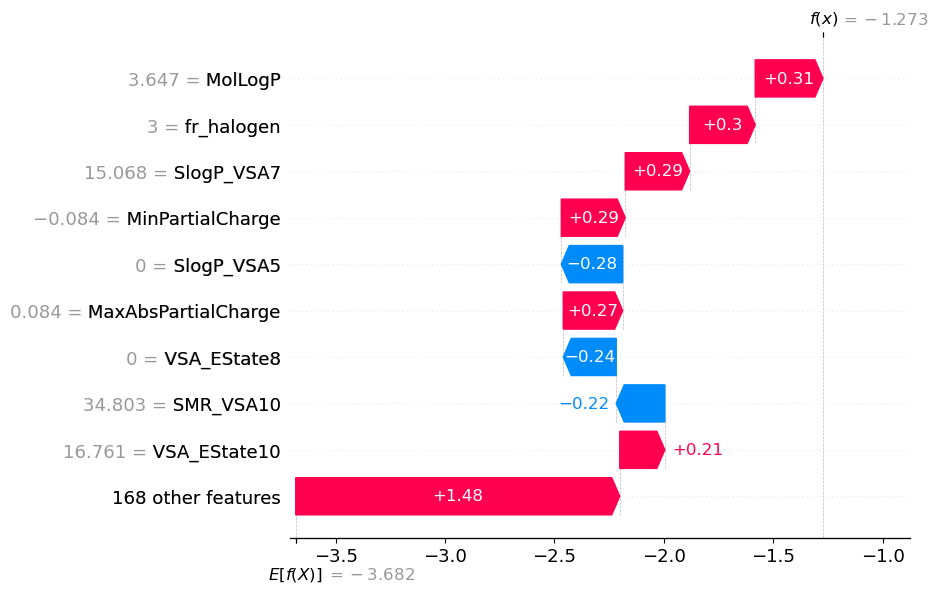
    


```python
shap.plots.beeswarm(tmp, max_display=100)
```

    No data for colormapping provided via 'c'. Parameters 'vmin', 'vmax' will be ignored


    
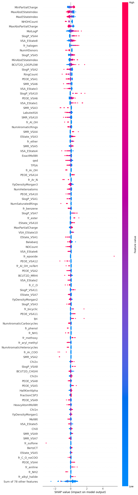
    


```python
shap.plots.beeswarm(tmp, order=tmp.abs.max(0), max_display=20)
```


    
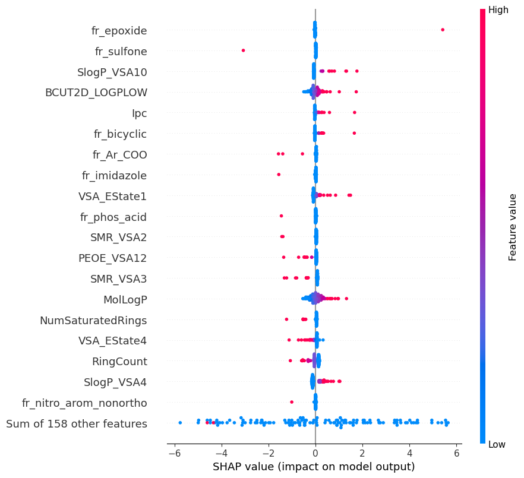
    


```python
shap.plots.beeswarm(tmp.abs, color="shap_red", max_display=20, order=tmp.abs.max(0))
```


    
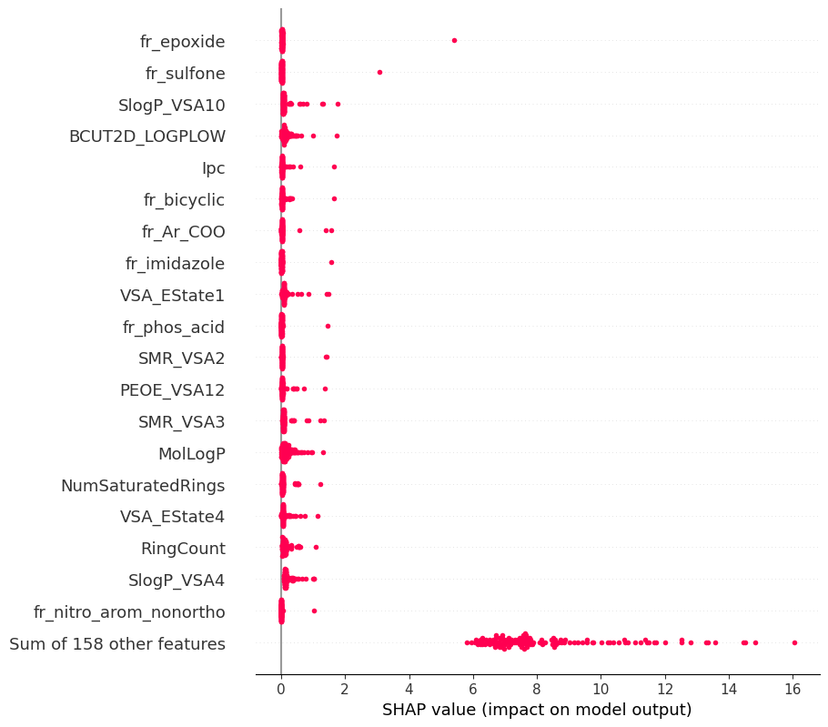
    


```python
shap.plots.beeswarm(tmp.abs, color="shap_red", max_display=20)
```


    
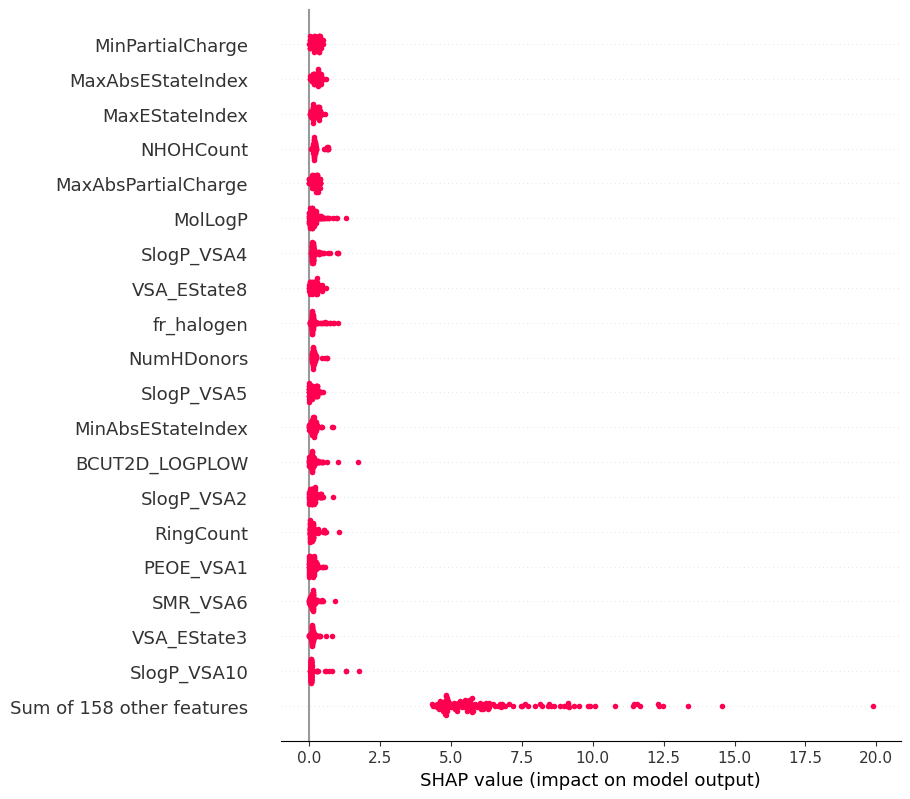
    


```python
shap.plots.bar(tmp.abs.mean(0), max_display=20)
```


    
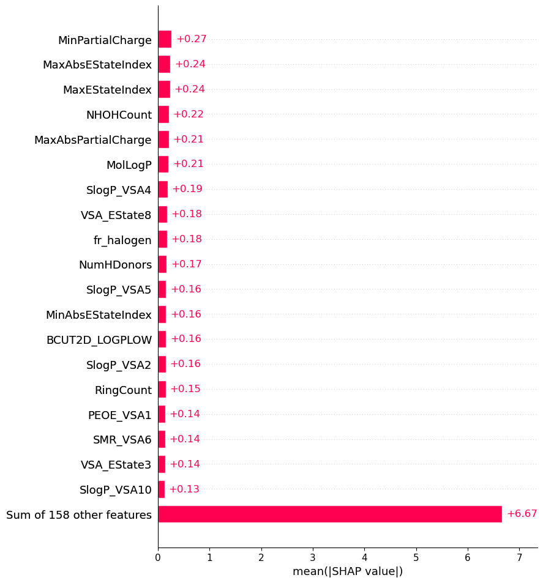
    


## Conclusion

This notebook introduced a few techniques to handle a regression problem. Here are a few more tips that may help:

- Mean squared error (MSE) (`tf.keras.losses.MeanSquaredError`) and mean absolute error (MAE) (`tf.keras.losses.MeanAbsoluteError`) are common loss functions used for regression problems. MAE is less sensitive to outliers. Different loss functions are used for classification problems.
- Similarly, evaluation metrics used for regression differ from classification.
- When numeric input data features have values with different ranges, each feature should be scaled independently to the same range.
- Overfitting is a common problem for DNN models, though it wasn't a problem for this tutorial. Visit the [Overfit and underfit](overfit_and_underfit.ipynb) tutorial for more help with this.
